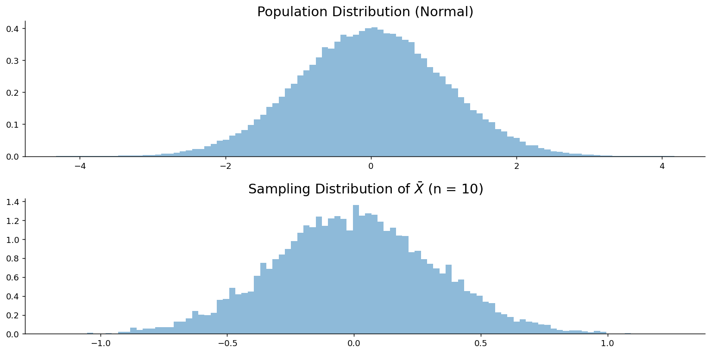

# 평균의 표본분포

## 개요

사람 25명을 뽑아 키의 평균을 냈더니 168.2가 나왔다. 다시 25명을 뽑으면 168.2가 나오지 않는다. 그렇다고 아무 값이나 나오는 것도 아니다. 이 두 문장 사이의 좁은 틈, 곧 "$\bar X$가 어디를 중심으로 얼마나 흩어져 나오는가"를 기술한 것이 **표본평균의 표본분포**다.

통계학의 표본분포 가운데 가장 중요한 것이 이것이다. $\mu$에 대한 신뢰구간도, $t$ 검정도, 응용통계학의 상당 부분도 모두 이 한 분포 위에 서 있다. 다행히 답이 간결하다. 중심은 정확히 $\mu$이고, 폭은 $\sigma/\sqrt n$이며, 모양은 대개 정규다. 앞의 둘은 조건 없이 참인데 마지막 하나에만 조건이 붙는다. 그 조건이 무엇이며 언제 없어도 되는지를 따지는 것이 이 쪽의 일이다.

## 중심과 폭은 정확하고 모양만 근사다

$X_1, X_2, \dots, X_n$을 평균 $\mu$, 분산 $\sigma^2 < \infty$인 모집단에서 뽑은 i.i.d. 표본이라 하고, 그 산술평균을 표본평균이라 하자.

$$
\bar{X} = \frac{1}{n}\sum_{i=1}^n X_i
$$

기댓값부터 본다. 기댓값은 합에 대해 선형이므로 $\mu$를 $n$번 더해 $n$으로 나눈 것이 그대로 남는다.

$$
E[\bar{X}] = \mu
$$

표본평균은 모평균의 **불편추정량**이다. 한 번 계산한 평균이 $\mu$와 같다는 뜻이 아니라, 되풀이해 얻은 값들이 $\mu$를 과대추정하지도 과소추정하지도 않는다는 뜻이다.

분산은 사정이 다르다. 독립인 것을 $n$개 더하면 분산도 $n$배가 되는데 $\bar X$는 그것을 $n^2$으로 나누므로, 남는 것은 $\sigma^2$이 아니라 $\sigma^2/n$이다.

$$
\text{Var}(\bar{X}) = \frac{\sigma^2}{n}, \qquad
\text{SE}(\bar{X}) = \frac{\sigma}{\sqrt{n}}
$$

$n$이 커질수록 표준오차가 작아진다. 표본이 클수록 $\mu$를 더 정밀하게 추정한다는 말을 수식으로 적은 것이 이 한 줄이다.

여기까지는 모집단의 모양과 아무 상관이 없다. 분산이 유한하기만 하면 조건 없이 참이다. 조건이 붙는 것은 **모양**뿐이고, 그 조건을 대 주는 것이 중심극한정리다. $n$이 충분히 크면

$$
\frac{\bar{X} - \mu}{\sigma/\sqrt{n}} \xrightarrow{d} N(0, 1)
$$

이므로 근사적으로 다음이 성립한다.

$$
\bar{X} \sim N\!\left(\mu, \frac{\sigma^2}{n}\right)
$$

$\sigma^2 < \infty$이기만 하면 모집단의 모양과 무관하게 성립한다는 것이 이 정리의 힘이다. 다만 "충분히 크면"이라는 단서가 모집단마다 다르게 읽힌다. 모집단이 **정규**라면 이야기가 아예 달라져서 **모든** $n$에 대해 근사가 아니라 정확하고, 반대로 **치우쳤거나 꼬리가 두꺼운** 모집단에서는 같은 정확도를 얻는 데 훨씬 큰 $n$이 필요하다.

## 네 가지 경우

실제로 쓰는 것은 $\bar X$ 자체가 아니라 표준화한 꼴이다. 그런데 표준화하려면 분모가 있어야 하고, 그 분모가 $\sigma/\sqrt n$인지 $S/\sqrt n$인지에 따라, 또 모집단이 정규인지 아닌지에 따라 경우가 넷으로 갈린다.

모집단이 정규이고 $\sigma$를 아는 경우가 가장 좋다.

$$
\frac{\bar{X} - \mu}{\sigma/\sqrt{n}} \sim N(0, 1)
$$

이 결과는 **정확**하며 $n$에 아무 조건이 없다. 독립인 정규확률변수의 선형결합이 다시 정규라는 성질에서 곧바로 나오므로 중심극한정리를 부를 일이 없다.

모집단은 정규인데 $\sigma$를 모른다면 표본표준편차 $S$로 바꿔 쓸 수밖에 없다. 그 순간 분모가 상수가 아니라 확률변수가 되고, 분자와 분모가 함께 흔들린다. 그래서 분포가 정규를 벗어난다.

$$
\frac{\bar{X} - \mu}{S/\sqrt{n}} \sim t_{n-1}
$$

주목할 것은 이것도 여전히 **정확**하다는 점이다. 근사로 내려앉은 것이 아니라 정확한 분포가 정규에서 $t_{n-1}$로 바뀌었을 뿐이다. $t$ 분포의 꼬리가 정규보다 두꺼운 까닭이 바로 분모의 흔들림에 있다. 모르는 $\sigma$를 아는 $S$로 바꾸는 대가를 치르는 자리가 여기이며, 5.2절의 $t$ 분포가 존재하는 이유가 정확히 이것이다.

모집단이 정규가 아니면 두 경우 모두 "정확히"가 "근사적으로"로 바뀐다. $\sigma$를 알면 $(\bar X-\mu)/(\sigma/\sqrt n)$이 근사적으로 $N(0,1)$이고, $\sigma$를 모르면 $(\bar X-\mu)/(S/\sqrt n)$이 근사적으로 $N(0,1)$ 또는 $t_{n-1}$이다. 둘 다 "$n$이 커야 한다"는 단서가 붙는데, 근사가 두 군데에서 들어오기 때문이다. $\bar X$의 모양이 정규에 가까워지는 데 $n$이 필요하고, $S$가 $\sigma$를 제대로 대신하는 데 또 $n$이 필요하다. 마지막 경우에 두 분포를 나란히 적은 것은 어느 쪽을 써도 어차피 근사이고, $n$이 크면 둘의 차이가 사라지기 때문이다.

## 표준오차 계산

<div class="probox" markdown>

**문제.** <span class="diff easy" title="쉬움"></span> 모집단이 $\mu = 100$, $\sigma = 4$이다. $n = 25$일 때:

</div>

??? success "풀이"
    $$
    \text{SE}(\bar{X}) = \frac{4}{\sqrt{25}} = 0.8
    $$

    크기 25인 표본을 반복해서 뽑으면 표본평균들이 100 주위에 모이며 전형적인 편차는 0.8이다.

## 보기

아래 여섯 보기는 위의 네 경우가 실제 문제에서 어떻게 갈리는지를 보여 준다. 셋째 보기는 표본이 다섯뿐인데도 답이 정확하고, 다섯째 보기는 같은 크기의 표본으로 아무것도 말하지 못한다. 차이를 만드는 것은 표본크기가 아니라 모집단의 모양을 아는지 여부다.

<div class="exbox" markdown>

**보기 1.** <span class="diff easy" title="쉬움"></span> 사과 무게. 사과 무게가 $N(150, 20^2)$이다. $n = 25$일 때 $P(\bar{X} > 155)$를 구하라.

</div>

??? success "풀이"

    $$
    \text{SE} = \frac{20}{\sqrt{25}} = 4, \qquad
    Z = \frac{155 - 150}{4} = 1.25
    $$

    $$
    P(\bar{X} > 155) = P(Z > 1.25) = 1 - \mathcal{N}(1.25) \approx 0.1056
    $$

    ```python
    from scipy import stats
    print(f"P(X_bar > 155) = {stats.norm.sf(1.25):.4f}")
    ```

    출력:

    ```
    P(X_bar > 155) = 0.1056
    ```

<div class="exbox" markdown>

**보기 2.** <span class="diff easy" title="쉬움"></span> 수면 시간. 평균 수면 시간이 7시간이고 $\sigma = 1.5$이다. $n = 49$일 때 $P(6.8 < \bar{X} < 7.2)$를 구하라.

</div>

??? success "풀이"

    $$
    \text{SE} = \frac{1.5}{\sqrt{49}} = 0.2143
    $$

    $$
    Z_1 = \frac{6.8 - 7}{0.2143} \approx -0.93, \qquad
    Z_2 = \frac{7.2 - 7}{0.2143} \approx 0.93
    $$

    $$
    P(6.8 < \bar{X} < 7.2) = \mathcal{N}(0.93) - \mathcal{N}(-0.93) \approx 0.6476
    $$

    ```python
    from scipy import stats
    print(f"P(6.8 < X_bar < 7.2) = {stats.norm.cdf(0.93) - stats.norm.cdf(-0.93):.4f}")
    ```

    출력:

    ```
    P(6.8 < X_bar < 7.2) = 0.6476
    ```

<div class="exbox" markdown>

**보기 3.** <span class="diff easy" title="쉬움"></span> 체중 (소표본, 정규모집단). 체중이 $N(70, 10^2)$이다. $n = 5$일 때 $P(\bar{X} > 72)$를 구하라.

</div>

??? success "풀이"
    모집단이 정규이므로 $n = 5$에서도 결과가 정확하다:

    $$
    \text{SE} = \frac{10}{\sqrt{5}} \approx 4.47, \qquad
    Z = \frac{72 - 70}{4.47} \approx 0.447
    $$

    $$
    P(\bar{X} > 72) \approx 0.3274
    $$

    ```python
    from scipy import stats
    print(f"P(X_bar > 72) = {stats.norm.sf(0.447):.4f}")
    ```

    출력:

    ```
    P(X_bar > 72) = 0.3274
    ```

<div class="exbox" markdown>

**보기 4.** <span class="diff easy" title="쉬움"></span> 물 부족. 평균 물 소비량이 2 L이고 $\sigma = 0.7$ L이다. 50명이 물 110 L를 가지고 여행할 때 물이 떨어질 확률을 구하라.

</div>

??? success "풀이"
    물이 떨어진다는 것은 $\bar{X} > 110/50 = 2.2$를 뜻한다:

    $$
    \text{SE} = \frac{0.7}{\sqrt{50}} \approx 0.0990, \qquad
    Z = \frac{2.2 - 2}{0.0990} \approx 2.020
    $$

    $$
    P(\bar{X} > 2.2) = P(Z > 2.020) \approx 0.0217
    $$

<div class="exbox" markdown>

**보기 5.** <span class="diff easy" title="쉬움"></span> 전구 (정규성 가정 없이). 전구 수명이 $\mu = 800$, $\sigma = 100$이다. $n = 5$일 때 정규성을 가정하지 않고 $P(\bar{X} > 810)$을 구하라.

</div>

??? success "풀이"
    $n = 5$이고 정규성 가정이 없으면 중심극한정리를 믿고 적용할 수 없다. 모집단 모양에 관한 추가 정보 없이는 이 확률을 **구할 수 없다**.

<div class="exbox" markdown>

**보기 6.** <span class="diff easy" title="쉬움"></span> 치우친 매출 (대표본). 일간 매출이 오른쪽으로 치우쳐 있고 $\mu = 2000$, $\sigma = 500$이다. $n = 100$일 때 $P(\bar{X} > 2100)$을 구하라.

</div>

??? success "풀이"
    모집단이 치우쳐 있지만 $n = 100$이면 중심극한정리를 쓰기에 충분히 크다:

    $$
    \text{SE} = \frac{500}{\sqrt{100}} = 50, \qquad
    Z = \frac{2100 - 2000}{50} = 2
    $$

    $$
    P(\bar{X} > 2100) = P(Z > 2) \approx 0.0228
    $$

    ```python
    from scipy import stats
    print(f"P(X_bar > 2100) = {stats.norm.sf(2):.4f}")
    ```

    출력:

    ```
    P(X_bar > 2100) = 0.0228
    ```

## 두 평균의 차

실제 질문은 평균 하나보다 **두 평균의 차이**를 묻는 경우가 많다. 새 공정이 옛 공정보다 나은가, 두 교대조의 결과가 다른가 같은 물음이다. 다행히 앞의 논의를 거의 그대로 쓸 수 있다. $\bar X_1$과 $\bar X_2$가 각각 정규이고 서로 독립이면 그 차도 정규이고, 차의 분산은 두 분산의 **합**이다.

$$
Z = \frac{(\bar{X}_1 - \bar{X}_2) - (\mu_1 - \mu_2)}{\sqrt{\sigma_1^2/n_1 + \sigma_2^2/n_2}} \sim N(0, 1)
$$

빼는데 분산이 더해진다는 점이 걸릴 수 있지만, 불확실성은 상쇄되지 않고 쌓인다고 생각하면 된다. 양쪽 모두 흔들리므로 차이는 각각보다 더 흔들린다. 이 결과는 두 모분산을 알 때 정확하고, 모르더라도 표본이 크면 근사로 쓸 수 있다. 아래 문제로 확인해 보자.

<div class="probox" markdown>

**문제.** <span class="diff easy" title="쉬움"></span> A 교대조: $\mu_A = 130$g, $\sigma_A = 4$g. B 교대조: $\mu_B = 125$g, $\sigma_B = 3$g. $n_A = n_B = 40$일 때 $P(|\bar{X}_A - \bar{X}_B| > 6)$을 구하라.

</div>

??? success "풀이"

    $$
    \text{SE} = \sqrt{\frac{16}{40} + \frac{9}{40}} = \sqrt{0.625} \approx 0.7906
    $$

    $$
    P(\bar{X}_A - \bar{X}_B > 6): \quad Z = \frac{6 - 5}{0.7906} \approx 1.265, \quad P = 0.1030
    $$

    $$
    P(\bar{X}_A - \bar{X}_B < -6): \quad Z = \frac{-6 - 5}{0.7906} \approx -13.91, \quad P \approx 0
    $$

    $$
    P(|\bar{X}_A - \bar{X}_B| > 6) \approx 0.1030
    $$

    ```python
    import numpy as np
    from scipy import stats

    se = np.sqrt(16/40 + 9/40)
    z_upper = (6 - 5) / se
    z_lower = (-6 - 5) / se
    prob = stats.norm.sf(z_upper) + stats.norm.cdf(z_lower)
    print(f"P(|X_bar_A - X_bar_B| > 6) = {prob:.4f}")
    ```

    출력:

    ```
    P(|X_bar_A - X_bar_B| > 6) = 0.1030
    ```

## 표본크기가 표준오차에 미치는 영향

지금까지 나온 모든 계산에서 표본크기는 $\sqrt n$의 꼴로만 들어왔다. 그것이 무슨 뜻인지 $\sigma = 50$인 모집단에서 값을 직접 넣어 보면 분명해진다.

| $n$ | SE ($\sigma = 50$일 때) |
|-----|------------------------|
| 25 | 10 |
| 100 | 5 |
| 400 | 2.5 |

$\text{SE} \propto 1/\sqrt{n}$이므로 $n$을 네 배로 늘려야 표준오차가 겨우 절반이 된다. 조사 비용을 네 배로 치르고 정밀도는 두 배만 얻는 셈이며, 이 맞바꿈이 표본크기를 정하는 모든 계산의 바탕에 깔려 있다. 다음 쪽에서 이 한 공식만 따로 떼어 자세히 본다.

## 모의실험

이론이 말한 것을 눈으로 확인해 보자. 표준정규 모집단에서 크기 10짜리 표본을 1만 번 뽑아 표본평균을 모은 뒤, 모집단과 나란히 그린다. 두 히스토그램의 중심은 같고 폭만 다를 것이다. 다만 그림을 볼 때 **두 패널의 가로 눈금이 다르다**는 점에 주의해야 한다. 표집분포가 워낙 좁아 같은 축에 그리면 한 점처럼 보이기 때문이다.

<div class="codebox" markdown>

### 예제 1. 표본평균의 표집분포 모의실험 { .eg }

```python
import matplotlib.pyplot as plt
import numpy as np
from scipy import stats

np.random.seed(1)

# 1단계: 모집단을 만든다. 10만 개면 사실상 무한 모집단으로 취급할 수 있다.
population = stats.norm().rvs(100_000)
sample_size = 10       # 표본 하나의 크기
n_samples = 10_000     # 표본을 몇 번 되풀이해 뽑을 것인가

# 2단계: 표본을 1만 번 뽑고 그때마다 표본평균을 기록한다.
# replace=False 는 비복원추출. 모집단이 10만이고 표본이 10이라
# 복원이든 비복원이든 결과에 거의 차이가 없다.
#
# 현실에서는 표본을 한 번만 뽑으므로 표본평균도 하나뿐이다.
# 이 반복은 "만약 다시 뽑는다면 얼마가 나올까"를 눈으로 보기 위한 장치이며,
# 그렇게 만들어진 분포가 곧 **표집분포**다.
sample_means = [
    np.mean(np.random.choice(population, size=sample_size, replace=False))
    for _ in range(n_samples)
]

# 위아래 두 패널로 나눈다. 위는 모집단, 아래는 통계량의 표집분포다.
# 둘의 **가로 눈금이 다르다**는 점에 주의하라.
# 표집분포가 훨씬 좁으므로 같은 축에 그리면 한 점처럼 보인다.
fig, (ax0, ax1) = plt.subplots(2, 1, figsize=(12, 6))

ax0.hist(population, bins=100, density=True, alpha=0.5)
ax0.set_title('Population Distribution (Normal)', fontsize=16)

ax1.hist(sample_means, bins=100, density=True, alpha=0.5)
ax1.set_title(rf'Sampling Distribution of $\bar{{X}}$ (n = {sample_size})', fontsize=16)

for ax in (ax0, ax1):
    ax.spines['top'].set_visible(False)
    ax.spines['right'].set_visible(False)

plt.tight_layout()
plt.show()
```



</div>

## 더 파고들 세 갈래

여기까지가 이 쪽의 본문이고, 더 멀리 가려는 독자를 위해 세 갈래를 적어 둔다.

첫째는 $\bar X$가 얼마나 좋은 추정량인가 하는 물음이다. $\text{Var}(\bar{X}) = \sigma^2/n$이라는 값이 사실은 더 낮출 수 없는 값이며, 정규성 아래에서 $\bar X$는 크라메르-라오 하한을 달성한다. 연습문제 10에서 선형불편추정량 가운데 최소분산임을 직접 보인다.

둘째는 중심극한정리가 통하지 않는 경우다. **분산이 무한한** 모집단, 이를테면 코시분포에서는 정리의 전제가 깨지므로 $\bar{X}$가 수렴하지 않을 수 있다. 이 쪽의 결론 전부가 $\sigma^2 < \infty$라는 한 줄에 매달려 있다는 뜻이다.

셋째는 "$n$이 얼마나 커야 하는가"에 답을 주는 **베리-에세인 정리**다. $\rho = E[|X - \mu|^3]$이라 할 때 정규근사의 오차가 $\sup_z |P(Z_n \leq z) - \mathcal{N}(z)| \leq C \cdot \rho / (\sigma^3 \sqrt{n})$로 억제된다. 분자에 3차적률이 있다는 것은 모집단이 치우칠수록 같은 정확도에 더 큰 $n$이 필요하다는 뜻이며, 5.4절 이후의 모의실험이 보여 줄 것이 바로 그 차이다.

## 연습문제

<div class="drillbox" markdown>

**연습문제 1.** <span class="diff easy" title="쉬움"></span>
**표본평균의 평균과 표준오차.** $\mu = 75$, $\sigma = 18$인 모집단에서 $n = 9$인 표본을 뽑는다. (a) $\mathbb{E}[\bar X]$, (b) $\mathrm{SE}(\bar X)$를 계산하라.

</div>

??? success "풀이"
    (a) $\mathbb{E}[\bar X] = \mu = 75$. 표본평균은 $n$과 무관하게 불편이다.

    (b) $\mathrm{SE}(\bar X) = \sigma/\sqrt n = 18/3 = 6$. $n$을 네 배인 36으로 늘리면 표준오차가 절반인 3이 된다.

<div class="drillbox" markdown>

**연습문제 2.** <span class="diff easy" title="쉬움"></span>
사과 무게가 $\mu = 150$ g, $\sigma = 20$ g인 정규분포를 따른다. $n = 25$인 표본에 대해 $P(\bar X > 155)$를 계산하라.

</div>

??? success "풀이"
    $\mathrm{SE} = 20/\sqrt{25} = 4$. $Z = (155 - 150)/4 = 1.25$.

    $P(\bar X > 155) = 1 - \Phi(1.25) = 0.1056$으로 약 10.6%이다.

    참고: 모집단의 정규성이 주어졌으므로 $\bar X$는 어떤 $n$에 대해서도 정확히 정규분포이다. 중심극한정리가 필요 없다.

<div class="drillbox" markdown>

**연습문제 3.** <span class="diff easy" title="쉬움"></span>
학생들의 수면 시간이 $\mu = 7$시간, $\sigma = 1.5$시간이다. $n = 49$인 표본에 대해 $P(6.8 < \bar X < 7.2)$를 계산하라.

</div>

??? success "풀이"
    $\mathrm{SE} = 1.5/7 \approx 0.214$.

    $Z_1 = (6.8 - 7)/0.214 \approx -0.93$. $Z_2 = (7.2 - 7)/0.214 \approx 0.93$.

    $P(6.8 < \bar X < 7.2) = \Phi(0.93) - \Phi(-0.93) = 0.6476$으로 약 64.8%이다.

    ($n = 49 \ge 30$으로 정당화되는) 중심극한정리에 의해, 개별 수면 시간이 정규가 아니더라도 $\bar X$는 근사적으로 정규분포이다.

<div class="drillbox" markdown>

**연습문제 4.** <span class="diff easy" title="쉬움"></span>
**소표본, 정규모집단.** 체중이 $X \sim N(70, 100)$ kg이다. $n = 5$인 표본에 대해 $P(\bar X > 72)$를 계산하라. $n$이 작은데도 왜 타당한가?

</div>

??? success "풀이"
    $\mathrm{SE} = 10/\sqrt 5 \approx 4.47$. $Z = (72 - 70)/4.47 \approx 0.447$.

    $P(\bar X > 72) = 1 - \Phi(0.447) \approx 0.327$로 약 32.7%이다.

    **타당성:** *모집단*이 정규이므로 $\bar X = (1/n)\sum X_i$는 어떤 $n$에 대해서도 *정확히* 정규분포이다(독립인 정규확률변수의 합은 정규분포이다). 중심극한정리가 필요 없으며 결과가 정확하다.

    정규성이 주어지지 않은 경우인 아래 **연습문제 5**와 대비된다.

<div class="drillbox" markdown>

**연습문제 5.** <span class="diff med" title="중간"></span>
**정규성 없는 전구.** 수명이 $\mu = 800$시간, $\sigma = 100$시간이고 분포는 알려져 있지 않다. $n = 5$인 표본에 대해 $P(\bar X > 810)$에 관해 무엇을 말할 수 있는가?

</div>

??? success "풀이"
    $\mathrm{SE} = 100/\sqrt 5 \approx 44.7$. 그대로 계산하면 $Z = 10/44.7 \approx 0.224$이므로 $P \approx 0.41$이다.

    **그러나:** $n = 5$는 중심극한정리를 쓰기에 너무 작고 모집단의 모양도 알려져 있지 않다. $\bar X$의 표본분포는 심하게 치우쳤거나(예: 수명이 지수분포일 때) 꼬리가 두꺼울 수 있다. 정규근사가 크게 빗나갈 수 있다.

    **Chebyshev 부등식을 이용한 보수적 한계:** $P(|\bar X - 800| \ge 10) \le \sigma^2/(n \cdot 10^2) = 10000/(5 \cdot 100) = 20$으로 아무 정보도 주지 못한다.

    실용적 결론: 분포 가정이 없거나 $n$이 더 크지 않으면 점 추정값을 포기하고 보수적 한계만 보고해야 한다. 실제 전구 수명은 흔히 와이불분포를 따르며, 이를 가정하면 정확한 계산이 가능하다.

<div class="drillbox" markdown>

**연습문제 6.** <span class="diff easy" title="쉬움"></span>
**치우친 모집단 + 큰 $n$.** 일간 매출이 오른쪽으로 치우쳐 있고 $\mu = \$2000$, $\sigma = \$500$이다. $n = 100$인 표본에 대해 $P(\bar X > \$2100)$을 계산하라.

</div>

??? success "풀이"
    $\mathrm{SE} = 500/10 = 50$. $Z = (2100 - 2000)/50 = 2$.

    $P(\bar X > 2100) = 1 - \Phi(2) = 0.0228$로 약 2.3%이다.

    **왜 타당한가:** $n = 100$은 크므로 중심극한정리에 의해 모집단 모양과 무관하게 $\bar X$가 근사적으로 정규분포이다. 이 $n$에서는 모집단의 치우침이 $\bar X$의 분포와 무관하다.

    **주의:** 모집단의 치우침이 심하면(예: $\sigma_{\log} > 1$인 로그정규) $n = 100$에서도 $\bar X$에 치우침이 남을 수 있다. Berry-Esseen 한계에 따르면 정규근사의 오차는 $\sim \mathbb{E}|X|^3/(\sigma^3 \sqrt n)$이다. 약간 치우친 매출 자료라면 $n = 100$으로 충분하지만, 오른쪽으로 심하게 치우친 자료에서는 더 큰 $n$이나 붓스트랩이 안전하다.

<div class="drillbox" markdown>

**연습문제 7.** <span class="diff easy" title="쉬움"></span>
**표본평균이 48과 52 사이일 확률.**
평균 50, 표준편차 12인 모집단에서 크기 36인 표본을 뽑을 때 표본평균이 48과 52 사이일 확률은?

</div>

??? success "풀이"
    $$\sigma_{\bar{X}} = \frac{12}{\sqrt{36}} = 2, \qquad Z_1 = -1, \quad Z_2 = 1$$

    $$P(48 < \bar{X} < 52) = \Phi(1) - \Phi(-1) = 0.6827$$

    약 **68.27%**이다. 정규분포에서 $\pm 1$ 표준편차 구간의 확률이라는 익숙한 값이다.

<div class="drillbox" markdown>

**연습문제 8.** <span class="diff med" title="중간"></span>
독립인 두 표본에서 $n_1=40$, $\bar x_1 = 52.4$, $s_1 = 8.2$와 $n_2=35$, $\bar x_2 = 48.9$, $s_2 = 7.1$을 얻었다. 등분산을 가정한 합동 $t$ 검정으로 두 평균이 같은지 유의수준 5%에서 판정하고 차의 95% 신뢰구간을 구하라.

</div>

??? success "풀이"
    **합동분산.**

    $$
    s_p^2 = \frac{(n_1-1)s_1^2+(n_2-1)s_2^2}{n_1+n_2-2} = \frac{39(67.24)+34(50.41)}{73} = 59.40
    $$

    이므로 $s_p = 7.707$이다. 자유도 두 몫을 표본크기로 가중평균한 값임에 유의한다.

    **표준오차.**

    $$
    \operatorname{SE}(\bar X_1-\bar X_2) = s_p\sqrt{\frac{1}{n_1}+\frac{1}{n_2}} = 7.707\sqrt{\frac{1}{40}+\frac{1}{35}} = 1.784
    $$

    **검정.**

    $$
    t = \frac{52.4-48.9}{1.784} = 1.962, \qquad \text{자유도 } 73
    $$

    임계값이 $t_{0.975,73} = 1.993$이고 $1.962 < 1.993$이므로 기각하지 **못한다.** p-값은 0.0536으로 0.05를 간발의 차로 넘는다.

    **신뢰구간.**

    $$
    3.5 \pm 1.993\times1.784 = 3.5 \pm 3.555 = (-0.055,\ 7.055)
    $$

    0을 아슬아슬하게 담고 있어 검정과 일치한다.

    p-값이 0.0536이라는 것은 "차이가 없다"는 증거가 아니라 **판단을 유보해야 한다**는 뜻이다. 신뢰구간을 보면 실제 차이가 0에 가까울 수도 7에 가까울 수도 있어 정보가 부족하다. 0.05를 넘었는지만 보고 "효과 없음"으로 결론짓는 것이 흔한 오류다.

<div class="drillbox" markdown>

**연습문제 9.** <span class="diff med" title="중간"></span>
연습문제 8을 등분산 가정 없이 웰치 검정으로 다시 하라. 결과가 어떻게 달라지는가? 어느 쪽을 기본으로 써야 하는가?

</div>

??? success "풀이"
    **표준오차.** 합동하지 않고 각 표본의 분산을 그대로 쓴다.

    $$
    \operatorname{SE} = \sqrt{\frac{s_1^2}{n_1}+\frac{s_2^2}{n_2}} = \sqrt{\frac{67.24}{40}+\frac{50.41}{35}} = \sqrt{1.681+1.440} = 1.767
    $$

    **자유도.** 웰치-새터스웨이트 공식으로

    $$
    \nu = \frac{(1.681+1.440)^2}{\dfrac{1.681^2}{39}+\dfrac{1.440^2}{34}} = 73.0
    $$

    **검정.** $t = 3.5/1.767 = 1.981$, 자유도 73.0이다. 임계값이 같은 1.993이므로 여전히 기각하지 못한다. p-값은 0.0514다.

    **차이가 거의 없다.** 두 표본크기가 비슷하고($40$ 대 $35$) 두 분산도 비슷해서($67.2$ 대 $50.4$) 합동하든 안 하든 결과가 같다.

    **어느 쪽을 기본으로?** **웰치를 기본으로 쓴다.** 이유는 이렇다.

    - 등분산이 참이면 웰치는 합동 검정에 견주어 잃는 것이 거의 없다. 자유도를 조금 잃을 뿐이다.
    - 등분산이 거짓이면 합동 검정은 **제1종 오류율이 심하게 어긋난다.** 특히 표본크기가 다르고 큰 표본 쪽의 분산이 작을 때 오류율이 명목 5%의 두 배를 넘기도 한다.
    - "먼저 등분산 검정을 하고 결과에 따라 고른다"는 이단계 절차는 오히려 나쁘다. 사전 검정의 오류가 뒤의 검정으로 전파되어 전체 오류율이 통제되지 않는다.

    R의 `t.test`와 SciPy의 `ttest_ind(equal_var=False)`가 기본값으로 웰치를 쓰는 것이 이 권고를 반영한 것이다.

<div class="drillbox" markdown>

**연습문제 10.** <span class="diff hard" title="어려움"></span>
$\bar X$가 $\mu$의 **선형불편추정량 가운데 최소분산**임을 보여라. 즉 $\sum_i a_i = 1$인 모든 $\{a_i\}$에 대해 $\operatorname{Var}(\sum_i a_iX_i) \ge \operatorname{Var}(\bar X)$임을 증명하라. 이 결과에 정규성이 필요한가?

</div>

??? success "풀이"
    $\hat\mu = \sum_i a_iX_i$라 하면 불편성은 $E[\hat\mu] = \mu\sum_i a_i = \mu$, 즉 $\sum_i a_i = 1$과 같다. 독립이므로

    $$
    \operatorname{Var}(\hat\mu) = \sigma^2\sum_i a_i^2
    $$

    이다. 따라서 $\sum a_i = 1$ 아래에서 $\sum a_i^2$을 최소로 하면 된다.

    **코시-슈바르츠로.** $(\sum_i a_i\cdot1)^2 \le (\sum_i a_i^2)(\sum_i 1^2)$이므로

    $$
    1 \le n\sum_i a_i^2 \implies \sum_i a_i^2 \ge \frac1n
    $$

    이고 등호는 $a_i$가 모두 같을 때, 즉 $a_i = 1/n$일 때만 성립한다. 그때 $\operatorname{Var} = \sigma^2/n$이다. $\square$

    **다른 증명.** $a_i = 1/n + d_i$로 두면 $\sum d_i = 0$이고

    $$
    \sum_i a_i^2 = \sum_i\left(\frac1n+d_i\right)^2 = \frac1n + \frac2n\underbrace{\sum_i d_i}_{0} + \sum_i d_i^2 = \frac1n + \sum_i d_i^2 \ge \frac1n
    $$

    으로 곧바로 나온다.

    **정규성은 필요 없다.** 쓴 것은 $E[X_i]=\mu$, $\operatorname{Var}(X_i)=\sigma^2$, 그리고 무상관성(공분산 0)뿐이다. **독립일 필요조차 없고 무상관이면 충분하다.** 이 점에서 가우스-마르코프 정리와 같은 성격이며, 실제로 이 결과는 가우스-마르코프의 가장 단순한 경우다.

    **범위의 한계.** "선형"과 "불편"이라는 두 제약을 걸었다는 점이 중요하다.

    - 제약을 풀면 더 나은 추정량이 있을 수 있다. 꼬리가 두꺼운 모집단에서 절사평균이나 중앙값이 $\bar X$보다 분산이 작다(비선형이라 이 정리를 비껴간다).
    - 불편성을 포기하면 평균제곱오차가 더 작은 추정량이 있다. 3차원 이상에서 여러 평균을 동시에 추정할 때 제임스-스타인 추정량이 $\bar X$를 일률적으로 이긴다는 사실이 유명하다.
    - 모집단이 **정규**라면 $\bar X$는 선형이 아닌 추정량까지 통틀어 최소분산불편추정량이다(완비충분통계량의 함수이므로). 정규성은 결론을 "선형" 제약 없이 확장하는 데 쓰인다.

---

## 정리하며

표본평균의 표본분포는 세 가지로 요약된다. 중심은 $E[\bar{X}] = \mu$이고, 폭은 $\text{Var}(\bar{X}) = \sigma^2/n$에서 나온 $\text{SE}(\bar{X}) = \sigma/\sqrt{n}$이며, 모양은 정규다. 앞의 둘은 모집단이 무엇이든 조건 없이 참이고, 마지막 하나만 조건이 붙는다. 모집단이 정규이면 모든 $n$에서 정확하고, 그렇지 않으면 $n$이 커야 중심극한정리로 근사된다.

한 문장으로 줄이면 **$n$이 클수록 표준오차가 작고 그만큼 추정이 정밀하다**는 것이지만, 이 쪽에서 정작 새로 배운 것은 그 뒤에 붙는 단서들이다. $\sigma$를 알면 분포가 정규이고 모르면 $t_{n-1}$이다. 모집단이 정규이면 결과가 정확하고 아니면 근사다. 이 두 갈래가 곱해져 네 경우가 나왔고, 앞으로 만날 거의 모든 추론 절차가 그중 한 칸에 속한다.

이어지는 쪽들에서 이 결과를 확인한다. 먼저 **$\bar X$의 표준오차**를 표본크기와 함께 자세히 보고, 그다음 네 모집단(균등·지수·정규·베르누이)에서 표본분포를 직접 모의실험한다. 중심극한정리가 모집단 모양을 가리지 않는다는 것과, 치우칠수록 수렴이 느리다는 것을 눈으로 확인하게 된다.
