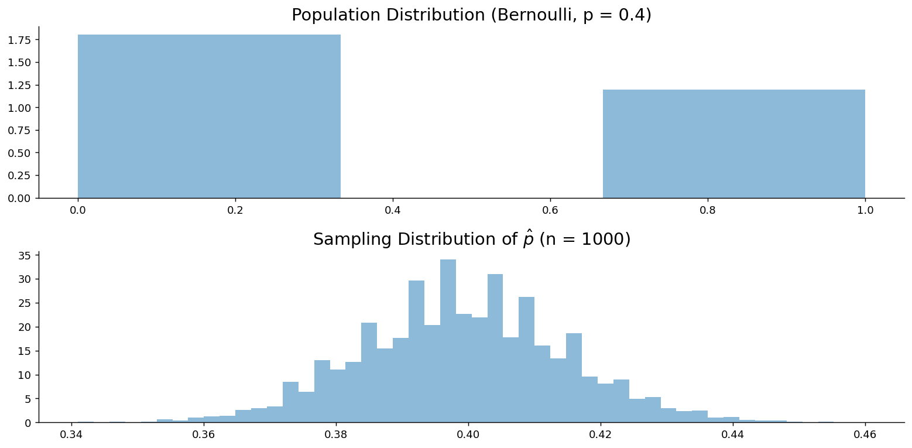

# 비율의 표본분포

## 개요

출구조사에서 1200명에게 물어 624명이 A 후보를 택했다면 표본비율은 0.52다. 이 숫자 하나로 "A 후보가 앞선다"고 말해도 되는가. 같은 방식으로 1200명을 다시 뽑으면 0.52가 아니라 0.49나 0.55가 나올 텐데, 그 흔들림의 크기를 모르면 아무 말도 할 수 없다.

**표본비율 $\hat{p}$의 표본분포**가 바로 그 흔들림을 기술한다. 이항 모집단에서 표본을 되풀이해 뽑을 때 성공 비율이 어떻게 달라지는지를 말해 주며, 모비율에 관한 추론은 예외 없이 그 위에 서 있다. 여론조사, 품질관리, 임상시험, A/B 테스트가 모두 같은 이론을 쓴다.

앞 쪽에서 본 대로 $\hat{p}$은 0과 1로 이루어진 자료의 표본평균이다. 그러니 새로운 이론이 필요하지 않다. 이 쪽에서는 그 사실을 정리하고, 이어서 정규근사가 어디까지 믿을 만한지를 소표본 계산으로 확인한다.

## 비율은 0과 1의 평균이다

$X_1, \dots, X_n$을 i.i.d. $\text{Bernoulli}(p)$라 하자. 여기서 $X_i = 1$은 성공, $X_i = 0$은 실패를 뜻한다. 표본비율은 이 값들의 평균이다.

$$
\hat{p} = \frac{1}{n}\sum_{i=1}^n X_i = \frac{\text{number of successes}}{n}
$$

성공에 1을, 실패에 0을 적어 두었으므로 합 $\sum X_i$는 성공한 횟수이고, 그것을 $n$으로 나눈 값이 곧 성공 비율이다. 이름은 표본비율이지만 계산하는 방식으로 보면 표본평균이며, 그래서 $\bar{X}$에 대해 아는 것이 그대로 옮겨 온다.

먼저 중심이다. $\hat{p}$은 모비율의 **불편추정량**이다.

$$
E[\hat{p}] = p
$$

한 번의 조사가 맞는다는 뜻이 아니라, 되풀이해 얻은 값들이 한쪽으로 치우쳐 빗나가지는 않는다는 뜻이다.

다음은 퍼짐이다. $\text{Var}(X_i) = p(1-p)$이고 관측값들이 독립이므로

$$
\text{Var}(\hat{p}) = \frac{p(1-p)}{n}, \qquad
\text{SE}(\hat{p}) = \sqrt{\frac{p(1-p)}{n}}
$$

이다. 표본을 늘리면 표준오차가 $1/\sqrt{n}$의 속도로 줄어드는 것은 평균과 같다. 그러나 분자가 다르고, 그 차이가 이 쪽에서 가장 중요한 대목이다.

!!! note
    $\text{SE}(\bar{X}) = \sigma/\sqrt{n}$과 달리 $\hat{p}$의 표준오차는 모수 $p$ 자체에 의존한다. 실무에서는 $p$를 모르므로 $\hat{p}$로 대체한다:

    $$
    \widehat{\text{SE}}(\hat{p}) = \sqrt{\frac{\hat{p}(1-\hat{p})}{n}}
    $$

마지막으로 모양이다. 중심극한정리는 모집단이 어떻게 생겼는지 묻지 않으므로 값이 둘뿐인 베르누이에도 그대로 적용된다. $n$이 충분히 크면

$$
\frac{\hat{p} - p}{\sqrt{p(1-p)/n}} \xrightarrow{d} N(0, 1)
$$

이다. "충분히 크면"을 가늠할 때 쓰는 것이 다음 **느슨한 기준**이다.

$$
np \geq 5 \quad \text{and} \quad n(1-p) \geq 5
$$

표본크기 $n$이 아니라 $np$와 $n(1-p)$를 보는 데에는 까닭이 있다. 수렴을 늦추는 것은 작은 $n$이 아니라 치우침이며, $p$가 0이나 1에 가까우면 $n$이 꽤 커도 성공(또는 실패)이 몇 건밖에 없어 분포가 한쪽으로 쏠린다. 이 조건은 성공 횟수와 실패 횟수가 **둘 다** 종 모양 근사를 쓰기에 충분히 크도록 보장한다. 문턱값 5가 보장하는 것은 여기까지, 곧 **모양**이다. 이 페이지에서 하는 일이 $P(\hat p > 0.65)$ 같은 확률 계산이므로 이 기준이면 족하다. 신뢰구간의 포함률이나 검정의 오류율까지 명목값에 맞추려면 문턱값을 10으로 올린 보수적 기준을 써야 하며, 두 기준의 근거는 [이항분포의 정규근사](../../ch04/discrete_distributions/binomial.md#언제-쓸-수-있는가-5와-10)에 정리해 두었다.

## 표준오차를 숫자로 재어 보면

공식을 한 번 써 보면 표준오차가 실제로 어느 정도 크기인지 감이 잡힌다.

<div class="probox" markdown>

**문제.** <span class="diff easy" title="쉬움"></span> 참 비율이 $p = 0.4$이고 표본크기가 $n = 100$이다.

</div>

??? success "풀이"
    $$
    \text{SE}(\hat{p}) = \sqrt{\frac{0.4 \times 0.6}{100}} = \sqrt{0.0024} \approx 0.049
    $$

    크기 100인 표본을 반복해서 뽑으면 $\hat{p}$는 참값 $p = 0.4$ 주위로 대체로 0.049 정도 달라진다.

## 근사가 잘 듣는 경우와 그렇지 않은 경우

아래 두 보기는 같은 계산을 표본크기만 바꿔 되풀이한 것이다. 첫째 보기는 느슨한 기준을 넉넉히 만족하는 $n = 100$이고, 둘째 보기는 $np = 3$으로 그 기준마저 깨지는 $n = 10$이다. 정확한 이항 계산과 견주어 보면 근사가 어디서 벌어지기 시작하는지 알 수 있다.

<div class="exbox" markdown>

**보기 1.** <span class="diff easy" title="쉬움"></span> 브랜드 선호. 어떤 모집단에서 60%가 브랜드 A를 선호한다. $n = 100$일 때 $P(\hat{p} > 0.65)$를 구하라.

</div>

??? success "풀이"

    $$
    \text{SE} = \sqrt{\frac{0.60 \times 0.40}{100}} \approx 0.049
    $$

    $$
    Z = \frac{0.65 - 0.60}{0.049} \approx 1.02
    $$

    $$
    P(\hat{p} > 0.65) = P(Z > 1.02) \approx 0.154
    $$

    ```python
    from scipy import stats
    print(f"P(p_hat > 0.65) = {stats.norm.sf(1.02):.4f}")
    ```

    출력:

    ```
    P(p_hat > 0.65) = 0.1539
    ```
<div class="exbox" markdown>

**보기 2.** <span class="diff easy" title="쉬움"></span> 소표본 — 정확값과 근사값. 어떤 도시에서 30%가 대중교통을 선호한다. $n = 10$일 때 $P(\hat{p} > 0.35)$를 구하라.

</div>

??? success "풀이"
    **정확한 이항 계산.** $\hat{p} > 0.35$는 $X \geq 4$를 뜻하며 여기서 $X \sim \text{Binomial}(10, 0.3)$이다:

    $$
    P(X \geq 4) = 1 - P(X \leq 3)
    $$

    $$
    P(X = 0) = 0.0282, \quad P(X = 1) = 0.1211, \quad P(X = 2) = 0.2335, \quad P(X = 3) = 0.2668
    $$

    $$
    P(X \geq 4) = 1 - 0.6496 = 0.3504
    $$

    **정규근사.** 조건을 확인하면 $np = 3 < 5$이므로 정규근사가 미덥지 않다.

    $$
    \text{SE} = \sqrt{\frac{0.3 \times 0.7}{10}} \approx 0.1449, \qquad
    Z = \frac{0.35 - 0.30}{0.1449} \approx 0.345
    $$

    $$
    P(\hat{p} > 0.35) \approx P(Z > 0.345) \approx 0.365
    $$

    **비교:**

    | 방법 | 결과 |
    |--------|--------|
    | 정확한 binomial | 0.3504 |
    | 정규근사 | 0.3650 |

    표본이 작은데도 근사가 꽤 가깝지만, $np < 5$일 때는 정확한 binomial 계산이 낫다.

    ```python
    from scipy import stats

    # 정확한 값: 이항분포에서 바로 구한다.
    exact = 1 - stats.binom(n=10, p=0.3).cdf(3)
    print(f"Exact: {exact:.4f}")

    # 정규근사로 구한 값. 둘을 견준다.
    approx = stats.norm.sf(0.345)
    print(f"Normal approx: {approx:.4f}")
    ```

    출력:

    ```
    Exact: 0.3504
    Normal approx: 0.3650
    ```

한 비율을 재는 일보다 두 비율을 **견주는** 일이 실무에서는 더 흔하다. 처리군과 대조군, A안과 B안이 그렇다. 그 경우는 5.8절에서 따로 다룬다. 두 표본이 독립이면 차 $\hat p_1 - \hat p_2$도 근사적으로 정규이고 분산이 더해진다는 것이 출발점이며, 거기서 **같은 자료를 놓고도 신뢰구간과 검정이 서로 다른 표준오차를 쓰게 되는** 까닭이 드러난다.

---

## 모의실험: p-hat의 표본분포

아래 코드는 이 쪽의 주장을 그림 한 장으로 요약한다. 위 패널에는 막대 두 개뿐인 베르누이 모집단을, 아래 패널에는 거기서 크기 1000인 표본을 1만 번 뽑아 얻은 $\hat{p}$의 분포를 그린다.

<div class="codebox" markdown>

### 예제 1. 표본비율의 표집분포 모의실험 { .eg }

```python
import matplotlib.pyplot as plt
import numpy as np
from scipy import stats

np.random.seed(1)

# 모집단은 0과 1 두 값뿐인 베르누이다. binom(n=1)이 곧 베르누이다.
population = stats.binom(n=1, p=0.4).rvs(100_000)
sample_size = 1_000
n_samples = 10_000

# 0/1 자료의 평균이 곧 비율이다. 그래서 p-hat 은 특별한 통계량이 아니라
# **표본평균의 한 경우**이며, 중심극한정리가 그대로 적용된다.
sample_proportions = [
    np.mean(np.random.choice(population, size=sample_size, replace=False))
    for _ in range(n_samples)
]

# 이 그림의 요점은 위아래의 **모양 차이**다.
# 모집단은 막대 두 개뿐인 가장 극단적인 비정규 분포인데,
# 표본비율의 표집분포는 매끄러운 종 모양이 된다.
fig, (ax0, ax1) = plt.subplots(2, 1, figsize=(12, 6))

# bins=3 인 이유: 값이 0과 1뿐이라 구간을 잘게 나눌 필요가 없다.
ax0.hist(population, bins=3, density=True, alpha=0.5)
ax0.set_title('Population Distribution (Bernoulli, p = 0.4)', fontsize=16)

ax1.hist(sample_proportions, bins=50, density=True, alpha=0.5)
ax1.set_title(rf'Sampling Distribution of $\hat{{p}}$ (n = {sample_size})', fontsize=16)

for ax in (ax0, ax1):
    ax.spines['top'].set_visible(False)
    ax.spines['right'].set_visible(False)

plt.tight_layout()
plt.show()
```



</div>

## 근사를 버려야 할 때

표본이 작거나 비율이 극단적이면, 곧 $p$가 0이나 1에 가까우면 정규근사를 쓰지 말고 **이항분포**를 직접 써야 한다. 신뢰구간도 마찬가지다. 가장 먼저 배우는 왈드 구간 $\hat{p} \pm z^* \cdot \widehat{\text{SE}}$는 계산이 간단한 대신 그런 상황에서 실제 포함확률이 명목 수준에서 크게 벗어난다.

그래서 대체로 선호되는 것이 **Wilson 구간**이다. $n$이 작거나 $p$가 극단적일 때 포함확률 성질이 왈드보다 훨씬 좋다. 더 간단한 처방을 원한다면 **Agresti–Coull 구간**이 있다. 왈드 공식을 계산하기 전에 가상의 성공 2회와 실패 2회를 자료에 더해 놓는 것이 전부인데, 그 한 줄만으로 포함확률이 눈에 띄게 개선된다.

## 연습문제

<div class="drillbox" markdown>

**연습문제 1.** <span class="diff easy" title="쉬움"></span>
모집단의 $p = 0.60$이고 표본 $n = 100$이다. $P(\hat p > 0.65)$를 계산하라.

</div>

??? success "풀이"
    $\mathrm{SE}(\hat p) = \sqrt{p(1-p)/n} = \sqrt{0.24/100} \approx 0.049$. $Z = (0.65 - 0.60)/0.049 \approx 1.02$.

    $P(\hat p > 0.65) = 1 - \Phi(1.02) \approx 0.154$로 약 15.4%이다.

    조건: $np = 60 \ge 5$이고 $n(1-p) = 40 \ge 5$이므로 확률 하나를 어림하는 데에는 느슨한 기준으로 충분하다.

<div class="drillbox" markdown>

**연습문제 2.** <span class="diff med" title="중간"></span>
**소표본의 문제.** 모집단의 $p = 0.30$이고 표본 $n = 10$이다. $P(\hat p > 0.35)$를 정확한 방법과 정규근사로 각각 계산하라. 여기서 정규근사가 통하는지 아니면 실패하는지 이유를 설명하라.

</div>

??? success "풀이"
    정확한 계산: $\hat p > 0.35$ ⟺ $X \ge 4$이며 $X \sim \mathrm{Binomial}(10, 0.3)$이다.

    $P(X < 4) = P(X = 0,1,2,3) = 0.028 + 0.121 + 0.233 + 0.267 = 0.650$이므로 $P(X \ge 4) = 0.350$이다.

    정규근사: $\mathrm{SE} = \sqrt{0.21/10} \approx 0.145$. $Z = 0.05/0.145 \approx 0.345$. $P(Z > 0.345) \approx 0.365$.

    차이: 정확값 0.350 대 정규근사 0.365로 약 1.5퍼센트포인트 차이가 난다. ($p = 0.3$에서 binomial이 그리 심하게 치우쳐 있지 않아) 정규근사가 그런대로 통하지만, $np = 3$이 작아 느슨한 기준($np \ge 5$)조차 채우지 못한다. 정확도를 높이려면 연속성 수정을 적용하거나 정확한 binomial을 사용하라.

<div class="drillbox" markdown>

**연습문제 3.** <span class="diff med" title="중간"></span>
**$\hat p$의 불편성을 증명하고 표준오차를 구하라.** $\mathbb{E}[\hat p] = p$이고 $\mathrm{Var}(\hat p) = p(1-p)/n$임을 보여라.

</div>

??? success "풀이"
    $X_i \sim \mathrm{Bernoulli}(p)$가 i.i.d.일 때 $X = \sum X_i$에 대해 $\hat p = X/n$이다.

    $\mathbb{E}[\hat p] = \mathbb{E}[X]/n = np/n = p$로 불편이다.

    $\mathrm{Var}(\hat p) = \mathrm{Var}(X)/n^2 = np(1-p)/n^2 = p(1-p)/n$.

    $\mathrm{SE}(\hat p) = \sqrt{p(1-p)/n}$.

    $\square$

    표준오차는 $p = 1/2$에서 최대가 된다(최악의 경우). $p = 1/2$일 때 $\mathrm{SE} = 1/(2\sqrt n)$이다.

<div class="drillbox" markdown>

**연습문제 4.** <span class="diff med" title="중간"></span>
**표본크기 설계.** $p$를 모를 때 95% 신뢰수준에서 오차한계 $\pm 3$퍼센트포인트로 $p$를 추정하려면 표본크기가 얼마여야 하는가?

</div>

??? success "풀이"
    오차한계: $\mathrm{ME} = z_{0.975} \cdot \mathrm{SE} = 1.96 \sqrt{p(1-p)/n} \le 0.03$.

    최악의 경우인 $p = 1/2$에서 $\mathrm{SE} = 1/(2\sqrt n)$이므로 $1.96/(2\sqrt n) \le 0.03 \Rightarrow \sqrt n \ge 1.96/0.06 \approx 32.67 \Rightarrow n \ge 1068$이다.

    이것이 여론조사에서 "$n \approx 1000$" 규칙이 나온 배경이다. $n = 1000$이면 $p$가 무엇이든 95% 신뢰수준의 오차한계가 최대 $\pm 3.1$퍼센트포인트이다.

    $p$가 0.5에서 멀다고 짐작되면(가령 $p \approx 0.1$) $p(1-p)$가 0.25 대신 0.09가 되어 $n \approx 0.09 \cdot 1068/0.25 \approx 385$면 충분하다. $p$의 대략적인 값을 알면 필요한 $n$이 줄어든다.

<div class="drillbox" markdown>

**연습문제 5.** <span class="diff hard" title="어려움"></span>
**Wilson 점수 구간.** 이항 비율에서 표준적인 Wald 신뢰구간 $\hat p \pm z \sqrt{\hat p(1-\hat p)/n}$보다 **Wilson 점수** 신뢰구간이 선호되는 이유는 무엇인가?

</div>

??? success "풀이"
    **Wald 신뢰구간의 문제:**

    - 특히 $p = 0$이나 $p = 1$ 근처에서 포함확률이 비대칭이다.
    - 0 아래나 1 위로 뻗는 구간이 나올 수 있다(예: $\hat p = 0.05, n = 50$이면 CI = $0.05 \pm 0.06 = (-0.01, 0.11)$).
    - 포함확률이 $n$에 따라 크게 요동쳐 명목 수준 $1 - \alpha$에서 멀어진다.

    **Wilson 점수 구간:**

    $$
    p_{\mathrm{Wilson}} = \frac{\hat p + z^2/(2n) \pm z\sqrt{\hat p(1-\hat p)/n + z^2/(4n^2)}}{1 + z^2/n}
    $$

    표준오차에서 $p$를 $\hat p$로 대체하는 대신 검정을 역으로 풀어 $|p - \hat p| \le z\sqrt{p(1-p)/n}$을 $p$에 대해 해결한 것이다.

    **장점:** 항상 $[0, 1]$ 안에 머물고, 경계 근처에서 포함확률이 훨씬 좋으며, 현대적 관행에서 권장된다(R의 `prop.test`, Python의 `statsmodels.stats.proportion.proportion_confint(method="wilson")`).

<div class="drillbox" markdown>

**연습문제 6.** <span class="diff med" title="중간"></span>
다섯 개 지역의 지지율을 각각 95% 신뢰구간으로 보고하려 한다. 다섯 구간이 **동시에** 참값을 담을 확률은 얼마인가? 본페로니 보정을 적용하면 각 구간은 어떻게 달라지는가?

</div>

??? success "풀이"
    각 구간이 참값을 담을 확률이 0.95이고 다섯 지역이 독립이라면

    $$
    P(\text{모두 담음}) = 0.95^5 = 0.774
    $$

    로 77%에 지나지 않는다. 다섯 구간 중 적어도 하나가 빗나갈 확률이 23%다. 지역이 20곳이면 $0.95^{20} = 0.36$으로 떨어진다.

    **본페로니 보정.** 동시 포함확률을 0.95 이상으로 만들려면 각 구간의 유의수준을 $\alpha/k = 0.05/5 = 0.01$로 낮춘다. 임계값이

    $$
    z_{1-0.01/2} = z_{0.995} = 2.576
    $$

    으로 1.96에서 2.576으로 커지고, **각 구간의 폭이 31% 넓어진다.**

    근거는 본페로니 부등식이다. 각 구간이 빗나갈 확률이 $\alpha/k$ 이하면

    $$
    P(\text{적어도 하나 빗나감}) \le \sum_{i=1}^k \frac{\alpha}{k} = \alpha
    $$

    이다. 독립을 요구하지 않는다는 점이 이 방법의 큰 장점이다.

    **언제 보정해야 하는가.** 판단의 기준은 **결론을 어떻게 쓰느냐**다.

    - "다섯 지역 중 어디가 가장 높은가", "어느 한 곳이라도 50%를 넘는가"처럼 **전체를 아우르는 주장**을 하려면 보정해야 한다.
    - 각 지역을 독립적인 별개 연구로 보고하고 독자가 개별적으로 읽는다면 보정하지 않아도 된다.

    본페로니는 $k$가 크면 지나치게 보수적이다. 그때는 홀름 절차(단계적으로 완화), 튜키 HSD(모든 쌍 비교), 벤저미니-호크버그(거짓발견율 통제) 같은 대안을 쓴다.

<div class="drillbox" markdown>

**연습문제 7.** <span class="diff med" title="중간"></span>
전화 조사에서 1000명에게 연락해 200명이 응답했고 그중 110명(55%)이 찬성했다. 표준오차와 신뢰구간을 계산하되, 이 구간이 담지 못하는 오차가 무엇인지 논하라.

</div>

??? success "풀이"
    응답자 200명만 보면

    $$
    \hat p = 0.55, \quad \operatorname{SE} = \sqrt{\frac{0.55\times0.45}{200}} = 0.0352, \quad \text{95\% CI} = (0.481,\ 0.619)
    $$

    이다.

    **이 구간이 담는 것은 표집오차뿐이다.** 응답률이 20%이므로 800명의 의견을 전혀 모른다. 그 800명이 응답자와 다르다면 구간이 아무리 좁아도 참값을 담지 못한다.

    **무응답 편향의 크기.** 응답자 비율을 $p_R$, 무응답자 비율을 $p_M$, 응답률을 $r$이라 하면 참 비율은

    $$
    p = r\,p_R + (1-r)p_M
    $$

    이다. 편향은

    $$
    p_R - p = (1-r)(p_R-p_M)
    $$

    으로, **응답률이 낮을수록, 두 집단이 다를수록 커진다.** 여기서는 $1-r = 0.8$이므로 두 집단의 차이가 5%포인트만 되어도 편향이 4%포인트다. 이는 표집오차 한계 7%포인트와 맞먹는다.

    **결정적인 차이는 이것이다.** 표집오차는 표본을 늘리면 줄어들지만 **무응답 편향은 전혀 줄지 않는다.** 10,000명에게 연락해 2,000명이 응답하면 구간은 $\pm2.2$%포인트로 좁아지지만 편향 4%포인트는 그대로다. 표본을 늘릴수록 **틀린 답에 더 정밀하게 수렴**한다.

    **대처.** 응답률 자체를 높이는 것이 최선이다(재접촉, 유인 제공). 그다음은 인구통계 정보로 가중치를 조정하는 사후층화인데, 이는 "관측된 특성이 같으면 응답 성향도 같다"는 검증 불가능한 가정에 기댄다. 무응답자 일부를 집중적으로 추적 조사해 두 집단의 차이를 직접 추정하는 방법도 있다.

    **보고할 때는 반드시 응답률을 함께 적어야 한다.** 응답률 없는 조사 결과는 오차한계만 그럴듯한 숫자일 뿐이다.

<div class="drillbox" markdown>

**연습문제 8.** <span class="diff med" title="중간"></span>
"$3$억 명의 나라나 $5$천만 명의 나라나 $1{,}000$명이면 된다"는 말이 사실인가? **유한모집단 수정**을 써서 $N$이 달라질 때 오차한계가 어떻게 변하는지 계산하고, 모집단 크기가 언제 문제가 되는지 답하라.

</div>

??? success "풀이"
    **비복원추출이면 표준오차가 줄어든다.** 4장 초기하분포에서 본 대로

    $$
    \operatorname{SE}(\hat p) = \sqrt{\frac{p(1-p)}{n}}\cdot\underbrace{\sqrt{\frac{N-n}{N-1}}}_{\text{유한모집단 수정}}
    $$

    이다.

    ```python
    import numpy as np

    p, n = 0.5, 1000
    print(f"{'모집단 N':>14}{'n/N':>10}{'FPC':>9}{'SE':>11}{'오차한계':>10}")
    for N in (2000, 10_000, 100_000, 1_000_000, 300_000_000):
        fpc = np.sqrt((N - n) / (N - 1))
        se = np.sqrt(p * (1 - p) / n) * fpc
        print(f"{N:>14,}{n/N:>10.5f}{fpc:>9.4f}{se:>11.6f}{1.96*se*100:>9.2f}%")
    ```

    출력:

    ```
          모집단 N       n/N      FPC         SE      오차한계
             2,000   0.50000   0.7073   0.011183     2.19%
            10,000   0.10000   0.9487   0.015001     2.94%
           100,000   0.01000   0.9950   0.015732     3.08%
         1,000,000   0.00100   0.9995   0.015803     3.10%
       300,000,000   0.00000   1.0000   0.015811     3.10%
    ```

    **$N = 10$만과 $N = 3$억의 오차한계가 $3.08\%$와 $3.10\%$로 사실상 같다.** 모집단이 $3{,}000$배 커졌는데 차이가 $0.02$%포인트다. 그러니 **"$1{,}000$명이면 된다"는 말은 참이다.**

    **이유는 수정계수가 $n/N$에만 의존하기 때문이다.**

    $$
    \sqrt{\frac{N-n}{N-1}} \approx \sqrt{1-\frac{n}{N}}
    $$

    $N$이 $n$에 비해 크면 $n/N \approx 0$이라 수정계수가 $1$이 되고, $N$은 식에서 완전히 사라진다. **정밀도를 정하는 것은 표본의 절대 크기이지 모집단 대비 비율이 아니다.**

    **비유하면 국물 맛보기다.** 솥이 크든 작든 잘 저은 뒤 한 숟갈 뜨면 맛을 알 수 있다. 솥의 $1\%$를 떠야 하는 것이 아니다.

    **$N$이 문제가 되는 때.** 위 표의 첫 줄이 그 경우다. $N = 2{,}000$에서 $1{,}000$명을 뽑으면 $n/N = 0.5$라 오차한계가 $3.10\%$에서 $2.19\%$로 **$30\%$ 줄어든다.** 표본이 모집단의 상당 부분일 때는 수정을 반드시 적용해야 하며, 그러지 않으면 정밀도를 **과소평가**한다.

    | $n/N$ | 수정계수 | 무시해도 되나 |
    |---|---|---|
    | $< 0.05$ | $> 0.975$ | **그렇다**(관례적 기준) |
    | $0.1$ | $0.949$ | 경계 |
    | $0.5$ | $0.707$ | **아니다** |

    **실무에서 마주치는 경우.** 전국 여론조사는 거의 언제나 무시해도 되지만, 한 회사의 직원 $300$명 중 $100$명을 조사하거나 한 학교의 학급을 표본으로 뽑을 때는 수정이 실질적인 차이를 만든다. **$n = N$이면 수정계수가 $0$이 되어 오차가 없다**는 것도 자연스럽다. 전수조사에는 표본오차가 없다.

<div class="drillbox" markdown>

**연습문제 9.** <span class="diff hard" title="어려움"></span>
실제 조사는 단순무작위추출이 아니라 **층화**하거나 **군집**을 쓴다. **설계효과**

$$
\text{deff} = \frac{\text{실제 설계의 분산}}{\text{같은 } n \text{의 단순무작위추출 분산}}
$$

를 정의하고, 군집추출에서 $\text{deff} = 1+(b-1)\rho$임을 설명하라. $n = 1{,}000$일 때 **유효표본크기**를 구하라.

</div>

??? success "풀이"
    **군집추출의 문제는 같은 군집 안이 닮았다는 것이다.** 한 아파트 단지에서 $10$명을 뽑으면 그 $10$명의 소득·성향이 서로 비슷하다. 급내상관 $\rho$가 그 닮음의 정도이고, 군집 크기가 $b$일 때

    $$
    \text{deff} = 1 + (b-1)\rho
    $$

    이다.

    ```python
    n = 1000
    print(f"{'rho':>8}{'b':>5}{'deff':>9}{'유효 n':>10}{'오차한계 배율':>14}")
    for rho in (0.0, 0.01, 0.05, 0.2):
        b = 10
        deff = 1 + (b - 1) * rho
        print(f"{rho:>8.2f}{b:>5}{deff:>9.3f}{n/deff:>10.0f}{deff**0.5:>14.3f}")
    ```

    출력:

    ```
         rho    b     deff     유효 n      오차한계 배율
        0.00   10    1.000      1000         1.000
        0.01   10    1.090       917         1.044
        0.05   10    1.450       690         1.204
        0.20   10    2.800       357         1.674
    ```

    **$\rho = 0.05$면 $1{,}000$명이 사실상 $690$명이다.** 급내상관이 $0.05$로 작아 보이지만 $\text{deff} = 1.45$이고 오차한계가 $20\%$ 커진다.

    **$\rho$가 작아도 $b$가 크면 타격이 크다.** $(b-1)$이 곱해지기 때문이다. 군집당 $50$명을 뽑고 $\rho = 0.05$면 $\text{deff} = 1+49\times0.05 = 3.45$로 유효표본이 $290$명에 불과하다. **군집을 적게, 군집당 인원을 적게 뽑는 것이 유리하다**는 설계 원칙이 여기서 나온다.

    **층화는 반대 방향이다.** 층 안이 동질적이고 층 사이가 이질적이면 $\text{deff} < 1$이 되어 **표본을 번 것과 같다.** 성별·연령·지역으로 층화하는 이유이며, 잘 설계하면 $\text{deff} \approx 0.8$ 정도를 얻는다.

    | 설계 | $\text{deff}$ | 효과 |
    |---|---|---|
    | 단순무작위 | $1$ | 기준 |
    | 층화 | $< 1$ | 표본을 **번다** |
    | 군집 | $> 1$ | 표본을 **잃는다** |
    | 군집 + 가중 | 더 크다 | 가중치 분산이 추가된다 |

    **그럼에도 군집을 쓰는 이유는 비용이다.** 전국에 흩어진 $1{,}000$명을 방문 조사하는 것보다 $100$개 지점에서 $10$명씩 만나는 것이 훨씬 싸다. **유효표본 $690$명을 잃은 대신 비용을 몇 분의 일로 줄인 것**이며, 같은 예산으로 더 큰 $n$을 살 수 있다면 이득이다.

    **보고할 때 $\text{deff}$를 함께 적어야 한다.** 그러지 않으면 독자가 $\sqrt{p(1-p)/n}$으로 오차한계를 계산해 실제보다 좁게 읽는다. 연습문제 7의 무응답 문제와 함께, **"오차한계 $\pm3\%$"가 실제로는 훨씬 넓다**는 두 가지 이유다.

<div class="drillbox" markdown>

**연습문제 10.** <span class="diff hard" title="어려움"></span>
두 집단의 비율을 견줄 때 차 $\hat p_1 - \hat p_2$ 대신 **비** $\hat p_1/\hat p_2$(위험비)를 쓰기도 한다. 이 비의 표본분포를 델타 방법으로 구하고, 왜 **로그 척도**에서 다뤄야 하는지 보여라.

</div>

??? success "풀이"
    **비 자체는 다루기 나쁘다.** $\hat p_2$가 분모에 있어 $0$ 근처에서 폭발하고, 분포가 오른쪽으로 심하게 치우친다. 로그를 취하면 차로 바뀐다.

    $$
    \log\frac{\hat p_1}{\hat p_2} = \log\hat p_1 - \log\hat p_2
    $$

    앞 절 정규분포 문서 연습문제 10의 델타 방법을 $g = \log$에 적용하면 $g'(p) = 1/p$이므로

    $$
    \operatorname{Var}(\log\hat p_i) \approx \frac{1}{p_i^2}\cdot\frac{p_i(1-p_i)}{n_i} = \frac{1-p_i}{n_ip_i}
    $$

    이고, 두 표본이 독립이므로

    $$
    \operatorname{Var}\!\left(\log\frac{\hat p_1}{\hat p_2}\right)
    \approx \frac{1-p_1}{n_1p_1} + \frac{1-p_2}{n_2p_2}
    $$

    이다. 표준오차를 $\hat p$로 추정해 로그 척도에서 구간을 만든 뒤 지수를 취한다.

    ```python
    import numpy as np

    rng = np.random.default_rng(0)
    n1 = n2 = 200
    p1, p2 = 0.30, 0.20
    a = rng.binomial(n1, p1, 200_000) / n1
    b = rng.binomial(n2, p2, 200_000) / n2
    ok = (a > 0) & (b > 0)
    rr, lrr = a[ok] / b[ok], np.log(a[ok] / b[ok])

    from scipy import stats
    print(f"  참 위험비 = {p1/p2:.4f}")
    print(f"  RR      : 평균 {rr.mean():.4f}  왜도 {stats.skew(rr):+.4f}")
    print(f"  log RR  : 평균 {lrr.mean():.4f}  왜도 {stats.skew(lrr):+.4f}"
          f"   (참 log = {np.log(p1/p2):.4f})")
    th = np.sqrt((1-p1)/(n1*p1) + (1-p2)/(n2*p2))
    print(f"  log RR 표준편차: 모의 {lrr.std():.4f}   델타 이론 {th:.4f}")
    ```

    출력:

    ```
      참 위험비 = 1.5000
      RR      : 평균 1.5309  왜도 +0.7008
      log RR  : 평균 0.4094  왜도 +0.1058   (참 log = 0.4055)
      log RR 표준편차: 모의 0.1808   델타 이론 0.1780
    ```

    **로그가 왜도를 $0.70$에서 $0.11$로 줄인다.** 델타 이론 표준편차 $0.1780$도 모의 $0.1808$과 잘 맞는다.

    **비 자체는 위로 편향되어 있다**($1.531$ 대 참값 $1.500$). 분모가 확률변수라 옌센 부등식이 작동하는 것으로, 이 절의 분산비($E[F]>1$)에서 본 것과 같은 현상이다. 로그 척도에서는 평균 $0.4094$가 참값 $\log 1.5 = 0.4055$와 거의 같다.

    **차와 비 중 무엇을 쓰는가.**

    | | 차 $p_1-p_2$ | 비 $p_1/p_2$ |
    |---|---|---|
    | 읽기 | 절대 규모 | 상대 규모 |
    | 기저율이 낮을 때 | 작아 보인다 | 크게 보인다 |
    | 척도 | 덧셈 | **곱셈 — 로그로** |
    | 표본추출 방식에 불변 | 아니다 | 아니다(오즈비는 불변) |

    2장 타이타닉 연습문제 7에서 위험차·상대위험도·오즈비가 서로 다른 순위를 매기는 것을 보았는데, 여기서는 그 **표본분포**의 차이를 본 셈이다. 어느 것을 보고하든 **그 양에 맞는 척도에서 구간을 만들어야** 한다.

---

## 정리하며

표본비율은 0과 1로 이루어진 자료의 표본평균이다. 그래서 $\hat{p}$은 불편이고, 분산이 $p(1-p)/n$, 표준오차가 $\sqrt{p(1-p)/n}$이다. 어느 것도 새로 증명한 결과가 아니라 $\bar{X}$의 공식에 $\mu = p$와 $\sigma^2 = p(1-p)$를 넣어 얻은 것이다.

$\bar{X}$와 갈리는 지점은 하나뿐이다. 표준오차가 모수 $p$ 자체에 의존한다는 것. 알고 싶은 값이 오차의 크기까지 정하므로 실무에서는 $\hat{p}$을 대신 넣거나, 표본크기를 계획할 때처럼 안전한 쪽이 필요하면 가장 보수적인 $p = 0.5$를 쓴다.

확률을 어림하는 데 쓰는 정규근사의 문턱은 느슨한 기준 $np \geq 5$, $n(1-p) \geq 5$다. 이 조건이 깨지면 근사를 버리고 정확한 이항 계산으로 돌아가는 편이 낫다. 다만 왈드 구간처럼 포함률을 약속해야 하는 자리에서는 같은 문턱으로 모자라 $10$까지 올려 잡는다. 보기 2에서 보았듯 어긋남이 늘 큰 것은 아니지만, 작다는 보장이 없다는 것이 문제다.

이어지는 세 쪽에서 이 결과를 모의실험으로 확인한다. $\hat p$는 베르누이 모집단의 $\bar X$이므로 중심극한정리가 그대로 적용되지만, 값이 $0, 1/n, 2/n, \ldots$ 로만 놓인다는 **이산성**이 남는다. 표본크기의 효과, $p$가 극단일 때의 붕괴, 그리고 신뢰구간의 실제 포함률을 차례로 본다.

## 그래서 이 분포로 무엇을 하는가

$\hat p$은 0과 1로 이루어진 자료의 표본평균이므로 중심극한정리가 그대로 듣는다. 다만 자료가 두 값뿐이라 두 가지 단서가 붙는다. 표준오차가 알고 싶은 값 $p$ 자체에 의존한다는 것, 그리고 $\hat p$이 $0, 1/n, 2/n, \ldots$라는 격자 위에만 놓여 **이산성**이 남는다는 것이다.

문턱값을 다시 적어 두면 이렇다. 확률 하나를 어림하는 데는 [느슨한 기준](../../ch04/discrete_distributions/binomial.md#언제-쓸-수-있는가-5와-10) $np \ge 5$와 $n(1-p) \ge 5$면 되지만, **구간의 포함률이나 검정의 오류율까지 약속하려면 10으로 올려 잡아야 한다.** 모양이 종에 가까워지는 것과 꼬리까지 맞는 것은 요구 수준이 다르기 때문이다.

이 분포를 근거로 $p$를 추론하는 일은 [비율의 신뢰구간](../../ch08/one_sample_intervals/ci_p.md)(8.2절)과 [비율 검정](../../ch09/one_sample_tests/test_proportion.md)(9.2절)에서 다룬다. 이어지는 세 쪽이 보이듯 표준적인 왈드 구간은 $np$가 10을 넘겨도 명목 포함률에 정확히 앉지 않으므로, 그쪽에서는 윌슨 구간 같은 대안을 함께 다룬다.
