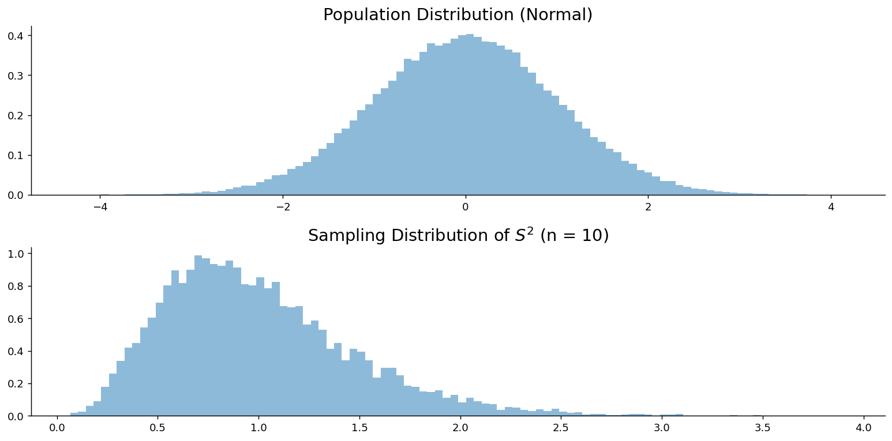

# S²의 표본분포

## 개요

**표본분산 $S^2$의 표본분포**는 모집단에서 표본을 반복해서 뽑을 때 확률표본으로부터 계산한 분산이 어떻게 거동하는지를 기술한다. 참 모분산 $\sigma^2$을 얼마나 정밀하게 추정할 수 있는지 이해하는 데 결정적인 개념이다.

## 수학적 정의

$X_1, X_2, \dots, X_n$을 평균 $\mu$, 분산 $\sigma^2$인 모집단에서 뽑은 i.i.d. 표본이라 하자. 표본분산은:

$$
S^2 = \frac{1}{n-1}\sum_{i=1}^n (X_i - \bar{X})^2
$$

## 성질

### 기댓값 (불편성)

$$
E[S^2] = \sigma^2
$$

$n$이 아니라 $n-1$(자유도)로 나누는 이유가 바로 이 불편성이다. Bessel 수정은 표본으로부터 $\mu$를 추정하면서 잃어버린 자유도 하나를 보상한다.

### 카이제곱과의 연결 (정규모집단)

모집단이 **정규**이면 척도조정된 표본분산이 카이제곱 분포를 따른다:

$$
\frac{(n-1)S^2}{\sigma^2} = \sum_{i=1}^n \left(\frac{X_i - \bar{X}}{\sigma}\right)^2 \sim \chi^2_{n-1}
$$

동등하게:

$$
S^2 \sim \frac{\sigma^2}{n-1} \cdot \chi^2_{n-1}
$$

### S-squared의 분산

정규성 아래에서:

$$
\text{Var}(S^2) = \frac{2\sigma^4}{n-1}
$$

**유도.** $\text{Var}(\chi^2_{n-1}) = 2(n-1)$이므로:

$$
\text{Var}\!\left(\frac{(n-1)S^2}{\sigma^2}\right) = 2(n-1) \;\;\Longrightarrow\;\;
\text{Var}(S^2) = \frac{2\sigma^4}{n-1}
$$

### S-squared의 표준오차

$$
\text{SE}(S^2) = \sigma^2 \sqrt{\frac{2}{n-1}} \sim O\!\left(\frac{1}{\sqrt{n}}\right)
$$

## 수렴 속도

$\bar{X}$와 $S^2$은 점근적으로 같은 비율로 수렴한다:

| 추정량 | 표준오차 | 비율 |
|-----------|---------------|------|
| $\bar{X}$ | $\sigma / \sqrt{n}$ | $O(1/\sqrt{n})$ |
| $S^2$ | $\sigma^2 \sqrt{2/(n-1)}$ | $O(1/\sqrt{n})$ |

수렴 속도 면에서 둘 사이에 빠르고 느림의 차이는 **없다**.

## S-squared의 중대한 한계

$\bar{X}$와 $S^2$의 결정적 차이는 속도가 아니라 **분포에 대한 로버스트성**에 있다.

✅ **표본평균 $\bar{X}$**는 중심극한정리의 혜택을 본다. $n$이 충분히 크기만 하면 모집단 모양과 무관하게 $\bar{X}$의 근사적 정규성이 보장된다.

❌ **표본분산 $S^2$**은 다음에 의존한다:

$$
\frac{(n-1)S^2}{\sigma^2} \sim \chi^2_{n-1}
$$

이는 **정규성 아래에서만 성립한다**. 정규가 아닌 모집단에서 $S^2$의 분산은 모집단 첨도 $\kappa$에 의존하며

$$
\text{Var}(S^2) = \frac{1}{n}\left(\kappa - \frac{n-3}{n-1}\right)\sigma^4
$$

가 되어, 카이제곱이 예측하는 $2\sigma^4/(n-1)$과 배율 $(\kappa-1)/2$만큼 어긋난다. **이 배율은 $n$에 의존하지 않는다.** $\bar X$에서는 정리의 *수렴*이 문제라 표본을 키우면 해결되지만, $S^2$에서는 정리의 *전제*가 문제라 표본을 키워도 해결되지 않는다. 뒤의 모의실험 쪽들에서 균등모집단($\kappa=1.8$)은 배율 0.4, 지수모집단($\kappa=9$)은 배율 4로 나타나는 것을 확인한다.

## 보기

<div class="exbox" markdown>

**보기 1.** <span class="diff easy" title="쉬움"></span> S-squared의 기댓값과 분산. $N(\mu, 25)$에서 $n = 10$인 표본을 뽑는다. $E[S^2]$과 $\text{Var}(S^2)$을 구하라.

</div>

??? success "풀이"
    $Y \sim \chi^2_{n-1}$에 대해 $EY = n-1$이고 $\text{Var}(Y) = 2(n-1)$이다.

    $$
    E\!\left[\frac{(n-1)S^2}{\sigma^2}\right] = n - 1
    \;\;\Longrightarrow\;\;
    E[S^2] = \sigma^2 = 25
    $$

    $$
    \text{Var}\!\left(\frac{(n-1)S^2}{\sigma^2}\right) = 2(n-1)
    \;\;\Longrightarrow\;\;
    \text{Var}(S^2) = \frac{2\sigma^4}{n-1} = \frac{2(25^2)}{9} = \frac{1250}{9} \approx 138.89
    $$
<div class="exbox" markdown>

**보기 2.** <span class="diff easy" title="쉬움"></span> S-squared에 관한 확률 (정규모집단). $N(\mu, 25)$에서 $n = 10$인 표본을 뽑는다. $P(S^2 > 30)$을 구하라.

</div>

??? success "풀이"

    $$
    \frac{(n-1)S^2}{\sigma^2} = \frac{9 \times 30}{25} = 10.8
    $$

    $$
    P(S^2 > 30) = P(\chi^2_9 > 10.8) \approx 0.2897
    $$

    ```python
    from scipy import stats

    chi2_stat = 9 * 30 / 25
    p_value = stats.chi2(df=9).sf(chi2_stat)
    print(f"P(S^2 > 30) = {p_value:.4f}")
    ```

    출력:

    ```
    P(S^2 > 30) = 0.2897
    ```
<div class="exbox" markdown>

**보기 3.** <span class="diff easy" title="쉬움"></span> 정규성 가정 없이. 분산이 25인 모집단에서 $n = 10$인 표본을 뽑는다(정규성은 가정하지 않는다). $P(S^2 > 30)$에 관해 무엇을 말할 수 있는가?

</div>

??? success "풀이"
    정규성이 없으면 $\frac{(n-1)S^2}{\sigma^2}$은 카이제곱 분포를 따르지 **않는다**. $E[S^2] = 25$임은 알지만, 모집단 모양에 관한 추가 정보 없이는 $P(S^2 > 30)$을 구할 수 없다.

    $\text{Var}(S^2)$을 안다면 Chebyshev 부등식으로 한계를 줄 수 있겠지만, 그 값은 정규가 아닌 모집단의 고차 적률에 의존하며 우리는 그것을 알지 못한다.
## sigma-squared에 대한 신뢰구간

(정규성 아래에서) 카이제곱 추축량을 사용하면:

$$
P\!\left(\chi^2_{\alpha/2, \, n-1} \leq \frac{(n-1)S^2}{\sigma^2} \leq \chi^2_{1-\alpha/2, \, n-1}\right) = 1 - \alpha
$$

정리하면:

$$
\left[\frac{(n-1)S^2}{\chi^2_{1-\alpha/2, \, n-1}}, \;\; \frac{(n-1)S^2}{\chi^2_{\alpha/2, \, n-1}}\right]
$$

!!! note
    카이제곱 분포가 비대칭이므로 이 신뢰구간은 $S^2$을 중심으로 대칭이 **아니다**.

## 모의실험: S-squared의 표본분포

### 정규모집단

<div class="codebox" markdown>

#### 예제 1. 정규모집단에서 표본분산의 표집분포 { .eg }

```python
import matplotlib.pyplot as plt
import numpy as np
from scipy import stats

np.random.seed(1)

population = stats.norm().rvs(100_000)
sample_size = 10
n_samples = 10_000

# 표본평균 대신 표본분산을 기록한다. ddof=1 이 n-1로 나누는 표본분산이다.
# 아래 그림에서 두 가지를 확인하라.
#   중심: 참 분산 1 근처에 놓인다 (S^2 은 불편추정량이다)
#   모양: 대칭이 아니라 **오른쪽으로 치우쳐 있다**.
#         분산은 음수가 될 수 없어 왼쪽이 0에서 막히기 때문이다.
#         표본평균의 표집분포가 대칭인 것과 대비된다.
sample_vars = [
    np.var(np.random.choice(population, size=sample_size, replace=False), ddof=1)
    for _ in range(n_samples)
]

# 위아래 두 패널로 나눈다. 위는 모집단, 아래는 통계량의 표집분포다.
# 둘의 **가로 눈금이 다르다**는 점에 주의하라.
# 표집분포가 훨씬 좁으므로 같은 축에 그리면 한 점처럼 보인다.
fig, (ax0, ax1) = plt.subplots(2, 1, figsize=(12, 6))

ax0.hist(population, bins=100, density=True, alpha=0.5)
ax0.set_title('Population Distribution (Normal)', fontsize=16)

ax1.hist(sample_vars, bins=100, density=True, alpha=0.5)
ax1.set_title(rf'Sampling Distribution of $S^2$ (n = {sample_size})', fontsize=16)

for ax in (ax0, ax1):
    ax.spines['top'].set_visible(False)
    ax.spines['right'].set_visible(False)

plt.tight_layout()
plt.show()
```



</div>

### 소득 (치우친) 모집단

<div class="codebox" markdown>

#### 예제 2. 치우친 모집단에서 표본분산의 표집분포 { .eg }

```python
import matplotlib.pyplot as plt
import numpy as np
import pandas as pd

np.random.seed(1)

url = 'https://raw.githubusercontent.com/gedeck/practical-statistics-for-data-scientists/master/data/loans_income.csv'
df = pd.read_csv(url)
population = df['x'].values
sample_size = 10
n_samples = 10_000

sample_vars = [
    np.var(np.random.choice(population, size=sample_size, replace=False), ddof=1)
    for _ in range(n_samples)
]

# 위아래 두 패널로 나눈다. 위는 모집단, 아래는 통계량의 표집분포다.
# 둘의 **가로 눈금이 다르다**는 점에 주의하라.
# 표집분포가 훨씬 좁으므로 같은 축에 그리면 한 점처럼 보인다.
fig, (ax0, ax1) = plt.subplots(2, 1, figsize=(12, 6))

ax0.hist(population, bins=100, density=True, alpha=0.5)
ax0.set_title('Population Distribution (Income — Skewed)', fontsize=16)

ax1.hist(sample_vars, bins=100, density=True, alpha=0.5)
ax1.set_title(rf'Sampling Distribution of $S^2$ (n = {sample_size})', fontsize=16)

for ax in (ax0, ax1):
    ax.spines['top'].set_visible(False)
    ax.spines['right'].set_visible(False)

plt.tight_layout()
plt.show()
```

</div>

## 연습문제

<div class="drillbox" markdown>

**연습문제 1.** <span class="diff easy" title="쉬움"></span>
**$S^2$의 평균과 분산.** $N(\mu, 25)$에서 $n = 10$인 표본을 뽑는다. (a) $\mathbb{E}[S^2]$, (b) $\mathrm{Var}(S^2)$을 계산하라.

</div>

??? success "풀이"
    (a) $\mathbb{E}[S^2] = \sigma^2 = 25$ (Bessel 수정 덕분에 $S^2$이 불편이다).

    (b) 정규성 아래에서 $(n-1) S^2/\sigma^2 \sim \chi^2_{n-1}$이다. $\chi^2_{n-1}$의 분산은 $2(n-1)$이므로:

    $$
    \mathrm{Var}(S^2) = \frac{\sigma^4}{(n-1)^2} \cdot 2(n-1) = \frac{2\sigma^4}{n-1} = \frac{2 \cdot 625}{9} \approx 138.9
    $$

    $S^2$의 표준편차는 $\approx 11.8$로 변동성이 상당하다. $n = 10$에서 분산 추정값은 매우 불안정하다.

<div class="drillbox" markdown>

**연습문제 2.** <span class="diff easy" title="쉬움"></span>
**$P(S^2 > 30)$.** 같은 설정으로 $n = 10$, $\sigma^2 = 25$, 정규모집단이다.

</div>

??? success "풀이"
    $\chi^2 = (n-1)s^2/\sigma^2 = 9 \cdot 30/25 = 10.8$.

    $P(S^2 > 30) = P(\chi^2_9 > 10.8) \approx 0.290$으로 약 29%이다.

    참 분산이 25인데도 표본추출 변동성 때문에 표본분산이 30을 쉽게 넘을 수 있다. 소표본에서는 흔한 일이다.

<div class="drillbox" markdown>

**연습문제 3.** <span class="diff med" title="중간"></span>
**정규성 없이.** 모집단의 정규성을 가정하지 않으면 $P(S^2 > 30)$에 관해 무엇을 말할 수 있는가?

</div>

??? success "풀이"
    정규성이 없으면 $(n-1)S^2/\sigma^2$은 $\chi^2_{n-1}$을 따르지 *않는다*. 카이제곱 결과는 정규분포에 특유한 것이다.

    $\mathbb{E}[S^2] = \sigma^2$은 여전히 성립하지만(불편성에는 정규성이 필요 없다), $S^2$의 분포는 상당히 다를 수 있다.

    $\mathrm{Var}(S^2)$을 안다면 **Chebyshev 한계**를 쓸 수 있지만, 일반적으로 $\mathrm{Var}(S^2)$은 모집단의 4차 적률(첨도)에 의존하며 이는 분포 모양에 민감하다.

    **실무:** 치우쳤거나 꼬리가 두꺼운 자료에서는 $S^2$의 분산이 카이제곱 공식이 시사하는 것보다 *크다*. 정규가 아닌 상황에서 $\sigma^2$에 관한 추론에는 붓스트랩이 권장되는 도구이다.

<div class="drillbox" markdown>

**연습문제 4.** <span class="diff hard" title="어려움"></span>
정규성 아래에서 **$S^2$의 카이제곱 분포를 증명하라.** 구체적으로 $X_1, \ldots, X_n$이 i.i.d. $N(\mu, \sigma^2)$이면 $(n-1)S^2/\sigma^2 \sim \chi^2_{n-1}$임을 보여라.

</div>

??? success "풀이"
    다음과 같이 분해한다:

    $$
    \frac{1}{\sigma^2}\sum_{i=1}^n (X_i - \mu)^2 = \frac{1}{\sigma^2}\sum_{i=1}^n (X_i - \bar X)^2 + \frac{n(\bar X - \mu)^2}{\sigma^2}
    $$

    좌변은 $\chi^2_n$이다(표준정규확률변수 $n$개의 제곱합). 우변의 두 번째 항은 $\chi^2_1$이다($\sqrt n(\bar X - \mu)/\sigma \sim N(0, 1)$의 제곱).

    ($\mathrm{span}\{\mathbf 1\}$과 그 직교여공간으로의 $X$의 직교사영에 적용한) **Cochran 정리**에 의해 우변의 두 항은 독립이다. 따라서:

    $$
    \chi^2_n = \frac{(n-1) S^2}{\sigma^2} + \chi^2_1
    $$

    이며 우변의 두 카이제곱은 독립이다. 적률생성함수의 성질에 의해 $(n-1) S^2/\sigma^2 \sim \chi^2_{n-1}$이다.

    $\square$

    이 유도가 $\sigma^2$에 관한 정규이론 추론 전체를 떠받치며, $t$ 분포와 $F$ 분포가 자연스럽게 나타나는 이유이기도 하다.

<div class="drillbox" markdown>

**연습문제 5.** <span class="diff easy" title="쉬움"></span>
**$\sigma^2$의 신뢰구간.** 정규모집단에서 $n = 10$, $s^2 = 16$을 얻었다. $\sigma^2$에 대한 95% 신뢰구간을 구성하라.

</div>

??? success "풀이"
    추축량: $(n-1)s^2/\sigma^2 \sim \chi^2_9$.

    95% 신뢰구간에는 $\chi^2_{0.025, 9} = 2.700$과 $\chi^2_{0.975, 9} = 19.023$을 사용한다:

    $$
    P(2.700 \le 9 s^2/\sigma^2 \le 19.023) = 0.95
    $$

    역으로 풀면:

    $$
    \frac{9 s^2}{19.023} \le \sigma^2 \le \frac{9 s^2}{2.700}
    $$

    $s^2 = 16$이면 신뢰구간은 $(9 \cdot 16/19.023, 9 \cdot 16/2.700) = (7.57, 53.33)$이다.

    넓고 비대칭이다. 자유도가 작으면 카이제곱이 치우쳐 있기 때문이다. $n = 10$에서는 분산이 거의 제약되지 않는다. $n$이 커지면 신뢰구간이 좁아진다.

<div class="drillbox" markdown>

**연습문제 6.** <span class="diff med" title="중간"></span>
**$S^2$과 $\sigma^2_{\text{MLE}}$.** $\sigma^2$의 MLE는 분모가 $n - 1$이 아니라 $n$이다. 편향, 분산, 평균제곱오차를 비교하라.

</div>

??? success "풀이"
    $S^2 = \frac{1}{n-1}\sum(X_i - \bar X)^2$ (불편): $\mathbb{E}[S^2] = \sigma^2$, $\mathrm{Var}(S^2) = 2\sigma^4/(n-1)$.

    $\hat\sigma^2_{\text{MLE}} = \frac{1}{n}\sum(X_i - \bar X)^2 = \frac{n-1}{n} S^2$ (편향): $\mathbb{E}[\hat\sigma^2_{\text{MLE}}] = (n-1)\sigma^2/n$.

    $\mathrm{Var}(\hat\sigma^2_{\text{MLE}}) = ((n-1)/n)^2 \cdot 2\sigma^4/(n-1) = 2(n-1)\sigma^4/n^2$.

    $\mathrm{MSE}(\hat\sigma^2_{\text{MLE}}) = \mathrm{Var} + \mathrm{bias}^2 = 2(n-1)\sigma^4/n^2 + \sigma^4/n^2 = (2n-1)\sigma^4/n^2$.

    $\mathrm{MSE}(S^2) = \mathrm{Var}(S^2) = 2\sigma^4/(n-1)$.

    비를 비교하면 $\mathrm{MSE}(\hat\sigma^2_{\text{MLE}})/\mathrm{MSE}(S^2) = (2n-1)(n-1)/(2n^2)$로, 모든 $n \ge 2$에서 1보다 작다.

    **MLE는 편향되어 있지만 평균제곱오차가 더 작다.** 분산이 더 작은 것이 편향을 상쇄하고도 남기 때문이다. **편향–분산 맞바꿈**의 고전적인 예로, 전체 오차를 줄이기 위해 약간의 편향을 받아들이는 것이다.

    그럼에도 대부분의 소프트웨어가 (Bessel 수정된) $S^2$을 쓰는 이유는 불편성이 깔끔한 성질이고 $n \to \infty$이면 평균제곱오차의 차이가 사라지기 때문이다.

<div class="drillbox" markdown>

**연습문제 7.** <span class="diff med" title="중간"></span>
독립인 두 정규표본에서 $n_1=12$, $s_1^2 = 18.4$와 $n_2 = 15$, $s_2^2 = 11.9$를 얻었다. 공통분산 $\sigma^2$의 합동추정값을 구하고, 왜 두 분산의 단순평균을 쓰지 않는지 설명하라. 합동추정량이 불편임을 보여라.

</div>

??? success "풀이"
    **합동추정값.**

    $$
    s_p^2 = \frac{(n_1-1)s_1^2+(n_2-1)s_2^2}{n_1+n_2-2} = \frac{11(18.4)+14(11.9)}{25} = \frac{202.4+166.6}{25} = 14.76
    $$

    단순평균 $(18.4+11.9)/2 = 15.15$와 다르다.

    **왜 자유도로 가중하는가.** $s_1^2$은 자유도 11, $s_2^2$은 자유도 14로 정밀도가 다르다. 정규모집단에서 $\operatorname{Var}(S_i^2) = 2\sigma^4/(n_i-1)$이므로 **정밀도가 자유도에 비례**하고, 앞서 본 대로 정밀도 가중이 최소분산을 준다. 자유도가 큰 쪽에 더 큰 가중치를 주는 것이 자연스럽다.

    $n_1 = n_2$이면 두 방법이 일치한다. 표본크기가 크게 다를수록 차이가 커진다.

    **불편성.**

    $$
    E[S_p^2] = \frac{(n_1-1)E[S_1^2]+(n_2-1)E[S_2^2]}{n_1+n_2-2} = \frac{(n_1-1)\sigma^2+(n_2-1)\sigma^2}{n_1+n_2-2} = \sigma^2
    $$

    이다. 어떤 가중치를 써도 합이 1이면 불편이지만, 자유도 가중이 그중 분산이 가장 작다. $\square$

    분모 $n_1+n_2-2$가 곧 합동 $t$ 검정의 자유도다. 각 표본에서 평균을 하나씩 추정하느라 자유도를 하나씩 잃은 결과다.

<div class="drillbox" markdown>

**연습문제 8.** <span class="diff med" title="중간"></span>
분산을 $\left(\sum_i x_i^2 - n\bar x^2\right)/(n-1)$로 계산하는 "간편식"은 수학적으로는 옳지만 수치적으로 위험하다. $x = (10^8+1,\ 10^8+2,\ 10^8+3)$에서 무슨 일이 일어나는지 설명하고 안전한 방법을 적어라.

</div>

??? success "풀이"
    참값은 $s^2 = 1$이다(자료가 $1,2,3$을 평행이동한 것이므로).

    **간편식의 문제.** $\sum x_i^2 \approx 3\times10^{16}$이고 $n\bar x^2 \approx 3\times10^{16}$이다. 거의 같은 두 거대한 수를 빼서 2라는 작은 수를 얻어야 한다. 배정밀도 부동소수점은 유효숫자가 약 16자리이므로 $10^{16}$ 규모의 수에서는 **1의 자리조차 제대로 표현되지 않는다.** 그 결과 뺄셈에서 유효숫자가 모두 소멸되어 0이나 음수 같은 엉뚱한 값이 나온다.

    ```python
    import numpy as np
    x = np.array([1e8+1, 1e8+2, 1e8+3])
    naive = (np.sum(x**2) - len(x)*x.mean()**2) / (len(x)-1)
    print(naive)          # 0.0 또는 음수 (환경에 따라 다름)
    print(np.var(x, ddof=1))   # 1.0
    ```

    **안전한 방법 1 — 두 번 훑기.** 평균을 먼저 구하고 편차를 제곱한다.

    $$
    s^2 = \frac{1}{n-1}\sum_i(x_i-\bar x)^2
    $$

    편차가 $-1, 0, 1$로 작아져 상쇄가 일어나지 않는다. NumPy의 `var`가 이 방식이다.

    **안전한 방법 2 — 웰퍼드 알고리즘.** 자료를 한 번만 훑으면서 갱신한다.

    $$
    \bar x_k = \bar x_{k-1} + \frac{x_k-\bar x_{k-1}}{k}, \qquad M_k = M_{k-1} + (x_k-\bar x_{k-1})(x_k-\bar x_k)
    $$

    마지막에 $s^2 = M_n/(n-1)$이다. 갱신량이 언제나 편차 규모라 안정적이며, 자료를 저장할 필요가 없어 스트리밍 자료에 쓴다.

    **교훈.** **수학적으로 동치인 식이 수치적으로 동치인 것은 아니다.** 자료의 평균이 표준편차에 비해 아주 클 때(측정값이 큰 기준선 위의 작은 변동일 때) 특히 위험하다. 자료를 미리 중심화해 두는 것도 좋은 습관이다.

<div class="drillbox" markdown>

**연습문제 9.** <span class="diff med" title="중간"></span>
도수분포표로만 주어진 자료의 분산을 구하는 공식을 적어라. 구간으로 묶인 자료(예: "20\~30대 15명")에서 분산을 계산할 때 생기는 오차는 어떤 성격인가?

</div>

??? success "풀이"
    값 $v_1,\dots,v_K$가 각각 $f_1,\dots,f_K$번 나타나고 $n = \sum_k f_k$일 때

    $$
    \bar x = \frac{1}{n}\sum_k f_kv_k, \qquad s^2 = \frac{1}{n-1}\sum_k f_k(v_k-\bar x)^2
    $$

    이다. 관측값 하나하나를 다 쓰는 대신 도수를 가중치로 쓴 것이며, 값이 정확히 알려져 있으면 결과도 정확하다.

    **구간 자료의 문제.** "20세 이상 30세 미만 15명"처럼 구간만 알면 각 관측값을 구간 중앙값 25로 대신할 수밖에 없다. 이때 두 가지 오차가 생긴다.

    **(1) 구간 내 분산의 소실.** 구간 안에서 값들이 흩어져 있는데 모두 중앙값으로 눌러 버리므로 산포를 **과소평가**한다. 구간 안에서 값이 균등하게 퍼져 있다고 보면 잃어버린 분산이 구간 폭 $w$에 대해 $w^2/12$이다. 이를 되돌려 주는 것이 **셰퍼드 보정**이다.

    $$
    s^2_{\text{보정}} = s^2_{\text{구간}} + \frac{w^2}{12}
    $$

    앞서 균등분포에서 본 반올림 오차와 같은 계산이다.

    **(2) 구간 내 분포의 치우침.** 실제 값들이 구간 안에서 균등하지 않으면(예: 소득 구간에서는 낮은 쪽에 몰린다) 중앙값 대입이 평균 자체를 편향시킨다. 셰퍼드 보정으로는 고칠 수 없고, 구간이 넓고 분포가 급격히 변하는 곳에서 특히 심하다. 마지막 구간이 "100 이상"처럼 열려 있으면 중앙값을 정하는 것 자체가 임의적이다.

    **실무 권고.** 가능하면 원자료를 확보한다. 구간 자료만 있다면 폭이 좁은 구간에서는 셰퍼드 보정으로 충분하고, 소득처럼 심하게 치우친 자료는 구간별로 분포를 가정한 모형(예: 파레토 꼬리)을 적합하는 편이 낫다.

<div class="drillbox" markdown>

**연습문제 10.** <span class="diff med" title="중간"></span>
$k$개 집단의 분산분석에서 오차 평균제곱 $\text{MSE}$가 연습문제 7의 합동분산을 $k$개 집단으로 확장한 것임을 보여라. 이 값이 $\sigma^2$의 불편추정량인 것은 귀무가설의 참·거짓과 무관함을 설명하라.

</div>

??? success "풀이"
    집단 $i$의 표본크기가 $n_i$, 표본분산이 $s_i^2$이고 $N = \sum_i n_i$라 하자. 집단 내 제곱합은

    $$
    \text{SSW} = \sum_{i=1}^k\sum_{j=1}^{n_i}(x_{ij}-\bar x_i)^2 = \sum_{i=1}^k(n_i-1)s_i^2
    $$

    이고 자유도가 $N-k$이므로

    $$
    \text{MSE} = \frac{\text{SSW}}{N-k} = \frac{\sum_i(n_i-1)s_i^2}{\sum_i(n_i-1)}
    $$

    이다. $k=2$로 두면 정확히 연습문제 7의 $s_p^2$이다. $\square$

    **귀무가설과 무관한 이유.** 위 식에는 각 집단의 관측값이 **자기 집단 평균** $\bar x_i$로부터 얼마나 떨어져 있는지만 들어간다. 집단 평균들이 서로 같든 다르든 그 차이는 계산에 전혀 들어오지 않는다. 따라서 각 $s_i^2$이 $\sigma^2$의 불편추정량이면 그 가중평균인 MSE도 언제나 불편이다.

    반면 집단 간 평균제곱

    $$
    \text{MSB} = \frac{\sum_i n_i(\bar x_i-\bar{\bar x})^2}{k-1}
    $$

    은 사정이 다르다. $H_0$가 참이면 $E[\text{MSB}] = \sigma^2$이지만, 거짓이면

    $$
    E[\text{MSB}] = \sigma^2 + \frac{\sum_i n_i(\mu_i-\bar\mu)^2}{k-1} > \sigma^2
    $$

    으로 부풀어 오른다.

    **이것이 $F$ 검정의 논리 전부다.** 분모는 진실과 무관하게 $\sigma^2$을 재는 자이고, 분자는 $H_0$가 거짓일 때만 커지는 양이다. 둘의 비가 1보다 뚜렷이 크면 평균이 다르다고 판단한다. 그리고 $F$ 검정이 **단측**인 이유도 여기 있다. 대립가설 아래에서 이 비는 언제나 위로만 움직인다.

---

## 정리하며

| 성질 | 결과 |
|----------|--------|
| $E[S^2]$ | $\sigma^2$ (언제나 불편) |
| $\text{Var}(S^2)$ | $2\sigma^4/(n-1)$ (정규성 아래에서) |
| 분포 | $\frac{(n-1)S^2}{\sigma^2} \sim \chi^2_{n-1}$ (정규성 아래에서만) |
| 로버스트성 | ❌ 중심극한정리 같은 보장이 없어 정규성 위반에 민감하다 |
| $\sigma^2$의 신뢰구간 | 카이제곱 분위수에 기반하며 비대칭이다 |

이어지는 다섯 쪽에서 이 표의 마지막 두 줄을 파고든다. **$S^2$의 표준오차**를 먼저 보고, 네 모집단(균등·지수·정규·베르누이)에서 표본분포를 모의실험한다. 정규가 아닌 모집단에서 어긋남의 크기가 첨도 $\kappa$로 정해지는 배율 $(\kappa-1)/2$이며, 그 배율이 **표본크기와 무관하게 남는다**는 것이 그 결론이다.
