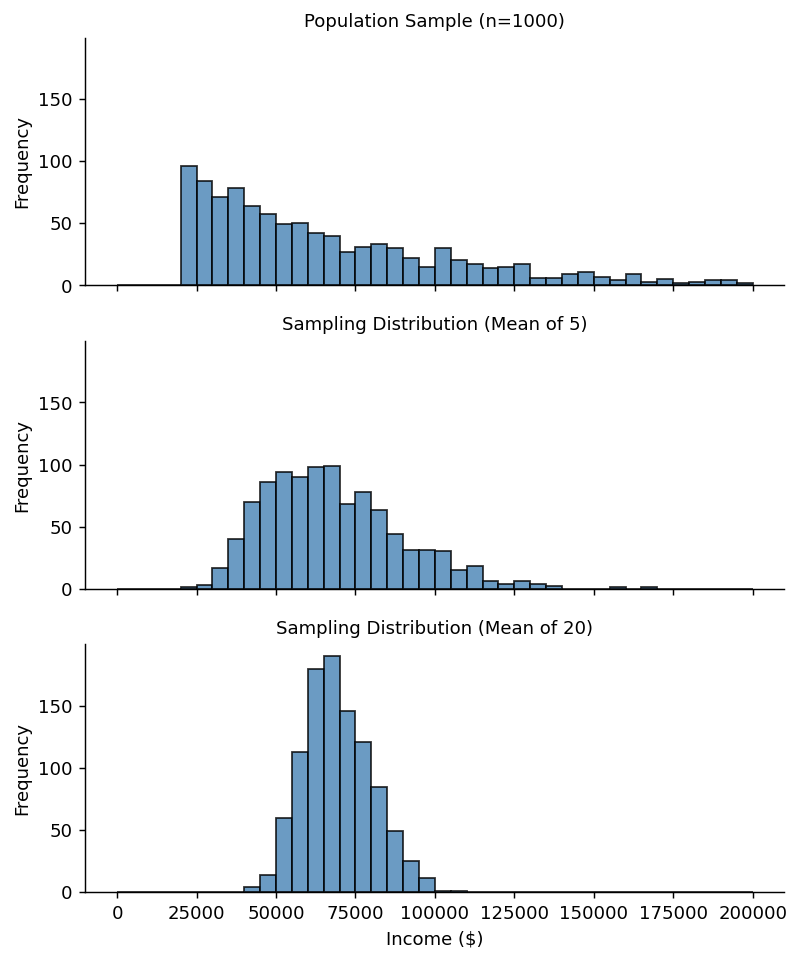

# 소득 자료 표본분포 시각화

## 개요

이 페이지에서는 모의로 만든 소득 자료를 사용하여 중심극한정리가 작동하는 모습을 보인다. 소득 분포는 대체로 오른쪽으로 치우쳐 있어, 표본크기가 커질수록 $\bar{X}$의 표본분포가 어떻게 더 좁아지고 더 정규에 가까워지는지 보이기에 아주 좋은 실제 사례이다. 개별 소득, 5명의 평균, 20명의 평균을 비교하면 중심극한정리를 눈으로 확인하고 표준오차 공식을 검증할 수 있다.

## 설정: 모의 소득 자료

실제 소득 자료는 위쪽 꼬리가 긴 오른쪽으로 치우친 모양이다. 이를 이동된 Exponential 분포로 모사한다:

$$
\text{Income} = 20{,}000 + Y, \qquad Y \sim \text{Exp}(\text{scale} = 50{,}000)
$$

이 모집단은 다음과 같다:

- **평균**: 약 \$70,000
- **표준편차**: 약 \$50,000
- **오른쪽 치우침**: 긴 꼬리는 소수의 사람이 평균보다 훨씬 많이 번다는 사실을 담아낸다

## 이론적 배경

평균이 $\mu$, 표준편차가 $\sigma$인 임의의 모집단에서 $n$개의 관측값에 기반한 표본평균 $\bar{X}$의 표본분포는:

$$
E[\bar{X}] = \mu, \qquad \text{SE}(\bar{X}) = \frac{\sigma}{\sqrt{n}}
$$

표준오차는 표본크기와 함께 줄어든다. 특히 서로 다른 두 표본크기에서 표준오차의 비는:

$$
\frac{\text{SE}(n_1)}{\text{SE}(n_2)} = \sqrt{\frac{n_2}{n_1}}
$$

$n_1 = 5$, $n_2 = 20$이면:

$$
\frac{\text{SE}(5)}{\text{SE}(20)} = \sqrt{\frac{20}{5}} = 2
$$

!!! tip "핵심 통찰"
    표준오차를 절반으로 줄이려면 표본크기를 네 배로 늘려야 한다. 이것이 표본추출의 "제곱근 법칙"이다.

## 모의실험 코드

```python
import numpy as np
import pandas as pd
import matplotlib.pyplot as plt
import seaborn as sns

np.random.seed(1)

# Generate a right-skewed income population
n_population = 10_000
income = np.random.exponential(scale=50_000, size=n_population) + 20_000
loans_income = pd.Series(income)

# 1. Sample 1000 individual incomes
sample_data = pd.DataFrame({
    "income": loans_income.sample(1000),
    "type": "Population Sample (n=1000)"
})

# 2. Distribution of means with n=5
sample_mean_05 = pd.DataFrame({
    "income": [loans_income.sample(5).mean() for _ in range(1000)],
    "type": "Sampling Distribution (Mean of 5)"
})

# 3. Distribution of means with n=20
sample_mean_20 = pd.DataFrame({
    "income": [loans_income.sample(20).mean() for _ in range(1000)],
    "type": "Sampling Distribution (Mean of 20)"
})

results = pd.concat([sample_data, sample_mean_05, sample_mean_20],
                     ignore_index=True)

# Visualize side by side
g = sns.FacetGrid(results, col="type", col_wrap=1, height=2.5, aspect=2.5)
g.map(plt.hist, "income", bins=40, range=[0, 200_000],
      color="steelblue", edgecolor="black", alpha=0.8)
g.set_axis_labels("Income ($)", "Frequency")
g.set_titles("{col_name}")
plt.tight_layout()
plt.show()
```



## 표준오차 검증

이론적 공식 $\text{SE} = \sigma / \sqrt{n}$을 모의실험한 표본분포의 경험적 표준편차와 비교하여 확인할 수 있다.

```python
pop_std = loans_income.std()
se_5_theory = pop_std / np.sqrt(5)
se_20_theory = pop_std / np.sqrt(20)

print(f"Population std:          ${pop_std:,.0f}")
print(f"Theoretical SE (n=5):    ${se_5_theory:,.0f}")
print(f"Theoretical SE (n=20):   ${se_20_theory:,.0f}")
print(f"Ratio SE(5)/SE(20):      {se_5_theory / se_20_theory:.2f}")
```

출력:

```
Population std:          $49,047
Theoretical SE (n=5):    $21,934
Theoretical SE (n=20):   $10,967
Ratio SE(5)/SE(20):      2.00
```

비가 2.0에 가깝게 나와 제곱근 법칙을 확인해 준다.

## 해석

!!! note "주요 관찰"

    1. **모집단 표본** (위 패널): 개별 소득의 분포가 오른쪽으로 심하게 치우쳐 있다. 대부분의 소득이 아래쪽에 몰려 있고 \$200,000를 넘어가는 긴 꼬리가 뻗어 있다.
    2. **5명의 평균** (가운데 패널): 표본분포가 이미 모집단보다 훨씬 좁게 모여 있고 치우침도 덜하지만 여전히 눈에 띄게 정규가 아니다.
    3. **20명의 평균** (아래 패널): 표본분포가 더욱 좁아지고 정규분포에 가깝게 근사한다. 표준오차는 $n = 5$일 때의 절반이다.

### 요약 통계

| 분포 | 평균 | 표준편차 |
|---|---|---|
| 모집단 표본 | $\approx \$70{,}000$ | $\approx \$50{,}000$ |
| 표본분포 ($n = 5$) | $\approx \$70{,}000$ | $\approx \$22{,}000$ |
| 표본분포 ($n = 20$) | $\approx \$70{,}000$ | $\approx \$11{,}000$ |

세 분포 모두 평균은 (모평균으로) 같지만 퍼짐은 $1/\sqrt{n}$로 줄어든다.

## 연습문제

<div class="drillbox" markdown>

**연습문제 1.** <span class="diff med" title="중간"></span> 표본크기와 무관하게 표본분포의 평균이 모평균과 같은 이유를 설명하라. 이 성질은 모집단이 정규분포를 따르는지에 의존하는가?

</div>

??? success "풀이"
    기댓값의 선형성에 의해:

    $$
    E[\bar{X}] = E\!\left[\frac{1}{n}\sum_{i=1}^n X_i\right] = \frac{1}{n}\sum_{i=1}^n E[X_i] = \frac{1}{n} \cdot n\mu = \mu
    $$

    이는 정규모집단뿐 아니라 평균이 유한한 **임의의** 모집단에서 성립한다. 필요한 것은 관측값이 평균 $\mu$를 갖는 동일한 분포를 따르고 기댓값이 존재한다는 것뿐이다. 독립성에도 의존하지 않는다(다만 분산 공식에는 독립성이 필요하다). $\square$

<div class="drillbox" markdown>

**연습문제 2.** <span class="diff med" title="중간"></span> 모의실험은 Exponential 척도 모수로 \$50,000을 사용하고 \$20,000을 더한다. 이 이동된 Exponential 분포의 정확한 모평균과 모표준편차를 유도하라.

</div>

??? success "풀이"
    $\beta = 50{,}000$일 때 $Y \sim \text{Exp}(\text{scale} = \beta)$이면:

    $$
    E[Y] = \beta = 50{,}000, \qquad \text{Var}(Y) = \beta^2 = 2.5 \times 10^9
    $$

    이동된 변수 $X = 20{,}000 + Y$에 대해:

    $$
    E[X] = 20{,}000 + 50{,}000 = 70{,}000
    $$

    $$
    \text{Var}(X) = \text{Var}(Y) = 2.5 \times 10^9 \quad (\text{shift does not affect variance})
    $$

    $$
    \sigma_X = \sqrt{2.5 \times 10^9} = 50{,}000
    $$

    따라서 모집단의 평균은 \$70,000, 표준편차는 \$50,000이다. $\square$

<div class="drillbox" markdown>

**연습문제 3.** <span class="diff easy" title="쉬움"></span> $\sigma = 50{,}000$일 때 $\bar{X}$의 표준오차가 최대 \$5,000이 되려면 $n$이 얼마나 커야 하는가?

</div>

??? success "풀이"
    다음이 필요하다:

    $$
    \frac{50{,}000}{\sqrt{n}} \le 5{,}000 \implies \sqrt{n} \ge 10 \implies n \ge 100
    $$

    표본크기가 최소 $n = 100$이어야 한다. $\square$

<div class="drillbox" markdown>

**연습문제 4.** <span class="diff med" title="중간"></span> 코드는 1,000번 모의실험한 평균으로 경험적 표준오차를 계산한다. 경험적 표준오차가 이론값과 약간 다를 수 있는 이유를 설명하라. 모의실험 횟수를 1,000에서 100,000으로 늘리면 이 차이는 어떻게 되는가?

</div>

??? success "풀이"
    경험적 표준오차 자체가 유한한 횟수의 모의실험으로 계산한 통계량이므로 고유의 표본추출 변동성을 갖는다. 구체적으로 $\hat{\text{SE}}$가 모의실험한 평균 $B$개의 표준편차라면, $\hat{\text{SE}}$ 자체의 근사적 표준오차는:

    $$
    \text{SE}(\hat{\text{SE}}) \approx \frac{\hat{\text{SE}}}{\sqrt{2B}}
    $$

    $B = 1{,}000$이면 추정된 표준오차의 정밀도는 약 $\hat{\text{SE}} / \sqrt{2000} \approx \hat{\text{SE}} / 44.7$이다.

    $B = 100{,}000$이면 정밀도가 $\hat{\text{SE}} / \sqrt{200{,}000} \approx \hat{\text{SE}} / 447$로 좋아진다.

    모의실험 횟수를 100배로 늘리면 표준오차 추정값의 정밀도가 10배 좋아진다. 100,000번 모의실험하면 경험적 표준오차가 이론값에 매우 가까워진다. $\square$

<div class="drillbox" markdown>

**연습문제 5.** <span class="diff med" title="중간"></span> 어떤 도시의 평균 가구소득을 추정하는 조사를 설계한다고 하자. 예산 제약 때문에 응답자를 $n = 50$명으로 제한해야 한다. $\sigma \approx \$50{,}000$을 사용하여 표준오차와 $\bar{X}$의 근사적 95% 오차한계를 계산하라. 예산이 두 배가 되어 $n = 100$이 가능해지면 오차한계는 어떻게 달라지는가?

</div>

??? success "풀이"
    $n = 50$일 때:

    $$
    \text{SE} = \frac{50{,}000}{\sqrt{50}} = \frac{50{,}000}{7.071} \approx \$7{,}071
    $$

    95% 오차한계는:

    $$
    \text{MOE} = 1.96 \times 7{,}071 \approx \$13{,}859
    $$

    $n = 100$일 때:

    $$
    \text{SE} = \frac{50{,}000}{\sqrt{100}} = \$5{,}000
    $$

    $$
    \text{MOE} = 1.96 \times 5{,}000 = \$9{,}800
    $$

    표본크기를 두 배로 늘리면 오차한계가 $\sqrt{2} \approx 1.41$배 줄어 약 \$13,859에서 약 \$9,800이 된다. 비용을 100% 늘려 오차한계는 29% 줄어드는 것으로, 표본크기를 늘릴 때의 수확 체감을 보여 준다. $\square$

---

## 정리하며

치우친 소득 자료 하나로 5장 전체를 눈으로 확인했다.

- **세 히스토그램을 나란히 놓는 것이 요점이다.** 개별 소득, 5명의 평균, 20명의 평균. **같은 모집단인데 모양이 다르다**는 사실이 표본분포와 모집단분포의 차이를 그림으로 보여 준다.
- **두 가지가 동시에 일어난다.** 표본이 커질수록 분포가 **좁아지고**($\sigma/\sqrt n$), 동시에 **대칭에 가까워진다**(중심극한정리). 앞의 것은 정확한 등식이고 뒤의 것이 근사다.
- **표준오차 검증.** 모의실험에서 얻은 표본평균들의 표준편차가 $\sigma/\sqrt n$ 과 맞아떨어진다. 공식이 실제로 작동함을 확인하는 절차다.
- **$n=20$ 에서도 치우침이 남는다.** 모집단이 지수 꼴이라 왜도가 $2$ 이고, $2/\sqrt{20}\approx0.45$ 가 아직 눈에 띈다. **소득처럼 치우친 자료에 "$n\ge30$" 규칙을 그대로 적용하면 안 된다.**

**이것으로 5장이 끝난다.** 통계량은 표본마다 달라지는 확률변수이고, 그 분포가 표본분포이며, 그 폭이 표준오차다. **이 셋이 6장 이후 모든 추론의 부품이다.**

다음 장 **추정**으로 넘어간다. 지금까지는 표본분포의 성질을 살폈다면, 이제 "어떤 추정량이 좋은 추정량인가"를 묻고 그 기준을 세운다.
