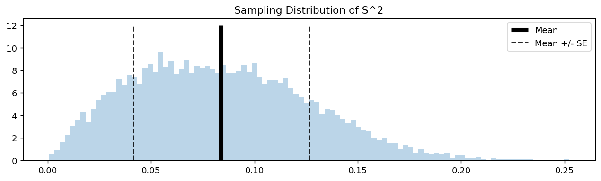

# S²의 표준오차

## 개요

표본평균 $\bar{X}$가 표본 간 변동성을 재는 표준오차를 갖듯이 표본분산 $S^2$도 표준오차를 갖는다. 모분산 $\sigma^2$을 추정하거나 그에 관해 추론할 때 $S^2$의 정밀도를 이해하는 것이 중요하다. 이 페이지에서는 $S^2$의 표준오차를 유도하고, Uniform 모집단에서 모의실험으로 추정하며, 그림으로 나타낸다.

## 정의

**$S^2$의 표준오차**는 그 표본분포의 표준편차이다:

$$
\text{SE}(S^2) = \sqrt{\text{Var}(S^2)}
$$

정규모집단에서는 닫힌 형태로 주어진다:

$$
\text{SE}(S^2) = \sigma^2 \sqrt{\frac{2}{n-1}}
$$

더 일반적으로, 4차 적률이 유한한 임의의 모집단에 대해:

$$
\text{Var}(S^2) = \frac{1}{n}\left(\mu_4 - \frac{n-3}{n-1}\sigma^4\right)
$$

여기서 $\mu_4 = E[(X - \mu)^4]$는 4차 중심적률이다.

## 예: Uniform(0, 1) 모집단

$X \sim \text{Uniform}(0, 1)$에 대해:

$$
\sigma^2 = \frac{1}{12}, \qquad \mu_4 = \frac{1}{80}
$$

$n = 5$이면:

$$
\text{Var}(S^2) = \frac{1}{5}\left(\frac{1}{80} - \frac{2}{4} \cdot \frac{1}{144}\right) = \frac{1}{5}\left(\frac{1}{80} - \frac{1}{288}\right)
$$

$$
= \frac{1}{5} \cdot \frac{288 - 80}{80 \times 288} = \frac{1}{5} \cdot \frac{208}{23040} = \frac{208}{115200} \approx 0.001806
$$

$$
\text{SE}(S^2) \approx \sqrt{0.001806} \approx 0.0425
$$

## 모의실험

다음 코드는 Uniform(0, 1) 모집단에서 $n = 5$로 $S^2$ 값을 10,000개 모의실험하고 추정된 평균과 표준오차를 함께 시각화한다.

```python
import matplotlib.pyplot as plt
import numpy as np

np.random.seed(0)

# 크기 5짜리 균등표본을 1만 번 뽑아 그때마다 S^2 을 기록한다.
S_square = []
for _ in range(10_000):
    x = np.random.uniform(size=(5,))
    sigma = x.std(ddof=1)     # ddof=1 이라야 표본표준편차다
    S_square.append(sigma ** 2)

# 1만 개 S^2 값의 **평균**과 **표준편차**를 낸다.
#   평균  -> S^2 의 중심. 참 분산 1/12 ≈ 0.0833 에 가까워야 한다(불편성).
#   표준편차 -> 그것이 곧 S^2 의 **표준오차**다.
# 표준오차란 "통계량의 표집분포의 표준편차"이므로,
# 통계량 값을 잔뜩 모아 그 표준편차를 재면 그것이 표준오차다.
average = np.array(S_square).mean()
standard_error = np.array(S_square).std()

print(f"Estimated Mean of S^2:   {average:.4f}")
print(f"Standard Error of S^2:   {standard_error:.4f}")

# Visualize
fig, ax = plt.subplots(figsize=(12, 3))
ax.set_title("Sampling Distribution of S^2")
ax.hist(S_square, bins=100, density=True, alpha=0.3)
# 평균과 평균 ± 1 표준오차를 세로선으로 표시한다.
# S^2 의 분포는 오른쪽으로 치우쳐 있어 이 구간이 대칭이 아님에 주의하라.
ax.vlines(average, ymin=0, ymax=12, color="k", lw=5, label="Mean")
ax.vlines(average + standard_error, ymin=0, ymax=12,
          color="k", ls="--", label="Mean +/- SE")
ax.vlines(average - standard_error, ymin=0, ymax=12,
          color="k", ls="--")
ax.legend()
plt.show()
```

출력:

```
Estimated Mean of S^2:   0.0838
Standard Error of S^2:   0.0425
```



### 예상 출력

$n = 5$인 Uniform(0, 1)에 대해:

- **이론적 평균**: $E[S^2] = \sigma^2 = 1/12 \approx 0.0833$
- **이론적 표준오차**: 약 $0.0425$
- 히스토그램은 오른쪽으로 치우쳐 있다($S^2 \ge 0$이므로). 분산의 표본분포에서 전형적인 모습이다.

## 해석

!!! note "주요 관찰"

    1. $S^2$의 표본분포는 근사적으로 대칭인 $\bar{X}$의 분포와 달리 **오른쪽으로 치우쳐** 있다.
    2. 모의실험한 $S^2$ 값들의 평균이 $\sigma^2 = 1/12$에 가까워 $S^2$이 불편임을 확인해 준다.
    3. $S^2$의 표준오차가 평균보다 훨씬 작아 $n = 5$에서도 그럭저럭 정밀함을 보여 준다.
    4. 평균 $\pm$ 표준오차의 점선은 $S^2$ 값의 전형적인 범위를 나타낸다. 분포가 치우쳐 있으므로 평균 $+$ 표준오차보다 큰 값이 평균 $-$ 표준오차보다 작은 값보다 더 흔하다.

!!! warning "S-squared의 표준오차는 모집단 모양에 의존한다"
    $\sigma$와 $n$에만 의존하는 $\text{SE}(\bar{X}) = \sigma/\sqrt{n}$과 달리, $S^2$의 표준오차는 모집단의 4차 적률(첨도)에 의존한다. 꼬리가 두꺼운 모집단일수록 $S^2$ 값의 변동이 커진다.

## 연습문제

<div class="drillbox" markdown>

**연습문제 1.** $n = 10$인 $N(0, 1)$ 모집단에 대해 이론적 $E[S^2]$과 $\text{SE}(S^2)$을 계산하라.

</div>

??? success "풀이"
    $N(0, 1)$에서 $\sigma^2 = 1$이다.

    $$
    E[S^2] = \sigma^2 = 1
    $$

    $$
    \text{SE}(S^2) = \sigma^2 \sqrt{\frac{2}{n-1}} = 1 \cdot \sqrt{\frac{2}{9}} = \sqrt{\frac{2}{9}} = \frac{\sqrt{2}}{3} \approx 0.4714
    $$

    $\square$

<div class="drillbox" markdown>

**연습문제 2.** 카이제곱 결과 $(n-1)S^2/\sigma^2 \sim \chi^2(n-1)$을 사용하여 정규모집단에서 $\text{Var}(S^2) = 2\sigma^4 / (n-1)$을 유도하라.

</div>

??? success "풀이"
    $Q = (n-1)S^2/\sigma^2$이라 하자. 그러면 $Q \sim \chi^2(n-1)$이고 $\text{Var}(Q) = 2(n-1)$이다.

    $S^2 = \sigma^2 Q / (n-1)$이므로:

    $$
    \text{Var}(S^2) = \left(\frac{\sigma^2}{n-1}\right)^2 \text{Var}(Q) = \frac{\sigma^4}{(n-1)^2} \cdot 2(n-1) = \frac{2\sigma^4}{n-1}
    $$

    따라서:

    $$
    \text{SE}(S^2) = \sqrt{\frac{2\sigma^4}{n-1}} = \sigma^2 \sqrt{\frac{2}{n-1}}
    $$

    $\square$

<div class="drillbox" markdown>

**연습문제 3.** Uniform(0, 1)의 4차 중심적률이 $\mu_4 = 1/80$임을 보여라.

</div>

??? success "풀이"
    $\mu = 1/2$인 $X \sim \text{Uniform}(0, 1)$에 대해:

    $$
    \mu_4 = E[(X - \mu)^4] = \int_0^1 \left(x - \frac{1}{2}\right)^4 dx
    $$

    $u = x - 1/2$로 치환하면 $du = dx$이고 적분 범위는 $-1/2$에서 $1/2$이 된다:

    $$
    \mu_4 = \int_{-1/2}^{1/2} u^4 \, du = \left[\frac{u^5}{5}\right]_{-1/2}^{1/2} = \frac{(1/2)^5}{5} - \frac{(-1/2)^5}{5} = \frac{2 \cdot (1/32)}{5} = \frac{1}{80}
    $$

    $\square$

<div class="drillbox" markdown>

**연습문제 4.** $n$이 작을 때 $S^2$의 표본분포가 오른쪽으로 치우치는 이유와 $n$이 커질수록 더 대칭이 되는 이유를 설명하라.

</div>

??? success "풀이"
    표본분산 $S^2$은 아래로 0에서 유계이지만 (원리상) 위로는 유한한 한계가 없다. $n$이 작으면 제약 $S^2 \ge 0$이 왼쪽 꼬리를 잘라 내는 "바닥"을 만드는 반면, 이따금 나타나는 극단적인 관측값이 $S^2$을 큰 값으로 밀어 올려 긴 오른쪽 꼬리를 만든다.

    $n$이 커지면 두 가지 효과가 분포를 대칭화한다:

    1. **$S^2$에 대한 중심극한정리**: $n$이 크면 $S^2$은 약하게 의존하는 많은 항(제곱편차)의 합에 가까우므로, 중심극한정리 유형의 논증에 의해 그 분포가 정규분포로 수렴한다.
    2. **카이제곱의 수렴**: 정규모집단에서 $(n-1)S^2/\sigma^2 \sim \chi^2(n-1)$이다. $\chi^2(k)$의 왜도는 $2\sqrt{2/k}$이며 $k = n - 1$이 커지면 0으로 간다.

    두 효과 모두 $n$이 클 때 $S^2$의 분포가 근사적으로 대칭(정규)이 되고 표준오차가 퍼짐을 잘 요약해 줌을 뜻한다. $\square$

<div class="drillbox" markdown>

**연습문제 5.** Exponential(1) 모집단으로 모의실험을 반복하라. $\text{Exp}(1)$에서 $\sigma^2 = 1$, $\mu_4 = 9$임에 유의하여 $S^2$의 경험적 표준오차를 이론값과 비교하라.

</div>

??? success "풀이"
    ```python
    import numpy as np
    np.random.seed(0)

    # 크기 5짜리 지수분포 표본에서 S^2 을 1만 번 계산한다.
    # ddof=1 이 표본분산(n-1로 나눔)을 뜻한다.
    S_square = [np.random.exponential(size=5).var(ddof=1) for _ in range(10_000)]
    empirical_se = np.std(S_square)

    # 이론값 Var(S^2) = (1/n)(mu4 - (n-3)/(n-1) * sigma^4)
    # Exp(1)에서 sigma^2 = 1, mu4 = 9 이므로 (1/5)(9 - 2/4) = 1.7
    theoretical_se = np.sqrt(1.7)
    print(f"경험적 SE = {empirical_se:.4f}")
    print(f"이론적 SE = {theoretical_se:.4f}")
    ```

    출력:

    ```
    경험적 SE = 1.3237
    이론적 SE = 1.3038
    ```

    n = 5로 아주 작은데도 두 값이 잘 맞는다. 다만 4차 적률이 들어가는 공식이라
    수렴이 느리므로, 표본이 작으면 이 정도(1.5%) 차이는 정상이다.

    $\sigma^2 = 1$, $\mu_4 = 9$, $n = 5$로 이론값을 계산하면:

    $$
    \text{Var}(S^2) = \frac{1}{n}\left(\mu_4 - \frac{n-3}{n-1}\sigma^4\right) = \frac{1}{5}\left(9 - \frac{2}{4}\right) = \frac{1}{5} \cdot 8.5 = 1.7
    $$

    $$
    \text{SE}(S^2) = \sqrt{1.7} \approx 1.304
    $$

    비교하자면 정규이론 표준오차는 $\sigma^2 \sqrt{2/(n-1)} = \sqrt{2/4} = \sqrt{0.5} \approx 0.707$이다.

    Exponential 모집단의 표준오차가 정규이론 값보다 약 1.84배 큰데, 이는 Exponential 분포의 두꺼운 꼬리(초과첨도 $= 6$)를 반영한다. 모의실험의 경험적 표준오차는 1.304에 가깝게 나온다. $\square$

---

## 정리하며

$S^2$ 에도 표준오차가 있고, 정규모집단에서는 닫힌 형태로 주어진다.

$$
\mathrm{SE}(S^2) = \sigma^2\sqrt{\frac{2}{n-1}}
$$

- **$\bar X$ 와 달리 4차적률이 필요하다.** 일반적인 모집단에서는 $\mathrm{Var}(S^2)\approx(\mu_4-\sigma^4)/n$ 이며, 정규분포의 $\mu_4=3\sigma^4$ 을 넣으면 위 공식이 나온다.
- **초과첨도가 곧 벌점이다.** $\gamma_2$ 가 양수면 실제 표준오차가 정규 공식보다 크고, 그 차이가 $\sqrt{(\gamma_2+2)/2}$ 배다. $\gamma_2=6$ 이면 **두 배**다.
- **상대 정밀도가 $\sqrt{2/(n-1)}$** 이므로 분산을 $10\%$ 정밀도로 추정하려면 $n\approx200$ 이 필요하다. 같은 정밀도로 평균을 추정하는 것보다 훨씬 많은 자료가 든다.
- **분산·상관·첨도로 갈수록 필요한 적률의 차수가 올라가고 추정이 어려워진다.** 그 순서가 곧 신뢰도의 순서다.

다음 절 **붓스트랩 표준오차**로 넘어간다. 이론 공식이 없거나 가정이 의심스러울 때 자료에서 직접 표준오차를 만들어 내는 방법이다.
