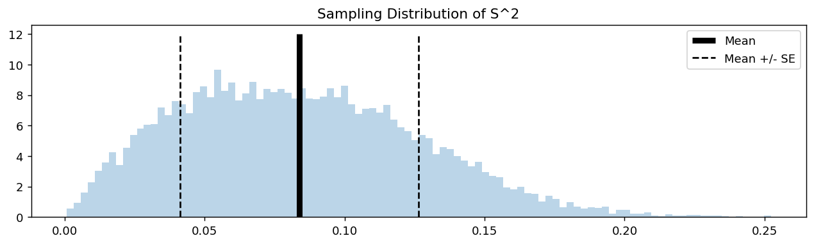

# S²의 표준오차

## 개요

균등분포 $\text{Uniform}(0, 1)$에서 다섯 개를 뽑아 표본분산을 계산하는 일을 되풀이한다고 하자. 그 값들의 평균을 내면 참 분산 $1/12 \approx 0.0833$ 가까이 나온다. 그러나 한 번 한 번의 값은 그 근처에 얌전히 머물지 않는다. 아래에서 계산해 보면 표준오차가 0.0425여서, 값이 0.04 아래로 내려가거나 0.13 위로 올라가는 일이 드물지 않다.

표본평균 $\bar{X}$가 표본 간 변동성을 재는 표준오차를 갖듯이 표본분산 $S^2$도 표준오차를 갖는다. 모분산 $\sigma^2$을 추정하거나 그에 관해 추론할 때 $S^2$의 정밀도를 이해하는 것이 중요하다.

다만 공식의 재료가 다르다는 점이 이 쪽의 핵심이다. $\bar{X}$의 표준오차 $\sigma/\sqrt{n}$에는 모집단의 2차 적률만 들어가지만, $S^2$의 표준오차에는 **4차 적률**이 들어간다. 아래에서 그 공식을 유도하고, 균등 모집단에서 모의실험으로 추정하며, 그림으로 나타낸다.

---

## 1. 표준오차의 정의와 일반 공식

표준오차란 통계량의 표집분포의 표준편차이므로 정의 자체는 간단하다. 어려운 것은 그 값을 무엇으로 적을 수 있느냐다.

<div class="defn" markdown>

### 정의 1. 표본분산의 표준오차 { .dfn }

**$S^2$의 표준오차**는 그 표본분포의 표준편차이다.

$$
\text{SE}(S^2) = \sqrt{\text{Var}(S^2)}
$$

</div>

<div class="thmbox" markdown>

### 정리 1. 표본분산의 분산은 4차 적률이 정한다 { .thm }

4차 적률이 유한한 임의의 모집단에서 뽑은 i.i.d. 표본에 대해

$$
\operatorname{Var}(S^2) = \frac{1}{n}\left(\mu_4 - \frac{n-3}{n-1}\,\sigma^4\right)
= \frac{\sigma^4}{n}\left(\beta_2 - \frac{n-3}{n-1}\right)
$$

이다. 여기서 $\mu_4 = E[(X-\mu)^4]$ 이고 $\beta_2 = \mu_4/\sigma^4$ 는 첨도다. 모집단이 **정규**($\beta_2 = 3$)이면 이것이

$$
\operatorname{Var}(S^2) = \frac{2\sigma^4}{n-1},
\qquad
\operatorname{SE}(S^2) = \sigma^2\sqrt{\frac{2}{n-1}}
$$

로 줄어든다.

</div>

??? proof "증명"

    일반성을 잃지 않고 $\mu = 0$ 으로 둔다($S^2$ 은 위치이동에 변하지 않는다). 표본분산을 두 적률로 적으면

    $$
    (n-1)S^2 = \sum_i X_i^2 - n\bar X^2
    $$

    이다. 양변을 제곱해 기댓값을 취하는데, 독립성 덕에 **살아남는 항이 몇 개뿐**이다. $E[X^2] = \sigma^2$, $E[X^4] = \mu_4$ 라 두고 전개하면

    $$
    E\!\left[\left(\sum_i X_i^2\right)^{\!2}\right] = n\mu_4 + n(n-1)\sigma^4
    $$

    (같은 첨자끼리는 $E[X_i^4] = \mu_4$ 가 $n$ 개, 다른 첨자끼리는 $E[X_i^2]E[X_j^2] = \sigma^4$ 가 $n(n-1)$ 개다.) 나머지 교차항들도 같은 방식으로 세면

    $$
    E\bigl[(n-1)^2 S^4\bigr] = (n-1)\Bigl(n\mu_4 + (n^2-2n+3)\sigma^4\Bigr)\big/n
    $$

    이고, 여기서 $E[S^2] = \sigma^2$(정리가 앞 쪽 [표본분산](sample_variance.md) 정리 1)의 제곱을 빼면

    $$
    \operatorname{Var}(S^2) = E[S^4] - \sigma^4 = \frac{1}{n}\left(\mu_4 - \frac{n-3}{n-1}\sigma^4\right)
    $$

    가 남는다. 정규모집단이면 $\mu_4 = 3\sigma^4$ 이므로

    $$
    \operatorname{Var}(S^2) = \frac{\sigma^4}{n}\left(3 - \frac{n-3}{n-1}\right)
    = \frac{\sigma^4}{n}\cdot\frac{3n-3-n+3}{n-1}
    = \frac{2\sigma^4}{n-1}
    $$

    로 카이제곱에서 얻은 값과 일치한다([표본분산](sample_variance.md) 정리 2). $\square$

    **이 식이 이 쪽에서 가장 중요한 한 줄이다.** $\mu_4$ 는 모집단의 꼬리가 얼마나 두꺼운지를 재는 양이고, 그것이 $S^2$ 의 흔들림을 정한다. **$S^2$ 이 얼마나 정밀한지는 모집단의 분산이 아니라 4차 적률에 달려 있다.**

    큰 $n$ 에서 비를 보면 어긋남의 크기가 한눈에 들어온다.

    $$
    \frac{\operatorname{Var}(S^2)}{2\sigma^4/(n-1)} \;\xrightarrow{\ n\to\infty\ }\; \frac{\beta_2 - 1}{2}
    $$

    정규면 $(3-1)/2 = 1$ 로 꼭 맞고, 지수분포면 $\beta_2 = 9$ 라 **4 배**다. 분산이 네 배면 표준편차가 두 배이므로, 카이제곱 모형으로 짠 구간은 **절반 폭으로 좁다.** 뒤의 네 쪽이 모집단별로 그 값을 잰다. $\mu_4$는 모집단의 꼬리가 얼마나 두꺼운지를 재는 양이고, 그것이 $S^2$의 흔들림을 정한다. **$S^2$이 얼마나 정밀한지는 모집단의 분산이 아니라 모집단의 꼬리가 결정한다.** 정규모집단은 $\mu_4 = 3\sigma^4$이라는 특별한 관계를 만족하는 경우일 뿐이며, 그 값을 넣었을 때 앞의 닫힌 형태가 나온다.

---

## 2. 균등분포에 넣어 보면

일반 공식이 실제로 어떻게 쓰이는지 한 번 따라가 보자. $X \sim \text{Uniform}(0, 1)$의 분산과 4차 중심적률은 다음과 같다.

$$
\sigma^2 = \frac{1}{12}, \qquad \mu_4 = \frac{1}{80}
$$

$n = 5$인 표본을 생각하고 위의 두 값을 일반 공식에 넣으면 분산이 나온다.

$$
\text{Var}(S^2) = \frac{1}{5}\left(\frac{1}{80} - \frac{2}{4} \cdot \frac{1}{144}\right) = \frac{1}{5}\left(\frac{1}{80} - \frac{1}{288}\right)
$$

$$
= \frac{1}{5} \cdot \frac{288 - 80}{80 \times 288} = \frac{1}{5} \cdot \frac{208}{23040} = \frac{208}{115200} \approx 0.001806
$$

제곱근을 취한 것이 표준오차다.

$$
\text{SE}(S^2) \approx \sqrt{0.001806} \approx 0.0425
$$

평균이 0.0833인데 표준오차가 0.0425다. 다섯 개짜리 표본으로 분산을 재면 값이 절반으로 줄거나 1.5배로 커지는 일이 드물지 않다는 뜻이다.

---

## 3. 모의실험

이 계산이 맞는지는 직접 확인해 볼 수 있다. 표준오차란 표집분포의 표준편차이므로, $S^2$ 값을 잔뜩 모아 그 표준편차를 재면 그것이 곧 표준오차다. 다음 코드는 Uniform(0, 1) 모집단에서 $n = 5$로 $S^2$ 값을 10,000개 모의실험하고 추정된 평균과 표준오차를 함께 시각화한다.

<div class="exbox" markdown>

**보기 1.** <span class="diff easy" title="쉬움"></span> 표본분산의 표준오차 모의실험. $\text{Uniform}(0,1)$에서 $n = 5$인 표본을 1만 번 뽑아 $S^2$ 값 1만 개를 모으고, 그 평균과 표준편차를 재어 위의 손계산과 맞춰 본다.

**(1)** $E[S^2]$과 $\operatorname{SE}(S^2)$을 일반 공식으로 구하고, 같은 $n$에서 모집단이 정규라고 **잘못** 가정했을 때의 값과 견주시오.

**(2)** 모의실험으로 확인하시오. 그림의 세로선 셋을 두고, $S^2$의 치우침이 **$1$ 표준오차 거리에서 드러나는가 $2$ 표준오차 거리에서 드러나는가**를 수로 판정하시오.

</div>

??? success "풀이"

    **(1) 이론값.** 위에서 한 계산을 다시 모아 적는다. $\text{Uniform}(0,1)$은 $\sigma^2 = 1/12$, $\mu_4 = 1/80$이므로 불편성에서

    $$
    E[S^2] = \sigma^2 = \frac{1}{12} = 0.083333
    $$

    이고, 일반 공식에 $n = 5$를 넣으면 $(n-3)/(n-1) = 2/4 = 1/2$이라

    $$
    \operatorname{Var}(S^2) = \frac{1}{5}\left(\frac{1}{80} - \frac12 \cdot \frac{1}{144}\right)
    = \frac{1}{5}\left(0.0125 - 0.00347222\right) = 0.00180556
    $$

    $$
    \operatorname{SE}(S^2) = \sqrt{0.00180556} = 0.042492
    $$

    를 얻는다. 모집단이 정규라고 가정하면 $\mu_4 = 3\sigma^4$이므로

    $$
    \operatorname{SE}(S^2) = \sigma^2\sqrt{\frac{2}{n-1}} = \frac{1}{12}\sqrt{\frac24} = 0.058926
    $$

    이 되어 **$39\%$ 더 크다.** 분산으로는 배율이

    $$
    \frac{n-1}{2n}\left(\beta_2 - \frac{n-3}{n-1}\right) = \frac{4}{10}(1.8 - 0.5) = 0.52
    $$

    다. 균등모집단의 꼬리가 가벼워 $S^2$이 정규모집단보다 덜 흔들리는 것이고, 정규를 가정하는 쪽이 **보수적**(과대평가)이다.

    크기 자체도 짚어 둘 만하다. $\operatorname{SE}/E[S^2] = 0.042492/0.083333 = 0.51$이다. **표준오차가 추정하려는 값의 절반을 넘는다.**

    치우침에 대해서는 미리 어림할 것이 하나 있다. $S^2 \ge 0$이고 $\operatorname{SE}$가 평균의 절반이 넘으므로 $\mu - 2\operatorname{SE} = 0.0833 - 0.0850 = -0.0017$이 **음수**다. 곧 $\mu - 2\operatorname{SE}$ 아래의 확률은 정확히 $0$이고, 그 거리에서는 치우침이 극단적으로 드러나야 한다. $\mu \pm \operatorname{SE}$에서는 어떨지 모의실험으로 재어 본다.

    **(2) 모의실험.**

    ```python
    import matplotlib.pyplot as plt
    import numpy as np
    from scipy import stats

    plt.rcParams["font.sans-serif"] = ["NanumGothic", "Apple SD Gothic Neo", "Malgun Gothic"]
    plt.rcParams["font.family"] = "sans-serif"
    plt.rcParams["axes.unicode_minus"] = False

    np.random.seed(0)

    # 크기 5짜리 균등표본을 1만 번 뽑아 그때마다 S^2 을 기록한다.
    S_square = []
    for _ in range(10_000):
        x = np.random.uniform(size=(5,))
        sigma = x.std(ddof=1)     # ddof=1 이라야 표본표준편차다
        S_square.append(sigma ** 2)

    # 1만 개 S^2 값의 **평균**과 **표준편차**를 낸다.
    #   평균  -> S^2 의 중심. 참 분산 1/12 ≈ 0.0833 에 가까워야 한다(불편성).
    #   표준편차 -> 그것이 곧 S^2 의 **표준오차**다.
    # 표준오차란 "통계량의 표집분포의 표준편차"이므로,
    # 통계량 값을 잔뜩 모아 그 표준편차를 재면 그것이 표준오차다.
    average = np.array(S_square).mean()
    standard_error = np.array(S_square).std()

    print(f"Estimated Mean of S^2:   {average:.4f}")
    print(f"Standard Error of S^2:   {standard_error:.4f}")

    # 이론값. Uniform(0,1) 은 sigma^2 = 1/12, mu_4 = 1/80 이다.
    n, B = 5, 10_000
    sigma2, mu4 = 1 / 12, 1 / 80
    var_s2 = (mu4 - (n - 3) / (n - 1) * sigma2 ** 2) / n
    se_s2 = np.sqrt(var_s2)
    print(f"이론  E[S^2] = {sigma2:.6f},  Var(S^2) = {var_s2:.8f},  SE(S^2) = {se_s2:.6f}")
    print(f"몬테카를로 오차  평균 {se_s2 / np.sqrt(B):.6f},  표준오차 {se_s2 / np.sqrt(2 * B):.6f}")
    print(f"어긋남을 오차 단위로  평균 {abs(average - sigma2) / (se_s2 / np.sqrt(B)):.2f}배,  "
          f"표준오차 {abs(standard_error - se_s2) / (se_s2 / np.sqrt(2 * B)):.2f}배")
    print(f"정규모집단이라면 SE = sigma^2 sqrt(2/(n-1)) = {sigma2 * np.sqrt(2 / (n - 1)):.6f},  "
          f"분산 배율 = {(n - 1) / (2 * n) * (mu4 / sigma2 ** 2 - (n - 3) / (n - 1)):.4f}")
    print(f"SE / E[S^2] = {se_s2 / sigma2:.4f}")

    # 치우침을 수로 읽는다. 1 표준오차 거리와 2 표준오차 거리를 갈라서 본다.
    s = np.array(S_square)
    print(f"왜도(S^2) 모의 = {stats.skew(s):.4f},  중앙값 {np.median(s):.5f} < 평균 {sigma2:.5f}")
    print(f"mu +- SE  = [{sigma2 - se_s2:+.5f}, {sigma2 + se_s2:+.5f}]   바깥 확률  왼쪽 {(s < sigma2 - se_s2).mean():.4f}  오른쪽 {(s > sigma2 + se_s2).mean():.4f}")
    print(f"mu +- 2SE = [{sigma2 - 2 * se_s2:+.5f}, {sigma2 + 2 * se_s2:+.5f}]   바깥 확률  왼쪽 {(s < sigma2 - 2 * se_s2).mean():.4f}  오른쪽 {(s > sigma2 + 2 * se_s2).mean():.4f}")

    # 히스토그램에 이론값을 겹쳐 그린다.
    fig, ax = plt.subplots(figsize=(12, 3))
    ax.set_title("Sampling Distribution of S^2")
    ax.hist(S_square, bins=100, density=True, alpha=0.3)
    # 평균과 평균 ± 1 표준오차를 세로선으로 표시한다.
    # S^2 의 분포는 오른쪽으로 치우쳐 있어 이 구간이 대칭이 아님에 주의하라.
    ax.vlines(average, ymin=0, ymax=12, color="k", lw=5, label="Mean")
    ax.vlines(average + standard_error, ymin=0, ymax=12,
              color="k", ls="--", label="Mean +/- SE")
    ax.vlines(average - standard_error, ymin=0, ymax=12,
              color="k", ls="--")
    ax.legend()
    plt.show()
    ```

    출력:

    ```
    Estimated Mean of S^2:   0.0838
    Standard Error of S^2:   0.0425
    이론  E[S^2] = 0.083333,  Var(S^2) = 0.00180556,  SE(S^2) = 0.042492
    몬테카를로 오차  평균 0.000425,  표준오차 0.000300
    어긋남을 오차 단위로  평균 1.18배,  표준오차 0.04배
    정규모집단이라면 SE = sigma^2 sqrt(2/(n-1)) = 0.058926,  분산 배율 = 0.5200
    SE / E[S^2] = 0.5099
    왜도(S^2) 모의 = 0.4122,  중앙값 0.08072 < 평균 0.08333
    mu +- SE  = [+0.04084, +0.12583]   바깥 확률  왼쪽 0.1735  오른쪽 0.1718
    mu +- 2SE = [-0.00165, +0.16832]   바깥 확률  왼쪽 0.0000  오른쪽 0.0304
    ```

    

    **두 숫자가 맞는다.** 모의 평균 $0.0838$이 이론 $0.083333$에서 몬테카를로 오차 $0.000425$의 $1.18$배, 모의 표준오차 $0.0425$가 이론 $0.042492$에서 오차 $0.000300$의 $0.04$배 떨어져 있다. 표준오차 쪽은 소수 넷째 자리까지 그대로 맞았다. **$\mu_4$가 들어간 일반 공식이 옳다**는 확인이고, 정규를 가정해 얻은 $0.058926$을 썼다면 $39\%$ 과대평가였을 것이다.

    **치우침은 $1$ 표준오차 거리에서 보이지 않는다.** 왜도가 $+0.41$로 양수이고 중앙값 $0.0807$이 평균 $0.0833$보다 작으니 분포가 오른쪽으로 끌린 것은 분명하다. 그런데 $\mu \pm \operatorname{SE}$ 바깥의 확률은 왼쪽 $0.1735$, 오른쪽 $0.1718$로 **사실상 같다.** 비율의 몬테카를로 오차가 $\sqrt{0.17 \times 0.83/10^4} = 0.0038$이므로 두 값의 차 $0.0017$은 오차의 절반도 안 된다.

    이것이 우연이 아님을 확인하려고 되풀이를 1천만 번으로 늘려 보았다. 왼쪽 $0.17686$, 오른쪽 $0.16743$이 되어 오차 $0.00012$ 기준으로는 분명히 다르지만, **큰 쪽이 왼쪽**이다. 왜도가 $+0.41$인 감마분포에 같은 계산을 하면 $0.1572$와 $0.1567$로 거의 같은 값이 나오니, **한 표준오차 거리에서는 왜도가 좌우 확률을 거의 가르지 않는다**는 것이 일반적인 사정이다. 왜도는 3차 적률이어서 훨씬 먼 꼬리에서 결정된다.

    **$2$ 표준오차 거리에서는 완전히 드러난다.** $\mu - 2\operatorname{SE} = -0.00165$가 음수이므로 그 아래의 확률이 **정확히 $0$**이고, 오른쪽은 $0.0304$다. 정규분포라면 양쪽이 각각 $0.0228$이어야 한다. 한쪽이 $0$이고 다른 쪽이 $3\%$라는 것은 대칭으로는 설명할 길이 없는 모습이다.

    **그래서 그림의 점선 두 개를 "전형적인 범위"로 읽을 때 조심해야 한다.** 폭만 보면 $0.0425$가 평균 $0.0833$의 $51\%$라 다섯 개짜리 표본의 $S^2$ 하나로 모분산을 논하기 어렵다는 것이 바로 읽힌다. 그러나 그 구간이 **비대칭한 분포를 대칭한 두 선으로 가둔 것**이라는 사실은 점선만 보아서는 알 수 없고, 위의 마지막 두 줄처럼 양쪽을 갈라 세어야 드러난다.

---

## 4. 해석

먼저 숫자가 맞는지 본다. 1만 개 $S^2$ 값의 평균은 0.0838로 이론적 평균 $E[S^2] = \sigma^2 = 1/12 \approx 0.0833$에 잘 맞고, 그 표준편차는 0.0425로 앞에서 손으로 계산한 이론적 표준오차와 소수 넷째 자리까지 일치한다. $S^2$이 불편추정량이라는 것과 우리가 쓴 분산 공식이 옳다는 것이 한꺼번에 확인된 셈이다.

!!! note "주요 관찰"

    모양은 $\bar{X}$의 경우와 사뭇 다르다. $S^2$의 표본분포는 근사적으로 대칭인 $\bar{X}$의 분포와 달리 **오른쪽으로 치우쳐** 있다. $S^2 \ge 0$이라 왼쪽이 0에서 막히는 반면 오른쪽은 열려 있기 때문이며, 분산의 표본분포에서 전형적인 모습이다.

    그림의 세로선은 평균과 평균 $\pm$ 표준오차를 나타낸다. 이 구간이 $S^2$ 값의 전형적인 범위다. 분포가 오른쪽으로 치우쳐 있지만 **$1$ 표준오차 거리에서는 그 치우침이 좌우를 가르지 못한다** — 왼쪽 바깥이 $0.1767$, 오른쪽 바깥이 $0.1674$로 오히려 왼쪽이 조금 더 흔하다(보기 1). 치우침이 드러나는 것은 $2$ 표준오차 거리로, 거기서는 왼쪽이 아예 불가능해진다($\mu - 2\,\mathrm{SE} < 0$). 구간의 폭이 눈에 띄게 넓다는 점도 함께 보아야 한다. 표준오차 0.0425는 평균 0.0838의 절반을 넘는다. $n = 5$짜리 표본에서 얻은 $S^2$ 하나로 모분산을 논하기 어렵다는 뜻이다.

!!! warning "S²의 표준오차는 모집단 모양에 의존한다"
    $\sigma$와 $n$에만 의존하는 $\text{SE}(\bar{X}) = \sigma/\sqrt{n}$과 달리, $S^2$의 표준오차는 모집단의 4차 적률(첨도)에 의존한다. 꼬리가 두꺼운 모집단일수록 $S^2$ 값의 변동이 커진다.

---

## 연습문제

<div class="drillbox" markdown>

**연습문제 1.** <span class="diff easy" title="쉬움"></span> $n = 10$인 $N(0, 1)$ 모집단에 대해 이론적 $E[S^2]$과 $\text{SE}(S^2)$을 계산하라.

</div>

??? success "풀이"
    $N(0, 1)$에서 $\sigma^2 = 1$이다.

    $$
    E[S^2] = \sigma^2 = 1
    $$

    $$
    \text{SE}(S^2) = \sigma^2 \sqrt{\frac{2}{n-1}} = 1 \cdot \sqrt{\frac{2}{9}} = \sqrt{\frac{2}{9}} = \frac{\sqrt{2}}{3} \approx 0.4714
    $$

    $\square$

<div class="drillbox" markdown>

**연습문제 2.** <span class="diff med" title="중간"></span> 카이제곱 결과 $(n-1)S^2/\sigma^2 \sim \chi^2(n-1)$을 사용하여 정규모집단에서 $\text{Var}(S^2) = 2\sigma^4 / (n-1)$을 유도하라.

</div>

??? success "풀이"
    $Q = (n-1)S^2/\sigma^2$이라 하자. 그러면 $Q \sim \chi^2(n-1)$이고 $\text{Var}(Q) = 2(n-1)$이다.

    $S^2 = \sigma^2 Q / (n-1)$이므로:

    $$
    \text{Var}(S^2) = \left(\frac{\sigma^2}{n-1}\right)^2 \text{Var}(Q) = \frac{\sigma^4}{(n-1)^2} \cdot 2(n-1) = \frac{2\sigma^4}{n-1}
    $$

    따라서:

    $$
    \text{SE}(S^2) = \sqrt{\frac{2\sigma^4}{n-1}} = \sigma^2 \sqrt{\frac{2}{n-1}}
    $$

    $\square$

<div class="drillbox" markdown>

**연습문제 3.** <span class="diff med" title="중간"></span> Uniform(0, 1)의 4차 중심적률이 $\mu_4 = 1/80$임을 보여라.

</div>

??? success "풀이"
    $\mu = 1/2$인 $X \sim \text{Uniform}(0, 1)$에 대해:

    $$
    \mu_4 = E[(X - \mu)^4] = \int_0^1 \left(x - \frac{1}{2}\right)^4 dx
    $$

    $u = x - 1/2$로 치환하면 $du = dx$이고 적분 범위는 $-1/2$에서 $1/2$이 된다:

    $$
    \mu_4 = \int_{-1/2}^{1/2} u^4 \, du = \left[\frac{u^5}{5}\right]_{-1/2}^{1/2} = \frac{(1/2)^5}{5} - \frac{(-1/2)^5}{5} = \frac{2 \cdot (1/32)}{5} = \frac{1}{80}
    $$

    $\square$

<div class="drillbox" markdown>

**연습문제 4.** <span class="diff med" title="중간"></span> $n$이 작을 때 $S^2$의 표본분포가 오른쪽으로 치우치는 이유와 $n$이 커질수록 더 대칭이 되는 이유를 설명하라.

</div>

??? success "풀이"
    표본분산 $S^2$은 아래로 0에서 유계이지만 (원리상) 위로는 유한한 한계가 없다. $n$이 작으면 제약 $S^2 \ge 0$이 왼쪽 꼬리를 잘라 내는 "바닥"을 만드는 반면, 이따금 나타나는 극단적인 관측값이 $S^2$을 큰 값으로 밀어 올려 긴 오른쪽 꼬리를 만든다.

    $n$이 커지면 두 가지 효과가 분포를 대칭화한다:

    1. **$S^2$에 대한 중심극한정리**: $n$이 크면 $S^2$은 약하게 의존하는 많은 항(제곱편차)의 합에 가까우므로, 중심극한정리 유형의 논증에 의해 그 분포가 정규분포로 수렴한다.
    2. **카이제곱의 수렴**: 정규모집단에서 $(n-1)S^2/\sigma^2 \sim \chi^2(n-1)$이다. $\chi^2(k)$의 왜도는 $2\sqrt{2/k}$이며 $k = n - 1$이 커지면 0으로 간다.

    두 효과 모두 $n$이 클 때 $S^2$의 분포가 근사적으로 대칭(정규)이 되고 표준오차가 퍼짐을 잘 요약해 줌을 뜻한다. $\square$

<div class="drillbox" markdown>

**연습문제 5.** <span class="diff med" title="중간"></span> Exponential(1) 모집단으로 모의실험을 반복하라. $\text{Exp}(1)$에서 $\sigma^2 = 1$, $\mu_4 = 9$임에 유의하여 $S^2$의 경험적 표준오차를 이론값과 비교하라.

</div>

??? success "풀이"
    ```python
    import numpy as np
    np.random.seed(0)

    # 크기 5짜리 지수분포 표본에서 S^2 을 1만 번 계산한다.
    # ddof=1 이 표본분산(n-1로 나눔)을 뜻한다.
    S_square = [np.random.exponential(size=5).var(ddof=1) for _ in range(10_000)]
    empirical_se = np.std(S_square)

    # 이론값 Var(S^2) = (1/n)(mu4 - (n-3)/(n-1) * sigma^4)
    # Exp(1)에서 sigma^2 = 1, mu4 = 9 이므로 (1/5)(9 - 2/4) = 1.7
    theoretical_se = np.sqrt(1.7)
    print(f"경험적 SE = {empirical_se:.4f}")
    print(f"이론적 SE = {theoretical_se:.4f}")
    ```

    출력:

    ```
    경험적 SE = 1.3237
    이론적 SE = 1.3038
    ```

    n = 5로 아주 작은데도 두 값이 잘 맞는다. 다만 4차 적률이 들어가는 공식이라
    수렴이 느리므로, 표본이 작으면 이 정도(1.5%) 차이는 정상이다.

    $\sigma^2 = 1$, $\mu_4 = 9$, $n = 5$로 이론값을 계산하면:

    $$
    \text{Var}(S^2) = \frac{1}{n}\left(\mu_4 - \frac{n-3}{n-1}\sigma^4\right) = \frac{1}{5}\left(9 - \frac{2}{4}\right) = \frac{1}{5} \cdot 8.5 = 1.7
    $$

    $$
    \text{SE}(S^2) = \sqrt{1.7} \approx 1.304
    $$

    비교하자면 정규이론 표준오차는 $\sigma^2 \sqrt{2/(n-1)} = \sqrt{2/4} = \sqrt{0.5} \approx 0.707$이다.

    지수 모집단의 표준오차가 정규이론 값보다 약 1.84배 큰데, 이는 지수분포의 두꺼운 꼬리(초과첨도 $= 6$)를 반영한다. 모의실험의 경험적 표준오차는 1.304에 가깝게 나온다. $\square$

<div class="drillbox" markdown>

**연습문제 6.** <span class="diff med" title="중간"></span>
일반 모집단에서

$$
\operatorname{Var}(S^2) = \frac{1}{n}\left(\mu_4 - \frac{n-3}{n-1}\sigma^4\right)
$$

임이 알려져 있다. 정규모집단($\mu_4 = 3\sigma^4$)에 넣어 $2\sigma^4/(n-1)$이 나옴을 확인하고, 이 식이 초과첨도로 어떻게 다시 쓰이는지 보여라.

</div>

??? success "풀이"
    **정규모집단.** $\mu_4 = 3\sigma^4$을 넣으면

    $$
    \operatorname{Var}(S^2) = \frac{\sigma^4}{n}\left(3 - \frac{n-3}{n-1}\right) = \frac{\sigma^4}{n}\cdot\frac{3(n-1)-(n-3)}{n-1} = \frac{\sigma^4}{n}\cdot\frac{2n}{n-1} = \frac{2\sigma^4}{n-1}
    $$

    으로 카이제곱 결과와 정확히 일치한다. ✓

    **초과첨도 형태.** $\gamma_2 = \mu_4/\sigma^4 - 3$으로 두면 $\mu_4 = (\gamma_2+3)\sigma^4$이므로

    $$
    \operatorname{Var}(S^2) = \frac{\sigma^4}{n}\left(\gamma_2 + 3 - \frac{n-3}{n-1}\right) = \frac{\sigma^4}{n}\left(\gamma_2 + \frac{2n}{n-1}\right) \approx \frac{\sigma^4}{n}(\gamma_2+2)
    $$

    이다(마지막은 $n$이 클 때).

    **읽는 법.** $S^2$의 표준오차를 정하는 것은 **분산이 아니라 4차 적률, 곧 첨도**다.

    | 모집단 | $\gamma_2$ | $\operatorname{Var}(S^2)$의 배율 |
    |---|---|---|
    | 균등 | $-1.2$ | $0.8\sigma^4/n$ |
    | 정규 | 0 | $2\sigma^4/n$ |
    | 지수 | 6 | $8\sigma^4/n$ |
    | $t_5$ | 6 | $8\sigma^4/n$ |

    지수 모집단에서 $S^2$의 분산이 정규 이론값의 **네 배**다. 표준오차로는 두 배다. 이것이 앞 연습문제에서 본 1.84배($n=5$라 $2n/(n-1)$ 보정이 들어간 값)의 정체다.

    실무적 함의가 크다. **평균에 대한 추론은 중심극한정리가 구해 주지만 분산에 대한 추론은 그렇지 않다.** 첨도는 자체로 추정하기 어려운 양이라(그 추정값의 정밀도가 8차 적률에 달려 있다), 분산의 신뢰구간을 자료에서 안전하게 만드는 일은 생각보다 까다롭다. 부트스트랩이 유용한 대목이다.

<div class="drillbox" markdown>

**연습문제 7.** <span class="diff med" title="중간"></span>
표본표준편차 $S$는 $\sigma$의 **편향된** 추정량이다. 정규모집단에서 $E[S] = c_4\sigma$이고

$$
c_4 = \sqrt{\frac{2}{n-1}}\cdot\frac{\Gamma(n/2)}{\Gamma\{(n-1)/2\}}
$$

임이 알려져 있다. $n=2, 5, 10, 25, 50$에서 편향의 크기를 구하고, $S^2$은 불편인데 $S$는 왜 아닌지 설명하라.

</div>

??? success "풀이"

    | $n$ | 2 | 5 | 10 | 25 | 50 |
    |---|---|---|---|---|---|
    | $c_4$ | 0.7979 | 0.9400 | 0.9727 | 0.9896 | 0.9949 |
    | 편향 | $-20.2\%$ | $-6.0\%$ | $-2.7\%$ | $-1.0\%$ | $-0.5\%$ |

    언제나 **과소추정**하며, $n$이 커지면 사라진다.

    **$S^2$은 불편인데 $S$는 아닌 이유.** 제곱근이 **오목함수**이기 때문이다. 옌센 부등식에 따라

    $$
    E[S] = E\!\left[\sqrt{S^2}\right] < \sqrt{E[S^2]} = \sqrt{\sigma^2} = \sigma
    $$

    이다. 등호는 $S^2$이 상수일 때만 성립하는데, 그것은 $n=\infty$인 경우다.

    **일반 원리.** **불편성은 비선형 변환에서 보존되지 않는다.** $E[\hat\theta]=\theta$라 해도 $E[g(\hat\theta)] \ne g(\theta)$이며, $g$가 오목이면 아래로, 볼록이면 위로 치우친다. 앞서 본 $\hat\lambda = 1/\bar X$가 볼록 변환이라 과대추정하는 것과 정확히 반대 방향이다.

    **보정.** $S/c_4$를 쓰면 불편이 되고, 공정능력지수나 관리도에서 실제로 이 보정을 쓴다. 다만 보정한 추정량이 평균제곱오차 기준으로는 오히려 나쁠 수 있다는 점을 기억할 일이다. 편향을 없애면서 분산이 늘기 때문이다.

    실무에서 $n \ge 25$면 편향이 1% 미만이라 무시해도 좋다. 문제가 되는 것은 $n$이 아주 작을 때, 특히 여러 개의 작은 표본에서 얻은 $s$를 평균 내는 경우다. 편향이 상쇄되지 않고 그대로 쌓인다.

<div class="drillbox" markdown>

**연습문제 8.** <span class="diff med" title="중간"></span>
연습문제 2의 결과에서 델타 방법으로 $\operatorname{SE}(S)$를 구하고, $S$의 **상대** 표준오차가 $1/\sqrt{2(n-1)}$임을 보여라. $\sigma$를 10% 이내로 추정하려면 표본이 몇 개 필요한가?

</div>

??? success "풀이"
    $g(x) = \sqrt x$에 대해 $g'(\sigma^2) = 1/(2\sigma)$이므로

    $$
    \operatorname{Var}(S) \approx \left(\frac{1}{2\sigma}\right)^2\operatorname{Var}(S^2) = \frac{1}{4\sigma^2}\cdot\frac{2\sigma^4}{n-1} = \frac{\sigma^2}{2(n-1)}
    $$

    이고

    $$
    \operatorname{SE}(S) \approx \frac{\sigma}{\sqrt{2(n-1)}}, \qquad \frac{\operatorname{SE}(S)}{\sigma} \approx \frac{1}{\sqrt{2(n-1)}}
    $$

    이다. $\square$

    **필요 표본크기.** 상대 표준오차가 0.10 이하이려면

    $$
    \frac{1}{\sqrt{2(n-1)}} \le 0.10 \implies 2(n-1) \ge 100 \implies n \ge 51
    $$

    이다.

    **평균과의 대비가 인상적이다.** 평균을 상대오차 10%로 추정하려면 $\sigma/(\sqrt n|\mu|) \le 0.1$, 즉 변동계수가 0.5라면 $n \ge 25$면 된다. 그런데 표준편차 자체를 같은 정밀도로 알려면 51개가 필요하고, **분산**을 10% 이내로 알려면 $\sqrt{2/(n-1)} \le 0.1$에서 $n \ge 201$이 필요하다.

    | 추정 대상 | 상대오차 10%에 필요한 $n$ |
    |---|---|
    | 평균(CV=0.5) | 25 |
    | 표준편차 | 51 |
    | 분산 | 201 |

    **산포를 정밀하게 아는 것은 중심을 아는 것보다 훨씬 비싸다.** 표본크기 계산이 보통 평균을 기준으로 이루어지므로, 같은 연구에서 분산에 관한 결론은 훨씬 불확실하다는 점을 잊지 말아야 한다.

<div class="drillbox" markdown>

**연습문제 9.** <span class="diff med" title="중간"></span>
$S^2$의 분포가 $n$이 커질 때 정규분포로 가는 속도를 왜도로 따져 보자. 정규모집단에서 $(n-1)S^2/\sigma^2 \sim \chi^2_{n-1}$이므로 $S^2$의 왜도는 얼마인가? $n=10, 30, 100$에서 값을 구하고 $\bar X$의 경우와 견주어라.

</div>

??? success "풀이"
    카이제곱분포의 왜도가 $\sqrt{8/k}$이고 선형변환은 왜도를 바꾸지 않으므로, $k=n-1$에서

    $$
    \text{왜도}(S^2) = \sqrt{\frac{8}{n-1}}
    $$

    이다.

    | $n$ | 10 | 30 | 100 | 200 |
    |---|---|---|---|---|
    | 왜도$(S^2)$ | 0.943 | 0.525 | 0.284 | 0.200 |
    | 왜도$(\bar X)$, 정규모집단 | 0 | 0 | 0 | 0 |

    **정규모집단에서 $\bar X$는 왜도가 정확히 0인데 $S^2$은 $n=100$에서도 0.284나 남아 있다.**

    이 차이가 실무에서 갖는 뜻은 분명하다.

    - $\bar X$의 신뢰구간은 정규모집단에서 **정확**하고, 비정규모집단에서도 중심극한정리가 빠르게 구해 준다.
    - $S^2$의 신뢰구간은 대칭으로 만들면 안 된다. $\bar s^2 \pm z\cdot\operatorname{SE}$ 꼴은 $n$이 꽤 커도 포함확률이 어긋나며, 특히 아래쪽 한계가 음수가 되기도 한다. 앞서 본 카이제곱 기반 구간이 비대칭인 이유가 이것이다.
    - 분산에 대한 검정에서 단측·양측의 임계값을 대칭으로 잡으면 틀린다.

    한마디로 **$S^2$은 $\bar X$보다 정규성에 훨씬 늦게 다가간다.** 분산을 다룰 때는 $n$이 크다는 이유만으로 정규근사를 믿으면 안 된다.

<div class="drillbox" markdown>

**연습문제 10.** <span class="diff med" title="중간"></span>
$\operatorname{SE}(S^2)$를 자료만으로 추정하는 두 가지 방법을 적고, 각각이 어떤 가정에 기대는지 밝혀라.

</div>

??? success "풀이"
    **방법 1 — 정규이론 대입.**

    $$
    \widehat{\operatorname{SE}}(S^2) = s^2\sqrt{\frac{2}{n-1}}
    $$

    $(n-1)S^2/\sigma^2\sim\chi^2_{n-1}$을 쓰고 미지의 $\sigma^2$을 $s^2$으로 대신한 것이다.

    - **가정**: 모집단이 **정규**여야 한다. 이것이 강한 가정이다. 연습문제 6에서 보았듯 초과첨도가 6인 모집단에서는 참 표준오차가 이 값의 두 배다.
    - **장점**: 계산이 한 줄이고 $n$이 작아도 쓸 수 있다.

    **방법 2 — 적률 대입.**

    $$
    \widehat{\operatorname{SE}}(S^2) = \sqrt{\frac{1}{n}\left(\hat\mu_4 - \frac{n-3}{n-1}s^4\right)}, \qquad \hat\mu_4 = \frac1n\sum_i(x_i-\bar x)^4
    $$

    연습문제 6의 일반 공식에 표본 4차 적률을 넣은 것이다.

    - **가정**: 정규성을 요구하지 않는다. 다만 모집단의 **8차 적률**이 유한해야 $\hat\mu_4$ 자체가 안정적이다.
    - **단점**: $\hat\mu_4$의 추정오차가 매우 크다. 4제곱이 들어가므로 관측값 하나가 결과를 좌우할 수 있고, $n$이 작으면 쓸 수 없다.

    **방법 3 — 부트스트랩.** $S^2$을 재표본마다 계산해 그 표준편차를 쓴다.

    - **가정**: 분포 가정이 거의 없다. 관측이 독립이고 $n$이 너무 작지 않으면 된다.
    - **장점**: 자동으로 첨도의 영향을 반영한다. 세 방법 가운데 대체로 가장 믿을 만하지만, 꼬리가 두꺼운 모집단에서는 $n = 30$쯤에서도 포함확률이 명목값에 한참 못 미친다(지수모집단 쪽 연습문제 10이 이를 재어 본다).

    **권고.** 정규성을 확신할 수 있으면 방법 1이 가장 효율적이다. 그렇지 않으면 부트스트랩이 안전하다. 방법 2는 이론적으로 옳지만 실무에서 $\hat\mu_4$의 불안정성 때문에 잘 쓰이지 않는다.

---

## 정리하며

$S^2$ 에도 표준오차가 있고, 정규모집단에서는 닫힌 형태로 주어진다.

$$
\mathrm{SE}(S^2) = \sigma^2\sqrt{\frac{2}{n-1}}
$$

그러나 이 식은 특별한 경우일 뿐이다. 일반적인 모집단에서는 $\mathrm{Var}(S^2)\approx(\mu_4-\sigma^4)/n$ 이어서 **$\bar X$ 와 달리 4차적률이 필요하고**, 정규분포가 만족하는 $\mu_4=3\sigma^4$ 을 넣었을 때에야 위 공식이 나온다.

그러므로 **초과첨도가 곧 벌점이다.** $\gamma_2$ 가 양수면 실제 표준오차가 정규 공식보다 크고, 그 차이가 $\sqrt{(\gamma_2+2)/2}$ 배다. $\gamma_2=6$ 이면 **두 배**이며, 이 배율은 표본을 키운다고 줄어들지 않는다.

정밀도의 값도 만만치 않다. **상대 정밀도가 $\sqrt{2/(n-1)}$** 이므로 분산을 $10\%$ 정밀도로 추정하려면 $n\approx200$ 이 필요하다. 같은 정밀도로 평균을 추정하는 것보다 훨씬 많은 자료가 든다. 분산·상관·첨도로 갈수록 필요한 적률의 차수가 올라가고 추정이 어려워지는데, **그 순서가 곧 신뢰도의 순서다.**

다음 쪽부터는 네 모집단에서 $S^2$ 의 표본분포를 직접 모의실험한다. $\bar X$ 쪽과 달리 **카이제곱 결과가 정규모집단에서만 성립**하므로, 모집단을 바꾸면 결론도 바뀐다.

---

## 5. 그래서 이 표준오차를 어디에 쓰는가

$\operatorname{SE}(S^2)$이 4차 적률을 요구한다는 사실이 이 쪽의 요점이다. $\bar X$의 표준오차는 $\sigma$ 하나만 알면 되었는데, $S^2$의 표준오차는 모집단의 첨도까지 알아야 한다. 그리고 첨도는 표본에서 추정하기가 매우 나쁜 양이다.

이 값이 실제로 쓰이는 자리는 $\sigma^2$의 [신뢰구간](../../ch08/one_sample_intervals/ci_sigma2.md)과 [분산 검정](../../ch09/one_sample_tests/test_variance.md)이며, 각각 8.2절과 9.2절에서 다룬다. 그때 쓰는 카이제곱 기반 구간은 정규성을 전제로 $\beta_2 = 3$을 못박아 둔 것이므로, 자료의 첨도가 3에서 멀면 구간의 폭 자체가 틀린다.
