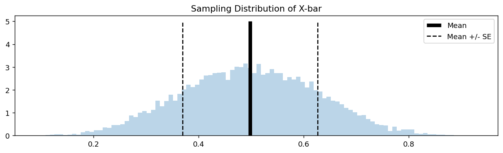

# X-bar의 표준오차

## 개요

통계량의 **표준오차**는 그 표본분포의 표준편차이다. 표본평균 $\bar{X}$에 대해 표준오차는 $\bar{X}$가 표본마다 얼마나 달라지는지를 정량화한다. 모평균 $\mu$의 추정량으로서 표본평균의 정밀도를 이해하는 데 가장 중요한 양이다. 이 페이지에서는 표준오차 공식을 유도하고, 모의실험으로 추정하며, 시각화하는 방법을 보인다.

## 정의

평균이 $\mu$, 표준편차가 $\sigma$인 모집단에서 뽑은 확률표본 $X_1, \ldots, X_n$에 대해 $\bar{X}$의 표준오차는:

$$
\text{SE}(\bar{X}) = \frac{\sigma}{\sqrt{n}}
$$

!!! info "표준오차와 표준편차"

    - **표준편차** $\sigma$는 모집단에서 개별 관측값의 퍼짐을 잰다.
    - **표준오차** $\sigma / \sqrt{n}$는 반복추출에 걸친 표본평균 $\bar{X}$의 퍼짐을 잰다.
    - ($n > 1$이면) 표준오차는 언제나 $\sigma$보다 작고 $n$이 커질수록 줄어든다.

실무에서는 $\sigma$를 대개 모르므로 표본표준편차 $s$로 추정하여 **추정 표준오차**를 얻는다:

$$
\widehat{\text{SE}}(\bar{X}) = \frac{s}{\sqrt{n}}
$$

## 유도

i.i.d. 관측값에 대해 $\bar{X}$의 정의에서 출발하면:

$$
\text{Var}(\bar{X}) = \text{Var}\!\left(\frac{1}{n}\sum_{i=1}^n X_i\right) = \frac{1}{n^2}\sum_{i=1}^n \text{Var}(X_i) = \frac{n\sigma^2}{n^2} = \frac{\sigma^2}{n}
$$

표준오차는 이 분산의 제곱근이다:

$$
\text{SE}(\bar{X}) = \sqrt{\text{Var}(\bar{X})} = \frac{\sigma}{\sqrt{n}}
$$

## 모의실험

다음 코드는 Uniform(0, 1) 모집단에서 $n = 5$로 표본평균 10,000개를 모의실험하여 경험적 표준오차를 계산하고 결과를 시각화한다.

```python
import matplotlib.pyplot as plt
import numpy as np

np.random.seed(0)

# 크기 5짜리 균등표본 U(0,1)을 1만 번 뽑아 그때마다 표본평균을 기록한다.
X_bar = []
for _ in range(10_000):
    x = np.random.uniform(size=(5,))
    X_bar.append(x.mean())

# 1만 개 표본평균의 평균과 표준편차.
#   평균     -> 참 평균 0.5 에 가까워야 한다
#   표준편차 -> 이것이 표준오차다. 이론값은 sigma/sqrt(n) 이며
#              U(0,1)의 sigma = 1/sqrt(12) 이므로
#              (1/sqrt(12))/sqrt(5) = 0.1291 이 나와야 한다.
average = np.array(X_bar).mean()
standard_error = np.array(X_bar).std()

print(f"Estimated Mean of X_bar:  {average:.4f}")
print(f"Standard Error of X_bar:  {standard_error:.4f}")

# Visualize
fig, ax = plt.subplots(figsize=(12, 3))
ax.set_title("Sampling Distribution of X-bar")
ax.hist(X_bar, bins=100, density=True, alpha=0.3)
ax.vlines(average, ymin=0, ymax=5, color="k", lw=5, label="Mean")
ax.vlines(average + standard_error, ymin=0, ymax=5,
          color="k", ls="--", label="Mean +/- SE")
ax.vlines(average - standard_error, ymin=0, ymax=5,
          color="k", ls="--")
ax.legend()
plt.show()
```

출력:

```
Estimated Mean of X_bar:  0.4981
Standard Error of X_bar:  0.1287
```



### 예상 출력

$n = 5$인 Uniform(0, 1)에 대해:

- **이론적 평균**: $\mu = 0.5$
- **이론적 표준오차**: $\sigma / \sqrt{n} = (1/\sqrt{12}) / \sqrt{5} \approx 0.1291$
- **경험적 값**은 이 이론값들에 가깝게 나와야 한다.

## 표준오차가 n에 따라 줄어드는 방식

표준오차는 $1/\sqrt{n}$로 줄어든다. 이는 다음을 뜻한다:

- $n$을 두 배로 하면 표준오차가 $\sqrt{2} \approx 1.41$배 줄어든다.
- $n$을 네 배로 하면 표준오차가 절반이 된다.
- 표준오차를 10분의 1로 줄이려면 관측값이 100배 필요하다.

| $n$ | $\text{SE}(\bar{X}) = \sigma/\sqrt{n}$ | $n=1$ 대비 |
|---|---|---|
| 1 | $\sigma$ | 100% |
| 4 | $\sigma/2$ | 50% |
| 25 | $\sigma/5$ | 20% |
| 100 | $\sigma/10$ | 10% |
| 10,000 | $\sigma/100$ | 1% |

!!! warning "수확 체감"
    $1/\sqrt{n}$ 관계는 관측값을 하나 더할 때마다 정밀도 향상이 점점 작아짐을 뜻한다. $n = 100$에서 $n = 400$으로 (비용을 4배로) 늘려도 표준오차는 절반이 될 뿐이다.

## 연습문제

<div class="drillbox" markdown>

**연습문제 1.** 어떤 모집단의 $\sigma = 10$이다. $n = 25$, $n = 100$, $n = 400$에서 $\bar{X}$의 표준오차를 계산하고 "네 배 규칙"을 확인하라.

</div>

??? success "풀이"
    $$
    \text{SE}(n=25) = \frac{10}{\sqrt{25}} = \frac{10}{5} = 2.0
    $$

    $$
    \text{SE}(n=100) = \frac{10}{\sqrt{100}} = \frac{10}{10} = 1.0
    $$

    $$
    \text{SE}(n=400) = \frac{10}{\sqrt{400}} = \frac{10}{20} = 0.5
    $$

    $n$이 4배가 될 때마다 표준오차가 절반이 된다: $2.0 \to 1.0 \to 0.5$. 네 배 규칙이 확인된다. $\square$

<div class="drillbox" markdown>

**연습문제 2.** 어떤 연구자가 $\bar{X}$의 표준오차를 최대 0.5로 만들고자 한다. 모표준편차는 $\sigma \approx 8$로 추정된다. 최소 표본크기는 얼마인가?

</div>

??? success "풀이"
    다음이 필요하다:

    $$
    \frac{\sigma}{\sqrt{n}} \le 0.5 \implies \sqrt{n} \ge \frac{8}{0.5} = 16 \implies n \ge 256
    $$

    최소 표본크기 $n = 256$이 필요하다. $\square$

<div class="drillbox" markdown>

**연습문제 3.** $n \ge 1$에서 $\text{SE}(\bar{X})$가 $n$의 감소함수이자 볼록함수임을 증명하라. 볼록성은 표본크기를 늘릴 때의 한계 이득에 관해 무엇을 함의하는가?

</div>

??? success "풀이"
    $n > 0$에서 $f(n) = \sigma / \sqrt{n} = \sigma \cdot n^{-1/2}$이라 하자.

    1계도함수:

    $$
    f'(n) = -\frac{\sigma}{2} n^{-3/2} < 0
    $$

    따라서 $f$는 순감소한다. 표본이 클수록 언제나 표준오차가 작아진다.

    2계도함수:

    $$
    f''(n) = \frac{3\sigma}{4} n^{-5/2} > 0
    $$

    따라서 $f$는 순볼록이다. 볼록성은 $n$이 커질수록 표준오차의 감소 속도가 느려짐을 뜻한다. 실용적으로 말하면, 관측값을 하나 더 얻을 때마다 표준오차가 줄어드는 폭이 직전보다 작아진다. 표본크기를 늘리는 데에는 한계 수확 체감이 있다. $\square$

<div class="drillbox" markdown>

**연습문제 4.** 추정 표준오차 $\widehat{\text{SE}} = s / \sqrt{n}$를 사용할 때, 모집단이 정규이면 $(\bar{X} - \mu) / \widehat{\text{SE}}$가 자유도 $n - 1$인 $t$ 분포를 따름을 보여라.

</div>

??? success "풀이"
    $X_1, \ldots, X_n \overset{\text{iid}}{\sim} N(\mu, \sigma^2)$에 대해 다음을 떠올리자:

    - $Z = \frac{\bar{X} - \mu}{\sigma/\sqrt{n}} \sim N(0, 1)$
    - $Q = \frac{(n-1)S^2}{\sigma^2} \sim \chi^2(n-1)$
    - $Z$와 $Q$는 독립이다.

    정의에 의해 $t$ 분포는 $Z \sim N(0,1)$, $Q \sim \chi^2(k)$, $Z \perp Q$일 때 비 $T = Z / \sqrt{Q/k}$이다.

    $$
    T = \frac{\bar{X} - \mu}{\sigma/\sqrt{n}} \cdot \frac{1}{\sqrt{(n-1)S^2 / (\sigma^2(n-1))}} = \frac{\bar{X} - \mu}{\sigma/\sqrt{n}} \cdot \frac{\sigma}{S} = \frac{\bar{X} - \mu}{S/\sqrt{n}} \sim t(n-1)
    $$

    $\square$

<div class="drillbox" markdown>

**연습문제 5.** 모의실험을 Uniform(0, 1) 대신 Exponential(1) 모집단으로 바꾸어라. 이론적 표준오차 $(\sigma/\sqrt{n} = 1/\sqrt{5})$와 경험적 표준오차를 비교하라. 공식 $\text{SE} = \sigma/\sqrt{n}$은 정규가 아닌 모집단에서도 여전히 타당한가?

</div>

??? success "풀이"
    ```python
    import numpy as np
    np.random.seed(0)

    X_bar = [np.random.exponential(size=5).mean() for _ in range(10_000)]

    empirical_se = np.std(X_bar)
    theoretical_se = 1 / np.sqrt(5)

    print(f"Theoretical SE: {theoretical_se:.4f}")
    print(f"Empirical SE:   {empirical_se:.4f}")
    ```

    출력:

    ```
    Theoretical SE: 0.4472
    Empirical SE:   0.4446
    ```

    이론적 표준오차는 $1/\sqrt{5} \approx 0.4472$이고 경험적 표준오차가 이 값에 매우 가깝게 나온다.

    그렇다. 공식 $\text{SE}(\bar{X}) = \sigma/\sqrt{n}$은 모집단 모양과 무관하게 분산이 유한한 **임의의** 모집단에서 타당하다. $\text{Var}(\bar{X}) = \sigma^2/n$이 관측값의 독립성과 분산의 성질에서 곧바로 따라 나오기 때문이다. 이 공식은 정규성에 의존하지 않는다. 모집단 모양에 의존하는 것은 $\bar{X}$의 **분포**(정규인지 아닌지)이며, 표준오차 공식 자체는 보편적이다. $\square$
