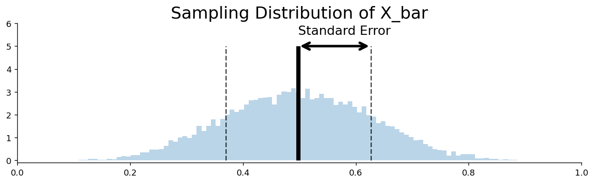

# 표준오차

## 개요

> **참고 자료:** [YouTube — Standard Error](https://www.youtube.com/watch?v=A82brFpdr9g) | [Blog — SD vs SE](https://statisticsbyjim.com/basics/difference-standard-deviation-vs-standard-error/)

**표준오차**(SE)는 표본통계량이 표본마다 얼마나 달라지는지를 정량화한다. 그 통계량의 **표본분포**의 표준편차이다.

## 표준편차와 표준오차

### 표준편차 (SD)

표준편차는 **개별 관측값**이 모평균 주위로 얼마나 흩어져 있는지를 잰다:

$$
\text{SD} = \sqrt{\text{Var}(X)}
$$

### 표준오차 (SE)

표준오차는 **표본통계량**이 참 모수 주위로 얼마나 흩어져 있는지를 잰다:

$$
\text{SE} = \sqrt{\text{Var}(\hat{\theta}(X_1, \dots, X_n))}
$$

### 핵심 구별

- **표준편차**는 개별 자료점이 평균 주위로 퍼진 정도를 잰다.

$$
\text{SD} = \sqrt{\text{Var}(X)}
$$

- **표준오차**는 표본통계량(예: 평균)이 모수 주위로 퍼진 정도를 잰다.

$$
\text{SE} = \sqrt{\text{Var}(\hat{\theta}(X_1, \dots, X_n))}
$$

| | 표준편차 | 표준오차 |
|---|---|---|
| **재는 대상** | 개별 자료의 퍼짐 | 표본통계량의 퍼짐 |
| **의존하는 것** | 모집단의 변동성 | 모집단의 변동성**과** 표본크기 |
| **공식 ($\bar{X}$의 경우)** | $\sigma$ | $\sigma / \sqrt{n}$ |
| **$n$에 따라 줄어드는가?** | 아니오 | 예 |

## 표준화의 공통 형태

> **참고 자료:** [Khan Academy — Standard Error of the Mean](https://www.khanacademy.org/math/ap-statistics/sampling-distribution-ap/sampling-distribution-mean/v/standard-error-of-the-mean)

추론통계학을 관통하는 공통 형태가 있다:

$$
\begin{array}{lllllll}
\displaystyle
\frac{\text{unbiased\_estimator} - \text{parameter}}{\text{standard\_error}}
&=&
\displaystyle
\frac{\bar{X} - \mu}{\frac{\sigma}{\sqrt{n}}}
&\approx&
\displaystyle
\frac{\bar{X} - \mu}{\frac{s}{\sqrt{n}}}
&\approx&
z \;\text{ or }\; t_{n-1} \\[16pt]
\displaystyle
\frac{\text{unbiased\_estimator} - \text{parameter}}{\text{standard\_error}}
&=&
\displaystyle
\frac{\hat{p} - p}{\sqrt{\frac{p(1-p)}{n}}}
&\approx&
\displaystyle
\frac{\hat{p} - p}{\sqrt{\frac{\hat{p}(1-\hat{p})}{n}}}
&\approx&
z
\end{array}
$$

## 물 부족

> **참고 자료:** [Khan Academy — Sampling Distribution Example Problem](https://www.khanacademy.org/math/ap-statistics/sampling-distribution-ap/sampling-distribution-mean/v/sampling-distribution-example-problem)

<div class="probox" markdown>

**문제.** <span class="diff easy" title="쉬움"></span> 남성이 야외 활동을 할 때 평균 2리터의 물을 마시고 표준편차는 0.7리터이다. 남성 50명이 하루 종일 자연 탐방을 가는데 물 110리터를 가져간다. 여행 중 물이 떨어질 확률을 구하라.

</div>

??? success "풀이"
    $X_i$를 $i$번째 사람의 물 소비량이라 하자. 독립을 가정하면 중심극한정리에 의해 표본평균 $\bar{X}$는 근사적으로 평균 2, 표준편차 $0.7/\sqrt{50} \approx 0.0990$인 정규분포를 따른다.

    $$
    \begin{array}{lll}
    \displaystyle
    P\!\left(\bar{X} > \frac{110}{50}\right)
    &=&
    \displaystyle
    P\!\left(\frac{\bar{X} - 2}{0.0990} > \frac{2.2 - 2}{0.0990}\right) \\[12pt]
    &\approx&
    \displaystyle
    P(Z > 2.020) \\[8pt]
    &\approx&
    0.0217
    \end{array}
    $$
## Python: X-bar의 표준오차

### 단일 파일 버전

<div class="codebox" markdown>

#### 예제 1. 표준오차를 한 파일로 구하기 { .eg }

```python
import matplotlib.pyplot as plt
import numpy as np

np.random.seed(0)

def main():
    # 크기 5짜리 균등표본을 1만 번 뽑아 표본평균을 모은다.
    X_bar = []
    for _ in range(10_000):
        x = np.random.uniform(size=(5,))
        x_bar = x.mean()
        X_bar.append(x_bar)

    # 표준오차의 정의를 그대로 실행한 것이 아래 두 줄이다.
    #   average        = 표집분포의 중심 (참 mu = 0.5 의 좋은 추정)
    #   standard_error = 표집분포의 **표준편차**
    # 즉 표준오차는 새로운 개념이 아니라, 통계량의 분포에 대한 표준편차다.
    # 현실에서는 표본이 하나뿐이라 이렇게 구할 수 없어 공식 s/sqrt(n) 을 쓴다.
    average = np.array(X_bar).mean()
    standard_error = np.array(X_bar).std()

    print(f'(Estimated) Mean of X_bar : {average:.4}')
    print(f'Standard Error   of X_bar : {standard_error:.4}')

    fig, ax = plt.subplots(figsize=(12, 3))

    ax.set_title("Sampling Distribution of X_bar", fontsize=20)

    ax.hist(X_bar, bins=100, density=True, alpha=0.3)
    ax.vlines(average, ymin=0, ymax=5, alpha=1.0, color='k', ls='-', lw=5)
    ax.vlines(average + standard_error, ymin=0, ymax=5, alpha=0.7, color='k', ls='--')
    ax.vlines(average - standard_error, ymin=0, ymax=5, alpha=0.7, color='k', ls='--')

    # 평균에서 +1 표준오차까지를 양방향 화살표로 표시해
    # "표준오차 = 이만큼의 폭"임을 그림에서 직접 보여 준다.
    arrowprops = dict(arrowstyle='<->', color='k', linewidth=3, mutation_scale=20)
    ax.annotate(text='',
                xy=(average, 5),
                xytext=(average + standard_error, 5),
                arrowprops=arrowprops)
    ax.annotate(text='Standard Error',
                xy=(average, 5.5),
                xytext=(average, 5.5),
                fontsize=15)

    ax.set_xlim(0.0, 1.0)
    ax.set_ylim(-0.1, 6)

    ax.spines['right'].set_visible(False)
    ax.spines['top'].set_visible(False)

    plt.show()

if __name__ == "__main__":
    main()
```

출력:

```
(Estimated) Mean of X_bar : 0.4981
Standard Error   of X_bar : 0.1287
```



</div>

## 같은 코드를 파일 둘로 나눈다면

위 예제는 한 덩어리로 실행하는 형태였다. 실제 프로젝트에서는 설정과 본문을 파일로 나누는 편이 낫다. 아래 두 블록은 **두 개의 `.py` 파일**을 각각 적은 것이므로, 문서에서 이어 붙여 실행할 수는 없다. 같은 디렉터리에 저장한 뒤 `python standard_error_of_x_bar.py --seed 7` 처럼 실행한다.

### 모듈 버전: `global_name_space.py`

<div class="codebox" markdown>

#### 예제 2. 공유 설정 모듈 { .eg }

```python
import argparse
import numpy as np

# 이 파일은 여러 스크립트가 공유하는 설정을 한곳에 모아 두는 용도다.
# 다른 모듈에서 `from global_name_space import ARGS` 로 가져다 쓴다.
parser = argparse.ArgumentParser(description='Standard error simulation')
parser.add_argument('--seed', type=int, default=1, metavar='S',
                    help='random seed (default: 1)')
ARGS = parser.parse_args()

# 시드를 여기서 한 번만 고정하면 이 설정을 가져다 쓰는 모든 스크립트가
# 같은 난수열을 쓰게 되어 결과가 재현된다.
np.random.seed(ARGS.seed)
```

</div>

### 모듈 버전: `standard_error_of_x_bar.py`

<div class="codebox" markdown>

#### 예제 3. 표준오차를 그림에 표시하기 { .eg }

```python
import matplotlib.pyplot as plt
import numpy as np

from global_name_space import ARGS

def main():
    X_bar = []
    for _ in range(10_000):
        x = np.random.uniform(size=(5,))
        x_bar = x.mean()
        X_bar.append(x_bar)

    average = np.array(X_bar).mean()
    standard_error = np.array(X_bar).std()

    print(f'(Estimated) Mean of X_bar : {average:.4}')
    print(f'Standard Error   of X_bar : {standard_error:.4}')

    fig, ax = plt.subplots(figsize=(12, 3))

    ax.set_title("Sampling Distribution of X_bar", fontsize=20)

    ax.hist(X_bar, bins=100, density=True, alpha=0.3)
    ax.vlines(average, ymin=0, ymax=5, alpha=1.0, color='k', ls='-', lw=5)
    ax.vlines(average + standard_error, ymin=0, ymax=5, alpha=0.7, color='k', ls='--')
    ax.vlines(average - standard_error, ymin=0, ymax=5, alpha=0.7, color='k', ls='--')

    # 평균에서 +1 표준오차까지를 양방향 화살표로 표시해
    # "표준오차 = 이만큼의 폭"임을 그림에서 직접 보여 준다.
    arrowprops = dict(arrowstyle='<->', color='k', linewidth=3, mutation_scale=20)
    ax.annotate(text='',
                xy=(average, 5),
                xytext=(average + standard_error, 5),
                arrowprops=arrowprops)
    ax.annotate(text='Standard Error',
                xy=(average, 5.5),
                xytext=(average, 5.5),
                fontsize=15)

    ax.set_xlim(0.0, 1.0)
    ax.set_ylim(-0.1, 6)

    ax.spines['right'].set_visible(False)
    ax.spines['top'].set_visible(False)

    plt.show()

if __name__ == "__main__":
    main()
```

</div>

## Python: S-squared의 표준오차

### `standard_error_of_s_square.py`

<div class="codebox" markdown>

#### 예제 4. 표본크기에 따른 표준오차 변화 { .eg }

```python
import matplotlib.pyplot as plt
import numpy as np

from global_name_space import ARGS

def main():
    S_square = []
    for _ in range(10_000):
        x = np.random.uniform(size=(5,))
        sigma = x.std()
        S_square.append(sigma**2)

    average = np.array(S_square).mean()
    standard_error = np.array(S_square).std()

    print(f'(Estimated) Mean of S^2 : {average:.4}')
    print(f'Standard Error   of S^2 : {standard_error:.4}')

    fig, ax = plt.subplots(figsize=(12, 3))

    ax.set_title("Sampling Distribution of S^2", fontsize=20)

    ax.hist(S_square, bins=100, density=True, alpha=0.3)
    ax.vlines(average, ymin=0, ymax=12, alpha=1.0, color='k', ls='-', lw=5)
    ax.vlines(average + standard_error, ymin=0, ymax=12, alpha=0.7, color='k', ls='--')
    ax.vlines(average - standard_error, ymin=0, ymax=12, alpha=0.7, color='k', ls='--')

    # 평균에서 +1 표준오차까지를 양방향 화살표로 표시해
    # "표준오차 = 이만큼의 폭"임을 그림에서 직접 보여 준다.
    arrowprops = dict(arrowstyle='<->', color='k', linewidth=3, mutation_scale=20)
    ax.annotate(text='',
                xy=(average, 12),
                xytext=(average + standard_error, 12),
                arrowprops=arrowprops)
    ax.annotate(text='Standard Error',
                xy=(average, 13),
                xytext=(average, 13),
                fontsize=15)

    ax.set_xlim(0.0, 0.2)
    ax.set_ylim(-0.1, 15)

    ax.spines['right'].set_visible(False)
    ax.spines['top'].set_visible(False)

    plt.show()

if __name__ == "__main__":
    main()
```

</div>

## 연습문제

<div class="drillbox" markdown>

**연습문제 1.** <span class="diff easy" title="쉬움"></span>
$\sigma = 50$이다. (a) $n = 25, 100$일 때 $\mathrm{SE}$를 계산하라. (b) $n = 16$에서 $\mathrm{SE} = 5$일 때 $\sigma$를 구하고 $n = 64$에서의 $\mathrm{SE}$를 계산하라.

</div>

??? success "풀이"
    (a) $\mathrm{SE}_{25} = 50/\sqrt{25} = 10$. $\mathrm{SE}_{100} = 50/\sqrt{100} = 5$. $n$이 네 배가 되면 표준오차가 절반이 된다.

    (b) $\sigma/\sqrt{16} = 5$에서 $\sigma = 20$이다. $n = 64$에서 $\mathrm{SE} = 20/\sqrt{64} = 2.5$이다. $n$을 네 배로 하면 표준오차가 절반이 된다.

<div class="drillbox" markdown>

**연습문제 2.** <span class="diff med" title="중간"></span>
**표준오차와 표준편차.** 어떤 연구자가 $n = 100$에 대해 "표본평균 $= 50$, 표준편차 $= 8$"이라고 보고했다. (a) 표본평균의 표준오차는? (b) 비전문가에게 둘의 차이를 설명하라.

</div>

??? success "풀이"
    (a) ($\sigma$ 대신 $s$를 사용한) 추정 표준오차: $\mathrm{SE} = 8/\sqrt{100} = 0.8$.

    (b) **SD = 8:** 자료 집합에서 개별 관측값이 얼마나 달라지는지를 기술한다. 전형적인 개체는 평균에서 약 8단위 떨어져 있다.

    **SE = 0.8:** 표본이 달라질 때 표본평균이 얼마나 달라지는지를 기술한다. 참 모평균은 50에서 약 1.6단위(≈ 표준오차 2개) 이내에 있을 가능성이 높다.

    자료를 더 모아도 표준편차는 달라지지 않지만 표준오차는 $1/\sqrt n$의 비율로 줄어든다. 표준오차를 말해야 할 자리에 표준편차를 보고하거나 그 반대로 하는 것은 과학 논문에서 흔한 오류이다.

<div class="drillbox" markdown>

**연습문제 3.** <span class="diff med" title="중간"></span>
**붓스트랩 표준오차.** 모집단이 정규가 아니고 $\sigma$를 모를 때 **붓스트랩**이 표준오차 추정값을 준다. 붓스트랩으로 SE($\bar X$)를 계산하는 절차를 서술하라.

</div>

??? success "풀이"
    i.i.d. 표본 $X_1, \ldots, X_n$이 주어졌을 때:

    1. 원래 표본에서 복원추출하여 붓스트랩 표본 $X_1^*, \ldots, X_n^*$을 뽑는다.
    2. 붓스트랩 표본에서 $\bar X^*$를 계산한다.
    3. 1–2단계를 $B$번 반복하여(보통 $B = 1000$에서 10000) $\bar X^*_1, \ldots, \bar X^*_B$을 얻는다.
    4. 붓스트랩 복제값들의 표본표준편차로 표준오차를 추정한다: $\hat{\mathrm{SE}}_{\text{boot}} = \sqrt{(1/(B-1))\sum(\bar X^*_b - \bar X^*_\cdot)^2}$.

    **왜 작동하는가:** 붓스트랩 분포가 반복추출에서의 표본분포를 근사한다. 점근적으로 $\hat{\mathrm{SE}}_{\text{boot}} \to \sigma/\sqrt n$이지만, 붓스트랩은 정규근사보다 분포의 모양(치우침, 두꺼운 꼬리)을 더 잘 포착한다.

    닫힌 형태의 표준오차가 없는 경우(중앙값, 비, 복잡한 모형의 회귀계수)에 특히 유용하다.

<div class="drillbox" markdown>

**연습문제 4.** <span class="diff med" title="중간"></span>
**함수의 표준오차.** $\hat\theta$의 $\mathrm{SE}(\hat\theta)$를 알고 $g$가 미분가능할 때 **델타 방법**으로 $\mathrm{SE}(g(\hat\theta))$를 계산하라.

</div>

??? success "풀이"
    **델타 방법:** $\sqrt n(\hat\theta - \theta) \xrightarrow{d} N(0, \sigma^2)$이면, $g'(\theta) \ne 0$인 미분가능한 $g$에 대해:

    $$
    \sqrt n(g(\hat\theta) - g(\theta)) \xrightarrow{d} N(0, [g'(\theta)]^2 \sigma^2)
    $$

    표준오차 형태로는 $\mathrm{SE}(g(\hat\theta)) \approx |g'(\hat\theta)| \cdot \mathrm{SE}(\hat\theta)$이다.

    **예:** $g(\hat p) = \log(\hat p/(1 - \hat p))$(로짓)에 대해 $g'(\hat p) = 1/(\hat p(1 - \hat p))$이므로 $\mathrm{SE}(\hat\eta) = \mathrm{SE}(\hat p)/(\hat p(1 - \hat p))$이다.

    추정량이 표준오차를 아는 더 단순한 추정량의 변환일 때, 델타 방법은 표준오차 계산의 주된 도구가 된다.

<div class="drillbox" markdown>

**연습문제 5.** <span class="diff med" title="중간"></span>
**두 표본의 합동 표준오차.** 평균이 $\mu_1, \mu_2$이고 분산은 미지인 두 모집단에서 독립인 표본을 뽑는다. (a) 등분산 가정(합동), (b) 이분산(Welch) 아래에서 $\bar X_1 - \bar X_2$의 표준오차를 유도하라.

</div>

??? success "풀이"
    독립성에 의해 $\mathrm{Var}(\bar X_1 - \bar X_2) = \sigma_1^2/n_1 + \sigma_2^2/n_2$이다.

    **(a) 합동 ($\sigma_1 = \sigma_2 = \sigma$ 가정):**

    합동 분산: $s_p^2 = ((n_1 - 1)s_1^2 + (n_2 - 1)s_2^2)/(n_1 + n_2 - 2)$.

    $\mathrm{SE}_{\text{pool}} = s_p \sqrt{1/n_1 + 1/n_2}$.

    분산이 같다고 볼 만할 때 표준적인 두 표본 $t$ 검정에서 사용한다. 이 가정이 성립하면 약간 더 효율적이다.

    **(b) Welch (이분산):**

    $\mathrm{SE}_{\text{Welch}} = \sqrt{s_1^2/n_1 + s_2^2/n_2}$.

    합동하지 않고 각 표본이 자신의 분산을 기여한다. $t$ 임계값에는 (정수가 아닌) Welch 자유도를 사용한다.

    현대적 권고: 기본적으로 Welch를 선호하라. 강한 등분산 가정을 요구하지 않으면서 분산이 같을 때에도 거의 같은 성능을 낸다.

<div class="drillbox" markdown>

**연습문제 6.** <span class="diff med" title="중간"></span>
**비복원추출에서의 표준오차.** 크기 $N$인 모집단에서 크기 $n$인 표본을 비복원으로 뽑는다. SE($\bar X$)를 계산하고 **유한모집단 수정**을 찾아라.

</div>

??? success "풀이"
    유한모집단에서 비복원추출을 하면:

    $$
    \mathrm{Var}(\bar X) = \frac{\sigma^2}{n}\!\left(1 - \frac{n}{N}\right)
    $$

    따라서 $\mathrm{SE}(\bar X) = (\sigma/\sqrt n) \sqrt{1 - n/N}$이다. 인수 $\sqrt{1 - n/N}$이 **유한모집단 수정(FPC)**이다.

    **극한:**

    - $n/N \to 0$ (추출 비율이 매우 작을 때): FPC $\to 1$로 표준적인 $\sigma/\sqrt n$이 복원된다. 전국 조사($n = 1000, N \approx 10^8$)에 해당한다.
    - $n/N \to 1$ (전수조사): FPC $\to 0$으로 표본추출 변동성이 없다. 전수조사는 결정론적 추정값을 준다.

    **FPC가 중요한 경우:** 감사(송장 500건 중 100건 추출, $n/N = 0.2$, FPC $\approx 0.89$). FPC가 신뢰구간을 약 11% 좁히므로 무시할 수 없다.

    입문 통계학의 공식 대부분이 FPC를 무시하는 이유는 일반적인 과학 표본에서 $n/N$이 작기 때문이다.

---

## 정리하며

**표준오차는 통계량의 표본분포의 표준편차**다. 표준편차와 이름이 닮았을 뿐 재는 대상이 전혀 다르다.

| | 무엇이 흩어지는가 | $n$ 이 커지면 |
|---|---|---|
| 표준편차 SD | 개별 관측값 | **변하지 않는다** (모집단의 성질) |
| 표준오차 SE | 표본통계량 | $1/\sqrt n$ 로 **줄어든다** |

- **표본을 늘려도 자료가 덜 흩어지지는 않는다.** 줄어드는 것은 추정값의 흔들림뿐이다. 이 둘을 혼동해 그림에 오차막대를 잘못 붙이는 일이 흔하다.
- **표준화의 공통 형태** $(\hat\theta-\theta)/\mathrm{SE}(\hat\theta)$ 가 이 책 전체에서 반복된다. $z$ 통계량, $t$ 통계량, 회귀계수의 검정통계량이 모두 이 꼴이다.
- **$\mathrm{SE}(\bar X)=\sigma/\sqrt n$ 이고, $\sigma$ 를 모르면 $s/\sqrt n$ 으로 추정한다.** 그 대체가 $t$ 분포를 불러온다.
- $S^2$ 에도 표준오차가 있으며, 그것은 4차적률에 의존한다. 평균보다 훨씬 꼬리에 민감하다는 뜻이다.

다음 절 **비율의 표본분포**로 넘어간다. 베르누이 자료에서는 $\mathrm{SE}(\hat p)=\sqrt{p(1-p)/n}$ 이며, 표준오차가 추정하려는 모수 자체에 의존한다는 새로운 문제가 생긴다.
