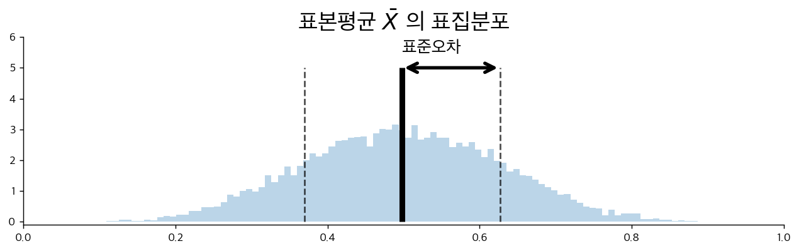
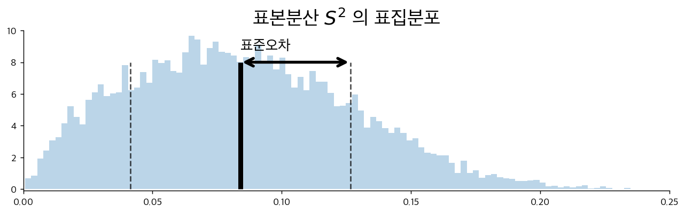

# 표준오차

## 개요

> **참고 자료:** [YouTube — Standard Error](https://www.youtube.com/watch?v=A82brFpdr9g) | [Blog — SD vs SE](https://statisticsbyjim.com/basics/difference-standard-deviation-vs-standard-error/)

어떤 논문의 표에 "평균 50, ±8"이라고 적혀 있다. 이 8은 무엇인가. 응답자 한 사람 한 사람이 평균에서 대략 8만큼 떨어져 있다는 뜻일 수도 있고, 이 연구를 처음부터 다시 했을 때 평균값 자체가 8쯤 흔들린다는 뜻일 수도 있다. 두 진술은 전혀 다른 말이다. 앞의 것이 **표준편차**이고, 뒤의 것이 **표준오차**다.

앞 절에서 통계량이 확률변수임을 보았다. 확률변수에는 분포가 있고, 분포에는 표준편차가 있다. 통계량의 분포, 곧 표본분포의 표준편차에 붙인 이름이 표준오차다. 그러니 표준오차는 새 개념이 아니라 **어느 분포의 표준편차인지**를 밝히는 이름이다. 이 절의 일은 그 "어느 분포"를 표준편차의 것과 헷갈리지 않게 하는 것이다.

## 무엇이 흩어지는가

두 양의 공식을 나란히 적어 보면 차이가 어디에 있는지 보인다. 표준편차는 관측값 하나를 나타내는 확률변수 $X$의 분산에서 나온다.

$$
\text{SD} = \sqrt{\text{Var}(X)}
$$

표준오차는 표본 전체를 받아 수 하나를 내놓는 통계량 $\hat\theta$의 분산에서 나온다.

$$
\text{SE} = \sqrt{\text{Var}(\hat{\theta}(X_1, \dots, X_n))}
$$

제곱근 안에 들어 있는 것이 다르다. 앞의 것은 **개별 자료점**이 평균 주위로 퍼진 정도를 재고, 뒤의 것은 표본을 다시 뽑을 때마다 **계산 결과**가 참 모수 주위로 얼마나 튀는지를 잰다.

이 차이에서 성질의 차이가 따라 나온다. 표준편차는 모집단의 변동성만으로 정해지는 모집단의 성질이라 표본크기와 아무 상관이 없다. 키가 7cm만큼 흩어져 있는 나라에서는 1만 명을 재든 100만 명을 재든 여전히 7cm만큼 흩어져 있다. 반면 표준오차는 모집단의 변동성**과** 표본크기에 함께 의존한다. 표본평균의 경우 표준편차가 $\sigma$인 데 비해 표준오차는 $\sigma/\sqrt n$이므로, $n$이 커지면 앞의 것은 그대로인데 뒤의 것만 줄어든다.

그러므로 "자료를 더 모으면 흩어짐이 줄어든다"는 말은 절반만 맞다. 줄어드는 것은 **추정값의 흔들림**이지 자료 자체의 흩어짐이 아니다. 이 혼동은 그림에 오차막대를 잘못 붙이는 흔한 실수로 이어지며, 연습문제 8에서 그 대가를 수치로 확인한다.

## 표준화의 공통 형태

> **참고 자료:** [Khan Academy — Standard Error of the Mean](https://www.khanacademy.org/math/ap-statistics/sampling-distribution-ap/sampling-distribution-mean/v/standard-error-of-the-mean)

표준오차가 이토록 중요한 것은 그것이 언제나 **분모 자리에** 놓이기 때문이다. 추정값에서 모수를 빼고 표준오차로 나누면 "참값에서 몇 표준오차만큼 떨어져 있는가"라는 눈금 없는 수가 되고, 그 수는 이미 표가 마련되어 있는 분포를 따른다. 추론통계학을 관통하는 공통 형태가 이것이다.

$$
\begin{array}{lllllll}
\displaystyle
\frac{\text{불편추정량} - \text{모수}}{\text{표준오차}}
&=&
\displaystyle
\frac{\bar{X} - \mu}{\frac{\sigma}{\sqrt{n}}}
&\approx&
\displaystyle
\frac{\bar{X} - \mu}{\frac{s}{\sqrt{n}}}
&\approx&
z \;\text{ 또는 }\; t_{n-1} \\[16pt]
\displaystyle
\frac{\text{불편추정량} - \text{모수}}{\text{표준오차}}
&=&
\displaystyle
\frac{\hat{p} - p}{\sqrt{\frac{p(1-p)}{n}}}
&\approx&
\displaystyle
\frac{\hat{p} - p}{\sqrt{\frac{\hat{p}(1-\hat{p})}{n}}}
&\approx&
z
\end{array}
$$

두 줄이 같은 이야기를 한다. 왼쪽 끝의 뼈대는 언제나 "불편추정량 빼기 모수, 나누기 표준오차"다. 그런데 가운데 항은 $\sigma$나 $p$를 알아야 계산되므로 통계량이 아니다. 그래서 오른쪽처럼 $\sigma$를 $s$로, $p$를 $\hat p$로 바꿔 쓰며, 그 대체의 대가가 정규분포 대신 $t_{n-1}$이거나 "표본이 충분히 커야 한다"는 단서다.

### 이 장의 통계량을 한자리에

5장은 여섯 가지 통계량의 표본분포를 차례로 다룬다. 각각이 어떤 모습으로 표준화되는지 미리 모아 두면, 뒤의 절들이 같은 이야기의 변주임이 보인다.

| 절 | 통계량 | 표준화한 양 | 분포 | 언제 쓸 수 있는가 |
|:---|:---|:---|:---|:---|
| [5.4](sample_mean.md) | $\bar X$ | $\dfrac{\bar X - \mu}{\sigma/\sqrt n}$ | $N(0,1)$ | 정규모집단이면 **정확**. 아니면 대략 $n \ge 30$ |
| [5.4](sample_mean.md) | 같음 ($\sigma$ 모름) | $\dfrac{\bar X - \mu}{S/\sqrt n}$ | $t_{n-1}$ | 정규모집단이면 **정확**. 아니면 근사이며, $S$도 함께 흔들려 $\sigma$를 알 때보다 큰 $n$이 필요하다 |
| [5.5](sample_proportion.md) | $\hat p$ | $\dfrac{\hat p - p}{\sqrt{p(1-p)/n}}$ | $N(0,1)$ | $n\hat p \ge 5$ 그리고 $n(1-\hat p) \ge 5$ — 확률을 어림할 때. 신뢰구간이나 검정에 쓰려면 둘 다 $10$ 이상 |
| [5.6](sample_variance.md) | $S^2$ | $\dfrac{(n-1)S^2}{\sigma^2}$ | $\chi^2_{n-1}$ | 정규모집단이면 **정확**. 아니면 $n$을 키워도 낫지 않으므로 [부트스트랩](../../ch17/bootstrap/bootstrap.md)(17장)으로 간다 |
| [5.7](diff_means.md) | $\bar X_1 - \bar X_2$ | $\dfrac{(\bar X_1 - \bar X_2)-(\mu_1-\mu_2)}{\sqrt{\sigma_1^2/n_1 + \sigma_2^2/n_2}}$ | $N(0,1)$ | 정규모집단이면 **정확**. 아니면 두 $n$ 모두 대략 $30$ 이상 |
| [5.7](diff_means.md) | 같음 (등분산, $\sigma$ 모름) | $\dfrac{(\bar X_1 - \bar X_2)-(\mu_1-\mu_2)}{\sqrt{S_p^2\left(1/n_1 + 1/n_2\right)}}$ | $t_{n_1+n_2-2}$ | 정규·등분산이면 **정확**. 정규성만 깨졌다면 두 $n$ 모두 대략 $30$ 이상. 등분산이 깨지면 $n$을 키워도 낫지 않으므로 [Welch](diff_means_welch.md)로 간다 |
| [5.7](diff_means.md) | 같음 (이분산, Welch) | $\dfrac{(\bar X_1 - \bar X_2)-(\mu_1-\mu_2)}{\sqrt{S_1^2/n_1 + S_2^2/n_2}}$ | $t_\nu$ | 정규모집단이면 실용상 정확($\nu$ 자체가 Welch–Satterthwaite 근사). 아니면 두 $n$ 모두 대략 $30$ 이상 |
| [5.8](diff_proportions.md) | $\hat p_1 - \hat p_2$ | $\dfrac{(\hat p_1 - \hat p_2)-(p_1-p_2)}{\sqrt{\dfrac{p_1(1-p_1)}{n_1} + \dfrac{p_2(1-p_2)}{n_2}}}$ | $N(0,1)$ | 두 집단 **각각** $n_i\hat p_i \ge 5$ 그리고 $n_i(1-\hat p_i) \ge 5$ (신뢰구간·검정이면 각각 $10$) |
| [5.9](var_ratio.md) | $S_1^2/S_2^2$ | $\dfrac{S_1^2/\sigma_1^2}{S_2^2/\sigma_2^2}$ | $F_{n_1-1,\;n_2-1}$ | 정규모집단이면 **정확**. 아니면 $n$을 키워도 낫지 않으므로 [브라운–포사이드](../../ch15/robust_tests/robust_tests.md)(15장)나 [순열검정](../../ch17/permutation/permutation.md)(17장)으로 간다 |

**아홉 줄 가운데 일곱은 같은 틀이고 둘은 다르다.** 평균과 비율 쪽(5.4, 5.5, 5.7, 5.8)은 모두 위의 공통 형태 그대로다. 추정량에서 모수를 빼고 표준오차로 나눈다. 그런데 분산 쪽(5.6, 5.9)만은 빼지 않는다. $S^2$은 $\sigma^2$으로 **나누고**, $S_1^2$은 $S_2^2$과 **견준다**.

**까닭은 분산이 제곱이라는 데 있다.** 제곱은 음수가 될 수 없어 $S^2$의 분포가 0에서 막히고 오른쪽으로 치우친다. "중심에서 $\pm$몇 표준오차"라는 대칭적인 자를 들이대기에 맞지 않는 모양이다. 그래서 차 대신 **비**로 잰다. $S^2/\sigma^2$이 1에서 얼마나 벗어나는가를 묻는 것이며, 그 비가 따르는 분포가 하나일 때 $\chi^2$이고 둘을 견줄 때 $F$다.

여기서 [5.2절의 네 분포](../distributions/normal.md)가 각자 자리를 찾는다. **$N$과 $t$는 차를 재는 자이고, $\chi^2$과 $F$는 비를 재는 자다.** 어느 것이 나올지는 통계량이 덧셈으로 만들어졌는지 제곱으로 만들어졌는지가 정한다.

### 마지막 열을 가볍게 읽지 말 것

조건을 적어 두었지만 그 성격이 줄마다 다르다. **두 부류를 갈라서 보아야 한다.**

**평균과 비율은 표본을 늘리면 구제된다.** 모집단이 정규가 아니어도 $n$을 키우면 중심극한정리가 일을 해 준다. 다만 $\sigma$를 모를 때는 근사가 **두 군데**에서 들어온다. $\bar X$의 모양이 정규에 가까워지는 데 $n$이 필요하고, $S$가 $\sigma$를 제대로 대신하는 데 또 $n$이 필요하다. 그래서 같은 자료에서도 $t$ 쪽이 $z$ 쪽보다 늦게 도착한다. $\text{Exp}(1)$에서 $\sigma$를 알면 $n = 30$에 이미 맞지만, $S$로 바꾸면 명목 $5\%$ 검정이 실제로 $8.2\%$를 기각하고 $n = 1000$이 되어야 $5.1\%$로 내려온다([3.5절 연습문제 12](../../ch03/limits/clt.md)). 다만 "$n \ge 30$"은 왜도가 $1$ 안팎인 온건한 모집단을 염두에 둔 어림일 뿐이다. [로그정규처럼 왜도가 6이면](diff_means_nonnormal.md) $n = 100$에서도 신뢰구간이 참값을 덮는 비율이 약속한 값에 닿지 않아 수백 개가 필요하다. 비율 쪽의 $5$도 마찬가지로 느슨한 기준이다. 그리고 여기서 구제되는 것은 **비정규성**뿐이다. 합동 $t$의 등분산 가정이 깨진 경우는 다르다. 두 표본크기의 비를 유지한 채 $n$을 키우면 오류율이 명목값으로 돌아오는 것이 아니라 극한값으로 다가가므로, 표에서 그 줄만 [Welch](diff_means_welch.md)로 가라고 적어 두었다.

**비율 두 줄에는 "정확"이 아예 없다.** 다른 줄들은 모집단이 정규이기만 하면 정확해지지만 $\hat p$은 그런 경우가 없다. $\hat p$이 $0, 1/n, 2/n, \ldots$라는 격자 위에만 놓이는 **이산** 통계량이라, 연속인 정규분포와 정확히 같아질 수 없기 때문이다. 그래서 이 두 줄은 처음부터 조건만 적는다.

**비율의 $5$와 $10$은 서로 다른 것을 보장한다.** 문턱을 둘로 나누어 쓰는 이유가 여기 있다. $n\hat p \ge 5$가 지키는 것은 분포의 **모양**이다. 이항분포의 왜도가 $(1-2p)/\sqrt{np(1-p)}$이므로 이 조건은 왜도를 대략 $0.45$ 아래로 묶고, 그 정도면 $P(\hat p > 0.35)$ 같은 **확률 하나를 어림하는 데** 무리가 없다.

신뢰구간은 그보다 많은 것을 요구한다. 구간이 맞으려면 가운데가 아니라 **꼬리**가 맞아야 하고, 게다가 구간을 만들 때는 모르는 $p$ 대신 $\hat p$을 표준오차에 넣는 2차 오차가 더해진다. 그래서 $95\%$를 약속한 왈드 구간이 실제로 참값을 덮는 비율(**포함률**)은

| 조건 | 왈드 $95\%$ 구간의 실제 포함률 |
|:---|:---|
| $np = 5$ | $0.879 \sim 0.910$ |
| $np = 10$ | $0.932 \sim 0.959$ |

처럼 나온다. **$95\%$라고 적어 놓고 실제로는 $88\%$밖에 덮지 못하는 것이 $np = 5$의 상태다.** $10$으로 올리면 $93$–$96\%$까지 회복된다. 확률을 어림할 때 $5$, 구간이나 검정에 쓸 때 $10$을 쓰는 까닭이 이것이다. 자세한 수치는 [이항분포의 정규근사](../../ch04/discrete_distributions/binomial.md#언제-쓸-수-있는가-5와-10)에 있다.

다만 $10$도 완전한 해결은 아니다. 위 표에서 보듯 $np = 10$에서도 포함률이 $95\%$에 정확히 앉지는 않는다. 구간이 중요한 상황이라면 문턱값을 올리기보다 **애초에 더 나은 구간**을 쓰는 편이 낫다. 윌슨 구간이 그것이며 [5.5절](phat_wald_wilson.md)과 8장에서 다룬다.

**분산은 구제되지 않는다.** $\chi^2$과 $F$는 중심극한정리가 아니라 **정규성 자체**에 기대고 있다. 제곱합이 $\chi^2$이 되는 것은 원래 자료가 정규일 때뿐이므로, 가정이 깨지면 $n$을 아무리 키워도 회복되지 않는다. 얼마나 나쁜지는 숫자로 볼 수 있다. $\text{Exp}(1)$ 자료에서 [$F$ 검정의 제1종 오류율](var_ratio_nonnormal.md)은 $n = 50$에서 $0.296$이다. **명목 $0.05$의 여섯 배**이며, $n$을 늘려도 이 값은 줄지 않는다.

**막다른 길이라는 말은 아니다. 연장을 바꾸면 된다.** 같은 $\text{Exp}(1)$ 자료에서 [브라운–포사이드 검정](../../ch15/robust_tests/robust_tests.md)과 [순열검정](../../ch17/permutation/permutation.md)의 제1종 오류율은 $0.05$ 근처에 앉는다. $F$ 검정이 $0.296$까지 치솟던 바로 그 자리다. 두 분산을 견주는 일은 15장이 맡고, 분산 하나의 구간추정은 분포족을 전혀 가정하지 않는 [부트스트랩](../../ch17/bootstrap/bootstrap.md)이 맡는다. 표의 마지막 열에 그 행선지를 적어 두었다.

!!! warning "레빈이라고만 쓰면 어느 쪽인지 알 수 없다"
    레빈 검정은 각 관측값을 **집단 중심에서 떨어진 거리**로 바꾼 뒤 그 거리에 분산분석을 돌리는 방법인데, 그 **중심을 무엇으로 잡느냐**에 따라 성질이 크게 달라진다.

    중심을 **평균**으로 잡은 원래 형태는 치우친 자료에서 함께 무너진다. 중심을 **중앙값**으로 바꾼 것이 **브라운–포사이드**이고, 이 쪽만 버틴다. 세 집단에 각 $20$개씩, 분산이 실제로 모두 같은 상황에서 잰 제1종 오류율이 이렇다.

    | 모집단 | 바틀렛 | 레빈(평균 중심) | 브라운–포사이드(중앙값 중심) |
    |:---|---:|---:|---:|
    | 정규 | $0.049$ | $0.046$ | $0.031$ |
    | 지수 | $0.380$ | $0.186$ | $0.045$ |
    | 로그정규 | $0.685$ | $0.254$ | $0.038$ |

    **평균 중심 레빈은 로그정규에서 $0.254$로 명목의 다섯 배다.** 그러므로 "레빈을 쓰면 된다"는 말은 절반만 맞다. `scipy.stats.levene`의 기본값은 `center='median'`, 곧 브라운–포사이드이며, 이 책에서 그냥 "레빈"이라 적힌 곳은 대개 이 기본값을 뜻한다. 자세한 비교는 [15장](../../ch15/robust_tests/robust_tests.md)에 있다.

이 비대칭이 실무에서 갖는 뜻은 분명하다. 평균을 다룰 때는 "표본이 충분한가"를 묻지만, **분산을 다룰 때는 "정규성이 맞는가"를 물어야 한다.** 앞의 물음에는 자료를 더 모으는 것이 답이 되지만, 뒤의 물음에는 방법을 바꾸는 것만이 답이 된다. 근사가 언제 믿을 만한지의 일반론은 [3.5절의 중심극한정리](../../ch03/limits/clt.md)가 답했다.

## 물 부족

> **참고 자료:** [Khan Academy — Sampling Distribution Example Problem](https://www.khanacademy.org/math/ap-statistics/sampling-distribution-ap/sampling-distribution-mean/v/sampling-distribution-example-problem)

한 사람이 물을 얼마나 마시는지는 사람마다 0.7리터쯤 다르다. 그러나 50명이 마시는 **평균**은 그만큼 흔들리지 않는다. 물을 얼마나 챙겨 가야 하는지를 정하는 것은 개인차가 아니라 평균의 흔들림, 곧 표준오차다.

<div class="probox" markdown>

**문제.** <span class="diff easy" title="쉬움"></span> 남성이 야외 활동을 할 때 평균 2리터의 물을 마시고 표준편차는 0.7리터이다. 남성 50명이 하루 종일 자연 탐방을 가는데 물 110리터를 가져간다. 여행 중 물이 떨어질 확률을 구하라.

</div>

??? success "풀이"
    $X_i$를 $i$번째 사람의 물 소비량이라 하자. 독립을 가정하면 중심극한정리에 의해 표본평균 $\bar{X}$는 근사적으로 평균 2, 표준편차 $0.7/\sqrt{50} \approx 0.0990$인 정규분포를 따른다.

    $$
    \begin{array}{lll}
    \displaystyle
    P\!\left(\bar{X} > \frac{110}{50}\right)
    &=&
    \displaystyle
    P\!\left(\frac{\bar{X} - 2}{0.0990} > \frac{2.2 - 2}{0.0990}\right) \\[12pt]
    &\approx&
    \displaystyle
    P(Z > 2.020) \\[8pt]
    &\approx&
    0.0217
    \end{array}
    $$

## 표집분포를 직접 만들어 보면

표준오차가 표집분포의 표준편차라면, 표집분포를 손에 쥐고 있을 때 표준오차는 그저 그 값들의 표준편차일 뿐이다. 아래 코드가 하는 일이 정확히 그것이다. $\text{Uniform}(0,1)$에서 크기 5짜리 표본을 1만 번 뽑아 표본평균 1만 개를 모으고, 그 1만 개의 평균과 표준편차를 잰다. 평균은 참값 0.5 근처에 앉고, 표준편차가 곧 표준오차다.

물론 현실에서 표본은 한 번밖에 뽑지 못하므로 이렇게 할 수 없다. 그래서 $s/\sqrt n$이라는 공식을 쓰는 것이고, 이 모의실험은 그 공식이 무엇을 대신하고 있는지를 눈으로 보여 주는 장치다.

<div class="exbox" markdown>

**보기 1.** <span class="diff easy" title="쉬움"></span> 표준오차를 한 파일로 구하기. $\text{Uniform}(0,1)$에서 $n = 5$인 표본을 1만 번 뽑아 표본평균 1만 개를 모으고, 그 평균과 표준편차를 재어 표준오차의 **정의**를 그대로 실행한다.

**(1)** 코드가 내놓을 두 숫자를 이론으로 미리 적으시오.

**(2)** 실행해 확인하고, 그림에서 양방향 화살표가 가리키는 폭이 분포의 어느 정도를 가두는지 말하시오.

</div>

??? success "풀이"

    **(1) 이론값.** $\text{Uniform}(0,1)$은 $\mu = 1/2$, $\sigma = 1/\sqrt{12}$이므로

    $$
    E[\bar X] = 0.5, \qquad
    \operatorname{SE}(\bar X) = \frac{\sigma}{\sqrt n} = \frac{1}{\sqrt{60}} = 0.129099
    $$

    이다. 1만 번 되풀이할 때 이 두 추정값이 흔들리는 폭은 각각 $\operatorname{SE}/\sqrt{B} = 0.001291$과 $\operatorname{SE}/\sqrt{2B} = 0.000913$이므로, **소수 셋째 자리까지만 맞기를 기대해야 한다.**

    화살표가 가두는 확률은 $n = 5$에서 정확히 $0.6724$다([표본평균 쪽의 보기 7](sample_mean.md)에서 어윈-홀 분포로 계산했다). 정규분포의 $0.6827$보다 $0.0103$ 작다.

    **(2) 실행.**


    ```python
    import matplotlib.pyplot as plt
    import numpy as np

    # 그림에 한글을 쓰므로 한글 글꼴을 지정한다. 맥이면 'Apple SD Gothic Neo',
    # 윈도우면 'Malgun Gothic', 리눅스면 'NanumGothic' 정도가 무난하다.
    # 글꼴을 바꾸면 마이너스 기호가 깨지므로 unicode_minus 도 함께 꺼 준다.
    plt.rcParams['font.family'] = 'Apple SD Gothic Neo'
    plt.rcParams['axes.unicode_minus'] = False

    np.random.seed(0)

    def main():
        # 크기 5짜리 균등표본을 1만 번 뽑아 표본평균을 모은다.
        X_bar = []
        for _ in range(10_000):
            x = np.random.uniform(size=(5,))
            x_bar = x.mean()
            X_bar.append(x_bar)

        # 표준오차의 정의를 그대로 실행한 것이 아래 두 줄이다.
        #   average        = 표집분포의 중심 (참 mu = 0.5 의 좋은 추정)
        #   standard_error = 표집분포의 표준편차 <- 이것이 표준오차다
        # 즉 표준오차는 새로운 개념이 아니라, 통계량의 분포에 대한 표준편차다.
        # 현실에서는 표본이 하나뿐이라 이렇게 구할 수 없어 공식 s/sqrt(n) 을 쓴다.
        X_bar = np.array(X_bar)
        average = X_bar.mean()
        standard_error = X_bar.std()

        print(f'표본평균의 표집분포 중심 : {average:.4}')
        print(f'표본평균의 표준오차      : {standard_error:.4}')

        fig, ax = plt.subplots(figsize=(12, 3))
        # 한글은 $...$ 바깥에 둔다. 수식 글꼴에는 한글 글리프가 없다.
        ax.set_title(r'표본평균 $\bar X$ 의 표집분포', fontsize=20)

        ax.hist(X_bar, bins=100, density=True, alpha=0.3)
        ax.vlines(average, ymin=0, ymax=5, alpha=1.0, color='k', ls='-', lw=5)
        ax.vlines(average + standard_error, ymin=0, ymax=5, alpha=0.7, color='k', ls='--')
        ax.vlines(average - standard_error, ymin=0, ymax=5, alpha=0.7, color='k', ls='--')

        # 평균에서 +1 표준오차까지를 양방향 화살표로 표시해
        # "표준오차 = 이만큼의 폭"임을 그림에서 직접 보여 준다.
        ax.annotate('', xy=(average, 5), xytext=(average + standard_error, 5),
                    arrowprops=dict(arrowstyle='<->', color='k', linewidth=3,
                                    mutation_scale=20))
        ax.text(average, 5.5, '표준오차', fontsize=15)

        ax.set_xlim(0.0, 1.0)
        ax.set_ylim(-0.1, 6)

        ax.spines['right'].set_visible(False)
        ax.spines['top'].set_visible(False)

        plt.show()

    if __name__ == "__main__":
        main()
    ```

    출력:

    ```
    표본평균의 표집분포 중심 : 0.4981
    표본평균의 표준오차      : 0.1287
    ```

    

    **두 숫자가 띠 안에 든다.** 중심 $0.4981$이 $0.5$에서 $0.0019$ 떨어져 있어 몬테카를로 오차 $0.001291$의 $1.47$배, 표준오차 $0.1287$이 $0.129099$에서 $0.0004$ 떨어져 있어 $0.000913$의 $0.44$배다. **표준오차는 새로 배울 개념이 아니라 "통계량 값을 잔뜩 모아 잰 표준편차"**라는 것이 이 두 줄의 내용이다.

    **화살표의 폭.** 평균에서 한 표준오차까지가 화살표이고, 양쪽을 합한 구간 $[\bar X - \operatorname{SE},\ \bar X + \operatorname{SE}]$이 가두는 확률은 $0.6724$다. 정규분포라면 $0.6827$이니 $1$ 퍼센트포인트 작다. $n = 5$의 균등 표본평균은 꼬리가 정규보다 짧아($\bar X$의 초과첨도 $-0.24$) 한 표준오차 안에 든 질량이 오히려 **적다.**

    현실에서는 이 그림을 그릴 수 없다는 점을 잊지 말아야 한다. 표본은 한 번만 뽑히므로 $\bar X$ 값 하나밖에 손에 없고, 1만 개를 모아 표준편차를 재는 일은 불가능하다. $s/\sqrt n$이라는 공식이 **이 그림을 대신하는 장치**다.


## 같은 코드를 파일 둘로 나눈다면

위 보기는 한 덩어리로 실행하는 형태였다. 실제 프로젝트에서는 설정과 본문을 파일로 나누는 편이 낫다. 아래 두 블록은 **두 개의 `.py` 파일**을 각각 적은 것이므로, 문서에서 이어 붙여 실행할 수는 없다. 같은 디렉터리에 저장한 뒤 `python standard_error_of_x_bar.py --seed 7` 처럼 실행한다.

<div class="exbox" markdown>

**보기 2.** <span class="diff easy" title="쉬움"></span> 공유 설정 모듈 — `global_name_space.py`. 난수 씨앗과 그림 설정만 담은 파일이다. 계산도 그림도 없다.

**(1)** 계산이 하나도 없는 이 파일이 어떻게 뒤의 두 파일을 재현 가능하게 만드는지, 그 구조를 설명하시오.

**(2)** `from global_name_space import ARGS`에서 `ARGS`라는 이름을 실제로 쓰지 않는데도 이 줄이 반드시 있어야 하는 까닭을 말하고, 이 방식이 깨지는 경우를 하나 들으시오.

</div>

??? success "풀이"

    **유도할 식이 없는 보기다.** 여기서 읽을 것은 수가 아니라 **구조**다.

    **(1) import 가 곧 실행이다.** 파이썬에서 모듈을 처음 가져오면 그 파일의 최상위 문장이 전부 **한 번** 실행된다. 이 파일의 최상위에는 세 가지가 있다.

    1. `ARGS = parser.parse_args()` — 명령줄을 읽어 `--seed` 값을 정한다.
    2. `np.random.seed(ARGS.seed)` — 전역 난수 상태를 그 값으로 고정한다.
    3. `plt.rcParams[...] = ...` — 글꼴과 마이너스 기호 설정을 바꾼다.

    그러므로 **이 파일을 가져오는 행위 자체가 "씨앗 고정 + 그림 설정"을 수행한다.** 뒤의 두 파일은 `np.random.seed`를 한 줄도 쓰지 않는데도 재현 가능한 결과를 내는데, 그 일을 여기서 대신 해 주기 때문이다.

    씨앗을 **한 곳에서 한 번만** 정한다는 점이 핵심이다. 파일마다 `np.random.seed(1)`을 적어 두면 어느 한 곳을 고치는 순간 조용히 어긋나기 시작한다. 모듈 하나로 모아 두면 그럴 수 없다. 설정이 여러 군데 흩어지지 않게 한다는 뜻에서 **단일 진실 공급원**을 둔 것이다.

    **(2) 쓰이지 않는 이름을 가져오는 까닭.** `from global_name_space import ARGS`라고 적으면 린터는 "쓰지 않는 import"라고 경고할 것이다. 그러나 이 줄을 지우면 모듈이 아예 로드되지 않고, 따라서 **씨앗도 글꼴도 적용되지 않는다.** 가져오는 이름이 아니라 **가져오는 행위**가 목적인 import다. 이런 것을 부작용을 노린 import 라 부르며, 드물지만 설정 모듈에서는 흔한 관용이다.

    같은 이유로 `import global_name_space`라고만 적어도 효과는 같다. `ARGS`를 명시하는 것은 "이 파일이 설정을 들고 있다"는 신호를 코드에 남기려는 선택이다.

    **깨지는 경우.** `parse_args()`를 모듈 최상위에서 부르는 것이 값이다. 이 파서는 `--seed`만 알고 있으므로, **이 모듈을 가져오는 어떤 프로그램이든 자기 명령줄 인자를 그 파서에 내주게 된다.**

    ```
    $ python standard_error_of_s_square.py --bins 50
    usage: standard_error_of_s_square.py [-h] [--seed S]
    standard_error_of_s_square.py: error: unrecognized arguments: --bins 50
    ```

    `standard_error_of_s_square.py`는 `--bins`라는 옵션을 알지 못하지만, 그 오류를 내는 주체도 그 파일이 아니다. `global_name_space`가 가진 파서다. 같은 이유로 `pytest`나 주피터에서 이 모듈을 가져오면 그쪽의 명령줄 인자를 읽으려 들어 `SystemExit`로 죽는다.

    고치는 방법은 파싱을 함수 안으로 내리고(`def get_args(): ...`) 호출 시점을 `if __name__ == "__main__":` 안으로 옮기는 것이다. 다만 그러면 씨앗 고정도 명시적으로 불러야 하므로 "가져오기만 하면 설정이 끝난다"는 편의는 사라진다. **편의와 안전을 맞바꾸는 자리**이고, 이 쪽에서는 보기 셋이 같은 씨앗을 쓰는 것을 보이려고 편의 쪽을 택했다.


    ```python
    import argparse

    import matplotlib.pyplot as plt
    import numpy as np

    # 이 파일은 여러 스크립트가 공유하는 설정을 한곳에 모아 두는 용도다.
    # 다른 모듈에서 `from global_name_space import ARGS` 로 가져다 쓴다.
    parser = argparse.ArgumentParser(description='Standard error simulation')
    parser.add_argument('--seed', type=int, default=1, metavar='S',
                        help='random seed (default: 1)')
    ARGS = parser.parse_args()

    # 시드를 여기서 한 번만 고정하면 이 설정을 가져다 쓰는 모든 스크립트가
    # 같은 난수열을 쓰게 되어 결과가 재현된다.
    np.random.seed(ARGS.seed)

    # 그림 설정도 여기 모아 둔다. 이 파일을 가져다 쓰는 스크립트는 글꼴을
    # 따로 손대지 않아도 된다.
    # 그림에 한글을 쓰므로 한글 글꼴을 지정한다. 맥이면 'Apple SD Gothic Neo',
    # 윈도우면 'Malgun Gothic', 리눅스면 'NanumGothic' 정도가 무난하다.
    # 글꼴을 바꾸면 마이너스 기호가 깨지므로 unicode_minus 도 함께 꺼 준다.
    plt.rcParams['font.family'] = 'Apple SD Gothic Neo'
    plt.rcParams['axes.unicode_minus'] = False
    ```

이제 본문 쪽이다. `standard_error_of_x_bar.py`는 보기 1과 계산이 같다. 달라진 곳은 두 군데다. 시드를 직접 고정하는 대신 `global_name_space`를 가져오고, 그리는 부분을 `draw()`로 떼어 놓았다. 뒤에서 같은 그림을 $S^2$에 대해 한 번 더 그릴 것이므로 미리 나누어 둔 것이다.

<div class="exbox" markdown>

**보기 3.** <span class="diff easy" title="쉬움"></span> 표준오차를 그림에 표시하기 — `standard_error_of_x_bar.py`. 보기 1과 계산은 같고, 씨앗 고정을 `global_name_space`에 넘기고 그리는 부분을 `draw()`로 떼어 놓았다.

**(1)** 보기 1과 계산이 같은데 결과가 다르게 나올 것이다. 그 차이가 **오류인가 요동인가**를 판정할 기준을 미리 세우시오.

**(2)** 실행해 확인하시오. 아울러 `draw()`를 따로 떼어 둔 것이 뒤의 보기 4에서 어떤 이득이 되는지 말하시오.

</div>

??? success "풀이"

    **(1) 판정 기준.** 보기 1은 `np.random.seed(0)`, 이 파일은 `global_name_space.py`의 기본값 `--seed 1`을 쓴다. 뽑히는 난수열이 다르니 결과가 달라지는 것이 **정상**이다.

    문제는 "얼마나 달라도 정상인가"다. 두 실행은 같은 양 $\mu = 0.5$와 $\operatorname{SE} = 1/\sqrt{60} = 0.129099$를 각각 1만 개의 표본평균으로 추정한다. 추정값의 요동은

    $$
    \operatorname{sd}(\text{중심 추정}) = \frac{\operatorname{SE}}{\sqrt B} = 0.001291,
    \qquad
    \operatorname{sd}(\text{표준오차 추정}) \approx \frac{\operatorname{SE}}{\sqrt{2B}} = 0.000913
    $$

    이다. 그러므로 **두 실행의 중심이 $0.0013$의 두세 배 안에서 다르고 표준오차가 $0.0009$의 두세 배 안에서 다르면 요동이고, 그보다 크게 벌어지면 코드가 다른 것이다.** 각 실행이 참값에서 얼마나 떨어졌는지를 재면 바로 판정된다.

    **(2) 실행.**


    ```python
    import matplotlib.pyplot as plt
    import numpy as np

    plt.rcParams["font.family"] = "Apple SD Gothic Neo"
    plt.rcParams["axes.unicode_minus"] = False

    # 이 import 는 ARGS 라는 이름이 필요해서가 아니다. global_name_space 를 불러오는
    # 순간 그 파일의 np.random.seed(ARGS.seed) 와 글꼴 설정이 실행된다.
    # 즉 "가져오는 것" 자체가 설정을 적용하는 일이다.
    from global_name_space import ARGS

    def draw(values, name, symbol, ymax, ytop, xlim):
        """표집분포의 히스토그램에 평균선과 ±1 표준오차를 그린다.

        표본평균이든 표본분산이든 재는 방법도 그리는 방법도 같으므로
        한곳에 모아 둔다. values 에 무엇을 담아 넘기느냐만 바뀐다.
        """
        values = np.array(values)
        average = values.mean()
        standard_error = values.std()

        print(f'{name}의 표집분포 중심 : {average:.4}')
        print(f'{name}의 표준오차      : {standard_error:.4}')

        fig, ax = plt.subplots(figsize=(12, 3))
        # 한글은 $...$ 바깥에 둔다. 수식 글꼴에는 한글 글리프가 없다.
        ax.set_title(f'{name} ${symbol}$ 의 표집분포', fontsize=20)

        ax.hist(values, bins=100, density=True, alpha=0.3)
        ax.vlines(average, ymin=0, ymax=ymax, alpha=1.0, color='k', ls='-', lw=5)
        ax.vlines(average + standard_error, ymin=0, ymax=ymax, alpha=0.7, color='k', ls='--')
        ax.vlines(average - standard_error, ymin=0, ymax=ymax, alpha=0.7, color='k', ls='--')

        # 평균에서 +1 표준오차까지를 양방향 화살표로 표시해
        # "표준오차 = 이만큼의 폭"임을 그림에서 직접 보여 준다.
        ax.annotate('', xy=(average, ymax), xytext=(average + standard_error, ymax),
                    arrowprops=dict(arrowstyle='<->', color='k', linewidth=3,
                                    mutation_scale=20))
        ax.text(average, ymax * 1.1, '표준오차', fontsize=15)

        ax.set_xlim(*xlim)
        ax.set_ylim(-0.1, ytop)

        ax.spines['right'].set_visible(False)
        ax.spines['top'].set_visible(False)

        plt.show()

    def main():
        X_bar = []
        for _ in range(10_000):
            x = np.random.uniform(size=(5,))
            x_bar = x.mean()
            X_bar.append(x_bar)

        draw(X_bar, '표본평균', r'\bar X', ymax=5, ytop=6, xlim=(0.0, 1.0))

    if __name__ == "__main__":
        main()
    ```

    출력:

    ```
    표본평균의 표집분포 중심 : 0.4993
    표본평균의 표준오차      : 0.1281
    ```

    

    **요동이다.** 이 실행의 중심 $0.4993$은 $0.5$에서 $0.00067$ 떨어져 있어 오차 $0.001291$의 $0.52$배, 표준오차 $0.1281$은 $0.129099$에서 $0.00100$ 떨어져 있어 $0.000913$의 $1.09$배다. 보기 1은 각각 $1.47$배와 $0.44$배였다. **네 값이 모두 $1.5$배 안에 들어 있으므로 두 실행은 같은 것을 재고 있다.**

    씨앗을 바꿔 가며 몇 번 더 돌려 보면 감이 잡힌다. `--seed 7`이면 중심 $0.4996$, 표준오차 $0.1283$이 나온다. 세 실행의 표준오차가 $0.1287$, $0.1281$, $0.1283$으로 셋째 자리에서 흔들리고 넷째 자리는 의미가 없다. **1만 번으로 살 수 있는 정밀도가 거기까지**라는 것이 (1)에서 계산한 $0.0009$의 뜻이다.

    **`draw()`를 뗀 이득.** 이 함수가 받는 것은 "값의 목록, 이름, 기호, 축 범위"뿐이고 값이 표본평균인지 표본분산인지 묻지 않는다. 표준오차를 재는 두 줄

    ```python
    average = values.mean()
    standard_error = values.std()
    ```

    도 통계량의 종류와 무관하다. **표준오차의 정의가 대상을 가리지 않기 때문에 코드도 가릴 필요가 없다.** 그래서 다음 보기의 파일이 열 줄 남짓으로 끝난다. 모듈로 나눈 것의 값은 파일 수를 늘린 데 있지 않고, "재는 방법이 하나"라는 사실을 코드 구조로 드러낸 데 있다.


보기 1과 계산이 같은데 값이 조금 다르다. 시드가 다르기 때문이다(보기 1은 0, 여기서는 `global_name_space.py`의 기본값 1). 두 결과가 모두 참값 $\mu = 0.5$와 $\sigma/\sqrt5 = 0.1291$ 근처에 있으며, 그 흔들림 자체가 모의실험 오차다.

## 분산에도 표준오차가 있다

표준오차는 평균만의 것이 아니다. 표본마다 값이 달라지는 양이면 무엇이든 표본분포를 갖고, 따라서 표준오차를 갖는다. 같은 실험을 $S^2$에 대해 되풀이해 보자. 파일 이름은 `standard_error_of_s_square.py`이고, 앞 파일에서 `draw()`를 그대로 가져다 쓴다. 바뀌는 것은 표본평균 대신 표본분산을 기록한다는 것 하나뿐이며, 그래서 파일이 열 줄 남짓으로 끝난다. 그런데도 나오는 그림의 모양은 사뭇 다르다.

<div class="exbox" markdown>

**보기 4.** <span class="diff easy" title="쉬움"></span> 분산의 표준오차도 같은 방법으로 — `standard_error_of_s_square.py`. 앞 파일의 `draw()`를 가져다 쓰고, 표본평균 대신 표본분산을 기록한다.

**(1)** $E[S^2]$과 $\operatorname{SE}(S^2)$을 이론으로 구하시오. 아울러 `ddof=1`을 빼먹으면 중심이 얼마로 나오는지 미리 계산하시오.

**(2)** 실행해 확인하고, 같은 `draw()`로 그렸는데도 그림의 모양이 보기 3과 사뭇 다른 까닭을 말하시오.

</div>

??? success "풀이"

    **(1) 이론값.** $\text{Uniform}(0,1)$은 $\sigma^2 = 1/12$, $\mu_4 = 1/80$, 첨도 $\beta_2 = \mu_4/\sigma^4 = 1.8$이다. 불편성에서

    $$
    E[S^2] = \sigma^2 = \frac{1}{12} = 0.083333
    $$

    이고, 폭은 $n = 5$에서 $(n-3)/(n-1) = 1/2$이므로

    $$
    \operatorname{Var}(S^2) = \frac1n\left(\beta_2 - \frac{n-3}{n-1}\right)\sigma^4
    = \frac{1.8 - 0.5}{5 \times 144} = 0.00180556,
    \qquad \operatorname{SE}(S^2) = 0.042492
    $$

    다. 1만 번 되풀이할 때의 요동은 중심이 $0.042492/100 = 0.000425$, 표준오차가 $0.042492/\sqrt{20000} = 0.000300$이다.

    눈여겨볼 비가 하나 있다. $\operatorname{SE}(S^2)/E[S^2] = 0.042492/0.083333 = 0.51$이다. **분산을 재는 일이 평균을 재는 일보다 훨씬 거칠다.** 같은 $n = 5$에서 $\bar X$의 상대적 흔들림은 $0.129099/0.5 = 0.26$으로 그 절반이다.

    **`ddof`를 빼먹으면.** `x.var()`는 $n$으로 나누므로 $\frac{n-1}{n}S^2$을 돌려준다. 따라서 중심이

    $$
    E\!\left[\frac{n-1}{n}S^2\right] = \frac{4}{5} \cdot \frac{1}{12} = 0.066667
    $$

    로 나온다. 참값보다 $20\%$ 작다. $0.0833$이 아니라 $0.0667$이 찍히면 불편성이 깨진 것처럼 보이지만 깨진 것은 `ddof`다.

    **(2) 실행.**


    ```python
    import numpy as np

    # 그리는 부분은 앞 파일에 이미 있으므로 가져다 쓴다.
    # 앞 파일에 if __name__ == "__main__": 가드가 있어서, import 해도
    # 그쪽 main() 은 실행되지 않고 함수 정의만 넘어온다. 가드를 두는 이유가 이것이다.
    # 이 import 가 global_name_space 도 함께 불러오므로 시드도 같이 고정된다.
    from standard_error_of_x_bar import draw


    def main():
        S_square = []
        for _ in range(10_000):
            x = np.random.uniform(size=(5,))
            # ddof=1 을 반드시 적어야 한다. numpy의 기본값은 ddof=0 이라
            # x.var() 나 x.std()**2 는 n 으로 나눈 편향추정량을 준다.
            S_square.append(x.var(ddof=1))

        draw(S_square, '표본분산', 'S^2', ymax=8, ytop=10, xlim=(0.0, 0.25))

    if __name__ == "__main__":
        main()
    ```

    출력:

    ```
    표본분산의 표집분포 중심 : 0.08406
    표본분산의 표준오차      : 0.04263
    ```

    

    **두 숫자가 맞는다.** 중심 $0.08406$이 이론 $0.083333$에서 $0.00073$ 떨어져 있어 오차 $0.000425$의 $1.72$배, 표준오차 $0.04263$이 이론 $0.042492$에서 $0.00014$ 떨어져 있어 $0.000300$의 $0.45$배다. 중심 쪽이 $1.7$배까지 벌어진 것은 $S^2$의 표집분포가 오른쪽으로 치우쳐 있어 1만 번으로도 평균이 안정되기 더 어렵기 때문이고, $2$배 안쪽이므로 어긋났다고 볼 근거는 없다.

    씨앗을 바꾸면 흔들림이 보인다. `--seed 7`로 돌리면 중심 $0.0842$, 표준오차 $0.04259$가 나온다. **표준오차 쪽은 넷째 자리까지 꽤 안정적인데 중심 쪽이 더 흔들린다**는 것이 위 두 오차의 비($0.000425$ 대 $0.000300$)와 치우침이 함께 만든 결과다.

    **모양이 다른 까닭.** `draw()`도, 재는 두 줄도, 씨앗도, 되풀이 횟수도 같다. 바뀐 것은 `values`에 무엇을 담았는지뿐인데 그림이 전혀 다르다.

    - 보기 3의 $\bar X$는 $0.5$를 중심으로 **대칭**이다. 균등분포의 왜도가 $0$이고 $\bar X$의 왜도는 $\gamma_1/\sqrt n$이므로 $0$이다.
    - 보기 4의 $S^2$은 오른쪽으로 끌려 있다. 모집단이 대칭이어도 $S^2 \ge 0$이라 왼쪽이 $0$에서 막히고 오른쪽만 열려 있기 때문이다. 모의 왜도는 $+0.41$이다.

    그래서 점선 두 개를 "전형적인 범위"로 읽을 때 두 그림의 성격이 다르다. 보기 3에서는 그 구간이 대칭인 분포를 대칭으로 가둔 것이라 자연스럽지만, 보기 4에서는 $\mu - 2\operatorname{SE} = 0.0833 - 0.0850 < 0$이어서 **두 표준오차만 내려가도 가능한 값의 바깥**이다. 같은 도구가 대상에 따라 다르게 읽혀야 한다는 뜻이며, [표본분산의 표준오차](se_s2.md) 쪽에서 이 치우침을 수로 갈라 센다.


두 수치를 이론과 견주어 보자. $\text{Uniform}(0,1)$의 분산이 $\sigma^2 = 1/12 = 0.0833$이므로 평균 0.0841은 **불편성**을 확인해 준다. 표준오차 0.0426은 5.6절에서 볼 공식

$$
\text{SE}(S^2) = \sqrt{\frac1n\left(\beta_2 - \frac{n-3}{n-1}\right)}\,\sigma^2
$$

에 균등분포의 첨도 $\beta_2 = 1.8$과 $n = 5$를 넣은 값 0.0425와 맞는다(연습문제의 회귀 계수 $\beta_0, \beta_1$과는 무관한 기호다).

!!! warning "numpy의 `ddof` 기본값은 0이다"
    `x.var()`와 `x.std()**2`는 $n$으로 나눈 **편향추정량**을 준다. $S^2$을 원하면 `x.var(ddof=1)`이라고 명시해야 한다. 위 코드에서 `ddof=1`을 빼면 평균이 0.0841이 아니라 $\frac{n-1}{n}\sigma^2 = 0.0667$로 나와 불편성이 깨진 것처럼 보인다.

    $n = 5$처럼 작은 표본에서는 이 차이가 20%나 된다. pandas의 `.var()`는 반대로 기본값이 `ddof=1`이므로, 두 라이브러리를 섞어 쓸 때 특히 조심해야 한다.

## 연습문제

<div class="drillbox" markdown>

**연습문제 1.** <span class="diff easy" title="쉬움"></span>
$\sigma = 50$이다. (a) $n = 25, 100$일 때 $\mathrm{SE}$를 계산하라. (b) $n = 16$에서 $\mathrm{SE} = 5$일 때 $\sigma$를 구하고 $n = 64$에서의 $\mathrm{SE}$를 계산하라.

</div>

??? success "풀이"
    (a) $\mathrm{SE}_{25} = 50/\sqrt{25} = 10$. $\mathrm{SE}_{100} = 50/\sqrt{100} = 5$. $n$이 네 배가 되면 표준오차가 절반이 된다.

    (b) $\sigma/\sqrt{16} = 5$에서 $\sigma = 20$이다. $n = 64$에서 $\mathrm{SE} = 20/\sqrt{64} = 2.5$이다. $n$을 네 배로 하면 표준오차가 절반이 된다.

<div class="drillbox" markdown>

**연습문제 2.** <span class="diff med" title="중간"></span>
**표준오차와 표준편차.** 어떤 연구자가 $n = 100$에 대해 "표본평균 $= 50$, 표준편차 $= 8$"이라고 보고했다. (a) 표본평균의 표준오차는? (b) 비전문가에게 둘의 차이를 설명하라.

</div>

??? success "풀이"
    (a) ($\sigma$ 대신 $s$를 사용한) 추정 표준오차: $\mathrm{SE} = 8/\sqrt{100} = 0.8$.

    (b) **SD = 8:** 자료 집합에서 개별 관측값이 얼마나 달라지는지를 기술한다. 전형적인 개체는 평균에서 약 8단위 떨어져 있다.

    **SE = 0.8:** 표본이 달라질 때 표본평균이 얼마나 달라지는지를 기술한다. 참 모평균은 50에서 약 1.6단위(≈ 표준오차 2개) 이내에 있을 가능성이 높다.

    자료를 더 모아도 표준편차는 달라지지 않지만 표준오차는 $1/\sqrt n$의 비율로 줄어든다. 표준오차를 말해야 할 자리에 표준편차를 보고하거나 그 반대로 하는 것은 과학 논문에서 흔한 오류이다.

<div class="drillbox" markdown>

**연습문제 3.** <span class="diff med" title="중간"></span>
**붓스트랩 표준오차.** 모집단이 정규가 아니고 $\sigma$를 모를 때 **붓스트랩**이 표준오차 추정값을 준다. 붓스트랩으로 SE($\bar X$)를 계산하는 절차를 서술하라.

</div>

??? success "풀이"
    i.i.d. 표본 $X_1, \ldots, X_n$이 주어졌을 때:

    1. 원래 표본에서 복원추출하여 붓스트랩 표본 $X_1^*, \ldots, X_n^*$을 뽑는다.
    2. 붓스트랩 표본에서 $\bar X^*$를 계산한다.
    3. 1–2단계를 $B$번 반복하여(보통 $B = 1000$에서 10000) $\bar X^*_1, \ldots, \bar X^*_B$을 얻는다.
    4. 붓스트랩 복제값들의 표본표준편차로 표준오차를 추정한다: $\hat{\mathrm{SE}}_{\text{boot}} = \sqrt{(1/(B-1))\sum(\bar X^*_b - \bar X^*_\cdot)^2}$.

    **왜 작동하는가:** 붓스트랩 분포가 반복추출에서의 표본분포를 근사한다. 점근적으로 $\hat{\mathrm{SE}}_{\text{boot}} \to \sigma/\sqrt n$이지만, 붓스트랩은 정규근사보다 분포의 모양(치우침, 두꺼운 꼬리)을 더 잘 포착한다.

    닫힌 형태의 표준오차가 없는 경우(중앙값, 비, 복잡한 모형의 회귀계수)에 특히 유용하다.

<div class="drillbox" markdown>

**연습문제 4.** <span class="diff med" title="중간"></span>
**함수의 표준오차.** $\hat\theta$의 $\mathrm{SE}(\hat\theta)$를 알고 $g$가 미분가능할 때 **델타 방법**으로 $\mathrm{SE}(g(\hat\theta))$를 계산하라.

</div>

??? success "풀이"
    **델타 방법:** $\sqrt n(\hat\theta - \theta) \xrightarrow{d} N(0, \sigma^2)$이면, $g'(\theta) \ne 0$인 미분가능한 $g$에 대해:

    $$
    \sqrt n(g(\hat\theta) - g(\theta)) \xrightarrow{d} N(0, [g'(\theta)]^2 \sigma^2)
    $$

    표준오차 형태로는 $\mathrm{SE}(g(\hat\theta)) \approx |g'(\hat\theta)| \cdot \mathrm{SE}(\hat\theta)$이다.

    **예:** $g(\hat p) = \log(\hat p/(1 - \hat p))$(로짓)에 대해 $g'(\hat p) = 1/(\hat p(1 - \hat p))$이므로 $\mathrm{SE}(\hat\eta) = \mathrm{SE}(\hat p)/(\hat p(1 - \hat p))$이다.

    추정량이 표준오차를 아는 더 단순한 추정량의 변환일 때, 델타 방법은 표준오차 계산의 주된 도구가 된다.

<div class="drillbox" markdown>

**연습문제 5.** <span class="diff med" title="중간"></span>
**두 표본의 합동 표준오차.** 평균이 $\mu_1, \mu_2$이고 분산은 미지인 두 모집단에서 독립인 표본을 뽑는다. (a) 등분산 가정(합동), (b) 이분산(Welch) 아래에서 $\bar X_1 - \bar X_2$의 표준오차를 유도하라.

</div>

??? success "풀이"
    독립성에 의해 $\mathrm{Var}(\bar X_1 - \bar X_2) = \sigma_1^2/n_1 + \sigma_2^2/n_2$이다.

    **(a) 합동 ($\sigma_1 = \sigma_2 = \sigma$ 가정):**

    합동 분산: $s_p^2 = ((n_1 - 1)s_1^2 + (n_2 - 1)s_2^2)/(n_1 + n_2 - 2)$.

    $\mathrm{SE}_{\text{pool}} = s_p \sqrt{1/n_1 + 1/n_2}$.

    분산이 같다고 볼 만할 때 표준적인 두 표본 $t$ 검정에서 사용한다. 이 가정이 성립하면 약간 더 효율적이다.

    **(b) Welch (이분산):**

    $\mathrm{SE}_{\text{Welch}} = \sqrt{s_1^2/n_1 + s_2^2/n_2}$.

    합동하지 않고 각 표본이 자신의 분산을 기여한다. $t$ 임계값에는 (정수가 아닌) Welch 자유도를 사용한다.

    현대적 권고: 기본적으로 Welch를 선호하라. 강한 등분산 가정을 요구하지 않으면서 분산이 같을 때에도 거의 같은 성능을 낸다.

<div class="drillbox" markdown>

**연습문제 6.** <span class="diff med" title="중간"></span>
**비복원추출에서의 표준오차.** 크기 $N$인 모집단에서 크기 $n$인 표본을 비복원으로 뽑는다. SE($\bar X$)를 계산하고 **유한모집단 수정**을 찾아라.

</div>

??? success "풀이"
    유한모집단에서 비복원추출을 하면:

    $$
    \mathrm{Var}(\bar X) = \frac{\sigma^2}{n}\!\left(1 - \frac{n}{N}\right)
    $$

    따라서 $\mathrm{SE}(\bar X) = (\sigma/\sqrt n) \sqrt{1 - n/N}$이다. 인수 $\sqrt{1 - n/N}$이 **유한모집단 수정(FPC)**이다.

    **극한:**

    - $n/N \to 0$ (추출 비율이 매우 작을 때): FPC $\to 1$로 표준적인 $\sigma/\sqrt n$이 복원된다. 전국 조사($n = 1000, N \approx 10^8$)에 해당한다.
    - $n/N \to 1$ (전수조사): FPC $\to 0$으로 표본추출 변동성이 없다. 전수조사는 결정론적 추정값을 준다.

    **FPC가 중요한 경우:** 감사(송장 500건 중 100건 추출, $n/N = 0.2$, FPC $\approx 0.89$). FPC가 신뢰구간을 약 11% 좁히므로 무시할 수 없다.

    입문 통계학의 공식 대부분이 FPC를 무시하는 이유는 일반적인 과학 표본에서 $n/N$이 작기 때문이다.

<div class="drillbox" markdown>

**연습문제 7.** <span class="diff med" title="중간"></span>
단순선형회귀 $y_i = \beta_0+\beta_1x_i+\varepsilon_i$에서 기울기 추정량의 표준오차가

$$
\operatorname{SE}(\hat\beta_1) = \frac{\sigma}{\sqrt{\sum_i(x_i-\bar x)^2}} = \frac{\sigma}{s_x\sqrt{n-1}}
$$

임을 확인하고, 이 식이 실험 설계에 주는 조언을 정리하라.

</div>

??? success "풀이"
    $\hat\beta_1 = \sum_i w_iy_i$($w_i = (x_i-\bar x)/S_{xx}$, $S_{xx}=\sum(x_i-\bar x)^2$)로 쓸 수 있으므로 $y_i$가 독립이고 분산이 $\sigma^2$이면

    $$
    \operatorname{Var}(\hat\beta_1) = \sigma^2\sum_i w_i^2 = \sigma^2\cdot\frac{S_{xx}}{S_{xx}^2} = \frac{\sigma^2}{S_{xx}}
    $$

    이다. $S_{xx} = (n-1)s_x^2$이므로 위 식이 나온다. $\square$

    **설계에 주는 조언.** 표준오차를 줄이는 길이 세 가지다.

    1. **$n$을 늘린다.** $\sqrt{n-1}$에 반비례하므로 익숙한 $1/\sqrt n$ 규칙이다.
    2. **오차분산 $\sigma$를 줄인다.** 측정 정밀도를 높이거나, 다른 설명변수를 넣어 잔차를 줄이거나, 실험 조건을 통제한다.
    3. **$x$를 넓게 퍼뜨린다.** $s_x$에 반비례한다. 이것이 관측연구에는 없고 **실험 설계에만 있는 지렛대**다.

    세 번째가 특히 중요하다. 관측이 $n$개로 고정되어 있다면, $x$ 값을 가능한 범위의 **양 끝에 몰아 놓는 것**이 $S_{xx}$를 최대로 하고 따라서 기울기를 가장 정밀하게 추정한다. 약물 용량 반응 실험에서 중간 용량을 생략하고 최저·최고 용량에 표본을 몰아 배치하는 설계가 그 예다.

    다만 이 설계에는 대가가 있다. 양 끝만 보면 **관계가 직선인지 확인할 수 없다.** 굽은 관계를 직선으로 잘못 읽어도 알아챌 방법이 없다. 그래서 실무에서는 중간에도 일부 배치해 모형 적합성을 점검할 여지를 남긴다. **최적 설계와 모형 진단 사이의 맞바꿈**이다.

<div class="drillbox" markdown>

**연습문제 8.** <span class="diff med" title="중간"></span>
논문의 그림에 오차막대가 그려져 있는데 그것이 SD인지 SE인지 95% 신뢰구간인지 밝혀져 있지 않다. $n=25$일 때 세 막대의 길이 비를 구하고, 왜 반드시 밝혀야 하는지 설명하라.

</div>

??? success "풀이"
    $n=25$에서 세 막대의 반길이는 다음과 같다.

    | 막대 | 반길이 | $s$ 대비 |
    |---|---|---|
    | SD | $s$ | 1.00 |
    | SE | $s/\sqrt{25} = s/5$ | 0.20 |
    | 95% CI | $t_{0.975,24}\,s/5 = 2.064s/5$ | 0.41 |

    **SD 막대가 SE 막대의 5배**이고, 신뢰구간은 SE의 2.06배다. 같은 자료인데 그림의 인상이 완전히 달라진다.

    **왜 반드시 밝혀야 하는가.** 세 막대가 **서로 다른 질문에 답하기** 때문이다.

    - **SD 막대**: "개별 관측값이 얼마나 흩어져 있는가." $n$이 커져도 줄지 않는다. 자료의 변동성 자체를 보여 주고 싶을 때 쓴다.
    - **SE 막대**: "평균을 얼마나 정확히 알고 있는가." $n$과 함께 줄어든다.
    - **신뢰구간**: "참 평균이 어디에 있을 법한가." 해석이 가장 직접적이다.

    독자가 SE 막대를 SD로 오해하면 자료가 실제보다 훨씬 균일하다고 믿게 되고, 반대로 오해하면 추정이 실제보다 부정확하다고 믿게 된다.

    **더 흔한 함정.** "두 집단의 SE 막대가 겹치니 차이가 유의하지 않다"는 판단은 **틀렸다.** 두 집단의 표본크기와 분산이 같을 때 차이의 표준오차는 $\sqrt2\operatorname{SE}$이므로, 두 SE 막대가 살짝 겹쳐도 $t$가 2를 넘을 수 있다. 대략 두 SE 막대의 끝이 서로 상대의 평균에 닿지 않을 정도로 겹치면 아직 유의할 수 있다.

    반대로 **95% 신뢰구간 막대가 겹치지 않으면** 차이는 거의 확실히 유의하다(보수적인 판단이다). 겹치더라도 유의할 수 있으므로, 결국 **그림으로 유의성을 판정하지 말고 차이에 대한 구간을 따로 보고하는 것**이 옳다.

<div class="drillbox" markdown>

**연습문제 9.** <span class="diff med" title="중간"></span>
어떤 조사가 학교 50곳에서 각각 학생 20명씩, 모두 1000명을 조사했다. 학교 내 급내상관계수가 $\text{ICC}=0.05$일 때 설계효과와 유효 표본크기를 구하라. 독립을 가정하면 표준오차를 얼마나 과소평가하는가?

</div>

??? success "풀이"
    군집 크기가 $m=20$이므로 설계효과는

    $$
    \text{DEFF} = 1 + (m-1)\,\text{ICC} = 1 + 19\times0.05 = 1.95
    $$

    이고 유효 표본크기는

    $$
    n_{\text{eff}} = \frac{1000}{1.95} = 513
    $$

    이다. **1000명을 조사했지만 독립 표본 513명만큼의 정보밖에 없다.**

    **과소평가의 크기.** 분산이 1.95배이므로 표준오차는 $\sqrt{1.95} = 1.40$배다. 독립을 가정하면 표준오차를 **29% 과소평가**한다($1 - 1/1.40$). 그 결과

    - 신뢰구간이 실제보다 29% 좁아지고,
    - 검정통계량이 1.40배 부풀려지며,
    - 명목 5% 검정의 실제 오류율이 15% 안팎으로 뛴다.

    **ICC가 작아 보여도 방심할 수 없다.** 0.05는 낮은 값인데도 설계효과가 2에 가깝다. 괄호 안이 $(m-1)\times\text{ICC}$이므로 **군집이 클수록 영향이 커지기** 때문이다. 같은 ICC라도 학급당 5명이면 DEFF가 1.2에 그치고, 100명이면 5.95가 된다.

    **설계에 주는 함의.** 같은 예산이라면 **군집을 크게 하기보다 군집 수를 늘리는 편이 낫다.** 학교 50곳에서 20명씩 뽑는 것보다 학교 100곳에서 10명씩 뽑는 쪽이 유효 표본크기가 크다($\text{DEFF} = 1.45$, $n_{\text{eff}} = 690$). 다만 학교를 추가하는 비용이 학생을 추가하는 비용보다 훨씬 크므로, 실제로는 두 비용의 비와 ICC를 함께 넣어 최적 군집 크기를 계산한다.

<div class="drillbox" markdown>

**연습문제 10.** <span class="diff hard" title="어려움"></span>
시계열 $X_1,\dots,X_n$이 정상이고 자기상관함수가 $\rho_k$일 때 $\operatorname{Var}(\bar X)$를 구하라. AR(1) 과정 $\rho_k = \phi^k$에 대해 $n$이 클 때의 근사식을 얻고, $\phi = 0.8$에서 유효 표본크기를 계산하라.

</div>

??? success "풀이"
    **일반식.**

    $$
    \operatorname{Var}(\bar X) = \frac{1}{n^2}\sum_{i=1}^n\sum_{j=1}^n\operatorname{Cov}(X_i,X_j) = \frac{\sigma^2}{n^2}\sum_{i,j}\rho_{|i-j|}
    $$

    이고, 지연 $k$인 쌍이 $2(n-k)$개($k\ge1$)이므로

    $$
    \operatorname{Var}(\bar X) = \frac{\sigma^2}{n}\left\{1 + 2\sum_{k=1}^{n-1}\left(1-\frac kn\right)\rho_k\right\}
    $$

    이다.

    **$n$이 클 때.** $\sum_k|\rho_k| < \infty$이면 $1-k/n \to 1$이므로

    $$
    \operatorname{Var}(\bar X) \approx \frac{\sigma^2}{n}\left(1+2\sum_{k=1}^\infty\rho_k\right)
    $$

    이다. 괄호 안이 설계효과에 해당하며 **적분시간척도**라 부른다.

    **AR(1).** $\rho_k = \phi^k$이므로 등비급수에서

    $$
    1 + 2\sum_{k=1}^\infty \phi^k = 1 + \frac{2\phi}{1-\phi} = \frac{1+\phi}{1-\phi}
    $$

    이다. 따라서

    $$
    \operatorname{Var}(\bar X) \approx \frac{\sigma^2}{n}\cdot\frac{1+\phi}{1-\phi}, \qquad n_{\text{eff}} = n\cdot\frac{1-\phi}{1+\phi}
    $$

    **$\phi=0.8$이면**

    $$
    \frac{1+0.8}{1-0.8} = \frac{1.8}{0.2} = 9
    $$

    로 분산이 **아홉 배**다. 표준오차는 3배이고, 유효 표본크기가 $n/9$로 줄어든다. 관측 900개가 독립 관측 100개만큼의 정보밖에 없다.

    | $\phi$ | 0.2 | 0.5 | 0.8 | 0.9 | 0.95 |
    |---|---|---|---|---|---|
    | DEFF | 1.5 | 3 | 9 | 19 | 39 |

    3장에서 본 $\phi = 0.9$가 가운데 있다. 관측 만 개가 독립 관측 526개 값어치로 줄어드는 그 경우다.

    **실무적 함의.**

    - 시계열을 독립 표본처럼 다루면 표준오차를 심하게 과소평가한다. $\phi=0.95$라면 세 배가 아니라 여섯 배 과소평가한다.
    - $\phi < 0$(음의 자기상관)이면 반대로 $\operatorname{Var}(\bar X)$가 **줄어든다.** 계통표집이 단순무작위표집보다 나을 수 있는 이유가 이것이다.
    - MCMC 표본이 정확히 이 구조를 갖는다. 그래서 유효표본크기(ESS)를 보고하고, 사슬을 솎아 내거나(thinning) 더 길게 돌리는 것이다.
    - 실무에서는 $\rho_k$를 모르므로 뉴이-웨스트 추정량처럼 표본 자기공분산을 가중합한 **HAC 표준오차**를 쓴다.

<div class="drillbox" markdown>

**연습문제 11.** <span class="diff hard" title="어려움"></span>
분위수마다 추정의 어려움이 다르다. 표본 분위수의 표준오차를 유도하고, 왜 **극단 분위수가 훨씬 부정확한지** 수치로 확인하라.

</div>

??? success "풀이"
    표본 $p$ 분위수 $\hat{x}_p$는 점근적으로

    $$
    \sqrt{n}\left(\hat{x}_p - x_p\right) \xrightarrow{d} N\!\left(0,\ \frac{p(1-p)}{f(x_p)^2}\right)
    $$

    를 따른다. 즉 표준오차가

    $$
    \operatorname{SE}(\hat{x}_p) \approx \frac{1}{f(x_p)}\sqrt{\frac{p(1-p)}{n}}
    $$

    이다. **분자는 $p = 0.5$에서 최대이지만, 분모의 밀도 $f(x_p)$가 꼬리에서 급격히 작아지므로 극단 분위수의 표준오차가 훨씬 크다.**

    ```python
    import numpy as np
    from scipy import stats

    rng = np.random.default_rng(1)
    B, n = 40_000, 500
    d = rng.normal(0, 1, (B, n))
    se_mean = 1 / np.sqrt(n)

    print(f"N(0,1), n={n}")
    print(f"{'p':>6}{'모의 SE':>11}{'이론 SE':>11}{'평균의 SE 대비':>15}")
    for p in (0.5, 0.75, 0.90, 0.95, 0.99):
        q = np.quantile(d, p, axis=1)
        theory = np.sqrt(p * (1 - p) / n) / stats.norm.pdf(stats.norm.ppf(p))
        print(f"{p:>6.2f}{q.std():>11.5f}{theory:>11.5f}{q.std() / se_mean:>15.3f}")
    ```

    출력:

    ```
    N(0,1), n=500
         p      모의 SE      이론 SE      평균의 SE 대비
      0.50    0.05590    0.05605          1.250
      0.75    0.06114    0.06094          1.367
      0.90    0.07609    0.07645          1.701
      0.95    0.09410    0.09450          2.104
      0.99    0.15955    0.16696          3.568
    ```

    $p \le 0.95$에서는 이론과 모의가 소수점 셋째 자리까지 맞는다. $p = 0.99$만 $0.160$ 대 $0.167$로 벌어지는데, $n = 500$에서 상위 $1\%$에 해당하는 관측이 다섯 개뿐이라 점근 공식이 아직 자리를 잡지 못한 탓이다. 극단 분위수가 어렵다는 이 문제의 요지가 이론식 자체에도 그대로 나타난 셈이다.

    | $p$ | SE | 표본평균의 SE 대비 |
    |---|---|---|
    | $0.50$ | $0.0559$ | $1.25$배 |
    | $0.90$ | $0.0761$ | $1.70$배 |
    | $0.99$ | $\mathbf{0.1596}$ | $\mathbf{3.57}$배 |

    $99$번째 백분위수를 중앙값만큼 정밀하게 추정하려면 **표본이 약 $8$배 필요하다**($3.57^2 \approx 12.7$, 중앙값 대비로는 $(0.1596/0.0559)^2 \approx 8.2$).

    **실무적 함의.**

    - **위험관리의 VaR**은 보통 $99\%$나 $99.9\%$ 분위수다. 이 계산이 말하는 바는 **그 추정값이 본질적으로 불안정하다**는 것이다. $99.9\%$ 분위수를 안정적으로 추정하려면 관측이 수만 개 필요하다.
    - **관측 범위를 넘는 분위수는 추정할 수 없다.** $n = 500$이면 경험적으로 $99.8$번째 백분위수가 최댓값이다. 그보다 극단적인 분위수를 말하려면 반드시 **모형 가정(극단값 이론 등)** 을 끌어들여야 하며, 그 순간 결과는 가정에 의존하게 된다.
    - **중앙값이 특별히 정밀한 것도 아니다.** 표본평균보다 $1.25$배 나쁘다(정규분포에서 효율 $2/\pi$의 제곱근인 $1/\sqrt{0.637} = 1.25$).

    **밀도가 작은 곳은 추정이 어렵다**는 것이 일반 원리다. 자료가 드문 영역에 대해 정밀한 진술을 하려면 자료를 훨씬 많이 모으거나, 구조에 대한 가정을 빌려 와야 한다. $\square$

---

## 정리하며

표준오차는 통계량의 표본분포의 표준편차다. 표준편차와 이름이 닮았을 뿐 재는 대상이 전혀 다르다. 표준편차는 개별 관측값이 흩어진 정도를 재며, 모집단의 성질이므로 표본을 아무리 늘려도 변하지 않는다. 표준오차는 표본통계량이 흔들리는 정도를 재며, $1/\sqrt n$의 비율로 줄어든다. 이 쪽에서 가져갈 것 하나를 고르라면 그것이다. **표본을 늘려도 자료가 덜 흩어지지는 않는다.** 줄어드는 것은 추정값의 흔들림뿐이다.

표준오차가 이 책 전체에서 되풀이되는 것은 $(\hat\theta-\theta)/\mathrm{SE}(\hat\theta)$라는 표준화 형태 때문이다. $z$ 통계량도, $t$ 통계량도, 회귀계수의 검정통계량도 모두 이 꼴이며 분모에 놓인 것은 언제나 표준오차다. 표본평균에서 그 분모는 $\sigma/\sqrt n$이고, $\sigma$를 모르면 $s/\sqrt n$으로 바꿔 쓴다. 그 대체가 $t$ 분포를 불러온다.

표준오차를 갖는 것은 평균만이 아니다. $S^2$에도 표준오차가 있고, 보기 4에서 보았듯 그 값은 모집단의 4차적률에 의존한다. 분산의 추정은 평균의 추정보다 훨씬 꼬리에 민감하다는 뜻이다.

다음 쪽 **붓스트랩 표준오차**로 넘어간다. 이론 공식이 없거나 가정을 믿기 어려울 때 자료에서 직접 표준오차를 만들어 내는 방법이다. 그다음 5.4절부터는 통계량을 하나씩 잡아 그 표본분포를 이론과 모의실험으로 살펴본다.
