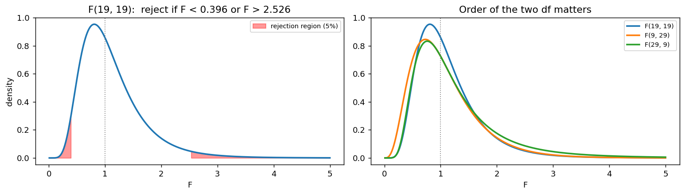

# 두 표본분산의 비 S₁²/S₂²

## 개요

5.6절에서 표본분산 하나의 표본분포를 보았다. 이 절에서는 **두 표본분산의 비**를 본다. 두 집단의 산포가 같은지 묻는 물음이며, 등분산 가정을 점검할 때와 두 공정의 균일성을 비교할 때 쓴다.

정규모집단에서는 깔끔한 결과가 있다.

$$
\frac{S_1^2/\sigma_1^2}{S_2^2/\sigma_2^2} \sim F_{n_1 - 1,\; n_2 - 1}
$$

5.2절의 네 분포 가운데 $F$ 분포가 쓰이는 자리가 여기다. 분포 자체의 정의와 성질(밀도, 적률, 역수 관계)은 4장 F 분포에서 다뤘으므로, 이 절은 **표본분산의 비가 왜 그 분포를 따르는지, 그리고 그 분포가 어떤 모양인지**에 집중한다.

한 가지 미리 말해 둘 것이 있다. 이 절의 결과는 이 장에서 **정규성에 가장 취약하다.** $S^2$ 하나만으로도 첨도에 매여 있었는데($(\beta_2-1)/2$ 배율), 비를 잡으면 그 취약함이 분자와 분모에 함께 들어간다. 이어지는 두 쪽에서 그 대가를 수치로 확인한다.

## 설정

두 모집단에서 서로 독립인 확률표본을 뽑는다.

$$
X_1, \ldots, X_{n_1} \overset{\text{iid}}{\sim} N(\mu_1, \sigma_1^2), \qquad
Y_1, \ldots, Y_{n_2} \overset{\text{iid}}{\sim} N(\mu_2, \sigma_2^2)
$$

두 표본분산을 각각

$$
S_1^2 = \frac{1}{n_1 - 1}\sum_i (X_i - \bar X)^2, \qquad
S_2^2 = \frac{1}{n_2 - 1}\sum_j (Y_j - \bar Y)^2
$$

로 둔다. 자유도를 $d_1 = n_1 - 1$, $d_2 = n_2 - 1$로 줄여 쓴다.

## 표본분포 이론

<div class="thmbox" markdown>

### 정리 1. 분산비의 표본분포 { .thm }

두 표본이 독립인 정규모집단에서 나왔으면

$$
F = \frac{S_1^2/\sigma_1^2}{S_2^2/\sigma_2^2} \sim F_{d_1, d_2}
$$

이다. 특히 $\sigma_1^2 = \sigma_2^2$이면 $\sigma$가 약분되어

$$
\frac{S_1^2}{S_2^2} \sim F_{d_1, d_2}
$$

가 된다.

</div>

??? proof "증명"

    5.6절의 정리에 의해 각 표본에서

    $$
    \frac{d_1 S_1^2}{\sigma_1^2} \sim \chi^2_{d_1}, \qquad \frac{d_2 S_2^2}{\sigma_2^2} \sim \chi^2_{d_2}
    $$

    이고, 두 표본이 독립이므로 두 카이제곱도 독립이다. 각각을 자기 자유도로 나눈 뒤 비를 잡으면

    $$
    \frac{\{d_1 S_1^2/\sigma_1^2\}/d_1}{\{d_2 S_2^2/\sigma_2^2\}/d_2} = \frac{S_1^2/\sigma_1^2}{S_2^2/\sigma_2^2}
    $$

    이고, 이것이 바로 $F$ 분포의 정의다. $\square$

    **정규성이 두 번 쓰였다.** 각 표본에서 $dS^2/\sigma^2 \sim \chi^2_d$를 얻는 데 한 번씩이다. 두 번 쓰였다는 것이 이 결과가 특히 취약한 까닭이다.

### 모르는 모수가 사라진다

$\sigma_1^2 = \sigma_2^2$라는 귀무가설 아래에서 $S_1^2/S_2^2$의 분포에 **모르는 모수가 하나도 남지 않는다.** $\sigma$의 공통값이 무엇이든 분포가 $F_{d_1,d_2}$로 같다. 관측 가능한 양만으로 검정이 가능한 이유이며, 추축량(pivotal quantity)이 하는 일이 바로 이것이다.

### 평균이 1이 아니다

4장에서 보았듯 $E[F] = d_2/(d_2 - 2)$이며 이는 **1보다 크다.**

$$
E\!\left[\frac{S_1^2}{S_2^2}\right] = \frac{d_2}{d_2 - 2} \quad (\sigma_1 = \sigma_2,\ d_2 > 2)
$$

두 모분산이 정확히 같아도 관측된 비의 기댓값은 1이 아니다. $n_2 = 10$이면 1.29, $n_2 = 20$이면 1.12다. **분모의 자유도가 작으면 비가 1보다 크게 나오는 것이 정상**이라는 뜻이고, 눈으로 "1.3이나 되니 분산이 다르다"고 판단하면 안 되는 이유다.

### 위아래 꼬리가 역수 관계다

$F$ 분포는 1을 중심으로 대칭이 아니다. 왼쪽으로는 0에서 막히고 오른쪽으로는 끝없이 뻗으므로, 아래쪽 꼬리 2.5%를 이루는 분위수와 위쪽 꼬리 2.5%를 이루는 분위수가 1에서 같은 거리에 있지 않다. 두 끝을 이어 주는 것은 덧셈이 아니라 곱셈이며, 4장에서 본 역수 관계가 그 연결고리다.

$$
F_{\alpha}(d_1, d_2) = \frac{1}{F_{1-\alpha}(d_2, d_1)}
$$

여기에 **자유도의 순서도 함께 바뀐다**는 조건이 붙어 있다. 그래서 $d_1 = d_2$일 때만 한 분포 안에서 양 끝이 서로 역수가 되고, 자유도가 다르면 $F_{d_1,d_2}$의 아래쪽 분위수는 **다른 분포** $F_{d_2,d_1}$의 위쪽 분위수에서 온다. $F(15,20)$과 $F(20,15)$는 같은 분포가 아니며, 어느 표본을 분자에 놓았는지가 분포를 바꾼다.

<div class="codebox" markdown>

#### 예제 1. 꼬리가 놓이는 자리와 자유도의 순서 { .eg }

```python
import matplotlib.pyplot as plt
import numpy as np
from scipy import stats

fig, (ax1, ax2) = plt.subplots(1, 2, figsize=(12, 3.5))

# 왼쪽: n1 = n2 = 20 일 때의 양측 5% 기각역.
# 기각역이 1을 중심으로 대칭이 아니다. F 분포가 오른쪽으로 치우쳐 있기 때문이다.
d = 19
lo, hi = stats.f(d, d).ppf([0.025, 0.975])
x = np.linspace(0.01, 5, 600)
ax1.plot(x, stats.f(d, d).pdf(x), lw=2)
xl, xr = x[x <= lo], x[x >= hi]
ax1.fill_between(xl, stats.f(d, d).pdf(xl), alpha=0.4, color='r')
ax1.fill_between(xr, stats.f(d, d).pdf(xr), alpha=0.4, color='r',
                 label="rejection region (5%)")
ax1.axvline(1, color='gray', ls=':', lw=1)
ax1.set_title(f"F(19, 19):  reject if F < {lo:.3f} or F > {hi:.3f}")
ax1.set_xlabel("F")
ax1.set_ylabel("density")
ax1.legend(fontsize=8)

# 오른쪽: 자유도의 순서가 바뀌면 완전히 다른 분포가 된다.
# F(9,29)와 F(29,9)를 견주어 보라. 어느 표본을 분자에 놓느냐가 중요하다.
for d1, d2 in [(19, 19), (9, 29), (29, 9)]:
    ax2.plot(x, stats.f(d1, d2).pdf(x), lw=2, label=f"F({d1}, {d2})")
ax2.axvline(1, color='gray', ls=':', lw=1)
ax2.set_xlabel("F")
ax2.set_title("Order of the two df matters")
ax2.legend(fontsize=8)

plt.tight_layout()
plt.show()
```



왼쪽 그림에서 양쪽 꼬리에 2.5%씩을 칠한 자리가 1을 중심으로 대칭이 아니다. 아래쪽 경계 0.396과 위쪽 경계 2.527은 서로 역수 관계($1/0.396 = 2.527$)인데, 이는 두 자유도가 같을 때만 성립한다. 오른쪽에서는 자유도의 순서만 뒤집어도 분포의 폭이 달라진다. 분모의 자유도가 작은 $F(29,9)$는 위쪽 2.5% 경계가 3.57까지 뻗는데, 두 자유도를 맞바꾼 $F(9,29)$에서는 2.59에 그친다. **분포의 폭을 주로 정하는 것은 분모의 자유도**이며, 분모에 놓인 표본이 작을수록 비가 크게 흔들린다.

절대적인 넓이도 눈여겨볼 만하다. $n_1 = n_2 = 20$이라는 결코 작지 않은 표본에서도 두 꼬리 사이가 0.40에서 2.53까지 벌어져 있다. 등분산인 두 집단에서 관측된 비가 2를 넘는 일이 드물지 않다는 뜻이며, **분산비의 표본분포는 평균차의 표본분포보다 훨씬 넓다.**

</div>

## 이 결과가 기대는 것

정리 1이 서려면 세 가지가 필요하다. 두 표본이 서로 독립이라는 것, 각 표본 안의 관측값이 독립이라는 것, 그리고 두 모집단이 **정규**라는 것이다. 앞의 둘은 설계에서 오지만 마지막 하나는 자료가 정해 준다.

정규성이 쓰인 자리는 증명에서 분명히 보인다. $d_i S_i^2/\sigma_i^2 \sim \chi^2_{d_i}$라는 관계를 각 표본에서 하나씩 얻는 단계다. **정규성이 두 번 쓰였다**는 것이 이 결과가 이 장에서 가장 취약한 까닭이다. 5.6절에서 보았듯 일반 모집단에서 $S^2$의 분산은 첨도 $\beta_2$에 매여 있고, 정규 가정이 믿는 값의 $(\beta_2-1)/2$배가 된다. 비를 잡으면 그 어긋남이 분자와 분모에 한 번씩 들어간다.

그러면 표본분포가 어떻게 달라지는가. 중심은 크게 움직이지 않는다. 두 모집단이 같은 모양이면 분자와 분모가 같은 방향으로 왜곡되어 위치의 편향이 상쇄되기 때문이다. 달라지는 것은 **폭**이다. 로그 척도에서 $\log F = \log S_1^2 - \log S_2^2$이고 두 항이 독립이므로 분산이 더해지며, 꼬리가 무거운 모집단에서는 실제 분포가 $F_{d_1,d_2}$보다 훨씬 넓게 퍼진다.

표본을 키우면 해결되는가. **아니다.** 5.4절의 $\bar X$에서는 정규근사가 수렴의 문제였으므로 $n$이 구해 주었지만, 여기서는 전제 자체가 틀렸다. 게다가 분산비에서는 한 걸음 더 나아가 $n$이 커질수록 어긋남이 **커진다.** $n$이 작을 때는 $F$ 분포 자체가 넓어 왜곡이 가려지는데, $n$이 커지면 그 완충이 사라지고 첨도의 효과만 남기 때문이다.

그 어긋남이 나중에 무엇을 망가뜨리는지는 이어지는 쪽에서 수치로 확인한다.

- [정규모집단](var_ratio_normal.md): 정리가 정확히 맞는 기준선
- [비정규 모집단](var_ratio_nonnormal.md): 명목 5% 검정이 실제로 26%, 48%가 되는 과정

## 연습문제

<div class="drillbox" markdown>

**연습문제 1.** <span class="diff easy" title="쉬움"></span>
두 모분산이 정확히 같은데도 $E[S_1^2/S_2^2] > 1$인 이유를 설명하라. $n_2 = 10, 20, 50$에서 이 값을 구하라.

</div>

??? success "풀이"
    $E[F] = d_2/(d_2-2)$이며 4장에서 옌센 부등식으로 설명했다. $1/x$가 볼록함수이므로

    $$
    E\!\left[\frac{1}{S_2^2/\sigma^2}\right] > \frac{1}{E[S_2^2/\sigma^2]} = 1
    $$

    이다. **분모가 흔들린다는 사실 자체가 비의 기댓값을 위로 밀어 올린다.**

    | $n_2$ | $d_2$ | $E[F] = d_2/(d_2-2)$ |
    |---|---|---|
    | 10 | 9 | 1.286 |
    | 20 | 19 | 1.118 |
    | 50 | 49 | 1.043 |

    실무적 함의가 있다. 표본이 작을 때 $s_1^2/s_2^2 = 1.3$을 보고 "분산이 30% 다르다"고 말하는 것은 위험하다. $n_2 = 10$이면 등분산 아래에서도 평균적으로 그 정도가 나온다.

<div class="drillbox" markdown>

**연습문제 2.** <span class="diff med" title="중간"></span>
$\sigma_1^2 = \sigma_2^2$일 때 $S_1^2/S_2^2$의 분포에 모르는 모수가 남지 않음을 보이고, 이것이 왜 중요한지 설명하라.

</div>

??? success "풀이"
    정리 1에서

    $$
    \frac{S_1^2/\sigma_1^2}{S_2^2/\sigma_2^2} \sim F_{d_1,d_2}
    $$

    이고 $\sigma_1^2 = \sigma_2^2 = \sigma^2$을 넣으면 $\sigma^2$이 분자와 분모에서 약분되어

    $$
    \frac{S_1^2}{S_2^2} \sim F_{d_1,d_2}
    $$

    가 된다. 오른쪽 분포는 $n_1, n_2$만으로 정해지고 $\sigma^2$이나 $\mu_1, \mu_2$에 의존하지 않는다. $\square$

    **왜 중요한가.** 표본분포를 안다는 것은 그릴 곡선을 하나로 특정할 수 있다는 뜻인데, 분포가 모르는 모수에 의존하면 어느 곡선을 그려야 할지조차 정해지지 않는다. $\sigma$가 약분되기 때문에 그 값을 몰라도 $S_1^2/S_2^2$의 분포가 $F_{d_1,d_2}$ 하나로 정해진다.

    같은 구조가 이 장 곳곳에 있다. $t$ 통계량에서 $\sigma$가 약분되고, 카이제곱 적합도 검정에서 $n$이 상쇄된다. **추축량을 찾는다는 것이 곧 모르는 모수를 약분해 없애는 일이다.**

<div class="drillbox" markdown>

**연습문제 3.** <span class="diff med" title="중간"></span>
$n_1 = n_2 = 20$일 때 양쪽 꼬리 2.5%를 이루는 두 분위수가 서로 역수임을 확인하고, 자유도가 다르면 왜 그렇지 않은지 설명하라.

</div>

??? success "풀이"
    $d_1 = d_2 = 19$이면 $F_{0.025}(19,19) = 0.3958$이고 $F_{0.975}(19,19) = 2.5265$다. 곱하면 $0.3958 \times 2.5265 = 1.0000$으로 역수 관계가 성립한다.

    **이유.** 역수 관계 $F_\alpha(d_1,d_2) = 1/F_{1-\alpha}(d_2,d_1)$에서 $d_1 = d_2 = d$이면 오른쪽이 $1/F_{1-\alpha}(d,d)$가 되어 같은 분포의 분위수끼리 묶인다. 즉 $F_{0.025}(d,d) = 1/F_{0.975}(d,d)$다.

    자유도가 다르면 $F_{0.025}(d_1,d_2) = 1/F_{0.975}(d_2,d_1)$이고 오른쪽의 분포가 $F_{d_2,d_1}$이라 **원래 분포와 다르다.** 실제로 $F_{0.025}(15,20) = 0.3629$이고 $F_{0.975}(15,20) = 2.5731$인데 곱이 $0.9337$로 1이 아니다. 대신 $F_{0.975}(20,15) = 2.7559$의 역수가 $0.3629$로 정확히 맞는다. 자유도를 맞바꾸어야 관계가 성립한다는 것이 이렇게 확인된다.

    이 어긋남은 로그 척도에서도 그대로 남는다. $\log F_{d_1,d_2}$의 분포는 $d_1 = d_2$일 때만 0을 중심으로 대칭이고, 자유도가 다르면 두 꼬리가 0에서 같은 거리에 있지 않다.

    그래서 자유도는 늘 순서를 함께 적어야 한다. $F(15,20)$과 $F(20,15)$는 다른 분포이고, 표를 읽을 때 순서를 바꾸면 분위수가 달라진다.

<div class="drillbox" markdown>

**연습문제 4.** <span class="diff med" title="중간"></span>
$n_1 = n_2 = n$일 때 $S_1^2/S_2^2$의 표준편차가 $n$과 함께 어떻게 줄어드는지 $n = 10, 20, 50, 200$에서 구하고, 큰 $n$에서 $2/\sqrt{n}$에 가까워짐을 확인하라.

</div>

??? success "풀이"
    $F_{d,d}$의 분산은 4장에서 본 공식

    $$
    \text{Var}(F_{d_1,d_2}) = \frac{2d_2^2(d_1+d_2-2)}{d_1(d_2-2)^2(d_2-4)}
    $$

    에 $d_1 = d_2 = d = n-1$을 넣어 얻는다. 계산하면 다음과 같다.

    | $n$ | $E[F]$ | $\text{SD}(F)$ | $2/\sqrt{n}$ |
    |---|---|---|---|
    | 10 | 1.286 | 1.084 | 0.632 |
    | 20 | 1.118 | 0.562 | 0.447 |
    | 50 | 1.043 | 0.308 | 0.283 |
    | 200 | 1.010 | 0.144 | 0.141 |

    $n$이 커질수록 폭이 줄어들고, 큰 $n$에서는 $\sqrt{n}$에 반비례하는 $2/\sqrt n$에 수렴한다. 이 극한은 로그 척도에서 바로 나온다. 5.6절의 결과로 $\text{Var}(\log S_i^2) \approx (\beta_2-1)/n$이고 정규모집단에서는 $\beta_2 = 3$이므로 $\text{Var}(\log F) \approx 2(1/n + 1/n) = 4/n$, 즉 $\text{SD}(\log F) \approx 2/\sqrt n$이다. $F$가 1 근처에 모이면 $\log F \approx F - 1$이므로 두 척도의 표준편차가 같아진다.

    **작은 $n$에서 표가 극한값보다 훨씬 큰 것**이 요점이다. $n = 10$에서 실제 표준편차 1.08은 $2/\sqrt{10} = 0.63$의 1.7배다. 등분산인 두 집단에서 관측된 비가 2나 3이 되는 일이 예사라는 뜻이며, 분산비가 평균차보다 훨씬 많은 자료를 요구하는 까닭이다.

<div class="drillbox" markdown>

**연습문제 5.** <span class="diff med" title="중간"></span>
$F$ 자체는 오른쪽으로 길게 치우쳐 있다. 로그를 씌우면 어떻게 되는가? $n_1 = n_2 = 20$에서 $F$와 $\log F$의 왜도를 견주고, 왜 그렇게 되는지 설명하라.

</div>

??? success "풀이"
    $F_{19,19}$의 왜도는 $1.772$다. 오른쪽 꼬리가 길다는 것을 숫자가 말해 준다. 반면 정규모집단에서 뽑은 두 표본으로 $\log(S_1^2/S_2^2)$를 40만 번 만들어 왜도를 재면 $-0.002$로 사실상 0이고, 평균도 $-0.001$로 0 근처다.

    **이유는 대칭성이다.** $d_1 = d_2 = d$이면 $S_1^2/S_2^2$과 $S_2^2/S_1^2$이 같은 분포를 따른다. 두 표본의 이름을 바꾸어도 상황이 달라지지 않기 때문이다. 로그를 씌우면 이 관계가

    $$
    \log \frac{S_1^2}{S_2^2} \overset{d}{=} -\log \frac{S_1^2}{S_2^2}
    $$

    가 되어 **0을 중심으로 정확히 대칭**인 분포가 된다. 반면 원래 척도에서는 "역수를 취해도 같다"가 "0을 중심으로 대칭"으로 번역되지 않는다. 아래쪽은 0과 1 사이에 갇히고 위쪽은 1부터 무한대까지 뻗기 때문이다.

    이것이 분산비를 다룰 때 로그 척도가 자연스러운 첫 번째 이유다. 두 번째 이유는 $\log F = \log S_1^2 - \log S_2^2$이라는 분해인데, 비정규 모집단에서 어긋남의 크기를 계산할 때 이 분해가 결정적으로 쓰인다.

<div class="drillbox" markdown>

**연습문제 6.** <span class="diff hard" title="어려움"></span>
정리 1의 증명에서 정규성이 정확히 어디에 쓰였는지 짚고, 그 결과 이 표본분포가 5.6절의 $S^2$ 하나짜리 결과보다 더 취약할 것이라고 예상되는 이유를 말하라.

</div>

??? success "풀이"
    **쓰인 곳은 두 군데다.** 각 표본에서 $d_i S_i^2/\sigma_i^2 \sim \chi^2_{d_i}$를 얻는 단계에 한 번씩이다. 이 관계는 5.6절에서 보았듯 정규모집단에서만 정확하고, 일반적으로는 $\text{Var}(S^2)$이 첨도에 의존해 카이제곱 예측과 배율 $(\beta_2-1)/2$만큼 어긋난다.

    (독립성은 두 표본이 서로 독립이라는 설계에서 오므로 정규성과 무관하다. 각 표본 안에서 $\bar X$와 $S^2$의 독립성은 여기서 쓰이지 않는다.)

    **왜 더 취약한가.** 두 가지 이유를 예상할 수 있다.

    첫째, **오차가 두 번 들어간다.** 분자와 분모가 각각 어긋난 분포를 따르므로 비의 분포는 두 어긋남이 합쳐진 결과다. 로그를 씌워 보면 이유가 분명해지는데, $\log F = \log S_1^2 - \log S_2^2$이고 두 항의 분산이 각각 $(\beta_2-1)/n_i$로 부풀어 있으므로 합이 $(\beta_2-1)(1/n_1 + 1/n_2)$가 된다. 정규 가정은 이를 $2(1/n_1+1/n_2)$로 믿으므로 배율이 여전히 $(\beta_2-1)/2$다.

    둘째, **상쇄가 일어나지 않는다.** 두 모집단이 같은 모양이면 분자와 분모의 왜곡이 같은 방향이라 비에서 일부 상쇄될 것 같지만, 로그 척도에서 보면 **분산은 더해질 뿐 상쇄되지 않는다.** 위치의 편향은 상쇄되고 산포의 왜곡은 누적된다.

    다음 쪽에서 이 예상이 수치로 확인된다. 첨도 9인 지수모집단에서 명목 5% 검정의 실제 오류율이 26%까지 오른다.

<div class="drillbox" markdown>

**연습문제 7.** <span class="diff med" title="중간"></span>
분산비 대신 **표준편차비** $S_1/S_2$를 보고하는 일이 많다. 단위가 원자료와 같아 읽기 쉽기 때문이다. $n_1=n_2=20$에서 $E[S_1/S_2]$를 구하고, $(E[S_1/S_2])^2$이 $E[S_1^2/S_2^2]$와 **같지 않음**을 확인하라.

</div>

??? success "풀이"
    **독립이므로 기댓값이 쪼개진다.** $E[S_1/S_2] = E[S_1]\cdot E[1/S_2]$이고, 앞 절 카이제곱 문서 연습문제 10에서 $E[S] = c_4\sigma$였다. 역수 쪽도 같은 방식으로

    $$
    E\!\left[\frac1S\right] = \frac{1}{\sigma}\sqrt{\frac{n-1}{2}}\,
    \frac{\Gamma\!\left(\frac{n-2}{2}\right)}{\Gamma\!\left(\frac{n-1}{2}\right)}
    $$

    이 나온다.

    ```python
    import numpy as np
    from scipy.special import gamma as G

    rng = np.random.default_rng(0)
    n1 = n2 = 20
    X = rng.normal(0, 1, (300_000, n1))
    Y = rng.normal(0, 1, (300_000, n2))
    R = X.std(1, ddof=1) / Y.std(1, ddof=1)

    c4   = lambda n: np.sqrt(2/(n-1)) * G(n/2) / G((n-1)/2)
    Einv = lambda n: np.sqrt((n-1)/2) * G((n-2)/2) / G((n-1)/2)

    print(f"  E[S1/S2] 모의 {R.mean():.5f}   이론 {c4(n1)*Einv(n2):.5f}")
    print(f"  (E[S1/S2])^2 = {R.mean()**2:.5f}")
    print(f"  E[S1^2/S2^2] = d2/(d2-2) = {(n2-1)/((n2-1)-2):.5f}")
    ```

    출력:

    ```
      E[S1/S2] 모의 1.02851   이론 1.02815
      (E[S1/S2])^2 = 1.05782
      E[S1^2/S2^2] = d2/(d2-2) = 1.11765
    ```

    **두 값이 다르다**($1.058$ 대 $1.118$). 제곱과 기댓값의 순서를 바꿀 수 없기 때문이며, 옌센 부등식에 의해 언제나

    $$
    (E[S_1/S_2])^2 \;\le\; E\!\left[\frac{S_1^2}{S_2^2}\right]
    $$

    이다. 연습문제 1에서 $E[F] > 1$을 본 것과 같은 현상이 한 겹 더 쌓인 것이다.

    **실무적 함의 셋.**

    - **"분산비의 제곱근"과 "표준편차비"는 다른 양이다.** $\sqrt{E[F]} = 1.057$과 $E[S_1/S_2] = 1.029$가 다르다. 어느 쪽을 보고하는지 밝혀야 한다.
    - **표준편차비도 여전히 위로 편향되어 있다**($1.029 > 1$). 두 모표준편차가 같은데도 그렇다. 편향이 분산비보다 작을 뿐이다.
    - **구간은 분산비에서 만들고 마지막에 제곱근을 취하는 것이 안전하다.** 제곱근은 단조함수라 끝점을 그대로 옮기면 되고(앞 절 $F$ 문서 연습문제 10), 포함확률이 보존된다. 표준편차비의 표본분포를 새로 유도할 필요가 없다.

<div class="drillbox" markdown>

**연습문제 8.** <span class="diff med" title="중간"></span>
두 모분산이 **같다고 가정할 때**는 둘을 합쳐 하나의 분산을 추정한다. **합동분산**

$$
S_p^2 = \frac{(n_1-1)S_1^2 + (n_2-1)S_2^2}{n_1+n_2-2}
$$

의 표본분포를 구하고 $n_1=12$, $n_2=8$에서 확인하라. 자유도가 왜 $n_1+n_2-2$인가?

</div>

??? success "풀이"
    **카이제곱의 가법성이 그대로 쓰인다**(앞 절 카이제곱 문서 연습문제 8). $\sigma_1^2 = \sigma_2^2 = \sigma^2$이면

    $$
    \frac{(n_1-1)S_1^2}{\sigma^2} \sim \chi^2_{n_1-1},
    \qquad
    \frac{(n_2-1)S_2^2}{\sigma^2} \sim \chi^2_{n_2-1}
    $$

    이고 두 표본이 독립이므로 합이 $\chi^2_{n_1+n_2-2}$다. 따라서

    $$
    \frac{(n_1+n_2-2)S_p^2}{\sigma^2} \sim \chi^2_{n_1+n_2-2}
    $$

    이다. $\square$

    ```python
    import numpy as np
    from scipy import stats

    rng = np.random.default_rng(0)
    n1, n2, s = 12, 8, 2.0
    X = rng.normal(0, s, (300_000, n1))
    Y = rng.normal(0, s, (300_000, n2))
    sp2 = ((n1-1)*X.var(1, ddof=1) + (n2-1)*Y.var(1, ddof=1)) / (n1+n2-2)
    df = n1 + n2 - 2
    Q = df * sp2 / s**2

    print(f"  KS p (chi2({df})) = {stats.kstest(Q, 'chi2', args=(df,)).pvalue:.4f}")
    print(f"  E[Sp^2] = {sp2.mean():.4f}  (참 {s**2})")
    print(f"  Var     = {sp2.var():.5f}   이론 2*sigma^4/df = {2*s**4/df:.5f}")
    ```

    출력:

    ```
      KS p (chi2(18)) = 0.4850
      E[Sp^2] = 3.9975  (참 4.0)
      Var     = 1.77292   이론 2*sigma^4/df = 1.77778
    ```

    **자유도가 $n_1+n_2-2$인 이유.** 관측이 $n_1+n_2$개인데 평균을 **두 개**($\bar X_1$, $\bar X_2$) 추정했으므로 둘을 잃는다. 한 표본에서 $n-1$이었던 것의 자연스러운 확장이며, 일반적으로 **자유도 = 관측 수 $-$ 추정한 평균의 수**다. 11장의 분산분석에서 집단 내 자유도가 $N-k$인 것이 같은 규칙이다.

    **왜 합치는가 — 자유도를 벌기 위해서다.** $S_1^2$만 쓰면 자유도가 $11$이고 $S_2^2$만 쓰면 $7$인데, 합치면 $18$이다. 자유도가 클수록 $\sigma^2$ 추정이 정밀해지고, 그 결과 두 표본 $t$ 검정의 임계값이 작아져 검정력이 오른다.

    **그러나 $\sigma_1^2 = \sigma_2^2$이 틀리면 대가가 크다.** 합동분산은 두 분산의 **가중평균**이라, 실제로 다르면 어느 쪽도 아닌 값을 추정한다. 게다가 표본크기가 불균형하면 큰 표본 쪽으로 치우쳐, 작은 표본 집단의 분산을 심하게 잘못 잡는다. 이것이 **웰치 방법이 기본값이 된 이유**이며 5.7절과 15장에서 다룬다.

    **이 쪽의 $F$ 검정과의 관계.** $S_1^2/S_2^2$이 $1$에서 멀면 합동분산을 쓰면 안 된다는 신호다. 다만 앞 절 $F$ 문서 연습문제 10에서 본 대로 이 검정의 검정력이 낮아 **"유의하지 않았으니 합쳐도 된다"는 논법은 위험하다.**

<div class="drillbox" markdown>

**연습문제 9.** <span class="diff med" title="중간"></span>
연습문제 1에서 $E[S_1^2/S_2^2] = \dfrac{d_2}{d_2-2} > 1$임을 보았다. 이 편향을 **없애는** 추정량을 만들고, $d_2 = 5, 10, 19, 50$에서 확인하라. 이 보정을 실제로 쓰는가?

</div>

??? success "풀이"
    **상수배가 전부다.** $E[F] = d_2/(d_2-2)$이므로

    $$
    \widehat{\left(\frac{\sigma_1^2}{\sigma_2^2}\right)}_{\text{불편}}
    = \frac{d_2-2}{d_2}\cdot\frac{S_1^2}{S_2^2}
    $$

    로 두면 기댓값이 정확히 $\sigma_1^2/\sigma_2^2$가 된다($d_2 > 2$).

    ```python
    import numpy as np
    from scipy import stats

    print(f"{'d2':>5}{'E[F]':>10}{'(d2-2)/d2':>12}{'보정 후':>10}")
    for d2 in (5, 10, 19, 50):
        F = stats.f.rvs(19, d2, size=300_000, random_state=1)
        print(f"{d2:>5}{F.mean():>10.4f}{(d2-2)/d2:>12.4f}{(F*(d2-2)/d2).mean():>10.4f}")
    ```

    출력:

    ```
       d2      E[F]   (d2-2)/d2     보정 후
        5    1.6677      0.6000     1.0006
       10    1.2533      0.8000     1.0026
       19    1.1183      0.8947     1.0006
       50    1.0428      0.9600     1.0011
    ```

    **보정이 정확히 듣는다.** 네 경우 모두 $1.00$으로 맞는다. $d_2=5$에서는 $40\%$나 줄여야 한다는 점이 인상적이다.

    **그런데 실무에서는 거의 쓰지 않는다.** 이유가 셋이다.

    - **검정에는 필요 없다.** 가설검정은 $F$의 **분포**를 쓰지 기댓값을 쓰지 않는다. 임계값이 이미 편향을 포함해 계산되어 있으므로 통계량을 보정하면 오히려 틀린다.
    - **구간에도 필요 없다.** 앞 절 $F$ 문서 연습문제 10의 구간은 분위수를 뒤집어 만든 것이라 편향과 무관하게 정확한 포함확률을 갖는다.
    - **보정해도 다른 편향이 남는다.** $E[F]$를 맞춰도 $E[\log F] \ne \log(\sigma_1^2/\sigma_2^2)$이고, $E[1/F]$는 또 다른 값이다. **어느 척도에서 불편으로 만들지 고를 수 없다.**

    **그래서 점추정을 보고해야 할 때만 의미가 있다.** 메타분석처럼 여러 연구의 분산비를 모아 평균낼 때는 자유도가 작은 연구가 평균을 끌어올리므로 보정이 실질적인 차이를 만든다. 앞 절 $F$ 문서 연습문제 9에서 "$\log F$를 쓰라"고 한 것이 더 나은 대안이며, 로그 척도에서는 편향이 훨씬 작고 대칭적이다.

    **일반 교훈.** **불편성은 척도에 딸린 성질이다.** $\sigma^2$에 대해 불편인 $S^2$이 $\sigma$에 대해서는 불편이 아니었고(카이제곱 문서 연습문제 10), 여기서도 $F$를 보정하면 $\log F$가 어긋난다. 어느 양을 보고할지 정한 다음에 그 척도에서 따져야 한다.

<div class="drillbox" markdown>

**연습문제 10.** <span class="diff hard" title="어려움"></span>
총 표본 $N = n_1+n_2 = 40$을 두 집단에 **어떻게 배분**해야 분산비 검정의 검정력이 가장 높은가? $\sigma_1/\sigma_2 = 2$에서 배분을 바꿔 가며 계산하라. 결과가 대칭인가?

</div>

??? success "풀이"
    ```python
    from scipy import stats

    N, r = 40, 4.0          # r = sigma1^2/sigma2^2 = 2^2
    for n1 in (8, 12, 20, 28, 32):
        n2 = N - n1
        d1, d2 = n1 - 1, n2 - 1
        lo, hi = stats.f.ppf(0.025, d1, d2), stats.f.ppf(0.975, d1, d2)
        pw = stats.f.sf(hi / r, d1, d2) + stats.f.cdf(lo / r, d1, d2)
        print(f"    n1={n1:>3} n2={n2:>3}  검정력 {pw:.4f}")
    ```

    출력:

    ```
        n1=  8 n2= 32  검정력 0.6860
        n1= 12 n2= 28  검정력 0.7888
        n1= 20 n2= 20  검정력 0.8375
        n1= 28 n2= 12  검정력 0.7087
        n1= 32 n2=  8  검정력 0.4942
    ```

    **균등 배분이 최적이다**($0.8375$). 불균형해질수록 검정력이 떨어진다.

    **그런데 대칭이 아니다.** $(8,32)$는 $0.686$인데 $(32,8)$은 $0.494$다. **같은 크기의 불균형인데 방향에 따라 검정력이 $0.19$나 차이 난다.**

    **이유는 어느 쪽 분산이 큰가에 있다.** 여기서는 $\sigma_1 > \sigma_2$로 **1번 집단의 분산이 크다.** $F = S_1^2/S_2^2$에서

    - $n_2$가 크면 **분모가 안정된다.** 분모는 작은 분산을 재는 쪽이고, 그 추정이 정확하면 비가 또렷해진다.
    - $n_1$이 크면 분자만 안정되는데, 분모가 요동치면 비 전체가 요동친다. 앞 절 $F$ 문서 연습문제 9에서 본 **분모의 불안정이 비를 지배한다**는 성질 그대로다.

    **실무 지침.**

    | 상황 | 배분 |
    |---|---|
    | 어느 쪽 분산이 큰지 모른다 | **균등 배분** |
    | 한쪽 분산이 클 것으로 예상된다 | **분산이 작을 집단에 조금 더** |
    | 이미 한쪽 표본이 정해져 있다 | 나머지를 최대한 |

    두 번째 줄이 직관과 어긋난다. "변동이 큰 집단을 더 많이 재야 한다"는 것이 평균 비교에서의 상식인데(5.7절의 최적 배분은 $n_i \propto \sigma_i$), **분산 비교에서는 반대**다. 재는 대상이 분산 자체이고 분모의 안정성이 비를 좌우하기 때문이다.

    **다만 이득이 크지 않다.** 최적 $0.8375$와 균등에서 조금 벗어난 $(12,28)$의 $0.7888$ 차이는 $0.05$ 수준이다. 반면 방향을 잘못 잡으면($32,8$) $0.34$를 잃는다. **얻을 것은 적고 잃을 것은 크므로, 확신이 없으면 균등 배분이 안전하다.** $\square$

---

## 정리하며

- 정규모집단에서 $\dfrac{S_1^2/\sigma_1^2}{S_2^2/\sigma_2^2} \sim F_{d_1,d_2}$이고, $\sigma_1^2 = \sigma_2^2$이면 $\sigma$가 약분되어 $S_1^2/S_2^2$이 그대로 $F$ 분포를 따른다.
- 등분산이어도 $E[S_1^2/S_2^2] = d_2/(d_2-2) > 1$이다. 작은 표본에서 비가 1보다 크게 나오는 것은 정상이다.
- 분포가 1을 중심으로 비대칭이라 위아래 꼬리가 덧셈이 아니라 **곱셈**으로 이어진다. 자유도가 같을 때만 양 끝이 서로 역수이고, 로그를 씌우면 그 대칭이 드러난다.
- 자유도의 **순서**가 분포를 바꾼다. 역수 관계를 쓸 때 자유도도 함께 바꿔야 한다.
- $n_1 = n_2 = n$이면 분포의 표준편차가 $n$이 커질 때 $2/\sqrt{n}$에 가까워지고, 작은 $n$에서는 그보다도 훨씬 넓다. 등분산인 두 집단에서도 관측된 비가 2를 넘는 일이 예사다.
- 정리의 증명에 정규성이 **두 번** 쓰였다. 이어지는 두 쪽에서 그 대가를 확인한다.

## 그래서 이 분포로 무엇을 하는가

이 쪽이 답한 것은 여기까지다. **$S_1^2/S_2^2$은 정규모집단에서 $F_{d_1,d_2}$를 따르고, 그 분포는 1을 중심으로 비대칭이며 자유도의 순서에 민감하고 폭이 매우 넓다.** 표본분포를 묻는 이 장의 일은 그것으로 끝난다.

남는 물음은 그 분포로 $\sigma_1^2/\sigma_2^2$를 어떻게 가두고 어떻게 판정하느냐이다. 분포에서 구간을 얻는 쪽은 [8.3절 σ₁²/σ₂²의 신뢰구간](../../ch08/two_sample_intervals/ci_variance_ratio.md)이, 기각역과 $p$값으로 판정하는 쪽은 [9.3절 σ₁²/σ₂²에 대한 F 검정](../../ch09/two_sample_tests/f_test_two_variances.md)이 맡는다. 정규성이 깨졌을 때 무엇으로 갈아탈지는 [15장 로버스트 분산 검정](../../ch15/robust_tests/robust_tests.md)의 몫이다.
