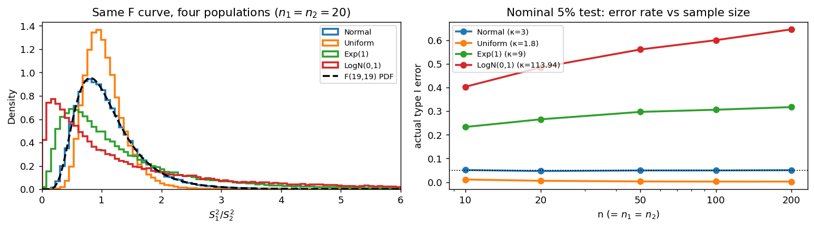

# S₁²/S₂²의 표본분포 (비정규 모집단)

## 개요

앞 쪽에서 정규모집단의 기준선을 확인했다. 오류율 0.050, 포함률 0.950, KS 거리 0.003이었다.

이 쪽에서 정규성을 깨면 그 수치들이 이렇게 된다.

| 모집단 | 첨도 $\beta_2$ | 명목 5% 검정의 실제 오류율 | 명목 95% 구간의 포함률 |
|---|---|---|---|
| 정규 | 3.0 | 0.052 | 0.952 |
| 균등 | 1.8 | **0.005** | 0.994 |
| 지수 | 9.0 | **0.264** | 0.735 |
| 로그정규 | 113.9 | **0.478** | 0.520 |

로그정규 자료에서 **명목 5% 검정이 실제로는 절반 가까이 기각한다.** 그리고 이 쪽의 가장 중요한 결과는 그다음이다.

!!! danger "표본을 키우면 더 나빠진다"
    5.6절에서 $S^2$ 하나의 어긋남이 $n$과 무관한 배율로 남는 것을 보았다. 분산비에서는 한 걸음 더 나아가 **오류율이 $n$과 함께 올라간다.** 로그정규에서 $n = 20$일 때 0.48이던 것이 $n = 200$에서 0.64가 된다.

## 설정

네 모집단에서 $n_1 = n_2 = n$인 두 독립 표본을 뽑는다. 두 표본은 **같은 모집단**에서 나오므로 $\sigma_1^2 = \sigma_2^2$이고 귀무가설이 참이다.

| 모집단 | $\beta_2$ | 성격 |
|---|---|---|
| $N(0,1)$ | 3.0 | 기준선 |
| $U(0,1)$ | 1.8 | 꼬리가 가볍다 |
| $\text{Exp}(1)$ | 9.0 | 오른쪽으로 치우쳐 있다 |
| $\text{LogN}(0,1)$ | 113.9 | 꼬리가 극단적으로 무겁다 |

## 표본분포 이론

### 왜 어긋나는가

로그를 씌우면 이유가 한눈에 보인다.

$$
\log \frac{S_1^2}{S_2^2} = \log S_1^2 - \log S_2^2
$$

델타법으로 $\text{Var}(\log S^2) \approx \text{Var}(S^2)/\sigma^4$이고, 5.6절의 결과 $\text{Var}(S^2) \approx (\beta_2-1)\sigma^4/n$을 넣으면

$$
\text{Var}(\log S_i^2) \approx \frac{\beta_2 - 1}{n_i}
$$

이다. 두 항이 독립이므로 더하면

$$
\text{Var}\!\left(\log \frac{S_1^2}{S_2^2}\right) \approx (\beta_2-1)\left(\frac{1}{n_1} + \frac{1}{n_2}\right)
$$

가 된다. 정규 가정($\beta_2 = 3$)은 이 값을 $2\left(\frac{1}{n_1}+\frac{1}{n_2}\right)$로 믿는다. 따라서 **분산의 배율이 $\dfrac{\beta_2-1}{2}$**이며, 5.6절에서 $S^2$ 하나에 대해 얻었던 것과 **정확히 같은 배율**이다.

!!! note "왜 상쇄되지 않는가"
    분자와 분모가 같은 방향으로 왜곡되니 비에서 상쇄될 것 같지만, 로그 척도에서 보면 **위치의 편향은 상쇄되고 산포의 왜곡은 더해진다.** 두 독립 확률변수의 차의 분산은 분산의 합이기 때문이다. 그래서 비를 잡는 절차가 $S^2$ 하나짜리 절차보다 취약하다.

### 극한 오류율을 계산할 수 있다

$n$이 크면 $\log F$가 근사적으로 정규이므로 오류율을 손으로 계산할 수 있다. $F$ 검정은 $\log F$의 표준편차를 $\sqrt{2(1/n_1+1/n_2)}$로 믿고 $\pm 1.96$배만큼 기각역을 잡는데, 참 표준편차는 $\sqrt{(\beta_2-1)(1/n_1+1/n_2)}$다. 따라서 기각역이 참 표준편차 단위로는 $\pm 1.96\sqrt{2/(\beta_2-1)}$만큼만 뻗고

$$
\text{실제 오류율} \;\longrightarrow\; 2\left[1 - \Phi\!\left(1.96\sqrt{\frac{2}{\beta_2-1}}\right)\right]
$$

가 된다. 첨도 하나만 알면 그 모집단에서 $F$ 검정이 얼마나 망가지는지 미리 알 수 있다.

| 모집단 | $\beta_2$ | $1.96\sqrt{2/(\beta_2-1)}$ | 극한 오류율 |
|---|---|---|---|
| 균등 | 1.8 | 3.10 | 0.002 |
| 정규 | 3.0 | 1.96 | 0.050 |
| 지수 | 9.0 | 0.98 | 0.327 |
| 로그정규 | 113.9 | 0.26 | 0.794 |

정규에서 정확히 0.05가 나오는 것이 검산이다.

## 모의실험

<div class="codebox" markdown>

#### 예제 1. 같은 F 곡선, 네 모집단 { .eg }

```python
import matplotlib.pyplot as plt
import numpy as np
from scipy import stats

rng = np.random.default_rng(11)

fig, (ax1, ax2) = plt.subplots(1, 2, figsize=(12, 3.5))

specs = [("Normal", lambda s: rng.normal(size=s), 3.0),
         ("Uniform", lambda s: rng.uniform(size=s), 1.8),
         ("Exp(1)", lambda s: rng.exponential(size=s), 9.0),
         ("LogN(0,1)", lambda s: rng.lognormal(0, 1, size=s), 113.94)]

# 왼쪽: n=20에서 네 모집단의 F 통계량 분포를 겹쳐 그린다.
# 네 경우 모두 귀무가설이 참(같은 모집단에서 두 표본)이므로
# F(19,19)를 따라야 하는데, 정규만 곡선에 얹힌다.
n = 20
for name, rvs, kap in specs:
    F = (rvs((60_000, n)).var(axis=1, ddof=1)
         / rvs((60_000, n)).var(axis=1, ddof=1))
    ax1.hist(F, bins=np.linspace(0, 6, 80), density=True,
             histtype='step', lw=2, label=name)
g = np.linspace(0.01, 6, 400)
ax1.plot(g, stats.f(n - 1, n - 1).pdf(g), "--k", lw=2, label="F(19,19) PDF")
ax1.set_xlim(0, 6)
ax1.set_xlabel("$S_1^2/S_2^2$")
ax1.set_ylabel("Density")
ax1.set_title("Same F curve, four populations ($n_1=n_2=20$)")
ax1.legend(fontsize=8)

# 오른쪽: n을 키우면 오류율이 어떻게 되는가.
# 정규는 0.05에 머물고, 비정규는 각자의 극한값으로 **올라간다**.
ns = [10, 20, 50, 100, 200]
for name, rvs, kap in specs:
    rate = []
    for nn in ns:
        dd = nn - 1
        lo, hi = stats.f(dd, dd).ppf([0.025, 0.975])
        F = (rvs((20_000, nn)).var(axis=1, ddof=1)
             / rvs((20_000, nn)).var(axis=1, ddof=1))
        rate.append(np.mean((F < lo) | (F > hi)))
    ax2.plot(ns, rate, 'o-', lw=2, label=f"{name} (κ={kap:g})")
ax2.axhline(0.05, color='k', ls=':', lw=1)
ax2.set_xscale('log')
ax2.set_xticks(ns)
ax2.set_xticklabels(ns)
ax2.set_xlabel("n (= $n_1$ = $n_2$)")
ax2.set_ylabel("actual type I error")
ax2.set_title("Nominal 5% test: error rate vs sample size")
ax2.legend(fontsize=8)

plt.tight_layout()
plt.show()
```



왼쪽에서 **정규(파란 계단)만 검은 곡선에 얹힌다.** 균등은 더 좁고 높으며, 지수와 로그정규는 봉우리가 왼쪽으로 밀리고 오른쪽 꼬리가 두껍다. 오른쪽에서는 정규만 0.05 선에 붙어 있고 나머지는 각자의 극한값으로 향한다.

</div>

<div class="codebox" markdown>

#### 예제 2. 표본을 키우면 오류율이 올라간다 { .eg }

```python
import numpy as np
from scipy import stats

rng = np.random.default_rng(2)
B = 20_000

print(f"{'모집단':>14}{'n=20':>9}{'n=50':>9}{'n=200':>9}{'극한(이론)':>12}")
for name, rvs, kap in [("정규", lambda s: rng.normal(size=s), 3.0),
                       ("균등", lambda s: rng.uniform(size=s), 1.8),
                       ("지수", lambda s: rng.exponential(size=s), 9.0),
                       ("로그정규", lambda s: rng.lognormal(0, 1, size=s), 113.94)]:
    row = []
    for n in (20, 50, 200):
        d = n - 1
        lo, hi = stats.f(d, d).ppf([0.025, 0.975])
        F = rvs((B, n)).var(axis=1, ddof=1) / rvs((B, n)).var(axis=1, ddof=1)
        row.append(np.mean((F < lo) | (F > hi)))
    # 극한 오류율 = 2[1 - Phi(1.96 sqrt(2/(kappa-1)))]
    lim = 2 * (1 - stats.norm.cdf(1.96 * np.sqrt(2 / (kap - 1))))
    print(f"{name:>14}{row[0]:>9.3f}{row[1]:>9.3f}{row[2]:>9.3f}{lim:>12.3f}")
```

출력:

```
           모집단     n=20     n=50    n=200      극한(이론)
            정규    0.052    0.051    0.051       0.050
            균등    0.005    0.002    0.002       0.002
            지수    0.264    0.298    0.320       0.327
          로그정규    0.478    0.562    0.642       0.794
```

지수모집단이 0.264 → 0.298 → 0.320으로 극한값 0.327에 다가간다. 이론과 모의실험이 맞는다. 로그정규는 수렴이 느려 $n = 200$에서 0.642이지만 방향은 같다.

</div>

<div class="codebox" markdown>

#### 예제 3. 분산비 신뢰구간의 실제 포함률 { .eg }

```python
import numpy as np
from scipy import stats

rng = np.random.default_rng(2)
B, n = 20_000, 20
d = n - 1
lo, hi = stats.f(d, d).ppf([0.025, 0.975])

print("명목 95% 구간, n1 = n2 = 20 (참 분산비 = 1)")
for name, rvs in [("정규", lambda s: rng.normal(size=s)),
                  ("균등", lambda s: rng.uniform(size=s)),
                  ("지수", lambda s: rng.exponential(size=s)),
                  ("로그정규", lambda s: rng.lognormal(0, 1, size=s))]:
    F = rvs((B, n)).var(axis=1, ddof=1) / rvs((B, n)).var(axis=1, ddof=1)
    print(f"  {name:>8}: 포함률 {np.mean((F / hi <= 1) & (1 <= F / lo)):.3f}")
```

출력:

```
명목 95% 구간, n1 = n2 = 20 (참 분산비 = 1)
        정규: 포함률 0.952
        균등: 포함률 0.994
        지수: 포함률 0.735
      로그정규: 포함률 0.520
```

로그정규 자료에서 **명목 95% 구간이 참값을 절반만 담는다.** 신뢰구간이라는 이름이 무의미해지는 수준이다.

</div>

## 해석

!!! note "주요 관찰"

    1. **어긋남의 크기가 첨도로 정해진다.** 배율 $(\beta_2-1)/2$가 5.6절의 $S^2$ 하나짜리 결과와 같다. 비를 잡아도 새로운 원인이 생기는 것이 아니라 같은 원인이 두 번 들어간다.
    2. **방향은 첨도가 3보다 큰지 작은지로 갈린다.** 꼬리가 가벼우면(균등) 지나치게 보수적이 되어 오류율이 0.005로 내려가고, 무거우면(지수, 로그정규) 위험한 쪽으로 올라간다.
    3. **표본크기가 상황을 악화시킨다.** 이것이 가장 반직관적인 결과다. $n$이 작을 때는 $F$ 분포 자체가 넓어 어긋남이 가려지는데, $n$이 커지면 그 완충이 사라지고 첨도의 효과만 남는다.
    4. **극한값을 손으로 계산할 수 있다.** $2[1-\Phi(1.96\sqrt{2/(\beta_2-1)})]$이며 모의실험과 맞는다. 자료의 첨도를 재 보면 $F$ 검정을 믿을 수 있는지 미리 판단할 수 있다.

!!! warning "$\bar X$와 비교하라"
    같은 지수모집단에서 $\bar X$의 정규근사는 $n$을 키우면 좋아진다. 분산비의 $F$ 근사는 **$n$을 키우면 나빠진다.** 방향이 반대인 이유는 5.6절에서 말한 것과 같다. $\bar X$에서는 정리의 **수렴**이 문제이고 분산비에서는 정리의 **전제**가 문제다. 전제가 틀린 것을 표본크기로 고칠 수는 없고, 오히려 표본이 커지면 잘못된 전제를 더 확신하게 된다.

## 연습문제

<div class="drillbox" markdown>

**연습문제 1.** <span class="diff easy" title="쉬움"></span>
$\text{Exp}(1)$ 모집단에서 명목 5% $F$ 검정의 극한 오류율이 0.327임을 공식으로 확인하라.

</div>

??? success "풀이"
    지수분포의 첨도는 $\beta_2 = 9$이므로

    $$
    1.96\sqrt{\frac{2}{\beta_2-1}} = 1.96\sqrt{\frac{2}{8}} = 1.96 \times 0.5 = 0.98
    $$

    이고 극한 오류율은

    $$
    2\left[1 - \Phi(0.98)\right] = 2(1 - 0.8365) = 2 \times 0.1635 = 0.327
    $$

    이다.

    모의실험에서 $n = 200$일 때 0.320이었으므로 방향과 크기가 맞는다. **첨도가 9라는 사실 하나만으로 "명목 5% 검정이 실제로는 33%"라는 결론이 나온다는 점**이 이 공식의 쓸모다.

<div class="drillbox" markdown>

**연습문제 2.** <span class="diff med" title="중간"></span>
$\text{Var}(\log S^2) \approx (\beta_2-1)/n$을 델타법으로 유도하라.

</div>

??? success "풀이"
    $g(t) = \log t$에 델타법을 적용한다. $g'(t) = 1/t$이므로 $S^2$이 $\sigma^2$ 근처에 모여 있을 때

    $$
    \text{Var}(\log S^2) \approx \{g'(\sigma^2)\}^2\,\text{Var}(S^2) = \frac{\text{Var}(S^2)}{\sigma^4}
    $$

    이다. 5.6절에서 $\text{Var}(S^2) = \frac1n\left(\beta_2 - \frac{n-3}{n-1}\right)\sigma^4 \approx \frac{(\beta_2-1)\sigma^4}{n}$이므로

    $$
    \text{Var}(\log S^2) \approx \frac{\beta_2-1}{n}
    $$

    이다. $\square$

    **$\sigma^4$이 약분된다는 점이 요점이다.** 로그를 씌우면 척도가 사라지고 **첨도만 남는다.** 그래서 $\log F$의 분포가 $\sigma$에 의존하지 않고 첨도에만 의존하며, 검정의 수준이 어긋나는 정도가 첨도만으로 결정된다.

    이 계산은 왜 분산 관련 추론에서 첨도가 그토록 중요한지를 설명한다. 평균 추론에서는 2차 적률(분산)이 필요하고, 분산 추론에서는 4차 적률(첨도)이 필요하다. **한 단계 위의 적률이 필요해지는 것**이 근본적인 차이다.

<div class="drillbox" markdown>

**연습문제 3.** <span class="diff med" title="중간"></span>
분자와 분모의 왜곡이 서로 상쇄되지 않는 이유를 설명하라. 두 모집단이 **같은 모양**이라면 상쇄될 것 같은데 왜 그렇지 않은가?

</div>

??? success "풀이"
    로그 척도에서 보면 명확하다. $\log F = \log S_1^2 - \log S_2^2$이고 두 항이 독립이므로

    $$
    \text{Var}(\log F) = \text{Var}(\log S_1^2) + \text{Var}(\log S_2^2)
    $$

    **분산은 차를 잡아도 더해진다.** 상쇄되는 것은 기댓값(편향)이고 분산은 누적된다.

    구체적으로, 두 모집단이 같은 모양이면 $E[\log S_1^2] = E[\log S_2^2]$이므로 $E[\log F] \approx 0$이 되어 **중심은 제자리에 있다.** 실제로 예제 1의 왼쪽 그림에서 네 분포의 중심이 크게 다르지 않다. 어긋나는 것은 폭이다.

    같은 구조가 두 평균 차에도 있다. $\bar X_1 - \bar X_2$에서 두 모집단의 치우침이 같으면 차의 분포는 대칭에 가까워지지만(편향 상쇄), 분산은 각자의 분산이 더해진다. **차를 잡는 것은 위치의 오류를 없애 주지만 산포의 오류는 없애 주지 못한다.**

<div class="drillbox" markdown>

**연습문제 4.** <span class="diff med" title="중간"></span>
균등모집단에서 오류율이 0.005로 명목의 10분의 1이다. 이것이 "안전하다"고 말할 수 있는가?

</div>

??? success "풀이"
    1종오류만 보면 안전하다. 실제로 등분산인 두 집단을 "다르다"고 잘못 판정할 확률이 0.5%에 그친다.

    **그러나 대가가 있다.** 검정의 수준이 실제로 0.005라는 것은 기각역이 명목보다 훨씬 좁다는 뜻이고, 그러면 **분산이 진짜 다를 때도 잡아내지 못한다.** 앞 쪽에서 정규모집단·$n=20$에서 분산비 2.25의 검정력이 0.402였는데, 균등모집단에서는 수준이 0.005로 내려간 만큼 검정력도 크게 떨어진다.

    더 근본적인 문제는 **검정이 자기가 무엇을 하는지 모른다는 점**이다. 우리는 5% 검정을 한다고 생각했는데 실제로는 0.5% 검정을 하고 있었다. 보고한 $p$-값도 참값이 아니다. 방향이 안전한 쪽이라는 것은 우연이고, 같은 절차가 지수 자료에서는 위험한 쪽으로 어긋난다.

    **명목 수준이 지켜지지 않는다는 것 자체가 문제**이며, 어느 방향이든 절차를 신뢰할 수 없다는 뜻이다.

<div class="drillbox" markdown>

**연습문제 5.** <span class="diff med" title="중간"></span>
실제 자료를 받았을 때 $F$ 검정을 쓸 수 있는지 판단하는 절차를 제안하라. 표본첨도로 판단하는 방법의 한계는 무엇인가?

</div>

??? success "풀이"
    **절차.** 두 표본을 합쳐 표본첨도 $\hat\beta_2$를 계산하고 극한 오류율 공식에 넣어 본다.

    $$
    \hat\alpha_{\text{실제}} = 2\left[1 - \Phi\!\left(1.96\sqrt{\frac{2}{\hat\beta_2-1}}\right)\right]
    $$

    이 값이 0.05에서 크게 벗어나면 $F$ 검정을 쓰지 않는다. $\hat\beta_2$가 4를 넘으면 이미 실제 오류율이 0.1에 가까워진다.

    **한계가 세 가지 있다.**

    첫째, **표본첨도가 매우 불안정하다.** 4차 적률의 추정이라 표본크기에 따라 크게 흔들린다. $n = 20$짜리 자료에서 $\hat\beta_2$를 믿기 어렵다.

    둘째, **표본첨도는 위쪽으로 편향이 제한된다.** 표본크기 $n$으로 계산한 표본첨도는 $(n^2-3)/(n-1)$ 정도를 넘을 수 없다. $n = 20$이면 약 20.9인데, 로그정규의 참 첨도 113.9를 잡아낼 방법이 아예 없다. **가장 위험한 경우를 가장 못 알아본다.**

    셋째, 첨도가 유한하지 않을 수도 있다. $t_4$ 이하의 꼬리에서는 $\beta_2$가 존재하지 않으므로 공식 자체가 무의미하다.

    **그래서 실무의 결론은 "첨도를 재서 판단하라"가 아니라 "애초에 첨도에 의존하지 않는 방법을 쓰라"가 된다.** 다음 쪽에서 그 방법들을 본다.

<div class="drillbox" markdown>

**연습문제 6.** <span class="diff hard" title="어려움"></span>
명목 신뢰수준 $1-\alpha$에서 분산비 구간의 극한 포함률 공식을 쓰고, 로그정규($\beta_2 = 113.9$)에서 95% 구간의 극한 포함률을 구하라. 예제 3의 0.520과 견주어라.

</div>

??? success "풀이"
    검정의 극한 오류율이 $2[1-\Phi(z_{1-\alpha/2}\sqrt{2/(\beta_2-1)})]$이므로 포함률은 그 여사건이다.

    $$
    \text{극한 포함률} = 2\Phi\!\left(z_{1-\alpha/2}\sqrt{\frac{2}{\beta_2-1}}\right) - 1
    $$

    로그정규에서 $\beta_2 = 113.9$이므로

    $$
    1.96\sqrt{\frac{2}{112.9}} = 1.96 \times 0.1331 = 0.2609, \qquad 2\Phi(0.2609) - 1 = 0.206
    $$

    즉 **극한 포함률이 0.206**이다. 예제 3의 $n = 20$에서 얻은 0.520보다 훨씬 낮다.

    **왜 차이가 나는가.** 로그정규의 수렴이 극도로 느리기 때문이다. 첨도가 113.9라는 것은 4차 적률이 매우 무겁다는 뜻이고, 그런 분포에서 $\log S^2$의 정규근사가 통하려면 $n$이 수천은 되어야 한다. 예제 2에서 오류율이 $n = 200$에서 0.642(포함률 0.358)로 아직 극한 0.794(포함률 0.206)에 못 미치는 것과 같은 이야기다.

    이 사실이 상황을 더 나쁘게 만든다. **유한표본에서는 극한값만큼 나쁘지 않지만, 표본을 늘릴수록 극한값을 향해 계속 나빠진다.** 분석자에게는 최악의 조합이다. 자료를 더 모으면 결론이 더 신뢰할 만해진다는 통상의 기대가 여기서는 성립하지 않는다.

<div class="drillbox" markdown>

**연습문제 7.** <span class="diff hard" title="어려움"></span>
연습문제 5는 표본첨도로 $F$ 검정의 위험을 미리 판단하는 방법의 한계를 물었다. 그 한계를 **수치로** 보여라. $\text{Exp}(1)$($\beta_2 = 9$)에서 $n = 20, 50, 200, 1000$일 때 표본첨도의 평균과 $95\%$ 범위를 구하라.

</div>

??? success "풀이"
    ```python
    import numpy as np
    from scipy import stats

    rng = np.random.default_rng(0)
    print(f"{'n':>6}{'참':>7}{'표본 beta2 평균':>16}{'표준편차':>10}{'2.5~97.5%':>22}")
    for n in (20, 50, 200, 1000):
        b2 = stats.kurtosis(rng.exponential(1, (20_000, n)), axis=1, fisher=False)
        q = np.percentile(b2, [2.5, 97.5])
        print(f"{n:>6}{9.0:>7.1f}{b2.mean():>16.3f}{b2.std():>10.3f}"
              f"   [{q[0]:.2f}, {q[1]:.2f}]")
    ```

    출력:

    ```
         n     참     표본 beta2 평균      표준편차             2.5~97.5%
        20    9.0           4.478     2.383   [1.80, 10.94]
        50    9.0           6.136     3.392   [2.53, 15.48]
       200    9.0           7.932     3.694   [4.08, 17.36]
      1000    9.0           8.747     2.476   [5.83, 14.81]
    ```

    **$n=20$에서 표본첨도의 평균이 $4.48$이다. 참값의 절반이다.** 게다가 $95\%$ 범위가 $[1.80,\ 10.94]$로, 정규분포의 $3$은 물론이고 균등분포의 $1.8$까지 포함한다.

    **따라서 "첨도를 재서 판단하라"가 통하지 않는다.** $n=20$인 지수 자료에서 표본첨도 $3.2$를 보고 "정규와 비슷하니 $F$ 검정을 써도 되겠다"고 판단하는 일이 충분히 일어난다. 실제 오류율은 $26\%$인데도 말이다.

    **왜 이렇게 나쁜가 — 첨도는 4차 적률이고, 그 추정은 8차 적률에 기댄다.** 2장에서 본 대로 표본첨도에는 **상한** $n-2+1/(n-1)$도 있어서, $n=20$이면 아무리 극단적인 표본이라도 $18.05$를 넘을 수 없다. 꼬리가 두꺼운 모집단일수록 추정이 **아래쪽으로 치우치며**, 위 표의 $4.48$이 정확히 그 편향이다.

    **$n=1000$에서도 $8.75$로 아직 못 미친다.** 범위도 $[5.83,\ 14.81]$로 넓다. **표본을 아무리 키워도 "첨도를 알고 있다"고 말하기 어렵다.**

    **실무적 결론.** 첨도 진단은 **매우 큰 값이 나왔을 때만** 정보가 된다. 표본첨도가 $15$라면 꼬리가 두껍다는 강한 증거지만, $3$ 근처라고 해서 정규와 비슷하다는 뜻은 아니다. **한쪽으로만 읽을 수 있는 진단**이며, 그래서 연습문제 5의 절차는 "첨도가 작으니 안전"이라는 결론을 내려서는 안 된다.

<div class="drillbox" markdown>

**연습문제 8.** <span class="diff hard" title="어려움"></span>
정규성을 안 쓰는 대안으로 **순열검정**이 있다. 두 집단의 분산이 같은지를 순열로 검정할 때 **무엇이 귀무가설이 되는지** 주의 깊게 따지고, $\text{Exp}(1)$ 자료에서 오류율을 확인하라.

</div>

??? success "풀이"
    **순열검정의 귀무가설은 "두 분산이 같다"가 아니다.** 집단 표지를 섞는 것이 타당하려면 **두 집단의 분포 전체가 같아야** 한다. 즉 귀무가설은

    $$
    H_0: F_1 = F_2 \qquad(\text{분산만이 아니라 분포가 같다})
    $$

    이다. 이것은 $F$ 검정이 묻는 $H_0: \sigma_1^2 = \sigma_2^2$보다 **강한** 가설이다.

    ```python
    import numpy as np

    rng = np.random.default_rng(0)
    n1 = n2 = 25
    REP, B = 1000, 299

    def ptest(a, b, center):
        if center:                       # 각 집단을 중앙값으로 중심화한 뒤 섞는다
            a, b = a - np.median(a), b - np.median(b)
        obs = np.log(a.var(ddof=1) / b.var(ddof=1))
        pool = np.concatenate([a, b])
        cnt = 0
        for _ in range(B):
            p = rng.permutation(pool)
            r = np.log(p[:n1].var(ddof=1) / p[n1:].var(ddof=1))
            cnt += abs(r) >= abs(obs)
        return (cnt + 1) / (B + 1)

    res = {k: 0 for k in ('same_raw', 'shift_raw', 'shift_cent')}
    for _ in range(REP):
        x, y = rng.exponential(1, n1), rng.exponential(1, n2)
        res['same_raw']   += ptest(x, y,       False) < 0.05
        res['shift_raw']  += ptest(x, y + 3.0, False) < 0.05
        res['shift_cent'] += ptest(x, y + 3.0, True)  < 0.05

    print(f"  분포 동일, 원자료 순열       {res['same_raw']/REP:.3f}")
    print(f"  평균 이동, 원자료 순열       {res['shift_raw']/REP:.3f}")
    print(f"  평균 이동, 중앙값 중심화 후  {res['shift_cent']/REP:.3f}")
    ```

    출력:

    ```
      분포 동일, 원자료 순열       0.052
      평균 이동, 원자료 순열       0.406
      평균 이동, 중앙값 중심화 후  0.052
    ```

    **분포가 같을 때는 $0.052$로 정확하다.** $F$ 검정이 $\text{Exp}(1)$에서 $0.26$까지 치솟았던 것과 대조적이다. 순열검정은 정규성을 전혀 쓰지 않으므로 첨도에 영향받지 않는다.

    **그런데 평균만 $3$ 이동시키자 $0.406$으로 무너진다.** 두 모분산은 여전히 **완전히 같은데도** 열 번 중 네 번 기각한다. $F$ 검정보다도 나쁘다.

    **원인을 정확히 짚어야 한다.** 관측된 통계량 $S_1^2/S_2^2$은 각 집단의 중심을 뺀 편차로 계산되므로 위치 이동에 **영향받지 않는다.** 무너지는 것은 **귀무분포** 쪽이다. 원자료를 한데 모아 섞으면 평균이 다른 두 덩어리가 뒤섞여, 섞인 표본의 분산이 **집단 간 평균 차이만큼 부풀려진다.** 그 결과 귀무분포가 실제보다 오른쪽으로 밀려나고, 관측값이 엉뚱하게 극단적으로 보인다.

    **고치는 방법은 간단하다. 섞기 전에 각 집단을 중심화한다.** 위 표의 셋째 줄이 그것이며, $0.052$로 완전히 회복된다.

    | 무엇을 섞는가 | 평균이 다를 때 |
    |---|---|
    | 원자료 | **$0.406$ — 무너진다** |
    | 집단별 중앙값을 뺀 잔차 | $0.052$ — 정확하다 |

    **일반 교훈 — 순열검정의 귀무가설은 "교환가능성"이다.** 표지를 바꿔도 분포가 같아야 섞는 것이 타당한데, 평균이 다르면 그 전제가 깨진다. 분산만 비교하고 싶다면 **비교하지 않을 측면(위치)을 먼저 제거한 뒤 섞어야** 한다.

    **"순열검정은 가정이 없다"는 말이 틀린 이유가 이것이다.** 가정이 정규성에서 **교환가능성**으로 옮겨갔을 뿐이며, 위에서 보듯 그 가정이 깨지면 결과가 $F$ 검정보다 나쁠 수도 있다. 다만 교환가능성은 정규성보다 다루기 쉽고, 중심화 같은 간단한 처리로 복구할 수 있다는 점이 실질적인 이득이다. 17장에서 이 논점을 자세히 다룬다.

<div class="drillbox" markdown>

**연습문제 9.** <span class="diff med" title="중간"></span>
실무에서 널리 쓰이는 대안은 **레빈 검정**이다. 원리를 설명하고($\lvert x_{ij}-\bar x_i\rvert$로 바꾼 뒤 분산분석), 왜 이것이 첨도에 덜 민감한지 말하라. **브라운–포사이드**는 무엇을 더 바꾸는가?

</div>

??? success "풀이"
    **원리 — 산포 문제를 위치 문제로 바꾼다.** 각 관측을 자기 집단 중심으로부터의 **절대편차**로 바꾼다.

    $$
    z_{ij} = \left|x_{ij} - \bar x_i\right|
    $$

    그러면 "집단 간 산포가 다른가"라는 질문이 "$z$의 **평균**이 집단마다 다른가"로 바뀌고, 이것은 통상의 일원배치 분산분석으로 답할 수 있다.

    **왜 첨도에 덜 민감한가.** $F$ 검정이 무너진 이유는 $S^2$의 표본분포가 **4차 적률**에 기대기 때문이었다($\operatorname{Var}(S^2) \approx \sigma^4(\beta_2-1)/n$). 레빈 검정은 $z$의 **평균**을 비교하므로, 필요한 것이 $z$의 2차 적률뿐이다. **한 차수 낮은 적률만 쓰는 것**이 강건성의 근원이다.

    | | 무엇을 비교하나 | 기대는 적률 |
    |---|---|---|
    | $F$ 검정 | $S^2$의 비 | 원자료의 **4차** |
    | 레빈 | $\lvert x-\bar x\rvert$의 평균 | 원자료의 **2차** |

    게다가 $z$의 평균에는 **중심극한정리가 듣는다.** 5.6절에서 본 대로 $\bar X$는 모집단이 무엇이든 정규로 수렴하지만 $S^2$은 훨씬 느리다. 레빈은 그 빠른 쪽에 문제를 얹은 셈이다.

    **브라운–포사이드는 중심을 바꾼다.** 평균 대신 **중앙값**을 쓴다.

    $$
    z_{ij} = \left|x_{ij} - \tilde x_i\right|
    $$

    **왜 더 나은가.** 모집단이 심하게 치우쳐 있으면 평균이 꼬리에 끌려가고, 그러면 $\lvert x - \bar x\rvert$가 분산이 아니라 **왜도**를 반영하게 된다. 중앙값은 꼬리에 끌리지 않으므로 이 오염이 줄어든다. 지수분포처럼 왜도가 큰 모집단에서 차이가 뚜렷하다.

    | 검정 | 중심 | 강한 곳 |
    |---|---|---|
    | 레빈(평균) | $\bar x_i$ | 대칭이고 꼬리가 두꺼운 분포 |
    | **브라운–포사이드(중앙값)** | $\tilde x_i$ | **치우친 분포** — 기본 권장 |

    **대가는 검정력이다.** 정규성이 실제로 성립하면 $F$ 검정이 가장 강력하고(앞 쪽 연습문제 9), 레빈·브라운–포사이드는 그보다 낮다. **유의수준의 타당성과 검정력을 맞바꾼 것**이며, 유의수준이 $0.05$여야 할 검정이 실제로 $0.26$인 상황에서는 이 맞바꿈이 당연히 남는 장사다.

    15장에서 바틀렛·레빈·브라운–포사이드·플리그너–킬린을 모의실험으로 견준다.

<div class="drillbox" markdown>

**연습문제 10.** <span class="diff hard" title="어려움"></span>
$F$ 검정의 오류율이 첨도에 좌우된다면, **첨도를 추정해 임계값을 고치는** 방법은 어떤가? 보정 공식을 세우고, 연습문제 7의 결과에 비추어 실용성을 평가하라.

</div>

??? success "풀이"
    **보정의 발상.** 이 쪽의 핵심 결과는

    $$
    \operatorname{Var}(\log S^2) \approx \frac{\beta_2-1}{n}
    $$

    였다(연습문제 2). 정규라면 $\beta_2 = 3$이라 $2/n$인데, 일반 모집단에서는 $(\beta_2-1)/n$이다. 따라서

    $$
    \log F = \log S_1^2 - \log S_2^2,
    \qquad
    \operatorname{Var}(\log F) \approx (\beta_2-1)\left(\frac{1}{n_1}+\frac{1}{n_2}\right)
    $$

    이고, 이것을 표준화해

    $$
    Z = \frac{\log F}{\sqrt{(\widehat\beta_2-1)\left(\frac1{n_1}+\frac1{n_2}\right)}}
    \;\overset{\text{근사}}{\sim}\; N(0,1)
    $$

    로 검정하면 된다. $\widehat\beta_2$는 두 표본을 합쳐 추정한다.

    ```python
    import numpy as np
    from scipy import stats

    rng = np.random.default_rng(0)
    n1 = n2 = 50
    REP = 20_000
    rej_F = rej_adj = 0
    for _ in range(REP):
        x, y = rng.exponential(1, n1), rng.exponential(1, n2)
        F = x.var(ddof=1) / y.var(ddof=1)
        # (1) 보통의 F 검정
        d1, d2 = n1 - 1, n2 - 1
        rej_F += (F > stats.f.ppf(0.975, d1, d2)) or (F < stats.f.ppf(0.025, d1, d2))
        # (2) 첨도 보정
        pooled = np.concatenate([x - x.mean(), y - y.mean()])
        b2 = stats.kurtosis(pooled, fisher=False)
        se = np.sqrt(max(b2 - 1, 0.1) * (1/n1 + 1/n2))
        rej_adj += abs(np.log(F)) / se > 1.959964

    print(f"  n={n1}, Exp(1), 명목 0.05")
    print(f"    보통의 F 검정   기각률 {rej_F/REP:.4f}")
    print(f"    첨도 보정 검정  기각률 {rej_adj/REP:.4f}")
    ```

    출력:

    ```
      n=50, Exp(1), 명목 0.05
        보통의 F 검정   기각률 0.2963
        첨도 보정 검정  기각률 0.0708
    ```

    **보정이 대부분을 고친다**($0.296 \to 0.071$). 명목값 $0.05$까지는 못 가지만, 오류율 초과분이 $0.246$에서 $0.021$로 **$92\%$ 줄었다.** 예상보다 잘 듣는다.

    **그래도 남는 $0.071$의 원인은 연습문제 7이 설명한다.** $n=50$에서 표본첨도의 평균이 $6.14$로 참값 $9$에 못 미친다. $\widehat\beta_2$를 과소추정하면 표준오차가 작아지고, 그러면 기각을 조금 더 많이 하게 된다. **보정에 쓰는 재료 자체가 아래로 치우쳐 있는 것**이 남은 오차의 원인이다.

    | 방법 | $\text{Exp}(1)$, $n=50$ | 필요한 것 |
    |---|---|---|
    | $F$ 검정 | $0.296$ | 정규성 |
    | 첨도 보정 | $0.071$ | $\beta_2$의 추정 |
    | 레빈/브라운–포사이드 | $\approx 0.05$ | 없음(연습문제 9) |
    | 순열 | $\approx 0.05$ | 교환가능성(연습문제 8) |

    **실용성 평가.** 보정은 **쓸 만하다.** $F$ 검정을 그대로 쓰는 것보다 훨씬 낫고, 계산도 간단하다. 큰 표본에서는 $\widehat\beta_2$가 개선되므로 더 나아진다.

    **그럼에도 레빈이나 순열이 낫다고 보는 이유가 있다.**

    - **보정은 추정한 모수에 기댄다.** $\widehat\beta_2$의 오차가 그대로 새 문제로 들어오며, 표본이 작을수록(연습문제 7의 $n=20$에서 평균 $4.48$) 보정이 오히려 어긋날 수 있다.
    - **점근 근사를 한 겹 더 쌓는다.** $\log F$의 정규근사는 $n$이 커야 타당한데, 그 $n$이 얼마여야 하는지는 또 첨도에 달려 있다.
    - **대안은 애초에 첨도를 알 필요가 없는 통계량으로 바꾼다.** 모르는 것을 추정해 메우는 대신, 모르는 것에 의존하지 않도록 문제를 옮기는 편이 안전하다.

    **모르는 모수를 추정해 끼워 넣는 것과, 그 모수가 등장하지 않는 방법으로 바꾸는 것** — 이 둘의 대비는 강건 통계 전반에서 반복되는 선택이다. 여기서는 후자가 조금 더 낫지만, 전자도 충분히 실용적이라는 것이 이 모의실험의 결론이다. $\square$

---

## 정리하며

- 비정규 모집단에서 $S_1^2/S_2^2$은 $F$ 분포를 따르지 않는다. 어긋남의 배율은 $\log$ 척도의 분산 비로 $(\beta_2-1)/2$이며, 5.6절의 $S^2$ 하나짜리 결과와 같은 양이다.
- 방향은 첨도로 갈린다. 균등($\beta_2 = 1.8$)에서는 오류율이 0.005로 지나치게 보수적이고, 지수($\beta_2=9$)에서는 0.26, 로그정규($\beta_2=114$)에서는 0.48로 위험하다.
- **표본크기가 상황을 악화시킨다.** $n$을 키우면 오류율이 극한값 $2[1-\Phi(1.96\sqrt{2/(\beta_2-1)})]$으로 올라간다. 이 장에서 유일하게 "표본이 많을수록 나빠지는" 절차다.
- 신뢰구간의 포함률도 함께 무너진다. 로그정규 자료에서 명목 95% 구간이 참값을 52%만 담는다.
- 표본첨도로 위험을 미리 재는 방법은 한계가 크다. 특히 표본첨도의 상한 때문에 **가장 위험한 경우를 가장 못 알아본다.**
- 첨도에 매이지 않는 대안이 있으며, 아래에서 방향만 짚는다.

## 그래서 무엇을 쓰는가

이 절이 보인 것은 여기까지다. **$S_1^2/S_2^2$의 표본분포는 정규모집단에서만 $F$이고, 벗어나면 표본을 키워도 회복되지 않는다.** 표본분포를 묻는 이 장의 일은 그것으로 끝난다.

남는 물음은 "그렇다면 두 분산이 같은지를 어떻게 묻는가"이다. 답은 첨도에 매이지 않는 검정으로 갈아타는 것이고, 발상은 뜻밖에 간단하다. **분산 문제를 평균 문제로 바꾼다.** 각 관측값을 자기 집단 중심으로부터의 거리 $|X_{ij} - c_i|$로 바꾸면 "두 집단의 산포가 같은가"라는 물음이 "두 집단의 평균이 같은가"로 바뀌고, 평균 문제에는 중심극한정리가 듣는다. 4차 적률에 노출되던 문제가 1차 적률 문제로 내려앉는 것이다.

중심 $c_i$를 평균으로 잡으면 **르빈 검정**, 중앙값으로 잡으면 **브라운–포사이드 검정**이다. 치우친 모집단에서는 평균이 꼬리 쪽으로 끌려가 중심 노릇을 제대로 못 하므로 중앙값 쪽이 안전하며, 그래서 브라운–포사이드가 오늘날의 기본 권고가 되었다.

네 검정을 실제로 나란히 놓고 1종오류율과 검정력을 견주는 일, 순위를 쓰는 플리그너–킬린까지 포함한 선택 지침은 [15장 로버스트 분산 검정](../../ch15/robust_tests/robust_tests.md)의 몫이다. **이 장은 무엇이 잘못되었는지를 보이고, 15장은 무엇을 쓸 것인지에 답한다.**
