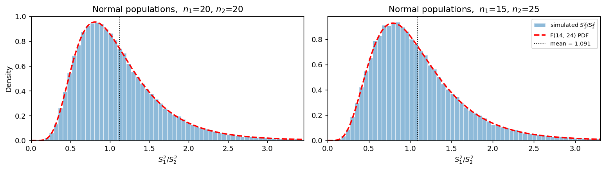

# S₁²/S₂²의 표본분포 (정규모집단)

## 개요

앞 쪽의 정리 1은 **근사가 아니라 정확한 결과**다. 두 표본이 독립인 정규모집단에서 나왔으면 $S_1^2/S_2^2$이 모든 표본크기에서 정확히 $F_{d_1,d_2}$를 따른다.

이 쪽은 그 사실을 모의실험으로 확인하는 기준선이다. 여기서 "정확히 맞는다"가 어떤 모습인지 눈에 익혀 두면, 다음 쪽에서 정규성이 깨졌을 때의 어긋남이 한눈에 보인다.

## 설정

$$
X_1, \ldots, X_{n_1} \overset{\text{iid}}{\sim} N(0, 1), \qquad
Y_1, \ldots, Y_{n_2} \overset{\text{iid}}{\sim} N(0, 1)
$$

두 모분산이 같으므로 귀무가설이 참인 상황이다. 두 조합을 본다.

- $n_1 = n_2 = 20$: 자유도가 같은 대칭인 경우
- $n_1 = 15$, $n_2 = 25$: 자유도가 다른 경우

평균 $\mu_1, \mu_2$는 아무 값이어도 결과가 같다. $S^2$이 편차만 쓰므로 위치가 상쇄되기 때문이다.

## 표본분포 이론

$$
\frac{S_1^2}{S_2^2} \sim F_{d_1, d_2}, \qquad d_1 = n_1 - 1,\ d_2 = n_2 - 1
$$

네 가지를 확인할 것이다.

| 확인할 것 | 이론값 |
|---|---|
| 분포 | $F_{d_1,d_2}$ (KS 거리가 0에 가까울 것) |
| 평균 | $d_2/(d_2-2)$, **1이 아니다** |
| 명목 5% 검정의 실제 오류율 | 0.05 |
| 명목 95% 구간의 실제 포함률 | 0.95 |

## 모의실험

<div class="codebox" markdown>

#### 예제 1. 정규모집단에서 분산비의 표집분포 { .eg }

```python
import matplotlib.pyplot as plt
import numpy as np
from scipy import stats

rng = np.random.default_rng(11)

fig, axes = plt.subplots(1, 2, figsize=(12, 3.5))
for ax, (n1, n2) in zip(axes, [(20, 20), (15, 25)]):
    # 두 표본을 따로 뽑아야 독립이 보장된다.
    F = (rng.normal(size=(100_000, n1)).var(axis=1, ddof=1)
         / rng.normal(size=(100_000, n2)).var(axis=1, ddof=1))

    # 오른쪽 꼬리가 길어 99.5백분위에서 자른다.
    h = np.percentile(F, 99.5)
    ax.hist(F, bins=60, range=(0, h), density=True, alpha=0.5,
            edgecolor="white", label="simulated $S_1^2/S_2^2$")

    d1, d2 = n1 - 1, n2 - 1
    g = np.linspace(1e-4, h, 400)
    ax.plot(g, stats.f(d1, d2).pdf(g), "--r", lw=2, label=f"F({d1}, {d2}) PDF")
    # 평균은 1이 아니라 d2/(d2-2) 다. 최빈값보다 오른쪽에 있다.
    ax.axvline(stats.f(d1, d2).mean(), color='k', ls=':', lw=1,
               label=f"mean = {stats.f(d1, d2).mean():.3f}")
    ax.set_title(f"Normal populations,  $n_1$={n1}, $n_2$={n2}")
    ax.set_xlabel("$S_1^2/S_2^2$")
    ax.set_xlim(0, h)

axes[0].set_ylabel("Density")
axes[1].legend(fontsize=8)
plt.tight_layout()
plt.show()
```



히스토그램과 빨간 곡선이 **거의 구별되지 않는다.** 다음 쪽의 같은 그림과 견주어 보면 차이가 분명해진다.

</div>

<div class="codebox" markdown>

#### 예제 2. 네 가지를 수치로 확인 { .eg }

```python
import numpy as np
from scipy import stats

rng = np.random.default_rng(1)
B = 100_000

print(f"{'(n1,n2)':>10}{'KS':>9}{'이론평균':>10}{'모의평균':>10}{'오류율':>9}{'포함률':>9}")
for n1, n2 in [(20, 20), (15, 25), (10, 40)]:
    d1, d2 = n1 - 1, n2 - 1
    F = (rng.normal(size=(B, n1)).var(axis=1, ddof=1)
         / rng.normal(size=(B, n2)).var(axis=1, ddof=1))

    lo, hi = stats.f(d1, d2).ppf([0.025, 0.975])
    ks = stats.kstest(F, 'f', args=(d1, d2)).statistic     # 분포가 맞는가
    err = np.mean((F < lo) | (F > hi))                     # 명목 5% 검정
    cov = np.mean((F / hi <= 1) & (1 <= F / lo))           # 명목 95% 구간
    print(f"{str((n1, n2)):>10}{ks:>9.4f}{stats.f(d1, d2).mean():>10.4f}"
          f"{F.mean():>10.4f}{err:>9.4f}{cov:>9.4f}")
```

출력:

```
   (n1,n2)       KS      이론평균      모의평균      오류율      포함률
  (20, 20)   0.0033    1.1176    1.1154   0.0506   0.9494
  (15, 25)   0.0029    1.0909    1.0938   0.0510   0.9489
  (10, 40)   0.0021    1.0541    1.0525   0.0500   0.9500
```

네 열이 모두 이론값과 맞는다. KS 거리가 0.003 수준인데 이는 10만 번 모의실험의 **모의오차 수준**이다($1/\sqrt{B} = 0.0032$). 오류율이 0.050, 포함률이 0.950으로 명목 수준과 일치한다.

</div>

## 해석

!!! note "주요 관찰"

    1. **분포가 정확히 맞는다.** KS 거리가 모의오차 수준이며, 표본크기를 바꿔도 마찬가지다. 근사가 아니라 정리이므로 $n$이 작아도 성립한다.
    2. **평균은 1이 아니다.** $(20,20)$에서 1.118, $(15,25)$에서 1.091, $(10,40)$에서 1.054다. 분모 자유도가 커질수록 1에 가까워진다. 등분산인데도 비가 1보다 크게 나오는 것이 정상이다.
    3. **명목 수준이 지켜진다.** 오류율 0.050, 포함률 0.950이다. 이것이 "정리가 정확하다"는 말의 실용적 의미다.
    4. **자유도가 달라도 문제없다.** $(10,40)$처럼 불균형해도 결과가 정확하다. 정규성만 있으면 표본크기의 균형은 상관없다. 다음 절의 두 평균 차에서 불균형이 치명적이었던 것과 대조된다.

!!! tip "이 쪽의 역할"
    여기서 얻은 네 수치(KS 0.003, 평균 $d_2/(d_2-2)$, 오류율 0.050, 포함률 0.950)가 **비교의 기준점**이다. 다음 쪽에서 같은 네 수치를 비정규 모집단에서 재면 오류율이 0.26, 0.48까지 오르고 포함률이 0.52까지 떨어진다.

## 연습문제

<div class="drillbox" markdown>

**연습문제 1.** <span class="diff easy" title="쉬움"></span>
모의실험에서 $\mu_1 = \mu_2 = 0$으로 두었다. $\mu_1 = 100$, $\mu_2 = -5$로 바꾸면 결과가 달라지는가?

</div>

??? success "풀이"
    **달라지지 않는다.** $S^2$은 편차 $X_i - \bar X$만 쓰고, 모든 관측값에 같은 상수를 더하면 편차가 변하지 않는다.

    $$
    (X_i + c) - \overline{(X + c)} = X_i + c - (\bar X + c) = X_i - \bar X
    $$

    따라서 $S_1^2, S_2^2$의 분포가 $\mu$에 의존하지 않고 비의 분포도 그대로다.

    이것이 정리 1에 $\mu_1, \mu_2$가 나타나지 않는 이유다. **위치모수는 분산 추론에서 완전히 상쇄된다.** 다만 자유도를 하나 잃는 대가를 치른다. $\mu$를 안다면 $\sum(X_i-\mu)^2/\sigma^2 \sim \chi^2_n$으로 자유도가 $n$이지만, $\bar X$로 갈음하면 $n-1$이 된다.

<div class="drillbox" markdown>

**연습문제 2.** <span class="diff easy" title="쉬움"></span>
예제 2에서 KS 거리 0.003이 "모의오차 수준"이라는 말의 뜻을 설명하라. 모의실험 횟수를 100배로 늘리면 이 값이 어떻게 되겠는가?

</div>

??? success "풀이"
    KS 통계량은 경험적 분포함수와 이론 분포함수의 최대 수직 거리다. 표본이 정말로 그 분포에서 나왔다 해도 유한한 $B$개로 그린 경험적 분포함수는 이론값과 정확히 겹치지 않으며, 그 어긋남의 크기가 $O(1/\sqrt B)$다.

    $B = 100{,}000$이면 $1/\sqrt B = 0.0032$이므로 관측된 0.0033은 **이론이 완벽히 맞을 때 나올 만한 값**이다. 실제로 콜모고로프 분포에서 $\sqrt B \cdot D$의 95백분위점이 1.36이므로 임계값은 $1.36/\sqrt{B} = 0.0043$이고, 0.0033은 이를 넘지 않는다.

    $B$를 100배(천만)로 늘리면 KS 거리가 $\sqrt{100} = 10$배 줄어 0.0003 수준이 된다. **줄어드는 것이 이론이 맞다는 증거**이고, 줄지 않고 어떤 값에 머문다면 그 값이 진짜 어긋남이다. 다음 쪽의 비정규 모집단이 그런 경우다.

<div class="drillbox" markdown>

**연습문제 3.** <span class="diff med" title="중간"></span>
$(n_1, n_2) = (20, 20)$에서 모의평균 1.1154가 이론값 1.1176과 맞는지 판단하라. 모의오차를 감안해 답하라.

</div>

??? success "풀이"
    $F_{19,19}$의 분산은

    $$
    \text{Var}(F) = \frac{2d_2^2(d_1+d_2-2)}{d_1(d_2-2)^2(d_2-4)} = \frac{2(19^2)(36)}{19(17^2)(15)} = 0.3157
    $$

    이므로 표준편차가 0.562다. 10만 번 모의실험한 평균의 표준오차는

    $$
    \frac{0.562}{\sqrt{100{,}000}} = 0.00178
    $$

    이다. 이론값과의 차이가 $|1.1154 - 1.1176| = 0.0022$로 표준오차의 1.2배이므로 **모의오차 범위 안이다.** 맞는다고 판단한다.

    이런 판단을 습관적으로 하는 것이 중요하다. 모의실험 결과가 이론값과 소수 셋째 자리에서 다르다고 "틀렸다"고 말하면 안 되고, 반대로 큰 차이를 "대충 맞는다"고 넘겨서도 안 된다. **모의오차를 계산해 놓고 그 잣대로 재야 한다.**

<div class="drillbox" markdown>

**연습문제 4.** <span class="diff med" title="중간"></span>
정규모집단에서 $\sigma_1/\sigma_2 = 1.5, 2, 3$일 때 명목 5% 양측 $F$ 검정의 검정력을 모의실험으로 구했더니 0.402, 0.837, 0.996이었다. $n_1 = n_2 = 20$이다. 이 값들을 해석하고, 검정력 0.8을 얻으려면 분산비가 얼마나 되어야 하는지 답하라.

</div>

??? success "풀이"
    표준편차비 1.5는 **분산비 2.25**인데도 검정력이 0.402에 그친다. 즉 분산이 두 배 이상 차이 나는 두 모집단을 놓고도 절반 넘게 놓친다.

    표준편차비 2(분산비 4)에서 0.837이 되므로, **검정력 0.8의 문턱이 대략 분산비 3.5~4 근처**다. 표준편차로는 1.9배쯤이다.

    | $\sigma_1/\sigma_2$ | 분산비 | 검정력 |
    |---|---|---|
    | 1.5 | 2.25 | 0.402 |
    | 2.0 | 4.00 | 0.837 |
    | 3.0 | 9.00 | 0.996 |

    **실무적 함의.** $n = 20$ 정도의 표본으로 등분산 검정을 해서 기각되지 않았다는 것은 "분산이 같다"는 증거가 거의 되지 못한다. 분산비 2~3의 차이는 잡아내지 못하기 때문이다. 이것이 등분산 검정 결과로 $t$ 검정 방식을 고르는 2단계 절차를 권하지 않는 여러 이유 가운데 하나다(강건한 대안 쪽에서 다시 다룬다).

<div class="drillbox" markdown>

**연습문제 5.** <span class="diff med" title="중간"></span>
$(n_1, n_2) = (10, 40)$처럼 표본크기가 불균형해도 결과가 정확했다. 5.7절의 두 표본평균 차에서는 불균형이 문제가 되는데, 왜 여기서는 그렇지 않은가?

</div>

??? success "풀이"
    두 상황에서 문제가 되는 것이 다르다.

    **두 평균 차에서의 불균형 문제는 이분산과 짝을 이룰 때만 생긴다.** 합동분산 $S_p^2$은 두 표본분산을 자유도로 가중평균하므로, 분산이 다른데 표본크기까지 다르면 가중치가 잘못 배분되어 표준오차 추정이 편향된다. 등분산이면 불균형해도 문제없다.

    **분산비에서는 두 표본분산을 각각 자기 자유도로만 나눈다.** 두 표본을 섞어 하나의 추정량을 만드는 단계가 없으므로 서로의 자유도가 간섭하지 않는다. $S_1^2$은 $\chi^2_{d_1}$, $S_2^2$은 $\chi^2_{d_2}$이고, 그 비가 $F_{d_1,d_2}$라는 것이 자유도가 얼마든 성립한다.

    **차이의 핵심은 "섞는가"다.** 합동분산은 섞고, 분산비는 섞지 않는다. 섞는 절차는 섞는 비율이 맞아야 하므로 가정에 민감해지고, 섞지 않는 절차는 그 문제가 없다.

    다만 불균형이 아무 대가가 없는 것은 아니다. 검정력이 떨어진다. 전체 관측값 50개를 $(10,40)$으로 나누면 $(25,25)$로 나눌 때보다 분산비를 잡아내는 힘이 약하다. 작은 쪽 자유도가 병목이 되기 때문이다.

<div class="drillbox" markdown>

**연습문제 6.** <span class="diff hard" title="어려움"></span>
$F \sim F_{d_1,d_2}$이면 $\log F$의 분포가 거의 대칭임이 알려져 있다(피셔의 $z$ 변환). $n_1 = n_2 = 20$에서 이를 확인하고, 신뢰구간을 로그 척도에서 만드는 것이 왜 자연스러운지 설명하라.

</div>

??? success "풀이"
    $\log F = \log S_1^2 - \log S_2^2$이고 두 항이 독립이며 같은 분포를 따르므로($d_1 = d_2$) **차의 분포는 0을 중심으로 정확히 대칭이다.** 대칭인 이유가 이렇게 간단하다.

    자유도가 다르면 정확한 대칭은 깨지지만 여전히 거의 대칭이다. $\log S^2$의 분포가 $S^2$보다 훨씬 덜 치우쳐 있기 때문인데, 로그가 오른쪽 꼬리를 눌러 주기 때문이다. 피셔는 $z = \frac12\log F$로 두면 근사적으로

    $$
    z \;\dot\sim\; N\!\left(\frac12\left(\frac{1}{d_2} - \frac{1}{d_1}\right),\ \frac12\left(\frac{1}{d_1} + \frac{1}{d_2}\right)\right)
    $$

    임을 보였다.

    **로그 척도가 자연스러운 이유.** 분산비는 곱셈적인 양이다. "두 배 크다"와 "절반이다"는 같은 크기의 차이인데, 원래 척도에서는 $2$와 $0.5$로 1에서의 거리가 다르다. 로그를 씌우면 $+0.69$와 $-0.69$로 같아진다.

    실용적으로도 이점이 있다. 앞 쪽 연습문제 1에서 신뢰구간 $[0.972, 6.890]$이 관측값 2.5를 중심에 두지 않아 보였는데, 로그 척도에서는 $[-0.028, 1.930]$이고 중심이 0.951, 즉 $e^{0.951} = 2.59$로 관측값 근처다. **곱셈적인 양은 곱셈적인 척도에서 보아야 한다.**

---

## 정리하며

- 정규모집단에서 $S_1^2/S_2^2 \sim F_{d_1,d_2}$는 근사가 아니라 **정확한 결과**다. KS 거리가 모의오차 수준(0.003)이고 표본크기가 작아도 성립한다.
- 명목 5% 검정의 실제 오류율이 0.050, 명목 95% 구간의 포함률이 0.950으로 수준이 정확히 지켜진다.
- 등분산이어도 비의 평균은 $d_2/(d_2-2) > 1$이다. 분모 자유도가 작을수록 1에서 멀어진다.
- **표본크기 불균형은 문제가 되지 않는다.** 두 표본분산을 섞지 않고 각자의 자유도로만 나누기 때문이다.
- 검정력은 약하다. $n = 20$에서 분산비 2.25를 잡아낼 확률이 0.40에 그친다. 기각되지 않았다는 것이 등분산의 증거가 되지 못한다.
- 여기서 얻은 네 수치가 다음 쪽의 비교 기준이 된다.
