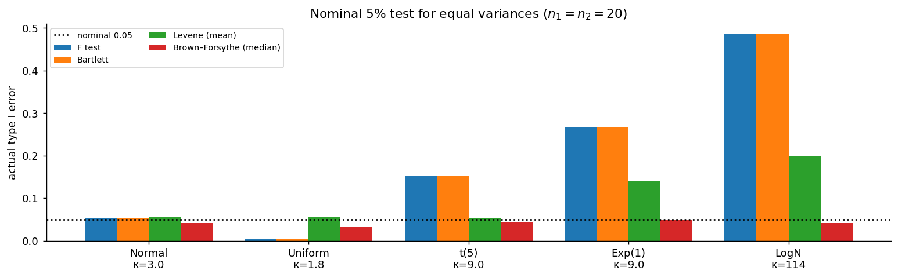

# 등분산 검정의 강건한 대안

## 개요

앞 쪽에서 $F$ 검정이 정규성에 얼마나 취약한지 보았다. 로그정규 자료에서 명목 5% 검정이 실제로 48%를 기각하고, 표본을 키우면 더 나빠졌다.

그렇다면 두 집단의 분산이 같은지 물어야 할 때 무엇을 쓰는가. 이 쪽에서 네 가지 검정을 같은 자리에 놓고 비교한다.

| 검정 | 발상 |
|---|---|
| $F$ 검정 | 두 표본분산의 비를 $F$ 분포와 견준다 |
| 바틀렛(Bartlett) | 정규이론 가능도비. 세 집단 이상으로 확장 |
| 르빈(Levene) | 편차의 절댓값 $|X_i - \bar X|$에 분산분석 |
| 브라운–포사이드(Brown–Forsythe) | 편차를 **중앙값** 기준으로 $|X_i - \text{med}|$ |

결론을 먼저 말하면, 마지막 것만 살아남는다.

## 설정

다섯 모집단에서 $n_1 = n_2 = 20$인 두 독립 표본을 뽑는다. 두 표본이 같은 모집단에서 나오므로 등분산이며 귀무가설이 참이다. 명목 유의수준 5% 양측검정의 **실제 1종오류율**을 센다.

정규, 균등, $t_5$, 지수, 로그정규 다섯 모집단을 쓴다. $t_5$와 지수는 첨도가 똑같이 9이지만 하나는 대칭이고 하나는 치우쳐 있어, **치우침과 꼬리 무거움을 분리해 볼 수 있다.**

## 네 검정의 구조

### F 검정과 바틀렛 검정: 정규이론

$F$ 검정은 앞 쪽에서 본 대로다. 바틀렛 검정은 정규모집단을 가정한 가능도비 검정이며, 두 집단일 때는 $F$ 검정과 거의 같은 결정을 내린다. **둘 다 4차 적률에 직접 노출된다.**

### 르빈 검정: 산포를 평균 문제로 바꾼다

발상이 영리하다. 각 관측값을 자기 집단 중심으로부터의 거리로 바꾼다.

$$
Z_{ij} = |X_{ij} - \bar X_i|
$$

그러면 "두 집단의 산포가 같은가"가 "두 집단의 $Z$ 평균이 같은가"로 바뀌고, **분산 문제가 평균 문제가 된다.** 평균 문제에는 중심극한정리가 듣는다.

### 브라운–포사이드: 중심을 중앙값으로

르빈 검정에서 $\bar X_i$를 중앙값 $\text{med}_i$로 바꾼 것이다.

$$
Z_{ij} = |X_{ij} - \text{med}_i|
$$

치우친 모집단에서는 평균이 꼬리에 끌려가므로, 평균으로부터의 거리가 꼬리의 영향을 두 번 받는다. 중앙값은 그렇지 않다. `scipy`에서 `stats.levene(..., center='median')`이 이 검정이다.

## 모의실험

<div class="codebox" markdown>

#### 예제 1. 다섯 모집단에서 네 검정의 실제 1종오류율 { .eg }

```python
import numpy as np
from scipy import stats

rng = np.random.default_rng(7)
m, n = 5_000, 20
d = n - 1
lo, hi = stats.f(d, d).ppf([0.025, 0.975])

pops = [("정규 N(0,1)", lambda s: rng.normal(size=s), 3.0),
        ("균등 U(0,1)", lambda s: rng.uniform(size=s), 1.8),
        ("t(5)", lambda s: rng.standard_t(5, size=s), 9.0),
        ("지수 Exp(1)", lambda s: rng.exponential(size=s), 9.0),
        ("로그정규 LN(0,1)", lambda s: rng.lognormal(0, 1, size=s), 113.94)]

print(f"{'모집단':>18}{'κ':>8}{'F':>8}{'Bartlett':>10}"
      f"{'Levene(mean)':>14}{'Brown-Forsythe':>16}")
for name, rvs, kap in pops:
    X, Y = rvs((m, n)), rvs((m, n))

    # F 검정은 벡터화가 되지만 나머지는 표본마다 호출해야 한다.
    F = X.var(axis=1, ddof=1) / Y.var(axis=1, ddof=1)
    rF = np.mean((F < lo) | (F > hi))
    rB = np.mean([stats.bartlett(X[i], Y[i]).pvalue < 0.05 for i in range(m)])
    rL = np.mean([stats.levene(X[i], Y[i], center='mean').pvalue < 0.05
                  for i in range(m)])
    rM = np.mean([stats.levene(X[i], Y[i], center='median').pvalue < 0.05
                  for i in range(m)])
    print(f"{name:>18}{kap:>8.1f}{rF:>8.3f}{rB:>10.3f}{rL:>14.3f}{rM:>16.3f}")
```

출력:

```
               모집단       κ       F  Bartlett  Levene(mean)  Brown-Forsythe
         정규 N(0,1)     3.0   0.052     0.052         0.056           0.041
         균등 U(0,1)     1.8   0.005     0.005         0.055           0.032
              t(5)     9.0   0.152     0.152         0.054           0.043
         지수 Exp(1)     9.0   0.267     0.267         0.139           0.049
      로그정규 LN(0,1)   113.9   0.485     0.485         0.200           0.041
```



</div>

읽을 것이 세 가지 있다.

**첫째, $F$와 바틀렛은 구별되지 않는다.** 다섯 모집단에서 소수 셋째 자리까지 같은 값이 나왔다. 두 집단 비교에서 바틀렛 검정은 $F$ 검정의 다른 표현일 뿐이며, **정규이론에 기대는 한 이름을 바꿔도 취약함은 그대로다.**

**둘째, 르빈 검정은 절반만 성공한다.** $t_5$에서 0.054로 훌륭하다. 첨도가 9인데도 버틴 것이다. 그런데 같은 첨도 9의 지수모집단에서는 0.139로 무너진다. 차이는 **치우침**이다. 대칭이면 평균이 중심을 제대로 잡지만, 치우친 모집단에서는 평균이 꼬리 쪽으로 끌려가 $|X - \bar X|$가 왜곡된다.

**셋째, 브라운–포사이드만 전 구간에서 버틴다.** 0.032에서 0.049 사이이며 어느 모집단에서도 명목 수준을 넘지 않는다. 중앙값이 꼬리에 끌려가지 않기 때문이다.

## 강건함의 대가

공짜는 아니다. 정규모집단에서는 $F$ 검정이 더 강력하다.

<div class="codebox" markdown>

#### 예제 2. 검정력 비교 { .eg }

```python
import numpy as np
from scipy import stats

rng = np.random.default_rng(7)
m, n = 5_000, 20
d = n - 1
lo, hi = stats.f(d, d).ppf([0.025, 0.975])

# 정규모집단, 표준편차비 2 (분산비 4)
X, Y = rng.normal(0, 2, size=(m, n)), rng.normal(0, 1, size=(m, n))
F = X.var(axis=1, ddof=1) / Y.var(axis=1, ddof=1)
print("정규모집단, sigma1/sigma2 = 2")
print(f"  F 검정          : {np.mean((F < lo) | (F > hi)):.3f}")
print(f"  Brown-Forsythe  : "
      f"{np.mean([stats.levene(X[i], Y[i], center='median').pvalue < 0.05 for i in range(m)]):.3f}")

# 지수모집단, 척도비 2
X, Y = rng.exponential(2, size=(m, n)), rng.exponential(1, size=(m, n))
F = X.var(axis=1, ddof=1) / Y.var(axis=1, ddof=1)
print("지수모집단, 척도비 2")
print(f"  F 검정          : {np.mean((F < lo) | (F > hi)):.3f}  (수준이 0.27이므로 무의미)")
print(f"  Brown-Forsythe  : "
      f"{np.mean([stats.levene(X[i], Y[i], center='median').pvalue < 0.05 for i in range(m)]):.3f}")
```

출력:

```
정규모집단, sigma1/sigma2 = 2
  F 검정          : 0.837
  Brown-Forsythe  : 0.702
지수모집단, 척도비 2
  F 검정          : 0.711  (수준이 0.27이므로 무의미)
  Brown-Forsythe  : 0.402
```

정규모집단에서 검정력이 0.837 대 0.702로 **13퍼센트포인트 차이**가 난다. 정규성이 참이라면 $F$ 검정이 더 낫다는 뜻이다.

지수모집단의 0.711은 겉보기 숫자일 뿐이다. 그 검정의 실제 유의수준이 0.27이므로 **검정력이라고 부를 수 없다.** 수준이 맞지 않는 검정의 검정력은 비교 대상이 아니다.

</div>

!!! note "수준을 먼저, 검정력은 그다음"
    검정을 고를 때 순서가 있다. **실제 유의수준이 명목과 맞는지를 먼저 확인하고, 그다음에 검정력을 견준다.** 수준이 틀린 검정은 검정력이 높아도 쓸 수 없다. 기각을 많이 하는 것이 검정력이 좋아서인지 수준이 부풀려져서인지 구별할 수 없기 때문이다.

## 그래서 실무에서는

!!! danger "2단계 절차를 쓰지 마라"
    흔한 관행이 있다. **먼저 등분산 검정을 하고, 기각되지 않으면 합동 $t$ 검정을, 기각되면 Welch $t$ 검정을 쓴다.** 이 절차에는 문제가 둘 있다.

    첫째, **전체 유의수준이 망가진다.** 자료를 보고 검정을 고르는 것 자체가 조건부 선택이라, 두 단계를 합친 절차의 실제 수준이 명목과 달라진다.

    둘째, **1단계의 검정력이 형편없다.** 정규모집단·$n = 20$에서 분산비 2.25를 잡아낼 확률이 0.40에 그쳤다(정규모집단 쪽 연습문제 4). 기각되지 않았다는 것이 등분산의 증거가 못 되므로, 사실상 "검정을 통과했으니 합동 $t$를 쓴다"는 결정이 근거 없이 내려진다.

    **처음부터 Welch $t$ 검정을 쓰는 것이 요즘의 권고다.** 등분산일 때 잃는 것이 거의 없고(자유도가 약간 줄어들 뿐) 이분산일 때 얻는 것이 크다. 5.7절에서 확인했다.

그러면 등분산 검정은 언제 필요한가. **산포 자체가 관심사일 때**다. 두 공정의 균일성 비교, 측정 장비의 재현성 평가, 금융 자산의 변동성 비교가 그런 경우다. 그때의 선택은 다음과 같다.

| 상황 | 권고 |
|---|---|
| 정규성을 확신할 수 있다 | $F$ 검정(가장 강력) |
| 정규성이 불확실하다 | **브라운–포사이드** |
| 세 집단 이상 | 브라운–포사이드(분산분석 틀에 그대로 들어간다) |
| 꼬리가 극단적으로 무겁다 | 부트스트랩 또는 산포 척도를 바꾼다(사분위범위, MAD) |

마지막 줄을 강조할 만하다. 첨도가 유한하지 않을 수도 있는 자료에서는 **분산이 적절한 산포 척도인지부터 다시 물어야 한다.** 4차 적률이 존재하지 않으면 분산에 대한 어떤 추론도 불안정하다. 2장에서 본 사분위범위나 중앙값 절대편차로 산포를 재고 그 차이를 부트스트랩으로 검정하는 편이 낫다.

## 해석

!!! note "주요 관찰"

    1. **$F$와 바틀렛은 같은 배를 탔다.** 두 집단 비교에서 결과가 거의 일치하며 둘 다 첨도에 노출된다. "바틀렛이 더 정교하니 낫다"는 오해를 버려야 한다.
    2. **르빈 검정은 대칭성에 의존한다.** 첨도 9인 $t_5$에서는 통하고(0.054) 같은 첨도의 지수에서는 무너진다(0.139). 원인은 꼬리가 아니라 **치우침**이다.
    3. **브라운–포사이드가 유일하게 전 구간에서 명목 수준을 지킨다.** 0.032~0.049이며 약간 보수적인 쪽이다. 중앙값을 중심으로 잡는 한 수정이 이 차이를 만든다.
    4. **강건함의 대가는 정규모집단에서의 검정력 13퍼센트포인트다.** 정규성이 확실하면 $F$가 낫고, 불확실하면 그 대가를 지불할 만하다.

## 연습문제

<div class="drillbox" markdown>

**연습문제 1.** <span class="diff easy" title="쉬움"></span>
$F$ 검정과 바틀렛 검정의 오류율이 다섯 모집단에서 모두 같게 나왔다. 왜 그런가?

</div>

??? success "풀이"
    두 집단일 때 바틀렛 통계량은 두 표본분산의 비만의 함수이기 때문이다. 바틀렛 통계량은

    $$
    B = \frac{(N-k)\ln s_p^2 - \sum_i (n_i - 1)\ln s_i^2}{C}
    $$

    꼴인데($C$는 보정항), $k = 2$이면 $s_p^2$이 $s_1^2, s_2^2$의 가중평균이므로 $B$가 $s_1^2/s_2^2$의 단조함수가 된다. **같은 통계량의 단조변환이면 같은 검정이다.**

    둘의 차이는 기준분포뿐이다. $F$ 검정은 정확한 $F$ 분포를, 바틀렛은 근사적인 카이제곱을 쓴다. $n = 20$ 정도면 그 차이가 소수 셋째 자리에서 드러나지 않는다.

    **실용적 결론.** 바틀렛 검정의 쓸모는 세 집단 이상으로 확장된다는 점이지 강건함이 아니다. 정규성 의존은 $F$ 검정과 똑같다.

<div class="drillbox" markdown>

**연습문제 2.** <span class="diff med" title="중간"></span>
르빈 검정이 $t_5$(첨도 9, 대칭)에서는 통하고 지수(첨도 9, 치우침)에서는 무너진 이유를 설명하라.

</div>

??? success "풀이"
    르빈 검정은 $Z_{ij} = |X_{ij} - \bar X_i|$의 평균을 비교한다. 이 변환이 제대로 작동하려면 $\bar X_i$가 집단의 중심을 잘 대표해야 한다.

    **대칭 모집단($t_5$)에서는** 평균이 곧 중앙값이고 꼬리의 영향이 좌우 상쇄되므로 $\bar X_i$가 중심을 제대로 잡는다. 꼬리가 무거워 $Z$의 값이 간혹 크게 나오지만, $Z$의 평균을 비교하는 것은 결국 평균 문제이므로 중심극한정리가 완충해 준다.

    **치우친 모집단(지수)에서는** 평균이 중앙값보다 오른쪽에 있다. 표본마다 평균의 위치가 꼬리에 끌려 흔들리므로 $|X - \bar X|$가 중심의 흔들림과 산포를 **함께** 반영한다. 두 오차가 섞이면서 $Z$ 평균의 분포가 예상보다 넓어지고, 검정의 수준이 부풀려진다.

    이것이 브라운–포사이드가 중앙값을 쓰는 이유다. 중앙값은 꼬리에 끌려가지 않으므로 중심의 흔들림이 산포 측정에 섞여 들지 않는다. 모의실험에서 지수모집단의 오류율이 0.139에서 0.049로 내려간 것이 그 효과다.

<div class="drillbox" markdown>

**연습문제 3.** <span class="diff med" title="중간"></span>
브라운–포사이드 검정의 오류율이 대부분 0.05보다 약간 작다(0.032~0.049). 이 보수성의 원인과 대가를 설명하라.

</div>

??? success "풀이"
    **원인.** 중앙값을 중심으로 쓰면 $Z_{ij} = |X_{ij} - \text{med}_i|$의 분포가 평균 기준보다 오른쪽으로 더 치우친다(중앙값이 평균보다 자료 안쪽에 있어 큰 편차가 더 많이 생긴다). 그 치우침 때문에 $Z$에 대한 분산분석의 $F$ 근사가 약간 보수적으로 작동한다. 또 중앙값 자체가 이산적으로 움직이므로($n$이 짝수면 두 값의 평균) 작은 표본에서 추가적인 보수성이 생긴다.

    **대가는 검정력이다.** 예제 2에서 정규모집단·분산비 4에서 0.702였는데, 만약 수준을 정확히 0.05로 맞출 수 있다면 조금 더 높았을 것이다. 보수적인 검정은 기각을 덜 하므로 참인 차이도 덜 잡아낸다.

    **그래도 이 방향이 낫다.** 수준이 명목보다 낮으면 보고한 $p$-값이 보수적이라는 뜻이고, "유의하다"는 주장은 여전히 유효하다. 반대 방향($F$ 검정이 로그정규에서 0.485)에서는 "유의하다"는 주장 자체를 믿을 수 없다. **오류의 방향이 결론의 신뢰성에 미치는 영향이 비대칭이다.**

<div class="drillbox" markdown>

**연습문제 4.** <span class="diff med" title="중간"></span>
"등분산 검정을 먼저 하고 그 결과로 $t$ 검정 방식을 고른다"는 2단계 절차의 문제를 두 가지 들고, 대안을 제시하라.

</div>

??? success "풀이"
    **문제 1: 전체 유의수준이 통제되지 않는다.** 2단계 절차의 최종 결정은 1단계 결과에 따라 달라지는 조건부 절차다. 두 단계를 합친 전체 절차의 실제 1종오류율은 각 단계의 명목 수준과 다르며, 계산하기도 어렵다. 자료를 보고 방법을 고르는 것이 일반적으로 수준을 망가뜨린다는 것은 다중검정 문제(9장)의 한 사례다.

    **문제 2: 1단계의 검정력이 낮다.** $n = 20$에서 분산비 2.25를 잡아낼 확률이 0.40이었다. 즉 분산이 두 배 이상 다른 상황에서도 절반 넘게 "등분산"으로 판정하고 합동 $t$를 쓴다. 검정이 기각하지 못한 것을 "등분산의 증거"로 해석하는 것은 논리적으로도 틀렸다(귀무가설을 기각하지 못한 것은 귀무가설이 참이라는 증거가 아니다).

    **대안: 처음부터 Welch $t$ 검정을 쓴다.** 5.7절에서 보았듯 등분산일 때도 Welch의 손실이 거의 없고(자유도가 약간 줄어드는 정도) 이분산일 때 큰 이득이 있다. 결정을 자료에 맡기지 않으므로 수준도 통제된다.

    같은 발상이 다른 곳에도 적용된다. **"가정을 검정해서 방법을 고르기"보다 "가정에 덜 의존하는 방법을 쓰기"가 대개 낫다.** 정규성 검정을 해서 $t$와 비모수검정을 고르는 절차도 같은 이유로 권장되지 않는다.

<div class="drillbox" markdown>

**연습문제 5.** <span class="diff med" title="중간"></span>
두 집단의 산포를 비교해야 하는 실제 상황을 셋 들고, 각각에 어떤 방법을 쓸지 이유와 함께 답하라.

</div>

??? success "풀이"
    **(1) 두 측정 장비의 재현성 비교.** 같은 표준시료를 두 장비로 각각 30번 재어 분산을 비교한다. 측정오차는 정규분포로 볼 근거가 있고(여러 미세한 요인의 합), 관심사가 산포 자체다. **$F$ 검정이 적절하다.** 다만 정규성을 Q-Q 그림으로 확인하고, 첨도가 4를 넘으면 브라운–포사이드로 바꾼다.

    **(2) 두 공정의 제품 치수 균일성 비교.** 규격을 벗어난 값이 섞여 있을 수 있어 이상점이 예상된다. 정규성을 확신할 수 없으므로 **브라운–포사이드**를 쓴다. 이상점이 분산 추정을 지배하는 것이 걱정되면 사분위범위 비교와 병행한다.

    **(3) 두 자산의 수익률 변동성 비교.** 금융 수익률은 첨도가 매우 크고(4장에서 본 $t_4$ 수준) 4차 적률의 존재 자체가 의심스럽다. **분산 검정을 쓰지 않는다.** 로그 수익률의 사분위범위나 MAD를 비교하고 부트스트랩으로 불확실성을 재는 편이 낫다. 시계열이므로 독립 가정도 깨지는데, 이는 변동성 군집을 다루는 별도의 모형(GARCH 등)이 필요하다는 뜻이다.

    셋을 관통하는 기준은 하나다. **자료의 꼬리가 무거울수록 분산에서 멀어지고 강건한 척도로 옮겨 가야 한다.**

<div class="drillbox" markdown>

**연습문제 6.** <span class="diff hard" title="어려움"></span>
브라운–포사이드 검정이 강건한 이유를 "분산 문제를 평균 문제로 바꾼다"는 관점에서 설명하라. 그런데 왜 이 변환이 $F$ 검정의 첨도 문제를 피할 수 있는가?

</div>

??? success "풀이"
    **변환의 요점.** $Z_{ij} = |X_{ij} - \text{med}_i|$로 바꾸면 검정하려는 양이 $E[Z_i]$가 된다. 두 집단의 산포 비교가 두 집단의 $Z$ **평균** 비교로 바뀌므로, 우리가 쓰는 도구가 분산 추론에서 평균 추론으로 옮겨 간다.

    **왜 첨도 문제를 피하는가.** 평균에 관한 추론은 2차 적률만 요구한다. $Z$ 평균의 표집분포는 중심극한정리에 의해 $\text{Var}(Z)$만 알면 근사되며, 이는 **원래 자료의 2차 적률이 아니라 $Z$의 2차 적률**이다. $Z = |X - \text{med}|$의 분산은 원래 $X$의 4차 적률과 직접 연결되지 않는다.

    좀 더 정확히 말하면, $\text{Var}(Z)$는 $X$의 2차 적률 수준의 양이므로 $F$ 검정이 요구했던 4차 적률 대신 **한 단계 낮은 적률**로 충분해진다. 5.6절의 표현을 빌리면, $F$ 검정은 "$S^2$의 분산"(4차 적률)이 필요하고 브라운–포사이드는 "$Z$의 평균"(2차 적률)만 필요하다.

    **한계도 있다.** $Z$의 평균은 표준편차와 비례하지 않는다. 정규분포에서 $E|X-\mu| = \sigma\sqrt{2/\pi}$이지만 다른 분포에서는 비례상수가 다르다. 따라서 이 검정은 "$\sigma_1 = \sigma_2$"를 직접 검정하는 것이 아니라 "두 집단의 평균절대편차가 같은가"를 검정한다. 두 집단의 **모양이 같다**면 두 물음이 동등하지만, 모양이 다르면 미묘하게 다른 질문이다.

    실무에서 이 한계가 문제가 되는 경우는 드물다. 모양이 크게 다른 두 집단의 "분산이 같은가"라는 물음 자체가 애초에 뜻이 모호하기 때문이다.

---

## 정리하며

- $F$ 검정과 바틀렛 검정은 두 집단 비교에서 사실상 같은 검정이며, 둘 다 4차 적률에 노출되어 정규성이 깨지면 함께 무너진다.
- 르빈 검정은 **치우침**에 취약하다. 첨도가 같아도 대칭이면 버티고($t_5$에서 0.054) 치우치면 무너진다(지수에서 0.139).
- **브라운–포사이드 검정(중앙값 기준 르빈)만 다섯 모집단 전체에서 명목 수준을 지킨다**(0.032~0.049). 중앙값을 중심으로 쓰는 한 수정이 그 차이를 만든다.
- 강건함의 대가는 정규모집단에서의 검정력 13퍼센트포인트다. 정규성이 확실하면 $F$, 불확실하면 브라운–포사이드가 합리적인 선택이다.
- **등분산 검정으로 $t$ 검정 방식을 고르는 2단계 절차는 쓰지 않는다.** 전체 유의수준이 통제되지 않고 1단계 검정력도 낮다. 처음부터 Welch $t$를 쓴다.
- 꼬리가 극단적으로 무거운 자료에서는 분산 자체가 적절한 산포 척도인지 다시 물어야 한다.

이로써 5.4절부터 이어진 여섯 통계량을 모두 보았다. 마지막으로 한 문장으로 요약하면, **중심극한정리는 1차 적률에만 선물을 주고 2차 적률에는 주지 않는다.** $\bar X$, $\hat p$, $\bar X_1 - \bar X_2$, $\hat p_1 - \hat p_2$는 표본을 키우면 정규성이 필요 없어지지만, $S^2$과 $S_1^2/S_2^2$은 표본을 키워도 정규성에서 벗어나지 못한다.
