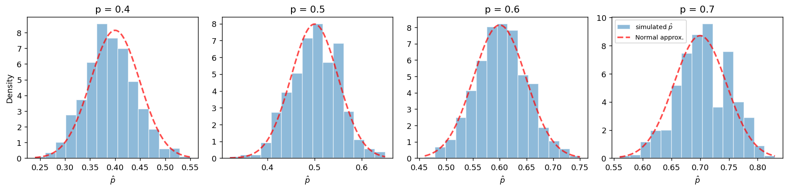

# X̄의 표본분포 (Bernoulli)

## 개요

여론조사에서 1000명에게 물어 530명이 찬성했다면 우리는 "찬성률 53%"라고 적는다. 그런데 이때 실제로 한 계산을 뜯어보면, 찬성에 1을 주고 반대에 0을 준 뒤 그 1000개의 수를 평균 낸 것이다. 비율은 0과 1로 이루어진 자료의 **평균**이다.

그러므로 모집단이 성공과 실패 두 값뿐인 베르누이 모집단일 때, 표본평균 $\bar{X}$는 표본에서 성공이 차지하는 비율 $\hat{p}$과 같은 것이다. 이름이 둘일 뿐 같은 통계량이다. 앞 쪽들에서 $\bar{X}$에 대해 얻은 결과가 하나도 남김없이 $\hat{p}$으로 옮겨 온다는 뜻이고, 중심극한정리도 예외가 아니다.

이 쪽에서는 그 사실을 모의실험으로 확인한다. 성공확률 $p$를 0.4에서 0.7까지 바꿔 가며 크기 $n = 100$인 표본을 거듭 뽑고, $\hat{p}$이 흩어지는 모습이 정말 정규곡선과 겹치는지 눈으로 본다.

## 모집단은 값이 두 개뿐이다

관측값 하나하나는 성공확률이 $p$인 베르누이 시행이다.

$$
X_i \sim \text{Bernoulli}(p), \qquad P(X_i = 1) = p, \quad P(X_i = 0) = 1 - p
$$

이 모집단은 상상할 수 있는 가장 비정규적인 분포다. 값이 둘뿐이고 히스토그램을 그려도 막대가 두 개이며, 종 모양과는 아무 관계가 없다. 그 평균과 분산은 바로 계산된다.

$$
\mu = E[X_i] = p, \qquad \sigma^2 = \text{Var}(X_i) = p(1 - p)
$$

분산이 $p(1-p)$라는 점을 눈여겨볼 만하다. 모집단의 퍼짐이 모평균 $p$ 자체로 정해진다. 평균과 분산을 따로 정할 수 있는 정규모집단과 달리 베르누이에서는 하나를 정하면 다른 하나가 따라온다.

## 표본평균이 곧 표본비율이다

크기 $n$인 표본에서 표본평균을 계산하면 1의 개수를 $n$으로 나눈 값, 곧 표본비율이 나온다.

$$
\hat{p} = \bar{X} = \frac{1}{n}\sum_{i=1}^n X_i
$$

따라서 $\hat{p}$의 표본분포를 얻는 데 새로 증명할 것이 없다. $\bar{X}$에 대한 일반 공식 $E[\bar{X}] = \mu$와 $\text{Var}(\bar{X}) = \sigma^2/n$에 $\mu = p$, $\sigma^2 = p(1-p)$를 넣기만 하면 된다.

$$
E[\hat{p}] = p, \qquad \text{Var}(\hat{p}) = \frac{p(1 - p)}{n}, \qquad
\text{SE}(\hat{p}) = \sqrt{\frac{p(1 - p)}{n}}
$$

다만 표준오차의 생김새는 한 번 더 들여다볼 필요가 있다. $\bar{X}$의 표준오차 $\sigma/\sqrt{n}$에서는 퍼짐을 정하는 $\sigma$와 중심을 정하는 $\mu$가 서로 다른 모수였다. 여기서는 추정하려는 값 $p$가 곧 오차의 크기까지 정한다. 이 성질이 뒤에서 표본크기를 계획할 때 곧바로 문제가 된다.

## 중심극한정리는 모집단의 모양을 묻지 않는다

중심극한정리는 모집단이 어떻게 생겼는지 따지지 않는다. 분산만 유한하면 되고, 값이 두 개뿐인 베르누이도 당연히 여기에 든다. 그러므로 $n$이 충분히 크면

$$
\hat{p} \;\dot{\sim}\; N\!\left(p,\; \frac{p(1 - p)}{n}\right)
$$

이다. 막대 두 개짜리 모집단에서 매끄러운 종 모양이 나온다는 말이 선뜻 믿기지 않지만, 정리가 약속하는 바가 정확히 그것이다.

남는 물음은 "충분히 크면"이 얼마를 뜻하느냐다. $p$가 0.5 근처면 모집단이 대칭이라 수렴이 빠르고, $p$가 0이나 1 가까이 가면 한쪽으로 심하게 치우쳐 훨씬 느리다. 그래서 표본크기 $n$만 보는 대신 $np$와 $n(1-p)$, 곧 **기대되는 성공 횟수와 실패 횟수**를 함께 보는 어림 기준을 쓴다.

!!! tip "느슨한 기준"
    $\hat{p}$의 분포가 종 모양에 가까워져 확률을 계산해도 될 만한 문턱은 대체로 $np \ge 5$이고 $n(1-p) \ge 5$다. 이 조건이 분포가 지나치게 치우치지 않도록 보장한다. 신뢰구간의 포함률이나 검정의 오류율까지 명목값에 맞추려면 문턱을 $10$으로 올린 보수적 기준이 필요하며, 두 기준을 가르는 근거는 [이항분포의 정규근사](../../ch04/discrete_distributions/binomial.md#언제-쓸-수-있는가-5와-10)에 있다.

## 모의실험

다음 코드는 여러 $p$ 값에 대해 베르누이 모집단에서 크기 $n = 100$인 표본을 뽑아 $\hat{p}$의 표본분포를 모의실험하고 이론적 정규근사를 겹쳐 그린다.

<div class="codebox" markdown>

### 예제 1. 베르누이 모집단에서 표본평균의 표집분포 { .eg }

```python
import matplotlib.pyplot as plt
import numpy as np
import scipy.stats as stats

np.random.seed(1)

n_population = 10_000
n_sample = 100
n_sim = 1_000
p_values = [0.4, 0.5, 0.6, 0.7]

fig, axes = plt.subplots(1, len(p_values), figsize=(14, 3.5))

# p를 0.4에서 0.7까지 바꿔 가며 네 패널을 그린다.
# 모집단은 0과 1뿐인 가장 비정규적인 분포인데도
# 표본비율의 표집분포는 어느 p에서나 종 모양이 된다.
for ax, p in zip(axes, p_values):
    population = stats.binom(n=1, p=p).rvs(n_population, random_state=1)

    # 0/1 자료의 평균이 곧 비율이므로 p-hat 은 표본평균의 한 경우다.
    p_hat_sims = np.array([
        np.random.choice(population, size=n_sample, replace=False).mean()
        for _ in range(n_sim)
    ])

    # 모의실험으로 얻은 값들의 히스토그램.
    _, bins, _ = ax.hist(p_hat_sims, density=True, bins=15,
                         alpha=0.5, edgecolor="white",
                         label=r"simulated $\hat{p}$")

    # 정규근사를 겹쳐 그린다.
    # 베르누이의 분산이 p(1-p) 이므로 표준오차는 sqrt(p(1-p)/n) 이다.
    # 이 값은 p = 0.5 에서 최대가 되고 0이나 1에 가까울수록 작아진다.
    # 네 패널의 폭이 조금씩 다른 이유가 그것이다.
    se = np.sqrt(p * (1 - p) / n_sample)
    x_grid = np.linspace(bins[0], bins[-1], 200)
    pdf = stats.norm(loc=p, scale=se).pdf(x_grid)
    ax.plot(x_grid, pdf, "--r", lw=2, alpha=0.7, label="Normal approx.")
    ax.set_title(f"p = {p}")
    ax.set_xlabel(r"$\hat{p}$")

axes[0].set_ylabel("Density")
axes[-1].legend(fontsize=8)
plt.tight_layout()
plt.show()
```



</div>

## 네 패널이 말해 주는 것

!!! note "주요 관찰"

    네 패널 어디서나 모의실험한 $\hat{p}$의 히스토그램이 붉은 정규곡선과 잘 겹친다. $n = 100$이면 $p = 0.4,\, 0.5,\, 0.6,\, 0.7$ 모두에서 $np$와 $n(1-p)$가 30 이상이므로 느슨한 기준은 물론 보수적 기준까지 넉넉히 충족되고, 기대한 대로 근사가 잘 작동한 것이다.

    자세히 보면 패널마다 폭이 조금씩 다르다. 표준오차 $\sqrt{p(1-p)/n}$이 $p = 0.5$에서 가장 크고 $p$가 0.5에서 멀어질수록 작아지기 때문이며, 그래서 $p = 0.7$ 패널이 가장 좁다. 대칭성도 $p = 0.5$에서 가장 좋고, $p$가 0이나 1 쪽으로 갈수록 미세하게 치우친다.

네 경우의 표준오차를 숫자로 적으면 아래와 같다. $p = 0.4$와 $p = 0.6$이 같은 값을 갖는 것은 $p(1-p)$가 $p = 0.5$를 축으로 대칭이기 때문이다.

| $p$ | $\text{SE}(\hat{p})$ |
|---|---|
| 0.4 | $\sqrt{0.24 / 100} = 0.0490$ |
| 0.5 | $\sqrt{0.25 / 100} = 0.0500$ |
| 0.6 | $\sqrt{0.24 / 100} = 0.0490$ |
| 0.7 | $\sqrt{0.21 / 100} = 0.0458$ |

## 연습문제

<div class="drillbox" markdown>

**연습문제 1.** <span class="diff med" title="중간"></span> $\text{Var}(X_i) = p(1-p)$에서 출발하여 정의로부터 $\hat{p}$의 분산을 유도하라.

</div>

??? success "풀이"
    $\hat{p} = \frac{1}{n}\sum_{i=1}^n X_i$이고 $X_i$들이 독립이므로:

    $$
    \text{Var}(\hat{p}) = \text{Var}\!\left(\frac{1}{n}\sum_{i=1}^n X_i\right) = \frac{1}{n^2} \sum_{i=1}^n \text{Var}(X_i) = \frac{1}{n^2} \cdot n \cdot p(1-p) = \frac{p(1-p)}{n}
    $$

    $\square$

<div class="drillbox" markdown>

**연습문제 2.** <span class="diff easy" title="쉬움"></span> 어떤 여론조사가 유권자 $n = 400$명을 조사했다. 특정 후보를 지지하는 표본비율이 $\hat{p} = 0.53$이다. 참 비율 $p$에 대한 95% 신뢰구간을 구성하라.

</div>

??? success "풀이"
    정규근사를 사용하면 95% 신뢰구간은:

    $$
    \hat{p} \pm z_{0.025} \cdot \text{SE}(\hat{p})
    $$

    추정된 표준오차는:

    $$
    \widehat{\text{SE}} = \sqrt{\frac{\hat{p}(1-\hat{p})}{n}} = \sqrt{\frac{0.53 \times 0.47}{400}} = \sqrt{\frac{0.2491}{400}} \approx 0.02495
    $$

    $z_{0.025} = 1.96$이므로:

    $$
    0.53 \pm 1.96 \times 0.02495 = 0.53 \pm 0.0489
    $$

    95% 신뢰구간은 약 $(0.481, 0.579)$이다. 이 구간이 0.5를 포함하므로 95% 수준에서 이 후보가 과반의 지지를 받는다고 결론지을 수 없다. $\square$

<div class="drillbox" markdown>

**연습문제 3.** <span class="diff med" title="중간"></span> $p(1-p)$가 $p = 0.5$에서 최대이고 그 값이 $1/4$임을 보여라. 이것이 $\hat{p}$의 "최악의 경우" 표준오차가 $1/(2\sqrt{n})$임을 뜻하는 이유를 설명하라.

</div>

??? success "풀이"
    $p \in [0, 1]$에서 $g(p) = p(1-p) = p - p^2$이라 하자.

    $$
    g'(p) = 1 - 2p = 0 \implies p = \frac{1}{2}
    $$

    $g''(p) = -2 < 0$이므로 최대점이다. 최댓값은:

    $$
    g\!\left(\frac{1}{2}\right) = \frac{1}{2} \cdot \frac{1}{2} = \frac{1}{4}
    $$

    따라서 표준오차는 다음을 만족한다:

    $$
    \text{SE}(\hat{p}) = \sqrt{\frac{p(1-p)}{n}} \le \sqrt{\frac{1/4}{n}} = \frac{1}{2\sqrt{n}}
    $$

    이 상한은 표본크기를 계획할 때 유용하다. 미지의 $p$가 무엇이든 표준오차는 결코 $1/(2\sqrt{n})$을 넘지 않는다. 예를 들어 $\text{SE} \le 0.03$을 보장하려면 $n \ge 1/(4 \times 0.03^2) \approx 278$이 필요하다. $\square$

<div class="drillbox" markdown>

**연습문제 4.** <span class="diff easy" title="쉬움"></span> 참 $p$가 무엇이든 $\hat{p}$의 95% 오차한계가 최대 0.02가 되려면 $n$이 얼마나 커야 하는가?

</div>

??? success "풀이"
    오차한계는 $E = z_{0.025} \cdot \text{SE}(\hat{p}) = 1.96 \sqrt{p(1-p)/n}$이다.

    최악의 경우 $p(1-p) \le 1/4$를 사용하면:

    $$
    E \le 1.96 \cdot \frac{1}{2\sqrt{n}}
    $$

    $E \le 0.02$로 두면:

    $$
    1.96 \cdot \frac{1}{2\sqrt{n}} \le 0.02 \implies \sqrt{n} \ge \frac{1.96}{0.04} = 49 \implies n \ge 2401
    $$

    표본크기가 최소 $n = 2401$이면 오차한계 0.02 이하가 보장된다. $\square$

<div class="drillbox" markdown>

**연습문제 5.** <span class="diff med" title="중간"></span> $p = 0.01$이고 $n = 100$일 때 $np$와 $n(1-p)$를 계산하라. 정규근사가 느슨한 기준을 충족하는가? 이런 상황에 대한 대안을 제시하라.

</div>

??? success "풀이"
    계산하면:

    $$
    np = 100 \times 0.01 = 1, \qquad n(1-p) = 100 \times 0.99 = 99
    $$

    $np = 1 < 5$이므로 느슨한 기준조차 충족되지 **않으며** 정규근사를 신뢰할 수 없다. $n\hat{p} = \sum X_i$의 분포는 $\text{Binomial}(100, 0.01)$로 오른쪽으로 심하게 치우쳐 있고 0 근처에 몰려 있다.

    대안으로는 다음이 있다:

    - **정확한 binomial 방법**: 신뢰구간과 검정에 정확한 binomial 분포를 사용한다(예: Clopper–Pearson 구간).
    - **포아송 근사**: $n$이 크고 $p$가 작으므로 $\sum X_i \approx \text{Poisson}(\lambda = np = 1)$이며 다루기가 더 간단한 경우가 많다.
    - **Wilson 구간**: $p$가 0이나 1에 가까울 때 Wald(정규 기반) 구간보다 잘 작동하도록 수정된 신뢰구간이다.

    일반적으로 관심 사건이 드물면 $n$을 크게 늘리거나 정규근사에 의존하지 않는 방법을 써야 한다. $\square$

<div class="drillbox" markdown>

**연습문제 6.** <span class="diff med" title="중간"></span>
$n=20$, $p=0.3$일 때 $P(\hat p \ge 0.5)$를 (가) 이항분포로 정확히, (나) 연속성 수정 없는 정규근사로, (다) 연속성 수정을 넣은 정규근사로 각각 구해 비교하라.

</div>

??? success "풀이"
    $\hat p \ge 0.5$는 $\sum X_i \ge 10$과 같다.

    **(가) 정확한 값.** $\sum X_i \sim \text{Binomial}(20, 0.3)$이므로

    $$
    P(X \ge 10) = 0.04796
    $$

    **(나) 수정 없는 정규근사.** $\operatorname{SE}(\hat p) = \sqrt{0.3\times0.7/20} = 0.1025$이므로

    $$
    P\!\left(Z \ge \frac{0.5-0.3}{0.1025}\right) = P(Z \ge 1.952) = 0.0255
    $$

    참값의 **절반밖에 안 된다.**

    **(다) 연속성 수정.** 이산확률변수 $X \ge 10$을 연속 척도에서 $X \ge 9.5$로 바꾼다. $E[X]=6$, $\operatorname{SD}(X) = \sqrt{4.2} = 2.049$이므로

    $$
    P\!\left(Z \ge \frac{9.5-6}{2.049}\right) = P(Z \ge 1.708) = 0.0438
    $$

    참값 0.0480에 훨씬 가깝다.

    **정리.**

    | 방법 | 값 | 상대오차 |
    |---|---|---|
    | 정확 | 0.0480 | — |
    | 정규(수정 없음) | 0.0255 | $-47\%$ |
    | 정규(연속성 수정) | 0.0438 | $-9\%$ |

    $np = 6$이니 느슨한 기준 $np \ge 5$는 턱걸이로 넘긴 셈이다. 그런데도 오차가 이렇게 큰 것은 묻는 값이 분포의 가운데가 아니라 **꼬리확률**이기 때문이다. 느슨한 기준이 약속하는 것은 가운데의 모양뿐이고, $n = 20$에서 격자 간격이 여전히 성긴 탓에 꼬리에서는 한 칸의 차이가 그대로 드러난다. 그래도 연속성 수정 하나로 오차가 다섯 배 줄어든다. **이산분포를 연속분포로 근사할 때는 언제나 $\pm0.5$ 보정을 넣어야 한다.** 특히 꼬리 확률에서 차이가 크다.

<div class="drillbox" markdown>

**연습문제 7.** <span class="diff med" title="중간"></span>
$\hat p$의 분산 $p(1-p)/n$은 $p$에 의존한다. 변환 $g(\hat p) = \arcsin\sqrt{\hat p}$의 분산이 근사적으로 $1/(4n)$으로 **$p$에 무관**함을 델타 방법으로 보여라.

</div>

??? success "풀이"
    델타 방법에 따르면 $\operatorname{Var}\{g(\hat p)\} \approx \{g'(p)\}^2\operatorname{Var}(\hat p)$이다.

    $g(p) = \arcsin\sqrt p$를 미분하면 $u = \sqrt p$로 두어

    $$
    g'(p) = \frac{1}{\sqrt{1-u^2}}\cdot\frac{1}{2\sqrt p} = \frac{1}{2\sqrt{p(1-p)}}
    $$

    이다. 따라서

    $$
    \operatorname{Var}\{g(\hat p)\} \approx \frac{1}{4p(1-p)}\cdot\frac{p(1-p)}{n} = \frac{1}{4n}
    $$

    로 $p$가 약분되어 사라진다. $\square$

    **왜 이런 변환을 찾는가.** 일반적으로 $\operatorname{Var}(\hat\theta) = \sigma^2(\theta)$일 때

    $$
    g(\theta) = \int \frac{d\theta}{\sigma(\theta)}
    $$

    로 두면 분산이 상수가 된다. 여기서는 $\sigma(p) = \sqrt{p(1-p)/n}$이므로 적분이 $\arcsin\sqrt p$를 준다. 이런 변환을 **분산안정화 변환**이라 하며, 포아송의 $\sqrt X$, 상관계수의 $\operatorname{arctanh}$(피셔 $z$)도 같은 계산에서 나온다.

    **쓸모.** 분산이 모수에 의존하지 않으면 (가) 등분산성이 필요한 분산분석·회귀에 비율 자료를 넣을 수 있고, (나) 신뢰구간의 폭이 일정해지며, (다) 여러 비율을 합치는 메타분석에서 가중치를 표본크기만으로 정할 수 있다.

    **한계.** $p$가 0이나 1에 아주 가까우면 근사가 나빠진다. 델타 방법 자체가 $\hat p$가 $p$ 근처에 머문다는 가정에 기대는데, 경계에서는 그렇지 않기 때문이다. 요즘은 변환 대신 이항 일반화선형모형을 직접 적합하는 편이 일반적이다.

<div class="drillbox" markdown>

**연습문제 8.** <span class="diff med" title="중간"></span>
전체 유권자가 남녀 절반씩이고 지지율이 남성 0.4, 여성 0.6이라 하자. $n=400$을 (가) 단순무작위로 뽑을 때와 (나) 남녀 200명씩 **층화**해 뽑을 때 전체 지지율 추정량의 분산을 각각 구하라.

</div>

??? success "풀이"
    전체 지지율은 $p = 0.5$다.

    **(가) 단순무작위추출.**

    $$
    \operatorname{Var}(\hat p) = \frac{p(1-p)}{n} = \frac{0.25}{400} = 6.25\times10^{-4}
    $$

    표준오차가 0.025다.

    **(나) 층화추출.** 층별 추정량을 $\hat p_1, \hat p_2$라 하면 $\hat p_{\text{st}} = 0.5\hat p_1 + 0.5\hat p_2$이고 두 층이 독립이므로

    $$
    \operatorname{Var}(\hat p_{\text{st}}) = 0.25\cdot\frac{0.4\times0.6}{200} + 0.25\cdot\frac{0.6\times0.4}{200} = 2\times0.25\times\frac{0.24}{200} = 6.0\times10^{-4}
    $$

    표준오차가 0.0245다.

    **차이의 정체.** 단순무작위의 분산을 쪼개면

    $$
    \underbrace{p(1-p)}_{0.25} = \underbrace{\overline{p_h(1-p_h)}}_{0.24,\ \text{층 내}} + \underbrace{\overline{(p_h-p)^2}}_{0.01,\ \text{층 간}}
    $$

    이다. **층화는 층 간 변동을 제거한다.** 층을 고정된 크기로 뽑으므로 "남성이 우연히 많이 뽑히는" 변동이 아예 생기지 않기 때문이다.

    이 예에서 이득이 4%로 작은 것은 층 간 차이(0.4 대 0.6)가 층 내 변동에 비해 작기 때문이다. **층 간 차이가 클수록 층화의 이득이 커진다.** 반대로 층별 지지율이 모두 같으면 이득이 전혀 없다.

    실무에서는 층 크기를 비례배분하지 않고 층별 분산에 비례해 배분하면(네이만 배분) 더 줄일 수 있다. 여기서는 두 층의 분산이 같아 비례배분이 이미 최적이다.

<div class="drillbox" markdown>

**연습문제 9.** <span class="diff hard" title="어려움"></span>
$\hat p = \bar X$가 $p$의 최대가능도추정량이자 최소분산불편추정량임을 보여라.

</div>

??? success "풀이"
    **최대가능도.** $k = \sum x_i$일 때 가능도는

    $$
    L(p) = p^k(1-p)^{n-k}, \qquad \ell(p) = k\ln p + (n-k)\ln(1-p)
    $$

    이고

    $$
    \ell'(p) = \frac{k}{p}-\frac{n-k}{1-p} = 0 \implies k(1-p) = (n-k)p \implies \hat p = \frac kn = \bar X
    $$

    이다. $\ell''(p) = -k/p^2 - (n-k)/(1-p)^2 < 0$이므로 최대다.

    **최소분산불편성.** 두 가지 길이 있다.

    *(길 1) 크라메르-라오.* 관측값 하나의 피셔 정보량은

    $$
    I(p) = -E\left[\frac{\partial^2}{\partial p^2}\ln f(X;p)\right] = \frac{1}{p}+\frac{1}{1-p} = \frac{1}{p(1-p)}
    $$

    이므로 하한이 $\frac{1}{nI(p)} = \frac{p(1-p)}{n}$이다. $\operatorname{Var}(\hat p) = p(1-p)/n$이 정확히 이 값이므로 하한을 달성한다.

    *(길 2) 레만-셰페.* 가능도를

    $$
    L(p) = (1-p)^n\exp\left\{k\ln\frac{p}{1-p}\right\}
    $$

    로 쓰면 자료가 $k = \sum x_i$를 통해서만 들어오므로 $\sum X_i$가 충분통계량이고, 베르누이는 완비지수족이므로 완비이기도 하다. $E[\bar X] = p$로 불편이므로 $\bar X$가 유일한 최소분산불편추정량이다. $\square$

    **덧붙임.** $\hat p$는 최적이지만 **평균제곱오차 기준의 최적은 아니다.** 예컨대 $\tilde p = (k+1)/(n+2)$(라플라스의 계승 규칙)는 편향되어 있지만 $p$가 0이나 1 근처일 때 MSE가 더 작고, 무엇보다 $k=0$일 때도 0이 아닌 값을 준다. 베이즈 관점에서는 $\text{Beta}(1,1)$ 사전분포의 사후평균이다. 불편성이 언제나 최선의 기준은 아니라는 점을 다시 보여 준다.

<div class="drillbox" markdown>

**연습문제 10.** <span class="diff med" title="중간"></span>
어떤 희귀 질환의 유병률을 추정하려 한다. $n = 10^6$명을 조사해 10명을 찾았다. $\hat p$의 상대오차(변동계수)를 구하고, "표본이 크니 정밀하다"는 판단을 평가하라.

</div>

??? success "풀이"
    $\hat p = 10/10^6 = 10^{-5}$이고

    $$
    \operatorname{SE}(\hat p) \approx \sqrt{\frac{\hat p(1-\hat p)}{n}} \approx \sqrt{\frac{10^{-5}}{10^6}} = 3.16\times10^{-6}
    $$

    이다. 절댓값으로 보면 대단히 작아 보인다. 그러나 **변동계수**는

    $$
    \text{CV} = \frac{\operatorname{SE}}{\hat p} = \frac{3.16\times10^{-6}}{10^{-5}} = 0.316
    $$

    으로 **32%** 다. 추정값이 참값의 두 배이거나 절반이어도 이상하지 않다.

    **이유.** 사건 수 $k = n\hat p$가 근사적으로 $\text{Poisson}(np)$을 따르고, 포아송의 변동계수는

    $$
    \frac{\sqrt{np}}{np} = \frac{1}{\sqrt{np}}
    $$

    이다. 여기서는 $np = 10$이므로 $1/\sqrt{10} = 0.316$이다. **정밀도를 정하는 것은 $n$이 아니라 $np$, 즉 실제로 관측된 사건의 개수다.**

    상대오차를 10%로 줄이려면 $np = 100$, 즉 표본을 1000만 명으로 늘려야 한다. 100명을 찾아야 한다는 뜻이다.

    **실무적 함의.** 희귀 사건 연구에서 전체 표본크기를 자랑하는 것은 의미가 없다. 신뢰구간도 정규근사가 아니라 포아송 정확 구간을 써야 한다. $k=10$에 대한 95% 정확 구간은 대략 $(4.8,\ 18.4)$건이므로 유병률 구간이 $(4.8, 18.4)\times10^{-6}$이고 비대칭이다.

    같은 이유로 희귀 사건 연구에서는 **환자-대조군 설계**가 쓰인다. 사건이 일어난 사람을 먼저 모으고 대조군을 맞추면, 전체 인구를 훑는 것보다 훨씬 적은 표본으로 같은 정밀도를 얻는다.

---

## 정리하며

베르누이 모집단에서 표본평균은 곧 표본비율이다. 그래서 $\hat p$ 은 새로 배워야 할 통계량이 아니라 $\bar X$ 의 한 경우이며, $\mathbb{E}[\hat p]=p$ 와 $\mathrm{SE}(\hat p)=\sqrt{p(1-p)/n}$ 도 $\mu=p$, $\sigma^2=p(1-p)$ 를 일반 공식에 넣어 얻은 것이다. 모집단이 막대 두 개짜리 그림인데도 표본평균이 종 모양으로 간다는 것을 네 패널에서 보았다.

한 가지만은 평균의 경우와 성격이 다르다. 표준오차가 추정하려는 모수 $p$ 자체에 의존한다는 점이다. 그래서 실무에서는 $\hat p$ 을 대신 넣거나, 표본크기를 계획할 때처럼 안전한 쪽이 필요하면 $p(1-p)$ 가 최대가 되는 $p=0.5$ 를 가정한다. 어떤 $p$ 에서도 그보다 큰 표준오차는 나오지 않으므로 그 계산이 가장 보수적이다.

수렴의 속도는 $p$ 가 얼마나 극단적인지에 달려 있다. 느슨한 기준 $np\ge5$, $n(1-p)\ge5$ 가 표본크기 대신 기대 성공·실패 횟수를 보는 이유가 이것이며, 3장에서 재어 보니 $p=0.05$ 에서는 $n$ 이 만 단위로 필요했다. 게다가 이산분포를 연속분포로 흉내 내는 일이라 격자 구조 때문에 왜도만으로는 설명되지 않는 오차가 더해지고, **연속성 보정**이 필요한 까닭도 그것이다.

다음 절 **표본비율 $\hat p$**로 넘어간다. 방금 본 베르누이 모집단의 $\bar X$ 가 곧 $\hat p$ 이므로 이론은 그대로 이어지지만, 값이 $0, 1/n, 2/n, \ldots$ 로만 놓인다는 **이산성**이 새로운 문제를 만든다.
