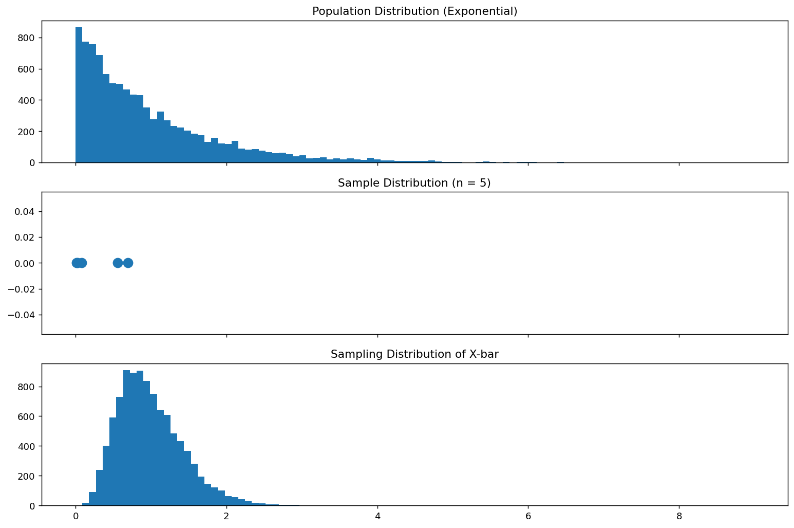
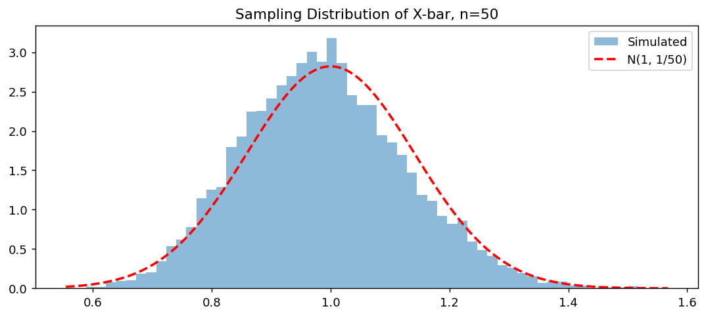

# X-bar의 표본분포 (Exponential)

## 개요

이 페이지에서는 밑바탕 모집단이 Exponential 분포를 따를 때 표본평균 $\bar{X}$의 표본분포를 살펴본다. Exponential 분포는 오른쪽으로 심하게 치우쳐 있어 중심극한정리를 시험하기에 아주 좋은 사례이다. 모집단이 치우쳐 있어도 표본크기가 커지면 $\bar{X}$의 분포가 근사적으로 정규분포가 된다. $n$이 작으면 표본분포에 치우침이 여전히 눈에 띈다.

## 모집단 모형

각 관측값이 비율 모수 $\lambda = 1$인 Exponential 분포에서 나온다고 하자:

$$
X \sim \text{Exp}(1), \qquad f(x) = e^{-x}, \quad x \ge 0
$$

모평균과 모분산은:

$$
\mu = E[X] = \frac{1}{\lambda} = 1, \qquad \sigma^2 = \text{Var}(X) = \frac{1}{\lambda^2} = 1
$$

## 표본분포 이론

$\text{Exp}(\lambda)$에서 독립적으로 뽑은 확률표본 $X_1, \ldots, X_n$에 대해:

$$
E[\bar{X}] = \mu = \frac{1}{\lambda}, \qquad \text{Var}(\bar{X}) = \frac{\sigma^2}{n} = \frac{1}{n\lambda^2}
$$

!!! info "정확한 분포"
    합 $S_n = \sum_{i=1}^n X_i$는 감마분포를 따른다: $S_n \sim \text{Gamma}(n, \lambda)$. 따라서 $\bar{X} = S_n/n \sim \text{Gamma}(n, n\lambda)$이며 형상이 $n$, 비율이 $n\lambda$이다. $n \to \infty$일 때 중심극한정리는 다음을 보장한다:

    $$
    \bar{X} \;\dot{\sim}\; N\!\left(\frac{1}{\lambda},\; \frac{1}{n\lambda^2}\right)
    $$

## 모의실험

아래 코드는 $\text{Exp}(1)$ 모집단에서 크기 $n = 5$인 표본을 10,000개 뽑아 모집단, 하나의 표본, $\bar{X}$의 표본분포를 시각화한다.

```python
import matplotlib.pyplot as plt
import numpy as np

np.random.seed(1)

sample_size = 5
n_samples = 10_000
n_population = 10_000

# Generate a large population from Exp(1)
population = np.random.exponential(size=(n_population,))

# 표본을 딱 하나 뽑는다. 현실에서 우리가 실제로 갖게 되는 것이 이것뿐이다.
# 아래 가운데 패널에 점 몇 개로 그려진다.
single_sample = np.random.choice(population, size=sample_size, replace=False)

# Simulate the sampling distribution of X-bar
sample_means = [
    np.mean(np.random.choice(population, size=sample_size, replace=False))
    for _ in range(n_samples)
]

# Plot
# 세 패널을 sharex=True 로 묶는 것이 이 그림의 핵심 장치다.
# 가로 눈금이 같아야 세 분포의 **퍼짐**을 직접 견줄 수 있다.
#   위   모집단      : 가장 넓다
#   가운데 표본 하나  : 모집단에서 뽑은 점 몇 개
#   아래  표집분포    : 눈에 띄게 좁다. 이 좁아짐이 sigma/sqrt(n) 이다.
fig, (ax0, ax1, ax2) = plt.subplots(3, 1, figsize=(12, 8), sharex=True)

_, bins, _ = ax0.hist(population, bins=100)
ax0.set_title("Population Distribution (Exponential)")

ax1.scatter(single_sample, np.zeros_like(single_sample), s=100)
ax1.set_title(f"Sample Distribution (n = {sample_size})")

ax2.hist(sample_means, bins=bins)
ax2.set_title("Sampling Distribution of X-bar")

plt.tight_layout()
plt.show()
```



## 해석

!!! note "주요 관찰"

    1. **모집단 분포**는 오른쪽으로 심하게 치우쳐 있고 큰 값까지 뻗는 긴 꼬리를 갖는다.
    2. $\bar{X}$의 **표본분포**는 $n = 5$에서도 이미 모집단보다 훨씬 좁게 모여 있다.
    3. $n = 5$에서는 표본분포에 오른쪽 치우침이 남아 있다. $n$을 키우면 점점 더 대칭이 되고 정규분포에 더 가까워진다.
    4. 모집단 표준편차가 $\sigma = 1$인 데 비해 표준오차는 $\text{SE}(\bar{X}) = 1/\sqrt{5} \approx 0.447$이다.

!!! warning "치우친 모집단에서의 소표본"
    중심극한정리의 수렴 속도는 모집단이 얼마나 치우쳤는지에 달려 있다. Exponential 분포(왜도 $= 2$)에서는 정규근사가 추론에 믿을 만해지려면 $n \ge 30$ 이상이 필요할 수 있다.

## 연습문제

<div class="drillbox" markdown>

**연습문제 1.** $t < \lambda$에서 적률생성함수가 $M_X(t) = \lambda / (\lambda - t)$임을 사용하여 $X \sim \text{Exp}(\lambda)$의 평균과 분산을 유도하라.

</div>

??? success "풀이"
    적률생성함수는 $t < \lambda$에서 $M_X(t) = \frac{\lambda}{\lambda - t}$이다.

    1차 적률:

    $$
    M_X'(t) = \frac{\lambda}{(\lambda - t)^2}, \qquad E[X] = M_X'(0) = \frac{\lambda}{\lambda^2} = \frac{1}{\lambda}
    $$

    2차 적률:

    $$
    M_X''(t) = \frac{2\lambda}{(\lambda - t)^3}, \qquad E[X^2] = M_X''(0) = \frac{2\lambda}{\lambda^3} = \frac{2}{\lambda^2}
    $$

    분산:

    $$
    \text{Var}(X) = E[X^2] - (E[X])^2 = \frac{2}{\lambda^2} - \frac{1}{\lambda^2} = \frac{1}{\lambda^2}
    $$

    $\square$

<div class="drillbox" markdown>

**연습문제 2.** $X_1, \ldots, X_n \overset{\text{iid}}{\sim} \text{Exp}(\lambda)$이면 $S_n = \sum_{i=1}^n X_i \sim \text{Gamma}(n, \lambda)$임을 보여라.

</div>

??? success "풀이"
    $X_i \sim \text{Exp}(\lambda)$의 MGF는 $M_{X_i}(t) = \frac{\lambda}{\lambda - t}$이다.

    독립성에 의해 합의 MGF는:

    $$
    M_{S_n}(t) = \prod_{i=1}^n M_{X_i}(t) = \left(\frac{\lambda}{\lambda - t}\right)^n
    $$

    이는 $\text{Gamma}(n, \lambda)$ 분포(형상 $n$, 비율 $\lambda$)의 MGF이다. MGF가 분포를 유일하게 결정하므로 $S_n \sim \text{Gamma}(n, \lambda)$이다. $\square$

<div class="drillbox" markdown>

**연습문제 3.** $n = 5$, $\lambda = 1$일 때 감마분포를 사용하여 정확한 확률 $P(\bar{X} > 2)$를 계산하고 정규근사와 비교하라.

</div>

??? success "풀이"
    $S_5 \sim \text{Gamma}(5, 1)$일 때 $\bar{X} = S_5 / 5$이므로 $P(\bar{X} > 2) = P(S_5 > 10)$이다.

    Python으로:

    ```python
    from scipy import stats
    # Exact (Gamma)
    p_exact = 1 - stats.gamma.cdf(10, a=5, scale=1)
    # Normal approximation: mean=1, se=1/sqrt(5)
    p_normal = 1 - stats.norm.cdf(2, loc=1, scale=1/5**0.5)
    print(f"Exact (Gamma):       {p_exact:.6f}")
    print(f"Normal approximation: {p_normal:.6f}")
    ```

    출력:

    ```
    Exact (Gamma):       0.029253
    Normal approximation: 0.012674
    ```

    정확한 값은 약 0.0293이고 정규근사는 약 0.0127이다. $n = 5$는 중심극한정리가 Exponential 분포의 치우침을 온전히 보정하기에 너무 작아, 정규근사가 오른쪽 꼬리 확률을 크게 과소추정한다. $\square$

<div class="drillbox" markdown>

**연습문제 4.** Exponential 분포의 왜도는 $\gamma_1 = 2$이다. $\bar{X}$의 왜도가 $\gamma_1(\bar{X}) = 2/\sqrt{n}$임을 보여라. 표본크기가 얼마일 때 $\bar{X}$의 왜도가 0.5 아래로 떨어지는가?

</div>

??? success "풀이"
    왜도가 $\gamma_1$인 i.i.d. 확률변수에 대해 $\bar{X} = \frac{1}{n}\sum X_i$의 왜도는:

    $$
    \gamma_1(\bar{X}) = \frac{\gamma_1}{\sqrt{n}}
    $$

    $\bar{X}$의 3차 중심적률이 (독립인 복사본 $n$개를 더하고 $n$으로 나누므로) $\mu_3 / n^2$이고 $(\text{Var}(\bar{X}))^{3/2} = (\sigma^2/n)^{3/2}$이므로:

    $$
    \gamma_1(\bar{X}) = \frac{n \cdot \mu_3 / n^3}{(\sigma^2 / n)^{3/2}} = \frac{\mu_3}{n^2} \cdot \frac{n^{3/2}}{\sigma^3} = \frac{\mu_3}{\sigma^3 \sqrt{n}} = \frac{\gamma_1}{\sqrt{n}}
    $$

    $\text{Exp}(1)$에서 $\gamma_1 = 2$이므로 $\gamma_1(\bar{X}) = 2/\sqrt{n}$이다.

    $2/\sqrt{n} < 0.5$로 두면:

    $$
    \sqrt{n} > 4 \implies n > 16
    $$

    따라서 왜도가 0.5 아래로 떨어지려면 $n \ge 17$이 필요하다. $\square$

<div class="drillbox" markdown>

**연습문제 5.** 모의실험을 $n = 5$ 대신 $n = 50$으로 반복하라. 표본평균의 히스토그램 위에 정규 밀도 $N(1, 1/50)$을 겹쳐 그리고 적합 정도를 정성적으로 서술하라.

</div>

??? success "풀이"
    ```python
    import numpy as np
    import matplotlib.pyplot as plt
    from scipy import stats

    np.random.seed(1)
    population = np.random.exponential(size=10_000)

    sample_means = [
        np.mean(np.random.choice(population, size=50, replace=False))
        for _ in range(10_000)
    ]

    fig, ax = plt.subplots(figsize=(10, 4))
    ax.hist(sample_means, bins=60, density=True, alpha=0.5, label="Simulated")

    x = np.linspace(min(sample_means), max(sample_means), 200)
    ax.plot(x, stats.norm.pdf(x, loc=1, scale=1/np.sqrt(50)), "r--", lw=2,
            label="N(1, 1/50)")
    ax.legend()
    ax.set_title("Sampling Distribution of X-bar, n=50")
    plt.show()
    ```

    

    $n = 50$에서는 표본평균의 히스토그램이 거의 대칭이고 $N(1, 1/50)$ 밀도를 바짝 따라간다. $\bar{X}$의 왜도가 $2/\sqrt{50} \approx 0.28$로 충분히 작아 정규근사가 아주 잘 맞는다. $\square$

---

## 정리하며

지수 모집단은 중심극한정리를 시험하기 좋은 사례다. **심하게 치우쳐 있기 때문이다.**

- **$X\sim\text{Exp}(1)$ 이면 $\mu=1$, $\sigma^2=1$** 이고 왜도가 $2$ 다. 균등분포의 왜도 $0$ 과 대조된다.
- **$\bar X$ 의 치우침은 $2/\sqrt n$ 으로 줄어든다.** $n=30$ 에서도 $0.37$ 이 남아 눈에 띄며, $n=100$ 에서 $0.2$ 다. **"$n\ge30$ 이면 충분하다"가 여기서는 성립하지 않는다.**
- **정확한 분포를 알고 있다는 점이 이 예의 장점이다.** 지수분포의 합은 감마분포이므로 $n\bar X\sim\text{Gamma}(n,1)$ 이고, 근사와 정확값을 직접 견줄 수 있다.
- **꼬리에서 오차가 가장 크다.** 3장에서 재어 보았듯 $n=30$ 의 오른쪽 꼬리에서 정규근사가 확률을 여러 배 과소평가한다. 신뢰구간의 중심부는 괜찮아도 극단 분위수는 믿기 어렵다.

다음 절 **정규 모집단**은 정반대의 경우다. 근사가 아예 필요 없고 모든 $n$ 에서 결과가 **정확**하다.
