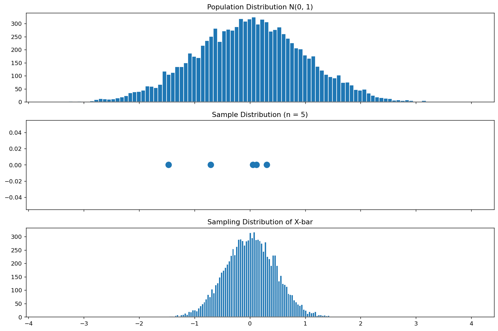

# X̄의 표본분포 (Normal)

## 개요

모집단 자체가 정규분포를 따르면 표본평균 $\bar{X}$의 표본분포는 모든 표본크기 $n$에 대해 **정확히** 정규분포이다. 중심극한정리 근사가 필요 없다. 이 페이지에서는 이론과 모의실험으로 이 정확한 결과를 보인다. 정규모집단의 경우는 $t$ 검정과 신뢰구간을 비롯한 많은 고전적 추론 절차의 토대가 된다.

## 모집단 모형

모집단이 표준정규분포를 따른다고 하자:

$$
X \sim N(\mu, \sigma^2) = N(0, 1)
$$

여기서 $\mu = 0$, $\sigma^2 = 1$이다.

## 정확한 표본분포

확률표본 $X_1, X_2, \ldots, X_n \overset{\text{iid}}{\sim} N(\mu, \sigma^2)$에 대해 표본평균은 다음의 정확한 분포를 갖는다:

$$
\bar{X} \sim N\!\left(\mu, \frac{\sigma^2}{n}\right)
$$

!!! info "왜 정확한가"
    독립인 정규확률변수의 선형결합은 그 자체가 정규분포이다. $\bar{X} = \frac{1}{n}\sum_{i=1}^n X_i$는 i.i.d. 정규확률변수의 선형결합이므로 $\bar{X}$는 정확히 정규분포이다. 점근적 논증이 전혀 필요 없다.

표준화하면:

$$
Z = \frac{\bar{X} - \mu}{\sigma / \sqrt{n}} \sim N(0, 1)
$$

## 모의실험

다음 코드는 $N(0, 1)$ 모집단에서 크기 $n = 5$인 표본을 10,000개 뽑아 모집단, 하나의 표본, $\bar{X}$의 표본분포를 비교한다.

<div class="codebox" markdown>

### 예제 1. 정규 모집단에서 표본평균의 표집분포 { .eg }

```python
import matplotlib.pyplot as plt
import numpy as np

np.random.seed(1)

sample_size = 5
n_samples = 10_000
n_population = 10_000

# N(0,1)에서 큰 모집단을 만든다.
population = np.random.normal(loc=0, scale=1, size=n_population)

# 표본을 딱 하나 뽑는다. 현실에서 우리가 실제로 갖게 되는 것이 이것뿐이다.
# 아래 가운데 패널에 점 몇 개로 그려진다.
single_sample = np.random.choice(population, size=sample_size, replace=False)

# 표본을 되풀이해 뽑으며 표본평균을 기록한다. 이 값들의 분포가 표집분포다.
sample_means = [
    np.mean(np.random.choice(population, size=sample_size, replace=False))
    for _ in range(n_samples)
]

# 모집단과 표집분포를 나란히 그린다.
# 세 패널을 sharex=True 로 묶는 것이 이 그림의 핵심 장치다.
# 가로 눈금이 같아야 세 분포의 **퍼짐**을 직접 견줄 수 있다.
#   위   모집단      : 가장 넓다
#   가운데 표본 하나  : 모집단에서 뽑은 점 몇 개
#   아래  표집분포    : 눈에 띄게 좁다. 이 좁아짐이 sigma/sqrt(n) 이다.
fig, (ax0, ax1, ax2) = plt.subplots(3, 1, figsize=(12, 8), sharex=True)

ax0.hist(population, bins=100, edgecolor="white")
ax0.set_title("Population Distribution N(0, 1)")

ax1.scatter(single_sample, np.zeros_like(single_sample), s=100)
ax1.set_title(f"Sample Distribution (n = {sample_size})")

ax2.hist(sample_means, bins=100, edgecolor="white")
ax2.set_title("Sampling Distribution of X-bar")

plt.tight_layout()
plt.show()
```



</div>

## 해석

!!! note "주요 관찰"

    1. **모집단 분포**는 종 모양(정규)이다.
    2. $\bar{X}$의 **표본분포**도 종 모양이며 같은 평균 $\mu = 0$을 중심으로 한다.
    3. 표본분포는 모집단보다 $\sqrt{n}$배 **좁다**. $n = 5$이면 $\sigma = 1$인 데 비해 표준오차가 $\sigma/\sqrt{5} \approx 0.447$이다.
    4. 균등이나 지수의 경우와 달리 여기서 표본분포의 정규성은 근사가 아니라 **정확**하다.

### 퍼짐의 비교

| 분포 | 표준편차 |
|---|---|
| 모집단 $X$ | $\sigma = 1$ |
| $n = 5$일 때 $\bar{X}$ | $\sigma / \sqrt{5} \approx 0.447$ |
| $n = 25$일 때 $\bar{X}$ | $\sigma / \sqrt{25} = 0.200$ |
| $n = 100$일 때 $\bar{X}$ | $\sigma / \sqrt{100} = 0.100$ |

## 정확한 정규성의 증명

<div class="thmbox" markdown>

### 정리 1. { .thm }

$X_1, \ldots, X_n \overset{\text{iid}}{\sim} N(\mu, \sigma^2)$이면 $\bar{X} \sim N(\mu, \sigma^2/n)$이다.

</div>

??? proof "증명"

    $X_i$의 적률생성함수(MGF)는:

    $$
    M_{X_i}(t) = \exp\!\left(\mu t + \frac{\sigma^2 t^2}{2}\right)
    $$

    $X_i$들이 독립이므로:

    $$
    M_{S_n}(t) = \prod_{i=1}^n M_{X_i}(t) = \exp\!\left(n\mu t + \frac{n\sigma^2 t^2}{2}\right)
    $$

    $\bar{X} = S_n / n$의 MGF는:

    $$
    M_{\bar{X}}(t) = M_{S_n}(t/n) = \exp\!\left(\mu t + \frac{\sigma^2 t^2}{2n}\right)
    $$

    이는 $N(\mu, \sigma^2/n)$의 MGF이다. MGF가 분포를 유일하게 결정하므로 $\bar{X} \sim N(\mu, \sigma^2/n)$이다. $\square$

## 연습문제

<div class="drillbox" markdown>

**연습문제 1.** <span class="diff easy" title="쉬움"></span> $X_1, \ldots, X_{25} \overset{\text{iid}}{\sim} N(100, 16)$일 때 $P(\bar{X} > 102)$를 구하라.

</div>

??? success "풀이"
    여기서 $\mu = 100$, $\sigma^2 = 16$, $n = 25$이다.

    $$
    \bar{X} \sim N\!\left(100, \frac{16}{25}\right) = N(100,\; 0.64)
    $$

    표준화하면:

    $$
    Z = \frac{102 - 100}{\sqrt{0.64}} = \frac{2}{0.8} = 2.5
    $$

    $$
    P(\bar{X} > 102) = P(Z > 2.5) = 1 - \mathcal{N}(2.5) \approx 1 - 0.9938 = 0.0062
    $$

    $\square$

<div class="drillbox" markdown>

**연습문제 2.** <span class="diff med" title="중간"></span> $X \sim N(\mu_X, \sigma_X^2)$와 $Y \sim N(\mu_Y, \sigma_Y^2)$가 독립이면 $aX + bY \sim N(a\mu_X + b\mu_Y,\; a^2\sigma_X^2 + b^2\sigma_Y^2)$임을 증명하라.

</div>

??? success "풀이"
    $W = aX + bY$라 하자. $W$의 MGF는:

    $$
    M_W(t) = E[e^{t(aX + bY)}] = E[e^{taX}] \cdot E[e^{tbY}]
    $$

    이며 인수분해에는 독립성을 사용했다. 정규분포의 MGF를 대입하면:

    $$
    M_W(t) = \exp\!\left(a\mu_X t + \frac{a^2\sigma_X^2 t^2}{2}\right) \cdot \exp\!\left(b\mu_Y t + \frac{b^2\sigma_Y^2 t^2}{2}\right)
    $$

    $$
    = \exp\!\left((a\mu_X + b\mu_Y)t + \frac{(a^2\sigma_X^2 + b^2\sigma_Y^2)t^2}{2}\right)
    $$

    이는 $N(a\mu_X + b\mu_Y,\; a^2\sigma_X^2 + b^2\sigma_Y^2)$의 MGF이다. $\square$

<div class="drillbox" markdown>

**연습문제 3.** <span class="diff easy" title="쉬움"></span> 어떤 기계가 병에 평균 500 ml, 표준편차 4 ml로 내용물을 채우며 충전량은 정규분포를 따른다. 품질관리에서 병 16개를 표본으로 뽑는다. 표본평균이 목표치에서 2 ml 이내일 확률은?

</div>

??? success "풀이"
    $n = 16$이고 $X_i \sim N(500, 16)$이라 하자.

    $$
    \bar{X} \sim N\!\left(500, \frac{16}{16}\right) = N(500, 1)
    $$

    $Z = (\bar{X} - 500)/1$일 때 $P(498 < \bar{X} < 502) = P(-2 < Z < 2)$를 구하면 된다.

    $$
    P(-2 < Z < 2) = \mathcal{N}(2) - \mathcal{N}(-2) = 2\mathcal{N}(2) - 1 \approx 2(0.9772) - 1 = 0.9544
    $$

    표본평균이 목표치에서 2 ml 이내일 확률은 약 95.44%이다. $\square$

<div class="drillbox" markdown>

**연습문제 4.** <span class="diff med" title="중간"></span> 모집단이 정규일 때는 중심극한정리가 필요 없지만 모집단이 지수이나 균등일 때는 필수적인 이유를 설명하라. 정규가 아닌 경우 $n$이 커지면 표본분포에서 무엇이 달라지는가?

</div>

??? success "풀이"
    모집단이 정규이면 독립인 정규확률변수의 선형결합이 정규이므로 모든 $n$에서 $\bar{X}$가 정확히 정규분포이다. 이는 정규분포 MGF의 직접적인 성질(동등하게, 합성곱에 대해 닫혀 있다는 성질)이다.

    정규가 아닌 모집단(예: Exponential, Uniform)에서는 유한한 $n$에 대해 $\bar{X}$가 정확히 정규분포가 **아니다**. 그 분포는 $n$과 구체적인 모집단 모양에 의존한다. 다만 $n \to \infty$일 때 중심극한정리가 표준화된 $\bar{X}$의 $N(0,1)$로의 분포수렴을 보장한다.

    정규가 아닌 모집단에서 $n$이 커지면:

    - 표본분포가 더 대칭이 된다(왜도가 $\gamma_1/\sqrt{n}$로 감소한다).
    - 초과첨도가 ($1/n$의 비율로) 0을 향해 줄어든다.
    - 모양이 점점 정규분포에 가까워진다.

    수렴 속도는 모집단이 얼마나 "정규가 아닌지"에 달려 있다. 심하게 치우쳤거나 꼬리가 두꺼운 모집단은 더 큰 $n$을 요구한다. $\square$

<div class="drillbox" markdown>

**연습문제 5.** <span class="diff med" title="중간"></span> 위의 모의실험 코드에서 $n$을 5에서 100으로 늘려라. 히스토그램 위에 이론적 밀도 $N(0, 1/100)$을 겹쳐 그리고, 10,000개 표본평균의 경험적 표준편차가 $1/\sqrt{100} = 0.1$에 가까운지 확인하라.

</div>

??? success "풀이"
    ```python
    import numpy as np
    import matplotlib.pyplot as plt
    from scipy import stats

    np.random.seed(1)
    population = np.random.normal(loc=0, scale=1, size=10_000)

    sample_means = [
        np.mean(np.random.choice(population, size=100, replace=False))
        for _ in range(10_000)
    ]

    empirical_se = np.std(sample_means)
    theoretical_se = 1 / np.sqrt(100)

    print(f"Theoretical SE: {theoretical_se:.4f}")
    print(f"Empirical SE:   {empirical_se:.4f}")

    fig, ax = plt.subplots(figsize=(10, 4))
    ax.hist(sample_means, bins=60, density=True, alpha=0.5, label="Simulated")
    x = np.linspace(-0.5, 0.5, 200)
    ax.plot(x, stats.norm.pdf(x, 0, theoretical_se), "r--", lw=2,
            label=f"N(0, {theoretical_se**2:.4f})")
    ax.legend()
    ax.set_title("Sampling Distribution of X-bar (n = 100)")
    plt.show()
    ```

    출력:

    ```
    Theoretical SE: 0.1000
    Empirical SE:   0.0993
    ```

    

    경험적 표준오차가 0.1에 가깝게 나오고 히스토그램이 $N(0, 0.01)$ 밀도와 사실상 완벽하게 일치하여 정확한 정규성 결과를 확인해 준다. $\square$

<div class="drillbox" markdown>

**연습문제 6.** <span class="diff med" title="중간"></span>
$\sigma = 4$인 정규모집단에서 $P(|\bar X - \mu| < 1) \ge 0.95$가 되려면 표본이 몇 개 필요한가? 허용오차를 0.5로 줄이면 어떻게 되는가?

</div>

??? success "풀이"
    $\bar X \sim N(\mu, \sigma^2/n)$이므로

    $$
    P(|\bar X-\mu| < 1) = P\!\left(|Z| < \frac{1}{\sigma/\sqrt n}\right) \ge 0.95 \iff \frac{\sqrt n}{4} \ge 1.96
    $$

    이다. 따라서 $\sqrt n \ge 7.84$, 즉 $n \ge 61.47$이므로 **$n = 62$** 다.

    허용오차를 0.5로 하면

    $$
    n \ge \left(\frac{1.96 \times 4}{0.5}\right)^2 = (15.68)^2 = 245.9 \implies n = 246
    $$

    이다. 허용오차를 절반으로 줄이는 데 표본이 4배 필요하다.

    일반식은

    $$
    n \ge \left(\frac{z_{1-\alpha/2}\,\sigma}{E}\right)^2
    $$

    이다. 두 가지를 짚어 둔다. 첫째, **반올림이 아니라 올림**이다. $n=61$이면 부등식이 깨진다. 둘째, $\sigma$를 알아야 한다는 점이 실무의 걸림돌이다. 보통은 선행 연구나 예비조사의 $s$를 쓰거나, 범위를 4로 나눈 어림값을 쓴다. $\sigma$ 추정이 불확실하면 여유 있게 잡는 편이 안전하며, 자료를 모으면서 표본크기를 다시 계산하는 순차 설계도 쓰인다.

<div class="drillbox" markdown>

**연습문제 7.** <span class="diff med" title="중간"></span>
독립인 두 정규모집단 $N(\mu_1,\sigma_1^2)$, $N(\mu_2,\sigma_2^2)$에서 크기 $n_1$, $n_2$인 표본을 뽑았다. $\bar X_1 - \bar X_2$의 **정확한** 분포를 구하라. 이 결과가 정확한 이유는 무엇인가?

</div>

??? success "풀이"
    각 표본평균이 정확히 정규이고

    $$
    \bar X_1 \sim N\!\left(\mu_1, \frac{\sigma_1^2}{n_1}\right), \qquad \bar X_2 \sim N\!\left(\mu_2, \frac{\sigma_2^2}{n_2}\right)
    $$

    이며 두 표본이 독립이다. 연습문제 2에 따라 독립인 정규확률변수의 선형결합($a=1$, $b=-1$)이 다시 정규이므로

    $$
    \bar X_1 - \bar X_2 \sim N\!\left(\mu_1-\mu_2,\ \frac{\sigma_1^2}{n_1}+\frac{\sigma_2^2}{n_2}\right)
    $$

    이다. **분산은 빼는 것이 아니라 더한다**는 점이 요점이다. 독립인 두 확률변수의 차에서도 불확실성은 쌓인다.

    **정확한 이유.** 두 단계 모두에서 근사를 쓰지 않았다. 표본평균의 정규성이 정확하고(정리 1), 정규확률변수의 선형결합이 다시 정규인 것도 정확하다. 표본크기가 2여도 성립한다.

    $\sigma_1, \sigma_2$를 모르면 사정이 달라진다. $s_1, s_2$로 대신하면 분모가 확률변수가 되고, 두 분산이 같다는 가정을 두면 합동분산으로 정확한 $t_{n_1+n_2-2}$를 얻지만, 다르면 정확한 분포가 알려져 있지 않다(베렌스-피셔 문제). 그래서 웰치의 근사를 쓴다.

<div class="drillbox" markdown>

**연습문제 8.** <span class="diff med" title="중간"></span>
같은 양 $\mu$를 정밀도가 다른 세 기계로 한 번씩 재어 $X_i \sim N(\mu, \sigma_i^2)$를 얻었다. 가중평균 $\sum_i w_iX_i$($\sum w_i = 1$) 가운데 분산을 최소로 하는 가중치를 구하고, $\sigma = (1, 2, 4)$일 때 값을 계산하라.

</div>

??? success "풀이"
    독립이므로

    $$
    \operatorname{Var}\!\left(\sum_i w_iX_i\right) = \sum_i w_i^2\sigma_i^2
    $$

    이다. 제약 $\sum w_i = 1$ 아래에서 라그랑주 승수법을 쓰면 $2w_i\sigma_i^2 = \lambda$이므로

    $$
    w_i \propto \frac{1}{\sigma_i^2}, \qquad w_i = \frac{1/\sigma_i^2}{\sum_j 1/\sigma_j^2}
    $$

    이다. 이때의 최소분산은

    $$
    \operatorname{Var} = \frac{1}{\sum_j 1/\sigma_j^2}
    $$

    이다.

    **수치.** $\sigma^2 = (1, 4, 16)$이므로 정밀도가 $(1, 0.25, 0.0625)$이고 합이 $1.3125$다.

    $$
    w = \left(\frac{1}{1.3125},\ \frac{0.25}{1.3125},\ \frac{0.0625}{1.3125}\right) = (0.762,\ 0.190,\ 0.048)
    $$

    최소분산은 $1/1.3125 = 0.762$로, 가장 좋은 기계 하나만 쓸 때의 분산 1보다 작다.

    **읽는 법.** **가중치가 정밀도(분산의 역수)에 비례한다.** 정밀도가 더해진다는 것이 핵심이며, 나쁜 관측값도 버리지 않고 작은 가중치로 포함하는 것이 언제나 이득이다. 위에서 세 번째 기계는 가중치가 5%에 불과하지만 그 5%가 분산을 0.800에서 0.762로 낮춘다.

    같은 구조가 여러 곳에서 나타난다. 표본크기가 다른 여러 연구를 합치는 메타분석의 역분산 가중, 베이즈 갱신에서 사전평균과 표본평균을 정밀도로 가중하는 것, 칼만 필터의 예측값과 관측값 결합이 모두 이 공식이다. 가중최소제곱에서 $w_i = 1/\sigma_i^2$을 쓰는 것도 마찬가지다.

<div class="drillbox" markdown>

**연습문제 9.** <span class="diff hard" title="어려움"></span>
$\sigma^2$이 알려진 정규모집단에서 $\bar X$가 $\mu$의 **최소분산불편추정량**임을 설명하라. 크라메르-라오 하한과 완비충분통계량, 두 가지 길로 논하라.

</div>

??? success "풀이"
    **길 1 — 크라메르-라오 하한.** 관측값 하나의 로그밀도는

    $$
    \ln f(x;\mu) = -\frac{(x-\mu)^2}{2\sigma^2} + \text{상수}
    $$

    이고 $\partial\ln f/\partial\mu = (x-\mu)/\sigma^2$이므로 피셔 정보량이

    $$
    I(\mu) = E\left[\left(\frac{X-\mu}{\sigma^2}\right)^2\right] = \frac{1}{\sigma^2}
    $$

    이다. $n$개 표본에서는 $nI(\mu) = n/\sigma^2$이고, 불편추정량의 분산에 대한 하한이

    $$
    \operatorname{Var}(\hat\mu) \ge \frac{1}{nI(\mu)} = \frac{\sigma^2}{n}
    $$

    이다. $\operatorname{Var}(\bar X) = \sigma^2/n$으로 **하한을 정확히 달성**하므로 $\bar X$가 최소분산불편추정량이다.

    등호가 성립하는 조건은 점수함수가 $(\hat\theta-\theta)$에 비례하는 것인데, 여기서는

    $$
    \frac{\partial\ell}{\partial\mu} = \frac{n(\bar x-\mu)}{\sigma^2}
    $$

    로 정확히 그 꼴이다. 이런 일이 일어나는 것은 지수족에서 자연모수에 대응하는 통계량을 쓸 때뿐이다.

    **길 2 — 레만-셰페 정리.** 가능도를 인수분해하면

    $$
    L(\mu) \propto \exp\!\left(\frac{n\mu\bar x}{\sigma^2} - \frac{n\mu^2}{2\sigma^2}\right)
    $$

    로 자료가 $\bar x$를 통해서만 들어오므로, 피셔-네이만 정리에 의해 $\bar X$가 $\mu$에 대한 **충분통계량**이다. 또 정규분포는 완비지수족이므로 $\bar X$가 **완비**이기도 하다.

    레만-셰페 정리에 따르면 완비충분통계량의 함수이면서 불편인 추정량은 유일한 최소분산불편추정량이다. $E[\bar X] = \mu$이므로 $\bar X$가 그것이다. $\square$

    **두 길의 차이.** 크라메르-라오는 하한을 제시하고 그것이 달성되는지를 확인하는 방식이라, 하한이 달성되지 않는 문제에서는 결론을 내지 못한다. 레만-셰페는 하한과 무관하게 최적성을 직접 증명하므로 더 일반적이다. 예컨대 $\text{Uniform}(0,\theta)$에서 $\frac{n+1}{n}X_{(n)}$이 최소분산불편추정량임은 레만-셰페로만 보일 수 있다.

<div class="drillbox" markdown>

**연습문제 10.** <span class="diff med" title="중간"></span>
예제 1의 코드는 크기 10,000인 모집단에서 `replace=False`로 표본을 뽑는다. 그러면 관측값이 엄밀히는 독립이 아닌데, 이론적 결과를 그대로 써도 되는가? 어긋남의 크기를 계산하라.

</div>

??? success "풀이"
    비복원추출이면 관측값들이 음으로 상관되므로 엄밀히는 독립이 아니고, 표본평균의 분산에 **유한모집단 수정계수**가 붙는다.

    $$
    \operatorname{Var}(\bar X) = \frac{\sigma^2}{n}\cdot\frac{N-n}{N-1}
    $$

    $N = 10{,}000$, $n = 5$이면

    $$
    \frac{N-n}{N-1} = \frac{9995}{9999} = 0.9996
    $$

    이므로 분산이 $0.2$ 대신 $0.19992$, 표준오차가 $0.44721$ 대신 $0.44712$다. 넷째 자리에서 어긋나며, 10,000번 모의실험의 몬테카를로 오차(표준오차의 약 0.7%)에 완전히 묻힌다. **그대로 써도 된다.**

    한 가지 더 짚을 점이 있다. 이 코드의 "모집단"은 $N(0,1)$에서 뽑은 유한한 10,000개이므로 그 자체의 평균과 표준편차가 정확히 0과 1이 아니다. 실제로 표본평균의 평균은 모집단 $0$이 아니라 그 유한 모집단의 평균으로 수렴한다. 그 차이 역시 $1/\sqrt{10000} = 0.01$ 규모라 눈에 띄지 않는다.

    **일반 규칙.** $n/N \le 0.05$이면 수정계수를 무시해도 좋다. 여기서는 $5/10000 = 0.0005$로 한참 아래다. 반대로 유한모집단에서 큰 비율을 뽑는 조사(학급 30명 중 20명)라면 반드시 보정해야 하며, 그러지 않으면 표준오차를 과대평가해 불필요하게 넓은 구간을 보고하게 된다.

---

## 정리하며

모집단이 정규이면 $\bar X\sim N(\mu,\sigma^2/n)$ 이 **모든 $n$ 에서 정확**하다. 근사가 아니다.

- **이유는 정규분포가 덧셈에 대해 닫혀 있기 때문이다.** 독립인 정규의 합이 다시 정규이며, 적률생성함수를 곱해 보면 한 줄로 나온다(3장).
- **$n=2$ 에서도 성립한다.** 중심극한정리가 "$n$ 이 커지면"이라고 말하는 것과 달리 여기에는 조건이 없다.
- **이것이 고전적 추론의 토대다.** $t$ 검정, $t$ 신뢰구간, 분산분석이 모두 정규모집단 가정 위에서 정확한 분포를 갖는다. 그 가정이 깨지면 모든 것이 근사로 내려앉는다.
- **$\bar X$ 와 $S^2$ 이 독립**이라는 성질도 정규분포에서만 성립한다. 이것이 $t$ 통계량의 분자와 분모가 독립이 되는 근거이며, 다른 어떤 분포도 이 성질을 갖지 않는다.

다음 절 **베르누이 모집단**으로 넘어간다. 모집단이 $0$ 과 $1$ 뿐인 극단적인 경우이며, 표본평균이 곧 표본비율이 된다.
