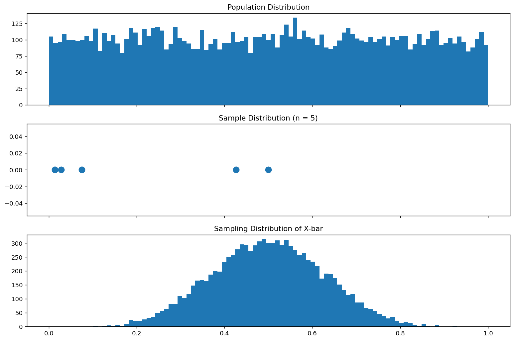

# X̄의 표본분포 (Uniform)

## 개요

모집단에서 크기 $n$인 확률표본을 반복해서 뽑고 매번 표본평균 $\bar{X}$를 계산하면, 그 평균들이 이루는 분포를 **$\bar{X}$의 표본분포**라 한다. 이 페이지에서는 균등 모집단을 사용하여 이 개념을 살펴본다. 모집단 분포가 평평한데도 $\bar{X}$의 표본분포는 모평균 주위로 모이고, 중심극한정리에 의해 $n$이 커질수록 근사적으로 정규분포가 된다.

## 모집단 모형

모집단이 구간 $[0, 1]$ 위의 연속 균등분포를 따른다고 하자:

$$
X \sim \text{Uniform}(0, 1)
$$

모평균과 모분산은:

$$
\mu = E[X] = \frac{1}{2}, \qquad \sigma^2 = \text{Var}(X) = \frac{1}{12}
$$

## 표본평균의 표본분포

이 모집단에서 독립적으로 뽑은 확률표본 $X_1, X_2, \ldots, X_n$에 대해 표본평균은:

$$
\bar{X} = \frac{1}{n} \sum_{i=1}^{n} X_i
$$

독립 확률변수의 기댓값과 분산의 성질에 의해:

$$
E[\bar{X}] = \mu = \frac{1}{2}, \qquad \text{Var}(\bar{X}) = \frac{\sigma^2}{n} = \frac{1}{12n}
$$

**중심극한정리**에 의해 $n$이 크면:

$$
\bar{X} \;\dot{\sim}\; N\!\left(\frac{1}{2},\; \frac{1}{12n}\right)
$$

## 모의실험

다음 코드는 Uniform(0, 1) 모집단에서 크기 $n = 5$인 표본을 10,000개 뽑아 모집단, 하나의 표본, $\bar{X}$의 표본분포라는 세 분포를 나란히 그린다.

<div class="codebox" markdown>

### 예제 1. 균등 모집단에서 표본평균의 표집분포 { .eg }

```python
import matplotlib.pyplot as plt
import numpy as np

np.random.seed(1)

sample_size = 5
n_samples = 10_000
n_population = 10_000

# Uniform(0,1)에서 큰 모집단을 만든다.
population = np.random.uniform(size=(n_population,))

# 표본을 딱 하나 뽑는다. 현실에서 우리가 실제로 갖게 되는 것이 이것뿐이다.
# 아래 가운데 패널에 점 몇 개로 그려진다.
single_sample = np.random.choice(population, size=sample_size, replace=False)

# 표본을 되풀이해 뽑으며 표본평균을 기록한다. 이 값들의 분포가 표집분포다.
sample_means = [
    np.mean(np.random.choice(population, size=sample_size, replace=False))
    for _ in range(n_samples)
]

# 모집단과 표집분포를 나란히 그린다.
# 세 패널을 sharex=True 로 묶는 것이 이 그림의 핵심 장치다.
# 가로 눈금이 같아야 세 분포의 **퍼짐**을 직접 견줄 수 있다.
#   위   모집단      : 가장 넓다
#   가운데 표본 하나  : 모집단에서 뽑은 점 몇 개
#   아래  표집분포    : 눈에 띄게 좁다. 이 좁아짐이 sigma/sqrt(n) 이다.
fig, (ax0, ax1, ax2) = plt.subplots(3, 1, figsize=(12, 8), sharex=True)

ax0.hist(population, bins=np.linspace(0, 1, 100))
ax0.set_title("Population Distribution")

ax1.scatter(single_sample, np.zeros_like(single_sample), s=100)
ax1.set_title(f"Sample Distribution (n = {sample_size})")

ax2.hist(sample_means, bins=np.linspace(0, 1, 100))
ax2.set_title("Sampling Distribution of X-bar")

plt.tight_layout()
plt.show()
```



</div>

## 해석

!!! note "주요 관찰"

    1. **모집단 분포**는 $[0, 1]$에서 평평하다(균등분포).
    2. 크기 5인 **하나의 표본**은 흩어진 점 몇 개일 뿐이며, 그것만으로는 모집단의 모양을 알 수 없다.
    3. $\bar{X}$의 **표본분포**는 모집단이 종 모양이 아닌데도 종 모양이고 $\mu = 0.5$를 중심으로 한다. 중심극한정리가 작동하는 모습이다.
    4. 표본분포의 퍼짐은 모집단 분포보다 $1/\sqrt{n}$배 좁다.

$n = 5$일 때 $\bar{X}$의 표준오차는:

$$
\text{SE}(\bar{X}) = \frac{\sigma}{\sqrt{n}} = \frac{1/\sqrt{12}}{\sqrt{5}} \approx 0.129
$$

$n$이 커질수록 이 표준오차가 줄어들고 표본분포는 $\mu$ 주위로 더 촘촘하게 모인다.

## 연습문제

<div class="drillbox" markdown>

**연습문제 1.** <span class="diff med" title="중간"></span> $X \sim \text{Uniform}(0, 1)$에 대해 적분을 사용하여 정의로부터 $E[X]$와 $\text{Var}(X)$를 유도하라.

</div>

??? success "풀이"
    $X \sim \text{Uniform}(0, 1)$의 pdf는 $x \in [0, 1]$에서 $f(x) = 1$이다.

    $$
    E[X] = \int_0^1 x \cdot 1 \, dx = \left[\frac{x^2}{2}\right]_0^1 = \frac{1}{2}
    $$

    $$
    E[X^2] = \int_0^1 x^2 \cdot 1 \, dx = \left[\frac{x^3}{3}\right]_0^1 = \frac{1}{3}
    $$

    $$
    \text{Var}(X) = E[X^2] - (E[X])^2 = \frac{1}{3} - \frac{1}{4} = \frac{1}{12}
    $$

    $\square$

<div class="drillbox" markdown>

**연습문제 2.** <span class="diff med" title="중간"></span> 관측값이 독립이라는 가정 아래, 평균이 $\mu$이고 분산이 $\sigma^2$인 임의의 모집단에 대해 $E[\bar{X}] = \mu$이고 $\text{Var}(\bar{X}) = \sigma^2 / n$임을 증명하라.

</div>

??? success "풀이"
    $X_1, \ldots, X_n$을 $E[X_i] = \mu$, $\text{Var}(X_i) = \sigma^2$인 i.i.d. 확률변수라 하자.

    $$
    E[\bar{X}] = E\!\left[\frac{1}{n}\sum_{i=1}^n X_i\right] = \frac{1}{n}\sum_{i=1}^n E[X_i] = \frac{1}{n} \cdot n\mu = \mu
    $$

    독립성에 의해:

    $$
    \text{Var}(\bar{X}) = \text{Var}\!\left(\frac{1}{n}\sum_{i=1}^n X_i\right) = \frac{1}{n^2}\sum_{i=1}^n \text{Var}(X_i) = \frac{1}{n^2} \cdot n\sigma^2 = \frac{\sigma^2}{n}
    $$

    $\square$

<div class="drillbox" markdown>

**연습문제 3.** <span class="diff easy" title="쉬움"></span> 표본크기를 $n = 5$에서 $n = 20$으로 늘리면 $\bar{X}$의 표준오차는 몇 배로 줄어드는가? $n = 5$일 때에 비해 표준오차를 절반으로 줄이려면 표본크기가 얼마여야 하는가?

</div>

??? success "풀이"
    표준오차는 $\text{SE} = \sigma / \sqrt{n}$이다.

    표준오차의 비는:

    $$
    \frac{\text{SE}(n=5)}{\text{SE}(n=20)} = \frac{\sigma/\sqrt{5}}{\sigma/\sqrt{20}} = \sqrt{\frac{20}{5}} = \sqrt{4} = 2
    $$

    따라서 $n = 5$에서 $n = 20$으로 갈 때 표준오차가 2배로 줄어든다.

    $n = 5$ 대비 표준오차를 절반으로 줄이려면:

    $$
    \frac{\sigma}{\sqrt{n}} = \frac{1}{2} \cdot \frac{\sigma}{\sqrt{5}} \implies \sqrt{n} = 2\sqrt{5} \implies n = 20
    $$

    $\square$

<div class="drillbox" markdown>

**연습문제 4.** <span class="diff med" title="중간"></span> 모의실험을 $n = 5$ 대신 $n = 50$으로 수정하라. 이론적 표준오차를 계산하고 모의실험으로 얻은 10,000개 평균의 표본표준편차와 비교하라.

</div>

??? success "풀이"
    $n = 50$에서의 이론적 표준오차는:

    $$
    \text{SE} = \frac{1/\sqrt{12}}{\sqrt{50}} = \frac{1}{\sqrt{600}} \approx 0.0408
    $$

    코드로는:

    ```python
    import numpy as np
    np.random.seed(1)

    population = np.random.uniform(size=10_000)
    sample_means = [
        np.mean(np.random.choice(population, size=50, replace=False))
        for _ in range(10_000)
    ]
    empirical_se = np.std(sample_means)
    print(f"Theoretical SE: {1 / np.sqrt(600):.4f}")
    print(f"Empirical SE:   {empirical_se:.4f}")
    ```

    출력:

    ```
    Theoretical SE: 0.0408
    Empirical SE:   0.0407
    ```

    경험적 표준오차가 0.0408에 가깝게 나와 이론적 공식을 확인해 준다. $\square$

<div class="drillbox" markdown>

**연습문제 5.** <span class="diff hard" title="어려움"></span> Irwin–Hall 분포는 $X_i \sim \text{Uniform}(0,1)$이 독립일 때 합 $S_n = X_1 + X_2 + \cdots + X_n$의 분포이다. $\bar{X} = S_n / n$임을 보이고, $n = 2$에 대한 Irwin–Hall pdf를 사용하여 $n = 2$일 때 $\bar{X}$의 정확한 pdf를 구하라.

</div>

??? success "풀이"
    정의에 의해 $\bar{X} = S_n / n$이다. $n = 2$일 때 $S_2 = X_1 + X_2$의 Irwin–Hall pdf는 삼각분포이다:

    $$
    f_{S_2}(s) = \begin{cases} s & 0 \le s \le 1 \\ 2 - s & 1 < s \le 2 \\ 0 & \text{otherwise} \end{cases}
    $$

    $\bar{X} = S_2 / 2$이므로 변수변환 공식을 적용한다. $y = s/2$로 두면 $s = 2y$이고 $ds = 2\,dy$이므로:

    $$
    f_{\bar{X}}(y) = f_{S_2}(2y) \cdot 2 = \begin{cases} 4y & 0 \le y \le \tfrac{1}{2} \\ 4(1 - y) & \tfrac{1}{2} < y \le 1 \\ 0 & \text{otherwise} \end{cases}
    $$

    이는 $y = 1/2$에서 정점을 이루는 $[0, 1]$ 위의 대칭 삼각분포이다. $n = 2$에서도 이미 $\bar{X}$의 표본분포가 (아직 정규는 아니지만) 단봉이고 대칭임을 확인해 준다. $\square$

<div class="drillbox" markdown>

**연습문제 6.** <span class="diff med" title="중간"></span>
$\text{Uniform}(0,1)$ 난수 12개를 더하고 6을 뺀 값이 표준정규분포의 좋은 근사가 되는 이유를 적률로 설명하라. 이 방법의 한계는 무엇인가?

</div>

??? success "풀이"
    $U_i \sim \text{Uniform}(0,1)$이면 $E[U_i] = 1/2$, $\operatorname{Var}(U_i) = 1/12$이므로

    $$
    Z = \sum_{i=1}^{12}U_i - 6, \qquad E[Z] = 0, \qquad \operatorname{Var}(Z) = 12\times\frac{1}{12} = 1
    $$

    이다. **12를 고른 이유가 바로 분산을 1로 맞추기 위해서다.** 제곱근을 취할 필요가 없어 계산이 빠르다.

    적률을 더 보면 근사가 왜 좋은지 알 수 있다.

    - **왜도**: 균등분포가 대칭이라 $\gamma_1 = 0$이고 합의 왜도도 정확히 0이다.
    - **초과첨도**: 균등분포의 초과첨도가 $-1.2$이고 합에서는 $-1.2/12 = -0.1$로 줄어든다. 정규분포의 0에 꽤 가깝다.

    처음 네 적률이 거의 맞으니 중앙 부근에서 잘 맞을 수밖에 없다.

    **한계.**

    - **지지집합이 유계다.** $Z \in [-6, 6]$이므로 $|z| > 6$인 값이 절대 나오지 않는다. 정규분포에서 그 확률은 $2\times10^{-9}$로 작지만, 극단 사건을 다루는 모의실험에서는 치명적이다.
    - **꼬리가 실제로 얇다.** $|z| > 3$ 부근에서 이미 참 정규분포보다 확률이 작다. 위에서 본 음의 초과첨도가 그 신호다.
    - **비효율적이다.** 정규난수 하나에 균등난수 12개를 쓴다. 박스-뮐러는 2개로 2개를 만든다.

    그래서 이 방법은 요즘 쓰이지 않는다. 다만 **중심극한정리가 얼마나 빨리 듣는지**를 보여 주는 교육적 예로는 훌륭하다. 완전히 평평한 분포 12개만 더해도 종 모양이 된다.

<div class="drillbox" markdown>

**연습문제 7.** <span class="diff med" title="중간"></span>
$\text{Uniform}(0,\theta)$에서 중심 $\theta/2$를 추정하는 두 방법 — 표본평균 $\bar X$와 중간범위 $(X_{(1)}+X_{(n)})/2$ — 의 분산을 구해 비교하라. $\theta=1$, $n=5, 20, 100$에서 계산하라.

</div>

??? success "풀이"
    $\theta=1$로 두어도 일반성을 잃지 않는다.

    **표본평균.** $\operatorname{Var}(X) = 1/12$이므로

    $$
    \operatorname{Var}(\bar X) = \frac{1}{12n}
    $$

    **중간범위.** $X_{(1)}\sim\text{Beta}(1,n)$, $X_{(n)}\sim\text{Beta}(n,1)$이고 $\operatorname{Var}(X_{(1)}) = \operatorname{Var}(X_{(n)}) = \frac{n}{(n+1)^2(n+2)}$, $\operatorname{Cov}(X_{(1)},X_{(n)}) = \frac{1}{(n+1)^2(n+2)}$이므로

    $$
    \operatorname{Var}\!\left(\frac{X_{(1)}+X_{(n)}}{2}\right) = \frac{2n+2}{4(n+1)^2(n+2)} = \frac{1}{2(n+1)(n+2)}
    $$

    **비교.**

    | $n$ | $\operatorname{Var}(\bar X)$ | $\operatorname{Var}(\text{중간범위})$ | 비 |
    |---|---|---|---|
    | 5 | 0.01667 | 0.01190 | 1.40 |
    | 20 | 0.004167 | 0.001082 | 3.85 |
    | 100 | 0.000833 | 0.0000485 | 17.2 |

    **중간범위가 압도적으로 낫고, 격차가 $n$과 함께 벌어진다.** 표본평균의 분산은 $O(1/n)$인데 중간범위는 $O(1/n^2)$이기 때문이다.

    **왜 그런가.** 균등분포는 지지집합의 양 끝이 뚜렷하고, 최솟값과 최댓값이 그 끝을 $1/n$ 속도로 죄어 온다. 중간에 있는 관측값들은 끝점에 대해 거의 정보를 주지 않으므로 평균을 내는 것은 정보를 낭비하는 셈이다. 실제로 $(X_{(1)}, X_{(n)})$이 충분통계량이다.

    **일반화하지 말 것.** 이 결과는 지지집합이 유계이고 밀도가 끝에서 0으로 떨어지지 않는 분포에서만 성립한다. 정규분포에서 중간범위를 쓰면 표본평균보다 훨씬 나쁘고, 코시분포에서는 아예 발산한다. **최적 추정량은 분포에 따라 달라진다**는 점을 보여 주는 좋은 예다.

<div class="drillbox" markdown>

**연습문제 8.** <span class="diff med" title="중간"></span>
$\text{Uniform}(0,1)$에서 $n=5$일 때 $\bar X$의 지지집합은 $[0,1]$이다. 정규근사가 예측하는 $P(\bar X > 1.2)$는 얼마이고 참값은 얼마인가? 이 차이가 실무에서 어떤 문제를 일으키는가?

</div>

??? success "풀이"
    $\operatorname{SE}(\bar X) = \sqrt{1/(12\times5)} = 0.1291$이므로 정규근사는

    $$
    P(\bar X > 1.2) \approx P\!\left(Z > \frac{1.2-0.5}{0.1291}\right) = P(Z > 5.42) = 3.0\times10^{-8}
    $$

    을 준다. 참값은 **정확히 0**이다. 모든 $X_i \le 1$이므로 $\bar X \le 1$이다.

    이 자체는 큰 문제가 아니다. $3\times10^{-8}$이든 0이든 실무에서 차이가 없다.

    **실제 문제는 다른 곳에 있다.** 근사가 지지집합을 존중하지 않는다는 사실이 신뢰구간에서 드러난다. $n=5$에서 $\bar x = 0.9$가 나왔다면 $\mu$의 95% 정규 신뢰구간이

    $$
    0.9 \pm 1.96 \times 0.1291 = (0.647,\ 1.153)
    $$

    으로 **불가능한 영역을 포함한다.** $\text{Uniform}(0,1)$이라면 $\mu = 0.5$여야 하고, 미지의 $\theta$에 대한 $\text{Uniform}(0,\theta)$라 해도 구간의 형태가 이렇게 나오지 않아야 한다.

    같은 문제가 곳곳에서 나타난다. 비율의 왈드 구간이 $[0,1]$을 벗어나고, 분산의 정규 구간이 음수를 담으며, 계수 자료의 구간이 음수로 내려간다. **경계가 있는 모수에 대칭 정규 구간을 씌우면 언제나 이런 일이 생긴다.**

    대처법은 세 가지다. 경계가 없는 척도로 변환한 뒤(로짓, 로그) 구간을 만들고 되돌리거나, 정확한 추축량을 쓰거나, 지지집합을 존중하는 방법(윌슨 구간, 프로파일 가능도, 베이즈 신용구간)을 쓴다.

<div class="drillbox" markdown>

**연습문제 9.** <span class="diff hard" title="어려움"></span>
어윈-홀 분포의 밀도가

$$
f_{S_n}(s) = \frac{1}{(n-1)!}\sum_{k=0}^{\lfloor s\rfloor}(-1)^k\binom nk (s-k)^{n-1}, \qquad 0 \le s \le n
$$

임을 $n=1,2$에서 확인하고, 이 식이 어디서 오는지 설명하라.

</div>

??? success "풀이"
    **$n=1$.** $\lfloor s\rfloor = 0$($0\le s<1$)이므로

    $$
    f(s) = \frac{1}{0!}\binom10 s^0 = 1
    $$

    로 $\text{Uniform}(0,1)$의 밀도다. ✓

    **$n=2$.** $0\le s\le 1$이면 $\lfloor s\rfloor = 0$이므로

    $$
    f(s) = \frac{1}{1!}\binom20 s^1 = s
    $$

    $1 < s \le 2$이면 $\lfloor s\rfloor = 1$이므로

    $$
    f(s) = \frac{1}{1!}\left\{\binom20 s - \binom21 (s-1)\right\} = s - 2(s-1) = 2-s
    $$

    삼각분포와 일치한다. ✓

    **어디서 오는가.** 두 가지 방식으로 볼 수 있다.

    *(방식 1) 포함배제.* $P(S_n \le s)$는 $\{(u_1,\dots,u_n) \in [0,1]^n : \sum u_i \le s\}$의 부피다. 제약 $u_i \le 1$을 잠시 잊으면 그 부피가 단순히 $s^n/n!$(단체의 부피)인데, $u_i > 1$인 경우를 빼야 한다. $u_i > 1$인 영역의 부피는 $u_i' = u_i-1$로 옮기면 다시 $(s-1)^n/n!$이고 그런 $i$가 $n$개 있다. 두 변수가 동시에 1을 넘는 경우를 다시 더하고… 이 포함배제가 교대부호 $(-1)^k\binom nk$를 낳는다. 미분하면 위 밀도가 된다.

    *(방식 2) 합성곱.* $f_{S_n} = f_{S_{n-1}} * f_U$를 되풀이하면 구간마다 $n-1$차 다항식으로 이어 붙인 함수(스플라인)가 나온다. 실제로 어윈-홀 밀도는 균등 B-스플라인의 한 형태다.

    **실용적 주의.** 이 식은 $n$이 조금만 커도 수치적으로 쓸 수 없다. 교대부호 항들이 엄청나게 커졌다가 상쇄되면서 유효숫자가 모두 날아간다. $n=20$쯤이면 배정밀도로는 계산이 무의미해진다. **정확한 공식이 있다고 해서 그것으로 계산할 수 있는 것은 아니다.** 실무에서는 정규근사나 에지워스 전개를 쓰는 편이 오히려 정확하다.

<div class="drillbox" markdown>

**연습문제 10.** <span class="diff med" title="중간"></span>
같은 $n=5$에서 균등 모집단과 지수 모집단의 표본평균 분포를 견주어라. 어느 쪽이 정규분포에 더 가깝고 그 이유는 무엇인가?

</div>

??? success "풀이"
    두 모집단의 모양 지표를 비교한다.

    | | $\text{Uniform}(0,1)$ | $\text{Exp}(1)$ |
    |---|---|---|
    | 왜도 $\gamma_1$ | 0 | 2 |
    | 초과첨도 $\gamma_2$ | $-1.2$ | 6 |
    | $\bar X_5$의 왜도 | 0 | $2/\sqrt5 = 0.894$ |
    | $\bar X_5$의 초과첨도 | $-1.2/5 = -0.24$ | $6/5 = 1.2$ |

    **균등 쪽이 훨씬 정규에 가깝다.**

    **이유.** 중심극한정리의 수렴 속도를 지배하는 것은 **왜도**다. 에지워스 전개의 첫 보정항이

    $$
    -\frac{\gamma_1}{6\sqrt n}(z^2-1)\varphi(z)
    $$

    로 왜도에 비례하고 $n^{-1/2}$ 차수인 반면, 첨도가 들어오는 항은 $n^{-1}$ 차수다.

    균등분포는 **대칭이라 왜도가 0**이므로 $n^{-1/2}$ 항이 통째로 사라진다. 남은 것은 $n^{-1}$ 차수의 첨도 보정뿐이고, 그나마 균등분포의 초과첨도 $-1.2$는 지수분포의 6보다 훨씬 작다. 그래서 $n=5$에서도 이미 종 모양이 뚜렷하다.

    지수분포는 왜도 2가 그대로 남아 $n=5$에서 $\bar X$의 왜도가 0.894나 된다. 오른쪽 꼬리가 눈에 띄게 길고, 앞 절 연습문제에서 본 대로 $P(\bar X>2)$ 같은 꼬리 확률이 정규근사와 두 배 넘게 어긋난다.

    **실무의 교훈.** "$n$이 얼마나 커야 하는가"에 보편적인 답은 없다. **대칭인 모집단이면 아주 작은 $n$으로도 충분하고, 치우친 모집단이면 훨씬 커야 한다.** 자료의 표본왜도를 먼저 보는 것이 30이라는 숫자를 외우는 것보다 훨씬 유용하다.

---

## 정리하며

평평한 모집단에서 출발해도 표본평균은 **봉우리 하나짜리 종 모양**으로 모인다.

- **$X\sim\text{Uniform}(0,1)$ 이면 $\mu=1/2$, $\sigma^2=1/12$** 이므로 $\mathbb{E}[\bar X]=1/2$, $\mathrm{Var}(\bar X)=1/(12n)$ 이다. 이 두 값은 **표본크기와 무관하게 정확**하며 중심극한정리가 필요 없다.
- **모양만이 근사다.** $n$ 이 커질수록 정규에 가까워지는 것은 분포의 모양이며, 중심과 폭은 처음부터 정확하다.
- **수렴이 매우 빠르다.** 균등분포는 대칭이고 꼬리가 유계라 왜도가 $0$ 이다. $n=2$ 에서 이미 삼각형이 되고 $n\approx5$ 면 눈으로는 정규와 구별하기 어렵다. 3장에서 재어 본 바로는 필요한 $n$ 이 한 자릿수다.
- **평평한 모집단에서 봉우리가 생기는 이유**는 단순하다. 합이 중간값이 되는 경우의 수가 양 끝이 되는 경우의 수보다 압도적으로 많기 때문이다.

다음 절 **지수분포**는 반대쪽 극단이다. 심하게 치우친 모집단에서 같은 실험을 하면 수렴이 훨씬 느리다는 것을 보게 된다.
