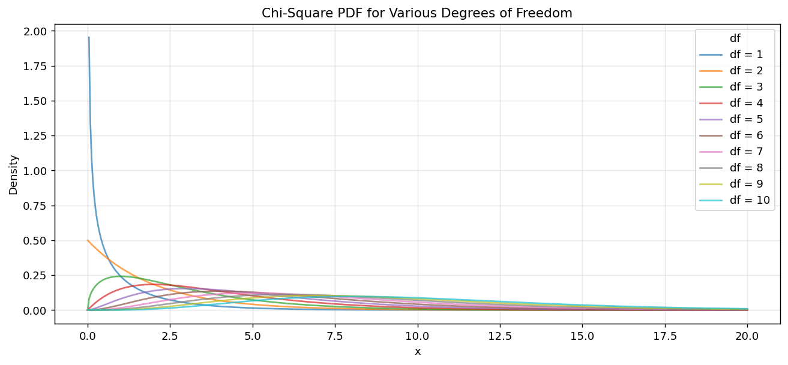
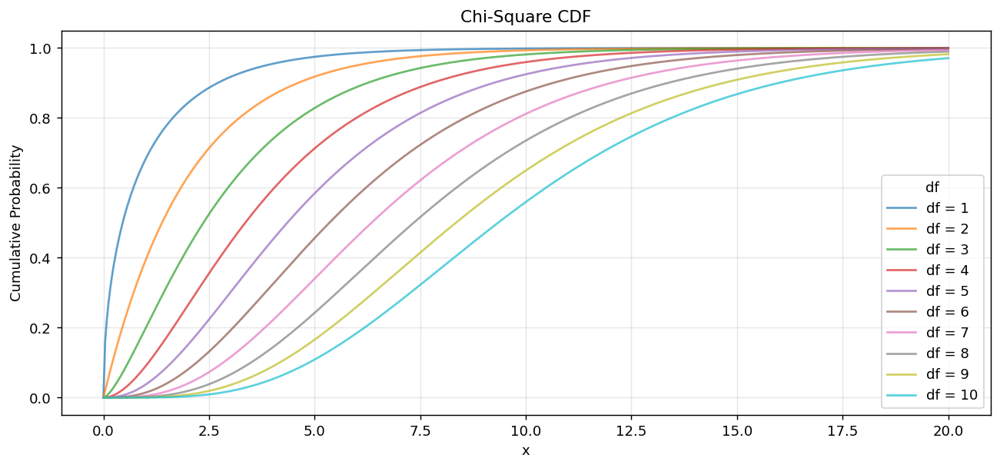
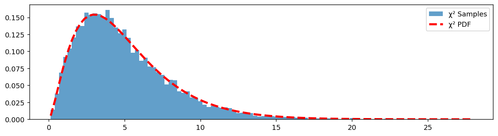
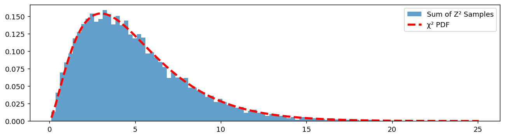
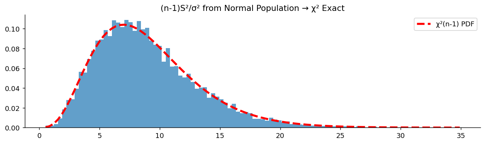
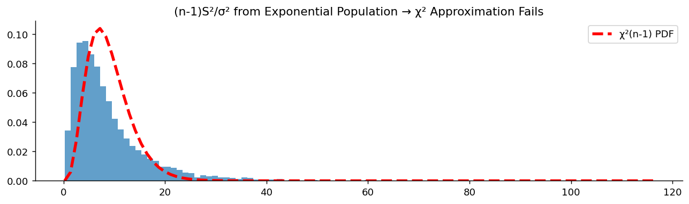

# 카이제곱 분포 (chi-squared)

## 개요

**카이제곱 분포**는 표준정규확률변수들의 제곱합의 분포로 자연스럽게 나타난다. 모분산에 관한 추론, 적합도 검정, 독립성 검정에서 중심적인 역할을 한다.

---

<div class="defn" markdown>

### 정의 1. 카이제곱분포 { .dfn }

$Z_1, Z_2, \ldots, Z_d$가 독립인 표준정규확률변수이면:

$$
\sum_{i=1}^d Z_i^2 \sim \chi^2_d
$$

모수 $d$를 **자유도**라 한다.

---

</div>

## 자유도와 모양

$\chi^2$ 분포의 모양은 $d$에 결정적으로 의존한다:

- **$d$가 작을 때 (예: 1–2):** 오른쪽으로 심하게 치우치고 최빈값이 0 근처이다.
- **$d$가 클 때:** 더 대칭적이 되고 정규분포에 가까워진다(i.i.d. 확률변수의 합이므로 중심극한정리에 의해).

---

## 성질

### 기본 성질

$$
\begin{aligned}
\text{Mean} &= d \\
\text{Variance} &= 2d \\
\end{aligned}
$$

$d = 1$이면 분포가 심하게 치우친다. $d$가 커질수록 더 대칭적이 된다.

### 가법성

$X_1 \sim \chi^2_{d_1}$과 $X_2 \sim \chi^2_{d_2}$가 **독립**이면:

$$
X_1 + X_2 \sim \chi^2_{d_1 + d_2}
$$

독립인 성분들에 걸친 전체 변동성을 분석할 때 유용하다.

---

## PDF

$$
f(x; d) = \frac{1}{2^{d/2}\,\Gamma(d/2)} \, x^{(d/2)-1} \, e^{-x/2}, \quad x > 0
$$

<div class="codebox" markdown>

### 예제 1. 자유도에 따른 카이제곱 밀도함수 { .eg }

```python
import numpy as np
import matplotlib.pyplot as plt
from scipy.stats import chi2

x = np.linspace(0, 20, 500)      # 카이제곱은 x > 0 에서만 정의된다
fig, ax = plt.subplots(figsize=(12, 5))

# 자유도를 1에서 10까지 바꿔 가며 겹쳐 그린다.
# 자유도 = 더한 제곱의 개수이므로 평균이 곧 df, 분산은 2*df 다.
#   df = 1, 2 : 0에서 무한대로 치솟는다(최빈값이 0)
#   df >= 3   : 봉우리가 생기고 최빈값이 df - 2 에 놓인다
#   df가 커질수록 오른쪽으로 이동하며 대칭인 종 모양에 가까워진다
for df in range(1, 11):
    ax.plot(x, chi2.pdf(x, df), label=f'df = {df}', alpha=0.7)

ax.set_xlabel('x')
ax.set_ylabel('Density')
ax.set_title('Chi-Square PDF for Various Degrees of Freedom')
ax.legend(title='df')
ax.grid(True, alpha=0.3)
plt.show()
```



</div>

---

## CDF

<div class="codebox" markdown>

### 예제 2. 카이제곱 분포함수 { .eg }

```python
import numpy as np
import matplotlib.pyplot as plt
from scipy.stats import chi2

x = np.linspace(0, 20, 500)
fig, ax = plt.subplots(figsize=(12, 5))

# 같은 자유도들의 CDF. 자유도가 클수록 곡선이 오른쪽으로 밀린다.
# 가설검정에서 임계값을 읽을 때 쓰는 것이 바로 이 곡선이다.
for df in range(1, 11):
    ax.plot(x, chi2.cdf(x, df), label=f'df = {df}', alpha=0.7)

ax.set_xlabel('x')
ax.set_ylabel('Cumulative Probability')
ax.set_title('Chi-Square CDF')
ax.legend(title='df')
ax.grid(True, alpha=0.3)
plt.show()
```



</div>

---

## PPF (역 CDF)

<div class="codebox" markdown>

### 예제 3. 카이제곱 백분위점 { .eg }

```python
from scipy import stats

df = 10
chi2_975 = stats.chi2(df).ppf(0.975)
print(f"97.5th percentile of χ²(10): {chi2_975:.4f}")

chi2_99 = stats.chi2(df).ppf(0.99)
print(f"99th percentile of χ²(10): {chi2_99:.4f}")
```

출력:

```
97.5th percentile of χ²(10): 20.4832
99th percentile of χ²(10): 23.2093
```

</div>

---

## 확률표본

### 직접 표본추출

<div class="codebox" markdown>

#### 예제 4. scipy 로 카이제곱 표본추출 { .eg }

```python
import numpy as np
import matplotlib.pyplot as plt
from scipy import stats

np.random.seed(0)
df = 5
# 방법 1: scipy의 카이제곱 생성기를 그대로 쓴다.
data = stats.chi2(df).rvs(10_000)

fig, ax = plt.subplots(figsize=(12, 3))
_, bins, _ = ax.hist(data, bins=100, density=True, alpha=0.7, label='χ² Samples')
ax.plot(bins, stats.chi2(df).pdf(bins), '--r', lw=3, label='χ² PDF')
ax.legend()
plt.show()
```



</div>

### 정의로부터의 표본추출 (정규확률변수의 제곱합)

<div class="codebox" markdown>

#### 예제 5. 정규제곱합으로 카이제곱 만들기 { .eg }

```python
import numpy as np
import matplotlib.pyplot as plt
from scipy import stats

np.random.seed(0)
df = 5
# 방법 2: 정의를 그대로 실행한다.
# 표준정규 5개를 뽑아 제곱해 더하기를 1만 번 되풀이한다.
#   rvs((5, 10000)) 이 (5, 10000) 배열을 주고
#   axis=0 으로 더하면 열마다(= 시행마다) 5개의 제곱합이 나온다.
# 앞의 그림과 겹쳐 보면 두 방법이 같은 분포를 낸다는 것이 확인된다.
data = np.sum(stats.norm().rvs((df, 10_000))**2, axis=0)

fig, ax = plt.subplots(figsize=(12, 3))
_, bins, _ = ax.hist(data, bins=100, density=True, alpha=0.7, label='Sum of Z² Samples')
ax.plot(bins, stats.chi2(df).pdf(bins), '--r', lw=3, label='χ² PDF')
ax.legend()
plt.show()
```



</div>

---

## 왜 카이제곱인가?

카이제곱 분포는 **표본분산**을 다룰 때 나타난다. i.i.d. $X_i \sim N(\mu, \sigma^2)$에 대해:

$$
\frac{(n-1)S^2}{\sigma^2} = \sum_{i=1}^n \left(\frac{X_i - \bar{X}}{\sigma}\right)^2 \sim \chi^2_{n-1}
$$

이 결과 덕분에 $\sigma^2$에 대한 신뢰구간과 가설검정을 구성할 수 있다.

### 정규성에 대한 의존

이 정확한 카이제곱 결과는 **정규성 가정에 결정적으로 의존한다**:

- **정규모집단에서는**: $\bar{X}$와 $S^2$이 독립이고 $(n-1)S^2/\sigma^2$이 정확히 카이제곱을 따른다.
- **정규가 아닌 모집단에서는**: 특히 $n$이 작을 때 카이제곱 근사를 믿을 수 없다. $S^2$의 분포가 극적으로 달라질 수 있다.

### 모의실험: 정규모집단

<div class="codebox" markdown>

#### 예제 6. 정규모집단에서 표본분산의 분포 { .eg }

```python
import matplotlib.pyplot as plt
import numpy as np
import scipy.stats as stats

n, n_sim, mu, sigma = 10, 10_000, 1, 2
# 크기 10짜리 정규 표본을 1만 개 만든다. 행 하나가 표본 하나다.
samples = stats.norm(loc=mu, scale=sigma).rvs(size=(n_sim, n))
s = samples.std(axis=1, ddof=1)      # 행마다 표본표준편차(n-1로 나눔)

# 이 통계량이 정확히 chi^2(n-1) 을 따른다는 것이 정리의 내용이다.
# mu = 1 을 썼지만 결과는 mu에 의존하지 않는다.
# S^2 이 편차만 쓰므로 위치가 상쇄되기 때문이다.
data = (n - 1) * s**2 / sigma**2

fig, ax = plt.subplots(figsize=(12, 3))
_, bins, _ = ax.hist(data, bins=100, density=True, alpha=0.7)
ax.plot(bins, stats.chi2(n-1).pdf(bins), '--r', lw=3, label='χ²(n-1) PDF')
ax.set_title('(n-1)S²/σ² from Normal Population → χ² Exact')
ax.legend()
ax.spines[['top', 'right']].set_visible(False)
plt.show()
```



</div>

### 모의실험: 정규가 아닌 모집단

<div class="codebox" markdown>

#### 예제 7. 정규가 아닌 모집단에서는 어떻게 되는가 { .eg }

```python
import matplotlib.pyplot as plt
import numpy as np
import scipy.stats as stats

n, n_sim = 10, 10_000
# 앞 모의실험과 **한 곳만** 다르다. 모집단을 정규에서 지수로 바꿨다.
# 나머지 코드는 그대로다.
samples = stats.expon().rvs(size=(n_sim, n))
s = samples.std(axis=1, ddof=1)
# Exp(1)의 분산이 1이므로 sigma^2으로 나눌 필요가 없다.
data = (n - 1) * s**2

# 지수분포는 오른쪽으로 크게 치우쳐 4차 적률이 크다.
# 그 결과 S^2 의 분포가 카이제곱보다 훨씬 무거운 꼬리를 갖게 되어
# 아래 그림에서 히스토그램이 빨간 곡선 밖으로 크게 벗어난다.

fig, ax = plt.subplots(figsize=(12, 3))
_, bins, _ = ax.hist(data, bins=100, density=True, alpha=0.7)
ax.plot(bins, stats.chi2(n-1).pdf(bins), '--r', lw=3, label='χ²(n-1) PDF')
ax.set_title('(n-1)S²/σ² from Exponential Population → χ² Approximation Fails')
ax.legend()
ax.spines[['top', 'right']].set_visible(False)
plt.show()
```



</div>

---

## 실무적 함의

| 상황 | 카이제곱의 타당성 |
|:---|:---|
| 정규모집단 | 정확함 |
| $n$이 크고 정규가 아님 | 중심극한정리를 통해 근사적으로 타당할 수 있음 |
| $n$이 작고 치우쳤거나 이항인 모집단 | 신뢰할 수 없음. 정확검정이나 재표본추출 방법을 사용 |
| 이항 자료 | $np \geq 5$, $n(1-p) \geq 5$ 규칙을 사용 |

---

## 연습문제

<div class="drillbox" markdown>

**연습문제 1.** <span class="diff easy" title="쉬움"></span>
$X \sim \chi^2_5$와 $Y \sim \chi^2_8$이 독립일 때 $X + Y$의 분포는 무엇인가? $E[X+Y]$와 $\text{Var}(X+Y)$를 계산하라.

</div>

??? success "풀이"
    카이제곱 분포의 가법성에 의해 독립인 카이제곱 확률변수의 합은 자유도가 더해진 카이제곱이다:

    $$
    X + Y \sim \chi^2_{5+8} = \chi^2_{13}
    $$

    $$
    E[X+Y] = 13, \quad \text{Var}(X+Y) = 2 \times 13 = 26
    $$

<div class="drillbox" markdown>

**연습문제 2.** <span class="diff easy" title="쉬움"></span>
$N(\mu, 9)$ 모집단에서 크기 $n = 20$인 확률표본을 뽑는다. $\frac{(n-1)S^2}{\sigma^2}$의 정확한 분포는 무엇인가? ($\sigma^2 = 9$일 때) $S^2 > 15$일 확률을 구하라.

</div>

??? success "풀이"
    모집단이 정규이므로 표본분포는 정확하다:

    $$
    \frac{(n-1)S^2}{\sigma^2} = \frac{19 S^2}{9} \sim \chi^2_{19}
    $$

    구해야 할 것은 $P(S^2 > 15) = P\!\left(\frac{19 S^2}{9} > \frac{19 \times 15}{9}\right) = P(\chi^2_{19} > 31.67)$이다.

    카이제곱 분포표나 소프트웨어에서 $P(\chi^2_{19} > 31.67) \approx 0.034$이다. $\sigma^2 = 9$일 때 표본분산이 15를 넘을 확률은 약 3.4%이다.

<div class="drillbox" markdown>

**연습문제 3.** <span class="diff med" title="중간"></span>
카이제곱 분포가 자유도가 작을 때는 오른쪽으로 치우치지만 자유도가 크면 근사적으로 대칭이 되는 이유를 설명하라.

</div>

??? success "풀이"
    자유도 $k$인 카이제곱 분포는 독립인 $\chi^2_1$ 확률변수 $k$개의 합이며, 각각은 표준정규확률변수의 제곱이다. $\chi^2_1$ 분포는 오른쪽으로 심하게 치우쳐 있다(음이 아닌 값만 가지며 대부분의 질량이 0 근처에 있고 오른쪽 꼬리가 길다).

    $k$가 작으면 이런 치우친 확률변수 몇 개의 합도 여전히 치우쳐 있다. $k$가 커지면 중심극한정리가 적용된다. 많은 독립 확률변수의 합은 정규분포로 수렴한다. 구체적으로 $\chi^2_k$의 왜도는 $\sqrt{8/k}$이며 $k \to \infty$일 때 0으로 감소한다. $k = 2$이면 왜도가 2로 심하게 치우쳐 있고, $k = 50$이면 0.4로 거의 대칭이다.

<div class="drillbox" markdown>

**연습문제 4.** <span class="diff med" title="중간"></span>
어떤 연구자가 지수 모집단에서 $n = 10$인 표본을 뽑아 $\frac{(n-1)S^2}{\sigma^2}$을 계산하고 이것이 $\chi^2_9$ 분포를 따른다고 가정한다. 타당한가? 무엇이 잘못되는지 설명하라.

</div>

??? success "풀이"
    **타당하지 않다.** $\frac{(n-1)S^2}{\sigma^2} \sim \chi^2_{n-1}$이라는 결과는 **모집단이 정규일 때만** 성립한다. 지수분포는 오른쪽으로 치우쳐 있고 초과첨도가 $\kappa = 6$이어서 $S^2$의 분포가 $\chi^2_9$ 분포보다 훨씬 두꺼운 꼬리를 갖게 된다.

    구체적으로 정규가 아닌 모집단에서 $S^2$의 분산은 첨도에 의존한다: $\text{Var}(S^2) \approx \frac{2\sigma^4}{n-1}(1 + \kappa/2)$. 지수분포에서는 $\frac{2\sigma^4}{9}(1 + 3) = \frac{8\sigma^4}{9}$가 되어 카이제곱 이론이 예측하는 값($\frac{2\sigma^4}{9}$)보다 4배 크다. 카이제곱 가정에 기반한 신뢰구간과 가설검정은 포함확률이 틀리고 제1종 오류율이 부풀려진다.

<div class="drillbox" markdown>

**연습문제 5.** <span class="diff med" title="중간"></span>
정규모집단에서 $n=20$, $s^2 = 12$를 얻었다. $\sigma^2$의 95% 신뢰구간을 구하고, 이 구간이 왜 $s^2$을 중심으로 대칭이 아닌지 설명하라. $\sigma$의 신뢰구간은 어떻게 얻는가?

</div>

??? success "풀이"
    $(n-1)S^2/\sigma^2 \sim \chi^2_{19}$를 추축량으로 쓴다.

    $$
    P\!\left(\chi^2_{19,\,0.025} \le \frac{(n-1)S^2}{\sigma^2} \le \chi^2_{19,\,0.975}\right) = 0.95
    $$

    $\sigma^2$에 대해 풀면 **부등호가 뒤집혀**

    $$
    \left(\frac{(n-1)s^2}{\chi^2_{19,\,0.975}},\ \frac{(n-1)s^2}{\chi^2_{19,\,0.025}}\right)
    $$

    가 된다. $\chi^2_{19,0.025} = 8.907$, $\chi^2_{19,0.975} = 32.852$이고 $(n-1)s^2 = 228$이므로

    $$
    \left(\frac{228}{32.852},\ \frac{228}{8.907}\right) = (6.94,\ 25.60)
    $$

    이다.

    **비대칭인 이유.** $s^2 = 12$에서 아래로는 5.06, 위로는 13.60 떨어져 있다. 카이제곱분포 자체가 오른쪽으로 치우쳐 있고, 게다가 역수를 취하면서 비대칭이 더 커진다. 분산은 아래로 0까지밖에 못 가지만 위로는 제한이 없으므로 이 모양이 자연스럽다.

    **$\sigma$의 구간.** 제곱근이 순증가함수이므로 양끝에 그냥 제곱근을 씌우면 된다.

    $$
    (\sqrt{6.94},\ \sqrt{25.60}) = (2.63,\ 5.06)
    $$

    분위수는 단조변환과 맞바꿀 수 있으므로 이것이 정확한 95% 구간이다. 점추정에는 이런 성질이 없다는 점과 대비된다($E[S] \ne \sigma$).

    구간의 폭이 대단히 넓다는 점을 눈여겨볼 만하다. $n=20$으로는 표준편차가 2.6인지 5.1인지도 가리기 어렵다. **분산 추정은 평균 추정보다 훨씬 많은 자료를 요구한다.**

<div class="drillbox" markdown>

**연습문제 6.** <span class="diff med" title="중간"></span>
주사위를 60번 던져 $1{\sim}6$이 각각 $8, 12, 9, 14, 7, 10$번 나왔다. 주사위가 공정한지 카이제곱 적합도 검정으로 판정하라. 자유도가 왜 5인가?

</div>

??? success "풀이"
    공정하다면 각 눈의 기대도수가 $60/6 = 10$이다.

    $$
    X^2 = \sum_{i=1}^6 \frac{(O_i - E_i)^2}{E_i} = \frac{4+4+1+16+9+0}{10} = \frac{34}{10} = 3.4
    $$

    자유도 5의 임계값이 $\chi^2_{5,0.95} = 11.07$이고 $3.4 < 11.07$이므로 공정하다는 가설을 기각하지 못한다. p-값은 0.639다.

    **자유도가 5인 이유.** 범주가 6개이므로 잔차도 6개인데, $\sum_i O_i = 60$이라는 제약 하나가 있어 자유롭게 움직일 수 있는 것은 5개뿐이다. 하나가 정해지면 나머지가 따라온다.

    일반적으로 자유도는

    $$
    (\text{범주 수}) - 1 - (\text{자료에서 추정한 모수의 개수})
    $$

    이다. 여기서는 모수를 추정하지 않았으므로 $6-1-0 = 5$다. 만약 포아송분포 적합을 검정하면서 $\lambda$를 표본평균으로 추정했다면 자유도가 하나 더 줄어든다.

    **주의할 점.** 이 검정통계량이 $\chi^2$를 따른다는 것은 근사이며, 기대도수가 충분히 커야 한다. 흔한 기준은 **모든 기대도수가 5 이상**(또는 80% 이상이 5를 넘고 어느 것도 1 미만이 아닐 것)이다. 여기서는 모두 10이라 문제가 없다. 기대도수가 작으면 범주를 합치거나 정확검정(다항 정확검정, 몬테카를로 p-값)을 쓴다.

<div class="drillbox" markdown>

**연습문제 7.** <span class="diff med" title="중간"></span>
자유도 $k$가 클 때 쓰는 두 가지 근사

$$
\text{(가)}\ \sqrt{2\chi^2_k} \approx N(\sqrt{2k-1},\,1), \qquad \text{(나)}\ \left(\frac{\chi^2_k}{k}\right)^{1/3} \approx N\!\left(1-\frac{2}{9k},\ \frac{2}{9k}\right)
$$

를 $k=30$의 0.95 분위수에 적용해 정확한 값 43.77과 견주어라.

</div>

??? success "풀이"
    **(가) 피셔 근사.** $\sqrt{2\chi^2_k} \approx \sqrt{2k-1} + Z$이므로

    $$
    \chi^2_{k,0.95} \approx \frac{(\sqrt{2k-1}+z_{0.95})^2}{2} = \frac{(\sqrt{59}+1.645)^2}{2} = \frac{(7.681+1.645)^2}{2} = 43.49
    $$

    오차가 0.28로 0.6% 수준이다.

    **(나) 윌슨-힐퍼티 근사.** 세제곱근 변환을 되돌리면

    $$
    \chi^2_{k,0.95} \approx k\left(1 - \frac{2}{9k} + z_{0.95}\sqrt{\frac{2}{9k}}\right)^3 = 30\left(1-0.00741+1.645(0.08607)\right)^3 = 43.77
    $$

    로 정확한 값과 소수점 둘째 자리까지 일치한다.

    **왜 변환이 필요한가.** $\chi^2_k$는 $k$개의 독립 제곱합이므로 중심극한정리에 따라 $N(k, 2k)$에 다가가기는 한다. 그러나 수렴이 느리다. $k=30$에서 이 단순 근사를 쓰면

    $$
    30 + 1.645\sqrt{60} = 42.74
    $$

    로 오차가 1.03이다. 왜도가 $\sqrt{8/k}$로 $k=30$에서 0.516이나 남아 있기 때문이다.

    제곱근이나 세제곱근 변환은 이 **치우침을 먼저 펴 준 뒤** 정규근사를 적용하는 것이고, 그래서 훨씬 정확하다. 특히 세제곱근(윌슨-힐퍼티) 변환은 감마족 전반에서 정규성에 놀랍도록 가까운 결과를 준다. 요즘은 `stats.chi2.ppf`로 정확한 값을 바로 얻으므로 이 근사가 실무에 필요하지는 않지만, **변환으로 치우침을 펴는 발상** 자체는 여전히 널리 쓰인다.

<div class="drillbox" markdown>

**연습문제 8.** <span class="diff med" title="중간"></span>
공정에서 분산이 $\sigma^2 = 9$ 이하여야 한다. 정규모집단에서 $n=20$을 뽑아 $s^2 = 12$를 얻었다. $H_0: \sigma^2 = 9$ 대 $H_1: \sigma^2 > 9$를 유의수준 5%로 검정하라. 연습문제 5의 신뢰구간과 어떻게 이어지는가?

</div>

??? success "풀이"
    검정통계량은

    $$
    \chi^2 = \frac{(n-1)s^2}{\sigma_0^2} = \frac{19 \times 12}{9} = 25.33
    $$

    이고 $H_0$ 아래에서 $\chi^2_{19}$를 따른다. 단측 임계값이 $\chi^2_{19,0.95} = 30.14$이고 $25.33 < 30.14$이므로 기각하지 못한다. p-값은 $P(\chi^2_{19} > 25.33) = 0.150$이다.

    $s^2 = 12$가 기준 9보다 33% 크지만 $n=20$에서는 그 정도 차이가 우연으로 충분히 설명된다.

    **신뢰구간과의 관계.** 연습문제 5의 95% 구간 $(6.94, 25.60)$이 9를 담고 있다. **양측 검정과 신뢰구간은 언제나 같은 결론을 준다.** 다만 여기서는 단측 검정을 했으므로 정확히 대응하는 것은 95% 단측(하한만 있는) 신뢰구간

    $$
    \sigma^2 > \frac{19 \times 12}{\chi^2_{19,0.95}} = \frac{228}{30.14} = 7.56
    $$

    이고, 이 역시 9를 배제하지 않는다.

    **실무적 경고.** 이 검정은 정규성 가정에 **극도로 민감하다.** 연습문제 4에서 보았듯 모집단이 조금만 치우쳐도 실제 제1종 오류율이 명목 5%를 크게 벗어난다. 평균에 대한 $t$ 검정이 중심극한정리 덕분에 어느 정도 강건한 것과 대조적이다. 분산을 비교해야 한다면 르빈 검정이나 브라운-포사이드 검정처럼 강건한 대안을 쓰는 편이 안전하다.

<div class="drillbox" markdown>

**연습문제 9.** <span class="diff hard" title="어려움"></span>
$\chi^2_k$의 적률생성함수가 $M(t) = (1-2t)^{-k/2}$($t<1/2$)임을 유도하고, 이를 이용해 가법성과 평균·분산을 보여라.

</div>

??? success "풀이"
    **$k=1$인 경우.** $Z\sim N(0,1)$에 대해

    $$
    E[e^{tZ^2}] = \int_{-\infty}^\infty \frac{1}{\sqrt{2\pi}}e^{tz^2}e^{-z^2/2}dz = \int_{-\infty}^\infty\frac{1}{\sqrt{2\pi}}e^{-z^2(1-2t)/2}dz
    $$

    이다. $1-2t > 0$이면 이는 분산이 $1/(1-2t)$인 정규밀도의 적분이므로

    $$
    = \frac{1}{\sqrt{1-2t}}\int_{-\infty}^\infty\frac{\sqrt{1-2t}}{\sqrt{2\pi}}e^{-z^2(1-2t)/2}dz = (1-2t)^{-1/2}
    $$

    이다.

    **일반 $k$.** $\chi^2_k$는 독립인 $Z_i^2$ $k$개의 합이고 독립인 확률변수 합의 적률생성함수는 곱이므로

    $$
    M(t) = \left\{(1-2t)^{-1/2}\right\}^k = (1-2t)^{-k/2}
    $$

    이다. $\square$

    **가법성.** $X\sim\chi^2_{k_1}$, $Y\sim\chi^2_{k_2}$가 독립이면

    $$
    M_{X+Y}(t) = (1-2t)^{-k_1/2}(1-2t)^{-k_2/2} = (1-2t)^{-(k_1+k_2)/2}
    $$

    로 $\chi^2_{k_1+k_2}$의 적률생성함수다. 적률생성함수가 분포를 결정하므로 $X+Y\sim\chi^2_{k_1+k_2}$이다. $\square$

    **적률.** $\ln M(t) = -\frac k2\ln(1-2t)$를 미분하면

    $$
    \frac{d}{dt}\ln M = \frac{k}{1-2t}, \qquad \frac{d^2}{dt^2}\ln M = \frac{2k}{(1-2t)^2}
    $$

    이고 누율생성함수의 1·2계 도함수를 $t=0$에서 평가하면 평균과 분산이 나온다.

    $$
    E[X] = k, \qquad \operatorname{Var}(X) = 2k
    $$

    일반적으로 $r$차 누율이 $2^{r-1}(r-1)!\,k$이므로 왜도가 $\sqrt{8/k}$, 초과첨도가 $12/k$임도 따라 나온다. 둘 다 $k\to\infty$에서 0으로 가며, 이것이 연습문제 7에서 본 정규근사의 근거다.

<div class="drillbox" markdown>

**연습문제 10.** <span class="diff med" title="중간"></span>
$r \times c$ 분할표의 독립성 검정에서 자유도가 $(r-1)(c-1)$인 이유를 설명하라. $3\times4$ 표에서 자유도는 얼마인가?

</div>

??? success "풀이"
    자유도는 "자유롭게 움직일 수 있는 칸의 수"에서 "추정한 모수의 수"를 뺀 값이다.

    칸이 $rc$개이고 전체 합이 $n$으로 고정되어 있으므로 자유로운 칸은 $rc-1$개다. 한편 귀무가설 $p_{ij} = p_{i\cdot}p_{\cdot j}$ 아래에서 기대도수를 계산하려면 행 주변확률 $r$개와 열 주변확률 $c$개를 추정해야 하는데, 각각 합이 1이라는 제약이 있으므로 자유로운 모수는 $(r-1)+(c-1)$개다. 따라서

    $$
    \text{자유도} = (rc-1) - \{(r-1)+(c-1)\} = rc - r - c + 1 = (r-1)(c-1)
    $$

    이다.

    $3\times4$ 표에서는 $(3-1)(4-1) = 6$이다.

    **다른 방식의 설명.** 행 합과 열 합을 모두 고정했다고 생각하면, 왼쪽 위 $(r-1)\times(c-1)$ 부분표만 채우면 나머지 칸이 합 제약으로 전부 결정된다. 자유롭게 정할 수 있는 칸의 수가 곧 $(r-1)(c-1)$이다. $3\times4$ 표라면 $2\times3=6$칸이다.

    **주의.** 적합도 검정(연습문제 6)의 자유도가 범주 수에서 1을 뺀 것이었던 것과 달리, 여기서는 주변분포를 자료에서 추정하기 때문에 더 줄어든다. 두 검정의 통계량 계산식은 똑같이 $\sum (O-E)^2/E$지만 **기대도수를 어떻게 구했는지에 따라 자유도가 달라진다**는 점을 놓치기 쉽다.

---

## 정리하며

- 카이제곱 분포는 표준정규확률변수들의 제곱합이다.
- 모집단이 정규일 때 모분산에 관한 추론을 지배한다.
- 가법성 덕분에 독립인 분산 성분들을 결합할 때 유용하다.
- $S^2$에 대한 카이제곱 결과의 정확성은 정규성에 결정적으로 의존한다.
