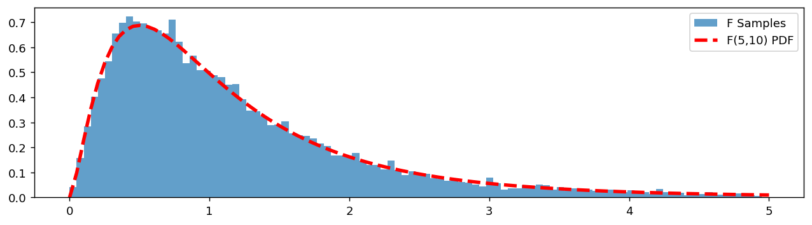
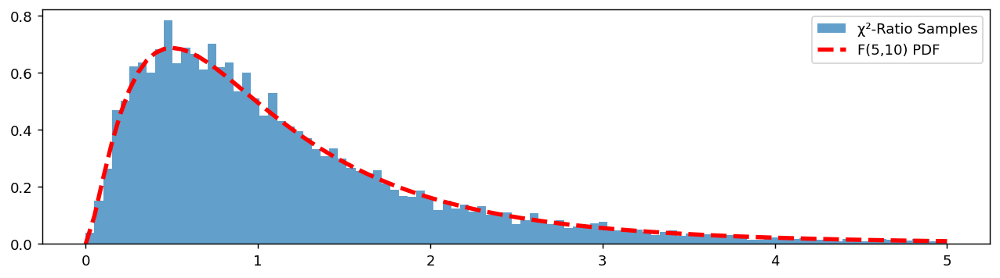

# F 분포

## 개요

**F 분포**는 독립인 두 카이제곱 확률변수를 각각의 자유도로 나눈 뒤 그 비로 나타난다. 두 모집단의 분산을 비교하는 데 그리고 분산분석(ANOVA)에 근본이 된다.

---

<div class="defn" markdown>

### 정의 1. F 분포 { .dfn }

$X_1^2 \sim \chi^2_{d_1}$과 $X_2^2 \sim \chi^2_{d_2}$가 독립이라 하자. 그러면:

$$
F = \frac{X_1^2 / d_1}{X_2^2 / d_2} \sim F_{d_1, d_2}
$$

여기서 $d_1$은 분자 자유도, $d_2$는 분모 자유도이다.

각 $\chi^2$은 표준정규확률변수의 제곱합이므로:

$$
X_1^2 = \sum_{i=1}^{d_1} Z_i^2, \qquad X_2^2 = \sum_{i=1}^{d_2} Z_i'^2
$$

---

</div>

## 자유도

F 분포는 **두 개**의 자유도에 의존하며, 이 점이 카이제곱 분포와 구별된다:

### 분자 (d_1)와 분모 (d_2)

- **$d_1$, $d_2$가 작을 때:** 오른쪽으로 심하게 치우친다.
- **$d_1$, $d_2$가 커질 때:** 분포가 더 대칭적이 된다.
- **특수한 경우:** $F(1, d_2) = \frac{\chi^2(1)/1}{\chi^2(d_2)/d_2}$는 $t$ 확률변수의 제곱과 직접 연결된다.

### 카이제곱과의 비교

카이제곱 분포는 모양을 결정하는 자유도 모수가 하나뿐이다. F 분포는 분산과 같은 성격의 독립인 두 양의 **비**이기에 두 자유도에 의존하며, 그만큼 더 풍부한 모양의 계열을 이룬다.

---

## 성질

- **비음성:** $F \geq 0$ (음이 아닌 양들의 비).
- **비대칭성:** 양의 방향으로 치우쳐 있으며, 자유도가 작을수록 심하다.
- **평균:** $d_2 > 2$일 때 $\frac{d_2}{d_2 - 2}$.
- **최빈값:** $d_1 > 2$일 때:

$$
\text{Mode} = \frac{d_2(d_1 - 2)}{d_1(d_2 + 2)}
$$

---

## 확률표본

### 직접 표본추출

<div class="codebox" markdown>

#### 예제 1. scipy 로 F 표본추출 { .eg }

```python
import numpy as np
import matplotlib.pyplot as plt
from scipy import stats

np.random.seed(0)
d1, d2 = 5, 10      # 분자 자유도, 분모 자유도
# 방법 1: scipy의 F 생성기를 그대로 쓴다.
data = stats.f(d1, d2).rvs(10_000)

fig, ax = plt.subplots(figsize=(12, 3))
# F 분포는 오른쪽 꼬리가 길어 값이 수십까지 나온다.
# 구간을 [0, 5]로 고정해 봉우리 부분을 제대로 보이게 한다.
bins = np.linspace(0, 5, 100)
ax.hist(data, bins=bins, density=True, alpha=0.7, label='F Samples')
ax.plot(bins, stats.f(d1, d2).pdf(bins), '--r', lw=3, label=f'F({d1},{d2}) PDF')
ax.legend()
plt.show()
```



</div>

### 정의로부터의 표본추출 (카이제곱의 비)

<div class="codebox" markdown>

#### 예제 2. 카이제곱의 비로 F 만들기 { .eg }

```python
import numpy as np
import matplotlib.pyplot as plt
from scipy import stats

np.random.seed(0)
d1, d2, n = 5, 10, 10_000

# 방법 2: 정의를 그대로 실행한다.
# F = (chi2_{d1}/d1) / (chi2_{d2}/d2) — 정의를 그대로 옮긴 것이다.
# 각 카이제곱을 **자기 자유도로 나눈다**는 점이 핵심이다.
# 그래야 두 값의 기댓값이 모두 1이 되어 비율이 1 근처에 놓인다.
# 이것이 분산분석에서 "두 분산추정값의 비"가 F를 따르는 이유다.
# 두 카이제곱은 서로 독립이어야 하므로 따로 rvs를 호출한다.
f_data = (stats.chi2(d1).rvs(n) / d1) / (stats.chi2(d2).rvs(n) / d2)

fig, ax = plt.subplots(figsize=(12, 3))
bins = np.linspace(0, 5, 100)
ax.hist(f_data, bins=bins, density=True, alpha=0.7, label='χ²-Ratio Samples')
ax.plot(bins, stats.f(d1, d2).pdf(bins), '--r', lw=3, label=f'F({d1},{d2}) PDF')
ax.legend()
plt.show()
```



</div>

---

## 왜 F인가?

F 분포는 독립인 두 정규모집단의 분산을 비교할 때 자연스럽게 나타난다.

### 1단계: 척도조정된 분산의 분포

정규모집단에서 뽑은 표본에 대해:

$$
\frac{(n_1-1)S_1^2}{\sigma_1^2} \sim \chi^2_{n_1-1}, \qquad \frac{(n_2-1)S_2^2}{\sigma_2^2} \sim \chi^2_{n_2-1}
$$

두 표본이 독립이므로 이들도 독립이다.

### 2단계: 카이제곱의 비

각각을 자유도로 나눈 뒤 비를 취하면:

$$
\frac{S_1^2 / \sigma_1^2}{S_2^2 / \sigma_2^2} \sim F_{n_1-1, \, n_2-1}
$$

### 3단계: 귀무가설 아래에서

$H_0: \sigma_1^2 = \sigma_2^2$을 검정하면 모분산이 약분된다:

$$
\frac{S_1^2}{S_2^2} \sim F_{n_1-1, \, n_2-1}
$$

이것이 **두 분산의 동일성에 대한 F 검정**이다.

### 왜 다른 것이 아닌가?

F 분포는 독립인 카이제곱 확률변수를 각각의 자유도로 나눈 비로부터 나오는 유일한 분포이다. 이 논리는 그대로 분산분석으로 확장되며, 거기서 F 비는 집단 간 변동성이 집단 내 변동성보다 유의하게 큰지를 잰다.

---

## 한계

F 분포 결과는 **정규성 아래에서만 정확하다**:

- **정규성이 필요하다:** 각 $S^2$에 대한 카이제곱 결과가 모집단의 정규성에 의존한다. 정규성이 없으면 $S_1^2/S_2^2$의 분포가 $F$에서 벗어난다.
- **소표본이면서 정규가 아닐 때:** F 검정을 신뢰할 수 없다. 치우쳤거나 꼬리가 두꺼운 모집단에서는 실제 제1종 오류율이 명목 수준보다 훨씬 클 수 있다.
- **로버스트 대안:** Levene 검정, Brown–Forsythe 검정, Fligner–Killeen 검정은 더 넓은 분포 조건에서도 타당성을 유지하며 실무에서 널리 선호된다.

| 상황 | F 검정의 타당성 |
|:---|:---|
| 정규모집단 | 정확함 |
| 대표본이고 정규성에서 약간 벗어남 | 근사적으로 타당함 |
| 소표본이고 치우쳤거나 꼬리가 두꺼움 | 신뢰할 수 없음. 로버스트 대안을 사용 |

---

## PPF 예제

<div class="codebox" markdown>

### 예제 3. F 분포의 백분위점 { .eg }

```python
from scipy import stats

# F(5, 20)의 95백분위점. 분산비 검정의 기각값으로 쓰인다.
f_95 = stats.f(5, 20).ppf(0.95)
print(f"F_0.95(5, 20) = {f_95:.4f}")
```

출력:

```
F_0.95(5, 20) = 2.7109
```

</div>

---

## 연습문제

<div class="drillbox" markdown>

**연습문제 1.** <span class="diff easy" title="쉬움"></span>
공통 $\sigma^2$을 갖는 독립인 두 정규 표본에서 $n_1 = 15$, $n_2 = 10$이다. $P(S_1^2/S_2^2 > 1.5)$를 계산하라.

</div>

??? success "풀이"
    분산이 같으면 $F = S_1^2/S_2^2 \sim F_{14, 9}$이다(분자 자유도 = $n_1 - 1 = 14$, 분모 자유도 = $n_2 - 1 = 9$).

    유도: $S_i^2 \sim \sigma^2 \chi^2_{n_i - 1}/(n_i - 1)$이다. 독립인 척도조정된 카이제곱을 각각 자유도로 나눈 비는 정확히 $F$이다.

    수치: $P(F_{14, 9} > 1.5) \approx 0.274$로 약 27%이다.

    $F$ 분포는 자유도가 작을 때 심하게 치우쳐 있어, 비가 그리 크지 않아도 꼬리에 무시할 수 없는 확률이 있다.

<div class="drillbox" markdown>

**연습문제 2.** <span class="diff hard" title="어려움"></span>
**구성.** 독립인 $U \sim \chi^2_{d_1}$과 $V \sim \chi^2_{d_2}$에 대해 $F = (U/d_1)/(V/d_2)$를 유도하라. 평균을 구하고 그것이 무엇을 말해 주는지 설명하라.

</div>

??? success "풀이"
    정의: $U \sim \chi^2_{d_1}$과 $V \sim \chi^2_{d_2}$가 독립이면 $F = (U/d_1)/(V/d_2) \sim F_{d_1, d_2}$이다.

    평균: $U$와 $V$가 독립이므로 기댓값을 인수분해할 수 있다:

    $$
    \mathbb{E}[F] = \mathbb{E}\!\left[\frac{U}{d_1}\right] \cdot \mathbb{E}\!\left[\frac{d_2}{V}\right]
    $$

    $\mathbb{E}[U/d_1] = 1$이고, 역카이제곱의 적률을 사용하면 $d_2 > 2$일 때 $\mathbb{E}[d_2/V] = d_2 \cdot \mathbb{E}[1/V] = d_2/(d_2 - 2)$이다.

    따라서 $d_2 > 2$일 때 $\mathbb{E}[F_{d_1, d_2}] = d_2/(d_2 - 2)$이며, 1보다 약간 크다.

    **비대칭성:** 분산이 같다는 귀무가설 아래에서도 $F$는 평균적으로 1보다 크다. 볼록함수 $1/v$에 Jensen 부등식을 적용하면 $1/V$가 $1/\mathbb{E}[V]$에 비해 양의 편향을 갖기 때문이다.

    추론에서는 유의수준 $\alpha$의 단측검정에 분포표의 $F$ 임계값을 사용한다. $F$의 비대칭성 때문에 양측검정은 흔하지 않다.

<div class="drillbox" markdown>

**연습문제 3.** <span class="diff med" title="중간"></span>
**분산분석의 $F$ 검정.** 일원배치 분산분석에서 $k$개 집단 평균의 동일성을 검정하는 F 통계량을 쓰라. 자유도는 무엇인가?

</div>

??? success "풀이"
    일원배치 분산분석: 집단 $i = 1, \ldots, k$에 각각 $n_i$개의 관측값이 있고 전체는 $n = \sum n_i$이다. 총/집단 간/집단 내 제곱합은:

    - $\mathrm{SST} = \sum_{ij}(Y_{ij} - \bar Y_{..})^2$
    - $\mathrm{SSB} = \sum_i n_i (\bar Y_{i\cdot} - \bar Y_{..})^2$
    - $\mathrm{SSW} = \sum_{ij}(Y_{ij} - \bar Y_{i\cdot})^2$

    F 통계량:

    $$
    F = \frac{\mathrm{SSB}/(k-1)}{\mathrm{SSW}/(n-k)} \sim F_{k-1, n-k}
    $$

    평균이 같다는 $H_0$ 아래에서는 분자와 분모가 모두 $\sigma^2$을 추정한다. $H_1$ 아래에서는 분자가 집단 간 분산으로 부풀려지고 분모는 그대로이다. $F$가 크면 기각한다.

    자유도: 집단 간은 $k - 1$(집단 평균의 개수보다 하나 적다), 집단 내는 $n - k$(각 집단이 $n_i - 1$씩 기여하여 합이 $n - k$가 된다).

<div class="drillbox" markdown>

**연습문제 4.** <span class="diff med" title="중간"></span>
**$F$와 $t$.** $k = 2$개 집단일 때 $F_{1, n-2}$가 $t_{n-2}$의 제곱과 같은 분포를 가짐을 보여라.

</div>

??? success "풀이"
    정의에서 출발한다: $Z \sim N(0,1)$과 $V \sim \chi^2_{n-2}$가 독립일 때 $t = Z/\sqrt{V/(n-2)}$이다.

    따라서 $t^2 = Z^2/(V/(n-2))$이다. 그런데 $Z^2 \sim \chi^2_1$이다(표준정규확률변수의 제곱).

    $$
    t^2 = \frac{Z^2/1}{V/(n-2)} \sim F_{1, n-2}
    $$

    이는 $F$의 정의에 의한 것이다. $\square$

    **실무적 함의:** $k = 2$개 집단일 때 분산분석의 $F$ 검정과 두 표본 $t$ 검정은 동등하다: $F_{\text{obs}} = t_{\text{obs}}^2$. 분산분석에서 유의수준 $\alpha$로 $H_0$을 기각할 필요충분조건은 $F > F_{1, n-2, 1-\alpha} = t_{n-2, 1-\alpha/2}^2$이다. 같은 결론에 이르며, 두 검정은 같은 절차를 다르게 표현한 것이다.

<div class="drillbox" markdown>

**연습문제 5.** <span class="diff med" title="중간"></span>
**역수 관계.** $F_{d_1, d_2}$와 $1/F_{d_2, d_1}$이 같은 분포를 가짐을 보여라.

</div>

??? success "풀이"
    독립인 $U \sim \chi^2_{d_1}$, $V \sim \chi^2_{d_2}$에 대해 $F = (U/d_1)/(V/d_2)$라 하자. 그러면

    $$
    \frac{1}{F} = \frac{V/d_2}{U/d_1} \sim F_{d_2, d_1}
    $$

    이며, 정의에 의해 자유도가 뒤바뀐 것이다.

    **실무:** $P(F_{d_1, d_2} < c)$를 계산하려면 $P(1/F_{d_1, d_2} > 1/c) = P(F_{d_2, d_1} > 1/c)$를 사용한다. 분포표에 상단꼬리 임계값만 실려 있을 때 편리하다. $\alpha$에서 $F_{d_1, d_2}$의 하단꼬리는 $\alpha$에서 $F_{d_2, d_1}$의 상단꼬리의 역수와 같다.

<div class="drillbox" markdown>

**연습문제 6.** <span class="diff med" title="중간"></span>
**정규성 위반에 대한 로버스트성.** $F$ 검정은 밑바탕 모집단의 정규성을 가정한다. 가정 위반의 영향을 논하고 대안을 제시하라.

</div>

??? success "풀이"
    **정규성 위반의 영향:**

    - **가벼운 꼬리나 대칭 분포:** 표본크기가 중간 정도면 $F$가 근사적으로 타당하다.
    - **두꺼운 꼬리:** $F$ 검정은 로버스트하지 않다. 표본분산 $s_i^2$의 변동성이 부풀려져 귀무분포가 왜곡된다.
    - **심한 치우침:** $H_0$ 아래의 $F$ 분포가 자료의 거동과 더 이상 맞지 않는다.

    **대안:**

    - **분산 동일성에 대한 Levene 검정:** 제곱편차 대신 $|X_{ij} - \tilde X_i|$(집단 중앙값으로부터의 절대편차)를 사용한다. 정규성 위반에 더 로버스트하다.
    - **Bartlett 검정:** 정규 자료에서는 검정력이 더 높지만 정규성 위반에 민감하다.
    - **Brown-Forsythe 검정:** 평균 대신 중앙값을 쓰는 Levene의 변형으로, 두꺼운 꼬리에 가장 로버스트하다.
    - **순열검정:** 비모수적 대안이다. 관측값의 표지를 다시 섞어 $F$를 반복 계산하여 귀무분포를 만든다.

    실무적 권고: 표본크기가 중간 정도이고 근사적으로 정규인 산업 품질관리나 생물학 실험에서는 $F$ 검정으로 충분하다. 꼬리가 두꺼운 자료(금융 수익률, 생물학적 계수 자료)에는 Levene이나 Brown-Forsythe를 사용하라.

<div class="drillbox" markdown>

**연습문제 7.** <span class="diff med" title="중간"></span>
세 집단에 각각 8명씩 배정한 실험에서 집단 간 제곱합 $\text{SSB} = 84$, 집단 내 제곱합 $\text{SSW} = 180$을 얻었다. 분산분석표를 완성하고 유의수준 5%로 판정하라.

</div>

??? success "풀이"
    $k=3$, $N = 24$이므로 자유도가 $k-1 = 2$와 $N-k = 21$이다.

    | 변동 요인 | 제곱합 | 자유도 | 평균제곱 | $F$ |
    |---|---|---|---|---|
    | 집단 간 | 84 | 2 | 42.00 | 4.90 |
    | 집단 내 | 180 | 21 | 8.571 | |
    | 전체 | 264 | 23 | | |

    임계값이 $F_{2,21,0.95} = 3.467$이고 $4.90 > 3.467$이므로 세 집단 평균이 모두 같다는 귀무가설을 기각한다. p-값은 0.0179다.

    **읽는 법.** $F$는 두 분산 추정값의 비다. 분모 $\text{MSW} = 8.571$은 귀무가설의 참·거짓과 무관하게 언제나 $\sigma^2$의 불편추정값이고, 분자 $\text{MSB} = 42$는 귀무가설이 참일 때만 $\sigma^2$을 추정한다. 집단 평균이 실제로 다르면 분자만 부풀어 비가 1보다 커진다. **단측 검정인 이유**가 여기 있다. 대립가설 아래에서 $F$는 언제나 큰 쪽으로 움직인다.

    효과크기도 함께 보면 좋다.

    $$
    \eta^2 = \frac{\text{SSB}}{\text{SST}} = \frac{84}{264} = 0.318
    $$

    로 전체 변동의 32%가 집단 차이로 설명된다. p-값은 표본크기에 따라 얼마든지 작아질 수 있으므로 **유의성과 효과크기를 함께 보고해야 한다.**

<div class="drillbox" markdown>

**연습문제 8.** <span class="diff med" title="중간"></span>
설명변수 $p$개인 회귀의 전체 $F$ 검정이

$$
F = \frac{R^2/p}{(1-R^2)/(n-p-1)}
$$

로 쓰임을 보여라. $n=50$, $p=3$, $R^2 = 0.42$일 때 값을 구하고 판정하라.

</div>

??? success "풀이"
    제곱합 분해 $\text{SST} = \text{SSR}+\text{SSE}$와 $R^2 = \text{SSR}/\text{SST}$에서 출발한다.

    $$
    F = \frac{\text{SSR}/p}{\text{SSE}/(n-p-1)} = \frac{(\text{SSR}/\text{SST})/p}{(\text{SSE}/\text{SST})/(n-p-1)} = \frac{R^2/p}{(1-R^2)/(n-p-1)}
    $$

    분자·분모를 $\text{SST}$로 나누기만 하면 된다. $\square$

    **수치.** $n-p-1 = 46$이므로

    $$
    F = \frac{0.42/3}{0.58/46} = \frac{0.14}{0.012609} = 11.10, \qquad (d_1,d_2)=(3,46)
    $$

    임계값이 $F_{3,46,0.95} = 2.807$이고 $11.10 \gg 2.807$이므로 "모든 회귀계수가 0"이라는 귀무가설을 기각한다. p-값은 $1.3\times10^{-5}$다.

    **이 관계가 알려 주는 것.** $F$와 $R^2$은 같은 정보를 담고 있고 **$n$과 $p$가 주어지면 서로를 결정한다.** 그러므로 "$R^2$이 낮은데 $F$가 유의하다"는 말은 모순이 아니다. $n$이 크면 $R^2 = 0.05$여도 $F$가 유의할 수 있다. 반대로 $n$이 작으면 $R^2=0.4$여도 유의하지 않을 수 있다.

    또 $R^2$이 $p$와 함께 결코 줄지 않는다는 점도 이 식에서 보인다. 쓸모없는 변수를 넣으면 $R^2$이 조금 오르지만 $p$가 커져 $F$는 오히려 떨어진다. **$F$는 $R^2$을 모형 복잡도로 벌점한 지표**인 셈이며, 수정 $R^2$도 같은 발상이다.

<div class="drillbox" markdown>

**연습문제 9.** <span class="diff med" title="중간"></span>
$H_1$이 참일 때 $F$ 통계량은 **비중심 $F$ 분포**를 따른다. 비중심모수 $\lambda$가 무엇인지 설명하고, 분산분석의 검정력이 무엇에 달려 있는지 정리하라.

</div>

??? success "풀이"
    집단 평균이 $\mu_1,\dots,\mu_k$이고 각 집단 크기가 $n$일 때 분자의 제곱합은 중심 카이제곱이 아니라 **비중심 카이제곱**을 따르며, 비중심모수는

    $$
    \lambda = \frac{n\sum_{i=1}^k(\mu_i-\bar\mu)^2}{\sigma^2}
    $$

    이다. 이때 $F \sim F_{k-1,\,N-k}(\lambda)$이고, $H_0$가 참이면 $\lambda=0$이 되어 보통의 $F$ 분포로 돌아온다.

    **검정력을 결정하는 것.** $\lambda$가 클수록 검정력이 높아지므로, 식에서 세 가지를 읽을 수 있다.

    1. **집단 평균의 흩어짐** $\sum(\mu_i-\bar\mu)^2$. 차이가 클수록 잡아내기 쉽다.
    2. **집단당 표본크기** $n$. $\lambda$가 $n$에 **비례**하므로 표본을 두 배로 하면 비중심모수도 두 배가 된다.
    3. **오차분산** $\sigma^2$. 작을수록 좋다. 실험 설계에서 측정 정밀도를 높이거나 블록화로 오차를 줄이는 것이 여기에 해당한다.

    표준화하면 코헨의 $f$ 효과크기

    $$
    f = \frac{\sqrt{\sum(\mu_i-\bar\mu)^2/k}}{\sigma}
    $$

    로 $\lambda = knf^2$이 되고, 이 형태가 검정력 계산 소프트웨어의 입력이 된다($f = 0.10, 0.25, 0.40$이 각각 작음·중간·큼의 관례적 기준이다).

    주의할 점은 $\lambda$가 **평균 차이의 제곱합**만 보고 그 패턴은 보지 않는다는 것이다. 세 집단이 $(0, 0, \delta)$인 경우와 $(0, \delta/2, \delta)$인 경우는 같은 $\lambda$를 줄 수 있지만, 전자를 겨냥한 대비검정을 따로 설계하면 훨씬 높은 검정력을 얻는다. **전체 $F$ 검정은 방향을 특정하지 않은 대신 검정력을 잃는 무딘 도구다.**

<div class="drillbox" markdown>

**연습문제 10.** <span class="diff med" title="중간"></span>
분산분석의 $F$ 검정이 유의했는데 모든 쌍별 비교가 유의하지 않을 수 있다. 어떻게 그런 일이 생기는지 설명하고, $F$ 검정을 먼저 하는 절차의 의의를 평가하라.

</div>

??? success "풀이"
    **어떻게 생기는가.** 두 가지가 겹친다.

    첫째, $F$ 검정은 **모든 대비**를 한꺼번에 본다. 셰페의 정리에 따르면 $F$가 유의하다는 것은 어떤 대비 $\sum c_i\bar y_i$가 유의하다는 뜻인데, 그 대비가 반드시 쌍별 비교($c = (1,-1,0)$ 같은 것)일 필요는 없다. 예컨대 평균이 $(10, 10, 13)$이면 "앞의 두 집단 평균 대 셋째" 대비 $(0.5, 0.5, -1)$이 가장 강한 신호를 주고, 이것이 어떤 개별 쌍보다도 크게 나올 수 있다.

    둘째, 사후검정은 **다중비교 보정**을 하므로 개별 비교의 문턱이 높아진다. 세 집단이면 쌍이 3개이고 본페로니 보정은 각 비교를 $\alpha/3 = 0.0167$에서 판정한다. $F$가 $p=0.04$로 간신히 유의한 상황이라면 개별 쌍이 그 문턱을 넘기 어렵다.

    **절차의 평가.** "$F$가 유의할 때만 사후검정을 한다"는 피셔의 **보호된 최소유의차(protected LSD)** 절차는 $k=3$일 때는 전체 유의수준을 잘 지키지만, $k \ge 4$에서는 그렇지 않다. 일부 집단만 다른 상황에서 $F$가 쉽게 유의해지고, 그 뒤의 보정 없는 쌍별 비교가 오류율을 부풀린다.

    현대적 권고는 이렇다.

    - **애초에 관심 있는 비교를 미리 정해 두고** 그것만 계획 대비로 검정한다. 검정력이 가장 높고 해석도 명확하다.
    - 모든 쌍을 봐야 한다면 $F$ 검정을 거치지 말고 **튜키의 HSD**를 바로 쓴다. 이 방법은 그 자체로 전체 유의수준을 통제한다.
    - 자료를 본 뒤 사후적으로 대비를 고른다면 **셰페 방법**을 쓴다. 모든 가능한 대비를 동시에 통제하므로 보수적이지만 정직하다.

    요컨대 $F$ 검정은 "어딘가에 차이가 있다"까지만 말해 주는 관문일 뿐이며, **무엇이 다른지는 처음부터 따로 설계해야 한다.**

---

## 정리하며

- F 분포는 독립인 두 카이제곱 확률변수를 각각의 자유도로 나눈 비이다.
- 분산의 비교를 지배하며 분산분석의 토대가 된다.
- 분자와 분모의 자유도가 모두 분포의 모양에 영향을 준다.
- F 검정의 정확성은 정규성에 결정적으로 의존하며, 실무에서는 로버스트 대안이 선호되는 경우가 많다.
