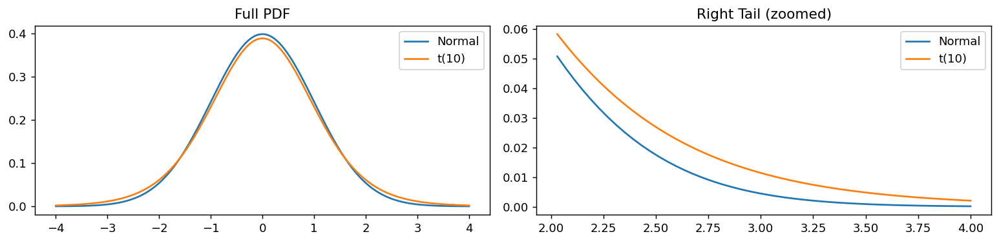
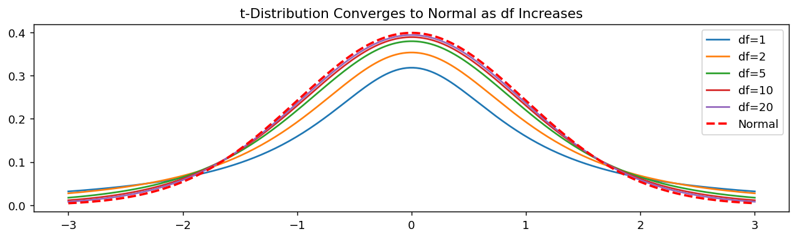
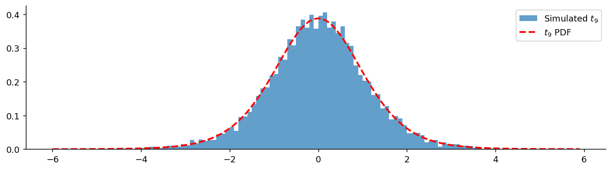
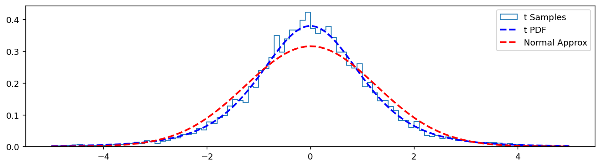

# Student t 분포

## 개요

Student $t$ 분포는 알려진 모표준편차 $\sigma$ 대신 **표본표준편차** $S$를 사용하여 정규모집단의 평균을 추정할 때 나타난다. $\sigma$를 추정하면서 생기는 추가적인 불확실성을 반영한다.

---

## 정의

$Z \sim N(0,1)$과 $V \sim \chi^2_d$가 독립이라 하자. 그러면 다음 비:

$$
T = \frac{Z}{\sqrt{V/d}} \sim t_d
$$

는 자유도 $d$인 Student $t$ 분포를 따른다.

---

## 자유도

자유도 $d = n - 1$은 표본분산을 추정하는 데 사용된 독립적인 정보의 개수를 반영한다.

- **$d$가 작을 때**: 정규분포보다 꼬리가 두꺼워 더 큰 불확실성을 나타낸다.
- **$d$가 클 때 ($> 30$)**: $N(0, 1)$과 사실상 구별되지 않는다.

---

## 성질

$$
\begin{aligned}
\text{Mean} &= 0 \quad \text{for } d > 1 \\
\text{Variance} &= \frac{d}{d - 2} \quad \text{for } d > 2
\end{aligned}
$$

$d \to \infty$일 때 분산은 1에 가까워지고 $t_d \to N(0, 1)$이다.

---

## PDF

$$
f_T(x) = \frac{1}{\sqrt{d}\,B\!\left(\tfrac{1}{2}, \tfrac{d}{2}\right)} \left(1 + \frac{x^2}{d}\right)^{-\frac{d+1}{2}}
$$

여기서 $B(\cdot, \cdot)$는 베타함수이다.

??? proof "증명 개요"


    $T = Z / \sqrt{V/d}$에 대해 $(Z, V)$의 결합밀도에 변수변환을 적용한다. Jacobian 인수는 $\sqrt{v/d}$이고, $\chi^2$ 변수를 적분해 없애면 $T$의 주변밀도가 위 형태가 된다. 조건부분포 $V | T = t$는 감마분포로 나타난다.

    ---

## 두꺼운 꼬리

$t$ 분포는 정규분포보다 **꼬리가 두꺼워** 극단값이 나타날 가능성이 더 크다:

```python
import matplotlib.pyplot as plt
import numpy as np
import scipy.stats as stats

fig, (ax_full, ax_tail) = plt.subplots(1, 2, figsize=(12, 3))
x = np.linspace(-4, 4, 200)

# 왼쪽: 전체 모습. 두 곡선이 거의 겹쳐 보인다.
ax_full.plot(x, stats.norm().pdf(x), label='Normal')
ax_full.plot(x, stats.t(df=10).pdf(x), label='t(10)')
ax_full.set_title('Full PDF')
ax_full.legend()

# 오른쪽: 꼬리만 확대. x[-50:] 은 x 배열의 마지막 50개, 즉 오른쪽 끝이다.
# 전체 그림에서는 밀도가 너무 작아 안 보이던 차이가 여기서 드러난다.
# **꼬리는 언제나 확대해서 봐야 한다.** 검정에서 문제가 되는 곳이 바로 꼬리다.
ax_tail.plot(x[-50:], stats.norm().pdf(x[-50:]), label='Normal')
ax_tail.plot(x[-50:], stats.t(df=10).pdf(x[-50:]), label='t(10)')
ax_tail.set_title('Right Tail (zoomed)')
ax_tail.legend()

plt.tight_layout()
plt.show()
```



### 정규분포로의 수렴

```python
import matplotlib.pyplot as plt
import numpy as np
import scipy.stats as stats

fig, ax = plt.subplots(figsize=(12, 3))
x = np.linspace(-3, 3, 200)

# 자유도를 키우면 t가 정규분포로 수렴한다.
# df=1 은 코시분포로 평균조차 없고, df=2 부터 평균이 생기며,
# df>2 라야 분산 df/(df-2) 가 존재한다. df=20 이면 이미 정규와 거의 같다.
for df in [1, 2, 5, 10, 20]:
    ax.plot(x, stats.t(df).pdf(x), label=f'df={df}')
ax.plot(x, stats.norm().pdf(x), 'r--', lw=2, label='Normal')     # 극한
ax.legend()
ax.set_title('t-Distribution Converges to Normal as df Increases')
plt.show()
```



---

## 왜 t인가?

모집단이 정규이고 $\sigma$를 모를 때 $\sigma$를 $S$로 대체하면:

$$
\frac{\bar{X} - \mu}{S / \sqrt{n}} \sim t_{n-1}
$$

이렇게 되는 이유는 다음과 같다:

1. $\bar{X} \sim N(\mu, \sigma^2/n)$이므로 $\frac{\bar{X} - \mu}{\sigma/\sqrt{n}} \sim N(0,1)$이다.
2. $\frac{(n-1)S^2}{\sigma^2} \sim \chi^2_{n-1}$이다.
3. $\bar{X}$와 $S^2$이 **독립**이다(정규분포만의 특별한 성질).
4. 비 $\frac{N(0,1)}{\sqrt{\chi^2_{n-1}/(n-1)}}$은 정의에 의해 $t_{n-1}$이다.

```python
import numpy as np
import matplotlib.pyplot as plt
from scipy import stats

np.random.seed(0)
n, mu, sigma = 10, 0, 10
n_sim = 10_000

# (n, n_sim) 배열이므로 **열 하나가 표본 하나**다. axis=0 으로 집계한다.
samples = np.random.normal(mu, sigma, (n, n_sim))
x_bar = samples.mean(axis=0)
s = samples.std(axis=0, ddof=1)

# t 통계량. 분모에 참 sigma(=10)가 아니라 **표본표준편차 s** 를 넣는 것이 요점이다.
# sigma를 썼다면 이 값은 정확히 N(0,1)을 따랐을 것이다.
# s를 쓰면 분모 자체가 흔들리므로 분포가 넓어지고 꼬리가 두꺼워진다.
# 그 넓어진 정도를 정확히 기술하는 것이 t(n-1) 이다.
t_stats = (x_bar - mu) / (s / np.sqrt(n))

fig, ax = plt.subplots(figsize=(12, 3))
bins = np.arange(-6, 6, 0.1)
ax.hist(t_stats, bins=bins, density=True, alpha=0.7, label=f'Simulated $t_{{{n-1}}}$')
ax.plot(bins, stats.t(n-1).pdf(bins), '--r', lw=2, label=f'$t_{{{n-1}}}$ PDF')
ax.legend()
ax.spines[['top', 'right']].set_visible(False)
plt.show()
```



---

## t의 역할 이해하기

### n이 클 때: 중심극한정리가 z를 정당화한다

$n$이 크면 $S \approx \sigma$가 되어 $t_{n-1}$과 $N(0,1)$의 차이가 무시할 만하다. 실무에서는 $z$를 써도 똑같이 좋다.

### n이 작을 때: t가 빛나지만 정규성 아래에서만

$t$ 분포는 $n$이 작을 때 가장 중요하다. 두꺼운 꼬리가 $\sigma$ 대신 $S$를 쓰면서 생긴 추가 변동성을 제대로 반영한다. 다만 이 결과는 **모집단이 정규일 때만 정확하다**.

### 정규가 아닌 모집단

모집단이 치우쳐 있거나 꼬리가 두꺼우면 $n$이 작을 때 $t$ 근사는 **나쁘다**. $t$도 $z$도 믿을 수 없으며, 로버스트 방법이나 비모수 방법이 낫다.

### 요약

| 상황 | 권장 방법 |
|:---|:---|
| $n$이 큼 | $z$를 사용한다. $t$ 보정은 무시할 만하다 |
| $n$이 작고 모집단이 정규 | $t$가 정확하며 적절하다 |
| $n$이 작고 모집단이 정규가 아님 | 로버스트/비모수 방법을 사용한다 |

---

## 확률표본

```python
import numpy as np
import matplotlib.pyplot as plt
from scipy import stats

np.random.seed(0)
df = 5
data = stats.t(df).rvs(10_000)

fig, ax = plt.subplots(figsize=(12, 3))
# 구간을 [-5, 5]로 고정한다. t(5)는 꼬리가 두꺼워 표본에 |x| > 20 인 값도 나오는데,
# 자동 구간에 맡기면 그 이상치 때문에 가운데가 한두 칸으로 뭉개진다.
bins = np.linspace(-5, 5, 101)
ax.hist(data, bins=bins, density=True, histtype='step', label='t Samples')
ax.plot(bins, stats.t(df).pdf(bins), '--b', lw=2, label='t PDF')
# 같은 표본의 평균·표준편차로 맞춘 정규분포를 함께 그린다.
# 가운데는 잘 맞지만 꼬리에서 벌어지는 것이 요점이다.
ax.plot(bins, stats.norm(data.mean(), data.std()).pdf(bins),
        '--r', lw=2, label='Normal Approx')
ax.legend()
plt.show()
```



---

## 연습문제

<div class="drillbox" markdown>

**연습문제 1.**
급여가 $\mu = \$40{,}000$인 정규분포를 따른다. 표본 $n = 9$, $s = \$8{,}000$일 때 $P(\bar X \ge \$45{,}000)$을 계산하라.

</div>

??? success "풀이"
    $\mathrm{SE} = s/\sqrt n = 8000/3 \approx 2667$. 검정통계량: $t = (45000 - 40000)/2667 \approx 1.875$.

    $t_8$ 아래에서 $P(T \ge 1.875) \approx 0.048$로 약 4.8%이다.

    참고: $\sigma$를 모르고 표본에서 $s$를 추정하여 추가적인 불확실성이 들어오므로 $z$ 대신 $t$를 사용한다.

<div class="drillbox" markdown>

**연습문제 2.**
**$t$ 분포 유도.** $Z \sim N(0, 1)$과 $V \sim \chi^2_\nu$가 독립이면 $T = Z/\sqrt{V/\nu} \sim t_\nu$임을 보여라.

</div>

??? success "풀이"
    정의에 의해 $t_\nu$는 독립인 $Z \sim N(0, 1)$과 $V \sim \chi^2_\nu$에 대한 $Z/\sqrt{V/\nu}$의 분포이다.

    PDF의 유도: $V = v$로 조건화한다. $V = v$가 주어지면 $T = Z/\sqrt{v/\nu}$이므로 $T \mid V \sim N(0, \nu/v)$이다. 밀도는:

    $$
    f_{T \mid V}(t \mid v) = \frac{1}{\sqrt{2\pi \nu/v}} e^{-vt^2/(2\nu)}
    $$

    $T$의 주변분포: $V \sim \chi^2_\nu$의 밀도를 사용하여 $v$에 대해 적분한다. 결과는:

    $$
    f_T(t) = \frac{\Gamma((\nu+1)/2)}{\sqrt{\nu\pi}\,\Gamma(\nu/2)} \left(1 + \frac{t^2}{\nu}\right)^{-(\nu+1)/2}
    $$

    $t$ 밀도는 $\sim t^{-(\nu+1)}$의 다항식 꼬리를 가지며, 정규분포의 $e^{-t^2/2}$보다 두껍다.

<div class="drillbox" markdown>

**연습문제 3.**
**$t$는 정규분포에 가까워진다.** $\nu \to \infty$일 때 $t_\nu \to N(0, 1)$임을 보여라.

</div>

??? success "풀이"
    $V \sim \chi^2_\nu$인 $t$의 정의 $T = Z/\sqrt{V/\nu}$에서 출발한다. 큰수의 법칙에 의해 $V/\nu = (1/\nu)\sum_{i=1}^\nu Z_i^2 \to 1$이 확률수렴한다. 따라서 $\sqrt{V/\nu} \to 1$이고 $T \to Z \sim N(0, 1)$이다.

    더 정확히는 Slutsky 정리에 의해 $T = Z/\sqrt{V/\nu} \xrightarrow{d} Z/1 = Z$이다.

    **실무:** $\nu \ge 30$이면 $t$ 분포는 정규분포와 거의 구별되지 않는다. $t_{30}$의 임계값은 $z$의 임계값과 2% 이내로 일치한다. 이것이 $t$ 대신 $z$를 쓰는 $n \ge 30$ 경험 법칙의 근거이다.

<div class="drillbox" markdown>

**연습문제 4.**
**$z$ 대신 $t$를 쓰는 이유.** 어떤 통계학자가 $z = (\bar X - \mu_0)/(\sigma/\sqrt n)$을 계산하려다 $\sigma$를 모른다는 것을 깨닫고 $s$로 대체했다. 그 결과 $t = (\bar X - \mu_0)/(s/\sqrt n) \sim t_{n-1}$임을 보여라.

</div>

??? success "풀이"
    귀무가설 $\mu = \mu_0$ 아래에서 $\bar X \sim N(\mu_0, \sigma^2/n)$이므로 $Z = (\bar X - \mu_0)/(\sigma/\sqrt n) \sim N(0, 1)$이다.

    표본분산 $s^2$을 $\sigma^2$으로 척도조정하면 카이제곱 분포를 따른다: (정규 자료에 대해) $(n-1)s^2/\sigma^2 \sim \chi^2_{n-1}$.

    정규 자료에서 $\bar X$와 $s^2$은 독립이다(정규성에만 특유한 자명하지 않은 사실이다).

    따라서:

    $$
    t = \frac{\bar X - \mu_0}{s/\sqrt n} = \frac{(\bar X - \mu_0)/(\sigma/\sqrt n)}{\sqrt{((n-1) s^2/\sigma^2)/(n-1)}} = \frac{Z}{\sqrt{V/(n-1)}}
    $$

    이며 $V \sim \chi^2_{n-1}$은 $Z$와 독립이다. $t$의 정의에 의해 이는 $t_{n-1}$이다.

    $\sigma$ 대신 $s$를 쓰면 분모에 카이제곱이 들어온다. $t$ 분포는 정규분포보다 두꺼운 꼬리로 이 추가 불확실성을 반영한다.

<div class="drillbox" markdown>

**연습문제 5.**
**$t$의 두꺼운 꼬리.** $t_3$에 대해 $P(|T| > 2)$와 $P(|T| > 4)$를 계산하고 정규분포와 비교하라.

</div>

??? success "풀이"
    $t_3$: $P(|T| > 2) = 2 \cdot P(T > 2)$. $t_3$ 분포표에서 $P(T > 2) \approx 0.07$이므로 $P(|T| > 2) \approx 0.14$이다.

    $P(|T| > 4) \approx 2 \cdot 0.014 = 0.028$.

    정규분포: $P(|Z| > 2) \approx 0.046$, $P(|Z| > 4) \approx 6 \times 10^{-5}$.

    $|x| = 4$에서 비교하면 정규분포의 확률은 $6 \times 10^{-5}$로 사실상 0인데 $t_3$의 확률은 $0.028$로 400배가 넘는다. $t_3$은 정규분포보다 극단적인 결과에 훨씬 많은 확률을 부여한다.

    **실무적 귀결:** 같은 유의수준에서 소표본 $t$ 검정은 $z$ 검정보다 검정력이 낮다. 두꺼운 꼬리를 상쇄하기 위해 임계값이 더 크기 때문이다. 이는 가정($\sigma$를 안다는 것)과 꼬리에 대한 보수성 사이의 맞바꿈이다.

<div class="drillbox" markdown>

**연습문제 6.**
**Welch의 $t$ 검정.** 분산이 다른 독립인 두 표본에 대해 Welch 검정은 $t = (\bar X_1 - \bar X_2)/\sqrt{s_1^2/n_1 + s_2^2/n_2}$를 사용하고 자유도는 Welch–Satterthwaite 공식으로 근사한다. 이 공식을 쓰고 왜 정수가 아닌지 설명하라.

</div>

??? success "풀이"
    **Welch–Satterthwaite 자유도:**

    $$
    \nu_{WS} = \frac{(s_1^2/n_1 + s_2^2/n_2)^2}{(s_1^2/n_1)^2/(n_1 - 1) + (s_2^2/n_2)^2/(n_2 - 1)}
    $$

    이 공식은 선형결합 $s_1^2/n_1 + s_2^2/n_2$의 분포를 자유도 $\nu_{WS}$인 척도조정된 카이제곱으로 근사한다. 근사는 적률맞춤 방식이다. $\chi^2$ 근사의 처음 두 적률을 정확한 분포의 것과 일치시킨다.

    **왜 정수가 아닌가:** $\nu_{WS}$는 *표본* 분산 $s_1^2, s_2^2$에 의존하는데, 이들은 임의의 양의 실수를 취할 수 있다. 우연이 아니고서는 정수가 나오지 않는다.

    구현: $\nu_{WS}$를 내림한(보수적인) 값으로 $t_{\nu_{WS}}$ 임계값을 쓰거나, 정수가 아닌 자유도를 받아들이는 소프트웨어에서는 그대로 사용한다.

    Welch 검정은 R(`t.test`)과 SciPy(`scipy.stats.ttest_ind(equal_var=False)`)에서 **기본 두 표본 $t$ 검정**이다. 원래의 Student $t$ 검정이 요구하는 등분산 가정을 필요로 하지 않기 때문이다.

---

## 정리하며

- $t$ 분포는 $\sigma$를 $S$로 추정하면서 생기는 불확실성을 반영한다.
- 정규분포보다 꼬리가 두꺼우며, 특히 자유도가 작을 때 그렇다.
- $d \to \infty$일 때 $t$ 분포는 $N(0,1)$로 수렴한다.
- $t$ 결과의 정확성은 모집단의 정규성에 결정적으로 의존한다.
