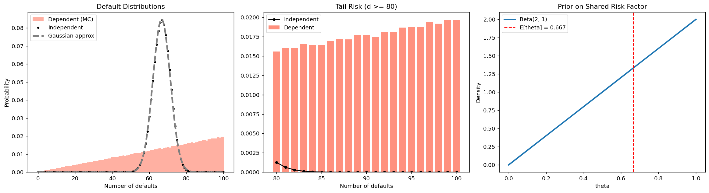

# 금융위기와 중심극한정리의 실패

## 개요

중심극한정리는 관측값들 사이의 독립성(적어도 약한 의존성)을 요구한다. 이 조건이 깨지면 중심극한정리가 극적으로 실패할 수 있고, Gaussian에 기반한 위험 모형은 극단 사건의 확률을 크게 과소평가하게 된다. 이 페이지에서는 서로 상관된 차입자 부도 모형을 통해 이를 보이며, 의존성이 정규근사로는 포착할 수 없는 두꺼운 꼬리 분포를 만들어 내는 과정을 살펴본다. 이 현상은 2008년 금융위기에서 중심적인 역할을 했다.

## 모형

$n = 100$명의 차입자가 있고 각자 부도가 나거나 나지 않는다고 하자. $X_i \in \{0, 1\}$일 때 전체 부도 건수를 $D = \sum_{i=1}^n X_i$라 하자.

### 독립인 경우

각 차입자가 고정된 확률 $\theta = 2/3$로 독립적으로 부도를 낸다:

$$
X_i \overset{\text{iid}}{\sim} \text{Bernoulli}(2/3)
$$

$$
D \sim \text{Binomial}(100,\; 2/3)
$$

중심극한정리가 적용된다:

$$
D \;\dot{\sim}\; N\!\left(n\theta,\; n\theta(1 - \theta)\right) = N\!\left(\frac{200}{3},\; \frac{200}{9}\right)
$$

### 의존하는 경우 (공통 위험 요인)

부도확률 자체가 확률변수이며 공통의 경제 요인을 반영한다:

$$
\theta \sim \text{Beta}(2, 1)
$$

$\theta$가 주어지면 부도는 서로 독립이다:

$$
X_i \mid \theta \overset{\text{iid}}{\sim} \text{Bernoulli}(\theta)
$$

그러나 **주변적으로는**(조건화하지 않으면) 같은 $\theta$를 공유하므로 부도들이 양의 상관을 갖는다.

!!! warning "핵심"
    조건부 독립 구조 $X_i \perp X_j \mid \theta$는 주변 독립성을 함의하지 **않는다**. 공유된 잠재 요인 $\theta$가 양의 의존성을 만들어 낸다: $i \ne j$에 대해 $\text{Cov}(X_i, X_j) > 0$.

## Beta 사전분포의 성질

$\text{Beta}(2, 1)$ 분포는 다음을 만족한다:

$$
E[\theta] = \frac{2}{3}, \qquad \text{Var}(\theta) = \frac{2}{36} = \frac{1}{18}
$$

pdf는 $\theta \in [0, 1]$에서 $f(\theta) = 2\theta$이며, 더 높은 부도확률에 더 큰 가중을 준다.

## 부도 건수의 주변분포

!!! abstract "이론적 PMF"
    $\theta \sim \text{Beta}(2, 1)$이고 $D \mid \theta \sim \text{Binomial}(n, \theta)$일 때 $D$의 주변 PMF는:

    $$
    P(D = d) = \int_0^1 \binom{n}{d} \theta^d (1-\theta)^{n-d} \cdot 2\theta \, d\theta = \frac{2(d+1)}{(n+1)(n+2)}
    $$

    이며 $d = 0, 1, \ldots, n$이다.

이는 $d$에 대해 거의 **선형으로 증가하는** 함수로, 좁게 모인 종 모양의 Binomial 분포와 극적으로 다르다.

## 꼬리 위험의 비교

각 모형에서 파국적 사건(100건 중 90건 초과 부도)이 일어날 확률:

| 모형 | $P(D > 90)$ |
|---|---|
| 독립 (Binomial) | $\approx 10^{-8}$ (무시할 만함) |
| Gaussian 근사 (중심극한정리) | $\approx 10^{-8}$ (무시할 만함) |
| 의존 (Beta 혼합) | $\approx 0.19$ (상당함) |

!!! danger "위험한 지점"
    의존 모형이 주는 꼬리 확률은 Gaussian 모형이 예측하는 값보다 **일곱 자릿수 가까이** 크다. 중심극한정리에 기반한 모형에서는 사실상 불가능해 보이는 사건이 의존 모형에서는 약 19%의 빈도로 일어난다. 이는 작은 보정이 아니라 Gaussian 틀의 질적인 실패이다.

## 모의실험 코드

<div class="codebox" markdown>

**예제 1.** 부도의 독립 여부에 따른 손실 분포

```python
import numpy as np
import matplotlib.pyplot as plt
from scipy import stats

np.random.seed(42)

n = 100          # 대출 100건
p = 2 / 3        # 각 건의 부도확률
n_sims = 500_000

# 경우 1: 부도가 서로 독립. 이항분포 그대로다.
d_indep = np.random.binomial(n, p, size=n_sims)

# 경우 2: 공통 위험요인이 있다.
# 매 시나리오마다 부도확률 theta 를 먼저 뽑고, 그 theta로 100건을 던진다.
# Beta(2,1)의 평균이 2/3 이므로 **평균 부도확률은 경우 1과 완전히 같다.**
# 달라지는 것은 오직 "모든 대출이 같은 theta를 공유한다"는 점뿐이다.
thetas = np.random.beta(2, 1, size=n_sims)
d_dep = np.array([np.random.binomial(n, th) for th in thetas])

# 꼬리 확률을 세 방법으로 비교한다.
# 평균은 셋 다 같은데 꼬리는 전혀 다르다는 것이 이 예제의 요점이다.
threshold = 90
p_indep = np.mean(d_indep > threshold)
p_dep = np.mean(d_dep > threshold)
# 중심극한정리에 기댄 정규근사. 위기 이전 모형이 쓰던 방식이다.
p_gauss = 1 - stats.norm.cdf(threshold, n * p, np.sqrt(n * p * (1 - p)))

print(f"P(D > {threshold}):")
print(f"  Independent:     {p_indep:.6f}")
print(f"  Gaussian approx: {p_gauss:.6f}")
print(f"  Dependent:       {p_dep:.6f}")
```

출력:

```
P(D > 90):
  Independent:     0.000000
  Gaussian approx: 0.000000
  Dependent:       0.187854
```

</div>

## 시각화

<div class="codebox" markdown>

**예제 2.** 세 분포를 나란히 보기

```python
fig, axes = plt.subplots(1, 3, figsize=(18, 5))

# 왼쪽: 세 분포 전체.
# 가운데(평균 근처)에서는 셋이 거의 겹쳐 보인다.
# 그래서 평균만 보고 모형을 고르면 차이를 알아채지 못한다.
ax = axes[0]
bins = np.arange(-0.5, n + 1.5, 1)
ax.hist(d_dep, bins=bins, density=True, alpha=0.5, color="tomato",
        label="Dependent (MC)")
d_vals = np.arange(0, n + 1)
ax.plot(d_vals, stats.binom.pmf(d_vals, n, p), "o", color="black",
        ms=3, label="Independent")
x_norm = np.linspace(0, n, 300)
ax.plot(x_norm, stats.norm.pdf(x_norm, n * p, np.sqrt(n * p * (1 - p))),
        "--", color="gray", lw=3, label="Gaussian approx")
ax.set_xlabel("Number of defaults")
ax.set_ylabel("Probability")
ax.set_title("Default Distributions")
ax.legend()

# 가운데: 꼬리만 확대(80건 이상).
# 여기서 세 분포가 완전히 갈라진다. 독립 가정과 정규근사는 사실상 0을 주고,
# 종속 모형만 무시할 수 없는 확률을 준다.
# **위험은 언제나 꼬리에 있다.**
ax = axes[1]
tail = range(80, n + 1)
mc_tail = [np.mean(d_dep == d) for d in tail]
ax.bar(list(tail), mc_tail, color="tomato", alpha=0.7, label="Dependent")
ax.plot(list(tail), stats.binom.pmf(list(tail), n, p), "ko-",
        ms=4, label="Independent")
ax.set_xlabel("Number of defaults")
ax.set_title("Tail Risk (d >= 80)")
ax.legend()

# 오른쪽: 공통 위험요인 theta의 분포.
# 이 분포가 넓다는 것이 종속성의 정체다.
# theta가 우연히 0.95쯤 나오는 시나리오에서는 100건이 거의 다 부도난다.
# 독립 모형에는 그런 시나리오 자체가 존재하지 않는다.
ax = axes[2]
theta_grid = np.linspace(0, 1, 300)
ax.plot(theta_grid, stats.beta.pdf(theta_grid, 2, 1), lw=2.5,
        label="Beta(2, 1)")
ax.axvline(p, color="red", linestyle="--", label=f"E[theta] = {p:.3f}")
ax.set_xlabel("theta")
ax.set_ylabel("Density")
ax.set_title("Prior on Shared Risk Factor")
ax.legend()

plt.tight_layout()
plt.show()
```

</div>



## 해석

!!! note "주요 관찰"

    1. **독립 모형**: $D$의 분포가 평균 $n\theta = 200/3 \approx 66.7$ 주위에 모여 있고 90을 넘는 꼬리의 확률은 무시할 만하다.
    2. **의존 모형**: 분포가 $D$의 모든 값에 걸쳐 거의 균등하며(실제로는 선형으로 증가한다), 양쪽 꼬리에 상당한 확률질량이 있다.
    3. **Gaussian 근사**: 독립 모형과는 잘 맞지만 의존 모형의 두꺼운 꼬리를 전혀 포착하지 못한다.
    4. **Beta 사전분포**: $\text{Beta}(2, 1)$이 $\theta > 0.9$에 무시할 수 없는 확률(약 19%)을 부여하므로, 공통 위험 요인이 거의 모든 차입자를 부도로 몰아갈 현실적인 가능성이 있다.

### 이것이 금융에서 왜 중요한가

2008년 금융위기 이전에 많은 위험 모형이 주택담보대출 부도를 근사적으로 독립인 사건으로 다루었다. 그 결과 Gaussian 코퓰러 모형은 꼬리 위험을 극적으로 과소평가했다. 여러 지역에서 주택 시장이 동시에 하락하자(공통 위험 요인) 부도들이 상관을 갖게 되었고, "평생 한 번" 있을 법한 손실이 모형의 예측보다 훨씬 자주 발생했다.

## 연습문제

<div class="drillbox" markdown>

**연습문제 1.** <span class="diff med" title="중간"></span> 독립 모형과 의존 모형 각각에 대해 $E[D]$와 $\text{Var}(D)$를 계산하라.

</div>

??? success "풀이"
    **독립 모형**: $D \sim \text{Binomial}(100, 2/3)$.

    $$
    E[D] = n\theta = \frac{200}{3} \approx 66.67, \qquad \text{Var}(D) = n\theta(1-\theta) = \frac{200}{9} \approx 22.22
    $$

    **의존 모형**: 전체 기댓값의 법칙과 전체 분산의 법칙을 사용한다.

    $$
    E[D] = E[E[D \mid \theta]] = E[n\theta] = n \cdot E[\theta] = 100 \cdot \frac{2}{3} = \frac{200}{3}
    $$

    평균은 동일하다. 분산은:

    $$
    \text{Var}(D) = E[\text{Var}(D \mid \theta)] + \text{Var}(E[D \mid \theta])
    $$

    $$
    = E[n\theta(1-\theta)] + \text{Var}(n\theta)
    $$

    $$
    = n(E[\theta] - E[\theta^2]) + n^2 \text{Var}(\theta)
    $$

    $\text{Beta}(2,1)$에서 $E[\theta] = 2/3$, $E[\theta^2] = E[\theta]^2 + \text{Var}(\theta) = 4/9 + 1/18 = 1/2$, $\text{Var}(\theta) = 1/18$이다.

    $$
    \text{Var}(D) = 100\!\left(\frac{2}{3} - \frac{1}{2}\right) + 100^2 \cdot \frac{1}{18} = 100 \cdot \frac{1}{6} + \frac{10000}{18} \approx 16.67 + 555.56 = 572.22
    $$

    평균은 같은데도 의존 모형의 분산이 독립 모형보다 **25배 크다**($572$ 대 $22$). $\square$

<div class="drillbox" markdown>

**연습문제 2.** <span class="diff med" title="중간"></span> $\theta \sim \text{Beta}(2, 1)$에 대해 주변 PMF $P(D = d) = 2(d+1) / [(n+1)(n+2)]$를 유도하라.

</div>

??? success "풀이"
    $$
    P(D = d) = \int_0^1 \binom{n}{d}\theta^d(1-\theta)^{n-d} \cdot 2\theta \, d\theta
    $$

    $$
    = 2\binom{n}{d}\int_0^1 \theta^{d+1}(1-\theta)^{n-d} \, d\theta
    $$

    이 적분은 베타함수 $B(d+2, n-d+1) = \frac{\Gamma(d+2)\Gamma(n-d+1)}{\Gamma(n+3)} = \frac{(d+1)!(n-d)!}{(n+2)!}$이다.

    $$
    P(D = d) = 2 \cdot \frac{n!}{d!(n-d)!} \cdot \frac{(d+1)!(n-d)!}{(n+2)!} = 2 \cdot \frac{n! \cdot (d+1)}{(n+2)!}
    $$

    $$
    = 2 \cdot \frac{(d+1)}{(n+1)(n+2)}
    $$

    확인해 보면 $\sum_{d=0}^n \frac{2(d+1)}{(n+1)(n+2)} = \frac{2}{(n+1)(n+2)} \cdot \sum_{d=0}^n (d+1) = \frac{2}{(n+1)(n+2)} \cdot \frac{(n+1)(n+2)}{2} = 1$이다. $\square$

<div class="drillbox" markdown>

**연습문제 3.** <span class="diff med" title="중간"></span> 임의의 두 차입자의 부도 사이의 주변 공분산이 $i \ne j$에 대해 $\text{Cov}(X_i, X_j) = \text{Var}(\theta)$임을 보여라. $\theta \sim \text{Beta}(2, 1)$에 대해 이를 계산하라.

</div>

??? success "풀이"
    $i \ne j$에 대해:

    $$
    E[X_i X_j] = E[E[X_i X_j \mid \theta]] = E[\theta \cdot \theta] = E[\theta^2]
    $$

    (조건부 독립성을 사용했다: $E[X_i X_j \mid \theta] = E[X_i \mid \theta] \cdot E[X_j \mid \theta] = \theta^2$.)

    $$
    E[X_i] \cdot E[X_j] = (E[\theta])^2
    $$

    따라서:

    $$
    \text{Cov}(X_i, X_j) = E[\theta^2] - (E[\theta])^2 = \text{Var}(\theta)
    $$

    $\theta \sim \text{Beta}(2, 1)$에 대해:

    $$
    \text{Cov}(X_i, X_j) = \text{Var}(\theta) = \frac{2 \cdot 1}{(2+1)^2(2+1+1)} = \frac{2}{36} = \frac{1}{18} \approx 0.0556
    $$

    이 양의 공분산이 두꺼운 꼬리의 원천이다. $\square$

<div class="drillbox" markdown>

**연습문제 4.** <span class="diff med" title="중간"></span> 대신 $\theta \sim \text{Beta}(20, 10)$이라면(여전히 $E[\theta] = 2/3$이지만 변동성이 훨씬 작다) $\text{Var}(\theta)$와 $\text{Var}(D)$를 다시 계산하라. 공통 위험 요인의 변동성을 줄이면 꼬리 위험은 어떻게 되는가?

</div>

??? success "풀이"
    $\theta \sim \text{Beta}(20, 10)$에서 $\alpha = 20$, $\beta = 10$이다.

    $$
    E[\theta] = \frac{20}{30} = \frac{2}{3}, \qquad \text{Var}(\theta) = \frac{20 \cdot 10}{30^2 \cdot 31} = \frac{200}{27900} \approx 0.00717
    $$

    전체 분산 공식을 사용하면:

    $$
    \text{Var}(D) = n(E[\theta] - E[\theta^2]) + n^2\text{Var}(\theta)
    $$

    $E[\theta^2] = \text{Var}(\theta) + (E[\theta])^2 = 0.00717 + 4/9 \approx 0.4516$이다.

    $$
    \text{Var}(D) = 100(0.6667 - 0.4516) + 10000 \times 0.00717 = 21.51 + 71.68 = 93.19
    $$

    비교하면 독립 모형은 $\text{Var}(D) = 22.2$, $\text{Beta}(2,1)$은 572, $\text{Beta}(20,10)$은 93이다.

    $\theta$의 변동성이 작아지면 (여전히 독립인 경우보다는 크지만) 꼬리 위험이 크게 줄어든다. $\text{Beta}(20, 10)$ 분포는 $\theta$를 $2/3$ 근처에 모으므로 극단적인 시나리오($\theta > 0.9$)가 매우 드물어진다. 이 모형은 독립인 경우($\text{Var}(\theta) = 0$)와 의존성이 강한 $\text{Beta}(2, 1)$ 사이를 잇는다. $\square$

<div class="drillbox" markdown>

**연습문제 5.** <span class="diff med" title="중간"></span> 2008년 이전 신용평가사들이 사용한 Gaussian 코퓰러 모형이 왜 실패했는지 쉬운 말로 설명하라. 어떤 가정이 가장 결정적으로 위배되었는가?

</div>

??? success "풀이"
    Gaussian 코퓰러 모형은 차입자의 부도가 개별 요인에 의해 결정되고 상관은 약할 뿐이라고 가정하며, 이를 다변량 정규 의존 구조로 모형화했다. 이 틀에서는 다변량 정규분포의 꼬리가 (지수적으로 감소하여) 가볍기 때문에 많은 부도가 동시에 일어날 확률(꼬리 사건)이 무시할 만했다.

    가장 결정적으로 위배된 가정은 **상관 구조가 적절하다는 가정**이다. 구체적으로:

    1. **공통 시스템 위험**: 이 모형은 차입자의 부도가 공통의 경제 요인(주택 가격, 금리, 고용)과 얼마나 강하게 연결되어 있는지를 과소평가했다. 전국적으로 주택 가격이 하락하자 부도들이 높은 상관을 갖게 되었다.

    2. **정규분포의 가벼운 꼬리**: Gaussian 코퓰러는 "꼬리 의존성", 즉 극단 사건(다수의 부도)이 함께 일어나는 경향을 포착하지 못한다. 실제 부도 의존성은 정규분포가 함의하는 것보다 훨씬 두꺼운 꼬리를 갖는다.

    3. **고정된 상관계수**: 상관 모수가 경제가 온건하던 시기의 자료로 추정되어, 위기 동안 상관이 급격히 커지는 현상(상관 붕괴 또는 "상관 스마일")을 반영하지 못했다.

    그 결과 예측 확률이 $10^{-8}$(사실상 불가능)이던 사건이 실제로는 $10^{-2}$에 가까운 확률로 일어났고, 이는 위험을 백만 배 과소평가한 것이다. Gaussian 모형에 근거해 "안전"하다고 평가받은 주택저당증권을 보유한 기관들은 이로 인해 파국적인 손실을 입었다. $\square$

---

## 정리하며

중심극한정리는 **독립성**(적어도 약한 의존성)을 요구한다. 이 조건이 깨지면 정규근사가 극적으로 실패한다.

- **같은 평균, 전혀 다른 꼬리.** 부도확률 $\theta$ 를 고정하면 $D\sim\text{Binomial}(100,2/3)$ 이고 정규근사가 잘 듣는다. $\theta$ 자체를 베타분포로 두어 공통 요인을 넣으면 평균은 그대로인데 분포가 넓게 퍼지고 꼬리가 두꺼워진다.
- **의존성의 출처가 공통 요인이다.** 차입자들이 서로를 보고 부도를 내는 것이 아니라, **모두가 같은 경기에 노출되어 있다는 사실**만으로 상관이 생긴다. 조건부로는 독립이지만 주변적으로는 독립이 아니다(3장 조건부 독립).
- **분산이 어떻게 커지는가.** 3장 왈드 항등식의 분산 공식과 같은 구조다. $\theta$ 의 변동이 더해지는 항이 생기고, 그 항이 이항 변동을 압도한다.
- **실무적 함의.** 정규 가정 아래 계산한 $99.9\%$ 분위수(VaR)가 실제 위험을 여러 배 과소평가한다. **"전부 동시에 나빠질 확률"을 0 으로 보는 모형이 위기에서 무너지는 이유가 이것이다.**

**2008년이 이 계산을 현실에서 보여 주었다.** 개별 대출의 부도 확률은 잘 추정되어 있었지만 그것들이 **함께** 움직인다는 사실이 모형에서 빠져 있었다.

다음 절부터는 다시 표준적인 경우로 돌아가, 여러 모집단에서 $\bar X$ 와 $S^2$ 의 표본분포를 하나씩 확인한다.
