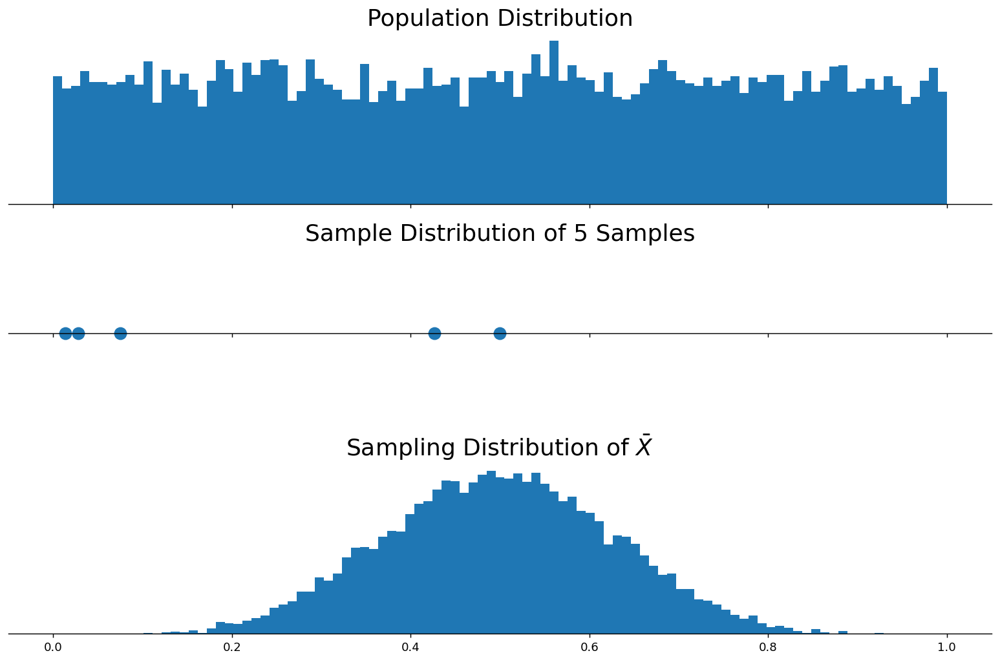
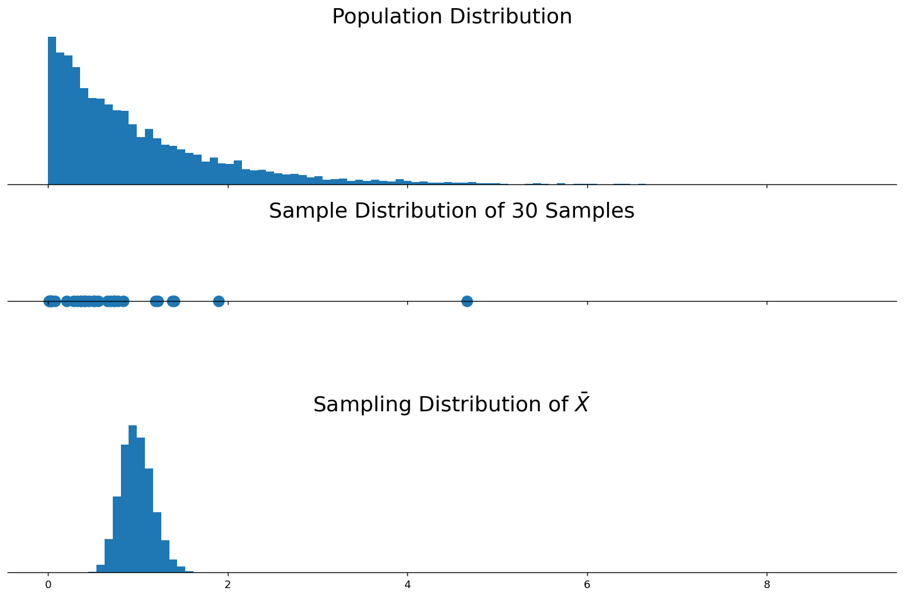
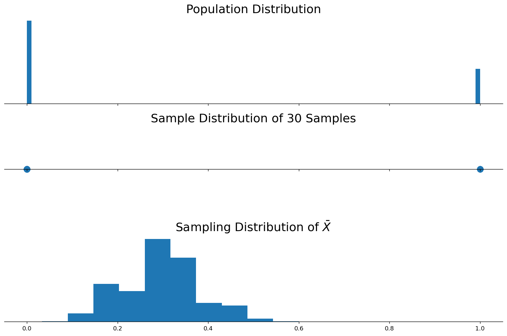
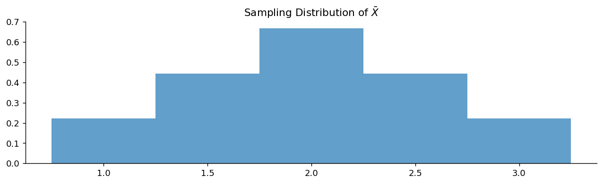

# 반복추출 개념

## 개요

**표본분포**는 확률표본에 기반한 어떤 통계량의 확률분포이다. 같은 모집단에서 여러 개의 확률표본을 뽑아 각 표본마다 통계량(표본평균이나 표본비율 등)을 계산하면, 그 값들이 하나의 분포를 이룬다. 이 분포를 그 통계량의 **표본분포**라 한다.

$$
\left.
\begin{array}{ccccc}
\text{Population} &\rightarrow& \text{Sample } \mathbf{x}_1 &\rightarrow& \hat{\theta}(\mathbf{x}_1) \\
\\
\text{Population} &\rightarrow& \text{Sample } \mathbf{x}_2 &\rightarrow& \hat{\theta}(\mathbf{x}_2) \\
&\vdots& & & \\
\text{Population} &\rightarrow& \text{Sample } \mathbf{x}_n &\rightarrow& \hat{\theta}(\mathbf{x}_n) \\
&\vdots& & &
\end{array}
\right\}
\;\;
\begin{array}{c}
\text{Sampling Distribution:} \\
\text{Distribution of } \hat{\theta}(\mathbf{x}_1), \hat{\theta}(\mathbf{x}_2), \cdots, \hat{\theta}(\mathbf{x}_n), \cdots \\
\text{or Distribution of } \hat{\theta}(\mathbf{x})
\end{array}
$$

## 표본분포는 왜 중요한가?

표본분포는 표본을 바탕으로 모집단에 관한 결론을 내리는 추론통계학의 근본이다. 여러 표본에 걸친 통계량의 거동을 이해하면 다음을 할 수 있다:

- 표본에서 얻은 통계량으로 **모수를 추정**한다 (예: 평균, 분산).
- 추정량의 변동성을 파악하기 위해 **표준오차를 계산**한다.
- 추정의 불확실성을 정량화하기 위해 **신뢰구간을 구성**한다.
- 모수에 관해 근거 있는 판단을 내리기 위해 **가설검정을 수행**한다.

## 구별해야 할 세 가지 분포

### 모집단 분포, 표본 분포, 표본분포

**모집단 분포**는 모집단 전체에서 어떤 변수가 가질 수 있는 모든 값의 분포를 나타낸다. 표본을 뽑아 오는 모집단을 특징짓는 밑바탕의 분포이다.

**표본 분포**는 모집단에서 뽑은 특정한 하나의 표본 안에 있는 값들의 분포를 가리킨다. 표본은 모집단의 부분집합이며, 이를 사용해 모집단 전체에 관한 추론을 한다.

**표본분포**는 모집단에서 뽑은 같은 크기의 여러 표본으로부터 계산한 통계량(표본평균이나 표본비율 등)의 분포를 기술한다. 통계량의 변동성을 이해하게 해 주며 통계적 추론의 중심이 된다.

$$
\begin{array}{ccccccc}
\text{Population}
&\rightarrow&
\text{Sample } \mathbf{x}
&\rightarrow&
\text{Estimate } \hat{\theta}(\mathbf{x}) \\
\uparrow && \uparrow && \uparrow \\
\text{Population Distribution:} && \text{Sample Distribution:} && \text{Sampling Distribution:} \\
\text{Distribution of} && \text{Distribution of} && \text{Distribution of} \\
\text{Whole Population} && \text{Numbers in Particular Sample } \mathbf{x} && \text{Infinitely Many Estimates } \hat{\theta}(\mathbf{x}_i)
\end{array}
$$

## 모의실험 1: 균등 모집단

<div class="codebox" markdown>

### 예제 1. 균등 모집단에서 반복추출 { .eg }

```python
import matplotlib.pyplot as plt
import numpy as np

# 같은 결과가 다시 나오도록 난수 씨앗을 고정한다.
np.random.seed(1)

# 모집단 크기, 표본크기, 반복 횟수를 정한다.
sample_size = 5        # Size of a single random sample
n_samples = 10_000     # Number of samples to draw for the sampling distribution
n_population = 10_000  # Size of the population to simulate

def plot_distributions():
    """
    Generates a plot showing the population distribution, sample distribution,
    and sampling distribution.
    """
    # 균등분포에서 큰 모집단을 만든다. 10만 개면 사실상 무한 모집단으로 본다.
    population = np.random.uniform(size=(n_population,))

    # 모집단에서 표본 하나를 뽑는다. 가운데 패널에 그릴 자료다.
    single_sample = np.random.choice(population, size=sample_size, replace=False)

    # 같은 일을 여러 번 되풀이하며 그때마다 표본평균을 기록한다.
    sample_means = [
        np.mean(np.random.choice(population, size=sample_size, replace=False))
        for _ in range(n_samples)
    ]

    # 세 칸을 위아래로 놓는다. 모집단 → 표본 하나 → 표집분포 순이다.
    fig, (ax0, ax1, ax2) = plt.subplots(3, 1, figsize=(12, 8), sharex=True)

    # 첫째 칸: 모집단의 모양.
    ax0.hist(population, bins=np.linspace(0, 1, 100))
    ax0.set_title('Population Distribution', fontsize=20)

    # 둘째 칸: 표본 하나를 점으로 흩뿌린다.
    ax1.scatter(single_sample, np.zeros_like(single_sample), s=100)
    ax1.set_title(f'Sample Distribution of {sample_size} Samples', fontsize=20)

    # 셋째 칸: 표본평균들의 히스토그램, 곧 표집분포다.
    ax2.hist(sample_means, bins=np.linspace(0, 1, 100))
    ax2.set_title('Sampling Distribution of $\\bar{X}$', fontsize=20)

    # 축 이름과 간격을 다듬는다.
    for ax in (ax0, ax1, ax2):
        ax.spines['left'].set_visible(False)
        ax.spines['right'].set_visible(False)
        ax.spines['top'].set_visible(False)
        ax.spines['bottom'].set_position('zero')
        ax.set_yticks([])

    plt.tight_layout()
    plt.show()

if __name__ == "__main__":
    plot_distributions()
```



**관찰.** 모집단이 균등분포(평평한 모양)임에도 $\bar{X}$의 표본분포는 종 모양이고 훨씬 좁게 모여 있다. 중심극한정리를 미리 엿보는 셈이다.

</div>

## 모의실험 2: 지수 모집단

<div class="codebox" markdown>

### 예제 2. 지수 모집단에서 반복추출 { .eg }

```python
import matplotlib.pyplot as plt
import numpy as np
from scipy import stats

# 같은 결과가 다시 나오도록 난수 씨앗을 고정한다.
np.random.seed(1)

# 모집단 크기, 표본크기, 반복 횟수를 정한다.
sample_size = 30
n_samples = 10_000
n_population = 10_000

def plot_distributions():
    """
    Generates a plot showing the population distribution, sample distribution,
    and sampling distribution for an exponential population.
    """
    # 지수분포에서 큰 모집단을 만든다. 오른쪽으로 길게 늘어진 모양이다.
    population = stats.expon().rvs((n_population,))

    # 모집단에서 표본 하나를 뽑는다. 가운데 패널에 그릴 자료다.
    single_sample = np.random.choice(population, size=sample_size, replace=False)

    # 같은 일을 여러 번 되풀이하며 그때마다 표본평균을 기록한다.
    sample_means = [
        np.mean(np.random.choice(population, size=sample_size, replace=False))
        for _ in range(n_samples)
    ]

    # 세 칸을 위아래로 놓는다. 모집단 → 표본 하나 → 표집분포 순이다.
    fig, (ax0, ax1, ax2) = plt.subplots(3, 1, figsize=(12, 8), sharex=True)

    # 첫째 칸: 모집단의 모양.
    _, bins, _ = ax0.hist(population, bins=100)
    ax0.set_title('Population Distribution', fontsize=20)

    # 둘째 칸: 표본 하나를 점으로 흩뿌린다.
    ax1.scatter(single_sample, np.zeros_like(single_sample), s=100)
    ax1.set_title(f'Sample Distribution of {sample_size} Samples', fontsize=20)

    # 셋째 칸: 표본평균들의 히스토그램, 곧 표집분포다.
    ax2.hist(sample_means, bins=bins)
    ax2.set_title('Sampling Distribution of $\\bar{X}$', fontsize=20)

    # 축 이름과 간격을 다듬는다.
    for ax in (ax0, ax1, ax2):
        ax.spines['left'].set_visible(False)
        ax.spines['right'].set_visible(False)
        ax.spines['top'].set_visible(False)
        ax.spines['bottom'].set_position('zero')
        ax.set_yticks([])

    plt.tight_layout()
    plt.show()

if __name__ == "__main__":
    plot_distributions()
```



**관찰.** 지수 모집단은 오른쪽으로 심하게 치우쳐 있지만, $n = 30$일 때 $\bar{X}$의 표본분포는 근사적으로 정규분포이다. 중심극한정리가 작동하는 모습이다.

</div>

## 모의실험 3: Bernoulli 모집단

<div class="codebox" markdown>

### 예제 3. 베르누이 모집단에서 반복추출 { .eg }

```python
import matplotlib.pyplot as plt
import numpy as np
from scipy import stats

# 같은 결과가 다시 나오도록 난수 씨앗을 고정한다.
np.random.seed(1)

# 모집단 크기, 표본크기, 반복 횟수를 정한다.
sample_size = 30
n_samples = 10_000
n_population = 10_000

def plot_distributions():
    """
    Generates a plot showing the population distribution, sample distribution,
    and sampling distribution for a Bernoulli population.
    """
    # 베르누이 모집단을 만든다. 값은 0과 1 둘뿐이다.
    population = stats.binom(n=1, p=0.3).rvs((n_population,))

    # 모집단에서 표본 하나를 뽑는다. 가운데 패널에 그릴 자료다.
    single_sample = np.random.choice(population, size=sample_size, replace=False)

    # 같은 일을 여러 번 되풀이하며 그때마다 표본평균을 기록한다.
    sample_means = [
        np.mean(np.random.choice(population, size=sample_size, replace=False))
        for _ in range(n_samples)
    ]

    # 세 칸을 위아래로 놓는다. 모집단 → 표본 하나 → 표집분포 순이다.
    fig, (ax0, ax1, ax2) = plt.subplots(3, 1, figsize=(12, 8), sharex=True)

    # 첫째 칸: 모집단의 모양.
    _, bins, _ = ax0.hist(population, bins=100)
    ax0.set_title('Population Distribution', fontsize=20)

    # 둘째 칸: 표본 하나를 점으로 흩뿌린다.
    ax1.scatter(single_sample, np.zeros_like(single_sample), s=100)
    ax1.set_title(f'Sample Distribution of {sample_size} Samples', fontsize=20)

    # 셋째 칸: 표본평균들의 히스토그램, 곧 표집분포다.
    ax2.hist(sample_means, bins=10)
    ax2.set_title('Sampling Distribution of $\\bar{X}$', fontsize=20)

    # 축 이름과 간격을 다듬는다.
    for ax in (ax0, ax1, ax2):
        ax.spines['left'].set_visible(False)
        ax.spines['right'].set_visible(False)
        ax.spines['top'].set_visible(False)
        ax.spines['bottom'].set_position('zero')
        ax.set_yticks([])

    plt.tight_layout()
    plt.show()

if __name__ == "__main__":
    plot_distributions()
```



</div>

## 예: 공 세 개에서 두 개를 뽑을 때의 표본분포

> **출처:** [Khan Academy — Introduction to Sampling Distributions](https://www.khanacademy.org/math/ap-statistics/sampling-distribution-ap/what-is-sampling-distribution/v/introduction-to-sampling-distributions)

<div class="probox" markdown>

**문제.** <span class="diff easy" title="쉬움"></span> 항아리에 1, 2, 3번이 매겨진 공 세 개가 있다. 모평균은 $\mu = 2$이다. 복원추출로 공 두 개를 뽑아 평균을 구한다. 이 표본평균의 분포, 즉 $\bar{X}$의 표본분포를 구하라.

</div>

??? success "풀이"
    동일한 확률을 갖는 $3^2 = 9$가지 결과가 있다:

    ```python
    import itertools as it
    import matplotlib.pyplot as plt
    import numpy as np
    import pandas as pd

    def main():
        sample_space = np.array([1, 2, 3])

        # 표본이 아주 작아 **가능한 모든 경우를 다 적을 수 있다.**
        # product(..., repeat=2) 가 복원추출로 두 개를 뽑는 3^2 = 9가지를 만든다.
        # 모의실험이 아니라 완전열거이므로 여기서 얻는 표집분포는 근사가 아니라 정확하다.
        columns = ["first", "second", "average"]
        df = pd.DataFrame(columns=columns)
        for first, second in it.product(sample_space, repeat=2):
            dg = pd.DataFrame([[first, second, (first + second) / 2]], columns=columns)
            df = pd.concat([df, dg], ignore_index=True)
        print(df, end="\n\n")

        fig, ax = plt.subplots(figsize=(12, 3))
        # 표본평균이 1, 1.5, 2, 2.5, 3 다섯 값만 가지므로 구간 경계를
        # 값에서 0.25씩 왼쪽으로 밀어 각 값이 자기 막대 가운데에 오게 한다.
        bins = np.array([1.0, 1.5, 2.0, 2.5, 3.0, 3.5]) - 0.25
        ax.hist(df.average, bins=bins, density=True, alpha=0.7)
        ax.set_title(r"Sampling Distribution of $\bar{X}$")
        ax.spines["top"].set_visible(False)
        ax.spines["right"].set_visible(False)
        plt.show()

    if __name__ == "__main__":
        main()
    ```

    출력:

    ```
      first second  average
    0     1      1      1.0
    1     1      2      1.5
    2     1      3      2.0
    3     2      1      1.5
    4     2      2      2.0
    5     2      3      2.5
    6     3      1      2.0
    7     3      2      2.5
    8     3      3      3.0
    ```

    

    표본분포가 가질 수 있는 값은 $\{1.0, 1.5, 2.0, 2.5, 3.0\}$이고 확률은 $\{1/9, 2/9, 3/9, 2/9, 1/9\}$이다. 평균은 $E[\bar{X}] = 2 = \mu$이며, $\bar{X}$가 불편임을 확인해 준다.
## 연습문제

<div class="drillbox" markdown>

**연습문제 1.** <span class="diff easy" title="쉬움"></span>
어떤 모집단의 평균이 100이고 표준편차가 20이다. 표본크기 $n$이 커질 때 (a) $\bar X$의 표본분포의 평균, (b) 표준오차, (c) 하나의 표본평균 $\bar x$는 각각 어떻게 되는가?

</div>

??? success "풀이"
    (a) **표본분포의 평균**은 모든 $n$에 대해 모평균 100이다. 표본크기와 무관하게 표본분포는 $\mu$를 중심으로 하며, $\bar X$는 *불편*이다.

    (b) **표준오차**는 $\sigma/\sqrt n = 20/\sqrt n$이다. $n$이 커질수록 줄어든다: $n = 4 \to \mathrm{SE} = 10$; $n = 100 \to \mathrm{SE} = 2$; $n = 10000 \to \mathrm{SE} = 0.2$.

    (c) **하나의 표본평균** $\bar x$는 약한 큰수의 법칙에 의해 100으로 확률수렴하고, 강한 큰수의 법칙에 의해 거의 확실하게 수렴한다. 표본분포가 좁아진다는 것은 개별 $\bar x$가 100에 가까울 가능성이 점점 커진다는 뜻이다.

<div class="drillbox" markdown>

**연습문제 2.** <span class="diff med" title="중간"></span>
**표준오차와 표준편차.** 예를 들어 그 구별을 설명하라. 표준오차는 왜 $\sigma$가 아니라 항상 $\sigma / \sqrt n$인가?

</div>

??? success "풀이"
    **표준편차 $\sigma$:** *모집단*(또는 하나의 표본)의 퍼짐을 잰다. 개별 관측값이 얼마나 흩어져 있는지를 기술한다.

    **표준오차 $\sigma/\sqrt n$:** *통계량의 표본분포*(보통 표본평균)의 퍼짐을 잰다. $\bar X$가 표본마다 얼마나 달라지는지를 기술한다.

    서로 다른 두 양이다. "SD = 5"라고 보고하는 것은 자료를 기술하는 것이고, "SE = 0.5"라고 보고하는 것은 추정값에 대한 불확실성을 기술하는 것이다.

    **평균에서 왜 $\sigma/\sqrt n$인가?** i.i.d. 자료에 대해 $\mathrm{Var}(\bar X) = \mathrm{Var}((1/n)\sum X_i) = (1/n^2) \cdot n\sigma^2 = \sigma^2/n$임을 떠올리자. 제곱근을 취하면 SE $= \sigma/\sqrt n$이다. $\sqrt n$ 비율은 "제곱근 개선의 법칙"이다. 표본을 네 배로 늘리면 표준오차가 절반이 된다.

<div class="drillbox" markdown>

**연습문제 3.** <span class="diff med" title="중간"></span>
**비복원추출.** 평균이 $\mu$, 분산이 $\sigma^2$인 크기 $N$의 유한모집단에서 $n$개를 *비복원*으로 뽑을 때 $\bar X$의 분산을 유도하라.

</div>

??? success "풀이"
    $\mathrm{Var}(\bar X) = \frac{\sigma^2}{n} \cdot \frac{N - n}{N - 1}$이며, 뒤의 인수를 **유한모집단 수정(FPC)** 계수라 한다.

    유도: $X_i$들은 더 이상 독립이 아니지만(두 번째 추출이 첫 번째에 의존한다) 교환 가능하다. 합의 분산을 계산하면:

    $\mathrm{Var}(\sum X_i) = n\sigma^2 + n(n-1) \mathrm{Cov}(X_1, X_2)$이다. 대칭성에 의해 $\sum_{i \ne j} \mathrm{Cov}(X_i, X_j) = -\mathrm{Var}(\sum X_i^{\text{total}})/(N-1)$이므로 $\mathrm{Cov}(X_1, X_2) = -\sigma^2/(N-1)$이다.

    따라서 $\mathrm{Var}(\sum X_i) = n\sigma^2(N-n)/(N-1)$이고, $n^2$으로 나누면 FPC 공식을 얻는다.

    **실무:** $n/N \le 0.05$이면 FPC가 1에 가까워 무시할 수 있다. $n/N$이 상당히 크면(감사, 재검표 등) FPC가 중요하며 표준오차 공식에 반드시 포함해야 한다.

<div class="drillbox" markdown>

**연습문제 4.** <span class="diff hard" title="어려움"></span>
**점근분포와 정확한 분포.** $\mathrm{Uniform}(0, 1)$에서 크기 $n = 5$인 표본을 뽑을 때 $\bar X$의 정확한 분포는 알려져 있다(척도조정된 Irwin-Hall 분포). 그 모양을 그려 보고 중심극한정리가 예측하는 정규근사와 비교하라.

</div>

??? success "풀이"
    **정확한 분포:** i.i.d. Uniform(0, 1) 다섯 개의 합은 $[0, 5]$ 위의 Irwin-Hall 분포이다. 4차 조각별 다항식이고 종 모양이며 2.5를 중심으로 대칭이다. $1/5$로 척도조정하면 $[0, 1]$ 위의 $\bar X$가 되고 $1/2$에서 정점을 이룬다.

    **중심극한정리 근사:** $\bar X \approx N(1/2, 1/(12 \cdot 5)) = N(0.5, 0.0167)$이고 표준편차는 $\approx 0.129$이다.

    **비교:** 정확한 분포는 $[0, 1]$에서 유계이지만 정규분포는 $\pm \infty$까지 뻗는다. 중앙에서는 둘이 거의 같고, 꼬리에서는 정확한 분포가 $[0, 1]$ 밖에서 확률 0인 반면 정규분포는 그곳에 작은 양의 확률(0 아래 또는 1 위로 약 0.001)을 준다.

    $n = 5$에서 이미 근사가 꽤 좋다. 균등분포의 대칭성과 유계 지지집합 덕분에 중심극한정리 수렴이 매우 빠르다. 반면 Exponential(1)에서 크기 5인 표본이라면 $\bar X$의 분포가 눈에 띄게 치우쳐 정규분포와 거리가 멀 것이다.

<div class="drillbox" markdown>

**연습문제 5.** <span class="diff med" title="중간"></span>
중심극한정리에서의 **수렴은 각 점에서의 수렴이 아니라 분포수렴이다.** 분포수렴을 정의하고 왜 이것이 중심극한정리에 알맞은 개념인지 설명하라.

</div>

??? success "풀이"
    **분포수렴:** $X_n \xrightarrow{d} X$일 필요충분조건은 $F_X$의 모든 연속점 $x$에서 $F_{X_n}(x) \to F_X(x)$인 것이다.

    이는 확률변수 자체가 아니라 *분포*에 관한 서술이다. $X_n$과 $X$가 같은 확률공간 위에 정의될 필요도 없다. CDF가 수렴하기만 하면 된다.

    **왜 중심극한정리에 알맞은가:** 중심극한정리는 $\sqrt n (\bar X_n - \mu)/\sigma$의 분포를 고정된 정규분포와 비교한다. $\bar X_n$의 실현값이 어떤 특정한 정규확률변수로 수렴한다고 주장하는 것이 아니라, 오직 그 *분포*가 정규분포에 가까워진다고 말하는 것이다. 실현되는 경로마다 극한 거동이 다르지만 안정되는 것은 분포이다.

    거의 확실한 수렴과의 구별: $\bar X_n \to \mu$는 거의 확실하게 성립하지만(각 경로가 수렴한다), $\sqrt n (\bar X_n - \mu)$는 어디에서도 거의 확실하게 수렴하지 *않는다*. 계속 요동치는 가운데 그 *분포*만 정규분포에 가까워진다. 더 강한 형태 없이 오직 분포수렴만 성립하는 것이다.

<div class="drillbox" markdown>

**연습문제 6.** <span class="diff med" title="중간"></span>
**모의실험.** 임의의 모집단에서 $\bar X$의 표본분포를 *시각화*하는 방법을 서술하라. $n = 5, 30, 100$에 대해 어떤 그림 세 개를 그리겠는가?

</div>

??? success "풀이"
    **절차:** 모집단에서 크기 $n$인 표본을 뽑아 $\bar X$를 계산한다. 이를 $B$번 반복한다(예: $B = 10000$). 그 결과 얻은 $B$개의 값이 표본분포를 근사한다.

    $n = 5, 30, 100$에 대한 **그림 세 개**:

    1. $\bar X$의 $B$개 값에 대한 **히스토그램**에 이론적 정규분포 $N(\mu, \sigma^2/n)$을 겹쳐 그린다. 중심극한정리 근사의 품질을 눈으로 확인한다.
    2. 이론적 정규분포에 대한 **Q-Q 그림**: 중심극한정리 근사가 잘 맞으면 점들이 직선 위에 놓인다.
    3. 세 히스토그램을 나란히(또는 위아래로) 놓는 **삼중 비교**: (a) 중심이 $\mu$에 머물고, (b) 퍼짐이 $\sigma/\sqrt n$로 줄어들며, (c) 모양이 점점 정규분포에 가까워짐을 시각적으로 확인한다.

    **이런 모의실험에서 얻는 주요 관찰:**

    - 대칭인 모집단(균등, 정규)에서는 $n = 5$만으로도 근사적 정규성이 충분할 수 있다.
    - 치우친 모집단(지수, 로그정규)에서는 관례적으로 $n = 30$을 기준으로 삼지만 여전히 치우침이 눈에 띌 수 있다.
    - 꼬리가 두꺼운 모집단(Cauchy, $t_1$)에서는 어떤 $n$으로도 정규성이 나타나지 않는다. 중심극한정리는 유한한 분산을 요구한다.

    이런 모의실험 기반 진단이 "$n \ge 30$" 같은 경험 법칙을 무턱대고 적용하는 것보다 훨씬 믿을 만하다.

---

## 정리하며

**표본분포**는 통계량 자체의 분포다. 이 개념이 5장 전체이자 뒤에 나올 모든 추론의 토대다.

- **세 분포를 혼동하지 말 것.** 모집단분포(개별 관측이 흩어진 모양), 하나의 표본의 분포(실제로 손에 쥔 자료), 통계량의 표본분포(같은 크기의 표본을 무한히 반복했을 때 $\hat\theta$ 가 흩어지는 모양)는 서로 다르다. **셋 중 실제로 관측되는 것은 두 번째뿐이다.**
- **모의실험이 보여 준 것.** 균등·지수·베르누이 어느 모집단에서 출발하든 $\bar X$ 의 표본분포는 종 모양으로 다가간다. 모집단 모양은 씻겨 나가고 남는 것은 중심과 폭이다.
- **중심은 $\mu$ 로 유지되고 폭은 $\sigma/\sqrt n$ 으로 줄어든다.** 앞의 것이 불편성이고 뒤의 것이 정밀도다.
- **유한모집단에서는 정확히 셀 수 있다.** 공 세 개에서 두 개를 뽑는 예처럼 가능한 모든 표본을 나열하면 표본분포를 근사가 아니라 그대로 얻는다. 개념을 확인하기에 가장 좋은 방법이다.

**"반복추출"은 사고실험이다.** 현실에서 표본은 하나뿐이며, 그 하나가 어느 정도 흔들릴 수 있었는지를 말해 주는 것이 표본분포다. 신뢰구간과 $p$ 값의 의미가 모두 이 가상의 반복 위에 서 있다.

다음 절 **금융위기와 중심극한정리의 실패**는 이 그림이 언제 무너지는지를 본다. 관측들이 서로 독립이 아니면 표본분포가 정규로 가지 않는다.
