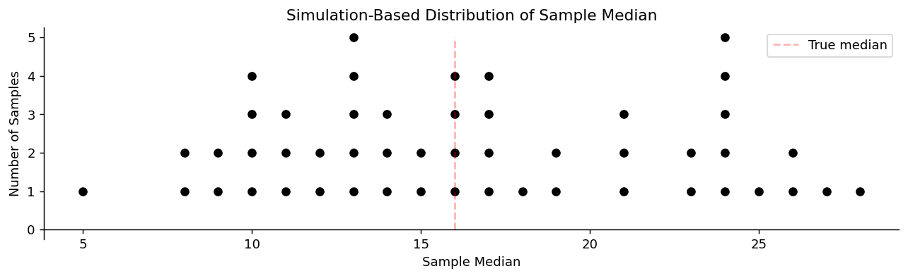
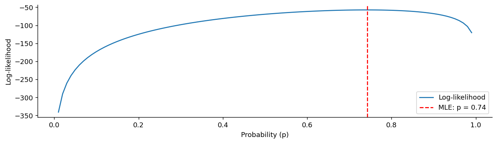
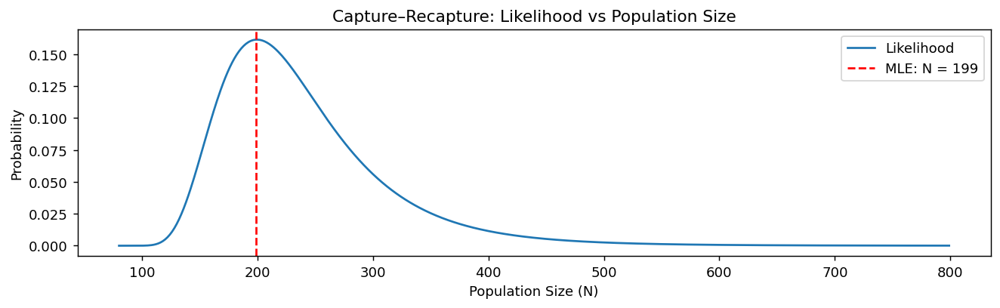

# 확률변수로서의 통계량

## 개요

자료를 하나 받아 평균을 계산하면 숫자 하나가 나온다. 이를테면 68.3이다. 그 숫자를 적어 두고 "이 자료의 평균은 68.3"이라고 말하면 할 일이 끝난 것 같다.

그런데 같은 모집단에서 표본을 **다시** 뽑아 평균을 내면 68.3이 나오지 않는다. 67.9가 나오고, 또 뽑으면 69.1이 나온다. 모집단은 그대로인데 계산한 값이 매번 달라진다. 달라지게 만든 것은 모집단이 아니라 **누가 표본에 뽑혔는가**이다.

이 단순한 관찰이 5장 전체의 출발점이다. 표본에서 계산한 값은 고정된 수가 아니라 **표본이 바뀌면 함께 바뀌는 양**, 곧 확률변수다. 그 값들이 어떻게 흩어지는지를 다루는 것이 표본분포 이론이고, 신뢰구간과 가설검정은 모두 그 위에 서 있다.

## 뽑기 전과 뽑은 뒤

절차를 그림으로 적으면 이렇다.

$$
\text{모집단}
\;\xrightarrow{\;\text{표본을 뽑는다}\;}\;
\mathbf{x} = (x_1, x_2, \dots, x_n)
\;\xrightarrow{\;\text{계산한다}\;}\;
T(\mathbf{x})
$$

**통계량**이란 이 그림의 마지막 단계, 곧 표본을 받아 수 하나를 내놓는 함수 $T$를 말한다. 평균도 통계량이고, 분산도, 최댓값도, 중앙값도 통계량이다. 자료로부터 계산할 수만 있으면 무엇이든 통계량이다.

같은 통계량을 두 가지로 읽어야 한다는 점이 처음에는 낯설다.

표본을 뽑기 **전에는** 누가 뽑힐지 정해지지 않았으므로 $T(\mathbf{X})$의 값도 정해지지 않았다. 여러 값을 각각의 확률로 가질 수 있는 상태이며, 이때 $T(\mathbf{X})$는 확률변수다. 표본을 뽑고 난 **뒤에는** 자료가 $\mathbf{x} = (x_1, \ldots, x_n)$으로 확정되었으므로 $T(\mathbf{x})$도 68.3이라는 수 하나다.

그래서 이 책은 뽑기 전의 것을 대문자 $\mathbf{X}$로, 뽑은 뒤의 것을 소문자 $\mathbf{x}$로 적는다. 얼핏 성가신 관례 같지만, "$\bar X$의 분포"라는 말과 "$\bar x = 68.3$"이라는 말을 구별해 주는 장치다. 앞의 것은 아직 일어나지 않은 일에 대한 이야기이고, 뒤의 것은 이미 일어난 일의 기록이다.

## 모수는 고정되어 있고 통계량은 흔들린다

모집단에도 평균이 있다. 그것을 $\mu$라 쓰고 **모수**라 부른다. 표본에서 계산한 $\bar X$와 모집단의 $\mu$는 성격이 정반대다.

$\mu$는 **고정되어 있지만 우리가 모른다.** 전국 성인 남성의 평균 키는 어떤 값으로 정해져 있다. 그 값은 우리가 표본을 뽑든 말든, 몇 번을 뽑든 변하지 않는다. 다만 우리가 그 값을 알지 못할 뿐이다.

$\bar X$는 **우리가 알 수 있지만 흔들린다.** 자료만 있으면 언제든 계산할 수 있다. 그런데 표본을 다시 뽑으면 다른 값이 나온다.

추론이란 이 비대칭을 견디는 일이다. **알고 싶은 것은 고정되어 있으나 볼 수 없고, 볼 수 있는 것은 흔들린다.** 흔들리는 것으로부터 고정된 것을 말하려면 그 흔들림의 크기와 모양을 알아야 하며, 그것이 바로 표본분포다.

여기서 통계량의 정의에 붙는 조건 하나가 중요해진다. **통계량은 미지의 모수를 포함해서는 안 된다.** 예를 들어

$$
\frac{\bar X - \mu}{\sigma/\sqrt n}
$$

은 통계량이 아니다. $\mu$와 $\sigma$를 모르면 이 값을 계산할 수 없기 때문이다. 반면

$$
\frac{\bar X - \mu_0}{S/\sqrt n}
$$

는 통계량이다. $\mu_0$은 우리가 가설로 정해 놓은 **아는 수**이고 $S$는 자료에서 계산되기 때문이다. 이 구별이 사소해 보이지만, 5.2절의 $t$ 분포가 존재하는 이유가 정확히 이것이다. 모르는 $\sigma$를 아는 $S$로 바꾸는 순간 분포가 정규에서 $t$로 바뀐다.

통계량 가운데 특정 모수를 겨냥해 만든 것을 **추정량**이라 하고 $\hat\theta$로 쓴다. $\bar X$는 그 자체로는 통계량이지만, $\mu$를 알아내려는 뜻으로 쓸 때는 $\mu$의 추정량이다. 같은 양을 무엇이라 부를지는 쓰임새가 정한다.

### 자주 쓰는 통계량

이 장에서 다룰 통계량은 넷이다. 어느 것이나 표본에서 계산되는 확률변수이고, 그 분포는 모집단의 모양과 표본크기 $n$에 따라 정해진다.

| 통계량 | 공식 | 겨냥하는 모수 |
|---|---|---|
| 표본평균 | $\bar{X} = \frac{1}{n}\sum_{i=1}^n X_i$ | 모평균 $\mu$ |
| 표본분산 | $S^2 = \frac{1}{n-1}\sum_{i=1}^n (X_i - \bar{X})^2$ | 모분산 $\sigma^2$ |
| 표본비율 | $\hat{p} = \frac{1}{n}\sum_{i=1}^n X_i$ (0/1 자료) | 모비율 $p$ |
| 표본중앙값 | $\text{Med}(\mathbf{X})$ | 모집단 중앙값 |

## 흔들림에도 규칙이 있다

통계량이 표본마다 다르다면 그것으로 무엇을 말할 수 있을까. 아무 값이나 나오는 것이 아니라 흔들림에 규칙이 있다는 것이 답이다. 가장 기본적인 규칙이 **불편성**이다.

추정량 $\hat\theta$를 무한히 되풀이해 계산한 값들의 평균이 참값과 같으면, 즉

$$
E[\hat{\theta}(\mathbf{X})] = \theta
$$

이면 $\hat\theta$를 **불편추정량**이라 한다. 한 번의 추정이 맞는다는 뜻이 아니다. 어느 한 번은 크게, 다른 한 번은 작게 나오지만 **한쪽으로 치우쳐 빗나가지는 않는다**는 뜻이다. 과녁에 비유하면 명중한다는 말이 아니라 탄착군의 중심이 과녁 한가운데 있다는 말이다.

이것을 눈으로 확인해 보자. 0부터 32까지 번호가 적힌 탁구공 33개를 항아리에 넣는다. 개수가 홀수라 모집단 중앙값이 정확히 16으로 떨어진다. 여기서 다섯 개를 비복원으로 뽑아 그 중앙값을 적는 일을 50번 되풀이한다. 표본중앙값은 모집단 중앙값의 불편추정량일까.

<div class="codebox" markdown>

#### 예제 1. 탁구공으로 보는 불편성 { .eg }

```python
import matplotlib.pyplot as plt
import numpy as np

np.random.seed(0)
num_samples = 50

def main():
    # 모집단: 0부터 32까지 번호가 붙은 공 33개.
    # 개수가 홀수이므로 참 중앙값이 정확히 16으로 딱 떨어진다.
    balls = np.arange(33)
    print(f"Population median: {np.median(balls)}")

    # 크기 5짜리 표본을 50번 뽑아 그때마다 표본중앙값을 기록한다.
    # 표본이 달라지면 중앙값도 달라진다는 것,
    # 즉 **통계량이 확률변수라는 것**이 이 예제의 전부다.
    data = []
    for _ in range(num_samples):
        sample = np.random.choice(balls, size=5, replace=False)
        data.append(np.median(sample))

    print(f"Mean of sample medians: {np.mean(data):.2f}")

    # 값마다 몇 번 나왔는지 센다. 표본이 50개뿐이라 히스토그램보다
    # 점그림이 낫다(2.5절에서 본 대로 자료가 적을 때의 선택이다).
    data_dict = {}
    for num in data:
        data_dict[num] = data_dict.get(num, 0) + 1

    fig, ax = plt.subplots(figsize=(12, 3))
    # 같은 값을 세로로 쌓아 점그림을 만든다
    for num, freq in data_dict.items():
        ax.plot([num] * freq, range(1, freq + 1), 'ok')
    # 참 중앙값 16. 점들이 이 선 주위에 흩어지는지 확인한다.
    ax.plot([16, 16], [0, 5], "--r", alpha=0.3, label="True median")
    ax.legend()
    ax.set_title('Simulation-Based Distribution of Sample Median')
    ax.set_xlabel('Sample Median')
    ax.set_ylabel('Number of Samples')
    ax.spines['top'].set_visible(False)
    ax.spines['right'].set_visible(False)
    ax.spines['bottom'].set_position("zero")
    plt.show()

if __name__ == "__main__":
    main()
```

출력:

```
Population median: 16.0
Mean of sample medians: 16.44
```



점들이 16을 중심으로 좌우로 퍼져 있다. 평균을 내면 16.44가 나오는데, 참값 16과 정확히 같지는 않다. 그렇다고 편향의 증거는 아니다. 표본중앙값 하나의 표준편차가 5.83이므로 50번 되풀이해 얻은 평균의 표준오차는 $5.83/\sqrt{50} = 0.82$이고, 16.44는 16에서 겨우 0.53 표준오차 떨어져 있다. 50번을 20만 번으로 늘리면 평균이 16.006으로 내려앉는다.

한 가지 더 눈에 띄는 것이 있다. 점들이 가로축의 아무 데나 찍히지 않고 **정수 자리에만** 찍힌다. 공에 정수만 적혀 있고 다섯 개 중 가운데 값을 고르므로 표본중앙값도 정수일 수밖에 없다. 통계량의 분포는 이렇게 모집단의 성격을 물려받는다.

</div>

## 좋은 추정량을 어떻게 만드는가

지금까지는 추정량이 주어져 있다고 보고 그 성질을 따졌다. 그렇다면 추정량은 애초에 어디서 오는가. 평균을 추정할 때 표본평균을 쓰는 것은 자연스러워 보이지만, 모집단이 낯선 분포일 때는 무엇을 계산해야 할지 막막하다.

가장 널리 쓰이는 답이 **최대가능도추정**이다. 발상은 한 문장으로 요약된다. **관측된 자료를 가장 그럴듯하게 만드는 모수값을 고른다.**

핵심은 보는 방향을 뒤집는 데 있다. 확률을 계산할 때는 모수를 알고 자료가 나올 확률을 묻는다. 여기서는 반대로 **자료를 고정해 놓고 모수를 움직인다.** 같은 식을 모수의 함수로 읽는 것이며, 그렇게 읽은 것을 **가능도**라 부른다.

관측값 $x_1, \ldots, x_n$이 밀도 $f(x \mid \theta)$에서 독립으로 나왔다면 가능도는 각 관측값의 확률을 모두 곱한 값이고, 최대가능도추정값은 그것을 가장 크게 만드는 $\theta$다.

$$
\hat{\theta}_{\text{MLE}} = \arg\max_{\theta} \; L(\theta \mid \mathbf{x})
= \arg\max_{\theta} \prod_{i=1}^n f(x_i \mid \theta)
$$

실제 계산은 곱이 아니라 로그를 취한 합으로 한다.

$$
\ell(\theta \mid \mathbf{x}) = \sum_{i=1}^n \log f(x_i \mid \theta)
$$

로그를 쓰는 이유는 두 가지다. 미분하기에 합이 곱보다 훨씬 편하고, 확률을 수백 번 곱하면 컴퓨터에서 0으로 내려앉아 버리기 때문이다. 로그가 증가함수이므로 최댓값의 **위치**는 바뀌지 않는다.

### 정규분포에 적용하면

$N(\mu, \sigma^2)$에서 $m$개를 뽑았다고 하자. 가능도는 정규밀도를 모두 곱한 것이고

$$
L(\mu, \sigma^2) = \prod_{i=1}^m \frac{1}{\sqrt{2\pi\sigma^2}} \exp\!\left(-\frac{(x^{(i)} - \mu)^2}{2\sigma^2}\right)
$$

로그를 취하면 상수를 빼고 다음이 남는다.

$$
\ell(\mu, \sigma^2) = -\frac{1}{2\sigma^2}\sum_{i=1}^m (x^{(i)} - \mu)^2 - \frac{m}{2}\log\sigma^2 + \text{상수}
$$

$\mu$에 대해 미분해 0으로 두면 첫째 항의 제곱합을 가장 작게 하는 $\mu$를 고르라는 조건이 되고, 그 답이 표본평균이다. 이어서 $\sigma^2$에 대해 풀면 편차제곱의 평균이 나온다.

$$
\hat{\mu} = \frac{1}{m}\sum_{i=1}^m x^{(i)}, \qquad
\hat{\sigma}^2 = \frac{1}{m}\sum_{i=1}^m (x^{(i)} - \hat{\mu})^2
$$

익숙한 두 공식이 원리 하나에서 함께 나왔다는 점이 이 방법의 매력이다.

다만 분산 쪽을 자세히 보라. $m-1$이 아니라 **$m$으로 나눈다.** 이 책이 $S^2$을 정의할 때 쓰는 $m-1$과 다르며, 그래서 최대가능도 분산추정량은 참값보다 조금 작게 나오는 편향을 갖는다. 최대가능도가 언제나 불편성을 주지는 않는다는 첫 신호이고, 5.6절과 6장에서 되풀이해 만날 주제다.

### 베르누이에 적용하면

0 또는 1만 나오는 시행에서는 가능도가 더 단순하다.

$$
L(p) = \prod_{i=1}^m p^{x^{(i)}}(1-p)^{1-x^{(i)}}, \qquad
\ell(p) = \sum_{i=1}^m \left[ x^{(i)} \log p + (1-x^{(i)})\log(1-p) \right]
$$

로그가능도를 $p$에 대해 미분해 0으로 두면 답은 표본비율이다.

$$
\hat{p} = \frac{1}{m}\sum_{i=1}^m x^{(i)}
$$

동전을 100번 던져 앞면이 70번 나왔다면 $\hat p = 0.7$이다. 너무 당연해 보이는 답이지만, 그 당연함이 최대가능도라는 원리에서 유도된 것이라는 점이 요점이다. 아래 코드는 이 유도를 눈으로 확인한다. $p$의 후보를 0.01부터 0.99까지 늘어놓고 각각의 로그가능도를 계산해, 그 곡선의 꼭대기가 정말 표본비율에 놓이는지 본다.

<div class="codebox" markdown>

#### 예제 2. 베르누이 모수의 최대가능도추정 { .eg }

```python
import numpy as np
import matplotlib.pyplot as plt

np.random.seed(1)
p_true = 0.7
n_samples = 100

# 참 p = 0.7 인 동전을 100번 던진다. 물론 실제로는 이 값을 모른다.
coins = np.random.binomial(n=1, p=p_true, size=n_samples)

# p의 후보를 0.01부터 0.99까지 100개 늘어놓고 각각의 로그가능도를 잰다.
# 가능도는 "이 p라면 관측된 자료가 나올 확률이 얼마인가"이고,
# 각 던짐이 독립이므로 확률을 모두 곱해야 한다.
# 곱을 그대로 다루면 100번 곱하는 사이 값이 0으로 언더플로되므로
# 로그를 취해 **합**으로 바꾼다. 이것이 로그가능도를 쓰는 실용적 이유다.
#   앞면(coins=1)이면 log(p), 뒷면(coins=0)이면 log(1-p) 를 더한다.
ps = np.linspace(0.01, 0.99, 100)
log_likelihoods = np.array([
    np.sum(coins * np.log(p) + (1 - coins) * np.log(1 - p))
    for p in ps
])

# 최대가능도추정: 가능도를 가장 크게 만드는 p를 고른다.
# 로그는 단조증가 함수이므로 로그가능도를 최대화하는 것과 결과가 같다.
# 여기서는 격자에서 찾지만, 해석적으로 풀면 p-hat = 표본비율이 나온다.
idx = np.argmax(log_likelihoods)
mle_p = ps[idx]

fig, ax = plt.subplots(figsize=(12, 3))
ax.plot(ps, log_likelihoods, label="Log-likelihood")
ax.axvline(mle_p, color='r', linestyle='--', label=f"MLE: p = {mle_p:.2f}")
ax.legend(loc="lower right")
ax.set_xlabel("Probability (p)")
ax.set_ylabel("Log-likelihood")
ax.spines['top'].set_visible(False)
ax.spines['right'].set_visible(False)
plt.show()
```



</div>

### 모집단 크기를 추정할 때

최대가능도가 진짜 힘을 발휘하는 것은 답이 당연하지 않을 때다. 호수의 물고기가 몇 마리인지 묻는 문제를 보자. 전부 잡아 셀 수는 없으니 두 번에 나누어 잡는다.

먼저 $M$마리를 잡아 표시를 남기고 놓아 준다. 시간이 지나 섞인 뒤에 $n$마리를 다시 잡는데, 그중 $m$마리에 표시가 있다. 두 번째로 잡은 $n$마리 가운데 표시된 것이 몇 마리인지는 4장에서 본 **초기하분포**를 따른다.

$$
P(m \mid N) = \frac{\binom{M}{m}\binom{N-M}{n-m}}{\binom{N}{n}}
$$

여기서 자료 $(M, n, m)$은 관측되었고 모르는 것은 $N$뿐이다. 그러니 이 식을 $N$의 함수로 읽고 가장 큰 값을 주는 $N$을 고르면 된다. 그 답은 비례식이 주는 직관과 일치한다. 두 번째 표본에서 표시된 비율 $m/n$이 호수 전체에서 표시된 비율 $M/N$과 같아야 한다고 놓으면

$$
\hat{N} = \frac{M \cdot n}{m}
$$

이다. 50마리에 표시하고 나중에 40마리를 잡았는데 10마리가 표시되어 있었다면 $\hat N = 50 \times 40 / 10 = 200$마리로 추정한다.

아래 코드는 이 추정을 격자에서 직접 확인한다. $N$을 하나씩 바꿔 가며 가능도를 계산해 어디서 최대가 되는지 본다.

<div class="codebox" markdown>

#### 예제 3. 포획-재포획의 최대가능도추정 { .eg }

```python
import matplotlib.pyplot as plt
from scipy import special

def prob(n, c, r, t):
    """포획-재포획의 초기하확률.

    n: 전체 개체수(우리가 추정하려는 미지수)
    c: 1차에서 잡아 표시한 수
    r: 2차에서 잡은 수
    t: 2차에서 잡힌 것 중 표시가 있던 수

    2차 표본 r마리를 고르는 모든 방법 중,
    표시된 것 t마리와 안 된 것 r-t마리를 고르는 방법의 비율이다.
    """
    return special.comb(n - c, r - t) * special.comb(c, t) / special.comb(n, r)

def capture_recapture(c=50, r=40, t=10):
    # 가능한 최소 개체수. 표시된 50마리와 2차에서 새로 잡힌 30마리는
    # 서로 다른 개체이므로 최소 50 + 40 - 10 = 80마리는 있어야 한다.
    min_n = c + r - t
    ns = range(min_n, 10 * min_n)

    # n을 바꿔 가며 가능도를 계산한다.
    # **n은 모수이지 확률변수가 아니다.** 자료 (c, r, t)는 고정해 두고
    # "어떤 n이 이 자료를 가장 그럴듯하게 만드는가"를 묻는 것이다.
    probs = [prob(n, c, r, t) for n in ns]

    mle_idx = probs.index(max(probs))
    mle_n = mle_idx + min_n
    # 직관적인 답 c*r/t = 50*40/10 = 200 과 비교해 보라.
    print(f"MLE of N: {mle_n}")
    return list(ns), probs, mle_n

ns, probs, mle_n = capture_recapture()

fig, ax = plt.subplots(figsize=(12, 3))
ax.plot(ns, probs, label='Likelihood')
ax.axvline(mle_n, color='r', linestyle='--', label=f'MLE: N = {mle_n}')
ax.set_xlabel('Population Size (N)')
ax.set_ylabel('Probability')
ax.set_title('Capture–Recapture: Likelihood vs Population Size')
ax.legend()
plt.show()
```

출력:

```
MLE of N: 199
```



격자에서 찾은 답이 200이 아니라 199다. $N$이 정수라서 가능도가 계단처럼 값을 갖고, 그 꼭대기가 비례식이 주는 200 바로 옆에 놓이기 때문이다. 이런 어긋남은 모수가 이산일 때 흔하며, 비례식 $\hat N = Mn/m$은 정확한 최댓값이 아니라 그 근처를 가리키는 편리한 공식으로 보는 것이 맞다.

곡선이 봉우리 주위에서 **아주 평평하다**는 점도 중요하다. $N$이 150이든 300이든 가능도가 크게 다르지 않다. 표시된 물고기 10마리라는 적은 정보로는 개체수를 정밀하게 못 맞힌다는 뜻이고, 실제 생태 조사에서 재포획 수를 늘리려 애쓰는 이유다.

</div>

연습문제에서는 이 절차를 직접 밟아 본다. 포획–재포획과 베르누이·정규의 최대가능도를 손으로 유도하고, 불편성과 일치성이 어떻게 다른지, 그리고 불편성을 포기하면 오히려 오차가 줄어드는 경우가 있는지까지 따져 본다.

## 연습문제

<div class="drillbox" markdown>

**연습문제 1.** <span class="diff easy" title="쉬움"></span>
**포획–재포획.** $M = 50$마리의 물고기에 표시하여 놓아 주고, 나중에 $n = 40$마리를 잡았더니 $m = 10$마리가 표시되어 있었다. (a) 초기하 가능도 $P(m \mid N)$을 유도하라. (b) MLE $\hat N$을 구하라.

</div>

??? success "풀이"
    (a) $P(m \mid N) = \binom{M}{m} \binom{N - M}{n - m} / \binom{N}{n}$이며 초기하분포이다. 주어진 값을 넣으면 $P(N) = \binom{50}{10}\binom{N-50}{30}/\binom{N}{40}$.

    (b) 로그가능도를 미분하여 풀면 $\hat N = Mn/m = 50 \cdot 40 / 10 = 200$. 이 MLE는 "(모집단에서 표시된 수) × (잡은 총 수) / (잡힌 표시된 수)"라는 직관적인 형태이며, 비례 추론에 해당한다.

    포획–재포획은 야생동물 개체수 추정의 기본 방법이다. 변형(폐쇄/개방 모집단, 여러 번의 재포획, 표지 손실)을 통해 풍부한 추정량 계열이 만들어진다.

<div class="drillbox" markdown>

**연습문제 2.** <span class="diff med" title="중간"></span>
**베르누이의 MLE.** 동전을 100번 던져 앞면이 40번 나왔다. (a) 가능도 $L(p)$를 쓰라. (b) $\hat p_{\text{MLE}}$를 구하라.

</div>

??? success "풀이"
    (a) $L(p) = \binom{100}{40} p^{40}(1-p)^{60} \propto p^{40}(1-p)^{60}$ (상수 배수는 최대화에 영향을 주지 않는다).

    (b) 로그가능도: $\ell(p) = 40\ln p + 60\ln(1-p)$. 미분하면 $40/p - 60/(1-p) = 0 \Rightarrow p = 0.4$.

    $\hat p_{\text{MLE}} = 0.4$로 표본비율과 같다. 일반적으로 $X \sim \mathrm{Binomial}(n, p)$에 대해 MLE는 $\hat p = X/n$이다.

<div class="drillbox" markdown>

**연습문제 3.** <span class="diff med" title="중간"></span>
**정규분포 모수의 MLE.** i.i.d. $X_1, \ldots, X_n \sim N(\mu, \sigma^2)$이 주어졌을 때 두 MLE를 모두 구하라.

</div>

??? success "풀이"
    로그가능도: $\ell(\mu, \sigma^2) = -(n/2)\ln(2\pi\sigma^2) - (1/(2\sigma^2))\sum(X_i - \mu)^2$.

    $\partial \ell/\partial \mu = (1/\sigma^2)\sum(X_i - \mu) = 0 \Rightarrow \hat\mu = \bar X$.

    $\partial \ell/\partial \sigma^2 = -n/(2\sigma^2) + (1/(2\sigma^4))\sum(X_i - \hat\mu)^2 = 0 \Rightarrow \hat\sigma^2 = (1/n)\sum(X_i - \bar X)^2$.

    **참고:** MLE는 $n - 1$이 아니라 $n$으로 나눈다. 따라서 $\hat\sigma^2_{\text{MLE}}$는 편향되어 있다: $\mathbb{E}[\hat\sigma^2] = ((n-1)/n)\sigma^2$. 불편추정을 하려면 $s^2 = \sum(X_i - \bar X)^2/(n - 1)$을 사용한다(Bessel 수정).

    MLE와 불편추정량의 구별은 반복해서 나타나는 주제이다. MLE는 점근적으로 최적이지만 유한표본에서는 편향될 수 있다.

<div class="drillbox" markdown>

**연습문제 4.** <span class="diff hard" title="어려움"></span>
**충분통계량.** 조건부분포 $X \mid T$가 $\theta$에 의존하지 않으면 통계량 $T(X)$가 $\theta$에 대해 **충분**하다고 한다. **Fisher-Neyman 인수분해 정리**를 서술하고, 이를 사용하여 $X_i \sim \mathrm{Poisson}(\lambda)$일 때 $\sum X_i$가 $\lambda$에 대해 충분함을 확인하라.

</div>

??? success "풀이"
    **Fisher-Neyman 인수분해 정리:** $T(X)$가 $\theta$에 대해 충분일 필요충분조건은 결합밀도가 다음과 같이 인수분해되는 것이다.

    $$
    f(x \mid \theta) = g(T(x), \theta) \cdot h(x)
    $$

    여기서 $g$는 $T(x)$를 통해서만 $\theta$에 의존하고 $h$는 $\theta$에 의존하지 않는다.

    **포아송의 경우:** $f(x_1, \ldots, x_n \mid \lambda) = \prod_i \frac{e^{-\lambda} \lambda^{x_i}}{x_i!} = e^{-n\lambda} \lambda^{\sum x_i} / \prod_i x_i!$.

    가능도가 $g(\sum x_i, \lambda) \cdot h(x) = (e^{-n\lambda} \lambda^{\sum x_i}) \cdot (1/\prod x_i!)$로 인수분해된다. 따라서 $T(X) = \sum X_i$는 충분통계량이다.

    **의의:** $\lambda$에 관해 $X_1, \ldots, X_n$이 담고 있는 정보가 모두 $\sum X_i$에 집약되어 있다. MLE는 자료에 오직 $T$를 통해서만 의존하며, 추론에 자료 전체가 필요하지 않다. 이것이 Rao-Blackwell 정리를 통한 효율적 추정의 토대이다.

<div class="drillbox" markdown>

**연습문제 5.** <span class="diff med" title="중간"></span>
**Fisher 정보량.** $\sigma^2$이 알려진 $X \sim N(\mu, \sigma^2)$에 대해 $\mu$에 관한 Fisher 정보량을 계산하라. 이 양이 왜 중요한가?

</div>

??? success "풀이"
    점수함수: $\partial \log f/\partial \mu = (x - \mu)/\sigma^2$.

    Fisher 정보량: $I(\mu) = \mathbb{E}\!\left[(\partial \log f / \partial \mu)^2\right] = \mathbb{E}[(X - \mu)^2/\sigma^4] = \sigma^2/\sigma^4 = 1/\sigma^2$.

    크기 $n$인 i.i.d. 표본에 대해서는 $I_n(\mu) = n/\sigma^2$이다.

    **왜 중요한가: Cramér-Rao 하한.** $\mu$의 임의의 불편추정량의 분산은 적어도 $1/I_n(\mu) = \sigma^2/n$이다. $\mathrm{Var}(\bar X) = \sigma^2/n$이 정확히 성립하므로 $\bar X$는 Cramér-Rao 하한을 달성하며 **효율적**이다. 어떤 불편추정량도 이보다 나을 수 없다.

    Fisher 정보량은 모수에 관해 표본이 담은 "정보량"을 정량화하고 추정량 분산의 하한을 준다. MLE의 점근이론, 실험설계, 정보기하학에서 쓰인다.

<div class="drillbox" markdown>

**연습문제 6.** <span class="diff hard" title="어려움"></span>
**MLE의 점근정규성.** 일반적인 결과를 서술하라: $\sqrt n (\hat\theta_{\text{MLE}} - \theta) \xrightarrow{d} N(0, 1/I(\theta))$이며 $I(\theta)$는 관측값 하나당 Fisher 정보량이다. 포아송에 대해 확인하라.

</div>

??? success "풀이"
    Poisson($\lambda$)에서 $\hat\lambda_{\text{MLE}} = \bar X$이다. 관측값 하나당 Fisher 정보량은 $I(\lambda) = 1/\lambda$이다($\partial \log f/\partial \lambda = X/\lambda - 1$이고 $\mathbb{E}[(X/\lambda - 1)^2] = \mathrm{Var}(X)/\lambda^2 = 1/\lambda$이므로).

    점근분포: $\sqrt n(\bar X - \lambda) \xrightarrow{d} N(0, \lambda)$이며, 이는 $1/I(\lambda) = \lambda$와 일치한다.

    중심극한정리로 직접 확인: $\mathrm{Var}(X_i) = \lambda$인 $\bar X = (1/n)\sum X_i$이므로 중심극한정리에 의해 $\sqrt n(\bar X - \lambda) \to N(0, \lambda)$. ✓

    **일반적 의의:** MLE는 점근적으로 정규분포를 따르며 그 분산은 관측값 하나당 Fisher 정보량의 역수이다. 이로부터 다음을 얻는다:

    - **점근 신뢰구간:** $\hat\theta \pm 1.96/\sqrt{n I(\hat\theta)}$ ($I(\theta)$의 대입추정값으로 $I(\hat\theta)$를 사용).
    - **점근 효율성:** MLE는 점근적으로 Cramér-Rao 하한을 달성한다.

    이 결과들이 현대 통계학에서 가능도 기반 추론이 중심적 위치를 차지하는 이유이다.

<div class="drillbox" markdown>

**연습문제 7.** <span class="diff med" title="중간"></span>
**적률법.** 표본에서 $\bar x = 4.2$, $s^2 = 8.4$를 얻었고 자료가 $\text{Gamma}(\text{형상}=k,\ \text{척도}=\theta)$에서 나왔다고 하자. 적률법으로 $k$와 $\theta$를 추정하라. 최대가능도추정과 견주면 어떤 장단점이 있는가?

</div>

??? success "풀이"
    감마분포의 적률은 $E[X] = k\theta$, $\operatorname{Var}(X) = k\theta^2$이다. 표본적률과 맞추면

    $$
    \hat k\hat\theta = 4.2, \qquad \hat k\hat\theta^2 = 8.4
    $$

    이고, 둘째 식을 첫째 식으로 나누면

    $$
    \hat\theta = \frac{s^2}{\bar x} = \frac{8.4}{4.2} = 2.0, \qquad \hat k = \frac{\bar x}{\hat\theta} = \frac{4.2}{2.0} = 2.1
    $$

    이다.

    **장점.** 계산이 한 줄이다. 감마분포의 최대가능도방정식은

    $$
    \ln\hat k - \psi(\hat k) = \ln\bar x - \overline{\ln x}
    $$

    꼴로 디감마함수가 들어 있어 수치적으로 풀어야 한다. 적률법 추정값은 그 반복의 좋은 출발점이 된다. 또 분포 전체를 가정하지 않고 적률만 맞추므로 모형이 조금 어긋나도 크게 망가지지 않는다.

    **단점.** 일반적으로 최대가능도추정보다 **비효율적**이다. 자료의 정보를 처음 몇 개의 적률로만 요약하기 때문이다. 고차 적률을 쓰면 표집변동이 커져 더 불안정해지고, 추정값이 모수공간 밖으로 나가는 일도 있다(예: 분산 추정이 음수). 또 충분통계량을 쓰지 않으므로 정보 손실이 생긴다.

    실무에서는 적률법을 **초기값이나 빠른 점검**으로 쓰고 최종 추정은 최대가능도로 하는 조합이 흔하다.

<div class="drillbox" markdown>

**연습문제 8.** <span class="diff med" title="중간"></span>
정규모집단에서 $\hat\sigma^2_c = c\sum_i(X_i-\bar X)^2$ 꼴의 추정량을 생각하자. 평균제곱오차를 최소로 하는 $c$를 구하고, $c = 1/(n-1)$(불편)과 $c = 1/n$(최대가능도)과 견주어라.

</div>

??? success "풀이"
    $W = \sum_i(X_i-\bar X)^2$로 두면 $W/\sigma^2 \sim \chi^2_{n-1}$이므로

    $$
    E[W] = (n-1)\sigma^2, \qquad \operatorname{Var}(W) = 2(n-1)\sigma^4
    $$

    이다. 따라서

    $$
    \text{MSE}(c) = \operatorname{Var}(cW) + \{E[cW]-\sigma^2\}^2 = \left[2(n-1)c^2 + \{(n-1)c-1\}^2\right]\sigma^4
    $$

    이다. $c$로 미분해 0으로 두면

    $$
    4(n-1)c + 2(n-1)\{(n-1)c-1\} = 0 \implies 2c + (n-1)c = 1 \implies c^* = \frac{1}{n+1}
    $$

    을 얻는다.

    **세 추정량.** MSE를 $\sigma^4$ 단위로 적으면

    | $c$ | 이름 | 편향 | MSE |
    |---|---|---|---|
    | $1/(n-1)$ | 불편 | $0$ | $\dfrac{2}{n-1}$ |
    | $1/n$ | 최대가능도 | $-\sigma^2/n$ | $\dfrac{2n-1}{n^2}$ |
    | $1/(n+1)$ | 최소 MSE | $-2\sigma^2/(n+1)$ | $\dfrac{2}{n+1}$ |

    $n=10$이면 각각 $0.2222$, $0.1900$, $0.1818$로, **불편추정량이 셋 중 가장 나쁘다.**

    **뜻.** 불편성은 좋은 성질이지만 최적성의 기준은 아니다. 편향을 조금 받아들이고 분산을 더 줄이면 전체 오차가 작아질 수 있으며, 이것이 **편향-분산 맞바꿈**이다. 능형회귀, 라소, 축소추정, 정칙화가 모두 같은 거래를 한다.

    그런데도 실무에서 $n-1$을 쓰는 이유가 있다. 첫째, 불편성이 여러 표본을 결합할 때 좋은 성질을 준다(분산분석에서 제곱평균들을 더하고 나눌 때 편향이 누적되지 않는다). 둘째, 최소 MSE인 $c=1/(n+1)$은 모집단이 정규일 때만 최적이라 일반성이 없다. 셋째, $n$이 크면 셋의 차이가 $O(1/n^2)$로 사라진다.

<div class="drillbox" markdown>

**연습문제 9.** <span class="diff med" title="중간"></span>
**MLE의 불변성.** $\hat\theta$가 $\theta$의 MLE이면 임의의 함수 $g$에 대해 $g(\hat\theta)$가 $g(\theta)$의 MLE임을 설명하라. $X_i \sim \text{Bernoulli}(p)$에서 오즈 $p/(1-p)$의 MLE를 구하라. 불편성에도 같은 성질이 있는가?

</div>

??? success "풀이"
    **불변성.** $g$가 일대일이면 모수를 $\eta = g(\theta)$로 바꿔 쓴 가능도가 $L^*(\eta) = L(g^{-1}(\eta))$이므로, $L$을 최대로 하는 $\hat\theta$에서 $L^*$가 최대가 되고 그 위치가 $\hat\eta = g(\hat\theta)$이다. $g$가 일대일이 아니면 유도가능도 $L^*(\eta) = \sup_{\theta:\,g(\theta)=\eta}L(\theta)$로 정의하면 같은 결론이 나온다.

    **오즈의 MLE.** $\hat p = \bar X$이므로

    $$
    \widehat{\text{오즈}} = \frac{\bar X}{1-\bar X}
    $$

    이다. 100번 중 40번 성공이면 $0.4/0.6 = 2/3$이다. 따로 최적화할 필요가 없다.

    **불편성에는 없다.** $E[\hat\theta] = \theta$라 해도 일반적으로 $E[g(\hat\theta)] \ne g(\theta)$이다. 옌센 부등식에 따라 $g$가 볼록이면 $E[g(\hat\theta)] \ge g(E[\hat\theta]) = g(\theta)$로 위로 치우친다.

    위 예에서도 $x/(1-x)$가 $(0,1)$에서 볼록이므로 오즈의 MLE는 오즈를 **과대추정**한다. 게다가 $\bar X = 1$이면 값이 무한대가 되어 버린다. 그래서 로그오즈를 다룰 때는 $\bar X$ 대신 $(k+0.5)/(n+1)$처럼 살짝 보정한 값(하딘-피터스 보정)을 쓰기도 한다.

    이 대비가 두 성질의 성격을 잘 보여 준다. **불변성은 "어떤 모수화로 문제를 적든 답이 같다"는 뜻**이고, 불편성은 특정 모수화에 묶여 있다. 표준편차의 불편추정량이 분산의 불편추정량의 제곱근이 아니라는 사실도 같은 이야기다.

<div class="drillbox" markdown>

**연습문제 10.** <span class="diff med" title="중간"></span>
**일치성과 불편성은 다르다.** (가) 불편이지만 일치가 아닌 추정량, (나) 편향되었지만 일치인 추정량의 예를 각각 들어라.

</div>

??? success "풀이"
    **(가) 불편이지만 일치가 아닌 경우.** $X_1,\dots,X_n \sim N(\mu,\sigma^2)$에서 $\hat\mu = X_1$(첫 관측값만 쓴다)을 생각하자. $E[X_1] = \mu$로 불편이지만, $n$이 아무리 커져도 분포가 $N(\mu,\sigma^2)$ 그대로라 $\mu$로 수렴하지 않는다. 일치가 아니다.

    자료를 버리는 극단적인 예지만 요점은 분명하다. **불편성은 표본크기가 커지는 것과 아무 상관이 없는, 한 표본크기에서의 성질이다.**

    **(나) 편향되었지만 일치인 경우.** 같은 설정에서 최대가능도 분산추정량

    $$
    \hat\sigma^2_{\text{MLE}} = \frac1n\sum_i (X_i-\bar X)^2
    $$

    은 $E[\hat\sigma^2_{\text{MLE}}] = \frac{n-1}{n}\sigma^2$로 편향되어 있다. 그러나 편향이 $-\sigma^2/n \to 0$이고 분산도 0으로 가므로 $\hat\sigma^2_{\text{MLE}} \xrightarrow{p} \sigma^2$이다. 일치추정량이다.

    다른 예로 연습문제 1의 포획-재포획 추정량 $\hat N = Mn/m$도 유한표본에서 편향되어 있지만 일치이다.

    **정리.** 두 성질은 서로 독립적이다.

    - **불편성**: $E[\hat\theta_n] = \theta$. 고정된 $n$에서의 성질이며, "평균적으로 맞다"는 뜻이다.
    - **일치성**: $\hat\theta_n \xrightarrow{p} \theta$. $n\to\infty$에서의 성질이며, "자료를 모으면 결국 맞는다"는 뜻이다.

    실무에서 더 중요한 쪽은 **일치성**이다. 일치가 아닌 추정량은 자료를 아무리 모아도 참값에 다가가지 않으므로 쓸 수 없다. 편향은 크기가 작고 $n$과 함께 사라지면 대개 감수할 만하며, 연습문제 8에서 보았듯 일부러 편향을 들여 오차를 줄이기도 한다.

    충분조건 하나를 기억해 두면 편하다. **편향과 분산이 모두 0으로 가면 일치이다**(MSE 수렴이 확률수렴을 함의하므로).

---

## 정리하며

표본에서 계산한 값은 고정된 수가 아니다. 표본이 바뀌면 함께 바뀌므로 **확률변수**이며, 이 사실을 받아들이는 것이 추론통계학으로 들어가는 문이다.

모수와 통계량은 성격이 정반대다. 모수는 고정되어 있으나 볼 수 없고, 통계량은 볼 수 있으나 흔들린다. 추론이란 흔들리는 것으로부터 고정된 것을 말하는 일이고, 그러려면 흔들림의 크기와 모양을 알아야 한다. 그것이 다음 절부터 다룰 **표본분포**다.

흔들림에도 규칙이 있다. 되풀이해 얻은 값들의 평균이 참값과 같으면 그 추정량을 불편이라 하며, 이는 한 번의 추정이 맞는다는 뜻이 아니라 한쪽으로 치우쳐 빗나가지 않는다는 뜻이다. 탁구공 실험에서 표본중앙값들이 16을 중심으로 흩어진 것이 그 모습이다.

추정량을 만드는 일반적인 방법으로 **최대가능도**를 보았다. 자료를 고정하고 모수를 움직여, 관측된 자료를 가장 그럴듯하게 만드는 값을 고른다. 정규분포에서는 표본평균이, 베르누이에서는 표본비율이 그렇게 나왔고, 답이 당연하지 않은 포획–재포획에서도 같은 원리가 개체수 추정값을 내놓았다.

앞으로 만날 신뢰구간과 가설검정은 예외 없이 "이 통계량이 어떤 분포를 따르는가"라는 물음에 기대고 있다. 그 물음에 답할 수 있는 통계량이 몇 개나 되는지, 그리고 답이 어떤 가정 위에서만 성립하는지가 5장의 나머지 내용이다.
