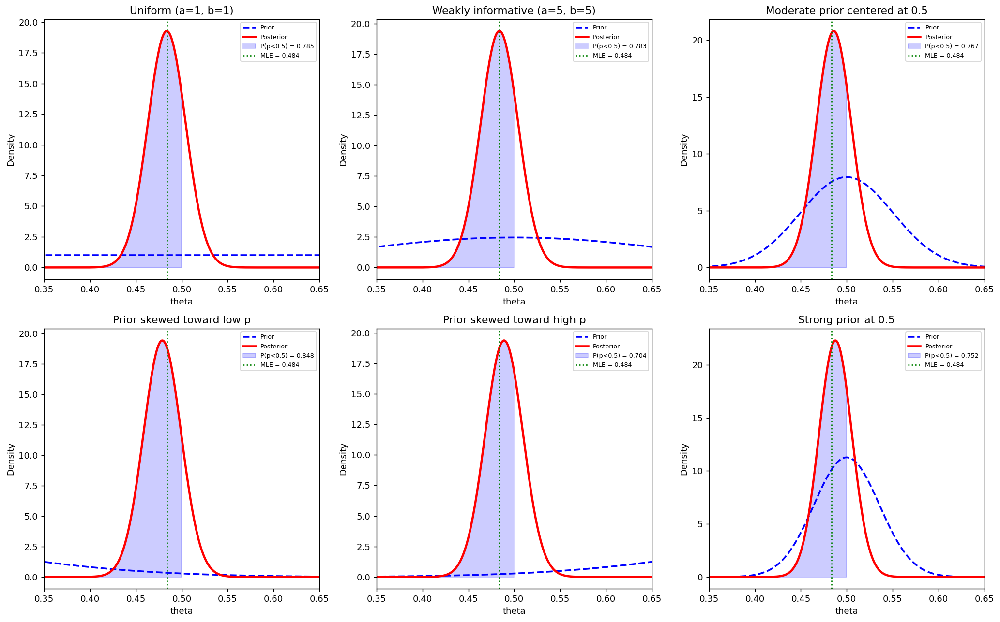

# 베이즈 Beta 켤레 사전분포

## 개요

이항 결과(성공/실패)를 모형화할 때 Beta 분포는 Bernoulli 및 Binomial 가능도의 켤레 사전분포가 된다. 사후분포도 Beta가 되므로 베이즈 갱신이 사전분포의 모수에 계수를 더하는 간단한 일이 된다. 이 페이지에서는 사전분포의 선택이 사후분포를 어떻게 바꾸는지 보이고, 정보가 있는 사전분포와 막연한 사전분포에 걸쳐 민감도 분석을 수행하며, 의사결정을 위한 사후확률을 계산하는 방법을 보인다.

## Beta-Binomial 켤레 갱신

성공확률 $\theta$가 미지인 독립 Bernoulli 시행 $n$번에서 $k$번 성공을 관측했다고 하자. $\theta$의 사전분포가

$$
\theta \sim \text{Beta}(a, b)
$$

이면 자료를 관측한 뒤의 사후분포는:

$$
\theta \mid k, n \sim \text{Beta}(a + k, \; b + n - k)
$$

사후평균은:

$$
E[\theta \mid k, n] = \frac{a + k}{a + b + n}
$$

이는 사전평균 $a/(a+b)$와 MLE $\hat{\theta} = k/n$의 가중평균이다:

$$
E[\theta \mid k, n] = \frac{a + b}{a + b + n} \cdot \frac{a}{a + b} + \frac{n}{a + b + n} \cdot \frac{k}{n}
$$

$a + b$는 **사전 유효 표본크기**로 작동한다. 이 값이 클수록 자료에 비해 사전분포의 영향이 커진다.

## 베이즈 갱신 함수

핵심 계산은 놀랄 만큼 단순하다. 관측된 계수를 사전분포의 모수에 더하기만 하면 된다.

```python
import numpy as np
from scipy.stats import beta

def bayesian_update(a_prior, b_prior, k, n):
    """n번 중 k번 성공을 관측한 뒤의 사후 베타 모수를 구한다.

    베타분포가 이항 가능도의 **켤레사전분포**라서 이렇게 단순해진다.
    사후 = 가능도 x 사전 을 전개하면 지수가 그냥 더해지므로,
    적분을 하나도 하지 않고 모수 덧셈만으로 사후분포가 나온다.

    a는 "성공 횟수", b는 "실패 횟수"처럼 읽으면 된다.
    Beta(2, 3)을 사전분포로 쓴다는 것은 "성공 1번, 실패 2번을
    미리 본 셈 친다"는 뜻이다(균등분포 Beta(1,1)이 기준점).
    """
    a_post = a_prior + k          # 성공 횟수를 더한다
    b_post = b_prior + n - k      # 실패 횟수를 더한다
    return a_post, b_post


# 균등한 사전분포 Beta(1,1)에서 출발해 10번 중 7번 성공을 보면?
a, b = bayesian_update(1, 1, k=7, n=10)
print(f"사후분포 Beta({a}, {b})")
# 베타분포의 평균은 a/(a+b) 다. MLE 0.7 보다 살짝 0.5 쪽으로 당겨진다.
print(f"사후평균 {a/(a+b):.4f}   (MLE = {7/10:.4f})")
```

출력:

```
사후분포 Beta(8, 4)
사후평균 0.6667   (MLE = 0.7000)
```

## 사전분포에 따른 민감도 분석

여론조사 상황을 생각해 보자. 전체 $n = 581$명 중 $k = 281$명이 어떤 후보를 지지하여 MLE는 $\hat{\theta} = 281/581 \approx 0.4836$이다. 여섯 가지 사전분포가 사후분포에 어떤 영향을 주는지 살펴본다.

```python
n = 581
k = 281

# 사전분포 여섯 개. a + b 가 곧 "가상의 표본 크기"라고 읽으면 된다.
#   (1,1)     : 가상표본 2. 사실상 아무 정보도 넣지 않는다(균등).
#   (5,5)     : 가상표본 10. 자료 581에 비해 미미하다.
#   (50,50)   : 가상표본 100. 자료의 6분의 1쯤 되는 무게.
#   (2,8),(8,2): 크기는 작지만 한쪽으로 치우친 사전분포.
#   (100,100) : 가상표본 200. 자료의 3분의 1이라 결과를 눈에 띄게 당긴다.
priors = [
    (1, 1, "Uniform (a=1, b=1)"),
    (5, 5, "Weakly informative (a=5, b=5)"),
    (50, 50, "Moderate prior centered at 0.5"),
    (2, 8, "Prior skewed toward low p"),
    (8, 2, "Prior skewed toward high p"),
    (100, 100, "Strong prior at 0.5"),
]

for a, b, label in priors:
    a_post, b_post = bayesian_update(a, b, k, n)
    # 베타분포의 평균은 a/(a+b) 다.
    # 자료 n=581 이 사전분포보다 훨씬 무거우면 사후평균이 MLE(0.4836)에 붙는다.
    post_mean = a_post / (a_post + b_post)
    # 사후확률 P(p < 0.5). 베이즈 방법에서는 이것을 그대로 "후보가 과반에
    # 못 미칠 확률"이라고 읽을 수 있다. 빈도주의 p-값과 해석이 다른 지점이다.
    p_less_half = beta.cdf(0.5, a_post, b_post)
    print(f"{label:<35s}  a_post={a_post:>4d}  b_post={b_post:>4d}  "
          f"mean={post_mean:.4f}  P(p<0.5)={p_less_half:.4f}")
```

출력:

```
Uniform (a=1, b=1)                   a_post= 282  b_post= 301  mean=0.4837  P(p<0.5)=0.7845
Weakly informative (a=5, b=5)        a_post= 286  b_post= 305  mean=0.4839  P(p<0.5)=0.7829
Moderate prior centered at 0.5       a_post= 331  b_post= 350  mean=0.4860  P(p<0.5)=0.7669
Prior skewed toward low p            a_post= 283  b_post= 308  mean=0.4788  P(p<0.5)=0.8483
Prior skewed toward high p           a_post= 289  b_post= 302  mean=0.4890  P(p<0.5)=0.7037
Strong prior at 0.5                  a_post= 381  b_post= 400  mean=0.4878  P(p<0.5)=0.7518
```

## 사전분포에서 사후분포로의 갱신 시각화

각 사전분포에 대해 사전밀도(파란 점선), 사후밀도(빨간 실선), 음영으로 표시한 영역 $P(\theta < 0.5)$, 그리고 세로 점선으로 표시한 MLE를 그린다.

```python
import matplotlib.pyplot as plt

theta = np.linspace(0, 1, 1000)

fig, axes = plt.subplots(2, 3, figsize=(16, 10))
for idx, (a, b, label) in enumerate(priors):
    a_post, b_post = bayesian_update(a, b, k, n)
    p_less_half = beta.cdf(0.5, a_post, b_post)
    ax = axes.flatten()[idx]

    ax.plot(theta, beta.pdf(theta, a, b), "b--", lw=2, label="Prior")
    ax.plot(theta, beta.pdf(theta, a_post, b_post), "r-", lw=2.5,
            label="Posterior")

    # 사후분포의 0.5 왼쪽을 칠한다. 그 넓이가 곧 P(p < 0.5) 다.
    # 베이즈에서는 모수 자체가 확률변수이므로 이런 진술이 가능하다.
    mask = theta <= 0.5
    ax.fill_between(theta[mask],
                    beta.pdf(theta[mask], a_post, b_post),
                    alpha=0.2, color="blue",
                    label=f"P(p<0.5) = {p_less_half:.3f}")
    # MLE를 세로선으로 표시한다. 사후분포(빨강)의 봉우리가 이 선에서
    # 얼마나 벗어나는지가 곧 사전분포가 결과를 당긴 정도다.
    # 마지막 패널(강한 사전분포)에서 가장 크게 벌어진다.
    ax.axvline(k / n, color="green", linestyle=":", lw=1.5,
               label=f"MLE = {k/n:.3f}")
    ax.set_title(label)
    ax.set_xlabel("theta")
    ax.set_ylabel("Density")
    ax.legend(fontsize=7)
    ax.set_xlim(0.35, 0.65)

plt.tight_layout()
plt.show()
```



## 해석

- **균등 사전분포** $\text{Beta}(1,1)$: 사후분포가 전적으로 자료로 결정된다. 사후평균이 MLE와 거의 같고 $P(\theta < 0.5)$는 표본추출 증거만 반영한다.
- **약한 정보의 사전분포** (작은 $a + b$): 사전분포의 유효 표본크기가 $n = 581$에 비해 무시할 만하므로 사후분포가 균등 사전분포일 때와 거의 구별되지 않는다.
- **0.5에 집중된 강한 사전분포** $\text{Beta}(100, 100)$: 사전 유효 표본크기가 200으로 $n = 581$에 비해 상당하다. 사후평균이 0.5 쪽으로 눈에 띄게 당겨지고 사후분포가 MLE 주변으로 더 넓어진다.
- **치우친 사전분포**: 사전분포 $\text{Beta}(2, 8)$(평균 0.2)과 $\text{Beta}(8, 2)$(평균 0.8)는 유효 표본크기가 작아($a + b = 10$) 자료에 쉽게 압도된다.
- **사후확률** $P(\theta < 0.5)$는 직접적이고 해석 가능한 양으로 의사결정에 유용하다. 예를 들어 어떤 후보가 과반에 못 미치는 지지를 받을 가능성이 큰지 판단할 수 있다.

!!! info "자료가 사전분포를 압도한다"
    관측값이 $n = 581$개이면 강한 $\text{Beta}(100, 100)$ 사전분포조차 자료에 의해 상당히 갱신된다. 베이즈 일치성을 보여 준다. $n \to \infty$이면 사전분포와 무관하게 사후분포가 참 모수값에 집중된다.

## 연습문제

**연습문제 1.** Beta-Binomial 켤레 모형에서 출발하여 $a > 1$, $b > 1$일 때 사후최빈값(MAP 추정값)이 다음과 같음을 보여라:

$$
\hat{\theta}_{\text{MAP}} = \frac{a + k - 1}{a + b + n - 2}
$$

$a = b = 1$(균등 사전분포)이면 어떻게 되는가?

??? success "풀이"
    사후분포는 $\text{Beta}(a + k, b + n - k)$이다. $\text{Beta}(\alpha, \beta)$의 최빈값은:

    $$
    \frac{\alpha - 1}{\alpha + \beta - 2} \quad \text{for } \alpha > 1, \; \beta > 1
    $$

    $\alpha = a + k$, $\beta = b + n - k$를 대입하면:

    $$
    \hat{\theta}_{\text{MAP}} = \frac{a + k - 1}{a + b + n - 2}
    $$

    $a = b = 1$(균등 사전분포)이면 이는 $k/n$이 되어 정확히 MLE와 같다. 균등 사전분포는 아무 정보도 기여하지 않으므로 MAP와 MLE가 일치한다. $\square$

---

**연습문제 2.** 동전을 $n = 20$번 던져 $k = 14$번 앞면이 나왔다. 세 가지 사전분포 $\text{Beta}(1,1)$, $\text{Beta}(10,10)$, $\text{Beta}(2,5)$ 아래에서 사후평균, MAP, MLE를 비교하라. 어느 사전분포가 사후평균을 MLE에서 가장 멀리 끌어당기는가?

??? success "풀이"
    MLE는 $\hat{p} = 14/20 = 0.70$이다.

    **Beta(1, 1):** 사후분포 $\text{Beta}(15, 7)$. 평균 $= 15/22 \approx 0.6818$. MAP $= 14/20 = 0.70$.

    **Beta(10, 10):** 사후분포 $\text{Beta}(24, 16)$. 평균 $= 24/40 = 0.60$. MAP $= 23/38 \approx 0.6053$.

    **Beta(2, 5):** 사후분포 $\text{Beta}(16, 11)$. 평균 $= 16/27 \approx 0.5926$. MAP $= 15/25 = 0.60$.

    $\text{Beta}(10, 10)$ 사전분포는 사후평균을 0.60으로(MLE에서 0.10만큼) 끌어당기고, $\text{Beta}(2, 5)$는 0.5926으로(0.1074만큼) 끌어당긴다. $\text{Beta}(2, 5)$ 사전분포가 사후평균을 MLE에서 가장 멀리 끌어당기는데, 이는 작은 $p$ 값 근처에 질량을 몰아 두고 유효 표본크기 7이 자료 크기와 견줄 만하기 때문이다. $\square$

---

**연습문제 3.** 어떤 여론조사원이 후보가 과반의 지지를 받는지($\theta > 0.5$) 판단하려 한다. $\text{Beta}(1,1)$ 사전분포로 $n = 581$번의 시행에서 $k = 281$번 성공을 관측했다. $P(\theta > 0.5 \mid \text{자료})$를 계산하라. 과반 지지라고 결론짓겠는가? 사전분포가 $\text{Beta}(100, 100)$이라면 어떠한가?

??? success "풀이"
    **균등 사전분포** $\text{Beta}(1,1)$: 사후분포는 $\text{Beta}(282, 301)$이다.

    $$
    P(\theta > 0.5 \mid \text{data}) = 1 - P(\theta \leq 0.5 \mid \text{data})
    $$

    `1 - beta.cdf(0.5, 282, 301)`을 계산하면 약 $0.21$이다. 0.5보다 훨씬 작으므로 과반 지지라고 결론짓지 **않는다**. 오히려 자료는 이 후보의 지지가 50%에 못 미칠 가능성이 높다고 시사한다.

    **강한 사전분포** $\text{Beta}(100, 100)$: 사후분포는 $\text{Beta}(381, 400)$이다.

    $$
    P(\theta > 0.5 \mid \text{data}) = 1 - \text{Beta-CDF}(0.5; 381, 400)
    $$

    이는 약 $0.25$이다. 0.5에 집중된 강한 사전분포가 사후분포를 0.5 쪽으로 끌어당기므로(사후평균이 0.4837에서 0.4879로 올라간다) 과반 지지의 사후확률이 오히려 조금 **커진다**.

    두 경우 모두에서 증거는 과반 지지라는 주장을 뒷받침하지 않는다. $\square$

---

**연습문제 4.** Beta-Binomial 모형에서 $\theta$의 사후분산을 유도하라. $n$이 커질수록 줄어듦을 보이고 그 감소 속도를 해석하라.

??? success "풀이"
    사후분포는 $\text{Beta}(a + k, b + n - k)$이다. $\alpha = a + k$, $\beta = b + n - k$라 하자. $\text{Beta}(\alpha, \beta)$ 분포의 분산은:

    $$
    \text{Var}(\theta \mid \text{data}) = \frac{\alpha \beta}{(\alpha + \beta)^2 (\alpha + \beta + 1)}
    $$

    $\alpha + \beta = a + b + n$이므로 분모에 $(a + b + n)^2(a + b + n + 1)$이라는 인수가 들어간다. $n \to \infty$일 때:

    $$
    \text{Var}(\theta \mid \text{data}) \approx \frac{(a + k)(b + n - k)}{(a + b + n)^3} \approx \frac{\theta(1 - \theta)}{n}
    $$

    여기서 $\theta$는 참 모수이다. 사후분산은 $O(1/n)$의 속도로 줄어들며, 이는 MLE의 표본추출 분산의 감소 속도와 같다. 사후분포가 빈도주의 표준오차가 줄어드는 것과 같은 속도로 참값 주위에 집중된다는 뜻이다. $\square$

---

**연습문제 5.** 두 분석자가 같은 자료($n = 100$, $k = 60$)에 서로 다른 사전분포 $\text{Beta}(1, 1)$과 $\text{Beta}(50, 50)$을 사용한다고 하자. 각각의 사후평균을 계산하라. ($k/n$을 0.6으로 유지할 때) 두 사후평균의 차가 0.005보다 작아지려면 $n$이 얼마나 커야 하는가?

??? success "풀이"
    **분석자 1** (균등 사전분포): 사후분포 $\text{Beta}(61, 41)$. 평균 $= 61/102 \approx 0.5980$.

    **분석자 2** (정보가 있는 사전분포): 사후분포 $\text{Beta}(110, 90)$. 평균 $= 110/200 = 0.55$.

    차이: $0.5980 - 0.55 = 0.048$.

    일반적으로 $k = 0.6n$일 때 두 평균은:

    $$
    m_1 = \frac{1 + 0.6n}{2 + n}, \quad m_2 = \frac{50 + 0.6n}{100 + n}
    $$

    통분하면 분자의 $0.6n^2$ 항이 상쇄되어 차이가 깔끔하게 정리된다:

    $$
    m_1 - m_2 = \frac{(1 + 0.6n)(100 + n) - (50 + 0.6n)(2 + n)}{(2 + n)(100 + n)} = \frac{9.8\,n}{n^2 + 102n + 200}
    $$

    $|m_1 - m_2| < 0.005$로 두면 $0.005n^2 - 9.29n + 1 > 0$, 즉 $n^2 - 1858n + 200 > 0$이므로 $n \gtrsim 1858$이다.

    관측값이 약 1900개는 되어야 두 사후평균의 차가 0.005 아래로 떨어진다. 어느 정도 정보가 있는 사전분포조차 무시할 만해지려면 상당한 양의 자료가 필요함을 보여 준다. $\square$
