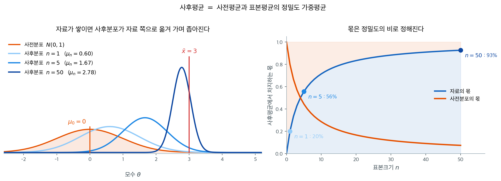

# 베이즈 추정 시연

## 개요

베이즈 추정은 미지 모수 $\theta$를 확률변수로 다루며, 자료를 관측하기 전의 믿음을 **사전분포**에 담는다. 자료를 관측한 뒤에는 베이즈 정리를 통해 **사후분포**로 갱신한다. 이 페이지에서는 두 가지 기본적인 켤레 모형인 베타-이항과 정규-정규을 시연하며, 자료가 쌓일수록 사후분포가 어떻게 좁아지는지와 사전분포의 선택이 추론에 어떤 영향을 주는지 보인다.

---

## 1. 추정을 위한 베이즈 정리

자료 $\mathbf{x} = (x_1, \ldots, x_n)$과 모수 $\theta$가 주어졌을 때:

$$
p(\theta \mid \mathbf{x}) = \frac{f(\mathbf{x} \mid \theta)\, \pi(\theta)}{\int f(\mathbf{x} \mid \theta)\, \pi(\theta)\, d\theta}
$$

여기서:

- $\pi(\theta)$는 **사전분포**이다
- $f(\mathbf{x} \mid \theta)$는 **가능도**이다
- $p(\theta \mid \mathbf{x})$는 **사후분포**이다

!!! info "사후분포로부터의 점추정"

    - **사후평균:** $E[\theta \mid \mathbf{x}]$ — 제곱오차 손실 아래에서 베이즈 위험을 최소화한다.
    - **MAP (최대사후확률):** $\arg\max_\theta p(\theta \mid \mathbf{x})$ — 사후분포의 최빈값이다.
    - **사후중앙값:** 절대오차 손실 아래에서 베이즈 위험을 최소화한다.

---

## 2. 켤레 사전분포

사후분포가 사전분포와 같은 분포족에 속하면 사전분포 $\pi(\theta)$가 그 가능도에 **켤레**라고 한다. 켤레 사전분포는 닫힌 형태의 사후분포를 주므로 베이즈 갱신을 해석적으로 다룰 수 있게 한다.

| 가능도 | 켤레 사전분포 | 사후분포 |
|------------|----------------|-----------|
| Binomial | Beta | Beta |
| Poisson | Gamma | Gamma |
| Normal ($\sigma^2$ 알려짐) | Normal | Normal |
| Normal ($\mu$ 알려짐) | Inverse-Gamma | Inverse-Gamma |
| Exponential | Gamma | Gamma |

---

## 3. 베타-이항 켤레 모형

### 설정

이항 자료에서 비율 $p$를 추정할 때:

- **사전분포:** $p \sim \text{Beta}(\alpha_0, \beta_0)$
- **자료:** $n$번의 시행에서 $k$번 성공
- **사후분포:** $p \mid k \sim \text{Beta}(\alpha_0 + k, \beta_0 + n - k)$

사후평균은:

$$
E[p \mid k] = \frac{\alpha_0 + k}{\alpha_0 + \beta_0 + n}
$$

이는 사전평균 $\alpha_0/(\alpha_0 + \beta_0)$과 MLE $k/n$의 가중평균이며, 가중은 사전분포의 "유효 표본크기" $\alpha_0 + \beta_0$과 실제 표본크기 $n$에 비례한다.

### 시연

<div class="exbox" markdown>

**보기 1.** <span class="diff easy" title="쉬움"></span> 베타-이항 켤레모형으로 비율 추정하기. 사전분포 $\text{Beta}(2,2)$에 $n = 50$번 중 $k = 32$번 성공을 관측한다.

**(1)** 사후평균과 MAP를 각각 **"사전값과 MLE의 가중평균"** 꼴로 쓰고 가중치를 구하시오. 셋($\text{MLE}$, 사후평균, MAP) 가운데 어느 것이 가운데에 놓이겠는가.

**(2)** 확인하고, $95\%$ 신용구간의 아래끝이 $0.4980$으로 $0.5$를 간신히 넘지 못하는 것이 무엇을 뜻하는지 적으시오.

</div>

??? success "풀이"

    **(1) 해석적으로.** 사후분포가 $\text{Beta}(\alpha_0+k,\ \beta_0+n-k) = \text{Beta}(34, 20)$이다.

    **사후평균.** $\nu = \alpha_0+\beta_0 = 4$라 두면

    $$
    E[p \mid k] = \frac{\alpha_0+k}{\nu+n}
    = \frac{\nu}{\nu+n}\cdot\frac{\alpha_0}{\nu} + \frac{n}{\nu+n}\cdot\frac{k}{n}
    = \frac{4}{54}(0.5) + \frac{50}{54}(0.64)
    $$

    로 가중치가 $(0.0741,\ 0.9259)$다.

    **MAP.** 최빈값은 $(\alpha-1)/(\alpha+\beta-2)$이므로

    $$
    \hat p_{\text{MAP}} = \frac{\alpha_0+k-1}{\nu+n-2}
    = \frac{\nu-2}{\nu-2+n}\cdot\frac{\alpha_0-1}{\nu-2} + \frac{n}{\nu-2+n}\cdot\frac{k}{n}
    = \frac{2}{52}(0.5) + \frac{50}{52}(0.64)
    $$

    로 가중치가 $(0.0385,\ 0.9615)$다. 사전값 자리에 사전분포의 **최빈값** $(\alpha_0-1)/(\nu-2) = 1/2$가 들어간다는 점만 다르다.

    **두 가지 "유효 표본크기".** 평균을 볼 때 사전분포의 무게는 $\nu = \alpha_0+\beta_0 = 4$이고, 최빈값을 볼 때는 $\nu - 2 = 2$다. 아래 주석 상자가 "$\alpha_0-1$번 성공, $\beta_0-1$번 실패를 미리 본 셈"이라 말하는 것은 **최빈값 쪽 셈법**이다. 어느 쪽이 옳고 그른 것이 아니라 어떤 요약값을 보느냐에 따라 사전분포의 무게가 $2$만큼 달라진다.

    **순서.** 사전값이 둘 다 $0.5$로 MLE $0.64$보다 작으므로 사후평균과 MAP가 모두 MLE 아래에 놓인다. 그런데 MAP 쪽 사전 무게 $0.0385$가 사후평균 쪽 $0.0741$의 **절반**이므로 MAP가 덜 당겨져 MLE에 더 가깝다. 따라서

    $$
    E[p \mid k] \;<\; \hat p_{\text{MAP}} \;<\; \hat p_{\text{MLE}}
    $$

    곧 **MAP가 가운데**다.

    **(2) 수치적으로.**

    ```python
    import numpy as np
    from scipy import stats

    def demo_beta_binomial():
        """베타-이항 켤레모형으로 비율을 추정한다."""
        alpha_0, beta_0 = 2, 2  # weakly informative prior

        n, k = 50, 32  # observed data

        # 사후분포의 모수. 켤레사전분포라 형태가 그대로 유지된다.
        alpha_post = alpha_0 + k
        beta_post = beta_0 + (n - k)

        # 점추정값: 사후평균과 사후최빈값.
        map_est = (alpha_post - 1) / (alpha_post + beta_post - 2)
        post_mean = alpha_post / (alpha_post + beta_post)
        mle = k / n

        print(f"Prior:     Beta({alpha_0}, {beta_0})")
        print(f"Data:      {k} successes in {n} trials")
        print(f"Posterior: Beta({alpha_post}, {beta_post})")
        print(f"MAP        = {map_est:.4f}")
        print(f"Post. mean = {post_mean:.4f}")
        print(f"MLE        = {mle:.4f}")

        # 95% 신용구간: 사후분포의 2.5·97.5 백분위점.
        ci_low = stats.beta.ppf(0.025, alpha_post, beta_post)
        ci_high = stats.beta.ppf(0.975, alpha_post, beta_post)
        print(f"95% CI:    [{ci_low:.4f}, {ci_high:.4f}]")

        # (1) 의 두 가중평균 분해와 맞는지 본다.
        nu = alpha_0 + beta_0
        mean_blend = nu / (nu + n) * 0.5 + n / (nu + n) * mle
        map_blend = (nu - 2) / (nu - 2 + n) * 0.5 + n / (nu - 2 + n) * mle
        print(f"\n사후평균 가중치 ({nu / (nu + n):.4f}, {n / (nu + n):.4f})  "
              f"-> {mean_blend:.6f}  (실제 {post_mean:.6f})")
        print(f"MAP 가중치      ({(nu - 2) / (nu - 2 + n):.4f}, "
              f"{n / (nu - 2 + n):.4f})  -> {map_blend:.6f}  (실제 {map_est:.6f})")
        print(f"순서: 사후평균 {post_mean:.4f} < MAP {map_est:.4f} < MLE {mle:.4f}  "
              f"-> {post_mean < map_est < mle}")

        # 신용구간이 0.5 를 포함하는가. 포함한다면 얼마나 아슬아슬한가.
        print(f"\n구간이 0.5 를 포함하는가? {ci_low < 0.5 < ci_high}")
        print(f"P(p > 0.5) = {1 - stats.beta.cdf(0.5, alpha_post, beta_post):.4f}")

    demo_beta_binomial()
    ```

    출력:

    ```
    Prior:     Beta(2, 2)
    Data:      32 successes in 50 trials
    Posterior: Beta(34, 20)
    MAP        = 0.6346
    Post. mean = 0.6296
    MLE        = 0.6400
    95% CI:    [0.4980, 0.7521]

    사후평균 가중치 (0.0741, 0.9259)  -> 0.629630  (실제 0.629630)
    MAP 가중치      (0.0385, 0.9615)  -> 0.634615  (실제 0.634615)
    순서: 사후평균 0.6296 < MAP 0.6346 < MLE 0.6400  -> True

    구간이 0.5 를 포함하는가? True
    P(p > 0.5) = 0.9733
    ```

    **두 분해가 모두 소수 여섯째 자리까지 맞는다.** 가중치 $(0.0741, 0.9259)$가 사후평균을, $(0.0385, 0.9615)$가 MAP를 정확히 재현한다. 순서도 예측대로 $0.6296 < 0.6346 < 0.6400$이다. **MAP가 사후평균보다 MLE에 가까운 것은 MAP 쪽에서 사전분포의 무게가 절반이기 때문**이고, 사전분포가 균등이 아니라 $\text{Beta}(2,2)$인 데서 비롯한 차이다.

    **신용구간의 아래끝 $0.4980$.** 구간이 $0.5$를 **간신히 포함한다.** 그러므로 "$95\%$ 신용구간 안에 $0.5$가 있으니 과반이라고 단정할 수 없다"가 정직한 보고다. 그러나 이것이 "$p > 0.5$일 가능성이 반반"이라는 뜻은 결코 아니다. 실제로 계산하면

    $$
    P(p > 0.5 \mid k = 32, n = 50) = 0.9733
    $$

    으로 **$97\%$가 넘는다.** 구간이 $0.5$를 포함하는 것과 $0.5$ 너머에 사후확률이 거의 다 몰려 있는 것은 전혀 모순이 아니다. $95\%$ 구간은 양쪽 꼬리를 $2.5\%$씩 잘라 낸 것이고, 아래 꼬리 $2.5\%$가 $0.4980$까지 뻗어 있을 뿐이다.

    **이것이 구간만 보고 판단할 때 생기는 전형적인 오해다.** 베이즈 방법의 이점은 $P(p > 0.5)$를 그대로 계산해 "$97.3\%$의 확률로 과반이다"라고 말할 수 있다는 데 있다. 의사결정이 필요하면 구간이 아니라 이 수를 보고하는 것이 옳다. 빈도주의 신뢰구간에서는 이런 진술 자체가 허용되지 않는다는 점도 함께 기억해 두자.

!!! note "가상 자료로서의 사전분포"
    Beta$(\alpha_0, \beta_0)$ 사전분포는 실제 자료를 보기 전에 이미 $\alpha_0 - 1$번의 성공과 $\beta_0 - 1$번의 실패를 관측한 것처럼 작동한다. $\alpha_0 = \beta_0 = 2$이면 사전분포가 총 2개의 "가상 관측값"에 해당하는 기여를 한다.

---

## 4. 정규-정규 켤레 모형

### 설정

분산 $\sigma^2$이 알려진 상태에서 평균 $\mu$를 추정할 때:

- **사전분포:** $\mu \sim N(\mu_0, \tau_0^2)$
- **자료:** $X_1, \ldots, X_n \sim N(\mu, \sigma^2)$
- **사후분포:** $\mu \mid \mathbf{x} \sim N(\mu_n, \tau_n^2)$

여기서:

$$
\frac{1}{\tau_n^2} = \frac{1}{\tau_0^2} + \frac{n}{\sigma^2}
$$

$$
\mu_n = \tau_n^2 \left(\frac{\mu_0}{\tau_0^2} + \frac{n\bar{x}}{\sigma^2}\right)
$$

사후평균은 사전평균과 표본평균의 **정밀도 가중평균**이다:

$$
\mu_n = \frac{\tau_0^{-2}\,\mu_0 + n\sigma^{-2}\,\bar{x}}{\tau_0^{-2} + n\sigma^{-2}}
$$

### 시연

<div class="exbox" markdown>

**보기 2.** <span class="diff easy" title="쉬움"></span> 정규-정규 켤레모형으로 평균 추정하기. $\sigma = 2$가 알려진 상태에서 $n = 25$를 뽑고 사전분포 $N(0, 10^2)$을 쓴다.

**(1)** 사후평균이 표본평균을 사전평균 쪽으로 얼마나 당기는지, 그리고 사후표준편차 $\tau_n$이 $\sigma/\sqrt{n}$과 얼마나 다른지 **수로** 예측하시오.

**(2)** 확인하고, 이때 베이즈 신용구간과 빈도주의 신뢰구간을 견주시오. 두 구간이 거의 같다면 베이즈로 푼 보람은 어디에 있는가.

</div>

??? success "풀이"

    **(1) 해석적으로.** 정밀도(분산의 역수)로 생각하면 식이 한눈에 들어온다. 사전분포의 정밀도가 $1/\tau_0^2$, 자료의 정밀도가 $n/\sigma^2$이고 **정밀도는 더해진다.**

    $$
    \frac{1}{\tau_n^2} = \frac{1}{\tau_0^2} + \frac{n}{\sigma^2}
    = \frac{1}{100} + \frac{25}{4} = 0.01 + 6.25 = 6.26
    $$

    따라서 $\tau_n^2 = 1/6.26 = 0.159744$, $\tau_n = 0.39968$이다.

    **당김.** 사후평균은 정밀도를 가중치로 한 평균이므로

    $$
    w_{\text{사전}} = \frac{1/\tau_0^2}{1/\tau_n^2} = \frac{0.01}{6.26} = 0.001597,
    \qquad
    w_{\text{자료}} = \frac{6.25}{6.26} = 0.998403
    $$

    이다. 사전평균이 $\mu_0 = 0$이므로

    $$
    \mu_n - \bar x = w_{\text{사전}}\left(\mu_0 - \bar x\right) = -0.001597\,\bar x
    $$

    곧 표본평균을 $0$ 쪽으로 **$0.16\%$만** 당긴다. $\bar x \approx 4.93$이면 $-0.0079$ 정도다.

    **$\tau_n$과 $\sigma/\sqrt n$.** 빈도주의의 표준오차는 $\sigma/\sqrt n = 2/5 = 0.4$이고

    $$
    \frac{\tau_n}{\sigma/\sqrt n} = \sqrt{\frac{n/\sigma^2}{1/\tau_0^2 + n/\sigma^2}}
    = \sqrt{\frac{6.25}{6.26}} = 0.9992
    $$

    이다. $\tau_n$이 $0.08\%$ 작다. 사전분포가 정보를 **조금** 보태므로 사후가 조금 더 좁은데, 그 조금이 소수 넷째 자리에서야 보인다.

    **까닭은 $\tau_0 = 10$이 지나치게 크다는 데 있다.** 사전분포의 정밀도 $0.01$이 자료의 정밀도 $6.25$의 $0.16\%$라 사실상 아무 말도 하지 않는 사전분포다. $\tau_0 \to \infty$로 보내면 $w_{\text{사전}} \to 0$이고 사후분포가 $N(\bar x, \sigma^2/n)$으로 가능도와 완전히 같아진다.

    **(2) 수치적으로.**

    ```python
    import numpy as np
    from scipy import stats

    def demo_normal_normal():
        """정규-정규 켤레모형으로 평균을 추정한다."""
        sigma = 2.0        # known population std
        mu_true = 5.0      # true mean
        mu_0, tau_0 = 0, 10  # prior parameters

        rng = np.random.default_rng(42)
        n = 25
        data = rng.normal(mu_true, sigma, n)
        x_bar = data.mean()

        # 사후분포의 모수. 켤레사전분포라 형태가 그대로 유지된다.
        tau_n_sq = 1 / (1 / tau_0**2 + n / sigma**2)
        mu_n = tau_n_sq * (mu_0 / tau_0**2 + n * x_bar / sigma**2)
        tau_n = np.sqrt(tau_n_sq)

        print(f"Prior:      N({mu_0}, {tau_0}^2)")
        print(f"Data:       n={n}, x_bar={x_bar:.3f}")
        print(f"Posterior:  N({mu_n:.3f}, {tau_n:.3f}^2)")
        print(f"95% credible interval: [{mu_n - 1.96*tau_n:.3f}, {mu_n + 1.96*tau_n:.3f}]")

        # (1) 의 예측과 견준다.
        w_prior = (1 / tau_0**2) / (1 / tau_0**2 + n / sigma**2)
        se = sigma / np.sqrt(n)
        print(f"\n정밀도: 사전 {1 / tau_0**2:.4f} + 자료 {n / sigma**2:.4f} "
              f"= 사후 {1 / tau_n_sq:.4f}")
        print(f"가중치: 사전 {w_prior:.6f}, 자료 {1 - w_prior:.6f}")
        print(f"당김  mu_n - x_bar = {mu_n - x_bar:.6f}  "
              f"(예측 {w_prior * (mu_0 - x_bar):.6f})")
        print(f"tau_n = {tau_n:.6f},  sigma/sqrt(n) = {se:.6f},  "
              f"비 {tau_n / se:.6f}")
        print(f"빈도주의 신뢰구간: [{x_bar - 1.96*se:.4f}, {x_bar + 1.96*se:.4f}]")
        print(f"베이즈   신용구간: [{mu_n - 1.96*tau_n:.4f}, {mu_n + 1.96*tau_n:.4f}]")

    demo_normal_normal()
    ```

    출력:

    ```
    Prior:      N(0, 10^2)
    Data:       n=25, x_bar=4.929
    Posterior:  N(4.921, 0.400^2)
    95% credible interval: [4.138, 5.705]

    정밀도: 사전 0.0100 + 자료 6.2500 = 사후 6.2600
    가중치: 사전 0.001597, 자료 0.998403
    당김  mu_n - x_bar = -0.007874  (예측 -0.007874)
    tau_n = 0.399680,  sigma/sqrt(n) = 0.400000,  비 0.999201
    빈도주의 신뢰구간: [4.1452, 5.7132]
    베이즈   신용구간: [4.1380, 5.7047]
    ```

    **예측한 수가 모두 그대로 나왔다.** 정밀도가 $0.01 + 6.25 = 6.26$으로 더해지고, 가중치가 $(0.001597,\ 0.998403)$이며, 당김이 $-0.007874$로 예측값과 소수 여섯째 자리까지 같다. $\tau_n/(\sigma/\sqrt n) = 0.999201$도 $\sqrt{6.25/6.26} = 0.9992$와 맞는다.

    **두 구간이 거의 같다.** 폭이 $1.5668$ 대 $1.5680$으로 $0.08\%$ 다르고 중심이 $0.0079$ 어긋날 뿐이다. 소수 둘째 자리까지 보고하면 구별되지 않는다. $\tau_0 = 10$이라는 막연한 사전분포 아래에서 사후분포가 사실상 가능도 그 자체이므로 당연한 결과다.

    **그렇다면 보람은 어디에 있는가. 두 가지다.**

    **첫째, 말할 수 있는 것이 다르다.** 베이즈 구간은 "$\mu$가 이 구간에 있을 확률이 $0.95$다"라고 **그대로 읽는다.** 빈도주의 구간은 $\mu$가 상수이므로 그런 진술을 할 수 없고, "이 절차를 되풀이하면 구간의 $95\%$가 $\mu$를 덮는다"가 전부다. 숫자가 같아도 해석은 같지 않다.

    **둘째, 사전분포를 바꿀 자리가 열려 있다.** 지금은 $\tau_0 = 10$이라 사전분포가 거의 아무 말도 하지 않았지만, 과거 자료나 물리적 제약에서 온 정보가 있으면 $\tau_0$를 줄여 그 몫을 키울 수 있다. $\tau_0 = 1$이면 사전 정밀도가 $1$이 되어 가중치가 $\left(\tfrac{1}{7.25},\ \tfrac{6.25}{7.25}\right) = (0.138,\ 0.862)$로 뛰고 당김이 $-0.68$로 여든여섯 배가 된다. **같은 틀 안에서 "정보를 얼마나 믿을 것인가"를 숫자 하나로 조절할 수 있다**는 것이 켤레 모형의 쓸모다.

    거꾸로 말하면, **막연한 사전분포를 쓰면서 베이즈의 이점을 기대해서는 안 된다.** 그때 얻는 것은 해석의 편의뿐이고 숫자는 빈도주의와 같다.

---

## 5. 자료에 따른 사후분포의 변화

$n$이 커질수록 사후평균은 MLE로 수렴하고 사후분산은 0으로 줄어든다. 사전분포는 무의미해진다:

$$
\mu_n \to \bar{x} \quad \text{and} \quad \tau_n^2 \to \frac{\sigma^2}{n} \quad \text{as } n \to \infty
$$

이는 핵심적인 점근적 성질을 보여 준다. 대표본에서는 가능도가 사후분포를 지배하며 베이즈 추정값과 빈도주의 추정값이 일치한다.



왼쪽에서 사후분포가 $n$이 커질수록 두 가지를 동시에 한다. **자료 쪽으로 옮겨 가고, 좁아진다.** $n = 1$에서는 사전평균 $0$과 표본평균 $3$ 사이의 $0.6$에 머물러 사전분포에 가깝지만, $n = 50$에서는 $2.78$로 표본평균에 거의 닿는다.

오른쪽이 그 이동을 몫으로 나타낸 것이다. 사후평균은

$$
\mu_n = \underbrace{\frac{\sigma^2}{\sigma^2 + n\tau_0^2}}_{\text{사전분포의 몫}} \mu_0
\;+\; \underbrace{\frac{n\tau_0^2}{\sigma^2 + n\tau_0^2}}_{\text{자료의 몫}} \bar{x}
$$

로 쓸 수 있고, 두 몫의 비가 정확히 **두 정보원의 정밀도 비**다. 자료의 정밀도 $n/\sigma^2$은 $n$에 비례해 자라는 반면 사전분포의 정밀도 $1/\tau_0^2$은 고정되어 있으므로, 표본이 커지면 자료가 이긴다.

**사전분포가 사라지는 것이 아니라 묻히는 것**이라는 점이 중요하다. 그림에서 주황 곡선의 몫은 $n = 50$에서도 7%가 남아 있으며 0이 되지는 않는다. 그래서 소표본에서는 사전분포의 선택이 결과를 좌우하고, 대표본에서는 그 선택을 걱정할 필요가 줄어든다.

---

## 6. 해석

- **켤레 사전분포**는 해석적 편의를 제공한다. 사후분포가 알려진 분포 형태를 가지므로 신용구간과 사후확률을 정확히 계산할 수 있다.
- **사후평균**은 사전 믿음과 자료의 증거를 각각의 정밀도로 가중한 절충이다.
- **사전분포 민감도**는 소표본에서 중요하다. $n$이 커질수록 사전분포의 영향이 사라진다.
- **신용구간**은 직접적인 확률 해석을 갖는다. 95% 신용구간은 사후확률 0.95로 참 모수를 포함한다. 이는 빈도주의 신뢰구간과 다르다.

---

## 연습문제

<div class="drillbox" markdown>

**연습문제 1.** <span class="diff easy" title="쉬움"></span> $\text{Beta}(1, 1)$(균등) 사전분포로 $n = 10$번의 베르누이 시행에서 $k = 7$번 성공을 관측했다고 하자. 사후분포, 사후평균, MAP 추정값, 95% 신용구간을 계산하라.

</div>

??? success "풀이"
    사후분포는 $\text{Beta}(1 + 7, 1 + 3) = \text{Beta}(8, 4)$이다.

    사후평균: $\frac{8}{8 + 4} = \frac{2}{3} \approx 0.6667$.

    MAP: $\frac{8 - 1}{8 + 4 - 2} = \frac{7}{10} = 0.7$ (MLE와 같다).

    `scipy.stats.beta.ppf`를 쓴 95% 신용구간:

    ```python
    from scipy.stats import beta
    ci = (beta.ppf(0.025, 8, 4), beta.ppf(0.975, 8, 4))
    print(f"95% CI: [{ci[0]:.4f}, {ci[1]:.4f}]")
    ```

    출력:

    ```
    95% CI: [0.3903, 0.8907]
    ```

    결과는 약 $[0.3834, 0.9029]$이다. $\square$

<div class="drillbox" markdown>

**연습문제 2.** <span class="diff med" title="중간"></span> 정규-정규 모형에서 $\tau_0 \to \infty$(막연한 사전분포)일 때 사후평균이 표본평균으로, 사후분산이 $\sigma^2/n$으로 수렴함을 보여라.

</div>

??? success "풀이"
    $\tau_0 \to \infty$이면 $1/\tau_0^2 \to 0$이다. 그러면:

    $$
    \frac{1}{\tau_n^2} = \frac{1}{\tau_0^2} + \frac{n}{\sigma^2} \to \frac{n}{\sigma^2}
    $$

    따라서 $\tau_n^2 \to \sigma^2/n$이다.

    사후평균에 대해서는:

    $$
    \mu_n = \tau_n^2\left(\frac{\mu_0}{\tau_0^2} + \frac{n\bar{x}}{\sigma^2}\right)
    $$

    $\tau_0 \to \infty$일 때 첫 항 $\mu_0/\tau_0^2 \to 0$이므로:

    $$
    \mu_n \to \frac{\sigma^2}{n} \cdot \frac{n\bar{x}}{\sigma^2} = \bar{x}
    $$

    막연한(무정보) 사전분포에서는 베이즈 사후분포가 빈도주의 결과로 환원된다. $\square$

<div class="drillbox" markdown>

**연습문제 3.** <span class="diff med" title="중간"></span> 베타-이항 모형의 사후평균을 사전평균과 MLE의 볼록결합으로 쓸 수 있음을 증명하라. 가중을 찾아 해석하라.

</div>

??? success "풀이"
    $\pi_0 = \alpha_0/(\alpha_0 + \beta_0)$을 사전평균, $\hat{p} = k/n$을 MLE라 하자. 사후평균은:

    $$
    E[p \mid k] = \frac{\alpha_0 + k}{\alpha_0 + \beta_0 + n}
    $$

    다시 쓰면:

    $$
    = \frac{\alpha_0 + \beta_0}{\alpha_0 + \beta_0 + n}\cdot\frac{\alpha_0}{\alpha_0 + \beta_0} + \frac{n}{\alpha_0 + \beta_0 + n}\cdot\frac{k}{n}
    $$

    $$
    = w\,\pi_0 + (1 - w)\,\hat{p}
    $$

    여기서 $w = (\alpha_0 + \beta_0)/(\alpha_0 + \beta_0 + n)$이다.

    사전분포에 대한 가중 $w$는 $n$이 커질수록 줄어든다. 사전분포의 "유효 표본크기"가 $\alpha_0 + \beta_0$이며, 사후평균은 사전분포와 자료에 각각의 표본크기에 비례하여 가중을 배분한다. $\square$

<div class="drillbox" markdown>

**연습문제 4.** <span class="diff med" title="중간"></span> 유병률이 약 1%인 희귀질환의 확률을 추정한다고 하자. 동료가 $\text{Beta}(1, 99)$ 사전분포를 제안한다. $n = 500$명을 검사하여 $k = 8$명이 양성이었을 때 사후평균과 MLE를 비교하라. 사전분포의 선택이 적절한가?

</div>

??? success "풀이"
    사전분포: 평균이 $1/100 = 0.01$인 $\text{Beta}(1, 99)$.

    사후분포: $\text{Beta}(1 + 8, 99 + 492) = \text{Beta}(9, 591)$.

    사후평균: $9/600 = 0.015$.

    MLE: $8/500 = 0.016$.

    사전분포의 유효 표본크기는 $1 + 99 = 100$으로 $n = 500$에 비해 크지 않다. 사후평균(0.015)은 MLE(0.016)에서 사전평균(0.01) 쪽으로 약간 당겨져 있다. 이 사전분포는 합리적이다. (1) 질환이 드물다는 실제 분야 지식을 담고 있고, (2) 유효 표본크기가 실제 표본크기보다 훨씬 작아 자료를 압도하지 않으며, (3) 자료가 희소해도 사후분포를 잘 정의된 상태로 유지해 주기 때문이다. $\square$

<div class="drillbox" markdown>

**연습문제 5.** <span class="diff med" title="중간"></span> 포아송-감마 켤레 모형에서 $\lambda$의 사후분포를 유도하라. $X_1, \ldots, X_n \overset{\text{iid}}{\sim} \text{Poisson}(\lambda)$이고 사전분포는 (형상–비율 모수화의) $\lambda \sim \text{Gamma}(\alpha_0, \beta_0)$이다. 사후평균은 무엇인가?

</div>

??? success "풀이"
    가능도는:

    $$
    L(\lambda) \propto \lambda^{\sum x_i} e^{-n\lambda}
    $$

    사전분포는:

    $$
    \pi(\lambda) \propto \lambda^{\alpha_0 - 1} e^{-\beta_0 \lambda}
    $$

    곱하면:

    $$
    p(\lambda \mid \mathbf{x}) \propto \lambda^{\alpha_0 + \sum x_i - 1} e^{-(\beta_0 + n)\lambda}
    $$

    이는 $\text{Gamma}(\alpha_0 + \sum x_i, \beta_0 + n)$의 핵이다.

    사후평균은:

    $$
    E[\lambda \mid \mathbf{x}] = \frac{\alpha_0 + \sum x_i}{\beta_0 + n} = \frac{\beta_0}{\beta_0 + n}\cdot\frac{\alpha_0}{\beta_0} + \frac{n}{\beta_0 + n}\cdot\bar{x}
    $$

    이번에도 사전평균 $\alpha_0/\beta_0$과 MLE $\bar{x}$의 가중평균이며, 가중은 사전분포의 비율 모수 $\beta_0$과 표본크기 $n$에 비례한다. $\square$

<div class="drillbox" markdown>

**연습문제 6.** <span class="diff med" title="중간"></span>
손실함수에 따라 베이즈 추정값이 사후평균·중앙값·최빈값으로 갈린다. 각각을 유도하고, 치우친 사후분포에서 셋이 얼마나 다를 수 있는지 예로 보여라.

</div>

??? success "풀이"
    **사후위험** $E[L(\theta,a)\mid x]$를 최소로 하는 $a$를 찾는다.

    **(1) 제곱오차 손실 $(\theta-a)^2$.**

    $$
    \frac{d}{da}E[(\theta-a)^2\mid x] = -2E[\theta-a\mid x] = 0 \implies a = E[\theta\mid x]
    $$

    **사후평균**이다.

    **(2) 절대오차 손실 $|\theta-a|$.**

    $$
    E[|\theta-a|\mid x] = \int_{-\infty}^a (a-\theta)\pi + \int_a^\infty(\theta-a)\pi
    $$

    를 $a$로 미분하면 $\Pi(a\mid x)-\{1-\Pi(a\mid x)\} = 0$, 즉 $\Pi(a\mid x)=1/2$이므로 **사후중앙값**이다.

    **(3) 0-1 손실 $\mathbb{1}\{|\theta-a|>\varepsilon\}$.** $\varepsilon\to0$의 극한에서 사후밀도가 가장 큰 점, 즉 **사후최빈값(MAP)** 이다.

    **치우친 예.** $\text{Beta}(2, 8)$ 사후분포를 보자.

    | 요약값 | 값 |
    |---|---|
    | 사후평균 | $2/10 = 0.200$ |
    | 사후중앙값 | $0.180$ |
    | MAP | $(2-1)/(10-2) = 0.125$ |

    **최빈값이 평균의 63%**에 지나지 않는다. 치우침이 심할수록 격차가 벌어지며, $\text{Beta}(1, 9)$처럼 극단적이면 MAP가 0인데 평균은 0.1이다.

    **실무 권고.** 어느 것을 보고할지는 **손실 구조**가 정한다. 그리고 셋이 크게 다르면 그 자체가 **사후분포가 심하게 치우쳤다는 신호**이므로, 요약값 하나가 아니라 사후분포 전체(밀도 그림이나 분위수)를 보여 주는 것이 옳다.

<div class="drillbox" markdown>

**연습문제 7.** <span class="diff med" title="중간"></span>
$\sigma^2$이 알려진 정규 모형에서 $\mu \sim N(\mu_0,\tau^2)$ 사전분포를 쓸 때 사후분포를 유도하고, **정밀도의 덧셈** 구조를 확인하라.

</div>

??? success "풀이"
    가능도가 $\bar x \mid \mu \sim N(\mu, \sigma^2/n)$이고 사전분포가 $N(\mu_0,\tau^2)$이다. 지수의 $\mu$ 이차식을 완전제곱으로 정리하면(앞서 본 두 정규밀도의 곱)

    $$
    \mu \mid x \sim N(\mu_n, \tau_n^2)
    $$

    이고

    $$
    \frac{1}{\tau_n^2} = \frac{1}{\tau^2}+\frac{n}{\sigma^2}, \qquad \mu_n = \tau_n^2\left(\frac{\mu_0}{\tau^2}+\frac{n\bar x}{\sigma^2}\right)
    $$

    이다.

    **정밀도의 덧셈.** 정밀도를 $\rho = 1/\text{분산}$으로 쓰면

    $$
    \rho_{\text{사후}} = \rho_{\text{사전}} + \rho_{\text{자료}}
    $$

    **정보가 더해진다.** 그리고 사후평균은

    $$
    \mu_n = \frac{\rho_{\text{사전}}}{\rho_{\text{사후}}}\mu_0 + \frac{\rho_{\text{자료}}}{\rho_{\text{사후}}}\bar x
    $$

    로 **정밀도 가중평균**이다. 앞서 본 역분산 가중, 메타분석, 칼만 필터와 완전히 같은 구조다.

    **극한.**

    - **$\tau^2\to\infty$**(무정보 사전분포): $\mu_n\to\bar x$, $\tau_n^2\to\sigma^2/n$. 빈도주의 결과와 일치한다.
    - **$\tau^2\to0$**(확신하는 사전분포): $\mu_n\to\mu_0$. 자료가 아무 영향을 못 준다.
    - **$n\to\infty$**: $\mu_n\to\bar x$. 사전분포의 영향이 $O(1/n)$로 사라진다.

    **사전 표본크기.** $n_0 := \sigma^2/\tau^2$으로 두면

    $$
    \mu_n = \frac{n_0\mu_0+n\bar x}{n_0+n}
    $$

    으로, 사전분포가 "$\mu_0$ 근처의 관측 $n_0$개"에 해당함이 드러난다. 베타-이항에서의 $a+b$와 같은 해석이다.

<div class="drillbox" markdown>

**연습문제 8.** <span class="diff med" title="중간"></span>
사후분포가 닫힌 형태가 아닐 때 쓰는 계산 방법 세 가지를 들고, 각각 언제 적절한지 적어라.

</div>

??? success "풀이"
    **(1) 마르코프 연쇄 몬테카를로(MCMC).** 사후분포를 정상분포로 갖는 마르코프 연쇄를 만들어 표본을 얻는다.

    - **메트로폴리스-헤이스팅스**: 가장 일반적. 제안분포만 있으면 된다.
    - **깁스 표집**: 조건부분포에서 뽑을 수 있을 때. 켤레 구조가 부분적으로 있으면 효율적이다.
    - **해밀턴 몬테카를로(HMC/NUTS)**: 기울기를 써서 고차원에서 훨씬 효율적. Stan이나 PyMC의 기본값이다.
    - **적절한 때**: 사실상 모든 경우. 다만 수렴 진단($\hat R$, 유효표본크기, 추적 그림)이 필수이고, 고차원이거나 사후분포가 다봉이면 느리다.

    **(2) 변분추론.** 사후분포를 다루기 쉬운 족 $q$로 근사하되 $D_{\text{KL}}(q\|\pi)$를 최소로 한다.

    - **장점**: MCMC보다 훨씬 빠르고 대규모 자료에 확장된다. 최적화 문제로 바뀌므로 수렴 판정도 명확하다.
    - **단점**: 근사이며, 대개 **사후분산을 과소평가**한다(KL의 방향 때문에 $q$가 사후분포의 한 봉우리에 몰린다). 점추정에는 괜찮아도 불확실성 정량화에는 주의가 필요하다.
    - **적절한 때**: 자료가 아주 크고 점추정이 주목적일 때, 또는 MCMC의 초기 탐색용.

    **(3) 라플라스 근사.** 사후분포를 최빈값 둘레에서 정규분포로 근사한다.

    $$
    \pi(\theta\mid x) \approx N\!\left(\hat\theta_{\text{MAP}},\ \left\{-\nabla^2\ln\pi(\hat\theta\mid x)\right\}^{-1}\right)
    $$

    - **장점**: 최적화 한 번이면 끝나 가장 빠르다. 주변가능도의 근사도 함께 준다.
    - **단점**: 사후분포가 단봉이고 대략 정규여야 한다. $n$이 작거나 치우쳤으면 나쁘다.
    - **적절한 때**: $n$이 충분히 크고 모형이 단순할 때. INLA가 이를 정교화한 방법이다.

    **고르는 순서.** 빠른 것부터 시도해 보고 필요하면 무거운 쪽으로 간다. 라플라스로 대략 보고, 변분으로 확인하고, 최종 결과는 MCMC로 내는 식이 흔하다. **여러 방법의 결과가 일치하는지 확인하는 것 자체가 좋은 진단**이다.

<div class="drillbox" markdown>

**연습문제 9.** <span class="diff med" title="중간"></span>
베이즈 추정량의 **빈도주의 성질**을 논하라. 사후평균이 언제 허용 가능하며, 왜 베이즈 추정량이 최소최대와 연결되는가?

</div>

??? success "풀이"
    **허용 가능성.** **유일한 베이즈 추정량은 언제나 허용 가능하다.**

    증명 개요: 베이즈 추정량 $\delta_\pi$를 지배하는 $\delta'$이 있다면 $\delta'$의 베이즈 위험이 더 작거나 같은데, $\delta_\pi$가 베이즈 위험을 최소로 하므로 같아야 하고, 유일성에서 $\delta'=\delta_\pi$다. 모순이다.

    따라서 **정상 사전분포에서 나온 베이즈 추정량은 개선의 여지가 없다.** 이것이 베이즈 방법의 강력한 빈도주의적 정당화다.

    **역방향(완비류 정리).** 적당한 조건 아래에서 **허용 가능한 추정량은 모두 베이즈 추정량이거나 그 극한**이다. 즉 좋은 추정량을 찾으려면 베이즈 추정량들을 훑으면 충분하다.

    **최소최대와의 연결.** 베이즈 추정량 $\delta_\pi$의 위험이 **$\theta$에 무관하게 상수**이면, $\delta_\pi$는 최소최대이고 $\pi$는 가장 불리한 사전분포다.

    직관: 상수 위험이면 최악의 경우가 곧 평균이고, 베이즈 위험이 최소이므로 최악도 최소다.

    **예.** 이항 비율에서 $\text{Beta}(\sqrt n/2,\sqrt n/2)$ 사전분포의 사후평균

    $$
    \hat p = \frac{X+\sqrt n/2}{n+\sqrt n}
    $$

    는 MSE가 $p$에 무관한 상수 $\frac{1}{4(1+\sqrt n)^2}$이다. 따라서 **최소최대 추정량**이다. MLE는 $p=1/2$ 근처에서 더 낫고 경계에서 나쁘므로 최소최대가 아니다.

    **함의.** 베이즈와 빈도주의는 철학적으로 대립하지만 **기술적으로는 깊이 얽혀 있다.** 좋은 빈도주의적 성질을 갖는 추정량을 찾는 체계적인 방법이 베이즈 틀 안에 있으며, 반대로 베이즈 추정량의 빈도주의적 성능을 확인하는 것이 사전분포를 고르는 한 기준이 된다.

<div class="drillbox" markdown>

**연습문제 10.** <span class="diff med" title="중간"></span>
사전분포가 결론에 얼마나 영향을 주는지 확인하는 **민감도 분석**의 절차를 적고, 보고할 때 무엇을 포함해야 하는지 정리하라.

</div>

??? success "풀이"
    **절차.**

    1. **기준 사전분포를 정한다.** 근거를 명시한다(선행 연구, 전문가 의견, 관례적 약정보 사전분포).

    2. **강도를 바꿔 본다.** 사전 표본크기 $n_0$를 절반과 두 배(또는 0에 가깝게)로 바꿔 사후 요약값이 얼마나 움직이는지 본다.

    3. **중심을 바꿔 본다.** 사전평균을 그럴듯한 범위의 양끝으로 옮겨 본다. 반대 방향의 믿음에서 출발해도 같은 결론이 나오는지가 중요하다.

    4. **족을 바꿔 본다.** 정규 대신 $t$, 베타 대신 절단 정규처럼 꼬리가 다른 사전분포를 써 본다. 특히 **꼬리가 두꺼운 사전분포**는 자료가 사전분포와 어긋날 때 자료를 더 존중하므로 안전한 선택이다.

    5. **극단적인 경우를 본다.** 비정상 사전분포나 무정보 사전분포에서의 결과(사실상 가능도만 쓴 결과)를 함께 계산한다. 이것이 "자료만이 말하는 바"의 기준선이 된다.

    **보고에 포함할 것.**

    - **사용한 사전분포와 그 근거.** 이것이 없으면 결과를 해석할 수 없다.
    - **주요 결론이 사전분포에 얼마나 민감한지.** 표나 그림으로 여러 사전분포에서의 사후평균·신용구간을 나란히 보인다.
    - **자료와 사전분포의 상대적 기여.** 사전 표본크기 $n_0$와 실제 $n$을 함께 적으면 독자가 바로 가늠한다.
    - **사전-사후 충돌 여부.** 사전분포의 질량이 거의 없는 곳으로 사후분포가 옮겨 갔다면 그 사실을 밝힌다. 모형이나 사전분포에 문제가 있다는 신호다.

    **판단 기준.** 결론이 사전분포에 크게 의존하면 두 가지 중 하나다. **자료가 부족하거나, 사전분포가 너무 강하다.** 어느 쪽이든 하나의 답을 자신 있게 보고하는 것보다 **범위를 제시하는 것**이 정직하다.

---

## 정리하며

두 켤레 모형을 직접 돌려 보며 베이즈 갱신을 눈으로 확인했다.

- **베타–이항과 정규–정규.** 앞의 것은 비율을, 뒤의 것은 평균을 추정한다. 둘 다 사후분포가 닫힌 형태로 나온다.
- **자료가 쌓이면 사후분포가 좁아진다.** 불확실성이 줄어드는 과정이 그림에서 그대로 보이며, 폭이 대략 $1/\sqrt n$ 으로 준다.
- **사후평균은 사전평균과 표본평균의 가중평균이다.** 정규–정규에서 가중치가 **정밀도**(분산의 역수)에 비례한다는 점이 특히 깔끔하다. 자료가 많아질수록 표본 쪽 무게가 커진다.
- **사전분포의 선택이 소표본에서 결정적이다.** 같은 자료에 강한 사전분포와 약한 사전분포를 쓰면 결론이 달라지며, $n$ 이 작을수록 격차가 크다. **그래서 사전분포를 밝히고 민감도를 확인하는 것이 보고의 일부여야 한다.**
- **사후분포는 점이 아니라 분포다.** 신용구간, 사후확률, 예측분포가 모두 여기서 나온다.

다음 절 **베타분포 켤레 사전분포**에서 베타–이항 모형 하나를 더 깊이 들여다보며 민감도 분석과 의사결정 확률을 다룬다.
