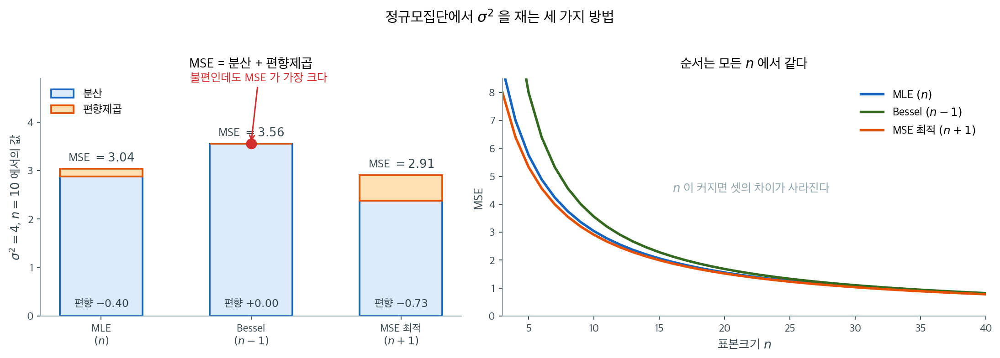

# 추정 방법 비교

## 개요

이 페이지에서는 점추정의 주요 접근인 **적률법(MoM)**과 **최대가능도추정(MLE)**을 비교한다. 해석적 유도와 Monte Carlo 모의실험을 함께 사용하여 여러 분포에 대해 각 방법의 편향, 분산, 평균제곱오차를 살펴본다. MLE가 언제 그리고 왜 적률법을 능가하는지, 그리고 그 이점의 계산 비용이 얼마인지 이해하는 것이 응용통계 실무의 중심이다.

## 적률법

적률법은 모집단 적률을 표본 적률과 같다고 두고 미지 모수를 푼다. 모수가 $\theta_1, \ldots, \theta_k$인 분포에 대해:

$$
\mu_r'(\theta_1, \ldots, \theta_k) = \frac{1}{n}\sum_{i=1}^n X_i^r, \quad r = 1, \ldots, k
$$

!!! info "장점과 단점"
    **장점:** 닫힌 형태의 단순한 표현. 최적화가 필요 없음. 온건한 조건 아래에서 언제나 일치함.

    **단점:** 모수공간 밖의 추정값을 낼 수 있음. 일반적으로 MLE보다 효율이 낮음. 가능도 정보 전체를 사용하지 않음.

## 최대가능도추정

MLE는 관측된 자료의 가능도를 최대화하는 모수값을 찾는다:

$$
\hat{\theta}_{\text{MLE}} = \arg\max_\theta \prod_{i=1}^n f(x_i; \theta)
$$

실무에서는 로그가능도를 최대화한다:

$$
\hat{\theta}_{\text{MLE}} = \arg\max_\theta \sum_{i=1}^n \log f(x_i; \theta)
$$

## 분산추정량의 비교

기초적인 비교로 크기 $n$인 정규 표본에서 모분산 $\sigma^2$을 추정하는 세 가지 추정량을 살펴본다:

| 추정량 | 분모 | 편향 | MSE |
|-----------|---------|------|-----|
| MLE $\hat{\sigma}^2_n$ | $n$ | $-\sigma^2/n$ | $\frac{2n-1}{n^2}\sigma^4$ |
| Bessel $S^2_{n-1}$ | $n-1$ | $0$ | $\frac{2}{n-1}\sigma^4$ |
| MSE 최적 $\hat{\sigma}^2_{n+1}$ | $n+1$ | $-\frac{2\sigma^2}{n+1}$ | $\frac{2}{n+1}\sigma^4$ |

다음 모의실험이 이 결과들을 경험적으로 확인해 준다.

<div class="exbox" markdown>

**보기 1.** <span class="diff easy" title="쉬움"></span> 분산추정량 셋의 MSE 비교. $Q = \sum_i (X_i - \bar X)^2$을 $c = n,\ n-1,\ n+1$로 나눈 세 추정량을 $\sigma^2 = 4$, $n = 10$에서 견준다.

**(1)** $\hat\sigma^2_c = Q/c$의 편향·분산·MSE를 $c$의 함수로 유도하고, 세 추정량의 값을 수로 채우시오. MSE를 최소로 만드는 $c$는 얼마인가.

**(2)** 모의실험 $50{,}000$회로 확인하시오. 세 줄의 분산이 모두 이론값보다 $1.06\%$ 높게 나오는데, 왜 **똑같이** $1.06\%$인가.

</div>

??? success "풀이"

    **(1) 해석적으로.** 정규모집단에서 $Q/\sigma^2 \sim \chi^2_{n-1}$이므로

    $$
    E[Q] = (n-1)\sigma^2, \qquad \operatorname{Var}(Q) = 2(n-1)\sigma^4
    $$

    이다. 따라서 $\hat\sigma^2_c = Q/c$에 대해

    $$
    \operatorname{bias}(c) = \frac{(n-1)\sigma^2}{c} - \sigma^2 = \frac{(n-1-c)\sigma^2}{c},
    \qquad
    \operatorname{Var}(c) = \frac{2(n-1)\sigma^4}{c^2}
    $$

    이고 둘을 합치면

    $$
    \operatorname{MSE}(c)
    = \frac{2(n-1) + (n-1-c)^2}{c^2}\,\sigma^4
    $$

    이다. **$c$를 키우면 분모 $c^2$ 덕에 분산이 줄고 분자의 $(n-1-c)^2$ 때문에 편향이 는다.** 이 줄다리기가 이 보기의 전부다.

    $\sigma^2 = 4$, $n = 10$을 넣는다.

    | 추정량 | $c$ | 편향 | 분산 | MSE |
    |---|---|---|---|---|
    | MLE | $10$ | $-0.4000$ | $2.8800$ | $3.0400$ |
    | 베셀 | $9$ | $0$ | $3.5556$ | $3.5556$ |
    | MSE 최적 | $11$ | $-0.7273$ | $2.3802$ | $2.9091$ |

    **최적의 $c$.** $\operatorname{MSE}(c)$를 미분해 $0$으로 두면

    $$
    \frac{d}{dc}\left[\frac{2(n-1)+(n-1-c)^2}{c^2}\right]
    = \frac{-2\left[2(n-1) + (n-1-c)^2\right] + c\cdot 2(c - (n-1))}{c^3}\cdot\frac{1}{1}
    $$

    인데 분자를 정리하면 $2(n-1)(c - n - 1)$만 남으므로 $c^* = n+1$이다. 그때 $\operatorname{MSE} = 2\sigma^4/(n+1)$이다. **불편추정량 $c = n-1$은 MSE 기준으로 셋 중 가장 나쁘다.**

    **(2) 수치적으로.**

    ```python
    import numpy as np

    def compare_variance_estimators(mu=5, sigma2=4, n=10, n_sim=50_000):
        sigma = np.sqrt(sigma2)
        rng = np.random.default_rng(42)

        results = {}
        # 크기 n인 표본을 5만 개 만든다. 행 하나가 표본 하나다.
        samples = rng.normal(mu, sigma, (n_sim, n))

        # 제곱합 SS = sum (x_i - x_bar)^2 을 표본마다 구한다.
        # keepdims=True 로 (n_sim, 1) 모양을 유지해야 브로드캐스팅으로 빼진다.
        # 세 추정량은 이 SS 를 **무엇으로 나누는가**만 다르다.
        ss = np.sum((samples - samples.mean(axis=1, keepdims=True)) ** 2, axis=1)

        estimators = {
            # n으로 나눔: 최대가능도추정량. 아래로 편향된다(과소추정).
            "MLE (n)":      ss / n,
            # n-1로 나눔: 베셀 보정. 편향이 정확히 0이 된다.
            "Bessel (n-1)": ss / (n - 1),
            # n+1로 나눔: 편향은 더 커지지만 분산이 더 줄어 MSE가 최소가 된다.
            "MSE-opt (n+1)": ss / (n + 1),
        }

        # 아래 세 값이 MSE = 편향^2 + 분산 을 이룬다.
        # "불편이 언제나 최선은 아니다"가 이 표의 요점이다.
        for name, vals in estimators.items():
            bias = vals.mean() - sigma2
            var = vals.var()
            mse = np.mean((vals - sigma2) ** 2)
            results[name] = {"bias": bias, "var": var, "mse": mse}
            print(f"{name:18s}  bias={bias:+.4f}  var={var:.4f}  MSE={mse:.4f}")

        # (1) 의 이론값과 나란히 놓는다.
        print()
        for name, c in [("MLE (n)", n), ("Bessel (n-1)", n - 1), ("MSE-opt (n+1)", n + 1)]:
            b = (n - 1 - c) * sigma2 / c
            v = 2 * (n - 1) * sigma2**2 / c**2
            print(f"{name:18s}  이론 bias={b:+.4f}  var={v:.4f}  MSE={b**2 + v:.4f}"
                  f"   분산비(모의/이론)={results[name]['var'] / v:.5f}")

        return results

    compare_variance_estimators()
    ```

    출력:

    ```
    MLE (n)             bias=-0.3949  var=2.9106  MSE=3.0665
    Bessel (n-1)        bias=+0.0057  var=3.5933  MSE=3.5934
    MSE-opt (n+1)       bias=-0.7226  var=2.4054  MSE=2.9276

    MLE (n)             이론 bias=-0.4000  var=2.8800  MSE=3.0400   분산비(모의/이론)=1.01062
    Bessel (n-1)        이론 bias=+0.0000  var=3.5556  MSE=3.5556   분산비(모의/이론)=1.01062
    MSE-opt (n+1)       이론 bias=-0.7273  var=2.3802  MSE=2.9091   분산비(모의/이론)=1.01062
    ```

    

    **유도한 값과 모의값이 모두 맞는다.** 편향이 $-0.4000$ 대 $-0.3949$, $0$ 대 $+0.0057$, $-0.7273$ 대 $-0.7226$이고 순서도 MSE 최적 $< $ MLE $<$ 베셀로 예측 그대로다.

    **똑같이 $1.06\%$인 까닭.** 분산비가 세 줄 모두 $1.01062$로 **소수 다섯째 자리까지 완전히 같다.** 우연일 리가 없다. 세 추정량은 **같은 제곱합 $Q$를 서로 다른 상수로 나눈 것**이므로

    $$
    \operatorname{Var}\!\left(\frac{Q}{c}\right) = \frac{\operatorname{Var}(Q)}{c^2}
    $$

    이고, 모의실험이 재는 것은 같은 $\widehat{\operatorname{Var}}(Q)$ 하나다. 그 하나가 이론값보다 $1.06\%$ 높게 나왔으면 셋이 모두 $c^2$으로 나뉘어 **같은 비율**로 높아진다. 곧 세 줄의 몬테카를로 오차는 독립이 아니라 **완전히 같은 오차**다.

    그 $1.06\%$ 자체는 흔한 요동이다. $Q/\sigma^2 \sim \chi^2_9$의 초과첨도가 $12/9 = 1.33$이므로 표본분산의 상대 표준오차가 $\sqrt{(4.33-1)/50{,}000} = 0.82\%$이고, $1.06\%$는 $1.3$ 표준오차다.

    여기서 배울 것이 하나 있다. **모의실험으로 여러 추정량을 견줄 때 같은 표본을 쓰면 오차가 공유되어 비교가 더 정확해진다.** 세 추정량을 각각 다른 난수로 돌렸다면 순서가 뒤집히는 일도 생길 수 있는데, 같은 $Q$를 쓰면 $c^2$의 비가 정확히 유지되어 그런 일이 없다.

    왼쪽 막대가 위 표의 MSE를 두 조각으로 나눈 것이다. 세 추정량은 **같은 제곱합을 무엇으로 나누는가**만 다르므로, 나누는 수를 키우면 분산이 줄고 편향이 커진다. 셋 중 어느 것도 두 조각을 동시에 줄이지 못하며, 합이 가장 작은 것은 가운데가 아니라 오른쪽이다.

    오른쪽은 $n$을 바꿔 가며 같은 계산을 한 것이다. 세 곡선의 **순서가 모든 $n$에서 같고**, $n$이 커지면 셋의 차이가 사라진다. 분모의 차이가 $n$에 비해 무의미해지기 때문이며, 그래서 이 선택은 소표본에서만 문제가 된다.

!!! note "핵심 관찰"
    불편추정량 $S^2_{n-1}$의 평균제곱오차가 셋 중 **가장 크다**. $n+1$로 나누면 편향이 생기지만 평균제곱오차가 최소가 되며, 편향–분산 맞바꿈을 잘 보여 준다.

## 축소추정량 시연

축소추정량 $\hat{\mu}_\lambda = \lambda \bar{X}$는 편향을 대가로 분산을 줄인다. 평균제곱오차는 다음과 같이 분해된다:

$$
\text{MSE}(\hat{\mu}_\lambda) = \lambda^2 \frac{\sigma^2}{n} + (1 - \lambda)^2 \mu^2
$$

평균제곱오차가 최적인 축소계수는:

$$
\lambda^* = \frac{\mu^2}{\mu^2 + \sigma^2/n}
$$

<div class="exbox" markdown>

**보기 2.** <span class="diff easy" title="쉬움"></span> 축소추정량의 MSE. $\hat\mu_\lambda = \lambda\bar X$를 $\mu = 3$, $\sigma^2 = 4$, $n = 20$에서 살핀다.

**(1)** $\lambda^*$를 유도하고, 그때의 최소 MSE가 **$\lambda^*\sigma^2/n$**임을 보이시오. 축소로 줄어드는 MSE의 비율을 신호 대 잡음비 $R = \mu/(\sigma/\sqrt n)$만으로 쓰시오.

**(2)** 확인하고, 이 설정에서 축소의 이득이 왜 그렇게 작은지 설명하시오. 이득이 절반이 되려면 $R$이 얼마여야 하는가.

</div>

??? success "풀이"

    **(1) 해석적으로.** $E[\lambda\bar X] = \lambda\mu$이므로 편향이 $(\lambda-1)\mu$이고 분산이 $\lambda^2\sigma^2/n$이다. 따라서

    $$
    \operatorname{MSE}(\lambda) = \lambda^2\frac{\sigma^2}{n} + (1-\lambda)^2\mu^2
    $$

    이고 $\lambda$에 대해 미분해 $0$으로 두면

    $$
    2\lambda\frac{\sigma^2}{n} - 2(1-\lambda)\mu^2 = 0
    \;\Longrightarrow\;
    \lambda^* = \frac{\mu^2}{\mu^2 + \sigma^2/n}
    $$

    이다. 이계도함수가 $2(\sigma^2/n + \mu^2) > 0$이라 전역 최소다. 분자가 분모보다 작으므로 **언제나 $\lambda^* < 1$**, 곧 불편추정량은 결코 MSE 최소가 아니다.

    **최소 MSE.** $1 - \lambda^* = \dfrac{\sigma^2/n}{\mu^2+\sigma^2/n}$을 넣으면

    $$
    \operatorname{MSE}(\lambda^*)
    = \frac{\mu^4}{(\mu^2+\sigma^2/n)^2}\cdot\frac{\sigma^2}{n}
    + \frac{(\sigma^2/n)^2}{(\mu^2+\sigma^2/n)^2}\cdot\mu^2
    = \frac{\mu^2\,\sigma^2/n\,(\mu^2 + \sigma^2/n)}{(\mu^2+\sigma^2/n)^2}
    = \lambda^*\frac{\sigma^2}{n}
    $$

    로 깔끔하게 정리된다. $\lambda = 1$일 때의 MSE가 $\sigma^2/n$이므로 **축소가 MSE를 정확히 $\lambda^*$배로 줄인다.**

    **신호 대 잡음비로.** $R = \mu/(\sigma/\sqrt n)$이라 두면 $\mu^2 = R^2\sigma^2/n$이므로

    $$
    \lambda^* = \frac{R^2}{R^2+1}, \qquad
    \text{줄어드는 비율} = 1 - \lambda^* = \frac{1}{R^2+1}
    $$

    이다. **이득은 오로지 $R$이 정한다.** $\mu$와 $\sigma$와 $n$이 따로 나타나지 않는다.

    **(2) 수치적으로.**

    ```python
    import numpy as np
    import matplotlib.pyplot as plt

    def shrinkage_mse(mu_true=3, sigma2=4, n=20):
        """축소추정량 lambda * x_bar 의 MSE를 lambda의 함수로 본다.

        lambda = 1 이면 보통의 표본평균(불편),
        lambda < 1 이면 추정값을 0 쪽으로 끌어당긴다(편향되지만 분산이 준다).
        """
        lambdas = np.linspace(0.01, 1.5, 200)

        # MSE = 편향^2 + 분산.  E[lambda * x_bar] = lambda * mu 이므로
        #   편향 = (lambda - 1) * mu
        #   분산 = lambda^2 * sigma^2/n
        bias_sq = (lambdas - 1) ** 2 * mu_true ** 2
        variance = lambdas ** 2 * sigma2 / n
        mse = bias_sq + variance

        # MSE를 lambda에 대해 미분해 0으로 두면 이 값이 나온다.
        # 분모가 분자보다 크므로 언제나 lambda* < 1 이다.
        # 즉 **불편추정량(lambda=1)은 결코 MSE 최소가 아니다.**
        # 다만 이 최적값은 미지의 mu에 의존하므로 실제로 쓸 수는 없다.
        lambda_opt = mu_true ** 2 / (mu_true ** 2 + sigma2 / n)
        print(f"Optimal lambda = {lambda_opt:.4f}")
        print(f"MSE at lambda=1 (unbiased): {sigma2 / n:.4f}")
        print(f"MSE at lambda*:             {lambda_opt**2 * sigma2/n + (1 - lambda_opt)**2 * mu_true**2:.4f}")

        # (1) 의 두 공식을 확인한다.
        R = mu_true / np.sqrt(sigma2 / n)
        print(f"\nlambda* = R^2/(R^2+1) = {R**2 / (R**2 + 1):.6f}   (R = {R:.4f})")
        print(f"MSE(lambda*) = lambda* x sigma^2/n = {lambda_opt * sigma2 / n:.6f}")
        print(f"격자 최솟값                        = {mse.min():.6f} "
              f"(lambda = {lambdas[mse.argmin()]:.4f})")
        print(f"줄어드는 비율 1/(R^2+1) = {1 / (R**2 + 1):.4%}")
        print(f"이득이 50%가 되는 R = {1.0}")

    shrinkage_mse()
    ```

    출력:

    ```
    Optimal lambda = 0.9783
    MSE at lambda=1 (unbiased): 0.2000
    MSE at lambda*:             0.1957

    lambda* = R^2/(R^2+1) = 0.978261   (R = 6.7082)
    MSE(lambda*) = lambda* x sigma^2/n = 0.195652
    격자 최솟값                        = 0.195704 (lambda = 0.9759)
    줄어드는 비율 1/(R^2+1) = 2.1739%
    이득이 50%가 되는 R = 1.0
    ```

    **세 공식이 모두 맞는다.** $R^2/(R^2+1) = 0.978261$이 $\lambda^*$와 같고, $\lambda^*\sigma^2/n = 0.195652$가 직접 계산한 $0.1957$과 같으며, $\lambda$ 격자 $200$점에서 찾은 최솟값 $0.195704$도 같은 자리다(격자가 고른 $0.9759$가 $\lambda^* = 0.9783$에서 반 칸 비껴나 네 자리째에서만 어긋난다).

    **이득이 작은 까닭은 $R$이 크기 때문이다.** 여기서 $R = 3/\sqrt{0.2} = 6.71$이므로 $R^2 = 45$이고 줄어드는 비율이 $1/46 = 2.17\%$에 지나지 않는다. $\lambda^* = 0.978$로 $1$에 바짝 붙어 있는 것도 같은 말이다. **$\mu$가 표준오차의 여섯 배 넘게 떨어져 있으면 $0$ 쪽으로 당길 여지가 거의 없다.**

    **이득이 절반이 되려면 $1/(R^2+1) = 0.5$, 곧 $R = 1$이어야 한다.** 표본평균이 제 표준오차만큼밖에 $0$에서 떨어져 있지 않은 상황, 곧 **"$0$인지 아닌지도 분간이 안 되는"** 경우다. 축소가 크게 도움이 되는 자리가 바로 거기이고, 신호가 뚜렷하면 거의 쓸모가 없다.

    마지막으로 짚어 둘 것은 **$\lambda^*$가 미지의 $\mu$에 의존한다**는 사실이다. 실제로는 $\mu$를 모르니 $\lambda^*$를 계산할 수 없고, 이 보기는 "그런 $\lambda$가 존재한다"까지만 말한다. 자료에서 $\lambda$를 추정해 쓰는 것이 제임스-스타인 추정량 계열의 착상이며, 모수가 셋 이상일 때 그 추정값으로도 표본평균을 이길 수 있다는 것이 알려져 있다.

## 정규분포의 MLE

$X_1, \ldots, X_n \overset{\text{iid}}{\sim} N(\mu, \sigma^2)$에 대해 MLE는 닫힌 형태의 해를 갖는다:

$$
\hat{\mu}_{\text{MLE}} = \bar{X}, \qquad \hat{\sigma}^2_{\text{MLE}} = \frac{1}{n}\sum_{i=1}^n (X_i - \bar{X})^2
$$

음의 로그가능도를 수치적으로 최적화하여 확인할 수도 있다:

$$
-\ell(\mu, \sigma^2) = \frac{n}{2}\log(2\pi\sigma^2) + \frac{1}{2\sigma^2}\sum_{i=1}^n (x_i - \mu)^2
$$

<div class="exbox" markdown>

**보기 3.** <span class="diff easy" title="쉬움"></span> 정규분포 모수의 최대가능도추정. 참값 $\mu = 5$, $\sigma^2 = 4$에서 $n = 100$을 뽑아 닫힌 해와 수치 해를 견준다.

**(1)** $\hat\mu$와 $\hat\sigma^2$을 유도하시오. 또 $\hat\sigma^2$의 표준편차를 구하시오.

**(2)** 코드가 $\hat\sigma^2 = 2.3888$을 준다. 참값 $4$에서 크게 벗어난 듯한데 **방법이 틀린 것인가.** 닫힌 해와 수치 해가 넷째 자리에서 어긋나는 까닭도 밝히시오.

</div>

??? success "풀이"

    **(1) 해석적으로.** 로그가능도

    $$
    \ell(\mu, \sigma^2) = -\frac{n}{2}\log(2\pi\sigma^2) - \frac{1}{2\sigma^2}\sum_i (x_i - \mu)^2
    $$

    를 $\mu$로 미분하면 $\dfrac{1}{\sigma^2}\sum_i(x_i - \mu) = 0$에서 $\hat\mu = \bar x$가 나온다. $\sigma^2$에 의존하지 않으므로 $\sigma^2$을 몰라도 $\hat\mu$가 정해진다.

    $\sigma^2$으로 미분하면

    $$
    -\frac{n}{2\sigma^2} + \frac{1}{2\sigma^4}\sum_i (x_i-\mu)^2 = 0
    \;\Longrightarrow\;
    \hat\sigma^2 = \frac{1}{n}\sum_i (x_i - \hat\mu)^2
    $$

    이다. 분모가 $n-1$이 아니라 **$n$**이고, 그래서 $\hat\sigma^2$은 아래로 편향된다.

    **$\hat\sigma^2$의 퍼짐.** 보기 1에서 쓴 $Q/\sigma^2 \sim \chi^2_{n-1}$을 그대로 쓰면 $\hat\sigma^2 = Q/n$이므로

    $$
    \operatorname{sd}(\hat\sigma^2) = \frac{\sqrt{2(n-1)}\,\sigma^2}{n}
    = \frac{\sqrt{198}\times 4}{100} = 0.5628
    $$

    이고 평균은 $(n-1)\sigma^2/n = 3.96$이다.

    **(2) 수치적으로. 방법은 틀리지 않았다.** $\hat\sigma^2 = 2.3888$이 기댓값 $3.96$에서

    $$
    \frac{2.3888 - 3.96}{0.5628} = -2.79
    $$

    곧 $2.8$ 표준편차 아래에 있다. 드물기는 해도 $100$번에 두세 번은 일어나는 일이고, **이 표본이 유난히 뭉쳐 있었던 것**이지 추정량의 결함이 아니다. $\hat\mu = 4.8995$ 쪽은 참값에서 $0.50$ 표준오차밖에 떨어져 있지 않아 전혀 이상하지 않다는 점도 함께 보면, 같은 표본이 평균은 잘 맞히고 분산은 크게 빗나갔다는 것을 알 수 있다. $\hat\sigma^2$이 $\hat\mu$보다 훨씬 요동이 크기 때문이다.

    ```python
    import numpy as np
    from scipy import optimize

    def mle_normal_demo(n=100):
        rng = np.random.default_rng(42)
        mu_true, sigma_true = 5.0, 2.0
        data = rng.normal(mu_true, sigma_true, n)

        # 닫힌 형태의 MLE — 공식으로 바로 구한다.
        mu_hat = data.mean()
        sigma2_hat = np.mean((data - mu_hat) ** 2)

        # 수치 최적화로 구한 MLE. 위 공식과 같은 값이 나와야 한다.
        def neg_log_lik(params, x):
            mu, log_sigma2 = params
            sigma2 = np.exp(log_sigma2)
            n = len(x)
            return 0.5 * n * np.log(2 * np.pi * sigma2) + np.sum((x - mu) ** 2) / (2 * sigma2)

        result = optimize.minimize(neg_log_lik, x0=[0, 0], args=(data,), method="Nelder-Mead")
        mu_num, sigma2_num = result.x[0], np.exp(result.x[1])

        print(f"True:        mu = {mu_true:.4f}, sigma^2 = {sigma_true**2:.4f}")
        print(f"Closed-form: mu = {mu_hat:.4f}, sigma^2 = {sigma2_hat:.4f}")
        print(f"Numerical:   mu = {mu_num:.4f}, sigma^2 = {sigma2_num:.4f}")

        # (1) 의 퍼짐과 견준다.
        sd_s2 = np.sqrt(2 * (n - 1)) * sigma_true**2 / n
        print(f"\nE[sigma^2-hat] = (n-1)/n x 4 = {(n - 1) / n * 4:.4f},  "
              f"sd = {sd_s2:.4f}")
        print(f"z(sigma^2-hat) = {(sigma2_hat - (n - 1) / n * 4) / sd_s2:+.3f}")
        print(f"z(mu-hat)      = {(mu_hat - mu_true) / (sigma_true / np.sqrt(n)):+.3f}")

        # 닫힌 해와 수치 해의 차이. 넬더-미드의 허용오차와 견준다.
        print(f"\n수치 - 닫힌: mu {mu_num - mu_hat:+.3e},  "
              f"sigma^2 {sigma2_num - sigma2_hat:+.3e}")
        print(f"음의 로그가능도: 닫힌 {neg_log_lik([mu_hat, np.log(sigma2_hat)], data):.9f}, "
              f"수치 {result.fun:.9f}")
        print(f"넬더-미드 기본 허용오차 xatol = fatol = 1e-4")

    mle_normal_demo()
    ```

    출력:

    ```
    True:        mu = 5.0000, sigma^2 = 4.0000
    Closed-form: mu = 4.8995, sigma^2 = 2.3888
    Numerical:   mu = 4.8995, sigma^2 = 2.3889

    E[sigma^2-hat] = (n-1)/n x 4 = 3.9600,  sd = 0.5628
    z(sigma^2-hat) = -2.792
    z(mu-hat)      = -0.503

    수치 - 닫힌: mu +2.175e-06,  sigma^2 +7.583e-05
    음의 로그가능도: 닫힌 185.433011059, 수치 185.433011084
    넬더-미드 기본 허용오차 xatol = fatol = 1e-4
    ```

    **(2)의 두 물음에 모두 답이 나왔다.**

    **방법은 틀리지 않았다.** $z(\hat\sigma^2) = -2.79$로 기댓값에서 $2.8$ 표준편차 아래다. 같은 표본의 $z(\hat\mu) = -0.50$과 견주면 차이가 분명한데, 평균은 흔한 자리에 있고 분산만 멀리 간 것이다. **한 번의 표본에서 추정값이 참값과 다른 것은 추정량의 잘못이 아니다.** $n = 100$에서 $\hat\sigma^2$의 표준편차가 $0.56$이나 되므로 $2.4$에서 $5.5$까지가 모두 흔한 범위다. 보기 1에서 본 대로 분산추정은 평균추정보다 훨씬 요동이 크다.

    **넷째 자리의 어긋남은 최적화기의 허용오차다.** 수치 해가 닫힌 해보다 $\hat\mu$에서 $2.2\times10^{-6}$, $\hat\sigma^2$에서 $7.6\times10^{-5}$ 크다. 넬더-미드의 기본 허용오차가 `xatol = fatol = 1e-4`이므로 딱 그만큼의 정확도다. 음의 로그가능도를 견주면 닫힌 해가 $185.433011059$, 수치 해가 $185.433011084$로 **닫힌 해 쪽이 아주 조금 작다.** 곧 닫힌 해가 진짜 최소점이고 수치 해는 그 언저리에서 멈춘 것이다.

    **정리하면 $2.3888$과 $4$의 차이는 자료의 문제이고, $2.3888$과 $2.3889$의 차이는 알고리즘의 문제다.** 자릿수가 비슷해 보여도 성질이 전혀 다르며, 전자는 $n$을 늘려야 줄고 후자는 허용오차를 조이면 줄어든다.

## 감마분포에서 MLE와 적률법

$E[X] = \alpha\beta$이고 $\text{Var}(X) = \alpha\beta^2$인 $X \sim \text{Gamma}(\alpha, \beta)$에 대해 적률법 추정량은:

$$
\hat{\alpha}_{\text{MoM}} = \frac{\bar{X}^2}{S^2}, \qquad \hat{\beta}_{\text{MoM}} = \frac{S^2}{\bar{X}}
$$

MLE는 닫힌 형태가 없어 수치 최적화가 필요하다.

<div class="exbox" markdown>

**보기 4.** <span class="diff easy" title="쉬움"></span> 감마분포에서 MLE와 적률법 비교. $\text{Gamma}(\alpha = 3, \beta = 2)$에서 $n = 200$을 뽑아 형상모수 $\alpha$를 두 방법으로 추정하는 일을 $5000$번 되풀이한다.

**(1)** 두 추정량의 점근분산을 구하고 그 비(점근 상대효율)를 $\alpha$의 식으로 쓰시오. $\alpha = 3$, $n = 200$에서 수는 얼마인가.

**(2)** 모의실험의 MSE 비가 (1)의 예측과 맞는지 확인하시오.

</div>

??? success "풀이"

    **(1) 해석적으로.**

    **MLE.** 감마분포의 피셔 정보행렬은

    $$
    I_n(\alpha, \beta) = n\begin{pmatrix} \psi'(\alpha) & 1/\beta \\ 1/\beta & \alpha/\beta^2\end{pmatrix}
    $$

    이고($\psi'$은 삼감마함수) 역행렬의 $(1,1)$ 성분이 $\alpha$의 점근분산이다.

    $$
    \operatorname{AVar}(\hat\alpha_{\text{MLE}})
    = \frac{\alpha/\beta^2}{n\left[\psi'(\alpha)\,\alpha/\beta^2 - 1/\beta^2\right]}
    = \frac{\alpha}{n\left[\alpha\psi'(\alpha) - 1\right]}
    $$

    $\beta$가 약분되어 사라진다. $\alpha = 3$에서 $\psi'(3) = \pi^2/6 - 1 - 1/4 = 0.394934$이므로 $\alpha\psi'(\alpha) - 1 = 0.184802$이고

    $$
    \operatorname{AVar}(\hat\alpha_{\text{MLE}}) = \frac{3}{200 \times 0.184802} = 0.081168
    $$

    **적률법.** $\hat\alpha = g(\bar X, \overline{X^2}) = \bar X^2/(\overline{X^2} - \bar X^2)$에 델타법을 쓴다. 참값에서

    $$
    \frac{\partial g}{\partial m_1} = \frac{2(\alpha+1)}{\beta}, \qquad
    \frac{\partial g}{\partial m_2} = -\frac{1}{\beta^2}
    $$

    이고 감마의 적률 $E[X^k] = \beta^k\alpha(\alpha+1)\cdots(\alpha+k-1)$에서

    $$
    \operatorname{Var}(X) = \alpha\beta^2,\quad
    \operatorname{Cov}(X, X^2) = 2\alpha(\alpha+1)\beta^3,\quad
    \operatorname{Var}(X^2) = \alpha(\alpha+1)(4\alpha+6)\beta^4
    $$

    이다. 셋을 모으면 $\beta$가 모두 지워지고

    $$
    4\alpha(\alpha+1)^2 - 8\alpha(\alpha+1)^2 + \alpha(\alpha+1)(4\alpha+6)
    = \alpha(\alpha+1)\left[-4\alpha - 4 + 4\alpha + 6\right] = 2\alpha(\alpha+1)
    $$

    만 남아

    $$
    \operatorname{AVar}(\hat\alpha_{\text{MoM}}) = \frac{2\alpha(\alpha+1)}{n}
    = \frac{2\times3\times4}{200} = 0.12
    $$

    **점근 상대효율.** 두 분산의 비는

    $$
    \text{ARE} = \frac{\operatorname{AVar}(\hat\alpha_{\text{MLE}})}{\operatorname{AVar}(\hat\alpha_{\text{MoM}})}
    = \frac{1}{2(\alpha+1)\left[\alpha\psi'(\alpha) - 1\right]}
    $$

    로 $n$과 $\beta$가 모두 사라지고 $\alpha$만 남는다. $\alpha = 3$이면

    $$
    \text{ARE} = \frac{1}{2\times4\times0.184802} = 0.6764
    $$

    곧 **MLE의 MSE가 적률법의 약 $68\%$**가 될 것으로 예상된다. 뒤집어 말하면 적률법으로 같은 정밀도를 얻으려면 표본이 $1/0.6764 = 1.48$배 필요하다.

    **(2) 수치적으로.**

    ```python
    import numpy as np
    from scipy import stats

    def mle_vs_mom_gamma(alpha_true=3, beta_true=2, n=200, n_sim=5000):
        rng = np.random.default_rng(42)
        mle_alpha, mom_alpha = [], []

        for _ in range(n_sim):
            data = rng.gamma(alpha_true, beta_true, n)

            # 적률법: 표본의 1차·2차 적률을 이론값과 맞춘다.
            # E[X] = a*b, Var(X) = a*b^2 이므로 a = E[X]^2 / Var(X) 다.
            # 닫힌 식이라 계산이 즉시 끝나는 것이 장점이다.
            m1 = data.mean()
            v = data.var(ddof=0)
            mom_alpha.append(m1 ** 2 / v)

            # MLE: 감마분포는 닫힌 해가 없어 scipy가 수치적으로 푼다.
            # floc=0 은 위치모수를 0으로 **고정**한다는 뜻이다.
            # 이것을 빼면 scipy가 위치까지 추정해 모수가 셋이 되고,
            # 적률법과 같은 조건이 아니게 되어 비교가 성립하지 않는다.
            a_mle, _, _ = stats.gamma.fit(data, floc=0)
            mle_alpha.append(a_mle)

        mle_alpha = np.array(mle_alpha)
        mom_alpha = np.array(mom_alpha)

        for name, vals in [("MLE", mle_alpha), ("MoM", mom_alpha)]:
            bias = vals.mean() - alpha_true
            mse = np.mean((vals - alpha_true) ** 2)
            print(f"{name}: bias={bias:+.4f}, MSE={mse:.6f}")

        # (1) 의 점근값과 견준다.
        from scipy.special import polygamma
        a = alpha_true
        avar_mle = a / (n * (a * polygamma(1, a) - 1))
        avar_mom = 2 * a * (a + 1) / n
        print(f"\n점근분산  MLE {avar_mle:.6f},  MoM {avar_mom:.6f}")
        print(f"점근 상대효율 = {avar_mle / avar_mom:.4f}")
        print(f"모의 MSE 비   = {np.mean((mle_alpha - a)**2) / np.mean((mom_alpha - a)**2):.4f}")
        print(f"모의 분산     MLE {mle_alpha.var():.6f},  MoM {mom_alpha.var():.6f}")

    mle_vs_mom_gamma()
    ```

    출력:

    ```
    MLE: bias=+0.0399, MSE=0.088900
    MoM: bias=+0.0616, MSE=0.129929

    점근분산  MLE 0.081168,  MoM 0.120000
    점근 상대효율 = 0.6764
    모의 MSE 비   = 0.6842
    모의 분산     MLE 0.087306,  MoM 0.126134
    ```

    **예측이 맞는다.** 점근 상대효율 $0.6764$와 모의 MSE 비 $0.6842$가 $1.2\%$ 안에서 일치한다. 두 추정량 모두 모의 분산이 점근값보다 조금(각각 $7.6\%$, $5.1\%$) 크지만 **비는 거의 그대로 유지되는데**, $n = 200$에서 남은 유한표본 효과가 두 쪽에 비슷하게 작용하기 때문이다.

    편향도 둘 다 양수이고($+0.0399$, $+0.0616$) MLE 쪽이 작다. 그러나 편향의 제곱이 $0.0016$과 $0.0038$로 MSE $0.0889$와 $0.1299$의 $2\sim3\%$에 지나지 않으므로, **MSE의 차이를 만든 것은 거의 전부 분산이다.**

    **왜 MLE가 이기는가.** 적률법은 자료를 $\bar X$와 $\overline{X^2}$ 두 수로 줄이는데, 감마분포에서 $\alpha$에 관한 충분통계량은 $\sum\log X_i$와 $\sum X_i$다. 곧 **적률법은 $\log X$에 담긴 정보를 통째로 버린다.** 버린 만큼 효율을 잃고, 그 손실이 $1 - 0.6764 = 32\%$다.

    **값을 치러야 한다는 점도 잊지 말자.** 적률법은 $\bar X^2/S^2$ 한 줄이지만 MLE는 $\psi(\alpha)$가 들어간 비선형 방정식을 수치로 풀어야 한다. 위 코드에서 `stats.gamma.fit`이 $5000$번 호출되는 동안 적률법은 넘파이 연산 두 번으로 끝난다. $32\%$의 효율과 그 계산 비용 가운데 무엇을 고를지는 문제에 달려 있고, 적률법을 MLE의 **출발값**으로 쓰는 절충이 흔하다.

!!! success "평균제곱오차에서 MLE의 승리"
    감마분포에서 $\alpha$와 $\beta$ 모두에 대해 MLE의 평균제곱오차가 적률법보다 작다. 점근이론과 일치하는 결과이다. MLE는 (Cramér–Rao 한계를 달성하여) 효율적인 반면 적률법은 일반적으로 그렇지 않다.

## Cramér-Rao 하한 확인

Cramér-Rao 부등식은 임의의 불편추정량 $\hat{\theta}$에 대해 다음을 말한다:

$$
\text{Var}(\hat{\theta}) \geq \frac{1}{I(\theta)}
$$

여기서 $I(\theta)$는 Fisher 정보량이다. $N(\mu, \sigma^2)$의 평균을 추정할 때 CRLB는 $\sigma^2/n$이고 표본평균이 이 한계를 정확히 달성한다.

<div class="exbox" markdown>

**보기 5.** <span class="diff easy" title="쉬움"></span> 크라메르-라오 하한 확인. $\sigma = 2$인 정규모집단에서 $n = 50$을 뽑아 표본평균과 표본중앙값의 분산을 하한과 견준다.

**(1)** 두 추정량의 분산을 하한으로 나눈 비를 예측하시오.

**(2)** 모의실험에서 중앙값의 비가 $1.5227$로 나와 예측값과 $3\%$ 어긋난다. 몬테카를로 오차인가. 또 "중앙값이 열등하다"는 결론이 모형을 바꾸면 어떻게 되는지 확인하시오.

</div>

??? success "풀이"

    **(1) 해석적으로.** 정규분포의 평균에 대한 관측 하나의 피셔 정보가 $I(\mu) = 1/\sigma^2$이므로 하한은

    $$
    \frac{1}{nI(\mu)} = \frac{\sigma^2}{n} = \frac{4}{50} = 0.08
    $$

    이고 $\operatorname{Var}(\bar X) = \sigma^2/n$이 정확히 이 값이다. **비는 $1.0000$**이어야 한다.

    표본중앙값은 $\sqrt n(\tilde X - \mu) \overset{d}{\to} N\!\left(0, 1/(4f(\mu)^2)\right)$이고 $f(\mu) = 1/(\sigma\sqrt{2\pi})$이므로 점근분산이 $\pi\sigma^2/(2n) = 0.1257$이다. **비는 $\pi/2 = 1.5708$**이어야 한다.

    **(2) 수치적으로. 중앙값 쪽은 몬테카를로 오차가 아니다.** 반복 $20{,}000$회에서 분산 추정값의 상대 표준오차가 $\sqrt{2/20{,}000} = 1.0\%$인데 어긋남이 $3\%$다. 까닭은 $\pi/2$가 **$n \to \infty$의 값**이라는 데 있다. 유한한 $n$, 특히 **짝수인 $n$**에서는 중앙값이 가운데 두 순서통계량의 평균이라 하나만 쓰는 것보다 분산이 작아진다. 자세한 확인은 [Fisher 정보량 계산](../mle/fisher_information_code.md)의 보기 2에 있다.

    표본평균 쪽의 $0.9847$은 이야기가 다르다. $1.53\%$ 어긋났고 몬테카를로 오차가 $1.0\%$이므로 $1.5$ 표준오차, 곧 **그냥 요동이다.**

    아래 코드는 그 위에 한 가지를 더 본다. 자료에 이상치가 섞이면 순서가 어떻게 되는가.

    ```python
    import numpy as np

    def cramer_rao_demo(n=50, n_sim=20_000):
        rng = np.random.default_rng(42)
        mu_true, sigma = 5.0, 2.0
        # 정규분포 평균에 대한 크라메르-라오 하한
        crlb = sigma ** 2 / n

        # 같은 모수를 추정하는 두 불편추정량을 비교한다.
        #   표본평균  : 하한을 달성한다 (비율 ≈ 1.00). 효율적이다.
        #   표본중앙값: 하한보다 분산이 크다 (비율 ≈ 1.52). 정보를 버린 셈이다.
        # 정규모집단에서 중앙값의 점근 상대효율은 2/pi ≈ 0.637 이고,
        # 그 역수 pi/2 ≈ 1.571 이 아래 비율이 다가가는 값이다(유한표본에서는 조금 모자란다).
        #
        # 그렇다고 중앙값이 나쁜 것은 아니다. 이상치가 섞이면 순위가 뒤바뀐다.
        # 효율성은 **모형이 맞다는 전제 아래에서의** 성적이다.
        means = np.array([rng.normal(mu_true, sigma, n).mean() for _ in range(n_sim)])
        medians = np.array([np.median(rng.normal(mu_true, sigma, n)) for _ in range(n_sim)])

        print(f"CRLB = sigma^2/n = {crlb:.6f}")
        print(f"Var(X_bar)       = {means.var():.6f}  (ratio to CRLB: {means.var()/crlb:.4f})")
        print(f"Var(median)      = {medians.var():.6f}  (ratio to CRLB: {medians.var()/crlb:.4f})")

        print(f"\n점근 예측: 평균 1.0000,  중앙값 pi/2 = {np.pi / 2:.4f}")
        print(f"몬테카를로 상대오차 sqrt(2/n_sim) = {np.sqrt(2 / n_sim):.2%}")

        # 모형을 바꾸면 순서가 어떻게 되는가. 5%를 표준편차 10인 이상치로 오염시킨다.
        rng2 = np.random.default_rng(7)
        is_out = rng2.random((n_sim, n)) < 0.05
        x = rng2.normal(mu_true, sigma, (n_sim, n))
        x = np.where(is_out, rng2.normal(mu_true, 10.0, (n_sim, n)), x)
        mse_mean = np.mean((x.mean(axis=1) - mu_true) ** 2)
        mse_med = np.mean((np.median(x, axis=1) - mu_true) ** 2)
        print(f"\n5% 오염(표준편차 10) 아래에서")
        print(f"  MSE(X_bar)  = {mse_mean:.6f}   (이론 (0.95x4 + 0.05x100)/n = "
              f"{(0.95 * 4 + 0.05 * 100) / n:.6f})")
        print(f"  MSE(median) = {mse_med:.6f}")
        print(f"  평균/중앙값 = {mse_mean / mse_med:.3f}")

    cramer_rao_demo()
    ```

    출력:

    ```
    CRLB = sigma^2/n = 0.080000
    Var(X_bar)       = 0.078777  (ratio to CRLB: 0.9847)
    Var(median)      = 0.121813  (ratio to CRLB: 1.5227)

    점근 예측: 평균 1.0000,  중앙값 pi/2 = 1.5708
    몬테카를로 상대오차 sqrt(2/n_sim) = 1.00%

    5% 오염(표준편차 10) 아래에서
      MSE(X_bar)  = 0.175867   (이론 (0.95x4 + 0.05x100)/n = 0.176000)
      MSE(median) = 0.132202
      평균/중앙값 = 1.330
    ```

    **표본평균은 예측대로 하한을 달성한다.** 비가 $0.9847$로 $1$에서 $1.5$ 표준오차 안에 있다.

    **중앙값의 $3\%$는 유한표본 효과다.** $1.5227$이 $\pi/2 = 1.5708$보다 작고, 그 차이가 몬테카를로 오차 $1.0\%$의 세 배다. $n = 50$이 짝수여서 중앙값이 두 순서통계량의 평균이 되는 덕을 본 것이며, $n$을 키우면 $\pi/2$로 올라간다.

    **그러나 모형을 바꾸면 순서가 뒤집힌다.** 관측의 $5\%$를 표준편차 $10$인 분포에서 나오게 하면 모분산이 $0.95\times4 + 0.05\times100 = 8.8$로 뛰므로

    $$
    \operatorname{Var}(\bar X) = \frac{8.8}{50} = 0.176
    $$

    이 되어야 하는데 모의값 $0.175867$이 그대로 맞는다. 반면 중앙값은 $0.132202$로 거의 움직이지 않았다. **이제 중앙값이 평균보다 $33\%$ 낫다.**

    까닭은 분명하다. $\bar X$는 이상치 하나를 그대로 $1/n$만큼 받아들이지만, 중앙값은 가운데 값만 보므로 $5\%$가 아무리 멀리 가도 거의 영향을 받지 않는다. 극단적으로 **관측 하나를 무한대로 보내면 $\bar X$도 무한대가 되지만 중앙값은 꿈쩍도 하지 않는다.**

    그러므로 "표본평균이 효율적이다"라는 말은 **모형이 맞다는 전제 아래에서만** 성립한다. 크라메르-라오 하한 자체가 "밀도가 $f(x;\theta)$다"라는 가정 위에 세워진 것이고, 가정이 틀리면 하한도 효율도 다른 수가 된다. 효율과 강건성 가운데 무엇을 고를지는 자료를 얼마나 믿느냐에 달려 있다.

## 해석

모의실험은 여러 이론적 결과를 확인해 준다:

1. **편향–분산 맞바꿈은 실재한다**: 평균제곱오차가 최적인 분산추정량은 편향되어 있음에도 $n-1$이 아니라 $n+1$로 나눈다.
2. **MLE는 점근적으로 효율적이다**: 감마분포에서 이론이 예측한 대로 MLE가 적률법보다 낮은 평균제곱오차를 달성한다.
3. **축소가 도움이 될 수 있다**: 신호 대 잡음비 $\mu/(\sigma/\sqrt{n})$이 중간 정도일 때 표본평균을 0 쪽으로 당기면 평균제곱오차가 줄어든다.
4. **표본평균은 CRLB를 달성한다**: 정규분포 평균에 대해 그 분산이 Cramér-Rao 하한과 정확히 일치한다.

## 연습문제

<div class="drillbox" markdown>

**연습문제 1.** <span class="diff med" title="중간"></span> $X_1, \ldots, X_n \overset{\text{iid}}{\sim} \text{Exp}(\lambda)$에 대해 $\lambda$의 적률법 추정량과 MLE를 유도하라. 둘은 같은가?

</div>

??? success "풀이"
    지수분포는 $E[X] = 1/\lambda$이므로 적률법은 $\bar{X} = 1/\hat{\lambda}$로 두어 $\hat{\lambda}_{\text{MoM}} = 1/\bar{X}$를 준다.

    로그가능도는 $\ell(\lambda) = n\log\lambda - \lambda \sum x_i$이다. $\ell'(\lambda) = n/\lambda - \sum x_i = 0$으로 두면 $\hat{\lambda}_{\text{MLE}} = n/\sum x_i = 1/\bar{X}$이다.

    지수분포에서 두 추정량은 동일하다. 모수가 하나이고 그것이 하나의 적률로 결정되기 때문이다. $\square$

<div class="drillbox" markdown>

**연습문제 2.** <span class="diff hard" title="어려움"></span> 정규모집단에서 $\hat{\sigma}^2_c = \frac{1}{c}\sum_{i=1}^n(X_i - \bar{X})^2$ 계열 중 평균제곱오차가 최적인 추정량이 $c^* = n+1$임을 보여라.

</div>

??? success "풀이"
    $Q = \sum(X_i - \bar{X})^2$이라 하자. $X_i \sim N(\mu, \sigma^2)$에서 $Q/\sigma^2 \sim \chi^2_{n-1}$이므로 $E[Q] = (n-1)\sigma^2$이고 $\text{Var}(Q) = 2(n-1)\sigma^4$이다.

    $Q/c$의 평균제곱오차는:

    $$
    \text{MSE}(Q/c) = \text{Var}(Q/c) + [\text{Bias}(Q/c)]^2 = \frac{2(n-1)\sigma^4}{c^2} + \left(\frac{n-1}{c} - 1\right)^2\sigma^4
    $$

    $c$에 대해 미분하여 0으로 두면:

    $$
    \frac{d}{dc}\text{MSE} = -\frac{4(n-1)\sigma^4}{c^3} - \frac{2(n-1)\sigma^4}{c^2}\left(\frac{n-1}{c} - 1\right) = 0
    $$

    정리하면 $-4(n-1)/c^3 + 2(n-1)(c - n + 1)/c^3 = 0$이므로 $2(c - n + 1) = 4$, 즉 $c = n + 1$이다. $\square$

<div class="drillbox" markdown>

**연습문제 3.** <span class="diff med" title="중간"></span> $\alpha = 2, \beta = 5$인 베타분포 $\text{Beta}(\alpha, \beta)$에서 표본크기 $n = 50$으로 MLE와 적률법을 비교하는 Monte Carlo 모의실험을 수행하라. $\alpha$를 추정할 때 어느 방법의 평균제곱오차가 더 작은가?

</div>

??? success "풀이"
    ```python
    import numpy as np
    from scipy import stats

    rng = np.random.default_rng(42)
    a_true, b_true, n, n_sim = 2, 5, 50, 10_000
    mle_a, mom_a = [], []

    for _ in range(n_sim):
        data = rng.beta(a_true, b_true, n)

        # 적률법: 베타분포의 평균과 분산을 표본값과 맞추어 푼다.
        #   E[X] = a/(a+b),  Var(X) = ab / [(a+b)^2 (a+b+1)] 를 뒤집어 푼다.
        # 이를 a, b에 대해 풀면 공통 인자 [E(1-E)/V - 1] 이 나오고
        #   a = E * common,  b = (1-E) * common 이 그 해다.
        m1 = data.mean()
        m2 = np.mean(data ** 2)
        v = m2 - m1 ** 2
        common = m1 * (1 - m1) / v - 1
        mom_a.append(m1 * common)

        # MLE. floc=0, fscale=1 로 지지구간을 [0,1]에 고정한다.
        # 베타분포의 표준 정의가 [0,1] 위이므로 이것이 맞는 설정이며,
        # 고정하지 않으면 scipy가 구간의 양 끝까지 추정하려 든다.
        a_mle, b_mle, _, _ = stats.beta.fit(data, floc=0, fscale=1)
        mle_a.append(a_mle)

    mle_a, mom_a = np.array(mle_a), np.array(mom_a)
    print(f"MLE: MSE = {np.mean((mle_a - a_true)**2):.6f}")
    print(f"MoM: MSE = {np.mean((mom_a - a_true)**2):.6f}")
    ```

    출력:

    ```
    MLE: MSE = 0.183749
    MoM: MSE = 0.213541
    ```

    대체로 MLE의 평균제곱오차가 더 작으며, 이는 점근 효율성과 일관된다. $\square$

<div class="drillbox" markdown>

**연습문제 4.** <span class="diff med" title="중간"></span> MLE가 재모수화에 불변임을 증명하라. 즉 $\hat{\theta}$가 $\theta$의 MLE이면 임의의 함수 $g$에 대해 $g(\hat{\theta})$가 $g(\theta)$의 MLE임을 보여라.

</div>

??? success "풀이"
    $g$가 일대일 함수일 때 $\eta = g(\theta)$라 하자(일반적인 경우는 유도가능도로 확장된다). $\eta$의 함수로 본 가능도는:

    $$
    L^*(\eta) = L(g^{-1}(\eta))
    $$

    $L(\theta)$가 $\hat{\theta}$에서 최대이므로 모든 $\theta$에 대해 $L^*(g(\hat{\theta})) = L(\hat{\theta}) \geq L(\theta)$이다. 따라서 $g$의 치역에 속하는 모든 $\eta$에 대해 $L^*(\eta) \leq L^*(g(\hat{\theta}))$이므로 $g(\hat{\theta})$가 $L^*$을 최대화한다.

    일대일이 아닐 수도 있는 일반적인 $g$에 대해서는 $\hat{\eta} = \sup_{\{\theta: g(\theta) = \eta\}} L(\theta)$로 정의하고 그 최대점을 취하면, 구성상 그것이 $g(\hat{\theta})$와 같다. $\square$

<div class="drillbox" markdown>

**연습문제 5.** <span class="diff med" title="중간"></span> 베르누이 모수 $p$의 Fisher 정보량은 $I(p) = 1/[p(1-p)]$이다. $p = 0.3$, $n = 100$일 때 표본비율 $\hat{p} = \bar{X}$의 분산이 Cramér-Rao 한계 $1/[nI(p)]$를 달성함을 수치적으로 확인하라.

</div>

??? success "풀이"
    ```python
    import numpy as np

    rng = np.random.default_rng(42)
    p, n, n_sim = 0.3, 100, 100_000
    # 크기 100짜리 표본의 표본비율을 10만 번 만든다.
    # binomial(n, p)가 성공 횟수를 주므로 n으로 나누면 비율이 된다.
    p_hats = np.array([rng.binomial(n, p) / n for _ in range(n_sim)])

    # 크라메르-라오 하한. 불편추정량이 가질 수 있는 분산의 이론적 최솟값이다.
    # 베르누이의 피셔정보가 I(p) = 1/[p(1-p)] 이므로 1/[n I(p)] = p(1-p)/n.
    # 아래 비율이 1.00 에 가까우면 표본비율이 이 한계를 **달성**한다는 뜻이며,
    # 그런 추정량을 효율적(efficient)이라고 부른다.
    crlb = p * (1 - p) / n
    empirical_var = p_hats.var()
    print(f"CRLB = p(1-p)/n = {crlb:.6f}")
    print(f"Var(p_hat)      = {empirical_var:.6f}")
    print(f"Ratio           = {empirical_var / crlb:.4f}")
    ```

    출력:

    ```
    CRLB = p(1-p)/n = 0.002100
    Var(p_hat)      = 0.002103
    Ratio           = 1.0016
    ```

    비가 1.0에 매우 가깝게 나와 $\hat{p}$가 CRLB를 달성하는 효율적 추정량임을 확인해 준다. $\square$

<div class="drillbox" markdown>

**연습문제 6.** <span class="diff med" title="중간"></span>
적률법, 최대가능도, 최소제곱, 베이즈 네 가지 추정 방법을 **무엇을 최적화하는가**의 관점에서 한 표로 정리하고, 각각이 필요로 하는 가정을 적어라.

</div>

??? success "풀이"

    | 방법 | 최적화 대상 | 필요한 가정 |
    |---|---|---|
    | 적률법 | 표본적률 = 모형적률 (방정식 풀이) | 적률이 존재하고 모수를 결정할 것 |
    | 최대가능도 | $\ell(\theta) = \sum\ln f(x_i;\theta)$ 최대화 | **분포 전체**를 지정 |
    | 최소제곱 | $\sum(y_i-f(x_i;\theta))^2$ 최소화 | 평균 구조만 지정, 등분산이면 효율적 |
    | 베이즈 | 사후위험 최소화(손실에 따라 평균·중앙값·최빈값) | 분포 전체 + **사전분포** |

    **가정의 강도 순서.** 적률법·최소제곱 < 최대가능도 < 베이즈.

    적률법과 최소제곱은 **분포를 지정하지 않는다.** 처음 몇 개의 적률이나 평균 구조만 맞으면 된다. 그래서 모형 오설정에 강건하지만 효율을 잃는다.

    최대가능도는 분포 전체를 쓰므로 **가정이 맞으면 가장 효율적**이고, 틀리면 유사참값으로 수렴한다.

    베이즈는 사전분포까지 요구하지만, 그 대가로 소표본에서의 안정성과 불확실성의 완결된 표현(사후분포)을 얻는다.

    **서로 겹치는 지점.**

    - **정규 오차 아래에서 최소제곱 = 최대가능도**다.
    - **일모수 지수족에서 적률법 = 최대가능도**인 경우가 많다(지수, 포아송, 베르누이).
    - **평평한 사전분포에서 MAP = 최대가능도**다.
    - **$n\to\infty$이면 베이즈 사후평균과 MLE가 같아진다**(베른슈타인-폰 미제스).

    **고르는 기준.** 분포를 믿을 수 있고 표본이 적당하면 최대가능도, 분포가 미덥지 않으면 적률법·최소제곱에 강건 표준오차, 표본이 아주 작거나 사전 정보가 있으면 베이즈가 자연스러운 선택이다.

<div class="drillbox" markdown>

**연습문제 7.** <span class="diff med" title="중간"></span>
같은 자료에 네 방법을 적용했더니 추정값이 서로 꽤 달랐다. 이것이 문제인지 판단하는 절차를 적어라.

</div>

??? success "풀이"
    **먼저 나눠 볼 것.** 차이가 **표집변동 수준인가, 그 이상인가.**

    각 추정값의 표준오차를 계산해 차이가 표준오차의 몇 배인지 본다. $\hat\theta_1-\hat\theta_2$가 각각의 표준오차보다 작으면 우연으로 설명된다. 두 추정량이 상관되어 있으므로 차의 표준오차를 정확히 구하려면 부트스트랩으로 함께 재표집하는 것이 낫다.

    **차이가 크다면 원인을 좁힌다.**

    1. **모형이 틀렸는가.** 적률법과 최대가능도가 크게 다르면 **분포 가정이 의심스럽다**는 강한 신호다. 모형이 맞으면 둘 다 같은 참값으로 수렴하기 때문이다. 이 아이디어를 형식화한 것이 **하우스만 검정**이다.

       $$
       H = \frac{(\hat\theta_{\text{eff}}-\hat\theta_{\text{rob}})^2}{\operatorname{Var}(\hat\theta_{\text{rob}})-\operatorname{Var}(\hat\theta_{\text{eff}})}\ \sim\ \chi^2
       $$

       효율적이지만 가정에 민감한 추정량과, 덜 효율적이지만 강건한 추정량을 비교한다.

    2. **이상치가 있는가.** 최대가능도(정규 가정)만 크게 움직이면 몇몇 관측값이 끌고 있을 가능성이 높다. 관측값을 하나씩 빼 보는 영향력 진단을 한다.

    3. **사전분포가 지배하는가.** 베이즈 추정값만 다르면 사전분포의 영향이다. 사전분포를 바꿔 가며 사후분포가 얼마나 움직이는지 보는 **민감도 분석**이 필요하다. 자료가 적을수록 이 영향이 크다.

    4. **최적화가 수렴했는가.** 최대가능도만 이상하면 국소해에 빠졌을 수 있다. 여러 초기값에서 다시 돌린다.

    **결론을 내는 법.** 원인을 특정했으면 그에 맞는 방법을 고르고 **왜 골랐는지 밝힌다.** 특정하지 못했다면 여러 추정값을 모두 보고하는 것이 정직하다. "모형 선택에 따라 결과가 $x$에서 $y$까지 달라진다"는 진술이 하나의 값을 자신 있게 보고하는 것보다 나은 경우가 많다.

<div class="drillbox" markdown>

**연습문제 8.** <span class="diff med" title="중간"></span>
**M-추정량**이 위 네 방법 중 셋을 하나의 틀로 묶는다. $\hat\theta = \arg\min_\theta\sum_i\rho(x_i;\theta)$라는 정의에서 $\rho$를 어떻게 고르면 각각이 나오는지 보이고, 이 틀의 장점을 적어라.

</div>

??? success "풀이"
    **$\rho$의 선택.**

    | $\rho(x;\theta)$ | 얻어지는 추정량 |
    |---|---|
    | $-\ln f(x;\theta)$ | 최대가능도 |
    | $(x-\theta)^2$ | 최소제곱(평균) |
    | $\lvert x-\theta\rvert$ | 중앙값 |
    | $\rho_\tau$ (핀볼 손실) | $\tau$ 분위수 |
    | 후버 $\rho$ | 강건 위치 추정 |
    | $-\ln f - \ln\pi(\theta)/n$ | MAP |

    적률법도 추정방정식 $\sum_i\psi(x_i;\theta)=0$ 꼴로 쓰면 같은 틀(Z-추정량)에 들어온다.

    **틀의 장점.**

    1. **점근이론을 한 번만 세우면 된다.** 정칙 조건 아래에서

       $$
       \sqrt n(\hat\theta-\theta_0) \xrightarrow{d} N\!\left(0,\ A^{-1}BA^{-1}\right)
       $$

       이고 $A = E[\psi'], B = E[\psi^2]$이다($\psi = \partial\rho/\partial\theta$). **샌드위치 형태가 기본**이고, 최대가능도에서만 $A=B$가 되어 $I^{-1}$로 줄어든다.

    2. **강건성을 설계할 수 있다.** $\psi$가 유계이면 이상치의 영향이 제한된다. 영향함수가 $\psi$에 비례하므로, **원하는 강건성을 $\psi$의 모양으로 직접 지정**할 수 있다.

    3. **모형 오설정을 자연스럽게 다룬다.** $\rho$가 로그가능도가 아니어도 이론이 그대로 적용된다. 유사최대가능도, 준가능도, 추정방정식이 모두 특수한 경우다.

    4. **계산이 통일된다.** 대부분 IRLS나 뉴턴류로 풀리고, 표준오차도 같은 공식으로 나온다.

    **대가.** 일반성을 얻는 대신 **효율의 최적성을 잃는다.** 모형이 정확히 맞으면 최대가능도가 최선이고, M-추정량은 그보다 못하다. 그 차이가 강건성의 가격이다.

<div class="drillbox" markdown>

**연습문제 9.** <span class="diff med" title="중간"></span>
보기 1의 분산추정량 세 가지($n$, $n-1$, $n+1$로 나누는 것)를 **정규가 아닌 모집단**에서 비교하면 순위가 달라질 수 있다. 왜 그런지 설명하고 어떻게 확인할지 적어라.

</div>

??? success "풀이"
    **정규 가정에 기댄 결론.** $c^*=n+1$이 최적이라는 결과는 $Q/\sigma^2\sim\chi^2_{n-1}$, 즉 $\operatorname{Var}(Q)=2(n-1)\sigma^4$을 썼다. 이 관계는 **정규모집단에서만** 성립한다.

    **일반 모집단.** 앞서 본 대로

    $$
    \operatorname{Var}(S^2) \approx \frac{\sigma^4}{n}\left(\gamma_2+2\right)
    $$

    이고 $\gamma_2$는 초과첨도다. 같은 계산을 반복하면 최적 $c$가

    $$
    c^* \approx n + 1 + \frac{n\gamma_2}{2}
    $$

    꼴로 **첨도에 의존**한다.

    - **$\gamma_2 > 0$(두꺼운 꼬리)**: $c^*$가 커진다. 분산 추정값을 더 많이 축소해야 한다. 분산 추정 자체가 불안정하므로 편향을 더 감수하는 것이 이득이기 때문이다.
    - **$\gamma_2 < 0$(균등분포 등)**: $c^*$가 작아진다. $\gamma_2 = -1.2$이고 $n=10$이면 $c^* \approx 11-6 = 5$로, $n-1=9$보다도 작다.

    **순위가 뒤집힐 수 있다.** 두꺼운 꼬리에서는 $n+1$도 부족하고, 가벼운 꼬리에서는 $n-1$이 오히려 나을 수 있다.

    **확인 방법.**

    ```python
    rng = np.random.default_rng(0)
    n, B = 10, 50_000
    samplers = {
        "정규": lambda: rng.normal(0, 1, n),
        "균등": lambda: rng.uniform(-np.sqrt(3), np.sqrt(3), n),
        "t5":   lambda: rng.standard_t(5, n) / np.sqrt(5 / 3),
    }
    for name, draw in samplers.items():
        Q = np.empty(B)
        for b in range(B):
            x = draw()
            Q[b] = ((x - x.mean()) ** 2).sum()
        for c in [n - 1, n, n + 1]:
            print(name, c, np.mean((Q / c - 1) ** 2))   # 참 분산을 1로 맞춰 두었다
    ```

    **핵심은 세 모집단의 분산을 1로 맞춰 두는 것**이다. 그래야 MSE를 직접 비교할 수 있다. $t_5$는 분산이 $5/3$이므로 그 제곱근으로 나눈다.

    **교훈.** 교재에서 "$n+1$이 최적"이라고 배우는 결과는 **정규모집단이라는 조건부 진술**이다. 이 조건을 밝히지 않고 인용하는 것이 흔한 오류이며, 실제 자료에서 꼬리가 두꺼우면 결론이 달라진다.

<div class="drillbox" markdown>

**연습문제 10.** <span class="diff med" title="중간"></span>
추정 방법을 모의실험으로 비교할 때 저지르기 쉬운 실수를 세 가지 들고 각각의 대처법을 적어라.

</div>

??? success "풀이"
    **(1) 한 가지 참값에서만 비교한다.** $\theta=1$에서 방법 A가 낫다고 모든 $\theta$에서 그런 것이 아니다. 축소추정량은 참값이 축소 목표 근처면 좋고 멀면 나쁘다.

    → **$\theta$를 격자로 바꿔 가며 MSE 곡선을 그린다.** 곡선이 교차하면 그 사실 자체를 보고한다.

    **(2) 모의실험 오차를 무시한다.** $B=1000$에서 MSE가 $0.021$ 대 $0.019$로 나왔다고 후자가 낫다고 할 수 없다. MSE 추정값의 상대 표준오차가 대략 $\sqrt{2/B} = 4.5\%$이므로 이 차이는 잡음 안에 있다.

    → **$B$를 충분히 키우고**(최소 10,000) MSE 추정값의 표준오차를 함께 보고한다. 더 나은 방법은 **같은 난수 흐름으로 두 방법을 평가**하는 것이다(공통난수). 차이의 분산이 크게 줄어 훨씬 적은 $B$로 구별할 수 있다.

    **(3) 유리한 조건에서만 본다.** 새 방법의 가정이 정확히 성립하는 자료만 생성하면 당연히 이긴다.

    → **가정을 깨뜨려 가며 본다.** 이상치를 섞고, 분포를 바꾸고, 표본크기를 줄이고, 모형을 오설정한다. 실무의 관심사는 "가정이 맞을 때 얼마나 좋은가"보다 **"가정이 틀렸을 때 얼마나 나빠지는가"**인 경우가 많다.

    **그 밖에 흔한 실수.**

    - **평균만 본다.** 꼬리가 두꺼운 추정량은 평균 MSE가 몇 번의 큰 실패에 지배된다. 오차의 중앙값·분위수·상자그림을 함께 본다.
    - **정의되지 않는 경우를 조용히 버린다.** 앞서 본 $t=0$에서의 링컨-피터슨처럼, 실패한 반복을 제외하면 남은 것만으로 계산한 성능이 낙관적으로 나온다. **실패율을 반드시 보고**한다.
    - **난수 씨앗을 고정하지 않는다.** 재현 불가능한 결과가 된다.

---

## 정리하며

두 전략을 **해석적 유도와 몬테카를로 모의실험**으로 나란히 견주었다.

- **편향·분산·MSE 를 모두 재는 것이 요점이다.** 어느 한 지표만 보면 판단이 갈리며, 실무에서 중요한 것은 대개 MSE 다.
- **모형이 맞으면 최대가능도의 MSE 가 작다.** 점근 효율성이 유한표본에서도 대체로 유지된다는 것을 모의실험이 확인해 준다.
- **차이의 크기가 분포에 따라 다르다.** 정규분포처럼 모수가 곧 적률인 경우에는 두 방법이 사실상 같은 답을 주고, 감마·베타처럼 적률과 모수의 관계가 비선형일 때 격차가 벌어진다.
- **계산 비용도 함께 재야 공정하다.** 적률법은 닫힌 형태로 즉시 나오고 최대가능도는 반복이 필요하다. 자료가 아주 크거나 추정을 수없이 반복해야 하는 상황에서는 이 차이가 결정적일 수 있다.
- **모의실험으로 추정량을 평가하는 절차 자체가 이 절의 교훈이다.** 같은 조건에서 여러 번 반복해 추정량의 분포를 만들고 그 중심과 퍼짐을 재는 것이 6.1절에서 세운 기준을 실제로 적용하는 방법이다.

**이것으로 6.3절이 끝난다.** 적률법과 최대가능도는 모두 자료만으로 모수를 정하는 **빈도주의** 방법이다.

다음 절 **사전분포, 가능도, 사후분포**부터는 세 번째 길로 넘어간다. 모수 자체에 확률분포를 부여하는 베이즈 접근이며, 이전 지식을 추정에 들여오는 방법이다.
