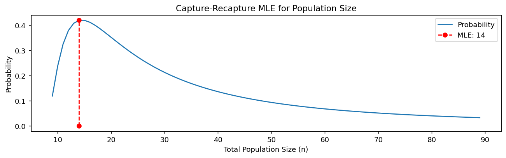

# 포획–재포획법

> **참고 자료:** [Wikipedia — Mark and Recapture](https://en.wikipedia.org/wiki/Mark_and_recapture)

## 개요

표지–재포획법은 개체를 하나하나 세는 것이 현실적으로 불가능할 때 동물 개체군의 크기를 추정하기 위해 생태학에서 흔히 쓰이는 방법이다. 개체군의 일부를 포획하여 표지를 붙인 뒤 놓아 준다. 나중에 다시 일부를 포획하고 그 표본 안에서 표지된 개체의 수를 센다. 두 번째 표본 안의 표지 개체 수는 개체군 전체의 표지 개체 수에 비례해야 하므로, 표지 개체 수를 두 번째 표본에서의 표지 개체 비율로 나누면 전체 개체군 크기의 추정값을 얻을 수 있다.

이 방법은 포획–재포획, 포획–표지–재포획, 표지–방사–재포획, 다중체계 추정, 밴드 회수, Petersen법, Lincoln법 등으로도 불린다.

## 포획–재포획법의 단계

1. **포획과 표지**: 개체군에서 개체들을 확률적으로 표본추출하여 포획한다. 재포획되었을 때 식별할 수 있도록 표지(꼬리표, 밴드, 무해한 염료 등)를 붙인다. 표지된 개체 수를 $M$이라 하자.

2. **방사**: 표지된 개체를 개체군에 다시 놓아 주고 충분히 섞이도록 한다.

3. **재포획**: 개체군에서 두 번째 확률표본을 얻는다. 이 표본의 일부는 이미 표지되어 있을 것이다. 두 번째 표본의 전체 개체 수를 $n$, 그중 표지된 개체 수를 $m$이라 하자.

4. **추정**: 두 번째 표본의 표지 개체 비율이 첫 단계에서 표지된 개체군 전체의 비율을 대표한다는 가정 아래 개체군 크기 $N$을 추정할 수 있다:

$$
\hat{N} = \frac{M \cdot n}{m}
$$

## 가정

1. **폐쇄 개체군**: 연구 기간 동안 개체군 크기가 일정하다(출생, 사망, 유입, 유출이 없다).
2. **동일한 포획확률**: 각 표본추출에서 모든 개체가 포획될 기회가 같다.
3. **표지가 행동에 영향을 주지 않음**: 표지 과정이 재포획 가능성에 영향을 주지 않는다.
4. **표지가 오래가고 눈에 띔**: 표지가 사라지지 않고 연구 기간 내내 식별 가능하다.

## 간단한 예

연못의 물고기 개체수를 추정한다고 하자:

1. **첫 포획**: 물고기 50마리를 잡아 표지하고 놓아 준다($M = 50$).
2. **두 번째 포획**: 물고기 40마리를 잡았는데($n = 40$) 그중 10마리가 표지되어 있다($m = 10$).
3. **추정**:

$$
\hat{N} = \frac{M \cdot n}{m} = \frac{50 \cdot 40}{10} = 200
$$

연못의 추정 물고기 개체수는 200마리이다.

## MLE 유도

### 초기하분포

개체군 크기가 $N$일 때 크기 $n$인 재포획 표본에서 표지 개체 $m$마리를 관측할 확률은:

$$
P(m \mid N) = \frac{\binom{M}{m} \binom{N-M}{n-m}}{\binom{N}{n}}
$$

여기서:

- $\binom{M}{m}$: $M$마리 중 표지된 $m$마리를 고르는 경우의 수.
- $\binom{N-M}{n-m}$: 남은 $N-M$마리 중 표지되지 않은 $n-m$마리를 고르는 경우의 수.
- $\binom{N}{n}$: $N$마리 중 $n$마리를 고르는 전체 경우의 수.

### 가능도함수

가능도함수 $L(N)$은 이 확률에 비례한다:

$$
L(N) = P(m \mid N) \propto \frac{\binom{M}{m} \binom{N-M}{n-m}}{\binom{N}{n}}
$$

여기서 $M$, $n$, $m$은 실험에서 알려진 값이고 $N$이 추정 대상 모수이다.

### 간단히 한 가능도

$N$에 의존하지 않는 상수를 무시하면 가능도는 다음과 같아진다:

$$
L(N) \propto \frac{(N-M)!\,(N-n)!}{(N-M-n+m)!\;N!}
$$

### 가능도의 최대화

가능도에 자연로그를 취해 $\ell(N) = \log L(N)$을 얻고 $N$에 대해 미분하면 $N$의 MLE를 얻는다:

$$
\hat{N} = \frac{M \cdot n}{m}
$$

### MLE의 직관

추정값 $\hat{N}$은 재포획 표본에서의 표지 개체 비율($m/n$)이 개체군 전체에서의 표지 개체 비율($M/N$)을 반영한다는 착상에 기반한다:

$$
\frac{m}{n} \approx \frac{M}{N}
\quad\Longrightarrow\quad
\hat{N} = \frac{M \cdot n}{m}
$$

## MLE의 성질

### 편향

표본크기가 작으면 $\hat{N}$이 약간 편향될 수 있다. **Chapman 추정량**이 편향을 보정한 대안을 제공한다:

$$
\hat{N}_{\text{Chapman}} = \frac{(M+1)(n+1)}{m+1} - 1
$$

### 분산

MLE의 분산은 다음과 같이 근사할 수 있다:

$$
\text{Var}(\hat{N}) \approx \frac{M^2 \cdot n \cdot (n-m)}{m^3}
$$

## 확장과 변형

- **다중 재포획**: 여러 차례에 걸쳐 포획하고 표지하여 추정값을 정교하게 만든다.
- **개방 개체군**: Jolly-Seber 모형 같은 확장은 개체가 들어오고 나갈 수 있는 개체군을 다룰 수 있다.
- **포획확률이 다른 경우**: Lincoln-Petersen 추정량이나 로지스틱 회귀 같은 모형으로 포획확률의 변동을 보정할 수 있다.

<div class="codebox" markdown>

### 예제 1. 포획-재포획으로 모집단 크기 추정하기 { .eg }

```python
import matplotlib.pyplot as plt
from scipy import special

def prob(n, c, r, t):
    """
    Calculate the probability of capturing 't' tagged birds in a recapture
    sample of size 'r', given that there are 'n' birds in total.

    Parameters:
    - n: Total number of birds in the population
    - c: Number of birds captured and tagged in the first stage
    - r: Number of birds recaptured in the second stage
    - t: Number of tagged birds in the recapture stage

    Returns:
    - Probability of observing 't' tagged birds in the recapture sample.
    """
    return special.comb(n - c, r - t) * special.comb(c, t) / special.comb(n, r)

def capture_recapture(c=10, r=10, t=3):
    """
    Calculate the probability distribution over possible total population sizes
    and determine the MLE (Maximum Likelihood Estimate) for the population size.

    Parameters:
    - c: Number of birds captured and tagged in the first stage
    - r: Number of birds recaptured in the second stage
    - t: Number of tagged birds in the recapture stage

    Returns:
    - prob_list: List of probabilities for each population size
    - mle_n: MLE for the total population size
    """
    prob_list = []

    # 가능한 모집단 크기 n마다 확률을 구한다.
    for n in range(c + r - t, 10 * (c + r - t)):
        prob_list.append(prob(n, c, r, t))

    # 확률이 가장 큰 n이 모집단 크기의 MLE다.
    prob_max = max(prob_list)
    idx = prob_list.index(prob_max)
    mle_n = idx + (c + r - t)
    print(f'MLE n: {mle_n}')

    return prob_list, mle_n

def draw(prob_list, mle_n, c=10, r=10, t=3):
    """
    Plot the probability distribution of the total population size
    and highlight the MLE.

    Parameters:
    - prob_list: List of probabilities for each population size
    - mle_n: MLE for the total population size
    - c, r, t: Parameters for the capture-recapture model
    """
    idx = mle_n - (c + r - t)
    fig, ax = plt.subplots(figsize=(12, 3))
    ax.plot(range(c + r - t, 10 * (c + r - t)), prob_list, label='Probability')
    ax.plot([mle_n, mle_n], [0, prob_list[idx]], 'o--r', label=f'MLE: {mle_n}')

    # 축 이름과 범례를 다듬는다.
    ax.set_xlabel('Total Population Size (n)')
    ax.set_ylabel('Probability')
    ax.set_title('Capture-Recapture MLE for Population Size')
    ax.legend()
    plt.show()

# 포획-재포획 모형의 값들: 표지 수, 재포획 수, 그중 표지된 수.
c = 5   # Birds captured and tagged in the first stage
r = 6   # Birds recaptured in the second stage
t = 2   # Tagged birds in the recapture stage

# 후보마다 확률을 구하고 가장 큰 것을 고른다.
prob_list, mle_n = capture_recapture(c, r, t)

# 확률을 후보별로 그리고 최댓값 자리를 표시한다.
draw(prob_list, mle_n, c, r, t)
```

출력:

```
MLE n: 14
```



</div>

## 연습문제

<div class="drillbox" markdown>

**연습문제 1.** <span class="diff easy" title="쉬움"></span>
어떤 야생동물 생물학자가 호수에서 물고기 $M = 20$마리를 잡아 표지했다. 나중에 $n = 15$마리를 재포획했더니 $m = 5$마리가 표지되어 있었다. 전체 개체수 $\hat{N}$에 대한 Lincoln-Petersen MLE와 Chapman 편향 보정 추정값을 계산하라.

</div>

??? success "풀이"
    Lincoln-Petersen MLE는:

    $$
    \hat{N} = \frac{M \cdot n}{m} = \frac{20 \times 15}{5} = 60
    $$

    Chapman 추정량은:

    $$
    \hat{N}_{\text{Chapman}} = \frac{(M+1)(n+1)}{m+1} - 1 = \frac{21 \times 16}{6} - 1 = 56 - 1 = 55
    $$

    Chapman 추정값(55)이 Lincoln-Petersen 추정값(60)보다 약간 작으며, 이는 소표본에 대한 편향 보정을 반영한다.

<div class="drillbox" markdown>

**연습문제 2.** <span class="diff med" title="중간"></span>
포획–재포획법이 깔고 있는 가정들을 설명하고 그것이 위배되면 어떤 일이 생기는지 서술하라.

</div>

??? success "풀이"
    핵심 가정은 다음과 같다:

    1. **폐쇄 개체군**: 포획과 재포획 사이에 출생, 사망, 유입, 유출이 없다. 위배되면 개체군이 늘었는지 줄었는지에 따라 $\hat{N}$이 부풀거나 줄어든다.

    2. **동일한 포획확률**: 모든 개체가 포획될 확률이 같다. 표지된 개체가 "덫을 피하게" 되면(재포획될 가능성이 낮아지면) $m$이 너무 작아져 $\hat{N}$이 지나치게 커진다. 반대로 "덫을 좋아하게" 되면 $\hat{N}$이 지나치게 작아진다.

    3. **표지가 사라지지 않음**: 재포획 시 표지가 여전히 보인다. 표지가 사라지면 재포획된 표지 개체 일부가 비표지로 세어져 $m$이 줄고 $\hat{N}$이 부풀려진다.

    4. **섞임**: 포획 사이에 표지된 개체가 개체군과 무작위로 섞인다. 무리 지어 남아 있으면 재포획 표본이 대표성을 갖지 못한다.

<div class="drillbox" markdown>

**연습문제 3.** <span class="diff med" title="중간"></span>
어떤 포획–재포획 연구에서 $M = 10$마리에 표지를 붙였다. $n = 10$마리를 재포획했는데 표지된 개체가 하나도 없었다($m = 0$). MLE 공식은 무엇을 주는가? 이 추정값이 합리적인가? 대안을 제시하라.

</div>

??? success "풀이"
    Lincoln-Petersen 공식은 $\hat{N} = Mn/m = 10 \times 10 / 0$을 주는데, 이는 0으로 나누는 것이므로 **정의되지 않는다**. 개체군이 무한히 크다고 추정하는 셈이어서 합리적이지 않다.

    이런 상황은 표지한 수에 비해 개체군이 매우 크거나 가정이 위배될 때 생긴다. Chapman 추정량은 이 경우를 처리할 수 있다: $\hat{N}_{\text{Chapman}} = (11 \times 11)/1 - 1 = 120$. 또는 표지하는 개체 수나 재포획 표본크기를 늘리면 더 믿을 만한 추정값을 얻을 수 있다.

<div class="drillbox" markdown>

**연습문제 4.** <span class="diff hard" title="어려움"></span>
$m$을 확률변수로 보고 $\hat{N} = Mn/m$에 델타 방법을 적용하여 근사 분산 공식 $\text{Var}(\hat{N}) \approx \frac{M^2 n(n-m)}{m^3}$을 유도하라.

</div>

??? success "풀이"
    $\hat{N} = g(m) = Mn/m$에 델타 방법을 적용한다. (초기하 모형 아래에서) $m$의 기댓값은 $E[m] = nM/N$이다. 도함수는:

    $$
    g'(m) = -\frac{Mn}{m^2}
    $$

    (초기하분포에서) $m$의 분산은 근사적으로:

    $$
    \text{Var}(m) \approx n \cdot \frac{M}{N} \cdot \frac{N-M}{N} \cdot \frac{N-n}{N-1}
    $$

    델타 방법에 의해 $\text{Var}(\hat{N}) \approx [g'(m)]^2 \text{Var}(m)$이다. $N \approx \hat{N} = Mn/m$을 대입하고 (큰 $N$에서 유한모집단 수정을 무시하며) 정리하면:

    $$
    \text{Var}(\hat{N}) \approx \frac{M^2 n^2}{m^4} \cdot \frac{n \cdot m \cdot (n-m)}{n^2} = \frac{M^2 n(n-m)}{m^3}
    $$

    $\square$

---

## 정리하며

포획–재포획은 **세지 않고 크기를 재는** 방법이다.

$$
\hat N = \frac{M n}{m}
$$

- **비례식 하나가 전부다.** 두 번째 표본의 표지 비율 $m/n$ 이 개체군 전체의 표지 비율 $M/N$ 을 대표한다고 놓으면 곧바로 나온다. 이것이 최대가능도추정량이기도 하다(링컨–피터슨 추정량).
- **$m$ 이 분모에 있다는 점이 위험하다.** 재포획에서 표지 개체가 하나도 없으면 $\hat N=\infty$ 이고, 적게 나오면 추정값이 폭발한다. 그래서 실무에서는 편향을 줄인 채프먼 추정량 $\hat N=\frac{(M+1)(n+1)}{m+1}-1$ 을 쓴다.
- **가정이 강하다.** 개체군이 닫혀 있어야 하고(출생·사망·이동 없음), 표지가 떨어지지 않아야 하며, 표지 개체와 비표지 개체의 포획 확률이 같아야 한다. **마지막 조건이 가장 자주 깨진다** — 한 번 잡힌 개체가 덫을 피하거나 반대로 더 잘 잡히는 일이 흔하다.
- **생태학 밖에서도 쓰인다.** 소프트웨어 결함 수 추정, 인구 미계수 보정, 문서 중복 탐지가 같은 구조다.

다음 절 **최대가능도의 점근적 성질**로 넘어간다. 지금까지 개별 분포에서 확인한 성질들이 **일반적으로** 왜 성립하는지를 본다.
