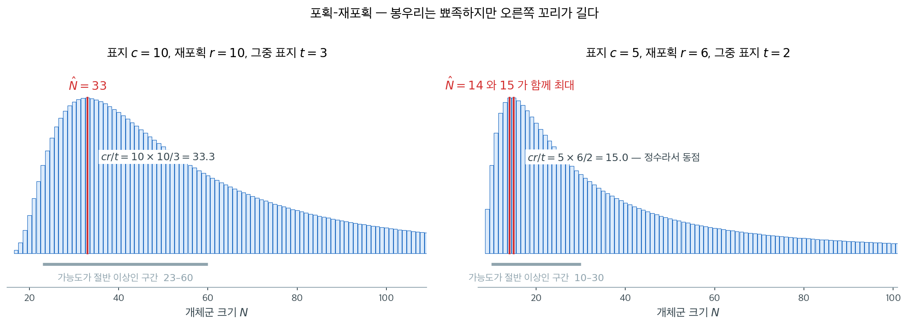

# 포획–재포획 최대가능도

## 개요

**포획–재포획법**은 직접 셀 수 없는 개체군의 크기를 추정하는 고전적인 기법이다. 일부 개체를 포획해 표지를 붙여 놓아 준 뒤 다시 일부를 포획하여 표지된 개체가 몇 마리인지 세면, 전체 개체군 크기의 최대가능도추정값을 유도할 수 있다. 이 페이지에서는 포획–재포획 모형의 초기하 가능도와 MLE를 전개한다.

---

## 1. 포획–재포획의 설정

이 방법은 두 단계로 진행된다:

1. **포획 단계:** 크기가 미지인 $N$의 개체군에서 $c$마리를 포획해 표지를 붙이고 놓아 준다.
2. **재포획 단계:** $r$마리를 포획한다. 그중 $t$마리가 표지되어 있다.

핵심 물음은 $N$이 얼마인가이다.

!!! info "가정"

    - 개체군이 폐쇄되어 있다(두 단계 사이에 출생, 사망, 유입, 유출이 없다).
    - 모든 개체가 포획될 확률이 같다.
    - 표지가 사라지지 않고 올바르게 식별된다.
    - 두 번째 단계의 포획이 첫 단계의 포획과 독립이다.

---

## 2. 초기하 모형

전체 $N$마리 중 $c$마리가 표지되어 있을 때, 크기 $r$인 재포획 표본에서 표지된 개체 수 $T$는 **초기하분포**를 따른다:

$$
P(T = t \mid N) = \frac{\binom{c}{t}\binom{N - c}{r - t}}{\binom{N}{r}}
$$

이는 $\max(0, r + c - N) \leq t \leq \min(r, c)$에서 성립한다.

관심 모수는 $N$이고, 가능도함수는 자료 $(c, r, t)$를 고정한 채 $L(N) = P(T = t \mid N)$을 $N$의 함수로 본 것이다.

---

## 3. 최대가능도추정량

$N$의 MLE는 $L(N)$을 최대화하는 값이다. $N$이 (양의 정수인) 이산 모수이므로 $N \geq c + r - t$인 정수에서 탐색한다.

MLE는 잘 알려진 닫힌 형태를 갖는다:

$$
\hat{N}_{\text{MLE}} = \left\lfloor \frac{cr}{t} \right\rfloor
$$

이것이 (가장 가까운 정수로 내림한) **Lincoln-Petersen 추정값**이다.

### 직관

MLE는 비례 논증에서 나온다. 재포획이 대표성을 가지면 재포획 표본에서 표지된 개체의 비율이 개체군에서의 비율을 근사해야 한다:

$$
\frac{t}{r} \approx \frac{c}{N} \quad \Rightarrow \quad N \approx \frac{cr}{t}
$$

---

## 4. 구현

<div class="exbox" markdown>

**보기 1.** <span class="diff easy" title="쉬움"></span> 포획-재포획 MLE 구현. 새 $c = 10$마리를 잡아 표지하고 놓아 준 뒤 $r = 10$마리를 다시 잡았더니 $t = 3$마리가 표지되어 있었다.

**(1)** 가능도를 전수 탐색하는 함수를 짜서 $\hat N$을 구하고, 닫힌 꼴 $\lfloor cr/t \rfloor$와 맞는지 확인하시오.

**(2)** 봉우리가 얼마나 넓은지 재시오. 가능도가 꼭대기의 절반 이상인 $N$의 구간은 어디까지인가.

</div>

??? success "풀이"

    **(1) 해석적으로.** 닫힌 꼴이 $\hat N = \lfloor cr/t \rfloor$이고 여기서는

    $$
    \frac{cr}{t} = \frac{10 \times 10}{3} = 33.333\ldots
    $$

    이므로 $\hat N = 33$이다. $cr/t$가 **정수가 아니라는 점**이 중요하다. 가능도비가 $1$이 되는 $N$이 없으므로 $L(32) < L(33) > L(34)$로 최대점이 하나뿐이고, 전수 탐색과 공식이 어긋날 여지가 없다. ($cr/t$가 정수이면 사정이 달라진다. 바로 아래 보기 2가 그 경우다.)

    탐색 범위의 아래쪽 벽도 짚어 두자. 표지된 $c$마리와 재포획에서 새로 잡힌 $r - t$마리는 서로 다른 개체이므로

    $$
    N \ge c + r - t = 17
    $$

    이다. 위쪽에는 그런 벽이 없다. $t$를 하나 줄이면 $cr/t$가 $33.3$에서 $50$으로 뛰므로 가능도는 **오른쪽으로 길게 늘어진다.**

    **(2) 수치적으로.** 후보 $N$마다 초기하확률을 재고, 꼭대기의 절반 이상인 것을 모은다.

    ```python
    from scipy import special

    def prob(n, c, r, t):
        """
        Hypergeometric probability: P(T = t | N = n).

        Parameters
        ----------
        n : Total population size
        c : Number tagged in capture phase
        r : Number in recapture sample
        t : Number of tagged in recapture
        """
        return special.comb(n - c, r - t) * special.comb(c, t) / special.comb(n, r)


    def capture_recapture_mle(c, r, t):
        """
        Compute the MLE of population size N via exhaustive search.
        """
        n_min = c + r - t  # minimum possible N
        n_max = 10 * n_min  # search range

        prob_list = [prob(n, c, r, t) for n in range(n_min, n_max)]
        mle_idx = max(range(len(prob_list)), key=lambda i: prob_list[i])
        mle_n = mle_idx + n_min

        return mle_n, prob_list


    # 보기: 10마리에 표지, 10마리를 다시 잡았고 그중 3마리가 표지된 개체였다.
    c, r, t = 10, 10, 3
    mle_n, probs = capture_recapture_mle(c, r, t)
    print(f"Capture: {c} tagged, Recapture: {r} caught, {t} tagged")
    print(f"MLE of N: {mle_n}")
    print(f"Lincoln-Petersen estimate: {c * r // t}")

    # 봉우리의 폭. 가능도가 꼭대기의 절반 이상인 N 을 모은다.
    n_min = c + r - t
    peak = max(probs)
    half = [n_min + i for i, p in enumerate(probs) if p >= peak / 2]
    print(f"cr/t = {c * r / t:.3f}  (정수가 아니므로 최대점은 하나)")
    print(f"가능도가 꼭대기의 절반 이상인 구간: N = {half[0]} ~ {half[-1]}")
    ```

    출력:

    ```
    Capture: 10 tagged, Recapture: 10 caught, 3 tagged
    MLE of N: 33
    Lincoln-Petersen estimate: 33
    cr/t = 33.333  (정수가 아니므로 최대점은 하나)
    가능도가 꼭대기의 절반 이상인 구간: N = 23 ~ 60
    ```

    탐색한 가능도를 그대로 그리면 이렇다. 왼쪽이 이 보기의 수치이고 오른쪽은 아래 보기 2의 수치다.

    

    전수 탐색이 준 $33$이 해석적 답 $\lfloor 33.333 \rfloor = 33$과 맞는다. **봉우리의 자리보다 그 폭이 더 할 말이 많다.** 가능도가 꼭대기의 절반 이상인 구간이 $23$부터 $60$까지로, 폭이 점추정값보다도 넓다. 표지된 10마리 중 3마리를 다시 잡았다는 관측만으로는 개체군이 25마리든 55마리든 크게 이상하지 않다는 뜻이다.

    구간이 $33$을 중심으로 대칭이 아니라 위쪽으로 치우쳐 있다는 것도 (1)에서 따진 비대칭 그대로다. 아래로는 $10$칸, 위로는 $27$칸이다. 그래서 점추정값 하나만 보고하는 것은 이 문제에서 특히 위험하다.

!!! note "$cr/t$ 가 정수이면 최대가 둘이다"
    $cr/t$가 딱 떨어지면 $\lfloor cr/t \rfloor$와 그보다 하나 작은 값이 **함께** 최대가 된다. 그러면 위 코드처럼 `max`로 찾은 값과 닫힌 형태 공식이 $1$만큼 어긋나는데, 둘 다 MLE이므로 어느 쪽도 틀리지 않았다. 바로 아래 보기 2가 그 경우를 따진다.

<div class="exbox" markdown>

**보기 2.** <span class="diff easy" title="쉬움"></span> 전수 탐색과 공식이 갈리는 경우. 어떤 야생동물 생물학자가 새 $c = 5$마리를 잡아 표지하고 놓아 준 뒤, 나중에 $r = 6$마리를 재포획했더니 그중 $t = 2$마리가 표지되어 있었다.

**(1)** 같은 함수를 그대로 돌리면 전수 탐색은 $\hat N = 14$를, 공식 $\lfloor cr/t \rfloor$는 $15$를 준다. 어느 쪽이 틀렸는가.

**(2)** 분수 연산으로 $L(14)$와 $L(15)$를 정확히 계산해 (1)의 답을 확인하고, 봉우리의 폭도 재시오.

</div>

??? success "풀이"

    **(1) 해석적으로. 어느 쪽도 틀리지 않았다.** 가능도비

    $$
    \frac{L(N)}{L(N-1)} = \frac{(N-c)(N-r)}{N(N-c-r+t)}
    $$

    가 $1$ 이상인 조건은 $N \le cr/t$다. 여기서는

    $$
    \frac{cr}{t} = \frac{5 \times 6}{2} = 15
    $$

    이 **정수**이므로 $N = 15$에서 이 부등식이 등호가 되고, 비가 정확히 $1$, 곧

    $$
    L(14) = L(15)
    $$

    이다. 가능도의 최댓값이 두 곳에서 달성되므로 최대가능도추정값이 **둘**이다. 전수 탐색은 동점 중 먼저 만나는 $14$를 돌려주고 공식은 $15$를 주지만, 둘 다 MLE다. 가능도만으로는 어느 쪽도 고를 수 없다.

    한 가지는 분명히 해 두자. 이 어긋남은 **격자가 성겨서 생긴 오차가 아니다.** $N$의 후보를 하나도 빠뜨리지 않고 다 재었는데도 동점이 남은 것이고, 동점이 생긴다는 사실 자체가 가능도비 계산이 예측한 바다.

    **(2) 수치적으로.** 부동소수점으로는 "거의 같다"와 "정확히 같다"를 가릴 수 없으므로 분수로 재어 본다.

    ```python
    from fractions import Fraction
    from math import comb

    c, r, t = 5, 6, 2
    mle_n, probs = capture_recapture_mle(c, r, t)
    print(f"MLE of N: {mle_n}")
    print(f"Lincoln-Petersen: {c * r // t}")

    def exact_prob(n, c, r, t):
        """같은 확률을 분수로 계산한다. 반올림이 끼어들지 않는다."""
        return Fraction(comb(n - c, r - t) * comb(c, t), comb(n, r))

    print(f"분수로 L(14) = {exact_prob(14, c, r, t)}")
    print(f"분수로 L(15) = {exact_prob(15, c, r, t)}")
    print(f"L(14) == L(15) ? {exact_prob(14, c, r, t) == exact_prob(15, c, r, t)}")

    # 봉우리의 폭도 보기 1 과 같은 방식으로 재 둔다.
    n_min = c + r - t
    peak = max(probs)
    half = [n_min + i for i, p in enumerate(probs) if p >= peak / 2]
    print(f"가능도가 꼭대기의 절반 이상인 구간: N = {half[0]} ~ {half[-1]}")
    ```

    출력:

    ```
    MLE of N: 14
    Lincoln-Petersen: 15
    분수로 L(14) = 60/143
    분수로 L(15) = 60/143
    L(14) == L(15) ? True
    가능도가 꼭대기의 절반 이상인 구간: N = 10 ~ 30
    ```

    $L(14)$와 $L(15)$가 둘 다 $60/143$으로 한 치도 다르지 않다. 유도가 예측한 동점이 분수 연산으로 확인되었다. 위 그림의 오른쪽 그래프에서 두 점의 높이가 같은 것도 같은 사실이다.

    봉우리 자체도 그리 뾰족하지 않다. 가능도가 꼭대기의 절반 이상인 구간이 $10$부터 $30$까지이므로, 관측 여섯 마리로 개체군 크기를 정밀하게 잡아내기는 어렵다. 보기 1에서는 이 구간에 $N$ 값이 $38$개 들어갔고 여기서는 $21$개뿐이지만, 추정값 자체가 작으므로 **상대적인** 불확실성은 오히려 크다. 보기 1의 구간은 꼭대기 $33$의 $0.70$배에서 $1.82$배까지였는데, 여기서는 꼭대기 $14$의 $0.71$배에서 $2.14$배까지가 다 그럴듯하다.

---

## 5. 추정량의 성질

!!! note "Lincoln-Petersen 추정량의 편향"
    기본 Lincoln-Petersen 추정량 $cr/t$는 편향되어 있으며, 특히 $t$가 작을 때 $N$을 과대추정하는 경향이 있다. Chapman의 보정 추정량이 이 편향을 줄여 준다:

    $$
    \hat{N}_{\text{Chapman}} = \frac{(c+1)(r+1)}{t+1} - 1
    $$

이 문제의 가능도함수 $L(N)$은 **단봉**이므로(한 번 올랐다가 내려오므로) 격자탐색을 믿을 수 있다. 다만 $cr/t$가 **정수**이면 꼭대기에서 가능도비가 정확히 $1$이 되어 최대가 두 곳에서 달성된다. 그때는 MLE가 유일하지 않다.

---

## 6. 민감도 분석

추정의 품질은 재포획된 표지 개체 수 $t$에 크게 의존한다:

- ($r$과 $c$에 비해) $t$가 크면 추정이 정밀하다.
- $t$가 작으면(예: $t = 1$) 추정을 신뢰할 수 없고 가능도함수가 평평하다.
- $t = 0$이면 MLE가 정의되지 않는다(개체군이 얼마든지 클 수 있다).

<div class="exbox" markdown>

**보기 3.** <span class="diff easy" title="쉬움"></span> 재포획 결과에 따른 민감도. $c = r = 10$을 고정하고 재포획된 표지 개체 수 $t$를 $1$부터 $10$까지 바꿔 가며 전수 탐색 MLE를 표로 만든다.

**(1)** 표를 만들기 **전에** 전수 탐색값이 $\lfloor cr/t \rfloor$와 어긋날 $t$를 모두 지목하시오.

**(2)** 표를 만들어 (1)의 예측을 확인하고, $t$가 작을 때 추정이 왜 믿기 어려운지 적으시오.

</div>

??? success "풀이"

    **(1) 해석적으로.** 보기 2에서 본 대로 전수 탐색과 공식이 갈리는 것은 **$cr/t$가 정수일 때**뿐이다. 그때 $L(\lfloor cr/t \rfloor - 1) = L(\lfloor cr/t \rfloor)$인 동점이 생기고 탐색은 작은 쪽을 고른다. 여기서 $cr = 100$이므로 조건은

    $$
    t \mid 100, \qquad 1 \le t \le 10
    $$

    곧 $t \in \{1, 2, 4, 5, 10\}$이다.

    그런데 **$t = 10$은 예외다.** 동점 상대는 $cr/t - 1 = 9$인데 탐색 범위의 아래쪽 벽이

    $$
    N \ge c + r - t = 10 + 10 - 10 = 10
    $$

    이어서 $9$가 애초에 후보가 아니다. 표지 $10$마리에 재포획 $10$마리가 모두 표지된 개체였다면 개체군이 $10$마리보다 작을 수 없으니 당연한 일이다. 동점의 한쪽이 경계 밖으로 밀려나 최대점이 다시 하나가 된다.

    따라서 **어긋나는 것은 $t = 1, 2, 4, 5$ 넷**이고 그때마다 탐색값이 공식보다 정확히 $1$ 작아야 한다. 나머지 $t = 3, 6, 7, 8, 9, 10$에서는 두 값이 같아야 한다.

    **(2) 수치적으로.** 예측한 대로인지 보려면 표에 $\lfloor cr/t \rfloor$ 열과 동점 여부를 함께 찍어야 한다.

    ```python
    from scipy import special

    def sensitivity_analysis():
        """재포획된 표지 개체 수 t 를 바꿔 가며 MLE가 어떻게 변하는지 본다.

        t가 작을수록(표지가 거의 안 잡힐수록) 추정 개체수가 커진다.
        t = 1 처럼 극단적인 경우 추정값이 100 가까이 치솟고 매우 불안정해지는데,
        포획-재포획 조사에서 재포획 표본을 충분히 크게 잡아야 하는 이유다.
        """
        c, r = 10, 10
        print(f"c = {c}, r = {r}")
        print(f"{'t':>4} {'MLE':>6} {'cr/t':>8} {'floor':>6}  동점?")
        print("-" * 36)
        for t in range(1, min(c, r) + 1):
            n_min = c + r - t
            n_max = 10 * n_min
            probs = [special.comb(n - c, r - t) * special.comb(c, t) / special.comb(n, r)
                     for n in range(n_min, n_max)]
            mle_idx = max(range(len(probs)), key=lambda i: probs[i])
            mle_n = mle_idx + n_min

            # cr/t 가 정수이면 그 값과 하나 작은 값이 함께 최대가 된다.
            # 단 하나 작은 값이 n_min 아래로 밀려나면 후보가 아니므로 동점이 사라진다.
            tie = (c * r) % t == 0 and c * r // t - 1 >= n_min
            print(f"{t:>4} {mle_n:>6} {c*r/t:>8.1f} {c*r//t:>6}  {'예' if tie else '아니오'}")

    sensitivity_analysis()
    ```

    출력:

    ```
    c = 10, r = 10
       t    MLE     cr/t  floor  동점?
    ------------------------------------
       1     99    100.0    100  예
       2     49     50.0     50  예
       3     33     33.3     33  아니오
       4     24     25.0     25  예
       5     19     20.0     20  예
       6     16     16.7     16  아니오
       7     14     14.3     14  아니오
       8     12     12.5     12  아니오
       9     11     11.1     11  아니오
      10     10     10.0     10  아니오
    ```

    **(1)의 예측이 그대로 맞았다.** 동점이 "예"인 네 줄($t = 1, 2, 4, 5$)에서만 MLE 열이 floor 열보다 $1$ 작고, 나머지 여섯 줄은 두 열이 같다. $t = 10$은 $cr/t = 10$이 정수인데도 동점이 아니라고 찍혔다 — 경계가 동점 상대를 지운 그 경우다.

    **$t$가 작을 때가 문제다.** $t$를 $1$에서 $2$로 **한 마리** 늘리는 것만으로 추정값이 $99$에서 $49$로 반토막 난다. $3$으로 늘리면 $33$이다. 반대편을 보면 $t$를 $9$에서 $10$으로 늘릴 때는 $11$에서 $10$으로 하나밖에 움직이지 않는다. $\hat N \approx cr/t$가 $t$의 **역수**이므로

    $$
    \left\lvert \frac{d\hat N}{dt} \right\rvert = \frac{cr}{t^2}
    $$

    이고, $t = 1$에서 이 값이 $100$, $t = 10$에서 $1$이다. **백 배 차이다.** 표지 개체를 몇 마리 다시 잡느냐가 추정의 정밀도를 거의 전부 정한다는 뜻이고, 조사 설계에서 재포획 표본을 충분히 크게 잡으라는 권고가 여기서 나온다.

    $t = 0$이면 $cr/t$가 아예 정의되지 않는다. 가능도가 $N$에 대해 단조증가해서 최대점이 무한대로 달아나므로 MLE가 없고, 채프먼 추정량 같은 보정이 필요하다.

---

## 7. 해석

- 포획–재포획 MLE는 표지–재포획 자료로부터 개체군 크기를 추정하는 원리 있는 방법을 제공한다.
- 이 방법은 유한모집단에서의 비복원추출을 모형화하는 초기하분포에 의존한다.
- Lincoln-Petersen 공식 $\hat{N} = cr/t$는 우아한 비례 해석을 갖지만 $t$가 작으면 편향될 수 있다.
- 실제 생태학 응용에서는 폐쇄 개체군 가정과 동일 포획확률 가정이 깨지는 경우를 고려해야 한다.

---

## 연습문제

<div class="drillbox" markdown>

**연습문제 1.** <span class="diff easy" title="쉬움"></span> 어떤 해양생물학자가 물고기 $c = 20$마리에 표지를 붙여 놓아 주었다. 나중에 $r = 25$마리를 표본으로 잡았더니 $t = 5$마리가 표지되어 있었다. 격자탐색과 Lincoln-Petersen 공식 두 가지로 전체 개체수의 MLE를 계산하라.

</div>

??? success "풀이"
    Lincoln-Petersen: $\hat{N} = \lfloor cr/t \rfloor = \lfloor 20 \times 25/5 \rfloor = 100$.

    격자탐색:
    ```python
    from scipy import special
    c, r, t = 20, 25, 5
    n_min = c + r - t  # = 40
    probs = [special.comb(n - c, r - t) * special.comb(c, t) / special.comb(n, r)
             for n in range(n_min, 500)]
    mle_idx = max(range(len(probs)), key=lambda i: probs[i])
    print(f"MLE: N = {mle_idx + n_min}")
    ```

    출력:

    ```
    MLE: N = 100
    ```

    두 방법 모두 $\hat{N} = 100$을 준다. $\square$

---

<div class="drillbox" markdown>

**연습문제 2.** <span class="diff med" title="중간"></span> $N$을 연속으로 다룰 때 Lincoln-Petersen 추정량 $\hat{N} = cr/t$가 초기하 가능도를 최대화하는 값임을 보여라. (힌트: $L(N)/L(N-1) > 1$일 필요충분조건이 $N < cr/t$임을 보여라.)

</div>

??? success "풀이"
    가능도비는:

    $$
    \frac{L(N)}{L(N-1)} = \frac{\binom{N-c}{r-t}}{\binom{N-1-c}{r-t}} \cdot \frac{\binom{N-1}{r}}{\binom{N}{r}}
    $$

    $\binom{n}{k}/\binom{n-1}{k} = n/(n-k)$를 사용하면:

    $$
    \frac{L(N)}{L(N-1)} = \frac{N - c}{N - c - (r-t)} \cdot \frac{N - r}{N} = \frac{(N-c)(N-r)}{N(N-c-r+t)}
    $$

    이 비가 1을 넘을 조건은 $(N-c)(N-r) > N(N-c-r+t)$, 즉 $N^2 - (c+r)N + cr > N^2 - (c+r-t)N$이며, 정리하면 $cr > tN$, 즉 $N < cr/t$이다.

    따라서 $L(N)$은 $N < cr/t$에서 증가하고 $N > cr/t$에서 감소하므로, ($N$이 정수여야 하므로) 최댓값이 $N = \lfloor cr/t \rfloor$에 있음이 확인된다. $\square$

---

<div class="drillbox" markdown>

**연습문제 3.** <span class="diff med" title="중간"></span> Chapman의 보정 추정량은 $\hat{N}_C = (c+1)(r+1)/(t+1) - 1$이다. $c = 10, r = 10, t = 3$에 대해 $\hat{N}_C$를 계산하고 MLE와 비교하라. 이 보정이 유용한 이유는 무엇인가?

</div>

??? success "풀이"
    Chapman 추정값: $\hat{N}_C = (11)(11)/4 - 1 = 121/4 - 1 = 30.25 - 1 = 29.25$.

    MLE(Lincoln-Petersen)는 $\hat{N} = \lfloor 100/3 \rfloor = 33$을 준다.

    Chapman 추정량이 더 작은 이유는 Lincoln-Petersen 추정량의 양의 편향을 보정하기 때문이다. 이 편향은 $1/T$가 볼록하므로 Jensen 부등식에 의해 $E[cr/T] > cr/E[T]$이기 때문에 생긴다. Chapman의 보정은 이 편향을 대략 제거하며, $r$과 $c$에 비해 $t$가 작을 때 특히 유용하다. $\square$

---

<div class="drillbox" markdown>

**연습문제 4.** <span class="diff med" title="중간"></span> 재포획에서 표지된 개체가 하나도 없으면($t = 0$) MLE가 존재하지 않는 이유를 설명하라. 이는 포획–재포획 연구의 설계에 무엇을 함의하는가?

</div>

??? success "풀이"
    $t = 0$일 때 가능도함수는:

    $$
    L(N) = \frac{\binom{N-c}{r}}{\binom{N}{r}}
    $$

    $t = 0$이면 $L(N)$은 $N$에 대해 증가한다. 개체군이 클수록 재포획된 개체 중에 표지된 것이 하나도 없을 가능성이 커지기 때문이다. $N \to \infty$일 때 $L(N) \to 1$이다. 유한한 최대점이 없으므로 MLE가 존재하지 않는다.

    **설계에 대한 함의:** $t > 0$이 될 가능성이 높도록 연구를 설계해야 한다. 이를 위해서는:

    - 충분히 많은 수 $c$에 표지를 붙인다.
    - 충분히 많은 수 $r$을 재포획한다.
    - $P(T > 0)$이 높아지도록 곱 $cr/N$이 충분히 커야 한다. 경험 법칙으로 $cr \gg N$이거나 적어도 $cr/N > 5$여야 표지된 개체를 재포획할 확률이 웬만큼 확보된다. $\square$

---

<div class="drillbox" markdown>

**연습문제 5.** <span class="diff med" title="중간"></span>
격자탐색으로 $\hat N$을 찾을 때 격자의 범위와 간격을 어떻게 정해야 하는가? $N$이 정수임을 이용한 더 나은 방법을 적어라.

</div>

??? success "풀이"
    **격자의 하한.** 논리적으로 $N \ge M + r - t$여야 한다. 표지한 $M$마리, 두 번째로 잡은 $r$마리 중 표지되지 않은 $r-t$마리가 모두 다른 개체이기 때문이다. 이보다 작은 $N$은 가능도가 0이다.

    **격자의 상한.** 가능도가 $N$이 커질수록 단조감소하므로 명확한 상한이 없다. 실무에서는 $\hat N_{\text{LP}} = cr/t$의 몇 배(예: 5배)로 잡고, 가능도가 최댓값의 $10^{-6}$ 아래로 떨어지는지 확인한다. $t$가 작으면 꼬리가 매우 길어지므로 범위를 넉넉히 잡아야 한다.

    **간격.** $N$이 정수이므로 간격 1이 자연스럽고, 그것이 곧 정확한 탐색이다. 실수로 두고 촘촘한 격자를 쓰면 계산만 늘고 얻는 것이 없다.

    **더 나은 방법.** 앞 절 연습문제에서 본 **가능도비 논증**을 쓰면 탐색 자체가 필요 없다.

    $$
    \frac{L(N)}{L(N-1)} = \frac{(N-c)(N-r)}{N(N-c-r+t)} > 1 \iff N < \frac{cr}{t}
    $$

    이므로 곧바로 $\hat N = \lfloor cr/t\rfloor$이다. 격자탐색은 이 결과를 **확인하는 용도**로 쓰는 것이 옳다.

    **계산상의 주의.** 초기하 가능도를 이항계수로 직접 계산하면 $N$이 크거나 $c$, $r$가 클 때 오버플로가 난다. `scipy.stats.hypergeom.pmf`를 쓰거나, 직접 계산한다면 `scipy.special.gammaln`으로 **로그 척도에서** 계산해야 한다.

    ```python
    from scipy.special import gammaln
    def log_choose(n, k):
        return gammaln(n + 1) - gammaln(k + 1) - gammaln(n - k + 1)
    ```

---

<div class="drillbox" markdown>

**연습문제 6.** <span class="diff med" title="중간"></span>
$c=10$, $r=10$, $t=3$인 자료에서 $N$의 **프로파일 가능도 구간**을 구하는 절차를 적어라. 왈드 구간보다 나은 이유는 무엇인가?

</div>

??? success "풀이"
    **절차.**

    1. $\hat N = \lfloor 100/3\rfloor = 33$과 $\ell(\hat N) = \ln L(33)$을 구한다.
    2. 각 정수 $N \ge c+r-t = 17$에 대해 $\Lambda(N) = 2\{\ell(\hat N)-\ell(N)\}$을 계산한다.
    3. $\Lambda(N) \le \chi^2_{1,0.95} = 3.841$인 $N$의 집합을 구간으로 삼는다.

    이 자료에서는 $(19,\ 104)$가 나온다. **$\hat N=33$을 중심으로 극도로 비대칭**이며, 위로 훨씬 길다.

    **왈드보다 나은 이유.**

    - **비대칭을 담는다.** $\hat N = cr/t$가 $t$의 역수이므로 $t$가 하나 줄면 $\hat N$이 크게 뛴다($t=2$면 50, $t=1$이면 100). 대칭 구간으로는 이 구조를 표현할 수 없다.
    - **논리적 하한을 지킨다.** 가능도가 $N < c+r-t$에서 0이므로 프로파일 구간이 자동으로 그 아래로 내려가지 않는다. 왈드 구간은 음수까지 뻗을 수 있다.
    - **$t$가 작아도 쓸 수 있다.** $t=1$이어도 유한한 구간이 나온다. 왈드는 표준오차 공식 $\sqrt{c^2r(r-t)/t^3}$이 폭발한다.

    **덧붙임.** 이 구간도 $\chi^2$ 근사에 기대므로 $t$가 아주 작으면 포함확률이 정확하지 않다. 그때는 초기하 분포의 정확 구간(각 $N$에 대해 $t$의 꼬리 확률을 계산해 뒤집는 방식)을 쓴다.

---

<div class="drillbox" markdown>

**연습문제 7.** <span class="diff med" title="중간"></span>
포획-재포획 모의실험을 설계해 링컨-피터슨 추정량의 편향과 채프먼 추정량의 편향을 비교하려 한다. 어떤 절차로 만들겠는가? 어떤 요인을 바꿔 가며 볼 것인가?

</div>

??? success "풀이"
    **절차.**

    ```python
    rng = np.random.default_rng(0)
    N_true, c, r, B = 200, 40, 40, 20_000
    lp, ch = [], []
    for _ in range(B):
        # 표지된 c 마리가 든 모집단에서 r 마리를 비복원으로 뽑는다.
        t = rng.hypergeometric(ngood=c, nbad=N_true - c, nsample=r)
        lp.append(c * r / t if t > 0 else np.nan)       # t=0 이면 정의되지 않는다
        ch.append((c + 1) * (r + 1) / (t + 1) - 1)
    print(np.nanmean(lp) - N_true, np.mean(ch) - N_true)
    ```

    핵심은 **$t$를 초기하분포에서 뽑는 것**이다. 비복원추출을 그대로 모사해야 한다.

    **주의할 점.** $t=0$인 반복에서 링컨-피터슨이 정의되지 않는다. 이를 `nan`으로 두고 제외하면 **그 자체가 편향을 만든다.** $t=0$은 $\hat N$이 매우 커야 할 상황인데 그것만 골라 버리는 셈이다. 정직하게 하려면 $t=0$의 발생 빈도를 따로 보고해야 하며, 이것이 "링컨-피터슨은 $t=0$에서 쓸 수 없다"는 사실의 정량적 표현이다.

    **바꿔 가며 볼 요인.**

    - **$E[t] = cr/N$의 크기.** 이것이 편향의 크기를 지배한다. $E[t]$가 5 이하이면 링컨-피터슨의 편향이 뚜렷하고, 20을 넘으면 두 추정량이 거의 같아진다.
    - **$N$의 크기.** $c$, $r$를 고정하고 $N$을 키우면 $E[t]$가 작아져 편향이 커진다.
    - **$c$와 $r$의 균형.** $cr$를 고정한 채 $c=10$, $r=160$과 $c=r=40$을 비교하면 후자가 낫다.

    **볼 것.** 편향뿐 아니라 **평균제곱오차**와 **중앙값**도 함께 본다. 링컨-피터슨의 분포는 오른쪽으로 극도로 치우쳐 있어 평균과 중앙값이 크게 다르고, 평균만 보면 실제 성능을 오해하기 쉽다.

---

<div class="drillbox" markdown>

**연습문제 8.** <span class="diff med" title="중간"></span>
표본을 세 번 뽑는 설계에서 각 개체의 **포획 이력**(예: $110$, $011$)을 관측한다. 관측 가능한 이력과 관측 불가능한 이력을 구분하고, $N$을 추정하는 모형을 개략적으로 적어라.

</div>

??? success "풀이"
    **이력.** 세 번의 표본에서 잡혔으면 1, 아니면 0으로 적으면 $2^3 = 8$가지 이력이 있다.

    | 이력 | 관측 여부 |
    |---|---|
    | 100, 010, 001, 110, 101, 011, 111 | 관측됨 (7가지) |
    | **000** | **관측 불가** |

    핵심은 $n_{000}$을 셀 수 없다는 점이고, $N = n_{000} + \sum_{\text{나머지}} n_\omega$이므로 $N$을 추정하는 것은 곧 $n_{000}$을 추정하는 것이다.

    **모형.** 개체마다 독립이고 각 표본의 포획확률이 $p_1,p_2,p_3$라 하면, 이력 $\omega$의 확률이

    $$
    \pi_\omega = \prod_{j=1}^3 p_j^{\omega_j}(1-p_j)^{1-\omega_j}
    $$

    이다. 관측된 도수 $\{n_\omega\}_{\omega \ne 000}$는 **영절단 다항분포**를 따르므로

    $$
    L(N, \mathbf{p}) = \frac{N!}{\left(\prod_{\omega\ne000}n_\omega!\right)\,n_{000}!}\prod_\omega \pi_\omega^{n_\omega}
    $$

    를 $n_{000} = N - \sum n_\omega$로 두고 최대화한다. 실무에서는 $\pi_{000}$으로 조건화한 조건부 가능도로 $\mathbf{p}$를 먼저 추정하고, 호비츠-톰프슨 형태

    $$
    \hat N = \frac{\text{관측 개체 수}}{1-\hat\pi_{000}}
    $$

    으로 $N$을 얻는다.

    **두 번보다 나은 점.** 표본이 셋이면 모수가 3개인데 관측 가능한 자유도가 6이므로 **여유가 생긴다.** 그 여유로 가정을 완화할 수 있다.

    - $M_t$ 모형: 표본마다 $p_j$가 다름(위 모형).
    - $M_b$ 모형: 한 번 잡힌 개체의 포획확률이 달라짐(덫 기피·선호).
    - $M_h$ 모형: 개체마다 $p_i$가 다름(이질성). 베타 혼합이나 잭나이프 추정량을 쓴다.
    - 이들을 조합한 $M_{th}$, $M_{bh}$ 등.

    두 표본만으로는 이 중 어느 것도 검정할 수 없다. **표본을 세 번 이상 잡는 것이 포획-재포획 설계의 표준 권고인 이유**다.

---

<div class="drillbox" markdown>

**연습문제 9.** <span class="diff med" title="중간"></span>
코드에서 격자탐색 대신 `scipy.optimize`를 쓰려 한다. 어떤 어려움이 있으며 어떻게 우회하겠는가?

</div>

??? success "풀이"
    **어려움 1 — $N$이 정수다.** `minimize`류의 최적화기는 연속 모수를 전제한다. 실수 $N$에 대해 초기하 PMF를 정의하려면 이항계수를 감마함수로 바꿔야 한다.

    $$
    \binom{a}{b} \to \frac{\Gamma(a+1)}{\Gamma(b+1)\Gamma(a-b+1)}
    $$

    이렇게 하면 연속 확장이 되고 최적화기가 돌아가지만, 결과를 반올림해야 하며 그 값이 정말 정수 MLE라는 보장은 따로 확인해야 한다.

    **어려움 2 — 제약이 있다.** $N \ge c+r-t$이고 그 아래에서는 가능도가 정의되지 않는다. 최적화기가 이 영역을 밟으면 `nan`이 나와 멈춘다.

    **어려움 3 — 매우 평평하다.** $t$가 작으면 가능도가 넓은 범위에서 거의 평평해 수렴 판정이 어렵고, 초기값에 따라 엉뚱한 곳에서 멈춘다.

    **우회.**

    - **재모수화.** $N = (c+r-t) + e^\eta$로 두고 $\eta \in \mathbb{R}$을 최적화하면 제약이 자동으로 지켜진다. 이는 일반적으로 유용한 요령이다(양수 모수는 로그, $(0,1)$ 모수는 로짓).
    - **경계 지정.** `minimize(..., bounds=[(c+r-t, 10*c*r/t)])`처럼 명시적으로 제약을 준다.
    - **애초에 최적화하지 않는다.** 이 문제에는 닫힌 해 $\lfloor cr/t\rfloor$가 있으므로 수치 최적화가 불필요하다.

    **일반 교훈.** **닫힌 해가 있으면 그것을 쓰고, 수치 최적화는 해가 없을 때만 쓴다.** 그리고 정수 모수는 최적화기에 맡기기보다 이웃한 값의 가능도를 직접 비교하는 편이 안전하다. 이 예에서는 격자탐색이 오히려 더 나은 도구인데, 모수가 하나이고 범위가 제한되어 있으며 정수이기 때문이다.

---

<div class="drillbox" markdown>

**연습문제 10.** <span class="diff hard" title="어려움"></span> 델타 방법으로 Lincoln-Petersen 추정량 $\hat{N} = cr/T$의 분산을 유도하라. 초기하분포의 분산은 $\text{Var}(T) = r \cdot \frac{c}{N} \cdot \frac{N-c}{N} \cdot \frac{N-r}{N-1}$이다.

</div>

??? success "풀이"
    $g(T) = cr/T$로 두어 $\hat{N} = g(T)$라 하자. 델타 방법에 의해:

    $$
    \text{Var}(\hat{N}) \approx [g'(E[T])]^2 \, \text{Var}(T)
    $$

    $g'(T) = -cr/T^2$이고 $E[T] = rc/N$이므로:

    $$
    g'(E[T]) = \frac{-cr}{(rc/N)^2} = \frac{-N^2}{cr}
    $$

    대입하면:

    $$
    \text{Var}(\hat{N}) \approx \frac{N^4}{c^2 r^2} \cdot r \cdot \frac{c}{N} \cdot \frac{N-c}{N} \cdot \frac{N-r}{N-1}
    $$

    $$
    = \frac{N^2(N-c)(N-r)}{cr(N-1)}
    $$

    이 식은 $c$와 $r$이 커질수록 분산이 줄고 $N$이 커질수록 분산이 늘어남을 보여 준다. 포획 비율이 작은 큰 개체군에서는 분산이 매우 커질 수 있어 상당한 포획 노력이 필요함을 말해 준다. $\square$

---

## 정리하며

포획–재포획을 **초기하 가능도**에서 정식으로 유도했다.

- **가능도가 $N$ 의 함수다.** 표지 $c$ 마리가 있는 개체군 $N$ 에서 $r$ 마리를 뽑아 $t$ 마리가 표지일 확률이 초기하분포로 주어지고, 이를 $N$ 의 함수로 본 것이 가능도다.
- **$N$ 이 정수라 미분을 쓸 수 없다.** 대신 연속한 두 값의 가능도비 $L(N)/L(N-1)$ 이 $1$ 을 넘는지 따져 최댓값을 찾는다. 이산 모수에서 쓰는 표준 수법이다.
- **결과는 앞 절의 비례식과 같다.** $\hat N=\lfloor cr/t\rfloor$ 이며, 직관적 추정량이 최대가능도추정량이기도 하다는 것이 확인된다.
- **가능도가 $N$ 에 대해 매우 평평하다.** 그래서 점추정값은 얻기 쉬워도 신뢰구간이 넓으며, **$t$ 가 작을수록 오른쪽으로 심하게 늘어진다.** 점추정값만 보고하는 것이 위험한 대표적인 예다.

다음 절 **로그가능도 시각화**로 넘어간다. 가능도의 봉우리가 실제로 어떻게 생겼는지 그려 보면, 추정값과 정밀도가 한 그림에서 읽힌다.
