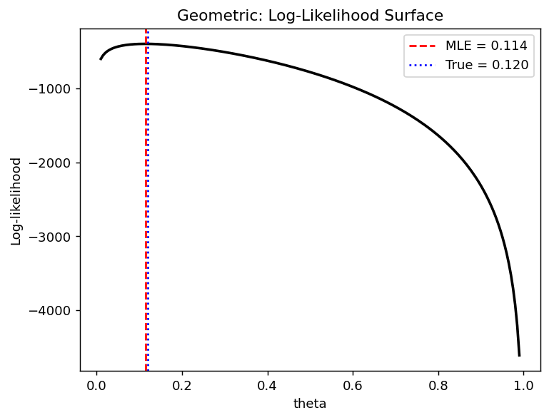
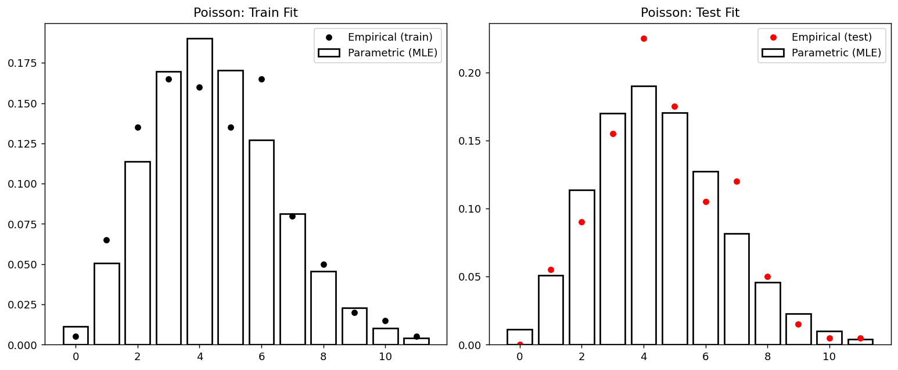

# Geometric과 Poisson의 최대가능도

## 개요

최대가능도추정(MLE)은 관측된 자료에 모수적 모형을 맞추는 원리 있는 방법을 제공한다. 이 페이지에서는 두 가지 기본적인 이산분포인 Geometric과 Poisson의 MLE를 유도하고 시연하며, 모수적 MLE 적합을 남겨 둔 검정 자료에서 비모수적 경험 PMF와 비교한다. 이 분석은 모형이 올바르게 설정되었을 때 모수적 모형이 왜 더 잘 일반화되는지를 부각한다.

## Geometric 분포의 MLE

### 모형

Geometric 분포는 첫 실패 이전의 연속 성공 횟수를 모형화한다. 모수 $p$(각 시행의 성공확률)에 대해:

$$
P(X = k) = (1 - p)\, p^k, \quad k = 0, 1, 2, \ldots
$$

평균은 $E[X] = p / (1 - p)$이다.

### MLE 유도

관측값 $x_1, \ldots, x_n$이 주어졌을 때 로그가능도는:

$$
\ell(p) = \sum_{i=1}^n \left[ x_i \log p + \log(1 - p) \right] = n_s \log p + n \log(1 - p)
$$

여기서 $n_s = \sum_{i=1}^n x_i$는 전체 성공 횟수이다. 미분하여 0으로 두면:

$$
\frac{d\ell}{dp} = \frac{n_s}{p} - \frac{n}{1 - p} = 0
$$

풀면:

$$
\hat{p}_{\text{MLE}} = \frac{n_s}{n_s + n} = \frac{\bar{x}}{1 + \bar{x}}
$$

### 시연

<div class="codebox" markdown>

**예제 1.** 기하분포의 MLE

```python
import numpy as np

np.random.seed(42)

def geometric_mle_demo(n_train=1000, n_test=1000, p_true=0.12):
    """기하분포의 MLE — 모수적 적합과 비모수적 적합을 견준다."""
    # 자료를 만든다. 첫 실패가 나올 때까지의 성공 횟수다.
    train = np.random.geometric(1 - p_true, n_train) - 1  # 0-indexed
    test = np.random.geometric(1 - p_true, n_test) - 1

    # 최대가능도추정값.
    p_hat = train.mean() / (1 + train.mean())
    k_max = max(train.max(), test.max()) + 1
    k_vals = np.arange(k_max)

    # 모수적 적합: MLE를 넣은 확률질량함수.
    pmf_param = (1 - p_hat) * p_hat ** k_vals

    # 비모수적 적합: 자료의 상대도수를 그대로 쓴다.
    pmf_train = np.bincount(train, minlength=k_max) / n_train
    pmf_test = np.bincount(test, minlength=k_max) / n_test

    # 시험자료에서의 RMSE.
    err_param = np.sqrt(np.mean((pmf_param - pmf_test)**2))
    err_nonparam = np.sqrt(np.mean((pmf_train - pmf_test)**2))

    print(f"True p = {p_true:.3f}")
    print(f"MLE p_hat = {p_hat:.4f}")
    print(f"Test RMSE -- parametric: {err_param:.5f}")
    print(f"Test RMSE -- nonparametric: {err_nonparam:.5f}")

geometric_mle_demo()
```

출력:

```
True p = 0.120
MLE p_hat = 0.1220
Test RMSE -- parametric: 0.00996
Test RMSE -- nonparametric: 0.01164
```

</div>

### 로그가능도 곡면

로그가능도는 $p$에 대해 오목한 함수이며 유일한 전역 최댓값이 있음을 확인해 준다:

<div class="codebox" markdown>

**예제 2.** 기하분포 로그가능도 곡면

```python
import matplotlib.pyplot as plt

# numpy의 geometric은 "첫 성공까지의 시행 수"(1부터)를 준다.
# 여기서 쓰는 판본은 "첫 성공 이전의 실패 수"(0부터)이므로 1을 뺀다.
# 성공확률을 1 - 0.12 로 준 것은, 이 절의 theta 가 numpy의 p와
# 서로 여집합 관계이기 때문이다(theta = 실패확률).
train = np.random.geometric(1 - 0.12, 1000) - 1

# 로그가능도 l(theta) = (실패 총횟수) log(theta) + (시행 수) log(1-theta).
# 관측이 1000개인데 계산에 들어가는 것은 이 두 숫자뿐이다.
# 이런 요약값을 충분통계량이라고 한다.
n_success = train.sum()
n_fail = len(train)

theta_grid = np.linspace(0.01, 0.99, 200)
ll = n_success * np.log(theta_grid) + n_fail * np.log(1 - theta_grid)

# 미분해서 0으로 두면 나오는 닫힌 해. 격자 탐색의 봉우리와 일치해야 한다.
p_hat = train.mean() / (1 + train.mean())

plt.plot(theta_grid, ll, "k-", lw=2)
plt.axvline(p_hat, color="red", linestyle="--", label=f"MLE = {p_hat:.3f}")
plt.axvline(0.12, color="blue", linestyle=":", label="True = 0.120")
plt.xlabel("theta")
plt.ylabel("Log-likelihood")
plt.title("Geometric: Log-Likelihood Surface")
plt.legend()
plt.show()
```



</div>

## Poisson 분포의 MLE

### 모형

Poisson 분포는 고정된 구간에서 일어나는 사건의 수를 모형화한다:

$$
P(X = k) = \frac{e^{-\lambda}\, \lambda^k}{k!}, \quad k = 0, 1, 2, \ldots
$$

평균과 분산이 모두 $\lambda$이다.

### MLE 유도

관측값 $x_1, \ldots, x_n$이 주어졌을 때 ($\lambda$에 의존하지 않는 상수를 제외한) 로그가능도는:

$$
\ell(\lambda) = \left(\sum_{i=1}^n x_i\right) \log \lambda - n\lambda
$$

미분하면:

$$
\frac{d\ell}{d\lambda} = \frac{\sum x_i}{\lambda} - n = 0
$$

풀면 잘 알려진 결과를 얻는다:

$$
\hat{\lambda}_{\text{MLE}} = \bar{x}
$$

Poisson 비율 모수의 MLE는 단순히 표본평균이다.

### 시연

<div class="codebox" markdown>

**예제 3.** 포아송분포의 MLE

```python
from scipy import stats

def poisson_mle_demo(n_train=200, n_test=200, lam_true=4.5):
    """포아송분포의 MLE — 모수적 적합과 비모수적 적합을 견준다."""
    np.random.seed(42)
    train = np.random.poisson(lam_true, n_train)
    test = np.random.poisson(lam_true, n_test)

    lam_hat = train.mean()
    k_max = max(train.max(), test.max()) + 1
    k_vals = np.arange(k_max)

    # 모수적 적합: MLE를 넣은 확률질량함수.
    pmf_param = stats.poisson.pmf(k_vals, lam_hat)

    # 비모수적 적합: 자료의 상대도수를 그대로 쓴다.
    pmf_train = np.bincount(train, minlength=k_max) / n_train
    pmf_test = np.bincount(test, minlength=k_max) / n_test

    # 시험자료에서의 RMSE.
    err_param = np.sqrt(np.mean((pmf_param - pmf_test)**2))
    err_nonparam = np.sqrt(np.mean((pmf_train - pmf_test)**2))

    print(f"True lambda = {lam_true:.2f}")
    print(f"MLE lambda_hat = {lam_hat:.4f}")
    print(f"Test RMSE -- parametric: {err_param:.5f}")
    print(f"Test RMSE -- nonparametric: {err_nonparam:.5f}")

    # 아래 그림에서 다시 쓰도록 계산 결과를 돌려준다
    return k_vals, pmf_param, pmf_train, pmf_test

k_vals, pmf_param, pmf_train, pmf_test = poisson_mle_demo()
```

출력:

```
True lambda = 4.50
MLE lambda_hat = 4.4800
Test RMSE -- parametric: 0.01882
Test RMSE -- nonparametric: 0.03342
```

</div>

### 모수적 적합과 비모수적 적합의 비교

<div class="codebox" markdown>

**예제 4.** 모수적 적합과 비모수적 적합의 비교

```python
import matplotlib.pyplot as plt

# 위 함수가 돌려준 값을 그대로 쓴다.
fig, axes = plt.subplots(1, 2, figsize=(12, 5))

# 왼쪽: 훈련자료에 대한 적합.
# 막대(모수적 MLE)와 점(경험적 PMF)이 잘 겹친다. 같은 자료로 맞췄으니 당연하다.
axes[0].bar(k_vals, pmf_param, color="white", edgecolor="black",
            lw=1.5, label="Parametric (MLE)")
axes[0].plot(k_vals, pmf_train, "ko", ms=5, label="Empirical (train)")
axes[0].set_title("Poisson: Train Fit")
axes[0].legend()

# 오른쪽: **보지 않은** 시험자료에 대한 적합. 여기가 진짜 시험이다.
# 막대는 왼쪽과 똑같다(모형은 훈련자료로만 맞췄으므로).
# 빨간 점만 새 자료로 바뀌었는데도 막대를 잘 따라간다.
# 반면 경험적 PMF는 훈련자료의 우연한 들쭉날쭉함까지 외웠기 때문에
# 새 자료에서는 오차가 더 크다. 위 출력의 RMSE 두 값이 그 차이다.
axes[1].bar(k_vals, pmf_param, color="white", edgecolor="black",
            lw=1.5, label="Parametric (MLE)")
axes[1].plot(k_vals, pmf_test, "ro", ms=5, label="Empirical (test)")
axes[1].set_title("Poisson: Test Fit")
axes[1].legend()

plt.tight_layout()
plt.show()
```



</div>

## 해석

- **모수적 모형이 더 잘 일반화된다.** 가정한 모형족이 옳으면(자료가 실제로 Geometric이나 Poisson 분포에서 나왔으면) MLE에 기반한 모수적 PMF가 비모수적 경험 PMF보다 검정 자료의 RMSE가 대체로 작다. 모수적 모형은 함수 형태를 통해 모든 $k$ 값에 걸쳐 "힘을 빌려" 온다.
- **비모수적 모형은 더 유연하지만 잡음이 많다.** 경험 PMF는 훈련 자료에서 관측되지 않은 값에 확률 0을 부여한다. 훈련 표본이 작으면(Poisson에서 $n = 200$) 이 이산성 효과가 꼬리에서 두드러진다.
- **두 분포 모두 로그가능도 곡면이 오목**하므로 기울기 기반 최적화가 유일한 전역 MLE로 수렴함이 보장된다.
- **모형 설정 오류의 위험.** 참 자료생성과정이 Geometric이나 Poisson이 아니면 모수적 모형이 자료를 체계적으로 잘못 적합할 수 있고, 그때는 비모수적 접근이 더 나을 수 있다.

!!! warning "모수적 가정이 중요하다"
    모수적 적합이 검정 자료에서 더 나은 성능을 보이는 것은 모형이 올바르게 설정되었을 때의 이야기이다. 경험분포보다 모수적 모형을 믿기 전에 언제나 적합도를 확인하라(예: 카이제곱 검정, QQ 그림).

## 연습문제

<div class="drillbox" markdown>

**연습문제 1.** <span class="diff med" title="중간"></span> 적률법의 관점에서 Geometric 분포의 MLE를 직접 유도하라. 이 분포에서 MLE와 적률법 추정량이 일치함을 보여라.

</div>

??? success "풀이"
    ($P(X = k) = (1-p)p^k$인) $\text{Geometric}(p)$의 평균은:

    $$
    E[X] = \frac{p}{1 - p}
    $$

    $E[X] = \bar{x}$로 두고 $p$에 대해 풀면:

    $$
    \bar{x} = \frac{p}{1 - p} \implies \bar{x}(1 - p) = p \implies \bar{x} = p(1 + \bar{x})
    $$

    $$
    \hat{p}_{\text{MoM}} = \frac{\bar{x}}{1 + \bar{x}}
    $$

    이는 로그가능도를 최대화하여 얻은 $\hat{p}_{\text{MLE}} = \bar{x}/(1 + \bar{x})$와 동일하다. 단일모수 지수족 분포에서 MLE는 언제나 충분통계량의 함수이며, 적률방정식이 그 통계량만 포함하면 MLE와 적률법이 일치한다. $\square$

<div class="drillbox" markdown>

**연습문제 2.** <span class="diff med" title="중간"></span> Poisson의 MLE에서 $\hat{\lambda} = \bar{x}$가 임계점일 뿐 아니라 전역 최댓값임을 2계도함수 조건으로 확인하라.

</div>

??? success "풀이"
    로그가능도는:

    $$
    \ell(\lambda) = \left(\sum x_i\right) \log \lambda - n\lambda + C
    $$

    여기서 $C$는 $\lambda$에 의존하지 않는다. 1계도함수는:

    $$
    \frac{d\ell}{d\lambda} = \frac{\sum x_i}{\lambda} - n
    $$

    0으로 두면 $\hat{\lambda} = \bar{x}$이다.

    2계도함수는:

    $$
    \frac{d^2\ell}{d\lambda^2} = -\frac{\sum x_i}{\lambda^2}
    $$

    $\sum x_i \geq 0$이고 $\lambda > 0$이므로 모든 $\lambda > 0$에서 $d^2\ell/d\lambda^2 \leq 0$이다. $\sum x_i > 0$이면 부등호가 엄격하므로 $\hat{\lambda} = \bar{x}$가 전역 최댓값임이 확인된다. (모든 관측값이 0이면 $\hat{\lambda} = 0$이며 이는 경계에서의 최댓값이다.) $\square$

<div class="drillbox" markdown>

**연습문제 3.** <span class="diff med" title="중간"></span> Poisson 분포에서 i.i.d.로 $n = 500$개를 관측했고 표본평균이 $\bar{x} = 3.2$이다. Fisher 정보량을 사용하여 $\lambda$에 대한 근사적인 95% 신뢰구간을 구성하라.

</div>

??? success "풀이"
    Poisson 관측값 하나에 대한 Fisher 정보량은:

    $$
    I(\lambda) = \frac{1}{\lambda}
    $$

    $n$개 관측값에서 전체 Fisher 정보량은 $nI(\lambda) = n/\lambda$이다. MLE의 점근정규성에 의해:

    $$
    \hat{\lambda} \dot{\sim} N\!\left(\lambda, \frac{1}{nI(\lambda)}\right) = N\!\left(\lambda, \frac{\lambda}{n}\right)
    $$

    $\hat{\lambda} = 3.2$, $n = 500$을 대입하면:

    $$
    \text{SE} = \sqrt{\frac{\hat{\lambda}}{n}} = \sqrt{\frac{3.2}{500}} = \sqrt{0.0064} = 0.08
    $$

    95% 신뢰구간은:

    $$
    \hat{\lambda} \pm 1.96 \cdot \text{SE} = 3.2 \pm 1.96(0.08) = 3.2 \pm 0.157 = [3.043, 3.357]
    $$

    $\square$

<div class="drillbox" markdown>

**연습문제 4.** <span class="diff med" title="중간"></span> 모형이 올바르게 설정되었을 때 비모수적 (경험 PMF) 추정량이 불편인데도 모수적 MLE보다 검정 자료의 RMSE가 큰 이유를 설명하라. 편향–분산 맞바꿈은 어떤 역할을 하는가?

</div>

??? success "풀이"
    경험 PMF는 각 확률 $P(X = k)$를 비율 $\hat{p}_k = n_k / n$으로 따로따로 추정한다. 각 $\hat{p}_k$는 불편이고 분산은:

    $$
    \text{Var}(\hat{p}_k) = \frac{P(X = k)(1 - P(X = k))}{n}
    $$

    모수적 MLE는 모수 하나($p$나 $\lambda$)를 추정하고 그로부터 PMF 전체를 유도한다. $P(X = k)$의 모수적 추정량은 (비선형 대입 때문에) 유한표본에서 편향되지만, 각 $k$마다 하나씩이 아니라 자유도 하나만 추정하므로 분산이 훨씬 작다.

    전체 평균제곱오차는 다음과 같이 분해된다:

    $$
    \text{MSE} = \text{Bias}^2 + \text{Variance}
    $$

    비모수적 추정량은 편향이 0이지만 (특히 $n_k$가 작은 꼬리에서) 분산이 크다. 모수적 MLE는 설정이 올바르면 편향이 무시할 만하고, 함수 형태가 PMF의 모양을 제약하므로 분산이 작다. 모수적 모형이 유리한 편향–분산 맞바꿈을 달성하여 검정 자료에서 RMSE가 더 작아진다.

    모형이 잘못 설정되면 모수적 추정량에 사라지지 않는 편향이 생기고, 그때는 비모수적 추정량이 이길 수 있다. $\square$

<div class="drillbox" markdown>

**연습문제 5.** <span class="diff med" title="중간"></span> Geometric 분포에서 나왔다고 믿는 다음 자료를 관측했다고 하자: $x = (0, 2, 1, 0, 3, 1, 0, 0, 1, 2)$. MLE $\hat{p}$를 계산하라. 그다음 $\hat{p}$, $p = 0.3$, $p = 0.7$에서 로그가능도를 계산하여 MLE가 가장 높은 로그가능도를 주는지 확인하라.

</div>

??? success "풀이"
    자료는 $x = (0, 2, 1, 0, 3, 1, 0, 0, 1, 2)$이고 $n = 10$, $\sum x_i = 10$이다.

    MLE는:

    $$
    \hat{p} = \frac{\bar{x}}{1 + \bar{x}} = \frac{1}{1 + 1} = 0.5
    $$

    로그가능도는 $n_s = 10$, $n = 10$일 때 $\ell(p) = n_s \log p + n \log(1 - p)$이다:

    $\hat{p} = 0.5$**에서**:

    $$
    \ell(0.5) = 10 \log(0.5) + 10 \log(0.5) = 20 \log(0.5) = -20 \times 0.6931 = -13.863
    $$

    $p = 0.3$**에서**:

    $$
    \ell(0.3) = 10\log(0.3) + 10\log(0.7) = 10(-1.2040) + 10(-0.3567) = -15.607
    $$

    $p = 0.7$**에서**:

    $$
    \ell(0.7) = 10\log(0.7) + 10\log(0.3) = 10(-0.3567) + 10(-1.2040) = -15.607
    $$

    실제로 $\ell(0.5) > \ell(0.3) = \ell(0.7)$이므로 MLE가 로그가능도를 최대화함이 확인된다. $n_s = n$일 때 로그가능도가 $\hat{p} = 0.5$를 중심으로 대칭이므로 $\ell(0.3) = \ell(0.7)$이라는 대칭성이 나타난다. $\square$

---

## 정리하며

같은 계수 자료에 두 이산분포를 적합해 보고, **모수적 모형과 경험분포**를 비교했다.

- **두 최대가능도추정량 모두 표본평균에서 나온다.** 포아송은 $\hat\lambda=\bar X$ 이고, 기하분포는 $\hat p$ 가 $\bar X$ 의 함수다. 두 분포 모두 지수족이며 $\sum x_i$ 가 충분통계량이다.
- **남겨 둔 검정 자료에서 비교하는 것이 요점이다.** 경험 확률질량함수는 훈련자료를 그대로 외우므로 훈련에서는 완벽하지만, **관측되지 않은 값에 확률 $0$ 을 주어** 새 자료에서 무너진다.
- **모형이 맞으면 모수적 적합이 일반화에서 이긴다.** 분포의 모양을 가정한 덕분에 관측되지 않은 값에도 합리적인 확률을 배정한다. 이것이 모수적 모형의 본질적 이득이다.
- **모형이 틀리면 그 이득이 손해로 바뀐다.** 자료가 과산포되어 있는데 포아송을 쓰면 꼬리를 심하게 과소평가한다. 적합 뒤에 **표본분산과 표본평균을 비교하는 진단**이 반드시 따라야 하는 이유다.
- 1장의 편향–분산 절충이 분포 적합에서 나타난 모습이기도 하다. 모수적 모형은 편향을 들이고 분산을 줄인다.

**이것으로 6.2절이 끝난다.** 가능도의 개념에서 시작해 여러 분포의 최대가능도추정량을 유도하고, 점근 성질과 정보량, 수치 최적화까지 보았다.

다음 절 **적률법의 기초**로 넘어간다. 최대가능도보다 오래되고 계산이 간단한 또 하나의 추정 전략이다.
