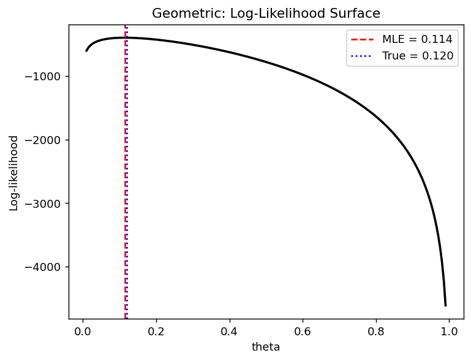
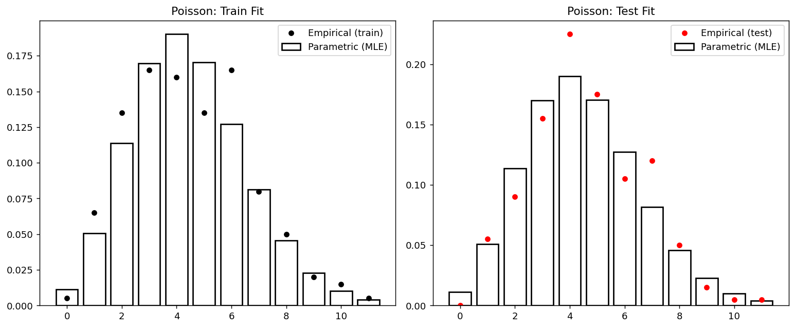

# 기하과 포아송의 최대가능도

## 개요

최대가능도추정(MLE)은 관측된 자료에 모수적 모형을 맞추는 원리 있는 방법을 제공한다. 이 페이지에서는 두 가지 기본적인 이산분포인 기하과 포아송의 MLE를 유도하고 시연하며, 모수적 MLE 적합을 남겨 둔 검정 자료에서 비모수적 경험 PMF와 비교한다. 이 분석은 모형이 올바르게 설정되었을 때 모수적 모형이 왜 더 잘 일반화되는지를 부각한다.

---

## 1. 기하분포의 MLE

### 모형

기하분포는 첫 실패 이전의 연속 성공 횟수를 모형화한다. 모수 $p$(각 시행의 성공확률)에 대해:

$$
P(X = k) = (1 - p)\, p^k, \quad k = 0, 1, 2, \ldots
$$

평균은 $E[X] = p / (1 - p)$이다.

### MLE 유도

관측값 $x_1, \ldots, x_n$이 주어졌을 때 로그가능도는:

$$
\ell(p) = \sum_{i=1}^n \left[ x_i \log p + \log(1 - p) \right] = n_s \log p + n \log(1 - p)
$$

여기서 $n_s = \sum_{i=1}^n x_i$는 전체 성공 횟수이다. 미분하여 0으로 두면:

$$
\frac{d\ell}{dp} = \frac{n_s}{p} - \frac{n}{1 - p} = 0
$$

풀면:

$$
\hat{p}_{\text{MLE}} = \frac{n_s}{n_s + n} = \frac{\bar{x}}{1 + \bar{x}}
$$

### 시연

<div class="exbox" markdown>

**보기 1.** <span class="diff easy" title="쉬움"></span> 기하분포의 MLE. $P(X = k) = (1-p)p^k$, $k = 0, 1, 2, \ldots$에서 독립표본 $x_1, \ldots, x_n$을 얻었다.

**(1)** $\hat p$를 유도하고 그것이 최대임을 확인하시오. 피셔 정보로 $\hat p$의 표준오차도 구하시오.

**(2)** $p = 0.12$, $n = 1000$으로 만든 자료에서 코드가 $\hat p = 0.1220$을 준다. (1)의 표준오차에 비추어 그럴듯한 값인가.

</div>

??? success "풀이"

    **(1) 해석적으로.** $n_s = \sum_i x_i$라 두면 로그가능도가

    $$
    \ell(p) = \sum_{i=1}^n \left[x_i \log p + \log(1-p)\right] = n_s \log p + n\log(1-p)
    $$

    이다. $1000$개의 관측이 들어가지만 식에 남은 것은 $n_s$와 $n$ 둘뿐이다($n_s$가 충분통계량이다). 미분해 $0$으로 두면

    $$
    \ell'(p) = \frac{n_s}{p} - \frac{n}{1-p} = 0
    \;\Longrightarrow\;
    n_s(1-p) = np
    \;\Longrightarrow\;
    n_s = p(n_s + n)
    $$

    이므로

    $$
    \hat p = \frac{n_s}{n_s + n} = \frac{\bar x}{1 + \bar x}
    $$

    이다. **최대임의 확인.** 한 번 더 미분하면

    $$
    \ell''(p) = -\frac{n_s}{p^2} - \frac{n}{(1-p)^2} < 0
    $$

    이 $(0,1)$ 전체에서 성립하므로 $\ell$이 엄밀히 오목하고 정류점이 하나뿐이며 그것이 전역 최대다. **끝점.** $n_s = 0$이면(모든 관측이 $0$이면) $\ell(p) = n\log(1-p)$가 감소함수라 $\hat p = 0$인데, 이는 $\bar x = 0$을 공식에 넣은 값과 같으므로 공식이 그대로 통한다.

    **표준오차.** 관측 $n$개의 피셔 정보는 $-E[\ell''(p)]$이고 $E[n_s] = nE[X] = np/(1-p)$이므로

    $$
    I_n(p) = \frac{E[n_s]}{p^2} + \frac{n}{(1-p)^2}
    = \frac{n}{p(1-p)} + \frac{n}{(1-p)^2}
    = \frac{n\left[(1-p) + p\right]}{p(1-p)^2}
    = \frac{n}{p(1-p)^2}
    $$

    이다. 따라서

    $$
    \operatorname{SE}(\hat p) \approx \sqrt{\frac{p(1-p)^2}{n}}
    = \sqrt{\frac{0.12 \times 0.88^2}{1000}} = 0.00964
    $$

    **(2) 수치적으로.** 공식과 코드의 값이 맞는지, 그리고 참값에서 몇 표준오차나 떨어졌는지 함께 찍는다.

    ```python
    import numpy as np

    np.random.seed(42)

    def geometric_mle_demo(n_train=1000, n_test=1000, p_true=0.12):
        """기하분포의 MLE — 모수적 적합과 비모수적 적합을 견준다."""
        # 자료를 만든다. 첫 실패가 나올 때까지의 성공 횟수다.
        train = np.random.geometric(1 - p_true, n_train) - 1  # 0-indexed
        test = np.random.geometric(1 - p_true, n_test) - 1

        # 최대가능도추정값.
        p_hat = train.mean() / (1 + train.mean())
        k_max = max(train.max(), test.max()) + 1
        k_vals = np.arange(k_max)

        # 모수적 적합: MLE를 넣은 확률질량함수.
        pmf_param = (1 - p_hat) * p_hat ** k_vals

        # 비모수적 적합: 자료의 상대도수를 그대로 쓴다.
        pmf_train = np.bincount(train, minlength=k_max) / n_train
        pmf_test = np.bincount(test, minlength=k_max) / n_test

        # 시험자료에서의 RMSE.
        err_param = np.sqrt(np.mean((pmf_param - pmf_test)**2))
        err_nonparam = np.sqrt(np.mean((pmf_train - pmf_test)**2))

        print(f"True p = {p_true:.3f}")
        print(f"MLE p_hat = {p_hat:.4f}")
        print(f"Test RMSE -- parametric: {err_param:.5f}")
        print(f"Test RMSE -- nonparametric: {err_nonparam:.5f}")

        # 아래에서 다시 쓰도록 돌려준다. 난수는 더 쓰지 않는다.
        return p_hat, train.mean()

    p_hat, xbar = geometric_mle_demo()

    # (1) 에서 구한 표준오차와 견준다.
    se = np.sqrt(0.12 * 0.88**2 / 1000)
    print(f"\nx-bar = {xbar:.5f}   (이론 E[X] = p/(1-p) = {0.12 / 0.88:.5f})")
    print(f"x-bar/(1+x-bar) = {xbar / (1 + xbar):.6f}  (= p-hat)")
    print(f"SE(p-hat) = sqrt(p(1-p)^2/n) = {se:.5f}")
    print(f"(p-hat - p)/SE = {(p_hat - 0.12) / se:+.3f}")
    ```

    출력:

    ```
    True p = 0.120
    MLE p_hat = 0.1220
    Test RMSE -- parametric: 0.00996
    Test RMSE -- nonparametric: 0.01164

    x-bar = 0.13900   (이론 E[X] = p/(1-p) = 0.13636)
    x-bar/(1+x-bar) = 0.122037  (= p-hat)
    SE(p-hat) = sqrt(p(1-p)^2/n) = 0.00964
    (p-hat - p)/SE = +0.211
    ```

    **그럴듯한 값이다.** $\hat p = 0.1220$이 참값 $0.12$에서 $0.0020$ 떨어져 있는데 표준오차가 $0.00964$이므로 $0.21$ 표준오차에 지나지 않는다. 표본평균 $\bar x = 0.139$도 이론값 $p/(1-p) = 0.1364$ 가까이에 있고, 둘을 $\bar x/(1+\bar x)$로 묶으면 코드가 찍은 $\hat p$와 소수 여섯째 자리까지 같다. **유도한 공식과 코드가 같은 수를 준다.**

    표준오차 $0.00964$가 작아 보이지만 $\hat p$ 자체가 $0.12$이므로 상대오차로는 $8\%$다. $n = 1000$이나 되는데도 그렇다. $I_n(p) = n/(p(1-p)^2)$에서 $p$가 작으면 정보가 **많아지는데도** 그렇다는 점이 눈에 걸릴 수 있는데, 절대오차가 작아지는 속도보다 $p$ 자체가 작아지는 속도가 빨라 상대오차는 $\sqrt{(1-p)^2/(np)}$로 오히려 커지기 때문이다.

    출력의 RMSE 두 줄은 모수적 적합이 비모수적 적합보다 검정자료에서 낫다는 것을 보이는데, 왜 그래야 하는지는 보기 4에서 이론값과 함께 따진다.

### 로그가능도 곡면

로그가능도는 $p$에 대해 오목한 함수이며 유일한 전역 최댓값이 있음을 확인해 준다:

<div class="exbox" markdown>

**보기 2.** <span class="diff easy" title="쉬움"></span> 기하분포 로그가능도 곡면. 같은 모형에서 새로 뽑은 $n = 1000$개의 자료로 $\ell(\theta)$를 $\theta \in (0,1)$ 전체에 걸쳐 그린다.

**(1)** $\ell$이 $(0,1)$에서 봉우리를 하나만 갖는 까닭을 말하고, 봉우리의 자리를 자료의 어떤 두 수로 알 수 있는지 적으시오.

**(2)** 그려 보면 봉우리가 바늘처럼 보이고 $\hat\theta = 0.114$가 참값 $0.120$에서 비껴나 있다. 이 비껴남이 걱정할 만한 것인가. 봉우리가 실제로 얼마나 좁은지 수로 재시오.

</div>

??? success "풀이"

    **(1) 해석적으로.** 보기 1에서 본 대로

    $$
    \ell(\theta) = n_s \log\theta + n\log(1-\theta), \qquad
    \ell''(\theta) = -\frac{n_s}{\theta^2} - \frac{n}{(1-\theta)^2} < 0
    $$

    이다. 이계도함수가 $(0,1)$ 어디서나 음수이므로 $\ell$은 **엄밀히 오목**하고, 그런 함수는 정류점을 많아야 하나 가지며 그것이 전역 최대다. 봉우리가 둘일 수 없고 안장점도 없다. 기울기를 따라 올라가는 어떤 방법을 써도 같은 곳에 닿는다는 보장이 여기서 나온다.

    봉우리의 자리를 정하는 데 필요한 것은 **$n_s = \sum x_i$와 $n$ 둘뿐**이다. 관측이 $1000$개여도 $\ell$에 들어가는 것은 이 두 수이고, 어떤 자료든 $(n_s, n)$만 같으면 곡선이 완전히 같다. $n_s$가 **충분통계량**이라는 말이 이것이다.

    **(2) 수치적으로. 걱정할 것 없다.** 보기 1에서 $\operatorname{SE}(\hat\theta) \approx \sqrt{\theta(1-\theta)^2/n}$을 얻었고, $\hat\theta = 0.114$를 넣으면 $0.00947$이다. 참값과의 거리가 $0.006$이므로 $0.6$ 표준오차, 흔한 요동이다.

    봉우리가 "바늘처럼" 보이는 것은 가로축을 $[0,1]$ 전체로 잡았기 때문이다. 실제 폭을 재려면 **가능도비 구간**을 쓴다. $2[\ell(\hat\theta) - \ell(\theta)] \le \chi^2_{1,0.95} = 3.84$, 곧 로그가능도가 꼭대기에서 $1.92$ 아래로 떨어지기 전까지의 $\theta$를 모으면 된다.

    ```python
    import matplotlib.pyplot as plt

    plt.rcParams["font.sans-serif"] = ["NanumGothic", "Apple SD Gothic Neo", "Malgun Gothic"]
    plt.rcParams["font.family"] = "sans-serif"
    plt.rcParams["axes.unicode_minus"] = False

    # numpy의 geometric은 "첫 성공까지의 시행 수"(1부터)를 준다.
    # 여기서 쓰는 판본은 "첫 성공 이전의 실패 수"(0부터)이므로 1을 뺀다.
    # 성공확률을 1 - 0.12 로 준 것은, 이 절의 theta 가 numpy의 p와
    # 서로 여집합 관계이기 때문이다(theta = 실패확률).
    train = np.random.geometric(1 - 0.12, 1000) - 1

    # 로그가능도 l(theta) = (실패 총횟수) log(theta) + (시행 수) log(1-theta).
    # 관측이 1000개인데 계산에 들어가는 것은 이 두 숫자뿐이다.
    # 이런 요약값을 충분통계량이라고 한다.
    n_success = train.sum()
    n_fail = len(train)

    theta_grid = np.linspace(0.01, 0.99, 200)
    ll = n_success * np.log(theta_grid) + n_fail * np.log(1 - theta_grid)

    # 미분해서 0으로 두면 나오는 닫힌 해. 격자 탐색의 봉우리와 일치해야 한다.
    p_hat = train.mean() / (1 + train.mean())

    plt.plot(theta_grid, ll, "k-", lw=2)
    plt.axvline(p_hat, color="red", linestyle="--", label=f"MLE = {p_hat:.3f}")
    plt.axvline(0.12, color="blue", linestyle=":", label="True = 0.120")
    plt.xlabel("theta")
    plt.ylabel("Log-likelihood")
    plt.title("Geometric: Log-Likelihood Surface")
    plt.legend()
    plt.show()

    # 봉우리의 실제 폭. 로그가능도가 꼭대기에서 1.92 내려가는 두 점을 찾는다.
    from scipy.optimize import brentq

    def loglik(t):
        return n_success * np.log(t) + n_fail * np.log(1 - t)

    target = loglik(p_hat) - 1.92
    lo = brentq(lambda t: loglik(t) - target, 1e-9, p_hat)
    hi = brentq(lambda t: loglik(t) - target, p_hat, 1 - 1e-9)
    se = np.sqrt(p_hat * (1 - p_hat) ** 2 / n_fail)

    print(f"n_s = {n_success},  n = {n_fail},  theta-hat = {p_hat:.4f}")
    print(f"곡률 표준오차 = {se:.5f},  (theta-hat - 0.12)/SE = {(p_hat - 0.12) / se:+.3f}")
    print(f"가능도비 95% 구간 = {lo:.4f} ~ {hi:.4f}  (폭 {hi - lo:.4f})")
    print(f"왈드 95% 구간     = {p_hat - 1.96 * se:.4f} ~ {p_hat + 1.96 * se:.4f}")
    print(f"격자 간격 {theta_grid[1] - theta_grid[0]:.4f} 로 재면 구간 안의 격자점은 "
          f"{int(((theta_grid >= lo) & (theta_grid <= hi)).sum())}개뿐")
    ```

    출력:

    ```
    n_s = 129,  n = 1000,  theta-hat = 0.1143
    곡률 표준오차 = 0.00947,  (theta-hat - 0.12)/SE = -0.606
    가능도비 95% 구간 = 0.0966 ~ 0.1337  (폭 0.0371)
    왈드 95% 구간     = 0.0957 ~ 0.1328
    격자 간격 0.0049 로 재면 구간 안의 격자점은 8개뿐
    ```

    

    **비껴남은 $0.61$ 표준오차다.** $\hat\theta = 0.1143$과 참값 $0.12$의 거리가 곡률이 말하는 표준오차 $0.00947$의 절반을 조금 넘는 정도이니, 모형도 코드도 탓할 것이 없다.

    **봉우리는 실제로 좁다.** 가능도비 구간이 $0.0966 \sim 0.1337$로 폭이 $0.0371$, 가로축 $[0,1]$의 $3.7\%$다. 그려 놓은 격자가 $200$점인데 그중 구간 안에 드는 것이 $8$개뿐이니 눈에는 수직선으로 보일 수밖에 없다. **곡선이 좁아 보이는 것은 그림의 축 선택 때문이지 추정이 유난히 정밀해서가 아니다.** 상대폭으로 보면 $\hat\theta$의 $\pm16\%$다.

    가능도비 구간 $0.0966 \sim 0.1337$과 곡률로 만든 왈드 구간 $0.0957 \sim 0.1328$이 거의 같다는 것도 읽어 둘 만하다. 둘이 맞는다는 것은 봉우리 둘레에서 $\ell$이 포물선에 가깝다는 뜻이고, 그래서 정규근사를 믿어도 좋다는 신호다. 다만 가능도비 쪽이 양쪽으로 $0.0009$씩 위로 밀려 있는데 이는 $\ell$이 완전한 포물선은 아니어서 생기는 비대칭이다.

---

## 2. 포아송분포의 MLE

### 모형

포아송분포는 고정된 구간에서 일어나는 사건의 수를 모형화한다:

$$
P(X = k) = \frac{e^{-\lambda}\, \lambda^k}{k!}, \quad k = 0, 1, 2, \ldots
$$

평균과 분산이 모두 $\lambda$이다.

### MLE 유도

관측값 $x_1, \ldots, x_n$이 주어졌을 때 ($\lambda$에 의존하지 않는 상수를 제외한) 로그가능도는:

$$
\ell(\lambda) = \left(\sum_{i=1}^n x_i\right) \log \lambda - n\lambda
$$

미분하면:

$$
\frac{d\ell}{d\lambda} = \frac{\sum x_i}{\lambda} - n = 0
$$

풀면 잘 알려진 결과를 얻는다:

$$
\hat{\lambda}_{\text{MLE}} = \bar{x}
$$

포아송 비율 모수의 MLE는 단순히 표본평균이다.

### 시연

<div class="exbox" markdown>

**보기 3.** <span class="diff easy" title="쉬움"></span> 포아송분포의 MLE. $X_1, \ldots, X_n$이 독립인 $\text{Poisson}(\lambda)$일 때 $\lambda = 4.5$, $n = 200$인 자료를 만들어 적합한다.

**(1)** $\hat\lambda$를 유도하고 최대임을 확인하시오. 자료가 모두 $0$인 경우까지 공식이 통하는가. $\hat\lambda$의 표준오차도 구하시오.

**(2)** 코드가 $\hat\lambda = 4.4800$을 준다. (1)의 표준오차에 비추어 그럴듯한 값인가.

</div>

??? success "풀이"

    **(1) 해석적으로.** $\lambda$에 의존하지 않는 $-\sum\log(x_i!)$를 빼면

    $$
    \ell(\lambda) = \left(\sum_{i=1}^n x_i\right)\log\lambda - n\lambda
    $$

    이다. 미분해 $0$으로 두면

    $$
    \ell'(\lambda) = \frac{\sum x_i}{\lambda} - n = 0
    \;\Longrightarrow\;
    \hat\lambda = \frac{1}{n}\sum_{i=1}^n x_i = \bar x
    $$

    **최대임의 확인.** $\sum x_i > 0$일 때

    $$
    \ell''(\lambda) = -\frac{\sum x_i}{\lambda^2} < 0
    $$

    이 $\lambda > 0$ 전체에서 성립하므로 $\ell$이 엄밀히 오목하고 정류점이 유일한 전역 최대다.

    **끝점.** $\sum x_i = 0$이면(관측이 모두 $0$이면) 위 이계도함수가 $0$이 되어 오목성 논증이 통하지 않는다. 그러나 이때 $\ell(\lambda) = -n\lambda$가 순감소함수이므로 최대는 왼쪽 끝 $\lambda = 0$이고, 이는 $\bar x = 0$을 공식에 넣은 값과 같다. **$\hat\lambda = \bar x$가 그대로 통한다.**

    **표준오차.** 관측 하나의 피셔 정보는

    $$
    I(\lambda) = -E\!\left[\frac{\partial^2}{\partial\lambda^2}\log f(X;\lambda)\right]
    = \frac{E[X]}{\lambda^2} = \frac{\lambda}{\lambda^2} = \frac{1}{\lambda}
    $$

    이므로

    $$
    \operatorname{SE}(\hat\lambda) = \frac{1}{\sqrt{nI(\lambda)}} = \sqrt{\frac{\lambda}{n}}
    = \sqrt{\frac{4.5}{200}} = 0.15
    $$

    이다. $\operatorname{Var}(\bar X) = \operatorname{Var}(X)/n = \lambda/n$과 같은 값이다. 포아송에서 분산이 평균과 같다는 사실이 여기에 그대로 나타난다. **표본평균은 하한을 등호로 달성한다.**

    **(2) 수치적으로.** 적합한 뒤 참값에서 몇 표준오차나 떨어졌는지 함께 찍는다.

    ```python
    from scipy import stats

    def poisson_mle_demo(n_train=200, n_test=200, lam_true=4.5):
        """포아송분포의 MLE — 모수적 적합과 비모수적 적합을 견준다."""
        np.random.seed(42)
        train = np.random.poisson(lam_true, n_train)
        test = np.random.poisson(lam_true, n_test)

        lam_hat = train.mean()
        k_max = max(train.max(), test.max()) + 1
        k_vals = np.arange(k_max)

        # 모수적 적합: MLE를 넣은 확률질량함수.
        pmf_param = stats.poisson.pmf(k_vals, lam_hat)

        # 비모수적 적합: 자료의 상대도수를 그대로 쓴다.
        pmf_train = np.bincount(train, minlength=k_max) / n_train
        pmf_test = np.bincount(test, minlength=k_max) / n_test

        # 시험자료에서의 RMSE.
        err_param = np.sqrt(np.mean((pmf_param - pmf_test)**2))
        err_nonparam = np.sqrt(np.mean((pmf_train - pmf_test)**2))

        print(f"True lambda = {lam_true:.2f}")
        print(f"MLE lambda_hat = {lam_hat:.4f}")
        print(f"Test RMSE -- parametric: {err_param:.5f}")
        print(f"Test RMSE -- nonparametric: {err_nonparam:.5f}")

        # 아래 그림에서 다시 쓰도록 계산 결과를 돌려준다
        return k_vals, pmf_param, pmf_train, pmf_test

    k_vals, pmf_param, pmf_train, pmf_test = poisson_mle_demo()

    # (1) 에서 구한 표준오차와 견준다. 함수가 안에서 씨앗을 다시 심으므로
    # 여기서 같은 자료를 다시 만들어도 값이 같다.
    np.random.seed(42)
    train = np.random.poisson(4.5, 200)
    lam_hat = train.mean()
    se = np.sqrt(4.5 / 200)

    print(f"\nsum x_i = {train.sum()},  n = {len(train)}")
    print(f"lambda-hat = x-bar = {lam_hat:.4f}")
    print(f"SE(lambda-hat) = sqrt(lambda/n) = {se:.4f}")
    print(f"(lambda-hat - lambda)/SE = {(lam_hat - 4.5) / se:+.3f}")
    print(f"표본분산 = {train.var(ddof=1):.4f}  (포아송이면 평균과 같아야 한다)")
    ```

    출력:

    ```
    True lambda = 4.50
    MLE lambda_hat = 4.4800
    Test RMSE -- parametric: 0.01882
    Test RMSE -- nonparametric: 0.03342

    sum x_i = 896,  n = 200
    lambda-hat = x-bar = 4.4800
    SE(lambda-hat) = sqrt(lambda/n) = 0.1500
    (lambda-hat - lambda)/SE = -0.133
    표본분산 = 4.7634  (포아송이면 평균과 같아야 한다)
    ```

    **그럴듯한 값이다.** $\hat\lambda = 4.48$이 참값 $4.5$에서 $0.02$ 떨어져 있고 표준오차가 $0.15$이므로 $0.13$ 표준오차, 거의 한가운데다. $\hat\lambda = \sum x_i / n = 896/200$이 정확히 $4.48$이어서 유도한 공식과 코드가 같은 수를 준다.

    표본분산 $4.7634$가 표본평균 $4.48$과 가깝다는 것도 함께 볼 만하다. **포아송이면 평균과 분산이 같아야 하므로**, 둘이 크게 어긋나면 포아송 가정 자체를 의심해야 한다는 신호가 된다. 여기서는 비가 $4.7634/4.48 = 1.063$으로 $1$에 가깝다.

    출력의 RMSE 두 줄은 아래 보기 4에서 이론값과 함께 따진다.

### 모수적 적합과 비모수적 적합의 비교

<div class="exbox" markdown>

**보기 4.** <span class="diff easy" title="쉬움"></span> 모수적 적합과 비모수적 적합의 비교. 보기 3의 적합을 훈련자료와 시험자료에 나란히 겹쳐 그린다.

**(1)** 시험자료에 대한 RMSE의 **이론값**을 모수적·비모수적 두 쪽 모두 구하시오. 왜 모수적 쪽이 작아야 하는가.

**(2)** 그림을 그려 무엇이 보이는지 적고, 보기 3이 준 $0.01882$와 $0.03342$가 (1)의 이론값과 맞는지 모의실험으로 확인하시오.

</div>

??? success "풀이"

    **(1) 해석적으로.** 참 확률을 $p_k$, 상자 수를 $K$, 훈련·시험 표본크기를 모두 $n$이라 하자.

    **비모수적 쪽.** 각 상자의 상대도수는 $\hat p_k = (\text{도수})/n$이고 $n\hat p_k \sim \text{Binomial}(n, p_k)$이므로 $\operatorname{Var}(\hat p_k) = p_k(1-p_k)/n$이다. 훈련과 시험이 독립이므로

    $$
    E\!\left[(\hat p_k^{\text{훈}} - \hat p_k^{\text{시}})^2\right]
    = \operatorname{Var}(\hat p_k^{\text{훈}}) + \operatorname{Var}(\hat p_k^{\text{시}})
    = \frac{2p_k(1-p_k)}{n}
    $$

    **모수적 쪽.** 적합값은 $\tilde p_k = e^{-\hat\lambda}\hat\lambda^k/k!$이고 $\hat\lambda$ 둘레에서 한 번 펴면

    $$
    \frac{\partial p_k}{\partial \lambda} = p_k\!\left(\frac{k}{\lambda} - 1\right)
    \;\Longrightarrow\;
    \operatorname{Var}(\tilde p_k) \approx p_k^2\frac{(k-\lambda)^2}{\lambda^2}\cdot\frac{\lambda}{n}
    = \frac{p_k^2 (k-\lambda)^2}{\lambda n}
    $$

    이다($\operatorname{Var}(\hat\lambda) = \lambda/n$을 썼다). 시험자료의 잡음은 그대로 남으므로

    $$
    E\!\left[(\tilde p_k - \hat p_k^{\text{시}})^2\right]
    \approx \frac{p_k(1-p_k)}{n} + \frac{p_k^2(k-\lambda)^2}{\lambda n}
    $$

    **왜 모수적 쪽이 작은가.** 두 식을 나란히 놓으면 차이가 분명하다. 비모수적 쪽은 상자마다 **따로** 추정하므로 잡음 항이 $p_k(1-p_k)/n$으로 $p_k$에 **일차**다. 모수적 쪽은 상자 $K$개를 숫자 **하나**($\hat\lambda$)로 요약하므로 잡음 항이 $p_k^2$에 비례한다. 확률은 $1$보다 작으니 $p_k^2 \ll p_k$이고, 그만큼 추정 잡음이 줄어든다. **$K$개의 자유도를 $1$개로 줄인 대가가 이것이다** — 모형이 맞다는 전제 아래에서.

    $\lambda = 4.5$, $n = 200$, $K = 12$를 넣으면

    $$
    \text{RMSE}_{\text{비모수}} = 0.02681, \qquad
    \text{RMSE}_{\text{모수}} = 0.01971, \qquad \text{비} = 1.360
    $$

    이다(아래 코드가 이 수를 찍는다).

    **(2) 수치적으로.** 먼저 그림이다.

    ```python
    import matplotlib.pyplot as plt

    # 위 함수가 돌려준 값을 그대로 쓴다.
    fig, axes = plt.subplots(1, 2, figsize=(12, 5))

    # 왼쪽: 훈련자료에 대한 적합.
    # 막대(모수적 MLE)와 점(경험적 PMF)이 잘 겹친다. 같은 자료로 맞췄으니 당연하다.
    axes[0].bar(k_vals, pmf_param, color="white", edgecolor="black",
                lw=1.5, label="Parametric (MLE)")
    axes[0].plot(k_vals, pmf_train, "ko", ms=5, label="Empirical (train)")
    axes[0].set_title("Poisson: Train Fit")
    axes[0].legend()

    # 오른쪽: **보지 않은** 시험자료에 대한 적합. 여기가 진짜 시험이다.
    # 막대는 왼쪽과 똑같다(모형은 훈련자료로만 맞췄으므로).
    # 빨간 점만 새 자료로 바뀌었는데도 막대를 잘 따라간다.
    # 반면 경험적 PMF는 훈련자료의 우연한 들쭉날쭉함까지 외웠기 때문에
    # 새 자료에서는 오차가 더 크다. 위 출력의 RMSE 두 값이 그 차이다.
    axes[1].bar(k_vals, pmf_param, color="white", edgecolor="black",
                lw=1.5, label="Parametric (MLE)")
    axes[1].plot(k_vals, pmf_test, "ro", ms=5, label="Empirical (test)")
    axes[1].set_title("Poisson: Test Fit")
    axes[1].legend()

    plt.tight_layout()
    plt.show()
    ```

    

    **왼쪽은 당연하고 오른쪽이 시험이다.** 왼쪽에서 막대(모수적 적합)와 점(훈련자료의 경험 PMF)이 잘 겹치는 것은 같은 자료로 맞췄으니 놀랍지 않다. 오른쪽은 막대가 똑같은데 점만 **보지 않은** 시험자료로 바뀌었고, 그래도 막대를 잘 따라간다.

    가장 눈에 띄는 것은 $k = 0$이다. 시험자료에는 $0$이 **한 번도 없어서** 빨간 점이 바닥에 붙어 있는데 포아송 막대는 $0.0113$을 준다. 상대도수가 $0/200$이라고 해서 확률이 정말 $0$인 것은 아니다. $k = 9, 10, 11$에서도 시험 도수가 각각 $3, 1, 1$개뿐이라 점이 크게 흔들리는 반면 막대는 매끄럽다. **모수적 적합은 꼬리의 확률을 가운데 자료에서 빌려 온다.** (1)에서 잡음 항이 $p_k$ 대신 $p_k^2$에 비례한 것이 이 "빌려 옴"의 수치적 모습이다.

    물론 모수적 적합도 어긋난다. $k = 7$에서 막대는 $0.0814$인데 시험 점은 $0.1200$이다. 다만 같은 자리에서 훈련자료의 경험 PMF는 $0.0800$이어서 역시 비껴난다. 상자별로 보면 어느 쪽이 이길지 알 수 없고, 전체 평균에서 차이가 난다.

    이제 (1)의 이론값을 확인한다.

    ```python
    import numpy as np
    from scipy import stats

    lam, n, K = 4.5, 200, 12          # K = 위 적합이 쓴 상자 수 k_max
    k = np.arange(K)
    p = stats.poisson.pmf(k, lam)

    # (1) 의 이론값.
    mse_np = np.mean(2 * p * (1 - p) / n)
    mse_pa = np.mean(p * (1 - p) / n + p**2 * (k - lam)**2 / (lam * n))
    print(f"이론  비모수 RMSE = {np.sqrt(mse_np):.5f}")
    print(f"이론  모수   RMSE = {np.sqrt(mse_pa):.5f}   (비 {np.sqrt(mse_np / mse_pa):.3f})")

    # 같은 실험을 4000번 되풀이해 평균제곱오차를 잰다.
    rng = np.random.default_rng(1)
    A, B = [], []
    for _ in range(4000):
        tr = rng.poisson(lam, n)
        te = rng.poisson(lam, n)
        pp = stats.poisson.pmf(k, tr.mean())
        ptr = np.bincount(tr, minlength=K)[:K] / n
        pte = np.bincount(te, minlength=K)[:K] / n
        A.append(np.mean((pp - pte)**2))
        B.append(np.mean((ptr - pte)**2))
    A, B = np.array(A), np.array(B)
    print(f"\n모의  비모수 RMSE = {np.sqrt(B.mean()):.5f}")
    print(f"모의  모수   RMSE = {np.sqrt(A.mean()):.5f}   (비 {np.sqrt(B.mean() / A.mean()):.3f})")
    print(f"모수 쪽이 이긴 비율 = {(A < B).mean():.3f}")

    # 보기 3 이 준 한 번의 값은 이 분포의 어디쯤인가.
    print(f"\n0.01882 는 모수 RMSE 분포의 {(np.sqrt(A) < 0.01882).mean():.0%} 분위")
    print(f"0.03342 는 비모수 RMSE 분포의 {(np.sqrt(B) < 0.03342).mean():.0%} 분위")
    ```

    출력:

    ```
    이론  비모수 RMSE = 0.02681
    이론  모수   RMSE = 0.01971   (비 1.360)

    모의  비모수 RMSE = 0.02701
    모의  모수   RMSE = 0.01984   (비 1.362)
    모수 쪽이 이긴 비율 = 0.871

    0.01882 는 모수 RMSE 분포의 51% 분위
    0.03342 는 비모수 RMSE 분포의 85% 분위
    ```

    **이론과 모의가 맞는다.** 비모수 $0.02681$ 대 $0.02701$, 모수 $0.01971$ 대 $0.01984$로 둘 다 $1\%$ 안에서 일치하고 비도 $1.360$ 대 $1.362$다. (1)의 분해가 옳았다.

    **보기 3의 한 번은 조금 유리한 뽑기였다.** 모수 쪽 $0.01882$는 분포의 $51\%$ 분위로 전형적인데, 비모수 쪽 $0.03342$는 $85\%$ 분위로 평소보다 나쁜 쪽이다. 그래서 그 한 번에서는 비가 $0.03342/0.01882 = 1.78$로 보였지만 **평균적으로는 $1.36$**이다. 한 번의 실행에서 본 격차를 그대로 일반화하면 안 된다는 뜻이고, 이 쪽에서 가장 조심해야 할 대목이다.

    **모수적 쪽이 언제나 이기지는 않는다.** $4000$번 중 $87.1\%$에서만 이겼다. 모형이 **정확히** 맞는 이 유리한 상황에서도 여덟 번에 한 번은 경험 PMF가 더 나은데, 모형이 틀어지면 그 비율이 빠르게 뒤집힌다. 아래 경고 상자가 말하는 바가 이것이다.

---

## 3. 해석

- **모수적 모형이 더 잘 일반화된다.** 가정한 모형족이 옳으면(자료가 실제로 기하이나 포아송분포에서 나왔으면) MLE에 기반한 모수적 PMF가 비모수적 경험 PMF보다 검정 자료의 RMSE가 대체로 작다. 모수적 모형은 함수 형태를 통해 모든 $k$ 값에 걸쳐 "힘을 빌려" 온다.
- **비모수적 모형은 더 유연하지만 잡음이 많다.** 경험 PMF는 훈련 자료에서 관측되지 않은 값에 확률 0을 부여한다. 훈련 표본이 작으면(포아송에서 $n = 200$) 이 이산성 효과가 꼬리에서 두드러진다.
- **두 분포 모두 로그가능도 곡면이 오목**하므로 기울기 기반 최적화가 유일한 전역 MLE로 수렴함이 보장된다.
- **모형 설정 오류의 위험.** 참 자료생성과정이 기하이나 포아송이 아니면 모수적 모형이 자료를 체계적으로 잘못 적합할 수 있고, 그때는 비모수적 접근이 더 나을 수 있다.

!!! warning "모수적 가정이 중요하다"
    모수적 적합이 검정 자료에서 더 나은 성능을 보이는 것은 모형이 올바르게 설정되었을 때의 이야기이다. 경험분포보다 모수적 모형을 믿기 전에 언제나 적합도를 확인하라(예: 카이제곱 검정, QQ 그림).

---

## 연습문제

<div class="drillbox" markdown>

**연습문제 1.** <span class="diff med" title="중간"></span> 적률법의 관점에서 기하분포의 MLE를 직접 유도하라. 이 분포에서 MLE와 적률법 추정량이 일치함을 보여라.

</div>

??? success "풀이"
    ($P(X = k) = (1-p)p^k$인) $\text{Geometric}(p)$의 평균은:

    $$
    E[X] = \frac{p}{1 - p}
    $$

    $E[X] = \bar{x}$로 두고 $p$에 대해 풀면:

    $$
    \bar{x} = \frac{p}{1 - p} \implies \bar{x}(1 - p) = p \implies \bar{x} = p(1 + \bar{x})
    $$

    $$
    \hat{p}_{\text{MoM}} = \frac{\bar{x}}{1 + \bar{x}}
    $$

    이는 로그가능도를 최대화하여 얻은 $\hat{p}_{\text{MLE}} = \bar{x}/(1 + \bar{x})$와 동일하다. 단일모수 지수족 분포에서 MLE는 언제나 충분통계량의 함수이며, 적률방정식이 그 통계량만 포함하면 MLE와 적률법이 일치한다. $\square$

<div class="drillbox" markdown>

**연습문제 2.** <span class="diff med" title="중간"></span> 포아송의 MLE에서 $\hat{\lambda} = \bar{x}$가 임계점일 뿐 아니라 전역 최댓값임을 2계도함수 조건으로 확인하라.

</div>

??? success "풀이"
    로그가능도는:

    $$
    \ell(\lambda) = \left(\sum x_i\right) \log \lambda - n\lambda + C
    $$

    여기서 $C$는 $\lambda$에 의존하지 않는다. 1계도함수는:

    $$
    \frac{d\ell}{d\lambda} = \frac{\sum x_i}{\lambda} - n
    $$

    0으로 두면 $\hat{\lambda} = \bar{x}$이다.

    2계도함수는:

    $$
    \frac{d^2\ell}{d\lambda^2} = -\frac{\sum x_i}{\lambda^2}
    $$

    $\sum x_i \geq 0$이고 $\lambda > 0$이므로 모든 $\lambda > 0$에서 $d^2\ell/d\lambda^2 \leq 0$이다. $\sum x_i > 0$이면 부등호가 엄격하므로 $\hat{\lambda} = \bar{x}$가 전역 최댓값임이 확인된다. (모든 관측값이 0이면 $\hat{\lambda} = 0$이며 이는 경계에서의 최댓값이다.) $\square$

<div class="drillbox" markdown>

**연습문제 3.** <span class="diff med" title="중간"></span> 포아송분포에서 i.i.d.로 $n = 500$개를 관측했고 표본평균이 $\bar{x} = 3.2$이다. Fisher 정보량을 사용하여 $\lambda$에 대한 근사적인 95% 신뢰구간을 구성하라.

</div>

??? success "풀이"
    포아송 관측값 하나에 대한 Fisher 정보량은:

    $$
    I(\lambda) = \frac{1}{\lambda}
    $$

    $n$개 관측값에서 전체 Fisher 정보량은 $nI(\lambda) = n/\lambda$이다. MLE의 점근정규성에 의해:

    $$
    \hat{\lambda} \dot{\sim} N\!\left(\lambda, \frac{1}{nI(\lambda)}\right) = N\!\left(\lambda, \frac{\lambda}{n}\right)
    $$

    $\hat{\lambda} = 3.2$, $n = 500$을 대입하면:

    $$
    \text{SE} = \sqrt{\frac{\hat{\lambda}}{n}} = \sqrt{\frac{3.2}{500}} = \sqrt{0.0064} = 0.08
    $$

    95% 신뢰구간은:

    $$
    \hat{\lambda} \pm 1.96 \cdot \text{SE} = 3.2 \pm 1.96(0.08) = 3.2 \pm 0.157 = [3.043, 3.357]
    $$

    $\square$

<div class="drillbox" markdown>

**연습문제 4.** <span class="diff med" title="중간"></span> 모형이 올바르게 설정되었을 때 비모수적 (경험 PMF) 추정량이 불편인데도 모수적 MLE보다 검정 자료의 RMSE가 큰 이유를 설명하라. 편향–분산 맞바꿈은 어떤 역할을 하는가?

</div>

??? success "풀이"
    경험 PMF는 각 확률 $P(X = k)$를 비율 $\hat{p}_k = n_k / n$으로 따로따로 추정한다. 각 $\hat{p}_k$는 불편이고 분산은:

    $$
    \text{Var}(\hat{p}_k) = \frac{P(X = k)(1 - P(X = k))}{n}
    $$

    모수적 MLE는 모수 하나($p$나 $\lambda$)를 추정하고 그로부터 PMF 전체를 유도한다. $P(X = k)$의 모수적 추정량은 (비선형 대입 때문에) 유한표본에서 편향되지만, 각 $k$마다 하나씩이 아니라 자유도 하나만 추정하므로 분산이 훨씬 작다.

    전체 평균제곱오차는 다음과 같이 분해된다:

    $$
    \text{MSE} = \text{Bias}^2 + \text{Variance}
    $$

    비모수적 추정량은 편향이 0이지만 (특히 $n_k$가 작은 꼬리에서) 분산이 크다. 모수적 MLE는 설정이 올바르면 편향이 무시할 만하고, 함수 형태가 PMF의 모양을 제약하므로 분산이 작다. 모수적 모형이 유리한 편향–분산 맞바꿈을 달성하여 검정 자료에서 RMSE가 더 작아진다.

    모형이 잘못 설정되면 모수적 추정량에 사라지지 않는 편향이 생기고, 그때는 비모수적 추정량이 이길 수 있다. $\square$

<div class="drillbox" markdown>

**연습문제 5.** <span class="diff med" title="중간"></span> 기하분포에서 나왔다고 믿는 다음 자료를 관측했다고 하자: $x = (0, 2, 1, 0, 3, 1, 0, 0, 1, 2)$. MLE $\hat{p}$를 계산하라. 그다음 $\hat{p}$, $p = 0.3$, $p = 0.7$에서 로그가능도를 계산하여 MLE가 가장 높은 로그가능도를 주는지 확인하라.

</div>

??? success "풀이"
    자료는 $x = (0, 2, 1, 0, 3, 1, 0, 0, 1, 2)$이고 $n = 10$, $\sum x_i = 10$이다.

    MLE는:

    $$
    \hat{p} = \frac{\bar{x}}{1 + \bar{x}} = \frac{1}{1 + 1} = 0.5
    $$

    로그가능도는 $n_s = 10$, $n = 10$일 때 $\ell(p) = n_s \log p + n \log(1 - p)$이다:

    $\hat{p} = 0.5$**에서**:

    $$
    \ell(0.5) = 10 \log(0.5) + 10 \log(0.5) = 20 \log(0.5) = -20 \times 0.6931 = -13.863
    $$

    $p = 0.3$**에서**:

    $$
    \ell(0.3) = 10\log(0.3) + 10\log(0.7) = 10(-1.2040) + 10(-0.3567) = -15.607
    $$

    $p = 0.7$**에서**:

    $$
    \ell(0.7) = 10\log(0.7) + 10\log(0.3) = 10(-0.3567) + 10(-1.2040) = -15.607
    $$

    실제로 $\ell(0.5) > \ell(0.3) = \ell(0.7)$이므로 MLE가 로그가능도를 최대화함이 확인된다. $n_s = n$일 때 로그가능도가 $\hat{p} = 0.5$를 중심으로 대칭이므로 $\ell(0.3) = \ell(0.7)$이라는 대칭성이 나타난다. $\square$

<div class="drillbox" markdown>

**연습문제 6.** <span class="diff med" title="중간"></span>
같은 계수 자료에 기하분포와 포아송분포를 모두 적합했다. 어느 쪽이 나은지 판단하는 방법을 세 가지 들고, 각각의 장단점을 적어라.

</div>

??? success "풀이"
    두 분포는 **내포 관계가 아니므로** 우도비 검정을 그대로 쓸 수 없다. 다음 세 가지가 표준적인 방법이다.

    **(1) 정보기준 비교.** 모수 개수가 둘 다 1개이므로 벌점이 같고, 결국 **최대 로그가능도를 직접 비교**하면 된다.

    $$
    \text{AIC} = -2\ell(\hat\theta)+2 \quad\Rightarrow\quad \ell_{\text{geom}} \gtrless \ell_{\text{pois}}
    $$

    - **장점**: 간단하고 내포 관계가 필요 없다.
    - **단점**: 차이가 얼마나 커야 의미 있는지에 대한 기준이 없다. 관례적으로 AIC 차이가 2 이상이면 주목할 만하다고 본다.

    **(2) 적합도 검정.** 관측 도수와 각 모형의 기대 도수를 카이제곱으로 비교한다.

    $$
    X^2 = \sum_k \frac{(O_k-E_k)^2}{E_k}, \qquad \text{자유도} = (\text{범주 수}) - 1 - 1
    $$

    - **장점**: 어느 구간에서 어긋나는지 잔차로 볼 수 있다. 두 모형 모두 나쁠 가능성도 잡아낸다.
    - **단점**: 기대도수가 5 미만인 범주를 합쳐야 하고, 그 방식에 따라 결과가 달라진다.

    **(3) 평균-분산 관계 진단.** 포아송은 분산 = 평균, 기하분포(실패 횟수 판본)는 분산 $= \frac{1-p}{p^2}$, 평균 $=\frac{1-p}{p}$이므로

    $$
    \frac{\operatorname{Var}}{E} = \frac1p > 1
    $$

    이다. 표본에서 $s^2/\bar x$를 계산해 1에 가까우면 포아송, 1보다 뚜렷이 크면 기하 쪽을 의심한다.

    - **장점**: 계산이 즉시 되고 해석이 직관적이다. 적합 전에 먼저 해 볼 수 있다.
    - **단점**: 이 비가 크다고 기하분포인 것은 아니다. 음이항이나 영과잉일 수도 있다.

    **권고.** 셋을 함께 쓴다. 진단으로 방향을 잡고, 정보기준으로 고르고, 적합도 검정과 잔차로 고른 모형이 실제로 맞는지 확인한다. **두 모형 중 나은 쪽을 고르는 것과 그 모형이 자료에 맞는 것은 다른 문제다.**

<div class="drillbox" markdown>

**연습문제 7.** <span class="diff med" title="중간"></span>
기하분포의 MLE $\hat\theta = 1/(1+\bar x)$(실패 횟수 판본)의 Fisher 정보량을 구하고 점근분산을 유도하라. $\theta$가 0 또는 1에 가까울 때 무슨 일이 일어나는가?

</div>

??? success "풀이"
    실패 횟수 판본의 PMF는 $P(X=k) = (1-\theta)^k\theta$이므로

    $$
    \ln f = k\ln(1-\theta) + \ln\theta
    $$

    이고

    $$
    \frac{\partial\ln f}{\partial\theta} = -\frac{k}{1-\theta}+\frac1\theta, \qquad \frac{\partial^2\ln f}{\partial\theta^2} = -\frac{k}{(1-\theta)^2}-\frac{1}{\theta^2}
    $$

    이다. $E[X] = (1-\theta)/\theta$를 넣어 기대값을 취하면

    $$
    I_1(\theta) = \frac{E[X]}{(1-\theta)^2}+\frac{1}{\theta^2} = \frac{1}{\theta(1-\theta)}+\frac{1}{\theta^2} = \frac{\theta+(1-\theta)}{\theta^2(1-\theta)} = \frac{1}{\theta^2(1-\theta)}
    $$

    이다. 따라서

    $$
    \operatorname{Var}(\hat\theta) \approx \frac{\theta^2(1-\theta)}{n}
    $$

    **경계에서의 거동.**

    - **$\theta \to 1$**(거의 언제나 첫 시행에 성공): $I_1 \to \infty$이고 분산이 0으로 간다. 관측값이 대부분 0이므로 $\theta$가 1에 가깝다는 것을 매우 확실히 알 수 있다. 다만 $\hat\theta$가 경계에 붙어 정규근사가 나빠진다. 모든 관측이 0이면 $\hat\theta = 1$로 경계값이 나온다.
    - **$\theta \to 0$**(성공이 매우 드묾): $I_1 \to \infty$이지만 $\operatorname{Var} \approx \theta^2/n \to 0$이다. 절댓값 분산은 작아도 **상대 분산**이

      $$
      \frac{\operatorname{SE}(\hat\theta)}{\theta} \approx \sqrt{\frac{1-\theta}{n}} \to \frac{1}{\sqrt n}
      $$

      으로 $\theta$와 무관하게 남는다. 즉 $\theta$의 **자릿수**를 알아내는 정밀도는 일정하다.

    **실무 권고.** $\theta$가 경계 근처면 로짓 척도 $\ln\{\theta/(1-\theta)\}$에서 추론하는 편이 낫다. 그 척도에서는 로그가능도가 훨씬 이차식에 가깝고 구간이 $(0,1)$을 벗어나지 않는다.

<div class="drillbox" markdown>

**연습문제 8.** <span class="diff med" title="중간"></span>
기하분포는 **무기억성**을 갖는 유일한 이산분포다. 이 사실이 계수 자료 모형 선택에서 어떤 신호로 쓰일 수 있는지 설명하라.

</div>

??? success "풀이"
    **무기억성.** $P(X \ge m+n \mid X \ge m) = P(X \ge n)$이다. "이미 $m$번 실패했다"는 사실이 앞으로 몇 번 더 실패할지에 대해 아무 정보도 주지 않는다.

    **위험함수로 보기.** 이산 위험함수를

    $$
    h(k) = P(X = k \mid X \ge k) = \frac{P(X=k)}{P(X\ge k)}
    $$

    로 정의하면, 기하분포에서는

    $$
    h(k) = \frac{(1-\theta)^k\theta}{(1-\theta)^k} = \theta
    $$

    로 **$k$에 무관한 상수**다.

    **진단으로 쓰는 법.** 자료에서 경험적 위험함수

    $$
    \hat h(k) = \frac{(\text{값이 정확히 } k\text{인 개수})}{(\text{값이 } k \text{ 이상인 개수})}
    $$

    를 계산해 $k$에 대해 그린다.

    | 모양 | 시사점 |
    |---|---|
    | 평평함 | 기하분포가 적절 |
    | 감소 | 대기가 길어질수록 성공이 어려워짐. 이질성(개체마다 $\theta$ 다름)의 신호. 베타-기하 혼합 검토 |
    | 증가 | 대기가 길어질수록 성공이 쉬워짐. 학습 효과나 소진 |

    **왜 감소가 이질성의 신호인가.** $\theta$가 개체마다 다르면 **$\theta$가 큰 개체가 먼저 빠져나간다.** 시간이 지날수록 남아 있는 집단은 $\theta$가 작은 개체들로 채워지고, 그 결과 전체 위험이 떨어진다. 개체 수준에서는 무기억성이 성립해도 집단 수준에서는 감소하는 위험이 관측되는 것이다.

    이는 생존분석의 **취약성(frailty)** 개념과 같은 현상이며, 개인 수준의 성질을 집단 수준 자료에서 읽을 때 주의해야 하는 대표적인 사례다.

<div class="drillbox" markdown>

**연습문제 9.** <span class="diff med" title="중간"></span>
포아송 모형을 적합했는데 표본분산이 표본평균의 세 배였다. 이를 무시하고 포아송 MLE의 표준오차를 그대로 쓰면 어떤 결과가 생기는가? 정량적으로 답하라.

</div>

??? success "풀이"
    **참 분산.** 실제 자료의 분산이 $3\lambda$라면

    $$
    \operatorname{Var}(\bar X) = \frac{3\lambda}{n}
    $$

    이다.

    **포아송 가정이 주는 값.** 포아송에서는 분산 = 평균이라고 보므로

    $$
    \widehat{\operatorname{Var}}(\bar X) = \frac{\hat\lambda}{n}
    $$

    으로 **참값의 3분의 1**이다.

    **결과.**

    - **표준오차가 $\sqrt3 = 1.73$배 과소평가**된다.
    - 신뢰구간의 폭이 참으로 필요한 것의 58%에 지나지 않는다. 명목 95% 구간의 실제 포함확률이 약 **74%**로 떨어진다($2\Phi(1.96/\sqrt3)-1 = 0.742$).
    - $z$ 통계량이 1.73배 부풀어 오른다. 참 $z$가 1.2인 효과가 2.08로 나와 유의해 보인다. 명목 5% 검정의 실제 제1종 오류율이 약 **26%**다($2\Phi(-1.96/\sqrt3) = 0.258$).

    **고치는 법.**

    - **준포아송.** 산포모수 $\hat\phi = X^2/(n-p)$를 추정해 모든 표준오차에 $\sqrt{\hat\phi}$를 곱한다. 계수 추정값은 그대로다. 여기서는 $\hat\phi \approx 3$이므로 표준오차를 1.73배 키운다.
    - **음이항.** 분산 $\mu + \mu^2/k$를 명시적으로 모형화한다. 준포아송이 분산을 $\phi\mu$(평균에 비례)로 두는 것과 달리 음이항은 이차 관계를 가정하므로, 어느 쪽이 자료에 맞는지 잔차로 확인해야 한다.
    - **강건 표준오차.** 샌드위치 추정량을 쓴다. 분산 구조를 특정하지 않아도 되지만 효율을 잃는다.

    **놓치기 쉬운 이유.** 과대산포가 있어도 계수 추정값은 그대로 나오고 적합도 그림도 그럴듯해 보인다. **표준오차만 조용히 틀린다.** 그래서 포아송 회귀를 적합하면 반드시 $\hat\phi$를 확인하는 것이 기본 절차다.

<div class="drillbox" markdown>

**연습문제 10.** <span class="diff med" title="중간"></span>
비모수적 경험 PMF 추정과 모수적 MLE의 차이를 **편향-분산** 관점에서 정리하고, 어느 쪽을 언제 써야 하는지 적어라.

</div>

??? success "풀이"
    **경험 PMF.** $\hat p_k = n_k/n$으로 각 값의 확률을 따로 추정한다.

    - **편향**: 0이다. $E[\hat p_k] = p_k$.
    - **분산**: $p_k(1-p_k)/n$으로 **값마다 독립적으로** 추정하므로, 값의 개수 $K$가 많으면 각 추정값이 적은 관측에 기댄다. 꼬리에서는 $n_k$가 0이나 1이라 $\hat p_k$가 거의 잡음이다.

    **모수적 MLE.** 분포족을 가정하고 모수 하나(또는 몇 개)만 추정한다.

    - **편향**: 모형이 틀리면 있다. 참 분포가 그 족에 없으면 아무리 $n$이 커도 남는다.
    - **분산**: 매우 작다. 모든 관측값이 **한 모수를 함께** 추정하는 데 쓰이므로, 꼬리의 확률도 중앙의 자료에서 얻은 정보로 채워진다.

    **맞바꿈.**

    $$
    \text{MSE} = \text{편향}^2 + \text{분산}
    $$

    에서 모수적 방법은 편향을 감수하고 분산을 크게 줄인다. **모형이 대략 맞으면 이 거래가 압도적으로 유리하다.** 연습문제 5에서 본 대로 경험 PMF가 불편인데도 검정 자료의 RMSE가 더 큰 이유가 이것이다.

    **고르는 기준.**

    | 상황 | 권장 |
    |---|---|
    | $n$이 작고 $K$가 큼 | 모수적 |
    | 꼬리 확률을 추정해야 함 | 모수적(외삽 가능) |
    | $n$이 아주 크고 $K$가 작음 | 비모수적 |
    | 모형이 미덥지 않음 | 비모수적 또는 유연한 모수족 |
    | 관측되지 않은 값의 확률이 필요 | 모수적(경험 PMF는 0을 준다) |

    **절충안도 있다.** 평활을 넣은 비모수 추정(커널 평활, 라플라스 보정), 모수가 여럿인 유연한 족(음이항, 영과잉, 혼합), 모수적 추정을 비모수적으로 보정하는 준모수 방법이 그런 예다. 실무에서는 **모수 모형으로 시작해 잔차로 어긋남을 확인하고, 어긋난 부분만 유연하게 만드는** 순서가 대체로 좋다.

---

## 정리하며

같은 계수 자료에 두 이산분포를 적합해 보고, **모수적 모형과 경험분포**를 비교했다.

- **두 최대가능도추정량 모두 표본평균에서 나온다.** 포아송은 $\hat\lambda=\bar X$ 이고, 기하분포는 $\hat p$ 가 $\bar X$ 의 함수다. 두 분포 모두 지수족이며 $\sum x_i$ 가 충분통계량이다.
- **남겨 둔 검정 자료에서 비교하는 것이 요점이다.** 경험 확률질량함수는 훈련자료를 그대로 외우므로 훈련에서는 완벽하지만, **관측되지 않은 값에 확률 $0$ 을 주어** 새 자료에서 무너진다.
- **모형이 맞으면 모수적 적합이 일반화에서 이긴다.** 분포의 모양을 가정한 덕분에 관측되지 않은 값에도 합리적인 확률을 배정한다. 이것이 모수적 모형의 본질적 이득이다.
- **모형이 틀리면 그 이득이 손해로 바뀐다.** 자료가 과산포되어 있는데 포아송을 쓰면 꼬리를 심하게 과소평가한다. 적합 뒤에 **표본분산과 표본평균을 비교하는 진단**이 반드시 따라야 하는 이유다.
- 1장의 편향–분산 절충이 분포 적합에서 나타난 모습이기도 하다. 모수적 모형은 편향을 들이고 분산을 줄인다.

**이것으로 6.2절이 끝난다.** 가능도의 개념에서 시작해 여러 분포의 최대가능도추정량을 유도하고, 점근 성질과 정보량, 수치 최적화까지 보았다.

다음 절 **적률법의 기초**로 넘어간다. 최대가능도보다 오래되고 계산이 간단한 또 하나의 추정 전략이다.
