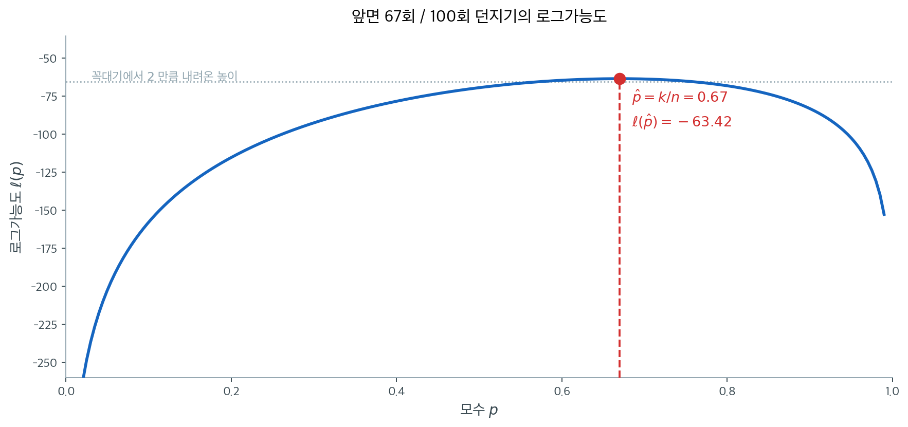
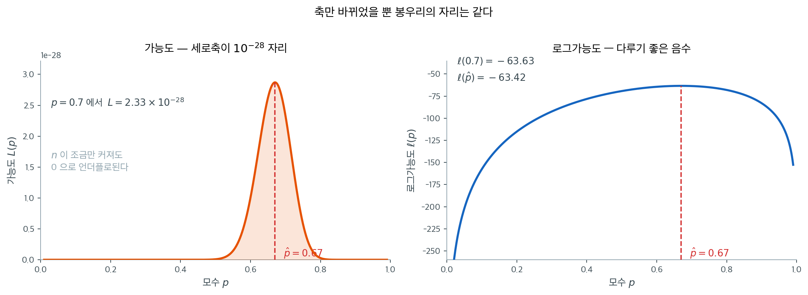

# 로그가능도 시각화

## 개요

**로그가능도함수**는 가능도에 로그를 취한 것으로 최대가능도추정의 주된 도구이다. 가능도 자체 대신 로그가능도로 작업하면 작은 확률을 많이 곱할 때 생기는 수치적 언더플로를 피할 수 있고 곱이 합으로 바뀌어 계산과 미분이 모두 간단해진다. 이 페이지에서는 베르누이 동전 던지기 보기로 로그가능도의 구성, 시각화, MLE 추출을 보인다.

## 가능도에서 로그가능도로

분포 $f(x; \theta)$에서 얻은 i.i.d. 관측값 $x_1, \ldots, x_n$이 주어졌을 때 **가능도**는:

$$
L(\theta) = \prod_{i=1}^n f(x_i; \theta)
$$

**로그가능도**는:

$$
\ell(\theta) = \log L(\theta) = \sum_{i=1}^n \log f(x_i; \theta)
$$

$\log$가 순증가함수이므로 MLE는 둘에 대해 같다:

$$
\hat{\theta}_{\text{MLE}} = \arg\max_\theta L(\theta) = \arg\max_\theta \ell(\theta)
$$

!!! warning "왜 가능도를 직접 쓰지 않는가?"
    $p = 0.7$인 $n = 100$개의 베르누이 관측값에서 가능도는 0과 1 사이 수 100개의 곱이다. 이 곱은 $10^{-30}$ 규모여서 아직은 표현된다 — 배정도의 언더플로 문턱은 $10^{-308}$ 근처이기 때문이다. 그러나 곱의 자릿수는 $n$에 **비례해** 내려가므로 $n$이 몇 백만 되면 금세 그 문턱을 넘는다(보기 3이 그 지점을 정확히 계산한다). 로그가능도는 곱을 합으로 바꾸어 이 문제를 아예 없앤다.

## 베르누이 로그가능도

$X_i \sim \text{Bernoulli}(p)$에서 PMF는:

$$
f(x; p) = p^x(1-p)^{1-x}, \quad x \in \{0, 1\}
$$

관측값 하나의 로그확률은:

$$
\log f(x; p) = x\log p + (1-x)\log(1-p)
$$

$n$개 관측값에 대한 로그가능도는:

$$
\ell(p) = \sum_{i=1}^n [x_i \log p + (1 - x_i)\log(1-p)] = k\log p + (n-k)\log(1-p)
$$

여기서 $k = \sum_{i=1}^n x_i$는 성공 횟수이다.

## MLE의 유도

(로그가능도의 도함수인) 점수를 0으로 두면:

$$
\ell'(p) = \frac{k}{p} - \frac{n-k}{1-p} = 0
$$

$$
k(1-p) = (n-k)p \quad \Rightarrow \quad k = np \quad \Rightarrow \quad \hat{p}_{\text{MLE}} = \frac{k}{n}
$$

2계도함수가 최댓값임을 확인해 준다:

$$
\ell''(p) = -\frac{k}{p^2} - \frac{n-k}{(1-p)^2} < 0
$$

## 구현과 시각화

<div class="exbox" markdown>

**보기 1.** <span class="diff easy" title="쉬움"></span> 로그가능도 구현과 시각화. 참값 $p = 0.7$인 동전을 $n = 100$번 던진 자료로 $\ell(p)$를 $[0.01, 0.99]$의 격자 $200$점 위에서 계산한다.

**(1)** 관측이 앞면 $k = 67$회였다. 해석적 최대가능도추정값은 얼마인가. 격자 탐색이 그 값을 정확히 찍을 수 있는가.

**(2)** 그려서 확인하고, 봉우리가 얼마나 평평한지 꼭대기보다 $2$ 낮은 높이를 기준으로 재시오.

</div>

??? success "풀이"

    **(1) 해석적으로.** 위에서 유도한 대로

    $$
    \hat p = \frac{k}{n} = \frac{67}{100} = 0.67
    $$

    이고 $\ell''(p) < 0$이므로 이것이 유일한 전역 최대다.

    **격자는 이 값을 찍지 못한다.** 격자가 $[0.01, 0.99]$를 $200$점으로 나누므로 간격이

    $$
    \frac{0.99 - 0.01}{199} = 0.0049246\ldots
    $$

    이고 격자점은 $0.01 + j \times 0.0049246$ 꼴이다. $0.67$이 이 꼴이 되려면 $j = (0.67 - 0.01)/0.0049246 = 134.0204\ldots$이 정수여야 하는데 그렇지 않다. 가장 가까운 격자점은 $j = 134$인 $0.6698995$다. **해석적으로 푼 답은 정확하고 격자 탐색은 격자만큼만 정확하다.**

    다만 그 대가는 작다. $\ell$이 봉우리에서 포물선에 가까워 $\hat p$에서 $\delta$ 벗어나면 $\ell$이 $\tfrac12\lvert\ell''(\hat p)\rvert\delta^2$만큼 떨어지는데, $\lvert\ell''(0.67)\rvert = n/(\hat p(1-\hat p)) = 452.1$이고 $\delta = 1.0 \times 10^{-4}$이므로 떨어지는 양이 $2.3\times10^{-6}$에 지나지 않는다.

    **(2) 수치적으로.**

    ```python
    import numpy as np

    def compute_log_prob(coin, p):
        """베르누이 시행 한 번의 로그확률."""
        return coin * np.log(p) + (1 - coin) * np.log(1 - p)


    def compute_log_likelihood(coins, p):
        """베르누이 시행 여러 번의 로그가능도."""
        return sum(compute_log_prob(coin, p) for coin in coins)


    # 동전을 n번 던진다. 참 p 는 우리가 모르는 값이라고 둔다.
    rng = np.random.default_rng(1)
    p_true = 0.7
    n_samples = 100
    coins = rng.binomial(n=1, p=p_true, size=n_samples)

    k = coins.sum()
    print(f"Observed: {k} heads out of {n_samples} flips")
    print(f"MLE: p_hat = {k / n_samples:.4f}")

    # 격자 위에서 로그가능도를 계산한다.
    ps = np.linspace(0.01, 0.99, 200)
    log_liks = np.array([compute_log_likelihood(coins, p) for p in ps])

    # 수치 최적화로 MLE를 찾는다.
    idx = np.argmax(log_liks)
    mle_p = ps[idx]
    print(f"Grid-search MLE: p_hat = {mle_p:.4f}")
    print(f"Max log-likelihood: {log_liks[idx]:.4f}")

    # (1) 에서 따진 것을 확인한다. 0.67 은 격자 위에 없다.
    step = ps[1] - ps[0]
    exact_ll = k * np.log(0.67) + (n_samples - k) * np.log(0.33)
    print(f"\n격자 간격 = {step:.7f},  (0.67 - 0.01)/간격 = {(0.67 - 0.01) / step:.4f}")
    print(f"격자점 {mle_p:.7f} 에서 l = {log_liks[idx]:.9f}")
    print(f"해석적  0.67      에서 l = {exact_ll:.9f}   (차이 {exact_ll - log_liks[idx]:.2e})")

    # (2) 봉우리의 폭. 꼭대기보다 2 낮은 높이 위에 머무는 구간.
    within = ps[log_liks >= log_liks[idx] - 2]
    print(f"꼭대기보다 2 낮은 높이 위의 구간: {within.min():.4f} ~ {within.max():.4f}")
    ```

    출력:

    ```
    Observed: 67 heads out of 100 flips
    MLE: p_hat = 0.6700
    Grid-search MLE: p_hat = 0.6699
    Max log-likelihood: -63.4179

    격자 간격 = 0.0049246,  (0.67 - 0.01)/간격 = 134.0204
    격자점 0.6698995 에서 l = -63.417865855
    해석적  0.67      에서 l = -63.417863571   (차이 2.28e-06)
    꼭대기보다 2 낮은 높이 위의 구간: 0.5763 ~ 0.7585
    ```

    격자 위에서 계산한 값을 그대로 그리면 이렇다.

    

    **(1)이 예측한 그대로다.** $(0.67 - 0.01)/0.0049246 = 134.0204$이 정수가 아니므로 $0.67$은 격자에 없고, 격자가 고른 $0.6698995$에서의 로그가능도가 해석적 답보다 $2.28\times10^{-6}$ 낮다. 앞서 포물선 근사로 어림한 $2.3\times10^{-6}$과 맞는다. **격자가 비껴난 것은 사실이지만 그 대가는 소수 여섯째 자리에서야 보인다.** 그래서 그림으로는 두 값이 구별되지 않는다.

    곡선의 **모양**에서 읽을 것이 둘이다. 첫째, 봉우리 부근이 평평하다. 그림의 점선이 꼭대기보다 2만큼 낮은 높이인데, 곡선이 그 위에 머무는 구간이 $0.5763$부터 $0.7585$까지로 폭이 $0.18$이나 된다. 자료 100개로도 이 폭의 값들을 뚜렷이 구별하지 못한다는 뜻이다. 격자가 만든 $10^{-6}$의 오차와 자료가 남긴 $0.18$의 불확실성을 나란히 놓으면 **어느 쪽을 걱정해야 하는지가 분명하다.** 이 평평함의 정도가 곧 추정의 불확실성이며 [Fisher 정보량](fisher_information.md)이 재는 것이 그것이다. 둘째, 양 끝에서 곡선이 급격히 떨어진다. $p$가 0이나 1에 가까우면 관측된 자료가 사실상 불가능해지기 때문이다.

!!! note "로그가능도의 모양"
    베르누이 로그가능도는 $(0, 1)$에서 $p$에 대해 오목한 함수이므로 유일한 전역 최댓값이 보장된다. 이 오목성은 모든 $p \in (0, 1)$에서 $\ell''(p) < 0$이라는 사실에서 따라 나온다.

## 벡터화된 계산

로그가능도는 반복문 없이도 효율적으로 계산할 수 있다:

<div class="exbox" markdown>

**보기 2.** <span class="diff easy" title="쉬움"></span> 로그가능도의 벡터화. 보기 1의 `compute_log_likelihood`는 관측 $100$개를 하나씩 돌며 로그확률을 더한다.

**(1)** 같은 값을 자료의 요약 두 개만으로 한 줄에 계산하는 식을 쓰시오. 두 판본이 **비트까지** 같은 값을 줄 것이라 기대할 수 있는가.

**(2)** 격자 $200$점에서 두 판본을 견주어 (1)의 예측을 확인하시오. 값이 어긋나더라도 MLE가 바뀌지 않는 까닭도 밝히시오.

</div>

??? success "풀이"

    **(1) 해석적으로.** 합을 풀어 쓰면 $x_i$가 $0$ 아니면 $1$이므로

    $$
    \ell(p) = \sum_{i=1}^n \left[x_i\log p + (1-x_i)\log(1-p)\right]
    = \left(\sum_i x_i\right)\log p + \left(n - \sum_i x_i\right)\log(1-p)
    = k\log p + (n-k)\log(1-p)
    $$

    이다. 관측 $100$개가 $(k, n)$ 두 수로 줄었다. **$k$가 충분통계량**이라는 사실의 계산적 결과이며, 벡터화가 가능한 까닭도 결국 이것이다. 반복문 판본은 격자점마다 $\log$를 $2n = 200$번 부르지만 이 식은 $2$번만 부른다.

    **비트까지 같지는 않을 것이다.** 두 식은 실수에서 같지만 부동소수점에서는 셈의 **순서**가 다르다. 반복문은 항 $100$개를 차례로 더하며 반올림 오차를 $99$번 쌓고, 한 줄 판본은 곱 두 번과 덧셈 한 번으로 끝낸다. 쌓이는 상대오차는 머신 엡실론 $\varepsilon \approx 2.2\times10^{-16}$의 몇 배, 곧 $10^{-15}$ 자리로 예상된다.

    **그래도 MLE는 바뀌지 않는다.** 이웃한 격자점 사이에서 $\ell$이 $\tfrac12\lvert\ell''\rvert h^2 \approx \tfrac12(452)(0.0049)^2 = 5.4\times10^{-3}$만큼 차이 나는데, 이는 예상 오차 $10^{-13}$보다 $10$자리 크다. 순위가 뒤집힐 여지가 없다.

    **(2) 수치적으로.**

    ```python
    import numpy as np

    def log_likelihood_vectorized(coins, p):
        """로그가능도를 벡터화해 한 번에 계산한다."""
        k = coins.sum()
        n = len(coins)
        return k * np.log(p) + (n - k) * np.log(1 - p)

    # 두 값을 견준다.
    rng = np.random.default_rng(1)
    coins = rng.binomial(1, 0.7, 100)
    ps = np.linspace(0.01, 0.99, 200)

    ll_vec = np.array([log_likelihood_vectorized(coins, p) for p in ps])
    idx = np.argmax(ll_vec)
    print(f"Vectorized MLE: p = {ps[idx]:.4f}")

    # 보기 1 의 반복문 판본과 견준다.
    def compute_log_likelihood(coins, p):
        return sum(coin * np.log(p) + (1 - coin) * np.log(1 - p) for coin in coins)

    ll_loop = np.array([compute_log_likelihood(coins, p) for p in ps])
    print(f"\n두 판본이 비트까지 같은가? {np.array_equal(ll_loop, ll_vec)}")
    print(f"최대 절대 차이 = {np.abs(ll_loop - ll_vec).max():.3e}")
    print(f"최대 상대 차이 = {np.abs((ll_loop - ll_vec) / ll_loop).max():.3e}  "
          f"(머신 엡실론 {np.finfo(float).eps:.3e})")
    print(f"그래도 argmax 는 같은가? {np.argmax(ll_loop) == np.argmax(ll_vec)}")
    print(f"이웃 격자점 사이 l 의 차 = {ll_vec[idx] - ll_vec[idx + 1]:.3e}")

    # 격자까지 한꺼번에 밀어 넣으면 log 호출이 40000 번에서 2 번으로 준다.
    k, n = coins.sum(), len(coins)
    ll_array = k * np.log(ps) + (n - k) * np.log(1 - ps)
    print(f"격자 전체를 한 줄로 계산한 것과의 최대 차이 = {np.abs(ll_array - ll_vec).max():.3e}")
    ```

    출력:

    ```
    Vectorized MLE: p = 0.6699

    두 판본이 비트까지 같은가? False
    최대 절대 차이 = 4.263e-13
    최대 상대 차이 = 2.402e-15  (머신 엡실론 2.220e-16)
    그래도 argmax 는 같은가? True
    이웃 격자점 사이 l 의 차 = 5.287e-03
    격자 전체를 한 줄로 계산한 것과의 최대 차이 = 0.000e+00
    ```

    **예측이 맞았다.** 두 판본은 비트까지 같지 않고, 최대 상대 차이가 $2.4\times10^{-15}$로 머신 엡실론의 약 $11$배다. $100$개 항을 더하며 쌓인 오차치고는 작은 편이다. 그런데도 `argmax`는 같은데, 이웃 격자점 사이의 $\ell$ 차이 $5.287\times10^{-3}$이 (1)에서 어림한 $5.4\times10^{-3}$과 맞고 어긋남 $4.3\times10^{-13}$보다 $10$자리 크기 때문이다. **값이 다르면서도 답은 같다** — 수치계산에서 흔히 보는 꼴이고, "같은지"를 물을 때 비트 비교 대신 허용오차를 두고 보아야 하는 까닭이다.

    격자를 통째로 넣은 마지막 판본은 한 줄 판본과 **정확히 같은 값**($0$ 차이)을 준다. 격자점마다 부른 것과 배열로 한 번에 부른 것이 같은 연산을 같은 순서로 하기 때문이다. $\log$ 호출 수는 $40{,}000$번에서 $2$번으로 줄었다.

## 가능도와 로그가능도의 비교

로그변환이 왜 필수적인지 보이기 위해 원래 가능도 값을 살펴보자:

<div class="exbox" markdown>

**보기 3.** <span class="diff easy" title="쉬움"></span> 가능도와 로그가능도의 수치 비교. 가능도를 곱으로 그대로 계산하면 $n$이 커질수록 작아져 언젠가 $0$으로 내려앉는다.

**(1)** $k = \hat p\,n$일 때 $\log_{10} L(\hat p)$를 $n$의 함수로 쓰고, $\hat p = 0.67$에서 배정밀도 부동소수점이 $0$을 돌려주기 시작하는 $n$을 구하시오.

**(2)** 확인하시오. 또 격자 $[0.01, 0.99]$ **전체**에서 계산할 때는 훨씬 작은 $n$에서 이미 망가지는데, 왜 그런가.

</div>

??? success "풀이"

    **(1) 해석적으로.** $k = \hat p\,n$을 넣으면

    $$
    \log_{10} L(\hat p)
    = k \log_{10}\hat p + (n-k)\log_{10}(1-\hat p)
    = -n\underbrace{\left[-\hat p\log_{10}\hat p - (1-\hat p)\log_{10}(1-\hat p)\right]}_{H_{10}(\hat p)}
    $$

    이다. 대괄호 안은 밑이 $10$인 **엔트로피**이고 $\hat p = 0.67$에서

    $$
    H_{10}(0.67) = -0.67\log_{10}0.67 - 0.33\log_{10}0.33 = 0.27542
    $$

    이다. 곧 $\log_{10}L = -0.27542\,n$으로 $n$에 **비례해** 자릿수가 내려간다. $n = 100$이면 $10^{-27.5}$, $n = 1000$이면 $10^{-275}$다.

    배정밀도의 바닥은 두 단계다. 정규수의 최솟값이 $2.225\times10^{-308}$이므로

    $$
    0.27542\,n > 307.65 \;\Longrightarrow\; n > 1117
    $$

    에서 비정규수로 떨어져 유효숫자를 잃기 시작하고, 비정규수의 최솟값 $\approx 10^{-323.3}$마저 뚫는

    $$
    0.27542\,n > 323.3 \;\Longrightarrow\; n > 1174
    $$

    에서 정확히 $0$이 된다.

    **(2) 수치적으로.**

    ```python
    import numpy as np

    rng = np.random.default_rng(1)
    coins = rng.binomial(1, 0.7, 100)
    k = coins.sum()
    n = len(coins)

    p = 0.7
    # 가능도를 곱으로 그대로 계산하면 100개의 작은 수를 곱하게 되어
    # 값이 1e-28 까지 내려간다.
    raw_likelihood = p**k * (1-p)**(n-k)

    # 로그를 취하면 곱이 합이 되어 이 문제가 사라진다.
    # log는 단조증가 함수이므로 **최대가 되는 지점은 바뀌지 않는다.**
    # 로그가능도를 쓰는 이유가 이 두 가지다: 수치 안정성과 미분의 편리함.
    log_likelihood = k * np.log(p) + (n-k) * np.log(1-p)

    print(f"Raw likelihood at p=0.7: {raw_likelihood:.2e}")
    print(f"Log-likelihood at p=0.7: {log_likelihood:.4f}")

    # (1) 이 예측한 자리에서 정말 0 이 되는지 본다. k = 0.67 n 으로 늘려 간다.
    print("\n봉우리 p_hat = 0.67 에서의 가능도")
    for N in (100, 500, 1000, 1117, 1175):
        kk = round(0.67 * N)
        print(f"  n = {N:>4}:  L = {0.67**kk * 0.33**(N - kk):.3e}")

    # 격자 전체에서는 가장 작은 값이 먼저 0 이 된다.
    ps = np.linspace(0.01, 0.99, 200)
    print("\n격자 [0.01, 0.99] 위에서 가장 작은 가능도")
    for N in (100, 200, 241, 250):
        kk = round(0.67 * N)
        print(f"  n = {N:>4}:  min L = {(ps**kk * (1 - ps)**(N - kk)).min():.3e}")
    ```

    출력:

    ```
    Raw likelihood at p=0.7: 2.33e-28
    Log-likelihood at p=0.7: -63.6283

    봉우리 p_hat = 0.67 에서의 가능도
      n =  100:  L = 2.871e-28
      n =  500:  L = 1.949e-138
      n = 1000:  L = 3.799e-276
      n = 1117:  L = 1.720e-308
      n = 1175:  L = 0.000e+00

    격자 [0.01, 0.99] 위에서 가장 작은 가능도
      n =  100:  min L = 7.177e-135
      n =  200:  min L = 5.151e-269
      n =  241:  min L = 4.447e-323
      n =  250:  min L = 0.000e+00
    ```

    **(1)의 예측이 자리마다 맞는다.** $n = 100$에서 $10^{-27.5}$, $n = 1000$에서 $10^{-275.6}$으로 $-0.27542\,n$ 그대로이고, $n = 1117$에서 $1.72\times10^{-308}$로 정규수의 바닥을 막 뚫었으며, $n = 1175$에서 정확히 $0$이 된다. 예측한 문턱 $1117$과 $1174$가 그대로 나왔다.

    **격자 전체에서는 훨씬 일찍 망가진다.** $n = 250$만 되어도 격자 위의 가장 작은 값이 이미 $0$이다. 까닭은 $\log_{10}L(p) = n[\hat p\log_{10}p + (1-\hat p)\log_{10}(1-p)]$에서 $p$가 봉우리를 벗어나면 대괄호가 $-H_{10}(\hat p)$보다 훨씬 작아지기 때문이다. 격자의 왼쪽 끝 $p = 0.01$에서는 그 값이 $-1.341$로 봉우리의 $-0.275$보다 다섯 배 가파르고, 그래서 $323.3/1.341 = 241$에서 벌써 $0$에 닿는다. **최대화할 대상이 사라지는 것은 봉우리가 아니라 그 바깥부터다.**

    

    왼쪽 세로축의 $10^{-28}$이라는 배율에 주목하라. 관측값 100개의 확률을 그대로 곱한 값이다. 오른쪽은 같은 함수에 로그를 씌운 것이다. **봉우리의 자리는 조금도 움직이지 않았다.** 로그가 순증가함수이므로 대소 관계가 그대로 보존되기 때문이며, 바뀐 것은 세로축의 눈금뿐이다. 왼쪽에서 봉우리 밖이 전부 0처럼 보이던 구간도 오른쪽에서는 제 값을 갖고 구별되는데, 바로 그 구간이 $n$을 키우면 **진짜로** 0이 되어 사라지는 곳이다.

## 해석

- **로그가능도함수**는 확률의 곱을 합으로 바꾸어 수치적 안정성과 해석적 편의를 제공한다.
- **MLE**는 로그가능도 곡선의 봉우리에 있는 모수값이다.
- 베르누이 자료에서 MLE $\hat{p} = k/n$(표본비율)은 해석적으로 구할 수 있지만, 로그가능도를 시각화하면 추론 지형의 전체 모양이 드러난다.
- MLE에서 로그가능도의 **곡률**은 Fisher 정보량과 관련되며 추정의 정밀도를 결정한다.

## 연습문제

<div class="drillbox" markdown>

**연습문제 1.** <span class="diff easy" title="쉬움"></span> $k = 14$번 성공한 $n = 20$번의 베르누이 시행에 대해 $p = 0.5, 0.6, 0.7, 0.8$에서 로그가능도를 계산하라. 어느 값의 로그가능도가 가장 높은가? MLE와 어떻게 비교되는가?

</div>

??? success "풀이"
    $\ell(p) = 14\log p + 6\log(1-p)$를 사용하여 계산하면:

    - $\ell(0.5) = 20 \ln 0.5 = -13.863$
    - $\ell(0.6) = 14 \ln 0.6 + 6 \ln 0.4 = -7.148 - 5.498 = -12.646$
    - $\ell(0.7) = 14 \ln 0.7 + 6 \ln 0.3 = -4.993 - 7.225 = -12.218$
    - $\ell(0.8) = 14 \ln 0.8 + 6 \ln 0.2 = -3.124 - 9.657 = -12.781$

    로그가능도가 가장 높은 것은 $p = 0.7$이며, 이것이 MLE $\hat{p} = 14/20 = 0.7$이다. $\square$

<div class="drillbox" markdown>

**연습문제 2.** <span class="diff med" title="중간"></span> 베르누이 모형의 로그가능도가 $p$에 대해 오목함을 보여라. 오목성이 임의의 임계점이 전역 최댓값임을 보장하는 이유는 무엇인가?

</div>

??? success "풀이"
    로그가능도의 2계도함수는:

    $$
    \ell''(p) = -\frac{k}{p^2} - \frac{n-k}{(1-p)^2}
    $$

    $k \geq 0$, $n - k \geq 0$, $p^2 > 0$, $(1-p)^2 > 0$이므로 두 항 모두 양수가 아니다. $0 < k < n$이면(성공과 실패가 적어도 하나씩 있으면) 두 항이 모두 엄격하게 음수이므로 모든 $p \in (0, 1)$에서 $\ell''(p) < 0$이다.

    2계도함수가 엄격하게 음수인 함수는 순오목이다. 구간에서 순오목인 함수에서는 임의의 임계점($\ell'(p) = 0$인 점)이 반드시 전역 최댓값이다. 오목성은 함수가 어디서나 아래로 휜다는 뜻이기 때문이다. 다른 국소 최댓값이나 안장점은 존재할 수 없다. $\square$

<div class="drillbox" markdown>

**연습문제 3.** <span class="diff med" title="중간"></span> 수치 계산에서 $L(\theta)$ 대신 $\log L(\theta)$를 쓰는 것이 왜 필수적인지 설명하라. 컴퓨터에서 $L(\theta)$가 0으로 언더플로되는 구체적인 예를 들라.

</div>

??? success "풀이"
    IEEE 754 배정밀도 부동소수점의 최소 양수는 약 $5 \times 10^{-324}$이다. i.i.d. Bernoulli$(0.5)$ 관측값 $n = 1000$개를 생각하자. $p = 0.5$에서 가능도는:

    $$
    L(0.5) = 0.5^{1000} = 2^{-1000} \approx 9.3 \times 10^{-302}
    $$

    이는 표현 가능하지만, $n = 1100$이면 $2^{-1100} \approx 10^{-331}$로 최소값보다 작아 부동소수점에서 정확히 0.0으로 언더플로된다.

    로그가능도는 이를 피한다: $\ell(0.5) = -1100 \ln 2 \approx -762.5$로 완벽하게 표현 가능한 수이다. $n = 10^6$에서도 로그가능도는 수치적으로 안정하다. $\square$

<div class="drillbox" markdown>

**연습문제 4.** <span class="diff med" title="중간"></span> $n$개의 관측값을 갖는 포아송분포에 대해 로그가능도 $\ell(\lambda)$를 쓰고 MLE를 유도하라. $\ell''(\hat{\lambda}) < 0$임을 확인하라.

</div>

??? success "풀이"
    Poisson PMF는 $f(x; \lambda) = e^{-\lambda}\lambda^x/x!$이므로:

    $$
    \ell(\lambda) = \sum_{i=1}^n [-\lambda + x_i \log\lambda - \log(x_i!)] = -n\lambda + \left(\sum x_i\right)\log\lambda - \sum\log(x_i!)
    $$

    점수: $\ell'(\lambda) = -n + \frac{\sum x_i}{\lambda} = 0$이므로 $\hat{\lambda} = \bar{X}$이다.

    2계도함수: $\ell''(\lambda) = -\frac{\sum x_i}{\lambda^2}$.

    $\hat{\lambda} = \bar{X}$에서 ($\bar{X} > 0$을 가정하면) $\ell''(\bar{X}) = -\frac{n\bar{X}}{\bar{X}^2} = -\frac{n}{\bar{X}} < 0$이다.

    로그가능도가 오목하고 MLE가 최댓값임이 확인된다. $\square$

<div class="drillbox" markdown>

**연습문제 5.** <span class="diff med" title="중간"></span> 관측 Fisher 정보량은 $\hat{I}(\theta) = -\ell''(\hat{\theta})$이다. 베르누이 모형에서 MLE에서의 관측 정보량이 $n/[\hat{p}(1-\hat{p})]$과 같음을 보여라. 이를 사용하여 $n = 100$, $k = 72$일 때 $p$에 대한 근사적인 95% 신뢰구간을 구성하라.

</div>

??? success "풀이"
    연습문제 2에서 $\ell''(p) = -k/p^2 - (n-k)/(1-p)^2$이다.

    $\hat{p} = k/n$에서:

    $$
    -\ell''(\hat{p}) = \frac{k}{\hat{p}^2} + \frac{n-k}{(1-\hat{p})^2} = \frac{n\hat{p}}{\hat{p}^2} + \frac{n(1-\hat{p})}{(1-\hat{p})^2} = \frac{n}{\hat{p}} + \frac{n}{1-\hat{p}} = \frac{n}{\hat{p}(1-\hat{p})}
    $$

    $n = 100, k = 72$이면 $\hat{p} = 0.72$이고 $\hat{I} = 100/(0.72 \times 0.28) = 495.87$이다.

    MLE의 근사 분산은 $1/\hat{I} = 0.72 \times 0.28/100 = 0.002016$이다.

    표준오차는 $\sqrt{0.002016} = 0.04490$이다.

    95% 신뢰구간은:

    $$
    0.72 \pm 1.96 \times 0.04490 = [0.632, 0.808]
    $$

    $\square$

<div class="drillbox" markdown>

**연습문제 6.** <span class="diff med" title="중간"></span>
로그가능도를 $\hat\theta$ 근처에서 2차까지 테일러 전개하면 무엇이 나오는가? 이 근사에서 왈드 신뢰구간이 어떻게 따라 나오는지 보이고, 근사가 나쁠 때의 신호를 적어라.

</div>

??? success "풀이"
    $\hat\theta$가 내부 최댓값이면 $\ell'(\hat\theta) = 0$이므로 1차항이 사라지고

    $$
    \ell(\theta) \approx \ell(\hat\theta) + \frac12\ell''(\hat\theta)(\theta-\hat\theta)^2 = \ell(\hat\theta) - \frac{\hat I}{2}(\theta-\hat\theta)^2
    $$

    이다($\hat I = -\ell''(\hat\theta)$는 관측정보량). 즉 **로그가능도가 봉우리 근처에서 아래로 볼록한 포물선**이고, 가능도 자체는

    $$
    L(\theta) \approx L(\hat\theta)\exp\left\{-\frac{\hat I}{2}(\theta-\hat\theta)^2\right\}
    $$

    로 **평균 $\hat\theta$, 분산 $1/\hat I$인 정규밀도 모양**이 된다.

    **왈드 구간.** 이 근사를 우도비 구간에 넣으면

    $$
    2\{\ell(\hat\theta)-\ell(\theta)\} \approx \hat I(\theta-\hat\theta)^2 \le \chi^2_{1,0.95} = 1.96^2
    $$

    이므로

    $$
    |\theta-\hat\theta| \le \frac{1.96}{\sqrt{\hat I}} \implies \hat\theta \pm 1.96\,\widehat{\operatorname{SE}}, \quad \widehat{\operatorname{SE}} = \frac{1}{\sqrt{\hat I}}
    $$

    가 나온다. **왈드 구간은 곧 "로그가능도를 포물선으로 본" 구간**이다.

    **근사가 나쁠 때의 신호.**

    - 로그가능도 곡선이 눈에 띄게 **비대칭**이다(한쪽이 급하고 다른 쪽이 완만하다).
    - $\hat\theta$가 모수공간의 **경계**에 있거나 가깝다($\hat p = 0$, $\hat\sigma^2 = 0$ 등).
    - 표본이 작다. 이차 근사의 오차는 $O(n^{-1/2})$이다.
    - 모수화가 부자연스럽다. 같은 모형이라도 $p$ 대신 로짓, $\sigma$ 대신 $\ln\sigma$로 두면 곡선이 훨씬 포물선에 가까워진다.

    **진단 방법이 간단하다.** 로그가능도 곡선을 그려 봉우리에 포물선을 겹쳐 그리면 된다. 두 곡선이 $\pm2$ 표준오차 범위에서 눈에 띄게 벌어지면 왈드 대신 우도비 구간을 써야 한다.

<div class="drillbox" markdown>

**연습문제 7.** <span class="diff med" title="중간"></span>
코시분포의 위치모수 $\theta$에 대한 로그가능도

$$
\ell(\theta) = -\sum_{i=1}^n \ln\left\{1+(x_i-\theta)^2\right\} + \text{상수}
$$

는 봉우리가 여럿일 수 있다. 왜 그런지 설명하고, 수치 최적화에서 무엇을 조심해야 하는지 적어라.

</div>

??? success "풀이"
    **왜 봉우리가 여럿인가.** 점수함수가

    $$
    \ell'(\theta) = \sum_i \frac{2(x_i-\theta)}{1+(x_i-\theta)^2}
    $$

    인데, 각 항 $\psi(r) = 2r/(1+r^2)$이 **유계이고 $|r|\to\infty$에서 0으로 되돌아간다**(재하강). 따라서 $\theta$가 어느 관측값 근처에 있으면 그 관측값만 강하게 끌어당기고 멀리 있는 관측값들은 거의 힘을 쓰지 못한다.

    관측값들이 서로 멀리 떨어져 있으면 **각 무리마다 국소 봉우리**가 생긴다. 실제로 $\ell'(\theta)=0$은 최대 $2n-1$개의 해를 가질 수 있다.

    정규분포와 대비하면 분명하다. 정규에서는 $\psi(r)=r$이 유계가 아니라 모든 관측값이 끝까지 끌어당기고, 점수방정식이 선형이라 해가 유일하다($\bar x$).

    **수치 최적화에서 조심할 것.**

    - **초기값을 잘 주어야 한다.** 표본중앙값이 좋은 출발점이다. 코시분포에서 중앙값은 일치추정량이고 계산도 간단하다. 표본평균은 절대 쓰면 안 된다(수렴하지 않는다).
    - **여러 초기값에서 돌린다.** 관측값들 자체나 분위수들을 초기값으로 삼아 여러 번 최적화하고 가장 큰 $\ell$을 고른다.
    - **격자 탐색으로 전역 모양을 먼저 본다.** 모수가 하나이므로 $\ell(\theta)$를 촘촘한 격자에서 그려 보는 것이 가장 확실하다.
    - **뉴턴법이 발산할 수 있다.** $\ell''$이 양수인 영역이 있으므로 갱신이 오르막이 아닐 수 있다. 신뢰영역법이나 감쇠 뉴턴법이 안전하다.

    **일반 교훈.** 재하강하는 $\psi$를 갖는 강건 추정량은 **강건성의 대가로 다봉성을 얻는다.** 후버 추정량처럼 $\psi$가 단조이면 로그가능도가 오목해 봉우리가 하나지만, 터키의 이중가중치나 $t$ 잡음처럼 재하강하는 것은 국소 최대가 생긴다.

<div class="drillbox" markdown>

**연습문제 8.** <span class="diff med" title="중간"></span>
**관측정보량** $\hat I = -\ell''(\hat\theta)$과 **기대정보량** $I(\theta) = E[-\ell''(\theta)]$의 차이를 설명하라. 표준오차 계산에 어느 쪽을 쓰는 것이 좋은가?

</div>

??? success "풀이"
    **차이.**

    - **관측정보량**은 손에 든 자료에서 계산한 실제 곡률이다. 확률변수이며 자료마다 다르다.
    - **기대정보량**은 그 기대값이다. $\theta$만의 함수이고 자료에 의존하지 않는다.

    큰수의 법칙에 따라 $\hat I/n \to I_1(\theta)$이므로 $n$이 크면 둘이 가까워진다.

    분포에 따라 아예 같은 경우도 있다. 지수분포에서 $\ell'' = -n/\lambda^2$은 자료에 의존하지 않으므로 관측정보량과 기대정보량이 정확히 같다. 베르누이에서는 $\hat I = n/\{\hat p(1-\hat p)\}$이고 $I(\hat p)$도 같은 값이라 역시 일치한다. **정준연결 지수족에서는 언제나 일치한다.**

    **어느 쪽을 쓸까.** 일반적으로 **관측정보량**이 권장되며, 이유는 세 가지다.

    1. **계산이 쉽다.** 기대값을 구할 필요 없이 최적화 과정에서 이미 얻은 헤시안을 그대로 쓴다.
    2. **조건성 원리에 맞는다.** 실제로 얻은 자료가 얼마나 정보를 담고 있는지를 반영한다. 에프런과 힝클리가 보인 대로, 부수통계량으로 조건화한 추론에 더 가깝다.
    3. **모형이 조금 틀렸을 때 더 낫다.** 기대정보량은 모형이 정확히 맞다는 가정에 더 의존한다.

    **예외.** 기대정보량이 유용한 경우도 있다. 피셔 점수법에서는 기대정보량이 언제나 양반정부호라 알고리즘이 안정적이다. 또 실험 설계 단계에서는 자료가 없으므로 기대정보량으로 표본크기를 계획한다.

<div class="drillbox" markdown>

**연습문제 9.** <span class="diff med" title="중간"></span>
혼합모형이나 잠재변수 모형에서는 $\ln\sum_k \exp(a_k)$ 꼴을 계산해야 한다. 이를 그대로 계산하면 왜 위험한지 설명하고 **logsumexp** 요령을 적어라.

</div>

??? success "풀이"
    **위험.** $a_k$가 로그가능도 값이면 $-1000$ 같은 큰 음수인 경우가 흔하다. 그대로 $\exp$를 취하면

    $$
    e^{-1000} = 0 \quad(\text{언더플로})
    $$

    이 되어 합이 0이 되고 $\ln 0 = -\infty$가 나온다. 반대로 $a_k$가 큰 양수이면 $\exp$가 오버플로해 `inf`가 된다.

    **logsumexp 요령.** $M = \max_k a_k$를 빼고 더한 뒤 되돌린다.

    $$
    \ln\sum_k e^{a_k} = M + \ln\sum_k e^{a_k-M}
    $$

    수학적으로 정확한 항등식이다($e^M$을 묶어 낸 것). 그런데 수치적으로는 완전히 다르다. 지수의 인수 $a_k - M$이 모두 0 이하이므로 $e^{a_k-M} \in (0,1]$이고, 적어도 하나(최댓값에 해당하는 항)는 정확히 1이다. **오버플로가 불가능하고, 합이 1 이상이라 언더플로도 무해하다.**

    ```python
    from scipy.special import logsumexp
    print(logsumexp([-1000, -1001, -1002]))   # -999.59...
    print(np.log(np.sum(np.exp([-1000, -1001, -1002]))))   # -inf
    ```

    **어디에 쓰이는가.**

    - **혼합모형의 로그가능도**: $\ell = \sum_i \ln\sum_k \pi_k f_k(x_i)$의 안쪽 합.
    - **소프트맥스와 교차엔트로피**: 분류 모형의 표준 구현이 모두 logsumexp를 쓴다.
    - **은닉 마르코프 모형의 전진-후진 알고리즘**, 신뢰전파, 베이즈망의 메시지 전달.
    - **중요도추출의 가중치 정규화**.

    같은 발상의 형제로 $\ln(1+x)$를 정확히 계산하는 `log1p`, $e^x-1$의 `expm1`, 로그 척도에서 두 값을 더하는 `logaddexp`가 있다. **가능도를 다루는 코드는 되도록 로그 척도를 떠나지 않는 것이 원칙이다.**

<div class="drillbox" markdown>

**연습문제 10.** <span class="diff med" title="중간"></span>
같은 모형에 $n=10$과 $n=100$인 자료를 적합해 로그가능도 곡선을 겹쳐 그렸다. 두 곡선에서 읽을 수 있는 것을 정리하고, 곡선을 어떻게 정규화해야 비교가 공정해지는지 적어라.

</div>

??? success "풀이"
    **곡선에서 읽는 것.**

    - **봉우리의 위치**가 $\hat\theta$다. 두 표본의 $\hat\theta$가 얼마나 다른지가 표집변동의 크기를 보여 준다.
    - **봉우리의 뾰족함**이 정보량이다. $n=100$ 곡선이 훨씬 가파르며, 곡률이 $n$에 비례하므로 폭이 $1/\sqrt n$로 줄어든다. 즉 $n$이 10배면 폭이 약 3.2분의 1이다.
    - **비대칭**이 남아 있는지. $n$이 커지면 곡선이 포물선에 가까워진다. $n=10$에서 눈에 띄던 비대칭이 $n=100$에서 거의 사라진다면, 왈드 근사를 작은 표본에 쓰면 안 된다는 신호다.

    **공정한 비교를 위한 정규화.**

    1. **세로축을 최댓값 기준으로 옮긴다.** $\ell(\theta)-\ell(\hat\theta)$를 그린다. 로그가능도의 절대 높이는 $n$에 비례해 커지므로(관측값마다 항이 하나씩 더해진다) 그대로 겹쳐 그리면 $n=100$ 곡선이 한참 아래에 놓여 모양을 볼 수 없다. 상대 로그가능도로 옮기면 두 곡선이 모두 0에서 시작한다.

    2. **관심이 "모양"이면 그대로, "정밀도"면 그대로 둔다.** 상대 로그가능도만 맞추면 $n=100$ 곡선이 훨씬 좁게 나오며, 이것이 곧 정밀도의 차이다. 반대로 두 곡선의 **모양**(비대칭 정도)만 비교하고 싶다면 가로축을 $\sqrt{\hat I}(\theta-\hat\theta)$로 표준화한다. 그러면 이차 근사가 완벽할 때 두 곡선이 같은 포물선 $-z^2/2$로 겹친다.

    3. **가로 범위를 표준오차 단위로 잡는다.** $\hat\theta \pm 4\widehat{\operatorname{SE}}$ 정도가 적당하다. 절대 범위로 잡으면 $n$이 클 때 곡선이 한 점으로 뭉개진다.

    **읽는 요령 하나.** 상대 로그가능도가 $-1.92$인 지점이 95% 우도비 구간의 양끝이다($\chi^2_{1,0.95}/2 = 1.92$). 이 수평선을 그려 두면 구간을 눈으로 바로 읽을 수 있고, 구간이 대칭인지도 함께 보인다.

---

## 정리하며

로그가능도는 최대가능도추정의 **실무 도구**다.

- **왜 로그인가.** 작은 확률을 수백 개 곱하면 언더플로가 나고, 곱은 미분하기 번거롭다. 로그를 취하면 합이 되어 둘 다 해결된다. 로그가 단조이므로 **최댓값의 위치는 바뀌지 않는다.**
- **그림에서 두 가지가 읽힌다.** 봉우리의 **위치**가 $\hat\theta$ 이고, 봉우리의 **뾰족함**이 정밀도다. 평평하면 여러 $\theta$ 가 비슷하게 그럴듯하다는 뜻이며, 그 곡률이 곧 관측 피셔 정보량이다.
- **베르누이 예에서 확인된다.** 앞면 비율이 $\hat p$ 에서 봉우리를 이루고, 시행 수가 늘수록 봉우리가 좁아진다. 자료가 많아질수록 $\theta$ 가 더 좁게 특정된다는 것을 눈으로 보는 셈이다.
- **가능도 자체를 그리면 봉우리만 보이고 나머지는 $0$ 에 붙어 버린다.** 로그 척도라야 모양 전체가 보인다.

다음 절 **기하분포와 포아송분포의 최대가능도**로 넘어간다. 두 이산분포를 같은 자료에 적합해 보고, 모형이 맞을 때와 틀릴 때의 차이를 본다.
