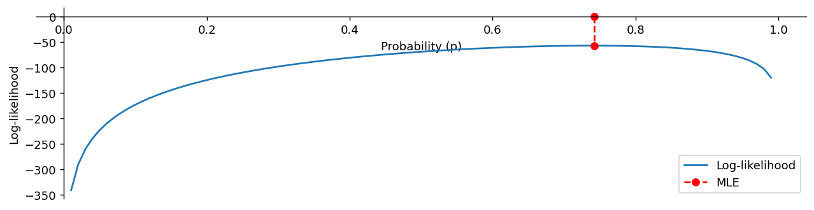

# Bernoulli 분포의 MLE

## 개요

$x^{(i)}$를 $B(p)$에서 얻은 $m$개의 i.i.d. 표본이라 하자. 그러면 $p$는 다음 $\hat{p}$로 추정할 수 있다:

$$
\hat{p} = \frac{\sum_{i=1}^m x^{(i)}}{m}
$$

## 유도

### 자료

$$
\{x^{(i)} : i = 1, \ldots, m\}
$$

### 모형

$$
x^{(i)} \sim B(p)
$$

### 가능도함수

$$
L(p) = \prod_{i=1}^m p^{x^{(i)}} (1 - p)^{1 - x^{(i)}}
$$

### 로그가능도함수

$$
\ell(p) = \sum_{i=1}^m x^{(i)} \log(p) + (1 - x^{(i)}) \log(1 - p)
$$

### 비용함수

$$
J(p) = -\sum_{i=1}^m x^{(i)} \log(p) + (1 - x^{(i)}) \log(1 - p)
$$

!!! note "교차엔트로피와의 연결"
    비용함수 $J(p)$는 로지스틱 회귀와 신경망에서 쓰는 **이진 교차엔트로피 손실**과 정확히 같다. Bernoulli 분포의 MLE가 교차엔트로피 기반 학습의 이론적 토대이다.

### 최대가능도 원리

$$
\text{argmax}_{p}\; L
\quad\Leftrightarrow\quad
\text{argmax}_{p}\; \ell
\quad\Leftrightarrow\quad
\text{argmin}_{p}\; J
$$

### MLE 해

$$
\begin{array}{llcll}
\displaystyle\frac{\partial J}{\partial p} = 0
&\Rightarrow&
\displaystyle\sum_{i=1}^m \frac{x^{(i)}}{p} - \frac{1 - x^{(i)}}{1 - p} = 0
&\Rightarrow&
\displaystyle\hat{p} = \frac{\sum_{i=1}^m x^{(i)}}{m}
\end{array}
$$

## 로그가능도 곡선 그려 보기

<div class="codebox" markdown>

**예제 1.** 베르누이 로그가능도와 MLE

```python
import numpy as np
import matplotlib.pyplot as plt

# 같은 결과가 다시 나오도록 난수 씨앗을 고정한다.
seed = 1
np.random.seed(seed)

# 앞면 확률과 던지는 횟수를 정한다.
p = 0.7
n_samples = 100

def load_data():
    """
    Simulate coin flips based on a binomial distribution.

    Returns:
    - numpy array: Array of coin flips (1 for heads, 0 for tails).
    """
    return np.random.binomial(n=1, p=p, size=(n_samples,))  # Shape (100,)

def compute_prob(coin, p):
    """
    Compute the probability of a single coin flip outcome.

    Parameters:
    - coin: Outcome of the coin flip (1 for heads, 0 for tails).
    - p: Probability of heads.

    Returns:
    - float: Probability of observing the outcome.
    """
    return p**coin * (1 - p)**(1 - coin)

def compute_log_prob(coin, p):
    """
    Compute the log-probability of a single coin flip outcome.

    Parameters:
    - coin: Outcome of the coin flip (1 for heads, 0 for tails).
    - p: Probability of heads.

    Returns:
    - float: Log-probability of observing the outcome.
    """
    return coin * np.log(p) + (1 - coin) * np.log(1 - p)

def compute_likelihood(coins, p):
    """
    Compute the joint probability of all coin flips for a given probability.

    Parameters:
    - coins: Array of coin flip outcomes.
    - p: Probability of heads.

    Returns:
    - float: Joint probability of observing all outcomes.
    """
    joint_prob = 1.0
    for coin in coins:
        joint_prob *= compute_prob(coin, p)
    return joint_prob

def compute_log_likelihood(coins, p):
    """
    Compute the log-likelihood of all coin flips for a given probability.

    Parameters:
    - coins: Array of coin flip outcomes.
    - p: Probability of heads.

    Returns:
    - float: Log-likelihood of observing all outcomes.
    """
    log_joint_prob = 0.0
    for coin in coins:
        log_joint_prob += compute_log_prob(coin, p)
    return log_joint_prob

# 동전을 n번 던진다. 참 p 는 우리가 모르는 값이라고 둔다.
coins = load_data()

# p 후보를 격자로 늘어놓는다. 이 중 로그가능도가 가장 큰 것을 고른다.
ps = np.linspace(0.01, 0.99, 100)

# 후보마다 로그가능도를 계산한다.
log_likelihood_list = [compute_log_likelihood(coins, p) for p in ps]
log_likelihood = np.array(log_likelihood_list)

# 로그가능도가 가장 큰 후보가 최대가능도추정값이다.
idx = np.argmax(log_likelihood)
mle_p = ps[idx]
log_likelihood_max = log_likelihood[idx]
print(f"MLE index: {idx}")
print(f"MLE probability (p): {mle_p:.4f}")
print(f"Max log-likelihood: {log_likelihood_max:.4f}\n")

# 로그가능도 곡선을 그리고 최댓값 자리를 표시한다.
fig, ax = plt.subplots(figsize=(12, 3))
ax.plot(ps, log_likelihood, label="Log-likelihood")
ax.plot([mle_p, mle_p], [0, log_likelihood_max], '--or', label="MLE")
ax.legend(loc="lower right")

# 축 이름과 범례를 다듬는다.
ax.spines['top'].set_visible(False)
ax.spines['right'].set_visible(False)
ax.spines['bottom'].set_position("zero")
ax.spines['left'].set_position("zero")
ax.set_xlabel("Probability (p)")
ax.set_ylabel("Log-likelihood")
plt.show()
```

출력:

```
MLE index: 74
MLE probability (p): 0.7425
Max log-likelihood: -57.3074
```



</div>

## 연습문제

<div class="drillbox" markdown>

**연습문제 1.** <span class="diff easy" title="쉬움"></span>
동전을 20번 던져 앞면 13번, 뒷면 7번이 나왔다. 로그가능도함수를 쓰고 MLE $\hat{p}$를 해석적으로 구하라.

</div>

??? success "풀이"
    $n = 20$번 중 $k = 13$번이 앞면이라 하자. 로그가능도는:

    $$
    \ell(p) = k \log p + (n-k) \log(1-p) = 13\log p + 7\log(1-p)
    $$

    도함수를 0으로 두면:

    $$
    \frac{d\ell}{dp} = \frac{13}{p} - \frac{7}{1-p} = 0
    $$

    $$
    13(1-p) = 7p \implies 13 - 13p = 7p \implies 13 = 20p \implies \hat{p} = \frac{13}{20} = 0.65
    $$

    2계도함수가 $-13/p^2 - 7/(1-p)^2 < 0$이므로 최댓값임이 확인된다.

<div class="drillbox" markdown>

**연습문제 2.** <span class="diff med" title="중간"></span>
Bernoulli의 MLE에서 표본크기나 관측된 자료와 무관하게 언제나 $\hat{p} = \bar{x}$(표본비율)이 MLE임을 보여라.

</div>

??? success "풀이"
    $k = \sum x_i$번 성공한 $n$번의 독립 Bernoulli 시행에 대해 로그가능도는:

    $$
    \ell(p) = k \log p + (n-k)\log(1-p)
    $$

    미분하여 0으로 두면:

    $$
    \frac{d\ell}{dp} = \frac{k}{p} - \frac{n-k}{1-p} = 0 \implies k(1-p) = (n-k)p \implies k = np
    $$

    $$
    \hat{p} = \frac{k}{n} = \frac{\sum x_i}{n} = \bar{x}
    $$

    이는 $0 \leq k \leq n$인 임의의 $k$와 $n$에 대해 성립한다. $\square$

<div class="drillbox" markdown>

**연습문제 3.** <span class="diff med" title="중간"></span>
Bernoulli 관측값 하나에 대한 Fisher 정보량을 계산하고 $\hat{p}$의 점근분산을 유도하라.

</div>

??? success "풀이"
    Bernoulli$(p)$ 관측값 하나에 대해 로그가능도는 $\ell(p) = x\log p + (1-x)\log(1-p)$이다. 2계도함수는:

    $$
    \frac{d^2\ell}{dp^2} = -\frac{x}{p^2} - \frac{1-x}{(1-p)^2}
    $$

    ($E[X] = p$를 사용하여) 기댓값에 음수를 취하면:

    $$
    I(p) = -E\!\left[\frac{d^2\ell}{dp^2}\right] = \frac{p}{p^2} + \frac{1-p}{(1-p)^2} = \frac{1}{p} + \frac{1}{1-p} = \frac{1}{p(1-p)}
    $$

    $n$개의 관측값에 기반한 $\hat{p}$의 점근분산은:

    $$
    \text{Var}(\hat{p}) \approx \frac{1}{nI(p)} = \frac{p(1-p)}{n}
    $$

    표본비율의 분산에 대한 익숙한 공식이다.

<div class="drillbox" markdown>

**연습문제 4.** <span class="diff med" title="중간"></span>
10번 던져 앞면이 0번 나오면 MLE는 $\hat{p} = 0$을 준다. 이것이 왜 문제인지 설명하고 대안적인 접근을 하나 서술하라.

</div>

??? success "풀이"
    MLE $\hat{p} = 0$은 이 동전에서 앞면이 결코 나올 수 없다는 뜻인데, 관측값 10개만으로 내리기에는 극단적인 결론이다. 문제는 특히 소표본에서 MLE가 비합리적인 경계값 추정치를 낼 수 있다는 것이다.

    한 가지 대안은 **Laplace 평활**(또는 균등 사전분포를 쓴 베이즈 접근)이다. 자료에 "가상의 성공" 하나와 "가상의 실패" 하나를 더하여 $\hat{p}_{\text{Laplace}} = (0+1)/(10+2) = 1/12 \approx 0.083$을 얻는다. 자료에 근거하면서도 0이라는 추정값을 피한다. 더 형식적으로 이는 Beta$(1,1)$(균등) 사전분포 아래의 사후평균에 해당하며 $\hat{p}_{\text{Bayes}} = (k+1)/(n+2)$를 준다.

---

## 정리하며

베르누이의 최대가능도추정량은 **표본비율**이다.

$$
\hat p = \frac{1}{m}\sum_{i=1}^m x^{(i)}
$$

- **유도가 가장 단순한 경우다.** 로그가능도가 $\left(\sum x_i\right)\log p+\left(m-\sum x_i\right)\log(1-p)$ 이고, 미분해 $0$ 으로 두면 곧바로 나온다.
- **직관과 일치한다.** 앞면이 7 번 나왔으면 $\hat p=0.7$ 이다. 최대가능도가 상식적인 답을 준다는 것이 이 예의 요점이다.
- **불편이며 효율적이다.** $\mathbb{E}[\hat p]=p$ 이고 분산 $p(1-p)/m$ 이 크라메르–라오 하한과 정확히 같다. **더 나은 불편추정량은 존재하지 않는다.**
- **$\sum x_i$ 가 충분통계량이다.** 어느 시행에서 성공했는지는 $p$ 에 관해 아무 정보도 주지 않으며, 성공 횟수만 알면 된다.
- **경계에서 주의가 필요하다.** 모두 성공이면 $\hat p=1$ 이고 표준오차 추정이 $0$ 이 된다. 소표본 비율 추정에서 이 문제가 실제로 생기며, 8장의 윌슨 구간 같은 대안이 그래서 나온다.

다음 절 **정규분포의 최대가능도**로 넘어간다. 모수가 둘이라 연립방정식을 풀어야 하고, 분산추정량에서 익숙한 $n$ 대 $n-1$ 문제가 다시 나타난다.
