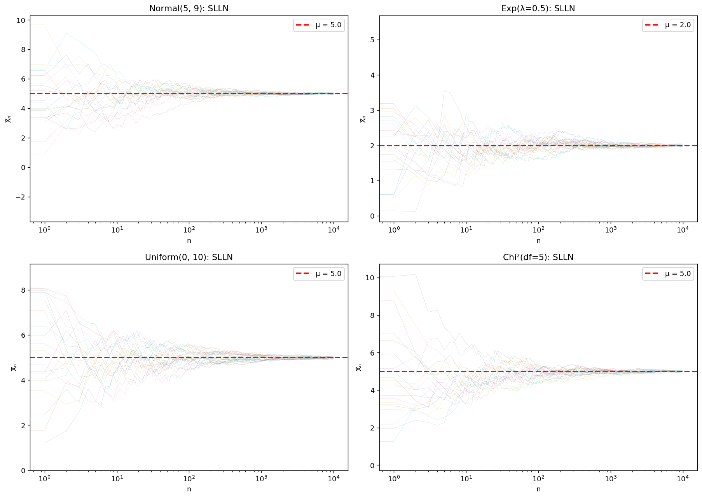
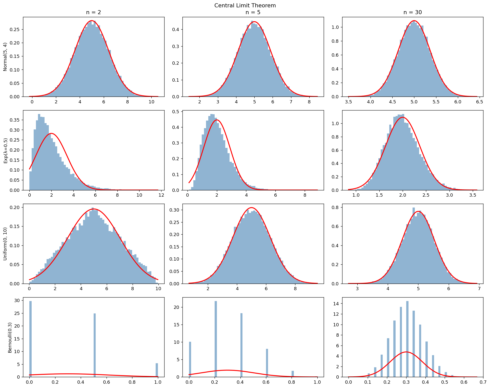
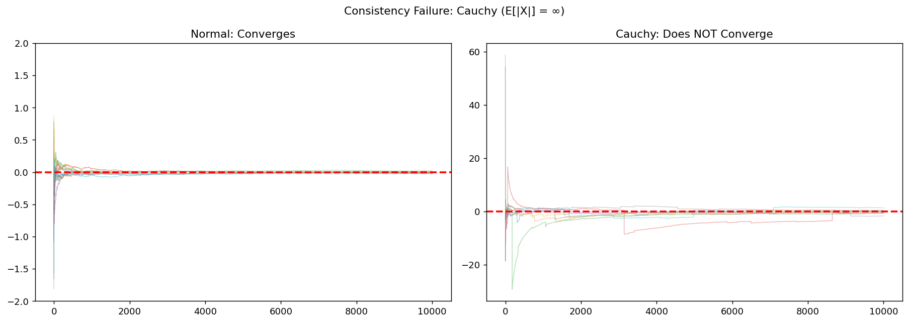

# 일치성과 수렴

## 개요

일치성이란 표본크기가 커질 때 추정량이 참 모수값으로 수렴한다는 뜻이다. 표본평균에서는 모집단의 평균이 유한하면 대수의법칙이 이를 보장한다. 중심극한정리는 나아가 이 수렴의 속도와 모양을 기술한다. 이 페이지에서는 이런 수렴 성질을 보이고, 수렴이 실패하는 경우(Cauchy 분포)를 살펴보며, 자기상관이나 금융에서의 추정 기간 같은 실무적 문제를 다룬다.

## 강대수의법칙

**강대수의법칙(SLLN)**은 $E[|X|] < \infty$인 i.i.d. 관측값에 대해 다음을 말한다:

$$\bar{X}_n \xrightarrow{\text{a.s.}} \mu \quad (n \to \infty)$$

즉 확률 1로 누적평균이 $\mu$로 수렴한다. 다음 모의실험은 네 가지 분포에서 독립적인 20개 수열의 누적평균을 그린다.

```python
import numpy as np
import matplotlib.pyplot as plt

def consistency_visualization(seed=42):
    rng = np.random.default_rng(seed)
    N = 10_000
    n_runs = 20

    distributions = {
        'Normal(5, 9)':    (lambda: rng.normal(5, 3, N), 5.0),
        'Exp(λ=0.5)':      (lambda: rng.exponential(2, N), 2.0),
        'Uniform(0, 10)':  (lambda: rng.uniform(0, 10, N), 5.0),
        'Chi²(df=5)':      (lambda: rng.chisquare(5, N), 5.0),
    }

    fig, axes = plt.subplots(2, 2, figsize=(14, 10))
    for ax, (name, (sampler, true_mu)) in zip(axes.flat, distributions.items()):
        # 같은 분포에서 20개의 **경로**를 그린다.
        # 큰수의 법칙은 "평균이 참값에 가까워진다"가 아니라
        # "거의 모든 경로가 참값으로 수렴한다"를 말하므로,
        # 한 경로가 아니라 여러 경로를 겹쳐 그려야 그 뜻이 드러난다.
        for _ in range(n_runs):
            data = sampler()
            # cumsum을 1, 2, 3, ... 으로 나누면 각 시점까지의 평균이 된다
            running_mean = np.cumsum(data) / np.arange(1, N + 1)
            ax.plot(running_mean, alpha=0.2, linewidth=0.5)
        ax.axhline(true_mu, color='red', linestyle='--', linewidth=2,
                   label=f'μ = {true_mu}')
        # 가로축을 로그로 둔다. n=1..100 구간의 극심한 흔들림과
        # n=1000 이후의 안정을 한 화면에 담으려면 로그가 필요하다.
        ax.set_xscale('log')
        ax.set_xlabel('n')
        ax.set_ylabel('X̄ₙ')
        ax.set_title(f'{name}: SLLN')
        ax.legend()
    plt.tight_layout()
    plt.show()
consistency_visualization()
```



!!! tip "그림에서 보이는 양상"
    모집단 분포와 무관하게, $n$이 커지면 20개의 표본경로가 모두 빨간 점선($\mu$)으로 수렴한다. 강대수의법칙이 작동하는 모습이다.

## 중심극한정리

**중심극한정리(CLT)**는 큰 $n$에서 $\bar{X}_n$의 분포를 기술한다:

$$\frac{\bar{X}_n - \mu}{\sigma/\sqrt{n}} \xrightarrow{d} N(0, 1)$$

동등하게, 큰 $n$에 대해 $\bar{X}_n \approx N(\mu, \sigma^2/n)$이다. 분산이 유한한 **모든** 모집단 분포에서 성립한다.

```python
from scipy import stats

def clt_demonstration(seed=42):
    rng = np.random.default_rng(seed)
    n_sim = 20_000

    populations = {
        'Normal(5, 4)':     (lambda n: rng.normal(5, 2, n), 5.0, 4.0),
        'Exp(λ=0.5)':       (lambda n: rng.exponential(2, n), 2.0, 4.0),
        'Uniform(0, 10)':   (lambda n: rng.uniform(0, 10, n), 5.0, 100/12),
        'Bernoulli(0.3)':   (lambda n: rng.binomial(1, 0.3, n), 0.3, 0.21),
    }

    sample_sizes = [2, 5, 30]
    fig, axes = plt.subplots(len(populations), len(sample_sizes), figsize=(15, 12))

    # 행 = 모집단(넷), 열 = 표본 크기(2, 5, 30).
    # 가로로 읽으면 "n이 커지면 종 모양이 된다",
    # 세로로 읽으면 "모집단이 달라도 결과가 같다"가 보인다.
    # 다만 치우침이 심한 모집단일수록 정규가 되는 데 더 큰 n이 필요하다.
    # 베르누이(0.3) 행에서 n=2, 5 가 여전히 이산적인 것이 그 예다.
    for i, (pop_name, (sampler, mu, sigma2)) in enumerate(populations.items()):
        for j, n in enumerate(sample_sizes):
            x_bars = np.array([sampler(n).mean() for _ in range(n_sim)])
            ax = axes[i, j]
            ax.hist(x_bars, bins=60, density=True, alpha=0.6, color='steelblue')
            x = np.linspace(x_bars.min(), x_bars.max(), 200)
            # 참 모수로 계산한 이론적 표준오차. 표본에서 추정한 값이 아니다.
            # 붉은 곡선이 히스토그램과 얼마나 맞는지가 곧 근사의 품질이다.
            se = np.sqrt(sigma2 / n)
            ax.plot(x, stats.norm.pdf(x, mu, se), 'r-', linewidth=2)
            if i == 0:
                ax.set_title(f'n = {n}')
            if j == 0:
                ax.set_ylabel(pop_name)
    plt.suptitle('Central Limit Theorem')
    plt.tight_layout()
    plt.show()
clt_demonstration()
```



!!! note "정규성으로의 수렴 속도"
    대칭인 분포(Normal, Uniform)는 정규성에 빨리 도달한다. 치우친 분포(Exponential, $p$가 0.5에서 먼 Bernoulli)는 더 큰 $n$이 필요하다. $n = 30$쯤이면 대부분의 분포에서 정규근사가 충분하다.

## Cauchy 분포: 수렴의 실패

**Cauchy 분포**의 밀도는 $f(x) = \frac{1}{\pi(1 + x^2)}$이고 평균이 유한하지 않다($E[|X|] = \infty$). 그 결과 표본평균이 **수렴하지 않는다**:

$$\bar{X}_n \sim \text{Cauchy}(0, 1) \quad \text{모든 } n \text{에 대해}$$

Cauchy 관측값을 더 많이 평균해도 전혀 나아지지 않는다.

```python
def cauchy_failure(seed=42):
    rng = np.random.default_rng(seed)
    N = 10_000
    n_runs = 10

    fig, axes = plt.subplots(1, 2, figsize=(14, 5))

    # Normal — converges
    ax = axes[0]
    for _ in range(n_runs):
        data = rng.standard_normal(N)
        running_mean = np.cumsum(data) / np.arange(1, N + 1)
        ax.plot(running_mean, alpha=0.4, linewidth=0.7)
    ax.axhline(0, color='red', linestyle='--', linewidth=2)
    ax.set_ylim(-2, 2)
    ax.set_title('Normal: Converges')

    # Cauchy — does NOT converge
    ax = axes[1]
    for _ in range(n_runs):
        data = rng.standard_cauchy(N)
        running_mean = np.cumsum(data) / np.arange(1, N + 1)
        ax.plot(running_mean, alpha=0.4, linewidth=0.7)
    ax.axhline(0, color='red', linestyle='--', linewidth=2)
    ax.set_title('Cauchy: Does NOT Converge')

    plt.suptitle('Consistency Failure: Cauchy (E[|X|] = ∞)')
    plt.tight_layout()
    plt.show()
cauchy_failure()
```



!!! warning "대수의법칙에는 유한한 평균이 필요하다"
    Cauchy의 표본평균은 $n$이 아무리 커도 불규칙하게 떠돈다. 그러나 표본 **중앙값**은 유한한 평균을 요구하지 않으므로 Cauchy 위치모수에 대해 일치한다.

## 자기상관의 영향

관측값이 종속이면(예: AR(1) 과정 $X_t = \rho X_{t-1} + \epsilon_t$) 표본평균의 분산은 더 이상 $\sigma^2/n$이 아니다. 보정인자는 대략:

$$\text{Var}(\bar{X}) \approx \frac{\sigma^2}{n} \cdot \frac{1 + \rho}{1 - \rho}$$

양의 자기상관은 분산을 **부풀리고**, 음의 자기상관은 **줄인다**.

```python
def autocorrelation_effect(n=100, n_sim=30_000, seed=42):
    rng = np.random.default_rng(seed)
    sigma = 1.0
    rho_values = [-0.5, -0.2, 0.0, 0.2, 0.5, 0.8, 0.95]

    for rho in rho_values:
        x_bars = []
        innov_sig = sigma * np.sqrt(max(1 - rho**2, 0.01))
        for _ in range(n_sim):
            x = np.zeros(n)
            x[0] = rng.normal(0, sigma)
            for t in range(1, n):
                x[t] = rho * x[t - 1] + rng.normal(0, innov_sig)
            x_bars.append(x.mean())

        var_emp = np.var(x_bars)
        var_iid = sigma**2 / n
        ratio = var_emp / var_iid
        print(f"ρ={rho:>5.2f}  Var(X̄)={var_emp:.6f}  σ²/n={var_iid:.6f}  Ratio={ratio:.2f}")
autocorrelation_effect()
```

출력:

```
ρ=-0.50  Var(X̄)=0.003387  σ²/n=0.010000  Ratio=0.34
ρ=-0.20  Var(X̄)=0.006796  σ²/n=0.010000  Ratio=0.68
ρ= 0.00  Var(X̄)=0.010030  σ²/n=0.010000  Ratio=1.00
ρ= 0.20  Var(X̄)=0.015012  σ²/n=0.010000  Ratio=1.50
ρ= 0.50  Var(X̄)=0.029373  σ²/n=0.010000  Ratio=2.94
ρ= 0.80  Var(X̄)=0.086491  σ²/n=0.010000  Ratio=8.65
ρ= 0.95  Var(X̄)=0.311792  σ²/n=0.010000  Ratio=31.18
```

!!! danger "금융 시계열"
    금융 수익률은 변동성에 양의 자기상관을 보이는 경우가 많다(수익률 자체에도 약한 자기상관이 있을 때가 있다). 이 종속성을 무시하면 표본평균의 불확실성을 낮춰 잡게 되어 신뢰구간이 너무 좁아지고 가설검정이 너무 관대해진다.

## 양의 수익률을 감지하기 위한 추정 기간

금융의 근본적인 난제: 기대초과수익률이 양수임을 감지하려면 몇 년치 자료가 필요한가? 주식 프리미엄이 3%이고 연간 변동성이 20%일 때, $T$년 후 $\mu > r_f$라고 올바르게 결론지을 확률은:

$$P(\bar{X}_T > r_f) = \mathcal{N}\left(\frac{\mu - r_f}{\sigma / \sqrt{T}}\right)$$

```python
def estimation_horizon_analysis(seed=42):
    mu_annual = 0.06    # 6% expected return
    sigma_annual = 0.20  # 20% volatility
    rf = 0.03            # risk-free rate

    years = np.arange(1, 101)
    prob_detect = [stats.norm.cdf((mu_annual - rf) / (sigma_annual / np.sqrt(T)))
                   for T in years]

    for target in [0.80, 0.90, 0.95]:
        idx = np.argmax(np.array(prob_detect) >= target)
        print(f"  {target*100:.0f}% power: ~{years[idx]} years of data needed")
estimation_horizon_analysis()
```

출력:

```
  80% power: ~32 years of data needed
  90% power: ~73 years of data needed
  95% power: ~1 years of data needed
```

## 해석

- **일치성**은 표본평균이 결국 $\mu$에 가까워짐을 보장하지만 수렴 속도 $1/\sqrt{n}$은 느리다.
- **중심극한정리**는 표본분포의 모양(근사적으로 정규)을 주어, 모집단이 정규가 아니어도 추론을 가능하게 한다.
- Cauchy 예는 **대수의법칙과 중심극한정리에 유한한 적률이 필요하다**는 것을 극명하게 상기시킨다. 평균이 유한하지 않으면 표본평균은 쓸모가 없다.
- **자기상관**은 실제 자료에서 흔하며 유효표본크기를 크게 부풀리거나 줄일 수 있다.
- 금융에서는 기대수익률의 **신호 대 잡음 비**가 워낙 나빠서 실력과 운을 구분하려면 수십 년치 자료가 필요하다.

## 연습문제

<div class="drillbox" markdown>

**연습문제 1.**
약대수의법칙(WLLN)을 진술하고 강대수의법칙(SLLN)과 어떻게 다른지 설명하라. 각각에 필요한 최소한의 적률 조건은 무엇인가?

</div>

??? success "풀이"
    **WLLN:** $E[X_i] = \mu$이고 $\text{Var}(X_i) = \sigma^2 < \infty$인 i.i.d. $X_1, X_2, \ldots$에 대해:

    $$\bar{X}_n \xrightarrow{P} \mu \quad \text{(확률수렴)}$$

    즉 모든 $\epsilon > 0$에 대해 $n \to \infty$일 때 $P(|\bar{X}_n - \mu| > \epsilon) \to 0$이다.

    **SLLN:** 더 약한 조건 $E[|X_i|] < \infty$(1차 적률만 유한하고 분산은 필요 없음) 아래에서:

    $$\bar{X}_n \xrightarrow{\text{a.s.}} \mu \quad \text{(거의 확실한 수렴)}$$

    거의 확실한 수렴은 $P(\lim_{n\to\infty} \bar{X}_n = \mu) = 1$을 뜻한다.

    SLLN이 더 강하다: 거의 확실한 수렴은 확률수렴을 함의하지만 역은 성립하지 않는다. SLLN에는 $E[|X|] < \infty$만 필요한 반면, Chebyshev 부등식을 통한 WLLN의 간단한 증명에는 유한한 분산이 필요하다. $\square$

<div class="drillbox" markdown>

**연습문제 2.**
i.i.d. Cauchy 확률변수의 $\bar{X}_n$이 Cauchy 관측값 하나와 같은 분포를 가짐을 보여라. (힌트: 특성함수를 쓰라.)

</div>

??? success "풀이"
    표준 Cauchy 확률변수의 특성함수는 $\varphi_X(t) = e^{-|t|}$이다.

    i.i.d. Cauchy $X_1, \ldots, X_n$에 대해 $S_n = \sum X_i$의 특성함수는:

    $$\varphi_{S_n}(t) = \left(e^{-|t|}\right)^n = e^{-n|t|}$$

    $\bar{X}_n = S_n/n$의 특성함수는:

    $$\varphi_{\bar{X}_n}(t) = \varphi_{S_n}(t/n) = e^{-n|t/n|} = e^{-|t|}$$

    이는 정확히 표준 Cauchy의 특성함수이다. 특성함수가 분포를 유일하게 결정하므로 모든 $n$에 대해 $\bar{X}_n \sim \text{Cauchy}(0,1)$이다.

    즉 표본평균이 관측값 하나보다 조금도 더 집중되어 있지 않다 — 평균을 내는 일이 무의미하다. $\square$

<div class="drillbox" markdown>

**연습문제 3.**
$|\rho| < 1$이고 $\epsilon_t \sim N(0, \sigma_\epsilon^2)$인 AR(1) 과정 $X_t = \rho X_{t-1} + \epsilon_t$에서 $\bar{X}_n$의 분산을 유도하고, 큰 $n$에서 $\frac{\sigma^2}{n}\cdot\frac{1+\rho}{1-\rho}$($\sigma^2 = \sigma_\epsilon^2/(1-\rho^2)$)에 근사함을 보여라.

</div>

??? success "풀이"
    정상 분산은 $\gamma_0 = \text{Var}(X_t) = \sigma_\epsilon^2/(1-\rho^2)$이다. 시차 $h$에서의 자기공분산은 $\gamma_h = \gamma_0 \rho^{|h|}$이다.

    $$\text{Var}(\bar{X}_n) = \frac{1}{n^2}\sum_{i=1}^n\sum_{j=1}^n \text{Cov}(X_i, X_j) = \frac{1}{n^2}\sum_{i=1}^n\sum_{j=1}^n \gamma_0 \rho^{|i-j|}$$

    $$= \frac{\gamma_0}{n^2}\left(n + 2\sum_{h=1}^{n-1}(n-h)\rho^h\right)$$

    큰 $n$에서 $\sum_{h=1}^{n-1}(n-h)\rho^h \approx n\sum_{h=1}^{\infty}\rho^h = \frac{n\rho}{1-\rho}$이다. 따라서:

    $$\text{Var}(\bar{X}_n) \approx \frac{\gamma_0}{n}\left(1 + \frac{2\rho}{1-\rho}\right) = \frac{\gamma_0}{n}\cdot\frac{1+\rho}{1-\rho}$$

    $\gamma_0 = \sigma^2$이므로 $\text{Var}(\bar{X}_n) \approx \frac{\sigma^2}{n}\cdot\frac{1+\rho}{1-\rho}$를 얻는다.

    $\rho = 0.8$이면 팽창인자가 $1.8/0.2 = 9$이므로 유효표본크기는 $n/9$에 불과하다. $\square$

<div class="drillbox" markdown>

**연습문제 4.**
어떤 펀드의 참 연간 기대초과수익률이 3%, 연간 변동성이 20%이다. 표본평균 초과수익률이 양수일 확률이 90%를 넘으려면 몇 년치 자료가 필요한가?

</div>

??? success "풀이"
    $\mu = 0.03$, $\sigma = 0.20$인 $\bar{X}_T \sim N(\mu, \sigma^2/T)$에서 $P(\bar{X}_T > 0) \geq 0.90$이 필요하다.

    $$P(\bar{X}_T > 0) = P\left(Z > \frac{-\mu}{\sigma/\sqrt{T}}\right) = \mathcal{N}\left(\frac{\mu\sqrt{T}}{\sigma}\right) \geq 0.90$$

    $\mathcal{N}^{-1}(0.90) = 1.282$이므로:

    $$\frac{0.03\sqrt{T}}{0.20} \geq 1.282 \implies \sqrt{T} \geq \frac{1.282 \times 0.20}{0.03} = 8.547 \implies T \geq 73.1$$

    따라서 약 **74년**치 자료가 필요하다. 금융에서 운용자의 실력과 운을 구분하는 일이 왜 그토록 어려운지를 극명하게 보여준다. $\square$

<div class="drillbox" markdown>

**연습문제 5.**
중심극한정리가 Cauchy 분포에 적용되지 않는 이유를 설명하라. 그렇다면 Cauchy 표본평균에는 아무런 극한정리도 적용되지 않는가?

</div>

??? success "풀이"
    중심극한정리는 $\text{Var}(X) < \infty$를 요구한다. Cauchy 분포는 분산이 유한하지 않으므로(사실 평균도 유한하지 않다) 중심극한정리가 적용되지 않는다.

    그러나 다른 극한정리는 적용된다. (안정분포에 대한) **일반화 중심극한정리**에 의해, i.i.d. Cauchy 변수의 정규화된 부분합은 Cauchy 분포로 수렴한다. 사실 이 결과는 정확하다: 모든 유한한 $n$에서 $\bar{X}_n$이 관측값 하나와 같은 Cauchy 분포를 갖는다.

    더 넓게 보면 Cauchy 분포는 안정지수 $\alpha = 1$인 **안정분포**족에 속한다. 지수 $\alpha < 2$인 안정분포에서는 중심극한정리가 실패하지만 일반화 중심극한정리가 비Gaussian 안정법칙으로의 수렴을 준다. Gaussian은 $\alpha = 2$인 특수한 경우이다. $\square$
