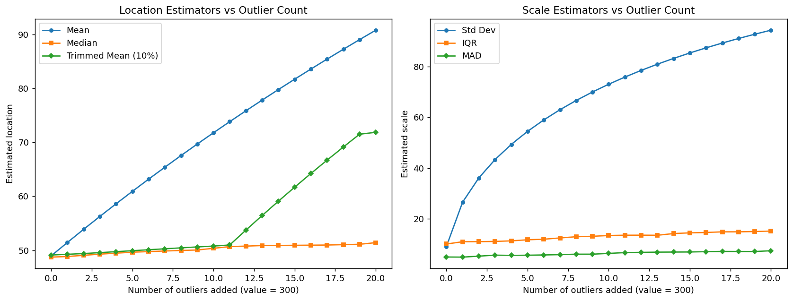

# 로버스트 추정량 비교

## 개요

로버스트 추정량은 이상점과 분포 가정으로부터의 이탈에 저항한다. 표본평균과 표준편차는 정규 자료에서 최적이지만 극단 관측값 몇 개만으로도 심하게 왜곡될 수 있다. 이 페이지에서는 위치(절사평균, 가중평균, 중앙값)와 척도(MAD, IQR) 추정에 대한 로버스트한 대안들을 비교하고, 깨끗한 자료와 오염된 자료에서의 거동을 보인다.

## 위치추정량

### 절사평균

**$\alpha$-절사평균**은 정렬한 자료에서 아래위로 $\alpha$ 비율만큼 제거하고 나머지를 평균한다:

$$\bar{X}_\alpha = \frac{1}{n - 2k}\sum_{i=k+1}^{n-k} X_{(i)}$$

여기서 $k = \lfloor n\alpha \rfloor$이고 $X_{(i)}$는 $i$번째 순서통계량이다.

<div class="exbox" markdown>

**보기 1.** <span class="diff easy" title="쉬움"></span> 절사평균 구현하기. 자료는 $\{1, 2, \dots, 9, 1000\}$으로 $n = 10$이다.

**(1)** 평균, $10\%$ 절사평균, $20\%$ 절사평균, 중앙값을 손으로 구하시오. 뒤의 셋이 **모두 같은 값**이 나오는데, 우연인가.

**(2)** 코드로 확인하고, 이상치를 하나 더 넣어 $10\%$ 절사평균이 실제로 무너지는지 보시오. 중앙값은 "$100\%$ 절사평균"인가.

</div>

??? success "풀이"

    **(1) 해석적으로.** 평균부터. $1 + 2 + \cdots + 9 = 45$이므로

    $$
    \bar x = \frac{45 + 1000}{10} = 104.5
    $$

    이고, 이는 자료의 아홉 값 전부보다 크다. **관측값 하나가 중심을 자료 바깥으로 밀어냈다.**

    절사평균은 $k = \lfloor n\alpha \rfloor$개씩 양 끝을 버리고 순서통계량 $x_{(k+1)}, \dots, x_{(n-k)}$를 평균한다. 여기서 정렬된 자료는 $x_{(i)} = i$ $(i \le 9)$, $x_{(10)} = 1000$이다. $k \ge 1$이면 $1000$이 창 밖으로 나가므로 창 안에는 **등차수열만** 남고, 등차수열의 평균은 양 끝의 평균이다.

    $$
    \bar x_\alpha = \frac{x_{(k+1)} + x_{(n-k)}}{2} = \frac{(k+1) + (10-k)}{2} = \frac{11}{2} = 5.5
    $$

    **$k$가 지워진다.** $\alpha = 0.1$이면 $k = 1$, $\alpha = 0.2$이면 $k = 2$이지만 창의 **한가운데 자리**는 언제나 $(10+1)/2 = 5.5$번째이므로 답이 바뀌지 않는다. 중앙값도 $k = 4$에 해당하는 창 $\{5, 6\}$의 평균이라 같은 $5.5$다. **우연이 아니라 아래쪽 아홉 값이 등차수열이기 때문이고, $1 \le k \le 4$인 모든 절사가 똑같이 $5.5$를 준다.**

    **(2) 수치적으로.**

    ```python
    import numpy as np

    def trimmed_mean(data, proportion=0.1):
        """양쪽 꼬리에서 proportion 비율씩 잘라 내고 평균을 낸다."""
        x = np.sort(data)              # 잘라 내려면 먼저 정렬해야 한다
        n = len(x)
        k = int(np.floor(n * proportion))   # 각 꼬리에서 버릴 개수
        if k == 0:
            return x.mean()            # 표본이 작아 버릴 것이 없으면 그냥 평균
        return x[k:-k].mean()          # 앞뒤 k개를 빼고 평균


    # 이상치 하나가 들어 있는 자료로 확인한다.
    data = np.array([1, 2, 3, 4, 5, 6, 7, 8, 9, 1000.0])
    print(f"평균         {data.mean():9.2f}   <- 이상치 하나에 끌려간다")
    print(f"10% 절단평균 {trimmed_mean(data, 0.1):9.2f}")
    print(f"20% 절단평균 {trimmed_mean(data, 0.2):9.2f}")
    print(f"중앙값       {np.median(data):9.2f}   <- 100% 절단평균인 셈")
    ```

    출력:

    ```
    평균            104.50   <- 이상치 하나에 끌려간다
    10% 절단평균      5.50
    20% 절단평균      5.50
    중앙값            5.50   <- 100% 절단평균인 셈
    ```

    네 수가 (1)과 정확히 맞는다. 이어서 이상치를 하나 더 넣어 본다.

    ```python
    # 이상치를 둘로 늘린다. 자료 크기는 10 그대로 두어야 비교가 된다.
    data2 = np.array([1, 2, 3, 4, 5, 6, 7, 8, 1000, 1000.0])
    print(f"평균         {data2.mean():9.3f}")
    print(f"10% 절단평균 {trimmed_mean(data2, 0.1):9.3f}   <- k=1 이라 1000 하나가 남는다")
    print(f"20% 절단평균 {trimmed_mean(data2, 0.2):9.3f}   <- k=2 라 둘 다 빠진다")
    print(f"중앙값       {np.median(data2):9.3f}")
    ```

    출력:

    ```
    평균           203.600
    10% 절단평균   129.375   <- k=1 이라 1000 하나가 남는다
    20% 절단평균     5.500   <- k=2 라 둘 다 빠진다
    중앙값           5.500
    ```

    **$10\%$ 절사평균이 무너졌다.** $k = \lfloor 10 \times 0.1 \rfloor = 1$이라 위쪽에서 하나만 버리는데 이상치가 둘이므로 하나가 창에 남고, 그 하나가 $\{2, \dots, 8, 1000\}$의 평균을 $1035/8 = 129.375$로 끌어올린다. $20\%$ 절사는 $k = 2$라 둘 다 버려 $5.5$를 지킨다. **표의 "붕괴점 $\alpha$"가 바로 이 뜻이다.** $\alpha$ 절사평균은 $\alpha$ 비율까지의 오염을 견디고 그 너머에서는 평균과 똑같이 얼마든지 끌려간다.

    **"$100\%$ 절사평균"은 말이 되지 않는다.** 코드 주석에 그렇게 적혀 있으나 $\alpha = 1$이면 자료가 통째로 없어진다. 중앙값은 $\alpha \to 1/2$의 **극한**이며, $n = 10$에서는 $k$를 가능한 가장 큰 값인 $4$($\alpha = 0.4$)로 둔 것과 같다. 붕괴점 표에서 중앙값이 $50\%$인 것과 $\alpha$ 절사평균이 $\alpha$인 것이 $\alpha \to 1/2$에서 이어지는 까닭이다.

### 가중평균과 가중중앙값

**가중평균**은 관측값마다 다른 중요도를 부여한다:

$$\bar{X}_w = \frac{\sum_{i=1}^n w_i X_i}{\sum_{i=1}^n w_i}$$

**가중중앙값**은 양쪽의 누적 가중치가 각각 50%를 넘지 않게 하는 값 $m$이다. 가중평균보다 로버스트하다.

<div class="exbox" markdown>

**보기 2.** <span class="diff easy" title="쉬움"></span> 가중평균과 가중중앙값. 자료 $(1, 2, 3, 4, 100)$에 가중치 $(1, 1, 1, 1, w)$를 준다. 이상치 $100$이 가중치까지 많이 가져간 상황이다.

**(1)** $w = 3$에서 가중평균과 가중중앙값을 손으로 구하시오.

**(2)** $w$를 키우면 가중중앙값은 **어느 값에서 정확히** $100$으로 넘어가는가. 그 문턱을 유도하고 코드로 확인하시오.

</div>

??? success "풀이"

    **(1) 해석적으로.** 가중평균은 정의대로다. 가중치 합이 $4 + w = 7$이므로

    $$
    \bar x_w = \frac{1 + 2 + 3 + 4 + 3(100)}{7} = \frac{310}{7} = 44.2857
    $$

    이고, 자료의 네 값이 $4$ 이하인데도 중심이 $44$를 넘었다. **가중평균은 가중치가 붙어도 여전히 평균이며 붕괴점이 $0$이다.**

    가중중앙값은 작은 값부터 가중치를 쌓아 **누적 비율이 처음 $1/2$에 이르는 값**이다. 누적 비율을 적으면

    $$
    \tfrac17,\ \tfrac27,\ \tfrac37,\ \tfrac47,\ 1
    = 0.143,\ 0.286,\ 0.429,\ 0.571,\ 1
    $$

    이고 $0.5$를 처음 넘는 것이 네 번째이므로 $\tilde x_w = 4$다. **이상치가 전체 가중치의 $3/7 = 43\%$를 쥐고 있는데도 버틴다.**

    **(2) 문턱.** 값 $100$ 하나가 가중중앙값이 되려면 그 앞에 쌓인 가중치가 절반에 못 미쳐야 한다. 앞의 네 점이 쥔 비율이 $4/(4+w)$이므로 조건은

    $$
    \frac{4}{4+w} < \frac12
    \quad\Longleftrightarrow\quad
    w > 4
    \quad\Longleftrightarrow\quad
    \frac{w}{4+w} > \frac12
    $$

    이다. **이상치의 가중치 몫이 $1/2$를 넘는 순간, 그리고 오직 그때에만 무너진다.** 이것이 가중중앙값의 붕괴점이 "질량의 절반"이라는 말의 정확한 뜻이고, 가중치가 모두 같은 보통의 중앙값에서 $50\%$가 되는 특수한 경우다.

    경계 $w = 4$ 자체는 동점이다. 누적 비율이 정확히 $4/8 = 0.5$이므로 "$1/2$ **이상**"으로 읽는 이 구현은 $4$를 돌려주고, "$1/2$ 초과"로 읽으면 $100$을 돌려준다. 동점을 어느 쪽으로 보낼지는 규약이며, 둘 사이 아무 값이나 골라도 가중중앙값의 정의를 만족한다.

    ```python
    def weighted_mean(data, weights):
        return np.sum(data * weights) / np.sum(weights)

    def weighted_median(data, weights):
        """누적 가중치가 절반에 도달하는 값을 찾는다."""
        order = np.argsort(data)            # 값의 크기 순으로 정렬한 순서
        sorted_data = data[order]
        sorted_w = weights[order]           # 가중치도 같은 순서로 따라간다
        cum_w = np.cumsum(sorted_w) / np.sum(sorted_w)   # 누적 가중치 비율
        idx = np.searchsorted(cum_w, 0.5)   # 0.5를 처음 넘는 위치
        return sorted_data[idx]


    # 마지막 관측값이 이상치이고 가중치도 큰 경우.
    data = np.array([1.0, 2.0, 3.0, 4.0, 100.0])
    weights = np.array([1.0, 1.0, 1.0, 1.0, 3.0])
    print(f"가중평균   {weighted_mean(data, weights):8.2f}   <- 이상치에 끌려간다")
    print(f"가중중앙값 {weighted_median(data, weights):8.2f}   <- 버틴다")
    ```

    출력:

    ```
    가중평균      44.29   <- 이상치에 끌려간다
    가중중앙값     4.00   <- 버틴다
    ```

    문턱 $w = 4$의 양옆을 훑어 본다.

    ```python
    # w 를 4 의 양옆으로 조금씩 옮기며 가중중앙값이 언제 넘어가는지 본다.
    for w in (3.0, 3.9, 4.0, 4.001, 5.0):
        ws = np.array([1.0, 1.0, 1.0, 1.0, w])
        print(f"w = {w:>5}  이상치 가중치 몫 {w / ws.sum():.4f}   "
              f"가중중앙값 {weighted_median(data, ws):6.1f}   "
              f"가중평균 {weighted_mean(data, ws):6.2f}")
    ```

    출력:

    ```
    w =   3.0  이상치 가중치 몫 0.4286   가중중앙값    4.0   가중평균  44.29
    w =   3.9  이상치 가중치 몫 0.4937   가중중앙값    4.0   가중평균  50.63
    w =   4.0  이상치 가중치 몫 0.5000   가중중앙값    4.0   가중평균  51.25
    w = 4.001  이상치 가중치 몫 0.5001   가중중앙값  100.0   가중평균  51.26
    w =   5.0  이상치 가중치 몫 0.5556   가중중앙값  100.0   가중평균  56.67
    ```

    **유도한 문턱이 정확히 맞는다.** 몫이 $0.4937$일 때까지 가중중앙값은 $4$에 붙어 있고, $0.5001$이 되는 순간 $100$으로 건너뛴다. 동점인 $0.5000$에서는 위에서 말한 대로 $4$가 나왔다.

    **두 추정량이 무너지는 방식이 다르다는 점이 요점이다.** 가중평균은 $44.29 \to 50.63 \to 51.25 \to 56.67$로 **매끄럽게** 끌려가 어디서부터 못 믿을지 알 수 없다. 가중중앙값은 문턱까지 꿈쩍도 않다가 **한 번에** 건너뛴다. 전자는 언제나 조금씩 틀리고, 후자는 대개 맞다가 가끔 통째로 틀린다.

## 척도추정량

### 중앙값 절대편차

**MAD**(중앙값 절대편차)는 산포의 로버스트한 측도이다:

$$\text{MAD} = \text{median}(|X_i - \text{median}(X)|)$$

정규 자료에서 $\text{MAD} \approx 0.6745\sigma$이므로 $\hat{\sigma}_{\text{MAD}} = 1.4826 \times \text{MAD}$가 $\sigma$의 일치추정량이 된다.

<div class="exbox" markdown>

**보기 3.** <span class="diff easy" title="쉬움"></span> 중앙값 절대편차. $N(0,1)$에서 100개를 뽑고($\bar x = 0.0811$, $s = 0.9670$이 나왔다), 거기에 $50$ 하나를 덧붙인다.

**(1)** 이상치를 더한 뒤의 표본표준편차 $s'$를 **정확한 식으로** 예측하시오. 같은 일이 MAD 에는 왜 일어나지 않는가.

**(2)** 코드로 확인하시오. 깨끗한 자료에서 $s = 0.967$, $1.4826 \times \text{MAD} = 1.049$로 둘이 다른데, 어느 쪽이 더 미덥지 못한가.

</div>

??? success "풀이"

    **(1) 해석적으로.** 관측값 $n$개에 하나($y$)를 덧붙일 때 제곱합이 어떻게 변하는지는 [5.1절의 증명 상자](../../ch05/foundations/statistics_as_rv.md)에 있는 항등식을 두 덩어리에 적용하면 나온다. 크기 $n_A$·$n_B$의 두 묶음을 합칠 때

    $$
    \mathrm{SS}_{A\cup B} = \mathrm{SS}_A + \mathrm{SS}_B + \frac{n_A n_B}{n_A + n_B}\,(\bar x_A - \bar x_B)^2
    $$

    이고, 여기서는 $B$가 점 하나라 $\mathrm{SS}_B = 0$이다. 그러므로

    $$
    (n)\,s'^2 = (n-1)s^2 + \frac{n}{n+1}(y - \bar x)^2
    $$

    이다. $n = 100$, $s = 0.9670$, $\bar x = 0.0811$, $y = 50$을 넣으면

    $$
    s' = \sqrt{\frac{99(0.9670)^2 + \frac{100}{101}(50 - 0.0811)^2}{100}}
    = \sqrt{\frac{92.57 + 2467.2}{100}}
    = 5.0594
    $$

    **원래 제곱합 $92.6$에 견주어 새 점 하나가 $2467$을 보탰다.** $27$배다. $y$를 키우면 $s' \approx |y|/\sqrt{n+1}$로 **한없이 커지므로** 표준편차의 붕괴점은 $0$이다.

    MAD 에는 같은 일이 일어날 수 없다. MAD 는 편차의 **중앙값**이므로 그 값이 몇인지는 순위에만 달려 있고 크기에는 달려 있지 않다. $y$ 하나를 더하면 중앙값의 자리가 한 칸 옮겨 갈 뿐이고, $100$개의 중앙값(50·51번째의 평균)이 $101$개의 중앙값(51번째)으로 바뀌는 정도다. **$y$를 $50$이 아니라 $10^6$으로 해도 MAD 는 똑같이 나온다.**

    견줄 이론값도 적어 두자. $N(0,1)$에서 $\text{MAD} \to \Phi^{-1}(0.75) = 0.6745$이므로 $1.4826 \times \text{MAD} \to 1$이고 $s \to 1$이다. $n = 100$에서 두 추정량의 흩어짐은 다르다. $\operatorname{sd}(s) \approx 1/\sqrt{2(n-1)} = 0.0711$이고, MAD 쪽은 정규에서의 효율이 $37\%$뿐이라

    $$
    \operatorname{sd}(1.4826\,\text{MAD}) \approx \frac{0.0711}{\sqrt{0.37}} = 0.117
    $$

    로 $1.6$배 넓다.

    **(2) 수치적으로.**

    ```python
    def mad(data):
        """중앙값 절대편차. 편차를 제곱하지 않고 중앙값을 취한다."""
        med = np.median(data)
        return np.median(np.abs(data - med))


    # 정규자료와 그 자료에 이상치 하나를 더한 것을 비교한다.
    rng = np.random.default_rng(0)
    clean = rng.normal(0, 1, 100)
    dirty = np.append(clean, 50.0)     # 이상치 하나만 추가

    for name, d in [("깨끗한 자료", clean), ("이상치 1개 추가", dirty)]:
        # 1.4826을 곱하면 정규분포에서 sigma의 일치추정량이 된다
        print(f"{name:16} 표준편차 {d.std(ddof=1):6.3f}   "
              f"1.4826*MAD {1.4826 * mad(d):6.3f}")
    ```

    출력:

    ```
    깨끗한 자료           표준편차  0.967   1.4826*MAD  1.049
    이상치 1개 추가        표준편차  5.059   1.4826*MAD  1.063
    ```

    (1)의 예측을 숫자로 맞춰 본다.

    ```python
    # (1) 의 합치기 항등식이 정말 맞는지 확인한다.
    n = len(clean)
    xbar, s = clean.mean(), clean.std(ddof=1)
    pred = np.sqrt((( n - 1) * s**2 + n / (n + 1) * (50 - xbar)**2) / n)
    print(f"clean: xbar = {xbar:.4f},  s = {s:.4f}")
    print(f"예측 s' = {pred:.4f}   실제 s' = {dirty.std(ddof=1):.4f}")
    print(f"MAD: clean {mad(clean):.4f}  ->  dirty {mad(dirty):.4f}")
    # 이상치를 50 대신 100만으로 바꿔도 MAD 는 그대로다.
    wilder = np.append(clean, 1e6)
    print(f"이상치를 1e6 으로:  s' = {wilder.std(ddof=1):.1f},  MAD = {mad(wilder):.4f}")
    ```

    출력:

    ```
    clean: xbar = 0.0811,  s = 0.9670
    예측 s' = 5.0594   실제 s' = 5.0594
    MAD: clean 0.7073  ->  dirty 0.7173
    이상치를 1e6 으로:  s' = 99503.7,  MAD = 0.7173
    ```

    **예측이 소수 넷째 자리까지 맞는다.** 그리고 마지막 줄이 (1)의 두 번째 주장을 그대로 보여 준다. 이상치를 $50$에서 $10^6$으로, 곧 2만 배로 키우니 $s'$는 $5.06$에서 $99{,}503.7$로 함께 커졌지만 **MAD 는 $0.7173$에서 한 자리도 움직이지 않았다.** 어림식 $|y|/\sqrt{n+1} = 10^6/\sqrt{101} = 99{,}503.7$이 소수 첫째 자리까지 맞는 것도 볼 만하다. 이상치가 충분히 크면 $s$는 **다른 자료를 잊고 이상치만 잰다.**

    **(2)의 물음에는 "MAD 쪽이 더 미덥지 못하다"가 답이다.** 깨끗한 자료에서 참값은 $\sigma = 1$인데 $s = 0.967$은 $-0.46$ 표준오차, $1.4826\,\text{MAD} = 1.049$는 $+0.42$ 표준오차 떨어져 있다. 거리는 비슷해 보이지만 **자**가 다르다. $s$의 표준오차는 $0.071$이고 MAD 쪽은 $0.117$이다. **깨끗한 자료에서는 MAD 가 $s$보다 $1.6$배 넓게 흔들린다.** 이것이 로버스트성의 값이고, 이상치 하나가 들어오는 순간 그 값은 충분히 싸진다.

### 사분위수범위

**IQR**(사분위수범위)은 또 다른 로버스트 척도이다:

$$\text{IQR} = Q_3 - Q_1$$

정규 자료에서 $\text{IQR} \approx 1.349\sigma$이므로 $\hat{\sigma}_{\text{IQR}} = \text{IQR}/1.349$가 $\sigma$를 추정한다.

## 오염 아래에서의 비교

다음 코드는 깨끗한 정규 자료와 극단 이상점으로 오염된 자료에서 위치·척도 추정량을 비교한다.

<div class="exbox" markdown>

**보기 4.** <span class="diff easy" title="쉬움"></span> 오염 아래에서 측도 견주기. $N(50, 10^2)$에서 100개를 뽑고, 거기에 $(200, 250, 300, -100, -150)$ 다섯 개를 섞어 $n = 105$로 만든다. 오염 비율이 $4.8\%$다.

**(1)** 깨끗한 자료에서 일곱 측도가 각각 **얼마쯤 나와야 하는지**와 그 표준오차를 적으시오.

**(2)** 오염된 자료의 평균과 표준편차는 모의실험 없이 **정확히 예측할 수 있다.** 다섯 이상치가 아는 수이기 때문이다. 예측하고 확인하시오.

</div>

??? success "풀이"

    **(1) 이론값.** $\mu = 50$, $\sigma = 10$, $n = 100$이다. 위치 쪽 셋은 모두 $50$ 둘레에, 척도 쪽 셋은 각자의 보정상수만큼 떨어진 자리에 있어야 한다.

    | 측도 | 기댓값 | 표준오차 | 근거 |
    |:---|---:|---:|:---|
    | 평균 | $50$ | $1.000$ | $\sigma/\sqrt n$ |
    | 중앙값 | $50$ | $1.253$ | $\sqrt{\pi/2}\,\sigma/\sqrt n$ |
    | $10\%$ 절사평균 | $50$ | $1.028$ | 모의 ($\mathrm{ARE} = 0.95$) |
    | $20\%$ 절사평균 | $50$ | $1.067$ | 모의 ($\mathrm{ARE} = 0.88$) |
    | 표준편차 | $9.975$ | $0.710$ | $c_4\sigma$ ($c_4 = 0.99748$), $\sigma\sqrt{1-c_4^2}$ |
    | IQR | $13.303$ | $1.545$ | $1.349\sigma$ |
    | MAD | $6.692$ | $0.780$ | $0.6745\sigma$ |

    중앙값의 표준오차가 평균의 $\sqrt{\pi/2} = 1.2533$배라는 것이 [다음 쪽](./efficiency.md)에서 유도할 식이고, 그 역제곱 $2/\pi = 0.637$이 중앙값의 효율이다. 척도 쪽 세 줄의 기댓값은 $n = 100$에서 모의로 재어 적은 것이며, 셋 다 $\sigma = 10$보다 조금 작다. $s$는 $c_4$만큼, MAD 와 IQR 은 유한표본 치우침 때문이다.

    **(2) 오염 자료의 정확한 예측.** 두 묶음을 합칠 때 평균은 가중평균이고, 제곱합은 보기 3에서 쓴 항등식을 그대로 쓴다. 깨끗한 쪽을 $A$($n_A = 100$, 평균 $a$, 제곱합 $\mathrm{SS}_A = 99 s_A^2$), 이상치 쪽을 $B$($n_B = 5$)라 하면

    $$
    \bar x_{A\cup B} = \frac{n_A a + n_B b}{n_A + n_B},
    \qquad
    \mathrm{SS}_{A\cup B} = \mathrm{SS}_A + \mathrm{SS}_B + \frac{n_A n_B}{n_A+n_B}(a-b)^2
    $$

    이다. 이상치 다섯 개의 평균은 $b = (200+250+300-100-150)/5 = 100$이고 그 제곱합은

    $$
    \mathrm{SS}_B = 100^2 + 150^2 + 200^2 + 200^2 + 250^2 = 175{,}000
    $$

    이다. 깨끗한 쪽은 아래 출력이 주는 $a = 48.9615$, $s_A = 9.0817$, 곧 $\mathrm{SS}_A = 8{,}165.2$를 쓴다.

    $$
    \bar x = \frac{100(48.9615) + 5(100)}{105} = 51.3919
    $$

    $$
    s = \sqrt{\frac{8{,}165.2 + 175{,}000 + \frac{500}{105}(48.9615-100)^2}{104}} = 43.3645
    $$

    **$\mathrm{SS}$ 의 세 조각 크기를 보라.** 깨끗한 100개가 보탠 것이 $8{,}165$인데 이상치 다섯 개가 $175{,}000$에 더해 중심 차이에서 $12{,}400$을 더 보탰다. 전체의 $96\%$가 **관측값의 $4.8\%$에서 온다.**

    모의실험으로 둘을 다 확인한다.

    ```python
    np.random.seed(42)

    # 평균 50, 표준편차 10 인 깨끗한 자료 100개.
    clean = np.random.normal(loc=50, scale=10, size=100)

    # 여기에 멀리 떨어진 값 다섯 개를 섞는다. 전체의 5%가 안 되는 양이다.
    outliers = np.array([200, 250, 300, -100, -150])
    contaminated = np.concatenate([clean, outliers])

    # 같은 표를 두 자료에 대해 뽑아 어느 측도가 얼마나 흔들리는지 나란히 본다.
    for label, data in [("Clean", clean), ("Contaminated", contaminated)]:
        print(f"\n{label} data (n = {len(data)}):")
        print(f"  Mean             = {data.mean():.2f}")
        print(f"  Median           = {np.median(data):.2f}")
        print(f"  Trimmed mean 10% = {trimmed_mean(data, 0.10):.2f}")
        print(f"  Trimmed mean 20% = {trimmed_mean(data, 0.20):.2f}")
        print(f"  Std dev          = {data.std(ddof=1):.2f}")
        print(f"  IQR              = {np.percentile(data, 75) - np.percentile(data, 25):.2f}")
        print(f"  MAD              = {mad(data):.2f}")
    ```

    출력:

    ```

    Clean data (n = 100):
      Mean             = 48.96
      Median           = 48.73
      Trimmed mean 10% = 49.11
      Trimmed mean 20% = 49.13
      Std dev          = 9.08
      IQR              = 10.07
      MAD              = 4.96

    Contaminated data (n = 105):
      Mean             = 51.39
      Median           = 48.84
      Trimmed mean 10% = 49.24
      Trimmed mean 20% = 49.28
      Std dev          = 43.36
      IQR              = 11.15
      MAD              = 5.61
    ```

    (2)의 예측을 네 자리까지 맞춰 본다.

    ```python
    # (2) 에서 손으로 계산한 두 값을 합치기 항등식으로 그대로 재현한다.
    a, sA = clean.mean(), clean.std(ddof=1)
    SS_A = 99 * sA**2
    b = outliers.mean()
    SS_B = ((outliers - b) ** 2).sum()
    SS = SS_A + SS_B + (100 * 5 / 105) * (a - b) ** 2
    print(f"clean: 평균 {a:.4f}  s {sA:.4f}  SS_A {SS_A:.1f}")
    print(f"이상치: 평균 {b:.1f}  SS_B {SS_B:.1f}  중심차 항 {(100*5/105)*(a-b)**2:.1f}")
    print(f"예측 오염평균 {(100 * a + 5 * b) / 105:.4f}   실제 {contaminated.mean():.4f}")
    print(f"예측 오염 s   {np.sqrt(SS / 104):.4f}   실제 {contaminated.std(ddof=1):.4f}")
    ```

    출력:

    ```
    clean: 평균 48.9615  s 9.0817  SS_A 8165.2
    이상치: 평균 100.0  SS_B 175000.0  중심차 항 12404.4
    예측 오염평균 51.3919   실제 51.3919
    예측 오염 s   43.3645   실제 43.3645
    ```

    **평균과 표준편차 둘 다 넷째 자리까지 맞는다.** 모의실험이 아니라 산술이다. 이상치가 무엇인지 알면 평균과 표준편차가 어디로 갈지 **정확히** 계산되며, 그만큼 이 두 측도는 오염에 투명하게 끌려간다.

    (1)의 표와 깨끗한 자료의 출력을 견주면 흥미로운 것이 하나 나온다.

    | 측도 | 기댓값 | 표준오차 | 관측 | $z$ |
    |:---|---:|---:|---:|---:|
    | 평균 | $50$ | $1.000$ | $48.96$ | $-1.04$ |
    | 중앙값 | $50$ | $1.253$ | $48.73$ | $-1.01$ |
    | 표준편차 | $9.975$ | $0.710$ | $9.08$ | $-1.26$ |
    | IQR | $13.303$ | $1.545$ | $10.07$ | $-2.09$ |
    | MAD | $6.692$ | $0.780$ | $4.96$ | $-2.22$ |

    **이 표본은 IQR 과 MAD 가 유난히 작게 나온 표본이다.** 각각 아래쪽 $1.4\%$, $1.0\%$ 자리에 있다. 둘이 나란히 낮은 것은 우연이 두 번 겹친 것이 아니라 $\operatorname{corr}(\text{MAD}, \text{IQR}) = 0.93$으로 **거의 같은 것을 재기 때문**이다. 둘 다 가운데 절반의 폭을 보는 통계량이라 자료의 중앙부가 유난히 촘촘하면 함께 작아진다. 같은 자료에서 $s$가 $-1.27$에 그친 것은 $s$가 꼬리까지 보기 때문이다.

    **그러니 이 쪽의 결론을 "로버스트 측도가 언제나 낫다"로 읽으면 안 된다.** 깨끗한 자료만 놓고 보면 $\hat\sigma_{\text{MAD}} = 1.4826 \times 4.96 = 7.35$가 참값 $10$에서 $26\%$ 빗나갔고 $s = 9.08$은 $9\%$ 빗나갔다. 이상치가 없는 자료에서는 고전적 측도가 이긴다. 오염이 들어오는 순간 $s$가 $43.36$으로 날아가고 MAD 는 $4.96 \to 5.61$에 머무는 것이 뒤집히는 지점이다.

!!! note "이상점의 영향"
    관측값 105개 중 이상점 5개가 평균을 2 남짓 옮기고(약 50에서 약 52로) 표준편차는 네 배 넘게 키운다. 반면 중앙값, 절사평균, IQR, MAD는 거의 영향을 받지 않는다.

## 점진적 오염 아래에서의 로버스트성

붕괴 과정을 시각화하기 위해, 깨끗한 관측값 100개에 이상점(값 = 300)을 하나씩 늘려 가며 각 추정량을 추적한다.

<div class="exbox" markdown>

**보기 5.** <span class="diff easy" title="쉬움"></span> 오염을 늘려 가며 보는 붕괴점. 보기 4의 깨끗한 자료 100개에 값이 $300$인 이상치를 $m = 0, 1, \dots, 20$개 덧붙이며 여섯 측도를 따라간다.

**(1)** 표본평균과 표본중앙값이 $m$에 따라 어떻게 움직이는지 **식으로** 적으시오.

**(2)** $10\%$ 절사평균은 **정확히 어느 $m$에서** 무너지는가. $m$을 하나 더 넣기 전까지는 멀쩡하다가 그 다음부터 꺾이는 자리를 유도하고 그림에서 확인하시오.

</div>

??? success "풀이"

    **(1) 해석적으로.** 평균은 그냥 가중평균이다. 깨끗한 100개의 평균을 $a = 48.9615$라 두면

    $$
    \bar x(m) = \frac{100\,a + 300\,m}{100 + m}
    $$

    이고, $m \to \infty$에서 $300$으로 간다. $m = 1$만 넣어도 $51.447$로 $2.5$나 올라간다. **붕괴점 $0$이란 이런 뜻이다.**

    중앙값은 전혀 다르게 움직인다. 덧붙인 $m$개가 **모두 위쪽**이므로 이들은 정렬된 자료의 맨 뒤 $m$칸을 차지할 뿐이고, 중앙값의 자리는 여전히 깨끗한 자료 안에 있다. 전체 크기가 $n' = 100+m$이므로

    $$
    \operatorname{med}(m) =
    \begin{cases}
    x_{((n'+1)/2)} & n' \text{ 홀수}\\[2pt]
    \dfrac{x_{(n'/2)} + x_{(n'/2+1)}}{2} & n' \text{ 짝수}
    \end{cases}
    $$

    이다. 여기서 $x_{(\cdot)}$은 **깨끗한 자료** 100개의 순서통계량이다. **이상치의 값 $300$이 식에 들어오지 않는다.** $300$을 $3 \times 10^9$으로 바꿔도 같은 값이 나온다. 중앙값이 올라가는 것은 이상치에 끌려서가 아니라 **중앙값을 읽는 자리가 위로 밀려서**이며, $m \le 20$에서 자리가 $50.5$번째에서 $60.5$번째로 열 칸 옮겨 간다. 깨끗한 자료의 그 구간이 촘촘하므로 이동 폭이 작다.

    **(2) 절사평균이 꺾이는 자리.** $n' = 100+m$개에서 $10\%$ 절사는 양 끝에서 $k = \lfloor 0.1 n' \rfloor$개씩 버린다. 이상치는 맨 위 $m$칸에 있으므로 **$m \le k$이면 전부 버려지고 $m > k$이면 남는다.** 조건을 풀면

    $$
    m \le \left\lfloor \frac{100+m}{10} \right\rfloor
    $$

    이다. $m = 11$이면 $\lfloor 111/10 \rfloor = 11 \ge 11$이라 아직 안전하고, $m = 12$이면 $\lfloor 112/10 \rfloor = 11 < 12$라 **이상치 하나가 창에 남는다.** 따라서 꺾이는 자리는

    $$
    m^\star = 12
    $$

    다. 자료의 $12/112 = 10.7\%$가 오염된 지점이며, 이름값대로 $10\%$ 언저리다. 참고로 창에 남는 이상치 수는 $m - k$이므로 $m = 20$에서는 $20 - 12 = 8$개가 평균에 섞인다.

    그림으로 확인한다.

    ```python
    import matplotlib.pyplot as plt

    # 앞에서는 오염 여부를 두 점(있다/없다)으로만 보았다. 여기서는 오염을
    # 0개부터 20개까지 조금씩 늘려 가며 각 측도가 무너지는 지점을 찾는다.
    n_out_range = range(0, 21)
    means, medians, trims = [], [], []
    stds, iqrs, mads_list = [], [], []

    for n_out in n_out_range:
        # 300 짜리 이상치를 n_out 개 덧붙인다. 나머지 100개는 그대로다.
        extra = np.full(n_out, 300.0)
        data = np.concatenate([clean, extra])
        means.append(data.mean())
        medians.append(np.median(data))
        trims.append(trimmed_mean(data, 0.10))
        stds.append(data.std(ddof=1))
        iqrs.append(np.percentile(data, 75) - np.percentile(data, 25))
        mads_list.append(mad(data))

    # 왼쪽은 중심의 측도, 오른쪽은 퍼짐의 측도다. 평균과 표준편차는 처음부터
    # 곧장 올라가고, 중앙값과 MAD 는 오염이 절반에 이를 때까지 버틴다.
    fig, (ax1, ax2) = plt.subplots(1, 2, figsize=(13, 5))

    ax1.plot(list(n_out_range), means, 'o-', label='Mean', markersize=4)
    ax1.plot(list(n_out_range), medians, 's-', label='Median', markersize=4)
    ax1.plot(list(n_out_range), trims, 'D-', label='Trimmed Mean (10%)', markersize=4)
    ax1.set_xlabel('Number of outliers added (value = 300)')
    ax1.set_ylabel('Estimated location')
    ax1.set_title('Location Estimators vs Outlier Count')
    ax1.legend()

    ax2.plot(list(n_out_range), stds, 'o-', label='Std Dev', markersize=4)
    ax2.plot(list(n_out_range), iqrs, 's-', label='IQR', markersize=4)
    ax2.plot(list(n_out_range), mads_list, 'D-', label='MAD', markersize=4)
    ax2.set_xlabel('Number of outliers added (value = 300)')
    ax2.set_ylabel('Estimated scale')
    ax2.set_title('Scale Estimators vs Outlier Count')
    ax2.legend()

    plt.tight_layout()
    plt.show()
    ```

    

    그림의 세 곡선을 수로 꺼내 (1)·(2)와 맞춰 본다.

    ```python
    # (1) 과 (2) 의 예측을 한 표에 모아 확인한다.
    cs = np.sort(clean)              # 깨끗한 자료의 순서통계량
    a = clean.mean()
    print(f"{'m':>3} {'평균':>8} {'예측':>8} | {'중앙값':>8} {'예측':>8} | {'10%절사':>9} {'k':>3}")
    for m in (0, 1, 5, 10, 11, 12, 13, 20):
        data = np.concatenate([clean, np.full(m, 300.0)])
        n2 = 100 + m
        k = int(np.floor(0.1 * n2))
        # 이상치가 모두 위쪽이므로 중앙값은 깨끗한 자료의 순서통계량에서 읽힌다
        pred_med = (cs[(n2 - 1) // 2] if n2 % 2 else
                    0.5 * (cs[n2 // 2 - 1] + cs[n2 // 2]))
        print(f"{m:>3} {data.mean():>8.3f} {(100 * a + 300 * m) / n2:>8.3f} | "
              f"{np.median(data):>8.3f} {pred_med:>8.3f} | "
              f"{trimmed_mean(data, 0.1):>9.3f} {k:>3}")
    ```

    출력:

    ```
      m       평균       예측 |      중앙값       예측 |     10%절사   k
      0   48.962   48.962 |   48.730   48.730 |    49.115  10
      1   51.447   51.447 |   48.844   48.844 |    49.253  10
      5   60.916   60.916 |   49.642   49.642 |    49.918  10
     10   71.783   71.783 |   50.363   50.363 |    50.777  11
     11   73.839   73.839 |   50.675   50.675 |    50.976  11
     12   75.859   75.859 |   50.773   50.773 |    53.743  11
     13   77.842   77.842 |   50.870   50.870 |    56.450  11
     20   90.801   90.801 |   51.411   51.411 |    71.866  12
    ```

    **평균과 중앙값의 예측이 셋째 자리까지 모두 맞는다.** 그리고 (2)가 꼭 집어 말한 자리가 그대로 드러난다. $10\%$ 절사평균은 $m = 11$까지 $50.976$으로 중앙값과 나란히 가다가 $m = 12$에서 $53.743$으로 **$2.8$이나 뛴다.** 그 뒤로는 한 걸음에 $2.6$ 남짓씩 꾸준히 올라가 $m = 20$에서 $71.866$이 된다. 그림 왼쪽 판에서 초록 마름모가 $x = 11$과 $12$ 사이에서 꺾이는 것이 이 자리다.

    자세히 보면 마지막 걸음만 유독 짧다. $m = 19$에서 $71.515$이고 $m = 20$에서 $71.866$이라 $0.35$밖에 오르지 않았다. $k = \lfloor 0.1 n' \rfloor$이 $m = 20$에서 $11$에서 $12$로 한 칸 커져 **창에 남는 이상치 수 $m - k$가 $8$에 그대로 머물렀기 때문**이다. $\lfloor \cdot \rfloor$이 만드는 계단이고, 그림에서도 그 자리만 평평하다.

    **세 곡선의 모양이 서로 다른 것이 이 그림의 전부다.**

    - **평균(파랑)**: 처음부터 직선으로 올라간다. 안전한 구간이 아예 없다.
    - **$10\%$ 절사평균(초록)**: $m \le 11$에서는 중앙값과 거의 겹쳐 있다가 문턱을 넘는 순간 평균과 같은 기울기로 꺾인다. **보호가 켜져 있다 꺼지는 스위치**이지 서서히 약해지는 것이 아니다.
    - **중앙값(주황)**: $m = 20$까지 $48.73 \to 51.41$로 $2.7$만 올라간다. 그나마도 이상치에 끌린 것이 아니라 읽는 자리가 밀린 것이다. 붕괴점이 $50\%$이므로 $m = 100$이 되어야 무너진다.

    오른쪽 판도 같은 이야기다. 표준편차는 $m = 1$에서 벌써 $9.08 \to 26.56$으로 세 배가 되고, MAD 는 $4.96 \to 7.42$($m = 20$)로, IQR 은 $10.07 \to 15.16$으로 완만히 오른다. 두 로버스트 척도가 오르는 것도 이상치 값에 끌려서가 아니라 **가운데 절반의 자리가 밀렸기 때문**이다.

## 붕괴점

추정량의 **붕괴점**은 결과가 얼마든지 나빠지기 전까지 견딜 수 있는 임의 오염의 최대 비율이다.

| 추정량 | 붕괴점 |
|-----------|----------------|
| 평균 | $0\%$ (극단값 하나로 값이 얼마든지 바뀐다) |
| 중앙값 | $50\%$ |
| $\alpha$-절사평균 | $\alpha$ (예: 10% 절사이면 10%) |
| 표준편차 | $0\%$ |
| MAD | $50\%$ |
| IQR | $25\%$ |

!!! info "로버스트성 대 효율성"
    로버스트 추정량은 가정한 모형 아래에서 어느 정도 효율을 희생하는 대신(예: 정규 자료에서 중앙값의 효율은 평균의 63.7%에 불과하다) 모형 위반에 대한 보호를 얻는다. 절사평균은 유용한 중간 지점을 준다: 정규성 아래에서 평균에 거의 맞먹는 효율을 유지하면서 의미 있는 로버스트성을 제공한다.

## 해석

- **평균과 표준편차**는 깨끗한 정규 자료에서 최적이지만 이상점에 얼마든지 민감하다(붕괴점 0).
- **중앙값과 MAD**는 붕괴점이 50%이다 — 자료의 절반 가까이가 오염되어도 여전히 유의미하다.
- **절사평균**은 조절 가능한 절충안을 준다: 절사비율이 작으면 효율을 유지하면서 적당한 로버스트성을 얻는다.
- **가중추정량**은 관측값의 품질이 다를 때 유용하지만, 가중치 자체가 로버스트하게 정해지지 않으면 가중평균은 여전히 이상점에 민감하다.
- 실무에서는 고전적 추정량과 로버스트 추정량을 함께 계산하는 것이 좋다. 둘이 크게 다르면 자료를 더 들여다볼 이유가 된다.

## 연습문제

<div class="drillbox" markdown>

**연습문제 1.** <span class="diff easy" title="쉬움"></span>
자료 $\{1, 2, 3, 4, 5, 6, 7, 8, 9, 100\}$에 대해 평균, 중앙값, 10% 절사평균을 계산하라. 어느 추정량이 "전형적인" 값을 가장 잘 나타내는가?

</div>

??? success "풀이"
    **평균:** $\frac{1+2+3+4+5+6+7+8+9+100}{10} = \frac{145}{10} = 14.5$

    **중앙값:** 정렬한 자료가 10개이므로 중앙값은 5번째와 6번째의 평균이다: $(5+6)/2 = 5.5$.

    **10% 절사평균:** $n = 10$, $\alpha = 0.10$이므로 양 끝에서 $k = \lfloor 10 \times 0.10 \rfloor = 1$개씩 절사한다. 남는 것: $\{2, 3, 4, 5, 6, 7, 8, 9\}$. 평균: $44/8 = 5.5$.

    평균(14.5)은 100이라는 이상점 하나 때문에 자료 대부분보다 훨씬 위로 끌려간다. 중앙값(5.5)과 절사평균(5.5)은 이 이상점을 무시하고 전형적인 값을 더 잘 나타낸다. $\square$

<div class="drillbox" markdown>

**연습문제 2.** <span class="diff med" title="중간"></span>
표본중앙값의 붕괴점이 $\lfloor(n-1)/2\rfloor / n$이며 큰 $n$에서 50%에 가까워짐을 증명하라.

</div>

??? success "풀이"
    관측값 $x_1 \leq x_2 \leq \cdots \leq x_n$을 생각하자. 중앙값은 대략 $x_{(\lceil n/2 \rceil)}$이다.

    중앙값을 얼마든지 크게 만들려면 자료의 절반 이상이 극단이 되도록 충분히 많은 관측값을 바꿔야 한다. 구체적으로 $\lceil n/2 \rceil$개를 $+\infty$로 가는 값으로 바꾸어야 하며, 그러면 새 중앙값이 그 극단값 중 하나가 된다.

    $\lfloor (n-1)/2 \rfloor$개만 바꾸면 원래 관측값이 적어도 $\lceil (n+1)/2 \rceil$개 남는다. 중앙값은 이 원래 값들 사이에 놓이므로 유계로 남는다.

    따라서 붕괴점은 $\lfloor (n-1)/2 \rfloor / n$이다. $n$이 홀수이면 $(n-1)/(2n)$, 짝수이면 $(n-2)/(2n)$이다. 두 경우 모두 $n \to \infty$일 때 붕괴점이 $1/2 = 50\%$에 가까워진다. $\square$

<div class="drillbox" markdown>

**연습문제 3.** <span class="diff med" title="중간"></span>
$X \sim N(\mu, \sigma^2)$에서 $\text{MAD} = \mathcal{N}^{-1}(3/4) \cdot \sigma \approx 0.6745\sigma$임을 보이고, 따라서 $1.4826 \times \text{MAD}$가 $\sigma$의 일치추정량임을 보여라.

</div>

??? success "풀이"
    $X \sim N(\mu, \sigma^2)$에서 편차 $|X - \mu|$는 반정규분포를 따른다. $|X - \mu|$의 중앙값은 다음을 만족하는 값 $m$이다:

    $$P(|X - \mu| \leq m) = \frac{1}{2}$$

    즉 $P(-m \leq X - \mu \leq m) = 1/2$이므로 $\mathcal{N}(m/\sigma) - \mathcal{N}(-m/\sigma) = 1/2$, 따라서 $2\mathcal{N}(m/\sigma) - 1 = 1/2$이고 $\mathcal{N}(m/\sigma) = 3/4$이다.

    그러므로 $m = \sigma \mathcal{N}^{-1}(3/4) \approx 0.6745\sigma$이다.

    (참 중앙값 $\mu$를 쓴) 모집단 MAD는 $0.6745\sigma$와 같다. 표본중앙값의 일치성과 연속사상정리에 의해 표본 MAD는 모집단 MAD로 수렴한다.

    따라서 $\hat{\sigma} = \text{MAD}/0.6745 = 1.4826 \times \text{MAD}$는 $\sigma$의 일치추정량이다. $\square$

<div class="drillbox" markdown>

**연습문제 4.** <span class="diff med" title="중간"></span>
관측값 200개의 자료에서 평균 50, 표준편차 10, 중앙값 49, MAD 6.5를 얻었다. 이상점이나 비정규성의 증거가 있는가? 고전적 추정량과 로버스트 추정량의 비를 써서 답을 정당화하라.

</div>

??? success "풀이"
    정규성 아래에서 기대되는 바:

    - 평균 $\approx$ 중앙값: 여기서는 $50 \approx 49$로 잘 맞는다. 오른쪽으로 약간 치우쳤다.
    - $\text{MAD} \approx 0.6745\sigma$: 기대 MAD $= 0.6745 \times 10 = 6.745$. 관측된 MAD $= 6.5$. 비: $6.5/6.745 = 0.964$.
    - $\hat{\sigma}_{\text{MAD}} = 1.4826 \times 6.5 = 9.637$ 대 $s = 10$. 비: $s/\hat{\sigma}_{\text{MAD}} = 10/9.637 = 1.038$.

    고전적 표준편차가 로버스트 추정값보다 약 3.8% 클 뿐이다. 이상점이 상당했다면 $s$가 $\hat{\sigma}_{\text{MAD}}$보다 훨씬 컸을 것이다(비가 1.2 이상이면 우려할 만하다).

    모든 짝(평균/중앙값, $s$/MAD 기반 $\hat{\sigma}$)의 추정값이 거의 일치하므로 자료는 큰 이상점 오염 없이 근사적으로 정규라고 볼 수 있다. 약간의 불일치는 $n = 200$에서의 정상적인 표본변동 범위 안이다. $\square$

<div class="drillbox" markdown>

**연습문제 5.** <span class="diff med" title="중간"></span>
$\alpha$-절사평균의 로버스트성–효율성 맞바꿈을 설명하라. $n = 100$인 정규 자료에서 표본평균 대비 10% 절사평균의 점근 상대효율은 얼마인가?

</div>

??? success "풀이"
    **맞바꿈:** $\alpha$를 키우면 로버스트성이 좋아지지만(붕괴점이 높아지지만) 정규 모형 아래에서 효율이 떨어진다(좋은 자료를 버리기 때문이다). $\alpha = 0$이면 평균(완전한 효율, 로버스트성 0)이고, $\alpha \to 0.5$이면 중앙값(최대 로버스트성, 정규 자료에서 효율 63.7%)에 가까워진다.

    정규 자료에서 $\alpha$-절사평균의 점근분산은

    $$\text{Var}(\bar{X}_\alpha) \approx \frac{\sigma^2 c(\alpha)}{n}$$

    꼴로 쓸 수 있으며, $\alpha > 0$이면 $c(\alpha) > 1$이다. 표본평균 대비 점근 상대효율(ARE)은

    $$\text{ARE} = \frac{\text{Var}(\bar{X})}{\text{Var}(\bar{X}_\alpha)} = \frac{1}{c(\alpha)}$$

    이다. $\alpha = 0.10$(10% 절사)이면 ARE가 대략 **0.95**이다(절사평균이 자료가 담은 정보의 약 95%를 쓴다).

    즉 정규성 아래에서 효율을 약 5%만 잃으면서 붕괴점 10%를 얻는다(오염을 10%까지 견딘다). 일반적으로 훌륭한 맞바꿈으로 여겨지며, 10% 절사평균이 많은 응용에서 인기 있는 기본값인 이유이다. $\square$

<div class="drillbox" markdown>

**연습문제 6.** <span class="diff med" title="중간"></span>
**하지스-레만 추정량** $\hat\mu_{\text{HL}} = \operatorname{median}_{i\le j}\dfrac{X_i+X_j}{2}$을 정의하고, 붕괴점과 정규분포에서의 효율을 적어라.

</div>

??? success "풀이"
    **정의.** 모든 쌍(자기 자신과의 쌍 포함)의 평균 $\binom{n+1}{2}$개를 만들어 그 중앙값을 취한다. 이 값들을 **월시 평균**이라 한다.

    **성질.**

    | 항목 | 값 |
    |---|---|
    | 붕괴점 | $1-1/\sqrt2 \approx 0.29$ |
    | 정규분포 효율 | $3/\pi \approx 0.955$ |
    | 라플라스 효율 | 1.5 |
    | $t_3$ 효율 | 1.6 |

    **놀라운 조합이다.** 정규분포에서 표본평균의 **95.5%** 효율을 내면서 붕괴점이 29%다. 중앙값(효율 64%, 붕괴점 50%)이나 표본평균(효율 100%, 붕괴점 0%)의 양극단 사이에서 대단히 유리한 지점이다.

    **왜 효율이 높은가.** 중앙값은 자료를 순위로만 요약해 크기 정보를 버리지만, 하지스-레만은 **쌍의 평균**을 쓰므로 크기 정보를 상당 부분 살린다. 그러면서 중앙값을 취해 극단값의 영향을 막는다.

    **윌콕슨 검정과의 관계.** 하지스-레만 추정량은 **윌콕슨 부호순위 검정을 뒤집어 얻는 추정량**이다. 즉 $\hat\mu_{\text{HL}}$을 귀무값으로 두면 윌콕슨 통계량이 정확히 중앙에 놓인다. 같은 방식으로 신뢰구간도 얻을 수 있어, 검정과 추정이 일관된다.

    **가정.** 분포가 **대칭**이어야 한다. 치우친 분포에서는 평균도 중앙값도 아닌 값을 추정한다.

    **계산.** 순진하게 하면 $O(n^2)$이지만 $O(n\log n)$ 알고리즘이 알려져 있다. $n$이 수만 이하면 문제가 없다.

    **실무 권고.** 대칭성을 믿을 수 있고 이상치가 걱정되면 **하지스-레만이 절사평균보다 나은 선택**인 경우가 많다. 조율상수를 정할 필요가 없다는 점도 장점이다.

<div class="drillbox" markdown>

**연습문제 7.** <span class="diff med" title="중간"></span>
로버스트 추정량의 **표준오차**를 어떻게 구하는지 세 가지 방법으로 설명하라. 표본평균의 $s/\sqrt n$에 해당하는 것이 무엇인가?

</div>

??? success "풀이"
    **(1) 영향함수 기반(해석적).** 점근분산이

    $$
    \operatorname{Var}(\hat\theta) \approx \frac{1}{n}E\left[\text{IF}(X)^2\right]
    $$

    이므로, $\text{IF}$의 공식이 있으면 그것을 표본에서 추정한다.

    - **중앙값**: $\operatorname{SE} \approx \dfrac{1}{2\hat f(\tilde x)\sqrt n}$. **밀도 추정이 필요**하다는 점이 걸림돌이다. 커널 밀도추정을 써야 하고 띠폭 선택에 민감하다.
    - **M-추정량**: $\operatorname{SE}^2 \approx \dfrac{E[\psi^2]}{n\{E[\psi']\}^2}$을 표본 평균으로 추정한다. 밀도 추정이 필요 없어 실용적이다.
    - **절사평균**: 윈저화 분산으로

      $$
      \operatorname{SE}(\bar X_\alpha) \approx \frac{s_w}{(1-2\alpha)\sqrt n}
      $$

      이며 $s_w$는 윈저화한 자료의 표준편차다. **계산이 간단해 가장 실용적**이다.

    **(2) 부트스트랩.** 재표집해 $\hat\theta^*$의 표준편차를 쓴다.

    - **장점**: 어떤 추정량에도 쓸 수 있고 밀도 추정이 필요 없다.
    - **단점**: 중앙값처럼 매끄럽지 않은 통계량에서는 수렴이 느리다($n^{-1/4}$). 그래도 $n$이 어지간하면 실용적으로 잘 작동한다.

    **(3) 잭나이프.** $\hat\theta_{(-i)}$들의 흩어짐을 쓴다.

    - **주의**: 중앙값에는 **쓰면 안 된다.** 관측값 하나를 빼면 중앙값이 이웃 순서통계량으로 점프하므로 잭나이프가 일치하지 않는다. 매끄러운 M-추정량에는 괜찮다.

    **권고.** M-추정량이나 절사평균이면 (1)의 공식이 빠르고 정확하다. 중앙값이나 복잡한 추정량이면 **부트스트랩**이 안전하다. 어느 경우든 $s/\sqrt n$을 그대로 쓰면 안 된다. 그것은 표본평균 전용 공식이다.

<div class="drillbox" markdown>

**연습문제 8.** <span class="diff med" title="중간"></span>
로버스트 추정량을 쓰기로 했을 때 **무엇을 추정하고 있는지**가 달라질 수 있다. 대칭분포와 치우친 분포로 나누어 설명하라.

</div>

??? success "풀이"
    **대칭분포.** 평균·중앙값·절사평균·하지스-레만·M-추정량이 **모두 같은 대칭 중심**을 추정한다. 따라서 어느 것을 쓸지는 순전히 **효율과 강건성의 문제**이며, 추정 대상이 달라지지 않는다.

    **치우친 분포.** 사정이 완전히 다르다. 로그정규 $\mu=0$, $\sigma=1$에서

    | 추정량 | 추정 대상 | 값 |
    |---|---|---|
    | 표본평균 | 평균 $e^{\sigma^2/2}$ | 1.649 |
    | 중앙값 | 중앙값 $e^{\mu}$ | 1.000 |
    | 20% 절사평균 | (그 둘도 아닌 제3의 양) | 약 1.21 |
    | 최빈값 | $e^{\mu-\sigma^2}$ | 0.368 |

    **네 값이 모두 다르다.** 그리고 절사평균이 추정하는 양은 **이름이 없다.** 절사 비율 $\alpha$에 따라 연속적으로 변하는 범함수일 뿐이다.

    **이것이 왜 문제인가.**

    - **결론이 방법에 의존한다.** "평균 소득"을 묻는데 절사평균을 보고하면 무엇을 답한 것인지 불명확하다.
    - **비교가 어긋난다.** 두 집단을 비교하는데 한쪽은 평균, 한쪽은 절사평균이면 비교 자체가 성립하지 않는다.
    - **이상치와 치우침을 혼동한다.** 로그정규의 큰 값들은 **이상치가 아니라 분포의 정상적인 일부**다. 잘라 내면 오염을 제거하는 것이 아니라 분포를 왜곡하는 것이다.

    **권고.**

    1. **먼저 치우침인지 오염인지 판단한다.** 히스토그램과 Q-Q 그림을 본다. 매끄럽게 이어지는 긴 꼬리는 치우침이고, 본체에서 뚝 떨어진 몇 점은 오염이다.
    2. **치우침이면** 목적에 맞는 양을 고른다. 총액이 관심이면 평균, 전형적인 값이 관심이면 중앙값. 로그 변환 후 분석하는 것도 방법이다.
    3. **오염이면** 로버스트 추정량이 옳다. 추정 대상은 여전히 오염되지 않은 분포의 중심이다.
    4. **어느 쪽이든 무엇을 추정했는지 명시**한다.

<div class="drillbox" markdown>

**연습문제 9.** <span class="diff med" title="중간"></span>
로버스트 추정과 **이상치 제거 후 표본평균**은 어떻게 다른가? 후자의 문제점을 지적하라.

</div>

??? success "풀이"
    **표면적으로는 비슷하다.** 둘 다 극단값의 영향을 줄인다. 실제로 $\alpha$ 절사평균은 "양끝 $\alpha$를 지우고 평균"이다.

    **결정적 차이 — 규칙이 사전에 정해졌는가.**

    | | 절사평균 | 이상치 제거 후 평균 |
    |---|---|---|
    | 기준 | $\alpha$를 미리 고정 | 자료를 보고 판단 |
    | 제거 개수 | 언제나 $2\lfloor\alpha n\rfloor$ | 자료마다 다름 |
    | 점근이론 | 확립되어 있음 | 없음 |
    | 표준오차 | 계산 가능 | **계산된 값이 틀림** |

    **이상치 제거의 문제점.**

    1. **표준오차가 틀린다.** 제거 후 남은 자료로 $s/\sqrt{n'}$을 계산하면, 제거 과정에서 자료가 인위적으로 좁아진 것을 반영하지 못한다. **분산을 체계적으로 과소평가**하고 신뢰구간이 부당하게 좁아진다.

    2. **규칙이 자료에 의존한다.** "$3\sigma$를 넘으면 제거"라는 규칙에서 $\sigma$ 자체가 이상치에 부풀려져 있다. 큰 이상치가 문턱을 높여 **자기 자신을 숨긴다**(가리기 효과).

    3. **반복하면 더 나빠진다.** 제거하고 다시 계산해 또 제거하는 절차는 언제 멈출지 기준이 없고, 정상 관측값까지 깎아 내려갈 수 있다.

    4. **선택적 제거의 유혹.** 결과가 마음에 들지 않을 때 이상치를 더 찾게 된다. 의도하지 않아도 일어나는 편향이다.

    5. **정보를 버린다.** 극단값이 오염이 아니라 실제 현상이면, 그것이야말로 가장 중요한 정보일 수 있다(금융 위기, 부작용, 장비 고장).

    **권고.**

    - **로버스트 추정량을 쓴다.** 규칙이 사전에 정해져 있고 이론이 갖춰져 있다.
    - **제거해야 한다면** 기록 오류가 확인된 경우로 한정하고, 제거 전후 결과를 모두 보고한다.
    - **진단은 하되 자동 삭제는 하지 않는다.** 이상치를 찾아내 **원인을 조사**하는 것이 옳은 순서다.

<div class="drillbox" markdown>

**연습문제 10.** <span class="diff med" title="중간"></span>
자료에 이상치가 있는지 판정하는 **로버스트 진단 규칙**을 설계하라. 왜 표본평균과 표본표준편차 기반 규칙($|x-\bar x|>3s$)을 쓰면 안 되는가?

</div>

??? success "풀이"
    **$3s$ 규칙의 문제.** $\bar x$와 $s$가 **이상치에 오염된다.**

    구체적인 예로 $\{1,2,3,4,5,6,7,8,9,1000\}$을 보자.

    - $\bar x = 104.5$, $s = 314.5$.
    - $|1000-104.5| = 895.5 < 3(314.5) = 943.5$이므로 **1000이 이상치로 판정되지 않는다.**

    이것이 **가리기 효과**다. 이상치가 $s$를 부풀려 자기 자신을 문턱 안에 숨긴다. 이상치가 여럿이면 서로를 가려 주어 더 심해진다.

    반대로 **늪 효과**도 있다. 이상치가 $\bar x$를 끌고 가서 정상 관측값이 문턱 밖으로 밀려난다. 위 예에서 $1$은 $\bar x$에서 103.5 떨어져 있다.

    **로버스트 규칙.** 중심과 척도를 모두 강건하게 잡는다.

    $$
    \left|\frac{x_i-\operatorname{median}(x)}{1.4826\times\text{MAD}}\right| > 3
    $$

    같은 자료에서 중앙값이 5.5, MAD가 2.5이므로 축척된 MAD가 3.71이고

    $$
    \frac{1000-5.5}{3.71} = 268
    $$

    로 **명확히 이상치로 잡힌다.** 정상값들은 모두 $|z|<1$이다.

    **1.4826의 유래.** 정규분포에서 $\text{MAD} = \Phi^{-1}(0.75)\sigma = 0.6745\sigma$이므로, 그 역수 $1/0.6745 = 1.4826$을 곱하면 $\sigma$의 일치추정량이 된다.

    **다른 로버스트 규칙.**

    - **상자그림 규칙**: $Q_1-1.5\,\text{IQR}$ 아래 또는 $Q_3+1.5\,\text{IQR}$ 위. 정규분포에서 0.7%가 걸리도록 맞춰져 있다. 치우친 자료에는 조정된 상자그림(메데보정)을 쓴다.
    - **다변량**: 로버스트 마할라노비스 거리(MCD 기반). 앞서 본 대로 표본 평균·공분산을 쓰면 가리기가 일어난다.

    **판정 뒤에 할 일.** 규칙은 **후보를 찾아 줄 뿐**이다. 찾은 관측값을 실제로 확인해 기록 오류인지, 다른 모집단에서 온 것인지, 정상적인 극단값인지 판단해야 한다. 자동 삭제는 하지 않는다.

---

## 정리하며

위치와 척도 양쪽에서 **로버스트 대안**을 나란히 견주었다.

| | 고전 | 로버스트 대안 | 붕괴점 |
|---|---|---|---|
| 위치 | 표본평균 | 절사평균 · 중앙값 | $0 \to \alpha \to 0.5$ |
| 척도 | 표준편차 | MAD · IQR | $0 \to 0.5$ |

- **깨끗한 자료에서는 고전적 추정량이 조금 앞서고, 오염되면 순식간에 뒤집힌다.** 관측 하나만 극단으로 보내도 평균과 표준편차는 얼마든지 끌려간다.
- **MAD 에는 보정상수가 필요하다.** 정규분포에서 $\sigma$ 를 맞추려면 $1.4826\times\mathrm{MAD}$ 를 쓴다. 이 상수를 빼먹으면 척도를 체계적으로 과소추정한다.
- **척도 추정이 위치 추정보다 이상치에 더 민감하다.** 편차를 제곱하므로 극단값의 영향이 제곱으로 들어간다. 그래서 로버스트 척도의 필요가 더 절박하다.
- **효율의 대가는 생각보다 작다.** 정규분포에서 MAD 의 점근효율은 표준편차 대비 약 $37\%$ 로 낮지만, IQR 이나 절사표준편차 같은 중간 선택지가 있고 $10\%$ 절사 정도면 손실이 미미하다.

**로버스트 추정은 모형을 의심하는 보험이다.** 보험료는 이상적 조건에서의 효율 손실이고, 보상은 가정이 틀렸을 때의 붕괴 방지다.

다음 절부터 **분산 추정**으로 넘어간다. 같은 물음을 퍼짐에 던지면 $n$ 으로 나눌지 $n-1$ 로 나눌지부터 결정해야 한다.
