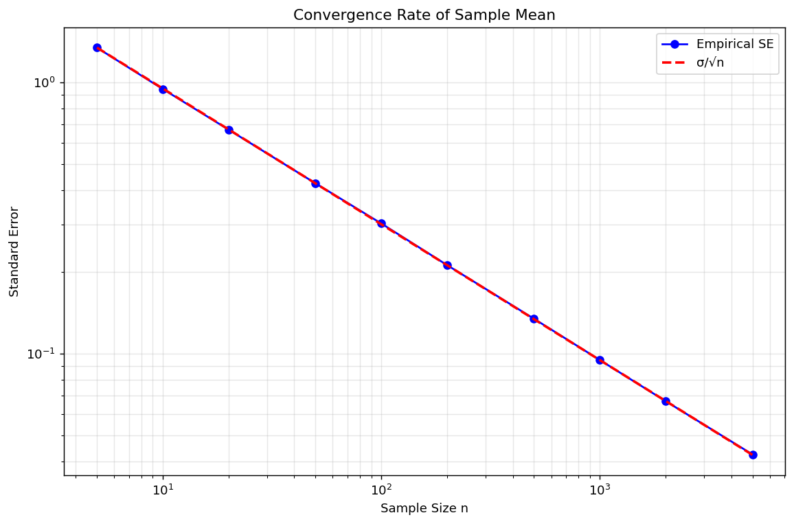

# 표본평균의 성질

## 개요

표본평균 $\bar{X} = \frac{1}{n}\sum_{i=1}^n X_i$은 통계학에서 가장 근본적인 추정량이다. 이 페이지에서는 모의실험으로 그 핵심 성질을 확인한다: 여러 분포에서의 불편성, 분산 공식 $\text{Var}(\bar{X}) = \sigma^2/n$, 평균제곱오차, $1/\sqrt{n}$ 속도의 표준오차 수렴, 다른 위치추정량 대비 효율, 그리고 역분산 가중.

## 불편성

표본평균은 바탕 분포와 무관하게 모평균에 대해 불편이다:

$$E[\bar{X}] = \mu$$

기댓값의 선형성에서 따라 나온다. 증명에는 각 $X_i$의 평균이 같은 $\mu$라는 것만 필요하고 분포에 대한 가정은 필요 없다.

다음 모의실험은 100,000번의 반복에서 $\bar{X}$를 계산하고 그 평균이 참 평균에 가까운지 확인하여 여섯 가지 분포에서 이를 검증한다.

<div class="codebox" markdown>

### 예제 1. 분포를 바꿔 가며 확인하는 불편성 { .eg }

```python
import numpy as np

def verify_unbiasedness(mu=10.0, sigma=3.0, n=20, n_sim=100_000, seed=42):
    """표본평균이 모집단 모양과 무관하게 불편임을 모의실험으로 확인한다.

    E[X-bar] = mu 는 정규성을 쓰지 않고 기댓값의 선형성만으로 나오는 결과다.
    그래서 치우친 분포든 이산분포든 똑같이 성립해야 한다.
    """
    rng = np.random.default_rng(seed)

    # 모양이 제각각인 여섯 모집단. 값은 (표본을 뽑는 함수, 참 평균) 짝이다.
    distributions = {
        f'Normal({mu}, {sigma}²)': (lambda: rng.normal(mu, sigma, n), mu),
        'Exp(λ=0.5)':             (lambda: rng.exponential(2, n), 2.0),
        'Poisson(3.7)':           (lambda: rng.poisson(3.7, n), 3.7),
        'Uniform(2, 8)':          (lambda: rng.uniform(2, 8, n), 5.0),
        'Bernoulli(0.4)':         (lambda: rng.binomial(1, 0.4, n), 0.4),
        'Chi²(df=5)':             (lambda: rng.chisquare(5, n), 5.0),
    }

    for name, (sampler, true_mu) in distributions.items():
        # 크기 n 인 표본을 10만 번 뽑아 그때마다 표본평균을 기록한다.
        estimates = np.array([sampler().mean() for _ in range(n_sim)])
        # 그 10만 개의 평균이 참 평균에 얼마나 가까운지가 편향이다.
        bias = estimates.mean() - true_mu
        print(f"{name:<22} True μ={true_mu:.4f}  E[X̄]={estimates.mean():.4f}  Bias={bias:.6f}")
verify_unbiasedness()
```

출력:

```
Normal(10.0, 3.0²)     True μ=10.0000  E[X̄]=10.0017  Bias=0.001681
Exp(λ=0.5)             True μ=2.0000  E[X̄]=1.9992  Bias=-0.000795
Poisson(3.7)           True μ=3.7000  E[X̄]=3.7002  Bias=0.000242
Uniform(2, 8)          True μ=5.0000  E[X̄]=4.9996  Bias=-0.000395
Bernoulli(0.4)         True μ=0.4000  E[X̄]=0.4009  Bias=0.000895
Chi²(df=5)             True μ=5.0000  E[X̄]=5.0006  Bias=0.000617
```

</div>

!!! tip "핵심"
    모든 편향이 (몬테카를로 잡음 범위 안에서) 무시할 만큼 작아, 시험한 모든 분포에서 $E[\bar{X}] = \mu$임이 확인된다.

## 분산과 평균제곱오차

분산이 $\sigma^2$인 i.i.d. 관측값에 대해:

$$\text{Var}(\bar{X}) = \frac{\sigma^2}{n}, \qquad \text{SE}(\bar{X}) = \frac{\sigma}{\sqrt{n}}$$

$\bar{X}$가 불편이므로 평균제곱오차는 분산과 같다:

$$\text{MSE}(\bar{X}) = \text{Bias}^2 + \text{Var}(\bar{X}) = 0 + \frac{\sigma^2}{n} = \frac{\sigma^2}{n}$$

<div class="codebox" markdown>

### 예제 2. 분산과 평균제곱오차 { .eg }

```python
def verify_variance_and_mse(mu=10.0, sigma=3.0, n_sim=100_000, seed=42):
    """Var(X-bar) = sigma^2/n 을 표본크기를 바꿔 가며 확인한다.

    불편추정량이므로 MSE 와 분산이 같아야 한다. 표에서 두 값이 같은 자리에
    오는지 보면 된다.
    """
    rng = np.random.default_rng(seed)
    sample_sizes = [5, 10, 25, 50, 100, 500]

    for n in sample_sizes:
        # (n_sim, n) 배열이므로 행 하나가 표본 하나다. axis=1 로 접으면
        # 표본마다 평균이 하나씩 나온다. 반복문 없이 한 번에 끝난다.
        samples = rng.normal(mu, sigma, (n_sim, n))
        x_bars = samples.mean(axis=1)

        var_xbar   = x_bars.var(ddof=0)
        theory_var = sigma**2 / n
        mse        = np.mean((x_bars - mu)**2)
        se         = x_bars.std(ddof=0)
        theory_se  = sigma / np.sqrt(n)

        print(f"n={n:>4}  Var(X̄)={var_xbar:.6f}  σ²/n={theory_var:.6f}  "
              f"MSE={mse:.6f}  SE={se:.6f}  σ/√n={theory_se:.6f}")
verify_variance_and_mse()
```

출력:

```
n=   5  Var(X̄)=1.807662  σ²/n=1.800000  MSE=1.807665  SE=1.344493  σ/√n=1.341641
n=  10  Var(X̄)=0.892618  σ²/n=0.900000  MSE=0.892629  SE=0.944785  σ/√n=0.948683
n=  25  Var(X̄)=0.361480  σ²/n=0.360000  MSE=0.361485  SE=0.601232  σ/√n=0.600000
n=  50  Var(X̄)=0.180013  σ²/n=0.180000  MSE=0.180013  SE=0.424279  σ/√n=0.424264
n= 100  Var(X̄)=0.090037  σ²/n=0.090000  MSE=0.090038  SE=0.300062  σ/√n=0.300000
n= 500  Var(X̄)=0.018063  σ²/n=0.018000  MSE=0.018063  SE=0.134397  σ/√n=0.134164
```

</div>

## 효율 비교

표본평균은 정규 자료에서 가장 효율적인 위치추정량이지만 꼬리가 두꺼운 분포에서는 그렇지 않다. $\bar{X}$ 대비 추정량 $T$의 **상대효율**은:

$$\text{RE}(T, \bar{X}) = \frac{\text{MSE}(\bar{X})}{\text{MSE}(T)}$$

$\text{RE} > 1$이면 대안 $T$가 *더* 효율적이다.

<div class="codebox" markdown>

### 예제 3. 모집단에 따라 뒤바뀌는 효율 { .eg }

```python
from scipy import stats

def efficiency_comparison(n=30, n_sim=50_000, seed=42):
    """중심을 재는 네 추정량의 효율을 모집단별로 견준다.

    정규모집단에서는 표본평균이 가장 좋지만, 꼬리가 두꺼워지거나 자료가
    오염되면 순위가 뒤집힌다. 어느 추정량이 낫냐는 물음에는 모집단을 함께
    말해야 답이 된다.
    """
    rng = np.random.default_rng(seed)

    # 셋째는 오염 정규분포다. 10%는 표준편차 10짜리 정규에서 나오므로
    # 겉보기에는 정규 같지만 이따금 아주 먼 값이 섞인다.
    distributions = {
        'Normal(0,1)':           lambda: rng.standard_normal(n),
        't(df=3)':               lambda: rng.standard_t(3, n),
        'Contaminated Normal':   lambda: np.where(
            rng.uniform(0, 1, n) < 0.1,
            rng.normal(0, 10, n),
            rng.standard_normal(n)),
    }

    for dist_name, sampler in distributions.items():
        est = {'Mean': [], 'Median': [], 'Trim10%': [], 'Trim20%': []}
        for _ in range(n_sim):
            s = sampler()
            est['Mean'].append(np.mean(s))
            est['Median'].append(np.median(s))
            est['Trim10%'].append(stats.trim_mean(s, 0.1))
            est['Trim20%'].append(stats.trim_mean(s, 0.2))

        # 참 중심이 0 이므로 추정값의 제곱평균이 곧 MSE 다.
        # 표본평균의 MSE 를 기준으로 삼아 상대효율을 낸다.
        mse_mean = np.mean(np.array(est['Mean'])**2)
        print(f"\n{dist_name}:")
        for name, vals in est.items():
            mse = np.mean(np.array(vals)**2)
            re  = mse_mean / mse
            print(f"  {name:<12} MSE={mse:.6f}  Rel.Eff.={re:.4f}")
efficiency_comparison()
```

출력:

```

Normal(0,1):
  Mean         MSE=0.032864  Rel.Eff.=1.0000
  Median       MSE=0.049651  Rel.Eff.=0.6619
  Trim10%      MSE=0.034776  Rel.Eff.=0.9450
  Trim20%      MSE=0.037534  Rel.Eff.=0.8756

t(df=3):
  Mean         MSE=0.099094  Rel.Eff.=1.0000
  Median       MSE=0.060253  Rel.Eff.=1.6446
  Trim10%      MSE=0.054848  Rel.Eff.=1.8067
  Trim20%      MSE=0.051286  Rel.Eff.=1.9322

Contaminated Normal:
  Mean         MSE=0.363803  Rel.Eff.=1.0000
  Median       MSE=0.061236  Rel.Eff.=5.9410
  Trim10%      MSE=0.057499  Rel.Eff.=6.3272
  Trim20%      MSE=0.049119  Rel.Eff.=7.4065
```

</div>

!!! note "평균이 지는 경우"
    $t(3)$이나 오염된 정규처럼 꼬리가 두꺼운 분포에서는 절사평균과 중앙값이 표본평균보다 평균제곱오차가 작다. 이상점에 민감한 평균은 이런 상황에서 비효율적이다.

## 역분산 가중평균

관측값의 분산 $\sigma_i^2$이 서로 다를 때 **최적 가중치**는 분산에 반비례한다:

$$w_i = \frac{1/\sigma_i^2}{\sum_{j=1}^k 1/\sigma_j^2}, \qquad \bar{X}_w = \sum_{i=1}^k w_i X_i$$

이 가중치는 기댓값이 참 평균이 되는 모든 가중평균 중에서 $\text{Var}(\bar{X}_w)$를 최소화한다.

<div class="codebox" markdown>

### 예제 4. 역분산 가중평균 { .eg }

```python
def weighted_mean_demo(mu=5.0, n_sim=50_000, seed=42):
    """정밀도가 다른 관측값 다섯 개를 어떻게 합칠지 견준다.

    같은 양을 서로 다른 기계 다섯 대로 잰 상황이다. 정밀도가 다른데도
    똑같이 더해 나누면 가장 엉성한 기계에 끌려간다.
    """
    rng = np.random.default_rng(seed)

    # 다섯 관측값의 표준편차. 마지막 하나가 가장 정밀하고 넷째가 가장 엉성하다.
    sigmas = np.array([1.0, 2.0, 5.0, 10.0, 0.5])

    # 분산의 역수를 가중값으로 쓰면 합의 분산이 가장 작아진다.
    # 합이 1 이 되도록 고르면 가중평균이 여전히 불편추정량으로 남는다.
    optimal_weights = 1 / sigmas**2
    optimal_weights /= optimal_weights.sum()

    unweighted, weighted = [], []
    for _ in range(n_sim):
        obs = rng.normal(mu, sigmas)
        unweighted.append(obs.mean())
        weighted.append(np.sum(optimal_weights * obs))

    unweighted = np.array(unweighted)
    weighted   = np.array(weighted)

    print(f"Unweighted:  Var={unweighted.var():.6f}  MSE={np.mean((unweighted-mu)**2):.6f}")
    print(f"IV-Weighted: Var={weighted.var():.6f}  MSE={np.mean((weighted-mu)**2):.6f}")
    print(f"Variance reduction: {(1 - weighted.var()/unweighted.var())*100:.1f}%")
weighted_mean_demo()
```

출력:

```
Unweighted:  Var=5.182967  MSE=5.183045
IV-Weighted: Var=0.190153  MSE=0.190153
Variance reduction: 96.3%
```

</div>

## 표준오차의 수렴 속도

로그-로그 그래프에서 표준오차 $\text{SE}(\bar{X}) = \sigma/\sqrt{n}$은 기울기 $-1/2$인 직선으로 나타나며, $O(1/\sqrt{n})$ 수렴 속도를 확인해 준다.

<div class="codebox" markdown>

### 예제 5. 표준오차의 수렴 속도 { .eg }

```python
import matplotlib.pyplot as plt

def convergence_rate_plot(mu=5.0, sigma=3.0, n_sim=50_000, seed=42):
    """표준오차가 1/sqrt(n) 으로 줄어듦을 양로그 축에서 직선으로 확인한다.

    SE = sigma * n^(-1/2) 의 양변에 로그를 씌우면 기울기 -1/2 인 직선이 된다.
    양로그 축을 쓰는 이유가 이것이다.
    """
    rng = np.random.default_rng(seed)
    sample_sizes = [5, 10, 20, 50, 100, 200, 500, 1000, 2000, 5000]

    empirical_se = []
    for n in sample_sizes:
        estimates = np.array([rng.normal(mu, sigma, n).mean() for _ in range(n_sim)])
        empirical_se.append(estimates.std())

    theoretical_se = [sigma / np.sqrt(n) for n in sample_sizes]

    fig, ax = plt.subplots(figsize=(9, 6))
    ax.loglog(sample_sizes, empirical_se, 'bo-', label='Empirical SE')
    ax.loglog(sample_sizes, theoretical_se, 'r--', label='σ/√n', linewidth=2)
    ax.set_xlabel('Sample Size n')
    ax.set_ylabel('Standard Error')
    ax.set_title('Convergence Rate of Sample Mean')
    ax.legend()
    ax.grid(True, alpha=0.3, which='both')
    plt.tight_layout()
    plt.show()
convergence_rate_plot()
```



</div>

## 해석

- **불편성**은 분포와 무관하다: 평균이 유한한 임의의 모집단에서 성립한다.
- **분산**은 $1/n$으로 줄어들므로 **표준오차**는 $1/\sqrt{n}$으로 줄어든다. 표준오차를 절반으로 줄이려면 관측값이 네 배 필요하다.
- 편향이 0이므로 **평균제곱오차가 곧 분산**이다. 편향–분산 맞바꿈의 가장 단순한 경우이다.
- **효율**은 모집단의 모양에 달려 있다. 정규 자료에서는 평균이 최적이고, 꼬리가 두꺼운 자료에서는 절사평균과 중앙값의 평균제곱오차가 더 작을 수 있다.
- **역분산 가중**은 정밀도가 다른 관측값을 결합하는 올바른 방법이며, 단순 평균에 비해 분산을 크게 줄일 수 있다.

## 연습문제

<div class="drillbox" markdown>

**연습문제 1.** <span class="diff easy" title="쉬움"></span>
기댓값의 선형성만 써서, 평균이 유한한 임의의 분포에서 $E[\bar{X}] = \mu$임을 해석적으로 증명하라.

</div>

??? success "풀이"
    $X_1, \ldots, X_n$이 i.i.d.이고 $E[X_i] = \mu$라 하자. 그러면:

    $$E[\bar{X}] = E\left[\frac{1}{n}\sum_{i=1}^n X_i\right] = \frac{1}{n}\sum_{i=1}^n E[X_i] = \frac{1}{n} \cdot n\mu = \mu$$

    첫 등호는 $\bar{X}$의 정의, 둘째는 기댓값의 선형성, 셋째는 모든 $i$에 대해 $E[X_i] = \mu$라는 사실을 쓴다. $\square$

<div class="drillbox" markdown>

**연습문제 2.** <span class="diff med" title="중간"></span>
i.i.d. 관측값에 대해 $\text{Var}(\bar{X}) = \sigma^2/n$임을 보여라. 그다음 표준오차를 절반으로 줄이려면 왜 표본크기를 네 배로 해야 하는지 설명하라.

</div>

??? success "풀이"
    $\text{Var}(X_i) = \sigma^2$인 i.i.d. $X_1, \ldots, X_n$에 대해:

    $$\text{Var}(\bar{X}) = \text{Var}\left(\frac{1}{n}\sum_{i=1}^n X_i\right) = \frac{1}{n^2}\sum_{i=1}^n \text{Var}(X_i) = \frac{1}{n^2}\cdot n\sigma^2 = \frac{\sigma^2}{n}$$

    두 번째 단계는 독립성을 쓴다(합의 분산이 분산의 합이 된다). 표준오차는 $\text{SE} = \sigma/\sqrt{n}$이다. 이를 절반으로 줄이려면:

    $$\frac{\sigma}{\sqrt{n'}} = \frac{1}{2}\cdot\frac{\sigma}{\sqrt{n}} \implies \sqrt{n'} = 2\sqrt{n} \implies n' = 4n$$

    $\square$

<div class="drillbox" markdown>

**연습문제 3.** <span class="diff med" title="중간"></span>
표준편차가 $\sigma_1 = 1, \sigma_2 = 2, \sigma_3 = 5, \sigma_4 = 10, \sigma_5 = 0.5$인 출처에서 얻은 관측값 다섯 개를 생각하자. 최적 역분산 가중치와 가중평균의 분산을 계산하라. 가중하지 않은 평균의 분산과 비교하라.

</div>

??? success "풀이"
    정규화하지 않은 가중치는 $w_i^* = 1/\sigma_i^2$이다:

    $$w_1^* = 1, \quad w_2^* = 0.25, \quad w_3^* = 0.04, \quad w_4^* = 0.01, \quad w_5^* = 4$$

    합은 $W = 1 + 0.25 + 0.04 + 0.01 + 4 = 5.3$이다. 정규화한 가중치는 $w_i = w_i^*/W$이다.

    가중평균의 분산은:

    $$\text{Var}(\bar{X}_w) = \sum_{i=1}^5 w_i^2 \sigma_i^2 = \frac{1}{W^2}\sum_{i=1}^5 \frac{\sigma_i^2}{\sigma_i^4} = \frac{1}{W^2}\sum_{i=1}^5 \frac{1}{\sigma_i^2} = \frac{W}{W^2} = \frac{1}{W} = \frac{1}{5.3} \approx 0.1887$$

    가중하지 않은 평균의 분산은:

    $$\text{Var}(\bar{X}) = \frac{1}{25}\sum_{i=1}^5 \sigma_i^2 = \frac{1 + 4 + 25 + 100 + 0.25}{25} = \frac{130.25}{25} = 5.21$$

    역분산 가중평균의 분산이 약 $5.21/0.189 \approx 27.6$배 작다. $\square$

<div class="drillbox" markdown>

**연습문제 4.** <span class="diff med" title="중간"></span>
정규모집단에서 표본평균은 Cramer-Rao 하한 $\sigma^2/n$을 달성한다. 표본평균 대비 표본중앙값의 점근 상대효율이 $2/\pi \approx 0.637$임을 보여라.

</div>

??? success "풀이"
    $X_i \sim N(\mu, \sigma^2)$에서 표본평균의 분산은 $\sigma^2/n$이다. 표본중앙값 $\tilde{X}$의 점근분산은:

    $$\text{Var}(\tilde{X}) \approx \frac{1}{4n[f(\mu)]^2}$$

    여기서 $f$는 모집단 밀도이다. 정규분포에서 $f(\mu) = \frac{1}{\sigma\sqrt{2\pi}}$이므로:

    $$\text{Var}(\tilde{X}) \approx \frac{1}{4n \cdot \frac{1}{2\pi\sigma^2}} = \frac{2\pi\sigma^2}{4n} = \frac{\pi\sigma^2}{2n}$$

    점근 상대효율은:

    $$\text{ARE}(\tilde{X}, \bar{X}) = \frac{\text{Var}(\bar{X})}{\text{Var}(\tilde{X})} = \frac{\sigma^2/n}{\pi\sigma^2/(2n)} = \frac{2}{\pi} \approx 0.637$$

    모집단이 실제로 정규일 때 중앙값은 평균에 비해 자료의 약 36%를 "낭비"한다는 뜻이다. $\square$

<div class="drillbox" markdown>

**연습문제 5.** <span class="diff med" title="중간"></span>
$X_1 \sim N(\mu, 1)$과 $X_2 \sim N(\mu, 9)$를 독립적으로 관측한다고 하자. 분산을 최소화하는 가중추정량 $\hat{\mu} = aX_1 + bX_2$($a + b = 1$)를 구하라. 그 분산은 얼마인가?

</div>

??? success "풀이"
    $b = 1 - a$로 두면 분산은:

    $$\text{Var}(\hat{\mu}) = a^2 \cdot 1 + (1-a)^2 \cdot 9 = a^2 + 9(1-a)^2$$

    미분하여 0으로 놓으면:

    $$\frac{d}{da}\left[a^2 + 9(1-a)^2\right] = 2a - 18(1-a) = 2a - 18 + 18a = 20a - 18 = 0$$

    따라서 $a = 9/10$, $b = 1/10$이다. 이는 역분산 가중치와 일치한다: $w_1 \propto 1/1 = 1$, $w_2 \propto 1/9$를 정규화하면 $(9/10, 1/10)$이다.

    최소 분산은:

    $$\text{Var}(\hat{\mu}) = \left(\frac{9}{10}\right)^2 + 9\left(\frac{1}{10}\right)^2 = \frac{81}{100} + \frac{9}{100} = \frac{90}{100} = \frac{9}{10}$$

    가중하지 않은 평균과 비교하면 $\text{Var}\!\left(\frac{X_1+X_2}{2}\right) = \frac{1+9}{4} = 2.5$로 훨씬 크다. $\square$

<div class="drillbox" markdown>

**연습문제 6.** <span class="diff med" title="중간"></span>
표본평균의 **영향함수**가 $\text{IF}(x) = x-\mu$임을 보이고, 이것이 유계가 아니라는 사실이 실무에서 어떤 결과를 낳는지 정량적으로 설명하라.

</div>

??? success "풀이"
    **유도.** 분포 $F$를 $(1-\varepsilon)F+\varepsilon\delta_x$로 오염시키면 평균이

    $$
    \mu_\varepsilon = (1-\varepsilon)\mu+\varepsilon x
    $$

    이므로

    $$
    \text{IF}(x) = \lim_{\varepsilon\to0}\frac{\mu_\varepsilon-\mu}{\varepsilon} = x-\mu
    $$

    이다. $\square$

    **유계가 아니다.** $|x|\to\infty$이면 영향도 무한대로 간다.

    **정량적 결과 1 — 한 관측값의 이동.** $n$개 표본에서 관측값 하나를 $\delta$만큼 옮기면 평균이 $\delta/n$만큼 움직인다. $n=50$이고 어떤 값이 원래보다 100 크게 기록되었다면 평균이 2만큼 밀린다. 자료의 표준편차가 5라면 **0.4 표준편차의 이동**이다.

    **정량적 결과 2 — 붕괴점 0.** 관측값 **하나**만 무한대로 보내면 평균도 무한대가 된다. 오염 비율이 $1/n \to 0$이므로 붕괴점이 0이다. 표본이 클수록 개별 관측값의 영향은 작아지지만, **붕괴점은 여전히 0**이다.

    **정량적 결과 3 — 분산의 폭발.** 점근분산이 $E[\text{IF}^2]/n = \sigma^2/n$인데, 꼬리가 두꺼워 $\sigma^2=\infty$이면 이 값이 무한이다. 영향함수가 유계가 아니라는 사실과 "분산이 없으면 표본평균을 쓸 수 없다"는 사실이 같은 이야기다.

    **대비.** 중앙값의 영향함수는

    $$
    \text{IF}(x) = \frac{\text{sgn}(x-m)}{2f(m)}
    $$

    로 **유계**다. 관측값이 얼마나 멀리 있든 영향의 크기가 같다. 그 대가로 정규분포에서 효율을 36% 잃는다.

    **실무 권고.** 자료를 다루기 전에 **최댓값과 최솟값을 확인**하고, 평균을 계산한 뒤 **극단값 하나를 빼고 다시 계산**해 본다. 두 값이 크게 다르면 평균이 소수의 관측값에 지배되고 있는 것이다.

<div class="drillbox" markdown>

**연습문제 7.** <span class="diff med" title="중간"></span>
**층화 표집**에서 전체 평균의 추정량과 그 분산을 구하라. 단순무작위표집보다 나아지는 조건은 무엇인가?

</div>

??? success "풀이"
    **설정.** 모집단이 $H$개 층으로 나뉘고 층 $h$의 비중이 $W_h$, 평균이 $\mu_h$, 분산이 $\sigma_h^2$이다. 층 $h$에서 $n_h$개를 뽑는다.

    **추정량.**

    $$
    \hat\mu_{\text{st}} = \sum_{h=1}^H W_h\bar X_h, \qquad \operatorname{Var}(\hat\mu_{\text{st}}) = \sum_h W_h^2\frac{\sigma_h^2}{n_h}
    $$

    **비례배분**($n_h = nW_h$)이면

    $$
    \operatorname{Var}(\hat\mu_{\text{st}}) = \frac{1}{n}\sum_h W_h\sigma_h^2 = \frac{\sigma_W^2}{n}
    $$

    로 **층 내 분산의 가중평균**이 나온다.

    **단순무작위와의 비교.** 전체 분산을 분해하면

    $$
    \sigma^2 = \underbrace{\sum_h W_h\sigma_h^2}_{\text{층 내}}+\underbrace{\sum_h W_h(\mu_h-\mu)^2}_{\text{층 간}}
    $$

    이므로

    $$
    \operatorname{Var}(\bar X_{\text{SRS}})-\operatorname{Var}(\hat\mu_{\text{st}}) = \frac{1}{n}\sum_h W_h(\mu_h-\mu)^2 \ge 0
    $$

    **층화는 결코 나빠지지 않는다**(비례배분에서). 이득의 크기가 정확히 **층 간 분산**이다.

    **나아지는 조건.** 층 간 평균 차이가 클수록 이득이 크다. 층 내가 동질적이고 층 간이 이질적이도록 나누는 것이 좋은 층화다.

    - **효과적**: 성별·연령으로 층화한 소득 조사, 업종으로 층화한 기업 조사, 지역으로 층화한 선거 조사.
    - **효과 없음**: 층 평균이 모두 같으면 이득이 0이다.

    **네이만 배분.** $n_h \propto W_h\sigma_h$로 배분하면 비례배분보다 더 줄어든다. **변동이 큰 층에 표본을 더 준다.** 다만 $\sigma_h$를 알아야 하고, 여러 변수를 동시에 추정할 때는 한 변수에 최적인 배분이 다른 변수에 나쁠 수 있다.

<div class="drillbox" markdown>

**연습문제 8.** <span class="diff med" title="중간"></span>
**군집 표집**에서 표본평균의 분산이 왜 커지는지 설명하고, 설계효과를 이용해 필요한 표본크기를 조정하는 방법을 적어라.

</div>

??? success "풀이"
    **구조.** 층화가 모집단을 나눠 **각 층에서 뽑는** 것이라면, 군집은 **군집 전체를 통째로 뽑는다.** 학교를 뽑아 그 학교 학생을 모두 조사하는 식이다.

    **왜 분산이 커지는가.** 같은 군집의 개체들이 서로 닮아 있다(급내상관 $\rho > 0$). 한 군집에서 20명을 조사해도 20개의 독립적인 정보를 얻지 못한다.

    **설계효과.** 군집 크기가 $m$으로 같으면

    $$
    \text{DEFF} = 1+(m-1)\rho, \qquad \operatorname{Var}_{\text{군집}} = \text{DEFF}\times\frac{\sigma^2}{n}
    $$

    **표본크기 조정.** 단순무작위로 $n_{\text{SRS}}$가 필요하다고 계산했다면, 군집 설계에서는

    $$
    n_{\text{군집}} = n_{\text{SRS}}\times\text{DEFF}
    $$

    가 필요하다. $m=20$, $\rho=0.05$면 DEFF가 1.95이므로 **표본을 두 배 가까이 늘려야** 같은 정밀도를 얻는다.

    **그럼에도 군집을 쓰는 이유.** **비용**이다. 학교 50곳에서 20명씩 조사하는 것이 전국에서 무작위로 1000명을 찾아가는 것보다 훨씬 싸다. 통계적 효율을 잃는 대신 같은 예산으로 훨씬 많은 표본을 얻는다.

    **최적 군집 크기.** 군집 하나를 추가하는 비용 $c_1$과 군집 내 개체 하나를 추가하는 비용 $c_2$가 주어지면

    $$
    m^* = \sqrt{\frac{c_1}{c_2}\cdot\frac{1-\rho}{\rho}}
    $$

    이 비용 대비 정밀도를 최적화한다. $\rho$가 클수록 군집을 작게 하고 군집 수를 늘려야 한다.

    **분석에서의 주의.** 군집 자료를 단순무작위처럼 분석하면 **표준오차를 심하게 과소평가**한다. 군집 표준오차, 혼합효과 모형, 또는 설계 가중치를 반영하는 조사 분석 패키지를 써야 한다. 이것을 놓치는 것이 교육학·역학 논문에서 가장 흔한 통계 오류 중 하나다.

<div class="drillbox" markdown>

**연습문제 9.** <span class="diff med" title="중간"></span>
자료에 결측이 있을 때 **완전 관측만 쓰는 평균**이 언제 불편이고 언제 아닌지, 결측 기제(MCAR·MAR·MNAR)로 나누어 설명하라.

</div>

??? success "풀이"
    **세 가지 기제.**

    | 기제 | 뜻 | 완전 관측 평균 |
    |---|---|---|
    | **MCAR** (완전 무작위 결측) | 결측이 관측값·미관측값 어느 것과도 무관 | **불편** |
    | **MAR** (무작위 결측) | 관측된 다른 변수로 결측을 설명할 수 있음 | 편향 |
    | **MNAR** (비무작위 결측) | 결측이 그 값 자체에 의존 | 편향, 보정 불가 |

    **MCAR.** 설문지를 나눠 주다 몇 장을 잃어버린 경우. 남은 표본이 여전히 무작위 표본이므로 $E[\bar X_{\text{obs}}] = \mu$다. 표본크기만 줄어 정밀도를 잃는다.

    **MAR.** 고소득자가 소득을 덜 답하지만, 그 경향이 **관측된 직업·학력으로 설명되는** 경우. 완전 관측 평균은 편향되지만, 직업·학력으로 가중하거나 다중대체로 보정할 수 있다. "결측이 무작위"라는 이름이 오해를 부르는데, 정확히는 **"관측된 변수를 조건으로 걸면 무작위"**다.

    **MNAR.** 소득이 높을수록 답하지 않는데 그것을 설명할 관측 변수가 없는 경우. **자료만으로는 보정할 수 없다.** 결측 기제를 모형화하는 선택모형이나 패턴혼합모형이 필요하며, 검증 불가능한 가정에 의존한다.

    **편향의 크기.** 결측률이 $1-r$이고 응답자와 무응답자의 평균 차이가 $d$이면

    $$
    \text{편향} = (1-r)\,d
    $$

    다. 앞서 본 무응답 편향 공식과 같다. **결측률이 높을수록, 두 집단이 다를수록 크다.**

    **실무 권고.**

    1. **결측률을 반드시 보고한다.** 변수별, 패턴별로.
    2. **MCAR을 검정해 본다.** 리틀의 MCAR 검정이 있지만 검정력이 낮다. 결측 여부를 다른 변수에 회귀해 보는 것이 더 유용하다.
    3. **완전 관측 분석은 기본값이 아니다.** MAR이면 다중대체나 최대가능도(FIML)를 쓴다.
    4. **MNAR 가능성을 민감도 분석으로 다룬다.** "무응답자의 평균이 응답자보다 $d$만큼 낮다면 결론이 어떻게 되는가"를 여러 $d$에 대해 보인다.

<div class="drillbox" markdown>

**연습문제 10.** <span class="diff med" title="중간"></span>
$\bar X$와 표본중앙값 $\tilde X$의 **상관**을 구하라(정규모집단). 둘을 결합해 더 나은 추정량을 만들 수 있는가?

</div>

??? success "풀이"
    **점근 공분산.** 정규모집단에서 알려진 결과로

    $$
    \operatorname{Cov}(\bar X,\tilde X) \approx \frac{\sigma^2}{n}
    $$

    이다. 한편 $\operatorname{Var}(\bar X)=\sigma^2/n$, $\operatorname{Var}(\tilde X)\approx\pi\sigma^2/(2n)$이므로

    $$
    \operatorname{Corr}(\bar X,\tilde X) \approx \frac{\sigma^2/n}{\sqrt{(\sigma^2/n)\cdot(\pi\sigma^2/2n)}} = \sqrt{\frac{2}{\pi}} = 0.798
    $$

    **상관이 매우 높다.** 두 추정량이 대부분 같은 정보를 쓴다는 뜻이다.

    **결합해 보면.** $\hat\mu_w = w\bar X+(1-w)\tilde X$의 분산을 최소로 하는 $w$는

    $$
    w^* = \frac{\operatorname{Var}(\tilde X)-\operatorname{Cov}}{\operatorname{Var}(\bar X)+\operatorname{Var}(\tilde X)-2\operatorname{Cov}}
    $$

    이고, 위 값을 넣으면

    $$
    w^* = \frac{\pi/2-1}{1+\pi/2-2} = \frac{0.5708}{0.5708} = 1
    $$

    **$w^*=1$, 즉 표본평균 그 자체다.** 중앙값에 어떤 가중치를 주어도 나아지지 않는다.

    **왜 그런가.** $\bar X$가 정규모집단에서 **최소분산불편추정량**이므로, 다른 어떤 불편추정량과 결합해도 개선의 여지가 없다. 사실 이것은 일반 원리다. 효율적 추정량 $\hat\theta_e$와 임의의 불편추정량 $\hat\theta$에 대해

    $$
    \operatorname{Cov}(\hat\theta_e,\ \hat\theta-\hat\theta_e) = 0
    $$

    이 성립한다(하우스만의 보조정리). 효율적 추정량은 다른 추정량과의 **차이와 무상관**이며, 그래서 결합의 이득이 없다.

    **뒤집어 읽으면.** $\operatorname{Var}(\hat\theta-\hat\theta_e) = \operatorname{Var}(\hat\theta)-\operatorname{Var}(\hat\theta_e)$이므로, **두 추정량의 차이의 분산을 쉽게 계산할 수 있다.** 이것이 앞서 본 하우스만 검정의 분모이며, 효율적 추정량과 강건한 추정량을 비교해 모형 오설정을 검정하는 근거다.

    **모집단이 정규가 아니면.** $\bar X$가 더 이상 효율적이지 않으므로 결합이 이득일 수 있다. $t_3$에서는 중앙값 쪽에 큰 가중치를 주는 것이 낫다. 그러나 **어느 쪽에 가중할지는 모집단을 알아야 정할 수 있고**, 모른다면 절사평균처럼 넓은 범위에서 무난한 추정량을 쓰는 편이 실용적이다.

---

## 정리하며

앞 절들에서 유도한 성질을 **모의실험으로 하나씩 확인**했다.

- **불편성은 분포를 가리지 않는다.** 여섯 분포 모두에서 $\bar X$ 의 평균이 참 평균에 맞는다. 증명에 분포 가정이 없었으니 당연한 결과이며, 모의실험은 그 사실을 눈으로 확인해 준다.
- **$\mathrm{Var}(\bar X)=\sigma^2/n$ 과 $1/\sqrt n$ 속도**도 그대로 재현된다. 표준오차를 $n$ 에 대해 로그–로그로 그리면 기울기 $-1/2$ 의 직선이 나온다.
- **효율 비교에서 분포가 승자를 바꾼다.** 정규에서는 평균이, 두꺼운 꼬리에서는 중앙값이나 절사평균이 앞선다.
- **역분산 가중.** 분산이 서로 다른 관측을 결합할 때는 단순평균이 아니라 $w_i\propto1/\sigma_i^2$ 로 가중해야 분산이 최소가 된다. 메타분석과 가중최소제곱의 기본 원리이며, **정밀한 관측에 더 무게를 준다**는 직관이 정확히 이 형태로 나온다.

**모의실험은 증명을 대신하지 않지만 증명을 검산해 준다.** 유도한 공식과 재어 본 값이 어긋나면 둘 중 하나가 틀린 것이고, 대개는 가정을 놓친 쪽이다.

다음 절 **일치성과 수렴**으로 넘어간다. 수렴을 경로 단위로 그려 보고, 그것이 실패하는 경우도 함께 본다.
