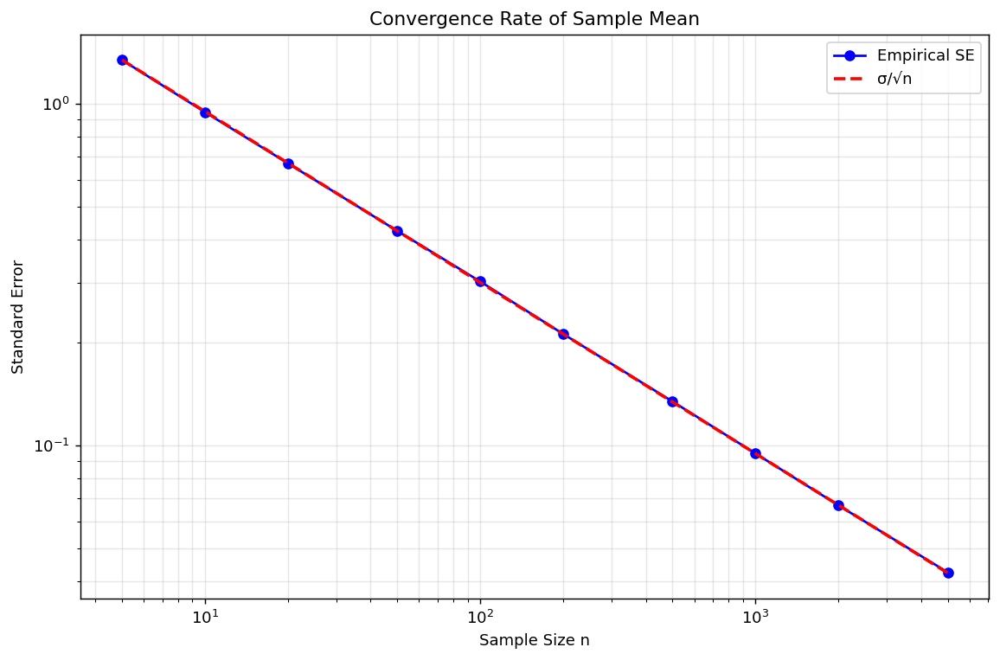

# 표본평균의 성질

## 개요

표본평균 $\bar{X} = \frac{1}{n}\sum_{i=1}^n X_i$은 통계학에서 가장 근본적인 추정량이다. 이 페이지에서는 모의실험으로 그 핵심 성질을 확인한다: 여러 분포에서의 불편성, 분산 공식 $\text{Var}(\bar{X}) = \sigma^2/n$, 평균제곱오차, $1/\sqrt{n}$ 속도의 표준오차 수렴, 다른 위치추정량 대비 효율, 그리고 역분산 가중.

## 불편성

표본평균은 바탕 분포와 무관하게 모평균에 대해 불편이다:

$$E[\bar{X}] = \mu$$

기댓값의 선형성에서 따라 나온다. 증명에는 각 $X_i$의 평균이 같은 $\mu$라는 것만 필요하고 분포에 대한 가정은 필요 없다.

다음 모의실험은 100,000번의 반복에서 $\bar{X}$를 계산하고 그 평균이 참 평균에 가까운지 확인하여 여섯 가지 분포에서 이를 검증한다.

<div class="exbox" markdown>

**보기 1.** <span class="diff easy" title="쉬움"></span> 분포를 바꿔 가며 확인하는 불편성. 모양이 제각각인 여섯 모집단에서 $n = 20$씩 뽑아 $\bar X$를 10만 번 기록하고 그 평균을 참값과 견준다.

**(1)** 모의실험으로 얻은 "편향"이 **0 이 되리라 기대해서는 안 된다.** 각 분포에서 그 값이 얼마만큼 흔들릴지 미리 적으시오.

**(2)** 출력의 여섯 편향을 (1)의 자로 재어, 불편성이 확인되었다고 말할 수 있는지 판정하시오.

</div>

??? success "풀이"

    **(1) 이론값.** $E[\bar X] = \mu$는 기댓값의 선형성만으로 나오는 **정확한 등식**이다. 그런데 모의실험이 내놓는 것은 $E[\bar X]$가 아니라 10만 개의 $\bar X$를 다시 평균한 값이고, 그것 역시 확률변수다. 되풀이 횟수를 $B$라 하면

    $$
    \operatorname{sd}\!\left(\frac1B\sum_{b=1}^B \bar X^{(b)}\right)
    = \frac{\operatorname{sd}(\bar X)}{\sqrt B}
    = \frac{\sigma}{\sqrt{nB}}
    $$

    이다. $n = 20$, $B = 10^5$이므로 $\sqrt{nB} = \sqrt{2 \times 10^6} = 1414.2$이고, 모의 편향의 표준오차는 **모집단 표준편차를 $1414$로 나눈 값**이다.

    | 모집단 | $\sigma$ | 몬테카를로 표준오차 |
    |:---|---:|---:|
    | $N(10, 3^2)$ | $3$ | $0.002121$ |
    | $\text{Exp}(\lambda = 0.5)$ | $2$ | $0.001414$ |
    | $\text{Poisson}(3.7)$ | $\sqrt{3.7} = 1.9235$ | $0.001360$ |
    | $\text{Uniform}(2, 8)$ | $6/\sqrt{12} = 1.7321$ | $0.001225$ |
    | $\text{Bernoulli}(0.4)$ | $\sqrt{0.24} = 0.4899$ | $0.000346$ |
    | $\chi^2_5$ | $\sqrt{10} = 3.1623$ | $0.002236$ |

    **자가 분포마다 다르다는 점이 중요하다.** 베르누이의 자는 $\chi^2_5$의 자보다 $6.5$배 촘촘하므로, 같은 $0.0009$라도 한쪽에서는 큰 수이고 다른 쪽에서는 작은 수다.

    **(2) 수치적으로.**

    ```python
    import numpy as np

    def verify_unbiasedness(mu=10.0, sigma=3.0, n=20, n_sim=100_000, seed=42):
        """표본평균이 모집단 모양과 무관하게 불편임을 모의실험으로 확인한다.

        E[X-bar] = mu 는 정규성을 쓰지 않고 기댓값의 선형성만으로 나오는 결과다.
        그래서 치우친 분포든 이산분포든 똑같이 성립해야 한다.
        """
        rng = np.random.default_rng(seed)

        # 모양이 제각각인 여섯 모집단. 값은 (표본을 뽑는 함수, 참 평균) 짝이다.
        distributions = {
            f'Normal({mu}, {sigma}²)': (lambda: rng.normal(mu, sigma, n), mu),
            'Exp(λ=0.5)':             (lambda: rng.exponential(2, n), 2.0),
            'Poisson(3.7)':           (lambda: rng.poisson(3.7, n), 3.7),
            'Uniform(2, 8)':          (lambda: rng.uniform(2, 8, n), 5.0),
            'Bernoulli(0.4)':         (lambda: rng.binomial(1, 0.4, n), 0.4),
            'Chi²(df=5)':             (lambda: rng.chisquare(5, n), 5.0),
        }

        for name, (sampler, true_mu) in distributions.items():
            # 크기 n 인 표본을 10만 번 뽑아 그때마다 표본평균을 기록한다.
            estimates = np.array([sampler().mean() for _ in range(n_sim)])
            # 그 10만 개의 평균이 참 평균에 얼마나 가까운지가 편향이다.
            bias = estimates.mean() - true_mu
            print(f"{name:<22} True μ={true_mu:.4f}  E[X̄]={estimates.mean():.4f}  Bias={bias:.6f}")
    verify_unbiasedness()
    ```

    출력:

    ```
    Normal(10.0, 3.0²)     True μ=10.0000  E[X̄]=10.0017  Bias=0.001681
    Exp(λ=0.5)             True μ=2.0000  E[X̄]=1.9992  Bias=-0.000795
    Poisson(3.7)           True μ=3.7000  E[X̄]=3.7002  Bias=0.000242
    Uniform(2, 8)          True μ=5.0000  E[X̄]=4.9996  Bias=-0.000395
    Bernoulli(0.4)         True μ=0.4000  E[X̄]=0.4009  Bias=0.000895
    Chi²(df=5)             True μ=5.0000  E[X̄]=5.0006  Bias=0.000617
    ```

    (1)의 자로 재면 이렇다.

    | 모집단 | 모의 편향 | 몬테카를로 표준오차 | $z$ |
    |:---|---:|---:|---:|
    | $N(10, 3^2)$ | $+0.001681$ | $0.002121$ | $+0.79$ |
    | $\text{Exp}(\lambda = 0.5)$ | $-0.000795$ | $0.001414$ | $-0.56$ |
    | $\text{Poisson}(3.7)$ | $+0.000242$ | $0.001360$ | $+0.18$ |
    | $\text{Uniform}(2, 8)$ | $-0.000395$ | $0.001225$ | $-0.32$ |
    | $\text{Bernoulli}(0.4)$ | $+0.000895$ | $0.000346$ | $+2.58$ |
    | $\chi^2_5$ | $+0.000617$ | $0.002236$ | $+0.28$ |

    **다섯 줄은 $1$ 표준오차 안이고 한 줄이 $2.58$이다.** 겉보기 수만 보면 베르누이의 $0.0009$는 여섯 가운데 가장 작은 축인데, 자로 재면 가장 멀다. $\sigma = 0.49$로 모집단 자체가 가장 좁아 그만큼 모의실험이 정밀해졌기 때문이다.

    $z = 2.58$은 우연으로 설명되는가. 한 번만 보면 양측 $p = 0.0099$로 드물지만, **여섯 줄 가운데 가장 큰 것을 골라 보고 있다.** 여섯 개가 독립이므로 최댓값이 $2.58$을 넘을 확률은 $1 - (1-0.0099)^6 = 0.058$이고, 스무 번에 한 번쯤 일어나는 일이다. 더구나 $E[\bar X] = \mu$는 **증명된 등식**이라 모의실험이 반증할 수 있는 종류의 주장이 아니다. 되풀이를 늘리면 $z$는 머물고 편향 자체가 $1/\sqrt B$로 줄어든다.

    **그러므로 (2)의 답은 "확인되었다"이다.** 다만 확인의 뜻이 "편향이 0 으로 나왔다"가 아니라 **"편향이 몬테카를로 잡음과 구별되지 않는다"**임을 분명히 해야 한다. 되풀이가 유한한 모의실험은 그 이상을 말해 줄 수 없다.

!!! tip "핵심"
    모든 편향이 (몬테카를로 잡음 범위 안에서) 무시할 만큼 작아, 시험한 모든 분포에서 $E[\bar{X}] = \mu$임이 확인된다.

## 분산과 평균제곱오차

분산이 $\sigma^2$인 i.i.d. 관측값에 대해:

$$\text{Var}(\bar{X}) = \frac{\sigma^2}{n}, \qquad \text{SE}(\bar{X}) = \frac{\sigma}{\sqrt{n}}$$

$\bar{X}$가 불편이므로 평균제곱오차는 분산과 같다:

$$\text{MSE}(\bar{X}) = \text{Bias}^2 + \text{Var}(\bar{X}) = 0 + \frac{\sigma^2}{n} = \frac{\sigma^2}{n}$$

<div class="exbox" markdown>

**보기 2.** <span class="diff easy" title="쉬움"></span> 분산과 평균제곱오차. $N(10, 3^2)$에서 $n$을 $5$에서 $500$까지 바꾸며 $\bar X$를 10만 번씩 기록하고, 분산·평균제곱오차·표준오차를 이론값과 나란히 적는다.

**(1)** $\operatorname{Var}(\bar X) = \sigma^2/n$과 $\operatorname{MSE}(\bar X) = \operatorname{Var}(\bar X)$를 유도하시오. 출력에서 $\operatorname{Var}$ 열과 $\operatorname{MSE}$ 열이 **완전히 같지는 않을** 터인데, 그 차이는 얼마여야 하는가.

**(2)** 여섯 줄의 어긋남이 몬테카를로 오차로 설명되는지 재시오.

</div>

??? success "풀이"

    **(1) 해석적으로.** 독립이면 분산이 더해진다. $\operatorname{Var}(aX) = a^2\operatorname{Var}(X)$를 함께 쓰면

    $$
    \operatorname{Var}(\bar X)
    = \operatorname{Var}\!\left(\frac1n\sum_i X_i\right)
    = \frac{1}{n^2}\sum_i \operatorname{Var}(X_i)
    = \frac{n\sigma^2}{n^2}
    = \frac{\sigma^2}{n}
    $$

    이다. 둘째 등호에서만 독립성을 썼다. 평균제곱오차는 편향제곱과 분산의 합인데 보기 1에서 편향이 $0$이므로

    $$
    \operatorname{MSE}(\bar X) = \underbrace{(E[\bar X]-\mu)^2}_{=\,0} + \operatorname{Var}(\bar X) = \frac{\sigma^2}{n}
    $$

    이다. **$\operatorname{MSE}$와 $\operatorname{Var}$가 같다는 것은 불편성의 따름정리**이지 따로 증명할 일이 아니다.

    그런데 코드가 재는 것은 둘이 조금 다르다. $\operatorname{Var}$ 열은 $\frac1B\sum_b(\bar X^{(b)} - \overline{\bar X})^2$이고 $\operatorname{MSE}$ 열은 $\frac1B\sum_b(\bar X^{(b)} - \mu)^2$이다. **중심을 표본평균으로 잡았느냐 참값으로 잡았느냐**가 다르고, 그 차이는 정확히

    $$
    \operatorname{MSE}_{\text{모의}} - \operatorname{Var}_{\text{모의}} = (\overline{\bar X} - \mu)^2
    $$

    곧 **모의 편향의 제곱**이다. 보기 1에서 보았듯 그 편향은 $\sigma/\sqrt{nB}$ 규모이므로 차이는 $\sigma^2/(nB)$ 규모, 곧 이론 분산의 $1/B = 10^{-5}$배다. $n = 5$ 줄에서 $1.8 \times 10^{-5}$쯤 되어야 한다.

    표준오차 열은 분산 열의 제곱근일 뿐 새 정보가 아니다. 이론값만 적어 두면

    | $n$ | $\sigma^2/n$ | $\sigma/\sqrt n$ |
    |---:|---:|---:|
    | $5$ | $1.800000$ | $1.341641$ |
    | $10$ | $0.900000$ | $0.948683$ |
    | $25$ | $0.360000$ | $0.600000$ |
    | $50$ | $0.180000$ | $0.424264$ |
    | $100$ | $0.090000$ | $0.300000$ |
    | $500$ | $0.018000$ | $0.134164$ |

    이고, 모의 분산의 상대 몬테카를로 오차는 $\sqrt{2/B} = \sqrt{2/10^5} = 0.447\%$다.

    **(2) 수치적으로.**

    ```python
    def verify_variance_and_mse(mu=10.0, sigma=3.0, n_sim=100_000, seed=42):
        """Var(X-bar) = sigma^2/n 을 표본크기를 바꿔 가며 확인한다.

        불편추정량이므로 MSE 와 분산이 같아야 한다. 표에서 두 값이 같은 자리에
        오는지 보면 된다.
        """
        rng = np.random.default_rng(seed)
        sample_sizes = [5, 10, 25, 50, 100, 500]

        for n in sample_sizes:
            # (n_sim, n) 배열이므로 행 하나가 표본 하나다. axis=1 로 접으면
            # 표본마다 평균이 하나씩 나온다. 반복문 없이 한 번에 끝난다.
            samples = rng.normal(mu, sigma, (n_sim, n))
            x_bars = samples.mean(axis=1)

            var_xbar   = x_bars.var(ddof=0)
            theory_var = sigma**2 / n
            mse        = np.mean((x_bars - mu)**2)
            se         = x_bars.std(ddof=0)
            theory_se  = sigma / np.sqrt(n)

            print(f"n={n:>4}  Var(X̄)={var_xbar:.6f}  σ²/n={theory_var:.6f}  "
                  f"MSE={mse:.6f}  SE={se:.6f}  σ/√n={theory_se:.6f}")
    verify_variance_and_mse()
    ```

    출력:

    ```
    n=   5  Var(X̄)=1.807662  σ²/n=1.800000  MSE=1.807665  SE=1.344493  σ/√n=1.341641
    n=  10  Var(X̄)=0.892618  σ²/n=0.900000  MSE=0.892629  SE=0.944785  σ/√n=0.948683
    n=  25  Var(X̄)=0.361480  σ²/n=0.360000  MSE=0.361485  SE=0.601232  σ/√n=0.600000
    n=  50  Var(X̄)=0.180013  σ²/n=0.180000  MSE=0.180013  SE=0.424279  σ/√n=0.424264
    n= 100  Var(X̄)=0.090037  σ²/n=0.090000  MSE=0.090038  SE=0.300062  σ/√n=0.300000
    n= 500  Var(X̄)=0.018063  σ²/n=0.018000  MSE=0.018063  SE=0.134397  σ/√n=0.134164
    ```

    모의 분산을 이론값으로 나눈 비와, 그 비의 몬테카를로 표준오차 $0.447\%$로 잰 거리를 적으면 이렇다.

    | $n$ | 모의 $\operatorname{Var}$ | $\sigma^2/n$ | 비 | $z$ | $\operatorname{MSE} - \operatorname{Var}$ |
    |---:|---:|---:|---:|---:|---:|
    | $5$ | $1.807662$ | $1.800000$ | $1.00426$ | $+0.95$ | $3 \times 10^{-6}$ |
    | $10$ | $0.892618$ | $0.900000$ | $0.99180$ | $-1.83$ | $11 \times 10^{-6}$ |
    | $25$ | $0.361480$ | $0.360000$ | $1.00411$ | $+0.92$ | $5 \times 10^{-6}$ |
    | $50$ | $0.180013$ | $0.180000$ | $1.00007$ | $+0.02$ | $0$ |
    | $100$ | $0.090037$ | $0.090000$ | $1.00041$ | $+0.09$ | $1 \times 10^{-6}$ |
    | $500$ | $0.018063$ | $0.018000$ | $1.00350$ | $+0.78$ | $0$ |

    **여섯 줄 모두 $2$ 표준오차 안이다.** 가장 멀리 간 $n = 10$이 $-1.83$이고, 나머지는 $1$ 안팎이다. 이론값을 $0.447\%$ 자로 재어 확인한 것이므로, "$0.8926$이 $0.9$와 다르다"를 결함으로 읽어서는 안 된다.

    **$\operatorname{MSE}$ 열과 $\operatorname{Var}$ 열의 차이도 (1)이 예측한 그대로다.** $n = 5$에서 $1.807665 - 1.807662 = 3 \times 10^{-6}$이고, (1)이 어림한 $\sigma^2/(nB) = 1.8 \times 10^{-5}$와 같은 자릿수다(그 어림은 편향제곱의 **기댓값**이고 실제는 한 번 뽑은 값이라 들쭉날쭉하다). $n = 50$과 $n = 500$ 줄에서는 둘이 소수 여섯째 자리까지 완전히 같아 차이가 보이지 않는다.

    **요점은 두 열이 같다는 사실 자체가 아니라 같아야 하는 까닭이다.** $\operatorname{MSE} = \text{편향}^2 + \operatorname{Var}$에서 편향이 $0$이기 때문이고, 편향이 있는 추정량에서는 두 열이 갈라진다. 바로 그 갈라짐을 보는 것이 [7.3절 최대가능도 분산추정량](../mle/mle_bias.md)의 주제다.

## 효율 비교

표본평균은 정규 자료에서 가장 효율적인 위치추정량이지만 꼬리가 두꺼운 분포에서는 그렇지 않다. $\bar{X}$ 대비 추정량 $T$의 **상대효율**은:

$$\text{RE}(T, \bar{X}) = \frac{\text{MSE}(\bar{X})}{\text{MSE}(T)}$$

$\text{RE} > 1$이면 대안 $T$가 *더* 효율적이다.

<div class="exbox" markdown>

**보기 3.** <span class="diff easy" title="쉬움"></span> 모집단에 따라 뒤바뀌는 효율. 모집단 셋($N(0,1)$, $t_3$, 오염 정규 $0.9N(0,1) + 0.1N(0,10^2)$)에서 $n = 30$씩 뽑아 평균·중앙값·$10\%$·$20\%$ 절사평균의 평균제곱오차를 5만 번 되풀이로 재고 상대효율을 낸다.

**(1)** 세 모집단에서 **표본평균의** 평균제곱오차를 손으로 구하시오. 중앙값의 점근 평균제곱오차도 구해 상대효율을 예측하시오.

**(2)** 정규모집단에서 중앙값의 상대효율은 $2/\pi = 0.637$이라고 알려져 있다. 출력은 $0.662$다. 모의실험이 틀렸는가.

</div>

??? success "풀이"

    **(1) 해석적으로.** 표본평균은 어느 모집단에서나 $\operatorname{MSE} = \sigma^2/n$이다. 세 모집단의 $\sigma^2$만 구하면 된다.

    - $N(0,1)$: $\sigma^2 = 1$.
    - $t_\nu$: $\sigma^2 = \nu/(\nu-2)$이므로 $t_3$에서 $\sigma^2 = 3$.
    - 오염 정규: 혼합분포의 분산은 성분 분산의 가중합이므로 $\sigma^2 = 0.9(1) + 0.1(100) = 10.9$다. **관측값의 $10\%$가 분산의 $92\%$를 만든다.**

    $n = 30$으로 나누면 $0.03333$, $0.1$, $0.36333$이다.

    중앙값 쪽은 점근 공식을 쓴다. 밀도 $f$의 중앙값이 $m$일 때

    $$
    \operatorname{Var}(\tilde X) \approx \frac{1}{4n f(m)^2}
    $$

    이므로 $f(0)$만 구하면 된다.

    - $N(0,1)$: $f(0) = 1/\sqrt{2\pi} = 0.39894$. $\operatorname{Var} = 1/(4 \cdot 30 \cdot 0.15915) = 0.05236$. 상대효율 $= 0.03333/0.05236 = 2/\pi = 0.6366$.
    - $t_3$: $f(0) = \dfrac{\Gamma(2)}{\sqrt{3\pi}\,\Gamma(3/2)} = \dfrac{2}{\pi\sqrt3} = 0.36755$. $\operatorname{Var} = 0.06169$. 상대효율 $= 0.1/0.06169 = 1.621$.
    - 오염 정규: 밀도도 섞인다. $f(0) = 0.9\varphi(0) + 0.1\varphi(0)/10 = 0.91 \times 0.39894 = 0.36304$. $\operatorname{Var} = 0.06323$. 상대효율 $= 0.36333/0.06323 = 5.746$.

    **중앙값은 분포의 퍼짐이 아니라 중앙에서의 밀도 높이만 본다.** 오염이 분산을 $1$에서 $10.9$로 열한 배 키우는 동안 $f(0)$는 $0.399$에서 $0.363$으로 $9\%$ 줄었을 뿐이다. 평균이 무너지고 중앙값이 버티는 까닭이 이 한 줄에 다 있다.

    절사평균의 점근분산도 닫힌 꼴이 있다. 정규에서 $q = \Phi^{-1}(1-\alpha)$라 두면

    $$
    \sigma_\alpha^2 = \frac{1}{(1-2\alpha)^2}\left[\int_{-q}^{q} x^2\varphi(x)\,dx + 2\alpha q^2\right]
    $$

    이고, $\alpha = 0.1$에서 $1.0604$, $\alpha = 0.2$에서 $1.1447$이 나와 상대효율이 각각 $0.9430$, $0.8736$이다.

    **(2) 수치적으로.**

    ```python
    from scipy import stats

    def efficiency_comparison(n=30, n_sim=50_000, seed=42):
        """중심을 재는 네 추정량의 효율을 모집단별로 견준다.

        정규모집단에서는 표본평균이 가장 좋지만, 꼬리가 두꺼워지거나 자료가
        오염되면 순위가 뒤집힌다. 어느 추정량이 낫냐는 물음에는 모집단을 함께
        말해야 답이 된다.
        """
        rng = np.random.default_rng(seed)

        # 셋째는 오염 정규분포다. 10%는 표준편차 10짜리 정규에서 나오므로
        # 겉보기에는 정규 같지만 이따금 아주 먼 값이 섞인다.
        distributions = {
            'Normal(0,1)':           lambda: rng.standard_normal(n),
            't(df=3)':               lambda: rng.standard_t(3, n),
            'Contaminated Normal':   lambda: np.where(
                rng.uniform(0, 1, n) < 0.1,
                rng.normal(0, 10, n),
                rng.standard_normal(n)),
        }

        for dist_name, sampler in distributions.items():
            est = {'Mean': [], 'Median': [], 'Trim10%': [], 'Trim20%': []}
            for _ in range(n_sim):
                s = sampler()
                est['Mean'].append(np.mean(s))
                est['Median'].append(np.median(s))
                est['Trim10%'].append(stats.trim_mean(s, 0.1))
                est['Trim20%'].append(stats.trim_mean(s, 0.2))

            # 참 중심이 0 이므로 추정값의 제곱평균이 곧 MSE 다.
            # 표본평균의 MSE 를 기준으로 삼아 상대효율을 낸다.
            mse_mean = np.mean(np.array(est['Mean'])**2)
            print(f"\n{dist_name}:")
            for name, vals in est.items():
                mse = np.mean(np.array(vals)**2)
                re  = mse_mean / mse
                print(f"  {name:<12} MSE={mse:.6f}  Rel.Eff.={re:.4f}")
    efficiency_comparison()
    ```

    출력:

    ```

    Normal(0,1):
      Mean         MSE=0.032864  Rel.Eff.=1.0000
      Median       MSE=0.049651  Rel.Eff.=0.6619
      Trim10%      MSE=0.034776  Rel.Eff.=0.9450
      Trim20%      MSE=0.037534  Rel.Eff.=0.8756

    t(df=3):
      Mean         MSE=0.099094  Rel.Eff.=1.0000
      Median       MSE=0.060253  Rel.Eff.=1.6446
      Trim10%      MSE=0.054848  Rel.Eff.=1.8067
      Trim20%      MSE=0.051286  Rel.Eff.=1.9322

    Contaminated Normal:
      Mean         MSE=0.363803  Rel.Eff.=1.0000
      Median       MSE=0.061236  Rel.Eff.=5.9410
      Trim10%      MSE=0.057499  Rel.Eff.=6.3272
      Trim20%      MSE=0.049119  Rel.Eff.=7.4065
    ```

    **표본평균 줄 셋이 (1)의 $\sigma^2/n$과 소수 셋째 자리까지 맞는다.**

    | 모집단 | $\sigma^2/n$ | 모의 $\operatorname{MSE}$ | 중앙값 점근 | 모의 |
    |:---|---:|---:|---:|---:|
    | $N(0,1)$ | $0.033333$ | $0.032864$ | $0.052360$ | $0.049651$ |
    | $t_3$ | $0.100000$ | $0.099094$ | $0.061685$ | $0.060253$ |
    | 오염 정규 | $0.363333$ | $0.363803$ | $0.063229$ | $0.061236$ |

    평균 쪽은 상대오차가 $-1.4\%$, $-0.9\%$, $+0.1\%$로 모두 몬테카를로 오차 $\sqrt{2/50000} = 0.63\%$의 두세 배 안이다. 중앙값 쪽은 세 줄 모두 점근값보다 $2$–$5\%$ 작은데, 이것은 잡음이 아니라 **$n = 30$이 아직 점근이 아니기 때문**이다.

    **(2)의 물음에 답하면, 모의실험은 틀리지 않았다.** $1/(4nf(m)^2)$도 $2/\pi$도 $n \to \infty$의 값이고, 유한한 $n$에서 중앙값의 효율은 그보다 **높은 쪽에서** 내려온다. 같은 정규모집단에서 되풀이를 40만 번으로 늘려 직접 재면 $n = 30$에서 $0.665$, $n = 2000$에서 $0.636$이 나온다. 출력의 $0.6619$는 앞의 것과 맞고(되풀이 5만 번의 몬테카를로 오차 안이다), 둘의 차이 $0.03$이 유한표본 보정이다. **$0.637$을 $n = 30$에 그대로 들이대면 안 된다는 것이 (2)의 교훈이다.**

    절사평균 쪽도 같은 방향이다. $0.9450$·$0.8756$이 점근값 $0.9430$·$0.8736$보다 $0.002$씩 높다. 다만 $5$만 번 되풀이의 몬테카를로 오차가 이 차이와 비슷한 크기라 단정할 수는 없다.

    **세 모집단을 가로로 읽으면 이 쪽의 결론이 나온다.** $N(0,1)$에서는 평균이 이기고($1 > 0.945 > 0.876 > 0.662$) 나머지 둘에서는 순서가 통째로 뒤집힌다. $t_3$에서 $20\%$ 절사평균이 평균의 $1.93$배, 오염 정규에서는 $7.41$배다. **"어느 추정량이 좋은가"라는 물음은 모집단을 말하지 않으면 답이 없다.**

!!! note "평균이 지는 경우"
    $t(3)$이나 오염된 정규처럼 꼬리가 두꺼운 분포에서는 절사평균과 중앙값이 표본평균보다 평균제곱오차가 작다. 이상점에 민감한 평균은 이런 상황에서 비효율적이다.

## 역분산 가중평균

관측값의 분산 $\sigma_i^2$이 서로 다를 때 **최적 가중치**는 분산에 반비례한다:

$$w_i = \frac{1/\sigma_i^2}{\sum_{j=1}^k 1/\sigma_j^2}, \qquad \bar{X}_w = \sum_{i=1}^k w_i X_i$$

이 가중치는 기댓값이 참 평균이 되는 모든 가중평균 중에서 $\text{Var}(\bar{X}_w)$를 최소화한다.

<div class="exbox" markdown>

**보기 4.** <span class="diff easy" title="쉬움"></span> 역분산 가중평균. 같은 양 $\mu = 5$를 정밀도가 다른 기계 다섯 대로 한 번씩 잰다. 표준편차는 $(1, 2, 5, 10, 0.5)$다.

**(1)** 단순평균의 분산과, 가중치를 최적으로 골랐을 때의 분산을 구하시오. 최적 가중치가 $w_i \propto 1/\sigma_i^2$임을 유도하시오.

**(2)** 분산이 몇 퍼센트 줄어드는지 예측하고 모의실험으로 확인하시오. 가장 정밀한 기계 하나가 가중치를 얼마나 가져가는가.

</div>

??? success "풀이"

    **(1) 해석적으로.** 관측값이 독립이고 $\operatorname{Var}(X_i) = \sigma_i^2$, $E[X_i] = \mu$다. 가중평균 $\sum_i w_i X_i$가 불편이려면 $\sum_i w_i = 1$이어야 하고, 그때

    $$
    \operatorname{Var}\!\left(\sum_i w_i X_i\right) = \sum_i w_i^2 \sigma_i^2
    $$

    이다. 제약 $\sum w_i = 1$ 아래 이것을 최소화한다. 라그랑주 함수 $\sum_i w_i^2\sigma_i^2 - \lambda(\sum_i w_i - 1)$을 $w_i$로 미분하면

    $$
    2w_i\sigma_i^2 - \lambda = 0
    \quad\Longrightarrow\quad
    w_i = \frac{\lambda}{2\sigma_i^2} \;\propto\; \frac{1}{\sigma_i^2}
    $$

    이다. 목적함수가 $w$에 대해 볼록(해세가 $\operatorname{diag}(2\sigma_i^2) \succ 0$)하고 제약이 선형이므로 이 정류점이 유일한 최소다. 정규화하면

    $$
    w_i = \frac{1/\sigma_i^2}{\sum_j 1/\sigma_j^2},
    \qquad
    \operatorname{Var}_{\min} = \sum_i w_i^2\sigma_i^2 = \frac{1}{\sum_j 1/\sigma_j^2}
    $$

    이다. **최소 분산의 역수가 정밀도의 합**이라는 깔끔한 꼴이다.

    수를 넣는다. $\sigma^2 = (1, 4, 25, 100, 0.25)$이므로

    $$
    \operatorname{Var}(\bar X) = \frac{1}{5^2}\sum_i \sigma_i^2 = \frac{130.25}{25} = 5.21
    $$

    $$
    \sum_i \frac{1}{\sigma_i^2} = 1 + 0.25 + 0.04 + 0.01 + 4 = 5.3,
    \qquad
    \operatorname{Var}_{\min} = \frac{1}{5.3} = 0.188679
    $$

    **(2) 예측.** 분산 감소율은

    $$
    1 - \frac{0.188679}{5.21} = 0.9638 = 96.38\%
    $$

    다. 가중치는

    $$
    w = \frac{(1,\ 0.25,\ 0.04,\ 0.01,\ 4)}{5.3}
    = (0.1887,\ 0.0472,\ 0.0075,\ 0.0019,\ 0.7547)
    $$

    이고, **가장 정밀한 다섯째 기계가 $75.5\%$를 가져간다.** 가장 엉성한 넷째 기계는 $0.19\%$로 사실상 무시된다. 단순평균은 그 넷째에게도 $20\%$를 주었고, 그래서 $\operatorname{Var}(\bar X) = 5.21$ 가운데 $\sigma_4^2/25 = 4$가, 곧 $77\%$가 그 기계 하나에서 왔다.

    되풀이 5만 번이므로 모의 분산의 상대 몬테카를로 오차는 $\sqrt{2/50000} = 0.63\%$다.

    모의실험으로 확인한다.

    ```python
    def weighted_mean_demo(mu=5.0, n_sim=50_000, seed=42):
        """정밀도가 다른 관측값 다섯 개를 어떻게 합칠지 견준다.

        같은 양을 서로 다른 기계 다섯 대로 잰 상황이다. 정밀도가 다른데도
        똑같이 더해 나누면 가장 엉성한 기계에 끌려간다.
        """
        rng = np.random.default_rng(seed)

        # 다섯 관측값의 표준편차. 마지막 하나가 가장 정밀하고 넷째가 가장 엉성하다.
        sigmas = np.array([1.0, 2.0, 5.0, 10.0, 0.5])

        # 분산의 역수를 가중값으로 쓰면 합의 분산이 가장 작아진다.
        # 합이 1 이 되도록 고르면 가중평균이 여전히 불편추정량으로 남는다.
        optimal_weights = 1 / sigmas**2
        optimal_weights /= optimal_weights.sum()

        unweighted, weighted = [], []
        for _ in range(n_sim):
            obs = rng.normal(mu, sigmas)
            unweighted.append(obs.mean())
            weighted.append(np.sum(optimal_weights * obs))

        unweighted = np.array(unweighted)
        weighted   = np.array(weighted)

        print(f"Unweighted:  Var={unweighted.var():.6f}  MSE={np.mean((unweighted-mu)**2):.6f}")
        print(f"IV-Weighted: Var={weighted.var():.6f}  MSE={np.mean((weighted-mu)**2):.6f}")
        print(f"Variance reduction: {(1 - weighted.var()/unweighted.var())*100:.1f}%")
    weighted_mean_demo()
    ```

    출력:

    ```
    Unweighted:  Var=5.182967  MSE=5.183045
    IV-Weighted: Var=0.190153  MSE=0.190153
    Variance reduction: 96.3%
    ```

    | 양 | 이론 | 모의 | 상대오차 |
    |:---|---:|---:|---:|
    | 단순평균의 분산 | $5.210000$ | $5.182967$ | $-0.52\%$ |
    | 역분산 가중의 분산 | $0.188679$ | $0.190153$ | $+0.78\%$ |
    | 분산 감소율 | $96.38\%$ | $96.3\%$ | — |

    **두 분산 모두 $0.63\%$ 자로 재어 $1$ 표준오차 안이고, 감소율이 소수 첫째 자리까지 맞는다.**

    **$96\%$라는 수의 정체를 (1)이 설명한다.** 단순평균이 나쁜 것은 $\sigma_4 = 10$짜리 기계에 $1/5$의 가중치를 준 탓이고, 그 한 대가 $\operatorname{Var}(\bar X) = 5.21$의 $77\%$를 혼자 만든다. 역분산 가중은 그 기계의 몫을 $0.19\%$로 깎고 $\sigma_5 = 0.5$짜리에게 $75.5\%$를 몰아 준다. **정밀도가 서로 많이 다를수록 가중이 주는 이득이 커지며**, 반대로 다섯 대의 $\sigma$가 모두 같으면 $w_i = 1/5$가 되어 두 방법이 완전히 일치한다.

    되풀이가 아니라 관측 하나하나에 쓰는 기법이라는 점도 적어 둘 만하다. 같은 식이 메타분석에서 연구별 결과를 합칠 때, 칼만 필터에서 예측과 측정을 합칠 때, 가중최소제곱에서 이분산을 다룰 때 그대로 나타난다. **"정밀도의 역수로 가중한다"는 한 줄이 그 모두의 뿌리다.**

## 표준오차의 수렴 속도

로그-로그 그래프에서 표준오차 $\text{SE}(\bar{X}) = \sigma/\sqrt{n}$은 기울기 $-1/2$인 직선으로 나타나며, $O(1/\sqrt{n})$ 수렴 속도를 확인해 준다.

<div class="exbox" markdown>

**보기 5.** <span class="diff easy" title="쉬움"></span> 표준오차의 수렴 속도. $N(5, 3^2)$에서 $n$을 $5$에서 $5000$까지 열 단계로 키우며 $\bar X$를 5만 번씩 뽑아 그 표준편차를 재고, 양로그 축에 그린다.

**(1)** 양로그 축에서 점들이 **직선**이 되는 까닭과, 그 직선의 기울기·절편이 무엇인지 적으시오.

**(2)** 모의실험한 점들에 직선을 맞춰 기울기와 절편을 재고 (1)과 견주시오.

</div>

??? success "풀이"

    **(1) 해석적으로.** $\operatorname{SE}(\bar X_n) = \sigma n^{-1/2}$의 양변에 로그를 씌우면

    $$
    \log \operatorname{SE} = \log\sigma - \tfrac12 \log n
    $$

    이다. **거듭제곱 관계가 로그-로그 평면에서 직선이 된다**는 일반 사실의 한 보기이고, 여기서

    $$
    \text{기울기} = -\tfrac12,
    \qquad
    \text{세로절편} = \log\sigma = \log 3
    $$

    이다. 절편을 지수로 되돌리면 $e^{\log 3} = 3$으로 **모표준편차 자체**가 나온다. 로그-로그 그림은 그래서 두 가지를 한 번에 재는 도구다. 기울기가 **속도**를, 절편이 **상수**를 준다.

    기울기 $-1/2$를 읽는 실용적인 방법은 이렇다. $n$을 $100$배 키우면 $\log n$이 $\log 100$만큼 늘고 $\log \operatorname{SE}$는 그 절반만큼 줄어든다. 곧 **표준오차가 $10$배 줄어든다.** 뒤집으면 표준오차를 절반으로 하려면 $n$을 네 배로 해야 한다.

    **(2) 수치적으로.** 그림을 그린 뒤 같은 점들에 1차 다항식을 맞춘다.

    ```python
    import matplotlib.pyplot as plt

    plt.rcParams["font.sans-serif"] = ["NanumGothic", "Apple SD Gothic Neo", "Malgun Gothic"]
    plt.rcParams["font.family"] = "sans-serif"
    plt.rcParams["axes.unicode_minus"] = False

    def convergence_rate_plot(mu=5.0, sigma=3.0, n_sim=50_000, seed=42):
        """표준오차가 1/sqrt(n) 으로 줄어듦을 양로그 축에서 직선으로 확인한다.

        SE = sigma * n^(-1/2) 의 양변에 로그를 씌우면 기울기 -1/2 인 직선이 된다.
        양로그 축을 쓰는 이유가 이것이다.
        """
        rng = np.random.default_rng(seed)
        sample_sizes = [5, 10, 20, 50, 100, 200, 500, 1000, 2000, 5000]

        empirical_se = []
        for n in sample_sizes:
            estimates = np.array([rng.normal(mu, sigma, n).mean() for _ in range(n_sim)])
            empirical_se.append(estimates.std())

        theoretical_se = [sigma / np.sqrt(n) for n in sample_sizes]

        fig, ax = plt.subplots(figsize=(9, 6))
        ax.loglog(sample_sizes, empirical_se, 'bo-', label='Empirical SE')
        ax.loglog(sample_sizes, theoretical_se, 'r--', label='σ/√n', linewidth=2)
        ax.set_xlabel('Sample Size n')
        ax.set_ylabel('Standard Error')
        ax.set_title('Convergence Rate of Sample Mean')
        ax.legend()
        ax.grid(True, alpha=0.3, which='both')
        plt.tight_layout()
        plt.show()

        # 점들이 정말 기울기 -1/2 인 직선 위에 있는지 로그-로그에서 회귀로 잰다.
        slope, intercept = np.polyfit(np.log(sample_sizes), np.log(empirical_se), 1)
        print(f"로그-로그 적합:  기울기 = {slope:.5f}  (이론 -0.5),  "
              f"절편 exp = {np.exp(intercept):.5f}  (이론 σ = {sigma})")
        print(f"{'n':>6} {'모의 SE':>10} {'σ/√n':>10} {'비':>8}")
        for n, e, t in zip(sample_sizes, empirical_se, theoretical_se):
            print(f"{n:>6} {e:>10.6f} {t:>10.6f} {e / t:>8.4f}")
    convergence_rate_plot()
    ```

    출력:

    ```
    로그-로그 적합:  기울기 = -0.49937  (이론 -0.5),  절편 exp = 2.99282  (이론 σ = 3.0)
         n      모의 SE       σ/√n        비
         5   1.340949   1.341641   0.9995
        10   0.944543   0.948683   0.9956
        20   0.669372   0.670820   0.9978
        50   0.424503   0.424264   1.0006
       100   0.302078   0.300000   1.0069
       200   0.212241   0.212132   1.0005
       500   0.134616   0.134164   1.0034
      1000   0.094911   0.094868   1.0005
      2000   0.066962   0.067082   0.9982
      5000   0.042612   0.042426   1.0044
    ```

    

    **기울기 $-0.49937$이 $-1/2$와 셋째 자리까지 맞고, 절편 $2.99282$가 $\sigma = 3$과 둘째 자리까지 맞는다.** 열 점의 비도 $0.9956$에서 $1.0069$ 사이에 모두 들어온다. 표준편차를 5만 번으로 잴 때의 몬테카를로 오차가 $1/\sqrt{2 \times 50000} = 0.32\%$이므로, 가장 멀리 간 $n = 100$의 $+0.69\%$가 $2.2$ 표준오차다.

    그림에서는 파란 점들과 붉은 점선이 거의 겹쳐 하나처럼 보인다. **겹치는 것 자체가 결과**이지만, 그래서 겹침의 품질을 눈으로는 가늠할 수 없다. 위의 "비" 열과 적합 기울기가 그 몫을 한다. **그림은 모양을, 수는 정밀도를 말한다.**

    기울기가 $-1/2$라는 사실의 쓴맛도 함께 적어 두자. 열 점 사이에서 $n$이 $1000$배 커지는 동안 표준오차는 $1.34$에서 $0.0426$으로 $31.5$배 줄었을 뿐이다. $\sqrt{1000} = 31.6$과 맞는 수이고, **자료를 천 배 모아야 오차가 서른 배 줄어든다**는 뜻이다. 7.1절 앞에서 본 "초과수익을 확인하려면 121년"이 바로 이 기울기의 값이다.

## 해석

- **불편성**은 분포와 무관하다: 평균이 유한한 임의의 모집단에서 성립한다.
- **분산**은 $1/n$으로 줄어들므로 **표준오차**는 $1/\sqrt{n}$으로 줄어든다. 표준오차를 절반으로 줄이려면 관측값이 네 배 필요하다.
- 편향이 0이므로 **평균제곱오차가 곧 분산**이다. 편향–분산 맞바꿈의 가장 단순한 경우이다.
- **효율**은 모집단의 모양에 달려 있다. 정규 자료에서는 평균이 최적이고, 꼬리가 두꺼운 자료에서는 절사평균과 중앙값의 평균제곱오차가 더 작을 수 있다.
- **역분산 가중**은 정밀도가 다른 관측값을 결합하는 올바른 방법이며, 단순 평균에 비해 분산을 크게 줄일 수 있다.

## 연습문제

<div class="drillbox" markdown>

**연습문제 1.** <span class="diff easy" title="쉬움"></span>
기댓값의 선형성만 써서, 평균이 유한한 임의의 분포에서 $E[\bar{X}] = \mu$임을 해석적으로 증명하라.

</div>

??? success "풀이"
    $X_1, \ldots, X_n$이 i.i.d.이고 $E[X_i] = \mu$라 하자. 그러면:

    $$E[\bar{X}] = E\left[\frac{1}{n}\sum_{i=1}^n X_i\right] = \frac{1}{n}\sum_{i=1}^n E[X_i] = \frac{1}{n} \cdot n\mu = \mu$$

    첫 등호는 $\bar{X}$의 정의, 둘째는 기댓값의 선형성, 셋째는 모든 $i$에 대해 $E[X_i] = \mu$라는 사실을 쓴다. $\square$

<div class="drillbox" markdown>

**연습문제 2.** <span class="diff med" title="중간"></span>
i.i.d. 관측값에 대해 $\text{Var}(\bar{X}) = \sigma^2/n$임을 보여라. 그다음 표준오차를 절반으로 줄이려면 왜 표본크기를 네 배로 해야 하는지 설명하라.

</div>

??? success "풀이"
    $\text{Var}(X_i) = \sigma^2$인 i.i.d. $X_1, \ldots, X_n$에 대해:

    $$\text{Var}(\bar{X}) = \text{Var}\left(\frac{1}{n}\sum_{i=1}^n X_i\right) = \frac{1}{n^2}\sum_{i=1}^n \text{Var}(X_i) = \frac{1}{n^2}\cdot n\sigma^2 = \frac{\sigma^2}{n}$$

    두 번째 단계는 독립성을 쓴다(합의 분산이 분산의 합이 된다). 표준오차는 $\text{SE} = \sigma/\sqrt{n}$이다. 이를 절반으로 줄이려면:

    $$\frac{\sigma}{\sqrt{n'}} = \frac{1}{2}\cdot\frac{\sigma}{\sqrt{n}} \implies \sqrt{n'} = 2\sqrt{n} \implies n' = 4n$$

    $\square$

<div class="drillbox" markdown>

**연습문제 3.** <span class="diff med" title="중간"></span>
표준편차가 $\sigma_1 = 1, \sigma_2 = 2, \sigma_3 = 5, \sigma_4 = 10, \sigma_5 = 0.5$인 출처에서 얻은 관측값 다섯 개를 생각하자. 최적 역분산 가중치와 가중평균의 분산을 계산하라. 가중하지 않은 평균의 분산과 비교하라.

</div>

??? success "풀이"
    정규화하지 않은 가중치는 $w_i^* = 1/\sigma_i^2$이다:

    $$w_1^* = 1, \quad w_2^* = 0.25, \quad w_3^* = 0.04, \quad w_4^* = 0.01, \quad w_5^* = 4$$

    합은 $W = 1 + 0.25 + 0.04 + 0.01 + 4 = 5.3$이다. 정규화한 가중치는 $w_i = w_i^*/W$이다.

    가중평균의 분산은:

    $$\text{Var}(\bar{X}_w) = \sum_{i=1}^5 w_i^2 \sigma_i^2 = \frac{1}{W^2}\sum_{i=1}^5 \frac{\sigma_i^2}{\sigma_i^4} = \frac{1}{W^2}\sum_{i=1}^5 \frac{1}{\sigma_i^2} = \frac{W}{W^2} = \frac{1}{W} = \frac{1}{5.3} \approx 0.1887$$

    가중하지 않은 평균의 분산은:

    $$\text{Var}(\bar{X}) = \frac{1}{25}\sum_{i=1}^5 \sigma_i^2 = \frac{1 + 4 + 25 + 100 + 0.25}{25} = \frac{130.25}{25} = 5.21$$

    역분산 가중평균의 분산이 약 $5.21/0.189 \approx 27.6$배 작다. $\square$

<div class="drillbox" markdown>

**연습문제 4.** <span class="diff med" title="중간"></span>
정규모집단에서 표본평균은 Cramer-Rao 하한 $\sigma^2/n$을 달성한다. 표본평균 대비 표본중앙값의 점근 상대효율이 $2/\pi \approx 0.637$임을 보여라.

</div>

??? success "풀이"
    $X_i \sim N(\mu, \sigma^2)$에서 표본평균의 분산은 $\sigma^2/n$이다. 표본중앙값 $\tilde{X}$의 점근분산은:

    $$\text{Var}(\tilde{X}) \approx \frac{1}{4n[f(\mu)]^2}$$

    여기서 $f$는 모집단 밀도이다. 정규분포에서 $f(\mu) = \frac{1}{\sigma\sqrt{2\pi}}$이므로:

    $$\text{Var}(\tilde{X}) \approx \frac{1}{4n \cdot \frac{1}{2\pi\sigma^2}} = \frac{2\pi\sigma^2}{4n} = \frac{\pi\sigma^2}{2n}$$

    점근 상대효율은:

    $$\text{ARE}(\tilde{X}, \bar{X}) = \frac{\text{Var}(\bar{X})}{\text{Var}(\tilde{X})} = \frac{\sigma^2/n}{\pi\sigma^2/(2n)} = \frac{2}{\pi} \approx 0.637$$

    모집단이 실제로 정규일 때 중앙값은 평균에 비해 자료의 약 36%를 "낭비"한다는 뜻이다. $\square$

<div class="drillbox" markdown>

**연습문제 5.** <span class="diff med" title="중간"></span>
$X_1 \sim N(\mu, 1)$과 $X_2 \sim N(\mu, 9)$를 독립적으로 관측한다고 하자. 분산을 최소화하는 가중추정량 $\hat{\mu} = aX_1 + bX_2$($a + b = 1$)를 구하라. 그 분산은 얼마인가?

</div>

??? success "풀이"
    $b = 1 - a$로 두면 분산은:

    $$\text{Var}(\hat{\mu}) = a^2 \cdot 1 + (1-a)^2 \cdot 9 = a^2 + 9(1-a)^2$$

    미분하여 0으로 놓으면:

    $$\frac{d}{da}\left[a^2 + 9(1-a)^2\right] = 2a - 18(1-a) = 2a - 18 + 18a = 20a - 18 = 0$$

    따라서 $a = 9/10$, $b = 1/10$이다. 이는 역분산 가중치와 일치한다: $w_1 \propto 1/1 = 1$, $w_2 \propto 1/9$를 정규화하면 $(9/10, 1/10)$이다.

    최소 분산은:

    $$\text{Var}(\hat{\mu}) = \left(\frac{9}{10}\right)^2 + 9\left(\frac{1}{10}\right)^2 = \frac{81}{100} + \frac{9}{100} = \frac{90}{100} = \frac{9}{10}$$

    가중하지 않은 평균과 비교하면 $\text{Var}\!\left(\frac{X_1+X_2}{2}\right) = \frac{1+9}{4} = 2.5$로 훨씬 크다. $\square$

<div class="drillbox" markdown>

**연습문제 6.** <span class="diff med" title="중간"></span>
표본평균의 **영향함수**가 $\text{IF}(x) = x-\mu$임을 보이고, 이것이 유계가 아니라는 사실이 실무에서 어떤 결과를 낳는지 정량적으로 설명하라.

</div>

??? success "풀이"
    **유도.** 분포 $F$를 $(1-\varepsilon)F+\varepsilon\delta_x$로 오염시키면 평균이

    $$
    \mu_\varepsilon = (1-\varepsilon)\mu+\varepsilon x
    $$

    이므로

    $$
    \text{IF}(x) = \lim_{\varepsilon\to0}\frac{\mu_\varepsilon-\mu}{\varepsilon} = x-\mu
    $$

    이다. $\square$

    **유계가 아니다.** $|x|\to\infty$이면 영향도 무한대로 간다.

    **정량적 결과 1 — 한 관측값의 이동.** $n$개 표본에서 관측값 하나를 $\delta$만큼 옮기면 평균이 $\delta/n$만큼 움직인다. $n=50$이고 어떤 값이 원래보다 100 크게 기록되었다면 평균이 2만큼 밀린다. 자료의 표준편차가 5라면 **0.4 표준편차의 이동**이다.

    **정량적 결과 2 — 붕괴점 0.** 관측값 **하나**만 무한대로 보내면 평균도 무한대가 된다. 오염 비율이 $1/n \to 0$이므로 붕괴점이 0이다. 표본이 클수록 개별 관측값의 영향은 작아지지만, **붕괴점은 여전히 0**이다.

    **정량적 결과 3 — 분산의 폭발.** 점근분산이 $E[\text{IF}^2]/n = \sigma^2/n$인데, 꼬리가 두꺼워 $\sigma^2=\infty$이면 이 값이 무한이다. 영향함수가 유계가 아니라는 사실과 "분산이 없으면 표본평균을 쓸 수 없다"는 사실이 같은 이야기다.

    **대비.** 중앙값의 영향함수는

    $$
    \text{IF}(x) = \frac{\text{sgn}(x-m)}{2f(m)}
    $$

    로 **유계**다. 관측값이 얼마나 멀리 있든 영향의 크기가 같다. 그 대가로 정규분포에서 효율을 36% 잃는다.

    **실무 권고.** 자료를 다루기 전에 **최댓값과 최솟값을 확인**하고, 평균을 계산한 뒤 **극단값 하나를 빼고 다시 계산**해 본다. 두 값이 크게 다르면 평균이 소수의 관측값에 지배되고 있는 것이다.

<div class="drillbox" markdown>

**연습문제 7.** <span class="diff med" title="중간"></span>
**층화 표집**에서 전체 평균의 추정량과 그 분산을 구하라. 단순무작위표집보다 나아지는 조건은 무엇인가?

</div>

??? success "풀이"
    **설정.** 모집단이 $H$개 층으로 나뉘고 층 $h$의 비중이 $W_h$, 평균이 $\mu_h$, 분산이 $\sigma_h^2$이다. 층 $h$에서 $n_h$개를 뽑는다.

    **추정량.**

    $$
    \hat\mu_{\text{st}} = \sum_{h=1}^H W_h\bar X_h, \qquad \operatorname{Var}(\hat\mu_{\text{st}}) = \sum_h W_h^2\frac{\sigma_h^2}{n_h}
    $$

    **비례배분**($n_h = nW_h$)이면

    $$
    \operatorname{Var}(\hat\mu_{\text{st}}) = \frac{1}{n}\sum_h W_h\sigma_h^2 = \frac{\sigma_W^2}{n}
    $$

    로 **층 내 분산의 가중평균**이 나온다.

    **단순무작위와의 비교.** 전체 분산을 분해하면

    $$
    \sigma^2 = \underbrace{\sum_h W_h\sigma_h^2}_{\text{층 내}}+\underbrace{\sum_h W_h(\mu_h-\mu)^2}_{\text{층 간}}
    $$

    이므로

    $$
    \operatorname{Var}(\bar X_{\text{SRS}})-\operatorname{Var}(\hat\mu_{\text{st}}) = \frac{1}{n}\sum_h W_h(\mu_h-\mu)^2 \ge 0
    $$

    **층화는 결코 나빠지지 않는다**(비례배분에서). 이득의 크기가 정확히 **층 간 분산**이다.

    **나아지는 조건.** 층 간 평균 차이가 클수록 이득이 크다. 층 내가 동질적이고 층 간이 이질적이도록 나누는 것이 좋은 층화다.

    - **효과적**: 성별·연령으로 층화한 소득 조사, 업종으로 층화한 기업 조사, 지역으로 층화한 선거 조사.
    - **효과 없음**: 층 평균이 모두 같으면 이득이 0이다.

    **네이만 배분.** $n_h \propto W_h\sigma_h$로 배분하면 비례배분보다 더 줄어든다. **변동이 큰 층에 표본을 더 준다.** 다만 $\sigma_h$를 알아야 하고, 여러 변수를 동시에 추정할 때는 한 변수에 최적인 배분이 다른 변수에 나쁠 수 있다.

<div class="drillbox" markdown>

**연습문제 8.** <span class="diff med" title="중간"></span>
**군집 표집**에서 표본평균의 분산이 왜 커지는지 설명하고, 설계효과를 이용해 필요한 표본크기를 조정하는 방법을 적어라.

</div>

??? success "풀이"
    **구조.** 층화가 모집단을 나눠 **각 층에서 뽑는** 것이라면, 군집은 **군집 전체를 통째로 뽑는다.** 학교를 뽑아 그 학교 학생을 모두 조사하는 식이다.

    **왜 분산이 커지는가.** 같은 군집의 개체들이 서로 닮아 있다(급내상관 $\rho > 0$). 한 군집에서 20명을 조사해도 20개의 독립적인 정보를 얻지 못한다.

    **설계효과.** 군집 크기가 $m$으로 같으면

    $$
    \text{DEFF} = 1+(m-1)\rho, \qquad \operatorname{Var}_{\text{군집}} = \text{DEFF}\times\frac{\sigma^2}{n}
    $$

    **표본크기 조정.** 단순무작위로 $n_{\text{SRS}}$가 필요하다고 계산했다면, 군집 설계에서는

    $$
    n_{\text{군집}} = n_{\text{SRS}}\times\text{DEFF}
    $$

    가 필요하다. $m=20$, $\rho=0.05$면 DEFF가 1.95이므로 **표본을 두 배 가까이 늘려야** 같은 정밀도를 얻는다.

    **그럼에도 군집을 쓰는 이유.** **비용**이다. 학교 50곳에서 20명씩 조사하는 것이 전국에서 무작위로 1000명을 찾아가는 것보다 훨씬 싸다. 통계적 효율을 잃는 대신 같은 예산으로 훨씬 많은 표본을 얻는다.

    **최적 군집 크기.** 군집 하나를 추가하는 비용 $c_1$과 군집 내 개체 하나를 추가하는 비용 $c_2$가 주어지면

    $$
    m^* = \sqrt{\frac{c_1}{c_2}\cdot\frac{1-\rho}{\rho}}
    $$

    이 비용 대비 정밀도를 최적화한다. $\rho$가 클수록 군집을 작게 하고 군집 수를 늘려야 한다.

    **분석에서의 주의.** 군집 자료를 단순무작위처럼 분석하면 **표준오차를 심하게 과소평가**한다. 군집 표준오차, 혼합효과 모형, 또는 설계 가중치를 반영하는 조사 분석 패키지를 써야 한다. 이것을 놓치는 것이 교육학·역학 논문에서 가장 흔한 통계 오류 중 하나다.

<div class="drillbox" markdown>

**연습문제 9.** <span class="diff med" title="중간"></span>
자료에 결측이 있을 때 **완전 관측만 쓰는 평균**이 언제 불편이고 언제 아닌지, 결측 기제(MCAR·MAR·MNAR)로 나누어 설명하라.

</div>

??? success "풀이"
    **세 가지 기제.**

    | 기제 | 뜻 | 완전 관측 평균 |
    |---|---|---|
    | **MCAR** (완전 무작위 결측) | 결측이 관측값·미관측값 어느 것과도 무관 | **불편** |
    | **MAR** (무작위 결측) | 관측된 다른 변수로 결측을 설명할 수 있음 | 편향 |
    | **MNAR** (비무작위 결측) | 결측이 그 값 자체에 의존 | 편향, 보정 불가 |

    **MCAR.** 설문지를 나눠 주다 몇 장을 잃어버린 경우. 남은 표본이 여전히 무작위 표본이므로 $E[\bar X_{\text{obs}}] = \mu$다. 표본크기만 줄어 정밀도를 잃는다.

    **MAR.** 고소득자가 소득을 덜 답하지만, 그 경향이 **관측된 직업·학력으로 설명되는** 경우. 완전 관측 평균은 편향되지만, 직업·학력으로 가중하거나 다중대체로 보정할 수 있다. "결측이 무작위"라는 이름이 오해를 부르는데, 정확히는 **"관측된 변수를 조건으로 걸면 무작위"**다.

    **MNAR.** 소득이 높을수록 답하지 않는데 그것을 설명할 관측 변수가 없는 경우. **자료만으로는 보정할 수 없다.** 결측 기제를 모형화하는 선택모형이나 패턴혼합모형이 필요하며, 검증 불가능한 가정에 의존한다.

    **편향의 크기.** 결측률이 $1-r$이고 응답자와 무응답자의 평균 차이가 $d$이면

    $$
    \text{편향} = (1-r)\,d
    $$

    다. 앞서 본 무응답 편향 공식과 같다. **결측률이 높을수록, 두 집단이 다를수록 크다.**

    **실무 권고.**

    1. **결측률을 반드시 보고한다.** 변수별, 패턴별로.
    2. **MCAR을 검정해 본다.** 리틀의 MCAR 검정이 있지만 검정력이 낮다. 결측 여부를 다른 변수에 회귀해 보는 것이 더 유용하다.
    3. **완전 관측 분석은 기본값이 아니다.** MAR이면 다중대체나 최대가능도(FIML)를 쓴다.
    4. **MNAR 가능성을 민감도 분석으로 다룬다.** "무응답자의 평균이 응답자보다 $d$만큼 낮다면 결론이 어떻게 되는가"를 여러 $d$에 대해 보인다.

<div class="drillbox" markdown>

**연습문제 10.** <span class="diff med" title="중간"></span>
$\bar X$와 표본중앙값 $\tilde X$의 **상관**을 구하라(정규모집단). 둘을 결합해 더 나은 추정량을 만들 수 있는가?

</div>

??? success "풀이"
    **점근 공분산.** 정규모집단에서 알려진 결과로

    $$
    \operatorname{Cov}(\bar X,\tilde X) \approx \frac{\sigma^2}{n}
    $$

    이다. 한편 $\operatorname{Var}(\bar X)=\sigma^2/n$, $\operatorname{Var}(\tilde X)\approx\pi\sigma^2/(2n)$이므로

    $$
    \operatorname{Corr}(\bar X,\tilde X) \approx \frac{\sigma^2/n}{\sqrt{(\sigma^2/n)\cdot(\pi\sigma^2/2n)}} = \sqrt{\frac{2}{\pi}} = 0.798
    $$

    **상관이 매우 높다.** 두 추정량이 대부분 같은 정보를 쓴다는 뜻이다.

    **결합해 보면.** $\hat\mu_w = w\bar X+(1-w)\tilde X$의 분산을 최소로 하는 $w$는

    $$
    w^* = \frac{\operatorname{Var}(\tilde X)-\operatorname{Cov}}{\operatorname{Var}(\bar X)+\operatorname{Var}(\tilde X)-2\operatorname{Cov}}
    $$

    이고, 위 값을 넣으면

    $$
    w^* = \frac{\pi/2-1}{1+\pi/2-2} = \frac{0.5708}{0.5708} = 1
    $$

    **$w^*=1$, 즉 표본평균 그 자체다.** 중앙값에 어떤 가중치를 주어도 나아지지 않는다.

    **왜 그런가.** $\bar X$가 정규모집단에서 **최소분산불편추정량**이므로, 다른 어떤 불편추정량과 결합해도 개선의 여지가 없다. 사실 이것은 일반 원리다. 효율적 추정량 $\hat\theta_e$와 임의의 불편추정량 $\hat\theta$에 대해

    $$
    \operatorname{Cov}(\hat\theta_e,\ \hat\theta-\hat\theta_e) = 0
    $$

    이 성립한다(하우스만의 보조정리). 효율적 추정량은 다른 추정량과의 **차이와 무상관**이며, 그래서 결합의 이득이 없다.

    **뒤집어 읽으면.** $\operatorname{Var}(\hat\theta-\hat\theta_e) = \operatorname{Var}(\hat\theta)-\operatorname{Var}(\hat\theta_e)$이므로, **두 추정량의 차이의 분산을 쉽게 계산할 수 있다.** 이것이 앞서 본 하우스만 검정의 분모이며, 효율적 추정량과 강건한 추정량을 비교해 모형 오설정을 검정하는 근거다.

    **모집단이 정규가 아니면.** $\bar X$가 더 이상 효율적이지 않으므로 결합이 이득일 수 있다. $t_3$에서는 중앙값 쪽에 큰 가중치를 주는 것이 낫다. 그러나 **어느 쪽에 가중할지는 모집단을 알아야 정할 수 있고**, 모른다면 절사평균처럼 넓은 범위에서 무난한 추정량을 쓰는 편이 실용적이다.

---

## 정리하며

앞 절들에서 유도한 성질을 **모의실험으로 하나씩 확인**했다.

- **불편성은 분포를 가리지 않는다.** 여섯 분포 모두에서 $\bar X$ 의 평균이 참 평균에 맞는다. 증명에 분포 가정이 없었으니 당연한 결과이며, 모의실험은 그 사실을 눈으로 확인해 준다.
- **$\mathrm{Var}(\bar X)=\sigma^2/n$ 과 $1/\sqrt n$ 속도**도 그대로 재현된다. 표준오차를 $n$ 에 대해 로그–로그로 그리면 기울기 $-1/2$ 의 직선이 나온다.
- **효율 비교에서 분포가 승자를 바꾼다.** 정규에서는 평균이, 두꺼운 꼬리에서는 중앙값이나 절사평균이 앞선다.
- **역분산 가중.** 분산이 서로 다른 관측을 결합할 때는 단순평균이 아니라 $w_i\propto1/\sigma_i^2$ 로 가중해야 분산이 최소가 된다. 메타분석과 가중최소제곱의 기본 원리이며, **정밀한 관측에 더 무게를 준다**는 직관이 정확히 이 형태로 나온다.

**모의실험은 증명을 대신하지 않지만 증명을 검산해 준다.** 유도한 공식과 재어 본 값이 어긋나면 둘 중 하나가 틀린 것이고, 대개는 가정을 놓친 쪽이다.

다음 절 **일치성과 수렴**으로 넘어간다. 수렴을 경로 단위로 그려 보고, 그것이 실패하는 경우도 함께 본다.
