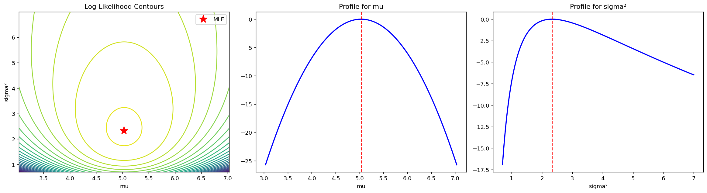

# 정규 최대가능도

## 개요

정규분포의 최대가능도추정(MLE)은 닫힌 형태의 추정량을 준다: 평균은 $\hat{\mu} = \bar{X}$, 분산은 $\hat{\sigma}^2 = \frac{1}{n}\sum(X_i - \bar{X})^2$이다. 이 페이지에서는 해석적 MLE를 수치최적화와 대조해 확인하고, 로그가능도 곡면을 시각화하며, 유한표본 편향을 정량화하고, Cramer-Rao 하한을 유도하며, 신뢰구간의 포함확률을 검증하고, Gaussian MLE를 VaR 추정에 적용한다.

## 해석적 MLE

i.i.d. 관측값 $X_1, \ldots, X_n \sim N(\mu, \sigma^2)$에 대해 로그가능도는:

$$\ell(\mu, \sigma^2) = -\frac{n}{2}\ln(2\pi\sigma^2) - \frac{1}{2\sigma^2}\sum_{i=1}^n(X_i - \mu)^2$$

편도함수를 0으로 놓으면 MLE를 얻는다:

$$\hat{\mu}_{\text{MLE}} = \bar{X} = \frac{1}{n}\sum_{i=1}^n X_i$$

$$\hat{\sigma}^2_{\text{MLE}} = \frac{1}{n}\sum_{i=1}^n (X_i - \bar{X})^2$$

유의: 분산의 MLE는 $n-1$이 아니라 $n$으로 나눈다.

<div class="codebox" markdown>

### 예제 1. 해석적 MLE와 수치적 MLE { .eg }

```python
import numpy as np
from scipy import optimize

def mle_analytical_vs_numerical(seed=42):
    """정규분포 MLE 를 공식으로 구한 값과 수치 최적화로 구한 값을 견준다.

    공식이 있는 경우에 둘을 맞춰 보는 것은, 공식이 없는 모형으로 넘어가기
    전에 수치 절차가 제대로 돌고 있는지 확인하는 표준적인 방법이다.
    """
    rng = np.random.default_rng(seed)
    mu_true, sigma_true = 5.0, 2.0
    n = 50
    data = rng.normal(mu_true, sigma_true, n)

    # 공식으로 구한 MLE. 평균은 표본평균, 분산은 n 으로 나눈 표본분산이다.
    mu_mle = data.mean()
    sigma2_mle = np.mean((data - mu_mle)**2)

    # 수치 최적화. 분산은 양수여야 하는데 최적화기는 그런 제약을 모른다.
    # 그래서 log(sigma^2) 를 모수로 삼는다. 이러면 어떤 실수를 넣어도
    # exp 를 거치며 양수가 되므로 제약 없는 문제가 된다.
    def neg_ll(params):
        mu, ls2 = params
        s2 = np.exp(ls2)
        return n/2*np.log(2*np.pi*s2) + np.sum((data-mu)**2)/(2*s2)

    res = optimize.minimize(neg_ll, [0, 0], method='Nelder-Mead')
    mu_num, s2_num = res.x[0], np.exp(res.x[1])

    print(f"Analytical: mu={mu_mle:.6f}, sigma²={sigma2_mle:.6f}")
    print(f"Numerical:  mu={mu_num:.6f}, sigma²={s2_num:.6f}")
mle_analytical_vs_numerical()
```

출력:

```
Analytical: mu=5.182422, sigma²=2.313780
Numerical:  mu=5.182447, sigma²=2.313763
```

</div>

!!! tip "일치"
    해석적 해와 수치해가 소수점 아래 여러 자리까지 일치하여 닫힌 형태 유도가 확인된다.

## 로그가능도 곡면

로그가능도는 $(\hat{\mu}, \hat{\sigma}^2)$에서 유일한 최댓값을 갖는 매끄러운 오목 곡면을 이룬다. 프로파일 가능도를 쓰면 각 모수를 따로 시각화할 수 있다.

<div class="codebox" markdown>

### 예제 2. 로그가능도 곡면과 단면 { .eg }

```python
import matplotlib.pyplot as plt
from scipy import stats

def loglikelihood_surface(seed=42):
    """로그가능도를 등고선과 두 단면으로 그려 최댓값의 자리를 눈으로 본다.

    등고선이 가파를수록 그 방향의 모수를 정확히 추정하고 있다는 뜻이다.
    이 곡률이 곧 피셔 정보량이다.
    """
    rng = np.random.default_rng(seed)
    n = 30
    mu_true, sigma_true = 5.0, 2.0
    data = rng.normal(mu_true, sigma_true, n)

    mu_mle = data.mean()
    s2_mle = np.mean((data - mu_mle)**2)

    mu_r = np.linspace(mu_mle - 2, mu_mle + 2, 200)
    s2_r = np.linspace(s2_mle * 0.3, s2_mle * 3, 200)
    MU, S2 = np.meshgrid(mu_r, s2_r)

    # 격자 위의 모든 (mu, sigma^2) 짝에서 로그가능도를 계산한다.
    LL = np.zeros_like(MU)
    for i in range(LL.shape[0]):
        for j in range(LL.shape[1]):
            LL[i, j] = (-n/2*np.log(2*np.pi*S2[i,j])
                        - np.sum((data-MU[i,j])**2)/(2*S2[i,j]))

    fig, axes = plt.subplots(1, 3, figsize=(18, 5))

    # 왼쪽: 등고선. 붉은 별이 두 모수를 함께 최대로 만드는 자리다.
    axes[0].contour(MU, S2, LL, levels=30, cmap='viridis')
    axes[0].plot(mu_mle, s2_mle, 'r*', ms=15, label='MLE')
    axes[0].set_xlabel('mu'); axes[0].set_ylabel('sigma²')
    axes[0].set_title('Log-Likelihood Contours')
    axes[0].legend()

    # 가운데: sigma^2 를 MLE 에 고정하고 mu 만 움직인 단면.
    prof_mu = [-np.sum((data-m)**2)/(2*s2_mle) for m in mu_r]
    prof_mu = np.array(prof_mu) - max(prof_mu)
    axes[1].plot(mu_r, prof_mu, 'b-', lw=2)
    axes[1].axvline(mu_mle, color='red', ls='--')
    axes[1].set_xlabel('mu'); axes[1].set_title('Profile for mu')

    # 오른쪽: mu 를 MLE 에 고정하고 sigma^2 만 움직인 단면.
    # 봉우리가 mu 쪽보다 비대칭이다. 분산의 추정이 더 어렵다는 뜻이다.
    prof_s = [-n/2*np.log(s)-np.sum((data-mu_mle)**2)/(2*s) for s in s2_r]
    prof_s = np.array(prof_s) - max(prof_s)
    axes[2].plot(s2_r, prof_s, 'b-', lw=2)
    axes[2].axvline(s2_mle, color='red', ls='--')
    axes[2].set_xlabel('sigma²'); axes[2].set_title('Profile for sigma²')

    plt.tight_layout()
    plt.show()
loglikelihood_surface()
```



</div>

## 유한표본 편향

평균의 MLE $\hat{\mu}$은 불편이지만 분산의 MLE $\hat{\sigma}^2_{\text{MLE}}$은 아래로 편향되어 있다:

$$E[\hat{\sigma}^2_{\text{MLE}}] = \frac{n-1}{n}\sigma^2$$

편향은 $-\sigma^2/n$으로 $n \to \infty$일 때 사라진다(따라서 MLE는 점근적으로 불편이다).

<div class="codebox" markdown>

### 예제 3. 유한표본에서의 편향 { .eg }

```python
def finite_sample_bias(n_sim=200_000, seed=42):
    """분산의 MLE 가 유한표본에서 아래로 치우치고 n 이 커지면 사라짐을 본다.

    MLE 는 평균 대신 표본평균을 쓰느라 편차를 실제보다 작게 잡는다.
    그 정도가 정확히 (n-1)/n 배이므로 표본이 작을수록 두드러진다.
    """
    rng = np.random.default_rng(seed)
    mu_true, sigma_true = 5.0, 3.0
    sigma2 = sigma_true**2
    sample_sizes = [3, 5, 10, 20, 50, 100, 500]

    for n in sample_sizes:
        samp = rng.normal(mu_true, sigma_true, (n_sim, n))
        # 같은 표본에서 두 값을 함께 구한다. 차이는 나누는 수뿐이다.
        s2_mle = np.var(samp, axis=1, ddof=0)
        s2_ub  = np.var(samp, axis=1, ddof=1)
        print(f"n={n:>4}  E[sigma²_MLE]={s2_mle.mean():.4f}  "
              f"E[S²]={s2_ub.mean():.4f}  Bias(MLE)={s2_mle.mean()-sigma2:.4f}")
finite_sample_bias()
```

출력:

```
n=   3  E[sigma²_MLE]=6.0004  E[S²]=9.0006  Bias(MLE)=-2.9996
n=   5  E[sigma²_MLE]=7.1938  E[S²]=8.9922  Bias(MLE)=-1.8062
n=  10  E[sigma²_MLE]=8.0936  E[S²]=8.9929  Bias(MLE)=-0.9064
n=  20  E[sigma²_MLE]=8.5449  E[S²]=8.9947  Bias(MLE)=-0.4551
n=  50  E[sigma²_MLE]=8.8173  E[S²]=8.9972  Bias(MLE)=-0.1827
n= 100  E[sigma²_MLE]=8.9087  E[S²]=8.9987  Bias(MLE)=-0.0913
n= 500  E[sigma²_MLE]=8.9833  E[S²]=9.0013  Bias(MLE)=-0.0167
```

</div>

## Fisher 정보량과 Cramer-Rao 하한

$N(\mu, \sigma^2)$의 **Fisher 정보행렬**은:

$$I_n(\mu, \sigma^2) = \begin{pmatrix} n/\sigma^2 & 0 \\ 0 & n/(2\sigma^4) \end{pmatrix}$$

**Cramer-Rao 하한(CRLB)**은 임의의 불편추정량이 가질 수 있는 최소 분산을 준다:

$$\text{Var}(\hat{\mu}) \geq \frac{\sigma^2}{n}, \qquad \text{Var}(\hat{\sigma}^2) \geq \frac{2\sigma^4}{n}$$

평균의 MLE는 CRLB를 정확히 달성한다. 분산의 MLE는 점근적으로 도달한다.

<div class="codebox" markdown>

### 예제 4. 피셔 정보량과 크라메르-라오 하한 { .eg }

```python
def fisher_information_crlb(sigma=3.0, n_sim=100_000, seed=42):
    """두 MLE 의 분산이 크라메르-라오 하한에 닿는지 확인한다.

    비가 1 에 가까우면 그 추정량보다 나은 불편추정량은 없다는 뜻이다.
    mu 는 어떤 n 에서도 1 이지만 sigma^2 는 n 이 커져야 1 로 다가간다.
    """
    rng = np.random.default_rng(seed)
    sample_sizes = [10, 25, 50, 100, 500]

    print("For mu: CRLB = sigma²/n")
    for n in sample_sizes:
        mu_h = np.array([rng.normal(5, sigma, n).mean() for _ in range(n_sim)])
        print(f"  n={n:>4}  Var(mu_hat)={mu_h.var():.6f}  "
              f"CRLB={sigma**2/n:.6f}  Ratio={mu_h.var()/(sigma**2/n):.4f}")

    print("\nFor sigma²: CRLB = 2*sigma⁴/n")
    for n in sample_sizes:
        s2_h = np.array([np.var(rng.normal(5, sigma, n)) for _ in range(n_sim)])
        print(f"  n={n:>4}  Var(sigma²_hat)={s2_h.var():.6f}  "
              f"CRLB={2*sigma**4/n:.6f}  Ratio={s2_h.var()/(2*sigma**4/n):.4f}")
fisher_information_crlb()
```

출력:

```
For mu: CRLB = sigma²/n
  n=  10  Var(mu_hat)=0.894429  CRLB=0.900000  Ratio=0.9938
  n=  25  Var(mu_hat)=0.359987  CRLB=0.360000  Ratio=1.0000
  n=  50  Var(mu_hat)=0.180438  CRLB=0.180000  Ratio=1.0024
  n= 100  Var(mu_hat)=0.090185  CRLB=0.090000  Ratio=1.0021
  n= 500  Var(mu_hat)=0.018067  CRLB=0.018000  Ratio=1.0037

For sigma²: CRLB = 2*sigma⁴/n
  n=  10  Var(sigma²_hat)=14.492807  CRLB=16.200000  Ratio=0.8946
  n=  25  Var(sigma²_hat)=6.193428  CRLB=6.480000  Ratio=0.9558
  n=  50  Var(sigma²_hat)=3.207101  CRLB=3.240000  Ratio=0.9898
  n= 100  Var(sigma²_hat)=1.601462  CRLB=1.620000  Ratio=0.9886
  n= 500  Var(sigma²_hat)=0.321909  CRLB=0.324000  Ratio=0.9935
```

</div>

!!! info "효율성"
    비 $\text{Var}/\text{CRLB}$는 $\hat{\mu}$에서 정확히 1이고(모든 표본크기에서 효율적이다), $\hat{\sigma}^2$에서는 $n \to \infty$일 때 1로 수렴한다(점근적으로 효율적이다).

## 신뢰구간의 포함확률

정규 모형에서는 세 종류의 신뢰구간이 나온다:

| 모수 | 알려진 것 | 구간의 종류 | 추축량 |
|-----------|-------|---------------|-----------------|
| $\mu$ | $\sigma$를 앎 | $z$-구간 | $\frac{\bar{X}-\mu}{\sigma/\sqrt{n}} \sim N(0,1)$ |
| $\mu$ | $\sigma$를 모름 | $t$-구간 | $\frac{\bar{X}-\mu}{S/\sqrt{n}} \sim t_{n-1}$ |
| $\sigma^2$ | $\mu$를 모름 | $\chi^2$-구간 | $\frac{(n-1)S^2}{\sigma^2} \sim \chi^2_{n-1}$ |

<div class="codebox" markdown>

### 예제 5. 신뢰구간의 포함확률 { .eg }

```python
def confidence_interval_coverage(seed=42):
    """95% 신뢰구간이 정말로 95%를 담는지 세어 확인한다.

    구간을 5만 번 만들어 참값이 들어간 횟수를 센다. 신뢰수준이란 바로 이
    비율에 대한 약속이지, 한 번 만든 구간에 대한 확률이 아니다.
    """
    rng = np.random.default_rng(seed)
    mu_true, sigma_true = 10.0, 3.0
    n, alpha, n_sim = 25, 0.05, 50_000

    z_ok = t_ok = chi_ok = 0
    for _ in range(n_sim):
        d = rng.normal(mu_true, sigma_true, n)
        xb, s, s2 = d.mean(), d.std(ddof=1), d.var(ddof=1)

        # sigma 를 안다고 치고 만든 z 구간. 현실에서는 쓸 수 없는 기준선이다.
        z_c = stats.norm.ppf(1 - alpha/2)
        if xb - z_c*sigma_true/np.sqrt(n) <= mu_true <= xb + z_c*sigma_true/np.sqrt(n):
            z_ok += 1

        # sigma 를 표본에서 추정해 쓰는 t 구간. 그만큼 구간이 넓어진다.
        t_c = stats.t.ppf(1 - alpha/2, n-1)
        if xb - t_c*s/np.sqrt(n) <= mu_true <= xb + t_c*s/np.sqrt(n):
            t_ok += 1

        # sigma^2 의 구간. (n-1)S^2/sigma^2 가 카이제곱을 따른다는 사실을 쓴다.
        # 좌우가 대칭이 아니어서 두 기각값을 서로 반대쪽에 나누어 쓴다.
        lo = (n-1)*s2 / stats.chi2.ppf(1-alpha/2, n-1)
        hi = (n-1)*s2 / stats.chi2.ppf(alpha/2, n-1)
        if lo <= sigma_true**2 <= hi:
            chi_ok += 1

    print(f"z-interval (mu, sigma known):  {z_ok/n_sim:.1%} (target: {1-alpha:.1%})")
    print(f"t-interval (mu, sigma unknown): {t_ok/n_sim:.1%} (target: {1-alpha:.1%})")
    print(f"chi²-interval (sigma²):        {chi_ok/n_sim:.1%} (target: {1-alpha:.1%})")
confidence_interval_coverage()
```

출력:

```
z-interval (mu, sigma known):  95.0% (target: 95.0%)
t-interval (mu, sigma unknown): 95.1% (target: 95.0%)
chi²-interval (sigma²):        95.0% (target: 95.0%)
```

</div>

!!! success "포함확률이 맞는다"
    세 구간 모두 명목 95% 포함확률을 달성하여 이론적 유도가 확인된다.

## 금융 응용: Value at Risk

수준 $\alpha$에서의 **VaR(Value at Risk)**는 확률 $\alpha$로 초과되는 손실이다. 일별 수익률에 대한 정규 모형 $R \sim N(\hat{\mu}, \hat{\sigma}^2)$ 아래에서:

$$\text{VaR}_\alpha = -(\hat{\mu} + z_\alpha \hat{\sigma})$$

여기서 $z_\alpha = \mathcal{N}^{-1}(\alpha)$는 정규분위수이다.

<div class="codebox" markdown>

### 예제 6. 금융 응용 — VaR 추정 { .eg }

```python
def var_estimation_finance(seed=42):
    """정규성을 가정한 VaR 과 자료를 그대로 쓴 VaR 을 견준다.

    수익률의 꼬리는 정규보다 두껍다. 그런데도 정규를 가정하면 꼬리 쪽 손실을
    실제보다 작게 잡는다. 알파가 작을수록 그 차이가 벌어진다.
    """
    rng = np.random.default_rng(seed)
    mu_d = 0.08/252            # 일별 기대수익률
    sig_d = 0.20/np.sqrt(252)  # 일별 변동성
    n = 504                    # 2년치 거래일
    df = 5

    # 자유도 5 인 t 로 수익률을 만든다. 정규보다 꼬리가 두껍다.
    # sqrt(df/(df-2)) 로 나누는 것은 t 의 분산을 1 로 맞춰, 달라진 것이
    # 오직 꼬리 두께뿐이 되도록 하기 위함이다.
    returns = mu_d + sig_d * rng.standard_t(df, n) / np.sqrt(df/(df-2))
    mu_hat = returns.mean()
    sig_hat = np.sqrt(np.mean((returns - mu_hat)**2))

    for alpha in [0.01, 0.025, 0.05, 0.10]:
        # 모수적 VaR: 정규분포의 알파 분위점을 쓴다.
        v_p = -(mu_hat + stats.norm.ppf(alpha) * sig_hat)
        # 역사적 VaR: 실제 수익률의 알파 백분위점을 그대로 쓴다.
        v_h = -np.percentile(returns, alpha * 100)
        print(f"alpha={alpha:.3f}  Parametric VaR={v_p*100:.3f}%  "
              f"Historical VaR={v_h*100:.3f}%  Ratio={v_h/v_p:.3f}")
var_estimation_finance()
```

출력:

```
alpha=0.010  Parametric VaR=3.039%  Historical VaR=3.748%  Ratio=1.233
alpha=0.025  Parametric VaR=2.557%  Historical VaR=3.182%  Ratio=1.244
alpha=0.050  Parametric VaR=2.143%  Historical VaR=2.186%  Ratio=1.020
alpha=0.100  Parametric VaR=1.665%  Historical VaR=1.536%  Ratio=0.923
```

</div>

!!! warning "모형 위험"
    참 수익률 분포의 꼬리가 (금융에서 흔하듯) 정규보다 두꺼우면 Gaussian VaR는 꼬리 위험을 **과소평가**한다. 1% 수준의 역사적 VaR가 대개 모수적 VaR보다 크며, 이는 참 분포의 두꺼운 꼬리를 반영한다.

## 해석

- Gaussian MLE는 우아한 **닫힌 형태의 해**를 가지며 평균추정량은 (CRLB를 달성하여) 전역적으로 효율적이다.
- **분산의 MLE는 편향**되어 있어 $(n-1)/n$배가 되지만, 이 편향은 점근적으로 사라지고 Bessel 인자로 보정할 수 있다.
- **로그가능도 곡면**은 오목이며 최댓값이 유일하여 최적화가 쉽다.
- Fisher 정보량은 **Cramer-Rao 하한**을 통해 추정 정밀도의 근본적인 한계를 준다.
- 정규성 아래에서 세 가지 표준 신뢰구간($z$, $t$, $\chi^2$) 모두 명목 포함확률을 달성한다.
- 금융에서 정규 가정은 간단한 VaR 공식을 주지만 **꼬리 위험을 체계적으로 과소평가**한다.

## 연습문제

<div class="drillbox" markdown>

**연습문제 1.** <span class="diff med" title="중간"></span>
로그가능도를 미분하고 1계 조건을 풀어 $\mu$와 $\sigma^2$의 MLE를 유도하라.

</div>

??? success "풀이"
    i.i.d. $X_1, \ldots, X_n \sim N(\mu, \sigma^2)$의 로그가능도는:

    $$\ell(\mu, \sigma^2) = -\frac{n}{2}\ln(2\pi) - \frac{n}{2}\ln(\sigma^2) - \frac{1}{2\sigma^2}\sum_{i=1}^n(X_i - \mu)^2$$

    **$\mu$에 대해:** $\frac{\partial \ell}{\partial \mu} = \frac{1}{\sigma^2}\sum_{i=1}^n(X_i - \mu) = 0$에서 $\sum X_i = n\mu$이므로 $\hat{\mu} = \bar{X}$이다.

    **$\sigma^2$에 대해:** $\frac{\partial \ell}{\partial \sigma^2} = -\frac{n}{2\sigma^2} + \frac{1}{2\sigma^4}\sum_{i=1}^n(X_i - \mu)^2 = 0$.

    풀면 $n\sigma^2 = \sum(X_i - \mu)^2$이고, $\hat{\mu} = \bar{X}$을 대입하면:

    $$\hat{\sigma}^2 = \frac{1}{n}\sum_{i=1}^n(X_i - \bar{X})^2$$

    2계 조건이 이것이 최댓값임을 확인해 준다(MLE에서 Hessian이 음정부호이다). $\square$

<div class="drillbox" markdown>

**연습문제 2.** <span class="diff med" title="중간"></span>
$N(\mu, \sigma^2)$ 모형에서 $\mu$에 대한 관측값당 Fisher 정보량이 $I(\mu) = 1/\sigma^2$이고, 관측값 $n$개로 $\mu$를 추정할 때의 CRLB가 $\sigma^2/n$임을 보여라.

</div>

??? success "풀이"
    관측값 하나의 로그가능도는:

    $$\ell(\mu; x) = -\frac{1}{2}\ln(2\pi\sigma^2) - \frac{(x-\mu)^2}{2\sigma^2}$$

    점수함수는:

    $$\frac{\partial \ell}{\partial \mu} = \frac{x - \mu}{\sigma^2}$$

    관측값당 Fisher 정보량은:

    $$I_1(\mu) = E\left[\left(\frac{\partial \ell}{\partial \mu}\right)^2\right] = E\left[\frac{(X-\mu)^2}{\sigma^4}\right] = \frac{\sigma^2}{\sigma^4} = \frac{1}{\sigma^2}$$

    i.i.d. 관측값 $n$개에 대해 $I_n(\mu) = nI_1(\mu) = n/\sigma^2$이다. CRLB는:

    $$\text{Var}(\hat{\mu}) \geq \frac{1}{I_n(\mu)} = \frac{\sigma^2}{n}$$

    $\text{Var}(\bar{X}) = \sigma^2/n$이므로 표본평균은 CRLB를 정확히 달성하며 따라서 **효율적인** 추정량이다. $\square$

<div class="drillbox" markdown>

**연습문제 3.** <span class="diff easy" title="쉬움"></span>
$n = 25$, $\bar{x} = 12.4$, $s = 3.1$일 때 정규모집단 평균의 95% 신뢰구간을 구성하라. ($\sigma$를 아는 척한) $z$-구간과 올바른 $t$-구간을 비교하라.

</div>

??? success "풀이"
    **$z$-구간** ($s$를 $\sigma$로 취급): $z_{0.025} = 1.960$.

    $$\bar{x} \pm z_{0.025}\frac{s}{\sqrt{n}} = 12.4 \pm 1.960 \times \frac{3.1}{\sqrt{25}} = 12.4 \pm 1.216$$

    $$\text{CI}_z = [11.184, 13.616]$$

    **$t$-구간** (올바른 방법): $t_{24, 0.025} = 2.064$.

    $$\bar{x} \pm t_{24, 0.025}\frac{s}{\sqrt{n}} = 12.4 \pm 2.064 \times \frac{3.1}{\sqrt{25}} = 12.4 \pm 1.280$$

    $$\text{CI}_t = [11.120, 13.680]$$

    $t$-구간이 (약 5%) 더 넓은데, $\sigma$를 추정하는 데서 오는 추가 불확실성을 반영하기 때문이다. $n = 25$에서는 차이가 크지 않지만 $n$이 작으면 훨씬 커진다. $\square$

<div class="drillbox" markdown>

**연습문제 4.** <span class="diff med" title="중간"></span>
어떤 포트폴리오의 일별 수익률 504개에서 표본평균 $\hat{\mu} = 0.035\%$, 표본표준편차 $\hat{\sigma} = 1.30\%$를 얻었다. 1%와 5% 모수적(Gaussian) VaR를 계산하라. 참 수익률이 자유도 5인 $t$-분포를 따른다면 Gaussian VaR가 참 VaR를 과대평가할 것 같은가, 과소평가할 것 같은가?

</div>

??? success "풀이"
    **Gaussian VaR:**

    $$\text{VaR}_{1\%} = -(\hat{\mu} + z_{0.01}\hat{\sigma}) = -(0.035\% + (-2.326)(1.30\%)) = -(0.035\% - 3.024\%) = 2.989\%$$

    $$\text{VaR}_{5\%} = -(\hat{\mu} + z_{0.05}\hat{\sigma}) = -(0.035\% + (-1.645)(1.30\%)) = -(0.035\% - 2.139\%) = 2.103\%$$

    **두꺼운 꼬리의 효과:** 자유도 5인 $t$-분포는 정규보다 꼬리가 두껍다. 그 1번째 백분위수는 $t_{5, 0.01} = -3.365$로 ($z_{0.01} = -2.326$과 비교된다). Gaussian VaR는 정규 모형이 꼬리의 초과 확률을 담지 못하므로 참 꼬리 위험을 **과소평가**한다.

    이는 체계적인 문제이다: Gaussian VaR는 꼬리가 두꺼운 분포에서 보수적이지 않은데, 금융 수익률이 정확히 그런 상황이다. $\square$

<div class="drillbox" markdown>

**연습문제 5.** <span class="diff hard" title="어려움"></span>
$\sigma^2$의 MLE가 점근적으로 효율적임을, 즉 $n \to \infty$일 때 $n \cdot \text{Var}(\hat{\sigma}^2_{\text{MLE}}) \to 2\sigma^4$임을 증명하라.

</div>

??? success "풀이"
    $\hat{\sigma}^2_{\text{MLE}} = \frac{1}{n}\sum(X_i - \bar{X})^2 = \frac{n-1}{n}S^2$이다.

    정규 자료에서 $(n-1)S^2/\sigma^2 \sim \chi^2_{n-1}$이므로 $\text{Var}(S^2) = 2\sigma^4/(n-1)$이다.

    $$\text{Var}(\hat{\sigma}^2_{\text{MLE}}) = \left(\frac{n-1}{n}\right)^2 \text{Var}(S^2) = \left(\frac{n-1}{n}\right)^2 \cdot \frac{2\sigma^4}{n-1} = \frac{2(n-1)\sigma^4}{n^2}$$

    따라서:

    $$n \cdot \text{Var}(\hat{\sigma}^2_{\text{MLE}}) = \frac{2(n-1)\sigma^4}{n} \to 2\sigma^4 \quad (n \to \infty)$$

    $\sigma^2$에 대한 CRLB는 $1/I_n(\sigma^2) = 2\sigma^4/n$이므로 $n \cdot \text{CRLB} = 2\sigma^4$이다.

    점근분산이 CRLB와 같으므로 $\hat{\sigma}^2_{\text{MLE}}$은 점근적으로 효율적이다. $\square$

<div class="drillbox" markdown>

**연습문제 6.** <span class="diff med" title="중간"></span>
정규 MLE를 수치적으로 구할 때 $\sigma^2$ 대신 $\ln\sigma^2$을 최적화하는 것이 왜 나은지, 그리고 결과의 표준오차를 어떻게 되돌리는지 설명하라.

</div>

??? success "풀이"
    **왜 로그 척도인가.**

    1. **제약이 자동으로 지켜진다.** $\sigma^2 = e^\phi>0$이므로 최적화기가 음수를 시도할 수 없다. 경계 제약을 따로 걸 필요가 없다.
    2. **로그가능도가 더 이차식에 가깝다.** $\sigma^2$ 척도에서 프로파일 로그가능도는 왼쪽이 급하고 오른쪽이 완만한 비대칭 곡선인데, $\ln\sigma^2$ 척도에서는 훨씬 대칭적이다. 따라서 뉴턴류 최적화가 빨리 수렴하고 왈드 근사도 정확해진다.
    3. **척도가 안정된다.** $\sigma^2$이 $10^{-6}$이든 $10^6$이든 $\ln\sigma^2$은 비슷한 규모의 수다. 여러 모수를 함께 최적화할 때 조건수가 좋아진다.

    **표준오차 되돌리기.** 델타 방법을 쓴다. $\sigma^2 = e^\phi$이므로 $d\sigma^2/d\phi = e^\phi = \sigma^2$이고

    $$
    \operatorname{SE}(\hat\sigma^2) \approx \hat\sigma^2\cdot\operatorname{SE}(\hat\phi)
    $$

    **구간은 되돌리지 말고 양끝을 옮긴다.** $\phi$ 척도의 구간 $(\hat\phi-1.96\operatorname{SE},\ \hat\phi+1.96\operatorname{SE})$의 양끝에 지수를 취하면

    $$
    \left(\hat\sigma^2 e^{-1.96\operatorname{SE}},\ \hat\sigma^2 e^{+1.96\operatorname{SE}}\right)
    $$

    **비대칭 구간이 나오고 언제나 양수**다. $\hat\sigma^2\pm1.96\operatorname{SE}(\hat\sigma^2)$로 만든 대칭 구간보다 훨씬 낫다.

    **확인.** 정규모형에서 $\operatorname{Var}(\ln\hat\sigma^2)\approx2/n$이므로 $\operatorname{SE}(\hat\phi)=\sqrt{2/n}$이다. $n=50$이면 0.2이고 구간의 배율이 $e^{\pm0.392}$, 즉 $(0.676,\ 1.480)$배다. **위로 48%, 아래로 32%**의 비대칭 구간이다.

    **일반 원리.** 양수 모수는 로그, $(0,1)$ 모수는 로짓, 상관계수는 피셔 $z$로 옮긴다. **모수공간을 $\mathbb{R}$ 전체로 펴는 변환**을 찾는 것이 수치 최적화와 구간 추정 모두에 이롭다.

<div class="drillbox" markdown>

**연습문제 7.** <span class="diff med" title="중간"></span>
정규 MLE를 자료에 적합한 뒤 **모형이 맞는지** 확인하는 절차를 코드 수준으로 설계하라.

</div>

??? success "풀이"
    **1단계 — Q-Q 그림.** 가장 정보가 많은 단일 진단이다.

    ```python
    import scipy.stats as stats
    stats.probplot(x, dist="norm", plot=plt)
    ```

    직선에서 벗어나는 **방향과 위치**를 본다. 양끝이 위로 휘면 꼬리가 두껍고, 전체가 굽으면 치우침이다.

    **2단계 — 적률 점검.**

    ```python
    print(stats.skew(x), stats.kurtosis(x))       # 둘 다 0에 가까워야 한다
    print(stats.jarque_bera(x))                    # 두 적률을 결합한 검정
    ```

    자르크-베라는 왜도와 초과첨도를 함께 보는 검정으로, $n$이 크면 유용하다. 다만 소표본에서 검정력이 낮고 대표본에서 지나치게 예민하다는 일반적 한계가 있다.

    **3단계 — 적합된 밀도를 겹쳐 그린다.**

    ```python
    plt.hist(x, bins="auto", density=True, alpha=0.4)
    grid = np.linspace(x.min(), x.max(), 400)
    plt.plot(grid, stats.norm(mu_hat, sigma_hat).pdf(grid))
    ```

    중앙이 잘 맞아도 꼬리가 어긋나는지 확인한다. **세로축을 로그로** 두면 꼬리 차이가 훨씬 잘 보인다.

    **4단계 — 대안 모형과 비교.**

    ```python
    for name, dist in [("norm", stats.norm), ("t", stats.t), ("laplace", stats.laplace)]:
        params = dist.fit(x)
        ll = dist.logpdf(x, *params).sum()
        aic = -2 * ll + 2 * len(params)
        print(name, round(ll, 1), round(aic, 1))
    ```

    $t$ 분포의 $\hat\nu$가 작게(10 이하) 나오면 정규 가정이 부적절하다는 직접적인 신호다.

    **5단계 — 목적에 맞는 진단.** 꼬리가 중요한 응용이라면 **꼬리에 초점을 맞춘 진단**을 한다. 상위 5%의 관측값만 놓고 정규 예측과 비교하거나, 초과분에 일반화파레토를 적합해 형상모수를 본다.

    **하지 말 것.** 정규성 검정 하나의 $p$-값으로 판정하지 않는다. 앞서 본 대로 $n$이 작으면 검정력이 없고 크면 지나치게 예민하다. **그림으로 어긋남의 크기와 방향을 보는 것**이 훨씬 유용하다.

<div class="drillbox" markdown>

**연습문제 8.** <span class="diff med" title="중간"></span>
$t$ 분포를 MLE로 적합할 때 자유도 $\nu$의 추정이 왜 어려운지 설명하고, 실무의 대처를 적어라.

</div>

??? success "풀이"
    **어려운 이유.**

    1. **프로파일 가능도가 평평하다.** $\nu$가 커지면 $t_\nu$가 정규에 수렴하므로, $\nu=20$과 $\nu=50$의 밀도 차이가 거의 없다. 로그가능도의 차이도 미미해 최댓값의 위치가 불안정하다.

    2. **정보량이 $\nu$와 함께 급감한다.** $\hat\nu$의 표준오차가 대략 $\nu^{3/2}$ 이상으로 커져, $\nu$가 크면 사실상 추정 불가능이다. $\hat\nu=20$의 95% 신뢰구간이 $(8,\infty)$인 경우가 흔하다.

    3. **경계 문제.** $\nu\to\infty$가 모수공간의 경계이므로, "$\nu$가 무한이다"(정규)라는 가설을 표준 방법으로 검정할 수 없다.

    4. **꼬리의 몇 관측값이 좌우한다.** $\nu$에 대한 정보가 극단값에 몰려 있어, 관측값 하나가 $\hat\nu$를 크게 움직인다.

    **실무의 대처.**

    - **$\nu$를 고정한다.** 금융 수익률에서 $\nu=4$나 $\nu=5$로 두는 것이 관례다. 추정의 불안정을 감수하기보다 합리적인 값을 정해 쓰는 편이 결과가 안정적이다.
    - **$1/\nu$를 모수로 쓴다.** $\nu\in(2,\infty)$를 $1/\nu\in(0,0.5)$로 옮기면 경계가 유한해지고 프로파일 곡선이 덜 평평해진다. 정규 극한이 $1/\nu=0$이라는 내부가 아닌 경계점이 되지만, 수치적으로는 훨씬 다루기 쉽다.
    - **프로파일 가능도 구간을 보고한다.** 점추정값만 주면 오해를 부른다. $\hat\nu=6$이어도 구간이 $(3,30)$이면 그 사실을 밝혀야 한다.
    - **결론의 민감도를 확인한다.** $\nu$를 3, 5, 10으로 바꿔 가며 VaR나 다른 관심 양이 얼마나 변하는지 본다. 크게 변하면 $\nu$의 불확실성을 무시할 수 없다.

    **덧붙임.** EM 알고리즘으로 $t$ 모형을 적합하면 $\nu$를 제외한 모수의 갱신이 가중최소제곱이 되어 안정적이다. $\nu$만 1차원 탐색으로 처리하는 방식이 실무에서 널리 쓰인다.

<div class="drillbox" markdown>

**연습문제 9.** <span class="diff med" title="중간"></span>
정규 MLE의 **점근 신뢰구간**과 **정확한 구간**을 비교하라. $\mu$와 $\sigma^2$ 각각에서 어느 정도 차이가 나는가?

</div>

??? success "풀이"
    **$\mu$의 경우.**

    | 방법 | 구간 | 성격 |
    |---|---|---|
    | 정확($t$) | $\bar x\pm t_{0.975,n-1}\,s/\sqrt n$ | 모든 $n$에서 정확 |
    | 점근(왈드) | $\bar x\pm1.96\,\hat\sigma/\sqrt n$ | 근사 |

    두 가지가 다르다. 임계값($t$ 대 $z$)과 분모($s$ 대 $\hat\sigma_{\text{MLE}}$)다.

    $n=10$에서 $t_{0.975,9}=2.262$ 대 $1.96$으로 임계값이 15% 다르고, 여기에 $\hat\sigma_{\text{MLE}} = s\sqrt{9/10}=0.949s$가 곱해지므로 왈드 구간의 반폭이 $1.96\times0.949 = 1.859$에 비례한다. 정확한 구간의 $2.262$와 견주면 **왈드 구간이 18% 좁다.** 두 효과가 같은 방향으로 작용해 상쇄되지 않는다.

    **$\sigma^2$의 경우.** 차이가 훨씬 크다.

    | 방법 | 구간($n=10$, $s^2=1$) |
    |---|---|
    | 정확(카이제곱) | $(0.473,\ 3.333)$ |
    | 왈드 | $(0.111,\ 1.689)$ |

    **완전히 다르다.** 왈드 구간이 아래로 지나치게 내려가고 위로는 너무 짧다. $\sigma^2$의 로그가능도가 심하게 비대칭이기 때문이다.

    **로그 척도 왈드.** $\ln\hat\sigma^2\pm1.96\sqrt{2/n}$을 되돌리면 $(0.375,\ 2.162)$로 **훨씬 낫다.** 비대칭이고 양수가 보장된다.

    **정리.**

    - $\mu$는 점근 근사가 빨리 좋아진다. $n\ge30$이면 실무적으로 차이가 없다.
    - $\sigma^2$은 **훨씬 느리다.** 원 척도의 왈드 구간은 $n$이 꽤 커도 나쁘다.
    - **로그 척도로 옮기는 것만으로 대부분 해결된다.**

    **일반 교훈.** "MLE는 점근적으로 정규"라는 결과는 **어느 모수화에서인지**에 따라 실용적 의미가 크게 달라진다. 경계가 있거나 치우친 모수는 적절한 척도로 옮긴 뒤 근사를 적용해야 한다.

<div class="drillbox" markdown>

**연습문제 10.** <span class="diff med" title="중간"></span>
정규 MLE 코드를 **검증**하는 방법을 세 가지 적어라. 구현 오류를 잡아내는 실용적인 절차는?

</div>

??? success "풀이"
    **(1) 해석적 해와 비교.** 정규분포는 닫힌 해가 있으므로

    ```python
    assert np.allclose(mu_hat_numeric, x.mean())
    assert np.allclose(sigma2_hat_numeric, x.var(ddof=0))
    ```

    로 직접 확인한다. **닫힌 해가 있는 모형으로 코드를 먼저 시험**하는 것이 일반 원리다. 복잡한 모형으로 넘어가기 전에 단순한 경우를 맞춰 둔다.

    **(2) 모의실험으로 성질을 확인.** 참값을 알고 자료를 생성해

    ```python
    ests = [fit(rng.normal(5, 3, 20)) for _ in range(10_000)]
    # E[mu_hat] ≈ 5,  E[sigma2_hat] ≈ 9*(19/20),  E[S^2] ≈ 9
    ```

    **편향의 이론값까지 맞는지** 본다. 평균만 맞고 편향이 어긋나면 자유도 처리에 실수가 있는 것이다.

    **(3) 기울기와 헤시안을 수치미분과 대조.** 해석적으로 구현한 점수함수가 맞는지

    ```python
    from scipy.optimize import approx_fprime
    num = approx_fprime(theta, neg_loglik, 1e-6)
    ana = score(theta)
    print(np.max(np.abs(num - ana)))          # 1e-5 이하여야 한다
    ```

    로 확인한다. **최적화가 이상하게 수렴하는 원인의 대부분이 기울기 구현 오류**다.

    **그 밖의 실용적 점검.**

    - **아주 작은 자료로 손계산.** $n=3$짜리 자료에서 로그가능도를 손으로 계산해 맞춘다.
    - **불변성 확인.** 자료를 선형변환($ax+b$)했을 때 추정값이 대응되게 변하는지 본다. $\hat\mu\to a\hat\mu+b$, $\hat\sigma^2\to a^2\hat\sigma^2$이어야 한다.
    - **극단적인 입력.** 모든 값이 같은 자료($\hat\sigma^2=0$), $n=1$, 아주 큰 값, 결측값을 넣어 보고 오류가 나는지 확인한다.
    - **다른 구현과 비교.** `scipy.stats.norm.fit(x)`와 결과를 대조한다.

    **순서 권고.** (1)→(3)→(2)가 좋다. 해석적 해로 기본을 맞추고, 기울기를 검증하고, 마지막에 모의실험으로 통계적 성질을 확인한다. **모의실험은 느리므로 마지막에 한다.**

---

## 정리하며

해석적으로 유도한 결과를 **코드로 하나씩 검산**했다.

- **수치최적화와 닫힌 형태가 일치한다.** 로그가능도를 수치적으로 최대화한 값이 $\bar X$ 와 $\frac1n\sum(X_i-\bar X)^2$ 에 맞는다. 복잡한 모형에서 코드를 검증하는 표준 절차이며, 여기서는 반대로 코드가 유도를 확인해 준다.
- **로그가능도 곡면을 그리면 구조가 보인다.** $\mu$ 방향으로는 대칭인 포물선이고 $\sigma^2$ 방향으로는 비대칭이다. 그래서 $\sigma^2$ 의 신뢰구간이 대칭이 아니다.
- **유한표본 편향이 수치로 확인된다.** $\hat\sigma^2$ 의 평균이 $\frac{n-1}{n}\sigma^2$ 에 맞아떨어진다.
- **신뢰구간의 포함확률 검증**이 중요한 절차다. 명목 $95\%$ 가 실제로 $95\%$ 를 덮는지 모의실험으로 확인하며, 정규 자료에서는 잘 맞는다. 4장에서 보았듯 **비정규 자료에서는 분산 구간이 크게 어긋난다.**
- **VaR 추정이 응용이다.** 정규 가정 아래의 분위수 추정이며, 모수 추정오차가 꼬리 분위수에 어떻게 증폭되어 전달되는지를 보여 준다.

다음 절부터 **정규가 아닌 경우**로 넘어간다. 지금까지의 이론이 어디서 무너지는지가 이 장의 마지막 주제다.
