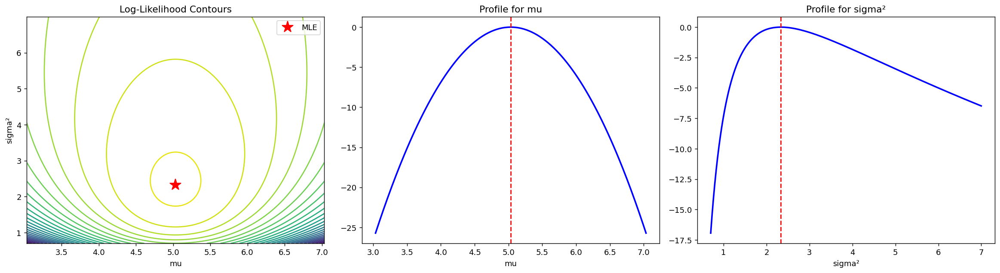

# 정규 최대가능도

## 개요

정규분포의 최대가능도추정(MLE)은 닫힌 형태의 추정량을 준다: 평균은 $\hat{\mu} = \bar{X}$, 분산은 $\hat{\sigma}^2 = \frac{1}{n}\sum(X_i - \bar{X})^2$이다. 이 페이지에서는 해석적 MLE를 수치최적화와 대조해 확인하고, 로그가능도 곡면을 시각화하며, 유한표본 편향을 정량화하고, Cramer-Rao 하한을 유도하며, 신뢰구간의 포함확률을 검증하고, Gaussian MLE를 VaR 추정에 적용한다.

## 해석적 MLE

i.i.d. 관측값 $X_1, \ldots, X_n \sim N(\mu, \sigma^2)$에 대해 로그가능도는:

$$\ell(\mu, \sigma^2) = -\frac{n}{2}\ln(2\pi\sigma^2) - \frac{1}{2\sigma^2}\sum_{i=1}^n(X_i - \mu)^2$$

편도함수를 0으로 놓으면 MLE를 얻는다:

$$\hat{\mu}_{\text{MLE}} = \bar{X} = \frac{1}{n}\sum_{i=1}^n X_i$$

$$\hat{\sigma}^2_{\text{MLE}} = \frac{1}{n}\sum_{i=1}^n (X_i - \bar{X})^2$$

유의: 분산의 MLE는 $n-1$이 아니라 $n$으로 나눈다.

<div class="exbox" markdown>

**보기 1.** <span class="diff easy" title="쉬움"></span> 해석적 MLE와 수치적 MLE. $N(5, 2^2)$에서 $n = 50$을 뽑아 공식으로 구한 MLE 와 넬더–미드 최적화로 구한 값을 견준다.

**(1)** 두 MLE 를 유도하고, 그 정류점이 **최대**임을 확인하시오. 분산이 $n-1$이 아니라 $n$으로 나뉘는 이유도 식에서 짚으시오.

**(2)** 두 답이 소수 **몇째 자리까지** 맞을 것으로 보아야 하는가. 출력의 어긋남이 그만큼인지 보시오.

</div>

??? success "풀이"

    **(1) 해석적으로.** 로그가능도는

    $$
    \ell(\mu, \sigma^2) = -\frac{n}{2}\ln(2\pi\sigma^2) - \frac{1}{2\sigma^2}\sum_i (x_i - \mu)^2
    $$

    이다. $\mu$로 먼저 미분한다.

    $$
    \frac{\partial \ell}{\partial \mu} = \frac{1}{\sigma^2}\sum_i (x_i - \mu) = 0
    \quad\Longrightarrow\quad
    \hat\mu = \bar x
    $$

    **$\sigma^2$이 약분되어 사라진다는 점이 중요하다.** $\hat\mu$는 $\sigma^2$을 모르는 채로도 정해지므로 두 모수를 한꺼번에 풀 필요가 없다. 또 $\partial^2\ell/\partial\mu^2 = -n/\sigma^2 < 0$이므로 이 정류점은 최대다.

    $\hat\mu$를 꽂아 넣고 $v = \sigma^2$으로 미분한다. $A = \sum_i (x_i - \bar x)^2$이라 두면

    $$
    \ell(v) = -\frac n2\ln v - \frac{A}{2v} + \text{상수},
    \qquad
    \frac{d\ell}{dv} = -\frac{n}{2v} + \frac{A}{2v^2} = 0
    \quad\Longrightarrow\quad
    \hat v = \frac{A}{n}
    $$

    다. **분모가 $n$인 까닭이 여기서 드러난다.** 미분식의 $-n/(2v)$는 밀도의 정규화상수 $(2\pi\sigma^2)^{-n/2}$에서 오고, 그 $n$이 그대로 답의 분모가 된다. 가능도는 "편차를 작게 보이게 하는 $v$"와 "정규화상수를 크게 하는 $v$"를 맞바꾸는데, 그 균형점이 $A/n$이지 $A/(n-1)$이 아니다. **불편성은 최대가능도가 겨냥하는 목표가 아니다.**

    최대임은 $d^2\ell/dv^2 = \dfrac{n}{2v^2} - \dfrac{A}{v^3}$을 $v = A/n$에서 재면 $-\dfrac{n^3}{2A^2} < 0$이라 확인된다. 경계도 안전하다. $v \to 0^+$에서 $-A/(2v) \to -\infty$이고 $v \to \infty$에서 $-\frac n2 \ln v \to -\infty$이므로 내부의 유일한 정류점이 전역최대다.

    **(2) 수치해는 허용오차만큼만 정확하다.** `scipy` 의 넬더–미드는 기본 수렴 기준이 $\texttt{xatol} = 10^{-4}$, $\texttt{fatol} = 10^{-4}$다. 곧 **모수 좌표에서 $10^{-4}$ 규모의 차이는 "같다"고 보고 멈춘다.** 그러니 두 답이 소수 넷째 자리에서 갈리리라 보아야 하고, 그보다 더 맞기를 바라서는 안 된다. 다섯째 자리 이하가 맞는다면 운이다.

    두 답을 맞춰 본다.

    ```python
    import numpy as np
    from scipy import optimize

    def mle_analytical_vs_numerical(seed=42):
        """정규분포 MLE 를 공식으로 구한 값과 수치 최적화로 구한 값을 견준다.

        공식이 있는 경우에 둘을 맞춰 보는 것은, 공식이 없는 모형으로 넘어가기
        전에 수치 절차가 제대로 돌고 있는지 확인하는 표준적인 방법이다.
        """
        rng = np.random.default_rng(seed)
        mu_true, sigma_true = 5.0, 2.0
        n = 50
        data = rng.normal(mu_true, sigma_true, n)

        # 공식으로 구한 MLE. 평균은 표본평균, 분산은 n 으로 나눈 표본분산이다.
        mu_mle = data.mean()
        sigma2_mle = np.mean((data - mu_mle)**2)

        # 수치 최적화. 분산은 양수여야 하는데 최적화기는 그런 제약을 모른다.
        # 그래서 log(sigma^2) 를 모수로 삼는다. 이러면 어떤 실수를 넣어도
        # exp 를 거치며 양수가 되므로 제약 없는 문제가 된다.
        def neg_ll(params):
            mu, ls2 = params
            s2 = np.exp(ls2)
            return n/2*np.log(2*np.pi*s2) + np.sum((data-mu)**2)/(2*s2)

        res = optimize.minimize(neg_ll, [0, 0], method='Nelder-Mead')
        mu_num, s2_num = res.x[0], np.exp(res.x[1])

        print(f"Analytical: mu={mu_mle:.6f}, sigma²={sigma2_mle:.6f}")
        print(f"Numerical:  mu={mu_num:.6f}, sigma²={s2_num:.6f}")
    mle_analytical_vs_numerical()
    ```

    출력:

    ```
    Analytical: mu=5.182422, sigma²=2.313780
    Numerical:  mu=5.182447, sigma²=2.313763
    ```

    **어긋남이 (2)가 말한 자리에 있다.**

    $$
    |\hat\mu_{\text{해석}} - \hat\mu_{\text{수치}}| = 2.5 \times 10^{-5},
    \qquad
    |\hat\sigma^2_{\text{해석}} - \hat\sigma^2_{\text{수치}}| = 1.7 \times 10^{-5}
    $$

    둘 다 넬더–미드의 허용오차 $10^{-4}$보다 작다. **여섯 자리를 찍어 놓았지만 믿을 수 있는 것은 넷째 자리까지**이고, 그 범위에서 두 답은 완전히 같다.

    **어느 쪽이 "참값"인가에는 답이 있다.** 해석적 해다. $\hat\mu = \bar x$와 $\hat\sigma^2 = A/n$은 유도된 등식이라 **반올림 말고는 오차가 없고**, 수치해는 격자도 아닌 단체(simplex)를 접어 가며 다가가다 허용오차에서 멈춘 근사다. [5.1절 보기 2](../../ch05/foundations/statistics_as_rv.md)에서 격자 탐색이 해석적 답을 한 칸 비껴갔던 것과 같은 이야기이며, **닫힌 꼴이 있으면 그것을 쓰는 것이 언제나 낫다.**

    그렇다면 왜 수치해를 함께 구하는가. **공식이 없는 모형으로 넘어가기 전에 절차를 시험하기 위해서다.** 답을 아는 문제에서 최적화기가 맞는 자리로 가는지 확인해 두면, 답을 모르는 문제에서 나온 수를 그만큼 믿을 수 있다.

    코드가 $\sigma^2$ 대신 $\ln\sigma^2$을 모수로 삼은 것도 같은 맥락이다. 최적화기는 $\sigma^2 > 0$이라는 제약을 모르므로 음수를 시도하다 $\ln$ 안에서 $\texttt{nan}$을 만들 수 있다. $v = e^{\ell}$로 바꾸면 **어떤 실수를 넣어도 양수가 되어** 제약 없는 문제가 된다. 최댓값의 자리는 일대일 변환에 바뀌지 않으므로 ($\hat v = e^{\hat\ell}$) 이것은 공짜로 얻는 안전장치다.

!!! tip "일치"
    해석적 해와 수치해가 소수점 아래 여러 자리까지 일치하여 닫힌 형태 유도가 확인된다.

## 로그가능도 곡면

로그가능도는 $(\hat{\mu}, \hat{\sigma}^2)$에서 유일한 최댓값을 갖는 매끄러운 오목 곡면을 이룬다. 프로파일 가능도를 쓰면 각 모수를 따로 시각화할 수 있다.

<div class="exbox" markdown>

**보기 2.** <span class="diff easy" title="쉬움"></span> 로그가능도 곡면과 단면. $N(5, 2^2)$에서 $n = 30$을 뽑아 $(\mu, \sigma^2)$ 평면의 로그가능도를 등고선으로, 그리고 두 모수 각각의 단면으로 그린다.

**(1)** 두 단면의 **모양**을 식으로 적으시오. 하나는 포물선이고 하나는 아니다. 어느 쪽인가.

**(2)** 각 단면이 봉우리에서 $1.92$만큼 내려오는 자리를 구하시오($\chi^2_1$의 $95\%$ 점의 절반이다). 두 자리가 대칭인가.

</div>

??? success "풀이"

    **(1) 해석적으로.** $A = \sum_i(x_i - \bar x)^2 = n\hat\sigma^2$이라 두자.

    **$\mu$ 단면**($\sigma^2$을 $\hat\sigma^2$에 고정)은 $\mu$에 대해 이차식뿐이므로

    $$
    \ell(\mu) - \ell(\hat\mu)
    = -\frac{1}{2\hat\sigma^2}\left[\sum_i(x_i-\mu)^2 - A\right]
    = -\frac{n(\mu - \hat\mu)^2}{2\hat\sigma^2}
    $$

    로 **정확한 포물선**이다. 근사가 아니다. 가운데 등호에서 보기 3·[7.2절](../variance/variance_estimators.md)의 항등식 $\sum(x_i-\mu)^2 = A + n(\bar x - \mu)^2$을 썼다.

    **$\sigma^2$ 단면**($\mu$를 $\hat\mu$에 고정)은 사정이 다르다. $v = \sigma^2$에 대해

    $$
    \ell(v) - \ell(\hat\sigma^2)
    = -\frac{n}{2}\left[\ln\frac{v}{\hat\sigma^2} + \frac{\hat\sigma^2}{v} - 1\right]
    $$

    인데, 대괄호 안이 $v$의 이차식이 아니다. **왼쪽과 오른쪽이 전혀 다르게 떨어진다.**

    - $v \to 0^+$: $\hat\sigma^2/v \to \infty$라 **쌍곡선처럼 급격히** 내려간다.
    - $v \to \infty$: $\ln v$라 **로그처럼 느리게** 내려간다.

    그래서 봉우리의 오른쪽이 왼쪽보다 훨씬 평평하다. **분산을 과대추정하는 쪽의 벌점이 과소추정하는 쪽보다 가볍다**는 뜻이고, 이것이 분산의 신뢰구간이 비대칭인 까닭이다.

    **(2) $1.92$만큼 내려오는 자리.** 이 표본에서 $\hat\mu = 5.0336$, $\hat\sigma^2 = 2.3329$, $\hat\sigma = 1.5274$다.

    $\mu$ 쪽은 포물선이라 손으로 풀린다.

    $$
    \frac{n(\mu-\hat\mu)^2}{2\hat\sigma^2} = 1.92
    \;\Longrightarrow\;
    |\mu - \hat\mu| = \sqrt{\frac{2 \times 1.92\,\hat\sigma^2}{n}} = 1.96\,\frac{\hat\sigma}{\sqrt n} = 0.5466
    $$

    **$1.96\,\hat\sigma/\sqrt n$이 그대로 나온다.** 포물선의 곡률이 피셔 정보량 $n/\sigma^2$이고, 그 역수의 제곱근이 표준오차이기 때문이다. 좌우가 **정확히 대칭**이다.

    $\sigma^2$ 쪽은 초월방정식이라 수치로 풀어야 한다. $\ln(v/\hat\sigma^2) + \hat\sigma^2/v - 1 = 2\times1.92/n = 0.128$을 풀면

    $$
    v \in [1.4630,\ 4.0536],
    \qquad
    \hat\sigma^2 = 2.3329 \text{ 에서 } -0.870 \text{ 과 } +1.721
    $$

    로 **오른쪽이 왼쪽의 두 배**다. 정규근사를 썼다면 $\pm 1.96\sqrt{2\hat\sigma^4/n} = \pm 1.181$로 대칭이었을 터인데, 참 단면은 왼쪽을 그보다 좁히고 오른쪽을 넓힌다.

    그림을 그린 뒤 두 단면을 수로 재어 본다.

    ```python
    import matplotlib.pyplot as plt
    from scipy import stats

    plt.rcParams["font.family"] = "Apple SD Gothic Neo"
    plt.rcParams["axes.unicode_minus"] = False

    def loglikelihood_surface(seed=42):
        """로그가능도를 등고선과 두 단면으로 그려 최댓값의 자리를 눈으로 본다.

        등고선이 가파를수록 그 방향의 모수를 정확히 추정하고 있다는 뜻이다.
        이 곡률이 곧 피셔 정보량이다.
        """
        rng = np.random.default_rng(seed)
        n = 30
        mu_true, sigma_true = 5.0, 2.0
        data = rng.normal(mu_true, sigma_true, n)

        mu_mle = data.mean()
        s2_mle = np.mean((data - mu_mle)**2)

        mu_r = np.linspace(mu_mle - 2, mu_mle + 2, 200)
        s2_r = np.linspace(s2_mle * 0.3, s2_mle * 3, 200)
        MU, S2 = np.meshgrid(mu_r, s2_r)

        # 격자 위의 모든 (mu, sigma^2) 짝에서 로그가능도를 계산한다.
        LL = np.zeros_like(MU)
        for i in range(LL.shape[0]):
            for j in range(LL.shape[1]):
                LL[i, j] = (-n/2*np.log(2*np.pi*S2[i,j])
                            - np.sum((data-MU[i,j])**2)/(2*S2[i,j]))

        fig, axes = plt.subplots(1, 3, figsize=(18, 5))

        # 왼쪽: 등고선. 붉은 별이 두 모수를 함께 최대로 만드는 자리다.
        axes[0].contour(MU, S2, LL, levels=30, cmap='viridis')
        axes[0].plot(mu_mle, s2_mle, 'r*', ms=15, label='MLE')
        axes[0].set_xlabel('mu'); axes[0].set_ylabel('sigma²')
        axes[0].set_title('Log-Likelihood Contours')
        axes[0].legend()

        # 가운데: sigma^2 를 MLE 에 고정하고 mu 만 움직인 단면.
        prof_mu = [-np.sum((data-m)**2)/(2*s2_mle) for m in mu_r]
        prof_mu = np.array(prof_mu) - max(prof_mu)
        axes[1].plot(mu_r, prof_mu, 'b-', lw=2)
        axes[1].axvline(mu_mle, color='red', ls='--')
        axes[1].set_xlabel('mu'); axes[1].set_title('Profile for mu')

        # 오른쪽: mu 를 MLE 에 고정하고 sigma^2 만 움직인 단면.
        # 봉우리가 mu 쪽보다 비대칭이다. 분산의 추정이 더 어렵다는 뜻이다.
        prof_s = [-n/2*np.log(s)-np.sum((data-mu_mle)**2)/(2*s) for s in s2_r]
        prof_s = np.array(prof_s) - max(prof_s)
        axes[2].plot(s2_r, prof_s, 'b-', lw=2)
        axes[2].axvline(s2_mle, color='red', ls='--')
        axes[2].set_xlabel('sigma²'); axes[2].set_title('Profile for sigma²')

        plt.tight_layout()
        plt.show()
    loglikelihood_surface()
    ```

    

    ```python
    # (1),(2) 를 확인한다. 두 단면의 낙폭을 식으로 직접 계산해 본다.
    from scipy.optimize import brentq

    rng = np.random.default_rng(42)
    n = 30
    data = rng.normal(5.0, 2.0, n)
    mu_h = data.mean()
    s2_h = np.mean((data - mu_h) ** 2)
    print(f"mu_hat = {mu_h:.4f},  sigma²_hat = {s2_h:.4f},  sigma_hat = {np.sqrt(s2_h):.4f}")

    # mu 단면은 정확한 포물선이다.
    prof_mu = lambda m: -n * (m - mu_h) ** 2 / (2 * s2_h)
    half = 1.96 * np.sqrt(s2_h / n)
    print(f"mu 단면:  ±1.96σ̂/√n = ±{half:.4f} 에서 낙폭 {prof_mu(mu_h + half):.4f} (왼쪽도 같다)")

    # sigma² 단면은 포물선이 아니다. 좌우 낙폭을 따로 잰다.
    prof_s2 = lambda v: -n / 2 * (np.log(v / s2_h) + s2_h / v - 1)
    for r in (0.3, 0.5, 2.0, 3.0):
        print(f"sigma² 단면:  v = {r}·σ̂²  낙폭 {prof_s2(r * s2_h):8.3f}")
    lo = brentq(lambda v: prof_s2(v) + 1.92, 1e-6 * s2_h, s2_h)
    hi = brentq(lambda v: prof_s2(v) + 1.92, s2_h, 100 * s2_h)
    print(f"1.92 내려오는 자리: [{lo:.4f}, {hi:.4f}]  ->  -{s2_h-lo:.4f} / +{hi-s2_h:.4f}")
    print(f"정규근사였다면:     ±1.96·√(2σ̂⁴/n) = ±{1.96*np.sqrt(2*s2_h**2/n):.4f}")
    ```

    출력:

    ```
    mu_hat = 5.0336,  sigma²_hat = 2.3329,  sigma_hat = 1.5274
    mu 단면:  ±1.96σ̂/√n = ±0.5466 에서 낙폭 -1.9208 (왼쪽도 같다)
    sigma² 단면:  v = 0.3·σ̂²  낙폭  -16.940
    sigma² 단면:  v = 0.5·σ̂²  낙폭   -4.603
    sigma² 단면:  v = 2.0·σ̂²  낙폭   -2.897
    sigma² 단면:  v = 3.0·σ̂²  낙폭   -6.479
    1.92 내려오는 자리: [1.4630, 4.0536]  ->  -0.8700 / +1.7206
    정규근사였다면:     ±1.96·√(2σ̂⁴/n) = ±1.1806
    ```

    **$\mu$ 단면은 $-1.9208$로 $1.92$에 정확히 닿는다**($1.96^2/2 = 1.9208$이므로 오히려 이쪽이 정확한 값이다). 가운데 그림의 곡선이 좌우 대칭인 포물선인 것이 눈으로도 보인다.

    **$\sigma^2$ 단면의 비대칭이 숫자로 드러난다.** 그림의 가로 범위가 $0.3\hat\sigma^2$에서 $3\hat\sigma^2$인데, 왼쪽 끝에서 $-16.9$ 내려가는 동안 오른쪽 끝은 $-6.5$밖에 내려가지 않는다. **거리로는 왼쪽이 $0.7\hat\sigma^2$, 오른쪽이 $2\hat\sigma^2$만큼 간 것인데도 그렇다.** 세 배 멀리 가고도 절반밖에 안 내려갔다.

    $1.92$ 등고선으로 자르면 $[-0.870, +1.721]$로 오른쪽이 왼쪽의 **$1.98$배**다. 정규근사의 $\pm1.181$과 견주면 왼쪽을 $26\%$ 좁히고 오른쪽을 $46\%$ 넓힌 셈이다.

    **그래서 $\sigma^2$에는 $\hat\sigma^2 \pm 1.96\operatorname{SE}$ 꼴의 구간을 쓰지 않는다.** 보기 5가 쓰는 카이제곱 구간이 바로 이 비대칭을 정확히 반영한 것이고, $n = 25$에서 $\chi^2$의 두 기각값이 $12.40$과 $39.36$으로 중심 $24$에서 비대칭인 것이 같은 사실의 다른 얼굴이다.

    왼쪽 등고선 그림에서도 같은 것이 보인다. 타원이어야 할 등고선이 **위쪽으로 길게 늘어진 달걀꼴**이고, 봉우리 아래쪽(작은 $\sigma^2$)에서는 등고선이 촘촘히 붙어 있다.

## 유한표본 편향

평균의 MLE $\hat{\mu}$은 불편이지만 분산의 MLE $\hat{\sigma}^2_{\text{MLE}}$은 아래로 편향되어 있다:

$$E[\hat{\sigma}^2_{\text{MLE}}] = \frac{n-1}{n}\sigma^2$$

편향은 $-\sigma^2/n$으로 $n \to \infty$일 때 사라진다(따라서 MLE는 점근적으로 불편이다).

<div class="exbox" markdown>

**보기 3.** <span class="diff easy" title="쉬움"></span> 유한표본에서의 편향. $N(5, 3^2)$에서 $n$을 $3$에서 $500$까지 바꾸며 $\hat\sigma^2_{\text{MLE}}$과 $S^2$을 **같은 표본에서** 20만 번씩 계산한다.

**(1)** 출력의 두 열 가운데 **잡음이 전혀 없는 검산**이 하나 있다. 무엇인가.

**(2)** 최대가능도는 "가장 좋은" 추정법이라는데 왜 편향된 답을 내놓는가. 그리고 $\sigma$(제곱근 쪽)의 MLE 는 얼마나 편향되는가.

</div>

??? success "풀이"

    **(1) 두 열의 비.** 같은 표본에서 계산한 두 값은 **표본마다** 정확히

    $$
    \hat\sigma^2_{\text{MLE}} = \frac{n-1}{n}\,S^2
    $$

    로 묶여 있다. 분자가 같은 제곱합이고 분모만 다르기 때문이다. 그러므로 **두 열의 비는 난수와 무관하게 $(n-1)/n$이어야 하고, 되풀이를 몇 번 하든 똑같이 나온다.** 평균이 참값과 얼마나 맞는지는 몬테카를로 오차에 달려 있지만, 이 비에는 오차가 없다.

    $E[S^2] = \sigma^2$ 쪽은 잡음이 있다. $\operatorname{Var}(S^2) = 2\sigma^4/(n-1)$이므로 20만 번 평균의 표준오차가 $\sqrt{2\sigma^4/\big((n-1)\cdot 2\times10^5\big)}$이고, $n = 3$에서 $0.0201$, $n = 500$에서 $0.0013$이다.

    **(2) 최대가능도는 불편성을 겨냥하지 않는다.** 겨냥하는 것은 **관측된 자료를 가장 그럴듯하게 만드는 모수값**이고, 그것은 $\sigma^2$을 추정할 때 $A/n$이다(보기 1). 불편성은 전혀 다른 기준이며, 둘이 어긋나는 것이 정상이다. 최대가능도가 내세우는 것은 **점근적** 성질이다. 일치성, 점근 정규성, 점근 효율성이 그것이고 유한표본 불편성은 그 목록에 없다.

    그보다 더 근본적인 이유가 하나 있다. **최대가능도는 변환에 불변인데 불편성은 그렇지 않다.** $g$가 일대일이면 $\widehat{g(\theta)} = g(\hat\theta)$가 언제나 성립하므로

    $$
    \hat\sigma_{\text{MLE}} = \sqrt{\hat\sigma^2_{\text{MLE}}}
    $$

    이다. 그런데 불편성은 비선형 변환을 통과하지 못한다. $\hat\theta$가 $\theta$에 불편이어도 $g(\hat\theta)$는 $g(\theta)$에 불편이 아니다. **두 성질은 양립할 수 없는 꼴로 정의되어 있고**, 최대가능도는 불변성 쪽을 택한 것이다.

    $\sigma$ 쪽 편향은 **두 겹**이 된다. $\hat\sigma_{\text{MLE}} = \sqrt{(n-1)/n}\;S$이고 [베셀 보정 쪽 보기 4](../variance/bessels_correction.md)에서 $E[S] = c_4(n)\sigma$이므로

    $$
    E\big[\hat\sigma_{\text{MLE}}\big] = c_4(n)\sqrt{\frac{n-1}{n}}\;\sigma
    $$

    다. $n = 3$에서 $0.7236\sigma$로 **$28\%$나 작게** 나온다. 분산 쪽의 $(n-1)/n = 0.667$보다는 낫지만(제곱근이 차이를 절반으로 줄이므로) 여전히 크다.

    출력을 (1)의 눈으로 읽는다.

    ```python
    def finite_sample_bias(n_sim=200_000, seed=42):
        """분산의 MLE 가 유한표본에서 아래로 치우치고 n 이 커지면 사라짐을 본다.

        MLE 는 평균 대신 표본평균을 쓰느라 편차를 실제보다 작게 잡는다.
        그 정도가 정확히 (n-1)/n 배이므로 표본이 작을수록 두드러진다.
        """
        rng = np.random.default_rng(seed)
        mu_true, sigma_true = 5.0, 3.0
        sigma2 = sigma_true**2
        sample_sizes = [3, 5, 10, 20, 50, 100, 500]

        for n in sample_sizes:
            samp = rng.normal(mu_true, sigma_true, (n_sim, n))
            # 같은 표본에서 두 값을 함께 구한다. 차이는 나누는 수뿐이다.
            s2_mle = np.var(samp, axis=1, ddof=0)
            s2_ub  = np.var(samp, axis=1, ddof=1)
            print(f"n={n:>4}  E[sigma²_MLE]={s2_mle.mean():.4f}  "
                  f"E[S²]={s2_ub.mean():.4f}  Bias(MLE)={s2_mle.mean()-sigma2:.4f}")
    finite_sample_bias()
    ```

    출력:

    ```
    n=   3  E[sigma²_MLE]=6.0004  E[S²]=9.0006  Bias(MLE)=-2.9996
    n=   5  E[sigma²_MLE]=7.1938  E[S²]=8.9922  Bias(MLE)=-1.8062
    n=  10  E[sigma²_MLE]=8.0936  E[S²]=8.9929  Bias(MLE)=-0.9064
    n=  20  E[sigma²_MLE]=8.5449  E[S²]=8.9947  Bias(MLE)=-0.4551
    n=  50  E[sigma²_MLE]=8.8173  E[S²]=8.9972  Bias(MLE)=-0.1827
    n= 100  E[sigma²_MLE]=8.9087  E[S²]=8.9987  Bias(MLE)=-0.0913
    n= 500  E[sigma²_MLE]=8.9833  E[S²]=9.0013  Bias(MLE)=-0.0167
    ```

    | $n$ | 두 열의 비 | $(n-1)/n$ | $E[S^2]$의 어긋남 | 몬테카를로 표준오차 | $z$ |
    |---:|---:|---:|---:|---:|---:|
    | $3$ | $0.66667$ | $0.66667$ | $+0.0006$ | $0.0201$ | $+0.03$ |
    | $5$ | $0.80000$ | $0.80000$ | $-0.0078$ | $0.0142$ | $-0.55$ |
    | $10$ | $0.90000$ | $0.90000$ | $-0.0071$ | $0.0095$ | $-0.75$ |
    | $20$ | $0.94999$ | $0.95000$ | $-0.0053$ | $0.0065$ | $-0.81$ |
    | $50$ | $0.98000$ | $0.98000$ | $-0.0028$ | $0.0041$ | $-0.69$ |
    | $100$ | $0.99000$ | $0.99000$ | $-0.0013$ | $0.0029$ | $-0.45$ |
    | $500$ | $0.99800$ | $0.99800$ | $+0.0013$ | $0.0013$ | $+1.02$ |

    **둘째 열과 셋째 열이 다섯 자리까지 같다.** $n = 20$ 줄의 $0.94999$가 $0.95000$과 끝자리에서 갈리는 것은 출력이 소수 넷째 자리에서 반올림된 수를 다시 나눈 탓이고, 원값으로는 정확히 $19/20$이다. **(1)이 말한 대로 이 열에는 몬테카를로 잡음이 없다.**

    넷째 열은 사정이 다르다. 일곱 줄이 모두 $1$ 표준오차 안에 있으니 $E[S^2] = \sigma^2$도 확인되었지만, **이쪽은 되풀이를 늘려야 좁아지는 종류의 확인**이다. 같은 표에 성격이 다른 두 검산이 들어 있는 셈이고, 어느 쪽인지 가려 읽어야 한다.

    **MLE 의 편향은 어느 줄에서도 사라지지 않는다.** $n = 500$에서도 $-0.0167$이고, 그 표준오차가 $0.0013$이므로 $0$에서 $13$ 표준오차 떨어져 있다. **"점근적으로 불편"이 "큰 표본에서는 불편"을 뜻하지 않는다.** 뜻하는 것은 편향이 $0$으로 **간다**는 것뿐이고, $n$이 유한한 동안에는 언제나 거기 있다.

    그럼에도 실무가 걱정하지 않는 까닭은 **편향을 흔들림과 견주기 때문**이다. $n = 500$에서 편향이 $-0.0167$인데 $\hat\sigma^2$ 자체의 표준편차는 $\sqrt{2(n-1)\sigma^4/n^2} = 0.569$다. **편향이 흔들림의 $3\%$**에 지나지 않으니, 한 번의 추정에서는 보이지 않는다. 반대로 $n = 3$에서는 편향 $-3.0$에 표준편차 $6.0$으로 **편향이 흔들림의 절반**이라 무시할 수 없다.

## Fisher 정보량과 Cramer-Rao 하한

$N(\mu, \sigma^2)$의 **Fisher 정보행렬**은:

$$I_n(\mu, \sigma^2) = \begin{pmatrix} n/\sigma^2 & 0 \\ 0 & n/(2\sigma^4) \end{pmatrix}$$

**Cramer-Rao 하한(CRLB)**은 임의의 불편추정량이 가질 수 있는 최소 분산을 준다:

$$\text{Var}(\hat{\mu}) \geq \frac{\sigma^2}{n}, \qquad \text{Var}(\hat{\sigma}^2) \geq \frac{2\sigma^4}{n}$$

평균의 MLE는 CRLB를 정확히 달성한다. 분산의 MLE는 점근적으로 도달한다.

<div class="exbox" markdown>

**보기 4.** <span class="diff easy" title="쉬움"></span> 피셔 정보량과 크라메르-라오 하한. $N(5, 3^2)$에서 $n$을 $10$에서 $500$까지 바꾸며 $\hat\mu$와 $\hat\sigma^2 = \texttt{np.var(...)}$의 분산을 10만 번 되풀이로 재고 하한과 견준다.

**(1)** 두 비가 각각 얼마가 되어야 하는지 **정확히** 구하시오.

**(2)** 아래쪽 표의 비가 다섯 줄 모두 $1$보다 **작다.** 크라메르-라오 하한이 깨진 것인가.

</div>

??? success "풀이"

    **(1) 해석적으로.** $\hat\mu = \bar X$는 $N(\mu, \sigma^2/n)$을 정확히 따르므로

    $$
    \operatorname{Var}(\hat\mu) = \frac{\sigma^2}{n} = \text{CRLB}
    \quad\Longrightarrow\quad
    \text{비} = 1 \ \text{(모든 } n\text{)}
    $$

    이다. 근사가 아니다. **$\bar X$는 어떤 표본크기에서도 하한에 정확히 닿는 효율추정량**이고, 이것이 최소분산불편추정량이라는 말의 뜻이다.

    분산 쪽은 코드가 무엇을 재고 있는지 먼저 보아야 한다. `np.var` 의 기본값은 $\texttt{ddof=0}$이므로 **재고 있는 것은 $S^2$이 아니라 MLE $\hat\sigma^2 = \frac{n-1}{n}S^2$**이다. 상수배이므로 분산은 그 제곱배다.

    $$
    \operatorname{Var}(\hat\sigma^2_{\text{MLE}})
    = \left(\frac{n-1}{n}\right)^2 \cdot \frac{2\sigma^4}{n-1}
    = \frac{2(n-1)\sigma^4}{n^2}
    $$

    이것을 하한 $2\sigma^4/n$으로 나누면

    $$
    \text{비} = \frac{2(n-1)\sigma^4/n^2}{2\sigma^4/n} = \frac{n-1}{n} = 1 - \frac1n
    $$

    로 **언제나 $1$보다 작다.** $n = 10$에서 $0.900$, $25$에서 $0.960$, $50$에서 $0.980$, $100$에서 $0.990$, $500$에서 $0.998$이다.

    **(2) 하한은 깨지지 않았다. 적용 대상이 아닐 뿐이다.** 크라메르-라오 하한은 **불편추정량**에 대한 진술이고, $\hat\sigma^2_{\text{MLE}}$은 보기 3에서 본 대로 불편이 아니다. **편향된 추정량의 분산은 하한보다 얼마든지 작을 수 있다.**

    극단적인 예를 생각하면 분명해진다. 자료를 보지 않고 언제나 $\hat\sigma^2 = 7$이라고 답하는 추정량은 분산이 **$0$**이다. 하한이 모든 추정량에 적용된다면 이것이 반례가 되어 버린다. 하한이 막는 것은 "불편이면서 동시에 분산이 작은" 추정량이고, 편향을 받아들이면 분산은 얼마든지 깎을 수 있다. 그 대신 치르는 값이 편향제곱이며, 둘을 합한 평균제곱오차로 재야 공평하다.

    실제로 평균제곱오차로 재면 하한이 되살아난다.

    $$
    \operatorname{MSE}(\hat\sigma^2_{\text{MLE}})
    = \left(\frac{\sigma^2}{n}\right)^2 + \frac{2(n-1)\sigma^4}{n^2}
    = \frac{(2n-1)\sigma^4}{n^2}
    $$

    인데, 이것은 $\frac{2\sigma^4}{n}\cdot\frac{2n-1}{2n}$이라 여전히 하한보다 작다. **편향된 추정량은 평균제곱오차로도 하한을 밑돌 수 있다**(7.2절 보기 2가 $1/(n+1)$에서 같은 일을 보였다). 하한이 보장하는 것은 오직 **불편추정량 중에서의** 최소 분산이고, $S^2$에 적용하면

    $$
    \operatorname{Var}(S^2) = \frac{2\sigma^4}{n-1} > \frac{2\sigma^4}{n}
    $$

    로 **하한을 넘는다.** 정규분포의 $\sigma^2$에는 하한에 닿는 불편추정량이 **존재하지 않으며**, $S^2$이 그중 가장 좋다.

    모의실험과 맞춰 본다.

    ```python
    def fisher_information_crlb(sigma=3.0, n_sim=100_000, seed=42):
        """두 MLE 의 분산이 크라메르-라오 하한에 닿는지 확인한다.

        비가 1 에 가까우면 그 추정량보다 나은 불편추정량은 없다는 뜻이다.
        mu 는 어떤 n 에서도 1 이지만 sigma^2 는 n 이 커져야 1 로 다가간다.
        """
        rng = np.random.default_rng(seed)
        sample_sizes = [10, 25, 50, 100, 500]

        print("For mu: CRLB = sigma²/n")
        for n in sample_sizes:
            mu_h = np.array([rng.normal(5, sigma, n).mean() for _ in range(n_sim)])
            print(f"  n={n:>4}  Var(mu_hat)={mu_h.var():.6f}  "
                  f"CRLB={sigma**2/n:.6f}  Ratio={mu_h.var()/(sigma**2/n):.4f}")

        print("\nFor sigma²: CRLB = 2*sigma⁴/n")
        for n in sample_sizes:
            s2_h = np.array([np.var(rng.normal(5, sigma, n)) for _ in range(n_sim)])
            print(f"  n={n:>4}  Var(sigma²_hat)={s2_h.var():.6f}  "
                  f"CRLB={2*sigma**4/n:.6f}  Ratio={s2_h.var()/(2*sigma**4/n):.4f}")
    fisher_information_crlb()
    ```

    출력:

    ```
    For mu: CRLB = sigma²/n
      n=  10  Var(mu_hat)=0.894429  CRLB=0.900000  Ratio=0.9938
      n=  25  Var(mu_hat)=0.359987  CRLB=0.360000  Ratio=1.0000
      n=  50  Var(mu_hat)=0.180438  CRLB=0.180000  Ratio=1.0024
      n= 100  Var(mu_hat)=0.090185  CRLB=0.090000  Ratio=1.0021
      n= 500  Var(mu_hat)=0.018067  CRLB=0.018000  Ratio=1.0037

    For sigma²: CRLB = 2*sigma⁴/n
      n=  10  Var(sigma²_hat)=14.492807  CRLB=16.200000  Ratio=0.8946
      n=  25  Var(sigma²_hat)=6.193428  CRLB=6.480000  Ratio=0.9558
      n=  50  Var(sigma²_hat)=3.207101  CRLB=3.240000  Ratio=0.9898
      n= 100  Var(sigma²_hat)=1.601462  CRLB=1.620000  Ratio=0.9886
      n= 500  Var(sigma²_hat)=0.321909  CRLB=0.324000  Ratio=0.9935
    ```

    10만 번에서 분산 추정의 상대 몬테카를로 오차가 $\sqrt{2/10^5} = 0.45\%$다. 그 자로 두 표를 잰다.

    | $n$ | $\hat\mu$ 비 | 이론 $1$ | $z$ | $\hat\sigma^2$ 비 | 이론 $\frac{n-1}{n}$ | $z$ |
    |---:|---:|---:|---:|---:|---:|---:|
    | $10$ | $0.9938$ | $1.000$ | $-1.4$ | $0.8946$ | $0.900$ | $-1.3$ |
    | $25$ | $1.0000$ | $1.000$ | $0.0$ | $0.9558$ | $0.960$ | $-1.0$ |
    | $50$ | $1.0024$ | $1.000$ | $+0.5$ | $0.9898$ | $0.980$ | $+2.2$ |
    | $100$ | $1.0021$ | $1.000$ | $+0.5$ | $0.9886$ | $0.990$ | $-0.3$ |
    | $500$ | $1.0037$ | $1.000$ | $+0.8$ | $0.9935$ | $0.998$ | $-1.0$ |

    **열 칸이 모두 $2.2$ 표준오차 안이다.** (1)이 예측한 $1$과 $(n-1)/n$이 양쪽에서 확인된다.

    **왼쪽 표가 특히 깔끔하다.** $\hat\mu$의 비가 다섯 줄 모두 $1$ 둘레에 있고, $n$에 따라 올라가거나 내려가는 기미가 없다. **$\bar X$는 $n = 10$에서도 이미 효율적**이며, "점근적으로 효율적"이라는 말조차 필요 없다.

    **오른쪽 표는 $n$과 함께 올라간다.** $0.895 \to 0.956 \to 0.990 \to 0.989 \to 0.994$로 $1$에 다가가는데, 그것이 추정량이 좋아져서가 아니라 **편향이 줄어들어 하한이 적용될 자격에 가까워지기 때문**이다. $1 - 1/n$이라는 식이 그 사정을 그대로 담고 있다.

    **그러니 쪽 머리의 "분산의 MLE 는 점근적으로 도달한다"는 문장을 조심해 읽어야 한다.** 아래에서 올라와 닿는 것이고, 올라오는 동안의 "모자람"은 효율이 나빠서가 아니라 편향 덕이다. 유한한 $n$에서 비가 $1$보다 작다는 것을 **"하한보다 잘한다"로 읽으면 안 된다.**

!!! info "효율성"
    비 $\text{Var}/\text{CRLB}$는 $\hat{\mu}$에서 정확히 1이고(모든 표본크기에서 효율적이다), $\hat{\sigma}^2$에서는 $n \to \infty$일 때 1로 수렴한다(점근적으로 효율적이다).

## 신뢰구간의 포함확률

정규 모형에서는 세 종류의 신뢰구간이 나온다:

| 모수 | 알려진 것 | 구간의 종류 | 추축량 |
|-----------|-------|---------------|-----------------|
| $\mu$ | $\sigma$를 앎 | $z$-구간 | $\frac{\bar{X}-\mu}{\sigma/\sqrt{n}} \sim N(0,1)$ |
| $\mu$ | $\sigma$를 모름 | $t$-구간 | $\frac{\bar{X}-\mu}{S/\sqrt{n}} \sim t_{n-1}$ |
| $\sigma^2$ | $\mu$를 모름 | $\chi^2$-구간 | $\frac{(n-1)S^2}{\sigma^2} \sim \chi^2_{n-1}$ |

<div class="exbox" markdown>

**보기 5.** <span class="diff easy" title="쉬움"></span> 신뢰구간의 포함확률. $N(10, 3^2)$에서 $n = 25$를 뽑아 $z$ 구간·$t$ 구간·$\chi^2$ 구간을 만들고 참값이 들어가는지 5만 번 센다.

**(1)** 세 포함확률의 **참값**이 얼마인지 적고, 모의값이 그 둘레에서 얼마나 흔들릴지 구하시오.

**(2)** 세 구간이 모두 $95\%$를 담는다면 셋의 차이는 어디에 나타나는가. $z$ 구간과 $t$ 구간의 **폭**을 견주시오.

</div>

??? success "풀이"

    **(1) 참값은 셋 다 정확히 $95\%$다.** 근사가 아니다. 세 구간이 모두 **추축량**에서 나왔고, 정규모집단에서 그 분포가 정확하기 때문이다.

    $$
    \frac{\bar X - \mu}{\sigma/\sqrt n} \sim N(0,1),
    \qquad
    \frac{\bar X - \mu}{S/\sqrt n} \sim t_{n-1},
    \qquad
    \frac{(n-1)S^2}{\sigma^2} \sim \chi^2_{n-1}
    $$

    세 추축량 모두 **모수를 포함하지 않는 분포**를 가지므로 분위수를 미리 뽑아 쓸 수 있고, 포함확률이 설계대로 $1-\alpha$가 된다. 두 번째 것이 성립하려면 $\bar X$와 $S$가 **독립**이어야 하는데, 그것이 [7.2절 보기 3](../variance/bessels_correction.md)에서 본 정규분포만의 성질이다.

    모의값의 흔들림은 이항이다.

    $$
    \operatorname{sd} = \sqrt{\frac{0.95 \times 0.05}{50000}} = 0.00097 = 0.097\%\text{p}
    $$

    **소수 첫째 자리까지는 믿을 수 있고 그 아래는 아니다.** 출력이 $95.0$, $95.1$, $95.0$으로 한 자리만 찍은 것이 분수에 맞다.

    **(2) 차이는 폭에 있다.** $z$ 구간은 $\sigma$를 알고 쓰므로 **폭이 표본과 무관하게 고정**된다.

    $$
    w_z = 2 z_{0.975}\frac{\sigma}{\sqrt n} = 2(1.95996)\frac{3}{5} = 2.3520
    $$

    $t$ 구간은 $\sigma$ 대신 $S$를 쓰므로 **폭이 표본마다 달라지고**, 평균 폭은

    $$
    E[w_t] = 2\,t_{0.975,\,24}\,\frac{E[S]}{\sqrt n}
    = 2(2.06390)\,\frac{c_4(25)\times 3}{5}
    = 2(2.06390)(0.98964)\frac{3}{5}
    = 2.4510
    $$

    이다. **$t$ 구간이 평균적으로 $4.2\%$ 넓다.** 그 대가로 $\sigma$를 몰라도 되며, $4.2\%$가 "$\sigma$를 모른다는 사실의 값"이다.

    이 $4.2\%$는 두 요인이 반대로 겹친 결과다. $t_{0.975,24}/z_{0.975} = 1.0530$으로 분위수가 $5.3\%$ 커지는 반면 $E[S] = c_4\sigma$가 $\sigma$보다 $1.0\%$ 작아, 둘을 곱하면 $1.0530 \times 0.98964 = 1.0421$이다.

    $\chi^2$ 구간은 폭이 아니라 **모양**이 다르다. $n = 25$에서 두 기각값이 $\chi^2_{0.025,24} = 12.401$과 $\chi^2_{0.975,24} = 39.364$로 중심 $24$에서 비대칭이므로, 구간 $\left[\frac{24S^2}{39.364},\ \frac{24S^2}{12.401}\right]$이 $S^2$을 중심에 두지 않는다. 보기 2에서 본 로그가능도 단면의 비대칭이 여기 그대로 나타난 것이다.

    모의실험으로 확인한다.

    ```python
    def confidence_interval_coverage(seed=42):
        """95% 신뢰구간이 정말로 95%를 담는지 세어 확인한다.

        구간을 5만 번 만들어 참값이 들어간 횟수를 센다. 신뢰수준이란 바로 이
        비율에 대한 약속이지, 한 번 만든 구간에 대한 확률이 아니다.
        """
        rng = np.random.default_rng(seed)
        mu_true, sigma_true = 10.0, 3.0
        n, alpha, n_sim = 25, 0.05, 50_000

        z_ok = t_ok = chi_ok = 0
        for _ in range(n_sim):
            d = rng.normal(mu_true, sigma_true, n)
            xb, s, s2 = d.mean(), d.std(ddof=1), d.var(ddof=1)

            # sigma 를 안다고 치고 만든 z 구간. 현실에서는 쓸 수 없는 기준선이다.
            z_c = stats.norm.ppf(1 - alpha/2)
            if xb - z_c*sigma_true/np.sqrt(n) <= mu_true <= xb + z_c*sigma_true/np.sqrt(n):
                z_ok += 1

            # sigma 를 표본에서 추정해 쓰는 t 구간. 그만큼 구간이 넓어진다.
            t_c = stats.t.ppf(1 - alpha/2, n-1)
            if xb - t_c*s/np.sqrt(n) <= mu_true <= xb + t_c*s/np.sqrt(n):
                t_ok += 1

            # sigma^2 의 구간. (n-1)S^2/sigma^2 가 카이제곱을 따른다는 사실을 쓴다.
            # 좌우가 대칭이 아니어서 두 기각값을 서로 반대쪽에 나누어 쓴다.
            lo = (n-1)*s2 / stats.chi2.ppf(1-alpha/2, n-1)
            hi = (n-1)*s2 / stats.chi2.ppf(alpha/2, n-1)
            if lo <= sigma_true**2 <= hi:
                chi_ok += 1

        print(f"z-interval (mu, sigma known):  {z_ok/n_sim:.1%} (target: {1-alpha:.1%})")
        print(f"t-interval (mu, sigma unknown): {t_ok/n_sim:.1%} (target: {1-alpha:.1%})")
        print(f"chi²-interval (sigma²):        {chi_ok/n_sim:.1%} (target: {1-alpha:.1%})")
    confidence_interval_coverage()
    ```

    출력:

    ```
    z-interval (mu, sigma known):  95.0% (target: 95.0%)
    t-interval (mu, sigma unknown): 95.1% (target: 95.0%)
    chi²-interval (sigma²):        95.0% (target: 95.0%)
    ```

    **세 줄 모두 $95\%$에서 $0.1\%$p 안이다.** (1)이 준 $0.097\%$p 자로 재면 $t$ 구간의 $95.1\%$도 $1$ 표준오차 거리다.

    폭 쪽을 직접 재어 (2)를 확인한다.

    ```python
    # (2) 의 폭 비교. 포함확률이 같아도 폭은 다르다.
    rng2 = np.random.default_rng(1)
    n, sigma = 25, 3.0
    zc = stats.norm.ppf(0.975)
    tc = stats.t.ppf(0.975, n - 1)
    widths = []
    for _ in range(50_000):
        d = rng2.normal(10.0, sigma, n)
        widths.append(2 * tc * d.std(ddof=1) / np.sqrt(n))
    widths = np.array(widths)
    wz = 2 * zc * sigma / np.sqrt(n)
    print(f"z 구간 폭 = {wz:.4f}  (모든 표본에서 같다)")
    print(f"t 구간 폭:  평균 {widths.mean():.4f}  표준편차 {widths.std(ddof=1):.4f}  "
          f"5~95% {np.percentile(widths,5):.4f}–{np.percentile(widths,95):.4f}")
    print(f"평균 폭의 비 = {widths.mean()/wz:.4f}   "
          f"(이론 t/z × c₄ = {tc/zc:.4f} × 0.98964 = {tc/zc*0.98964:.4f})")
    print(f"t 구간이 z 구간보다 좁았던 비율 = {np.mean(widths < wz):.1%}")
    ```

    출력:

    ```
    z 구간 폭 = 2.3520  (모든 표본에서 같다)
    t 구간 폭:  평균 2.4475  표준편차 0.3547  5~95% 1.8791–3.0484
    평균 폭의 비 = 1.0406   (이론 t/z × c₄ = 1.0530 × 0.98964 = 1.0421)
    t 구간이 z 구간보다 좁았던 비율 = 40.3%
    ```

    **평균 폭의 비 $1.0406$이 (2)의 $1.0421$과 맞는다.** 5만 번에서 평균 폭의 몬테카를로 표준오차가 $0.3547/\sqrt{50000} = 0.0016$이고 이를 $w_z = 2.3520$으로 나누면 비의 표준오차가 $0.00067$이므로, $0.0015$의 어긋남은 $2.2$ 표준오차다.

    그런데 **$t$ 구간이 $z$ 구간보다 좁게 나오는 일이 $40.3\%$나 된다.** 평균적으로 넓다는 말과 모순이 아니다. $t$ 구간의 폭이 $0.355$의 표준편차로 흔들려 $5$–$95\%$가 $1.88$에서 $3.05$까지 벌어지기 때문이고, $S$가 작게 나온 표본에서는 $t$ 구간이 $z$ 구간보다 좁아진다.

    **그런데도 포함확률은 양쪽 다 정확히 $95\%$다.** 비결은 **$S$가 작은 표본에서는 $\bar X$도 $\mu$에 가까운 경향이 있어서**가 아니다. 정규분포에서 $\bar X$와 $S$는 독립이므로 그런 상관은 없다. 비결은 $t$ 분위수가 **그 독립인 흔들림까지 셈에 넣도록** 만들어졌다는 데 있다. $t_{0.975,24} = 2.064$가 $z_{0.975} = 1.960$보다 큰 것이 바로 그 보험료이고, **좁아진 구간이 놓치는 몫을 넓어진 구간이 갚는다.**

    $n$이 커지면 이 보험료가 싸진다. $t_{0.975,n-1} \to 1.960$이고 $c_4 \to 1$이라 폭의 비가 $1$로 가며, $n = 100$에서 이미 $1.0098$이다. **$\sigma$를 모르는 값은 작은 표본에서만 비싸다.**

!!! success "포함확률이 맞는다"
    세 구간 모두 명목 95% 포함확률을 달성하여 이론적 유도가 확인된다.

## 금융 응용: Value at Risk

수준 $\alpha$에서의 **VaR(Value at Risk)**는 확률 $\alpha$로 초과되는 손실이다. 일별 수익률에 대한 정규 모형 $R \sim N(\hat{\mu}, \hat{\sigma}^2)$ 아래에서:

$$\text{VaR}_\alpha = -(\hat{\mu} + z_\alpha \hat{\sigma})$$

여기서 $z_\alpha = \mathcal{N}^{-1}(\alpha)$는 정규분위수이다.

<div class="exbox" markdown>

**보기 6.** <span class="diff easy" title="쉬움"></span> 금융 응용 — VaR 추정. 분산을 $\sigma_d^2$으로 맞춘 $t_5$에서 $2$년치($n = 504$) 수익률을 만들고, 정규를 가정한 모수적 VaR 와 표본 백분위수를 쓴 역사적 VaR 를 네 수준에서 견준다.

**(1)** 참 분포의 $\alpha$ 분위수와 정규의 $\alpha$ 분위수의 **비**를 네 $\alpha$에 대해 구하시오. 비가 $1$이 되는 $\alpha$는 얼마인가.

**(2)** 출력의 비는 $1.233$, $1.244$, $1.020$, $0.923$이다. (1)과 맞는가. 맞지 않는다면 어느 줄이고 왜인가.

</div>

??? success "풀이"

    **(1) 해석적으로.** 자료는 $R = \mu_d + \sigma_d\,T/\sqrt{\nu/(\nu-2)}$로 만들어졌고 $T \sim t_5$다. 나누어 준 $\sqrt{5/3} = 1.29099$가 $t_5$의 표준편차이므로 **$R$의 분산은 정확히 $\sigma_d^2$이고, 정규 모형과 다른 것은 오직 모양뿐**이다.

    그러므로 두 VaR 의 비는 ($\mu_d$를 무시하면) **표준화한 $t_5$ 분위수와 표준정규 분위수의 비**가 된다.

    $$
    \frac{\mathrm{VaR}^{\text{참}}_\alpha}{\mathrm{VaR}^{\text{정규}}_\alpha}
    \;\approx\;
    \frac{t_{5,\alpha}/\sqrt{5/3}}{z_\alpha}
    $$

    | $\alpha$ | $t_{5,\alpha}/\sqrt{5/3}$ | $z_\alpha$ | 비 |
    |---:|---:|---:|---:|
    | $0.010$ | $-2.6065$ | $-2.3263$ | $1.120$ |
    | $0.025$ | $-1.9912$ | $-1.9600$ | $1.016$ |
    | $0.050$ | $-1.5608$ | $-1.6449$ | $0.949$ |
    | $0.100$ | $-1.1432$ | $-1.2816$ | $0.892$ |

    **비가 $1$을 지나는 자리는 $\alpha = 0.0292$다.** 수치로 풀어 얻는다.

    이것이 이 보기에서 가장 중요한 사실이다. **"꼬리가 두꺼우면 정규가 위험을 과소평가한다"는 말은 $\alpha < 2.9\%$에서만 참이다.** 분산을 같게 맞춰 놓았으므로 꼬리가 무거워진 만큼 **어딘가는 가벼워져야** 하고, 그 자리가 $5\%$–$10\%$ 구간이다. $\alpha = 10\%$에서는 정규 가정이 오히려 손실을 $12\%$ 과대평가한다.

    참값으로 계산한 VaR 도 적어 둔다($\mu_d = 0.0317\%$, $\sigma_d = 1.2599\%$).

    | $\alpha$ | 참 $t_5$ VaR | 참 정규 VaR |
    |---:|---:|---:|
    | $0.010$ | $3.252\%$ | $2.899\%$ |
    | $0.025$ | $2.477\%$ | $2.438\%$ |
    | $0.050$ | $1.935\%$ | $2.041\%$ |
    | $0.100$ | $1.409\%$ | $1.583\%$ |

    **(2) 수치적으로.**

    ```python
    def var_estimation_finance(seed=42):
        """정규성을 가정한 VaR 과 자료를 그대로 쓴 VaR 을 견준다.

        수익률의 꼬리는 정규보다 두껍다. 그런데도 정규를 가정하면 꼬리 쪽 손실을
        실제보다 작게 잡는다. 알파가 작을수록 그 차이가 벌어진다.
        """
        rng = np.random.default_rng(seed)
        mu_d = 0.08/252            # 일별 기대수익률
        sig_d = 0.20/np.sqrt(252)  # 일별 변동성
        n = 504                    # 2년치 거래일
        df = 5

        # 자유도 5 인 t 로 수익률을 만든다. 정규보다 꼬리가 두껍다.
        # sqrt(df/(df-2)) 로 나누는 것은 t 의 분산을 1 로 맞춰, 달라진 것이
        # 오직 꼬리 두께뿐이 되도록 하기 위함이다.
        returns = mu_d + sig_d * rng.standard_t(df, n) / np.sqrt(df/(df-2))
        mu_hat = returns.mean()
        sig_hat = np.sqrt(np.mean((returns - mu_hat)**2))

        for alpha in [0.01, 0.025, 0.05, 0.10]:
            # 모수적 VaR: 정규분포의 알파 분위점을 쓴다.
            v_p = -(mu_hat + stats.norm.ppf(alpha) * sig_hat)
            # 역사적 VaR: 실제 수익률의 알파 백분위점을 그대로 쓴다.
            v_h = -np.percentile(returns, alpha * 100)
            print(f"alpha={alpha:.3f}  Parametric VaR={v_p*100:.3f}%  "
                  f"Historical VaR={v_h*100:.3f}%  Ratio={v_h/v_p:.3f}")
    var_estimation_finance()
    ```

    출력:

    ```
    alpha=0.010  Parametric VaR=3.039%  Historical VaR=3.748%  Ratio=1.233
    alpha=0.025  Parametric VaR=2.557%  Historical VaR=3.182%  Ratio=1.244
    alpha=0.050  Parametric VaR=2.143%  Historical VaR=2.186%  Ratio=1.020
    alpha=0.100  Parametric VaR=1.665%  Historical VaR=1.536%  Ratio=0.923
    ```

    **방향은 맞는다.** 비가 $\alpha$가 커지면서 $1.233 \to 1.244 \to 1.020 \to 0.923$으로 내려오고, $5\%$와 $10\%$ 사이에서 $1$을 지난다. (1)이 예측한 $0.0292$보다 조금 오른쪽이다.

    **크기는 두 줄이 어긋난다.** $\alpha = 0.01$에서 $1.233$ 대 이론 $1.122$, $\alpha = 0.025$에서 $1.244$ 대 $1.016$이다. 뒤의 것은 특히 크다. 자료를 열어 보면 까닭이 바로 나온다.

    ```python
    # 이 표본의 왼쪽 꼬리를 들여다본다. 역사적 VaR 은 몇 개의 관측값에만 걸려 있다.
    rng = np.random.default_rng(42)
    mu_d, sig_d, n, df = 0.08/252, 0.20/np.sqrt(252), 504, 5
    k = np.sqrt(df/(df-2))
    returns = mu_d + sig_d * rng.standard_t(df, n) / k
    print("가장 작은 15개 (%):", np.round(np.sort(returns)[:15]*100, 2))
    print(f"μ̂ = {returns.mean()*100:.4f}%  (참 {mu_d*100:.4f}%),   "
          f"σ̂ = {np.sqrt(np.mean((returns-returns.mean())**2))*100:.4f}%  (참 {sig_d*100:.4f}%)")
    for a in (0.01, 0.025, 0.05, 0.10):
        vt = -(mu_d + sig_d*stats.t.ppf(a, df)/k)      # 참 t5 VaR
        vn = -(mu_d + sig_d*stats.norm.ppf(a))         # 참 정규 VaR
        print(f"alpha={a:<6} 참 t5 VaR={vt*100:.3f}%  참 정규 VaR={vn*100:.3f}%  "
              f"참 비={vt/vn:.3f}   (표본에서 쓰인 관측값 {int(a*n)}개 언저리)")
    ```

    출력:

    ```
    가장 작은 15개 (%): [-4.84 -4.75 -4.42 -4.27 -3.95 -3.75 -3.54 -3.49 -3.34 -3.34 -3.34 -3.33
     -3.19 -3.18 -3.11]
    μ̂ = 0.0213%  (참 0.0317%),   σ̂ = 1.3156%  (참 1.2599%)
    alpha=0.01   참 t5 VaR=3.252%  참 정규 VaR=2.899%  참 비=1.122   (표본에서 쓰인 관측값 5개 언저리)
    alpha=0.025  참 t5 VaR=2.477%  참 정규 VaR=2.438%  참 비=1.016   (표본에서 쓰인 관측값 12개 언저리)
    alpha=0.05   참 t5 VaR=1.935%  참 정규 VaR=2.041%  참 비=0.948   (표본에서 쓰인 관측값 25개 언저리)
    alpha=0.1    참 t5 VaR=1.409%  참 정규 VaR=1.583%  참 비=0.890   (표본에서 쓰인 관측값 50개 언저리)
    ```

    **이 표본의 왼쪽 꼬리가 유난히 두껍다.** $-3.3\%$ 아래에 열두 개가 몰려 있어 $2.5$번째 백분위수(열두 번째 언저리)가 $-3.182\%$로 떨어졌는데, 참값은 $-2.477\%$다. 같은 모의실험을 2만 번 되풀이해 재면 $\alpha = 0.025$의 역사적 VaR 가 평균 $2.450\%$, 표준편차 $0.216\%$p이므로 **이 표본의 $3.182\%$는 $+3.4$ 표준오차**다. 드문 표본이다.

    $\alpha = 0.01$ 줄은 사정이 조금 다르다. 역사적 VaR $3.748\%$가 참값 $3.252\%$보다 크지만, 2만 번 모의에서의 표준편차가 $0.375\%$p라 **$+1.5$ 표준오차**에 그친다. $504$개 자료에서 $1\%$ 분위수는 사실상 **다섯 개 관측값에 걸려 있으므로** 이 정도 흔들림이 정상이다.

    모수적 VaR 쪽도 참값에서 비껴 있다. $\hat\sigma = 1.3156\%$로 참 $1.2599\%$보다 $4.4\%$ 크게 나와, 모수적 VaR 가 네 줄 모두 **참 정규 VaR 보다 위**에 있다($3.039$ 대 $2.899$ 등). 꼬리가 두꺼운 자료에서 $\hat\sigma$가 이렇게 튀는 것도 이 보기가 보여 주는 것 가운데 하나다.

    **그러니 출력의 비 네 개를 "정규 가정의 오차"로 읽으면 안 된다.** 거기에는 세 가지가 섞여 있다.

    1. **모형의 오차** — (1)이 계산한 참 비 $1.122 / 1.016 / 0.948 / 0.890$($\mu_d$까지 넣어 계산한 값이라 (1)의 표와 끝자리가 조금 다르다).
    2. **역사적 VaR 의 표본오차** — 꼬리 몇 점에만 걸려 있어 $\alpha$가 작을수록 커진다.
    3. **$\hat\sigma$의 표본오차** — 모수적 VaR 를 통째로 위아래로 민다.

    **$504$개로 $1\%$ VaR 를 재는 것은 애초에 무리다.** 이 비를 믿으려면 자료를 수천 개 모으거나, 꼬리에 분포를 맞춰(일반화파레토 같은) 보간해야 한다.

!!! warning "모형 위험"
    참 수익률 분포의 꼬리가 (금융에서 흔하듯) 정규보다 두꺼우면 Gaussian VaR는 꼬리 위험을 **과소평가**한다. 1% 수준의 역사적 VaR가 대개 모수적 VaR보다 크며, 이는 참 분포의 두꺼운 꼬리를 반영한다.

## 해석

- Gaussian MLE는 우아한 **닫힌 형태의 해**를 가지며 평균추정량은 (CRLB를 달성하여) 전역적으로 효율적이다.
- **분산의 MLE는 편향**되어 있어 $(n-1)/n$배가 되지만, 이 편향은 점근적으로 사라지고 Bessel 인자로 보정할 수 있다.
- **로그가능도 곡면**은 오목이며 최댓값이 유일하여 최적화가 쉽다.
- Fisher 정보량은 **Cramer-Rao 하한**을 통해 추정 정밀도의 근본적인 한계를 준다.
- 정규성 아래에서 세 가지 표준 신뢰구간($z$, $t$, $\chi^2$) 모두 명목 포함확률을 달성한다.
- 금융에서 정규 가정은 간단한 VaR 공식을 주지만 **꼬리 위험을 체계적으로 과소평가**한다.

## 연습문제

<div class="drillbox" markdown>

**연습문제 1.** <span class="diff med" title="중간"></span>
로그가능도를 미분하고 1계 조건을 풀어 $\mu$와 $\sigma^2$의 MLE를 유도하라.

</div>

??? success "풀이"
    i.i.d. $X_1, \ldots, X_n \sim N(\mu, \sigma^2)$의 로그가능도는:

    $$\ell(\mu, \sigma^2) = -\frac{n}{2}\ln(2\pi) - \frac{n}{2}\ln(\sigma^2) - \frac{1}{2\sigma^2}\sum_{i=1}^n(X_i - \mu)^2$$

    **$\mu$에 대해:** $\frac{\partial \ell}{\partial \mu} = \frac{1}{\sigma^2}\sum_{i=1}^n(X_i - \mu) = 0$에서 $\sum X_i = n\mu$이므로 $\hat{\mu} = \bar{X}$이다.

    **$\sigma^2$에 대해:** $\frac{\partial \ell}{\partial \sigma^2} = -\frac{n}{2\sigma^2} + \frac{1}{2\sigma^4}\sum_{i=1}^n(X_i - \mu)^2 = 0$.

    풀면 $n\sigma^2 = \sum(X_i - \mu)^2$이고, $\hat{\mu} = \bar{X}$을 대입하면:

    $$\hat{\sigma}^2 = \frac{1}{n}\sum_{i=1}^n(X_i - \bar{X})^2$$

    2계 조건이 이것이 최댓값임을 확인해 준다(MLE에서 Hessian이 음정부호이다). $\square$

<div class="drillbox" markdown>

**연습문제 2.** <span class="diff med" title="중간"></span>
$N(\mu, \sigma^2)$ 모형에서 $\mu$에 대한 관측값당 Fisher 정보량이 $I(\mu) = 1/\sigma^2$이고, 관측값 $n$개로 $\mu$를 추정할 때의 CRLB가 $\sigma^2/n$임을 보여라.

</div>

??? success "풀이"
    관측값 하나의 로그가능도는:

    $$\ell(\mu; x) = -\frac{1}{2}\ln(2\pi\sigma^2) - \frac{(x-\mu)^2}{2\sigma^2}$$

    점수함수는:

    $$\frac{\partial \ell}{\partial \mu} = \frac{x - \mu}{\sigma^2}$$

    관측값당 Fisher 정보량은:

    $$I_1(\mu) = E\left[\left(\frac{\partial \ell}{\partial \mu}\right)^2\right] = E\left[\frac{(X-\mu)^2}{\sigma^4}\right] = \frac{\sigma^2}{\sigma^4} = \frac{1}{\sigma^2}$$

    i.i.d. 관측값 $n$개에 대해 $I_n(\mu) = nI_1(\mu) = n/\sigma^2$이다. CRLB는:

    $$\text{Var}(\hat{\mu}) \geq \frac{1}{I_n(\mu)} = \frac{\sigma^2}{n}$$

    $\text{Var}(\bar{X}) = \sigma^2/n$이므로 표본평균은 CRLB를 정확히 달성하며 따라서 **효율적인** 추정량이다. $\square$

<div class="drillbox" markdown>

**연습문제 3.** <span class="diff easy" title="쉬움"></span>
$n = 25$, $\bar{x} = 12.4$, $s = 3.1$일 때 정규모집단 평균의 95% 신뢰구간을 구성하라. ($\sigma$를 아는 척한) $z$-구간과 올바른 $t$-구간을 비교하라.

</div>

??? success "풀이"
    **$z$-구간** ($s$를 $\sigma$로 취급): $z_{0.025} = 1.960$.

    $$\bar{x} \pm z_{0.025}\frac{s}{\sqrt{n}} = 12.4 \pm 1.960 \times \frac{3.1}{\sqrt{25}} = 12.4 \pm 1.216$$

    $$\text{CI}_z = [11.184, 13.616]$$

    **$t$-구간** (올바른 방법): $t_{24, 0.025} = 2.064$.

    $$\bar{x} \pm t_{24, 0.025}\frac{s}{\sqrt{n}} = 12.4 \pm 2.064 \times \frac{3.1}{\sqrt{25}} = 12.4 \pm 1.280$$

    $$\text{CI}_t = [11.120, 13.680]$$

    $t$-구간이 (약 5%) 더 넓은데, $\sigma$를 추정하는 데서 오는 추가 불확실성을 반영하기 때문이다. $n = 25$에서는 차이가 크지 않지만 $n$이 작으면 훨씬 커진다. $\square$

<div class="drillbox" markdown>

**연습문제 4.** <span class="diff med" title="중간"></span>
어떤 포트폴리오의 일별 수익률 504개에서 표본평균 $\hat{\mu} = 0.035\%$, 표본표준편차 $\hat{\sigma} = 1.30\%$를 얻었다. 1%와 5% 모수적(Gaussian) VaR를 계산하라. 참 수익률이 자유도 5인 $t$-분포를 따른다면 Gaussian VaR가 참 VaR를 과대평가할 것 같은가, 과소평가할 것 같은가?

</div>

??? success "풀이"
    **Gaussian VaR:**

    $$\text{VaR}_{1\%} = -(\hat{\mu} + z_{0.01}\hat{\sigma}) = -(0.035\% + (-2.326)(1.30\%)) = -(0.035\% - 3.024\%) = 2.989\%$$

    $$\text{VaR}_{5\%} = -(\hat{\mu} + z_{0.05}\hat{\sigma}) = -(0.035\% + (-1.645)(1.30\%)) = -(0.035\% - 2.139\%) = 2.103\%$$

    **두꺼운 꼬리의 효과:** 자유도 5인 $t$-분포는 정규보다 꼬리가 두껍다. 그 1번째 백분위수는 $t_{5, 0.01} = -3.365$로 ($z_{0.01} = -2.326$과 비교된다). Gaussian VaR는 정규 모형이 꼬리의 초과 확률을 담지 못하므로 참 꼬리 위험을 **과소평가**한다.

    이는 체계적인 문제이다: Gaussian VaR는 꼬리가 두꺼운 분포에서 보수적이지 않은데, 금융 수익률이 정확히 그런 상황이다. $\square$

<div class="drillbox" markdown>

**연습문제 5.** <span class="diff hard" title="어려움"></span>
$\sigma^2$의 MLE가 점근적으로 효율적임을, 즉 $n \to \infty$일 때 $n \cdot \text{Var}(\hat{\sigma}^2_{\text{MLE}}) \to 2\sigma^4$임을 증명하라.

</div>

??? success "풀이"
    $\hat{\sigma}^2_{\text{MLE}} = \frac{1}{n}\sum(X_i - \bar{X})^2 = \frac{n-1}{n}S^2$이다.

    정규 자료에서 $(n-1)S^2/\sigma^2 \sim \chi^2_{n-1}$이므로 $\text{Var}(S^2) = 2\sigma^4/(n-1)$이다.

    $$\text{Var}(\hat{\sigma}^2_{\text{MLE}}) = \left(\frac{n-1}{n}\right)^2 \text{Var}(S^2) = \left(\frac{n-1}{n}\right)^2 \cdot \frac{2\sigma^4}{n-1} = \frac{2(n-1)\sigma^4}{n^2}$$

    따라서:

    $$n \cdot \text{Var}(\hat{\sigma}^2_{\text{MLE}}) = \frac{2(n-1)\sigma^4}{n} \to 2\sigma^4 \quad (n \to \infty)$$

    $\sigma^2$에 대한 CRLB는 $1/I_n(\sigma^2) = 2\sigma^4/n$이므로 $n \cdot \text{CRLB} = 2\sigma^4$이다.

    점근분산이 CRLB와 같으므로 $\hat{\sigma}^2_{\text{MLE}}$은 점근적으로 효율적이다. $\square$

<div class="drillbox" markdown>

**연습문제 6.** <span class="diff med" title="중간"></span>
정규 MLE를 수치적으로 구할 때 $\sigma^2$ 대신 $\ln\sigma^2$을 최적화하는 것이 왜 나은지, 그리고 결과의 표준오차를 어떻게 되돌리는지 설명하라.

</div>

??? success "풀이"
    **왜 로그 척도인가.**

    1. **제약이 자동으로 지켜진다.** $\sigma^2 = e^\phi>0$이므로 최적화기가 음수를 시도할 수 없다. 경계 제약을 따로 걸 필요가 없다.
    2. **로그가능도가 더 이차식에 가깝다.** $\sigma^2$ 척도에서 프로파일 로그가능도는 왼쪽이 급하고 오른쪽이 완만한 비대칭 곡선인데, $\ln\sigma^2$ 척도에서는 훨씬 대칭적이다. 따라서 뉴턴류 최적화가 빨리 수렴하고 왈드 근사도 정확해진다.
    3. **척도가 안정된다.** $\sigma^2$이 $10^{-6}$이든 $10^6$이든 $\ln\sigma^2$은 비슷한 규모의 수다. 여러 모수를 함께 최적화할 때 조건수가 좋아진다.

    **표준오차 되돌리기.** 델타 방법을 쓴다. $\sigma^2 = e^\phi$이므로 $d\sigma^2/d\phi = e^\phi = \sigma^2$이고

    $$
    \operatorname{SE}(\hat\sigma^2) \approx \hat\sigma^2\cdot\operatorname{SE}(\hat\phi)
    $$

    **구간은 되돌리지 말고 양끝을 옮긴다.** $\phi$ 척도의 구간 $(\hat\phi-1.96\operatorname{SE},\ \hat\phi+1.96\operatorname{SE})$의 양끝에 지수를 취하면

    $$
    \left(\hat\sigma^2 e^{-1.96\operatorname{SE}},\ \hat\sigma^2 e^{+1.96\operatorname{SE}}\right)
    $$

    **비대칭 구간이 나오고 언제나 양수**다. $\hat\sigma^2\pm1.96\operatorname{SE}(\hat\sigma^2)$로 만든 대칭 구간보다 훨씬 낫다.

    **확인.** 정규모형에서 $\operatorname{Var}(\ln\hat\sigma^2)\approx2/n$이므로 $\operatorname{SE}(\hat\phi)=\sqrt{2/n}$이다. $n=50$이면 0.2이고 구간의 배율이 $e^{\pm0.392}$, 즉 $(0.676,\ 1.480)$배다. **위로 48%, 아래로 32%**의 비대칭 구간이다.

    **일반 원리.** 양수 모수는 로그, $(0,1)$ 모수는 로짓, 상관계수는 피셔 $z$로 옮긴다. **모수공간을 $\mathbb{R}$ 전체로 펴는 변환**을 찾는 것이 수치 최적화와 구간 추정 모두에 이롭다.

<div class="drillbox" markdown>

**연습문제 7.** <span class="diff med" title="중간"></span>
정규 MLE를 자료에 적합한 뒤 **모형이 맞는지** 확인하는 절차를 코드 수준으로 설계하라.

</div>

??? success "풀이"
    **1단계 — Q-Q 그림.** 가장 정보가 많은 단일 진단이다.

    ```python
    import scipy.stats as stats
    stats.probplot(x, dist="norm", plot=plt)
    ```

    직선에서 벗어나는 **방향과 위치**를 본다. 양끝이 위로 휘면 꼬리가 두껍고, 전체가 굽으면 치우침이다.

    **2단계 — 적률 점검.**

    ```python
    print(stats.skew(x), stats.kurtosis(x))       # 둘 다 0에 가까워야 한다
    print(stats.jarque_bera(x))                    # 두 적률을 결합한 검정
    ```

    자르크-베라는 왜도와 초과첨도를 함께 보는 검정으로, $n$이 크면 유용하다. 다만 소표본에서 검정력이 낮고 대표본에서 지나치게 예민하다는 일반적 한계가 있다.

    **3단계 — 적합된 밀도를 겹쳐 그린다.**

    ```python
    plt.hist(x, bins="auto", density=True, alpha=0.4)
    grid = np.linspace(x.min(), x.max(), 400)
    plt.plot(grid, stats.norm(mu_hat, sigma_hat).pdf(grid))
    ```

    중앙이 잘 맞아도 꼬리가 어긋나는지 확인한다. **세로축을 로그로** 두면 꼬리 차이가 훨씬 잘 보인다.

    **4단계 — 대안 모형과 비교.**

    ```python
    for name, dist in [("norm", stats.norm), ("t", stats.t), ("laplace", stats.laplace)]:
        params = dist.fit(x)
        ll = dist.logpdf(x, *params).sum()
        aic = -2 * ll + 2 * len(params)
        print(name, round(ll, 1), round(aic, 1))
    ```

    $t$ 분포의 $\hat\nu$가 작게(10 이하) 나오면 정규 가정이 부적절하다는 직접적인 신호다.

    **5단계 — 목적에 맞는 진단.** 꼬리가 중요한 응용이라면 **꼬리에 초점을 맞춘 진단**을 한다. 상위 5%의 관측값만 놓고 정규 예측과 비교하거나, 초과분에 일반화파레토를 적합해 형상모수를 본다.

    **하지 말 것.** 정규성 검정 하나의 $p$-값으로 판정하지 않는다. 앞서 본 대로 $n$이 작으면 검정력이 없고 크면 지나치게 예민하다. **그림으로 어긋남의 크기와 방향을 보는 것**이 훨씬 유용하다.

<div class="drillbox" markdown>

**연습문제 8.** <span class="diff med" title="중간"></span>
$t$ 분포를 MLE로 적합할 때 자유도 $\nu$의 추정이 왜 어려운지 설명하고, 실무의 대처를 적어라.

</div>

??? success "풀이"
    **어려운 이유.**

    1. **프로파일 가능도가 평평하다.** $\nu$가 커지면 $t_\nu$가 정규에 수렴하므로, $\nu=20$과 $\nu=50$의 밀도 차이가 거의 없다. 로그가능도의 차이도 미미해 최댓값의 위치가 불안정하다.

    2. **정보량이 $\nu$와 함께 급감한다.** $\hat\nu$의 표준오차가 대략 $\nu^{3/2}$ 이상으로 커져, $\nu$가 크면 사실상 추정 불가능이다. $\hat\nu=20$의 95% 신뢰구간이 $(8,\infty)$인 경우가 흔하다.

    3. **경계 문제.** $\nu\to\infty$가 모수공간의 경계이므로, "$\nu$가 무한이다"(정규)라는 가설을 표준 방법으로 검정할 수 없다.

    4. **꼬리의 몇 관측값이 좌우한다.** $\nu$에 대한 정보가 극단값에 몰려 있어, 관측값 하나가 $\hat\nu$를 크게 움직인다.

    **실무의 대처.**

    - **$\nu$를 고정한다.** 금융 수익률에서 $\nu=4$나 $\nu=5$로 두는 것이 관례다. 추정의 불안정을 감수하기보다 합리적인 값을 정해 쓰는 편이 결과가 안정적이다.
    - **$1/\nu$를 모수로 쓴다.** $\nu\in(2,\infty)$를 $1/\nu\in(0,0.5)$로 옮기면 경계가 유한해지고 프로파일 곡선이 덜 평평해진다. 정규 극한이 $1/\nu=0$이라는 내부가 아닌 경계점이 되지만, 수치적으로는 훨씬 다루기 쉽다.
    - **프로파일 가능도 구간을 보고한다.** 점추정값만 주면 오해를 부른다. $\hat\nu=6$이어도 구간이 $(3,30)$이면 그 사실을 밝혀야 한다.
    - **결론의 민감도를 확인한다.** $\nu$를 3, 5, 10으로 바꿔 가며 VaR나 다른 관심 양이 얼마나 변하는지 본다. 크게 변하면 $\nu$의 불확실성을 무시할 수 없다.

    **덧붙임.** EM 알고리즘으로 $t$ 모형을 적합하면 $\nu$를 제외한 모수의 갱신이 가중최소제곱이 되어 안정적이다. $\nu$만 1차원 탐색으로 처리하는 방식이 실무에서 널리 쓰인다.

<div class="drillbox" markdown>

**연습문제 9.** <span class="diff med" title="중간"></span>
정규 MLE의 **점근 신뢰구간**과 **정확한 구간**을 비교하라. $\mu$와 $\sigma^2$ 각각에서 어느 정도 차이가 나는가?

</div>

??? success "풀이"
    **$\mu$의 경우.**

    | 방법 | 구간 | 성격 |
    |---|---|---|
    | 정확($t$) | $\bar x\pm t_{0.975,n-1}\,s/\sqrt n$ | 모든 $n$에서 정확 |
    | 점근(왈드) | $\bar x\pm1.96\,\hat\sigma/\sqrt n$ | 근사 |

    두 가지가 다르다. 임계값($t$ 대 $z$)과 분모($s$ 대 $\hat\sigma_{\text{MLE}}$)다.

    $n=10$에서 $t_{0.975,9}=2.262$ 대 $1.96$으로 임계값이 15% 다르고, 여기에 $\hat\sigma_{\text{MLE}} = s\sqrt{9/10}=0.949s$가 곱해지므로 왈드 구간의 반폭이 $1.96\times0.949 = 1.859$에 비례한다. 정확한 구간의 $2.262$와 견주면 **왈드 구간이 18% 좁다.** 두 효과가 같은 방향으로 작용해 상쇄되지 않는다.

    **$\sigma^2$의 경우.** 차이가 훨씬 크다.

    | 방법 | 구간($n=10$, $s^2=1$) |
    |---|---|
    | 정확(카이제곱) | $(0.473,\ 3.333)$ |
    | 왈드 | $(0.111,\ 1.689)$ |

    **완전히 다르다.** 왈드 구간이 아래로 지나치게 내려가고 위로는 너무 짧다. $\sigma^2$의 로그가능도가 심하게 비대칭이기 때문이다.

    **로그 척도 왈드.** $\ln\hat\sigma^2\pm1.96\sqrt{2/n}$을 되돌리면 $(0.375,\ 2.162)$로 **훨씬 낫다.** 비대칭이고 양수가 보장된다.

    **정리.**

    - $\mu$는 점근 근사가 빨리 좋아진다. $n\ge30$이면 실무적으로 차이가 없다.
    - $\sigma^2$은 **훨씬 느리다.** 원 척도의 왈드 구간은 $n$이 꽤 커도 나쁘다.
    - **로그 척도로 옮기는 것만으로 대부분 해결된다.**

    **일반 교훈.** "MLE는 점근적으로 정규"라는 결과는 **어느 모수화에서인지**에 따라 실용적 의미가 크게 달라진다. 경계가 있거나 치우친 모수는 적절한 척도로 옮긴 뒤 근사를 적용해야 한다.

<div class="drillbox" markdown>

**연습문제 10.** <span class="diff med" title="중간"></span>
정규 MLE 코드를 **검증**하는 방법을 세 가지 적어라. 구현 오류를 잡아내는 실용적인 절차는?

</div>

??? success "풀이"
    **(1) 해석적 해와 비교.** 정규분포는 닫힌 해가 있으므로

    ```python
    assert np.allclose(mu_hat_numeric, x.mean())
    assert np.allclose(sigma2_hat_numeric, x.var(ddof=0))
    ```

    로 직접 확인한다. **닫힌 해가 있는 모형으로 코드를 먼저 시험**하는 것이 일반 원리다. 복잡한 모형으로 넘어가기 전에 단순한 경우를 맞춰 둔다.

    **(2) 모의실험으로 성질을 확인.** 참값을 알고 자료를 생성해

    ```python
    ests = [fit(rng.normal(5, 3, 20)) for _ in range(10_000)]
    # E[mu_hat] ≈ 5,  E[sigma2_hat] ≈ 9*(19/20),  E[S^2] ≈ 9
    ```

    **편향의 이론값까지 맞는지** 본다. 평균만 맞고 편향이 어긋나면 자유도 처리에 실수가 있는 것이다.

    **(3) 기울기와 헤시안을 수치미분과 대조.** 해석적으로 구현한 점수함수가 맞는지

    ```python
    from scipy.optimize import approx_fprime
    num = approx_fprime(theta, neg_loglik, 1e-6)
    ana = score(theta)
    print(np.max(np.abs(num - ana)))          # 1e-5 이하여야 한다
    ```

    로 확인한다. **최적화가 이상하게 수렴하는 원인의 대부분이 기울기 구현 오류**다.

    **그 밖의 실용적 점검.**

    - **아주 작은 자료로 손계산.** $n=3$짜리 자료에서 로그가능도를 손으로 계산해 맞춘다.
    - **불변성 확인.** 자료를 선형변환($ax+b$)했을 때 추정값이 대응되게 변하는지 본다. $\hat\mu\to a\hat\mu+b$, $\hat\sigma^2\to a^2\hat\sigma^2$이어야 한다.
    - **극단적인 입력.** 모든 값이 같은 자료($\hat\sigma^2=0$), $n=1$, 아주 큰 값, 결측값을 넣어 보고 오류가 나는지 확인한다.
    - **다른 구현과 비교.** `scipy.stats.norm.fit(x)`와 결과를 대조한다.

    **순서 권고.** (1)→(3)→(2)가 좋다. 해석적 해로 기본을 맞추고, 기울기를 검증하고, 마지막에 모의실험으로 통계적 성질을 확인한다. **모의실험은 느리므로 마지막에 한다.**

---

## 정리하며

해석적으로 유도한 결과를 **코드로 하나씩 검산**했다.

- **수치최적화와 닫힌 형태가 일치한다.** 로그가능도를 수치적으로 최대화한 값이 $\bar X$ 와 $\frac1n\sum(X_i-\bar X)^2$ 에 맞는다. 복잡한 모형에서 코드를 검증하는 표준 절차이며, 여기서는 반대로 코드가 유도를 확인해 준다.
- **로그가능도 곡면을 그리면 구조가 보인다.** $\mu$ 방향으로는 대칭인 포물선이고 $\sigma^2$ 방향으로는 비대칭이다. 그래서 $\sigma^2$ 의 신뢰구간이 대칭이 아니다.
- **유한표본 편향이 수치로 확인된다.** $\hat\sigma^2$ 의 평균이 $\frac{n-1}{n}\sigma^2$ 에 맞아떨어진다.
- **신뢰구간의 포함확률 검증**이 중요한 절차다. 명목 $95\%$ 가 실제로 $95\%$ 를 덮는지 모의실험으로 확인하며, 정규 자료에서는 잘 맞는다. 4장에서 보았듯 **비정규 자료에서는 분산 구간이 크게 어긋난다.**
- **VaR 추정이 응용이다.** 정규 가정 아래의 분위수 추정이며, 모수 추정오차가 꼬리 분위수에 어떻게 증폭되어 전달되는지를 보여 준다.

다음 절부터 **정규가 아닌 경우**로 넘어간다. 지금까지의 이론이 어디서 무너지는지가 이 장의 마지막 주제다.
