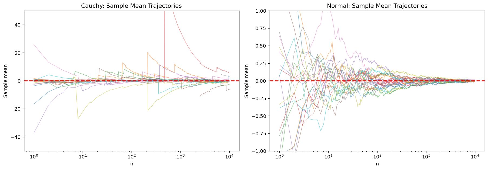
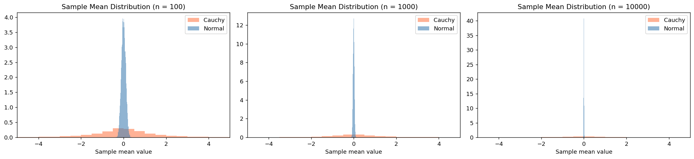
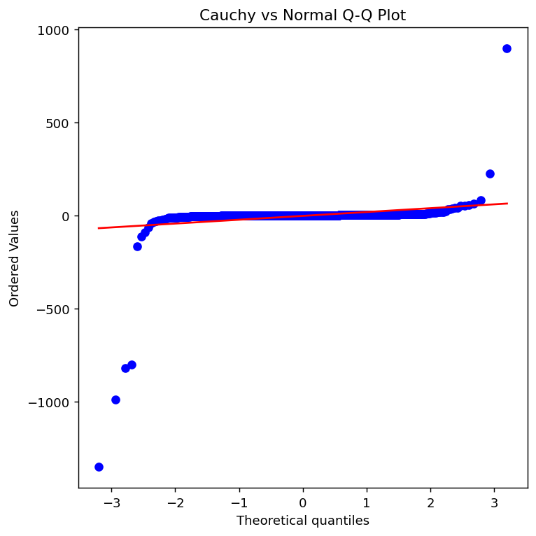

# Cauchy에서 대수의법칙의 실패

## 개요

Cauchy 분포는 대수의법칙에 대한 가장 극적인 반례를 제공한다. Cauchy 분포는 평균이 유한하지 않으므로($E[|X|] = \infty$) i.i.d. Cauchy 관측값의 표본평균은 수렴하지 않는다 — 표본크기와 무관하게 관측값 하나와 같은 분포를 갖는다. 이 페이지에서는 궤적 그림, 표본분포 히스토그램, Q-Q 그림으로 Cauchy와 정규의 표본평균 거동을 대조한다.

## Cauchy 분포

표준 Cauchy 분포의 밀도는:

$$f(x) = \frac{1}{\pi(1 + x^2)}, \quad x \in \mathbb{R}$$

핵심 성질:

- **평균이 유한하지 않다:** $E[|X|] = \int_0^\infty \frac{2x}{\pi(1+x^2)}dx = \frac{2}{\pi}\left[\frac{1}{2}\ln(1+x^2)\right]_0^\infty = \infty$
- **분산도 유한하지 않다** (평균이 존재하지 않으므로)
- **두꺼운 꼬리:** $t \to \infty$일 때 $P(|X| > t) \sim 2/(\pi t)$ (정규의 지수 감쇠와 달리 다항 감쇠)
- **특성함수:** $\varphi(t) = e^{-|t|}$

!!! danger "대수의법칙이 적용되지 않는다"
    대수의법칙은 $E[|X|] < \infty$를 요구한다. Cauchy에서는 이것이 깨지므로 표본평균 $\bar{X}_n$은 어떤 값으로도 수렴하지 않는다. 사실 $\bar{X}_n$은 모든 $n$에서 정확히 같은 Cauchy 분포를 갖는다.

## 표본평균의 궤적

누적평균 $\bar{X}_n = \frac{1}{n}\sum_{i=1}^n X_i$은 정규 자료와 Cauchy 자료에서 놀랄 만큼 다른 거동을 보인다.

```python
import numpy as np
import matplotlib.pyplot as plt

np.random.seed(42)

def sample_mean_trajectories(dist, n_max=10_000, n_tries=20):
    """누적 표본평균의 경로를 n_tries개 만든다.

    코시분포는 평균이 존재하지 않으므로 큰수의 법칙이 성립하지 않는다.
    경로가 수렴하지 않고 계속 튀는 모습을 정규분포와 나란히 놓고 본다.
    """
    trajectories = []
    for _ in range(n_tries):
        if dist == "cauchy":
            data = np.random.standard_cauchy(n_max)
        else:
            data = np.random.standard_normal(n_max)
        running_mean = np.cumsum(data) / np.arange(1, n_max + 1)
        trajectories.append(running_mean)
    return trajectories

n_max = 10_000
ns = np.arange(1, n_max + 1)

cauchy_traj = sample_mean_trajectories("cauchy", n_max)
normal_traj = sample_mean_trajectories("normal", n_max)

fig, axes = plt.subplots(1, 2, figsize=(14, 5))

ax = axes[0]
for traj in cauchy_traj:
    # [-50, 50]으로 잘라 낸다. 코시 경로는 수백, 수천까지 튀어 올라
    # 그대로 그리면 나머지가 한 줄로 뭉개진다.
    # **잘라 냈다는 것 자체가 코시분포의 성질을 말해 준다.**
    clipped = np.clip(traj, -50, 50)
    ax.semilogx(ns, clipped, lw=0.7, alpha=0.6)
ax.axhline(0, color="red", linestyle="--", lw=2)
ax.set_xlabel("n"); ax.set_ylabel("Sample mean")
ax.set_title("Cauchy: Sample Mean Trajectories")
ax.set_ylim(-50, 50)

ax = axes[1]
for traj in normal_traj:
    ax.semilogx(ns, traj, lw=0.7, alpha=0.6)
ax.axhline(0, color="red", linestyle="--", lw=2)
ax.set_xlabel("n"); ax.set_ylabel("Sample mean")
ax.set_title("Normal: Sample Mean Trajectories")
ax.set_ylim(-1, 1)

plt.tight_layout()
plt.show()
```



!!! note "수렴과 비수렴"
    정규분포(오른쪽 그림)에서는 $n$이 커지면 20개 궤적이 모두 눈에 띄게 0으로 수렴한다. Cauchy(왼쪽 그림)에서는 궤적이 계속 불규칙하게 떠돈다 — $n$이 커진 뒤에도 이따금 나타나는 극단 관측값이 누적평균을 "초기화"해 버린다.

## 표본평균의 분포

정규분포에서는 $n$이 커질수록 $\bar{X}_n$의 표본분포가 좁아진다(중심극한정리에 의해 표준편차가 $1/\sqrt{n}$이다). Cauchy에서는 $\bar{X}_n$의 분포가 전혀 좁아지지 **않는다**.

```python
from scipy import stats

def sample_mean_distributions(dist, n_vals, n_reps=10_000):
    results = {}
    for n in n_vals:
        if dist == "cauchy":
            data = np.random.standard_cauchy((n_reps, n))
        else:
            data = np.random.standard_normal((n_reps, n))
        results[n] = data.mean(axis=1)
    return results

n_vals = [100, 1000, 10_000]
cauchy_dists = sample_mean_distributions("cauchy", n_vals)
normal_dists = sample_mean_distributions("normal", n_vals)

fig, axes = plt.subplots(1, 3, figsize=(17, 4))
for col, n in enumerate(n_vals):
    ax = axes[col]
    c_means = np.clip(cauchy_dists[n], -20, 20)
    n_means = normal_dists[n]
    ax.hist(c_means, bins=80, density=True, alpha=0.6, color="coral", label="Cauchy")
    ax.hist(n_means, bins=50, density=True, alpha=0.6, color="steelblue", label="Normal")
    ax.set_title(f"Sample Mean Distribution (n = {n})")
    ax.set_xlabel("Sample mean value")
    ax.set_xlim(-5, 5)
    ax.legend()
plt.tight_layout()
plt.show()
```



!!! warning "Cauchy 분포는 집중되지 않는다"
    $n = 10{,}000$에서 정규 표본평균의 분포는 0에 뾰족하게 모여들지만(표준편차 $= 0.01$), Cauchy 표본평균의 분포는 $n = 100$일 때와 사실상 똑같아 보인다. Cauchy 자료를 더 많이 평균해도 도움이 되지 않는다.

## Q-Q 그림: 두꺼운 꼬리의 시각화

Cauchy 분위수를 정규 분위수와 비교하는 **Q-Q 그림**은 Cauchy 꼬리가 얼마나 극단적으로 두꺼운지 드러낸다.

```python
cauchy_sample = np.random.standard_cauchy(1000)
fig, ax = plt.subplots(figsize=(6, 6))
stats.probplot(cauchy_sample, dist="norm", plot=ax)
ax.set_title("Cauchy vs Normal Q-Q Plot")
plt.tight_layout()
plt.show()
```



특유의 S자(또는 하키스틱) 모양은 Cauchy가 정규분포보다 훨씬 극단적인 값을 만들어낸다는 것을 보여준다.

## 평균이 실패하는 이유: 특성함수를 통한 증명

표준 Cauchy의 특성함수는 $\varphi_X(t) = e^{-|t|}$이다.

i.i.d. Cauchy 변수 $n$개의 표본평균에 대해:

$$\varphi_{\bar{X}_n}(t) = \left[\varphi_X(t/n)\right]^n = \left[e^{-|t|/n}\right]^n = e^{-|t|}$$

이는 Cauchy 관측값 하나의 특성함수이다. 따라서:

$$\bar{X}_n \sim \text{Cauchy}(0, 1) \quad \text{모든 } n \text{에 대해}$$

!!! info "안정성"
    Cauchy 분포는 지수 $\alpha = 1$인 **안정분포**이다. 안정분포에서는 i.i.d. 복사본들의 선형결합이 (축척을 조정하면) 같은 분포 형태를 갖는다. Cauchy는 표본평균이 관측값 하나와 같은 분포를 갖는 유일한 대칭 안정분포인데, 합 $S_n$의 척도모수가 $\sqrt{n}$이 아니라 $n$에 비례해 커져서 $1/n$로 나누는 것과 정확히 상쇄되기 때문이다.

## Cauchy 자료를 위한 대안 추정량

Cauchy 자료에서 표본평균이 쓸모없다면 어떤 대안이 통할까?

| 추정량 | 수렴하는가? | 속도 |
|-----------|-----------|------|
| 표본평균 | 아니오 | 해당 없음 |
| 표본중앙값 | 예 | $O(1/\sqrt{n})$ |
| MLE (위치) | 예 | $O(1/\sqrt{n})$ |
| 절사평균 ($\alpha > 0$) | 예 | $O(1/\sqrt{n})$ |

**표본중앙값**은 Cauchy 위치모수에 대해 일치하며 점근분산이 $\pi^2/(4n) \approx 2.47/n$이다. 위치모수의 MLE는 점근분산이 $2/n$으로 더 작아 중앙값보다 효율적이며, 중앙값 대비 MLE의 ARE는 $\pi^2/8 \approx 1.23$이다.

## 해석

- Cauchy 분포는 **대수의법칙이 실패하는** 대표적인 예이다. 평균이 유한하다는 조건이 수학적 형식이 아니라 진짜 요구사항임을 보여준다.
- Cauchy 자료의 표본평균은 관측값 하나와 **같은 분포**를 가지므로 평균을 내도 전혀 나아지지 않는다.
- **두꺼운 꼬리**가 근본 원인이다: 이따금 나타나는 극단 관측값이 합을 지배하여 집중을 막는다.
- **중앙값**과 **MLE**는 통상적인 $1/\sqrt{n}$ 속도로 수렴하는 쓸 만한 대안이다.
- 실무에서 Cauchy는 경고 역할을 한다: 추정량이 자료에 적절한지 항상 확인하라. 자료의 꼬리가 극단적으로 두꺼우면 표본평균이 오해를 부르거나 무의미할 수 있다.

## 연습문제

<div class="drillbox" markdown>

**연습문제 1.**
적분을 직접 계산하여 표준 Cauchy 분포에서 $E[|X|] = \infty$임을 보여라.

</div>

??? success "풀이"
    $$E[|X|] = \int_{-\infty}^{\infty} \frac{|x|}{\pi(1+x^2)}\,dx = \frac{2}{\pi}\int_0^{\infty} \frac{x}{1+x^2}\,dx$$

    치환 $u = 1 + x^2$, $du = 2x\,dx$를 쓰면:

    $$\frac{2}{\pi}\int_0^{\infty} \frac{x}{1+x^2}\,dx = \frac{2}{\pi}\cdot\frac{1}{2}\int_1^{\infty}\frac{du}{u} = \frac{1}{\pi}\left[\ln u\right]_1^{\infty} = \frac{1}{\pi}\cdot\infty = \infty$$

    $E[|X|] = \infty$이므로 평균 $E[X]$가 존재하지 않는다. 이것이 Cauchy에서 대수의법칙이 실패하는 근본 이유이다. $\square$

<div class="drillbox" markdown>

**연습문제 2.**
특성함수를 써서, i.i.d. 표준 Cauchy 확률변수 $n$개의 $\bar{X}_n$이 표준 Cauchy 확률변수 하나와 같은 분포를 가짐을 증명하라.

</div>

??? success "풀이"
    표준 Cauchy의 특성함수는 $\varphi_X(t) = e^{-|t|}$이다.

    i.i.d. $X_1, \ldots, X_n$에 대해 합 $S_n = \sum_{i=1}^n X_i$은:

    $$\varphi_{S_n}(t) = \prod_{i=1}^n \varphi_{X_i}(t) = \left(e^{-|t|}\right)^n = e^{-n|t|}$$

    이는 $\text{Cauchy}(0, n)$(척도모수가 $n$인 Cauchy)의 특성함수이다.

    표본평균 $\bar{X}_n = S_n/n$에 대해:

    $$\varphi_{\bar{X}_n}(t) = \varphi_{S_n}(t/n) = e^{-n|t/n|} = e^{-|t|}$$

    이는 정확히 표준 Cauchy의 특성함수 $\varphi_X(t)$이다. 특성함수가 분포를 유일하게 결정하므로:

    $$\bar{X}_n \sim \text{Cauchy}(0, 1) \quad \text{모든 } n \geq 1 \text{에 대해}$$

    $\square$

<div class="drillbox" markdown>

**연습문제 3.**
Cauchy와 정규분포의 꼬리를 비교하라. 각각에서 $P(|X| > 10)$은 얼마인가? 이것이 표본평균의 거동에 대해 무엇을 함의하는가?

</div>

??? success "풀이"
    **정규:** $P(|Z| > 10) = 2\mathcal{N}(-10) \approx 2 \times 7.62 \times 10^{-24} \approx 1.52 \times 10^{-23}$.

    **Cauchy:** $P(|X| > 10) = 2\left(\frac{1}{2} - \frac{1}{\pi}\arctan(10)\right) = 1 - \frac{2}{\pi}\arctan(10) \approx 1 - \frac{2}{\pi}(1.4711) \approx 1 - 0.9366 = 0.0634$.

    즉 Cauchy에서는 $P(|X| > 10) \approx 6.3\%$로 정규보다 $10^{21}$배 넘게 크다.

    **표본평균에 대한 함의:** Cauchy 관측값 $n = 100$개의 표본에서는 절댓값이 10을 넘는 값이 대략 6개 나올 것으로 기대된다. 이런 극단값이 합에 불균형하게 기여하여 온건한 관측값들을 압도한다. 그런 극단값의 발생률이 $n$이 커져도 충분히 빨리 줄지 않으므로 $\bar{X}_n$의 $1/n$ 정규화가 합을 "길들이지" 못한다. 이것이 표본평균이 수렴하지 않는 직관적인 이유이다. $\square$

<div class="drillbox" markdown>

**연습문제 4.**
표본중앙값은 Cauchy 위치모수에 대해 일치한다. 그 점근분산은 얼마인가? Cauchy 위치모수 MLE의 점근분산과 비교하라.

</div>

??? success "풀이"
    Cauchy 밀도 $f(x) = \frac{1}{\pi(1+x^2)}$에서 (표준 Cauchy의 중앙값인) 0에서의 값은 $f(0) = 1/\pi$이다.

    표본중앙값의 점근분산은:

    $$\text{Var}(\text{median}) \approx \frac{1}{4nf(0)^2} = \frac{1}{4n(1/\pi)^2} = \frac{\pi^2}{4n} \approx \frac{2.467}{n}$$

    Cauchy 위치모수 $\mu$에 대한 Fisher 정보량은:

    $$I(\mu) = \int_{-\infty}^{\infty} \frac{[f'(x-\mu)]^2}{f(x-\mu)}\,dx = \frac{1}{2}$$

    따라서 CRLB(그리고 MLE의 점근분산)는:

    $$\text{Var}(\hat{\mu}_{\text{MLE}}) \approx \frac{1}{nI(\mu)} = \frac{2}{n}$$

    MLE 대비 중앙값의 점근 상대효율은:

    $$\text{ARE} = \frac{2/n}{\pi^2/(4n)} = \frac{8}{\pi^2} \approx 0.811$$

    즉 Cauchy 자료에서 중앙값의 효율은 MLE의 약 81%이다 — 중앙값의 단순함과 계산의 편의를 생각하면 합리적인 맞바꿈이다. $\square$

<div class="drillbox" markdown>

**연습문제 5.**
"안정분포"가 무엇인지, Cauchy가 왜 안정분포인지 설명하라. Cauchy의 안정지수는 얼마이며, 그것이 꼬리 거동에 대해 무엇을 결정하는가?

</div>

??? success "풀이"
    확률변수 $X$가 지수 $\alpha \in (0, 2]$인 **안정분포**를 따른다는 것은, 임의의 $n$개 i.i.d. 복사본 $X_1, \ldots, X_n$에 대해 어떤 상수 $c_n$이 존재하여

    $$X_1 + X_2 + \cdots + X_n \overset{d}{=} n^{1/\alpha} X + c_n$$

    이 성립한다는 뜻이다. 동등하게, 이 족은 (위치와 척도를 조정하면) 덧셈에 대해 닫혀 있다. 대칭 안정분포의 특성함수는 $\varphi(t) = \exp(-c|t|^\alpha + i\delta t)$ 꼴이다.

    **Cauchy는 $\alpha = 1$이다:**

    - 특성함수: $\varphi(t) = e^{-|t|}$, 즉 $e^{-|t|^1}$이므로 $\alpha = 1$.
    - 합의 성질: $S_n = \sum X_i$은 $\varphi_{S_n}(t) = e^{-n|t|}$이므로 $\text{Cauchy}(0, n)$에 해당한다. 이는 $n^{1/\alpha}X = n^1 X \sim \text{Cauchy}(0, n)$과 일치한다.

    **안정지수 $\alpha$가 꼬리 거동을 결정한다:**

    - ($\alpha < 2$일 때) $t \to \infty$에서 $P(|X| > t) \sim t^{-\alpha}$.
    - $\alpha = 2$: Gaussian(지수 꼬리, 모든 적률이 유한).
    - $\alpha = 1$: Cauchy($P(|X|>t) \sim 1/t$, 평균 없음).
    - $0 < \alpha < 1$: 꼬리가 더 두꺼움(평균 없음, $P(|X|>t) \sim t^{-\alpha}$).

    $\alpha$가 작을수록 꼬리가 두껍다. $\alpha < 2$이면 차수가 $\alpha$ 이상인 적률이 무한하다. $\alpha \leq 1$이면 평균이 존재하지 않고 표본평균에 대해 대수의법칙이 실패한다. $\square$

---

## 정리하며

코시분포는 큰수의 법칙에 대한 **가장 극적인 반례**다.

- **$\mathbb{E}|X|=\infty$ 이므로 수렴할 대상 자체가 없다.** 밀도가 $1/(\pi(1+x^2))$ 이라 $x f(x)\sim1/(\pi x)$ 로 양쪽 꼬리가 모두 발산한다.
- **$\bar X_n$ 이 $n$ 과 무관하게 표준 코시를 따른다.** 관측을 백만 개 모으는 것이 하나만 보는 것과 **정확히 같다.** 궤적 그림에서 누적평균이 정착하지 않고 이따금 크게 튀며, Q-Q 그림에서 두꺼운 꼬리가 드러난다.
- **정규와 대조하면 차이가 선명하다.** 같은 그림에서 정규의 누적평균은 곧게 모여들고 코시는 끝까지 헤맨다.
- **처방은 중앙값이다.** 코시분포의 중앙값은 잘 정의되고 표본중앙값이 그것으로 수렴한다. **평균이 없는 곳에서도 분위수는 언제나 존재한다.**
- **어디서 마주치는가.** 두 독립 정규의 비가 코시이므로, 회귀계수의 비·두 추정값의 비·각도 측정에서 자연스럽게 나타난다. **비를 다룰 때 조심해야 하는 이유다.**

**이것으로 7장이 끝난다.** 표본평균과 표본분산을 여러 각도에서 살피고, 불편성·효율성·로버스트성의 거래 조건을 따졌으며, 마지막으로 그 모든 것이 무너지는 경우까지 보았다.

다음 장 **구간추정**으로 넘어간다. 지금까지 점 하나로 답했다면, 이제 **불확실성의 범위를 함께 보고하는** 방법을 다룬다.
