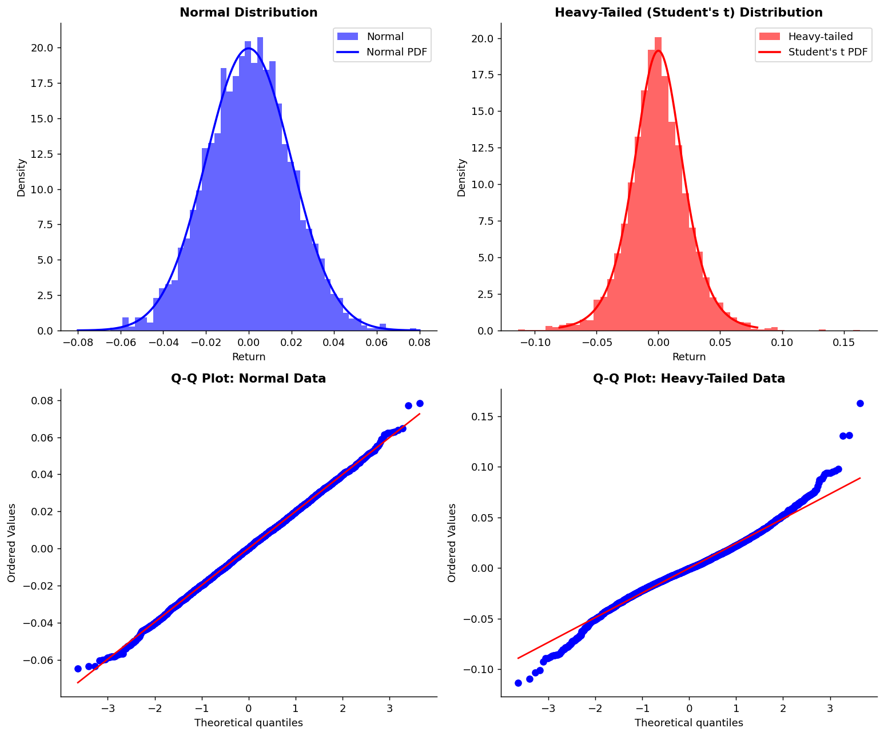

# 꼬리가 두꺼운 분포

## 개요

바탕 분포의 꼬리가 두꺼우면 극단 관측값 때문에 표본평균의 성능이 나빠질 수 있다. 자산 수익률이 정규분포보다 훨씬 두꺼운 꼬리를 보이는 금융에서 특히 그렇다.

## 특징

꼬리가 두꺼운 분포는 꼬리가 지수보다 느리게 감쇠한다. 예를 들면:

- **Student $t$ 분포** (자유도가 작을 때)
- **Cauchy 분포** (평균과 분산이 정의되지 않음)
- **Pareto 분포** (거듭제곱 법칙 꼬리)
- **Log-normal 분포** (오른쪽으로 치우침)
- **금융 수익률** (주식, 외환, 원자재 시장에서 경험적으로 관찰됨)

## 첨도와 꼬리의 무게

꼬리의 무게는 흔히 **첨도**로 정량화한다. 정규분포의 첨도는 3(초과첨도 0)이다. 초과첨도가 1보다 큰 분포는 꼬리가 두껍다고 본다.

$$\text{초과첨도} = E\left[\left(\frac{X - \mu}{\sigma}\right)^4\right] - 3$$

**예시**:

- 정규분포: 초과첨도 = 0
- 자유도 5인 Student $t$: 초과첨도 ≈ 6 (훨씬 두꺼운 꼬리)
- 실제 주식 수익률: 초과첨도는 보통 3–10 (빈도와 자산에 따라 다름)

## 표본평균에 미치는 영향

자료가 꼬리가 두꺼운 분포에서 나오면:

1. **$\bar{X}$의 분산이 커진다**: 표준오차가 정규근사가 예측하는 것보다 크다
2. **정규성으로의 수렴이 느리다**: 중심극한정리는 여전히 성립하지만 수렴이 느리다. $n = 30$으로는 부족할 수 있다
3. **이상점의 영향이 과도하다**: 극단 관측값 하나가 표본평균을 크게 옮길 수 있다
4. **신뢰구간이 불확실성을 과소평가한다**: 정규이론에 기반한 구간이 너무 좁아 포함확률이 명목값에 못 미친다

## 금융에서의 맥락: 자산 수익률

경험적 증거는 금융 수익률이 두꺼운 꼬리를 보인다는 것을 일관되게 확인해 준다:

- **일별 주식 수익률**: 초과첨도 3–6 (전형적으로)
- **일중 수익률**: 꼬리가 더 두껍다
- **원자재 가격**: 공급 충격 때 꼬리가 매우 두껍다
- **외환**: 초과첨도가 중간 정도

### 금융 수익률의 꼬리가 두꺼운 이유

1. **드문 사건이 뭉쳐서 일어난다**: 시장 폭락과 급등은 고르게가 아니라 물결처럼 온다
2. **변동성 군집**: 변동성이 높은 시기에 큰 움직임이 더 많이 몰린다
3. **정보 비대칭**: 갑작스러운 뉴스가 불연속적인 점프를 만든다
4. **레버리지와 마진콜**: 하락 움직임을 증폭할 수 있다

### 위험관리에 대한 함의

수익률의 꼬리가 두꺼운데 정규성을 가정하면:

- 99번째 백분위수에서의 **VaR**가 심각하게 과소평가된다
- **기대부족액(CVaR)**이 과소평가된다
- **헤지 비율**이 너무 작아 포지션이 충분히 보호되지 않는다
- 스트레스 시기에 **자본 요구량**이 부족해진다

**예시**: 정규분포는 5% 손실이 확률 0.01%로 일어난다고 예측한다. 꼬리가 두꺼운 금융 수익률에서는 이 손실이 확률 0.1%로 일어날 수 있다 — 10배의 과소평가다!

## 시각적 비교

```python
import numpy as np
import matplotlib.pyplot as plt
from scipy import stats

np.random.seed(42)

# Generate samples
normal_returns = np.random.normal(loc=0, scale=0.02, size=5000)
heavy_tailed_returns = stats.t.rvs(df=6, scale=0.02, size=5000)

fig, axes = plt.subplots(2, 2, figsize=(12, 10))

# Row 1: Histograms
ax = axes[0, 0]
ax.hist(normal_returns, bins=50, alpha=0.6, label='Normal', color='blue', density=True)
x = np.linspace(-0.08, 0.08, 200)
ax.plot(x, stats.norm.pdf(x, 0, 0.02), 'b-', linewidth=2, label='Normal PDF')
ax.set_title('Normal Distribution', fontsize=12, fontweight='bold')
ax.set_xlabel('Return')
ax.set_ylabel('Density')
ax.legend()
ax.spines[['top', 'right']].set_visible(False)

ax = axes[0, 1]
ax.hist(heavy_tailed_returns, bins=50, alpha=0.6, label='Heavy-tailed', color='red', density=True)
x = np.linspace(-0.08, 0.08, 200)
ax.plot(x, stats.t.pdf(x, df=6, loc=0, scale=0.02), 'r-', linewidth=2, label="Student's t PDF")
ax.set_title("Heavy-Tailed (Student's t) Distribution", fontsize=12, fontweight='bold')
ax.set_xlabel('Return')
ax.set_ylabel('Density')
ax.legend()
ax.spines[['top', 'right']].set_visible(False)

# Row 2: Q-Q plots
ax = axes[1, 0]
stats.probplot(normal_returns, dist="norm", plot=ax)
ax.set_title('Q-Q Plot: Normal Data', fontsize=12, fontweight='bold')
ax.spines[['top', 'right']].set_visible(False)

ax = axes[1, 1]
stats.probplot(heavy_tailed_returns, dist="norm", plot=ax)
ax.set_title('Q-Q Plot: Heavy-Tailed Data', fontsize=12, fontweight='bold')
ax.spines[['top', 'right']].set_visible(False)

plt.tight_layout()
plt.show()

# Print statistics
print("Normal Distribution:")
print(f"  Excess Kurtosis: {stats.kurtosis(normal_returns):.2f}")
print()
print("Heavy-Tailed (t) Distribution:")
print(f"  Excess Kurtosis: {stats.kurtosis(heavy_tailed_returns):.2f}")
```

출력:

```
Normal Distribution:
  Excess Kurtosis: 0.04

Heavy-Tailed (t) Distribution:
  Excess Kurtosis: 1.78
```



## 평균의 로버스트한 대안

꼬리가 두꺼운 자료에서는 다음 대안을 고려하라.

### 1. 중앙값
- **로버스트성**: 극단값의 영향을 받지 않는다
- **효율**: 정규 자료에서는 평균보다 효율이 낮지만, 꼬리가 두꺼운 자료에서는 비슷하다
- **추론**: 표준오차와 신뢰구간에는 붓스트랩을 쓴다

```python
import numpy as np
from sklearn.utils import resample

data = stats.t.rvs(df=5, size=100)
original_median = np.median(data)

# Bootstrap standard error
bootstrap_medians = [np.median(resample(data)) for _ in range(1000)]
se_median = np.std(bootstrap_medians)
print(f"Median: {original_median:.4f} ± {se_median:.4f}")
```

출력:

```
Median: 0.2379 ± 0.1549
```

### 2. 절사평균
평균을 계산하기 전에 양쪽 꼬리에서 일정 비율을 제거한다:

$$\bar{X}_{\text{trim}, \alpha} = \frac{1}{n(1-2\alpha)} \sum_{i=\lceil n\alpha \rceil}^{\lfloor n(1-\alpha) \rfloor} X_{(i)}$$

여기서 $X_{(i)}$는 순서통계량이고 $\alpha$는 절사비율이다(예: 10%이면 0.1).

```python
import numpy as np
from scipy import stats
from scipy.stats import trim_mean

np.random.seed(42)
data = stats.t.rvs(df=5, size=100)      # 자유도 5의 t분포. 꼬리가 두껍다.

# proportiontocut=0.1 은 **양쪽 각각** 10%를 잘라 낸다는 뜻이다.
# 즉 전체의 20%가 버려지고 가운데 80%만 평균에 들어간다.
mean_trim10 = trim_mean(data, 0.1)
print(f"표본평균     {np.mean(data):7.4f}")
print(f"10% 절단평균 {mean_trim10:7.4f}")
```

출력:

```
표본평균      0.0299
10% 절단평균 -0.1366
```

### 3. 윈저화 평균
극단값을 버리는 대신 $\alpha$-분위수로 대체한다:

```python
import numpy as np
from scipy import stats

def winsorize_mean(data, alpha=0.1):
    """꼬리를 잘라 내는 대신 분위수 값으로 **바꿔치기**한 뒤 평균을 낸다.

    절단평균과의 차이는 표본 크기다.
    절단은 관측값을 버려 n이 줄지만, 윈저화는 값만 바꾸고 개수는 그대로 둔다.
    "극단값도 방향 정보는 담고 있다"고 볼 때 윈저화가 낫다.
    """
    lower = np.quantile(data, alpha)
    upper = np.quantile(data, 1 - alpha)
    winsorized = np.clip(data, lower, upper)   # 범위 밖 값을 경계로 눌러 준다
    return np.mean(winsorized)

np.random.seed(42)
data = stats.t.rvs(df=5, size=100)
print(f"표본평균       {np.mean(data):7.4f}")
print(f"윈저화 평균    {winsorize_mean(data, alpha=0.1):7.4f}")
```

출력:

```
표본평균        0.0299
윈저화 평균    -0.1292
```

### 4. M-추정량 (Huber 추정량)
작은 오차에서는 이차식, 큰 오차에서는 절댓값으로 넘어가는 손실함수를 써서 극단값의 가중치를 매끄럽게 낮춘다:

```python
import numpy as np
from scipy import stats
# Huber 추정량은 scipy가 아니라 statsmodels에 있다.
from statsmodels.robust.scale import huber

np.random.seed(42)
data = stats.t.rvs(df=5, size=100)

# 위치와 척도를 **동시에** 반복 추정해 돌려준다.
# 조율모수 t의 기본값은 1.5이며, 이는 표준화 잔차가 1.5를 넘는 관측값부터
# 가중치를 낮추기 시작한다는 뜻이다. 작을수록 로버스트하지만 효율이 떨어진다.
loc, scale = huber(data)
print(f"Huber 위치추정: {loc:.4f}")
print(f"Huber 척도추정: {scale:.4f}")
```

출력:

```
Huber 위치추정: -0.1366
Huber 척도추정: 1.0812
```

## 추정량의 비교

```python
import numpy as np
from scipy import stats
from scipy.stats import trim_mean
from statsmodels.robust.scale import huber

np.random.seed(42)
# 자유도 5의 t분포. 평균은 0이지만 꼬리가 정규분포보다 훨씬 두껍다.
data = stats.t.rvs(df=5, loc=0, scale=1, size=500)

# 다섯 추정량 모두 같은 모수(위치 0)를 겨냥한다.
# n = 500 으로 넉넉하므로 다섯 값이 모두 0 근처에 모인다.
# 이들의 차이는 한 번의 값이 아니라 **되풀이했을 때의 흩어짐**에서 드러난다.
print("Estimator Comparison (Population mean = 0):")
print(f"  Sample mean:         {np.mean(data):7.4f}")
print(f"  Median:              {np.median(data):7.4f}")
print(f"  10% Trimmed mean:    {trim_mean(data, 0.1):7.4f}")
print(f"  Winsorized mean:     {winsorize_mean(data, 0.1):7.4f}")
print(f"  Huber's estimator:   {huber(data)[0]:7.4f}")
```

출력:

```
Estimator Comparison (Population mean = 0):
  Sample mean:         -0.0009
  Median:               0.0058
  10% Trimmed mean:    -0.0406
  Winsorized mean:     -0.0318
  Huber's estimator:   -0.0369
```

## 연습문제

<div class="drillbox" markdown>

**연습문제 1.**
Cauchy 분포의 PDF는 $f(x) = \frac{1}{\pi(1+x^2)}$이다. $\int_{-\infty}^{\infty} |x| f(x)\,dx$가 발산함을 보여 평균이 존재하지 않음을 증명하라.

</div>

??? success "풀이"
    $$
    \int_{-\infty}^{\infty} |x| f(x)\,dx = \frac{2}{\pi}\int_0^{\infty} \frac{x}{1+x^2}\,dx
    $$

    치환 $u = 1 + x^2$, $du = 2x\,dx$를 쓰면:

    $$
    = \frac{2}{\pi} \cdot \frac{1}{2}\int_1^{\infty} \frac{du}{u} = \frac{1}{\pi}\left[\log u\right]_1^{\infty} = \frac{1}{\pi}(\infty - 0) = \infty
    $$

    $E[|X|] = \infty$이므로 평균 $E[X]$가 존재하지 않는다. 적분이 로그 속도로 발산하므로, 아주 큰 표본에서 평균을 내도 값이 안정되지 않는다.

<div class="drillbox" markdown>

**연습문제 2.**
자유도 $\nu$인 Student-$t$ 분포는 $\nu > 2$일 때만 분산이 유한하다. $\nu = 3$이면 분산은 $\sigma^2 = \nu/(\nu-2) = 3$이다. $t_3$에서 뽑은 관측값 $n = 100$개와 $N(0,3)$에서 뽑은 경우를 $\bar{X}$의 표준오차 관점에서 비교하라.

</div>

??? success "풀이"
    $N(0,3)$에서 표준오차는 $\text{SE} = \sqrt{3/100} = \sqrt{0.03} \approx 0.173$이다. 모집단이 정규이므로 중심극한정리가 완벽하게 적용된다.

    $t_3$에서도 모분산이 3이므로 이론적 표준오차는 같다: $\text{SE} = \sqrt{3/100} \approx 0.173$. 그러나 $t_\nu$의 초과첨도는 $\nu > 4$일 때 $6/(\nu-4)$이고, $2 < \nu \le 4$에서는 4차 적률이 존재하지 않아 초과첨도가 무한하다. $\nu = 3$이 바로 그 경우이다.

    실제로 $t_3$에서 얻은 표본평균은 이따금 나타나는 극단 관측값이 $\bar{X}$를 크게 밀어내기 때문에 표준오차 공식이 예측하는 것보다 훨씬 크게 요동친다. $t_3$에서는 중심극한정리의 수렴이 매우 느려 $n = 100$에서도 $\bar{X}$의 정규근사가 나쁘다 — 정규성에 기반한 신뢰구간의 포함확률이 명목 수준을 크게 밑돈다.

<div class="drillbox" markdown>

**연습문제 3.**
정규 자료에서는 표본평균이 표준적인 선택인데도, Cauchy 분포의 중심 추정에서는 왜 중앙값이 더 나은지 설명하라.

</div>

??? success "풀이"
    Cauchy 자료의 **표본평균**은 수렴하지 않는다: 주목할 만한 성질에 의해, i.i.d. Cauchy 관측값 $n$개의 표본평균은 $n$과 무관하게 같은 Cauchy 분포를 따른다. 평균이 존재하지 않아 대수의법칙이 적용되지 않으므로 평균을 내도 변동성이 전혀 줄지 않는다.

    반면 **표본중앙값**은 Cauchy 분포의 위치모수에 대해 일치하며 점근분산이 $\pi^2/(4n)$으로 표준적인 $1/n$ 속도로 줄어든다. 중앙값은 꼬리의 극단 관측값에 영향받지 않으므로, 평균을 무용지물로 만드는 두꺼운 꼬리에 로버스트하다. 특히 Cauchy 분포에서 중앙값은 위치모수의 MLE이다.

<div class="drillbox" markdown>

**연습문제 4.**
어떤 위험관리자가 정규 모형으로 일별 포트폴리오 손실의 99번째 백분위수를 추정하여 \$233만을 얻었다. 손실의 참 분포가 같은 척도의 $t_5$ 분포를 따른다면 참 99번째 백분위수는 얼마나 더 큰가?

</div>

??? success "풀이"
    표준정규의 99번째 백분위수는 $z_{0.99} = 2.326$이다. $t_5$ 분포의 99번째 백분위수는 $t_{5, 0.99} \approx 3.365$이다.

    비는:

    $$
    \frac{t_{5,0.99}}{z_{0.99}} = \frac{3.365}{2.326} \approx 1.447
    $$

    $t_5$ 모형에서의 참 99번째 백분위수는 약 44.7% 더 크다: $\$233\text{만} \times 1.447 \approx \$337\text{만}$. 정규 모형이 꼬리 위험을 이렇게 과소평가하는 것은 금융 위험관리에서 잘 알려진 위험 요인이며 2008년 금융위기의 한 원인이기도 했다.

---

## 정리하며

꼬리가 두꺼운 분포는 통계적 추론에 상당한 어려움을 준다:

- 표본평균이 비효율적이고 불안정하다
- 정규이론 신뢰구간이 너무 좁다
- 정규성에 기반한 위험 측도가 위험할 정도로 낙관적이다

특히 금융 자료에서는 중앙값, 절사평균, M-추정량 같은 로버스트한 대안이 더 믿을 만한 추론을 준다. (분포 가정이 필요 없는) 붓스트랩 방법은 이런 추정량 어느 것에 대해서든 신뢰구간을 만드는 데 이상적이다.
