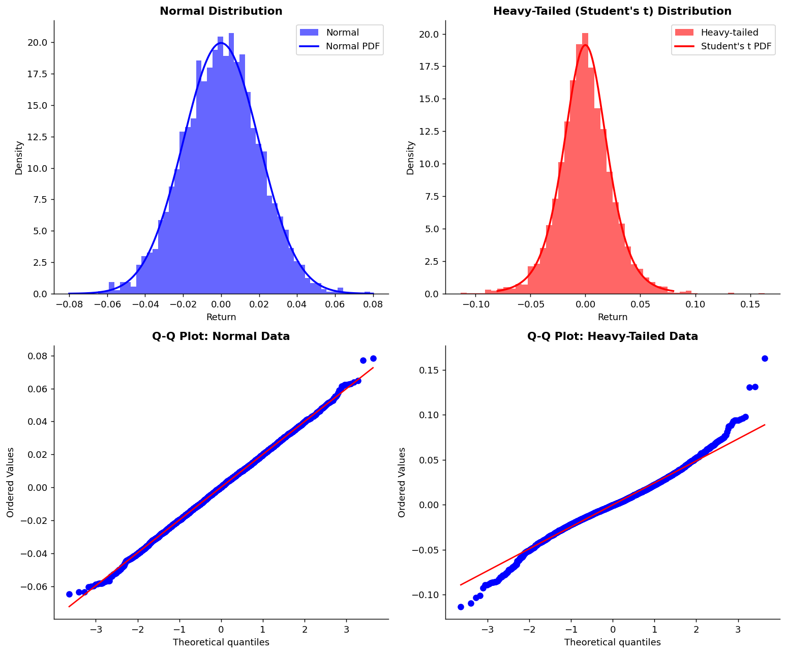

# 꼬리가 두꺼운 분포

## 개요

바탕 분포의 꼬리가 두꺼우면 극단 관측값 때문에 표본평균의 성능이 나빠질 수 있다. 자산 수익률이 정규분포보다 훨씬 두꺼운 꼬리를 보이는 금융에서 특히 그렇다.

---

## 1. 특징

꼬리가 두꺼운 분포는 꼬리가 지수보다 느리게 감쇠한다. 예를 들면:

- **스튜던트 $t$ 분포** (자유도가 작을 때)
- **코시분포** (평균과 분산이 정의되지 않음)
- **파레토분포** (거듭제곱 법칙 꼬리)
- **로그정규분포** (오른쪽으로 치우침)
- **금융 수익률** (주식, 외환, 원자재 시장에서 경험적으로 관찰됨)

---

## 2. 첨도와 꼬리의 무게

꼬리의 무게는 흔히 **첨도**로 정량화한다. 정규분포의 첨도는 3(초과첨도 0)이다. 초과첨도가 1보다 큰 분포는 꼬리가 두껍다고 본다.

$$\text{초과첨도} = E\left[\left(\frac{X - \mu}{\sigma}\right)^4\right] - 3$$

**예시**:

- 정규분포: 초과첨도 = 0
- 자유도 5인 스튜던트 $t$: 초과첨도 ≈ 6 (훨씬 두꺼운 꼬리)
- 실제 주식 수익률: 초과첨도는 보통 3–10 (빈도와 자산에 따라 다름)

---

## 3. 표본평균에 미치는 영향

자료가 꼬리가 두꺼운 분포에서 나오면:

1. **$\bar{X}$의 분산이 커진다**: 표준오차가 정규근사가 예측하는 것보다 크다
2. **정규성으로의 수렴이 느리다**: 중심극한정리는 여전히 성립하지만 수렴이 느리다. $n = 30$으로는 부족할 수 있다
3. **이상점의 영향이 과도하다**: 극단 관측값 하나가 표본평균을 크게 옮길 수 있다
4. **신뢰구간이 불확실성을 과소평가한다**: 정규이론에 기반한 구간이 너무 좁아 포함확률이 명목값에 못 미친다

---

## 4. 금융에서의 맥락: 자산 수익률

경험적 증거는 금융 수익률이 두꺼운 꼬리를 보인다는 것을 일관되게 확인해 준다:

- **일별 주식 수익률**: 초과첨도 3–6 (전형적으로)
- **일중 수익률**: 꼬리가 더 두껍다
- **원자재 가격**: 공급 충격 때 꼬리가 매우 두껍다
- **외환**: 초과첨도가 중간 정도

### 금융 수익률의 꼬리가 두꺼운 이유

1. **드문 사건이 뭉쳐서 일어난다**: 시장 폭락과 급등은 고르게가 아니라 물결처럼 온다
2. **변동성 군집**: 변동성이 높은 시기에 큰 움직임이 더 많이 몰린다
3. **정보 비대칭**: 갑작스러운 뉴스가 불연속적인 점프를 만든다
4. **레버리지와 마진콜**: 하락 움직임을 증폭할 수 있다

### 위험관리에 대한 함의

수익률의 꼬리가 두꺼운데 정규성을 가정하면:

- 99번째 백분위수에서의 **VaR**가 심각하게 과소평가된다
- **기대부족액(CVaR)**이 과소평가된다
- **헤지 비율**이 너무 작아 포지션이 충분히 보호되지 않는다
- 스트레스 시기에 **자본 요구량**이 부족해진다

**예시**: 정규분포는 5% 손실이 확률 0.01%로 일어난다고 예측한다. 꼬리가 두꺼운 금융 수익률에서는 이 손실이 확률 0.1%로 일어날 수 있다 — 10배의 과소평가다!

---

## 5. 시각적 비교

<div class="exbox" markdown>

**보기 1.** <span class="diff easy" title="쉬움"></span> 정규와 두꺼운 꼬리를 네 그림으로. 척도를 $0.02$로 맞춘 $N(0, 0.02^2)$와 $t_6$에서 각각 5000개를 뽑아 히스토그램과 Q-Q 그림을 그리고 표본 초과첨도를 잰다.

**(1)** 두 모집단의 **참** 초과첨도를 적으시오. 정규 쪽 표본값은 얼마만큼 흔들리는가.

**(2)** 출력의 $t_6$ 쪽 표본 초과첨도는 $1.78$인데 참값의 절반을 조금 넘는다. $n = 5000$이면 적은 표본도 아니다. 무엇이 잘못되었는가.

</div>

??? success "풀이"

    **(1) 이론값.** $t_\nu$의 초과첨도는 $\nu > 4$에서

    $$
    \operatorname{Kurt}_{\text{초과}}(t_\nu) = \frac{6}{\nu - 4}
    $$

    이므로 $\nu = 6$에서 **$3$**이다. 정규는 정의상 $0$이다. 첨도는 척도불변이므로 $0.02$를 곱한 것이 이 값을 바꾸지 않는다.

    다만 두 자료의 **폭**이 꼭 같지는 않다는 점은 짚어 두어야 한다. 같게 맞춘 것은 척도모수 $0.02$이고, $t_6$의 분산은 $\nu/(\nu-2) = 1.5$배라

    $$
    \operatorname{sd}(t_6 \text{ 쪽}) = 0.02\sqrt{1.5} = 0.0245
    $$

    로 정규 쪽 $0.02$보다 $22\%$ 넓다. 그래서 그림 위쪽의 두 히스토그램은 가로 범위가 다르다. **가운데 봉우리는 $t$ 쪽이 더 높고 꼬리도 더 길다**는 것이 두꺼운 꼬리의 전형적인 모습이다.

    정규자료에서 표본 초과첨도의 표준오차는 $n$이 크면

    $$
    \operatorname{sd}(\hat g_2) \approx \sqrt{\frac{24}{n}} = \sqrt{\frac{24}{5000}} = 0.0693
    $$

    이다. 출력의 $0.04$는 $0.6$ 표준오차 거리로 잘 맞는다.

    **$t_6$ 쪽에는 이 자가 없다.** 표본첨도의 표준오차를 구하려면 $E[X^8]$이 필요한데, $t_\nu$는 $\nu$차 이상의 적률이 **존재하지 않는다.** $\nu = 6$이면 $E[X^6]$부터 발산하므로 표본 초과첨도의 분산 자체가 무한하다. 첨도는 ($E[X^4]$가 유한하므로) 여전히 $3$으로 **일치**하지만, 그 수렴에 $\sqrt n$ 속도도 정규 극한도 없다.

    **(2) 수치적으로.** 그러니 $1.78$이 얼마나 이상한 값인지는 모의실험으로 분포를 직접 그려 보아야 한다.

    ```python
    import numpy as np
    import matplotlib.pyplot as plt
    from scipy import stats

    np.random.seed(42)

    # 두 자료는 중심도 척도모수도 같다. 다른 것은 꼬리의 두께뿐이다.
    normal_returns = np.random.normal(loc=0, scale=0.02, size=5000)
    heavy_tailed_returns = stats.t.rvs(df=6, scale=0.02, size=5000)

    fig, axes = plt.subplots(2, 2, figsize=(12, 10))

    # 윗줄: 히스토그램. 가운데만 보면 두 분포는 거의 구별되지 않는다.
    # 차이는 그림의 양끝, 자료가 드문 자리에 숨어 있다.
    ax = axes[0, 0]
    ax.hist(normal_returns, bins=50, alpha=0.6, label='Normal', color='blue', density=True)
    x = np.linspace(-0.08, 0.08, 200)
    ax.plot(x, stats.norm.pdf(x, 0, 0.02), 'b-', linewidth=2, label='Normal PDF')
    ax.set_title('Normal Distribution', fontsize=12, fontweight='bold')
    ax.set_xlabel('Return')
    ax.set_ylabel('Density')
    ax.legend()
    ax.spines[['top', 'right']].set_visible(False)

    ax = axes[0, 1]
    ax.hist(heavy_tailed_returns, bins=50, alpha=0.6, label='Heavy-tailed', color='red', density=True)
    x = np.linspace(-0.08, 0.08, 200)
    ax.plot(x, stats.t.pdf(x, df=6, loc=0, scale=0.02), 'r-', linewidth=2, label="Student's t PDF")
    ax.set_title("Heavy-Tailed (Student's t) Distribution", fontsize=12, fontweight='bold')
    ax.set_xlabel('Return')
    ax.set_ylabel('Density')
    ax.legend()
    ax.spines[['top', 'right']].set_visible(False)

    # 아랫줄: Q-Q 그림. 히스토그램이 감추는 꼬리를 드러내려고 쓴다.
    # 두꺼운 꼬리는 양끝이 직선에서 S 자로 벌어지는 모습으로 나타난다.
    ax = axes[1, 0]
    stats.probplot(normal_returns, dist="norm", plot=ax)
    ax.set_title('Q-Q Plot: Normal Data', fontsize=12, fontweight='bold')
    ax.spines[['top', 'right']].set_visible(False)

    ax = axes[1, 1]
    stats.probplot(heavy_tailed_returns, dist="norm", plot=ax)
    ax.set_title('Q-Q Plot: Heavy-Tailed Data', fontsize=12, fontweight='bold')
    ax.spines[['top', 'right']].set_visible(False)

    plt.tight_layout()
    plt.show()

    # 초과첨도는 정규분포를 0 으로 두고 잰 꼬리의 두께다. 자유도 6 인 t 는
    # 이론값이 3 이고, 정규 쪽은 표본 흔들림만큼만 0 에서 벗어난다.
    print("Normal Distribution:")
    print(f"  Excess Kurtosis: {stats.kurtosis(normal_returns):.2f}")
    print()
    print("Heavy-Tailed (t) Distribution:")
    print(f"  Excess Kurtosis: {stats.kurtosis(heavy_tailed_returns):.2f}")
    ```

    출력:

    ```
    Normal Distribution:
      Excess Kurtosis: 0.04

    Heavy-Tailed (t) Distribution:
      Excess Kurtosis: 1.78
    ```

    

    같은 모의실험을 4000번 되풀이해 $t_6$, $n = 5000$에서 표본 초과첨도가 어떻게 흩어지는지 재면 이렇다.

    | 통계량 | 값 |
    |:---|---:|
    | 참값 | $3.00$ |
    | 모의 중앙값 | $2.42$ |
    | 모의 평균 | $2.85$ |
    | $5$–$95\%$ 구간 | $1.57$–$5.18$ |
    | 4000번 중 최댓값 | $55.5$ |
    | $P(\hat g_2 < 3)$ | $0.733$ |
    | $P(\hat g_2 < 1.78)$ | $0.137$ |

    **(2)의 물음에 답하면, 아무것도 잘못되지 않았다.** $n = 5000$에서도 표본 초과첨도가 참값 $3$보다 작게 나올 확률이 $73\%$다. $1.78$은 아래쪽 $14\%$ 자리라 전혀 드문 값이 아니다. 중앙값이 $2.42$인데 평균이 $2.85$이고 최댓값이 $55.5$까지 치솟는 분포, 곧 **대부분의 표본은 참값을 밑돌고 드문 표본 몇 개가 평균을 끌어올리는** 꼴이다.

    까닭은 (1)에서 적은 그대로다. 표본 초과첨도는 네제곱의 평균을 쓰는데, 꼬리가 두꺼운 분포에서 네제곱은 **가장 큰 관측값 하나에 거의 전부 좌우된다.** 그 하나가 평범하면 첨도가 작게, 하나가 유난하면 터무니없이 크게 나온다. 표본평균으로 추정할 때의 코시 상황이 $4$차 적률 층에서 되풀이되는 셈이다.

    **그래서 표본첨도로 꼬리 두께를 재는 것은 나쁜 방법이다.** 그림 아랫줄의 Q-Q 그림이 훨씬 낫다. 오른쪽 아래 판은 양끝이 직선에서 S 자로 크게 벌어져 두꺼운 꼬리를 한눈에 보여 주고, 그 판단에는 네제곱이 들어가지 않는다. **꼬리를 보려면 꼬리를 보아야 하고, 꼬리를 요약한 수 하나로 보면 안 된다.**

    위쪽 두 히스토그램을 견주어 보라. $-0.05$에서 $0.05$ 사이의 몸통만 보면 두 분포는 **종 모양 하나로 보인다.** 차이는 밀도가 $0$에 바싹 붙어 눈에 띄지 않는 양끝에 있다. 오른쪽 판의 $0.15$ 언저리에 거의 보이지 않게 깔린 막대들이 그것이고, 정규 쪽에서 같은 자리는 $7.5$ 표준편차 밖이라 5000개로는 결코 나오지 않는다. **꼬리 문제가 번번이 눈을 피해 가는 까닭이 이 그림에 있다.**

---

## 6. 평균의 로버스트한 대안

꼬리가 두꺼운 자료에서는 다음 대안을 고려하라.

### 1. 중앙값
- **로버스트성**: 극단값의 영향을 받지 않는다
- **효율**: 정규 자료에서는 평균보다 효율이 낮지만, 꼬리가 두꺼운 자료에서는 비슷하다
- **추론**: 표준오차와 신뢰구간에는 붓스트랩을 쓴다

<div class="exbox" markdown>

**보기 2.** <span class="diff easy" title="쉬움"></span> 중앙값의 표준오차를 붓스트랩으로. $t_5$에서 $n = 100$을 뽑아 중앙값을 구하고, 복원추출 1000번으로 그 표준오차를 추정한다.

**(1)** 중앙값의 표준오차를 **이론으로** 구하시오. 표본평균의 표준오차와 견주면 어느 쪽이 작은가.

**(2)** 붓스트랩이 내놓은 $0.1549$는 (1)의 값보다 $18\%$ 크다. 붓스트랩이 치우쳐 있는가.

</div>

??? success "풀이"

    **(1) 이론값.** 표본중앙값의 점근분포는 밀도의 중앙값 자리 높이 하나로 정해진다.

    $$
    \sqrt n\,(\tilde X - m) \xrightarrow{d} N\!\left(0, \frac{1}{4f(m)^2}\right),
    \qquad
    \operatorname{SE}(\tilde X) \approx \frac{1}{2f(m)\sqrt n}
    $$

    $t_\nu$의 밀도를 $0$에서 재면

    $$
    f_\nu(0) = \frac{\Gamma\!\left(\frac{\nu+1}{2}\right)}{\sqrt{\nu\pi}\;\Gamma\!\left(\frac{\nu}{2}\right)},
    \qquad
    f_5(0) = \frac{\Gamma(3)}{\sqrt{5\pi}\,\Gamma(5/2)} = 0.37961
    $$

    이므로

    $$
    \operatorname{SE}(\tilde X) \approx \frac{1}{2(0.37961)\sqrt{100}} = 0.13172
    $$

    다. 견줄 것은 표본평균이다. $t_5$의 분산이 $\nu/(\nu-2) = 5/3$이므로

    $$
    \operatorname{SE}(\bar X) = \sqrt{\frac{5/3}{100}} = 0.12910
    $$

    **거의 같고 평균 쪽이 아주 조금 작다.** 상대효율을 적으면

    $$
    \mathrm{ARE}(\tilde X, \bar X) = \sigma^2 \cdot 4 f(0)^2 = \frac53 \times 4(0.37961)^2 = 0.9607
    $$

    이다. 정규에서 $0.637$이던 것이 $t_5$에서는 $0.961$까지 올라온다. **꼬리가 조금만 두꺼워져도 중앙값이 평균을 거의 따라잡는다**는 것이 이 쪽의 요지이고, $\nu$를 더 낮추면 곧 추월한다($t_3$에서 $1.62$, 코시에서 $\infty$).

    **(2) 수치적으로.**

    ```python
    import numpy as np
    from sklearn.utils import resample

    data = stats.t.rvs(df=5, size=100)
    original_median = np.median(data)

    # 중앙값에는 표본평균의 sigma/sqrt(n) 같은 간단한 표준오차 공식이 없다.
    # 대신 자료에서 복원추출로 재표본을 1000번 만들어 그때마다 중앙값을 구한다.
    # 그 1000개의 표준편차가 곧 중앙값의 표준오차 추정값이다.
    bootstrap_medians = [np.median(resample(data)) for _ in range(1000)]
    se_median = np.std(bootstrap_medians)
    print(f"Median: {original_median:.4f} ± {se_median:.4f}")
    ```

    출력:

    ```
    Median: 0.2379 ± 0.1549
    ```

    **$0.1549$가 $0.1317$보다 큰 것을 보고 "붓스트랩이 치우쳤다"고 말하려면 먼저 그 추정값 자체가 얼마나 흔들리는지 알아야 한다.** $t_5$에서 $n = 100$을 새로 뽑아 같은 붓스트랩을 2000번 되풀이해 재면

    | 양 | 값 |
    |:---|---:|
    | 점근 $\operatorname{SE}(\tilde X)$ | $0.1317$ |
    | 모의로 잰 참 $\operatorname{sd}(\tilde X)$ | $0.1316$ |
    | 붓스트랩 추정값의 평균 | $0.1340$ |
    | 붓스트랩 추정값의 표준편차 | $0.0294$ |
    | 붓스트랩 추정값의 $5$–$95\%$ | $0.0912$–$0.1865$ |
    | $0.1549$ 이상이 나올 확률 | $0.227$ |

    이다. **점근 공식이 맞는다.** 모의로 잰 참 표준편차 $0.1316$이 공식의 $0.1317$과 소수 넷째 자리까지 맞는다.

    **붓스트랩도 거의 치우치지 않았다.** 추정값의 평균이 $0.1340$으로 참값보다 $1.8\%$ 높을 뿐이다. 문제는 치우침이 아니라 **흩어짐**이다. 표준편차가 $0.0294$로 참값의 $22\%$이고, $5$–$95\%$ 구간이 $0.091$에서 $0.187$까지 벌어진다. 이 분포에서 $0.1549$는 위쪽 $23\%$ 자리라 조금도 이상하지 않다.

    **(2)의 답은 "치우치지 않았고, 다만 중앙값의 붓스트랩 표준오차가 원래 아주 불안정하다"이다.** 까닭은 중앙값이 **매끄럽지 않은** 통계량이기 때문이다. 재표집할 때 중앙값이 가질 수 있는 값은 원자료의 순서통계량 몇 개뿐이라 붓스트랩 분포가 이산적이고 성기다. 같은 $t_5$ 자료에서 표본평균의 표준오차 $s/\sqrt n$을 재면 상대 흔들림이 $12.1\%$로 중앙값 쪽의 절반이다(정규자료라면 $1/\sqrt{2(n-1)} = 7.1\%$까지 내려간다). **중앙값의 표준오차를 소수 셋째 자리까지 보고하는 것은 있지도 않은 정밀도를 적는 일이다.**

### 2. 절사평균
평균을 계산하기 전에 양쪽 꼬리에서 일정 비율을 제거한다:

$$\bar{X}_{\text{trim}, \alpha} = \frac{1}{n(1-2\alpha)} \sum_{i=\lceil n\alpha \rceil}^{\lfloor n(1-\alpha) \rfloor} X_{(i)}$$

여기서 $X_{(i)}$는 순서통계량이고 $\alpha$는 절사비율이다(예: 10%이면 0.1).

<div class="exbox" markdown>

**보기 3.** <span class="diff easy" title="쉬움"></span> 절사평균. $t_5$에서 $n = 100$을 뽑아($\text{seed} = 42$) 표본평균과 $10\%$ 절사평균을 견준다. 참 중심은 $0$이다.

**(1)** 두 추정량 모두 $0$을 겨냥한다. 같은 표본에서 **둘의 차이**가 얼마만큼 벌어지는 것이 보통인지 적으시오.

**(2)** 출력에서 둘의 차이가 $0.0299 - (-0.1366) = 0.1665$다. (1)의 자로 보면 큰 값인데, 그 까닭이 어디에 있는지 자료에서 찾으시오.

</div>

??? success "풀이"

    **(1) 이론값.** 두 추정량 각각의 표준오차는 (보기 2에서와 같은 방식으로) $\operatorname{SE}(\bar X) = \sqrt{(5/3)/100} = 0.1291$이고, $10\%$ 절사평균 쪽은 $t_5$에서 모의로 재면 $0.1167$이다(절사평균의 상대효율이 $1.23$이라 평균보다 **좁다**).

    그런데 물음은 둘의 **차이**다. 같은 표본에서 계산하므로 둘이 세게 양의 상관을 갖고, 차이의 표준편차는 각각보다 훨씬 작다. $t_5$, $n = 100$에서 4만 번 모의로 재면

    $$
    \operatorname{sd}(\bar X - \bar X_{0.1}) = 0.0493,
    \qquad
    5\text{–}95\% = -0.080 \sim 0.079
    $$

    이다. **차이가 $\pm 0.08$ 안에 들어오는 것이 보통**이라는 뜻이다. 덧붙여 이 차이의 분포는 초과첨도가 $1.9$로 정규가 아니며, 꼬리가 길어 $|차이|$가 $0.1665$를 넘을 확률이 $0.0035$다.

    **(2) 수치적으로.**

    ```python
    import numpy as np
    from scipy import stats
    from scipy.stats import trim_mean

    np.random.seed(42)
    data = stats.t.rvs(df=5, size=100)      # 자유도 5의 t분포. 꼬리가 두껍다.

    # proportiontocut=0.1 은 **양쪽 각각** 10%를 잘라 낸다는 뜻이다.
    # 즉 전체의 20%가 버려지고 가운데 80%만 평균에 들어간다.
    mean_trim10 = trim_mean(data, 0.1)
    print(f"표본평균     {np.mean(data):7.4f}")
    print(f"10% 절단평균 {mean_trim10:7.4f}")
    ```

    출력:

    ```
    표본평균      0.0299
    10% 절단평균 -0.1366
    ```

    차이 $0.1665$는 (1)이 준 자로 재면 $290$번에 한 번쯤 나오는 값이다. **그러니 자료를 열어 범인을 찾아야 한다.**

    ```python
    # 정렬해 양끝을 들여다본다. 절사평균과 평균을 갈라놓은 것이 무엇인가.
    s = np.sort(data)
    print("가장 작은 다섯 개:", np.round(s[:5], 3))
    print("가장 큰 다섯 개:  ", np.round(s[-5:], 3))
    print(f"최댓값 {s[-1]:.3f} 하나가 평균에 보태는 양 = {s[-1] / 100:.4f}")
    print(f"최댓값 하나만 빼고 낸 평균 = {s[:-1].mean():.4f}   (10% 절사평균 {mean_trim10:.4f})")
    p = stats.t.sf(s[-1], 5)
    print(f"t5 에서 P(X > {s[-1]:.3f}) = {p:.3e},  n=100 에 하나라도 들어올 확률 = {1 - (1 - p)**100:.4f}")
    print(f"분산이 같은 정규 N(0, 5/3) 이라면 P = {stats.norm.sf(s[-1], scale=np.sqrt(5/3)):.3e}")
    ```

    출력:

    ```
    가장 작은 다섯 개: [-2.711 -2.325 -2.178 -2.117 -2.11 ]
    가장 큰 다섯 개:   [ 1.937  2.084  3.339  4.971 14.658]
    최댓값 14.658 하나가 평균에 보태는 양 = 0.1466
    최댓값 하나만 빼고 낸 평균 = -0.1179   (10% 절사평균 -0.1366)
    t5 에서 P(X > 14.658) = 1.335e-05,  n=100 에 하나라도 들어올 확률 = 0.0013
    분산이 같은 정규 N(0, 5/3) 이라면 P = 3.551e-30
    ```

    **범인은 $14.658$ 하나다.** 이 값 하나가 평균에 $14.658/100 = 0.1466$을 보태므로, $0.1665$라는 차이의 $88\%$가 관측값 **한 개**에서 왔다. 실제로 이것만 빼고 평균을 내면 $-0.1179$로 절사평균 $-0.1366$ 바로 옆에 선다.

    자료의 나머지는 평범하다. 아래쪽 다섯 개가 $-2.7$까지이고 위쪽은 $14.658$을 빼면 $4.971$까지다. **$14.658$은 두 번째로 큰 값의 세 배**이고, 분산이 같은 정규분포였다면 $10^{-30}$의 확률이라 우주가 끝날 때까지 한 번도 안 나올 값이다. $t_5$에서는 $n = 100$에 그런 값이 들어올 확률이 $0.13\%$로 작기는 해도 **일어날 수 있는 일**이다.

    **(2)의 답이 이것이고, 동시에 이 쪽 전체의 요지이기도 하다.** 꼬리가 두꺼운 자료에서 표본평균은 대개 멀쩡하다가 이따금 관측값 하나에 통째로 끌려간다. 절사평균은 그 하나를 창 밖으로 내보내므로 $290$번 가운데 $289$번은 평균과 거의 같은 값을 주고, 나머지 한 번에서 값을 한다. **보험료가 싸고 보상이 큰 쪽이다.**

### 3. 윈저화 평균
극단값을 버리는 대신 $\alpha$-분위수로 대체한다:

<div class="exbox" markdown>

**보기 4.** <span class="diff easy" title="쉬움"></span> 윈저화 평균. 보기 3과 **같은 자료**에서 양끝 $10\%$를 버리는 대신 $10\%$·$90\%$ 분위수로 눌러 평균을 낸다.

**(1)** 윈저화 평균을 절사평균과 두 분위수만으로 적는 **정확한 항등식**을 세우시오.

**(2)** 그 항등식으로 출력의 $-0.1292$를 재현하시오. 윈저화 평균이 절사평균보다 큰 쪽으로 나온 까닭은 무엇인가.

</div>

??? success "풀이"

    **(1) 해석적으로.** $n = 100$, $\alpha = 0.1$이면 아래로 눌리는 점이 $10$개, 위로 눌리는 점이 $10$개이고 가운데 $80$개는 그대로다. 눌린 값은 각각 $q_{0.1}$과 $q_{0.9}$이므로

    $$
    \bar X_{\text{win}}
    = \frac{1}{100}\left[\sum_{i=11}^{90} x_{(i)} + 10\,q_{0.1} + 10\,q_{0.9}\right]
    $$

    이다. 그런데 대괄호 안의 첫 항은 절사평균의 정의에서 $80\,\bar X_{0.1}$이므로

    $$
    \boxed{\;\bar X_{\text{win}} = (1-2\alpha)\,\bar X_{\alpha} + \alpha\,q_{\alpha} + \alpha\,q_{1-\alpha}\;}
    = 0.8\,\bar X_{0.1} + 0.1\,q_{0.1} + 0.1\,q_{0.9}
    $$

    다. **윈저화 평균은 절사평균과 두 분위수의 가중평균**이며, 가중치가 각각 $80\%$, $10\%$, $10\%$다. 근사가 아니라 등식이다.

    여기서 두 방법의 성격 차이도 바로 읽힌다. 절사는 양끝 $20$개를 통째로 버리고 $80$개만 쓰므로 **$n$이 줄고**, 윈저화는 값만 바꾸고 개수를 지키므로 **$n$이 그대로다.** 그래서 윈저화 평균은 절사평균보다 조금 덜 로버스트하고 조금 더 효율적이다. $t_5$, $n = 100$에서 모의로 재면 상대효율이 절사 $1.23$ 대 윈저화 $1.15$다.

    **(2) 수치적으로.**

    ```python
    import numpy as np
    from scipy import stats

    def winsorize_mean(data, alpha=0.1):
        """꼬리를 잘라 내는 대신 분위수 값으로 **바꿔치기**한 뒤 평균을 낸다.

        절단평균과의 차이는 표본 크기다.
        절단은 관측값을 버려 n이 줄지만, 윈저화는 값만 바꾸고 개수는 그대로 둔다.
        "극단값도 방향 정보는 담고 있다"고 볼 때 윈저화가 낫다.
        """
        lower = np.quantile(data, alpha)
        upper = np.quantile(data, 1 - alpha)
        winsorized = np.clip(data, lower, upper)   # 범위 밖 값을 경계로 눌러 준다
        return np.mean(winsorized)

    np.random.seed(42)
    data = stats.t.rvs(df=5, size=100)
    print(f"표본평균       {np.mean(data):7.4f}")
    print(f"윈저화 평균    {winsorize_mean(data, alpha=0.1):7.4f}")
    ```

    출력:

    ```
    표본평균        0.0299
    윈저화 평균    -0.1292
    ```

    (1)의 항등식을 그대로 재현해 본다.

    ```python
    # 윈저화 평균 = 0.8 * 절사평균 + 0.1 * q(0.1) + 0.1 * q(0.9) 인지 확인한다.
    from scipy.stats import trim_mean

    lo, hi = np.quantile(data, 0.1), np.quantile(data, 0.9)
    tm = trim_mean(data, 0.1)
    print(f"q(0.1) = {lo:.6f},  q(0.9) = {hi:.6f}")
    print(f"아래로 눌린 개수 {np.sum(data < lo)}, 위로 눌린 개수 {np.sum(data > hi)}")
    print(f"0.8*({tm:.6f}) + 0.1*({lo:.6f}) + 0.1*({hi:.6f})"
          f" = {0.8 * tm + 0.1 * lo + 0.1 * hi:.6f}")
    print(f"winsorize_mean 이 준 값               = {winsorize_mean(data, 0.1):.6f}")
    ```

    출력:

    ```
    q(0.1) = -1.539234,  q(0.9) = 1.339518
    아래로 눌린 개수 10, 위로 눌린 개수 10
    0.8*(-0.136577) + 0.1*(-1.539234) + 0.1*(1.339518) = -0.129233
    winsorize_mean 이 준 값               = -0.129233
    ```

    **항등식이 소수 여섯째 자리까지 맞는다.**

    **(2)의 둘째 물음에 답하면, 두 분위수가 대칭이 아니기 때문이다.** $q_{0.1} = -1.5392$이고 $q_{0.9} = +1.3395$라 둘의 평균이 $-0.0999$인데, 이것이 절사평균 $-0.1366$보다 **크다.** 항등식이 말하는 대로 윈저화 평균은 이 둘을 $8 : 2$로 섞은 값이므로

    $$
    0.8(-0.1366) + 0.2(-0.0999) = -0.1293
    $$

    으로 절사평균보다 $0.0073$ 위로 올라간다. 자료가 왼쪽으로 조금 더 퍼져 있다는 사실이 윈저화 평균에만 들어온 것이고, **버리는 대신 눌러 담는 쪽은 꼬리의 방향 정보를 조금 남긴다**는 말의 뜻이 이것이다.

    $t_5$, $n = 100$에서 두 값의 차이는 보통 $\operatorname{sd} = 0.0237$만큼 벌어지므로 여기서 본 $0.0073$은 오히려 작은 편이다. **보기 3에서 표본평균이 절사평균과 $0.1665$나 어긋났던 것과 견주어 보라.** $14.658$은 윈저화에서도 $q_{0.9} = 1.3395$로 눌려 들어오므로 아무 해를 끼치지 못했다.

### 4. M-추정량 (Huber 추정량)
작은 오차에서는 이차식, 큰 오차에서는 절댓값으로 넘어가는 손실함수를 써서 극단값의 가중치를 매끄럽게 낮춘다:

<div class="exbox" markdown>

**보기 5.** <span class="diff easy" title="쉬움"></span> Huber M-추정량. 보기 3·4와 **같은 자료**에 조율상수 $c = 1.5$인 Huber 추정량을 적용해 위치와 척도를 동시에 구한다.

**(1)** Huber 추정량이 푸는 방정식을 적고, 그것이 평균과 중앙값 사이 어디에 놓이는 추정량인지 설명하시오.

**(2)** 출력의 위치추정값 $-0.1366$은 보기 3의 $10\%$ 절사평균과 **소수 넷째 자리까지 같다.** 두 추정량이 같은 것인가.

</div>

??? success "풀이"

    **(1) 해석적으로.** Huber 추정량은 위치 $\hat\mu$와 척도 $\hat s$를 함께 다음 두 방정식으로 정한다.

    $$
    \sum_{i=1}^n \psi_c\!\left(\frac{x_i - \hat\mu}{\hat s}\right) = 0,
    \qquad
    \psi_c(u) = \max\!\big(-c,\ \min(c,\ u)\big)
    $$

    $\psi_c$는 $|u| \le c$에서 $u$ 그대로이고 그 밖에서는 $\pm c$로 **눕는다.** 이것이 전부다.

    양끝을 보면 정체가 드러난다.

    - $c \to \infty$이면 $\psi(u) = u$라 방정식이 $\sum (x_i - \hat\mu) = 0$, 곧 **표본평균**이다.
    - $c \to 0$이면 $\psi(u) \to c\,\operatorname{sign}(u)$라 방정식이 $\sum \operatorname{sign}(x_i - \hat\mu) = 0$, 곧 **표본중앙값**이다.

    **$c$는 평균과 중앙값 사이를 잇는 손잡이**이고, 기본값 $1.5$는 정규자료에서 효율 $95\%$쯤을 남기도록 잡은 값이다. 가중치의 꼴로 다시 적으면 $\hat\mu = \sum w_i x_i / \sum w_i$에서

    $$
    w_i = \min\!\left(1,\ \frac{c\,\hat s}{|x_i - \hat\mu|}\right)
    $$

    이다. 중심에서 $c\hat s$ 안에 있는 점은 가중치 $1$을 온전히 받고, 밖으로 나간 점은 **거리에 반비례해** 가중치가 깎인다. 절사평균이 안팎을 $1$과 $0$으로 딱 가르는 데 비해 **Huber 는 매끄럽게 깎는다**는 것이 차이다.

    **(2) 수치적으로.**

    ```python
    import numpy as np
    from scipy import stats
    # Huber 추정량은 scipy가 아니라 statsmodels에 있다.
    from statsmodels.robust.scale import huber

    np.random.seed(42)
    data = stats.t.rvs(df=5, size=100)

    # 위치와 척도를 **동시에** 반복 추정해 돌려준다.
    # 조율모수 t의 기본값은 1.5이며, 이는 표준화 잔차가 1.5를 넘는 관측값부터
    # 가중치를 낮추기 시작한다는 뜻이다. 작을수록 로버스트하지만 효율이 떨어진다.
    loc, scale = huber(data)
    print(f"Huber 위치추정: {loc:.4f}")
    print(f"Huber 척도추정: {scale:.4f}")
    ```

    출력:

    ```
    Huber 위치추정: -0.1366
    Huber 척도추정: 1.0812
    ```

    자릿수를 늘려 두 값을 직접 맞대 본다.

    ```python
    # 정말 같은가. 소수 여덟째 자리까지 펴 본다.
    from scipy.stats import trim_mean

    loc, scale = huber(data)
    tm = trim_mean(data, 0.1)
    print(f"Huber 위치   = {float(loc):.8f}")
    print(f"10% 절사평균 = {tm:.8f}")
    print(f"차이         = {float(loc) - tm:.2e}")
    # 이상치 14.658 이 받은 가중치. 중심에서 c*s 밖이므로 1 보다 작다.
    w = np.minimum(1.0, 1.5 * float(scale) / np.abs(data - float(loc)))
    print(f"가중치가 1 보다 작은 관측값 수 = {np.sum(w < 1)} / {len(data)}")
    print(f"최댓값 14.658 의 가중치       = {w[np.argmax(data)]:.4f}")
    ```

    출력:

    ```
    Huber 위치   = -0.13656260
    10% 절사평균 = -0.13657721
    차이         = 1.46e-05
    가중치가 1 보다 작은 관측값 수 = 14 / 100
    최댓값 14.658 의 가중치       = 0.1096
    ```

    **(2)의 답은 "아니다"이다.** 두 추정량은 **정의부터 다르다.** Huber 는 $100$개 가운데 $14$개의 가중치를 거리에 따라 조금씩 깎았고, 절사평균은 $20$개를 한꺼번에 버렸다. 손대는 관측값의 수도 다르고 손대는 방식도 다르다. 네 자리까지 같아 보인 것은 이 표본에서의 우연이고, 실제 차이는 $1.46 \times 10^{-5}$다.

    그 우연이 얼마나 우연인지도 재어 둘 만하다. $t_5$, $n = 100$에서 두 추정량의 차이는 보통 $\operatorname{sd} = 0.0078$만큼 벌어진다. 여기서 본 $1.46 \times 10^{-5}$는 그 $500$분의 $1$이라 $1\%$도 되지 않는 확률로 일어나는 겹침이다. **소수 몇 자리가 같다는 사실만으로 두 방법이 같다고 결론지으면 안 된다**는 좋은 본보기다.

    마지막 줄이 Huber 의 성격을 가장 잘 보여 준다. 이 쪽을 내내 괴롭힌 $14.658$이 가중치 $0.1096$만 받았다. **버려지지도, 온전히 들어오지도 않았다.** $14.658$이 아니라 사실상 $14.658 \times 0.11 = 1.6$짜리 관측값으로 셈에 들어간 셈이고, 그래서 Huber 위치추정값이 절사평균과 같은 자리에 섰다.

    척도추정값 $1.0812$도 읽어 둘 값이다. 같은 자료의 표본표준편차는 $1.8884$인데, 그 차이가 거의 전부 $14.658$ 하나에서 온다. $t_5$의 이론 표준편차가 $\sqrt{5/3} = 1.291$이므로 **Huber 척도는 $\sigma$가 아니라 중심부의 퍼짐을 재는 양**이고(정규자료에서 $\sigma$에 맞도록 보정되어 있다), $s = 1.8884$보다 $1.291$ 쪽에 훨씬 가깝다.

---

## 7. 추정량의 비교

<div class="exbox" markdown>

**보기 6.** <span class="diff easy" title="쉬움"></span> 다섯 추정량 견주기. $t_5$에서 $n = 500$을 뽑아 평균·중앙값·$10\%$ 절사평균·윈저화 평균·Huber 추정량을 모두 계산한다. 참 중심은 $0$이다.

**(1)** 다섯 추정량의 표준오차와 표본평균 대비 상대효율을 $n = 500$에서 적으시오.

**(2)** 출력의 다섯 값은 $-0.0406$에서 $+0.0058$까지 $0.046$의 폭에 흩어져 있다. 이 폭이 (1)과 어울리는가. 그리고 **한 번의 값으로는 어느 추정량이 나은지 말할 수 없다**는 것을 보이시오.

</div>

??? success "풀이"

    **(1) 이론과 모의.** 앞 보기들에서 평균과 중앙값은 닫힌 꼴로 나왔다.

    $$
    \operatorname{SE}(\bar X) = \sqrt{\frac{5/3}{500}} = 0.05774,
    \qquad
    \operatorname{SE}(\tilde X) \approx \frac{1}{2(0.37961)\sqrt{500}} = 0.05890
    $$

    나머지 셋은 닫힌 꼴이 번거로우므로 $t_5$에서 8000번 모의로 재어 적는다.

    | 추정량 | $\operatorname{SE}$ | 상대효율 |
    |:---|---:|---:|
    | 표본평균 | $0.0574$ | $1.000$ |
    | 중앙값 | $0.0587$ | $0.956$ |
    | $10\%$ 절사평균 | $0.0518$ | $1.227$ |
    | 윈저화 평균 | $0.0536$ | $1.144$ |
    | Huber | $0.0521$ | $1.215$ |

    (모의가 준 평균 $0.0574$·중앙값 $0.0587$이 위의 닫힌 꼴 $0.05774$·$0.05890$과 셋째 자리까지 맞는다.)

    **셋이 표본평균을 이긴다.** $t_5$에서 $10\%$ 절사평균이 가장 좋아 평균보다 $23\%$ 효율적이고, Huber 가 바싹 뒤따르며, 윈저화가 그다음이다. 중앙값은 $0.956$으로 평균에 아주 조금 못 미친다. **"꼬리가 두꺼우면 중앙값"이라는 흔한 조언은 $t_5$ 정도에서는 아직 이르다.** 상대효율 $\frac{\nu}{\nu-2}\cdot 4f_\nu(0)^2$를 $\nu$의 함수로 풀면 $1$이 되는 자리가 $\nu = 4.68$이므로, **중앙값이 평균을 이기려면 $\nu$가 $4.68$보다 작아야 한다**($\nu = 4$에서 $1.13$, $\nu = 3$에서 $1.62$).

    **(2) 수치적으로.**

    ```python
    import numpy as np
    from scipy import stats
    from scipy.stats import trim_mean
    from statsmodels.robust.scale import huber

    np.random.seed(42)
    # 자유도 5의 t분포. 평균은 0이지만 꼬리가 정규분포보다 훨씬 두껍다.
    data = stats.t.rvs(df=5, loc=0, scale=1, size=500)

    # 다섯 추정량 모두 같은 모수(위치 0)를 겨냥한다.
    # n = 500 으로 넉넉하므로 다섯 값이 모두 0 근처에 모인다.
    # 이들의 차이는 한 번의 값이 아니라 **되풀이했을 때의 흩어짐**에서 드러난다.
    print("Estimator Comparison (Population mean = 0):")
    print(f"  Sample mean:         {np.mean(data):7.4f}")
    print(f"  Median:              {np.median(data):7.4f}")
    print(f"  10% Trimmed mean:    {trim_mean(data, 0.1):7.4f}")
    print(f"  Winsorized mean:     {winsorize_mean(data, 0.1):7.4f}")
    print(f"  Huber's estimator:   {huber(data)[0]:7.4f}")
    ```

    출력:

    ```
    Estimator Comparison (Population mean = 0):
      Sample mean:         -0.0009
      Median:               0.0058
      10% Trimmed mean:    -0.0406
      Winsorized mean:     -0.0318
      Huber's estimator:   -0.0369
    ```

    (1)의 표준오차로 다섯 값을 재어 본다.

    ```python
    # 다섯 값을 (1) 의 표준오차로 나누어, 참값 0 에서 몇 표준오차인지 본다.
    est = {'표본평균': np.mean(data), '중앙값': np.median(data),
           '10% 절사': trim_mean(data, 0.1), '윈저화': winsorize_mean(data, 0.1),
           'Huber': float(huber(data)[0])}
    se = {'표본평균': 0.0574, '중앙값': 0.0587, '10% 절사': 0.0518,
          '윈저화': 0.0536, 'Huber': 0.0521}
    print(f"{'추정량':<10} {'값':>9} {'SE':>8} {'z = 값/SE':>10}")
    for k, v in est.items():
        print(f"{k:<10} {v:>9.4f} {se[k]:>8.4f} {v / se[k]:>10.2f}")
    print(f"\n다섯 값의 폭 = {max(est.values()) - min(est.values()):.4f}")
    print(f"최댓값 {data.max():.3f} 하나가 평균에 보태는 양 = {data.max() / 500:.4f}")
    print(f"그 하나를 뺀 평균 = {np.sort(data)[:-1].mean():.4f}")
    ```

    출력:

    ```
    추정량                값       SE   z = 값/SE
    표본평균         -0.0009   0.0574      -0.02
    중앙값           0.0058   0.0587       0.10
    10% 절사       -0.0406   0.0518      -0.78
    윈저화          -0.0318   0.0536      -0.59
    Huber        -0.0369   0.0521      -0.71

    다섯 값의 폭 = 0.0464
    최댓값 14.658 하나가 평균에 보태는 양 = 0.0293
    그 하나를 뺀 평균 = -0.0303
    ```

    **다섯 값 모두 참값 $0$에서 $1$ 표준오차 안이다.** 가장 멀리 간 절사평균이 $-0.78$이다. 그리고 다섯 값이 벌어진 폭 $0.0464$는 **표준오차 하나의 크기($0.052$–$0.059$)보다도 작다.** 같은 표본에서 계산한 다섯 수는 서로 세게 상관되어 있으므로, 이 정도 폭은 어울리고도 남는다.

    **(2)의 둘째 물음이 중요하다.** 한 번의 값만 보면 $-0.0009$인 표본평균이 참값 $0$에 가장 가까워 "평균이 가장 좋다"고 말하고 싶어진다. **그 결론은 틀렸다.** (1)의 표가 말하듯 $t_5$에서는 절사평균과 Huber 가 평균보다 $20\%$ 이상 효율적이고, 평균이 여기서 운 좋게 맞았을 뿐이다.

    실제로 그 운이 어디서 왔는지도 보인다. 마지막 두 줄이 그것이다. 이 $500$개 표본에도 보기 3의 $14.658$이 들어 있고(같은 씨앗의 앞부분이다), 그 하나가 평균에 $+0.0293$을 보탠다. 그것을 빼면 평균은 $-0.0303$으로 **다른 네 추정량 쪽으로 옮겨 간다.** 말하자면 표본평균은 아래로 치우쳐 있던 자료를 이상치 하나가 위로 밀어 올려 우연히 $0$에 닿은 것이다.

    **추정량을 고르는 일은 한 번의 값이 아니라 되풀이했을 때의 흩어짐으로 결정된다.** 이 쪽의 여섯 보기가 모두 그 한 가지를 되풀이해 말하고 있다. 자료 하나를 손에 들고 다섯 수를 나란히 놓는 것은 **진단**에는 쓸모가 있지만(크게 벌어지면 꼬리나 이상치를 의심하라) **선택**의 근거는 되지 못한다.

---

## 연습문제

<div class="drillbox" markdown>

**연습문제 1.** <span class="diff med" title="중간"></span>
코시분포의 PDF는 $f(x) = \frac{1}{\pi(1+x^2)}$이다. $\int_{-\infty}^{\infty} |x| f(x)\,dx$가 발산함을 보여 평균이 존재하지 않음을 증명하라.

</div>

??? success "풀이"
    $$
    \int_{-\infty}^{\infty} |x| f(x)\,dx = \frac{2}{\pi}\int_0^{\infty} \frac{x}{1+x^2}\,dx
    $$

    치환 $u = 1 + x^2$, $du = 2x\,dx$를 쓰면:

    $$
    = \frac{2}{\pi} \cdot \frac{1}{2}\int_1^{\infty} \frac{du}{u} = \frac{1}{\pi}\left[\log u\right]_1^{\infty} = \frac{1}{\pi}(\infty - 0) = \infty
    $$

    $E[|X|] = \infty$이므로 평균 $E[X]$가 존재하지 않는다. 적분이 로그 속도로 발산하므로, 아주 큰 표본에서 평균을 내도 값이 안정되지 않는다.

<div class="drillbox" markdown>

**연습문제 2.** <span class="diff med" title="중간"></span>
자유도 $\nu$인 스튜던트-$t$ 분포는 $\nu > 2$일 때만 분산이 유한하다. $\nu = 3$이면 분산은 $\sigma^2 = \nu/(\nu-2) = 3$이다. $t_3$에서 뽑은 관측값 $n = 100$개와 $N(0,3)$에서 뽑은 경우를 $\bar{X}$의 표준오차 관점에서 비교하라.

</div>

??? success "풀이"
    $N(0,3)$에서 표준오차는 $\text{SE} = \sqrt{3/100} = \sqrt{0.03} \approx 0.173$이다. 모집단이 정규이므로 중심극한정리가 완벽하게 적용된다.

    $t_3$에서도 모분산이 3이므로 이론적 표준오차는 같다: $\text{SE} = \sqrt{3/100} \approx 0.173$. 그러나 $t_\nu$의 초과첨도는 $\nu > 4$일 때 $6/(\nu-4)$이고, $2 < \nu \le 4$에서는 4차 적률이 존재하지 않아 초과첨도가 무한하다. $\nu = 3$이 바로 그 경우이다.

    실제로 $t_3$에서 얻은 표본평균은 이따금 나타나는 극단 관측값이 $\bar{X}$를 크게 밀어내기 때문에 표준오차 공식이 예측하는 것보다 훨씬 크게 요동친다. $t_3$에서는 중심극한정리의 수렴이 매우 느려 $n = 100$에서도 $\bar{X}$의 정규근사가 나쁘다 — 정규성에 기반한 신뢰구간의 포함확률이 명목 수준을 크게 밑돈다.

<div class="drillbox" markdown>

**연습문제 3.** <span class="diff med" title="중간"></span>
정규 자료에서는 표본평균이 표준적인 선택인데도, 코시분포의 중심 추정에서는 왜 중앙값이 더 나은지 설명하라.

</div>

??? success "풀이"
    코시 자료의 **표본평균**은 수렴하지 않는다: 주목할 만한 성질에 의해, i.i.d. 코시 관측값 $n$개의 표본평균은 $n$과 무관하게 같은 코시분포를 따른다. 평균이 존재하지 않아 대수의법칙이 적용되지 않으므로 평균을 내도 변동성이 전혀 줄지 않는다.

    반면 **표본중앙값**은 코시분포의 위치모수에 대해 일치하며 점근분산이 $\pi^2/(4n)$으로 표준적인 $1/n$ 속도로 줄어든다. 중앙값은 꼬리의 극단 관측값에 영향받지 않으므로, 평균을 무용지물로 만드는 두꺼운 꼬리에 로버스트하다. 특히 코시분포에서 중앙값은 위치모수의 MLE이다.

<div class="drillbox" markdown>

**연습문제 4.** <span class="diff med" title="중간"></span>
어떤 위험관리자가 정규 모형으로 일별 포트폴리오 손실의 99번째 백분위수를 추정하여 \$233만을 얻었다. 손실의 참 분포가 같은 척도의 $t_5$ 분포를 따른다면 참 99번째 백분위수는 얼마나 더 큰가?

</div>

??? success "풀이"
    표준정규의 99번째 백분위수는 $z_{0.99} = 2.326$이다. $t_5$ 분포의 99번째 백분위수는 $t_{5, 0.99} \approx 3.365$이다.

    비는:

    $$
    \frac{t_{5,0.99}}{z_{0.99}} = \frac{3.365}{2.326} \approx 1.447
    $$

    $t_5$ 모형에서의 참 99번째 백분위수는 약 44.7% 더 크다: $\$233\text{만} \times 1.447 \approx \$337\text{만}$. 정규 모형이 꼬리 위험을 이렇게 과소평가하는 것은 금융 위험관리에서 잘 알려진 위험 요인이며 2008년 금융위기의 한 원인이기도 했다.

<div class="drillbox" markdown>

**연습문제 5.** <span class="diff med" title="중간"></span>
**꼬리 지수** $\alpha$를 힐 추정량으로 추정하는 방법을 적고, 상위 $k$개를 몇 개로 잡을지 정하는 문제를 논하라.

</div>

??? success "풀이"
    **힐 추정량.** 정렬한 자료 $x_{(1)}\ge\cdots\ge x_{(n)}$(내림차순)에서 상위 $k$개를 써서

    $$
    \hat\alpha_{\text{Hill}} = \left\{\frac1k\sum_{i=1}^k \ln\frac{x_{(i)}}{x_{(k+1)}}\right\}^{-1}
    $$

    **근거.** 꼬리가 $P(X>x)\approx Cx^{-\alpha}$이면 문턱 $u$를 넘는 초과분의 로그가 근사적으로 $\text{Exp}(\alpha)$를 따른다. 그 평균의 역수가 $\alpha$의 MLE다.

    **$k$를 정하는 문제 — 전형적인 편향-분산 맞바꿈.**

    - **$k$가 작으면**: 진짜 꼬리만 쓰므로 편향이 작지만, 관측이 적어 **분산이 크다**. $\operatorname{SE}(\hat\alpha)\approx\alpha/\sqrt k$이므로 $k=20$이면 상대오차가 22%다.
    - **$k$가 크면**: 분산은 작지만 꼬리가 아닌 본체까지 포함해 **편향이 크다.** 대개 $\alpha$를 과대추정한다.

    **실무의 방법.**

    1. **힐 그림.** $\hat\alpha(k)$를 $k$에 대해 그린다. **평평한 구간**이 있으면 그 영역의 값을 쓴다. 평평한 구간이 없으면 거듭제곱 꼬리 가정 자체가 의심스럽다.
    2. **자동 선택.** 점근 MSE를 최소로 하는 $k^*$를 추정하는 방법들이 있다(이중 부트스트랩, 드 한-펠트). 다만 실무에서는 불안정하다는 평가가 많다.
    3. **경험 규칙.** $k\approx\sqrt n$이나 $k\approx0.05n$을 출발점으로 삼고 힐 그림으로 확인한다.

    **주의할 점.**

    - **힐 추정량은 $\alpha>0$을 전제한다.** 꼬리가 지수적으로 줄면(정규, 지수) $\hat\alpha$가 $k$에 따라 계속 커지며 수렴하지 않는다. 이것 자체가 진단 정보다.
    - **문턱 선택이 결론을 좌우한다.** $\hat\alpha$가 1.8이냐 2.2냐에 따라 "분산이 있다/없다"가 갈리므로, **$k$에 대한 민감도를 반드시 보고**해야 한다.
    - **자료가 독립이 아니면** 표준오차가 과소평가된다. 금융 시계열은 변동성 군집 때문에 극단값이 뭉쳐 나타난다.

<div class="drillbox" markdown>

**연습문제 6.** <span class="diff med" title="중간"></span>
**극단값 이론**의 두 접근(블록 최댓값, 임계값 초과)을 설명하고, 꼬리 위험 추정에 어느 쪽이 적합한지 논하라.

</div>

??? success "풀이"
    **접근 1 — 블록 최댓값(GEV).** 자료를 블록(연, 월)으로 나눠 각 블록의 최댓값을 모으고, **일반화극단값분포**를 적합한다.

    $$
    G(x) = \exp\left[-\left\{1+\xi\frac{x-\mu}{\sigma}\right\}^{-1/\xi}\right]
    $$

    - $\xi>0$: 프레셰(두꺼운 꼬리, $\alpha=1/\xi$).
    - $\xi=0$: 굼벨(지수 꼬리).
    - $\xi<0$: 와이불(위가 막힘).

    **근거.** 피셔-티펫-그네덴코 정리에 따라 최댓값의 극한분포가 이 셋뿐이다. 중심극한정리의 극단값 판이다.

    **접근 2 — 임계값 초과(POT/GPD).** 문턱 $u$를 넘는 초과분 $X-u$에 **일반화파레토분포**를 적합한다.

    $$
    H(y) = 1-\left(1+\frac{\xi y}{\beta}\right)^{-1/\xi}
    $$

    **근거.** 피컨즈-발케마-데 한 정리에 따라 $u$가 크면 초과분의 조건부분포가 GPD에 수렴한다.

    **비교.**

    | | 블록 최댓값 | 임계값 초과 |
    |---|---|---|
    | 자료 사용 | 블록당 하나만 | 문턱 넘는 것 모두 |
    | 효율 | 낮음 | **높음** |
    | 조율 모수 | 블록 크기 | 문턱 $u$ |
    | 해석 | "연 최대" 자연스러움 | 임의 분위수 |

    **꼬리 위험 추정에는 POT가 적합하다.** 이유는

    - **자료를 훨씬 많이 쓴다.** 연 최대만 쓰면 10년 자료에서 관측이 10개뿐이지만, POT는 상위 5%를 쓰면 126개다.
    - **VaR와 ES가 바로 나온다.** GPD를 적합하면 $q>u$인 분위수가

      $$
      \text{VaR}_q = u+\frac{\beta}{\xi}\left[\left\{\frac{n}{N_u}(1-q)\right\}^{-\xi}-1\right]
      $$

      로 닫힌 형태다. ES도 $\text{VaR}/(1-\xi)+(\beta-\xi u)/(1-\xi)$로 간단하다.

    **핵심 장점.** **관측 범위를 넘어서는 외삽**이 가능하다. 10년 자료로 100년 재현 수준을 추정할 수 있다. 경험적 분위수로는 불가능한 일이다. 물론 외삽이므로 불확실성이 크고, 모형 가정에 기댄다.

    **문턱 선택.** 힐 그림과 같은 문제다. 평균초과함수 그림(mean excess plot)이 문턱 위에서 직선이 되는 지점을 찾는 것이 표준적인 방법이다.

<div class="drillbox" markdown>

**연습문제 7.** <span class="diff med" title="중간"></span>
꼬리가 두꺼운 자료에서 **표본크기를 늘리는 것**이 얼마나 도움이 되는지 $\alpha$별로 정량화하라.

</div>

??? success "풀이"
    **평균 추정의 수렴 속도.**

    $$
    \bar X_n-\mu = O_p\!\left(n^{-(1-1/\alpha)}\right) \quad (1<\alpha<2), \qquad O_p(n^{-1/2}) \quad(\alpha>2)
    $$

    | $\alpha$ | 속도 | 표준오차를 절반으로 줄이려면 |
    |---|---|---|
    | $>2$ | $n^{-1/2}$ | 4배 |
    | 1.8 | $n^{-0.444}$ | 4.8배 |
    | 1.5 | $n^{-1/3}$ | **8배** |
    | 1.2 | $n^{-1/6}$ | **64배** |
    | $\le1$ | 수렴 안 함 | 불가능 |

    **$\alpha=1.5$면 8배, $\alpha=1.2$면 64배**가 필요하다. $\alpha\to1$에서 발산한다.

    **분위수 추정은 다르다.** 표본 분위수는 $\alpha$와 무관하게 $n^{-1/2}$로 수렴한다(그 점의 밀도가 양수이기만 하면). **꼬리가 두꺼워도 중앙값은 정상 속도로 개선된다.**

    **극단 분위수는 또 다르다.** $q$가 1에 가까우면 그 근처의 관측이 적어 정밀도가 떨어진다. $\text{VaR}_{0.99}$를 추정하려면 상위 1%에 관측이 충분해야 하므로, 앞서 본 대로 **실제로 관측된 초과 횟수**가 정밀도를 정한다.

    $$
    \frac{\operatorname{SE}}{\text{VaR}} \approx \frac{1}{\sqrt{n(1-q)}}
    $$

    $n=1000$, $q=0.99$면 초과가 10개이므로 상대오차가 32%다.

    **실무적 결론.**

    - **평균 기반 추론은 꼬리가 두꺼우면 자료를 늘려도 잘 나아지지 않는다.** 방법을 바꾸는 것이 자료를 늘리는 것보다 효과적이다.
    - **분위수로 옮기면 정상 속도를 회복**한다.
    - **극단 분위수는 모형(EVT)에 기대야** 한다. 순수 경험적 방법으로는 관측 범위를 넘을 수 없다.

<div class="drillbox" markdown>

**연습문제 8.** <span class="diff med" title="중간"></span>
꼬리가 두꺼운 자료에 **로그 변환**을 적용하면 무엇이 해결되고 무엇이 해결되지 않는가?

</div>

??? success "풀이"
    **해결되는 것.**

    - **거듭제곱 꼬리가 지수 꼬리가 된다.** $P(X>x)=Cx^{-\alpha}$이면 $Y=\ln X$에 대해

      $$
      P(Y>y) = Ce^{-\alpha y}
      $$

      로 **지수 꼬리**다. 모든 적률이 존재하고 중심극한정리가 적용된다.

    - **적률이 생긴다.** $\alpha\le2$라 분산이 없던 자료도 로그를 취하면 분산이 유한하다.

    - **곱셈적 구조가 덧셈적이 된다.** 소득이나 자산가치처럼 곱셈적으로 자라는 양에 자연스럽다.

    **해결되지 않는 것.**

    1. **추정 대상이 바뀐다.** $E[\ln X]\ne\ln E[X]$이므로, 로그 척도의 평균을 되돌리면 **기하평균(중앙값)** 이지 산술평균이 아니다. 앞서 본 스미어링 보정 문제다.

    2. **0과 음수를 다룰 수 없다.** $\ln(x+c)$로 이동하면 $c$의 선택이 결과를 좌우하고, 그 선택에 원리적 근거가 없다.

    3. **양쪽 꼬리를 다루지 못한다.** 로그는 오른쪽 꼬리만 압축한다. 수익률처럼 양쪽이 두꺼우면 도움이 안 된다.

    4. **꼬리 지수가 작으면 역부족일 수 있다.** $\alpha$가 아주 작으면 $\ln X$의 분산이 $1/\alpha^2$로 커져, 지수 꼬리이긴 해도 실무적으로 여전히 다루기 어렵다.

    5. **해석이 어려워진다.** 로그 척도의 회귀계수는 탄력성으로 읽히는데, 청중이 그것을 이해해야 한다.

    **대안들.**

    - **박스-콕스 변환.** $\lambda$를 자료에서 정해 로그($\lambda=0$)와 항등($\lambda=1$) 사이를 연속적으로 오간다. 다만 $\lambda$ 추정의 불확실성이 뒤의 추론에 반영되지 않는다는 문제가 있다.
    - **분위수로 옮긴다.** 변환 없이 중앙값과 분위수를 직접 보고한다.
    - **일반화선형모형.** 로그연결함수를 쓰되 평균을 직접 모형화한다. 역변환 편향이 생기지 않는다.
    - **꼬리를 모형화한다.** 변환으로 감추는 대신 EVT로 직접 다룬다.

    **권고.** **로그 변환은 "곱셈적 구조"라는 실질적 근거가 있을 때 쓴다.** 단지 "꼬리가 두꺼워서" 쓰면 추정 대상이 바뀐다는 대가를 치른다.

<div class="drillbox" markdown>

**연습문제 9.** <span class="diff med" title="중간"></span>
두꺼운 꼬리가 **분산투자와 포트폴리오 이론**에 미치는 영향을 논하라. 평균-분산 최적화가 언제 무너지는가?

</div>

??? success "풀이"
    **평균-분산 이론의 전제.** 마코위츠의 틀은 **분산이 위험의 충분한 요약**이라고 가정한다. 이는 (가) 수익률이 정규이거나 (나) 효용함수가 이차식일 때 정당화된다.

    **꼬리가 두꺼우면.**

    1. **분산이 위험을 대표하지 못한다.** 같은 분산이라도 꼬리가 두꺼우면 극단 손실 확률이 훨씬 크다. 앞서 본 대로 $t_5$의 99% ES가 정규보다 23% 크다.

    2. **$\alpha\le2$면 분산 자체가 없다.** 최적화 문제가 정의되지 않는다. 개별 주식 수준에서는 $\alpha$가 3~4 정도로 추정되어 분산은 존재하지만, 일부 자산이나 고빈도 자료에서는 2에 가까워진다.

    3. **분산투자의 이득이 줄어든다.** $\alpha<2$이면 독립인 $n$개를 섞어도 포트폴리오의 꼬리 지수가 그대로 $\alpha$다. 대수법칙이 작동하지 않아 **"많이 모으면 안전해진다"는 논리가 깨진다.**

    4. **공분산 추정이 불안정하다.** 꼬리가 두꺼우면 표본공분산의 분산이 커지고, 앞서 본 차원 문제와 겹쳐 최적화 결과가 극단적인 가중치를 낸다.

    5. **꼬리의존성.** 개별 자산이 정규여도 코퓰라가 꼬리의존을 가지면 동시 폭락이 일어난다. 상관계수만으로는 잡히지 않는다.

    **대안.**

    - **위험측도를 바꾼다.** 분산 대신 ES를 최소로 한다(CVaR 최적화). 선형계획으로 풀리며, 정합적 위험측도라는 이론적 근거도 있다.
    - **분포를 바꾼다.** $t$ 코퓰라나 다변량 $t$로 모형화한다.
    - **강건 최적화.** 모수의 불확실성 집합을 두고 최악의 경우를 최적화한다.
    - **공분산을 축소한다.** 르두아-울프나 요인모형.
    - **가중치에 제약을 건다.** 공매도 금지, 최대 비중 제한. 이론적 최적성은 잃지만 표본 밖 성능이 대개 낫다.

    **가장 중요한 것.** **분산투자가 무엇을 지워 주고 무엇을 지워 주지 못하는지 구분**하는 것이다. 개별 위험은 지워지고 체계적 위험은 남으며, 꼬리의존이 있으면 위기 시에 분산 효과가 사라진다. 평상시 자료로 추정한 상관계수를 위기에 적용하면 안 된다.

<div class="drillbox" markdown>

**연습문제 10.** <span class="diff med" title="중간"></span>
꼬리가 두꺼운 자료를 분석하는 **표준 작업 흐름**을 정리하라. 진단부터 보고까지 순서대로 적어라.

</div>

??? success "풀이"
    **1단계 — 시각화.**

    - 히스토그램(선형·로그 세로축), 상자그림, Q-Q 그림(정규·$t$·지수).
    - **로그-로그 생존함수 그림**이 핵심이다. 직선이면 거듭제곱 꼬리, 기울기가 $-\alpha$.

    **2단계 — 적률 존재 여부 확인.**

    - 누적평균과 누적 $s$ 그림.
    - 힐 그림으로 $\hat\alpha$ 추정. $\hat\alpha\le2$면 분산 없음, $\le1$이면 평균 없음.
    - **여기서 이후 전략이 갈린다.**

    **3단계 — 방법 선택.**

    | $\hat\alpha$ | 중심 | 산포 | 추론 |
    |---|---|---|---|
    | $>4$ | 평균 | $s$ | 표준 |
    | $2\sim4$ | 평균(주의) 또는 절사평균 | $s$(느림) | 부트스트랩 |
    | $1\sim2$ | 중앙값, 절사평균 | IQR, MAD | 분위수 기반 |
    | $\le1$ | 중앙값만 | IQR | 순서통계량 구간 |

    **4단계 — 꼬리가 관심이면 EVT.**

    - 문턱을 정하고(평균초과함수 그림) GPD를 적합.
    - $\hat\xi$의 신뢰구간과 문턱 민감도를 확인.
    - VaR·ES를 계산하되 **외삽의 불확실성을 명시.**

    **5단계 — 검증.**

    - 부트스트랩으로 추정값의 안정성 확인($m$-out-of-$n$이 필요할 수 있음).
    - 자료를 반으로 나눠 결론이 일관되는지.
    - 극단값 몇 개를 빼고 다시 계산해 영향력 확인.

    **6단계 — 보고.**

    - **$\hat\alpha$와 그 불확실성**을 보고한다. 이것이 독자가 결과를 해석하는 열쇠다.
    - **어떤 중심·산포 측도를 왜 썼는지** 밝힌다.
    - 평균을 보고한다면 **그것이 소수의 관측값에 얼마나 의존하는지** 함께 적는다.
    - 분포 그림을 반드시 포함한다. 요약통계만으로는 꼬리를 전달할 수 없다.

    **가장 흔한 실수.** 진단 없이 평균과 표준편차를 계산하고 $\pm1.96\operatorname{SE}$ 구간을 붙이는 것이다. **1단계와 2단계에 드는 비용은 몇 줄이며, 그것이 나머지 전부를 구한다.**

---

## 정리하며

꼬리가 두꺼운 분포는 통계적 추론에 상당한 어려움을 준다:

- 표본평균이 비효율적이고 불안정하다
- 정규이론 신뢰구간이 너무 좁다
- 정규성에 기반한 위험 측도가 위험할 정도로 낙관적이다

특히 금융 자료에서는 중앙값, 절사평균, M-추정량 같은 로버스트한 대안이 더 믿을 만한 추론을 준다. (분포 가정이 필요 없는) 붓스트랩 방법은 이런 추정량 어느 것에 대해서든 신뢰구간을 만드는 데 이상적이다.
