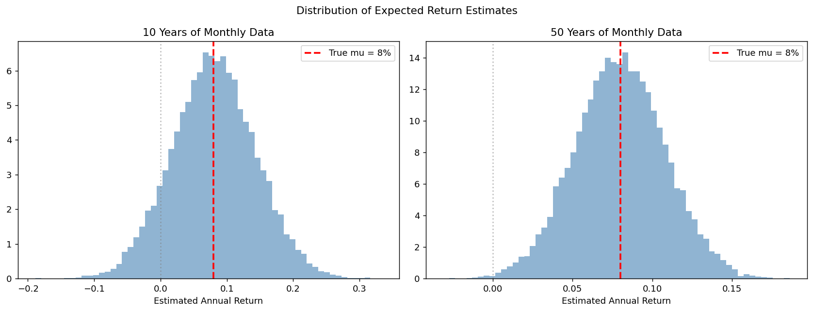
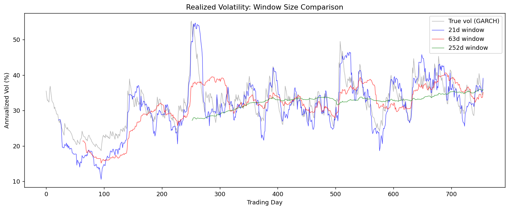

# 수익률 추정

## 개요

금융 자료로 기대수익률과 변동성을 추정하는 일은 추정이론의 가장 중요하면서도 가장 어려운 응용에 속한다. 기대수익률은 (신호 대 잡음 비가 매우 낮아) 악명 높을 만큼 부정확하게 추정되고, Sharpe 비율은 이 부정확성을 그대로 물려받으며, 변동성 추정값은 추정 구간의 선택에 크게 좌우된다. 이 페이지에서는 추정 정밀도, Sharpe 비율의 불확실성, 실현변동성 구간, 연율화 관례를 모의실험으로 탐구한다.

## 기대수익률의 정밀도

$T$년치 자료로 추정한 연간 수익률의 표준오차는:

$$\text{SE}(\hat{\mu}) = \frac{\sigma}{\sqrt{T}}$$

전형적인 주식 모수($\mu = 8\%$, $\sigma = 20\%$)에서는 추정 대상에 비해 표준오차가 크다.

```python
import numpy as np
import matplotlib.pyplot as plt
from scipy import stats

def expected_return_precision(seed=42):
    rng = np.random.default_rng(seed)
    mu_annual = 0.08
    sigma_annual = 0.20

    years = [5, 10, 20, 30, 50, 100]
    for T in years:
        se = sigma_annual / np.sqrt(T)
        lo = mu_annual - 1.96 * se
        hi = mu_annual + 1.96 * se
        print(f"T={T:>4} years  SE={se*100:.2f}%  "
              f"95% CI=[{lo*100:.2f}%, {hi*100:.2f}%]  Width={2*1.96*se*100:.2f}%")
expected_return_precision()
```

출력:

```
T=   5 years  SE=8.94%  95% CI=[-9.53%, 25.53%]  Width=35.06%
T=  10 years  SE=6.32%  95% CI=[-4.40%, 20.40%]  Width=24.79%
T=  20 years  SE=4.47%  95% CI=[-0.77%, 16.77%]  Width=17.53%
T=  30 years  SE=3.65%  95% CI=[0.84%, 15.16%]  Width=14.31%
T=  50 years  SE=2.83%  95% CI=[2.46%, 13.54%]  Width=11.09%
T= 100 years  SE=2.00%  95% CI=[4.08%, 11.92%]  Width=7.84%
```

!!! danger "근본적인 문제"
    자료가 10년치이면 평균 수익률의 95% 신뢰구간이 대략 $[-4.4\%, 20.4\%]$로, 0을 포함할 만큼 넓다. 50년치 자료에서도 표준오차가 2.8%로, 기대수익률을 0과 구분하기에 겨우 충분한 정도이다.

다음 모의실험은 10년치와 50년치 월별 자료로 추정한 연간 수익률의 분포를 보여준다:

```python
def return_precision_simulation(seed=42):
    rng = np.random.default_rng(seed)
    mu_annual, sigma_annual = 0.08, 0.20
    n_sim = 20_000

    fig, axes = plt.subplots(1, 2, figsize=(13, 5))
    for ax, T, title in [(axes[0], 10, '10 Years'), (axes[1], 50, '50 Years')]:
        n_m = T * 12
        mu_m = mu_annual / 12
        sig_m = sigma_annual / np.sqrt(12)
        ests = np.array([rng.normal(mu_m, sig_m, n_m).mean() * 12
                         for _ in range(n_sim)])
        ax.hist(ests, bins=60, density=True, alpha=0.6, color='steelblue')
        ax.axvline(mu_annual, color='red', ls='--', lw=2, label=f'True mu = {mu_annual*100:.0f}%')
        ax.axvline(0, color='gray', ls=':', alpha=0.5)
        ax.set_xlabel('Estimated Annual Return')
        ax.set_title(f'{title} of Monthly Data')
        ax.legend()
    plt.suptitle('Distribution of Expected Return Estimates')
    plt.tight_layout()
    plt.show()
return_precision_simulation()
```



## Sharpe 비율의 불확실성

**Sharpe 비율** $\text{SR} = \mu/\sigma$(또는 초과수익률을 변동성으로 나눈 값)는 위험조정 성과의 표준적인 측도이다. 그 추정 불확실성은 대략:

$$\text{SE}(\widehat{\text{SR}}) \approx \frac{1}{\sqrt{T}} \sqrt{1 + \frac{\text{SR}^2}{2}}$$

여기서 $T$는 기간의 수이다. 연간 Sharpe 비율이 0.5 근처이면 $t$-통계량 2를 얻는 데 대략 18년이 필요하다.

```python
def sharpe_ratio_uncertainty(seed=42):
    rng = np.random.default_rng(seed)
    true_sr = 0.5
    mu_annual = 0.08
    sigma_annual = mu_annual / true_sr
    n_sim = 30_000

    horizons = [3, 5, 10, 20, 50]
    for T in horizons:
        n_m = T * 12
        mu_m, sig_m = mu_annual / 12, sigma_annual / np.sqrt(12)
        sr_ests = []
        for _ in range(n_sim):
            r = rng.normal(mu_m, sig_m, n_m)
            sr_ests.append(r.mean() / r.std() * np.sqrt(12))
        sr_ests = np.array(sr_ests)
        print(f"T={T:>3} years  E[SR]={sr_ests.mean():.3f}  "
              f"SD(SR)={sr_ests.std():.3f}  P(SR<0)={( sr_ests < 0).mean():.1%}")
sharpe_ratio_uncertainty()
```

출력:

```
T=  3 years  E[SR]=0.518  SD(SR)=0.604  P(SR<0)=19.1%
T=  5 years  E[SR]=0.514  SD(SR)=0.461  P(SR<0)=12.9%
T= 10 years  E[SR]=0.507  SD(SR)=0.323  P(SR<0)=5.7%
T= 20 years  E[SR]=0.501  SD(SR)=0.226  P(SR<0)=1.2%
T= 50 years  E[SR]=0.502  SD(SR)=0.143  P(SR<0)=0.0%
```

!!! note "펀드 평가에 대한 함의"
    자료가 3년치뿐이면 참 Sharpe 비율이 0.5인 펀드도 추정 Sharpe 비율이 *음수*로 나올 확률이 약 20%이다. 10년치라도 참값 주위의 표준편차가 약 0.3이다. 실력 있는 운용자와 그렇지 않은 운용자를 믿을 만하게 구분하려면 수십 년치 자료가 필요하다.

## 실현변동성의 구간

실제로 변동성은 시간에 따라 변한다(GARCH 효과). 추정 구간의 선택에는 **편향–분산 맞바꿈**이 따른다:

- **짧은 구간** (5–21일): 최근 변화에 민감하지만 잡음이 많다
- **긴 구간** (126–252일): 매끄럽지만 뒤늦다

```python
def realized_volatility_windows(seed=42):
    rng = np.random.default_rng(seed)

    # Simulate GARCH(1,1) returns
    T = 756  # 3 years daily
    omega, alpha, beta = 0.00001, 0.08, 0.90
    sigma2 = np.zeros(T)
    returns = np.zeros(T)
    sigma2[0] = omega / (1 - alpha - beta)
    for t in range(1, T):
        sigma2[t] = omega + alpha * returns[t-1]**2 + beta * sigma2[t-1]
        returns[t] = rng.normal(0, np.sqrt(sigma2[t]))

    windows = [5, 10, 21, 63, 126, 252]

    fig, ax = plt.subplots(figsize=(12, 5))
    true_vol = np.sqrt(sigma2 * 252) * 100
    ax.plot(true_vol, 'k-', alpha=0.3, lw=0.8, label='True vol (GARCH)')

    for w, color in zip([21, 63, 252], ['blue', 'red', 'green']):
        rv = np.array([np.std(returns[max(0,t-w):t], ddof=1) * np.sqrt(252) * 100
                       for t in range(w, T)])
        ax.plot(range(w, T), rv, color=color, alpha=0.7, lw=0.8, label=f'{w}d window')

    ax.set_xlabel('Trading Day')
    ax.set_ylabel('Annualized Vol (%)')
    ax.set_title('Realized Volatility: Window Size Comparison')
    ax.legend()
    plt.tight_layout()
    plt.show()
realized_volatility_windows()
```



!!! info "실무 지침"
    유일하게 "옳은" 구간은 없다. 실무자들은 단기 위험관리에는 21일(월간) 구간을, 전략적 자산배분에는 252일(연간) 구간을 흔히 쓴다. 더 정교한 접근(지수가중, GARCH 모형)은 이 맞바꿈을 더 명시적으로 다룬다.

## 연율화 관례

금융 자료는 서로 다른 빈도로 수집된다. 표준적인 연율화는 수익률이 i.i.d.라고 가정한다:

| 빈도 | 평균 | 변동성 | Sharpe 비율 |
|-----------|------|------------|--------------|
| 일별 → 연간 | $\mu_a = \mu_d \times 252$ | $\sigma_a = \sigma_d \times \sqrt{252}$ | $\text{SR}_a = \text{SR}_d \times \sqrt{252}$ |
| 월별 → 연간 | $\mu_a = \mu_m \times 12$ | $\sigma_a = \sigma_m \times \sqrt{12}$ | $\text{SR}_a = \text{SR}_m \times \sqrt{12}$ |

```python
def annualization_conventions():
    mu_d = 0.0003     # Daily mean return
    sigma_d = 0.012   # Daily volatility

    print(f"Daily: mu = {mu_d*100:.4f}%, sigma = {sigma_d*100:.4f}%")
    print(f"Annualized (252 trading days):")
    print(f"  mu_annual   = {mu_d*252*100:.2f}%")
    print(f"  sigma_annual = {sigma_d*np.sqrt(252)*100:.2f}%")
    print(f"  SR_annual   = {mu_d/sigma_d*np.sqrt(252):.3f}")
annualization_conventions()
```

출력:

```
Daily: mu = 0.0300%, sigma = 1.2000%
Annualized (252 trading days):
  mu_annual   = 7.56%
  sigma_annual = 19.05%
  SR_annual   = 0.397
```

!!! warning "i.i.d. 가정"
    연율화 공식은 수익률이 i.i.d.라고 가정한다. 수익률의 자기상관(모멘텀이나 평균회귀)과 변동성 군집(GARCH 효과)은 단순한 $\sqrt{T}$ 축척 규칙을 무너뜨린다. 실무에서는 유용한 근사이지만 그 한계를 인식하고 써야 한다.

## 해석

- 금융에서 **기대수익률 추정**은 본질적으로 부정확하다. 신호 대 잡음 비 $\mu/\sigma$가 대개 작아서(일별로 약 0.03) 의미 있는 정밀도를 얻으려면 수십 년치 자료가 필요하다.
- **Sharpe 비율**은 잡음이 큰 추정값이다. 3년의 실적으로는 운용자에게 실력이 있는지 믿을 만하게 판단할 수 없다.
- **변동성 추정**은 수익률 추정보다 훨씬 정밀하다(변동성은 고빈도 자료에서 관측할 수 있지만 기대수익률은 그렇지 않다). 위험 모형이 수익률 예측보다 믿을 만한 이유가 여기에 있다.
- 구간 선택에서의 **편향–분산 맞바꿈**은 고전적 맞바꿈이 실무에 드러난 모습이다: 짧은 구간은 편향이 작고 분산이 크며, 긴 구간은 그 반대이다.
- **연율화**는 i.i.d. 가정 아래에서는 간단하지만 수익률에 계열 종속성이 있으면 조심스럽게 해석해야 한다.

## 연습문제

<div class="drillbox" markdown>

**연습문제 1.**
어떤 펀드의 참 연간 기대수익률이 10%, 연간 변동성이 15%이다. 5년치 월별 자료로 추정한 연간 수익률의 표준오차를 계산하라. 추정 수익률이 음수일 확률은?

</div>

??? success "풀이"
    월별 모수: $\mu_m = 10\%/12 \approx 0.833\%$, $\sigma_m = 15\%/\sqrt{12} \approx 4.330\%$.

    $n = 60$개월이면 $\text{SE}(\hat{\mu}_m) = \sigma_m/\sqrt{60}$이다. 연율화하면:

    $$\text{SE}(\hat{\mu}_a) = \sigma_a / \sqrt{T} = 15\% / \sqrt{5} = 6.71\%$$

    추정 수익률이 음수일 확률은:

    $$P(\hat{\mu}_a < 0) = P\left(Z < \frac{0 - 10\%}{6.71\%}\right) = P(Z < -1.49) = \mathcal{N}(-1.49) \approx 6.8\%$$

    참 기대수익률이 10%인데도 5년치 자료로는 음수 값을 추정할 확률이 약 7%이다. $\square$

<div class="drillbox" markdown>

**연습문제 2.**
델타 방법을 써서 추정 Sharpe 비율의 근사 표준오차 $\text{SE}(\widehat{\text{SR}}) \approx \sqrt{(1 + \text{SR}^2/2)/T}$를 유도하라.

</div>

??? success "풀이"
    Sharpe 비율은 $g(a, b) = a/\sqrt{b}$에 대해 $\text{SR} = \mu/\sigma = g(\mu, \sigma^2)$이다.

    델타 방법에 의해 $\hat{\mu} = \bar{X}$, $\hat{\sigma}^2 = S^2$에 대해:

    $$\text{Var}(\widehat{\text{SR}}) \approx \nabla g^T \Sigma \nabla g$$

    여기서 $\Sigma = \text{Cov}(\hat{\mu}, \hat{\sigma}^2)$이다. 정규 자료에서는 $\hat{\mu}$과 $\hat{\sigma}^2$이 독립이므로 $\Sigma$가 대각행렬이다:

    $$\Sigma = \begin{pmatrix} \sigma^2/n & 0 \\ 0 & 2\sigma^4/(n-1) \end{pmatrix}$$

    $g(\mu, \sigma^2) = \mu(\sigma^2)^{-1/2}$의 기울기는:

    $$\frac{\partial g}{\partial \mu} = \frac{1}{\sigma}, \qquad \frac{\partial g}{\partial \sigma^2} = -\frac{\mu}{2\sigma^3}$$

    따라서:

    $$\text{Var}(\widehat{\text{SR}}) \approx \frac{1}{\sigma^2}\cdot\frac{\sigma^2}{n} + \frac{\mu^2}{4\sigma^6}\cdot\frac{2\sigma^4}{n} = \frac{1}{n}\left(1 + \frac{\mu^2}{2\sigma^2}\right) = \frac{1}{n}\left(1 + \frac{\text{SR}^2}{2}\right)$$

    제곱근을 취하면 $\text{SE}(\widehat{\text{SR}}) \approx \sqrt{(1 + \text{SR}^2/2)/n}$이다.

    연간 자료에서는 $n = T$(년)이므로 위 공식이 된다. $\square$

<div class="drillbox" markdown>

**연습문제 3.**
표본추출 빈도를 높이는 것이(예: 월별에서 일별로) 기대수익률 추정의 정밀도는 개선하지 못하면서 변동성 추정은 개선하는 이유를 설명하라.

</div>

??? success "풀이"
    **기대수익률:** i.i.d. 가정 아래에서 연간 표준오차는 $\text{SE} = \sigma_a/\sqrt{T}$이며, 여기서 $T$는 자료의 *햇수*이다. 같은 $T$년 안에서 월별 대신 일별로 표본을 뽑으면 관측값은 늘지만 각각의 평균과 분산이 비례해서 작아진다. 순효과는 상쇄된다:

    - 일별: 관측값 $n = 252T$개, $\mu_d = \mu_a/252$, $\sigma_d = \sigma_a/\sqrt{252}$. 연율화 평균의 표준오차: $\sigma_d\sqrt{252}/\sqrt{n} = \sigma_a/\sqrt{T}$.

    정밀도는 표본추출 빈도가 아니라 오직 시간 범위 $T$에 달려 있다. 평균 수익률이 시간에 따라 선형으로 누적되기 때문이다.

    **변동성:** 변동성 추정의 정밀도는 관측값이 많아질수록 좋아진다. $\hat{\sigma}^2$의 표준오차는 관측값 수 $n$에 대해 $1/\sqrt{n}$에 비례한다. 일별 자료는 연간 12개 대신 252개의 관측값을 주므로 변동성 추정이 $\sqrt{252/12} \approx 4.6$배 개선된다.

    직관적으로, 각 일별 수익률은 (제곱 크기를 통해) 현재 분산에 대한 정보를 드러내므로 더 자주 표본을 뽑는 것이 실제로 도움이 된다. 반면 각 일별 수익률이 추세에 대해 담고 있는 신호는 아주 작고, 그 신호는 관측을 자주 한다고 해서 더 빨리 쌓이지 않는다. $\square$

<div class="drillbox" markdown>

**연습문제 4.**
GARCH(1,1) 모형의 모수가 $\omega = 0.00001$, $\alpha = 0.08$, $\beta = 0.90$이다. 무조건(장기) 연율화 변동성을 계산하라. 이 과정은 정상인가?

</div>

??? success "풀이"
    GARCH(1,1) 모형은 $\sigma_t^2 = \omega + \alpha r_{t-1}^2 + \beta \sigma_{t-1}^2$이다.

    정상성에는 $\alpha + \beta < 1$이 필요하다. 여기서는 $\alpha + \beta = 0.08 + 0.90 = 0.98 < 1$이므로 정상이다.

    무조건 분산은:

    $$\sigma^2 = \frac{\omega}{1 - \alpha - \beta} = \frac{0.00001}{1 - 0.98} = \frac{0.00001}{0.02} = 0.0005$$

    무조건 일별 변동성은 $\sigma = \sqrt{0.0005} \approx 0.02236$, 즉 $2.236\%$이다.

    연율화하면 $\sigma_a = 0.02236 \times \sqrt{252} \approx 35.5\%$이다.

    $\alpha + \beta = 0.98$이 1에 가깝다는 것은 변동성의 지속성이 높다는 뜻이다 — 변동성 충격이 천천히 감쇠한다. $\square$

<div class="drillbox" markdown>

**연습문제 5.**
어떤 실무자가 일별 수익률이 대체로 i.i.d.이므로 월별 Sharpe 비율에 $\sqrt{12}$를 곱하면 연간 Sharpe 비율이 된다고 주장한다. 어떤 조건에서 맞고, 언제 틀릴 수 있는가?

</div>

??? success "풀이"
    이 주장은 일별 수익률의 i.i.d. 가정에 기댄다. i.i.d. 아래에서:

    $$\text{SR}_{\text{annual}} = \text{SR}_{\text{monthly}} \times \sqrt{12} = \text{SR}_{\text{daily}} \times \sqrt{252}$$

    i.i.d.이면 $\mu_a = 12\mu_m$이고 $\sigma_a = \sqrt{12}\sigma_m$이므로 $\text{SR}_a = 12\mu_m/(\sqrt{12}\sigma_m) = \sqrt{12}\cdot\text{SR}_m$이 되어 옳다.

    **틀리게 되는 조건:**

    1. **수익률의 계열상관:** 수익률이 양의 자기상관을 가지면(모멘텀) 참 연간 변동성이 $\sqrt{12}\sigma_m$보다 크므로 $\sqrt{12}$ 축척은 연간 Sharpe 비율을 **과대평가**한다. 음의 자기상관(평균회귀)이면 과소평가하게 된다.

    2. **변동성 군집(GARCH):** 변동성이 시간에 따라 변하면 일별 수익률의 복리가 단순한 $\sqrt{T}$ 규칙을 따르지 않는다. 연간 분포는 축척한 일별 분포보다 꼬리가 두껍다.

    3. **제곱수익률의 계열상관:** 수익률이 무상관이더라도 (GARCH 모형에 존재하는) $r_t^2$의 자기상관이 연율화 변동성에 영향을 준다.

    실무에서 $\sqrt{T}$ 규칙은 유용한 근사이지만 해당 빈도에서 직접 계산한 값과 대조해 검증해야 한다. $\square$
