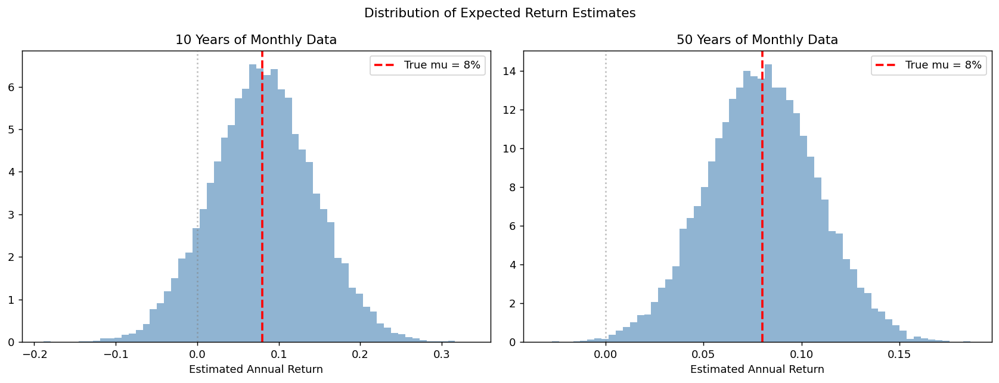
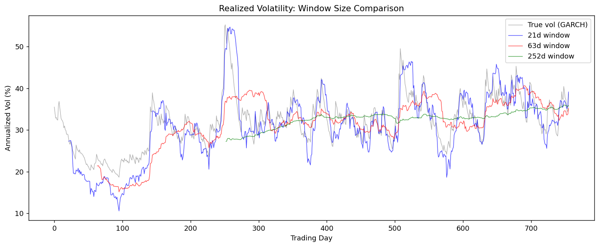

# 수익률 추정

## 개요

금융 자료로 기대수익률과 변동성을 추정하는 일은 추정이론의 가장 중요하면서도 가장 어려운 응용에 속한다. 기대수익률은 (신호 대 잡음 비가 매우 낮아) 악명 높을 만큼 부정확하게 추정되고, Sharpe 비율은 이 부정확성을 그대로 물려받으며, 변동성 추정값은 추정 구간의 선택에 크게 좌우된다. 이 페이지에서는 추정 정밀도, Sharpe 비율의 불확실성, 실현변동성 구간, 연율화 관례를 모의실험으로 탐구한다.

## 기대수익률의 정밀도

$T$년치 자료로 추정한 연간 수익률의 표준오차는:

$$\text{SE}(\hat{\mu}) = \frac{\sigma}{\sqrt{T}}$$

전형적인 주식 모수($\mu = 8\%$, $\sigma = 20\%$)에서는 추정 대상에 비해 표준오차가 크다.

<div class="exbox" markdown>

**보기 1.** <span class="diff easy" title="쉬움"></span> 기대수익률의 정밀도. 참 기대수익률 연 $8\%$, 변동성 연 $20\%$인 주식을 $T$년 관측한다.

**(1)** $95\%$ 신뢰구간이 $0$을 **배제하려면** $T$가 얼마여야 하는지 구하시오.

**(2)** 추정값을 참값의 $\pm 10\%$ 안으로, 곧 $[7.2\%, 8.8\%]$로 좁히려면 몇 년이 필요한가.

</div>

??? success "풀이"

    **(1) 해석적으로.** $\hat\mu \sim N(\mu, \sigma^2/T)$이므로 구간은 $\hat\mu \pm 1.96\,\sigma/\sqrt T$다. 중심이 참값 $\mu$에 있다고 보고 아래끝이 $0$을 넘으려면

    $$
    \mu - 1.96\frac{\sigma}{\sqrt T} > 0
    \quad\Longleftrightarrow\quad
    T > \left(\frac{1.96\,\sigma}{\mu}\right)^2
    = \left(\frac{1.96 \times 0.20}{0.08}\right)^2 = 4.9^2 = 24.01
    $$

    이므로 **$T = 25$년**이다. 괄호 안의 $\sigma/\mu = 2.5$가 **잡음 대 신호 비**이고, 필요한 햇수가 그 **제곱**으로 들어온다는 것이 이 식의 전부다.

    **(2)** 같은 식에서 반폭을 $0.1\mu$로 두면

    $$
    1.96\frac{\sigma}{\sqrt T} \le 0.1\mu
    \quad\Longleftrightarrow\quad
    T \ge \left(\frac{19.6\,\sigma}{\mu}\right)^2 = (19.6 \times 2.5)^2 = 49^2 = 2401
    $$

    **$2401$년**이다. 구간을 $10$배 좁히려면 햇수가 $100$배 든다. 신뢰구간을 떼고 표준오차만 $\mu$의 $10\%$ 아래로 내리는 더 느슨한 기준으로 재어도 $T = (2.5/0.1)^2 = 625$년이다.

    **이것이 금융 통계학의 근본 사실이다.** 주식시장이 믿을 만한 자료를 남긴 기간 전체가 $100$년 남짓인데, 그 $100$년을 다 써도 기대수익률의 표준오차가 $2\%$다. **기대수익률은 "정밀하게 추정하기 어려운 양"이 아니라 "사람의 시간 규모에서는 추정할 수 없는 양"에 가깝다.**

    표를 찍어 두 답이 들어맞는 자리를 확인한다.

    ```python
    import numpy as np
    import matplotlib.pyplot as plt
    from scipy import stats

    def expected_return_precision(seed=42):
        """기대수익률을 몇 %까지 좁힐 수 있는지 자료 기간별로 계산한다.

        변동성 20%에 자료 10년이면 표준오차만 6%가 넘는다. 추정하려는 값이 8%인데
        오차가 그만큼이니, 자료를 한 사람의 평생만큼 모아도 답은 흐릿하다.
        """
        rng = np.random.default_rng(seed)
        mu_annual = 0.08      # 참 기대수익률 연 8%
        sigma_annual = 0.20   # 변동성 연 20%

        years = [5, 10, 20, 30, 50, 100]
        for T in years:
            se = sigma_annual / np.sqrt(T)
            lo = mu_annual - 1.96 * se
            hi = mu_annual + 1.96 * se
            print(f"T={T:>4} years  SE={se*100:.2f}%  "
                  f"95% CI=[{lo*100:.2f}%, {hi*100:.2f}%]  Width={2*1.96*se*100:.2f}%")
    expected_return_precision()
    ```

    출력:

    ```
    T=   5 years  SE=8.94%  95% CI=[-9.53%, 25.53%]  Width=35.06%
    T=  10 years  SE=6.32%  95% CI=[-4.40%, 20.40%]  Width=24.79%
    T=  20 years  SE=4.47%  95% CI=[-0.77%, 16.77%]  Width=17.53%
    T=  30 years  SE=3.65%  95% CI=[0.84%, 15.16%]  Width=14.31%
    T=  50 years  SE=2.83%  95% CI=[2.46%, 13.54%]  Width=11.09%
    T= 100 years  SE=2.00%  95% CI=[4.08%, 11.92%]  Width=7.84%
    ```

    **(1)의 $T = 25$가 표에서 확인된다.** $T = 20$ 줄의 아래끝이 $-0.77\%$로 아직 $0$ 아래이고, $T = 30$ 줄에서 $+0.84\%$로 올라선다. 두 줄 사이 어딘가에서 넘어가는데 (1)이 그 자리를 $24.01$로 짚었다.

    (2)의 답도 같은 표에서 읽을 수 있다. 목표 폭 $1.6\%$는 $T = 100$의 폭 $7.84\%$보다도 **다섯 배 좁다.** 폭이 $1/\sqrt T$로 줄므로 $7.84/1.6 = 4.9$배 더 좁히려면 햇수를 $4.9^2 = 24$배, 곧 $2400$년으로 늘려야 한다.

    표를 세로로 읽으면 $1/\sqrt T$ 법칙이 그대로 보인다. $T$가 $5$년에서 $20$년으로 **네 배** 되자 표준오차가 $8.94\%$에서 $4.47\%$로 정확히 절반이 되었다. **오차를 반으로 줄이는 값은 언제나 자료를 네 배 모으는 것**이고, 자료가 시간으로만 늘어나는 금융에서는 그 값이 다른 어느 분야보다 비싸다.

!!! danger "근본적인 문제"
    자료가 10년치이면 평균 수익률의 95% 신뢰구간이 대략 $[-4.4\%, 20.4\%]$로, 0을 포함할 만큼 넓다. 50년치 자료에서도 표준오차가 2.8%로, 기대수익률을 0과 구분하기에 겨우 충분한 정도이다.

다음 모의실험은 10년치와 50년치 월별 자료로 추정한 연간 수익률의 분포를 보여준다:

<div class="exbox" markdown>

**보기 2.** <span class="diff easy" title="쉬움"></span> 추정값의 분포 — 10년과 50년. 참값 $\mu = 8\%$, $\sigma = 20\%$인 **월별** 수익률을 $10$년치($120$개)와 $50$년치($600$개) 만들어 연율화한 추정값을 2만 번 기록한다.

**(1)** 추정값이 **음수로 나올 확률**을 두 기간에 대해 구하시오.

**(2)** 월별 자료를 쓰면 관측값이 $12$배 많아진다. 그만큼 $\hat\mu$가 정밀해지는가.

</div>

??? success "풀이"

    **(1) 해석적으로.** 연율화한 추정값은 $\hat\mu_a \sim N(0.08,\ 0.20^2/T)$이므로

    $$
    P(\hat\mu_a < 0) = \Phi\!\left(\frac{0 - \mu}{\sigma/\sqrt T}\right) = \Phi\!\left(-\frac{\mu}{\sigma}\sqrt T\right) = \Phi(-0.4\sqrt T)
    $$

    이다. $\mu/\sigma = 0.4$가 연간 샤프비율이고, **음수가 나올 확률은 그것과 $\sqrt T$의 곱 하나로 정해진다.**

    $$
    T = 10:\ \Phi(-1.2649) = 0.1030,
    \qquad
    T = 50:\ \Phi(-2.8284) = 0.0023
    $$

    **$10$년을 관측하고도 열 번에 한 번은 "이 자산은 돈을 잃었다"는 결론이 나온다.** 참으로 연 $8\%$를 버는 자산인데도 그렇다.

    **(2) 아니다. 전혀 정밀해지지 않는다.** 월별 모수는 $\mu_m = \mu/12$, $\sigma_m = \sigma/\sqrt{12}$이고 관측값이 $n = 12T$개이므로, 연율화한 추정량의 표준오차는

    $$
    12 \times \frac{\sigma_m}{\sqrt{12T}}
    = 12 \times \frac{\sigma/\sqrt{12}}{\sqrt{12T}}
    = \frac{12\,\sigma}{12\sqrt T}
    = \frac{\sigma}{\sqrt T}
    $$

    로 **연별 자료를 쓸 때와 똑같다.** $12$라는 수가 남김없이 약분된다. 일별 자료를 써서 $252T$개를 모아도 결과는 같다.

    까닭은 한 줄이다. **평균을 추정할 때 쓰이는 정보는 관측 횟수가 아니라 관측 기간의 총 길이다.** 월별 수익률의 평균은 결국 $(\text{마지막 가격} - \text{첫 가격})$을 기간으로 나눈 것이라, 중간을 아무리 촘촘히 쪼개도 양 끝이 그대로이면 더 알아낼 것이 없다.

    **변동성은 사정이 정반대다.** $\hat\sigma$의 상대 표준오차는 $1/\sqrt{2n}$이라 **관측 횟수**에 달려 있으므로, 일별로 쪼개면 $\sqrt{252}$배 정밀해진다. $10$년치로 재면 $\hat\mu$의 상대오차가 $79\%$인데 $\hat\sigma$의 상대오차는 $1/\sqrt{2 \times 2520} = 1.4\%$다. **위험 모형이 수익률 예측보다 믿을 만한 이유가 이 비대칭이다.**

    모의실험으로 두 답을 확인한다.

    ```python
    plt.rcParams["font.family"] = "Apple SD Gothic Neo"
    plt.rcParams["axes.unicode_minus"] = False

    def return_precision_simulation(seed=42):
        """앞 표의 숫자를 그림으로 옮긴다. 10년과 50년을 나란히 놓았다.

        10년 쪽 히스토그램은 0 을 한참 넘어 왼쪽까지 퍼져 있다. 참 수익률이
        양수여도 10년을 관측한 결과가 음수로 나오는 일이 드물지 않다는 뜻이다.
        """
        rng = np.random.default_rng(seed)
        mu_annual, sigma_annual = 0.08, 0.20
        n_sim = 20_000

        fig, axes = plt.subplots(1, 2, figsize=(13, 5))
        for ax, T, title in [(axes[0], 10, '10 Years'), (axes[1], 50, '50 Years')]:
            # 월별 자료로 바꾼다. 평균은 12 로 나누고 변동성은 sqrt(12) 로 나눈다.
            # 평균은 기간에 비례해 쌓이고 표준편차는 그 제곱근으로만 쌓이기 때문이다.
            n_m = T * 12
            mu_m = mu_annual / 12
            sig_m = sigma_annual / np.sqrt(12)
            ests = np.array([rng.normal(mu_m, sig_m, n_m).mean() * 12
                             for _ in range(n_sim)])
            ax.hist(ests, bins=60, density=True, alpha=0.6, color='steelblue')
            ax.axvline(mu_annual, color='red', ls='--', lw=2, label=f'True mu = {mu_annual*100:.0f}%')
            ax.axvline(0, color='gray', ls=':', alpha=0.5)
            ax.set_xlabel('Estimated Annual Return')
            ax.set_title(f'{title} of Monthly Data')
            ax.legend()
            # 월별로 모아도 SE 가 sigma/sqrt(T) 그대로인지, 음수 비율이 이론과 맞는지 본다.
            print(f"T={T:>2}년: 모의 SE={ests.std(ddof=1):.5f}  σ/√T={sigma_annual/np.sqrt(T):.5f}   "
                  f"P(음수) 모의={np.mean(ests<0):.4f}  이론={stats.norm.cdf(-0.4*np.sqrt(T)):.4f}")
        plt.suptitle('Distribution of Expected Return Estimates')
        plt.tight_layout()
        plt.show()
    return_precision_simulation()
    ```

    출력:

    ```
    T=10년: 모의 SE=0.06292  σ/√T=0.06325   P(음수) 모의=0.1008  이론=0.1030
    T=50년: 모의 SE=0.02822  σ/√T=0.02828   P(음수) 모의=0.0022  이론=0.0023
    ```

    

    **(2)의 답이 숫자로 확인된다.** 월별 자료 $120$개로 추정했는데 모의 표준오차가 $0.06292$로 **연별 공식 $\sigma/\sqrt{10} = 0.06325$와 같다.** $50$년 쪽도 $0.02822$ 대 $0.02828$이다. 두 줄 모두 상대오차가 $0.5\%$ 안인데, 2만 번으로 표준편차를 잴 때의 몬테카를로 오차가 $1/\sqrt{2 \times 20000} = 0.5\%$이므로 꼭 맞는 크기다. **관측값을 $12$배로 늘렸는데 정밀도가 한 자리도 좋아지지 않았다.**

    음수 비율도 (1)과 맞는다. $10$년에서 $10.08\%$ 대 이론 $10.30\%$, $50$년에서 $0.22\%$ 대 $0.23\%$다. 비율의 몬테카를로 표준오차가 $\sqrt{0.103 \times 0.897/20000} = 0.21\%$이므로 $10$년 줄의 $0.22\%p$ 차이는 $1$ 표준오차다.

    그림의 두 판을 견주면 같은 이야기가 눈에 보인다. 왼쪽 히스토그램은 회색 점선($0$)을 한참 넘어 왼쪽까지 퍼져 있고, 오른쪽은 $0$에 거의 닿지 않는다. **두 판의 폭 비는 $\sqrt{50/10} = 2.24$**이며, $40$년을 더 기다려 얻는 것이 고작 그만큼이다.

## Sharpe 비율의 불확실성

**Sharpe 비율** $\text{SR} = \mu/\sigma$(또는 초과수익률을 변동성으로 나눈 값)는 위험조정 성과의 표준적인 측도이다. 그 추정 불확실성은 대략:

$$\text{SE}(\widehat{\text{SR}}) \approx \frac{1}{\sqrt{T}} \sqrt{1 + \frac{\text{SR}^2}{2}}$$

여기서 $T$는 기간의 수이다. 연간 Sharpe 비율이 0.5 근처이면 $t$-통계량 2를 얻는 데 대략 18년이 필요하다.

<div class="exbox" markdown>

**보기 3.** <span class="diff easy" title="쉬움"></span> 샤프비율의 불확실성. 참 연간 샤프비율이 $0.5$인 전략($\mu = 8\%$, $\sigma = 16\%$)의 월별 수익률을 $T$년치 만들어 샤프비율을 추정하는 일을 3만 번 되풀이한다.

**(1)** 추정 샤프비율이 **음수로 나올 확률**을 $T$의 함수로 **정확히** 구하시오.

**(2)** 위 본문의 공식 $\operatorname{SE}(\widehat{\mathrm{SR}}) \approx \sqrt{(1 + \mathrm{SR}^2/2)/T}$에서 $\mathrm{SR}$에 **연간** 값 $0.5$를 넣을 것인가 **월간** 값을 넣을 것인가. 출력으로 판정하시오.

</div>

??? success "풀이"

    **(1) 해석적으로.** 샤프비율 추정값은 $\widehat{\mathrm{SR}} = \bar r / \hat\sigma$이고 분모는 **언제나 양수**다. 따라서

    $$
    \widehat{\mathrm{SR}} < 0
    \iff
    \bar r < 0
    $$

    이다. 분모가 아무 역할도 하지 않으므로 보기 2의 계산이 그대로 쓰인다.

    $$
    P(\widehat{\mathrm{SR}} < 0) = P(\bar r < 0) = \Phi\!\left(-\frac{\mu}{\sigma}\sqrt T\right) = \Phi(-0.5\sqrt T)
    $$

    **근사가 아니라 정확한 값**이다(수익률이 정규라는 가정 아래에서). 수를 넣으면

    | $T$ | $-0.5\sqrt T$ | $P(\widehat{\mathrm{SR}} < 0)$ |
    |---:|---:|---:|
    | $3$ | $-0.866$ | $0.1932$ |
    | $5$ | $-1.118$ | $0.1318$ |
    | $10$ | $-1.581$ | $0.0569$ |
    | $20$ | $-2.236$ | $0.0127$ |
    | $50$ | $-3.536$ | $0.0002$ |

    **(2) 어느 $\mathrm{SR}$을 넣을 것인가.** 델타 방법이 주는 식은 **관측 단위**에 대한 것이다. 월별 관측값 $n = 12T$개로 월간 샤프비율을 추정하면

    $$
    \operatorname{SE}(\widehat{\mathrm{SR}}_m) \approx \sqrt{\frac{1 + \mathrm{SR}_m^2/2}{12T}}
    $$

    이고, 연율화는 $\sqrt{12}$를 곱하는 것이므로

    $$
    \operatorname{SE}(\widehat{\mathrm{SR}}_a) \approx \sqrt{12}\,\sqrt{\frac{1 + \mathrm{SR}_m^2/2}{12T}}
    = \sqrt{\frac{1 + \mathrm{SR}_m^2/2}{T}}
    $$

    다. **$T$는 햇수로 남지만 괄호 안의 $\mathrm{SR}$은 월간 값 $\mathrm{SR}_m = 0.5/\sqrt{12} = 0.1443$이어야 한다.** 연간 값 $0.5$를 그대로 넣는 것은 흔한 잘못이고, 두 답이 꽤 다르다.

    $$
    \text{연간 넣기: } \sqrt{\frac{1.125}{T}} = \frac{1.0607}{\sqrt T},
    \qquad
    \text{월간 넣기: } \sqrt{\frac{1.01042}{T}} = \frac{1.0052}{\sqrt T}
    $$

    모의실험이 판정해 준다.

    ```python
    def sharpe_ratio_uncertainty(seed=42):
        """샤프비율 추정값이 얼마나 흔들리는지, 음수로 나올 확률은 얼마인지 본다.

        샤프비율이 참으로 0.5 인 좋은 전략이라도, 3년치 성과만 보면 음수로
        보일 확률이 제법 된다. 짧은 성과 기록으로 운용자를 고르기 어려운 이유다.
        """
        rng = np.random.default_rng(seed)
        true_sr = 0.5
        mu_annual = 0.08
        # 샤프비율 = 평균/변동성 이므로 변동성은 이렇게 거꾸로 정해진다.
        sigma_annual = mu_annual / true_sr
        n_sim = 30_000

        horizons = [3, 5, 10, 20, 50]
        for T in horizons:
            n_m = T * 12
            mu_m, sig_m = mu_annual / 12, sigma_annual / np.sqrt(12)
            sr_ests = []
            for _ in range(n_sim):
                r = rng.normal(mu_m, sig_m, n_m)
                sr_ests.append(r.mean() / r.std() * np.sqrt(12))
            sr_ests = np.array(sr_ests)
            print(f"T={T:>3} years  E[SR]={sr_ests.mean():.3f}  "
                  f"SD(SR)={sr_ests.std():.3f}  P(SR<0)={( sr_ests < 0).mean():.1%}")
    sharpe_ratio_uncertainty()
    ```

    출력:

    ```
    T=  3 years  E[SR]=0.518  SD(SR)=0.604  P(SR<0)=19.1%
    T=  5 years  E[SR]=0.514  SD(SR)=0.461  P(SR<0)=12.9%
    T= 10 years  E[SR]=0.507  SD(SR)=0.323  P(SR<0)=5.7%
    T= 20 years  E[SR]=0.501  SD(SR)=0.226  P(SR<0)=1.2%
    T= 50 years  E[SR]=0.502  SD(SR)=0.143  P(SR<0)=0.0%
    ```

    음수 확률부터 보자. $19.1\%$, $12.9\%$, $5.7\%$, $1.2\%$, $0.0\%$가 (1)의 $19.32\%$, $13.18\%$, $5.69\%$, $1.27\%$, $0.02\%$와 모두 맞는다. 3만 번에서 비율의 몬테카를로 표준오차가 가장 큰 $T = 3$에서도 $0.23\%$p이므로 $19.1$ 대 $19.32$는 $1$ 표준오차 안이다. **근사 없이 유도한 식이라 당연히 맞아야 하고, 실제로 맞는다.**

    (2)의 판정은 $\operatorname{SD}$ 열이 한다.

    | $T$ | 모의 $\operatorname{SD}$ | 연간 $\mathrm{SR}$ 넣기 | 어긋남 | 월간 $\mathrm{SR}$ 넣기 | 어긋남 |
    |---:|---:|---:|---:|---:|---:|
    | $3$ | $0.604$ | $0.6124$ | $+1.4\%$ | $0.5803$ | $-3.9\%$ |
    | $5$ | $0.461$ | $0.4743$ | $+2.9\%$ | $0.4495$ | $-2.5\%$ |
    | $10$ | $0.323$ | $0.3354$ | $+3.8\%$ | $0.3179$ | $-1.6\%$ |
    | $20$ | $0.226$ | $0.2372$ | $+4.9\%$ | $0.2248$ | $-0.5\%$ |
    | $50$ | $0.143$ | $0.1500$ | $+4.9\%$ | $0.1422$ | $-0.6\%$ |

    **$T$가 커질수록 월간 넣기가 이긴다.** $T = 20$과 $50$에서 월간 쪽 어긋남이 $0.5\%$ 안으로 들어오는 동안 연간 쪽은 $4.9\%$에 머문다. 점근 공식은 $T$가 클 때 맞아야 하는 식이므로, 이 두 줄이 판정을 내린다. **(2)의 답은 "월간 값을 넣어야 한다"이다.**

    반대로 $T = 3$에서는 연간 넣기가 더 가까워 보인다($+1.4\%$ 대 $-3.9\%$). 이것을 연간 넣기가 옳다는 증거로 읽으면 안 된다. **$T = 3$은 델타 방법 자체가 못 미더운 영역**이고, 거기서 공식이 참값보다 작게 나오는 유한표본 효과가 연간 넣기의 과대평가와 **우연히 상쇄**된 것이다. 되풀이를 20만 번으로 늘려 참 $\operatorname{SD}$를 다시 재면 $T = 3$에서 $0.6075$, $T = 10$에서 $0.3223$, $T = 50$에서 $0.1426$으로, 큰 $T$에서 월간 넣기와 셋째 자리까지 맞는다.

    $\operatorname{E}[\widehat{\mathrm{SR}}]$ 열도 읽어 둘 것이 있다. $0.518 \to 0.514 \to 0.507 \to 0.501 \to 0.502$로 **참값 $0.5$ 위에서 내려온다.** 짧은 기록일수록 샤프비율이 **부풀려 보고된다**는 뜻이고, 운용 성과를 짧은 구간으로 자랑하는 쪽에 유리한 방향의 편향이다. 분모 $\hat\sigma$가 작게 나온 표본에서 $\widehat{\mathrm{SR}}$이 크게 튀는, 비선형 함수에 옌센 부등식이 걸린 전형적인 꼴이다.

!!! note "펀드 평가에 대한 함의"
    자료가 3년치뿐이면 참 Sharpe 비율이 0.5인 펀드도 추정 Sharpe 비율이 *음수*로 나올 확률이 약 20%이다. 10년치라도 참값 주위의 표준편차가 약 0.3이다. 실력 있는 운용자와 그렇지 않은 운용자를 믿을 만하게 구분하려면 수십 년치 자료가 필요하다.

## 실현변동성의 구간

실제로 변동성은 시간에 따라 변한다(GARCH 효과). 추정 구간의 선택에는 **편향–분산 맞바꿈**이 따른다:

- **짧은 구간** (5–21일): 최근 변화에 민감하지만 잡음이 많다
- **긴 구간** (126–252일): 매끄럽지만 뒤늦다

<div class="exbox" markdown>

**보기 4.** <span class="diff easy" title="쉬움"></span> 실현변동성과 창의 길이. $\omega = 10^{-5}$, $\alpha = 0.08$, $\beta = 0.90$인 GARCH(1,1)로 $756$ 거래일을 만들고, $21$일·$63$일·$252$일 창으로 실현변동성을 재어 참 변동성과 겹쳐 그린다.

**(1)** 이 GARCH 과정의 **무조건 연변동성**과 충격의 **반감기**를 구하시오.

**(2)** 창 길이 $w$마다 **잡음**과 **지연**이 각각 얼마인지 적고, 셋 가운데 어느 창이 어느 쪽에 발목을 잡히는지 가리시오.

</div>

??? success "풀이"

    **(1) 해석적으로.** GARCH(1,1) $\sigma_t^2 = \omega + \alpha r_{t-1}^2 + \beta\sigma_{t-1}^2$에서 기댓값을 취하면 $E[\sigma^2] = \omega + (\alpha+\beta)E[\sigma^2]$이므로

    $$
    \sigma^2_{\text{무조건}} = \frac{\omega}{1 - \alpha - \beta}
    = \frac{10^{-5}}{0.02} = 5 \times 10^{-4}
    $$

    이고, 일변동성이 $\sqrt{5\times10^{-4}} = 0.02236$, 연율화하면

    $$
    0.02236\sqrt{252} = 0.355 = 35.5\%
    $$

    다. 충격은 $(\alpha+\beta)^k$로 식으므로 반감기는

    $$
    k_{1/2} = \frac{\ln 0.5}{\ln(\alpha+\beta)} = \frac{\ln 0.5}{\ln 0.98} = 34.3\ \text{거래일}
    $$

    이다. $\alpha + \beta = 0.98$이라는 높은 지속성이 **변동성 군집**을 만드는 장치이고, 실제 주식자료에서 흔히 추정되는 값이기도 하다.

    **(2) 잡음과 지연.** 두 비용이 창 길이에 **반대 방향**으로 달린다.

    - **잡음.** 변동성이 창 안에서 일정하다면 $w$개로 잰 표준편차의 상대 표준오차가 $1/\sqrt{2(w-1)}$이다.
    - **지연.** 창은 **과거 $w$일의 평균**을 보므로 그 무게중심이 $(w-1)/2$일 전에 있다. 이것을 (1)의 반감기 $34.3$일과 견주어야 한다.

    | 창 $w$ | 잡음 $1/\sqrt{2(w-1)}$ | 지연 $(w-1)/2$ | 반감기 대비 |
    |---:|---:|---:|---:|
    | $21$ | $15.8\%$ | $10$일 | $0.29$배 |
    | $63$ | $9.0\%$ | $31$일 | $0.90$배 |
    | $252$ | $4.5\%$ | $126$일 | $3.7$배 |

    **$21$일 창은 잡음에, $252$일 창은 지연에 발목이 잡힌다.** $63$일 창은 지연이 반감기와 비슷해 둘 사이 어딘가다. 표를 보면 창을 네 배 늘려 얻는 것(잡음 $15.8 \to 9.0\%$)보다 잃는 것(지연 $10 \to 31$일)이 크다는 것도 읽힌다.

    그림을 그린 뒤 (2)의 두 비용을 수로 재어 본다.

    ```python
    plt.rcParams["font.family"] = "Apple SD Gothic Neo"
    plt.rcParams["axes.unicode_minus"] = False

    def realized_volatility_windows(seed=42):
        """변동성을 재는 창의 길이가 바꾸는 것 — 민감도와 잡음의 맞바꿈.

        짧은 창은 변동성의 변화를 빨리 따라가지만 들쭉날쭉하고, 긴 창은
        매끄럽지만 뒤늦게 반응한다. 어느 쪽도 공짜가 아니다.
        """
        rng = np.random.default_rng(seed)

        # GARCH(1,1): 오늘의 변동성이 어제의 충격과 어제의 변동성에 함께 기댄다.
        # 실제 수익률처럼 변동성이 뭉쳐 다니는 자료를 만들기 위한 모형이다.
        T = 756  # 3년치 거래일
        omega, alpha, beta = 0.00001, 0.08, 0.90
        sigma2 = np.zeros(T)
        returns = np.zeros(T)
        sigma2[0] = omega / (1 - alpha - beta)
        for t in range(1, T):
            sigma2[t] = omega + alpha * returns[t-1]**2 + beta * sigma2[t-1]
            returns[t] = rng.normal(0, np.sqrt(sigma2[t]))

        windows = [5, 10, 21, 63, 126, 252]

        fig, ax = plt.subplots(figsize=(12, 5))
        true_vol = np.sqrt(sigma2 * 252) * 100
        ax.plot(true_vol, 'k-', alpha=0.3, lw=0.8, label='True vol (GARCH)')

        # 창 길이를 한 달·한 분기·한 해로 두고 같은 자료에 굴린다.
        for w, color in zip([21, 63, 252], ['blue', 'red', 'green']):
            rv = np.array([np.std(returns[max(0,t-w):t], ddof=1) * np.sqrt(252) * 100
                           for t in range(w, T)])
            ax.plot(range(w, T), rv, color=color, alpha=0.7, lw=0.8, label=f'{w}d window')

        ax.set_xlabel('Trading Day')
        ax.set_ylabel('Annualized Vol (%)')
        ax.set_title('Realized Volatility: Window Size Comparison')
        ax.legend()
        plt.tight_layout()
        plt.show()
    realized_volatility_windows()
    ```

    

    ```python
    # (2) 의 두 비용을 따로 잰다.
    # 잡음 = 그 창 안의 **평균** 변동성 대비 오차,  지연 = **당일** 참 변동성과의 상관.
    rng = np.random.default_rng(42)
    T, omega, alpha, beta = 756, 0.00001, 0.08, 0.90
    sigma2 = np.zeros(T); returns = np.zeros(T)
    sigma2[0] = omega / (1 - alpha - beta)
    for t in range(1, T):
        sigma2[t] = omega + alpha * returns[t-1]**2 + beta * sigma2[t-1]
        returns[t] = rng.normal(0, np.sqrt(sigma2[t]))
    true_vol = np.sqrt(sigma2 * 252) * 100
    print(f"참 변동성: 평균 {true_vol.mean():.1f}%  범위 {true_vol.min():.1f}~{true_vol.max():.1f}%"
          f"  (무조건 {np.sqrt(omega/(1-alpha-beta)*252)*100:.1f}%)")
    print(f"{'창':>5} {'잡음(창 평균 대비)':>14} {'1/√(2(w-1))':>12} {'당일 참값과의 상관':>14}")
    for w in (21, 63, 252):
        rv = np.array([np.std(returns[max(0,t-w):t], ddof=1) * np.sqrt(252) * 100
                       for t in range(w, T)])
        inwin = np.array([np.sqrt(sigma2[t-w:t].mean() * 252) * 100 for t in range(w, T)])
        print(f"{w:>5} {((rv-inwin)/inwin).std(ddof=1)*100:>13.1f}% "
              f"{1/np.sqrt(2*(w-1))*100:>11.1f}% {np.corrcoef(rv, true_vol[w:T])[0,1]:>14.3f}")
    ```

    출력:

    ```
    참 변동성: 평균 32.0%  범위 18.7~55.2%  (무조건 35.5%)
        창    잡음(창 평균 대비)  1/√(2(w-1))     당일 참값과의 상관
       21          15.1%        15.8%          0.915
       63           8.9%         9.0%          0.701
      252           1.4%         4.5%         -0.036
    ```

    **(1)의 무조건 변동성 $35.5\%$가 확인된다.** 이 경로의 평균이 $32.0\%$로 그보다 조금 낮은데, $756$일은 반감기 $34$일의 $22$배에 지나지 않아 **무조건 평균을 재기에 짧은 구간**이기 때문이다.

    **잡음 열이 (2)의 예측과 맞는다.** $21$일에서 $15.1\%$ 대 $15.8\%$, $63$일에서 $8.9\%$ 대 $9.0\%$다. $252$일 줄의 $1.4\%$는 예측 $4.5\%$보다 훨씬 작은데, $756$일 자료에서 $252$일 창은 $504$개뿐이고 그마저 거의 완전히 겹쳐 있어 **이 수치 자체가 표본오차를 제대로 재지 못한다.** 큰 쪽으로도 작은 쪽으로도 믿을 값이 아니므로 따로 읽지 않는 편이 낫다.

    **지연의 대가는 마지막 열에 그대로 드러난다.** 오늘의 참 변동성과의 상관이 $21$일에서 $0.915$, $63$일에서 $0.701$, $252$일에서 $-0.036$이다. **$252$일 창은 오늘의 변동성에 대해 아무것도 말해 주지 않는다.** (2)에서 그 지연 $126$일이 반감기의 $3.7$배라고 적었으니, 충격이 $2^{3.7} = 13$배 식은 뒤의 정보를 보고 있는 셈이다.

    그림이 같은 이야기를 한다. 파란 선($21$일)은 회색 선(참값)의 봉우리와 골을 거의 그대로 따라가되 들쭉날쭉하고, 빨간 선($63$일)은 매끄러운 대신 한 달쯤 늦게 따라온다. 초록 선($252$일)은 $27$–$36\%$ 사이에서 거의 평평해 참값이 $19\%$에서 $55\%$를 오가는 동안 **아무 반응도 하지 않는다.**

    **그러므로 "매끄러운 쪽이 정확하다"는 직관은 틀렸다.** 초록 선이 가장 매끄럽지만 가장 쓸모없다. 잡음을 없앤 대가로 신호까지 없앴기 때문이고, 이것이 편향–분산 맞바꿈이 실무에 드러난 모습이다.

!!! info "실무 지침"
    유일하게 "옳은" 구간은 없다. 실무자들은 단기 위험관리에는 21일(월간) 구간을, 전략적 자산배분에는 252일(연간) 구간을 흔히 쓴다. 더 정교한 접근(지수가중, GARCH 모형)은 이 맞바꿈을 더 명시적으로 다룬다.

## 연율화 관례

금융 자료는 서로 다른 빈도로 수집된다. 표준적인 연율화는 수익률이 i.i.d.라고 가정한다:

| 빈도 | 평균 | 변동성 | Sharpe 비율 |
|-----------|------|------------|--------------|
| 일별 → 연간 | $\mu_a = \mu_d \times 252$ | $\sigma_a = \sigma_d \times \sqrt{252}$ | $\text{SR}_a = \text{SR}_d \times \sqrt{252}$ |
| 월별 → 연간 | $\mu_a = \mu_m \times 12$ | $\sigma_a = \sigma_m \times \sqrt{12}$ | $\text{SR}_a = \text{SR}_m \times \sqrt{12}$ |

<div class="exbox" markdown>

**보기 5.** <span class="diff easy" title="쉬움"></span> 연율화 관례. 일별 평균 수익률 $\mu_d = 0.03\%$, 일별 변동성 $\sigma_d = 1.2\%$를 연 단위로 옮긴다.

**(1)** 평균에는 $252$를, 변동성에는 $\sqrt{252}$를 곱하는 까닭을 유도하고 세 연율화 값을 손으로 구하시오.

**(2)** 수익률에 자기상관 $\rho$가 있으면 이 관례가 어떻게 어긋나는가. $\rho = \pm 0.05$에서 변동성이 몇 배 빗나가는지 적으시오.

</div>

??? success "풀이"

    **(1) 해석적으로.** 연수익률을 일수익률의 합 $R_a = \sum_{t=1}^{252} r_t$로 보고, $r_t$가 i.i.d.라 하자. 기댓값은 **독립성 없이** 선형성만으로 더해지고

    $$
    E[R_a] = 252\,\mu_d = 252 \times 0.0003 = 0.0756 = 7.56\%
    $$

    분산은 **독립성을 써서** 더해진다.

    $$
    \operatorname{Var}(R_a) = 252\,\sigma_d^2
    \quad\Longrightarrow\quad
    \sigma_a = \sqrt{252}\,\sigma_d = 15.87451 \times 0.012 = 0.190494 = 19.05\%
    $$

    **$252$와 $\sqrt{252}$가 갈리는 지점이 여기다.** 평균은 기간에 비례해 쌓이고 표준편차는 그 제곱근으로만 쌓인다. 샤프비율은 둘의 비이므로 남는 것이 $\sqrt{252}$다.

    $$
    \mathrm{SR}_a = \frac{252\,\mu_d}{\sqrt{252}\,\sigma_d} = \sqrt{252}\,\frac{\mu_d}{\sigma_d}
    = 15.87451 \times \frac{0.0003}{0.012} = 15.87451 \times 0.025 = 0.39686
    $$

    **일간 샤프비율 $0.025$가 연간으로는 $0.397$이 된다.** 기간을 늘리면 샤프비율이 $\sqrt T$로 좋아 보인다는 것인데, 이것이 분포가 좋아져서가 아니라 **단위를 바꾼 것일 뿐**임을 잊으면 안 된다.

    **(2) 자기상관이 있으면.** 분산의 가법성이 깨진다. 수익률이 AR(1) $\rho$를 따르면 [7.1절에서 유도한](../mean/consistency_convergence.md) 대로 합의 분산이

    $$
    \operatorname{Var}(R_a) \approx 252\,\sigma_d^2 \cdot \frac{1+\rho}{1-\rho}
    \quad\Longrightarrow\quad
    \sigma_a \approx \sqrt{252}\,\sigma_d\sqrt{\frac{1+\rho}{1-\rho}}
    $$

    이 되어 보정 배수 $\sqrt{(1+\rho)/(1-\rho)}$가 붙는다.

    | $\rho$ | 배수 | $\sqrt{252}$ 관례의 어긋남 |
    |---:|---:|:---|
    | $+0.10$ | $1.1055$ | $10.6\%$ **과소**평가 |
    | $+0.05$ | $1.0513$ | $5.1\%$ 과소평가 |
    | $0$ | $1$ | 정확 |
    | $-0.05$ | $0.9512$ | $4.9\%$ **과대**평가 |

    **$\rho = 0.05$면 관례가 변동성을 $5\%$ 낮춰 잡는다.** 일별 수익률의 자기상관이 그 정도인 자산은 드물지 않고, 특히 유동성이 낮은 자산이나 평가가격을 쓰는 사모·부동산 자료에서는 $\rho$가 $0.2$를 넘기도 한다. 그런 자료에서 $\sqrt{252}$ 관례는 변동성을 심하게 낮춰 잡고, 그 결과 샤프비율은 거꾸로 부풀려진다.

    **평균 쪽에는 이런 문제가 없다.** $E[R_a] = 252\mu_d$는 독립성을 전혀 쓰지 않았으므로 자기상관이 있어도 그대로 성립한다. **깨지는 것은 언제나 분산 쪽**이다.

    코드로 확인한다.

    ```python
    def annualization_conventions():
        """일별 값을 연 단위로 옮기는 관례를 한자리에 모은다.

        평균은 252 를 곱하고 변동성은 sqrt(252) 를 곱한다. 서로 다른 수를 쓰는
        까닭에 샤프비율에는 sqrt(252) 가 남는다.
        """
        mu_d = 0.0003     # 일별 평균 수익률
        sigma_d = 0.012   # 일별 변동성

        print(f"Daily: mu = {mu_d*100:.4f}%, sigma = {sigma_d*100:.4f}%")
        print(f"Annualized (252 trading days):")
        print(f"  mu_annual   = {mu_d*252*100:.2f}%")
        print(f"  sigma_annual = {sigma_d*np.sqrt(252)*100:.2f}%")
        print(f"  SR_annual   = {mu_d/sigma_d*np.sqrt(252):.3f}")
    annualization_conventions()
    ```

    출력:

    ```
    Daily: mu = 0.0300%, sigma = 1.2000%
    Annualized (252 trading days):
      mu_annual   = 7.56%
      sigma_annual = 19.05%
      SR_annual   = 0.397
    ```

    **세 값이 (1)과 소수 둘째 자리까지 맞는다.** $7.56\%$, $19.05\%$, $0.397$이다.

    눈여겨볼 것은 $\mu_a$와 $\sigma_a$의 **비**다. 일별로는 $0.03\%$ 대 $1.2\%$라 변동성이 평균의 $40$배인데, 연 단위로는 $7.56\%$ 대 $19.05\%$로 $2.5$배까지 줄었다. **기간을 늘리면 신호 대 잡음 비가 $\sqrt T$로 좋아진다**는 것을 숫자로 본 것이고, 보기 1에서 "필요한 햇수가 $(\sigma/\mu)^2$에 비례한다"고 적은 것과 같은 사실의 뒷면이다.

    $\sqrt{252} = 15.87$이라는 수가 금융 코드 곳곳에 상수로 박혀 있다. 그 정체가 **"분산이 더해진다"는 한 줄**임을 기억해 두면, (2)에서 보았듯 그 한 줄이 성립하지 않는 자리에서 무엇이 틀어지는지도 함께 보인다.

!!! warning "i.i.d. 가정"
    연율화 공식은 수익률이 i.i.d.라고 가정한다. 수익률의 자기상관(모멘텀이나 평균회귀)과 변동성 군집(GARCH 효과)은 단순한 $\sqrt{T}$ 축척 규칙을 무너뜨린다. 실무에서는 유용한 근사이지만 그 한계를 인식하고 써야 한다.

## 해석

- 금융에서 **기대수익률 추정**은 본질적으로 부정확하다. 신호 대 잡음 비 $\mu/\sigma$가 대개 작아서(일별로 약 0.03) 의미 있는 정밀도를 얻으려면 수십 년치 자료가 필요하다.
- **Sharpe 비율**은 잡음이 큰 추정값이다. 3년의 실적으로는 운용자에게 실력이 있는지 믿을 만하게 판단할 수 없다.
- **변동성 추정**은 수익률 추정보다 훨씬 정밀하다(변동성은 고빈도 자료에서 관측할 수 있지만 기대수익률은 그렇지 않다). 위험 모형이 수익률 예측보다 믿을 만한 이유가 여기에 있다.
- 구간 선택에서의 **편향–분산 맞바꿈**은 고전적 맞바꿈이 실무에 드러난 모습이다: 짧은 구간은 편향이 작고 분산이 크며, 긴 구간은 그 반대이다.
- **연율화**는 i.i.d. 가정 아래에서는 간단하지만 수익률에 계열 종속성이 있으면 조심스럽게 해석해야 한다.

## 연습문제

<div class="drillbox" markdown>

**연습문제 1.** <span class="diff easy" title="쉬움"></span>
어떤 펀드의 참 연간 기대수익률이 10%, 연간 변동성이 15%이다. 5년치 월별 자료로 추정한 연간 수익률의 표준오차를 계산하라. 추정 수익률이 음수일 확률은?

</div>

??? success "풀이"
    월별 모수: $\mu_m = 10\%/12 \approx 0.833\%$, $\sigma_m = 15\%/\sqrt{12} \approx 4.330\%$.

    $n = 60$개월이면 $\text{SE}(\hat{\mu}_m) = \sigma_m/\sqrt{60}$이다. 연율화하면:

    $$\text{SE}(\hat{\mu}_a) = \sigma_a / \sqrt{T} = 15\% / \sqrt{5} = 6.71\%$$

    추정 수익률이 음수일 확률은:

    $$P(\hat{\mu}_a < 0) = P\left(Z < \frac{0 - 10\%}{6.71\%}\right) = P(Z < -1.49) = \mathcal{N}(-1.49) \approx 6.8\%$$

    참 기대수익률이 10%인데도 5년치 자료로는 음수 값을 추정할 확률이 약 7%이다. $\square$

<div class="drillbox" markdown>

**연습문제 2.** <span class="diff hard" title="어려움"></span>
델타 방법을 써서 추정 Sharpe 비율의 근사 표준오차 $\text{SE}(\widehat{\text{SR}}) \approx \sqrt{(1 + \text{SR}^2/2)/T}$를 유도하라.

</div>

??? success "풀이"
    Sharpe 비율은 $g(a, b) = a/\sqrt{b}$에 대해 $\text{SR} = \mu/\sigma = g(\mu, \sigma^2)$이다.

    델타 방법에 의해 $\hat{\mu} = \bar{X}$, $\hat{\sigma}^2 = S^2$에 대해:

    $$\text{Var}(\widehat{\text{SR}}) \approx \nabla g^\top \Sigma \nabla g$$

    여기서 $\Sigma = \text{Cov}(\hat{\mu}, \hat{\sigma}^2)$이다. 정규 자료에서는 $\hat{\mu}$과 $\hat{\sigma}^2$이 독립이므로 $\Sigma$가 대각행렬이다:

    $$\Sigma = \begin{pmatrix} \sigma^2/n & 0 \\ 0 & 2\sigma^4/(n-1) \end{pmatrix}$$

    $g(\mu, \sigma^2) = \mu(\sigma^2)^{-1/2}$의 기울기는:

    $$\frac{\partial g}{\partial \mu} = \frac{1}{\sigma}, \qquad \frac{\partial g}{\partial \sigma^2} = -\frac{\mu}{2\sigma^3}$$

    따라서:

    $$\text{Var}(\widehat{\text{SR}}) \approx \frac{1}{\sigma^2}\cdot\frac{\sigma^2}{n} + \frac{\mu^2}{4\sigma^6}\cdot\frac{2\sigma^4}{n} = \frac{1}{n}\left(1 + \frac{\mu^2}{2\sigma^2}\right) = \frac{1}{n}\left(1 + \frac{\text{SR}^2}{2}\right)$$

    제곱근을 취하면 $\text{SE}(\widehat{\text{SR}}) \approx \sqrt{(1 + \text{SR}^2/2)/n}$이다.

    연간 자료에서는 $n = T$(년)이므로 위 공식이 된다. $\square$

<div class="drillbox" markdown>

**연습문제 3.** <span class="diff med" title="중간"></span>
표본추출 빈도를 높이는 것이(예: 월별에서 일별로) 기대수익률 추정의 정밀도는 개선하지 못하면서 변동성 추정은 개선하는 이유를 설명하라.

</div>

??? success "풀이"
    **기대수익률:** i.i.d. 가정 아래에서 연간 표준오차는 $\text{SE} = \sigma_a/\sqrt{T}$이며, 여기서 $T$는 자료의 *햇수*이다. 같은 $T$년 안에서 월별 대신 일별로 표본을 뽑으면 관측값은 늘지만 각각의 평균과 분산이 비례해서 작아진다. 순효과는 상쇄된다:

    - 일별: 관측값 $n = 252T$개, $\mu_d = \mu_a/252$, $\sigma_d = \sigma_a/\sqrt{252}$. 연율화 평균의 표준오차: $\sigma_d\sqrt{252}/\sqrt{n} = \sigma_a/\sqrt{T}$.

    정밀도는 표본추출 빈도가 아니라 오직 시간 범위 $T$에 달려 있다. 평균 수익률이 시간에 따라 선형으로 누적되기 때문이다.

    **변동성:** 변동성 추정의 정밀도는 관측값이 많아질수록 좋아진다. $\hat{\sigma}^2$의 표준오차는 관측값 수 $n$에 대해 $1/\sqrt{n}$에 비례한다. 일별 자료는 연간 12개 대신 252개의 관측값을 주므로 변동성 추정이 $\sqrt{252/12} \approx 4.6$배 개선된다.

    직관적으로, 각 일별 수익률은 (제곱 크기를 통해) 현재 분산에 대한 정보를 드러내므로 더 자주 표본을 뽑는 것이 실제로 도움이 된다. 반면 각 일별 수익률이 추세에 대해 담고 있는 신호는 아주 작고, 그 신호는 관측을 자주 한다고 해서 더 빨리 쌓이지 않는다. $\square$

<div class="drillbox" markdown>

**연습문제 4.** <span class="diff med" title="중간"></span>
GARCH(1,1) 모형의 모수가 $\omega = 0.00001$, $\alpha = 0.08$, $\beta = 0.90$이다. 무조건(장기) 연율화 변동성을 계산하라. 이 과정은 정상인가?

</div>

??? success "풀이"
    GARCH(1,1) 모형은 $\sigma_t^2 = \omega + \alpha r_{t-1}^2 + \beta \sigma_{t-1}^2$이다.

    정상성에는 $\alpha + \beta < 1$이 필요하다. 여기서는 $\alpha + \beta = 0.08 + 0.90 = 0.98 < 1$이므로 정상이다.

    무조건 분산은:

    $$\sigma^2 = \frac{\omega}{1 - \alpha - \beta} = \frac{0.00001}{1 - 0.98} = \frac{0.00001}{0.02} = 0.0005$$

    무조건 일별 변동성은 $\sigma = \sqrt{0.0005} \approx 0.02236$, 즉 $2.236\%$이다.

    연율화하면 $\sigma_a = 0.02236 \times \sqrt{252} \approx 35.5\%$이다.

    $\alpha + \beta = 0.98$이 1에 가깝다는 것은 변동성의 지속성이 높다는 뜻이다 — 변동성 충격이 천천히 감쇠한다. $\square$

<div class="drillbox" markdown>

**연습문제 5.** <span class="diff med" title="중간"></span>
어떤 실무자가 일별 수익률이 대체로 i.i.d.이므로 월별 Sharpe 비율에 $\sqrt{12}$를 곱하면 연간 Sharpe 비율이 된다고 주장한다. 어떤 조건에서 맞고, 언제 틀릴 수 있는가?

</div>

??? success "풀이"
    이 주장은 일별 수익률의 i.i.d. 가정에 기댄다. i.i.d. 아래에서:

    $$\text{SR}_{\text{annual}} = \text{SR}_{\text{monthly}} \times \sqrt{12} = \text{SR}_{\text{daily}} \times \sqrt{252}$$

    i.i.d.이면 $\mu_a = 12\mu_m$이고 $\sigma_a = \sqrt{12}\sigma_m$이므로 $\text{SR}_a = 12\mu_m/(\sqrt{12}\sigma_m) = \sqrt{12}\cdot\text{SR}_m$이 되어 옳다.

    **틀리게 되는 조건:**

    1. **수익률의 계열상관:** 수익률이 양의 자기상관을 가지면(모멘텀) 참 연간 변동성이 $\sqrt{12}\sigma_m$보다 크므로 $\sqrt{12}$ 축척은 연간 Sharpe 비율을 **과대평가**한다. 음의 자기상관(평균회귀)이면 과소평가하게 된다.

    2. **변동성 군집(GARCH):** 변동성이 시간에 따라 변하면 일별 수익률의 복리가 단순한 $\sqrt{T}$ 규칙을 따르지 않는다. 연간 분포는 축척한 일별 분포보다 꼬리가 두껍다.

    3. **제곱수익률의 계열상관:** 수익률이 무상관이더라도 (GARCH 모형에 존재하는) $r_t^2$의 자기상관이 연율화 변동성에 영향을 준다.

    실무에서 $\sqrt{T}$ 규칙은 유용한 근사이지만 해당 빈도에서 직접 계산한 값과 대조해 검증해야 한다. $\square$

<div class="drillbox" markdown>

**연습문제 6.** <span class="diff med" title="중간"></span>
수익률 자료의 **자기상관**이 샤프비율 연율화에 미치는 영향을 정량화하라. 헤지펀드 수익률에서 이 문제가 왜 특히 심각한가?

</div>

??? success "풀이"
    **연율화의 전제.** 월별 샤프비율에 $\sqrt{12}$를 곱하는 것은 **월별 수익률이 무상관**임을 전제한다. 평균은 12배가 되고 표준편차는 $\sqrt{12}$배가 되므로

    $$
    \text{SR}_{\text{연}} = \frac{12\mu}{\sqrt{12}\,\sigma} = \sqrt{12}\,\text{SR}_{\text{월}}
    $$

    **자기상관이 있으면.** 앞서 본 대로 $h$기간 분산이

    $$
    \operatorname{Var}(r^{(h)}) \approx h\sigma^2\cdot\frac{1+\phi}{1-\phi}
    $$

    이므로 보정된 연율화가

    $$
    \text{SR}_{\text{연}} = \sqrt{12}\,\text{SR}_{\text{월}}\cdot\sqrt{\frac{1-\phi}{1+\phi}}
    $$

    이다.

    | $\phi$ | 보정 인수 | 과대평가 |
    |---|---|---|
    | 0 | 1.000 | 0% |
    | 0.2 | 0.816 | 22% |
    | 0.3 | 0.734 | 36% |
    | 0.5 | 0.577 | **73%** |

    **헤지펀드에서 심각한 이유.**

    1. **평활화된 가격 보고.** 비유동 자산(사모, 부동산, 구조화 상품)은 시가가 없어 모형가나 직전 거래가로 평가한다. 그러면 진짜 가격 변동이 여러 기간에 걸쳐 나눠 반영되어 **강한 양의 자기상관**이 생긴다. 실증 연구에서 $\phi$가 0.3~0.5인 펀드가 흔하다.

    2. **변동성이 인위적으로 낮아 보인다.** 평활화가 단기 변동을 줄이므로 월별 $\sigma$가 실제보다 작다. 샤프비율이 이중으로 부풀려진다.

    3. **상관도 왜곡된다.** 다른 자산과의 상관이 낮게 나와 분산 효과를 과대평가한다.

    **대처.**

    - **자기상관을 보정한 샤프비율**(로의 공식)을 쓴다.
    - **평활화를 되돌린다.** 게첼만-마카로프의 역평활화 절차로 관측 수익률에서 "진짜" 수익률을 복원한다.
    - **긴 기간 수익률을 직접 쓴다.** 분기나 연 단위 수익률로 계산하면 평활화의 영향이 줄어든다.
    - **자기상관 계수를 보고 요구**한다. 실사에서 표준적인 점검 항목이다.

<div class="drillbox" markdown>

**연습문제 7.** <span class="diff med" title="중간"></span>
GARCH(1,1)에서 **정상성 조건**과 **4차 적률 존재 조건**을 각각 적고, 실제 추정값이 그 경계에 가까울 때 무엇을 조심해야 하는지 논하라.

</div>

??? success "풀이"
    **모형.** $\varepsilon_t = \sigma_t z_t$, $z_t\sim\text{iid}(0,1)$,

    $$
    \sigma_t^2 = \omega+\alpha\varepsilon_{t-1}^2+\beta\sigma_{t-1}^2
    $$

    **정상성(2차 적률).**

    $$
    \alpha+\beta<1
    $$

    이면 약정상이고 무조건 분산이

    $$
    \sigma^2 = \frac{\omega}{1-\alpha-\beta}
    $$

    이다. $\alpha+\beta\ge1$이면 무조건 분산이 존재하지 않는다.

    **4차 적률 존재.** $z_t$가 정규이면

    $$
    3\alpha^2+2\alpha\beta+\beta^2<1
    $$

    이 필요하다. 정상성보다 **훨씬 강한 조건**이다.

    **수치 예.** $\alpha=0.08$, $\beta=0.90$이면

    - $\alpha+\beta = 0.98 < 1$이므로 **정상이다.**
    - $3(0.0064)+2(0.072)+0.81 = 0.9734 < 1$로 4차 적률도 **간신히 존재**한다.

    $\alpha=0.10$, $\beta=0.89$이면 $\alpha+\beta=0.99$로 정상이지만 $3(0.01)+2(0.089)+0.7921 = 1.0001>1$로 **4차 적률이 없다.**

    **경계 근처에서 조심할 것.**

    1. **$\alpha+\beta\to1$**(IGARCH에 가까움).
       - 충격이 거의 영구적이라 **무조건 분산이 거의 의미가 없다.** 장기 예측이 매우 느리게 수렴한다.
       - 추정값의 표준오차가 커지고, 우도비 검정의 분포가 비표준이 된다.
       - 실제 주가 자료에서 $\alpha+\beta$가 0.99 근처로 추정되는 것이 흔한데, 이것이 진짜 지속성인지 **구조 변화를 놓친 결과**인지 구별해야 한다. 체제 전환이 있으면 GARCH가 그것을 높은 지속성으로 오인한다.

    2. **4차 적률이 없으면.**
       - $\hat\alpha,\hat\beta$의 **점근정규성이 성립하지 않는다.** 표준오차와 $t$ 통계량을 믿을 수 없다.
       - 표본 첨도가 수렴하지 않는다.
       - 이 조건이 깨지는 것이 흔한데도 실무에서 거의 확인하지 않는다.

    **권고.** 추정 후 $\alpha+\beta$와 4차 적률 조건을 **반드시 계산해 보고**한다. 경계에 가까우면 부트스트랩이나 강건 표준오차를 쓰고, 구조 변화 검정을 함께 한다.

<div class="drillbox" markdown>

**연습문제 8.** <span class="diff med" title="중간"></span>
수익률 예측에서 **표본 밖 $R^2$이 음수**가 나오는 일이 흔하다. 무슨 뜻이며 왜 그런지 설명하라.

</div>

??? success "풀이"
    **정의.** 표본 밖 $R^2$은

    $$
    R^2_{\text{OOS}} = 1-\frac{\sum_t(r_t-\hat r_t)^2}{\sum_t(r_t-\bar r_{\text{과거}})^2}
    $$

    로, 모형의 예측오차를 **과거 평균을 쓰는 단순 예측**과 비교한다.

    **음수의 뜻.** 모형이 **역사적 평균보다도 예측을 못한다**는 것이다. 표본 안 $R^2$은 정의상 음수가 될 수 없지만, 표본 밖에서는 얼마든지 가능하다.

    **왜 흔한가.**

    1. **신호가 극도로 약하다.** 월별 수익률 예측의 참 $R^2$은 좋아야 0.5~1% 수준이다. 그런데 계수 추정오차가 만드는 손실이 그보다 클 수 있다.

    2. **추정오차의 크기.** 설명변수 $p$개를 쓰면 표본 밖 $R^2$의 기댓값이 대략

       $$
       R^2_{\text{true}}-\frac{p}{n}
       $$

       이다. $n=600$(50년 월별), $p=5$면 $-0.8\%$의 손실이다. 참 $R^2$이 0.5%면 **순 효과가 음수**다.

    3. **모수 불안정성.** 예측 관계가 시간에 따라 변하면 과거 계수가 미래에 맞지 않는다.

    4. **자료 스누핑.** 여러 변수를 시험해 고른 것이면 표본 안 성능이 부풀려져 있고 표본 밖에서 무너진다.

    **웰치-고얄의 유명한 결과.** 주식 수익률 예측에 쓰이던 표준 변수들(배당수익률, 장단기 금리차, 주가수익비율 등)이 대부분 표본 밖 $R^2$이 음수임을 보였다. 학계의 "예측 가능성" 문헌에 큰 충격을 주었다.

    **대처.**

    - **축소.** 계수를 0 쪽으로 당기면 추정오차 손실이 줄어 표본 밖 성능이 나아진다. 캠벨-톰슨의 "예측값을 양수로 자르기" 같은 단순한 제약도 효과가 있다.
    - **결합.** 여러 단순 모형의 예측을 평균한다. 각각은 나쁘지만 평균이 나은 경우가 많다.
    - **표본 밖 평가를 기본으로.** 표본 안 $R^2$이나 $t$ 통계량을 예측력의 증거로 삼지 않는다.
    - **경제적 유의성을 본다.** 통계적 $R^2$이 작아도 포트폴리오 성과로는 의미 있을 수 있다. 효용 기반 평가가 더 직접적이다.

<div class="drillbox" markdown>

**연습문제 9.** <span class="diff med" title="중간"></span>
수익률 자료에 **구조 변화**가 있을 때 전체 기간의 표본평균이 무엇을 추정하는지 논하고, 대처법을 적어라.

</div>

??? success "풀이"
    **무엇을 추정하는가.** 기간 1에서 $\mu_1$, 기간 2에서 $\mu_2$이고 각각 $n_1$, $n_2$개 관측이면

    $$
    E[\bar X] = \frac{n_1\mu_1+n_2\mu_2}{n_1+n_2}
    $$

    로 **가중평균**이다. 이 값은

    - 기간 1의 평균도 아니고,
    - 기간 2의 평균도 아니며,
    - **미래의 평균에 대한 좋은 예측도 아니다.**

    관측 기간의 우연한 구성이 정한 값일 뿐이다.

    **더 나쁜 점.** 표준오차가 심하게 과소평가된다. 표본분산이

    $$
    E[S^2] \approx \sigma^2+\frac{n_1n_2}{n^2}(\mu_1-\mu_2)^2
    $$

    로 커지긴 하지만, $\bar X$의 참 불확실성(어느 체제가 미래에 이어질지 모른다는 것)을 전혀 반영하지 못한다.

    **탐지.**

    - **누적평균 그림.** 표류하거나 계단이 있으면 신호다.
    - **이동창 평균·변동성.** 창을 굴리며 그린다.
    - **CUSUM 검정.** 누적합의 이탈을 본다.
    - **차우 검정.** 변화 시점을 알 때. 모르면 최댓값 통계량(퀀트-앤드루스)을 쓴다.
    - **베이 검정.** 변화점의 개수와 위치를 동시에 추정한다.

    **대처.**

    1. **관련 있는 기간만 쓴다.** "구조가 바뀌었다"고 판단되면 최근 체제만 쓴다. 표본이 줄어 정밀도를 잃지만, 틀린 것을 정밀하게 추정하는 것보다 낫다.
    2. **가중을 준다.** EWMA처럼 최근을 중시한다. 어디서 끊을지 정하지 않아도 되는 부드러운 대안이다.
    3. **체제 전환 모형.** 마르코프 체제 전환 모형으로 체제와 전이확률을 함께 추정한다. 어느 체제에 있는지의 확률까지 준다.
    4. **시간 변동 모수 모형.** 상태공간 모형으로 $\mu_t$가 천천히 변하게 둔다.

    **가장 중요한 것.** **"평균"이 잘 정의된 양인지 먼저 묻는 것이다.** 비정상 자료에서 평균을 추정하는 것은 존재하지 않는 대상을 추정하는 일이며, 정밀도를 아무리 높여도 소용이 없다.

<div class="drillbox" markdown>

**연습문제 10.** <span class="diff med" title="중간"></span>
과거 수익률로 미래를 추정할 때 부딪히는 근본적 한계를 정리하고, 실무에서 어떻게 대응하는지 적어라.

</div>

??? success "풀이"
    **한계 1 — 신호 대 잡음비가 극도로 낮다.** 앞서 본 대로 샤프비율 0.5를 0과 구별하려면 16년이 필요하다. 그런데 16년이면 경제 구조가 바뀐다. **필요한 표본 길이와 모수 안정성이 양립하지 않는다.**

    **한계 2 — 비정상성.** 수익률 분포가 시간에 따라 변한다. 평균, 변동성, 상관, 꼬리 모두. 과거의 추정값이 미래에 적용된다는 보장이 없다.

    **한계 3 — 자료 스누핑.** 같은 역사적 자료를 수많은 연구자가 반복해 뒤졌다. 앞서 본 최댓값 편향이 문헌 전체에 누적되어 있으며, 발표된 이상현상의 상당수가 표본 밖에서 사라진다는 것이 실증적으로 확인되었다.

    **한계 4 — 반응성.** 예측 가능성이 발견되면 거래가 일어나 그 패턴이 사라진다. 물리 법칙과 달리 **관찰이 대상을 바꾼다.**

    **실무의 대응.**

    - **기대수익률을 자료에서 추정하지 않는다.** 균형 모형(CAPM, 블랙-리터만)이나 이론적 근거로 정하고, 자료는 위험 추정에만 쓴다. 기대수익률 추정오차가 포트폴리오 성과를 지배한다는 것이 잘 알려져 있다.
    - **강한 축소.** 추정값을 사전 믿음 쪽으로 크게 당긴다. 극단적으로는 동일가중 포트폴리오가 최적화 포트폴리오를 이기는 경우가 흔하다.
    - **위험에 집중한다.** 변동성과 상관은 기대수익률보다 훨씬 잘 추정되고 지속성도 높다. 위험 균형(risk parity)이나 최소분산 전략이 이 비대칭을 활용한다.
    - **표본 밖 검증과 실시간 검증.** 개발에 쓰지 않은 기간, 다른 시장, 그리고 **발표 이후의 기간**에서 성능을 확인한다.
    - **불확실성을 명시한다.** 점추정값이 아니라 구간을, 하나의 시나리오가 아니라 범위를 보고한다.

    **한 문장으로.** **금융 자료의 근본 문제는 표본이 작다는 것이다.** 관측이 수천 개여도 독립적인 경제 체제는 몇 개뿐이며, 그 수를 늘릴 방법이 없다. 이 제약을 인정하는 것이 정교한 기법보다 중요하다.

---

## 정리하며

기대수익률 추정은 **신호 대 잡음 비가 극도로 낮은** 문제다.

- **$\mathrm{SE}(\hat\mu)=\sigma/\sqrt T$ 인데 $\sigma$ 가 $\mu$ 보다 훨씬 크다.** $\mu=8\%$, $\sigma=20\%$ 라면 $T=25$ 년 자료로도 표준오차가 $4\%$ 다. 참값의 절반이 오차인 셈이다.
- **$\mu$ 를 정밀하게 알려면 기간을 늘리는 수밖에 없다.** 빈도를 높여도(일별·분별) 소용없다 — 관측 수는 늘지만 **기대수익 추정의 정밀도는 관측 빈도가 아니라 총 기간에만 달려 있다.**
- **변동성은 반대다.** $\sigma$ 는 고빈도 자료로 훨씬 정밀하게 추정된다. 같은 자료에서 **두 모수의 추정 난이도가 정반대**라는 사실이 실현변동성 연구의 출발점이다.
- **샤프 비율이 이 부정확성을 물려받는다.** 분자가 부정확하므로 샤프 비율의 신뢰구간이 매우 넓고, 두 전략의 샤프 비율 차이를 유의하게 가려내려면 수십 년 자료가 필요하다.
- **연율화 관례에 주의한다.** $\sqrt{252}$ 를 곱하는 것은 독립성과 정상성을 가정한 것이며, 자기상관이 있으면 틀린다.

**"과거 수익률이 미래를 보장하지 않는다"는 문구에는 통계적 근거가 있다.** 과거 수익률로는 미래 기대수익률조차 제대로 추정되지 않는다.

다음 절 **코시분포에서 큰수의 법칙의 실패**로 7장을 마무리한다. 추정이 어려운 정도를 넘어 **아예 불가능해지는** 극단의 경우다.
