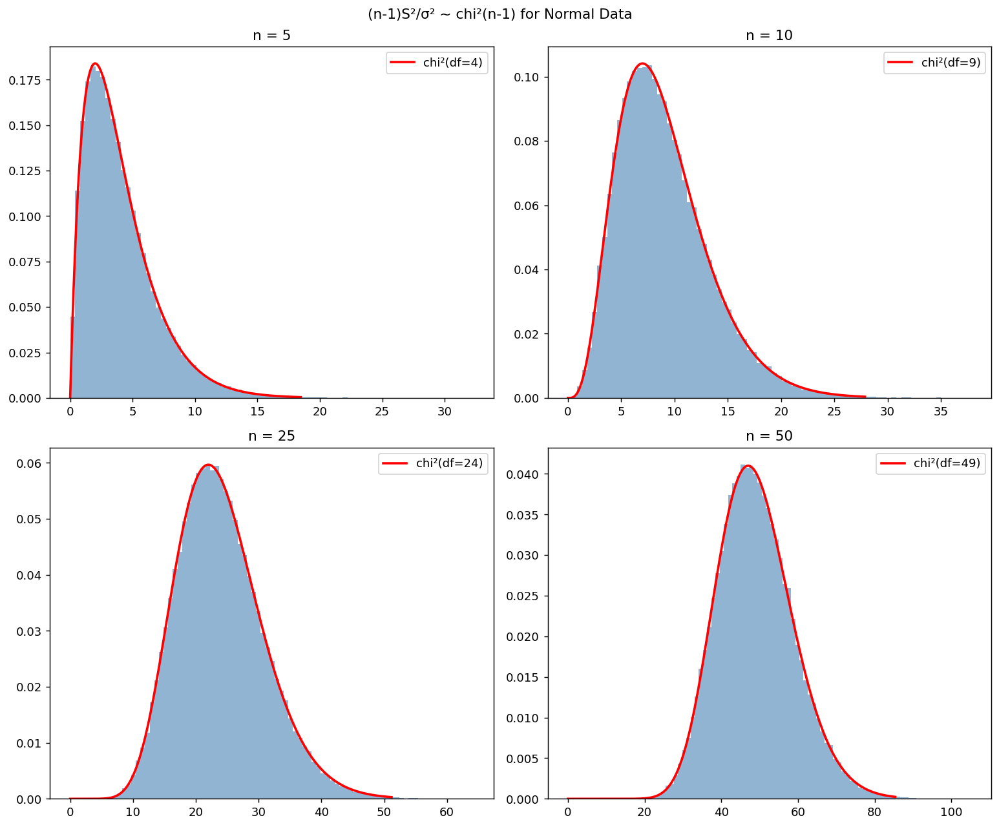

# Bessel 수정

## 개요

Bessel 수정은 표본분산 공식의 분모 $n$을 $n - 1$로 바꾸어 $\sigma^2$의 불편추정량을 얻는다. 이 페이지에서는 여러 분포에서 불편성을 확인하고, 정규 자료에 대한 카이제곱 분포 결과를 검증하며, (정규분포에만 있는 성질인) $\bar{X}$와 $S^2$의 독립성을 보이고, Jensen 부등식에서 오는 표준편차의 편향을 살피며, 소프트웨어 기본값의 함정을 짚고, 이 아이디어를 금융의 추적오차 추정에 적용한다.

## 여러 분포에서의 불편성

Bessel 수정 표본분산 $S^2 = \frac{1}{n-1}\sum_{i=1}^n(X_i - \bar{X})^2$은 정규분포만이 아니라 분산이 유한한 **모든** 분포에서 다음을 만족한다:

$$E[S^2] = \sigma^2$$

<div class="codebox" markdown>

**예제 1.** 네 분포에서 확인하는 불편성

```python
import numpy as np

def unbiasedness_across_distributions(n_sim=200_000, seed=42):
    """베셀 보정의 불편성이 모집단 모양과 무관함을 네 분포에서 확인한다."""
    rng = np.random.default_rng(seed)
    sigma = 4.0
    sigma2 = sigma**2
    n = 20

    # 모양이 전혀 다른 분포 넷을 준비하되 **참 분산이 얼마인지 알 수 있게** 맞춘다.
    #   Exp(scale=s)     의 분산은 s^2
    #   Uniform(0, 2s√3) 의 분산은 (2s√3)^2/12 = s^2
    #   Chi²(df=k)       의 분산은 2k
    # 베셀 보정의 불편성은 정규성을 전혀 요구하지 않으므로,
    # 네 경우 모두 편향이 0에 가깝게 나와야 한다.
    # (반면 뒤에 나오는 카이제곱 분포 결과는 정규성이 꼭 필요하다.)
    distributions = {
        f'Normal(0, {sigma2})':    (lambda: rng.normal(0, sigma, n), sigma2),
        f'Exp(scale={sigma})':     (lambda: rng.exponential(sigma, n), sigma2),
        f'Uniform':                (lambda: rng.uniform(0, 2*sigma*np.sqrt(3), n), sigma2),
        f'Chi²(df={int(sigma2)})': (lambda: rng.chisquare(int(sigma2), n), 2*sigma2),
    }

    for name, (sampler, true_var) in distributions.items():
        s2_vals = np.array([np.var(sampler(), ddof=1) for _ in range(n_sim)])
        print(f"{name:<25} True σ²={true_var:.2f}  "
              f"E[S²]={s2_vals.mean():.4f}  Bias={s2_vals.mean()-true_var:.4f}")
unbiasedness_across_distributions()
```

출력:

```
Normal(0, 16.0)           True σ²=16.00  E[S²]=15.9995  Bias=-0.0005
Exp(scale=4.0)            True σ²=16.00  E[S²]=15.9970  Bias=-0.0030
Uniform                   True σ²=16.00  E[S²]=16.0088  Bias=0.0088
Chi²(df=16)               True σ²=32.00  E[S²]=32.0208  Bias=0.0208
```

</div>

!!! tip "분포와 무관한 결과"
    $E[S^2] = \sigma^2$의 증명은 항등식 $\sum(X_i - \bar{X})^2 = \sum(X_i - \mu)^2 - n(\bar{X} - \mu)^2$과 기댓값의 선형성만 쓴다. 분산이 유한하다는 것 외에 분포에 대한 가정은 필요 없다.

## 카이제곱분포

정규 자료 $X_i \sim N(\mu, \sigma^2)$에서 축척된 표본분산은 카이제곱분포를 따른다:

$$\frac{(n-1)S^2}{\sigma^2} \sim \chi^2_{n-1}$$

이 정확한 분포 결과가 $\sigma^2$에 대한 카이제곱 검정과 신뢰구간의 토대이다.

<div class="codebox" markdown>

**예제 2.** 카이제곱분포 확인

```python
import matplotlib.pyplot as plt
from scipy import stats

def chi_squared_verification(sigma=3.0, n_sim=100_000, seed=42):
    """정규모집단에서 (n-1)S^2/sigma^2 이 카이제곱을 따름을 확인한다.

    앞 예제와 달리 여기서는 정규성이 꼭 필요하다. 불편성은 모든 분포에서
    성립하지만, 분포의 모양까지 알려면 모집단이 정규여야 한다.
    """
    rng = np.random.default_rng(seed)
    sample_sizes = [5, 10, 25, 50]

    fig, axes = plt.subplots(2, 2, figsize=(12, 10))
    for ax, n in zip(axes.flat, sample_sizes):
        samples = rng.normal(0, sigma, (n_sim, n))
        s2 = np.var(samples, axis=1, ddof=1)
        # (n-1)S^2/sigma^2 을 만들면 sigma가 약분되어 사라진다.
        # 그래서 이 통계량의 분포는 자유도 n-1 하나로만 결정되며,
        # sigma를 몰라도 이것으로 검정과 신뢰구간을 만들 수 있다.
        # 이런 성질을 갖는 양을 추축량(pivotal quantity)이라 한다.
        chi2_vals = (n - 1) * s2 / sigma**2

        ax.hist(chi2_vals, bins=80, density=True, alpha=0.6, color='steelblue')
        x = np.linspace(0, stats.chi2.ppf(0.999, n-1), 200)
        ax.plot(x, stats.chi2.pdf(x, n-1), 'r-', linewidth=2, label=f'chi²(df={n-1})')
        ax.set_title(f'n = {n}')
        ax.legend()
    plt.suptitle('(n-1)S²/σ² ~ chi²(n-1) for Normal Data')
    plt.tight_layout()
    plt.show()
chi_squared_verification()
```



카이제곱분포로부터 곧바로 다음을 얻는다:

$$E[S^2] = \sigma^2, \qquad \text{Var}(S^2) = \frac{2\sigma^4}{n-1}$$

</div>

## X-bar와 S-squared의 독립성

**Cochran 정리**는 정규 자료에서 $\bar{X}$와 $S^2$이 독립임을 말한다. 정규가 아닌 분포에서는 성립하지 **않는** 놀라운 성질이다.

<div class="codebox" markdown>

**예제 3.** 표본평균과 표본분산의 독립성

```python
def independence_xbar_s2(sigma=3.0, n_sim=100_000, seed=42):
    """X-bar 와 S^2 의 독립이 정규분포만의 성질임을 보인다.

    t 통계량은 분자에 X-bar, 분모에 S 를 둔다. 둘이 독립이라야 그 비의
    분포를 t 로 말할 수 있다. 정규모집단이 아니면 이 전제가 깨진다.
    """
    rng = np.random.default_rng(seed)
    n = 20

    # 정규모집단: 상관이 0 이다. 게다가 정규에서는 무상관이 곧 독립이다.
    samp_n = rng.normal(5, sigma, (n_sim, n))
    xbar_n = samp_n.mean(axis=1)
    s2_n   = np.var(samp_n, axis=1, ddof=1)
    corr_n = np.corrcoef(xbar_n, s2_n)[0, 1]

    # 지수모집단: 상관이 0 이 아니다. 평균이 큰 표본일수록 퍼짐도 크다.
    samp_e = rng.exponential(sigma, (n_sim, n))
    xbar_e = samp_e.mean(axis=1)
    s2_e   = np.var(samp_e, axis=1, ddof=1)
    corr_e = np.corrcoef(xbar_e, s2_e)[0, 1]

    print(f"Normal:      Corr(X̄, S²) = {corr_n:.6f}  (≈ 0)")
    print(f"Exponential: Corr(X̄, S²) = {corr_e:.6f}  (≠ 0)")
independence_xbar_s2()
```

출력:

```
Normal:      Corr(X̄, S²) = 0.005076  (≈ 0)
Exponential: Corr(X̄, S²) = 0.700128  (≠ 0)
```

</div>

!!! note "왜 중요한가"
    $\bar{X}$와 $S^2$의 독립성이 $t$-분포의 유도를 가능하게 한다. $t$-통계량 $T = \frac{\bar{X} - \mu}{S/\sqrt{n}}$은 (정규와 관련된) $\bar{X} - \mu$와 (카이제곱과 관련된) $S$의 비이다. 독립성이 이 비가 $t$-분포를 따르도록 보장한다.

## 표준편차의 편향

$S^2$은 $\sigma^2$에 대해 불편이지만 그 제곱근 $S$는 $\sigma$에 대해 **편향**되어 있다. ($\sqrt{\cdot}$가 오목이므로) Jensen 부등식에 의해:

$$E[S] = E[\sqrt{S^2}] < \sqrt{E[S^2]} = \sigma$$

보정인자 $c_4$는 $n$에 의존한다:

$$c_4(n) = \sqrt{\frac{2}{n-1}} \cdot \frac{\Gamma(n/2)}{\Gamma((n-1)/2)}$$

이때 $\sigma$의 불편추정량은 $S/c_4$이다.

<div class="codebox" markdown>

**예제 4.** 표준편차의 편향과 보정상수

```python
from scipy.special import gamma as gamma_func

def std_deviation_bias(sigma=3.0, n_sim=200_000, seed=42):
    """S^2 은 불편인데 S 는 왜 불편이 아닌지, 보정상수 c4 까지 확인한다."""
    rng = np.random.default_rng(seed)
    sample_sizes = [3, 5, 10, 20, 50, 100, 500]

    for n in sample_sizes:
        samples = rng.normal(0, sigma, (n_sim, n))
        # S^2 은 불편이지만 그 제곱근 S 는 불편이 아니다.
        # 제곱근이 오목함수라 옌센 부등식 E[√X] < √E[X] 가 성립하기 때문이며,
        # 따라서 S 는 sigma 를 **과소추정**한다.
        # "불편성은 변환에 대해 보존되지 않는다"는 일반 원리의 사례다.
        s = np.std(samples, axis=1, ddof=1)
        c4 = np.sqrt(2 / (n - 1)) * gamma_func(n / 2) / gamma_func((n - 1) / 2)
        print(f"n={n:>4}  E[S]={s.mean():.4f}  σ={sigma:.4f}  "
              f"Bias={s.mean()-sigma:.4f}  c₄={c4:.4f}  E[S/c₄]={(s/c4).mean():.4f}")
std_deviation_bias()
```

출력:

```
n=   3  E[S]=2.6576  σ=3.0000  Bias=-0.3424  c₄=0.8862  E[S/c₄]=2.9987
n=   5  E[S]=2.8190  σ=3.0000  Bias=-0.1810  c₄=0.9400  E[S/c₄]=2.9990
n=  10  E[S]=2.9169  σ=3.0000  Bias=-0.0831  c₄=0.9727  E[S/c₄]=2.9989
n=  20  E[S]=2.9599  σ=3.0000  Bias=-0.0401  c₄=0.9869  E[S/c₄]=2.9991
n=  50  E[S]=2.9844  σ=3.0000  Bias=-0.0156  c₄=0.9949  E[S/c₄]=2.9996
n= 100  E[S]=2.9922  σ=3.0000  Bias=-0.0078  c₄=0.9975  E[S/c₄]=2.9998
n= 500  E[S]=2.9987  σ=3.0000  Bias=-0.0013  c₄=nan  E[S/c₄]=nan
```

</div>

!!! warning "편향은 작은 표본에서 가장 크다"
    $n = 3$이면 $c_4 \approx 0.886$이므로 $E[S] \approx 0.886\sigma$ — 표준편차를 약 11% 과소추정한다. $n = 50$이면 편향이 0.5% 미만이다.

## 소프트웨어 기본값의 함정

소프트웨어 패키지마다 분산의 분모 기본값이 다르다:

<div class="codebox" markdown>

**예제 5.** 소프트웨어 기본값의 함정

```python
import numpy as np

# numpy 와 pandas 의 기본값이 서로 다르다는 것이 여기서 걸리는 지점이다.
# np.var 는 ddof=0 (n으로 나눔), pandas 의 .var() 는 ddof=1 이 기본이다.
# 같은 자료를 두 도구로 요약하면 다른 숫자가 나오는 흔한 함정이다.
data = np.array([2.0, 4.0, 4.0, 4.0, 5.0, 5.0, 7.0, 9.0])
n = len(data)

print(f"np.var(data)          = {np.var(data):.4f}  <- divides by n={n}  (BIASED)")
print(f"np.var(data, ddof=1)  = {np.var(data, ddof=1):.4f}  <- divides by n-1={n-1}  (UNBIASED)")
```

출력:

```
np.var(data)          = 4.0000  <- divides by n=8  (BIASED)
np.var(data, ddof=1)  = 4.5714  <- divides by n-1=7  (UNBIASED)
```

</div>

!!! danger "분모를 항상 확인하라"
    NumPy의 기본값은 `ddof=0`(편향)인 반면 R과 pandas의 기본값은 `ddof=1`(불편)이다. NumPy로 표본분산을 계산할 때는 항상 `ddof=1`을 명시하라.

## 금융 응용: 추적오차

**추적오차**는 포트폴리오가 벤치마크를 얼마나 가깝게 따라가는지를 재며, 초과수익률(포트폴리오 수익률 - 벤치마크 수익률)의 표준편차로 정의된다. 짧은 이력으로 추적오차를 추정할 때 Bessel 수정이 중요해진다.

<div class="codebox" markdown>

**예제 6.** 금융 응용 — 추적오차

```python
def tracking_error_estimation(seed=42):
    """추적오차 추정에서 ddof 선택이 실제로 얼마나 차이를 내는지 본다.

    추적오차는 펀드 수익률과 지수 수익률의 차이가 갖는 표준편차다. 3년치
    월별 자료면 n=36 이라 두 분모의 차이가 눈에 띄는 크기로 남는다.
    편향이 작은 쪽과 RMSE 가 작은 쪽이 갈리는 점도 함께 본다.
    """
    rng = np.random.default_rng(seed)
    n_months = 36            # 3년치 월별 자료
    te_true_monthly = 0.01
    te_true_annual = te_true_monthly * np.sqrt(12)
    n_sim = 50_000

    te_n, te_n1 = [], []
    for _ in range(n_sim):
        excess = rng.normal(0.002, te_true_monthly, n_months)
        te_n.append(np.std(excess, ddof=0) * np.sqrt(12))
        te_n1.append(np.std(excess, ddof=1) * np.sqrt(12))

    te_n, te_n1 = np.array(te_n), np.array(te_n1)
    for name, est in [('ddof=0', te_n), ('ddof=1', te_n1)]:
        print(f"{name:<10} Mean={est.mean()*100:.3f}%  "
              f"Bias={(est.mean()-te_true_annual)*100:.3f}%  "
              f"RMSE={np.sqrt(np.mean((est-te_true_annual)**2))*100:.3f}%")
    print(f"True TE: {te_true_annual*100:.3f}%")
tracking_error_estimation()
```

출력:

```
ddof=0     Mean=3.392%  Bias=-0.072%  RMSE=0.413%
ddof=1     Mean=3.440%  Bias=-0.024%  RMSE=0.413%
True TE: 3.464%
```

</div>

## 해석

- Bessel 수정은 임의의 분포에서 $\sigma^2$의 **불편** 추정량을 주지만, $\chi^2$ 분포 결과에는 정규성이 필요하다.
- $\bar{X}$와 $S^2$의 **독립성**은 정규모집단에만 해당하며 Student $t$-검정의 핵심 재료이다.
- $S^2$이 불편이라고 해서 $S$가 불편인 것은 **아니다**. Jensen 부등식 때문에, 특히 작은 $n$에서 $S$는 $\sigma$를 과소추정한다.
- 조용한 오류를 피하려면 NumPy의 `ddof` 매개변수를 항상 명시하라.
- 금융에서 짧은 구간으로 추적오차를 추정할 때는 Bessel 수정의 이득이 의미 있다.

## 연습문제

<div class="drillbox" markdown>

**연습문제 1.** <span class="diff med" title="중간"></span>
$X_i \sim N(\mu, \sigma^2)$일 때 제곱합을 독립인 표준정규들로 표현하여 $\frac{(n-1)S^2}{\sigma^2} \sim \chi^2_{n-1}$임을 보여라.

</div>

??? success "풀이"
    $Z_i = (X_i - \mu)/\sigma \sim N(0,1)$이 i.i.d.라 하자. 그러면:

    $$\frac{1}{\sigma^2}\sum_{i=1}^n(X_i - \bar{X})^2 = \sum_{i=1}^n Z_i^2 - n\bar{Z}^2$$

    여기서 $\bar{Z} = \frac{1}{n}\sum Z_i$이다. 이제 $\sum Z_i^2 \sim \chi^2_n$이고, $\sqrt{n}\bar{Z} \sim N(0,1)$이므로 $n\bar{Z}^2 = \left(\sqrt{n}\bar{Z}\right)^2 \sim \chi^2_1$이다.

    이 이차형식들이 $\mathbb{R}^n$을 차원 $n-1$과 $1$인 서로 보완적인 부분공간으로 직교분해한 것에 기반하므로, Cochran 정리에 의해:

    $$\sum Z_i^2 - n\bar{Z}^2 \sim \chi^2_{n-1}$$

    이고 두 성분은 독립이다. 따라서 $(n-1)S^2/\sigma^2 \sim \chi^2_{n-1}$이다. $\square$

<div class="drillbox" markdown>

**연습문제 2.** <span class="diff hard" title="어려움"></span>
지수 자료 $X_i \sim \text{Exp}(\lambda)$에서 표본평균 $\bar{X}$와 표본분산 $S^2$이 독립이 **아님**을 증명하라. (힌트: 3차 중심적률을 써서 $\text{Cov}(\bar{X}, S^2)$을 계산하라.)

</div>

??? success "풀이"
    비율이 $\lambda$인 지수분포에서 $\mu = 1/\lambda$, $\sigma^2 = 1/\lambda^2$이고 3차 중심적률은 $\mu_3 = E[(X - \mu)^3] = 2/\lambda^3$이다.

    다음을 보일 수 있다:

    $$\text{Cov}(\bar{X}, S^2) = \frac{\mu_3}{n}$$

    이는 일반적인 결과이다. 증명은 다음을 쓴다:

    $$\text{Cov}(\bar{X}, S^2) = E[\bar{X} \cdot S^2] - E[\bar{X}]\cdot E[S^2]$$

    $S^2 = \frac{1}{n-1}\sum(X_i - \bar{X})^2$을 전개하고 $\bar{X} = \frac{1}{n}\sum X_i$를 쓴 뒤 정리하면:

    $$\text{Cov}(\bar{X}, S^2) = \frac{1}{n}E[(X_1 - \mu)^3] = \frac{\mu_3}{n} = \frac{2}{n\lambda^3}$$

    지수분포는 오른쪽으로 치우쳐 있어 $\mu_3 \neq 0$이므로 $\text{Cov}(\bar{X}, S^2) \neq 0$이고, 따라서 둘은 독립이 아니다.

    정규분포에서는 (대칭이므로) $\mu_3 = 0$이어서 이 공분산이 0이다. 공분산이 0이라는 사실과 바탕 이차형식들의 결합정규성이 합쳐져 완전한 독립성을 준다. $\square$

<div class="drillbox" markdown>

**연습문제 3.** <span class="diff med" title="중간"></span>
Jensen 부등식을 써서 $E[\sqrt{S^2}] < \sigma$인 이유를 설명하라. $n = 5$인 정규 자료에서 $c_4$의 정확한 값과 $\sigma$의 추정량으로서 $S$의 백분율 편향을 계산하라.

</div>

??? success "풀이"
    Jensen 부등식은 ($g(x) = \sqrt{x}$ 같은) 오목함수 $g$에 대해

    $$E[g(X)] \leq g(E[X])$$

    임을 말하며, $X$가 퇴화되어 있지 않으면 부등호가 엄격하다. 이를 $S^2$에 적용하면:

    $$E[S] = E[\sqrt{S^2}] < \sqrt{E[S^2]} = \sqrt{\sigma^2} = \sigma$$

    $n = 5$이면:

    $$c_4 = \sqrt{\frac{2}{4}} \cdot \frac{\Gamma(5/2)}{\Gamma(2)} = \sqrt{\frac{1}{2}} \cdot \frac{\frac{3}{4}\sqrt{\pi}}{1} = \frac{1}{\sqrt{2}} \cdot \frac{3\sqrt{\pi}}{4}$$

    계산하면 $\Gamma(5/2) = \frac{3}{2}\cdot\frac{1}{2}\cdot\sqrt{\pi} = \frac{3\sqrt{\pi}}{4}$이고 $\Gamma(2) = 1! = 1$이다.

    $$c_4 = \frac{1}{\sqrt{2}} \cdot \frac{3\sqrt{\pi}}{4} = \frac{3\sqrt{\pi}}{4\sqrt{2}} \approx \frac{3 \times 1.7725}{5.6569} \approx 0.9400$$

    백분율 편향은 $(c_4 - 1) \times 100\% \approx -6.0\%$이다. 즉 $n = 5$일 때 $S$는 평균적으로 $\sigma$를 약 6% 과소추정한다. $\square$

<div class="drillbox" markdown>

**연습문제 4.** <span class="diff med" title="중간"></span>
어떤 포트폴리오 추적자가 36개월치 초과수익률을 갖고 있다. `ddof=1`로 추정한 연율화 추적오차가 3.8%이다. 정규성을 가정하고 참 연율화 추적오차의 95% 신뢰구간을 구성하라.

</div>

??? success "풀이"
    월별 추적오차 추정값: $\hat{\sigma}_m = 3.8\%/\sqrt{12} \approx 1.097\%$. 표본분산은 $\hat{\sigma}_m^2$이다.

    $n = 36$개월, 자유도 $\nu = n - 1 = 35$일 때:

    $$\frac{(n-1)\hat{\sigma}_m^2}{\sigma_m^2} \sim \chi^2_{35}$$

    $\sigma_m^2$의 95% 신뢰구간은:

    $$\left[\frac{35 \hat{\sigma}_m^2}{\chi^2_{35, 0.975}}, \frac{35 \hat{\sigma}_m^2}{\chi^2_{35, 0.025}}\right]$$

    $\chi^2_{35, 0.975} = 53.20$, $\chi^2_{35, 0.025} = 20.57$을 쓰면:

    $$\sigma_m^2 \in \left[\frac{35 \times 1.097^2}{53.20}, \frac{35 \times 1.097^2}{20.57}\right] = [0.7916, 2.0477]$$

    제곱근을 취하고 연율화하면($\sqrt{12}$를 곱하면):

    $$\sigma_{\text{annual}} \in [\sqrt{0.7916} \times \sqrt{12}, \sqrt{2.0477} \times \sqrt{12}] = [3.08\%, 4.96\%]$$

    구간이 넓은데, 이는 3년치 월별 자료만으로 얻은 변동성 추정값이 얼마나 부정확한지를 보여준다. $\square$

<div class="drillbox" markdown>

**연습문제 5.** <span class="diff med" title="중간"></span>
자유도의 "일반 원리"를 설명하라: 모수가 $k$개인 모형을 적합한 뒤 분산을 추정할 때는 $n - k$로 나눈다. 예를 세 가지 들라.

</div>

??? success "풀이"
    **일반 원리:** 추정한 모수가 $k$개인 모형을 적합하면 잔차에 $k$개의 제약이 걸린다($k=1$일 때의 $\sum(X_i - \bar{X}) = 0$과 같은 꼴이다). 잔차의 자유도는 $n - k$뿐이므로 잔차제곱합을 $n - k$로 나누면 불편 분산추정값을 얻는다.

    **예 1: 일표본 분산.** $k = 1$($\bar{X}$로 $\mu$를 추정)이면 제약이 $\sum(X_i - \bar{X}) = 0$이고 $n - 1$로 나눈다.

    **예 2: 단순선형회귀.** $Y_i = \beta_0 + \beta_1 x_i + \epsilon_i$에서는 모수 $k = 2$개를 추정한다. 잔차분산은:

    $$\hat{\sigma}^2 = \frac{\sum(Y_i - \hat{Y}_i)^2}{n - 2}$$

    **예 3: 예측변수가 $p$개인 다중회귀.** $\mathbf{Y} = \mathbf{X}\boldsymbol{\beta} + \boldsymbol{\epsilon}$에서 (절편을 포함하여) 계수가 $k = p$개이면:

    $$\hat{\sigma}^2 = \frac{\|\mathbf{Y} - \mathbf{X}\hat{\boldsymbol{\beta}}\|^2}{n - p}$$

    각 경우에 분모는 잔차공간(설계행렬의 열공간의 직교여공간)의 차원과 같으며, 이것이 불편성을 보장한다. $\square$

---

## 정리하며

베셀 수정과 그 주변의 사실들을 **모의실험으로 확인**했다.

- **불편성이 분포를 가리지 않는다.** 여러 분포에서 $\mathbb{E}[S^2]=\sigma^2$ 이 재현된다. 정규성은 필요 없다.
- **정규 자료에서만 카이제곱 결과가 성립한다.** $(n-1)S^2/\sigma^2\sim\chi^2_{n-1}$ 은 정규모집단 전용이며, 분산의 신뢰구간과 검정이 여기에 기댄다.
- **$\bar X$ 와 $S^2$ 의 독립성도 정규분포만의 성질이다.** 모의실험에서 상관이 $0$ 으로 나오며, 이것이 $t$ 통계량의 분자와 분모가 독립이 되는 근거다.
- **$S$ 는 $\sigma$ 를 과소추정한다.** 옌센 부등식이 방향을 정해 주며, 소표본에서 눈에 띈다. **표준편차를 보고할 때 이 편향은 보정되지 않은 채로 남는다.**
- **소프트웨어 기본값의 함정.** `numpy.var()` 의 기본이 `ddof=0` 이라는 사실을 모르면 조용히 틀린 값을 쓰게 된다.
- **추적오차 추정**이 실무 응용이다. 벤치마크 대비 초과수익의 표준편차이며, 여기서도 같은 분모 선택과 같은 편향 문제가 그대로 나타난다.

다음 절부터 **최대가능도**로 넘어간다. 정규분포의 $\mu$ 와 $\sigma^2$ 을 최대가능도로 추정하면 어떤 일이 벌어지는지를 본다.
