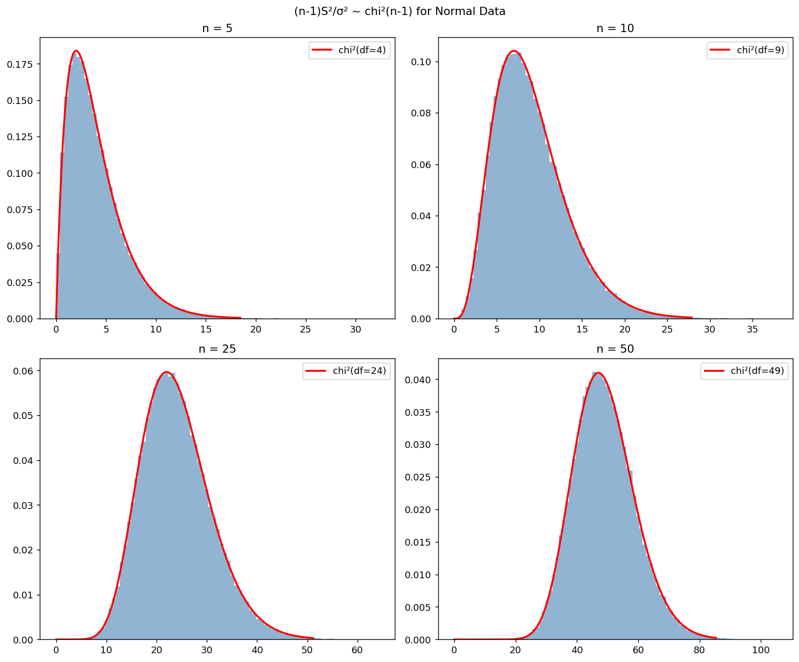

# Bessel 수정

## 개요

Bessel 수정은 표본분산 공식의 분모 $n$을 $n - 1$로 바꾸어 $\sigma^2$의 불편추정량을 얻는다. 이 페이지에서는 여러 분포에서 불편성을 확인하고, 정규 자료에 대한 카이제곱 분포 결과를 검증하며, (정규분포에만 있는 성질인) $\bar{X}$와 $S^2$의 독립성을 보이고, Jensen 부등식에서 오는 표준편차의 편향을 살피며, 소프트웨어 기본값의 함정을 짚고, 이 아이디어를 금융의 추적오차 추정에 적용한다.

## 여러 분포에서의 불편성

Bessel 수정 표본분산 $S^2 = \frac{1}{n-1}\sum_{i=1}^n(X_i - \bar{X})^2$은 정규분포만이 아니라 분산이 유한한 **모든** 분포에서 다음을 만족한다:

$$E[S^2] = \sigma^2$$

<div class="exbox" markdown>

**보기 1.** <span class="diff easy" title="쉬움"></span> 네 분포에서 확인하는 불편성. 참 분산을 맞추어 놓은 네 모집단($N(0,16)$, $\text{Exp}(4)$, $\text{Uniform}$, $\chi^2_{16}$)에서 $n = 20$씩 뽑아 $S^2$을 20만 번 기록한다.

**(1)** $E[S^2] = \sigma^2$이 **모집단의 모양과 무관하게** 성립하는 까닭을 적으시오.

**(2)** 네 줄의 "편향"이 각각 얼마만큼 흔들릴지 미리 구하고, 출력이 그 안에 드는지 판정하시오.

</div>

??? success "풀이"

    **(1) 해석적으로.** 증명의 뼈대는 항등식

    $$
    \sum_i (X_i - \bar X)^2 = \sum_i (X_i - \mu)^2 - n(\bar X - \mu)^2
    $$

    하나이고, 양변의 기댓값을 취하면 $n\sigma^2 - \sigma^2 = (n-1)\sigma^2$이 된다. **이 계산은 [5.1절의 증명 상자](../../ch05/foundations/statistics_as_rv.md)에 한 줄씩 적혀 있으므로 여기서 되풀이하지 않는다.**

    되풀이하지 않는 대신 **무엇을 썼는지**만 짚어 두자. 쓴 것은 두 가지다.

    - $E[(X_i - \mu)^2] = \sigma^2$ — 분산의 정의.
    - $\operatorname{Var}(\bar X) = \sigma^2/n$ — 독립성.

    분포의 모양은 어디에도 들어오지 않는다. 치우쳤든, 이산이든, 꼬리가 두껍든 **분산만 유한하면** $E[S^2] = \sigma^2$이다. (뒤의 보기 2가 다루는 $\chi^2$ 분포 결과는 사정이 전혀 다르다. 그쪽은 정규성이 꼭 필요하다.)

    **(2) 흔들림의 크기.** 모의 편향의 표준오차는 $\operatorname{sd}(S^2)/\sqrt B$이고, $S^2$의 분산은 모집단의 **4차 적률**에 달려 있다.

    $$
    \operatorname{Var}(S^2) = \frac{1}{n}\left(\mu_4 - \frac{n-3}{n-1}\sigma^4\right),
    \qquad \mu_4 = (\gamma_2 + 3)\,\sigma^4
    $$

    여기서 $\gamma_2$가 초과첨도다. **불편성은 모양과 무관하지만 정밀도는 모양에 크게 달려 있다**는 것이 요점이며, 네 모집단의 $\gamma_2$가 각각 $0$, $6$, $-1.2$, $12/16 = 0.75$다.

    | 모집단 | $\sigma^2$ | $\gamma_2$ | $\operatorname{Var}(S^2)$ | 몬테카를로 표준오차 |
    |:---|---:|---:|---:|---:|
    | $N(0, 16)$ | $16$ | $0$ | $26.95$ | $0.0116$ |
    | $\text{Exp}(4)$ | $16$ | $6$ | $103.75$ | $0.0228$ |
    | $\text{Uniform}$ | $16$ | $-1.2$ | $11.59$ | $0.0076$ |
    | $\chi^2_{16}$ | $32$ | $0.75$ | $146.19$ | $0.0270$ |

    모의실험과 맞춰 본다.

    ```python
    import numpy as np

    def unbiasedness_across_distributions(n_sim=200_000, seed=42):
        """베셀 보정의 불편성이 모집단 모양과 무관함을 네 분포에서 확인한다."""
        rng = np.random.default_rng(seed)
        sigma = 4.0
        sigma2 = sigma**2
        n = 20

        # 모양이 전혀 다른 분포 넷을 준비하되 **참 분산이 얼마인지 알 수 있게** 맞춘다.
        #   Exp(scale=s)     의 분산은 s^2
        #   Uniform(0, 2s√3) 의 분산은 (2s√3)^2/12 = s^2
        #   Chi²(df=k)       의 분산은 2k
        # 베셀 보정의 불편성은 정규성을 전혀 요구하지 않으므로,
        # 네 경우 모두 편향이 0에 가깝게 나와야 한다.
        # (반면 뒤에 나오는 카이제곱 분포 결과는 정규성이 꼭 필요하다.)
        distributions = {
            f'Normal(0, {sigma2})':    (lambda: rng.normal(0, sigma, n), sigma2),
            f'Exp(scale={sigma})':     (lambda: rng.exponential(sigma, n), sigma2),
            f'Uniform':                (lambda: rng.uniform(0, 2*sigma*np.sqrt(3), n), sigma2),
            f'Chi²(df={int(sigma2)})': (lambda: rng.chisquare(int(sigma2), n), 2*sigma2),
        }

        for name, (sampler, true_var) in distributions.items():
            s2_vals = np.array([np.var(sampler(), ddof=1) for _ in range(n_sim)])
            print(f"{name:<25} True σ²={true_var:.2f}  "
                  f"E[S²]={s2_vals.mean():.4f}  Bias={s2_vals.mean()-true_var:.4f}")
    unbiasedness_across_distributions()
    ```

    출력:

    ```
    Normal(0, 16.0)           True σ²=16.00  E[S²]=15.9995  Bias=-0.0005
    Exp(scale=4.0)            True σ²=16.00  E[S²]=15.9970  Bias=-0.0030
    Uniform                   True σ²=16.00  E[S²]=16.0088  Bias=0.0088
    Chi²(df=16)               True σ²=32.00  E[S²]=32.0208  Bias=0.0208
    ```

    (2)의 자로 재면 네 줄이 모두 들어온다.

    | 모집단 | 모의 편향 | 몬테카를로 표준오차 | $z$ |
    |:---|---:|---:|---:|
    | $N(0, 16)$ | $-0.0005$ | $0.0116$ | $-0.04$ |
    | $\text{Exp}(4)$ | $-0.0030$ | $0.0228$ | $-0.13$ |
    | $\text{Uniform}$ | $+0.0088$ | $0.0076$ | $+1.16$ |
    | $\chi^2_{16}$ | $+0.0208$ | $0.0270$ | $+0.77$ |

    **네 줄 모두 $1.2$ 표준오차 안이고, 어느 모집단에서도 치우침의 흔적이 없다.**

    겉보기 수와 자를 뒤바꿔 읽지 않도록 조심해야 한다. 가장 큰 편향 $0.0208$은 $\chi^2_{16}$에서 나왔는데 자로 재면 $0.77$에 지나지 않고, 그보다 작은 $0.0088$이 균등분포에서는 $1.16$이다. **균등분포가 가장 정밀한 까닭은 초과첨도가 $-1.2$로 음수여서 꼬리가 짧기 때문**이고, 지수분포가 가장 엉성해 보이지 않는 까닭은 $\sigma^2$이 같은 $16$이기 때문이다.

    세 번째 열이 이 쪽에서 가장 쓸모 있는 수다. $\operatorname{Var}(S^2)$가 $11.6$에서 $146$까지 **열세 배**나 벌어진다. 모든 모집단에서 $S^2$이 똑같이 불편이지만, **똑같이 믿을 만하지는 않다.** 분산을 추정할 때 4차 적률이 조용히 뒤에서 모든 것을 정하고 있다.

!!! tip "분포와 무관한 결과"
    $E[S^2] = \sigma^2$의 증명은 항등식 $\sum(X_i - \bar{X})^2 = \sum(X_i - \mu)^2 - n(\bar{X} - \mu)^2$과 기댓값의 선형성만 쓴다. 분산이 유한하다는 것 외에 분포에 대한 가정은 필요 없다.

## 카이제곱분포

정규 자료 $X_i \sim N(\mu, \sigma^2)$에서 축척된 표본분산은 카이제곱분포를 따른다:

$$\frac{(n-1)S^2}{\sigma^2} \sim \chi^2_{n-1}$$

이 정확한 분포 결과가 $\sigma^2$에 대한 카이제곱 검정과 신뢰구간의 토대이다.

<div class="exbox" markdown>

**보기 2.** <span class="diff easy" title="쉬움"></span> 카이제곱분포 확인. $N(0, 3^2)$에서 $n = 5, 10, 25, 50$씩 뽑아 $(n-1)S^2/\sigma^2$을 10만 번 기록하고 $\chi^2_{n-1}$ 밀도를 겹쳐 그린다.

**(1)** 이 통계량의 평균·분산·왜도를 $n$의 함수로 적으시오. 거기서 $\operatorname{Var}(S^2)$를 끌어내시오.

**(2)** 그림이 네 칸에서 어떻게 달라 보여야 하는지 (1)로 설명하고, 수로 확인하시오.

</div>

??? success "풀이"

    **(1) 해석적으로.** $X_i \sim N(\mu,\sigma^2)$이면 $(n-1)S^2/\sigma^2 \sim \chi^2_{n-1}$이고, 자유도 $k$인 카이제곱의 적률은 잘 알려져 있다.

    $$
    E[\chi^2_k] = k,
    \qquad
    \operatorname{Var}(\chi^2_k) = 2k,
    \qquad
    \operatorname{skew}(\chi^2_k) = \sqrt{\frac{8}{k}}
    $$

    $k = n-1$을 넣으면 네 칸의 이론값이 바로 나온다.

    | $n$ | 평균 $n-1$ | 분산 $2(n-1)$ | 왜도 $\sqrt{8/(n-1)}$ |
    |---:|---:|---:|---:|
    | $5$ | $4$ | $8$ | $1.4142$ |
    | $10$ | $9$ | $18$ | $0.9428$ |
    | $25$ | $24$ | $48$ | $0.5774$ |
    | $50$ | $49$ | $98$ | $0.4041$ |

    $S^2$으로 되돌리면 $S^2 = \dfrac{\sigma^2}{n-1}\chi^2_{n-1}$이므로

    $$
    E[S^2] = \frac{\sigma^2}{n-1}(n-1) = \sigma^2,
    \qquad
    \operatorname{Var}(S^2) = \frac{\sigma^4}{(n-1)^2}\cdot 2(n-1) = \frac{2\sigma^4}{n-1}
    $$

    다. **불편성이 여기서는 덤으로 따라 나온다.** 보기 1에서는 분포 가정 없이 힘들여 얻은 것을 정규성 하나로 공짜로 얻는 셈인데, 그 대신 정규가 아니면 이 줄은 통째로 쓸 수 없다.

    **(2) 그림이 어떻게 달라 보여야 하는가.** 왜도가 $\sqrt{8/(n-1)}$이므로 $n$이 커지면 **$1/\sqrt n$ 속도로 대칭에 가까워진다.** $n = 5$ 칸은 왜도 $1.41$로 오른쪽으로 길게 끌리고, $n = 50$ 칸은 $0.40$으로 거의 종 모양이어야 한다. 동시에 가로 눈금이 $0$–$20$에서 $0$–$100$으로 **옮겨 가고 넓어진다**($\sigma$가 약분되므로 $\sigma = 3$은 그림에 아무 영향도 주지 않는다).

    그림을 그리면서 세 적률을 함께 잰다.

    ```python
    import matplotlib.pyplot as plt
    from scipy import stats

    plt.rcParams["font.family"] = "Apple SD Gothic Neo"
    plt.rcParams["axes.unicode_minus"] = False

    def chi_squared_verification(sigma=3.0, n_sim=100_000, seed=42):
        """정규모집단에서 (n-1)S^2/sigma^2 이 카이제곱을 따름을 확인한다.

        앞 보기와 달리 여기서는 정규성이 꼭 필요하다. 불편성은 모든 분포에서
        성립하지만, 분포의 모양까지 알려면 모집단이 정규여야 한다.
        """
        rng = np.random.default_rng(seed)
        sample_sizes = [5, 10, 25, 50]

        fig, axes = plt.subplots(2, 2, figsize=(12, 10))
        print(f"{'n':>4} {'모의 평균':>9} {'n-1':>5} {'모의 분산':>9} {'2(n-1)':>7} "
              f"{'모의 왜도':>9} {'√(8/(n-1))':>11}")
        for ax, n in zip(axes.flat, sample_sizes):
            samples = rng.normal(0, sigma, (n_sim, n))
            s2 = np.var(samples, axis=1, ddof=1)
            # (n-1)S^2/sigma^2 을 만들면 sigma가 약분되어 사라진다.
            # 그래서 이 통계량의 분포는 자유도 n-1 하나로만 결정되며,
            # sigma를 몰라도 이것으로 검정과 신뢰구간을 만들 수 있다.
            # 이런 성질을 갖는 양을 추축량(pivotal quantity)이라 한다.
            chi2_vals = (n - 1) * s2 / sigma**2

            ax.hist(chi2_vals, bins=80, density=True, alpha=0.6, color='steelblue')
            x = np.linspace(0, stats.chi2.ppf(0.999, n-1), 200)
            ax.plot(x, stats.chi2.pdf(x, n-1), 'r-', linewidth=2, label=f'chi²(df={n-1})')
            ax.set_title(f'n = {n}')
            ax.legend()
            # 눈으로 겹쳐 보는 대신 세 적률을 이론값과 맞춰 둔다.
            print(f"{n:>4} {chi2_vals.mean():>9.4f} {n-1:>5} {chi2_vals.var(ddof=1):>9.4f} {2*(n-1):>7} "
                  f"{stats.skew(chi2_vals):>9.4f} {np.sqrt(8/(n-1)):>11.4f}")
        plt.suptitle('(n-1)S²/σ² ~ chi²(n-1) for Normal Data')
        plt.tight_layout()
        plt.show()
    chi_squared_verification()
    ```

    출력:

    ```
       n     모의 평균   n-1     모의 분산  2(n-1)     모의 왜도  √(8/(n-1))
       5    4.0037     4    8.0681       8    1.4272      1.4142
      10    9.0012     9   18.0701      18    0.9415      0.9428
      25   23.9858    24   47.6345      48    0.5643      0.5774
      50   48.9677    49   97.7039      98    0.4161      0.4041
    ```

    

    **열두 칸이 모두 (1)과 맞는다.** 평균은 $4.0037$, $9.0012$, $23.9858$, $48.9677$로 $4$, $9$, $24$, $49$ 둘레에 있다. 10만 번에서 평균의 몬테카를로 표준오차가 $\sqrt{2(n-1)/10^5}$이므로 $n = 50$에서 $0.031$이고, $48.9677$은 $1.0$ 표준오차 거리다.

    분산은 $8.07$, $18.07$, $47.63$, $97.70$으로 $8$, $18$, $48$, $98$ 둘레다. 분산의 상대 몬테카를로 오차가 $\sqrt{2/10^5} = 0.45\%$인데(카이제곱은 정규보다 꼬리가 두꺼워 실제로는 이보다 조금 크다) 가장 멀리 간 $n = 50$의 $-0.30\%$도 그 안이다.

    **왜도 열이 가장 또렷하다.** $1.4272 \to 0.9415 \to 0.5643 \to 0.4161$이 이론값 $1.4142 \to 0.9428 \to 0.5774 \to 0.4041$을 따라간다. 10만 번에서 왜도의 표준오차가 $\sqrt{6/10^5} = 0.0077$이므로 네 어긋남이 각각 $+1.7$, $-0.2$, $-1.7$, $+1.5$ 표준오차다.

    그림에서도 이 수가 그대로 보인다. 왼쪽 위 칸($n=5$)은 왼쪽 벽에 붙어 오른쪽으로 길게 끌리고, 오른쪽 아래 칸($n=50$)은 거의 대칭인 종 모양이다. 네 칸 모두 붉은 곡선이 히스토그램 위에 정확히 얹혀 있다.

    **$\sigma = 3$이 네 칸 어디에도 나타나지 않는다는 점이 중요하다.** $(n-1)S^2/\sigma^2$에서 $\sigma$가 약분되어 분포가 자유도 하나로만 정해지기 때문이고, 이것이 코드 주석이 말하는 **추축량**의 뜻이다. 모르는 $\sigma$가 통계량의 분포에서 사라지므로 $\sigma$를 모른 채로도 구간을 만들 수 있다.

카이제곱분포로부터 곧바로 다음을 얻는다:

$$E[S^2] = \sigma^2, \qquad \text{Var}(S^2) = \frac{2\sigma^4}{n-1}$$

## X-bar와 S-squared의 독립성

**Cochran 정리**는 정규 자료에서 $\bar{X}$와 $S^2$이 독립임을 말한다. 정규가 아닌 분포에서는 성립하지 **않는** 놀라운 성질이다.

<div class="exbox" markdown>

**보기 3.** <span class="diff easy" title="쉬움"></span> 표본평균과 표본분산의 독립성. $N(5, 3^2)$와 $\text{Exp}(\text{scale} = 3)$에서 $n = 20$씩 뽑아 $\operatorname{corr}(\bar X, S^2)$를 10만 번 되풀이로 잰다.

**(1)** $\operatorname{Cov}(\bar X, S^2)$를 일반 분포에 대해 유도하시오. 거기서 정규와 지수의 상관계수를 **수로** 예측하시오.

**(2)** 출력과 맞추시오. 상관이 $0$인 것과 독립인 것은 같은 말인가.

</div>

??? success "풀이"

    **(1) 해석적으로.** 평균을 $0$으로 옮겨도 두 통계량이 바뀌지 않으므로 $\mu = 0$으로 두자. $\operatorname{Cov}(\bar X, S^2) = E[\bar X S^2]$이고, 보기 1의 항등식에서 $(n-1)S^2 = \sum_i X_i^2 - n\bar X^2$이므로

    $$
    (n-1)E[\bar X S^2]
    = E\!\left[\bar X \sum_i X_i^2\right] - n\,E[\bar X^3]
    $$

    이다. 두 항을 따로 센다. 앞 항은 $\bar X = \frac1n\sum_j X_j$를 넣어 펼치면 $j = i$인 $n$개 항만 $E[X^3] = \mu_3$를 남기고 나머지는 독립성과 $E[X] = 0$에서 사라지므로 $\frac1n \cdot n\mu_3 = \mu_3$다. 뒤 항은 $\bar X$의 3차 중심적률이 $\mu_3/n^2$이므로 $n \cdot \mu_3/n^2 = \mu_3/n$이다. 따라서

    $$
    (n-1)E[\bar X S^2] = \mu_3 - \frac{\mu_3}{n} = \frac{n-1}{n}\mu_3
    \quad\Longrightarrow\quad
    \boxed{\;\operatorname{Cov}(\bar X, S^2) = \frac{\mu_3}{n}\;}
    $$

    **공분산이 모집단의 3차 중심적률 하나로 정해진다.** 그러므로

    - **대칭분포**($\mu_3 = 0$): 언제나 $\operatorname{Cov}(\bar X, S^2) = 0$. 정규뿐 아니라 균등·$t$·라플라스도 그렇다.
    - **치우친 분포**: $\mu_3 \ne 0$이므로 상관이 남는다. 지수분포는 $\mu_3 = 2\theta^3 > 0$이라 **양의 상관**이고, 평균이 큰 표본일수록 퍼짐도 크다는 뜻이다.

    상관계수를 수로 내려면 두 분산이 더 필요하다. $\operatorname{Var}(\bar X) = \sigma^2/n$이고 보기 1의 $\operatorname{Var}(S^2)$ 식을 쓴다. $\theta = 3$인 지수분포는 $\sigma^2 = 9$, $\mu_3 = 2\theta^3 = 54$, $\mu_4 = 9\sigma^4 = 729$이므로 $n = 20$에서

    $$
    \operatorname{Cov} = \frac{54}{20} = 2.7,
    \quad
    \operatorname{Var}(\bar X) = 0.45,
    \quad
    \operatorname{Var}(S^2) = \frac{1}{20}\left(729 - \frac{17}{19}\cdot 81\right) = 32.826
    $$

    $$
    \operatorname{corr}(\bar X, S^2) = \frac{2.7}{\sqrt{0.45 \times 32.826}} = 0.7025
    $$

    정규는 $\mu_3 = 0$이므로 **정확히 $0$**이다.

    **(2) 수치적으로.**

    ```python
    def independence_xbar_s2(sigma=3.0, n_sim=100_000, seed=42):
        """X-bar 와 S^2 의 독립이 정규분포만의 성질임을 보인다.

        t 통계량은 분자에 X-bar, 분모에 S 를 둔다. 둘이 독립이라야 그 비의
        분포를 t 로 말할 수 있다. 정규모집단이 아니면 이 전제가 깨진다.
        """
        rng = np.random.default_rng(seed)
        n = 20

        # 정규모집단: 상관이 0 이다. 게다가 정규에서는 무상관이 곧 독립이다.
        samp_n = rng.normal(5, sigma, (n_sim, n))
        xbar_n = samp_n.mean(axis=1)
        s2_n   = np.var(samp_n, axis=1, ddof=1)
        corr_n = np.corrcoef(xbar_n, s2_n)[0, 1]

        # 지수모집단: 상관이 0 이 아니다. 평균이 큰 표본일수록 퍼짐도 크다.
        samp_e = rng.exponential(sigma, (n_sim, n))
        xbar_e = samp_e.mean(axis=1)
        s2_e   = np.var(samp_e, axis=1, ddof=1)
        corr_e = np.corrcoef(xbar_e, s2_e)[0, 1]

        print(f"Normal:      Corr(X̄, S²) = {corr_n:.6f}  (≈ 0)")
        print(f"Exponential: Corr(X̄, S²) = {corr_e:.6f}  (≠ 0)")
    independence_xbar_s2()
    ```

    출력:

    ```
    Normal:      Corr(X̄, S²) = 0.005076  (≈ 0)
    Exponential: Corr(X̄, S²) = 0.700128  (≠ 0)
    ```

    **지수 쪽 예측이 셋째 자리까지 맞는다.** $0.700128$ 대 $0.7025$다. 10만 번에서 상관계수의 표준오차가 $(1 - r^2)/\sqrt{B} = 0.51/316 = 0.0016$이므로 $-1.5$ 표준오차 거리다. 정규 쪽 $0.005076$도 참값 $0$에서 $1.6$ 표준오차($1/\sqrt{B} = 0.0032$) 안이다.

    **(2)의 둘째 물음이 이 보기의 핵심이다.** 상관이 $0$인 것과 독립인 것은 **같은 말이 아니다.** 상관은 **선형** 관계만 재므로, 상관이 $0$이어도 얼마든지 세게 종속일 수 있다. 위 유도가 보인 것은 "대칭분포이면 $\operatorname{Cov}(\bar X, S^2) = 0$"뿐이고, 그것은 균등분포에서도 $t$ 분포에서도 성립한다. 그런데 **$\bar X$와 $S^2$이 실제로 독립인 것은 정규분포뿐이다.**

    까닭은 기하에 있다. 정규표본 $\mathbf X$를 $n$차원 벡터로 보면 그 분포가 **회전불변**이고, $\bar X$는 $\mathbf 1$ 방향의 사영, $S^2$은 그에 직교하는 $(n-1)$차원 부분공간에서의 길이다. 회전불변인 분포에서는 직교하는 두 성분이 독립이 되며, 이것이 코크런 정리이고 아래 연습문제 1의 분해이기도 하다. **직교가 곧 독립이 되는 분포는 정규뿐**이다.

    그래서 균등분포처럼 대칭이지만 정규가 아닌 모집단에서는 상관이 $0$으로 나오는데도 $t$ 통계량이 정확히 $t$ 분포를 따르지 않는다. **$t$ 분포의 유도에 필요한 것은 무상관이 아니라 독립이다.**

!!! note "왜 중요한가"
    $\bar{X}$와 $S^2$의 독립성이 $t$-분포의 유도를 가능하게 한다. $t$-통계량 $T = \frac{\bar{X} - \mu}{S/\sqrt{n}}$은 (정규와 관련된) $\bar{X} - \mu$와 (카이제곱과 관련된) $S$의 비이다. 독립성이 이 비가 $t$-분포를 따르도록 보장한다.

## 표준편차의 편향

$S^2$은 $\sigma^2$에 대해 불편이지만 그 제곱근 $S$는 $\sigma$에 대해 **편향**되어 있다. ($\sqrt{\cdot}$가 오목이므로) Jensen 부등식에 의해:

$$E[S] = E[\sqrt{S^2}] < \sqrt{E[S^2]} = \sigma$$

보정인자 $c_4$는 $n$에 의존한다:

$$c_4(n) = \sqrt{\frac{2}{n-1}} \cdot \frac{\Gamma(n/2)}{\Gamma((n-1)/2)}$$

이때 $\sigma$의 불편추정량은 $S/c_4$이다.

<div class="exbox" markdown>

**보기 4.** <span class="diff easy" title="쉬움"></span> 표준편차의 편향과 보정상수. $N(0, 3^2)$에서 $n$을 $3$에서 $500$까지 바꾸며 $S$를 20만 번 기록하고 $c_4$로 나눈 값과 견준다.

**(1)** $E[S] = c_4(n)\,\sigma$를 보기 2의 카이제곱 결과로부터 유도하시오. $n$이 크면 편향이 얼마나 빨리 사라지는가.

**(2)** 출력의 마지막 줄에서 $c_4 = \texttt{nan}$이 나왔다. $n = 500$에서 $c_4$가 존재하지 않는 것인가.

</div>

??? success "풀이"

    **(1) 해석적으로.** 보기 2에서 $(n-1)S^2/\sigma^2 \sim \chi^2_{n-1}$이므로

    $$
    S = \frac{\sigma}{\sqrt{n-1}}\sqrt{\chi^2_{n-1}}
    $$

    이다. 자유도 $k$인 카이제곱의 제곱근, 곧 카이분포의 평균은 밀도를 직접 적분해 얻는다.

    $$
    E\!\left[\sqrt{\chi^2_k}\right]
    = \int_0^\infty \sqrt{x}\,\frac{x^{k/2-1}e^{-x/2}}{2^{k/2}\Gamma(k/2)}\,dx
    = \sqrt{2}\,\frac{\Gamma\!\left(\frac{k+1}{2}\right)}{\Gamma\!\left(\frac{k}{2}\right)}
    $$

    적분은 $x^{(k+1)/2 - 1}$을 감마적분으로 읽으면 끝난다. $k = n-1$을 넣으면

    $$
    E[S] = \frac{\sigma}{\sqrt{n-1}}\cdot\sqrt2\,\frac{\Gamma(n/2)}{\Gamma\!\left(\frac{n-1}{2}\right)}
    = \underbrace{\sqrt{\frac{2}{n-1}}\,\frac{\Gamma(n/2)}{\Gamma\!\left(\frac{n-1}{2}\right)}}_{c_4(n)}\;\sigma
    $$

    다. **$c_4 < 1$임은 적분을 하지 않고도 알 수 있다.** $\sqrt{\cdot}$가 **엄밀히 오목**하고 $S^2$이 상수가 아니므로 옌센 부등식이 엄밀한 부등호로 성립한다.

    $$
    E[S] = E\!\left[\sqrt{S^2}\right] < \sqrt{E[S^2]} = \sigma
    $$

    **$S$는 언제나 $\sigma$를 과소추정한다.** 그리고 이것은 "불편성이 변환에 보존되지 않는다"는 일반 사실의 한 보기다. $S^2$이 $\sigma^2$에 불편이어도 $g(S^2)$이 $g(\sigma^2)$에 불편일 까닭은 $g$가 선형일 때뿐이다.

    편향이 사라지는 속도는 감마함수의 점근전개가 준다.

    $$
    c_4(n) = 1 - \frac{1}{4n} + O(n^{-2}),
    \qquad
    c_4(n) \approx \frac{4(n-1)}{4n-3}
    $$

    뒤의 간단한 꼴이 실용적으로 아주 정확하다. $n = 10$에서 $0.972973$ 대 참값 $0.972659$이고, $n = 100$부터는 소수 다섯째 자리까지 맞는다. **편향이 $1/(4n)$으로 줄므로 $n = 25$면 $1\%$, $n = 250$이면 $0.1\%$**다.

    이 $c_4$는 [4.2절 $t$ 분포](../../ch04/continuous_distributions/student_t.md)에 나오는 $\Gamma$ 비와 같은 식구다. $t$ 통계량이 $\bar X$를 $S$로 나누어 만들어지므로, $S$의 분포에서 나온 감마 비가 $t$ 밀도의 상수로 그대로 옮겨 간다.

    **(2) 수치적으로.**

    ```python
    from scipy.special import gamma as gamma_func

    def std_deviation_bias(sigma=3.0, n_sim=200_000, seed=42):
        """S^2 은 불편인데 S 는 왜 불편이 아닌지, 보정상수 c4 까지 확인한다."""
        rng = np.random.default_rng(seed)
        sample_sizes = [3, 5, 10, 20, 50, 100, 500]

        for n in sample_sizes:
            samples = rng.normal(0, sigma, (n_sim, n))
            # S^2 은 불편이지만 그 제곱근 S 는 불편이 아니다.
            # 제곱근이 오목함수라 옌센 부등식 E[√X] < √E[X] 가 성립하기 때문이며,
            # 따라서 S 는 sigma 를 **과소추정**한다.
            # "불편성은 변환에 대해 보존되지 않는다"는 일반 원리의 사례다.
            s = np.std(samples, axis=1, ddof=1)
            c4 = np.sqrt(2 / (n - 1)) * gamma_func(n / 2) / gamma_func((n - 1) / 2)
            print(f"n={n:>4}  E[S]={s.mean():.4f}  σ={sigma:.4f}  "
                  f"Bias={s.mean()-sigma:.4f}  c₄={c4:.4f}  E[S/c₄]={(s/c4).mean():.4f}")
    std_deviation_bias()
    ```

    출력:

    ```
    n=   3  E[S]=2.6576  σ=3.0000  Bias=-0.3424  c₄=0.8862  E[S/c₄]=2.9987
    n=   5  E[S]=2.8190  σ=3.0000  Bias=-0.1810  c₄=0.9400  E[S/c₄]=2.9990
    n=  10  E[S]=2.9169  σ=3.0000  Bias=-0.0831  c₄=0.9727  E[S/c₄]=2.9989
    n=  20  E[S]=2.9599  σ=3.0000  Bias=-0.0401  c₄=0.9869  E[S/c₄]=2.9991
    n=  50  E[S]=2.9844  σ=3.0000  Bias=-0.0156  c₄=0.9949  E[S/c₄]=2.9996
    n= 100  E[S]=2.9922  σ=3.0000  Bias=-0.0078  c₄=0.9975  E[S/c₄]=2.9998
    n= 500  E[S]=2.9987  σ=3.0000  Bias=-0.0013  c₄=nan  E[S/c₄]=nan
    ```

    여섯 줄은 (1)과 깨끗하게 맞는다. $E[S]$가 $2.6576 \to 2.9987$로 올라오고, 이론값 $c_4\sigma$가 $0.886227 \times 3 = 2.6587$, $0.939986 \times 3 = 2.8200$, $\ldots$로 각각 소수 둘째 자리까지 맞는다. $E[S/c_4]$ 열은 여섯 줄 모두 $2.9987$–$2.9998$로 $\sigma = 3$을 맞힌다. **$S/c_4$가 $\sigma$의 불편추정량이라는 것이 확인되었다.**

    **마지막 줄의 $\texttt{nan}$은 통계가 아니라 부동소수점의 사고다.** $c_4(500)$은 멀쩡히 존재하고 값이 $0.999499$다. 코드가 $\Gamma(250)$을 직접 계산하려다 넘친 것뿐이다.

    ```python
    # Γ 를 직접 부르지 말고 로그감마의 차를 지수로 되돌린다.
    from scipy.special import gammaln

    def c4_safe(n):
        return np.sqrt(2 / (n - 1)) * np.exp(gammaln(n / 2) - gammaln((n - 1) / 2))

    print(f"{'n':>5} {'gamma 로':>10} {'gammaln 로':>11} {'4(n-1)/(4n-3)':>14}")
    for n in (3, 20, 100, 342, 343, 344, 500):
        direct = np.sqrt(2 / (n - 1)) * gamma_func(n / 2) / gamma_func((n - 1) / 2)
        print(f"{n:>5} {direct:>10.6f} {c4_safe(n):>11.6f} {4*(n-1)/(4*n-3):>14.6f}")
    print(f"Γ(250) 의 자릿수 = {gammaln(250)/np.log(10):.0f}, "
          f"float64 가 담을 수 있는 자릿수 = 308")
    ```

    출력:

    ```
        n    gamma 로   gammaln 로  4(n-1)/(4n-3)
        3   0.886227    0.886227       0.888889
       20   0.986934    0.986934       0.987013
      100   0.997478    0.997478       0.997481
      342   0.999267    0.999267       0.999267
      343   0.999269    0.999269       0.999270
      344        inf    0.999271       0.999272
      500        nan    0.999499       0.999499
    Γ(250) 의 자릿수 = 490, float64 가 담을 수 있는 자릿수 = 308
    ```

    **$n = 343$까지는 멀쩡하다가 $344$에서 갑자기 무너진다.** $\Gamma(x)$는 $x \approx 171.6$에서 `float64`의 한계 $1.8 \times 10^{308}$을 넘으므로, $n/2 > 171.6$ 곧 $n > 343$에서 분자가 $\infty$가 된다. $n = 344$에서는 분자만 넘쳐 $\infty$가 나오고, $n = 500$에서는 분모도 함께 넘쳐 $\infty/\infty = \texttt{nan}$이 된다. $\Gamma(250)$은 자릿수가 $490$이라 **담을 그릇이 없을 뿐 값이 없는 것이 아니다.**

    고치는 법은 한 줄이다. **큰 수의 비를 구할 때는 로그에서 빼고 지수로 되돌린다.** $\exp(\ln\Gamma(a) - \ln\Gamma(b))$는 중간에 $10^{490}$을 만들지 않으므로 넘칠 일이 없다. 셋째 열의 간단한 어림 $4(n-1)/(4n-3)$도 $n \ge 100$에서는 소수 다섯째 자리까지 같으니, 급할 때는 그것으로도 충분하다.

    **그리고 이 사고가 조용하다는 점이 가장 나쁘다.** $\texttt{nan}$은 예외를 던지지 않고 표 한 칸에 앉아 있다가, 그 값으로 나눈 결과까지 $\texttt{nan}$으로 물들였다. 여섯 줄이 맞았다고 일곱째 줄을 믿으면 안 된다는 것이 보기 5(소프트웨어 기본값)와 함께 읽을 교훈이다.

!!! warning "편향은 작은 표본에서 가장 크다"
    $n = 3$이면 $c_4 \approx 0.886$이므로 $E[S] \approx 0.886\sigma$ — 표준편차를 약 11% 과소추정한다. $n = 50$이면 편향이 0.5% 미만이다.

## 소프트웨어 기본값의 함정

소프트웨어 패키지마다 분산의 분모 기본값이 다르다:

<div class="exbox" markdown>

**보기 5.** <span class="diff easy" title="쉬움"></span> 소프트웨어 기본값의 함정. 자료 $\{2, 4, 4, 4, 5, 5, 7, 9\}$를 `np.var` 의 기본값과 `ddof=1` 로 각각 요약한다.

**(1)** 두 값을 손으로 구하시오. 분산에서 몇 퍼센트, 표준편차에서 몇 퍼센트 차이가 나는가.

**(2)** 그 차이가 $n$에 따라 어떻게 줄어드는지 적고, 몇 개부터 무시해도 되는지 판단하시오.

</div>

??? success "풀이"

    **(1) 해석적으로.** $n = 8$이고 합이 $2+4+4+4+5+5+7+9 = 40$이므로 $\bar x = 5$다. 제곱합은

    $$
    \sum (x_i - 5)^2 = 9 + 1 + 1 + 1 + 0 + 0 + 4 + 16 = 32
    $$

    이고, 분모만 바꾸면 된다.

    $$
    \texttt{ddof=0}:\ \frac{32}{8} = 4,
    \qquad
    \texttt{ddof=1}:\ \frac{32}{7} = 4.5714
    $$

    두 값의 비는 언제나 $\dfrac{n}{n-1}$이다. 여기서는 $8/7 = 1.1429$이므로 **분산이 $14.3\%$ 차이** 난다. 표준편차는 그 제곱근이므로

    $$
    \sqrt{4} = 2,
    \qquad
    \sqrt{32/7} = 2.1381,
    \qquad
    \sqrt{8/7} = 1.0690
    $$

    로 **$6.9\%$ 차이**다. 제곱근을 거치면 차이가 대략 절반으로 줄어든다.

    **(2) $n$에 따른 감소.** 상대 차이가

    $$
    \frac{n}{n-1} - 1 = \frac{1}{n-1}
    \qquad(\text{분산}),
    \qquad
    \sqrt{\frac{n}{n-1}} - 1 \approx \frac{1}{2n}
    \qquad(\text{표준편차})
    $$

    이므로 $1/n$로 줄어든다. $n = 8$에서 $14.3\%$·$6.9\%$, $n = 30$에서 $3.4\%$·$1.7\%$, $n = 100$에서 $1.0\%$·$0.5\%$, $n = 1000$에서 $0.1\%$·$0.05\%$다.

    **"몇 개부터 무시해도 되는가"에는 보편적인 답이 없다.** 기준은 $n$이 아니라 **그 차이가 다른 불확실성에 견주어 작은가**여야 한다. 보기 4에서 보았듯 $S$ 자체의 상대 표준오차가 정규자료에서 대략 $1/\sqrt{2n}$이므로, 두 값을 견주면

    $$
    \frac{\text{두 분모의 차이}}{S \text{ 의 표준오차}}
    \approx \frac{1/(2n)}{1/\sqrt{2n}} = \frac{1}{\sqrt{2n}}
    $$

    로 **언제나 $S$ 자체의 흔들림보다 작다.** $n = 8$에서도 $6.9\%$ 대 $25\%$다. 그러니 한 번의 추정값만 놓고 보면 어느 쪽을 써도 큰일이 나지 않는다.

    **문제는 다른 데 있다.** 두 도구가 같은 자료에 다른 수를 내놓으면 **결과를 재현할 수 없고**, $n$으로 나눈 값을 여러 자료에 걸쳐 되풀이해 쓰면 **체계적으로 낮은 쪽으로 쌓인다.** 흔들림은 평균 내면 지워지지만 편향은 지워지지 않는다. 그래서 답은 "$n$이 작을 때만 조심하라"가 아니라 **"언제나 `ddof` 를 명시하라"**다.

    코드로 확인한다.

    ```python
    import numpy as np

    # numpy 와 pandas 의 기본값이 서로 다르다는 것이 여기서 걸리는 지점이다.
    # np.var 는 ddof=0 (n으로 나눔), pandas 의 .var() 는 ddof=1 이 기본이다.
    # 같은 자료를 두 도구로 요약하면 다른 숫자가 나오는 흔한 함정이다.
    data = np.array([2.0, 4.0, 4.0, 4.0, 5.0, 5.0, 7.0, 9.0])
    n = len(data)

    print(f"np.var(data)          = {np.var(data):.4f}  <- divides by n={n}  (BIASED)")
    print(f"np.var(data, ddof=1)  = {np.var(data, ddof=1):.4f}  <- divides by n-1={n-1}  (UNBIASED)")
    ```

    출력:

    ```
    np.var(data)          = 4.0000  <- divides by n=8  (BIASED)
    np.var(data, ddof=1)  = 4.5714  <- divides by n-1=7  (UNBIASED)
    ```

    **(1)의 두 값이 그대로 나왔다.** 이 자료는 $\texttt{ddof=0}$ 쪽이 $4$로 딱 떨어지게 꾸며져 있어 교과서 예제로 자주 쓰이는데, **그 깔끔한 $4$가 바로 편향된 쪽**이라는 점이 얄궂다.

    ```python
    # 두 분모의 차이를 n 에 따라 적고, S 자체의 흔들림과 견준다.
    print(f"{'n':>6} {'분산 차이':>9} {'표준편차 차이':>12} {'S 의 상대 표준오차':>16}")
    for n in (8, 30, 100, 1000):
        print(f"{n:>6} {(n/(n-1)-1)*100:>8.2f}% {(np.sqrt(n/(n-1))-1)*100:>11.2f}% "
              f"{1/np.sqrt(2*n)*100:>15.1f}%")
    ```

    출력:

    ```
         n     분산 차이      표준편차 차이      S 의 상대 표준오차
         8    14.29%        6.90%            25.0%
        30     3.45%        1.71%            12.9%
       100     1.01%        0.50%             7.1%
      1000     0.10%        0.05%             2.2%
    ```

    **네 줄 모두 마지막 열이 가장 크다.** $n = 8$에서 두 분모의 차이가 $6.9\%$인데 $S$ 자체는 $25\%$씩 흔들리고, $n = 1000$에서도 $0.05\%$ 대 $2.2\%$다. 비가 $1/\sqrt{2n}$이므로 **$n$이 커질수록 오히려 더 벌어진다.** 한 번의 값만 보면 분모 선택은 언제나 잡음에 묻힌다.

    그러니 $\texttt{ddof}$ 를 명시해야 하는 이유는 "그 수가 많이 달라서"가 아니라 **"달라졌다는 사실을 아무도 알려 주지 않아서"**다.

!!! danger "분모를 항상 확인하라"
    NumPy의 기본값은 `ddof=0`(편향)인 반면 R과 pandas의 기본값은 `ddof=1`(불편)이다. NumPy로 표본분산을 계산할 때는 항상 `ddof=1`을 명시하라.

## 금융 응용: 추적오차

**추적오차**는 포트폴리오가 벤치마크를 얼마나 가깝게 따라가는지를 재며, 초과수익률(포트폴리오 수익률 - 벤치마크 수익률)의 표준편차로 정의된다. 짧은 이력으로 추적오차를 추정할 때 Bessel 수정이 중요해진다.

<div class="exbox" markdown>

**보기 6.** <span class="diff easy" title="쉬움"></span> 금융 응용 — 추적오차. 참 월별 추적오차가 $1\%$인 펀드의 $3$년치($n = 36$) 초과수익률로 연율화 추적오차를 추정하는 일을 5만 번 되풀이하고, 분모를 $n$으로 둘 때와 $n-1$로 둘 때를 견준다.

**(1)** 두 추정량의 **기댓값·편향·표준편차·평균제곱오차**를 모두 해석적으로 구하시오.

**(2)** 출력에서 편향은 $\texttt{ddof=1}$ 쪽이 세 배 작은데 RMSE 는 두 쪽이 $0.413\%$로 **같다.** 우연인가.

</div>

??? success "풀이"

    **(1) 해석적으로.** 추정량이 둘 다 $S$의 상수배다. $\texttt{ddof=1}$ 쪽을 $S$라 하면

    $$
    S_{\texttt{ddof=0}} = \sqrt{\frac{n-1}{n}}\;S
    $$

    이므로, 둘을 한꺼번에 $a S$로 두고 $a$만 다르게 하면 된다. 여기서 $a = 1$ 또는 $a = \sqrt{35/36} = 0.986013$이다. 연율화는 $\sqrt{12}$를 곱하는 것이고 참값은 $\sigma_a = 0.01\sqrt{12} = 3.4641\%$다.

    보기 4에서 $E[S] = c_4\sigma$이고 보기 1에서 $E[S^2] = \sigma^2$이므로

    $$
    E[aS] = a\,c_4\,\sigma,
    \qquad
    \operatorname{Var}(aS) = a^2\sigma^2\left(1 - c_4^2\right)
    $$

    다. 편향과 평균제곱오차를 한 줄로 묶으면 깔끔한 꼴이 나온다.

    $$
    \operatorname{MSE}(aS)
    = a^2\sigma^2 - 2a c_4\sigma^2 + \sigma^2
    = \sigma^2\left[(a - c_4)^2 + 1 - c_4^2\right]
    $$

    **$a$가 $c_4$에서 얼마나 떨어져 있는지만 보는 식**이다. $n = 36$에서 $c_4(36) = 0.992884$이므로

    | 배수 $a$ | $E[\widehat{\mathrm{TE}}]$ | 편향 | $\operatorname{sd}$ | RMSE |
    |:---|---:|---:|---:|---:|
    | $\sqrt{35/36} = 0.986013$ ($\texttt{ddof=0}$) | $3.391\%$ | $-0.073\%$ | $0.407\%$ | $0.413\%$ |
    | $1$ ($\texttt{ddof=1}$) | $3.439\%$ | $-0.025\%$ | $0.413\%$ | $0.413\%$ |
    | $c_4 = 0.992884$ (MSE 최소) | $3.415\%$ | $-0.049\%$ | $0.410\%$ | $0.413\%$ |

    **(2)의 답이 이 표 안에 있다. 우연이 아니다.** MSE 식이 $(a - c_4)^2$에만 달려 있고

    $$
    c_4 \approx 1 - \frac{1}{4n},
    \qquad
    \sqrt{\frac{n-1}{n}} \approx 1 - \frac{1}{2n}
    $$

    이므로 **$c_4$가 두 후보의 거의 정확한 한가운데에 있다.** $n = 36$에서 재면 $(1 - c_4)^2 = 5.06\times10^{-5}$이고 $(0.986013 - c_4)^2 = 4.72\times10^{-5}$로 $7\%$밖에 다르지 않다. 두 거리가 거의 같으니 MSE 도 거의 같고, 소수 셋째 자리에서는 아예 구별되지 않는다.

    그리고 세 번째 줄이 덧붙이는 것이 있다. **MSE 를 가장 작게 하는 배수는 $a = c_4$**, 곧 $c_4 S$이며 이는 $\sigma$를 **더 낮추어** 잡는 추정량이다. 그 RMSE 조차 $0.413\%$라 나머지 둘과 다르지 않다. $(a-c_4)^2$ 항이 $1 - c_4^2 = 0.0142$에 견주어 $300$배 작기 때문이고, **$n = 36$쯤 되면 분모를 어떻게 고르든 추적오차 추정의 품질은 $S$ 자체의 흔들림이 정한다.**

    모의실험과 맞춰 본다.

    ```python
    def tracking_error_estimation(seed=42):
        """추적오차 추정에서 ddof 선택이 실제로 얼마나 차이를 내는지 본다.

        추적오차는 펀드 수익률과 지수 수익률의 차이가 갖는 표준편차다. 3년치
        월별 자료면 n=36 이라 두 분모의 차이가 눈에 띄는 크기로 남는다.
        편향이 작은 쪽과 RMSE 가 작은 쪽이 갈리는 점도 함께 본다.
        """
        rng = np.random.default_rng(seed)
        n_months = 36            # 3년치 월별 자료
        te_true_monthly = 0.01
        te_true_annual = te_true_monthly * np.sqrt(12)
        n_sim = 50_000

        te_n, te_n1 = [], []
        for _ in range(n_sim):
            excess = rng.normal(0.002, te_true_monthly, n_months)
            te_n.append(np.std(excess, ddof=0) * np.sqrt(12))
            te_n1.append(np.std(excess, ddof=1) * np.sqrt(12))

        te_n, te_n1 = np.array(te_n), np.array(te_n1)
        for name, est in [('ddof=0', te_n), ('ddof=1', te_n1)]:
            print(f"{name:<10} Mean={est.mean()*100:.3f}%  "
                  f"Bias={(est.mean()-te_true_annual)*100:.3f}%  "
                  f"RMSE={np.sqrt(np.mean((est-te_true_annual)**2))*100:.3f}%")
        print(f"True TE: {te_true_annual*100:.3f}%")
    tracking_error_estimation()
    ```

    출력:

    ```
    ddof=0     Mean=3.392%  Bias=-0.072%  RMSE=0.413%
    ddof=1     Mean=3.440%  Bias=-0.024%  RMSE=0.413%
    True TE: 3.464%
    ```

    **(1)의 표와 네 수가 모두 맞는다.** 평균 $3.392\%$ 대 이론 $3.391\%$, $3.440\%$ 대 $3.439\%$이고, RMSE 는 양쪽 $0.413\%$로 이론과 소수 셋째 자리까지 같다. 5만 번에서 평균의 몬테카를로 표준오차가 $0.413/\sqrt{50000} = 0.0018\%$이므로 $0.001\%$의 어긋남은 $0.5$ 표준오차다.

    ```python
    # (1) 의 MSE 식이 맞는지, 배수 a 를 바꿔 가며 직접 확인한다.
    from scipy.special import gammaln

    n, sig, ann = 36, 0.01, np.sqrt(12)
    c = np.sqrt(2/(n-1)) * np.exp(gammaln(n/2) - gammaln((n-1)/2))
    true = sig * ann
    print(f"c4(36) = {c:.6f},  √(35/36) = {np.sqrt((n-1)/n):.6f},  참 TE = {true*100:.3f}%")
    print(f"{'배수 a':>10} {'E[TE]':>9} {'편향':>9} {'sd':>8} {'RMSE':>8} {'(a-c4)²':>10}")
    for name, a in [("√(35/36)", np.sqrt((n-1)/n)), ("1", 1.0), ("c4", c)]:
        mean = a * c * true
        bias = mean - true
        sd = a * true * np.sqrt(1 - c**2)
        print(f"{name:>10} {mean*100:>8.3f}% {bias*100:>+8.3f}% {sd*100:>7.3f}% "
              f"{np.sqrt(bias**2 + sd**2)*100:>7.3f}% {(a-c)**2:>10.2e}")
    ```

    출력:

    ```
    c4(36) = 0.992884,  √(35/36) = 0.986013,  참 TE = 3.464%
          배수 a     E[TE]        편향       sd     RMSE    (a-c4)²
      √(35/36)    3.391%   -0.073%   0.407%   0.413%   4.72e-05
             1    3.439%   -0.025%   0.413%   0.413%   5.06e-05
            c4    3.415%   -0.049%   0.410%   0.413%   0.00e+00
    ```

    마지막 열이 (2)의 답을 그림처럼 보여 준다. $\texttt{ddof=0}$ 과 $\texttt{ddof=1}$ 의 $(a - c_4)^2$가 $4.72$와 $5.06$으로 거의 같고, **그래서 세 RMSE 가 모두 $0.413\%$다.**

    **그러니 분모 논쟁은 이 자리에서 실속이 없다.** 셋 다 참값을 $0.4\%$p 안팎으로 빗나가는데, 그 $0.4\%$p는 어느 분모를 골라서 생긴 것이 아니라 **$36$개월이 짧아서** 생긴 것이다. 참 추적오차가 $3.46\%$인데 추정값이 $3.46 \pm 0.41\%$로 나오니, 추적오차 $3.0\%$인 펀드와 $3.9\%$인 펀드를 $3$년 성과로는 가를 수 없다.

    **그럼에도 $\texttt{ddof=1}$ 을 쓰는 까닭은 편향 쪽에 있다.** 펀드 수백 개의 추적오차를 모두 $\texttt{ddof=0}$ 으로 재면 흩어짐은 평균 내어 지워지지만 $-0.073\%$p의 치우침은 그대로 남아, **업계 전체의 추적오차가 체계적으로 낮게 보고된다.** 한 펀드를 볼 때는 어느 쪽이든 괜찮고, 많은 펀드를 모을 때는 그렇지 않다.

## 해석

- Bessel 수정은 임의의 분포에서 $\sigma^2$의 **불편** 추정량을 주지만, $\chi^2$ 분포 결과에는 정규성이 필요하다.
- $\bar{X}$와 $S^2$의 **독립성**은 정규모집단에만 해당하며 스튜던트 $t$-검정의 핵심 재료이다.
- $S^2$이 불편이라고 해서 $S$가 불편인 것은 **아니다**. Jensen 부등식 때문에, 특히 작은 $n$에서 $S$는 $\sigma$를 과소추정한다.
- 조용한 오류를 피하려면 NumPy의 `ddof` 매개변수를 항상 명시하라.
- 금융에서 짧은 구간으로 추적오차를 추정할 때는 Bessel 수정의 이득이 의미 있다.

## 연습문제

<div class="drillbox" markdown>

**연습문제 1.** <span class="diff med" title="중간"></span>
$X_i \sim N(\mu, \sigma^2)$일 때 제곱합을 독립인 표준정규들로 표현하여 $\frac{(n-1)S^2}{\sigma^2} \sim \chi^2_{n-1}$임을 보여라.

</div>

??? success "풀이"
    $Z_i = (X_i - \mu)/\sigma \sim N(0,1)$이 i.i.d.라 하자. 그러면:

    $$\frac{1}{\sigma^2}\sum_{i=1}^n(X_i - \bar{X})^2 = \sum_{i=1}^n Z_i^2 - n\bar{Z}^2$$

    여기서 $\bar{Z} = \frac{1}{n}\sum Z_i$이다. 이제 $\sum Z_i^2 \sim \chi^2_n$이고, $\sqrt{n}\bar{Z} \sim N(0,1)$이므로 $n\bar{Z}^2 = \left(\sqrt{n}\bar{Z}\right)^2 \sim \chi^2_1$이다.

    이 이차형식들이 $\mathbb{R}^n$을 차원 $n-1$과 $1$인 서로 보완적인 부분공간으로 직교분해한 것에 기반하므로, Cochran 정리에 의해:

    $$\sum Z_i^2 - n\bar{Z}^2 \sim \chi^2_{n-1}$$

    이고 두 성분은 독립이다. 따라서 $(n-1)S^2/\sigma^2 \sim \chi^2_{n-1}$이다. $\square$

<div class="drillbox" markdown>

**연습문제 2.** <span class="diff hard" title="어려움"></span>
지수 자료 $X_i \sim \text{Exp}(\lambda)$에서 표본평균 $\bar{X}$와 표본분산 $S^2$이 독립이 **아님**을 증명하라. (힌트: 3차 중심적률을 써서 $\text{Cov}(\bar{X}, S^2)$을 계산하라.)

</div>

??? success "풀이"
    비율이 $\lambda$인 지수분포에서 $\mu = 1/\lambda$, $\sigma^2 = 1/\lambda^2$이고 3차 중심적률은 $\mu_3 = E[(X - \mu)^3] = 2/\lambda^3$이다.

    다음을 보일 수 있다:

    $$\text{Cov}(\bar{X}, S^2) = \frac{\mu_3}{n}$$

    이는 일반적인 결과이다. 증명은 다음을 쓴다:

    $$\text{Cov}(\bar{X}, S^2) = E[\bar{X} \cdot S^2] - E[\bar{X}]\cdot E[S^2]$$

    $S^2 = \frac{1}{n-1}\sum(X_i - \bar{X})^2$을 전개하고 $\bar{X} = \frac{1}{n}\sum X_i$를 쓴 뒤 정리하면:

    $$\text{Cov}(\bar{X}, S^2) = \frac{1}{n}E[(X_1 - \mu)^3] = \frac{\mu_3}{n} = \frac{2}{n\lambda^3}$$

    지수분포는 오른쪽으로 치우쳐 있어 $\mu_3 \neq 0$이므로 $\text{Cov}(\bar{X}, S^2) \neq 0$이고, 따라서 둘은 독립이 아니다.

    정규분포에서는 (대칭이므로) $\mu_3 = 0$이어서 이 공분산이 0이다. 공분산이 0이라는 사실과 바탕 이차형식들의 결합정규성이 합쳐져 완전한 독립성을 준다. $\square$

<div class="drillbox" markdown>

**연습문제 3.** <span class="diff med" title="중간"></span>
Jensen 부등식을 써서 $E[\sqrt{S^2}] < \sigma$인 이유를 설명하라. $n = 5$인 정규 자료에서 $c_4$의 정확한 값과 $\sigma$의 추정량으로서 $S$의 백분율 편향을 계산하라.

</div>

??? success "풀이"
    Jensen 부등식은 ($g(x) = \sqrt{x}$ 같은) 오목함수 $g$에 대해

    $$E[g(X)] \leq g(E[X])$$

    임을 말하며, $X$가 퇴화되어 있지 않으면 부등호가 엄격하다. 이를 $S^2$에 적용하면:

    $$E[S] = E[\sqrt{S^2}] < \sqrt{E[S^2]} = \sqrt{\sigma^2} = \sigma$$

    $n = 5$이면:

    $$c_4 = \sqrt{\frac{2}{4}} \cdot \frac{\Gamma(5/2)}{\Gamma(2)} = \sqrt{\frac{1}{2}} \cdot \frac{\frac{3}{4}\sqrt{\pi}}{1} = \frac{1}{\sqrt{2}} \cdot \frac{3\sqrt{\pi}}{4}$$

    계산하면 $\Gamma(5/2) = \frac{3}{2}\cdot\frac{1}{2}\cdot\sqrt{\pi} = \frac{3\sqrt{\pi}}{4}$이고 $\Gamma(2) = 1! = 1$이다.

    $$c_4 = \frac{1}{\sqrt{2}} \cdot \frac{3\sqrt{\pi}}{4} = \frac{3\sqrt{\pi}}{4\sqrt{2}} \approx \frac{3 \times 1.7725}{5.6569} \approx 0.9400$$

    백분율 편향은 $(c_4 - 1) \times 100\% \approx -6.0\%$이다. 즉 $n = 5$일 때 $S$는 평균적으로 $\sigma$를 약 6% 과소추정한다. $\square$

<div class="drillbox" markdown>

**연습문제 4.** <span class="diff med" title="중간"></span>
어떤 포트폴리오 추적자가 36개월치 초과수익률을 갖고 있다. `ddof=1`로 추정한 연율화 추적오차가 3.8%이다. 정규성을 가정하고 참 연율화 추적오차의 95% 신뢰구간을 구성하라.

</div>

??? success "풀이"
    월별 추적오차 추정값: $\hat{\sigma}_m = 3.8\%/\sqrt{12} \approx 1.097\%$. 표본분산은 $\hat{\sigma}_m^2$이다.

    $n = 36$개월, 자유도 $\nu = n - 1 = 35$일 때:

    $$\frac{(n-1)\hat{\sigma}_m^2}{\sigma_m^2} \sim \chi^2_{35}$$

    $\sigma_m^2$의 95% 신뢰구간은:

    $$\left[\frac{35 \hat{\sigma}_m^2}{\chi^2_{35, 0.975}}, \frac{35 \hat{\sigma}_m^2}{\chi^2_{35, 0.025}}\right]$$

    $\chi^2_{35, 0.975} = 53.20$, $\chi^2_{35, 0.025} = 20.57$을 쓰면:

    $$\sigma_m^2 \in \left[\frac{35 \times 1.097^2}{53.20}, \frac{35 \times 1.097^2}{20.57}\right] = [0.7916, 2.0477]$$

    제곱근을 취하고 연율화하면($\sqrt{12}$를 곱하면):

    $$\sigma_{\text{annual}} \in [\sqrt{0.7916} \times \sqrt{12}, \sqrt{2.0477} \times \sqrt{12}] = [3.08\%, 4.96\%]$$

    구간이 넓은데, 이는 3년치 월별 자료만으로 얻은 변동성 추정값이 얼마나 부정확한지를 보여준다. $\square$

<div class="drillbox" markdown>

**연습문제 5.** <span class="diff med" title="중간"></span>
자유도의 "일반 원리"를 설명하라: 모수가 $k$개인 모형을 적합한 뒤 분산을 추정할 때는 $n - k$로 나눈다. 예를 세 가지 들라.

</div>

??? success "풀이"
    **일반 원리:** 추정한 모수가 $k$개인 모형을 적합하면 잔차에 $k$개의 제약이 걸린다($k=1$일 때의 $\sum(X_i - \bar{X}) = 0$과 같은 꼴이다). 잔차의 자유도는 $n - k$뿐이므로 잔차제곱합을 $n - k$로 나누면 불편 분산추정값을 얻는다.

    **예 1: 일표본 분산.** $k = 1$($\bar{X}$로 $\mu$를 추정)이면 제약이 $\sum(X_i - \bar{X}) = 0$이고 $n - 1$로 나눈다.

    **예 2: 단순선형회귀.** $Y_i = \beta_0 + \beta_1 x_i + \epsilon_i$에서는 모수 $k = 2$개를 추정한다. 잔차분산은:

    $$\hat{\sigma}^2 = \frac{\sum(Y_i - \hat{Y}_i)^2}{n - 2}$$

    **예 3: 예측변수가 $p$개인 다중회귀.** $\mathbf{Y} = \mathbf{X}\boldsymbol{\beta} + \boldsymbol{\epsilon}$에서 (절편을 포함하여) 계수가 $k = p$개이면:

    $$\hat{\sigma}^2 = \frac{\|\mathbf{Y} - \mathbf{X}\hat{\boldsymbol{\beta}}\|^2}{n - p}$$

    각 경우에 분모는 잔차공간(설계행렬의 열공간의 직교여공간)의 차원과 같으며, 이것이 불편성을 보장한다. $\square$

<div class="drillbox" markdown>

**연습문제 6.** <span class="diff med" title="중간"></span>
$\operatorname{Var}(S^2)$이 정규모집단에서 $2\sigma^4/(n-1)$이지만 일반적으로는 첨도에 의존한다. 일반 공식을 쓰고, 금융 수익률처럼 첨도가 큰 자료에서 변동성 추정의 불확실성이 얼마나 커지는지 계산하라.

</div>

??? success "풀이"
    **일반 공식.**

    $$
    \operatorname{Var}(S^2) = \frac{\sigma^4}{n}\left(\gamma_2+\frac{2n}{n-1}\right) \approx \frac{\sigma^4(\gamma_2+2)}{n}
    $$

    이고 $\gamma_2$는 초과첨도다. 정규분포($\gamma_2=0$)에서 $2\sigma^4/n$으로 돌아온다.

    **금융 수익률.** 일별 주가 수익률의 초과첨도는 흔히 5~10이다. $\gamma_2=6$이라 하면

    $$
    \frac{\operatorname{Var}(S^2)_{\text{실제}}}{\operatorname{Var}(S^2)_{\text{정규}}} = \frac{6+2}{2} = 4
    $$

    **분산이 네 배**, 표준오차가 두 배다.

    **상대 표준오차.**

    $$
    \frac{\operatorname{SE}(S^2)}{\sigma^2} \approx \sqrt{\frac{\gamma_2+2}{n}}
    $$

    | $n$(거래일) | 정규 가정 | $\gamma_2=6$ |
    |---|---|---|
    | 21(1개월) | 31% | 62% |
    | 63(3개월) | 18% | 36% |
    | 252(1년) | 8.9% | 17.8% |

    **1개월 자료로 변동성을 추정하면 60% 넘게 흔들린다.** 연율화 변동성이 20%로 나왔어도 실제로는 8%일 수도 32%일 수도 있다.

    **실무적 함의.**

    - **변동성 추정에는 긴 기간이 필요하다.** 정규 가정으로 계산한 표본크기는 절반 이하로 과소평가한 것이다.
    - **고빈도 자료가 도움이 된다.** 앞서 본 대로 평균과 달리 변동성은 관측 수에 직접 의존하므로, 5분 수익률로 계산한 실현변동성이 일별보다 훨씬 정밀하다.
    - **변동성의 변동성**을 무시하면 안 된다. VaR나 옵션 가격이 $\hat\sigma$에 민감한데, $\hat\sigma$ 자체의 불확실성이 크면 그 결과도 크게 흔들린다.

<div class="drillbox" markdown>

**연습문제 7.** <span class="diff med" title="중간"></span>
$\bar X$와 $S^2$이 **정규모집단에서만** 독립이다. 지수분포에서 $\operatorname{Cov}(\bar X, S^2)$을 구하고, 이 종속성이 $t$ 통계량에 어떤 영향을 주는지 설명하라.

</div>

??? success "풀이"
    **일반 공식.**

    $$
    \operatorname{Cov}(\bar X, S^2) = \frac{\mu_3}{n}
    $$

    여기서 $\mu_3 = E[(X-\mu)^3]$는 3차 중심적률이다. **정규분포에서는 $\mu_3=0$이라 공분산이 0**이고, 정규분포에서만 무상관이 곧 독립이 되어 완전한 독립이 따라 나온다.

    **지수분포.** $\text{Exp}(\lambda)$에서 $\mu_3 = 2/\lambda^3$이므로

    $$
    \operatorname{Cov}(\bar X, S^2) = \frac{2}{n\lambda^3} > 0
    $$

    **양의 상관**이다. 상관계수를 계산하면($\operatorname{Var}(\bar X)=1/(n\lambda^2)$, $\operatorname{Var}(S^2)\approx8/(n\lambda^4)$)

    $$
    \operatorname{Corr}(\bar X,S^2) \approx \frac{2/(n\lambda^3)}{\sqrt{\{1/(n\lambda^2)\}\{8/(n\lambda^4)\}}} = \frac{2}{\sqrt8} = 0.707
    $$

    로 대단히 높다.

    **$t$ 통계량에 미치는 영향.**

    $$
    t = \frac{\bar X-\mu}{S/\sqrt n}
    $$

    에서 **분자와 분모가 양으로 상관**되어 있다. $\bar X$가 우연히 크게 나온 표본에서는 $S$도 함께 크게 나와 분자의 증가를 상쇄한다. 반대로 $\bar X$가 작으면 $S$도 작아 $t$가 과장된다.

    그 결과 **$t$의 분포가 왼쪽으로 치우친다**(오른쪽으로 치우친 모집단에서). 앞서 본 대로

    - **단측 검정의 오류율이 한쪽으로 쏠린다.**
    - 왜도가 만드는 오차가 $O(n^{-1/2})$로 첨도의 $O(n^{-1})$보다 크다.

    **왜 정규분포가 특별한가.** $\bar X \perp S^2$은 정규분포를 **특징짓는** 성질이다(루카치의 정리, Lukacs 1942). 따라서 $t_{n-1}$ 분포의 정확성은 정규성과 논리적으로 동치이며, 다른 분포에서는 근사일 수밖에 없다.

    **대처.** 치우친 자료에서는 변환(로그), 부트스트랩-$t$, 존슨의 왜도 보정 $t$, 또는 순열검정을 쓴다.

<div class="drillbox" markdown>

**연습문제 8.** <span class="diff med" title="중간"></span>
**변동성의 신뢰구간**을 카이제곱으로 만들 때 정규성 가정이 깨지면 얼마나 어긋나는지 논하고, 대안을 적어라.

</div>

??? success "풀이"
    **카이제곱 구간.** 정규 가정 아래에서

    $$
    \left(\frac{(n-1)s^2}{\chi^2_{n-1,0.975}},\ \frac{(n-1)s^2}{\chi^2_{n-1,0.025}}\right)
    $$

    **어긋나는 정도.** 이 구간의 폭은 $\operatorname{Var}(S^2)=2\sigma^4/(n-1)$을 전제한다. 실제 분산이 $(\gamma_2+2)/2$배이므로, **구간의 폭이 $\sqrt{(\gamma_2+2)/2}$배만큼 좁다.**

    $\gamma_2=6$이면 실제로 필요한 폭의 절반이다. 명목 95% 구간의 실제 포함확률을 모의실험으로 재면 70~80% 수준으로 떨어진다.

    **더 나쁜 점.** 이 어긋남은 **$n$을 키워도 사라지지 않는다.** 카이제곱 구간이 잘못된 분산을 쓰고 있기 때문이며, $n\to\infty$에서도 포함확률이 명목값으로 수렴하지 않는다. 평균에 대한 $t$ 구간이 중심극한정리로 구제되는 것과 대조적이다.

    **대안.**

    1. **첨도를 반영한 정규근사.**

       $$
       s^2 \pm z_{0.975}\,s^2\sqrt{\frac{\hat\gamma_2+2}{n}}
       $$

       $\hat\gamma_2$를 표본에서 추정한다. 간단하지만 $\hat\gamma_2$ 자체가 불안정하다(4차 적률이 필요하고, 그 분산에는 8차 적률이 필요하다).

    2. **로그 척도.** $\ln s^2$의 점근분산이 $(\gamma_2+2)/n$으로 $\sigma$에 무관하므로, 로그 척도에서 대칭 구간을 만들고 되돌린다. **비대칭 구간이 자동으로 나오고 양수가 보장된다.**

    3. **부트스트랩.** 가장 실용적이다. BCa 구간이 치우침까지 보정한다. $n$이 작으면 성능이 떨어지지만 카이제곱보다는 낫다.

    4. **모형을 바꾼다.** 수익률이라면 $t$ 분포나 GARCH를 적합해 그 안에서 변동성을 추정한다. 이상치를 잡음으로 처리하는 대신 모형에 담는 접근이다.

    **권고.** **정규성을 확신할 수 없으면 카이제곱 구간을 쓰지 않는다.** 분산 추론은 평균 추론보다 정규성에 훨씬 민감하다는 점을 기억해야 한다.

<div class="drillbox" markdown>

**연습문제 9.** <span class="diff med" title="중간"></span>
**실현변동성**과 표본표준편차의 관계를 설명하고, 고빈도 자료에서 **시장 미시구조 잡음**이 어떤 편향을 만드는지 적어라.

</div>

??? success "풀이"
    **실현변동성.** 하루를 $M$개 구간으로 나눠 구간별 수익률 $r_j$를 관측하면

    $$
    \text{RV} = \sum_{j=1}^M r_j^2
    $$

    가 그날의 변동성 추정값이다. 평균을 빼지 않는다는 점이 표본분산과 다르다. 일중 평균 수익률이 0에 가깝고 $M$이 크면 차이가 무시할 만하다.

    **왜 좋은가.** 이론적으로 $M\to\infty$이면 RV가 **적분변동성**에 수렴한다.

    $$
    \text{RV} \xrightarrow{p} \int_0^1\sigma^2(t)\,dt
    $$

    변동성이 시간에 따라 변해도 그 적분을 **일관되게** 추정한다. 일별 수익률 하나로는 불가능한 일이다. 정밀도가 $O(M^{-1/2})$로 개선되므로 5분 자료($M\approx78$)면 일별 자료보다 훨씬 낫다.

    **미시구조 잡음의 문제.** 관측된 로그가격이

    $$
    p_j^{\text{obs}} = p_j^{\text{true}}+u_j
    $$

    로 잡음을 담는다(호가 스프레드 반동, 가격 이산화, 비동기 거래). 그러면

    $$
    E[\text{RV}] = \text{IV}+2M\sigma_u^2
    $$

    으로 **$M$에 비례하는 편향**이 생긴다. 구간을 잘게 나눌수록 편향이 커진다.

    **맞바꿈.** $M$을 키우면 분산은 줄지만 편향은 커진다. 최적 $M$이 존재하며, 실무에서 **5분 간격**이 널리 쓰이는 것이 이 절충의 경험적 결과다. 1초 간격을 쓰면 잡음이 신호를 압도한다.

    **잡음을 다루는 방법.**

    - **성긴 표본(sparse sampling).** 그냥 5분이나 15분으로 늦춘다. 가장 단순하다.
    - **이단계 실현변동성(TSRV).** 서로 다른 빈도의 RV를 결합해 잡음 항을 상쇄한다.
    - **실현커널.** 자기공분산에 커널 가중치를 주어 편향을 제거한다. 현재 표준적인 방법이다.
    - **사전 평균화.** 인접 수익률을 평균해 잡음을 줄인 뒤 RV를 계산한다.

    **일반적 교훈.** **관측 빈도를 높이는 것이 언제나 이득은 아니다.** 신호 대비 잡음의 비가 빈도에 따라 달라지며, 그 구조를 모형에 넣지 않으면 더 많은 자료가 더 나쁜 추정을 낳는다.

<div class="drillbox" markdown>

**연습문제 10.** <span class="diff med" title="중간"></span>
분산을 추정할 때 자유도 개념이 **회귀와 분산분석으로 어떻게 확장**되는지 세 가지 예로 정리하라.

</div>

??? success "풀이"
    **일반 원리.** 자료에서 추정한 모수 하나마다 자유도를 하나 뺀다.

    $$
    \hat\sigma^2 = \frac{\text{잔차제곱합}}{n-(\text{추정한 모수의 수})}
    $$

    **예 1 — 단순선형회귀.** $\hat y_i = \hat\beta_0+\hat\beta_1x_i$로 모수 2개를 추정했으므로

    $$
    \hat\sigma^2 = \frac{\sum_i(y_i-\hat y_i)^2}{n-2}
    $$

    $n=2$면 두 점을 지나는 직선이 유일하게 존재해 잔차가 모두 0이고 $\hat\sigma^2$이 정의되지 않는다. **자유도가 0**이라는 사실이 "두 점으로는 산포를 알 수 없다"는 직관과 맞는다.

    **예 2 — 일원배치 분산분석.** $k$개 집단의 평균을 추정했으므로

    $$
    \text{MSE} = \frac{\text{SSW}}{N-k}
    $$

    $k=1$이면 $N-1$로 보통의 표본분산이다. 집단이 늘수록 자유도를 더 잃는다.

    **예 3 — 평활 방법.** 커널 회귀나 스플라인에서는 모수의 "개수"가 정수가 아니다. **유효 자유도**를 모자행렬의 대각합으로 정의한다.

    $$
    \text{df} = \operatorname{tr}(H), \qquad \hat{\mathbf{y}} = H\mathbf{y}
    $$

    선형회귀에서는 $\operatorname{tr}(H)=p$로 정확히 모수 개수가 나오고, 능형회귀에서는 $\sum_j d_j^2/(d_j^2+\lambda)$로 **$\lambda$에 따라 연속적으로 변하는 실수**가 된다. 그러면

    $$
    \hat\sigma^2 = \frac{\text{RSS}}{n-\operatorname{tr}(H)}
    $$

    으로 같은 형태를 유지한다.

    **왜 이 확장이 중요한가.** 유효 자유도 덕분에 **모형 복잡도를 하나의 연속적인 수로** 다룰 수 있고, AIC나 $C_p$ 같은 기준을 정칙화 모형에 그대로 적용할 수 있다. 변수를 넣고 빼는 이산적 선택에서 벗어나 매끄러운 조절이 가능해진다.

    **주의.** 유효 자유도의 정의가 하나만 있는 것은 아니다. $\operatorname{tr}(H)$, $\operatorname{tr}(HH^\top)$, $2\operatorname{tr}(H)-\operatorname{tr}(HH^\top)$이 각각 다른 맥락에서 쓰이며, 선형 평활자에서는 대개 비슷하지만 라소처럼 비선형인 경우에는 따로 유도해야 한다.

---

## 정리하며

베셀 수정과 그 주변의 사실들을 **모의실험으로 확인**했다.

- **불편성이 분포를 가리지 않는다.** 여러 분포에서 $\mathbb{E}[S^2]=\sigma^2$ 이 재현된다. 정규성은 필요 없다.
- **정규 자료에서만 카이제곱 결과가 성립한다.** $(n-1)S^2/\sigma^2\sim\chi^2_{n-1}$ 은 정규모집단 전용이며, 분산의 신뢰구간과 검정이 여기에 기댄다.
- **$\bar X$ 와 $S^2$ 의 독립성도 정규분포만의 성질이다.** 모의실험에서 상관이 $0$ 으로 나오며, 이것이 $t$ 통계량의 분자와 분모가 독립이 되는 근거다.
- **$S$ 는 $\sigma$ 를 과소추정한다.** 옌센 부등식이 방향을 정해 주며, 소표본에서 눈에 띈다. **표준편차를 보고할 때 이 편향은 보정되지 않은 채로 남는다.**
- **소프트웨어 기본값의 함정.** `numpy.var()` 의 기본이 `ddof=0` 이라는 사실을 모르면 조용히 틀린 값을 쓰게 된다.
- **추적오차 추정**이 실무 응용이다. 벤치마크 대비 초과수익의 표준편차이며, 여기서도 같은 분모 선택과 같은 편향 문제가 그대로 나타난다.

다음 절부터 **최대가능도**로 넘어간다. 정규분포의 $\mu$ 와 $\sigma^2$ 을 최대가능도로 추정하면 어떤 일이 벌어지는지를 본다.
