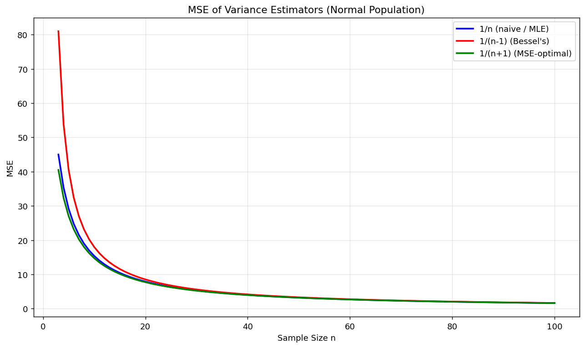

# 분산추정량

## 개요

모분산 $\sigma^2$을 추정할 때는 분모의 선택이라는 근본적인 문제가 따른다: 소박한 MLE는 $1/n$, Bessel 수정은 $1/(n-1)$, (정규성 아래) 평균제곱오차 최적 추정량은 $1/(n+1)$을 쓴다. 이 페이지에서는 세 추정량을 비교하고, 자유도의 직관을 살피며, 참 평균을 알 때의 이득을 따지고, 이 아이디어를 금융의 변동성 추정에 적용한다.

## 세 가지 분산추정량

분산이 $\sigma^2$인 모집단에서 뽑은 i.i.d. 관측값 $X_1, \ldots, X_n$이 주어졌을 때 편차제곱합을 다음과 같이 정의한다:

$$\text{SS} = \sum_{i=1}^n (X_i - \bar{X})^2$$

세 추정량은:

| 추정량 | 공식 | 편향 | 평균제곱오차 (정규) |
|-----------|---------|------|--------------|
| 소박한 추정량 (MLE) | $\tilde{S}^2 = \text{SS}/n$ | $-\sigma^2/n$ | $\frac{(2n-1)\sigma^4}{n^2}$ |
| Bessel | $S^2 = \text{SS}/(n-1)$ | $0$ | $\frac{2\sigma^4}{n-1}$ |
| 평균제곱오차 최적 | $\hat{S}^2 = \text{SS}/(n+1)$ | $-\frac{2\sigma^2}{n+1}$ | $\frac{2(n-1)\sigma^4 + 4\sigma^4}{(n+1)^2}$ |

## 편향의 확인

소박한 추정량은 예측 가능한 아래쪽 편향을 갖는다:

$$E[\tilde{S}^2] = \frac{n-1}{n}\sigma^2 \implies \text{Bias} = -\frac{\sigma^2}{n}$$

<div class="codebox" markdown>

### 예제 1. 편향이 정확히 얼마인지 확인하기 { .eg }

```python
import numpy as np

def bias_verification(sigma=3.0, n_sim=200_000, seed=42):
    """n으로 나누는 추정량의 편향이 정확히 -sigma^2/n 임을 확인한다."""
    rng = np.random.default_rng(seed)
    sigma2 = sigma**2
    sample_sizes = [3, 5, 10, 20, 50, 100, 500]

    for n in sample_sizes:
        samples = rng.normal(0, sigma, (n_sim, n))
        # ddof=0 이 n으로 나누는 판본이다(numpy 기본값이자 MLE).
        # 편차를 참 평균이 아니라 표본평균에서 재기 때문에
        # 제곱합이 체계적으로 작아지고, 그만큼 아래로 편향된다.
        # 그 크기가 정확히 sigma^2/n 이라는 것이 아래 출력의 요점이다.
        s_tilde2 = np.var(samples, axis=1, ddof=0)
        print(f"n={n:>4}  E[S̃²]={s_tilde2.mean():.4f}  "
              f"(n-1)/n·σ²={(n-1)/n*sigma2:.4f}  "
              f"Bias={s_tilde2.mean()-sigma2:.4f}  -σ²/n={-sigma2/n:.4f}")
bias_verification()
```

출력:

```
n=   3  E[S̃²]=6.0004  (n-1)/n·σ²=6.0000  Bias=-2.9996  -σ²/n=-3.0000
n=   5  E[S̃²]=7.1938  (n-1)/n·σ²=7.2000  Bias=-1.8062  -σ²/n=-1.8000
n=  10  E[S̃²]=8.0936  (n-1)/n·σ²=8.1000  Bias=-0.9064  -σ²/n=-0.9000
n=  20  E[S̃²]=8.5449  (n-1)/n·σ²=8.5500  Bias=-0.4551  -σ²/n=-0.4500
n=  50  E[S̃²]=8.8173  (n-1)/n·σ²=8.8200  Bias=-0.1827  -σ²/n=-0.1800
n= 100  E[S̃²]=8.9087  (n-1)/n·σ²=8.9100  Bias=-0.0913  -σ²/n=-0.0900
n= 500  E[S̃²]=8.9833  (n-1)/n·σ²=8.9820  Bias=-0.0167  -σ²/n=-0.0180
```

</div>

!!! note "편향은 n이 커지면 줄어든다"
    $n = 3$에서 편향은 $-\sigma^2/3 = -3.0$으로 참 분산의 33%이다. $n = 500$이면 편향이 $-0.018$로 무시할 만하다. 편향은 작은 표본에서 가장 중요하다.

## 평균제곱오차 비교

불편추정량($1/(n-1)$)은 평균제곱오차를 최소화하지 **않는다**. 정규성 아래에서 평균제곱오차가 최적인 추정량은 $1/(n+1)$을 쓰며, 작은 편향을 대가로 더 큰 분산 감소를 얻는다.

<div class="codebox" markdown>

### 예제 2. 세 추정량의 MSE { .eg }

```python
import matplotlib.pyplot as plt

def three_estimators_mse(sigma=3.0, n_sim=100_000, seed=42):
    """나누는 수만 다른 세 추정량의 MSE 를 표본크기의 함수로 그린다."""
    rng = np.random.default_rng(seed)
    sigma2, sigma4 = sigma**2, sigma**4

    fig, ax = plt.subplots(figsize=(10, 6))
    ns = np.arange(3, 101)
    # 정규모집단에서 세 추정량의 MSE를 닫힌 식으로 그린다.
    # 나누는 수만 다른 세 추정량인데 MSE 순서가 뚜렷하다.
    #   1/(n+1) < 1/n < 1/(n-1)
    # 즉 **불편추정량(베셀)이 MSE로는 셋 중 가장 나쁘다.**
    # 편향을 0으로 만드는 대가로 분산을 더 키웠기 때문이다.
    # n이 커지면 셋의 차이가 사라진다(모두 2*sigma^4/n 으로 수렴).
    ax.plot(ns, (2*ns-1)/ns**2 * sigma4, 'b-', lw=2, label='1/n (naive / MLE)')
    ax.plot(ns, 2/(ns-1) * sigma4, 'r-', lw=2, label="1/(n-1) (Bessel's)")
    ax.plot(ns, (2*(ns-1)+4)/(ns+1)**2 * sigma4, 'g-', lw=2, label='1/(n+1) (MSE-optimal)')
    ax.set_xlabel('Sample Size n')
    ax.set_ylabel('MSE')
    ax.set_title('MSE of Variance Estimators (Normal Population)')
    ax.legend()
    ax.grid(True, alpha=0.3)
    plt.tight_layout()
    plt.show()
three_estimators_mse()
```



</div>

!!! info "편향–분산 맞바꿈"
    평균제곱오차 최적 추정량은 편향되어 있음에도 모든 $n$에서 평균제곱오차가 가장 작다. 편향–분산 맞바꿈을 깔끔하게 보여주는 예이다: 때로는 작은 편향을 받아들이는 편이 전체 추정오차를 줄인다.

## 자유도의 직관

$n$개의 편차 $d_i = X_i - \bar{X}$는 다음 제약을 만족한다:

$$\sum_{i=1}^n (X_i - \bar{X}) = 0$$

이 편차들 가운데 $n - 1$개만이 독립적으로 자유롭게 변할 수 있다. 자유도로 나누는 것은 $\bar{X}$가 $\mu$보다 자료에 가까워 제곱합이 체계적으로 작아진다는 사실을 보정한다.

<div class="codebox" markdown>

### 예제 3. 자유도가 n-1인 이유 { .eg }

```python
def degrees_of_freedom_intuition(seed=42):
    """자유도가 왜 n이 아니라 n-1인지를 표본 하나로 눈에 보이게 한다."""
    rng = np.random.default_rng(seed)
    mu, sigma, n = 5.0, 2.0, 5      # n=5로 작게 잡아 다섯 줄을 다 볼 수 있게 한다
    sample = rng.normal(mu, sigma, n)
    x_bar = sample.mean()

    # 같은 자료에 대해 두 가지 편차를 계산한다.
    #   dev_xbar: 표본평균에서 잰 편차. 합이 **반드시 0**이다.
    #             다섯 개 중 넷을 알면 나머지 하나가 자동으로 정해지므로
    #             자유롭게 움직일 수 있는 것은 4개(= n-1)뿐이다.
    #   dev_mu  : 참 평균에서 잰 편차. 합이 0일 이유가 없다.
    dev_xbar = sample - x_bar
    dev_mu   = sample - mu

    # 아래 출력에서 SS(X̄) < SS(μ) 이고 그 차이가 정확히 n(X̄-μ)^2 이다.
    # 표본평균이 자기 자료에 "가장 가까운" 점이라 제곱합을 최소로 만들기 때문이며,
    # 이 체계적 축소를 되돌리는 것이 n-1로 나누는 일이다.

    for i in range(n):
        print(f"  X_{i+1}={sample[i]:.3f}  "
              f"X_i-X̄={dev_xbar[i]:.3f}  X_i-μ={dev_mu[i]:.3f}")

    print(f"\n  Sum(X_i - X̄) = {sum(dev_xbar):.6f}  (always 0)")
    print(f"  Sum(X_i - μ)  = {sum(dev_mu):.3f}  (not 0)")
    print(f"  SS(X̄) = {np.sum(dev_xbar**2):.3f}")
    print(f"  SS(μ)  = {np.sum(dev_mu**2):.3f}")
    print(f"  Difference = n·(X̄−μ)² = {n*(x_bar-mu)**2:.3f}")
degrees_of_freedom_intuition()
```

출력:

```
  X_1=5.609  X_i-X̄=1.008  X_i-μ=0.609
  X_2=2.920  X_i-X̄=-1.682  X_i-μ=-2.080
  X_3=6.501  X_i-X̄=1.899  X_i-μ=1.501
  X_4=6.881  X_i-X̄=2.279  X_i-μ=1.881
  X_5=1.098  X_i-X̄=-3.504  X_i-μ=-3.902

  Sum(X_i - X̄) = -0.000000  (always 0)
  Sum(X_i - μ)  = -1.991  (not 0)
  SS(X̄) = 24.923
  SS(μ)  = 25.715
  Difference = n·(X̄−μ)² = 0.792
```

두 제곱합을 잇는 핵심 항등식은:

$$\sum_{i=1}^n (X_i - \mu)^2 = \sum_{i=1}^n (X_i - \bar{X})^2 + n(\bar{X} - \mu)^2$$

$E[n(\bar{X} - \mu)^2] = \sigma^2$이므로, $\bar{X}$로부터의 편차는 평균적으로 정확히 $\sigma^2$만큼 $\mu$로부터의 편차를 과소평가한다.

</div>

## 평균을 아는 경우와 모르는 경우

참 평균 $\mu$가 알려져 있으면 다음을 쓸 수 있다:

$$\hat{\sigma}^2_{\text{known}} = \frac{1}{n}\sum_{i=1}^n (X_i - \mu)^2$$

이 추정량은 불편이며 $\mu$를 추정하느라 자유도를 잃지 않으므로 $S^2$보다 **분산이 작다**.

<div class="codebox" markdown>

### 예제 4. 평균을 알 때와 모를 때 { .eg }

```python
def known_vs_unknown_mean(sigma=3.0, n_sim=100_000, seed=42):
    """평균을 아는 경우와 모르는 경우의 분산 추정을 견준다.

    n-1 로 나누는 까닭은 평균을 몰라서 표본평균으로 대신했기 때문이다.
    평균을 알면 그 대가를 치를 일이 없다는 것을 숫자로 확인한다.
    """
    rng = np.random.default_rng(seed)
    mu, sigma2 = 5.0, sigma**2
    sample_sizes = [5, 10, 25, 50, 100]

    for n in sample_sizes:
        samples = rng.normal(mu, sigma, (n_sim, n))
        # mu를 아는 경우: 참 평균에서 편차를 재므로 자유도를 잃지 않는다.
        # n으로 나눠도 불편이며 분산이 더 작다.
        est_known   = np.mean((samples - mu)**2, axis=1)
        # mu를 모르는 경우: 표본평균으로 대신한다(여기서는 n으로 나눈 판본).
        est_unknown = np.var(samples, axis=1, ddof=0)
        mse_k = np.mean((est_known - sigma2)**2)
        mse_u = np.mean((est_unknown - sigma2)**2)
        print(f"n={n:>4}  MSE(known μ)={mse_k:.4f}  "
              f"MSE(unknown)={mse_u:.4f}  Ratio={mse_u/mse_k:.3f}")
known_vs_unknown_mean()
```

출력:

```
n=   5  MSE(known μ)=32.7043  MSE(unknown)=29.3561  Ratio=0.898
n=  10  MSE(known μ)=16.2469  MSE(unknown)=15.4447  Ratio=0.951
n=  25  MSE(known μ)=6.4207  MSE(unknown)=6.3067  Ratio=0.982
n=  50  MSE(known μ)=3.2328  MSE(unknown)=3.2001  Ratio=0.990
n= 100  MSE(known μ)=1.6033  MSE(unknown)=1.5968  Ratio=0.996
```

</div>

## 금융 응용: 변동성 추정

금융에서 변동성은 보통 수익률의 연율화된 표준편차로 추정한다. 분모의 선택($n$이냐 $n-1$이냐)은 추정 구간이 짧을수록 중요해진다.

<div class="codebox" markdown>

### 예제 5. 금융 응용 — 변동성 추정 { .eg }

```python
def volatility_estimation_finance(seed=42):
    """관측 창이 짧을 때 ddof 선택이 변동성 추정에 남기는 차이를 본다."""
    rng = np.random.default_rng(seed)
    annual_vol = 0.20
    daily_vol = annual_vol / np.sqrt(252)
    daily_mu = 0.08 / 252
    n_sim = 30_000

    windows = [5, 10, 21, 63, 126, 252]

    # 관측 창을 5일부터 252일(1년)까지 바꿔 가며 본다.
    for w in windows:
        vol_n, vol_n1 = [], []
        for _ in range(n_sim):
            r = rng.normal(daily_mu, daily_vol, w)
            # 일간 분산에 252를 곱해 연율화한 뒤 제곱근을 취한다.
            # 분산이 시간에 비례한다는 가정(독립 수익률)에서 나오는 관행이다.
            vol_n.append(np.sqrt(np.var(r, ddof=0) * 252))
            vol_n1.append(np.sqrt(np.var(r, ddof=1) * 252))
        # 창이 짧을수록 두 분모의 차이가 커진다.
        # w=5 면 n과 n-1 의 비가 5/4 라 변동성 추정이 10% 넘게 갈린다.
        # 반면 w=252 면 무시할 만하다.
        print(f"Window={w:>4}  Vol(1/n)={np.mean(vol_n)*100:.2f}%  "
              f"Vol(1/(n-1))={np.mean(vol_n1)*100:.2f}%  "
              f"Diff={(np.mean(vol_n1)-np.mean(vol_n))/np.mean(vol_n)*100:.2f}%")
volatility_estimation_finance()
```

출력:

```
Window=   5  Vol(1/n)=16.89%  Vol(1/(n-1))=18.88%  Diff=11.80%
Window=  10  Vol(1/n)=18.43%  Vol(1/(n-1))=19.43%  Diff=5.41%
Window=  21  Vol(1/n)=19.28%  Vol(1/(n-1))=19.76%  Diff=2.47%
Window=  63  Vol(1/n)=19.75%  Vol(1/(n-1))=19.91%  Diff=0.80%
Window= 126  Vol(1/n)=19.87%  Vol(1/(n-1))=19.95%  Diff=0.40%
Window= 252  Vol(1/n)=19.94%  Vol(1/(n-1))=19.98%  Diff=0.20%
```

</div>

!!! warning "짧은 구간은 차이를 키운다"
    5일 구간에서는 Bessel 수정 변동성이 소박한 추정값보다 대략 12% 높다. 분기(63일) 이상의 구간에서는 차이가 무시할 만하다. 실무에서는 많은 금융 응용이 기본적으로 $n-1$을 쓴다.

## 해석

- **소박한 추정량**($1/n$)은 아래로 편향되어 정확히 $\sigma^2/n$만큼 $\sigma^2$을 과소추정한다.
- **Bessel 수정**($1/(n-1)$)은 편향을 없애지만 평균제곱오차를 최소화하지는 않는다.
- **평균제곱오차 최적** 추정량(정규 자료에서 $1/(n+1)$)은 작은 편향을 받아들여 더 큰 분산 감소를 얻는다 — 편향–분산 맞바꿈의 고전적인 예이다.
- **자유도**가 직관을 준다: 평균을 추정하는 데 자유도 하나가 "소모된다".
- **참 평균**을 알면 더 나은 분산추정량을 얻는다. 실무에서는 드문 일이지만, 축소추정 같은 아이디어의 동기가 된다.
- 금융에서는 분모의 선택이 주로 **짧은 추정 구간**(주 단위나 격주 단위)에서 중요하다.

## 연습문제

<div class="drillbox" markdown>

**연습문제 1.** <span class="diff med" title="중간"></span>
항등식 $\sum(X_i - \bar{X})^2 = \sum(X_i - \mu)^2 - n(\bar{X} - \mu)^2$을 써서 $\tilde{S}^2 = \frac{1}{n}\sum_{i=1}^n(X_i - \bar{X})^2$에 대해 $E[\tilde{S}^2] = \frac{n-1}{n}\sigma^2$임을 증명하라.

</div>

??? success "풀이"
    항등식에서 출발한다:

    $$\sum_{i=1}^n(X_i - \bar{X})^2 = \sum_{i=1}^n(X_i - \mu)^2 - n(\bar{X} - \mu)^2$$

    기댓값을 취하면:

    $$E\left[\sum_{i=1}^n(X_i - \bar{X})^2\right] = \sum_{i=1}^n E[(X_i - \mu)^2] - nE[(\bar{X} - \mu)^2] = n\sigma^2 - n\cdot\frac{\sigma^2}{n} = (n-1)\sigma^2$$

    따라서:

    $$E[\tilde{S}^2] = E\left[\frac{1}{n}\sum_{i=1}^n(X_i - \bar{X})^2\right] = \frac{(n-1)\sigma^2}{n} = \frac{n-1}{n}\sigma^2$$

    편향은 $E[\tilde{S}^2] - \sigma^2 = -\sigma^2/n$이다. $\square$

<div class="drillbox" markdown>

**연습문제 2.** <span class="diff med" title="중간"></span>
$(n-1)S^2/\sigma^2 \sim \chi^2_{n-1}$이라는 사실을 이용하여, 정규 자료에서 Bessel 수정 추정량 $S^2 = \frac{1}{n-1}\sum(X_i - \bar{X})^2$의 평균제곱오차를 계산하라.

</div>

??? success "풀이"
    $Q = (n-1)S^2/\sigma^2 \sim \chi^2_{n-1}$이라 하자. 그러면 $S^2 = Q\sigma^2/(n-1)$이다.

    $S^2$이 불편이므로 $\text{MSE}(S^2) = \text{Var}(S^2)$이다.

    $$\text{Var}(S^2) = \frac{\sigma^4}{(n-1)^2}\text{Var}(Q) = \frac{\sigma^4}{(n-1)^2}\cdot 2(n-1) = \frac{2\sigma^4}{n-1}$$

    여기서 $k = n - 1$인 $\text{Var}(\chi^2_k) = 2k$를 썼다. $\square$

<div class="drillbox" markdown>

**연습문제 3.** <span class="diff med" title="중간"></span>
$d > 0$에 대해 $\text{MSE}(\text{SS}/d)$를 최소화하여, 정규성 아래에서 $\sigma^2$ 추정의 평균제곱오차 최적 분모가 $n + 1$임을 보여라.

</div>

??? success "풀이"
    추정량을 $\hat{\sigma}^2 = \text{SS}/d$라 하자. 여기서 $\text{SS} = \sum(X_i - \bar{X})^2$이고 $\text{SS}/\sigma^2 \sim \chi^2_{n-1}$이다.

    그러면 $E[\text{SS}] = (n-1)\sigma^2$이고 $\text{Var}(\text{SS}) = 2(n-1)\sigma^4$이다.

    $$\text{Bias} = \frac{(n-1)\sigma^2}{d} - \sigma^2 = \sigma^2\left(\frac{n-1}{d} - 1\right)$$

    $$\text{Var}\left(\frac{\text{SS}}{d}\right) = \frac{2(n-1)\sigma^4}{d^2}$$

    $$\text{MSE} = \text{Bias}^2 + \text{Var} = \sigma^4\left(\frac{n-1}{d} - 1\right)^2 + \frac{2(n-1)\sigma^4}{d^2}$$

    $\text{MSE}/\sigma^4$을 $d$에 대해 미분하여 0으로 놓으면:

    $$2\left(\frac{n-1}{d} - 1\right)\left(-\frac{n-1}{d^2}\right) - \frac{4(n-1)}{d^3} = 0$$

    양변에 $d^3$을 곱하여 정리하면:

    $$-2(n-1)\left[(n-1) - d\right] - 4(n-1) = 0$$

    $$(n-1) - d + 2 = 0 \implies d = n + 1$$

    $\square$

<div class="drillbox" markdown>

**연습문제 4.** <span class="diff med" title="중간"></span>
어떤 포트폴리오 매니저가 거래일 21일(한 달)치 수익률로 일별 변동성을 추정한다. 참 일별 변동성이 1.26%라면 $1/n$과 $1/(n-1)$ 분모 각각으로 얻는 연율화 변동성 추정값의 기댓값을 계산하라. 어느 쪽이 참 연율화 변동성 20%에 더 가까운가?

</div>

??? success "풀이"
    참 일별 변동성: $\sigma_d = 0.0126$. 참 연율화 변동성: $\sigma_a = 0.0126 \times \sqrt{252} \approx 0.20$ (20%).

    자료가 21일치일 때:

    **$1/n$을 쓰면:** $E[\tilde{S}^2] = \frac{n-1}{n}\sigma_d^2 = \frac{20}{21}\sigma_d^2$. 연율화 변동성의 기댓값은:

    $$\sqrt{\frac{20}{21}} \times 20\% \approx \sqrt{0.9524} \times 20\% \approx 0.976 \times 20\% = 19.52\%$$

    **$1/(n-1)$을 쓰면:** $E[S^2] = \sigma_d^2$이다. 다만 (제곱근이 오목하므로) Jensen 부등식에 의해 $E[S] < \sigma_d$임에 유의하라. 연율화 변동성의 기댓값은:

    $$E[\sqrt{S^2 \times 252}] = \sqrt{252}\cdot E[S] < \sqrt{252}\cdot \sigma_d = 20\%$$

    따라서 ($\sigma^2$이 아니라) $\sigma$에 대해서는 어느 추정량도 불편이 아니다. 그래도 $1/(n-1)$ 추정량이 참값에 더 가깝다. $S$의 편향은 카이제곱분포에서 나오는 $c_4$ 인자로 보정할 수 있다. $\square$

<div class="drillbox" markdown>

**연습문제 5.** <span class="diff med" title="중간"></span>
참 평균 $\mu$를 알면 분산추정의 평균제곱오차가 줄어드는 이유를 설명하라. $n = 5$에서 개선 정도를 정량화하라.

</div>

??? success "풀이"
    $\mu$를 알면 $\hat{\sigma}^2 = \frac{1}{n}\sum(X_i - \mu)^2$을 쓰는데, 이는 불편이며:

    $$\text{Var}(\hat{\sigma}^2) = \frac{1}{n^2}\text{Var}\left(\sum(X_i-\mu)^2\right) = \frac{1}{n^2}\cdot n\cdot\text{Var}((X-\mu)^2)$$

    정규 자료에서 $(X-\mu)^2/\sigma^2 \sim \chi^2_1$이므로 $\text{Var}((X-\mu)^2) = 2\sigma^4$이고, 따라서:

    $$\text{MSE}(\hat{\sigma}^2_{\text{known}}) = \frac{2\sigma^4}{n}$$

    $\mu$를 모르면 최량 불편추정량은:

    $$\text{MSE}(S^2) = \frac{2\sigma^4}{n-1}$$

    $n = 5$에서:

    $$\frac{\text{MSE}(S^2)}{\text{MSE}(\hat{\sigma}^2_{\text{known}})} = \frac{2\sigma^4/4}{2\sigma^4/5} = \frac{5}{4} = 1.25$$

    $\mu$를 알면 평균제곱오차가 20% 줄어든다. 분산추정에 자유도를 $n-1$이 아니라 $n$개 모두 쓰기 때문이다. $n$이 커지면 이 비는 1에 가까워진다. $\square$

---

## 정리하며

분산추정량의 분모 선택을 **세 후보로 정리**했다.

| 분모 | 이름 | 성질 |
|---|---|---|
| $n$ | 최대가능도 | 편향($-\sigma^2/n$), 분산 작음 |
| $n-1$ | 베셀 수정 | 불편, 표준 관행 |
| $n+1$ | MSE 최적 | 편향 크지만 MSE 최소(정규 가정) |

- **차이는 $O(1/n)$ 이다.** $n=100$ 이면 세 값이 $2\%$ 안에 들어오며, 실무에서 결과를 바꾸는 일은 드물다.
- **참 평균을 알면 사정이 달라진다.** $\mu$ 를 알면 $\frac1n\sum(X_i-\mu)^2$ 이 불편이고 자유도를 잃지 않아 분산도 작다. **자유도 하나의 값어치**가 여기서 정량적으로 드러난다.
- **금융의 변동성 추정이 직접적인 응용이다.** 수익률의 평균이 $0$ 에 가깝다고 보아 평균을 추정하지 않고 $\frac1n\sum r_t^2$ 을 쓰는 관행이 있으며, 이는 "$\mu$ 를 안다"에 해당한다.
- **분모보다 중요한 결정이 많다.** 표본 기간, 수익률의 빈도, 이상치 처리가 모두 분모 선택보다 결과에 큰 영향을 준다.

다음 절 **베셀 수정 시연**에서 지금까지의 주장을 모의실험으로 확인한다.
