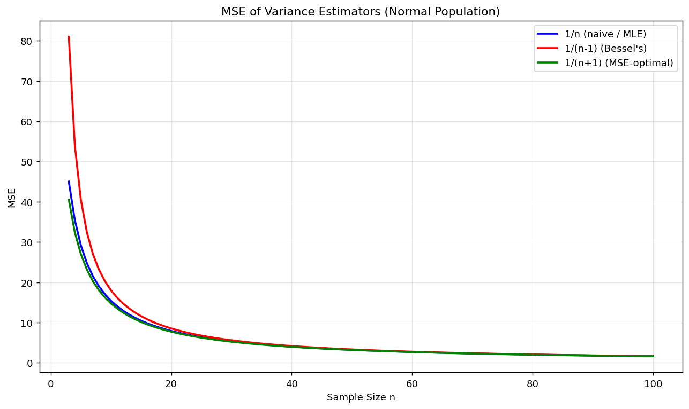

# 분산추정량

## 개요

모분산 $\sigma^2$을 추정할 때는 분모의 선택이라는 근본적인 문제가 따른다: 소박한 MLE는 $1/n$, Bessel 수정은 $1/(n-1)$, (정규성 아래) 평균제곱오차 최적 추정량은 $1/(n+1)$을 쓴다. 이 페이지에서는 세 추정량을 비교하고, 자유도의 직관을 살피며, 참 평균을 알 때의 이득을 따지고, 이 아이디어를 금융의 변동성 추정에 적용한다.

## 세 가지 분산추정량

분산이 $\sigma^2$인 모집단에서 뽑은 i.i.d. 관측값 $X_1, \ldots, X_n$이 주어졌을 때 편차제곱합을 다음과 같이 정의한다:

$$\text{SS} = \sum_{i=1}^n (X_i - \bar{X})^2$$

세 추정량은:

| 추정량 | 공식 | 편향 | 평균제곱오차 (정규) |
|-----------|---------|------|--------------|
| 소박한 추정량 (MLE) | $\tilde{S}^2 = \text{SS}/n$ | $-\sigma^2/n$ | $\frac{(2n-1)\sigma^4}{n^2}$ |
| Bessel | $S^2 = \text{SS}/(n-1)$ | $0$ | $\frac{2\sigma^4}{n-1}$ |
| 평균제곱오차 최적 | $\hat{S}^2 = \text{SS}/(n+1)$ | $-\frac{2\sigma^2}{n+1}$ | $\frac{2(n-1)\sigma^4 + 4\sigma^4}{(n+1)^2}$ |

## 편향의 확인

소박한 추정량은 예측 가능한 아래쪽 편향을 갖는다:

$$E[\tilde{S}^2] = \frac{n-1}{n}\sigma^2 \implies \text{Bias} = -\frac{\sigma^2}{n}$$

<div class="exbox" markdown>

**보기 1.** <span class="diff easy" title="쉬움"></span> 편향이 정확히 얼마인지 확인하기. $N(0, 3^2)$에서 $n$을 $3$에서 $500$까지 바꾸며 $\tilde S^2 = \mathrm{SS}/n$을 20만 번 기록한다.

**(1)** $E[\tilde S^2] = \frac{n-1}{n}\sigma^2$을 보이고 편향을 적으시오. 그 편향이 **상대적으로** 얼마나 큰가.

**(2)** 모의로 잰 편향이 참값 주위로 얼마만큼 흔들릴지 구하고, 일곱 줄을 그 자로 재시오.

</div>

??? success "풀이"

    **(1) 해석적으로.** $\tilde S^2 = \frac{n-1}{n}S^2$이고 [5.1절의 증명 상자](../../ch05/foundations/statistics_as_rv.md)가 $E[S^2] = \sigma^2$을 주므로

    $$
    E[\tilde S^2] = \frac{n-1}{n}\sigma^2,
    \qquad
    \operatorname{Bias} = \frac{n-1}{n}\sigma^2 - \sigma^2 = -\frac{\sigma^2}{n}
    $$

    다. **상대편향이 $-1/n$으로 $\sigma$에 의존하지 않는다**는 점이 중요하다. $n = 3$이면 참값의 $33\%$를 깎고, $n = 100$이면 $1\%$를 깎는다. 분포에도 의존하지 않는다. 정규성은 어디에도 쓰이지 않았다.

    편향이 **아래 방향**인 까닭도 한 줄이다. $\bar X$는 제곱합을 가장 작게 만드는 점이므로 $\sum(X_i - \bar X)^2 \le \sum(X_i - \mu)^2$이 **언제나** 성립하고, 그 모자람의 기댓값이 정확히 $\sigma^2$이다(보기 3이 이것을 한 표본에서 눈으로 보인다).

    **(2) 흔들림의 크기.** 정규모집단이면 $\mathrm{SS}/\sigma^2 \sim \chi^2_{n-1}$이므로

    $$
    \operatorname{Var}(\tilde S^2) = \frac{\sigma^4}{n^2}\cdot 2(n-1) = \frac{2(n-1)\sigma^4}{n^2}
    $$

    이고, 20만 번 평균의 표준오차는 그 제곱근을 $\sqrt{2\times10^5}$로 나눈 값이다. $\sigma^2 = 9$에서

    | $n$ | $\operatorname{Var}(\tilde S^2)$ | 몬테카를로 표준오차 |
    |---:|---:|---:|
    | $3$ | $36.000$ | $0.0134$ |
    | $5$ | $25.920$ | $0.0114$ |
    | $10$ | $14.580$ | $0.0085$ |
    | $20$ | $7.695$ | $0.0062$ |
    | $50$ | $3.175$ | $0.0040$ |
    | $100$ | $1.604$ | $0.0028$ |
    | $500$ | $0.323$ | $0.0013$ |

    모의실험과 맞춰 본다.

    ```python
    import numpy as np

    def bias_verification(sigma=3.0, n_sim=200_000, seed=42):
        """n으로 나누는 추정량의 편향이 정확히 -sigma^2/n 임을 확인한다."""
        rng = np.random.default_rng(seed)
        sigma2 = sigma**2
        sample_sizes = [3, 5, 10, 20, 50, 100, 500]

        for n in sample_sizes:
            samples = rng.normal(0, sigma, (n_sim, n))
            # ddof=0 이 n으로 나누는 판본이다(numpy 기본값이자 MLE).
            # 편차를 참 평균이 아니라 표본평균에서 재기 때문에
            # 제곱합이 체계적으로 작아지고, 그만큼 아래로 편향된다.
            # 그 크기가 정확히 sigma^2/n 이라는 것이 아래 출력의 요점이다.
            s_tilde2 = np.var(samples, axis=1, ddof=0)
            print(f"n={n:>4}  E[S̃²]={s_tilde2.mean():.4f}  "
                  f"(n-1)/n·σ²={(n-1)/n*sigma2:.4f}  "
                  f"Bias={s_tilde2.mean()-sigma2:.4f}  -σ²/n={-sigma2/n:.4f}")
    bias_verification()
    ```

    출력:

    ```
    n=   3  E[S̃²]=6.0004  (n-1)/n·σ²=6.0000  Bias=-2.9996  -σ²/n=-3.0000
    n=   5  E[S̃²]=7.1938  (n-1)/n·σ²=7.2000  Bias=-1.8062  -σ²/n=-1.8000
    n=  10  E[S̃²]=8.0936  (n-1)/n·σ²=8.1000  Bias=-0.9064  -σ²/n=-0.9000
    n=  20  E[S̃²]=8.5449  (n-1)/n·σ²=8.5500  Bias=-0.4551  -σ²/n=-0.4500
    n=  50  E[S̃²]=8.8173  (n-1)/n·σ²=8.8200  Bias=-0.1827  -σ²/n=-0.1800
    n= 100  E[S̃²]=8.9087  (n-1)/n·σ²=8.9100  Bias=-0.0913  -σ²/n=-0.0900
    n= 500  E[S̃²]=8.9833  (n-1)/n·σ²=8.9820  Bias=-0.0167  -σ²/n=-0.0180
    ```

    둘째 열과 셋째 열이 소수 둘째 자리까지 맞는다. 편향 쪽을 (2)의 자로 재면 이렇다.

    | $n$ | 모의 편향 | $-\sigma^2/n$ | 차이 | 몬테카를로 표준오차 | $z$ |
    |---:|---:|---:|---:|---:|---:|
    | $3$ | $-2.9996$ | $-3.0000$ | $+0.0004$ | $0.0134$ | $+0.03$ |
    | $5$ | $-1.8062$ | $-1.8000$ | $-0.0062$ | $0.0114$ | $-0.54$ |
    | $10$ | $-0.9064$ | $-0.9000$ | $-0.0064$ | $0.0085$ | $-0.75$ |
    | $20$ | $-0.4551$ | $-0.4500$ | $-0.0051$ | $0.0062$ | $-0.82$ |
    | $50$ | $-0.1827$ | $-0.1800$ | $-0.0027$ | $0.0040$ | $-0.68$ |
    | $100$ | $-0.0913$ | $-0.0900$ | $-0.0013$ | $0.0028$ | $-0.46$ |
    | $500$ | $-0.0167$ | $-0.0180$ | $+0.0013$ | $0.0013$ | $+1.00$ |

    **일곱 줄 모두 $1$ 표준오차 안이다.** 다섯 줄이 같은 음의 방향으로 쏠려 있어 눈에 걸릴 수 있으나, 일곱 줄이 **같은 난수열에서** 나왔으므로 서로 독립이 아니다. 같은 모의실험을 다른 씨앗으로 돌리면 쏠리는 방향이 바뀐다.

    **$n$이 커질 때 두 가지가 동시에 작아진다는 점을 혼동하지 말아야 한다.** 편향 자체도 $-3.0$에서 $-0.018$로 줄고, 그것을 재는 자도 $0.0134$에서 $0.0013$으로 줄었다. 그래서 $n = 500$에서 편향 $-0.0167$은 **여전히 $0$과 확실히 구별된다.** $-0.018$을 $0.0013$으로 나누면 $-13.8$ 표준오차다. **편향은 작아질 뿐 사라지지 않는다.**

!!! note "편향은 n이 커지면 줄어든다"
    $n = 3$에서 편향은 $-\sigma^2/3 = -3.0$으로 참 분산의 33%이다. $n = 500$이면 편향이 $-0.018$로 무시할 만하다. 편향은 작은 표본에서 가장 중요하다.

## 평균제곱오차 비교

불편추정량($1/(n-1)$)은 평균제곱오차를 최소화하지 **않는다**. 정규성 아래에서 평균제곱오차가 최적인 추정량은 $1/(n+1)$을 쓰며, 작은 편향을 대가로 더 큰 분산 감소를 얻는다.

<div class="exbox" markdown>

**보기 2.** <span class="diff easy" title="쉬움"></span> 세 추정량의 MSE. 정규모집단에서 $\mathrm{SS}/n$, $\mathrm{SS}/(n-1)$, $\mathrm{SS}/(n+1)$의 평균제곱오차를 $n = 3$부터 $100$까지 그린다.

**(1)** 분모를 **아무 수 $c$**로 두고 $\operatorname{MSE}(\mathrm{SS}/c)$를 구한 뒤, 그것을 가장 작게 하는 $c$를 미분으로 찾으시오. 정말 $c = n+1$인가.

**(2)** 세 추정량의 평균제곱오차를 가장 간단한 꼴로 적고, 그림이 보이는 순서를 설명하시오.

</div>

??? success "풀이"

    **(1) 해석적으로.** 정규모집단에서 $\mathrm{SS}/\sigma^2 \sim \chi^2_{n-1}$이므로 $k = n-1$로 두면

    $$
    E[\mathrm{SS}] = k\sigma^2,
    \qquad
    \operatorname{Var}(\mathrm{SS}) = 2k\sigma^4
    $$

    이다. 분모를 $c$로 둔 추정량의 평균제곱오차는 편향제곱과 분산의 합이다.

    $$
    \operatorname{MSE}\!\left(\frac{\mathrm{SS}}{c}\right)
    = \left(\frac{k\sigma^2}{c} - \sigma^2\right)^2 + \frac{2k\sigma^4}{c^2}
    = \frac{\sigma^4}{c^2}\Big[(k - c)^2 + 2k\Big]
    $$

    $c$로 미분해 $0$으로 둔다. $f(c) = \big[(k-c)^2 + 2k\big]/c^2$라 하면

    $$
    f'(c) = \frac{-2(k-c)c^2 - 2c\big[(k-c)^2 + 2k\big]}{c^4} = 0
    \;\Longrightarrow\;
    -(k-c)c - (k-c)^2 - 2k = 0
    $$

    인데, 앞의 두 항이 $-(k-c)\big[c + (k-c)\big] = -k(k-c)$이므로 조건이

    $$
    -k(k-c) = 2k
    \quad\Longleftrightarrow\quad
    k - c = -2
    \quad\Longleftrightarrow\quad
    c = k + 2 = n + 1
    $$

    로 깔끔하게 떨어진다. **$n+1$은 어림이 아니라 정확한 최소점이다.** 이것이 최소임은 $f(c) \to \infty$ $(c \to 0^+)$이고 $f(c) \to 1$ $(c \to \infty)$인데 $f(n+1) = 2/(n+1) < 1$이며 정류점이 하나뿐이라는 데서 나온다.

    **(2) 세 값.** 위 식에 $c = n$, $n-1$, $n+1$을 차례로 넣는다. $k = n-1$이다.

    $$
    c = n:\quad \frac{\sigma^4}{n^2}\big[1 + 2(n-1)\big] = \frac{(2n-1)\sigma^4}{n^2}
    $$

    $$
    c = n-1:\quad \frac{\sigma^4}{(n-1)^2}\big[0 + 2(n-1)\big] = \frac{2\sigma^4}{n-1}
    $$

    $$
    c = n+1:\quad \frac{\sigma^4}{(n+1)^2}\big[4 + 2(n-1)\big] = \frac{(2n+2)\sigma^4}{(n+1)^2} = \frac{2\sigma^4}{n+1}
    $$

    **마지막 것이 $2\sigma^4/(n+1)$로 줄어든다는 점이 예쁘다.** 쪽 머리의 표에 적힌 $\frac{2(n-1)\sigma^4 + 4\sigma^4}{(n+1)^2}$과 같은 값이며, 베셀의 $2\sigma^4/(n-1)$과 분모만 두 칸 다르다. 세 값을 나란히 적으면

    $$
    \frac{2\sigma^4}{n+1}
    \;<\;
    \frac{(2n-1)\sigma^4}{n^2}
    \;<\;
    \frac{2\sigma^4}{n-1}
    $$

    이고, **부등호가 모든 $n \ge 2$에서 성립한다.** 가운데 항이 $\frac{2\sigma^4}{n} \cdot \frac{2n-1}{2n}$이라 $2\sigma^4/n$보다 조금 작고, 양 끝은 $2\sigma^4/(n\pm1)$이기 때문이다.

    **그림은 세 곡선이 이 순서로 포개져 있고 $n$이 커지면서 하나로 합쳐지는 모습이어야 한다.** 셋의 비를 보면 $n = 3$에서 $0.500 : 0.556 : 1.000$으로 두 배까지 벌어지지만 $n = 100$에서 $0.019802 : 0.019900 : 0.020202$로 $2\%$ 안에 모인다. **불편추정량이 평균제곱오차로는 셋 중 꼴찌**이고, 편향을 $0$으로 만든 값을 분산으로 치른 것이다.

    그림으로 확인한다.

    ```python
    import matplotlib.pyplot as plt

    plt.rcParams["font.family"] = "Apple SD Gothic Neo"
    plt.rcParams["axes.unicode_minus"] = False

    def three_estimators_mse(sigma=3.0, n_sim=100_000, seed=42):
        """나누는 수만 다른 세 추정량의 MSE 를 표본크기의 함수로 그린다."""
        rng = np.random.default_rng(seed)
        sigma2, sigma4 = sigma**2, sigma**4

        fig, ax = plt.subplots(figsize=(10, 6))
        ns = np.arange(3, 101)
        # 정규모집단에서 세 추정량의 MSE를 닫힌 식으로 그린다.
        # 나누는 수만 다른 세 추정량인데 MSE 순서가 뚜렷하다.
        #   1/(n+1) < 1/n < 1/(n-1)
        # 즉 **불편추정량(베셀)이 MSE로는 셋 중 가장 나쁘다.**
        # 편향을 0으로 만드는 대가로 분산을 더 키웠기 때문이다.
        # n이 커지면 셋의 차이가 사라진다(모두 2*sigma^4/n 으로 수렴).
        ax.plot(ns, (2*ns-1)/ns**2 * sigma4, 'b-', lw=2, label='1/n (naive / MLE)')
        ax.plot(ns, 2/(ns-1) * sigma4, 'r-', lw=2, label="1/(n-1) (Bessel's)")
        ax.plot(ns, (2*(ns-1)+4)/(ns+1)**2 * sigma4, 'g-', lw=2, label='1/(n+1) (MSE-optimal)')
        ax.set_xlabel('Sample Size n')
        ax.set_ylabel('MSE')
        ax.set_title('MSE of Variance Estimators (Normal Population)')
        ax.legend()
        ax.grid(True, alpha=0.3)
        plt.tight_layout()
        plt.show()
    three_estimators_mse()
    ```

    

    ```python
    # (1) 의 최소점이 정말 n+1 인지, 분모 c 를 훑어 직접 찾는다.
    for n in (3, 10, 100):
        k = n - 1
        cs = np.linspace(1, n + 6, 200001)          # c 를 촘촘히 훑는다
        mse = ((k - cs)**2 + 2*k) / cs**2           # σ⁴ = 1 로 두었다
        print(f"n={n:>4}  격자 최소점 c = {cs[mse.argmin()]:.4f}  (이론 n+1 = {n+1})"
              f"   MSE: 1/n={(2*n-1)/n**2:.6f}  1/(n-1)={2/(n-1):.6f}  1/(n+1)={2/(n+1):.6f}")
    ```

    출력:

    ```
    n=   3  격자 최소점 c = 4.0000  (이론 n+1 = 4)   MSE: 1/n=0.555556  1/(n-1)=1.000000  1/(n+1)=0.500000
    n=  10  격자 최소점 c = 11.0000  (이론 n+1 = 11)   MSE: 1/n=0.190000  1/(n-1)=0.222222  1/(n+1)=0.181818
    n= 100  격자 최소점 c = 100.9999  (이론 n+1 = 101)   MSE: 1/n=0.019900  1/(n-1)=0.020202  1/(n+1)=0.019802
    ```

    **격자 탐색이 세 번 모두 $n+1$을 집는다.** $n = 100$에서 $100.9999$가 나온 것은 격자 간격이 $5.3\times10^{-4}$이라 $101$이 후보에 정확히 들어 있지 않았기 때문이고, 해석적 답 쪽이 정확하다. 그리고 세 평균제곱오차가 (2)에서 손으로 구한 값과 소수 여섯째 자리까지 같다.

    **$n = 3$ 줄이 가장 극적이다.** 베셀의 평균제곱오차가 $1.000$인데 $1/(n+1)$ 쪽은 $0.500$으로 **정확히 절반**이다. 그런데도 실무가 베셀을 쓰는 데에는 까닭이 있다.

    - **$1/(n+1)$의 최적성은 정규모집단에서만 성립한다.** 일반 분포에서는 최적 분모가 4차 적률에 달려 있어 미리 알 수 없다. 반면 $E[S^2] = \sigma^2$은 분산만 유한하면 언제나 참이다.
    - **분산추정값은 대개 그 자체가 목적이 아니다.** $t$ 검정, 신뢰구간, 분산분석이 모두 $(n-1)S^2/\sigma^2 \sim \chi^2_{n-1}$ 위에 서 있고, 그 분포가 성립하는 것은 분모가 $n-1$일 때다.
    - **편향은 쌓이고 분산은 지워진다.** 여러 자료에 걸쳐 평균을 내는 상황에서 $1/(n+1)$의 아래쪽 편향은 사라지지 않는다.

    **그래서 "평균제곱오차가 작은 쪽이 좋은 추정량"이라고 말할 수 없다.** 무엇에 쓸 것인지가 기준을 정한다.

!!! info "편향–분산 맞바꿈"
    평균제곱오차 최적 추정량은 편향되어 있음에도 모든 $n$에서 평균제곱오차가 가장 작다. 편향–분산 맞바꿈을 깔끔하게 보여주는 예이다: 때로는 작은 편향을 받아들이는 편이 전체 추정오차를 줄인다.

## 자유도의 직관

$n$개의 편차 $d_i = X_i - \bar{X}$는 다음 제약을 만족한다:

$$\sum_{i=1}^n (X_i - \bar{X}) = 0$$

이 편차들 가운데 $n - 1$개만이 독립적으로 자유롭게 변할 수 있다. 자유도로 나누는 것은 $\bar{X}$가 $\mu$보다 자료에 가까워 제곱합이 체계적으로 작아진다는 사실을 보정한다.

<div class="exbox" markdown>

**보기 3.** <span class="diff easy" title="쉬움"></span> 자유도가 n-1인 이유. $N(5, 2^2)$에서 $n = 5$를 한 번 뽑아 $\bar X$에서 잰 편차와 참 평균 $\mu$에서 잰 편차를 나란히 적는다.

**(1)** 두 제곱합의 차이가 **정확히** 얼마인지 식으로 적으시오. 그 차이의 기댓값은 얼마인가.

**(2)** 출력에서 그 차이가 $0.792$로 나왔다. (1)이 말하는 값과 다른데, 어긋난 것인가.

</div>

??? success "풀이"

    **(1) 해석적으로.** 제곱을 펼치면 교차항이 정리되어 **정확한 항등식**이 나온다.

    $$
    \sum_i (X_i - \mu)^2
    = \sum_i \big[(X_i - \bar X) + (\bar X - \mu)\big]^2
    = \sum_i (X_i - \bar X)^2 + n(\bar X - \mu)^2
    $$

    가운데 교차항 $2(\bar X - \mu)\sum_i(X_i - \bar X)$가 **$\sum_i (X_i - \bar X) = 0$ 때문에 통째로 사라진다.** 출력의 "$\texttt{Sum}(X_i - \bar X) = 0$ (always 0)" 줄이 바로 그 제약이고, 자유도가 $n$이 아니라 $n-1$인 까닭도 같은 한 줄이다. 편차 다섯 개 가운데 넷을 알면 다섯째가 자동으로 정해진다.

    따라서 두 제곱합의 차이는

    $$
    \mathrm{SS}(\mu) - \mathrm{SS}(\bar X) = n(\bar X - \mu)^2 \;\ge\; 0
    $$

    이다. **언제나 $\bar X$ 쪽이 작거나 같다.** $\bar X$가 제곱합을 최소로 만드는 점이기 때문이고, 등호는 $\bar X = \mu$일 때뿐이다.

    그 차이의 **기댓값**은 $\operatorname{Var}(\bar X) = \sigma^2/n$에서

    $$
    E\big[n(\bar X - \mu)^2\big] = n \cdot \frac{\sigma^2}{n} = \sigma^2 = 4
    $$

    다. **평균적으로 정확히 $\sigma^2$ 하나만큼 모자라고, 그 하나를 메우려고 $n$이 아니라 $n-1$로 나눈다.**

    **(2) 한 표본의 값과 기댓값은 다르다.** $n(\bar X - \mu)^2 = \sigma^2 \cdot \frac{n(\bar X-\mu)^2}{\sigma^2}$이고 둘째 인자가 $\chi^2_1$을 따르므로, 이 차이는 **$4\chi^2_1$을 따르는 확률변수**다. $\chi^2_1$은 중앙값이 $0.455$라 **절반은 기댓값의 절반에도 못 미친다.** 출력의 $0.792$는 $\chi^2_1 = 0.198$에 해당하고 그 아래쪽 확률이 $0.344$이므로, 세 번에 한 번쯤 나오는 평범한 값이다. 어긋난 것이 아니라 **기댓값은 한 번의 표본에서 보이지 않는 양**일 뿐이다.

    출력을 한 줄씩 읽는다.

    ```python
    def degrees_of_freedom_intuition(seed=42):
        """자유도가 왜 n이 아니라 n-1인지를 표본 하나로 눈에 보이게 한다."""
        rng = np.random.default_rng(seed)
        mu, sigma, n = 5.0, 2.0, 5      # n=5로 작게 잡아 다섯 줄을 다 볼 수 있게 한다
        sample = rng.normal(mu, sigma, n)
        x_bar = sample.mean()

        # 같은 자료에 대해 두 가지 편차를 계산한다.
        #   dev_xbar: 표본평균에서 잰 편차. 합이 **반드시 0**이다.
        #             다섯 개 중 넷을 알면 나머지 하나가 자동으로 정해지므로
        #             자유롭게 움직일 수 있는 것은 4개(= n-1)뿐이다.
        #   dev_mu  : 참 평균에서 잰 편차. 합이 0일 이유가 없다.
        dev_xbar = sample - x_bar
        dev_mu   = sample - mu

        # 아래 출력에서 SS(X̄) < SS(μ) 이고 그 차이가 정확히 n(X̄-μ)^2 이다.
        # 표본평균이 자기 자료에 "가장 가까운" 점이라 제곱합을 최소로 만들기 때문이며,
        # 이 체계적 축소를 되돌리는 것이 n-1로 나누는 일이다.

        for i in range(n):
            print(f"  X_{i+1}={sample[i]:.3f}  "
                  f"X_i-X̄={dev_xbar[i]:.3f}  X_i-μ={dev_mu[i]:.3f}")

        print(f"\n  Sum(X_i - X̄) = {sum(dev_xbar):.6f}  (always 0)")
        print(f"  Sum(X_i - μ)  = {sum(dev_mu):.3f}  (not 0)")
        print(f"  SS(X̄) = {np.sum(dev_xbar**2):.3f}")
        print(f"  SS(μ)  = {np.sum(dev_mu**2):.3f}")
        print(f"  Difference = n·(X̄−μ)² = {n*(x_bar-mu)**2:.3f}")
    degrees_of_freedom_intuition()
    ```

    출력:

    ```
      X_1=5.609  X_i-X̄=1.008  X_i-μ=0.609
      X_2=2.920  X_i-X̄=-1.682  X_i-μ=-2.080
      X_3=6.501  X_i-X̄=1.899  X_i-μ=1.501
      X_4=6.881  X_i-X̄=2.279  X_i-μ=1.881
      X_5=1.098  X_i-X̄=-3.504  X_i-μ=-3.902

      Sum(X_i - X̄) = -0.000000  (always 0)
      Sum(X_i - μ)  = -1.991  (not 0)
      SS(X̄) = 24.923
      SS(μ)  = 25.715
      Difference = n·(X̄−μ)² = 0.792
    ```

    네 줄이 (1)과 맞는다. $\mathrm{SS}(\mu) - \mathrm{SS}(\bar X) = 25.715 - 24.923 = 0.792$이고 마지막 줄의 $n(\bar X - \mu)^2$와 같다. $\sum(X_i - \bar X)$가 $-0.000000$으로 기계 오차만 남고, $\sum(X_i - \mu) = -1.991$은 $0$이 아니다. 실제로 $\bar x = 5 - 1.991/5 = 4.6018$이므로 $5(4.6018-5)^2 = 0.7928$로 셋째 자리까지 맞는다.

    (2)를 되풀이 1만 번으로 확인한다.

    ```python
    # 한 표본에서는 0.792 였다. 되풀이하면 그 평균이 sigma^2 = 4 로 가는가.
    rng2 = np.random.default_rng(7)
    diffs = []
    for _ in range(10_000):
        s = rng2.normal(5.0, 2.0, 5)
        diffs.append(5 * (s.mean() - 5.0) ** 2)
    diffs = np.array(diffs)
    print(f"n(X̄-μ)² 의 평균   = {diffs.mean():.4f}   (이론 σ² = 4)")
    print(f"           중앙값 = {np.median(diffs):.4f}   (이론 4 × 0.4549 = {4*0.45494:.4f})")
    print(f"0.792 이하가 나올 비율 = {np.mean(diffs <= 0.792):.4f}   (이론 0.3440)")
    ```

    출력:

    ```
    n(X̄-μ)² 의 평균   = 4.0124   (이론 σ² = 4)
               중앙값 = 1.8324   (이론 4 × 0.4549 = 1.8198)
    0.792 이하가 나올 비율 = 0.3434   (이론 0.3440)
    ```

    **평균이 $4.0124$로 $\sigma^2 = 4$를 맞힌다.** 1만 번에서 이 평균의 표준오차가 $\sqrt{2\sigma^4/10^4} = 0.0566$이므로 $0.22$ 표준오차 거리다.

    그런데 **중앙값은 $1.83$으로 평균의 절반도 되지 않는다.** $\chi^2_1$이 $0$ 근처에 몰려 있고 오른쪽으로 길게 끌리는 분포라 그렇다. 그래서 한 표본만 보면 "$\sigma^2$만큼 모자란다"는 말이 눈에 띄지 않고, 실제로 $0.792$ 이하가 나올 확률이 $34.4\%$다.

    **보정이 $n-1$이라는 고정된 수인 까닭이 여기에 있다.** 자료마다 모자란 양이 $0$에서 수십까지 들쭉날쭉한데, 그것을 자료별로 보정할 길은 없다($\mu$를 모르니 $n(\bar X-\mu)^2$을 계산할 수 없다). 대신 **평균적으로 정확히 맞도록** 분모를 한 칸 줄인다. 불편성이 "한 번의 추정이 맞는다"가 아니라 "되풀이의 중심이 맞는다"라는 말의 뜻이 이 보기에 그대로 들어 있다.

두 제곱합을 잇는 핵심 항등식은:

$$\sum_{i=1}^n (X_i - \mu)^2 = \sum_{i=1}^n (X_i - \bar{X})^2 + n(\bar{X} - \mu)^2$$

$E[n(\bar{X} - \mu)^2] = \sigma^2$이므로, $\bar{X}$로부터의 편차는 평균적으로 정확히 $\sigma^2$만큼 $\mu$로부터의 편차를 과소평가한다.

## 평균을 아는 경우와 모르는 경우

참 평균 $\mu$가 알려져 있으면 다음을 쓸 수 있다:

$$\hat{\sigma}^2_{\text{known}} = \frac{1}{n}\sum_{i=1}^n (X_i - \mu)^2$$

이 추정량은 불편이며 $\mu$를 추정하느라 자유도를 잃지 않으므로 $S^2$보다 **분산이 작다**.

<div class="exbox" markdown>

**보기 4.** <span class="diff easy" title="쉬움"></span> 평균을 알 때와 모를 때. $N(5, 3^2)$에서 $\hat\sigma^2_{\text{known}} = \frac1n\sum(X_i-\mu)^2$과 $\tilde S^2 = \frac1n\sum(X_i-\bar X)^2$의 평균제곱오차를 10만 번 되풀이로 재어 비를 본다.

**(1)** 두 평균제곱오차를 해석적으로 구하고 그 비를 $n$의 함수로 적으시오.

**(2)** 본문은 평균을 알면 **더 좋은** 추정량을 얻는다고 했는데 출력의 비가 셋째 줄까지 모두 $1$보다 **작다.** 어느 쪽이 틀렸는가.

</div>

??? success "풀이"

    **(1) 해석적으로.** 평균을 아는 쪽은 자유도를 잃지 않는다. $\sum(X_i-\mu)^2/\sigma^2 \sim \chi^2_n$이므로

    $$
    E\big[\hat\sigma^2_{\text{known}}\big] = \sigma^2,
    \qquad
    \operatorname{Var} = \frac{2\sigma^4}{n}
    \;\Longrightarrow\;
    \operatorname{MSE}_{\text{known}} = \frac{2\sigma^4}{n}
    $$

    다. 불편이므로 평균제곱오차가 곧 분산이다.

    모르는 쪽은 보기 2에서 이미 구했다. 코드가 쓴 것은 $\texttt{ddof=0}$, 곧 분모가 $n$인 쪽이므로

    $$
    \operatorname{MSE}_{\tilde S^2} = \frac{(2n-1)\sigma^4}{n^2}
    $$

    이다. 비를 적으면 **$\sigma$가 약분되고 $n$만 남는다.**

    $$
    \frac{\operatorname{MSE}_{\tilde S^2}}{\operatorname{MSE}_{\text{known}}}
    = \frac{(2n-1)\sigma^4/n^2}{2\sigma^4/n}
    = \frac{2n-1}{2n}
    = 1 - \frac{1}{2n}
    $$

    **$1$보다 작다. 그것도 모든 $n$에서.** $n = 5$에서 $0.900$, $n = 10$에서 $0.950$, $n = 25$에서 $0.980$, $n = 50$에서 $0.990$, $n = 100$에서 $0.995$다.

    **(2) 어느 쪽도 틀리지 않았다. 두 문장이 서로 다른 것을 견주고 있을 뿐이다.**

    본문이 말한 것은 **분산**이고 견주는 상대는 **불편추정량 $S^2$**($\texttt{ddof=1}$)이다.

    $$
    \operatorname{Var}\big(\hat\sigma^2_{\text{known}}\big) = \frac{2\sigma^4}{n}
    \;<\;
    \operatorname{Var}(S^2) = \frac{2\sigma^4}{n-1}
    $$

    **둘 다 불편이므로 분산만 견주면 되고, 평균을 아는 쪽이 이긴다.** $\mu$를 추정하느라 자유도 하나를 내주지 않았기 때문이다.

    코드가 견주는 것은 **평균제곱오차**이고 상대는 **편향된 $\tilde S^2$**($\texttt{ddof=0}$)이다. $\tilde S^2$은 $S^2$을 $\frac{n-1}{n}$만큼 **축소**한 것이라, 아래쪽 편향을 떠안는 대신 분산을 더 많이 깎는다. 보기 2에서 본 편향–분산 맞바꿈이 여기서 이긴 것이고, 그 이득이 정확히 $1/(2n)$이다.

    **그러니 둘을 공평하게 견주려면 같은 분모를 써야 한다.** $\mu$를 아는 쪽도 같은 축소를 적용해 $\frac{n}{n+2}\hat\sigma^2_{\text{known}}$으로 두면(이것이 $\chi^2_n$에 대한 평균제곱오차 최적 축소다) 평균제곱오차가 $\frac{2\sigma^4}{n+2}$가 되어 $\tilde S^2$보다 다시 작아진다. **정보를 더 가진 쪽이 지는 일은 없다. 다만 비교의 짝을 맞추어야 한다.**

    모의실험과 맞춰 본다.

    ```python
    def known_vs_unknown_mean(sigma=3.0, n_sim=100_000, seed=42):
        """평균을 아는 경우와 모르는 경우의 분산 추정을 견준다.

        n-1 로 나누는 까닭은 평균을 몰라서 표본평균으로 대신했기 때문이다.
        평균을 알면 그 대가를 치를 일이 없다는 것을 숫자로 확인한다.
        """
        rng = np.random.default_rng(seed)
        mu, sigma2 = 5.0, sigma**2
        sample_sizes = [5, 10, 25, 50, 100]

        for n in sample_sizes:
            samples = rng.normal(mu, sigma, (n_sim, n))
            # mu를 아는 경우: 참 평균에서 편차를 재므로 자유도를 잃지 않는다.
            # n으로 나눠도 불편이며 분산이 더 작다.
            est_known   = np.mean((samples - mu)**2, axis=1)
            # mu를 모르는 경우: 표본평균으로 대신한다(여기서는 n으로 나눈 판본).
            est_unknown = np.var(samples, axis=1, ddof=0)
            mse_k = np.mean((est_known - sigma2)**2)
            mse_u = np.mean((est_unknown - sigma2)**2)
            print(f"n={n:>4}  MSE(known μ)={mse_k:.4f}  "
                  f"MSE(unknown)={mse_u:.4f}  Ratio={mse_u/mse_k:.3f}")
    known_vs_unknown_mean()
    ```

    출력:

    ```
    n=   5  MSE(known μ)=32.7043  MSE(unknown)=29.3561  Ratio=0.898
    n=  10  MSE(known μ)=16.2469  MSE(unknown)=15.4447  Ratio=0.951
    n=  25  MSE(known μ)=6.4207  MSE(unknown)=6.3067  Ratio=0.982
    n=  50  MSE(known μ)=3.2328  MSE(unknown)=3.2001  Ratio=0.990
    n= 100  MSE(known μ)=1.6033  MSE(unknown)=1.5968  Ratio=0.996
    ```

    | $n$ | 모의 $\operatorname{MSE}_{\text{known}}$ | 이론 $2\sigma^4/n$ | 모의 $\operatorname{MSE}_{\tilde S^2}$ | 이론 $(2n-1)\sigma^4/n^2$ | 모의 비 | 이론 $1-\frac{1}{2n}$ |
    |---:|---:|---:|---:|---:|---:|---:|
    | $5$ | $32.704$ | $32.400$ | $29.356$ | $29.160$ | $0.898$ | $0.900$ |
    | $10$ | $16.247$ | $16.200$ | $15.445$ | $15.390$ | $0.951$ | $0.950$ |
    | $25$ | $6.421$ | $6.480$ | $6.307$ | $6.350$ | $0.982$ | $0.980$ |
    | $50$ | $3.233$ | $3.240$ | $3.200$ | $3.208$ | $0.990$ | $0.990$ |
    | $100$ | $1.603$ | $1.620$ | $1.597$ | $1.612$ | $0.996$ | $0.995$ |

    **다섯 줄의 비가 $1 - 1/(2n)$을 소수 셋째 자리까지 따라간다.** 평균제곱오차 자체는 그만큼 정확하지 않아 $0.9$–$1.1\%$씩 벗어나 있다. 10만 번에서 평균제곱오차 추정의 상대 표준오차가 $0.5$–$0.65\%$이므로 $1.4$–$2.3$ 표준오차 거리다.

    **비가 두 값 각각보다 훨씬 정확한 데에는 까닭이 있다.** 두 추정량을 **같은 표본**에서 계산하므로 오차가 함께 움직이고, 나눌 때 상당 부분이 상쇄된다. 짝지은 비교가 짝짓지 않은 비교보다 정밀하다는 일반 원리의 한 보기다.

    **$n$이 커지면 비가 $1$로 올라간다.** $\mu$를 아느냐 모르느냐의 차이가 $n = 100$에서 평균제곱오차의 $0.5\%$에 지나지 않는다. **자유도 하나는 $n$이 작을 때만 값나간다.** 뒤집어 말하면 $n = 5$처럼 짧은 자료에서는 참 평균을 아는 것이 평균제곱오차를 $10\%$ 바꿀 만큼 큰 정보다.

    실무에서 $\mu$를 아는 경우가 아예 없지는 않다. **금융 수익률의 변동성을 잴 때 $\mu = 0$으로 두는 관행**이 그 예다. 일별 기대수익률이 $0.08/252 = 0.03\%$로 일별 변동성 $1.26\%$의 $1/40$에 지나지 않아, 추정하느니 $0$으로 놓고 자유도를 아끼는 편이 낫다는 판단이다. 보기 5가 그 자리를 다룬다.

## 금융 응용: 변동성 추정

금융에서 변동성은 보통 수익률의 연율화된 표준편차로 추정한다. 분모의 선택($n$이냐 $n-1$이냐)은 추정 구간이 짧을수록 중요해진다.

<div class="exbox" markdown>

**보기 5.** <span class="diff easy" title="쉬움"></span> 금융 응용 — 변동성 추정. 참 연변동성 $20\%$인 일별 수익률을 창 길이 $w = 5$–$252$로 잘라 연율화 변동성을 $\texttt{ddof=0}$ 과 $\texttt{ddof=1}$ 로 각각 추정하고 3만 번 평균 낸다.

**(1)** 출력의 마지막 열(두 값의 상대 차이)을 **모의실험 없이** $w$만으로 구하시오.

**(2)** 두 추정값 모두 참값 $20\%$에 못 미친다. $\texttt{ddof=1}$ 은 불편 아니었는가.

</div>

??? success "풀이"

    **(1) 해석적으로.** 두 추정량은 **같은 자료에서 같은 제곱합을 쓰고 분모만 다르다.** 그러므로 표본마다

    $$
    \widehat{\mathrm{vol}}_{\texttt{ddof=0}}
    = \sqrt{\frac{\mathrm{SS}}{w}\cdot 252}
    = \sqrt{\frac{w-1}{w}}\;\widehat{\mathrm{vol}}_{\texttt{ddof=1}}
    $$

    이 **항등식으로** 성립한다. 기댓값을 취해도 비가 그대로이므로

    $$
    \text{상대 차이}
    = \frac{E[\widehat{\mathrm{vol}}_{\texttt{ddof=1}}] - E[\widehat{\mathrm{vol}}_{\texttt{ddof=0}}]}{E[\widehat{\mathrm{vol}}_{\texttt{ddof=0}}]}
    = \sqrt{\frac{w}{w-1}} - 1
    $$

    다. **모수도, 되풀이 횟수도, 분포도 들어오지 않는다.** $c_4$조차 약분된다. 수를 넣으면

    | $w$ | $\sqrt{w/(w-1)} - 1$ |
    |---:|---:|
    | $5$ | $11.80\%$ |
    | $10$ | $5.41\%$ |
    | $21$ | $2.47\%$ |
    | $63$ | $0.80\%$ |
    | $126$ | $0.40\%$ |
    | $252$ | $0.20\%$ |

    $w$가 크면 $\sqrt{w/(w-1)} - 1 \approx 1/(2w)$라 **창을 두 배 늘릴 때마다 차이가 절반이 된다.**

    **(2) 불편인 것은 $S^2$이지 $S$가 아니다.** 변동성은 분산의 **제곱근**이고, [베셀 보정 쪽 보기 4](./bessels_correction.md)에서 보았듯 옌센 부등식에서

    $$
    E[S] = c_4(w)\,\sigma < \sigma
    $$

    다. 그러므로 $\texttt{ddof=1}$ 쪽의 기댓값은 $20\%$가 아니라 $c_4(w) \times 20\%$여야 하고, $\texttt{ddof=0}$ 쪽은 거기에 $\sqrt{(w-1)/w}$를 더 곱한 값이어야 한다.

    | $w$ | $c_4(w)$ | $E[\widehat{\mathrm{vol}}_{\texttt{ddof=1}}]$ | $E[\widehat{\mathrm{vol}}_{\texttt{ddof=0}}]$ |
    |---:|---:|---:|---:|
    | $5$ | $0.93999$ | $18.80\%$ | $16.81\%$ |
    | $10$ | $0.97266$ | $19.45\%$ | $18.45\%$ |
    | $21$ | $0.98758$ | $19.75\%$ | $19.28\%$ |
    | $63$ | $0.99598$ | $19.92\%$ | $19.76\%$ |
    | $126$ | $0.99800$ | $19.96\%$ | $19.88\%$ |
    | $252$ | $0.99900$ | $19.98\%$ | $19.94\%$ |

    **두 열 모두 $20\%$ 아래다.** 분모를 $w-1$로 고쳐도 제곱근이 다시 아래로 끌어내리기 때문이고, $w = 5$에서는 그 두 번째 편향이 $-6\%$나 된다.

    모의실험과 맞춰 본다.

    ```python
    def volatility_estimation_finance(seed=42):
        """관측 창이 짧을 때 ddof 선택이 변동성 추정에 남기는 차이를 본다."""
        rng = np.random.default_rng(seed)
        annual_vol = 0.20
        daily_vol = annual_vol / np.sqrt(252)
        daily_mu = 0.08 / 252
        n_sim = 30_000

        windows = [5, 10, 21, 63, 126, 252]

        # 관측 창을 5일부터 252일(1년)까지 바꿔 가며 본다.
        for w in windows:
            vol_n, vol_n1 = [], []
            for _ in range(n_sim):
                r = rng.normal(daily_mu, daily_vol, w)
                # 일간 분산에 252를 곱해 연율화한 뒤 제곱근을 취한다.
                # 분산이 시간에 비례한다는 가정(독립 수익률)에서 나오는 관행이다.
                vol_n.append(np.sqrt(np.var(r, ddof=0) * 252))
                vol_n1.append(np.sqrt(np.var(r, ddof=1) * 252))
            # 창이 짧을수록 두 분모의 차이가 커진다.
            # w=5 면 n과 n-1 의 비가 5/4 라 변동성 추정이 10% 넘게 갈린다.
            # 반면 w=252 면 무시할 만하다.
            print(f"Window={w:>4}  Vol(1/n)={np.mean(vol_n)*100:.2f}%  "
                  f"Vol(1/(n-1))={np.mean(vol_n1)*100:.2f}%  "
                  f"Diff={(np.mean(vol_n1)-np.mean(vol_n))/np.mean(vol_n)*100:.2f}%")
    volatility_estimation_finance()
    ```

    출력:

    ```
    Window=   5  Vol(1/n)=16.89%  Vol(1/(n-1))=18.88%  Diff=11.80%
    Window=  10  Vol(1/n)=18.43%  Vol(1/(n-1))=19.43%  Diff=5.41%
    Window=  21  Vol(1/n)=19.28%  Vol(1/(n-1))=19.76%  Diff=2.47%
    Window=  63  Vol(1/n)=19.75%  Vol(1/(n-1))=19.91%  Diff=0.80%
    Window= 126  Vol(1/n)=19.87%  Vol(1/(n-1))=19.95%  Diff=0.40%
    Window= 252  Vol(1/n)=19.94%  Vol(1/(n-1))=19.98%  Diff=0.20%
    ```

    **마지막 열 여섯 개가 (1)의 표와 소수 둘째 자리까지 모두 같다.** $11.80$, $5.41$, $2.47$, $0.80$, $0.40$, $0.20$이다. 두 추정값이 표본마다 고정된 상수배로 묶여 있으므로 모의실험의 잡음이 비에서 완전히 사라지며, **되풀이를 $3$번만 해도 같은 수가 나온다.**

    앞의 두 열도 (2)의 표와 맞는다. $\texttt{ddof=1}$ 쪽이 $18.88 / 19.43 / 19.76 / 19.91 / 19.95 / 19.98$로 예측 $18.80 / 19.45 / 19.75 / 19.92 / 19.96 / 19.98$을 따라간다. 3만 번에서 이 평균의 몬테카를로 표준오차는 $w = 5$에서 $0.039\%$p, $w = 252$에서 $0.005\%$p이므로 대부분 $1$–$2$ 표준오차 안이다.

    **$w = 5$ 줄을 세 수로 읽어 보라.** 참값이 $20\%$인데 $\texttt{ddof=0}$ 은 $16.89\%$, $\texttt{ddof=1}$ 은 $18.88\%$다. 분모를 고쳐 $2$%p를 되찾았지만 아직 $1.1$%p가 남아 있고, 그 남은 것은 분모와 무관한 **제곱근의 편향**이다. 완전히 없애려면 $\widehat{\mathrm{vol}}_{\texttt{ddof=1}}/c_4(5) = 18.88/0.93999 = 20.09\%$로 한 번 더 나누어야 한다.

    **그러니 짧은 창에서 변동성을 재면 세 단계로 아래로 치우친다.**

    1. $n$으로 나누면 분산이 $\frac{w-1}{w}$배로 작아진다($w = 5$에서 $-20\%$).
    2. 제곱근을 취하면 그 절반이 남는다($-11\%$).
    3. 분모를 $w-1$로 고쳐도 $c_4$만큼은 그대로 남는다($-6\%$).

    **실무에서 $5$일 변동성을 믿지 않는 까닭이 여기에 있다.** 편향만 $6\%$인데 그 위에 흔들림이 더해진다. $\operatorname{sd}(\widehat{\mathrm{vol}})= \sigma\sqrt{1-c_4^2}$가 $w = 5$에서 $20\sqrt{1-0.884} = 6.8\%$p이므로, **참값 $20\%$인 자산의 $5$일 변동성이 한 표준편차 폭으로만 재어도 $12\%$에서 $26\%$ 사이에 흩어진다.**

!!! warning "짧은 구간은 차이를 키운다"
    5일 구간에서는 Bessel 수정 변동성이 소박한 추정값보다 대략 12% 높다. 분기(63일) 이상의 구간에서는 차이가 무시할 만하다. 실무에서는 많은 금융 응용이 기본적으로 $n-1$을 쓴다.

## 해석

- **소박한 추정량**($1/n$)은 아래로 편향되어 정확히 $\sigma^2/n$만큼 $\sigma^2$을 과소추정한다.
- **Bessel 수정**($1/(n-1)$)은 편향을 없애지만 평균제곱오차를 최소화하지는 않는다.
- **평균제곱오차 최적** 추정량(정규 자료에서 $1/(n+1)$)은 작은 편향을 받아들여 더 큰 분산 감소를 얻는다 — 편향–분산 맞바꿈의 고전적인 예이다.
- **자유도**가 직관을 준다: 평균을 추정하는 데 자유도 하나가 "소모된다".
- **참 평균**을 알면 더 나은 분산추정량을 얻는다. 실무에서는 드문 일이지만, 축소추정 같은 아이디어의 동기가 된다.
- 금융에서는 분모의 선택이 주로 **짧은 추정 구간**(주 단위나 격주 단위)에서 중요하다.

## 연습문제

<div class="drillbox" markdown>

**연습문제 1.** <span class="diff med" title="중간"></span>
항등식 $\sum(X_i - \bar{X})^2 = \sum(X_i - \mu)^2 - n(\bar{X} - \mu)^2$을 써서 $\tilde{S}^2 = \frac{1}{n}\sum_{i=1}^n(X_i - \bar{X})^2$에 대해 $E[\tilde{S}^2] = \frac{n-1}{n}\sigma^2$임을 증명하라.

</div>

??? success "풀이"
    항등식에서 출발한다:

    $$\sum_{i=1}^n(X_i - \bar{X})^2 = \sum_{i=1}^n(X_i - \mu)^2 - n(\bar{X} - \mu)^2$$

    기댓값을 취하면:

    $$E\left[\sum_{i=1}^n(X_i - \bar{X})^2\right] = \sum_{i=1}^n E[(X_i - \mu)^2] - nE[(\bar{X} - \mu)^2] = n\sigma^2 - n\cdot\frac{\sigma^2}{n} = (n-1)\sigma^2$$

    따라서:

    $$E[\tilde{S}^2] = E\left[\frac{1}{n}\sum_{i=1}^n(X_i - \bar{X})^2\right] = \frac{(n-1)\sigma^2}{n} = \frac{n-1}{n}\sigma^2$$

    편향은 $E[\tilde{S}^2] - \sigma^2 = -\sigma^2/n$이다. $\square$

<div class="drillbox" markdown>

**연습문제 2.** <span class="diff med" title="중간"></span>
$(n-1)S^2/\sigma^2 \sim \chi^2_{n-1}$이라는 사실을 이용하여, 정규 자료에서 Bessel 수정 추정량 $S^2 = \frac{1}{n-1}\sum(X_i - \bar{X})^2$의 평균제곱오차를 계산하라.

</div>

??? success "풀이"
    $Q = (n-1)S^2/\sigma^2 \sim \chi^2_{n-1}$이라 하자. 그러면 $S^2 = Q\sigma^2/(n-1)$이다.

    $S^2$이 불편이므로 $\text{MSE}(S^2) = \text{Var}(S^2)$이다.

    $$\text{Var}(S^2) = \frac{\sigma^4}{(n-1)^2}\text{Var}(Q) = \frac{\sigma^4}{(n-1)^2}\cdot 2(n-1) = \frac{2\sigma^4}{n-1}$$

    여기서 $k = n - 1$인 $\text{Var}(\chi^2_k) = 2k$를 썼다. $\square$

<div class="drillbox" markdown>

**연습문제 3.** <span class="diff med" title="중간"></span>
$d > 0$에 대해 $\text{MSE}(\text{SS}/d)$를 최소화하여, 정규성 아래에서 $\sigma^2$ 추정의 평균제곱오차 최적 분모가 $n + 1$임을 보여라.

</div>

??? success "풀이"
    추정량을 $\hat{\sigma}^2 = \text{SS}/d$라 하자. 여기서 $\text{SS} = \sum(X_i - \bar{X})^2$이고 $\text{SS}/\sigma^2 \sim \chi^2_{n-1}$이다.

    그러면 $E[\text{SS}] = (n-1)\sigma^2$이고 $\text{Var}(\text{SS}) = 2(n-1)\sigma^4$이다.

    $$\text{Bias} = \frac{(n-1)\sigma^2}{d} - \sigma^2 = \sigma^2\left(\frac{n-1}{d} - 1\right)$$

    $$\text{Var}\left(\frac{\text{SS}}{d}\right) = \frac{2(n-1)\sigma^4}{d^2}$$

    $$\text{MSE} = \text{Bias}^2 + \text{Var} = \sigma^4\left(\frac{n-1}{d} - 1\right)^2 + \frac{2(n-1)\sigma^4}{d^2}$$

    $\text{MSE}/\sigma^4$을 $d$에 대해 미분하여 0으로 놓으면:

    $$2\left(\frac{n-1}{d} - 1\right)\left(-\frac{n-1}{d^2}\right) - \frac{4(n-1)}{d^3} = 0$$

    양변에 $d^3$을 곱하여 정리하면:

    $$-2(n-1)\left[(n-1) - d\right] - 4(n-1) = 0$$

    $$(n-1) - d + 2 = 0 \implies d = n + 1$$

    $\square$

<div class="drillbox" markdown>

**연습문제 4.** <span class="diff med" title="중간"></span>
어떤 포트폴리오 매니저가 거래일 21일(한 달)치 수익률로 일별 변동성을 추정한다. 참 일별 변동성이 1.26%라면 $1/n$과 $1/(n-1)$ 분모 각각으로 얻는 연율화 변동성 추정값의 기댓값을 계산하라. 어느 쪽이 참 연율화 변동성 20%에 더 가까운가?

</div>

??? success "풀이"
    참 일별 변동성: $\sigma_d = 0.0126$. 참 연율화 변동성: $\sigma_a = 0.0126 \times \sqrt{252} \approx 0.20$ (20%).

    자료가 21일치일 때:

    **$1/n$을 쓰면:** $E[\tilde{S}^2] = \frac{n-1}{n}\sigma_d^2 = \frac{20}{21}\sigma_d^2$. 연율화 변동성의 기댓값은:

    $$\sqrt{\frac{20}{21}} \times 20\% \approx \sqrt{0.9524} \times 20\% \approx 0.976 \times 20\% = 19.52\%$$

    **$1/(n-1)$을 쓰면:** $E[S^2] = \sigma_d^2$이다. 다만 (제곱근이 오목하므로) Jensen 부등식에 의해 $E[S] < \sigma_d$임에 유의하라. 연율화 변동성의 기댓값은:

    $$E[\sqrt{S^2 \times 252}] = \sqrt{252}\cdot E[S] < \sqrt{252}\cdot \sigma_d = 20\%$$

    따라서 ($\sigma^2$이 아니라) $\sigma$에 대해서는 어느 추정량도 불편이 아니다. 그래도 $1/(n-1)$ 추정량이 참값에 더 가깝다. $S$의 편향은 카이제곱분포에서 나오는 $c_4$ 인자로 보정할 수 있다. $\square$

<div class="drillbox" markdown>

**연습문제 5.** <span class="diff med" title="중간"></span>
참 평균 $\mu$를 알면 분산추정의 평균제곱오차가 줄어드는 이유를 설명하라. $n = 5$에서 개선 정도를 정량화하라.

</div>

??? success "풀이"
    $\mu$를 알면 $\hat{\sigma}^2 = \frac{1}{n}\sum(X_i - \mu)^2$을 쓰는데, 이는 불편이며:

    $$\text{Var}(\hat{\sigma}^2) = \frac{1}{n^2}\text{Var}\left(\sum(X_i-\mu)^2\right) = \frac{1}{n^2}\cdot n\cdot\text{Var}((X-\mu)^2)$$

    정규 자료에서 $(X-\mu)^2/\sigma^2 \sim \chi^2_1$이므로 $\text{Var}((X-\mu)^2) = 2\sigma^4$이고, 따라서:

    $$\text{MSE}(\hat{\sigma}^2_{\text{known}}) = \frac{2\sigma^4}{n}$$

    $\mu$를 모르면 최량 불편추정량은:

    $$\text{MSE}(S^2) = \frac{2\sigma^4}{n-1}$$

    $n = 5$에서:

    $$\frac{\text{MSE}(S^2)}{\text{MSE}(\hat{\sigma}^2_{\text{known}})} = \frac{2\sigma^4/4}{2\sigma^4/5} = \frac{5}{4} = 1.25$$

    $\mu$를 알면 평균제곱오차가 20% 줄어든다. 분산추정에 자유도를 $n-1$이 아니라 $n$개 모두 쓰기 때문이다. $n$이 커지면 이 비는 1에 가까워진다. $\square$

<div class="drillbox" markdown>

**연습문제 6.** <span class="diff med" title="중간"></span>
표본분산을 **온라인으로 갱신**하는 웰퍼드 알고리즘을 유도하고, 병렬 계산에서 두 조각의 결과를 합치는 공식을 적어라.

</div>

??? success "풀이"
    **평균 갱신.**

    $$
    \bar x_k = \bar x_{k-1}+\frac{x_k-\bar x_{k-1}}{k}
    $$

    양변에 $k$를 곱해 확인하면 $k\bar x_k = (k-1)\bar x_{k-1}+x_k$로 자명하다.

    **제곱합 갱신.** $M_k = \sum_{i\le k}(x_i-\bar x_k)^2$이라 두면

    $$
    M_k = M_{k-1}+(x_k-\bar x_{k-1})(x_k-\bar x_k)
    $$

    **유도 개요.** $M_k-M_{k-1}$을 전개하고 $\bar x_k-\bar x_{k-1} = (x_k-\bar x_{k-1})/k$를 대입하면 위 식이 나온다. 두 인수가 **갱신 전후의 편차**라는 점이 기억하기 좋다.

    마지막에 $s^2 = M_n/(n-1)$이다.

    **왜 안정적인가.** 갱신량이 언제나 **편차 규모**다. 간편식처럼 큰 수의 뺄셈이 없어 상쇄가 일어나지 않는다.

    **병렬 결합(채의 공식).** 두 조각 $A$, $B$의 결과 $(n_A,\bar x_A,M_A)$, $(n_B,\bar x_B,M_B)$를 합치면

    $$
    n = n_A+n_B, \qquad \delta = \bar x_B-\bar x_A
    $$

    $$
    \bar x = \bar x_A+\delta\cdot\frac{n_B}{n}, \qquad M = M_A+M_B+\delta^2\cdot\frac{n_An_B}{n}
    $$

    **마지막 항의 의미.** 두 조각의 **평균 차이**가 만드는 추가 변동이다. 이것이 정확히 분산분석의 **집단 간 제곱합**이며, 제곱합 분해

    $$
    \text{SST} = \text{SSW}+\text{SSB}
    $$

    가 여기 그대로 나타난다.

    **쓰임.** 맵리듀스나 분산 처리에서 각 노드가 $(n,\bar x,M)$ 세 수만 주고받으면 전체 분산을 정확히 계산할 수 있다. 자료를 옮길 필요가 없다. 스파크 같은 프레임워크의 통계 함수가 이 방식으로 구현되어 있다.

<div class="drillbox" markdown>

**연습문제 7.** <span class="diff med" title="중간"></span>
**변동성 군집**이 있는 시계열에서 표본분산은 무엇을 추정하는가? GARCH 같은 조건부 분산 모형이 필요한 이유를 설명하라.

</div>

??? success "풀이"
    **무엇을 추정하는가.** 조건부 분산 $\sigma_t^2$이 시간에 따라 변해도, 과정이 정상이면 표본분산은 **비조건부(장기) 분산**

    $$
    \sigma^2 = E[\sigma_t^2]
    $$

    을 일치추정한다. 즉 "평균적인 변동성"을 준다.

    **문제.** 실무의 질문은 대개 "**지금** 변동성이 얼마인가"이지 "평균적으로 얼마인가"가 아니다.

    - 위험관리: 내일의 VaR가 필요하다.
    - 옵션 가격: 만기까지의 예상 변동성이 필요하다.
    - 포지션 조절: 현재 시장 상태에 맞춰야 한다.

    변동성이 군집하므로(조용한 기간과 요동치는 기간이 뭉쳐 있다) **장기 평균은 어느 시점에도 맞지 않는다.**

    **GARCH(1,1).**

    $$
    \sigma_t^2 = \omega+\alpha\varepsilon_{t-1}^2+\beta\sigma_{t-1}^2
    $$

    - **$\alpha$**: 어제의 충격이 오늘 변동성에 미치는 영향.
    - **$\beta$**: 변동성의 지속성.
    - $\alpha+\beta$가 1에 가까울수록 군집이 오래간다. 주식 일별 자료에서 흔히 0.95~0.99다.

    장기 분산이 $\omega/(1-\alpha-\beta)$이고, 조건부 분산이 그 값으로 **평균회귀**한다.

    **표본분산의 문제를 정량화하면.** 변동성이 0.5%와 2% 사이를 오가는 시장에서 표본분산은 대략 1.2% 근처의 값을 준다. 조용한 기간에는 위험을 **과대평가**하고 요동치는 기간에는 **과소평가**한다. 후자가 특히 위험하다.

    **EWMA와의 관계.** 리스크메트릭스의 EWMA

    $$
    \sigma_t^2 = (1-\lambda)\varepsilon_{t-1}^2+\lambda\sigma_{t-1}^2
    $$

    는 $\omega=0$, $\alpha=1-\lambda$, $\beta=\lambda$인 GARCH의 특수한 경우다. $\alpha+\beta=1$이라 장기 평균으로 회귀하지 않는다는 점이 차이이며, 그래서 IGARCH라 부른다.

    **실무 권고.** 변동성을 **한 숫자로 요약하는 것 자체가 문제**일 수 있다. 조건부 변동성의 시계열을 그려 보고, 예측이 필요하면 GARCH나 실현변동성 기반 모형(HAR-RV)을 쓴다.

<div class="drillbox" markdown>

**연습문제 8.** <span class="diff med" title="중간"></span>
$k$개 집단의 분산이 같은지 검정하는 방법들을 정리하고, 각각의 정규성 의존도를 비교하라.

</div>

??? success "풀이"

    | 검정 | 통계량의 착상 | 정규성 의존 | 권장 |
    |---|---|---|---|
    | $F$ 검정(2집단) | $s_1^2/s_2^2$ | **매우 높음** | 쓰지 말 것 |
    | 바틀렛 | 분산들의 로그 가중합 | **매우 높음** | 정규 확신 시에만 |
    | 르빈 | $\lvert x_{ij}-\bar x_i\rvert$에 분산분석 | 낮음 | 좋음 |
    | 브라운-포사이드 | $\lvert x_{ij}-\tilde x_i\rvert$에 분산분석 | **가장 낮음** | **기본값** |
    | 플리그너-킬린 | 순위 기반 | 매우 낮음 | 비모수 대안 |

    **왜 $F$와 바틀렛이 취약한가.** 둘 다 $\operatorname{Var}(S^2)=2\sigma^4/(n-1)$을 전제하는데, 앞서 본 대로 실제 분산은 $(\gamma_2+2)/2$배다. 첨도가 6이면 네 배이므로 검정통계량이 그만큼 부풀려진다.

    구체적으로, 초과첨도 6인 모집단에서 명목 5% 바틀렛 검정의 실제 오류율이 **30%를 넘는** 경우가 보고되어 있다. **분산이 같아도 다르다고 판정하는 것이다.**

    **왜 르빈류가 강건한가.** 절대편차 $z_{ij}=|x_{ij}-c_i|$를 만든 뒤 그 **평균**을 비교한다. 평균 비교는 중심극한정리의 보호를 받으므로, 원자료의 첨도가 커도 $z$의 평균 비교는 안정적이다.

    **중앙값이 평균보다 나은 이유.** $c_i$로 집단 중앙값을 쓰면 치우친 분포에서도 $z$의 분포가 덜 왜곡된다. 브라운-포사이드가 가장 강건하다는 평가가 여기서 나온다.

    **더 중요한 권고.** 등분산 검정을 **하지 않는 것**이 대체로 낫다.

    - 두 표본 평균 비교라면 **처음부터 웰치 검정**을 쓴다. 등분산 검정을 거치는 이단계 절차는 전체 오류율을 통제하지 못한다.
    - 분산분석이라면 **웰치 분산분석**이나 브라운-포사이드 조정 $F$를 쓴다.
    - 등분산 여부 자체가 관심사일 때만(공정의 일관성 평가 등) 검정한다.

<div class="drillbox" markdown>

**연습문제 9.** <span class="diff med" title="중간"></span>
표본분산이 **음수가 될 수 없는데** 그 추정량인 분산성분은 음수가 나올 수 있다. 왜 그런지 설명하고 대처법을 적어라.

</div>

??? success "풀이"
    **상황.** 일원배치 변량효과 모형

    $$
    y_{ij} = \mu+a_i+\varepsilon_{ij}, \qquad a_i\sim N(0,\sigma_a^2),\ \varepsilon_{ij}\sim N(0,\sigma_e^2)
    $$

    에서 분산분석식 추정량은

    $$
    \hat\sigma_e^2 = \text{MSW}, \qquad \hat\sigma_a^2 = \frac{\text{MSB}-\text{MSW}}{n}
    $$

    이다($n$은 집단당 관측 수).

    **음수가 되는 경우.** $\text{MSB}<\text{MSW}$이면 $\hat\sigma_a^2<0$이다. **분산인데 음수**다.

    **왜 생기는가.** $E[\text{MSB}] = \sigma_e^2+n\sigma_a^2$이고 $E[\text{MSW}]=\sigma_e^2$이므로 위 추정량이 **불편**이다. 그런데 불편성을 얻으려고 두 확률변수의 차를 썼고, $\sigma_a^2$이 0에 가까우면 표집변동 때문에 차가 음수가 될 수 있다.

    **확률.** $\sigma_a^2=0$이면 $\text{MSB}/\text{MSW}\sim F_{k-1,\,k(n-1)}$이고 $P(F<1)$이 대략 0.5다. **$\sigma_a^2$이 정말 0이면 절반의 확률로 음수가 나온다.**

    **대처.**

    1. **0으로 자른다.** $\hat\sigma_a^2 = \max(0,\cdot)$. 간단하지만 편향이 생기고, 그 값의 표준오차를 어떻게 할지 애매하다.
    2. **REML을 쓴다.** 제한최대가능도는 모수공간 안에서 최적화하므로 음수가 나오지 않는다. **현재 표준적인 방법**이며, 고정효과를 제거해 편향도 줄인다. 다만 경계해($\hat\sigma_a^2=0$)가 나올 수 있고, 그때는 표준 추론이 성립하지 않는다.
    3. **베이즈.** $\sigma_a$에 반코시 같은 사전분포를 두면 사후분포가 자동으로 양수 영역에 놓이고, 0 근처의 불확실성도 제대로 표현된다. 집단 수가 적을 때 특히 유용하다.
    4. **음수를 정보로 읽는다.** 음수가 나왔다는 것은 **집단 간 변동이 거의 없다는 증거**다. 무리해서 양수로 만들기보다 "집단 효과가 검출되지 않았다"고 보고하는 것이 정직할 수 있다.

    **경계해의 추론.** $H_0:\sigma_a^2=0$을 우도비로 검정하면 모수가 경계에 있으므로 $\chi^2_1$이 아니라 $\frac12\chi^2_0+\frac12\chi^2_1$을 따른다. $\chi^2_1$을 쓰면 보수적이 되어 검정력을 잃는다.

<div class="drillbox" markdown>

**연습문제 10.** <span class="diff med" title="중간"></span>
분산추정량을 고르는 **의사결정 흐름**을 정리하라. 어떤 질문을 순서대로 던져야 하는가?

</div>

??? success "풀이"
    **1단계 — 무엇을 추정하려는가.**

    - **모집단의 산포** → 아래로.
    - **추정량의 불확실성**(표준오차) → 다른 문제다. 부트스트랩이나 해석적 공식으로.
    - **조건부 분산**(시점·집단별) → GARCH, 혼합효과 모형, 이분산 회귀.

    **2단계 — 자료를 본다.**

    - 히스토그램, 상자그림, Q-Q 그림.
    - **이상치가 보이는가?** → 5단계로.
    - **꼬리가 매우 두꺼운가?** → 4차 적률 존재 여부 확인.
    - **깨끗하고 대칭인가?** → 3단계로.

    **3단계 — 표준 추정량.**

    - $S^2 = \text{SS}/(n-1)$을 쓴다.
    - 여러 분산을 결합하거나 분산분석에 넣을 것이면 반드시 $n-1$(불편).
    - 단일 추정이고 $n$이 작고 정규성을 확신하면 $\text{SS}/(n+1)$도 고려.

    **4단계 — 정규성 점검.**

    - **초과첨도를 추정한다.** $\hat\gamma_2$가 2를 넘으면 카이제곱 기반 구간·검정을 쓰지 않는다.
    - 신뢰구간은 **부트스트랩이나 로그 척도**로.
    - 등분산 검정이 필요하면 브라운-포사이드.

    **5단계 — 이상치가 있으면.**

    - **원인을 먼저 조사한다.** 기록 오류면 고친다.
    - 오염으로 판단되면 $Q_n$이나 MAD 기반 추정량.
    - **보정 인수를 반드시 적용**한다(MAD에 1.4826 등).
    - 다변량이면 MCD.

    **6단계 — 차원이 높으면.**

    - $p/n$이 0.1을 넘으면 표본공분산행렬을 그대로 쓰지 않는다.
    - 르두아-울프 축소, 요인모형, 또는 제약을 건 최적화.

    **7단계 — 언제나.**

    - **여러 방법을 계산해 비교**한다. 크게 다르면 그 이유를 조사한다.
    - **무엇을 왜 썼는지 보고**한다.
    - 분산 추정의 불확실성이 크다는 점을 기억한다. $n=30$에서도 $\sigma$의 상대 표준오차가 13%다.

---

## 정리하며

분산추정량의 분모 선택을 **세 후보로 정리**했다.

| 분모 | 이름 | 성질 |
|---|---|---|
| $n$ | 최대가능도 | 편향($-\sigma^2/n$), 분산 작음 |
| $n-1$ | 베셀 수정 | 불편, 표준 관행 |
| $n+1$ | MSE 최적 | 편향 크지만 MSE 최소(정규 가정) |

- **차이는 $O(1/n)$ 이다.** $n=100$ 이면 세 값이 $2\%$ 안에 들어오며, 실무에서 결과를 바꾸는 일은 드물다.
- **참 평균을 알면 사정이 달라진다.** $\mu$ 를 알면 $\frac1n\sum(X_i-\mu)^2$ 이 불편이고 자유도를 잃지 않아 분산도 작다. **자유도 하나의 값어치**가 여기서 정량적으로 드러난다.
- **금융의 변동성 추정이 직접적인 응용이다.** 수익률의 평균이 $0$ 에 가깝다고 보아 평균을 추정하지 않고 $\frac1n\sum r_t^2$ 을 쓰는 관행이 있으며, 이는 "$\mu$ 를 안다"에 해당한다.
- **분모보다 중요한 결정이 많다.** 표본 기간, 수익률의 빈도, 이상치 처리가 모두 분모 선택보다 결과에 큰 영향을 준다.

다음 절 **베셀 수정 시연**에서 지금까지의 주장을 모의실험으로 확인한다.
