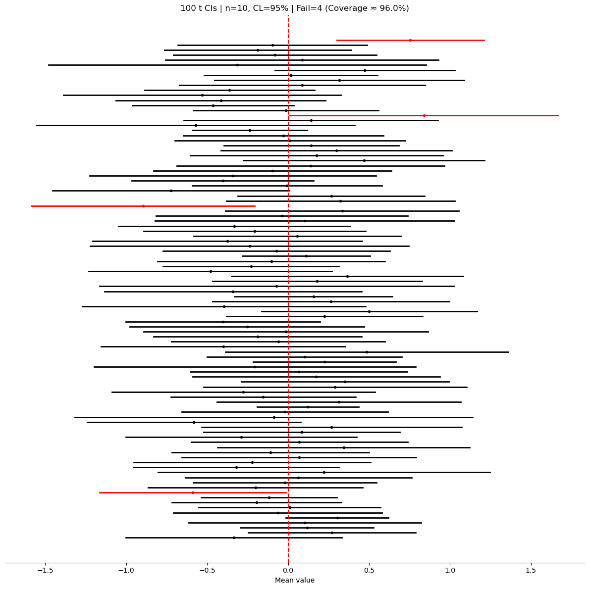
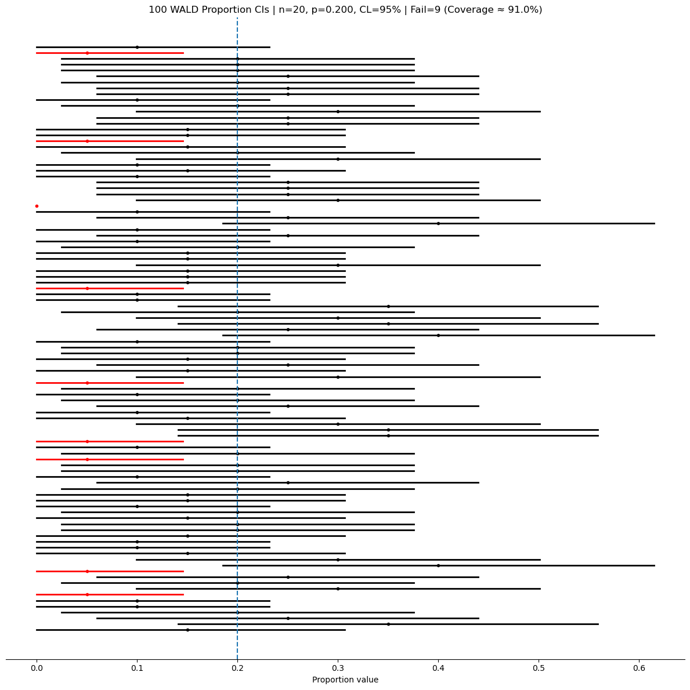

# 신뢰수준과 포함확률

## 신뢰구간이란 무엇인가?

신뢰구간은 추론통계의 근본적인 개념으로, 모수 추정에 따르는 불확실성을 정량화하는 방법을 제공한다. 표본자료를 다룰 때는 언제나 표본변동 — 표본과 모집단의 차이 — 이 존재한다. 표본은 모집단의 일부만을 나타내기 때문이다. 표본평균 같은 점추정값은 모수(예: 모평균)에 대한 하나의 최선의 추측을 준다. 그러나 이 추정값은 표본으로 모집단 전체를 추론하는 데 본래 따르는 불확실성을 반영하지 못한다.

신뢰구간은 모수에 대해 그럴듯한 값들의 범위를 신뢰수준(보통 90%, 95%, 99%)과 함께 제시하여 이 문제를 다룬다. 신뢰구간의 일반형은 다음과 같다.

$$
\text{점추정값} \pm \text{오차한계}
$$

오차한계는 자료의 변동성(예: 표준편차), 표본크기, 원하는 신뢰수준에 의해 정해진다. 표본이 클수록 모수를 더 정밀하게 추정하므로 오차한계는 작아지는 경향이 있다.

구간이 넓을수록 추정에 인정되는 불확실성이 크고, 반대로 구간이 좁을수록 정밀도가 높다.

---

## 형식적 정의

모수에 대한 신뢰구간은 표본자료로부터 계산된 구간으로, 신뢰수준이라 불리는 지정된 확률로 모수의 참값을 담을 가능성이 있는 구간이다. 수식으로 쓰면 모수 $\theta$에 대한 신뢰구간은:

$$
\hat{\theta} \pm \text{오차한계}
$$

여기서 $\hat{\theta}$는 모수의 점추정값(예: 표본평균 $\bar{X}$)이고, 오차한계는 표준오차와 원하는 신뢰수준의 함수이다.

신뢰수준(보통 90%, 95%, 99%)은 그 구간이 참 모수를 담고 있다는 확신의 정도를 나타낸다. 예를 들어 95% 신뢰구간이란, 확률표본을 여러 번 뽑아 각각에 대해 신뢰구간을 계산하면 그중 약 95%가 참 모수를 담게 된다는 뜻이다.

---

## 모집단과 모수

통계학에서 **모집단**과 **모수**라는 용어는 자료분석을 논할 때 핵심적이다. 우리가 관심을 두는 전체 집단과 그 특성을 요약하는 구체적인 측도를 구분하게 해 주기 때문이다.

**모집단**은 우리가 연구하려는 전체 자료 집합, 즉 가능한 모든 관측값을 가리킨다. 공통의 특성 하나 또는 여럿을 공유하는 개체, 항목, 자료점의 완전한 모임이다. 예를 들어 어떤 나라 성인 남성의 평균 키를 연구한다면 모집단은 그 나라의 모든 성인 남성이다. 모집단은 유한할 수도 있고(예: 특정 대학의 모든 학생) 무한할 수도 있다(예: 공정한 주사위를 굴려 나올 수 있는 모든 결과). 모집단은 대개 크거나 접근하기 어려우므로 모든 개체에서 자료를 모으는 것은 보통 비현실적이다.

**모수**는 모집단 전체의 어떤 특성을 요약하는 수치이다. 모평균($\mu$), 모비율($p$), 모분산($\sigma^2$), 모표준편차($\sigma$)처럼 특정한 특징을 기술하는, 고정되어 있지만 대개 미지인 값이다. 모수는 모집단의 참값을 나타내지만 모집단의 모든 구성원에게서 자료를 얻는 일이 불가능한 경우가 많아 대개 알 수 없다. 대신 우리는 **표본**(모집단의 부분집합)을 모으고 이 표본으로 통계량을 계산하여 모수를 추정한다.

$$
\begin{array}{ccc}
\textbf{모집단} & \longrightarrow & \textbf{모수} \\
\text{한 나라의 모든 성인 남성} & & \text{키의 모평균 } (\mu) \\
\text{모든 등록 유권자} & & \text{어떤 후보를 지지하는 유권자의 모비율 } (p) \\
\text{한 공장에서 생산된 모든 제품} & & \text{모집단 불량률 } (\theta) \\
\end{array}
$$

현실의 대부분 상황에서 우리는 모수를 직접 측정할 수 없으므로, 이 미지의 모수를 추정하기 위해 **표본통계량**에 의존한다.

---

## 표본, 통계량, 추정량, 추정값

**표본**은 더 큰 모집단에서 뽑은 개체 또는 관측값의 부분집합이다. 모집단 전체에서 자료를 모으는 일은 비현실적이거나 시간이 오래 걸리거나 비용이 많이 들 수 있다. **확률표본**은 표본이 모집단을 정확히 반영하도록 도와 편향을 최소화하므로 특히 가치가 있다. **표본이 클수록** 표본추출오차가 줄어들어 모집단에 대해 더 믿을 만한 정보를 준다.

**통계량**은 표본자료의 어떤 측면을 요약하거나 기술하는 임의의 수치이다. 표본평균 $\bar{x}$, 표본비율 $\hat{p}$, 표본분산 $s^2$이 통계량에 속한다. 우리는 이런 통계량으로 미지의 모수를 추론하거나 추정한다.

**추정량**은 표본자료로 모수를 추정하는 데 쓰는 공식 또는 방법이다. 예를 들어 모평균 $\mu$의 추정량은 표본평균이다:

$$
\bar{x} = \frac{1}{n}\sum_{i=1}^n x_i
$$

모비율 $p$의 추정량은 표본비율이다:

$$
\hat{p} = \frac{x}{n}
$$

**추정값**은 추정량을 써서 표본자료로부터 계산한 구체적인 수치이다. 예를 들어 어떤 표본에서 $\bar{x} = 10$을 얻었다면 10이 $\mu$의 추정값이다.

$$
\begin{array}{cccc}
\textbf{모집단} & \longrightarrow & \textbf{모수} & (\mu, p, \sigma^2, \text{등}) \\
\downarrow & & \uparrow & \\
\textbf{표본} & \longrightarrow & \textbf{추정값} & (\bar{x}, \hat{p}, s^2, \text{등}) \\
\end{array}
$$

---

## 신뢰구간의 구조

**신뢰구간**은 참 모수를 담고 있을 가능성이 있는 값들의 범위를 준다. 일반형은

$$
\text{추정값} \pm \text{오차한계}
$$

**추정값**은 표본통계량(예: 표본평균이나 표본비율)이고, **오차한계**는 그 추정값의 불확실성을 담는다. 오차한계는 두 성분으로 이루어진다: **표준오차**(표본의 변동성을 반영한다)와 확률분포에서 나오는 **임계값**(보통 표준정규분포 또는 $t$-분포에서 나온다).

- 표본이 클 때(보통 표본크기 $n \geq 30$일 때)는 **표준정규분포**($z$-점수)로 임계값을 구한다.
- 표본이 작을 때(보통 $n < 30$)는 작은 표본에서 오는 추가 불확실성을 보정하는 **$t$-분포**를 쓴다. $t$-분포를 쓸 때는 원래 모집단이 정규분포를 따르는지 확인해야 한다.

$$
\begin{array}{cccc}
\textbf{모집단} & \longrightarrow & \textbf{모수} \\
\downarrow & & \uparrow \\
\textbf{표본} & \longrightarrow & \textbf{추정값} \\
& & \textbf{추정값} & \pm & \textbf{오차한계} \\
\end{array}
$$

---

## 신뢰수준의 올바른 해석

신뢰수준은 같은 조건에서 모집단으로부터 반복해서 표본을 뽑는다고 할 때 그 구간이 참 모수를 담을 확률을 나타낸다. 예를 들어 95% 신뢰구간은 그런 표본 100개 중 95개에서 구간이 참 모수를 담게 된다는 것을 뜻한다.

!!! warning "흔한 오해"
    신뢰구간은 주어진 하나의 표본에서 모수가 그 구간 안에 있을 확률을 주지 **않는다**. 구체적인 신뢰구간 하나가 주어지면 가능성은 둘뿐이다: 참 모수를 담고 있거나 담고 있지 않거나. 신뢰수준은 구간을 만드는 **절차**가 갖는 성질이다. 그 절차가 모집단에서 뽑은 서로 다른 확률표본들로 많은 신뢰구간을 만들면 어떤 구간은 참 모수를 담고 어떤 구간은 담지 않는다. 그러나 만들어진 전체 구간 중 참 모수를 담은 구간의 비율은 장기적으로 신뢰수준에 수렴한다. 신뢰수준은 특정한 구간 하나가 아니라 구성 절차의 신뢰도를 기술한다.

---

## 통계적 추론에서 신뢰구간의 중요성

실무에서 신뢰구간은 통계분석에서 몇 가지 중요한 기능을 한다.

**모수의 추정.** 우리는 모평균($\mu$), 모비율($p$), 모분산($\sigma^2$) 같은 미지의 모수를 추정하고자 할 때 흔히 신뢰구간을 쓴다. 모집단 전체에서 자료를 모으는 일이 비현실적이거나 불가능한 경우가 많으므로, 이 모수의 추정값을 얻기 위해 표본자료에 의존한다. 예를 들어 한 도시의 평균 소득을 추정하는 조사에서 개인들의 확률표본을 뽑아 표본평균을 계산하고 그 주위에 신뢰구간을 구성하여 참 평균을 추정할 수 있다.

**불확실성의 정량화.** 자료에는 본래 변동성이 있으므로 어떤 표본도 참 모수의 근삿값만을 준다. 신뢰구간은 추정에 따르는 불확실성을 정량화하는 방법을 준다. 표본이 달라지면 추정값도 조금씩 달라진다는 사실을 반영하며, 지정된 신뢰수준(예: 90%, 95%, 99%)으로 참 모수가 들어 있으리라 기대되는 범위를 제공한다.

**뒷받침되는 값들의 범위 제시.** 그 자체로는 오해를 부를 수 있는 단일 점추정값 대신, 신뢰구간은 자료와 부합하는 값들의 범위를 제시한다. 예를 들어 학생 평균 키의 점추정값이 170 cm라고 해도 이 값 하나로는 추정이 얼마나 정밀한지 알 수 없다. 신뢰구간은 "참 평균 키가 168 cm와 172 cm 사이에 있다고 95% 신뢰한다"고 말해 준다. 이 범위가 더 정보에 근거한 의사결정을 가능하게 한다.

---

## 신뢰구간과 가설검정의 관계

신뢰구간과 가설검정은 밀접하게 연관되어 있다. 귀무가설 $H_0: \mu = \mu_0$을 대립가설 $H_1: \mu \neq \mu_0$에 대해 검정하는 경우를 생각해 보자.

이를 판단하는 한 가지 방법은 $\mu$에 대한 신뢰구간을 구성하고 가설의 값 $\mu_0$이 그 구간 안에 있는지 보는 것이다:

- $\mu_0$의 값이 $\mu$의 신뢰구간 **밖에 있으면** 해당 유의수준에서 귀무가설을 **기각**한다. 신뢰구간 밖의 값은 관측된 자료에 비추어 볼 때 그럴듯하지 않다고 보기 때문이다.
- $\mu_0$이 신뢰구간 **안에 있으면** 귀무가설을 **기각하지 못한다**. $\mu$가 $\mu_0$과 다르다고 결론지을 만한 충분한 증거가 자료에 없기 때문이다.

가설검정의 **유의수준**($\alpha$)은 신뢰구간의 **신뢰수준**과 다음 관계에 있다:

$$
\textbf{유의수준} = 1 - \textbf{신뢰수준}
$$

---

## 신뢰구간 모의실험

다음 모의실험 스크립트는 신뢰구간의 포함 성질을 시각화하는 데 도움을 준다. 각 스크립트는 알려진 모집단에서 확률표본을 반복해서 뽑아 신뢰구간을 만들고, 그중 몇 퍼센트가 참 모수를 잡아내는지 추적한다.

### 모의실험 모수 정리

$$
\begin{array}{llll}
\text{모수} & \text{추정값} & \text{표본분포} & \text{신뢰구간 공식} \\
\hline
\mu & \bar{x} & \displaystyle\frac{\bar{x}-\mu}{\sigma/\sqrt{n}}\approx z & \displaystyle\bar{x}\pm z_{\alpha/2}\frac{\sigma}{\sqrt{n}} \\[8pt]
& & \displaystyle\frac{\bar{x}-\mu}{s/\sqrt{n}}\approx t_{n-1} & \displaystyle\bar{x}\pm t_{\alpha/2,n-1}\frac{s}{\sqrt{n}} \\[8pt]
p & \hat{p} & \displaystyle\frac{\hat{p}-p}{\sqrt{\hat{p}(1-\hat{p})/n}}\approx z & \displaystyle\hat{p}\pm z_{\alpha/2}\sqrt{\frac{\hat{p}(1-\hat{p})}{n}} \\[8pt]
\sigma^2 & s^2 & \displaystyle\frac{(n-1)s^2}{\sigma^2}\sim \chi^2_{n-1} & \displaystyle\left[\frac{(n-1)s^2}{\chi^2_{\alpha/2,n-1}},\frac{(n-1)s^2}{\chi^2_{1-\alpha/2,n-1}}\right] \\[8pt]
\frac{\sigma_1^2}{\sigma_2^2} & \frac{s_1^2}{s_2^2} & \displaystyle\frac{s_1^2/\sigma_1^2}{s_2^2/\sigma_2^2}\sim F_{n_1-1,n_2-1} & \displaystyle\left[\frac{s_1^2/s_2^2}{F_{\alpha/2}},\frac{s_1^2/s_2^2}{F_{1-\alpha/2}}\right] \\[8pt]
\mu_d & \bar{x}_d & \displaystyle\frac{\bar{x}_d-\mu_d}{s_d/\sqrt{n}}\approx t_{n-1} & \displaystyle\bar{x}_d\pm t_{\alpha/2,n-1}\frac{s_d}{\sqrt{n}} \\[8pt]
\mu_1-\mu_2 & \bar{x}_1-\bar{x}_2 & \text{Welch 또는 합동 } t & \displaystyle(\bar{x}_1-\bar{x}_2)\pm t_{\alpha/2,\text{df}}\cdot\text{SE} \\[8pt]
p_1-p_2 & \hat{p}_1-\hat{p}_2 & z & \displaystyle(\hat{p}_1-\hat{p}_2)\pm z_{\alpha/2}\cdot\text{SE}
\end{array}
$$

### 유한모집단 수정 (FPC)

크기 $N$인 유한모집단에서 *비복원으로* 자료를 뽑았다면 표준오차에 **유한모집단 수정(FPC)**을 적용할 수 있다:

$$
\text{SE}_\text{FPC} = \frac{s}{\sqrt{n}} \sqrt{\frac{N-n}{N-1}}, \qquad n > 0.1N \text{이어서 무시할 수 없을 때.}
$$

### 평균 신뢰구간 모의실험

<div class="codebox" markdown>

#### 예제 1. 평균 신뢰구간의 포함확률 모의실험 { .eg }

```python
#!/usr/bin/env python3
"""평균 신뢰구간을 세 방법으로 만들어 포함확률을 비교한다.

sigma 를 아는 z, sigma 자리에 s 를 꽂아 넣은 z, 그리고 t 세 가지다.
가운데 방법이 왜 명목수준에 못 미치는지가 이 모의실험의 요점이다.

Usage:
    python mean_ci_simulation.py --method t --n-sim 100 --n 10 --alpha 0.05
    python mean_ci_simulation.py --method z_known --sigma 1.0
    python mean_ci_simulation.py --method z_plugin --N 500  # with FPC
"""

import argparse
import numpy as np
import matplotlib.pyplot as plt
from scipy.stats import norm, t


def finite_population_correction(n: int, N: int | None) -> float:
    """유한모집단 수정 인자 sqrt((N-n)/(N-1)). N 을 주지 않으면 1.0 을 돌려준다.

        표본이 모집단의 상당 부분을 차지하면 표준오차가 공식보다 작아진다.
        그 몫을 되돌리는 인자다.
        """
    if N is None:
        return 1.0
    if N <= 1 or n >= N:
        raise ValueError("FPC requires N > 1 and n < N.")
    return float(np.sqrt((N - n) / (N - 1)))


def simulate_data(n_sim: int, n: int, mu: float, sigma: float, rng) -> np.ndarray:
    """모양 (n_sim, n) 인 배열을 돌려준다. 행 하나가 표본 하나다."""
    return rng.normal(loc=mu, scale=sigma, size=(n_sim, n))


def compute_intervals(xbar, s, n, alpha, method, sigma_known=None, N=None):
    fpc = finite_population_correction(n, N)
    if method == "z_known":
        if sigma_known is None:
            raise ValueError("z_known requires sigma_known.")
        z_star = norm.ppf(1 - alpha / 2.0)
        se = sigma_known / np.sqrt(n) * fpc
        moe = z_star * se
    elif method == "z_plugin":
        z_star = norm.ppf(1 - alpha / 2.0)
        se = (s / np.sqrt(n)) * fpc
        moe = z_star * se
    elif method == "t":
        df = n - 1
        t_star = t.ppf(1 - alpha / 2.0, df=df)
        se = (s / np.sqrt(n)) * fpc
        moe = t_star * se
    else:
        raise ValueError(f"Unknown method: {method}")
    return xbar - moe, xbar + moe


def plot_intervals(ax, lower, upper, xbar, covered, mu, title):
    for i in range(len(xbar)):
        color = "k" if covered[i] else "r"
        ax.plot([lower[i], upper[i]], [i, i], lw=2, color=color)
        ax.plot(xbar[i], i, marker="o", ms=3, color=color)
    ax.axvline(mu, linestyle="--", linewidth=1.5, color="r")
    ax.set_title(title, fontsize=12)
    ax.set_yticks([])
    for sp in ["left", "right", "top"]:
        ax.spines[sp].set_visible(False)
    ax.set_xlabel("Mean value")


def main():
    p = argparse.ArgumentParser()
    p.add_argument("--method", choices=["z_known", "z_plugin", "t"], default="t")
    p.add_argument("--rng-seed", type=int, default=42)   # 아래 그림을 재현하려면 고정한다
    p.add_argument("--n-sim", type=int, default=100)
    p.add_argument("--n", type=int, default=10)
    p.add_argument("--mu", type=float, default=0.0)
    p.add_argument("--sigma", type=float, default=1.0)
    p.add_argument("--alpha", type=float, default=0.05)
    p.add_argument("--N", type=int, default=None)
    args, _ = p.parse_known_args()

    rng = np.random.default_rng(args.rng_seed)
    X = simulate_data(args.n_sim, args.n, args.mu, args.sigma, rng)
    xbar = X.mean(axis=1)
    s = X.std(axis=1, ddof=1)

    lower, upper = compute_intervals(
        xbar, s, args.n, args.alpha, args.method,
        sigma_known=args.sigma if args.method == "z_known" else None, N=args.N
    )
    covered = (lower <= args.mu) & (args.mu <= upper)
    n_fail = int((~covered).sum())
    coverage_pct = 100.0 * covered.mean()

    fig, ax = plt.subplots(figsize=(12, 12))
    title = (f"{args.n_sim} {args.method} CIs | n={args.n}, "
             f"CL={int((1 - args.alpha) * 100)}% | "
             f"Fail={n_fail} (Coverage ≈ {coverage_pct:.1f}%)")
    plot_intervals(ax, lower, upper, xbar, covered, args.mu, title)
    plt.tight_layout()
    plt.show()


if __name__ == "__main__":
    main()
```



가로선 하나가 표본 하나에서 얻은 신뢰구간이고, 세로 점선이 참 평균이다. 참값을 놓친 구간만 빨간색이다. 기본 설정($t$-구간, $n = 10$, 100회)에서 실패는 4개, 즉 포함확률 96%로 명목 95%에 가깝다.

구간의 **너비가 저마다 다르다**는 점이 눈에 띈다. $\sigma$를 모를 때는 너비가 $s$에 비례하는데 $s$ 자체가 표본마다 흔들리기 때문이다. 앞의 `--method z_known`으로 바꾸면 너비가 모두 같아진다.

</div>

### 비율 신뢰구간 모의실험

<div class="codebox" markdown>

#### 예제 2. 비율 신뢰구간의 포함확률 모의실험 { .eg }

```python
#!/usr/bin/env python3
"""비율 신뢰구간을 네 방법으로 만들어 포함확률을 비교한다.

Wald 는 교과서에 가장 먼저 나오지만 실제 포함확률이 가장 나쁘다.
Wilson 과 Agresti-Coull 이 그 대안이고, Clopper-Pearson 은 보수적이다.

Usage:
    python proportion_ci_simulation.py  # defaults to Wald
"""

import numpy as np
import matplotlib.pyplot as plt
from scipy.stats import norm, beta

rng_seed = 42        # 아래 그림을 재현하려면 고정한다
n_simulations = 100
n = 20
p_true = 0.20
alpha = 0.05
method = "wald"  # 'wald' | 'wilson' | 'ac' | 'cp'


def main():
    if rng_seed is not None:
        np.random.seed(rng_seed)

    k = np.random.binomial(n=n, p=p_true, size=n_simulations)
    phat = k / n
    lower = np.empty(n_simulations)
    upper = np.empty(n_simulations)
    z = norm.ppf(1 - alpha / 2.0)

    for i, ki in enumerate(k):
        p = ki / n
        if method == "wald":
            se = np.sqrt(p * (1 - p) / n)
            lo, hi = p - z * se, p + z * se
        elif method == "wilson":
            denom = 1 + z**2 / n
            center = (p + z**2 / (2 * n)) / denom
            half = z * np.sqrt(p * (1 - p) / n + z**2 / (4 * n**2)) / denom
            lo, hi = center - half, center + half
        elif method == "ac":
            n_tilde = n + z**2
            p_tilde = (ki + 0.5 * z**2) / n_tilde
            se_tilde = np.sqrt(p_tilde * (1 - p_tilde) / n_tilde)
            lo, hi = p_tilde - z * se_tilde, p_tilde + z * se_tilde
        elif method == "cp":
            lo = 0.0 if ki == 0 else beta.ppf(alpha / 2.0, ki, n - ki + 1)
            hi = 1.0 if ki == n else beta.ppf(1 - alpha / 2.0, ki + 1, n - ki)
        lower[i] = max(0.0, lo)
        upper[i] = min(1.0, hi)

    covered = (lower <= p_true) & (p_true <= upper)
    n_fail = int((~covered).sum())
    coverage_pct = 100.0 * covered.mean()

    fig, ax = plt.subplots(figsize=(12, 12))
    for i in range(n_simulations):
        color = "k" if covered[i] else "r"
        ax.plot([lower[i], upper[i]], [i, i], lw=2, color=color)
        ax.plot(phat[i], i, marker="o", ms=3, color=color)
    ax.axvline(p_true, linestyle="--", linewidth=1.5)
    ax.set_title(
        f"{n_simulations} {method.upper()} Proportion CIs | n={n}, p={p_true:.3f}, "
        f"CL={int((1 - alpha) * 100)}% | Fail={n_fail} (Coverage ≈ {coverage_pct:.1f}%)")
    ax.set_yticks([])
    for sp in ["left", "right", "top"]:
        ax.spines[sp].set_visible(False)
    ax.set_xlabel("Proportion value")
    plt.tight_layout()
    plt.show()


if __name__ == "__main__":
    main()
```



$n = 20$, $p = 0.2$인 Wald 구간의 포함확률은 91%다. 명목값 95%에 못 미친다. 그림에서 두 가지가 보인다.

- 왼쪽 끝에 **길이가 0인 구간**이 하나 있다. 20번 중 성공이 0번 나온 표본이다. $\hat p = 0$이면 표준오차 $\sqrt{\hat p(1-\hat p)/n}$도 0이 되어 구간이 점 하나로 무너진다. Wald 구간의 가장 나쁜 실패 방식이다.
- 구간이 취할 수 있는 위치가 몇 가지뿐이다. $k$가 정수이므로 $\hat p$는 $0, 0.05, 0.10, \ldots$ 스무 한 가지 값만 갖는다. 이 이산성 때문에 비율의 포함확률은 $n$을 키워도 매끄럽게 95%로 가지 않고 톱니처럼 오르내린다.

`method`만 바꾸고 같은 자료(같은 시드)로 다시 세면 실패 개수가 Wald 9개, Wilson 4개, Agresti–Coull 4개, Clopper–Pearson 1개가 된다. Clopper–Pearson이 가장 적게 실패하는 것은 더 좋아서가 아니라 **보수적**이어서다. 이산성 때문에 절대 95% 아래로 내려가지 않도록 구간을 넉넉히 잡으며, 그 대가로 구간이 넓다.

</div>

## 연습문제

<div class="drillbox" markdown>

**연습문제 1.** <span class="diff easy" title="쉬움"></span>
독립인 표본 100개로 평균에 대한 95% 신뢰구간을 만든다. 이 구간들 중 참 평균을 담지 못하는 것은 대략 몇 개로 기대되는가?

</div>

??? success "풀이"
    정의에 따라 95% 신뢰구간이 참 모수값을 담지 못할 확률은 5%이다. 독립인 표본 100개에서 참 평균을 담지 못하는 구간 수의 기댓값은:

    $$
    100 \times 0.05 = 5
    $$

    실제 개수는 실험마다 (Binomial(100, 0.05) 분포를 따라) 달라지지만 약 5개의 실패를 기대한다.

<div class="drillbox" markdown>

**연습문제 2.** <span class="diff med" title="중간"></span>
95% 신뢰구간이 참 모수가 그 구간 안에 있을 확률이 95%라는 뜻이 아닌 이유를 설명하라. 올바른 해석은 무엇인가?

</div>

??? success "풀이"
    모수 $\mu$는 확률변수가 아니라 고정된 (미지의) 상수이다. 자료로부터 구간을 계산하고 나면 $\mu$는 그 안에 있거나 없거나 둘 중 하나이다 — 그 특정한 구간에 대해서는 확률이 개입하지 않는다.

    올바른 해석은 **빈도주의적**이다: 표본추출 절차를 여러 번 반복하여 매번 95% 신뢰구간을 만들면 그 구간들 중 약 95%가 참 $\mu$를 담는다. "95%"는 $\mu$를 담는 구간의 장기적 비율을 가리키는 것이지, 특정한 구간 하나가 $\mu$를 담을 확률이 아니다.

<div class="drillbox" markdown>

**연습문제 3.** <span class="diff med" title="중간"></span>
어떤 연구자가 $n = 10$일 때 $\sigma$ 자리에 표본표준편차 $s$를 대입한 z-구간("z-plugin" 방법)을 쓴다. 실제 포함확률은 명목 95%보다 높겠는가, 낮겠는가? 이유를 설명하라.

</div>

??? success "풀이"
    실제 포함확률은 95%보다 **낮다**. z-구간은 $\sigma$를 안다고 가정하고 임계값으로 $z_{0.025} = 1.96$을 쓴다. $\sigma$를 모르고 $s$로 추정하면 $\sigma$ 추정에서 오는 추가 변동성이 생기는데, z-구간은 이를 반영하지 않는다.

    $n$이 작으면 $s$가 $\sigma$를 상당히 과소추정할 수 있어 구간이 너무 좁아진다. $t$-구간은 더 큰 $t_{n-1}$ 임계값(예: $t_{9, 0.025} = 2.262 > 1.96$)을 써서 $\sigma$ 추정의 불확실성을 반영해 이를 바로잡는다. $n \to \infty$이면 $s \to \sigma$이고 z-구간과 t-구간은 수렴한다.

<div class="drillbox" markdown>

**연습문제 4.** <span class="diff easy" title="쉬움"></span>
크기 $N = 500$인 유한모집단에서 $n = 100$인 표본을 비복원으로 뽑을 때 유한모집단 수정 인자를 계산하라. 복원추출과 비교하여 신뢰구간의 너비에 어떤 영향을 주는가?

</div>

??? success "풀이"
    유한모집단 수정 인자는:

    $$
    \text{FPC} = \sqrt{\frac{N - n}{N - 1}} = \sqrt{\frac{500 - 100}{500 - 1}} = \sqrt{\frac{400}{499}} = \sqrt{0.8016} \approx 0.895
    $$

    표준오차에 0.895가 곱해지므로 무한모집단(복원추출) 경우에 비해 신뢰구간 너비가 약 10.5% 줄어든다. 500명 중 100명(모집단의 20%)을 뽑는 것이 무한모집단에서 100명을 뽑는 것보다 더 많은 정보를 주므로 이는 자연스럽다 — 이미 모집단의 상당 부분을 관측했기 때문이다.

<div class="drillbox" markdown>

**연습문제 5.** <span class="diff med" title="중간"></span>
이항비율 신뢰구간 네 가지 — 왈드, 윌슨, 애그레스티-콜, 클로퍼-피어슨 — 의 **포함확률**을 $n=40$, $p=0.1$에서 정확히 계산하여 비교하라.

</div>

??? success "풀이"
    **정확한 포함확률.** 이항은 이산이므로 모든 $k=0,\dots,n$에 대해 구간을 만들고

    $$
    C(p)=\sum_{k=0}^{n}\mathbf{1}\{p\in I(k)\}\binom nk p^k(1-p)^{n-k}
    $$

    를 직접 더하면 된다. 몬테카를로가 필요 없다.

    ```python
    import numpy as np
    from scipy import stats

    def coverage(n, p, method, alpha=0.05):
        z = stats.norm.ppf(1 - alpha / 2)
        k = np.arange(n + 1)
        ph = k / n
        if method == "wald":
            se = np.sqrt(ph * (1 - ph) / n)
            lo, hi = ph - z * se, ph + z * se
        elif method == "wilson":
            d = 1 + z**2 / n
            c = (ph + z**2 / (2 * n)) / d
            h = z / d * np.sqrt(ph * (1 - ph) / n + z**2 / (4 * n**2))
            lo, hi = c - h, c + h
        elif method == "ac":                      # 애그레스티-콜: 성공·실패에 2씩 더함
            nt = n + z**2
            pt = (k + z**2 / 2) / nt
            se = np.sqrt(pt * (1 - pt) / nt)
            lo, hi = pt - z * se, pt + z * se
        elif method == "cp":                      # 클로퍼-피어슨
            lo = np.where(k == 0, 0.0, stats.beta.ppf(alpha / 2, k, n - k + 1))
            hi = np.where(k == n, 1.0, stats.beta.ppf(1 - alpha / 2, k + 1, n - k))
        inside = (lo <= p) & (p <= hi)
        return stats.binom.pmf(k, n, p)[inside].sum()

    for m in ["wald", "wilson", "ac", "cp"]:
        print(f"{m:7s} {coverage(40, 0.1, m):.4f}")
    ```

    ```text
    wald    0.9145
    wilson  0.9433
    ac      0.9581
    cp      0.9697
    ```

    **읽기.**

    | 방법 | 포함확률 | 평가 |
    |---|---|---|
    | 왈드 | **0.9145** | 명목에 3.5%포인트 못 미친다 |
    | 윌슨 | 0.9433 | 명목에 가장 가깝다 |
    | 애그레스티-콜 | 0.9581 | 약간 보수적 |
    | 클로퍼-피어슨 | 0.9697 | 가장 보수적(모든 $p$에서 $\ge$ 0.95 보장) |

    **왈드가 왜 모자라는가.** $p=0.1$, $n=40$이면 성공의 기댓값이 4개다. $k\le1$이면 구간의 상한이 $p=0.1$에 못 미쳐 참값을 놓친다($k=0$이면 폭이 0인 점구간 $\{0\}$, $k=1$이면 상한이 0.073이다). 이 경우들의 확률만 해도

    $$
    P(K\le1)=0.9^{40}+40(0.1)(0.9)^{39}=0.0148+0.0657=0.0805
    $$

    로 8%다. 여기에 $\hat p\ge0.25$인 위쪽 누락이 더해져 총 8.6%가 된다. **누락이 한쪽으로 심하게 쏠려 있다**는 점이 특히 나쁘다.

    **결론.** 앞서 본 대로 **왈드 구간은 쓰지 않는다.** 윌슨이 포함확률과 폭의 균형에서 가장 낫고, 보수적인 보장이 꼭 필요하면 클로퍼-피어슨을 쓴다.

<div class="drillbox" markdown>

**연습문제 6.** <span class="diff hard" title="어려움"></span>
이산분포에서 포함확률이 $p$에 대해 **톱니 모양**으로 진동하는 이유를 설명하고, 그 함의를 논하라.

</div>

??? success "풀이"
    **현상.** $n$을 고정하고 $p$를 0에서 1까지 움직이며 포함확률을 그리면, 매끄러운 곡선이 아니라 **급격히 오르내리는 톱니**가 나타난다.

    ```python
    import numpy as np
    from scipy import stats

    n, z = 40, stats.norm.ppf(0.975)
    k = np.arange(n + 1)
    ph = k / n
    d = 1 + z**2 / n
    c = (ph + z**2 / (2 * n)) / d
    h = z / d * np.sqrt(ph * (1 - ph) / n + z**2 / (4 * n**2))
    lo, hi = c - h, c + h

    grid = np.linspace(0.05, 0.30, 6)
    for p in grid:
        inside = (lo <= p) & (p <= hi)
        print(f"p={p:.2f}  포함확률 {stats.binom.pmf(k, n, p)[inside].sum():.4f}")
    ```

    ```text
    p=0.05  포함확률 0.9520
    p=0.10  포함확률 0.9433
    p=0.15  포함확률 0.9580
    p=0.20  포함확률 0.9283
    p=0.25  포함확률 0.9577
    p=0.30  포함확률 0.9443
    ```

    **이유.** 포함확률은

    $$
    C(p)=\sum_{k\,:\,p\in I(k)} \binom nk p^k(1-p)^{n-k}
    $$

    로, $p$가 연속으로 변해도 **합에 들어가는 $k$의 집합은 이산적으로 바뀐다.** $p$가 어떤 $I(k)$의 경계를 넘는 순간 항 하나가 통째로 빠지거나 들어온다. 그 항의 크기가 $\binom nk p^k(1-p)^{n-k}$이므로, 확률질량이 큰 $k$가 빠질 때 포함확률이 뚝 떨어진다.

    **함의.**

    1. **"평균 포함확률"이 오해를 부른다.** $p$에 대해 평균 내면 0.95에 가깝게 나오지만, 특정 $p$에서는 0.93일 수 있다. **최악의 경우**를 봐야 한다.

    2. **$n$을 늘려도 톱니가 사라지지 않는다.** 진폭은 $O(n^{-1/2})$로 줄지만 진동 자체는 남는다. 이것은 근사의 문제가 아니라 **이산성의 본질**이다.

    3. **정확한 방법만이 보장을 준다.** 클로퍼-피어슨은 모든 $p$에서 $\ge0.95$를 보장하지만, 그 대가로 대부분의 $p$에서 0.97 이상이라 구간이 필요 이상으로 넓다. **이산분포에서 "정확히 95%"는 불가능하다.**

    4. **무작위화 구간.** 이론적으로는 경계에서 동전을 던져 포함 여부를 정하면 정확히 95%를 얻을 수 있다. 실무에서는 같은 자료가 다른 결론을 주므로 쓰지 않는다.

    **권고.** 방법을 비교할 때는 포함확률을 **$p$의 함수로 그려서** 최솟값과 평균을 함께 본다. 하나의 $p$에서 좋다고 좋은 방법이 아니다.

<div class="drillbox" markdown>

**연습문제 7.** <span class="diff med" title="중간"></span>
포함확률 외에 신뢰구간을 평가하는 **다른 기준**들을 적고, 기준들이 충돌하는 예를 들어라.

</div>

??? success "풀이"
    **기준들.**

    1. **포함확률.** $P(\theta\in C)\ge1-\alpha$. 기본이지만 이것만으로는 부족하다. $(-\infty,\infty)$가 항상 100%를 만족한다.

    2. **기대 폭.** $E[\text{길이}]$. 짧을수록 정보가 많다. 포함확률을 맞춘 뒤 폭으로 비교하는 것이 표준이다.

    3. **거짓 포함확률.** $P(\theta'\in C)$ for $\theta'\ne\theta$. 틀린 값을 담지 않아야 한다. 검정의 검정력에 대응한다.

    4. **동등꼬리성.** 양쪽 비포함확률이 각각 $\alpha/2$인가. 한쪽으로 쏠리면 방향성 있는 결론이 왜곡된다.

    5. **불편성.** $P(\theta\in C(\theta))\ge P(\theta'\in C(\theta))$. 참값을 다른 값보다 더 자주 담아야 한다.

    6. **변환 불변성.** $\theta$의 구간에 $g$를 적용한 것이 $g(\theta)$의 구간과 같은가. 우도비 구간은 만족하고 왈드는 아니다.

    7. **계산 가능성과 설명 가능성.** 실무에서 무시할 수 없다.

    **충돌의 예 — 클로퍼-피어슨 대 윌슨.**

    | | 클로퍼-피어슨 | 윌슨 |
    |---|---|---|
    | 최소 포함확률 | $\ge0.95$ 보장 | 0.93까지 떨어질 수 있음 |
    | 평균 포함확률 | 0.97 | 0.95 |
    | 기대 폭 | 넓다 | 좁다 |

    **보장이냐 효율이냐의 충돌**이다. 규제 당국에 제출하는 자료라면 보장이 중요하고, 탐색적 분석이라면 효율이 중요하다.

    **다른 충돌 — 동등꼬리 대 최단.** 카이제곱 분산 구간에서 동등꼬리 구간과 최단 구간이 다르다. 최단 구간은 폭이 짧지만 양쪽 꼬리 확률이 다르므로, 단측 결론을 내릴 때 부적절하다.

    **또 다른 충돌 — 불편성 대 포함확률.** 어떤 이산 모형에서는 정확한 포함확률을 유지하면서 불편성을 만족하는 구간이 존재하지 않는다.

    **교훈.** "최고의 신뢰구간"은 없다. **목적에 따라 어떤 기준을 우선할지 정해야 한다.**

<div class="drillbox" markdown>

**연습문제 8.** <span class="diff med" title="중간"></span>
**조건부 포함확률**의 문제를 설명하라. 주변적으로 95%를 만족해도 특정 자료에서는 왜 부적절할 수 있는가?

</div>

??? success "풀이"
    **주변 포함확률과 조건부 포함확률.** 표준적인 보장은

    $$
    P_\theta\{\theta\in C(\mathbf X)\}=0.95
    $$

    로, **모든 가능한 표본에 대한 평균**이다. 하지만 우리는 하나의 실현된 표본을 가지고 있다. **이 표본에서** 구간이 믿을 만한가?

    **고전적 반례 — 균등분포의 두 관측값.** $X_1,X_2\sim\text{Unif}(\theta-1/2,\theta+1/2)$일 때, 구간

    $$
    C=\left(\min(X_1,X_2),\ \max(X_1,X_2)\right)
    $$

    를 생각하자. 이것의 포함확률은 정확히 **50%** 다(참값이 두 점 사이에 있을 확률).

    그런데 **$R=|X_1-X_2|$를 관측하고 나면** 이야기가 다르다.

    - $R=0.9$이면 $\theta$는 반드시 두 점 사이에 있다. **조건부 포함확률 = 1.**
    - $R=0.01$이면 두 점이 거의 겹쳐 있고, $\theta$가 그 사이일 확률은 **1%쯤**이다.

    **"50% 구간"이라고 보고하는 것이 두 경우 모두에서 오해를 부른다.** $R$은 **보조통계량**(분포가 $\theta$에 의존하지 않음)이므로, 조건부 추론이 옳다.

    **실무적 예.**

    - **약한 도구변수.** 1단계 $F$ 통계량이 작으면 2SLS 구간의 조건부 포함확률이 크게 나쁘다. 주변적으로는 괜찮아 보여도.
    - **선택 후 추론.** 변수선택을 거친 뒤의 구간은 "선택되었다"는 조건 아래에서 포함확률이 무너진다. 앞서 본 승자의 저주와 같은 구조다.
    - **경계 근처.** 분산성분이 0 근처면 추정값이 경계에 붙었는지 여부가 구간의 신뢰도를 크게 바꾼다.

    **대처.**

    - **보조통계량이 있으면 그것에 조건화**한다(피셔의 조건부성 원리).
    - 조건부 보장을 주는 방법을 쓴다: 앤더슨-루빈(약한 도구), 선택 후 추론의 조건부 방법(POSI, selective inference).
    - 최소한 **진단 통계량을 함께 보고**한다. 1단계 $F$, 선택 경로, 경계 도달 여부.

    **철학적 함의.** 빈도주의 보장은 "장기적으로 평균" 보장이다. 베이즈 신용구간은 조건부 진술이지만 사전분포가 필요하다. **둘 다 무료가 아니다.**

<div class="drillbox" markdown>

**연습문제 9.** <span class="diff med" title="중간"></span>
포함확률을 모의실험으로 추정할 때 필요한 **반복 횟수**를 정하고, 결과를 어떻게 보고해야 하는지 설명하라.

</div>

??? success "풀이"
    **모의실험 오차.** $M$번 반복하여 추정한 포함확률 $\hat C$는 이항비율이므로

    $$
    \operatorname{SE}(\hat C)=\sqrt{\frac{C(1-C)}{M}}\approx\sqrt{\frac{0.95\times0.05}{M}}=\frac{0.218}{\sqrt M}
    $$

    | $M$ | SE | 95% 오차한계 |
    |---|---|---|
    | 1,000 | 0.0069 | $\pm$0.014 |
    | 10,000 | 0.00218 | $\pm$0.0043 |
    | 100,000 | 0.00069 | $\pm$0.0014 |

    **필요한 $M$ 정하기.** 목표 정밀도 $d$에 대해

    $$
    M \ge \frac{0.95\times0.05}{(d/1.96)^2}
    $$

    - **0.95와 0.94를 구별**하려면($d=0.01$) $M\approx1{,}825$. 실무에서 $M=2{,}000$이면 충분하다.
    - **0.950과 0.945를 구별**하려면($d=0.0025$) $M\approx29{,}000$.
    - 대체로 **$M=10{,}000$이 좋은 기본값**이다.

    ```python
    import numpy as np

    for M in [1_000, 10_000, 100_000]:
        se = np.sqrt(0.95 * 0.05 / M)
        print(f"M={M:>7,d}  SE={se:.5f}  ±{1.96 * se:.4f}")
    ```

    ```text
    M=  1,000  SE=0.00689  ±0.0135
    M= 10,000  SE=0.00218  ±0.0043
    M=100,000  SE=0.00069  ±0.0014
    ```

    **보고할 것.**

    1. **반복 횟수 $M$.**
    2. **몬테카를로 표준오차.** "포함확률 0.943"이 아니라 "0.943 (MCSE 0.0023)"으로 적는다.
    3. **난수 씨앗.** 재현 가능해야 한다.
    4. **생성 분포와 모수 설정.** 어떤 $(n,\theta)$ 격자에서 평가했는지.
    5. **실패 사례의 처리.** 수렴하지 않거나 구간이 정의되지 않은 경우를 어떻게 셌는지. 이것을 빼고 계산하면 포함확률이 낙관적으로 나온다.

    **흔한 실수.** $M=1{,}000$으로 0.943과 0.951을 비교하며 "전자가 나쁘다"고 결론 내리는 것. 차이가 MCSE의 1배 이내라 구별되지 않는다.

    **효율 향상.** 가능하면 **정확한 계산**을 쓴다. 이산분포에서는 앞 문제처럼 합으로 구할 수 있어 몬테카를로 오차가 0이다. 공통난수를 쓰면 방법 간 비교의 분산이 크게 준다.

<div class="drillbox" markdown>

**연습문제 10.** <span class="diff hard" title="어려움"></span>
$n=25$의 정규 표본에서 **분산**에 대한 카이제곱 구간이 정규성 위배에 얼마나 민감한지 모의실험으로 확인하고, 평균에 대한 $t$ 구간과 비교하라.

</div>

??? success "풀이"
    ```python
    import numpy as np
    from scipy import stats

    rng = np.random.default_rng(20250908)
    n, M = 25, 20_000

    def dists():
        yield "정규", lambda size: rng.normal(0, 1, size), 0.0, 1.0
        yield "균등", lambda size: rng.uniform(-np.sqrt(3), np.sqrt(3), size), 0.0, 1.0
        yield "지수", lambda size: rng.exponential(1, size) - 1, 0.0, 1.0
        yield "t(5)", lambda size: rng.standard_t(5, size) / np.sqrt(5 / 3), 0.0, 1.0

    print(f"{'분포':6s} {'초과첨도':>8s} {'t구간':>8s} {'χ²구간':>8s}")
    for name, gen, mu, var in dists():
        x = gen((M, n))
        xb, s2 = x.mean(1), x.var(1, ddof=1)
        # 평균에 대한 t 구간
        h = stats.t.ppf(0.975, n - 1) * np.sqrt(s2 / n)
        cov_t = np.mean((xb - h <= mu) & (mu <= xb + h))
        # 분산에 대한 카이제곱 구간
        lo = (n - 1) * s2 / stats.chi2.ppf(0.975, n - 1)
        hi = (n - 1) * s2 / stats.chi2.ppf(0.025, n - 1)
        cov_c = np.mean((lo <= var) & (var <= hi))
        kurt = stats.kurtosis(x.ravel())
        print(f"{name:6s} {kurt:8.2f} {cov_t:8.3f} {cov_c:8.3f}")
    ```

    ```text
    분포         초과첨도      t구간     χ²구간
    정규         0.01    0.951    0.951
    균등        -1.20    0.949    0.997
    지수         5.95    0.923    0.720
    t(5)       4.73    0.953    0.834
    ```

    **읽기.**

    | 분포 | $t$ 구간 | 카이제곱 구간 |
    |---|---|---|
    | 정규 | 0.951 | 0.951 |
    | 균등(첨도 $-1.2$) | 0.949 | **0.997** |
    | 지수(첨도 6.0) | 0.923 | **0.720** |
    | $t_5$(첨도 4.7) | 0.953 | **0.834** |

    **결론 1 — 카이제곱 구간은 첨도에 극도로 민감하다.** 지수분포에서 포함확률이 **72%** 로 무너진다. 명목 95%와 23%포인트 차이다. 꼬리가 두꺼우면 과대기각, 얇으면 과대보수적이다(균등분포에서 99.7%).

    **결론 2 — $t$ 구간은 훨씬 강건하다.** 첨도가 6인 지수분포에서도 0.923이다. **중심극한정리가 $\bar X$를 보호**하지만, $S^2$의 분포는 4차 적률에 직접 의존해 보호받지 못한다.

    **이유.** $S^2$의 점근분산은

    $$
    \operatorname{Var}(S^2)\approx\frac{\mu_4-\sigma^4}{n}=\frac{\sigma^4(\gamma_2+2)}{n}
    $$

    로 초과첨도 $\gamma_2$에 직접 비례한다. 정규에서는 $\gamma_2=0$이라 $2\sigma^4/n$인데, 지수에서는 $\gamma_2=6$이라 **네 배**다. 카이제곱 구간은 $\gamma_2=0$을 가정하므로 폭이 실제 필요한 것의 절반밖에 되지 않는다.

    **대처.**

    - **분산 구간에는 부트스트랩을 쓴다.** BCa가 안전하다.
    - 첨도를 보정한 구간(보넷의 방법)을 쓴다.
    - 최소한 **정규성을 확인**하고, 위배가 보이면 카이제곱 구간을 보고하지 않는다.

    **교훈.** "정규성 가정"이 모든 절차에 같은 정도로 중요한 것이 아니다. **평균에는 관대하고 분산에는 엄격하다.**

---

## 정리하며

신뢰구간은 점추정에 **불확실성의 폭**을 붙인 것이다.

$$
\text{점추정값} \pm \text{오차한계}
$$

- **오차한계를 정하는 것은 셋이다.** 자료의 변동성, 표본크기, 그리고 원하는 신뢰수준. 앞의 둘은 표준오차로 묶이고, 마지막 것이 임계값으로 들어온다.
- **폭이 곧 정밀도의 보고다.** 좁으면 정밀하고 넓으면 그렇지 않다. **점추정값만 보고하면 이 정보가 통째로 사라진다.**
- **$1/\sqrt n$ 이 여기서도 지배한다.** 구간을 절반으로 줄이려면 표본을 네 배로 늘려야 하며, 이 장 마지막의 표본크기 계산이 전부 그 관계를 뒤집어 푼 것이다.
- **신뢰수준을 높이면 구간이 넓어진다.** $90\%\to95\%\to99\%$ 로 갈수록 임계값이 커지므로, **확신과 정밀도는 맞바꿈 관계**다. 둘 다 좋게 하려면 자료를 더 모으는 수밖에 없다.

다음 절 **해석과 흔한 함정**으로 넘어간다. 이 구간이 정확히 무엇을 뜻하는지가 통계학에서 가장 흔하게 오해되는 대목이다.
