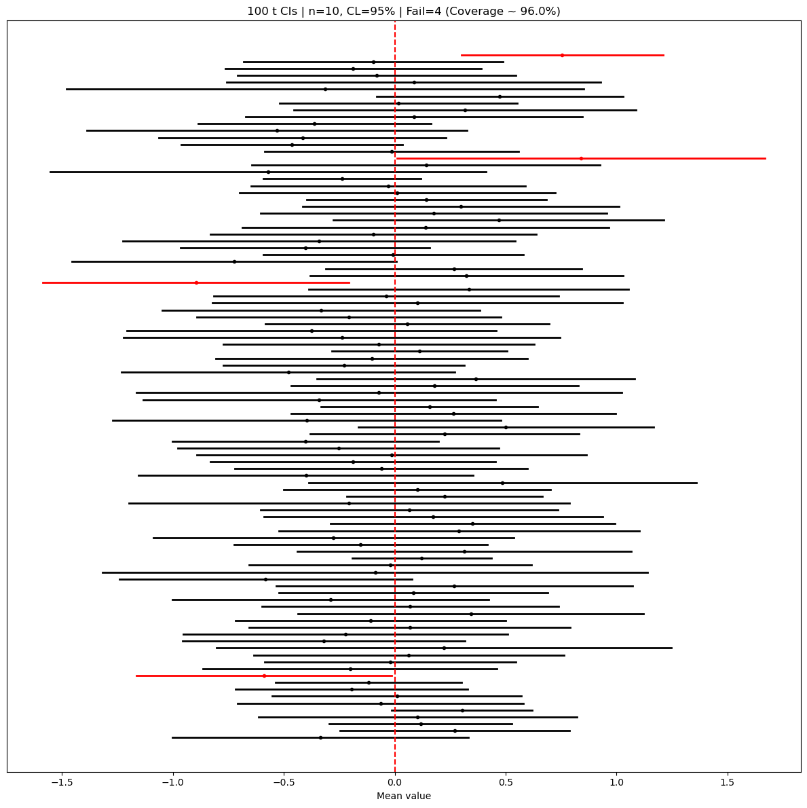

# 평균 신뢰구간의 포함확률 모의실험

## 개요

이 페이지에서는 모평균 $\mu$에 대한 일표본 신뢰구간의 포함 성질을 몬테카를로 모의실험으로 살펴본다. 세 가지 방법을 비교한다: $\sigma$를 아는 $z$-구간, 표본표준편차 $s$를 대입한 $z$-구간, 그리고 $t$-구간. 이 모의실험은 $\sigma$를 모를 때, 특히 표본이 작을 때 왜 $t$-구간이 올바른 기본값인지 보여준다.

## 세 가지 구간 방법

### 분산을 아는 z-구간

모표준편차 $\sigma$를 알 때 정확한 $(1-\alpha)100\%$ 신뢰구간은

$$
\bar{X} \pm z_{\alpha/2} \cdot \frac{\sigma}{\sqrt{n}}
$$

### s를 대입한 z-구간

교육에서 흔히 쓰는 변형은 $\sigma$를 표본표준편차 $s$로 바꾼 것이다:

$$
\bar{X} \pm z_{\alpha/2} \cdot \frac{s}{\sqrt{n}}
$$

이 구간은 $s$로 $\sigma$를 추정하며 생기는 추가 변동성을 무시하므로 작은 $n$에서 **포함확률이 부족하다**.

### t-구간 (실무의 기본)

$t$-구간은 $\sigma$의 추정을 반영한다:

$$
\bar{X} \pm t_{\alpha/2,\,n-1} \cdot \frac{s}{\sqrt{n}}
$$

유한한 $n$에서 $t_{\alpha/2,\,n-1} > z_{\alpha/2}$이므로 이 구간이 더 넓고 명목 포함확률을 달성한다.

## 유한모집단 수정

크기 $N$인 유한모집단에서 비복원으로 표본을 뽑을 때는 표준오차에 유한모집단 수정(FPC) 인자를 곱한다:

$$
\text{FPC} = \sqrt{\frac{N - n}{N - 1}}
$$

$n \le 0.10 N$이면 이 수정은 무시할 만하다.

<div class="codebox" markdown>

**예제 1.** 세 방법으로 만든 평균 신뢰구간

```python
import numpy as np
import matplotlib.pyplot as plt
from scipy.stats import norm, t

def finite_population_correction(n, N):
    """유한모집단 수정 인자. N을 주지 않으면 1.0(수정 없음)."""
    if N is None:
        return 1.0
    return float(np.sqrt((N - n) / (N - 1)))

def compute_intervals(xbar, s, n, alpha, method, sigma_known=None, N=None):
    """z_known, z_plugin, t 세 방법의 구간 끝점을 한꺼번에 계산한다.

    xbar와 s가 배열이면 구간도 배열로 나온다.
    모의실험에서 표본 만 개를 한 번에 처리하려고 이렇게 짰다.
    """
    fpc = finite_population_correction(n, N)
    if method == "z_known":
        z_star = norm.ppf(1 - alpha / 2)
        se = sigma_known / np.sqrt(n) * fpc
        moe = z_star * se
    elif method == "z_plugin":
        z_star = norm.ppf(1 - alpha / 2)
        se = (s / np.sqrt(n)) * fpc
        moe = z_star * se
    else:  # t
        df = n - 1
        t_star = t.ppf(1 - alpha / 2, df=df)
        se = (s / np.sqrt(n)) * fpc
        moe = t_star * se
    # z_plugin과 t의 차이는 임계값 한 자리뿐이다. 표준오차는 완전히 같다.
    return xbar - moe, xbar + moe

# 모의실험 설정. 그림으로 보기 좋게 100회만 돌린다.
# (포함확률을 정확히 재려면 아래 연습문제처럼 10,000회가 필요하다.)
rng = np.random.default_rng(42)
n_sim, n, mu, sigma, alpha = 100, 10, 0.0, 1.0, 0.05

# 행 하나가 표본 하나. axis=1로 요약하면 표본별 통계량이 한 번에 나온다.
X = rng.normal(loc=mu, scale=sigma, size=(n_sim, n))
xbar = X.mean(axis=1)
s = X.std(axis=1, ddof=1)

lower, upper = compute_intervals(xbar, s, n, alpha, method="t")
covered = (lower <= mu) & (mu <= upper)
coverage_pct = 100.0 * covered.mean()

print(f"t-interval coverage: {coverage_pct:.1f}%")
```

출력:

```
t-interval coverage: 96.0%
```

</div>

100회만 돌렸으므로 이 값 자체의 표준오차가 $\sqrt{0.95 \times 0.05/100} \approx 2.2$%p다. 96.0%는 95%와 구별되지 않는다.

### 구간의 시각화

<div class="codebox" markdown>

**예제 2.** 구간 100개를 한 그림에

```python
# 구간 하나를 가로선 하나로 그린다. 참값을 담은 구간은 검정, 놓친 구간은
# 빨강이다. 세로 점선이 참값이고, 빨간 선이 몇 개인지 세는 것이 곧 포함확률을
# 재는 일이다. 구간마다 길이가 다른 까닭은 표본마다 s 가 다르기 때문이다.
fig, ax = plt.subplots(figsize=(12, 12))
for i in range(n_sim):
    color = "k" if covered[i] else "r"
    ax.plot([lower[i], upper[i]], [i, i], lw=2, color=color)
    ax.plot(xbar[i], i, marker="o", ms=3, color=color)

ax.axvline(mu, linestyle="--", linewidth=1.5, color="r")
n_fail = int((~covered).sum())
ax.set_title(f"{n_sim} t CIs | n={n}, CL=95% | Fail={n_fail} (Coverage ~ {coverage_pct:.1f}%)")
ax.set_yticks([])
ax.set_xlabel("Mean value")
plt.tight_layout()
plt.show()
```

</div>



가로선 하나가 표본 하나의 신뢰구간이고 세로 점선이 참값 $\mu = 0$이다. 놓친 넷만 빨간색이다.

너비가 제각각인 것이 $t$-구간의 특징이다. 너비는 $s$에 비례하는데 $n = 10$에서 $s$는 표본마다 크게 흔들린다. 실패한 구간들을 보면 $\bar x$가 0에서 멀리 떨어져 있을 뿐 아니라 그 표본의 $s$가 그 거리를 덮을 만큼 크지 않았던 경우들이다.

## 해석

- **z-known**은 표준오차에 추정이 개입하지 않으므로 정확히 $(1-\alpha)100\%$의 포함확률을 달성한다.
- **z-plugin**은 $\sigma$ 자리에 $s$를 쓰면서도 정규 임계값을 유지하므로 작은 $n$에서 포함확률이 부족하다. $n < 15$에서 부족이 가장 두드러진다.
- **t-구간**은 꼬리가 더 두꺼운 $t_{n-1}$ 분포를 써서 $s$의 추가 불확실성을 보상한다. 모든 표본크기에서 경험적 포함확률이 명목 수준에 가깝게 유지된다.
- $n$이 크면 $t_{\alpha/2,\,n-1} \to z_{\alpha/2}$이고 $s \xrightarrow{P} \sigma$이므로 세 방법이 모두 수렴한다.

## 연습문제

<div class="drillbox" markdown>

**연습문제 1.** <span class="diff med" title="중간"></span> $n = 5$, $n_{\text{sim}} = 10{,}000$으로 모의실험을 돌려라. 95% 신뢰수준에서 세 방법 각각의 경험적 포함확률을 보고하라. 어느 방법(들)이 명목 수준을 달성하는가?

</div>

??? success "풀이"

    ```python
    rng = np.random.default_rng(0)
    n, n_sim, mu, sigma, alpha = 5, 10_000, 0.0, 1.0, 0.05
    X = rng.normal(mu, sigma, (n_sim, n))
    xbar = X.mean(axis=1)
    s = X.std(axis=1, ddof=1)

    for method in ["z_known", "z_plugin", "t"]:
        lo, hi = compute_intervals(xbar, s, n, alpha, method, sigma_known=sigma)
        cov = ((lo <= mu) & (mu <= hi)).mean()
        print(f"{method}: {100*cov:.1f}%")
    ```

    출력:

    ```
    z_known: 94.9%
    z_plugin: 87.8%
    t: 94.7%
    ```

    $z$-known과 $t$ 구간만 명목 95%를 달성한다(모의실험 오차 약 0.2%p). 대입한 $z$-구간은 87.8%로 7%p 넘게 부족하다.

    이 값은 우연이 아니라 정확히 계산할 수 있다. $(\bar X - \mu)/(s/\sqrt n) \sim t_4$이므로 대입한 $z$-구간의 포함확률은

    $$
    P(|t_4| \le 1.96) = 2 F_{t_4}(1.96) - 1 = 0.8784
    $$

    이고, 모의실험의 87.8%가 이 값을 재현한 것이다. $n = 5$에서 $s$의 변동이 워낙 커서 정규 임계값으로는 감당이 안 된다. $\square$

<div class="drillbox" markdown>

**연습문제 2.** <span class="diff med" title="중간"></span> 작은 $n$에서 대입한 $z$-구간의 포함확률이 부족한 이유를 수학적으로 설명하라. 구체적으로, $X_1, \ldots, X_n \overset{\text{iid}}{\sim} N(\mu, \sigma^2)$일 때 추축량 $(\bar{X} - \mu)/(s/\sqrt{n})$이 $N(0,1)$을 따르지 않음을 보여라.

</div>

??? success "풀이"

    정규성 아래에서 $\bar{X} \sim N(\mu, \sigma^2/n)$이고 $(n-1)s^2/\sigma^2 \sim \chi^2_{n-1}$이며 둘은 독립이다. 추축량

    $$
    T = \frac{\bar{X} - \mu}{s / \sqrt{n}} = \frac{(\bar{X} - \mu)/(\sigma/\sqrt{n})}{s/\sigma}
    = \frac{Z}{\sqrt{\chi^2_{n-1}/(n-1)}}
    $$

    에서 $Z \sim N(0,1)$이다. 정의에 의해 이 비는 $N(0,1)$이 아니라 $t_{n-1}$ 분포를 따른다. $t_{n-1}$은 $N(0,1)$보다 꼬리가 두꺼우므로, $t_{\alpha/2,\,n-1}$ 대신 $z_{\alpha/2}$를 쓰면 구간이 너무 좁아지고 포함확률이 $P(\mu \in \text{CI}) < 1 - \alpha$가 된다. $\square$

<div class="drillbox" markdown>

**연습문제 3.** <span class="diff med" title="중간"></span> $n$을 고정하고 $N \to \infty$일 때 유한모집단 수정 인자가 $\text{FPC} \to 1$을 만족함을 보여라.

</div>

??? success "풀이"

    $$
    \text{FPC} = \sqrt{\frac{N - n}{N - 1}} = \sqrt{\frac{1 - n/N}{1 - 1/N}}
    $$

    $n$을 고정하고 $N \to \infty$이면 $n/N \to 0$, $1/N \to 0$이므로

    $$
    \text{FPC} \to \sqrt{\frac{1 - 0}{1 - 0}} = 1
    $$

    따라서 무한(또는 아주 큰) 모집단에서는 이 수정이 아무 영향도 주지 않는다. $\square$

<div class="drillbox" markdown>

**연습문제 4.** <span class="diff med" title="중간"></span> 참 모집단이 정규가 아니라 비율 $\lambda = 1$인 지수분포(따라서 $\mu = 1$, $\sigma = 1$)라고 하자. $n = 10$, $n_{\text{sim}} = 10{,}000$으로 모의실험을 설계하여 $t$-구간이 여전히 약 95%의 포함확률을 달성하는지 확인하라.

</div>

??? success "풀이"

    ```python
    from scipy.stats import t as t_dist
    rng = np.random.default_rng(0)
    n, n_sim, mu, alpha = 10, 10_000, 1.0, 0.05
    covers = 0
    for _ in range(n_sim):
        sample = rng.exponential(scale=1.0, size=n)
        xbar = sample.mean()
        s = sample.std(ddof=1)
        t_crit = t_dist.ppf(1 - alpha / 2, df=n - 1)
        lo = xbar - t_crit * s / np.sqrt(n)
        hi = xbar + t_crit * s / np.sqrt(n)
        if lo <= mu <= hi:
            covers += 1
    print(f"Coverage: {100 * covers / n_sim:.1f}%")
    ```

    출력:

    ```
    Coverage: 89.9%
    ```

    95%에 한참 못 미친다. 지수분포는 오른쪽으로 크게 치우쳐 있어 $n = 10$에서는 중심극한정리 근사가 아직 멀었다. 같은 코드에서 $n$만 바꾸면 30일 때 92.2%, 100일 때 94.3%로 천천히 올라온다. 정규자료에서는 $n = 5$에서도 $t$-구간이 정확했다는 점과 대비된다. $t$-구간이 지켜 주는 것은 $\sigma$를 모른다는 사실이지 **정규성이 아니다**.

    실패가 양쪽에 고르게 퍼지지도 않는다. 같은 모의실험에서 실패 1009번 중 972번이 구간이 통째로 참값 **왼쪽**에 놓인 경우이고, 오른쪽은 37번뿐이다. 지수분포에서는 큰 값이 드물게 나오므로 대부분의 표본에서 $\bar x$가 참 평균을 밑돌고, 드물게 큰 값이 걸린 표본에서는 $s$까지 함께 커져 구간이 넓어지는 탓에 오른쪽 실패는 잘 생기지 않는다. 명목 95%를 "양쪽에 2.5%씩"이라고 읽으면 곤란한 상황이다. $\square$

<div class="drillbox" markdown>

**연습문제 5.** <span class="diff easy" title="쉬움"></span> 한 품질검사자가 $N = 400$개 생산분에서 부품 $n = 50$개를 뽑는다. FPC 인자를 계산하고 평균 부품 무게에 대한 신뢰구간 너비에 미치는 실질적 영향을 설명하라.

</div>

??? success "풀이"

    $$
    \text{FPC} = \sqrt{\frac{400 - 50}{400 - 1}} = \sqrt{\frac{350}{399}} = \sqrt{0.8772} \approx 0.9366
    $$

    표준오차에 0.9366이 곱해져 약 6.3% 줄어든다. 400개 중 50개(12.5%)를 뽑으면 모집단의 무시할 수 없는 부분을 소진하므로, 복원 단순확률표본추출이 시사하는 것보다 남은 단위에 대한 불확실성이 작아져 신뢰구간이 좁아진다. $n/N = 0.125 > 0.10$이므로 여기서는 FPC를 무시하면 안 된다. $\square$

---

## 정리하며

세 방법의 포함확률을 직접 재어 보면 **$t$ 구간이 기본값이어야 하는 이유**가 드러난다.

| 방법 | $\sigma$ 를 아는가 | 소표본 포함확률 |
|---|---|---|
| $z$ 구간($\sigma$ 기지) | 예 | 명목값 달성 |
| $z$ 구간에 $s$ 대입 | 아니오 | **명목값 미달** |
| $t$ 구간 | 아니오 | 명목값 달성 |

- **$\sigma$ 를 $s$ 로 바꾸면서 $z$ 임계값을 그대로 쓰는 것이 잘못이다.** $s$ 가 흔들리는 만큼 구간이 좁아져 참값을 놓치는 비율이 늘어난다. $t$ 임계값이 그 추가 불확실성을 폭으로 보상해 준다.
- **$n$ 이 커지면 셋이 수렴한다.** $t_{n-1}\to z$ 이므로 $n\ge30$ 쯤부터 차이가 실무적으로 사라진다. **소표본에서만 갈린다.**
- **모의실험이 이 장의 검증 방법이다.** 참값을 알고 있는 상태에서 구간을 수만 번 만들어 몇 개가 덮는지 세면, 공식이 약속한 포함확률이 실제로 달성되는지 확인할 수 있다.

다음 절 **비율 신뢰구간의 포함확률 모의실험**으로 넘어간다. 거기서는 왈드 구간이 왜 문제인지가 수치로 드러난다.
