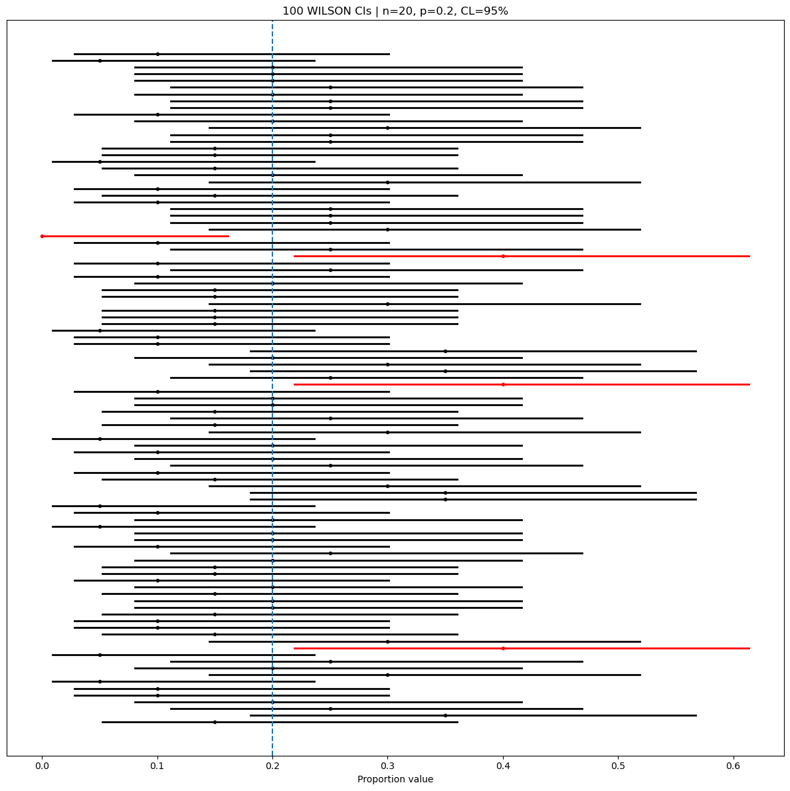

# 비율 신뢰구간의 포함확률 모의실험

## 개요

이 페이지에서는 모비율 $p$의 신뢰구간을 만드는 네 가지 방법 — Wald, Wilson score, Agresti–Coull, Clopper–Pearson(정확) 구간 — 의 포함 성능을 살펴본다. 몬테카를로 모의실험으로 Bernoulli 표본을 반복 생성하고 각 방법으로 신뢰구간을 만든 뒤 그 구간이 참 $p$를 잡아내는지 기록한다. 그 결과는 $n$이 작거나 $p$가 극단적일 때 Wald 구간을 믿을 수 없는 이유를 부각한다.

## 네 가지 구간 방법

### Wald 구간

$$
\hat{p} \pm z_{\alpha/2} \sqrt{\frac{\hat{p}(1-\hat{p})}{n}}
$$

단순하지만 $n$이 작거나 $p$가 0이나 1에 가까우면 포함확률이 심하게 부족할 수 있다.

### Wilson score 구간

$$
\frac{\hat{p} + \frac{z^2}{2n}}{1 + \frac{z^2}{n}}
\;\pm\;
\frac{z}{1 + \frac{z^2}{n}}
\sqrt{\frac{\hat{p}(1-\hat{p})}{n} + \frac{z^2}{4n^2}}
$$

중심을 $\hat{p}$에서 옮겨 놓으며 중간 크기의 $n$에서도 좋은 포함확률을 준다. 권장되는 기본값이다.

### Agresti–Coull 구간

가상의 성공 $z^2/2$개와 가상의 실패 $z^2/2$개를 더해 보정된 개수를 만든다:

$$
\tilde{n} = n + z^2, \quad \tilde{p} = \frac{k + z^2/2}{\tilde{n}}
$$

그다음 $(\tilde{p}, \tilde{n})$에 Wald 공식을 적용한다:

$$
\tilde{p} \pm z_{\alpha/2} \sqrt{\frac{\tilde{p}(1-\tilde{p})}{\tilde{n}}}
$$

포함확률이 Wilson과 매우 가깝고 계산은 더 간단하다.

### Clopper–Pearson (정확) 구간

Beta 분위수를 써서 이항검정을 뒤집는다:

$$
\left(\text{Beta}\!\left(\frac{\alpha}{2};\; k,\; n-k+1\right),\;\;
      \text{Beta}\!\left(1-\frac{\alpha}{2};\; k+1,\; n-k\right)\right)
$$

보수적이다: 실제 포함확률이 적어도 $(1-\alpha)100\%$이지만 구간이 넓어지는 경향이 있다.

## Python 코드

```python
import numpy as np
import matplotlib.pyplot as plt
from scipy.stats import norm, beta

np.random.seed(42)          # 아래 출력과 그림을 재현하려면 고정한다

n_simulations = 100
n = 20
p_true = 0.20
alpha = 0.05
method = "wilson"  # 'wald' | 'wilson' | 'ac' | 'cp'

# 표본을 만들 필요가 없다. 필요한 것은 성공 횟수 k 하나뿐이므로
# 0/1을 n개 뽑는 대신 이항분포에서 k를 바로 뽑는다.
k = np.random.binomial(n=n, p=p_true, size=n_simulations)
phat = k / n
z = norm.ppf(1 - alpha / 2)

lower = np.empty(n_simulations)
upper = np.empty(n_simulations)

for i, ki in enumerate(k):
    p = ki / n
    if method == "wald":
        se = np.sqrt(p * (1 - p) / n)
        lo, hi = p - z * se, p + z * se
    elif method == "wilson":
        denom = 1 + z**2 / n
        center = (p + z**2 / (2 * n)) / denom
        half = z * np.sqrt(p * (1 - p) / n + z**2 / (4 * n**2)) / denom
        lo, hi = center - half, center + half
    elif method == "ac":
        n_tilde = n + z**2
        p_tilde = (ki + 0.5 * z**2) / n_tilde
        se_tilde = np.sqrt(p_tilde * (1 - p_tilde) / n_tilde)
        lo, hi = p_tilde - z * se_tilde, p_tilde + z * se_tilde
    else:  # cp
        lo = 0.0 if ki == 0 else beta.ppf(alpha / 2, ki, n - ki + 1)
        hi = 1.0 if ki == n else beta.ppf(1 - alpha / 2, ki + 1, n - ki)

    lower[i] = max(0.0, lo)
    upper[i] = min(1.0, hi)

covered = (lower <= p_true) & (p_true <= upper)
coverage_pct = 100.0 * covered.mean()
print(f"{method} coverage: {coverage_pct:.1f}%")
```

출력:

```
wilson coverage: 96.0%
```

같은 자료(같은 시드)에 `method`만 바꿔 세어 보면 Wald 91.0%, Agresti–Coull 96.0%, Clopper–Pearson 99.0%가 된다. Wald만 명목값 아래로 내려가고, Clopper–Pearson은 보수적인 만큼 위로 넘친다.

### 구간의 시각화

```python
fig, ax = plt.subplots(figsize=(12, 12))
for i in range(n_simulations):
    color = "k" if covered[i] else "r"
    ax.plot([lower[i], upper[i]], [i, i], lw=2, color=color)
    ax.plot(phat[i], i, marker="o", ms=3, color=color)

ax.axvline(p_true, linestyle="--", linewidth=1.5)
ax.set_title(f"{n_simulations} {method.upper()} CIs | n={n}, p={p_true}, CL=95%")
ax.set_yticks([])
ax.set_xlabel("Proportion value")
plt.tight_layout()
plt.show()
```



구간이 몇 가지 위치에만 나타나는 것은 $k$가 정수여서 $\hat p$가 $0, 0.05, 0.10, \ldots$ 스물한 가지 값밖에 갖지 못하기 때문이다. 같은 $k$가 나온 표본들은 완전히 같은 구간을 만든다.

Wald가 91%로 떨어지는 이유는 $k$별로 따져 보면 분명하다. 이 100개 표본 중 $k = 1$인 것이 8개인데, 그 경우 Wald 구간은 $(0, 0.146)$으로 참값 0.2에 닿지 못한다. 반면 Wilson 구간은 중심이 0.5 쪽으로 당겨져 $(0.009, 0.236)$이 되어 참값을 담는다. 여기에 $k = 0$인 표본 하나를 더해 Wald는 9번 실패한다. $k = 0$에서는 Wald 구간이 $\hat p = 0$ 때문에 표준오차가 0이 되어 점 하나로 무너진다.

Wilson의 실패 4번은 $k = 0$ 하나와 $k = 8$ 셋이다. 즉 두 방법의 차이는 "$\hat p$가 작은 쪽에서 구간이 0 쪽으로 쏠리는가"에서 갈린다.

## 해석

- **Wald** 구간은 $n$이 작거나 $p$가 경계 0 또는 1에 가까우면 포함확률이 극적으로 낮아질 수 있다. 흔한 경험칙은 $n\hat{p} \ge 10$이고 $n(1-\hat{p}) \ge 10$일 것을 요구하지만 이것만으로 늘 충분하지는 않다.
- **Wilson**과 **Agresti–Coull** 구간은 중심을 $1/2$ 쪽으로 옮기고 구간을 약간 넓혀, 넓은 범위의 $n$과 $p$에서 훨씬 믿을 만한 포함확률을 준다.
- **Clopper–Pearson**은 구성상 적어도 명목 포함확률을 보장하지만 (필요보다 넓게) 보수적이며 특히 $n$이 작을 때 그렇다.
- 크기 $N$인 유한모집단에서 비복원으로 표본을 뽑을 때 이항 모형은 $n \le 0.10 N$일 때 타당한 근사이다. 표본추출 비율이 더 크면 초기하분포에 기반한 구간이 더 적절하다.

## 연습문제

**연습문제 1.** $n = 20$, $p_{\text{true}} = 0.05$, $n_{\text{sim}} = 10{,}000$으로 Wald 구간의 모의실험을 돌려라. 경험적 포함확률을 보고하고 95%에서 벗어나는 이유를 설명하라.

??? success "풀이"

    $p_{\text{true}} = 0.05$, $n = 20$이면 $np = 1.0$으로 경험칙 $np \ge 10$을 크게 위반한다. 모의실험을 돌리면 포함확률이 약 **64%**로 나온다.

    이 경우는 모의실험 없이 정확히 계산할 수도 있다. $k$가 취할 수 있는 값이 21가지뿐이므로 각 $k$에 대해 구간이 0.05를 담는지 확인하고 이항확률로 가중하면 된다.

    ```python
    import numpy as np
    from scipy.stats import norm, binom

    n, p, alpha = 20, 0.05, 0.05
    z = norm.ppf(1 - alpha / 2)
    coverage = 0.0
    for k in range(n + 1):
        phat = k / n
        se = np.sqrt(phat * (1 - phat) / n)
        lo, hi = max(0.0, phat - z * se), min(1.0, phat + z * se)
        if lo <= p <= hi:
            coverage += binom.pmf(k, n, p)
    print(f"exact Wald coverage: {100 * coverage:.1f}%")
    ```

    출력:

    ```
    exact Wald coverage: 63.9%
    ```

    실패는 거의 전부 $k = 0$에서 온다. $P(k = 0) = 0.95^{20} = 0.358$인데, 이때 $\hat p = 0$이라 표준오차가 0이 되어 구간이 $[0, 0]$ 한 점으로 무너진다. 세 번에 한 번 이상 "불량률은 정확히 0이다"라고 말하는 셈이다. $1 - 0.358 = 0.642$가 위에서 얻은 0.639와 거의 같다는 점이 이를 확인해 준다.

    Wilson이나 Clopper–Pearson으로 바꾸면 $k = 0$일 때도 위쪽으로 폭이 있는 구간이 나오므로 이 실패 방식이 사라진다. $\square$

---

**연습문제 2.** $Z = (\hat{p} - p)/\sqrt{p(1-p)/n}$일 때 부등식 $|Z| \le z_{\alpha/2}$에서 출발하여 Wilson score 구간을 유도하라.

??? success "풀이"

    검정 뒤집기 방식은 다음을 만족하는 모든 $p$를 구한다:

    $$
    \left|\frac{\hat{p} - p}{\sqrt{p(1-p)/n}}\right| \le z_{\alpha/2}
    $$

    양변을 제곱하면:

    $$
    \frac{(\hat{p} - p)^2}{p(1-p)/n} \le z^2
    $$

    $$
    n(\hat{p} - p)^2 \le z^2 p(1-p)
    $$

    전개하고 $p$에 대해 정리하면:

    $$
    n\hat{p}^2 - 2n\hat{p}\,p + np^2 \le z^2 p - z^2 p^2
    $$

    $$
    (n + z^2)p^2 - (2n\hat{p} + z^2)p + n\hat{p}^2 \le 0
    $$

    $p$에 대한 이차식이다. 근의 공식을 적용하면

    $$
    p = \frac{2n\hat{p} + z^2 \pm \sqrt{z^4 + 4n z^2 \hat{p}(1-\hat{p})}}{2(n + z^2)}
    $$

    이며 이것이 정리되어 Wilson 구간의 끝점이 된다. $\square$

---

**연습문제 3.** 95% 수준의 Agresti–Coull 구간이 자료에 가상의 성공 약 2개와 가상의 실패 약 2개를 더하는 것임을 보여라.

??? success "풀이"

    95% 신뢰수준에서 $\alpha = 0.05$이고 $z_{\alpha/2} = z_{0.025} \approx 1.96$이다. Agresti–Coull 방법은 가상의 성공 $z^2/2$개와 가상의 실패 $z^2/2$개를 더하므로 관측값이 모두 $z^2$개 늘어난다. 계산하면:

    $$
    \frac{z^2}{2} = \frac{(1.96)^2}{2} = \frac{3.8416}{2} \approx 1.92
    $$

    따라서 가상의 성공과 실패를 각각 약 2개씩 더하는 셈이고, 보정된 표본크기는 $\tilde{n} = n + z^2 \approx n + 4$이다. 이 "성공 2개와 실패 2개를 더하기" 규칙 때문에 Agresti–Coull 방법을 "plus-four" 구간이라고 부르기도 한다. $\square$

---

**연습문제 4.** 어떤 의학 연구에서 환자 200명 중 3명에게 이상반응이 관찰되었다. Wald, Wilson, Clopper–Pearson 95% 구간을 계산하고 차이를 논하라.

??? success "풀이"

    여기서 $k = 3$, $n = 200$, $\hat{p} = 0.015$, $z = 1.96$이다.

    **Wald:** $\text{SE} = \sqrt{0.015 \times 0.985 / 200} = 0.00860$. 신뢰구간: $0.015 \pm 1.96 \times 0.00860 = (-0.0019, 0.0319)$. $(0, 0.0319)$로 잘린다.

    **Wilson:** 중심: $(0.015 + 3.8416/400)/(1 + 3.8416/200) = 0.02461/1.01921 \approx 0.02414$. 반너비 $\approx 0.01903$. 신뢰구간 $\approx (0.0051, 0.0432)$.

    **Clopper–Pearson:** 하한 $= \text{Beta}(0.025;\, 3,\, 198) \approx 0.00311$. 상한 $= \text{Beta}(0.975;\, 4,\, 197) \approx 0.0433$. 신뢰구간 $\approx (0.0031, 0.0433)$.

    Wald 구간은 (비율에서는 불가능한) 음수를 포함하며 더 좁다. Wilson과 Clopper–Pearson은 서로 비슷하고 더 합리적인 구간을 준다. Clopper–Pearson의 하한이 약간 더 작은데, 이는 그 보수성을 반영한다. $\square$

---

**연습문제 5.** Clopper–Pearson 구간의 포함확률이 모든 $p \in (0,1)$에서 적어도 $(1-\alpha)$임을 증명하라.

??? success "풀이"

    Clopper–Pearson 구간 $[L(k), U(k)]$은 두 개의 단측 이항검정을 뒤집어 정의한다. 구체적으로 $L(k)$는 다음을 만족하는 $p$이다:

    $$
    P(X \ge k \mid p = L(k)) = \alpha/2, \quad X \sim \text{Binomial}(n, p)
    $$

    그리고 $U(k)$는 다음을 만족하는 $p$이다:

    $$
    P(X \le k \mid p = U(k)) = \alpha/2
    $$

    임의의 참 $p$에 대해 사건 $p \notin [L(K), U(K)]$은 $p < L(K)$이거나 $p > U(K)$임을 뜻한다. 구성상 $p < L(K)$는 주어진 $p$에 비해 $K$가 "너무 크다"는 뜻이고 이 꼬리 확률은 최대 $\alpha/2$이다. 마찬가지로 $p > U(K)$는 $K$가 "너무 작다"는 뜻이며 꼬리 확률이 최대 $\alpha/2$이다. 이항 누적분포함수가 계단함수이므로 어떤 $p$에서는 꼬리 확률이 $\alpha/2$보다 엄격히 작을 수 있지만 결코 크지는 않다. 따라서

    $$
    P(p \notin [L(K), U(K)]) \le \frac{\alpha}{2} + \frac{\alpha}{2} = \alpha
    $$

    이고 모든 $p \in (0,1)$에서 포함확률 $P(p \in [L(K), U(K)]) \ge 1 - \alpha$이다. $\square$
